<!-- markdownlint-capture -->
<!-- markdownlint-disable -->

# Code Metrics

This file is dynamically maintained by a bot, *please do not* edit this by hand. It represents various [code metrics](https://aka.ms/dotnet/code-metrics), such as cyclomatic complexity, maintainability index, and so on.

<div id='alsa'></div>

## Alsa :heavy_check_mark:

The *Alsa.csproj* project file contains:

- 2 namespaces.
- 12 named types.
- 994 total lines of source code.
- Approximately 338 lines of executable code.
- The highest cyclomatic complexity is 2 :heavy_check_mark:.

<details>
<summary>
  <strong id="global+namespace">
    &lt;global namespace&gt; :heavy_check_mark:
  </strong>
</summary>
<br>

The `<global namespace>` namespace contains 8 named types.

- 8 named types.
- 295 total lines of source code.
- Approximately 118 lines of executable code.
- The highest cyclomatic complexity is 1 :heavy_check_mark:.

<details>
<summary>
  <strong id="fileopenflags">
    FileOpenFlags :heavy_check_mark:
  </strong>
</summary>
<br>

- The `FileOpenFlags` contains 4 members.
- 7 total lines of source code.
- Approximately 2 lines of executable code.
- The highest cyclomatic complexity is 0 :heavy_check_mark:.

| Member kind | Line number | Maintainability index | Cyclomatic complexity | Depth of inheritance | Class coupling | Lines of source / executable code |
| :-: | :-: | :-: | :-: | :-: | :-: | :-: |
| Field | <a href='https://github.com/thesilvercraft/SilverAudioPlayer/blob/master/Alsa/Interop/Unix/Libc/Interop.open.cs#L17' title='FileOpenFlags.O_NONBLOCK'>17</a> | 93 | 0 :heavy_check_mark: | 0 | 0 | 1 / 1 |
| Field | <a href='https://github.com/thesilvercraft/SilverAudioPlayer/blob/master/Alsa/Interop/Unix/Libc/Interop.open.cs#L15' title='FileOpenFlags.O_RDONLY'>15</a> | 93 | 0 :heavy_check_mark: | 0 | 0 | 1 / 1 |
| Field | <a href='https://github.com/thesilvercraft/SilverAudioPlayer/blob/master/Alsa/Interop/Unix/Libc/Interop.open.cs#L16' title='FileOpenFlags.O_RDWR'>16</a> | 93 | 0 :heavy_check_mark: | 0 | 0 | 1 / 1 |
| Field | <a href='https://github.com/thesilvercraft/SilverAudioPlayer/blob/master/Alsa/Interop/Unix/Libc/Interop.open.cs#L18' title='FileOpenFlags.O_SYNC'>18</a> | 93 | 0 :heavy_check_mark: | 0 | 0 | 1 / 1 |

<a href="#FileOpenFlags-class-diagram">:link: to `FileOpenFlags` class diagram</a>

<a href="#global+namespace">:top: back to &lt;global namespace&gt;</a>

</details>

<details>
<summary>
  <strong id="interop">
    Interop :heavy_check_mark:
  </strong>
</summary>
<br>

- The `Interop` contains 53 members.
- 187 total lines of source code.
- Approximately 104 lines of executable code.
- The highest cyclomatic complexity is 1 :heavy_check_mark:.

| Member kind | Line number | Maintainability index | Cyclomatic complexity | Depth of inheritance | Class coupling | Lines of source / executable code |
| :-: | :-: | :-: | :-: | :-: | :-: | :-: |
| Field | <a href='https://github.com/thesilvercraft/SilverAudioPlayer/blob/master/Alsa/Interop/Unix/Interop.Libraries.cs#L9' title='string Interop.AlsaLibrary'>9</a> | 93 | 0 :heavy_check_mark: | 0 | 0 | 1 / 1 |
| Method | <a href='https://github.com/thesilvercraft/SilverAudioPlayer/blob/master/Alsa/Interop/Unix/Libc/Interop.close.cs#L10' title='int Interop.close(int fd)'>10</a> | 93 | 1 :heavy_check_mark: | 0 | 1 | 2 / 2 |
| Method | <a href='https://github.com/thesilvercraft/SilverAudioPlayer/blob/master/Alsa/Interop/Unix/Libc/Interop.ioctl.cs#L11' title='int Interop.ioctl(int fd, uint request, IntPtr argp)'>11</a> | 87 | 1 :heavy_check_mark: | 0 | 3 | 2 / 2 |
| Method | <a href='https://github.com/thesilvercraft/SilverAudioPlayer/blob/master/Alsa/Interop/Unix/Libc/Interop.ioctl.cs#L14' title='int Interop.ioctl(int fd, int request, IntPtr argp)'>14</a> | 87 | 1 :heavy_check_mark: | 0 | 3 | 2 / 2 |
| Method | <a href='https://github.com/thesilvercraft/SilverAudioPlayer/blob/master/Alsa/Interop/Unix/Libc/Interop.ioctl.cs#L17' title='int Interop.ioctl(int fd, uint request, ulong argp)'>17</a> | 87 | 1 :heavy_check_mark: | 0 | 2 | 2 / 2 |
| Field | <a href='https://github.com/thesilvercraft/SilverAudioPlayer/blob/master/Alsa/Interop/Unix/Interop.Libraries.cs#L7' title='string Interop.LibcLibrary'>7</a> | 93 | 0 :heavy_check_mark: | 0 | 0 | 1 / 1 |
| Method | <a href='https://github.com/thesilvercraft/SilverAudioPlayer/blob/master/Alsa/Interop/Unix/Libc/Interop.mmap.cs#L11' title='IntPtr Interop.mmap(IntPtr addr, int length, MemoryMappedProtections prot, MemoryMappedFlags flags, int fd, int offset)'>11</a> | 87 | 1 :heavy_check_mark: | 0 | 5 | 2 / 2 |
| Method | <a href='https://github.com/thesilvercraft/SilverAudioPlayer/blob/master/Alsa/Interop/Unix/Libc/Interop.munmap.cs#L11' title='int Interop.munmap(IntPtr addr, int length)'>11</a> | 93 | 1 :heavy_check_mark: | 0 | 2 | 2 / 2 |
| Method | <a href='https://github.com/thesilvercraft/SilverAudioPlayer/blob/master/Alsa/Interop/Unix/Libc/Interop.open.cs#L10' title='int Interop.open(string pathname, FileOpenFlags flags)'>10</a> | 87 | 1 :heavy_check_mark: | 0 | 4 | 2 / 2 |
| Method | <a href='https://github.com/thesilvercraft/SilverAudioPlayer/blob/master/Alsa/Interop/Unix/Libc/Interop.read.cs#L11' title='int Interop.read(int fd, IntPtr buf, int count)'>11</a> | 87 | 1 :heavy_check_mark: | 0 | 3 | 2 / 2 |
| Method | <a href='https://github.com/thesilvercraft/SilverAudioPlayer/blob/master/Alsa/Interop/Unix/Alsa/Interop.alsa.cs#L85' title='int Interop.snd_mixer_attach(IntPtr mixer, string name)'>85</a> | 93 | 1 :heavy_check_mark: | 0 | 2 | 2 / 2 |
| Method | <a href='https://github.com/thesilvercraft/SilverAudioPlayer/blob/master/Alsa/Interop/Unix/Alsa/Interop.alsa.cs#L82' title='int Interop.snd_mixer_close(IntPtr mixer)'>82</a> | 93 | 1 :heavy_check_mark: | 0 | 2 | 2 / 2 |
| Method | <a href='https://github.com/thesilvercraft/SilverAudioPlayer/blob/master/Alsa/Interop/Unix/Alsa/Interop.alsa.cs#L98' title='IntPtr Interop.snd_mixer_elem_next(IntPtr elem)'>98</a> | 93 | 1 :heavy_check_mark: | 0 | 2 | 2 / 2 |
| Method | <a href='https://github.com/thesilvercraft/SilverAudioPlayer/blob/master/Alsa/Interop/Unix/Alsa/Interop.alsa.cs#L95' title='IntPtr Interop.snd_mixer_first_elem(IntPtr mixer)'>95</a> | 93 | 1 :heavy_check_mark: | 0 | 2 | 3 / 2 |
| Method | <a href='https://github.com/thesilvercraft/SilverAudioPlayer/blob/master/Alsa/Interop/Unix/Alsa/Interop.alsa.cs#L88' title='int Interop.snd_mixer_load(IntPtr mixer)'>88</a> | 93 | 1 :heavy_check_mark: | 0 | 2 | 2 / 2 |
| Method | <a href='https://github.com/thesilvercraft/SilverAudioPlayer/blob/master/Alsa/Interop/Unix/Alsa/Interop.alsa.cs#L79' title='int Interop.snd_mixer_open(ref IntPtr mixer, int mode)'>79</a> | 93 | 1 :heavy_check_mark: | 0 | 2 | 3 / 2 |
| Method | <a href='https://github.com/thesilvercraft/SilverAudioPlayer/blob/master/Alsa/Interop/Unix/Alsa/Interop.alsa.cs#L127' title='int Interop.snd_mixer_selem_get_capture_volume(IntPtr elem, snd_mixer_selem_channel_id channel, long* value)'>127</a> | 93 | 1 :heavy_check_mark: | 0 | 3 | 2 / 2 |
| Method | <a href='https://github.com/thesilvercraft/SilverAudioPlayer/blob/master/Alsa/Interop/Unix/Alsa/Interop.alsa.cs#L139' title='int Interop.snd_mixer_selem_get_capture_volume_range(IntPtr elem, long* min, long* max)'>139</a> | 93 | 1 :heavy_check_mark: | 0 | 2 | 2 / 2 |
| Method | <a href='https://github.com/thesilvercraft/SilverAudioPlayer/blob/master/Alsa/Interop/Unix/Alsa/Interop.alsa.cs#L102' title='string Interop.snd_mixer_selem_get_name(IntPtr elem)'>102</a> | 93 | 1 :heavy_check_mark: | 0 | 2 | 3 / 2 |
| Method | <a href='https://github.com/thesilvercraft/SilverAudioPlayer/blob/master/Alsa/Interop/Unix/Alsa/Interop.alsa.cs#L109' title='int Interop.snd_mixer_selem_get_playback_volume(IntPtr elem, snd_mixer_selem_channel_id channel, long* value)'>109</a> | 93 | 1 :heavy_check_mark: | 0 | 3 | 3 / 2 |
| Method | <a href='https://github.com/thesilvercraft/SilverAudioPlayer/blob/master/Alsa/Interop/Unix/Alsa/Interop.alsa.cs#L121' title='int Interop.snd_mixer_selem_get_playback_volume_range(IntPtr elem, long* min, long* max)'>121</a> | 93 | 1 :heavy_check_mark: | 0 | 2 | 2 / 2 |
| Method | <a href='https://github.com/thesilvercraft/SilverAudioPlayer/blob/master/Alsa/Interop/Unix/Alsa/Interop.alsa.cs#L105' title='void Interop.snd_mixer_selem_id_alloca(IntPtr ptr)'>105</a> | 93 | 1 :heavy_check_mark: | 0 | 2 | 2 / 2 |
| Method | <a href='https://github.com/thesilvercraft/SilverAudioPlayer/blob/master/Alsa/Interop/Unix/Alsa/Interop.alsa.cs#L91' title='int Interop.snd_mixer_selem_register(IntPtr mixer, IntPtr options, IntPtr classp)'>91</a> | 93 | 1 :heavy_check_mark: | 0 | 2 | 2 / 2 |
| Method | <a href='https://github.com/thesilvercraft/SilverAudioPlayer/blob/master/Alsa/Interop/Unix/Alsa/Interop.alsa.cs#L136' title='int Interop.snd_mixer_selem_set_capture_switch_all(IntPtr elem, int value)'>136</a> | 93 | 1 :heavy_check_mark: | 0 | 2 | 2 / 2 |
| Method | <a href='https://github.com/thesilvercraft/SilverAudioPlayer/blob/master/Alsa/Interop/Unix/Alsa/Interop.alsa.cs#L130' title='int Interop.snd_mixer_selem_set_capture_volume(IntPtr elem, snd_mixer_selem_channel_id channel, long value)'>130</a> | 93 | 1 :heavy_check_mark: | 0 | 3 | 2 / 2 |
| Method | <a href='https://github.com/thesilvercraft/SilverAudioPlayer/blob/master/Alsa/Interop/Unix/Alsa/Interop.alsa.cs#L133' title='int Interop.snd_mixer_selem_set_capture_volume_all(IntPtr elem, long value)'>133</a> | 93 | 1 :heavy_check_mark: | 0 | 2 | 2 / 2 |
| Method | <a href='https://github.com/thesilvercraft/SilverAudioPlayer/blob/master/Alsa/Interop/Unix/Alsa/Interop.alsa.cs#L142' title='int Interop.snd_mixer_selem_set_capture_volume_range(IntPtr elem, long min, long max)'>142</a> | 93 | 1 :heavy_check_mark: | 0 | 2 | 2 / 2 |
| Method | <a href='https://github.com/thesilvercraft/SilverAudioPlayer/blob/master/Alsa/Interop/Unix/Alsa/Interop.alsa.cs#L118' title='int Interop.snd_mixer_selem_set_playback_switch_all(IntPtr elem, int value)'>118</a> | 93 | 1 :heavy_check_mark: | 0 | 2 | 2 / 2 |
| Method | <a href='https://github.com/thesilvercraft/SilverAudioPlayer/blob/master/Alsa/Interop/Unix/Alsa/Interop.alsa.cs#L112' title='int Interop.snd_mixer_selem_set_playback_volume(IntPtr elem, snd_mixer_selem_channel_id channel, long value)'>112</a> | 93 | 1 :heavy_check_mark: | 0 | 3 | 2 / 2 |
| Method | <a href='https://github.com/thesilvercraft/SilverAudioPlayer/blob/master/Alsa/Interop/Unix/Alsa/Interop.alsa.cs#L115' title='int Interop.snd_mixer_selem_set_playback_volume_all(IntPtr elem, long value)'>115</a> | 93 | 1 :heavy_check_mark: | 0 | 2 | 2 / 2 |
| Method | <a href='https://github.com/thesilvercraft/SilverAudioPlayer/blob/master/Alsa/Interop/Unix/Alsa/Interop.alsa.cs#L124' title='int Interop.snd_mixer_selem_set_playback_volume_range(IntPtr elem, long min, long max)'>124</a> | 93 | 1 :heavy_check_mark: | 0 | 2 | 2 / 2 |
| Method | <a href='https://github.com/thesilvercraft/SilverAudioPlayer/blob/master/Alsa/Interop/Unix/Alsa/Interop.alsa.cs#L33' title='int Interop.snd_pcm_close(IntPtr pcm)'>33</a> | 93 | 1 :heavy_check_mark: | 0 | 2 | 2 / 2 |
| Method | <a href='https://github.com/thesilvercraft/SilverAudioPlayer/blob/master/Alsa/Interop/Unix/Alsa/Interop.alsa.cs#L27' title='int Interop.snd_pcm_drain(IntPtr pcm)'>27</a> | 93 | 1 :heavy_check_mark: | 0 | 2 | 2 / 2 |
| Method | <a href='https://github.com/thesilvercraft/SilverAudioPlayer/blob/master/Alsa/Interop/Unix/Alsa/Interop.alsa.cs#L30' title='int Interop.snd_pcm_drop(IntPtr pcm)'>30</a> | 93 | 1 :heavy_check_mark: | 0 | 2 | 2 / 2 |
| Method | <a href='https://github.com/thesilvercraft/SilverAudioPlayer/blob/master/Alsa/Interop/Unix/Alsa/Interop.alsa.cs#L68' title='int Interop.snd_pcm_hw_params(IntPtr pcm, IntPtr @params)'>68</a> | 93 | 1 :heavy_check_mark: | 0 | 2 | 2 / 2 |
| Method | <a href='https://github.com/thesilvercraft/SilverAudioPlayer/blob/master/Alsa/Interop/Unix/Alsa/Interop.alsa.cs#L52' title='int Interop.snd_pcm_hw_params_any(IntPtr pcm, IntPtr @params)'>52</a> | 93 | 1 :heavy_check_mark: | 0 | 2 | 2 / 2 |
| Method | <a href='https://github.com/thesilvercraft/SilverAudioPlayer/blob/master/Alsa/Interop/Unix/Alsa/Interop.alsa.cs#L72' title='int Interop.snd_pcm_hw_params_get_period_size(IntPtr @params, ulong* frames, int* dir)'>72</a> | 93 | 1 :heavy_check_mark: | 0 | 2 | 3 / 2 |
| Method | <a href='https://github.com/thesilvercraft/SilverAudioPlayer/blob/master/Alsa/Interop/Unix/Alsa/Interop.alsa.cs#L49' title='int Interop.snd_pcm_hw_params_malloc(ref IntPtr @params)'>49</a> | 93 | 1 :heavy_check_mark: | 0 | 2 | 3 / 2 |
| Method | <a href='https://github.com/thesilvercraft/SilverAudioPlayer/blob/master/Alsa/Interop/Unix/Alsa/Interop.alsa.cs#L55' title='int Interop.snd_pcm_hw_params_set_access(IntPtr pcm, IntPtr @params, snd_pcm_access_t access)'>55</a> | 93 | 1 :heavy_check_mark: | 0 | 3 | 2 / 2 |
| Method | <a href='https://github.com/thesilvercraft/SilverAudioPlayer/blob/master/Alsa/Interop/Unix/Alsa/Interop.alsa.cs#L62' title='int Interop.snd_pcm_hw_params_set_channels(IntPtr pcm, IntPtr @params, uint val)'>62</a> | 93 | 1 :heavy_check_mark: | 0 | 2 | 3 / 2 |
| Method | <a href='https://github.com/thesilvercraft/SilverAudioPlayer/blob/master/Alsa/Interop/Unix/Alsa/Interop.alsa.cs#L58' title='int Interop.snd_pcm_hw_params_set_format(IntPtr pcm, IntPtr @params, snd_pcm_format_t val)'>58</a> | 93 | 1 :heavy_check_mark: | 0 | 3 | 2 / 2 |
| Method | <a href='https://github.com/thesilvercraft/SilverAudioPlayer/blob/master/Alsa/Interop/Unix/Alsa/Interop.alsa.cs#L75' title='int Interop.snd_pcm_hw_params_set_period_size_near(IntPtr pcm, IntPtr @params, ulong* frames, int* dir)'>75</a> | 93 | 1 :heavy_check_mark: | 0 | 2 | 2 / 2 |
| Method | <a href='https://github.com/thesilvercraft/SilverAudioPlayer/blob/master/Alsa/Interop/Unix/Alsa/Interop.alsa.cs#L65' title='int Interop.snd_pcm_hw_params_set_rate_near(IntPtr pcm, IntPtr @params, uint* val, int* dir)'>65</a> | 93 | 1 :heavy_check_mark: | 0 | 2 | 2 / 2 |
| Method | <a href='https://github.com/thesilvercraft/SilverAudioPlayer/blob/master/Alsa/Interop/Unix/Alsa/Interop.alsa.cs#L15' title='int Interop.snd_pcm_open(ref IntPtr pcm, string name, snd_pcm_stream_t stream, int mode)'>15</a> | 93 | 1 :heavy_check_mark: | 0 | 3 | 3 / 2 |
| Method | <a href='https://github.com/thesilvercraft/SilverAudioPlayer/blob/master/Alsa/Interop/Unix/Alsa/Interop.alsa.cs#L21' title='int Interop.snd_pcm_pause(IntPtr pcm, int enable)'>21</a> | 93 | 1 :heavy_check_mark: | 0 | 2 | 2 / 2 |
| Method | <a href='https://github.com/thesilvercraft/SilverAudioPlayer/blob/master/Alsa/Interop/Unix/Alsa/Interop.alsa.cs#L42' title='int Interop.snd_pcm_readi(IntPtr pcm, IntPtr buffer, ulong size)'>42</a> | 93 | 1 :heavy_check_mark: | 0 | 2 | 2 / 2 |
| Method | <a href='https://github.com/thesilvercraft/SilverAudioPlayer/blob/master/Alsa/Interop/Unix/Alsa/Interop.alsa.cs#L36' title='int Interop.snd_pcm_recover(IntPtr pcm, int err, int silent)'>36</a> | 93 | 1 :heavy_check_mark: | 0 | 2 | 2 / 2 |
| Method | <a href='https://github.com/thesilvercraft/SilverAudioPlayer/blob/master/Alsa/Interop/Unix/Alsa/Interop.alsa.cs#L24' title='int Interop.snd_pcm_resume(IntPtr pcm)'>24</a> | 93 | 1 :heavy_check_mark: | 0 | 2 | 2 / 2 |
| Method | <a href='https://github.com/thesilvercraft/SilverAudioPlayer/blob/master/Alsa/Interop/Unix/Alsa/Interop.alsa.cs#L45' title='int Interop.snd_pcm_set_params(IntPtr pcm, snd_pcm_format_t format, snd_pcm_access_t access, uint channels, uint rate, int soft_resample, uint latency)'>45</a> | 93 | 1 :heavy_check_mark: | 0 | 4 | 2 / 2 |
| Method | <a href='https://github.com/thesilvercraft/SilverAudioPlayer/blob/master/Alsa/Interop/Unix/Alsa/Interop.alsa.cs#L18' title='int Interop.snd_pcm_start(IntPtr pcm)'>18</a> | 93 | 1 :heavy_check_mark: | 0 | 2 | 2 / 2 |
| Method | <a href='https://github.com/thesilvercraft/SilverAudioPlayer/blob/master/Alsa/Interop/Unix/Alsa/Interop.alsa.cs#L39' title='int Interop.snd_pcm_writei(IntPtr pcm, IntPtr buffer, ulong size)'>39</a> | 93 | 1 :heavy_check_mark: | 0 | 2 | 2 / 2 |
| Method | <a href='https://github.com/thesilvercraft/SilverAudioPlayer/blob/master/Alsa/Interop/Unix/Alsa/Interop.alsa.cs#L11' title='IntPtr Interop.snd_strerror(int errnum)'>11</a> | 93 | 1 :heavy_check_mark: | 0 | 2 | 2 / 2 |
| Method | <a href='https://github.com/thesilvercraft/SilverAudioPlayer/blob/master/Alsa/Interop/Unix/Libc/Interop.write.cs#L11' title='int Interop.write(int fd, IntPtr buf, int count)'>11</a> | 87 | 1 :heavy_check_mark: | 0 | 3 | 2 / 2 |

<a href="#Interop-class-diagram">:link: to `Interop` class diagram</a>

<a href="#global+namespace">:top: back to &lt;global namespace&gt;</a>

</details>

<details>
<summary>
  <strong id="memorymappedflags">
    MemoryMappedFlags :heavy_check_mark:
  </strong>
</summary>
<br>

- The `MemoryMappedFlags` contains 3 members.
- 7 total lines of source code.
- Approximately 2 lines of executable code.
- The highest cyclomatic complexity is 0 :heavy_check_mark:.

| Member kind | Line number | Maintainability index | Cyclomatic complexity | Depth of inheritance | Class coupling | Lines of source / executable code |
| :-: | :-: | :-: | :-: | :-: | :-: | :-: |
| Field | <a href='https://github.com/thesilvercraft/SilverAudioPlayer/blob/master/Alsa/Interop/Unix/Libc/Interop.mmap.cs#L28' title='MemoryMappedFlags.MAP_FIXED'>28</a> | 93 | 0 :heavy_check_mark: | 0 | 0 | 1 / 1 |
| Field | <a href='https://github.com/thesilvercraft/SilverAudioPlayer/blob/master/Alsa/Interop/Unix/Libc/Interop.mmap.cs#L27' title='MemoryMappedFlags.MAP_PRIVATE'>27</a> | 93 | 0 :heavy_check_mark: | 0 | 0 | 1 / 1 |
| Field | <a href='https://github.com/thesilvercraft/SilverAudioPlayer/blob/master/Alsa/Interop/Unix/Libc/Interop.mmap.cs#L26' title='MemoryMappedFlags.MAP_SHARED'>26</a> | 93 | 0 :heavy_check_mark: | 0 | 0 | 1 / 1 |

<a href="#MemoryMappedFlags-class-diagram">:link: to `MemoryMappedFlags` class diagram</a>

<a href="#global+namespace">:top: back to &lt;global namespace&gt;</a>

</details>

<details>
<summary>
  <strong id="memorymappedprotections">
    MemoryMappedProtections :heavy_check_mark:
  </strong>
</summary>
<br>

- The `MemoryMappedProtections` contains 4 members.
- 8 total lines of source code.
- Approximately 2 lines of executable code.
- The highest cyclomatic complexity is 0 :heavy_check_mark:.

| Member kind | Line number | Maintainability index | Cyclomatic complexity | Depth of inheritance | Class coupling | Lines of source / executable code |
| :-: | :-: | :-: | :-: | :-: | :-: | :-: |
| Field | <a href='https://github.com/thesilvercraft/SilverAudioPlayer/blob/master/Alsa/Interop/Unix/Libc/Interop.mmap.cs#L20' title='MemoryMappedProtections.PROT_EXEC'>20</a> | 93 | 0 :heavy_check_mark: | 0 | 0 | 1 / 1 |
| Field | <a href='https://github.com/thesilvercraft/SilverAudioPlayer/blob/master/Alsa/Interop/Unix/Libc/Interop.mmap.cs#L17' title='MemoryMappedProtections.PROT_NONE'>17</a> | 93 | 0 :heavy_check_mark: | 0 | 0 | 1 / 1 |
| Field | <a href='https://github.com/thesilvercraft/SilverAudioPlayer/blob/master/Alsa/Interop/Unix/Libc/Interop.mmap.cs#L18' title='MemoryMappedProtections.PROT_READ'>18</a> | 93 | 0 :heavy_check_mark: | 0 | 0 | 1 / 1 |
| Field | <a href='https://github.com/thesilvercraft/SilverAudioPlayer/blob/master/Alsa/Interop/Unix/Libc/Interop.mmap.cs#L19' title='MemoryMappedProtections.PROT_WRITE'>19</a> | 93 | 0 :heavy_check_mark: | 0 | 0 | 1 / 1 |

<a href="#MemoryMappedProtections-class-diagram">:link: to `MemoryMappedProtections` class diagram</a>

<a href="#global+namespace">:top: back to &lt;global namespace&gt;</a>

</details>

<details>
<summary>
  <strong id="snd_mixer_selem_channel_id">
    snd_mixer_selem_channel_id :heavy_check_mark:
  </strong>
</summary>
<br>

- The `snd_mixer_selem_channel_id` contains 12 members.
- 15 total lines of source code.
- Approximately 2 lines of executable code.
- The highest cyclomatic complexity is 0 :heavy_check_mark:.

| Member kind | Line number | Maintainability index | Cyclomatic complexity | Depth of inheritance | Class coupling | Lines of source / executable code |
| :-: | :-: | :-: | :-: | :-: | :-: | :-: |
| Field | <a href='https://github.com/thesilvercraft/SilverAudioPlayer/blob/master/Alsa/Interop/Unix/Alsa/Interop.alsa.struct.cs#L82' title='snd_mixer_selem_channel_id.SND_MIXER_SCHN_FRONT_CENTER'>82</a> | 93 | 0 :heavy_check_mark: | 0 | 0 | 1 / 1 |
| Field | <a href='https://github.com/thesilvercraft/SilverAudioPlayer/blob/master/Alsa/Interop/Unix/Alsa/Interop.alsa.struct.cs#L78' title='snd_mixer_selem_channel_id.SND_MIXER_SCHN_FRONT_LEFT'>78</a> | 93 | 0 :heavy_check_mark: | 0 | 0 | 1 / 1 |
| Field | <a href='https://github.com/thesilvercraft/SilverAudioPlayer/blob/master/Alsa/Interop/Unix/Alsa/Interop.alsa.struct.cs#L79' title='snd_mixer_selem_channel_id.SND_MIXER_SCHN_FRONT_RIGHT'>79</a> | 93 | 0 :heavy_check_mark: | 0 | 0 | 1 / 1 |
| Field | <a href='https://github.com/thesilvercraft/SilverAudioPlayer/blob/master/Alsa/Interop/Unix/Alsa/Interop.alsa.struct.cs#L87' title='snd_mixer_selem_channel_id.SND_MIXER_SCHN_LAST'>87</a> | 93 | 0 :heavy_check_mark: | 0 | 0 | 1 / 1 |
| Field | <a href='https://github.com/thesilvercraft/SilverAudioPlayer/blob/master/Alsa/Interop/Unix/Alsa/Interop.alsa.struct.cs#L88' title='snd_mixer_selem_channel_id.SND_MIXER_SCHN_MONO'>88</a> | 93 | 0 :heavy_check_mark: | 0 | 0 | 1 / 1 |
| Field | <a href='https://github.com/thesilvercraft/SilverAudioPlayer/blob/master/Alsa/Interop/Unix/Alsa/Interop.alsa.struct.cs#L86' title='snd_mixer_selem_channel_id.SND_MIXER_SCHN_REAR_CENTER'>86</a> | 93 | 0 :heavy_check_mark: | 0 | 0 | 1 / 1 |
| Field | <a href='https://github.com/thesilvercraft/SilverAudioPlayer/blob/master/Alsa/Interop/Unix/Alsa/Interop.alsa.struct.cs#L80' title='snd_mixer_selem_channel_id.SND_MIXER_SCHN_REAR_LEFT'>80</a> | 93 | 0 :heavy_check_mark: | 0 | 0 | 1 / 1 |
| Field | <a href='https://github.com/thesilvercraft/SilverAudioPlayer/blob/master/Alsa/Interop/Unix/Alsa/Interop.alsa.struct.cs#L81' title='snd_mixer_selem_channel_id.SND_MIXER_SCHN_REAR_RIGHT'>81</a> | 93 | 0 :heavy_check_mark: | 0 | 0 | 1 / 1 |
| Field | <a href='https://github.com/thesilvercraft/SilverAudioPlayer/blob/master/Alsa/Interop/Unix/Alsa/Interop.alsa.struct.cs#L84' title='snd_mixer_selem_channel_id.SND_MIXER_SCHN_SIDE_LEFT'>84</a> | 93 | 0 :heavy_check_mark: | 0 | 0 | 1 / 1 |
| Field | <a href='https://github.com/thesilvercraft/SilverAudioPlayer/blob/master/Alsa/Interop/Unix/Alsa/Interop.alsa.struct.cs#L85' title='snd_mixer_selem_channel_id.SND_MIXER_SCHN_SIDE_RIGHT'>85</a> | 93 | 0 :heavy_check_mark: | 0 | 0 | 1 / 1 |
| Field | <a href='https://github.com/thesilvercraft/SilverAudioPlayer/blob/master/Alsa/Interop/Unix/Alsa/Interop.alsa.struct.cs#L77' title='snd_mixer_selem_channel_id.SND_MIXER_SCHN_UNKNOWN'>77</a> | 93 | 0 :heavy_check_mark: | 0 | 1 | 1 / 1 |
| Field | <a href='https://github.com/thesilvercraft/SilverAudioPlayer/blob/master/Alsa/Interop/Unix/Alsa/Interop.alsa.struct.cs#L83' title='snd_mixer_selem_channel_id.SND_MIXER_SCHN_WOOFER'>83</a> | 93 | 0 :heavy_check_mark: | 0 | 0 | 1 / 1 |

<a href="#snd_mixer_selem_channel_id-class-diagram">:link: to `snd_mixer_selem_channel_id` class diagram</a>

<a href="#global+namespace">:top: back to &lt;global namespace&gt;</a>

</details>

<details>
<summary>
  <strong id="snd_pcm_access_t">
    snd_pcm_access_t :heavy_check_mark:
  </strong>
</summary>
<br>

- The `snd_pcm_access_t` contains 6 members.
- 9 total lines of source code.
- Approximately 2 lines of executable code.
- The highest cyclomatic complexity is 0 :heavy_check_mark:.

| Member kind | Line number | Maintainability index | Cyclomatic complexity | Depth of inheritance | Class coupling | Lines of source / executable code |
| :-: | :-: | :-: | :-: | :-: | :-: | :-: |
| Field | <a href='https://github.com/thesilvercraft/SilverAudioPlayer/blob/master/Alsa/Interop/Unix/Alsa/Interop.alsa.struct.cs#L72' title='snd_pcm_access_t.SND_PCM_ACCESS_LAST'>72</a> | 93 | 0 :heavy_check_mark: | 0 | 0 | 1 / 1 |
| Field | <a href='https://github.com/thesilvercraft/SilverAudioPlayer/blob/master/Alsa/Interop/Unix/Alsa/Interop.alsa.struct.cs#L69' title='snd_pcm_access_t.SND_PCM_ACCESS_MMAP_COMPLEX'>69</a> | 93 | 0 :heavy_check_mark: | 0 | 0 | 1 / 1 |
| Field | <a href='https://github.com/thesilvercraft/SilverAudioPlayer/blob/master/Alsa/Interop/Unix/Alsa/Interop.alsa.struct.cs#L67' title='snd_pcm_access_t.SND_PCM_ACCESS_MMAP_INTERLEAVED'>67</a> | 93 | 0 :heavy_check_mark: | 0 | 0 | 1 / 1 |
| Field | <a href='https://github.com/thesilvercraft/SilverAudioPlayer/blob/master/Alsa/Interop/Unix/Alsa/Interop.alsa.struct.cs#L68' title='snd_pcm_access_t.SND_PCM_ACCESS_MMAP_NONINTERLEAVED'>68</a> | 93 | 0 :heavy_check_mark: | 0 | 0 | 1 / 1 |
| Field | <a href='https://github.com/thesilvercraft/SilverAudioPlayer/blob/master/Alsa/Interop/Unix/Alsa/Interop.alsa.struct.cs#L70' title='snd_pcm_access_t.SND_PCM_ACCESS_RW_INTERLEAVED'>70</a> | 93 | 0 :heavy_check_mark: | 0 | 0 | 1 / 1 |
| Field | <a href='https://github.com/thesilvercraft/SilverAudioPlayer/blob/master/Alsa/Interop/Unix/Alsa/Interop.alsa.struct.cs#L71' title='snd_pcm_access_t.SND_PCM_ACCESS_RW_NONINTERLEAVED'>71</a> | 93 | 0 :heavy_check_mark: | 0 | 0 | 1 / 1 |

<a href="#snd_pcm_access_t-class-diagram">:link: to `snd_pcm_access_t` class diagram</a>

<a href="#global+namespace">:top: back to &lt;global namespace&gt;</a>

</details>

<details>
<summary>
  <strong id="snd_pcm_format_t">
    snd_pcm_format_t :heavy_check_mark:
  </strong>
</summary>
<br>

- The `snd_pcm_format_t` contains 49 members.
- 52 total lines of source code.
- Approximately 2 lines of executable code.
- The highest cyclomatic complexity is 0 :heavy_check_mark:.

| Member kind | Line number | Maintainability index | Cyclomatic complexity | Depth of inheritance | Class coupling | Lines of source / executable code |
| :-: | :-: | :-: | :-: | :-: | :-: | :-: |
| Field | <a href='https://github.com/thesilvercraft/SilverAudioPlayer/blob/master/Alsa/Interop/Unix/Alsa/Interop.alsa.struct.cs#L36' title='snd_pcm_format_t.SND_PCM_FORMAT_A_LAW'>36</a> | 93 | 0 :heavy_check_mark: | 0 | 0 | 1 / 1 |
| Field | <a href='https://github.com/thesilvercraft/SilverAudioPlayer/blob/master/Alsa/Interop/Unix/Alsa/Interop.alsa.struct.cs#L60' title='snd_pcm_format_t.SND_PCM_FORMAT_DSD_U16_BE'>60</a> | 93 | 0 :heavy_check_mark: | 0 | 0 | 1 / 1 |
| Field | <a href='https://github.com/thesilvercraft/SilverAudioPlayer/blob/master/Alsa/Interop/Unix/Alsa/Interop.alsa.struct.cs#L58' title='snd_pcm_format_t.SND_PCM_FORMAT_DSD_U16_LE'>58</a> | 93 | 0 :heavy_check_mark: | 0 | 0 | 1 / 1 |
| Field | <a href='https://github.com/thesilvercraft/SilverAudioPlayer/blob/master/Alsa/Interop/Unix/Alsa/Interop.alsa.struct.cs#L61' title='snd_pcm_format_t.SND_PCM_FORMAT_DSD_U32_BE'>61</a> | 93 | 0 :heavy_check_mark: | 0 | 0 | 1 / 1 |
| Field | <a href='https://github.com/thesilvercraft/SilverAudioPlayer/blob/master/Alsa/Interop/Unix/Alsa/Interop.alsa.struct.cs#L59' title='snd_pcm_format_t.SND_PCM_FORMAT_DSD_U32_LE'>59</a> | 93 | 0 :heavy_check_mark: | 0 | 0 | 1 / 1 |
| Field | <a href='https://github.com/thesilvercraft/SilverAudioPlayer/blob/master/Alsa/Interop/Unix/Alsa/Interop.alsa.struct.cs#L57' title='snd_pcm_format_t.SND_PCM_FORMAT_DSD_U8'>57</a> | 93 | 0 :heavy_check_mark: | 0 | 0 | 1 / 1 |
| Field | <a href='https://github.com/thesilvercraft/SilverAudioPlayer/blob/master/Alsa/Interop/Unix/Alsa/Interop.alsa.struct.cs#L30' title='snd_pcm_format_t.SND_PCM_FORMAT_FLOAT_BE'>30</a> | 93 | 0 :heavy_check_mark: | 0 | 0 | 1 / 1 |
| Field | <a href='https://github.com/thesilvercraft/SilverAudioPlayer/blob/master/Alsa/Interop/Unix/Alsa/Interop.alsa.struct.cs#L29' title='snd_pcm_format_t.SND_PCM_FORMAT_FLOAT_LE'>29</a> | 93 | 0 :heavy_check_mark: | 0 | 0 | 1 / 1 |
| Field | <a href='https://github.com/thesilvercraft/SilverAudioPlayer/blob/master/Alsa/Interop/Unix/Alsa/Interop.alsa.struct.cs#L32' title='snd_pcm_format_t.SND_PCM_FORMAT_FLOAT64_BE'>32</a> | 93 | 0 :heavy_check_mark: | 0 | 0 | 1 / 1 |
| Field | <a href='https://github.com/thesilvercraft/SilverAudioPlayer/blob/master/Alsa/Interop/Unix/Alsa/Interop.alsa.struct.cs#L31' title='snd_pcm_format_t.SND_PCM_FORMAT_FLOAT64_LE'>31</a> | 93 | 0 :heavy_check_mark: | 0 | 0 | 1 / 1 |
| Field | <a href='https://github.com/thesilvercraft/SilverAudioPlayer/blob/master/Alsa/Interop/Unix/Alsa/Interop.alsa.struct.cs#L53' title='snd_pcm_format_t.SND_PCM_FORMAT_G723_24'>53</a> | 93 | 0 :heavy_check_mark: | 0 | 0 | 1 / 1 |
| Field | <a href='https://github.com/thesilvercraft/SilverAudioPlayer/blob/master/Alsa/Interop/Unix/Alsa/Interop.alsa.struct.cs#L54' title='snd_pcm_format_t.SND_PCM_FORMAT_G723_24_1B'>54</a> | 93 | 0 :heavy_check_mark: | 0 | 0 | 1 / 1 |
| Field | <a href='https://github.com/thesilvercraft/SilverAudioPlayer/blob/master/Alsa/Interop/Unix/Alsa/Interop.alsa.struct.cs#L55' title='snd_pcm_format_t.SND_PCM_FORMAT_G723_40'>55</a> | 93 | 0 :heavy_check_mark: | 0 | 0 | 1 / 1 |
| Field | <a href='https://github.com/thesilvercraft/SilverAudioPlayer/blob/master/Alsa/Interop/Unix/Alsa/Interop.alsa.struct.cs#L56' title='snd_pcm_format_t.SND_PCM_FORMAT_G723_40_1B'>56</a> | 93 | 0 :heavy_check_mark: | 0 | 0 | 1 / 1 |
| Field | <a href='https://github.com/thesilvercraft/SilverAudioPlayer/blob/master/Alsa/Interop/Unix/Alsa/Interop.alsa.struct.cs#L39' title='snd_pcm_format_t.SND_PCM_FORMAT_GSM'>39</a> | 93 | 0 :heavy_check_mark: | 0 | 0 | 1 / 1 |
| Field | <a href='https://github.com/thesilvercraft/SilverAudioPlayer/blob/master/Alsa/Interop/Unix/Alsa/Interop.alsa.struct.cs#L34' title='snd_pcm_format_t.SND_PCM_FORMAT_IEC958_SUBFRAME_BE'>34</a> | 93 | 0 :heavy_check_mark: | 0 | 0 | 1 / 1 |
| Field | <a href='https://github.com/thesilvercraft/SilverAudioPlayer/blob/master/Alsa/Interop/Unix/Alsa/Interop.alsa.struct.cs#L33' title='snd_pcm_format_t.SND_PCM_FORMAT_IEC958_SUBFRAME_LE'>33</a> | 93 | 0 :heavy_check_mark: | 0 | 0 | 1 / 1 |
| Field | <a href='https://github.com/thesilvercraft/SilverAudioPlayer/blob/master/Alsa/Interop/Unix/Alsa/Interop.alsa.struct.cs#L37' title='snd_pcm_format_t.SND_PCM_FORMAT_IMA_ADPCM'>37</a> | 93 | 0 :heavy_check_mark: | 0 | 0 | 1 / 1 |
| Field | <a href='https://github.com/thesilvercraft/SilverAudioPlayer/blob/master/Alsa/Interop/Unix/Alsa/Interop.alsa.struct.cs#L62' title='snd_pcm_format_t.SND_PCM_FORMAT_LAST'>62</a> | 93 | 0 :heavy_check_mark: | 0 | 0 | 1 / 1 |
| Field | <a href='https://github.com/thesilvercraft/SilverAudioPlayer/blob/master/Alsa/Interop/Unix/Alsa/Interop.alsa.struct.cs#L38' title='snd_pcm_format_t.SND_PCM_FORMAT_MPEG'>38</a> | 93 | 0 :heavy_check_mark: | 0 | 0 | 1 / 1 |
| Field | <a href='https://github.com/thesilvercraft/SilverAudioPlayer/blob/master/Alsa/Interop/Unix/Alsa/Interop.alsa.struct.cs#L35' title='snd_pcm_format_t.SND_PCM_FORMAT_MU_LAW'>35</a> | 93 | 0 :heavy_check_mark: | 0 | 0 | 1 / 1 |
| Field | <a href='https://github.com/thesilvercraft/SilverAudioPlayer/blob/master/Alsa/Interop/Unix/Alsa/Interop.alsa.struct.cs#L18' title='snd_pcm_format_t.SND_PCM_FORMAT_S16_BE'>18</a> | 93 | 0 :heavy_check_mark: | 0 | 0 | 1 / 1 |
| Field | <a href='https://github.com/thesilvercraft/SilverAudioPlayer/blob/master/Alsa/Interop/Unix/Alsa/Interop.alsa.struct.cs#L17' title='snd_pcm_format_t.SND_PCM_FORMAT_S16_LE'>17</a> | 93 | 0 :heavy_check_mark: | 0 | 0 | 1 / 1 |
| Field | <a href='https://github.com/thesilvercraft/SilverAudioPlayer/blob/master/Alsa/Interop/Unix/Alsa/Interop.alsa.struct.cs#L50' title='snd_pcm_format_t.SND_PCM_FORMAT_S18_3BE'>50</a> | 93 | 0 :heavy_check_mark: | 0 | 0 | 1 / 1 |
| Field | <a href='https://github.com/thesilvercraft/SilverAudioPlayer/blob/master/Alsa/Interop/Unix/Alsa/Interop.alsa.struct.cs#L49' title='snd_pcm_format_t.SND_PCM_FORMAT_S18_3LE'>49</a> | 93 | 0 :heavy_check_mark: | 0 | 0 | 1 / 1 |
| Field | <a href='https://github.com/thesilvercraft/SilverAudioPlayer/blob/master/Alsa/Interop/Unix/Alsa/Interop.alsa.struct.cs#L46' title='snd_pcm_format_t.SND_PCM_FORMAT_S20_3BE'>46</a> | 93 | 0 :heavy_check_mark: | 0 | 0 | 1 / 1 |
| Field | <a href='https://github.com/thesilvercraft/SilverAudioPlayer/blob/master/Alsa/Interop/Unix/Alsa/Interop.alsa.struct.cs#L45' title='snd_pcm_format_t.SND_PCM_FORMAT_S20_3LE'>45</a> | 93 | 0 :heavy_check_mark: | 0 | 0 | 1 / 1 |
| Field | <a href='https://github.com/thesilvercraft/SilverAudioPlayer/blob/master/Alsa/Interop/Unix/Alsa/Interop.alsa.struct.cs#L42' title='snd_pcm_format_t.SND_PCM_FORMAT_S24_3BE'>42</a> | 93 | 0 :heavy_check_mark: | 0 | 0 | 1 / 1 |
| Field | <a href='https://github.com/thesilvercraft/SilverAudioPlayer/blob/master/Alsa/Interop/Unix/Alsa/Interop.alsa.struct.cs#L41' title='snd_pcm_format_t.SND_PCM_FORMAT_S24_3LE'>41</a> | 93 | 0 :heavy_check_mark: | 0 | 0 | 1 / 1 |
| Field | <a href='https://github.com/thesilvercraft/SilverAudioPlayer/blob/master/Alsa/Interop/Unix/Alsa/Interop.alsa.struct.cs#L22' title='snd_pcm_format_t.SND_PCM_FORMAT_S24_BE'>22</a> | 93 | 0 :heavy_check_mark: | 0 | 0 | 1 / 1 |
| Field | <a href='https://github.com/thesilvercraft/SilverAudioPlayer/blob/master/Alsa/Interop/Unix/Alsa/Interop.alsa.struct.cs#L21' title='snd_pcm_format_t.SND_PCM_FORMAT_S24_LE'>21</a> | 93 | 0 :heavy_check_mark: | 0 | 0 | 1 / 1 |
| Field | <a href='https://github.com/thesilvercraft/SilverAudioPlayer/blob/master/Alsa/Interop/Unix/Alsa/Interop.alsa.struct.cs#L26' title='snd_pcm_format_t.SND_PCM_FORMAT_S32_BE'>26</a> | 93 | 0 :heavy_check_mark: | 0 | 0 | 1 / 1 |
| Field | <a href='https://github.com/thesilvercraft/SilverAudioPlayer/blob/master/Alsa/Interop/Unix/Alsa/Interop.alsa.struct.cs#L25' title='snd_pcm_format_t.SND_PCM_FORMAT_S32_LE'>25</a> | 93 | 0 :heavy_check_mark: | 0 | 0 | 1 / 1 |
| Field | <a href='https://github.com/thesilvercraft/SilverAudioPlayer/blob/master/Alsa/Interop/Unix/Alsa/Interop.alsa.struct.cs#L15' title='snd_pcm_format_t.SND_PCM_FORMAT_S8'>15</a> | 93 | 0 :heavy_check_mark: | 0 | 0 | 1 / 1 |
| Field | <a href='https://github.com/thesilvercraft/SilverAudioPlayer/blob/master/Alsa/Interop/Unix/Alsa/Interop.alsa.struct.cs#L40' title='snd_pcm_format_t.SND_PCM_FORMAT_SPECIAL'>40</a> | 93 | 0 :heavy_check_mark: | 0 | 0 | 1 / 1 |
| Field | <a href='https://github.com/thesilvercraft/SilverAudioPlayer/blob/master/Alsa/Interop/Unix/Alsa/Interop.alsa.struct.cs#L20' title='snd_pcm_format_t.SND_PCM_FORMAT_U16_BE'>20</a> | 93 | 0 :heavy_check_mark: | 0 | 0 | 1 / 1 |
| Field | <a href='https://github.com/thesilvercraft/SilverAudioPlayer/blob/master/Alsa/Interop/Unix/Alsa/Interop.alsa.struct.cs#L19' title='snd_pcm_format_t.SND_PCM_FORMAT_U16_LE'>19</a> | 93 | 0 :heavy_check_mark: | 0 | 0 | 1 / 1 |
| Field | <a href='https://github.com/thesilvercraft/SilverAudioPlayer/blob/master/Alsa/Interop/Unix/Alsa/Interop.alsa.struct.cs#L52' title='snd_pcm_format_t.SND_PCM_FORMAT_U18_3BE'>52</a> | 93 | 0 :heavy_check_mark: | 0 | 0 | 1 / 1 |
| Field | <a href='https://github.com/thesilvercraft/SilverAudioPlayer/blob/master/Alsa/Interop/Unix/Alsa/Interop.alsa.struct.cs#L51' title='snd_pcm_format_t.SND_PCM_FORMAT_U18_3LE'>51</a> | 93 | 0 :heavy_check_mark: | 0 | 0 | 1 / 1 |
| Field | <a href='https://github.com/thesilvercraft/SilverAudioPlayer/blob/master/Alsa/Interop/Unix/Alsa/Interop.alsa.struct.cs#L48' title='snd_pcm_format_t.SND_PCM_FORMAT_U20_3BE'>48</a> | 93 | 0 :heavy_check_mark: | 0 | 0 | 1 / 1 |
| Field | <a href='https://github.com/thesilvercraft/SilverAudioPlayer/blob/master/Alsa/Interop/Unix/Alsa/Interop.alsa.struct.cs#L47' title='snd_pcm_format_t.SND_PCM_FORMAT_U20_3LE'>47</a> | 93 | 0 :heavy_check_mark: | 0 | 0 | 1 / 1 |
| Field | <a href='https://github.com/thesilvercraft/SilverAudioPlayer/blob/master/Alsa/Interop/Unix/Alsa/Interop.alsa.struct.cs#L44' title='snd_pcm_format_t.SND_PCM_FORMAT_U24_3BE'>44</a> | 93 | 0 :heavy_check_mark: | 0 | 0 | 1 / 1 |
| Field | <a href='https://github.com/thesilvercraft/SilverAudioPlayer/blob/master/Alsa/Interop/Unix/Alsa/Interop.alsa.struct.cs#L43' title='snd_pcm_format_t.SND_PCM_FORMAT_U24_3LE'>43</a> | 93 | 0 :heavy_check_mark: | 0 | 0 | 1 / 1 |
| Field | <a href='https://github.com/thesilvercraft/SilverAudioPlayer/blob/master/Alsa/Interop/Unix/Alsa/Interop.alsa.struct.cs#L24' title='snd_pcm_format_t.SND_PCM_FORMAT_U24_BE'>24</a> | 93 | 0 :heavy_check_mark: | 0 | 0 | 1 / 1 |
| Field | <a href='https://github.com/thesilvercraft/SilverAudioPlayer/blob/master/Alsa/Interop/Unix/Alsa/Interop.alsa.struct.cs#L23' title='snd_pcm_format_t.SND_PCM_FORMAT_U24_LE'>23</a> | 93 | 0 :heavy_check_mark: | 0 | 0 | 1 / 1 |
| Field | <a href='https://github.com/thesilvercraft/SilverAudioPlayer/blob/master/Alsa/Interop/Unix/Alsa/Interop.alsa.struct.cs#L28' title='snd_pcm_format_t.SND_PCM_FORMAT_U32_BE'>28</a> | 93 | 0 :heavy_check_mark: | 0 | 0 | 1 / 1 |
| Field | <a href='https://github.com/thesilvercraft/SilverAudioPlayer/blob/master/Alsa/Interop/Unix/Alsa/Interop.alsa.struct.cs#L27' title='snd_pcm_format_t.SND_PCM_FORMAT_U32_LE'>27</a> | 93 | 0 :heavy_check_mark: | 0 | 0 | 1 / 1 |
| Field | <a href='https://github.com/thesilvercraft/SilverAudioPlayer/blob/master/Alsa/Interop/Unix/Alsa/Interop.alsa.struct.cs#L16' title='snd_pcm_format_t.SND_PCM_FORMAT_U8'>16</a> | 93 | 0 :heavy_check_mark: | 0 | 0 | 1 / 1 |
| Field | <a href='https://github.com/thesilvercraft/SilverAudioPlayer/blob/master/Alsa/Interop/Unix/Alsa/Interop.alsa.struct.cs#L14' title='snd_pcm_format_t.SND_PCM_FORMAT_UNKNOWN'>14</a> | 93 | 0 :heavy_check_mark: | 0 | 1 | 1 / 1 |

<a href="#snd_pcm_format_t-class-diagram">:link: to `snd_pcm_format_t` class diagram</a>

<a href="#global+namespace">:top: back to &lt;global namespace&gt;</a>

</details>

<details>
<summary>
  <strong id="snd_pcm_stream_t">
    snd_pcm_stream_t :heavy_check_mark:
  </strong>
</summary>
<br>

- The `snd_pcm_stream_t` contains 3 members.
- 10 total lines of source code.
- Approximately 2 lines of executable code.
- The highest cyclomatic complexity is 0 :heavy_check_mark:.

| Member kind | Line number | Maintainability index | Cyclomatic complexity | Depth of inheritance | Class coupling | Lines of source / executable code |
| :-: | :-: | :-: | :-: | :-: | :-: | :-: |
| Field | <a href='https://github.com/thesilvercraft/SilverAudioPlayer/blob/master/Alsa/Interop/Unix/Alsa/Interop.alsa.struct.cs#L8' title='snd_pcm_stream_t.SND_PCM_STREAM_CAPTURE'>8</a> | 93 | 0 :heavy_check_mark: | 0 | 0 | 1 / 1 |
| Field | <a href='https://github.com/thesilvercraft/SilverAudioPlayer/blob/master/Alsa/Interop/Unix/Alsa/Interop.alsa.struct.cs#L9' title='snd_pcm_stream_t.SND_PCM_STREAM_LAST'>9</a> | 93 | 0 :heavy_check_mark: | 0 | 0 | 1 / 1 |
| Field | <a href='https://github.com/thesilvercraft/SilverAudioPlayer/blob/master/Alsa/Interop/Unix/Alsa/Interop.alsa.struct.cs#L7' title='snd_pcm_stream_t.SND_PCM_STREAM_PLAYBACK'>7</a> | 93 | 0 :heavy_check_mark: | 0 | 0 | 1 / 1 |

<a href="#snd_pcm_stream_t-class-diagram">:link: to `snd_pcm_stream_t` class diagram</a>

<a href="#global+namespace">:top: back to &lt;global namespace&gt;</a>

</details>

</details>

<details>
<summary>
  <strong id="iot-device-media">
    Iot.Device.Media :heavy_check_mark:
  </strong>
</summary>
<br>

The `Iot.Device.Media` namespace contains 4 named types.

- 4 named types.
- 699 total lines of source code.
- Approximately 220 lines of executable code.
- The highest cyclomatic complexity is 2 :heavy_check_mark:.

<details>
<summary>
  <strong id="soundconnectionsettings">
    SoundConnectionSettings :heavy_check_mark:
  </strong>
</summary>
<br>

- The `SoundConnectionSettings` contains 6 members.
- 35 total lines of source code.
- Approximately 6 lines of executable code.
- The highest cyclomatic complexity is 2 :heavy_check_mark:.

| Member kind | Line number | Maintainability index | Cyclomatic complexity | Depth of inheritance | Class coupling | Lines of source / executable code |
| :-: | :-: | :-: | :-: | :-: | :-: | :-: |
| Property | <a href='https://github.com/thesilvercraft/SilverAudioPlayer/blob/master/Alsa/Media/SoundConnectionSettings.cs#L25' title='string SoundConnectionSettings.MixerDeviceName'>25</a> | 100 | 2 :heavy_check_mark: | 0 | 0 | 4 / 1 |
| Property | <a href='https://github.com/thesilvercraft/SilverAudioPlayer/blob/master/Alsa/Media/SoundConnectionSettings.cs#L15' title='string SoundConnectionSettings.PlaybackDeviceName'>15</a> | 100 | 2 :heavy_check_mark: | 0 | 0 | 4 / 1 |
| Property | <a href='https://github.com/thesilvercraft/SilverAudioPlayer/blob/master/Alsa/Media/SoundConnectionSettings.cs#L40' title='ushort SoundConnectionSettings.RecordingBitsPerSample'>40</a> | 100 | 2 :heavy_check_mark: | 0 | 0 | 4 / 1 |
| Property | <a href='https://github.com/thesilvercraft/SilverAudioPlayer/blob/master/Alsa/Media/SoundConnectionSettings.cs#L35' title='ushort SoundConnectionSettings.RecordingChannels'>35</a> | 100 | 2 :heavy_check_mark: | 0 | 0 | 4 / 1 |
| Property | <a href='https://github.com/thesilvercraft/SilverAudioPlayer/blob/master/Alsa/Media/SoundConnectionSettings.cs#L20' title='string SoundConnectionSettings.RecordingDeviceName'>20</a> | 100 | 2 :heavy_check_mark: | 0 | 0 | 4 / 1 |
| Property | <a href='https://github.com/thesilvercraft/SilverAudioPlayer/blob/master/Alsa/Media/SoundConnectionSettings.cs#L30' title='uint SoundConnectionSettings.RecordingSampleRate'>30</a> | 100 | 2 :heavy_check_mark: | 0 | 0 | 4 / 1 |

<a href="#SoundConnectionSettings-class-diagram">:link: to `SoundConnectionSettings` class diagram</a>

<a href="#iot-device-media">:top: back to Iot.Device.Media</a>

</details>

<details>
<summary>
  <strong id="sounddevice">
    SoundDevice :heavy_check_mark:
  </strong>
</summary>
<br>

- The `SoundDevice` contains 12 members.
- 76 total lines of source code.
- Approximately 3 lines of executable code.
- The highest cyclomatic complexity is 2 :heavy_check_mark:.

| Member kind | Line number | Maintainability index | Cyclomatic complexity | Depth of inheritance | Class coupling | Lines of source / executable code |
| :-: | :-: | :-: | :-: | :-: | :-: | :-: |
| Method | <a href='https://github.com/thesilvercraft/SilverAudioPlayer/blob/master/Alsa/Media/SoundDevice.cs#L20' title='SoundDevice SoundDevice.Create(SoundConnectionSettings settings)'>20</a> | 97 | 1 :heavy_check_mark: | 0 | 2 | 6 / 1 |
| Method | <a href='https://github.com/thesilvercraft/SilverAudioPlayer/blob/master/Alsa/Media/SoundDevice.cs#L74' title='void SoundDevice.Dispose()'>74</a> | 93 | 1 :heavy_check_mark: | 0 | 1 | 6 / 2 |
| Method | <a href='https://github.com/thesilvercraft/SilverAudioPlayer/blob/master/Alsa/Media/SoundDevice.cs#L84' title='void SoundDevice.Dispose(bool disposing)'>84</a> | 100 | 1 :heavy_check_mark: | 0 | 0 | 5 / 0 |
| Method | <a href='https://github.com/thesilvercraft/SilverAudioPlayer/blob/master/Alsa/Media/SoundDevice.cs#L51' title='void SoundDevice.Play(string wavPath)'>51</a> | 100 | 1 :heavy_check_mark: | 0 | 0 | 5 / 0 |
| Method | <a href='https://github.com/thesilvercraft/SilverAudioPlayer/blob/master/Alsa/Media/SoundDevice.cs#L57' title='void SoundDevice.Play(Stream wavStream)'>57</a> | 100 | 1 :heavy_check_mark: | 0 | 1 | 5 / 0 |
| Property | <a href='https://github.com/thesilvercraft/SilverAudioPlayer/blob/master/Alsa/Media/SoundDevice.cs#L35' title='bool SoundDevice.PlaybackMute'>35</a> | 100 | 2 :heavy_check_mark: | 0 | 0 | 4 / 0 |
| Property | <a href='https://github.com/thesilvercraft/SilverAudioPlayer/blob/master/Alsa/Media/SoundDevice.cs#L30' title='long SoundDevice.PlaybackVolume'>30</a> | 100 | 2 :heavy_check_mark: | 0 | 0 | 4 / 0 |
| Method | <a href='https://github.com/thesilvercraft/SilverAudioPlayer/blob/master/Alsa/Media/SoundDevice.cs#L64' title='void SoundDevice.Record(uint second, string savePath)'>64</a> | 100 | 1 :heavy_check_mark: | 0 | 0 | 6 / 0 |
| Method | <a href='https://github.com/thesilvercraft/SilverAudioPlayer/blob/master/Alsa/Media/SoundDevice.cs#L71' title='void SoundDevice.Record(uint second, Stream saveStream)'>71</a> | 100 | 1 :heavy_check_mark: | 0 | 1 | 6 / 0 |
| Property | <a href='https://github.com/thesilvercraft/SilverAudioPlayer/blob/master/Alsa/Media/SoundDevice.cs#L45' title='bool SoundDevice.RecordingMute'>45</a> | 100 | 2 :heavy_check_mark: | 0 | 0 | 4 / 0 |
| Property | <a href='https://github.com/thesilvercraft/SilverAudioPlayer/blob/master/Alsa/Media/SoundDevice.cs#L40' title='long SoundDevice.RecordingVolume'>40</a> | 100 | 2 :heavy_check_mark: | 0 | 0 | 4 / 0 |
| Property | <a href='https://github.com/thesilvercraft/SilverAudioPlayer/blob/master/Alsa/Media/SoundDevice.cs#L25' title='SoundConnectionSettings SoundDevice.Settings'>25</a> | 100 | 1 :heavy_check_mark: | 0 | 1 | 4 / 0 |

<a href="#SoundDevice-class-diagram">:link: to `SoundDevice` class diagram</a>

<a href="#iot-device-media">:top: back to Iot.Device.Media</a>

</details>

<details>
<summary>
  <strong id="unixsounddevice">
    UnixSoundDevice :heavy_check_mark:
  </strong>
</summary>
<br>

- The `UnixSoundDevice` contains 39 members.
- 540 total lines of source code.
- Approximately 211 lines of executable code.
- The highest cyclomatic complexity is 2 :heavy_check_mark:.

| Member kind | Line number | Maintainability index | Cyclomatic complexity | Depth of inheritance | Class coupling | Lines of source / executable code |
| :-: | :-: | :-: | :-: | :-: | :-: | :-: |
| Field | <a href='https://github.com/thesilvercraft/SilverAudioPlayer/blob/master/Alsa/Media/Devices/UnixSoundDevice.cs#L21' title='IntPtr UnixSoundDevice._elem'>21</a> | 100 | 0 :heavy_check_mark: | 0 | 1 | 1 / 0 |
| Field | <a href='https://github.com/thesilvercraft/SilverAudioPlayer/blob/master/Alsa/Media/Devices/UnixSoundDevice.cs#L22' title='int UnixSoundDevice._errorNum'>22</a> | 100 | 0 :heavy_check_mark: | 0 | 0 | 1 / 0 |
| Field | <a href='https://github.com/thesilvercraft/SilverAudioPlayer/blob/master/Alsa/Media/Devices/UnixSoundDevice.cs#L20' title='IntPtr UnixSoundDevice._mixer'>20</a> | 100 | 0 :heavy_check_mark: | 0 | 1 | 1 / 0 |
| Field | <a href='https://github.com/thesilvercraft/SilverAudioPlayer/blob/master/Alsa/Media/Devices/UnixSoundDevice.cs#L46' title='bool UnixSoundDevice._playbackMute'>46</a> | 100 | 0 :heavy_check_mark: | 0 | 0 | 1 / 0 |
| Field | <a href='https://github.com/thesilvercraft/SilverAudioPlayer/blob/master/Alsa/Media/Devices/UnixSoundDevice.cs#L18' title='IntPtr UnixSoundDevice._playbackPcm'>18</a> | 100 | 0 :heavy_check_mark: | 0 | 1 | 1 / 0 |
| Field | <a href='https://github.com/thesilvercraft/SilverAudioPlayer/blob/master/Alsa/Media/Devices/UnixSoundDevice.cs#L66' title='bool UnixSoundDevice._recordingMute'>66</a> | 100 | 0 :heavy_check_mark: | 0 | 0 | 1 / 0 |
| Field | <a href='https://github.com/thesilvercraft/SilverAudioPlayer/blob/master/Alsa/Media/Devices/UnixSoundDevice.cs#L19' title='IntPtr UnixSoundDevice._recordingPcm'>19</a> | 100 | 0 :heavy_check_mark: | 0 | 1 | 1 / 0 |
| Method | <a href='https://github.com/thesilvercraft/SilverAudioPlayer/blob/master/Alsa/Media/Devices/UnixSoundDevice.cs#L85' title='UnixSoundDevice.UnixSoundDevice(SoundConnectionSettings settings)'>85</a> | 79 | 1 :heavy_check_mark: | 0 | 1 | 11 / 3 |
| Method | <a href='https://github.com/thesilvercraft/SilverAudioPlayer/blob/master/Alsa/Media/Devices/UnixSoundDevice.cs#L520' title='void UnixSoundDevice.CloseMixer()'>520</a> | 73 | 2 :heavy_check_mark: | 0 | 3 | 11 / 5 |
| Method | <a href='https://github.com/thesilvercraft/SilverAudioPlayer/blob/master/Alsa/Media/Devices/UnixSoundDevice.cs#L453' title='void UnixSoundDevice.ClosePlaybackPcm()'>453</a> | 70 | 2 :heavy_check_mark: | 0 | 3 | 13 / 6 |
| Method | <a href='https://github.com/thesilvercraft/SilverAudioPlayer/blob/master/Alsa/Media/Devices/UnixSoundDevice.cs#L481' title='void UnixSoundDevice.CloseRecordingPcm()'>481</a> | 70 | 2 :heavy_check_mark: | 0 | 3 | 13 / 6 |
| Method | <a href='https://github.com/thesilvercraft/SilverAudioPlayer/blob/master/Alsa/Media/Devices/UnixSoundDevice.cs#L532' title='void UnixSoundDevice.Dispose(bool disposing)'>532</a> | 87 | 1 :heavy_check_mark: | 0 | 1 | 8 / 4 |
| Method | <a href='https://github.com/thesilvercraft/SilverAudioPlayer/blob/master/Alsa/Media/Devices/UnixSoundDevice.cs#L378' title='long UnixSoundDevice.GetPlaybackVolume()'>378</a> | 68 | 1 :heavy_check_mark: | 0 | 4 | 14 / 6 |
| Method | <a href='https://github.com/thesilvercraft/SilverAudioPlayer/blob/master/Alsa/Media/Devices/UnixSoundDevice.cs#L404' title='long UnixSoundDevice.GetRecordingVolume()'>404</a> | 68 | 1 :heavy_check_mark: | 0 | 4 | 14 / 6 |
| Method | <a href='https://github.com/thesilvercraft/SilverAudioPlayer/blob/master/Alsa/Media/Devices/UnixSoundDevice.cs#L220' title='WavHeader UnixSoundDevice.GetWavHeader(Stream wavStream)'>220</a> | 48 | 1 :heavy_check_mark: | 0 | 6 | 57 / 33 |
| Field | <a href='https://github.com/thesilvercraft/SilverAudioPlayer/blob/master/Alsa/Media/Devices/UnixSoundDevice.cs#L26' title='object UnixSoundDevice.mixerInitializationLock'>26</a> | 93 | 0 :heavy_check_mark: | 0 | 0 | 1 / 1 |
| Method | <a href='https://github.com/thesilvercraft/SilverAudioPlayer/blob/master/Alsa/Media/Devices/UnixSoundDevice.cs#L495' title='void UnixSoundDevice.OpenMixer()'>495</a> | 61 | 2 :heavy_check_mark: | 0 | 4 | 24 / 11 |
| Method | <a href='https://github.com/thesilvercraft/SilverAudioPlayer/blob/master/Alsa/Media/Devices/UnixSoundDevice.cs#L439' title='void UnixSoundDevice.OpenPlaybackPcm()'>439</a> | 74 | 2 :heavy_check_mark: | 0 | 5 | 13 / 4 |
| Method | <a href='https://github.com/thesilvercraft/SilverAudioPlayer/blob/master/Alsa/Media/Devices/UnixSoundDevice.cs#L467' title='void UnixSoundDevice.OpenRecordingPcm()'>467</a> | 74 | 2 :heavy_check_mark: | 0 | 5 | 13 / 4 |
| Method | <a href='https://github.com/thesilvercraft/SilverAudioPlayer/blob/master/Alsa/Media/Devices/UnixSoundDevice.cs#L331' title='void UnixSoundDevice.PcmInitialize(IntPtr pcm, WavHeader header, ref IntPtr @params, ref int dir)'>331</a> | 55 | 1 :heavy_check_mark: | 0 | 8 | 33 / 16 |
| Method | <a href='https://github.com/thesilvercraft/SilverAudioPlayer/blob/master/Alsa/Media/Devices/UnixSoundDevice.cs#L97' title='void UnixSoundDevice.Play(string wavPath)'>97</a> | 89 | 1 :heavy_check_mark: | 0 | 2 | 10 / 2 |
| Method | <a href='https://github.com/thesilvercraft/SilverAudioPlayer/blob/master/Alsa/Media/Devices/UnixSoundDevice.cs#L108' title='void UnixSoundDevice.Play(Stream wavStream)'>108</a> | 69 | 1 :heavy_check_mark: | 0 | 3 | 15 / 7 |
| Field | <a href='https://github.com/thesilvercraft/SilverAudioPlayer/blob/master/Alsa/Media/Devices/UnixSoundDevice.cs#L24' title='object UnixSoundDevice.playbackInitializationLock'>24</a> | 93 | 0 :heavy_check_mark: | 0 | 0 | 1 / 1 |
| Property | <a href='https://github.com/thesilvercraft/SilverAudioPlayer/blob/master/Alsa/Media/Devices/UnixSoundDevice.cs#L51' title='bool UnixSoundDevice.PlaybackMute'>51</a> | 94 | 2 :heavy_check_mark: | 0 | 0 | 12 / 3 |
| Property | <a href='https://github.com/thesilvercraft/SilverAudioPlayer/blob/master/Alsa/Media/Devices/UnixSoundDevice.cs#L36' title='long UnixSoundDevice.PlaybackVolume'>36</a> | 100 | 2 :heavy_check_mark: | 0 | 0 | 11 / 2 |
| Method | <a href='https://github.com/thesilvercraft/SilverAudioPlayer/blob/master/Alsa/Media/Devices/UnixSoundDevice.cs#L304' title='void UnixSoundDevice.ReadStream(Stream saveStream, WavHeader header, ref IntPtr @params, ref int dir)'>304</a> | 59 | 2 :heavy_check_mark: | 0 | 5 | 26 / 12 |
| Method | <a href='https://github.com/thesilvercraft/SilverAudioPlayer/blob/master/Alsa/Media/Devices/UnixSoundDevice.cs#L125' title='void UnixSoundDevice.Record(uint second, string savePath)'>125</a> | 87 | 1 :heavy_check_mark: | 0 | 2 | 11 / 2 |
| Method | <a href='https://github.com/thesilvercraft/SilverAudioPlayer/blob/master/Alsa/Media/Devices/UnixSoundDevice.cs#L137' title='void UnixSoundDevice.Record(uint second, Stream saveStream)'>137</a> | 59 | 1 :heavy_check_mark: | 0 | 5 | 33 / 8 |
| Field | <a href='https://github.com/thesilvercraft/SilverAudioPlayer/blob/master/Alsa/Media/Devices/UnixSoundDevice.cs#L25' title='object UnixSoundDevice.recordingInitializationLock'>25</a> | 93 | 0 :heavy_check_mark: | 0 | 0 | 1 / 1 |
| Property | <a href='https://github.com/thesilvercraft/SilverAudioPlayer/blob/master/Alsa/Media/Devices/UnixSoundDevice.cs#L71' title='bool UnixSoundDevice.RecordingMute'>71</a> | 94 | 2 :heavy_check_mark: | 0 | 0 | 12 / 3 |
| Property | <a href='https://github.com/thesilvercraft/SilverAudioPlayer/blob/master/Alsa/Media/Devices/UnixSoundDevice.cs#L64' title='long UnixSoundDevice.RecordingVolume'>64</a> | 100 | 2 :heavy_check_mark: | 0 | 0 | 4 / 2 |
| Method | <a href='https://github.com/thesilvercraft/SilverAudioPlayer/blob/master/Alsa/Media/Devices/UnixSoundDevice.cs#L419' title='void UnixSoundDevice.SetPlaybackMute(bool isMute)'>419</a> | 75 | 2 :heavy_check_mark: | 0 | 2 | 9 / 4 |
| Method | <a href='https://github.com/thesilvercraft/SilverAudioPlayer/blob/master/Alsa/Media/Devices/UnixSoundDevice.cs#L365' title='void UnixSoundDevice.SetPlaybackVolume(long volume)'>365</a> | 72 | 1 :heavy_check_mark: | 0 | 3 | 12 / 5 |
| Method | <a href='https://github.com/thesilvercraft/SilverAudioPlayer/blob/master/Alsa/Media/Devices/UnixSoundDevice.cs#L429' title='void UnixSoundDevice.SetRecordingMute(bool isMute)'>429</a> | 75 | 2 :heavy_check_mark: | 0 | 2 | 9 / 4 |
| Method | <a href='https://github.com/thesilvercraft/SilverAudioPlayer/blob/master/Alsa/Media/Devices/UnixSoundDevice.cs#L393' title='void UnixSoundDevice.SetRecordingVolume(long volume)'>393</a> | 72 | 1 :heavy_check_mark: | 0 | 3 | 10 / 5 |
| Property | <a href='https://github.com/thesilvercraft/SilverAudioPlayer/blob/master/Alsa/Media/Devices/UnixSoundDevice.cs#L31' title='SoundConnectionSettings UnixSoundDevice.Settings'>31</a> | 100 | 1 :heavy_check_mark: | 0 | 1 | 4 / 0 |
| Method | <a href='https://github.com/thesilvercraft/SilverAudioPlayer/blob/master/Alsa/Media/Devices/UnixSoundDevice.cs#L166' title='void UnixSoundDevice.SetWavHeader(Stream wavStream, WavHeader header)'>166</a> | 49 | 1 :heavy_check_mark: | 0 | 6 | 53 / 31 |
| Method | <a href='https://github.com/thesilvercraft/SilverAudioPlayer/blob/master/Alsa/Media/Devices/UnixSoundDevice.cs#L541' title='void UnixSoundDevice.ThrowErrorMessage(string message)'>541</a> | 72 | 2 :heavy_check_mark: | 0 | 5 | 11 / 5 |
| Method | <a href='https://github.com/thesilvercraft/SilverAudioPlayer/blob/master/Alsa/Media/Devices/UnixSoundDevice.cs#L278' title='void UnixSoundDevice.WriteStream(Stream wavStream, WavHeader header, ref IntPtr @params, ref int dir)'>278</a> | 62 | 2 :heavy_check_mark: | 0 | 5 | 25 / 10 |

<a href="#UnixSoundDevice-class-diagram">:link: to `UnixSoundDevice` class diagram</a>

<a href="#iot-device-media">:top: back to Iot.Device.Media</a>

</details>

<details>
<summary>
  <strong id="wavheader">
    WavHeader :heavy_check_mark:
  </strong>
</summary>
<br>

- The `WavHeader` contains 13 members.
- 28 total lines of source code.
- Approximately 0 lines of executable code.
- The highest cyclomatic complexity is 2 :heavy_check_mark:.

| Member kind | Line number | Maintainability index | Cyclomatic complexity | Depth of inheritance | Class coupling | Lines of source / executable code |
| :-: | :-: | :-: | :-: | :-: | :-: | :-: |
| Property | <a href='https://github.com/thesilvercraft/SilverAudioPlayer/blob/master/Alsa/Media/WavHeader.cs#L19' title='ushort WavHeader.AudioFormat'>19</a> | 100 | 2 :heavy_check_mark: | 0 | 0 | 1 / 0 |
| Property | <a href='https://github.com/thesilvercraft/SilverAudioPlayer/blob/master/Alsa/Media/WavHeader.cs#L29' title='ushort WavHeader.BitsPerSample'>29</a> | 100 | 2 :heavy_check_mark: | 0 | 0 | 1 / 0 |
| Property | <a href='https://github.com/thesilvercraft/SilverAudioPlayer/blob/master/Alsa/Media/WavHeader.cs#L27' title='ushort WavHeader.BlockAlign'>27</a> | 100 | 2 :heavy_check_mark: | 0 | 0 | 1 / 0 |
| Property | <a href='https://github.com/thesilvercraft/SilverAudioPlayer/blob/master/Alsa/Media/WavHeader.cs#L25' title='uint WavHeader.ByteRate'>25</a> | 100 | 2 :heavy_check_mark: | 0 | 0 | 1 / 0 |
| Property | <a href='https://github.com/thesilvercraft/SilverAudioPlayer/blob/master/Alsa/Media/WavHeader.cs#L9' title='char[] WavHeader.ChunkId'>9</a> | 100 | 2 :heavy_check_mark: | 0 | 0 | 1 / 0 |
| Property | <a href='https://github.com/thesilvercraft/SilverAudioPlayer/blob/master/Alsa/Media/WavHeader.cs#L11' title='uint WavHeader.ChunkSize'>11</a> | 100 | 2 :heavy_check_mark: | 0 | 0 | 1 / 0 |
| Property | <a href='https://github.com/thesilvercraft/SilverAudioPlayer/blob/master/Alsa/Media/WavHeader.cs#L13' title='char[] WavHeader.Format'>13</a> | 100 | 2 :heavy_check_mark: | 0 | 0 | 1 / 0 |
| Property | <a href='https://github.com/thesilvercraft/SilverAudioPlayer/blob/master/Alsa/Media/WavHeader.cs#L21' title='ushort WavHeader.NumChannels'>21</a> | 100 | 2 :heavy_check_mark: | 0 | 0 | 1 / 0 |
| Property | <a href='https://github.com/thesilvercraft/SilverAudioPlayer/blob/master/Alsa/Media/WavHeader.cs#L23' title='uint WavHeader.SampleRate'>23</a> | 100 | 2 :heavy_check_mark: | 0 | 0 | 1 / 0 |
| Property | <a href='https://github.com/thesilvercraft/SilverAudioPlayer/blob/master/Alsa/Media/WavHeader.cs#L15' title='char[] WavHeader.Subchunk1ID'>15</a> | 100 | 2 :heavy_check_mark: | 0 | 0 | 1 / 0 |
| Property | <a href='https://github.com/thesilvercraft/SilverAudioPlayer/blob/master/Alsa/Media/WavHeader.cs#L17' title='uint WavHeader.Subchunk1Size'>17</a> | 100 | 2 :heavy_check_mark: | 0 | 0 | 1 / 0 |
| Property | <a href='https://github.com/thesilvercraft/SilverAudioPlayer/blob/master/Alsa/Media/WavHeader.cs#L31' title='char[] WavHeader.Subchunk2Id'>31</a> | 100 | 2 :heavy_check_mark: | 0 | 0 | 1 / 0 |
| Property | <a href='https://github.com/thesilvercraft/SilverAudioPlayer/blob/master/Alsa/Media/WavHeader.cs#L33' title='uint WavHeader.Subchunk2Size'>33</a> | 100 | 2 :heavy_check_mark: | 0 | 0 | 1 / 0 |

<a href="#WavHeader-class-diagram">:link: to `WavHeader` class diagram</a>

<a href="#iot-device-media">:top: back to Iot.Device.Media</a>

</details>

</details>

<a href="#alsa">:top: back to Alsa</a>

<div id='naudio-flac'></div>

## NAudio.Flac :exploding_head:

The *NAudio.Flac.csproj* project file contains:

- 4 namespaces.
- 34 named types.
- 5,461 total lines of source code.
- Approximately 1,269 lines of executable code.
- The highest cyclomatic complexity is 67 :exploding_head:.

<details>
<summary>
  <strong id="naudio-flac">
    NAudio.Flac :exploding_head:
  </strong>
</summary>
<br>

The `NAudio.Flac` namespace contains 19 named types.

- 19 named types.
- 2,849 total lines of source code.
- Approximately 934 lines of executable code.
- The highest cyclomatic complexity is 64 :exploding_head:.

<details>
<summary>
  <strong id="bitreader">
    BitReader :heavy_check_mark:
  </strong>
</summary>
<br>

- The `BitReader` contains 32 members.
- 241 total lines of source code.
- Approximately 92 lines of executable code.
- The highest cyclomatic complexity is 5 :heavy_check_mark:.

| Member kind | Line number | Maintainability index | Cyclomatic complexity | Depth of inheritance | Class coupling | Lines of source / executable code |
| :-: | :-: | :-: | :-: | :-: | :-: | :-: |
| Field | <a href='https://github.com/thesilvercraft/SilverAudioPlayer/blob/master/NAudio.Flac/BitReader.cs#L13' title='int BitReader._bitoffset'>13</a> | 100 | 0 :heavy_check_mark: | 0 | 0 | 1 / 0 |
| Field | <a href='https://github.com/thesilvercraft/SilverAudioPlayer/blob/master/NAudio.Flac/BitReader.cs#L14' title='byte* BitReader._buffer'>14</a> | 100 | 0 :heavy_check_mark: | 0 | 0 | 1 / 0 |
| Field | <a href='https://github.com/thesilvercraft/SilverAudioPlayer/blob/master/NAudio.Flac/BitReader.cs#L15' title='uint BitReader._cache'>15</a> | 100 | 0 :heavy_check_mark: | 0 | 0 | 1 / 0 |
| Field | <a href='https://github.com/thesilvercraft/SilverAudioPlayer/blob/master/NAudio.Flac/BitReader.cs#L16' title='GCHandle BitReader._hBuffer'>16</a> | 100 | 0 :heavy_check_mark: | 0 | 1 | 1 / 0 |
| Field | <a href='https://github.com/thesilvercraft/SilverAudioPlayer/blob/master/NAudio.Flac/BitReader.cs#L17' title='int BitReader._position'>17</a> | 100 | 0 :heavy_check_mark: | 0 | 0 | 1 / 0 |
| Field | <a href='https://github.com/thesilvercraft/SilverAudioPlayer/blob/master/NAudio.Flac/BitReader.cs#L12' title='byte* BitReader._storedBuffer'>12</a> | 100 | 0 :heavy_check_mark: | 0 | 0 | 1 / 0 |
| Method | <a href='https://github.com/thesilvercraft/SilverAudioPlayer/blob/master/NAudio.Flac/BitReader.cs#L19' title='BitReader.BitReader(byte[] buffer, int offset)'>19</a> | 66 | 4 :heavy_check_mark: | 0 | 5 | 17 / 7 |
| Method | <a href='https://github.com/thesilvercraft/SilverAudioPlayer/blob/master/NAudio.Flac/BitReader.cs#L37' title='BitReader.BitReader(byte* buffer, int offset)'>37</a> | 64 | 3 :heavy_check_mark: | 0 | 5 | 19 / 8 |
| Property | <a href='https://github.com/thesilvercraft/SilverAudioPlayer/blob/master/NAudio.Flac/BitReader.cs#L61' title='byte* BitReader.Buffer'>61</a> | 100 | 2 :heavy_check_mark: | 0 | 0 | 1 / 2 |
| Property | <a href='https://github.com/thesilvercraft/SilverAudioPlayer/blob/master/NAudio.Flac/BitReader.cs#L63' title='IntPtr BitReader.BufferPtr'>63</a> | 100 | 2 :heavy_check_mark: | 0 | 1 | 1 / 2 |
| Property | <a href='https://github.com/thesilvercraft/SilverAudioPlayer/blob/master/NAudio.Flac/BitReader.cs#L57' title='uint BitReader.Cache'>57</a> | 100 | 2 :heavy_check_mark: | 0 | 0 | 1 / 2 |
| Property | <a href='https://github.com/thesilvercraft/SilverAudioPlayer/blob/master/NAudio.Flac/BitReader.cs#L59' title='int BitReader.CacheSigned'>59</a> | 100 | 2 :heavy_check_mark: | 0 | 0 | 1 / 2 |
| Method | <a href='https://github.com/thesilvercraft/SilverAudioPlayer/blob/master/NAudio.Flac/BitReader.cs#L67' title='void BitReader.Dispose()'>67</a> | 93 | 1 :heavy_check_mark: | 0 | 1 | 5 / 2 |
| Method | <a href='https://github.com/thesilvercraft/SilverAudioPlayer/blob/master/NAudio.Flac/BitReader.cs#L234' title='void BitReader.Dispose(bool disposing)'>234</a> | 93 | 2 :heavy_check_mark: | 0 | 2 | 7 / 2 |
| Method | <a href='https://github.com/thesilvercraft/SilverAudioPlayer/blob/master/NAudio.Flac/BitReader.cs#L242' title='BitReader.~BitReader()'>242</a> | 100 | 1 :heavy_check_mark: | 0 | 0 | 4 / 1 |
| Method | <a href='https://github.com/thesilvercraft/SilverAudioPlayer/blob/master/NAudio.Flac/BitReader.cs#L226' title='void BitReader.Flush()'>226</a> | 82 | 3 :heavy_check_mark: | 0 | 1 | 7 / 2 |
| Method | <a href='https://github.com/thesilvercraft/SilverAudioPlayer/blob/master/NAudio.Flac/BitReader.cs#L73' title='uint BitReader.PeekCache()'>73</a> | 67 | 1 :heavy_check_mark: | 0 | 1 | 13 / 7 |
| Property | <a href='https://github.com/thesilvercraft/SilverAudioPlayer/blob/master/NAudio.Flac/BitReader.cs#L65' title='int BitReader.Position'>65</a> | 100 | 2 :heavy_check_mark: | 0 | 0 | 1 / 2 |
| Method | <a href='https://github.com/thesilvercraft/SilverAudioPlayer/blob/master/NAudio.Flac/BitReader.cs#L214' title='bool BitReader.ReadBit()'>214</a> | 94 | 1 :heavy_check_mark: | 0 | 0 | 4 / 1 |
| Method | <a href='https://github.com/thesilvercraft/SilverAudioPlayer/blob/master/NAudio.Flac/BitReader.cs#L219' title='int BitReader.ReadBitI()'>219</a> | 80 | 1 :heavy_check_mark: | 0 | 1 | 6 / 3 |
| Method | <a href='https://github.com/thesilvercraft/SilverAudioPlayer/blob/master/NAudio.Flac/BitReader.cs#L113' title='uint BitReader.ReadBits(int bits)'>113</a> | 62 | 4 :heavy_check_mark: | 0 | 3 | 20 / 10 |
| Method | <a href='https://github.com/thesilvercraft/SilverAudioPlayer/blob/master/NAudio.Flac/BitReader.cs#L147' title='ulong BitReader.ReadBits64(int bits)'>147</a> | 61 | 5 :heavy_check_mark: | 0 | 3 | 23 / 11 |
| Method | <a href='https://github.com/thesilvercraft/SilverAudioPlayer/blob/master/NAudio.Flac/BitReader.cs#L171' title='long BitReader.ReadBits64Signed(int bits)'>171</a> | 68 | 3 :heavy_check_mark: | 0 | 3 | 12 / 6 |
| Method | <a href='https://github.com/thesilvercraft/SilverAudioPlayer/blob/master/NAudio.Flac/BitReader.cs#L134' title='int BitReader.ReadBitsSigned(int bits)'>134</a> | 68 | 3 :heavy_check_mark: | 0 | 3 | 12 / 6 |
| Method | <a href='https://github.com/thesilvercraft/SilverAudioPlayer/blob/master/NAudio.Flac/BitReader.cs#L184' title='short BitReader.ReadInt16()'>184</a> | 95 | 1 :heavy_check_mark: | 0 | 0 | 4 / 1 |
| Method | <a href='https://github.com/thesilvercraft/SilverAudioPlayer/blob/master/NAudio.Flac/BitReader.cs#L194' title='int BitReader.ReadInt32()'>194</a> | 96 | 1 :heavy_check_mark: | 0 | 0 | 4 / 1 |
| Method | <a href='https://github.com/thesilvercraft/SilverAudioPlayer/blob/master/NAudio.Flac/BitReader.cs#L209' title='long BitReader.ReadInt64()'>209</a> | 96 | 1 :heavy_check_mark: | 0 | 0 | 4 / 1 |
| Method | <a href='https://github.com/thesilvercraft/SilverAudioPlayer/blob/master/NAudio.Flac/BitReader.cs#L189' title='ushort BitReader.ReadUInt16()'>189</a> | 95 | 1 :heavy_check_mark: | 0 | 0 | 4 / 1 |
| Method | <a href='https://github.com/thesilvercraft/SilverAudioPlayer/blob/master/NAudio.Flac/BitReader.cs#L199' title='uint BitReader.ReadUInt32()'>199</a> | 96 | 1 :heavy_check_mark: | 0 | 0 | 4 / 1 |
| Method | <a href='https://github.com/thesilvercraft/SilverAudioPlayer/blob/master/NAudio.Flac/BitReader.cs#L204' title='ulong BitReader.ReadUInt64()'>204</a> | 96 | 1 :heavy_check_mark: | 0 | 0 | 4 / 1 |
| Method | <a href='https://github.com/thesilvercraft/SilverAudioPlayer/blob/master/NAudio.Flac/BitReader.cs#L97' title='void BitReader.SeekBits(int bits)'>97</a> | 66 | 2 :heavy_check_mark: | 0 | 3 | 15 / 7 |
| Method | <a href='https://github.com/thesilvercraft/SilverAudioPlayer/blob/master/NAudio.Flac/BitReader.cs#L87' title='void BitReader.SeekBytes(int bytes)'>87</a> | 80 | 2 :heavy_check_mark: | 0 | 3 | 9 / 3 |

<a href="#BitReader-class-diagram">:link: to `BitReader` class diagram</a>

<a href="#naudio-flac">:top: back to NAudio.Flac</a>

</details>

<details>
<summary>
  <strong id="blockingstrategy">
    BlockingStrategy :heavy_check_mark:
  </strong>
</summary>
<br>

- The `BlockingStrategy` contains 2 members.
- 15 total lines of source code.
- Approximately 0 lines of executable code.
- The highest cyclomatic complexity is 0 :heavy_check_mark:.

| Member kind | Line number | Maintainability index | Cyclomatic complexity | Depth of inheritance | Class coupling | Lines of source / executable code |
| :-: | :-: | :-: | :-: | :-: | :-: | :-: |
| Field | <a href='https://github.com/thesilvercraft/SilverAudioPlayer/blob/master/NAudio.Flac/BlockingStrategy.cs#L16' title='BlockingStrategy.FixedBlockSize'>16</a> | 100 | 0 :heavy_check_mark: | 0 | 0 | 4 / 0 |
| Field | <a href='https://github.com/thesilvercraft/SilverAudioPlayer/blob/master/NAudio.Flac/BlockingStrategy.cs#L11' title='BlockingStrategy.VariableBlockSize'>11</a> | 100 | 0 :heavy_check_mark: | 0 | 0 | 3 / 0 |

<a href="#BlockingStrategy-class-diagram">:link: to `BlockingStrategy` class diagram</a>

<a href="#naudio-flac">:top: back to NAudio.Flac</a>

</details>

<details>
<summary>
  <strong id="channelassignment">
    ChannelAssignment :heavy_check_mark:
  </strong>
</summary>
<br>

- The `ChannelAssignment` contains 4 members.
- 25 total lines of source code.
- Approximately 2 lines of executable code.
- The highest cyclomatic complexity is 0 :heavy_check_mark:.

| Member kind | Line number | Maintainability index | Cyclomatic complexity | Depth of inheritance | Class coupling | Lines of source / executable code |
| :-: | :-: | :-: | :-: | :-: | :-: | :-: |
| Field | <a href='https://github.com/thesilvercraft/SilverAudioPlayer/blob/master/NAudio.Flac/ChannelAssignment.cs#L11' title='ChannelAssignment.Independent'>11</a> | 93 | 0 :heavy_check_mark: | 0 | 0 | 3 / 1 |
| Field | <a href='https://github.com/thesilvercraft/SilverAudioPlayer/blob/master/NAudio.Flac/ChannelAssignment.cs#L16' title='ChannelAssignment.LeftSide'>16</a> | 93 | 0 :heavy_check_mark: | 0 | 0 | 4 / 1 |
| Field | <a href='https://github.com/thesilvercraft/SilverAudioPlayer/blob/master/NAudio.Flac/ChannelAssignment.cs#L26' title='ChannelAssignment.MidSide'>26</a> | 93 | 0 :heavy_check_mark: | 0 | 0 | 4 / 1 |
| Field | <a href='https://github.com/thesilvercraft/SilverAudioPlayer/blob/master/NAudio.Flac/ChannelAssignment.cs#L21' title='ChannelAssignment.RightSide'>21</a> | 93 | 0 :heavy_check_mark: | 0 | 0 | 4 / 1 |

<a href="#ChannelAssignment-class-diagram">:link: to `ChannelAssignment` class diagram</a>

<a href="#naudio-flac">:top: back to NAudio.Flac</a>

</details>

<details>
<summary>
  <strong id="channelmask">
    ChannelMask :heavy_check_mark:
  </strong>
</summary>
<br>

- The `ChannelMask` contains 18 members.
- 97 total lines of source code.
- Approximately 2 lines of executable code.
- The highest cyclomatic complexity is 0 :heavy_check_mark:.

| Member kind | Line number | Maintainability index | Cyclomatic complexity | Depth of inheritance | Class coupling | Lines of source / executable code |
| :-: | :-: | :-: | :-: | :-: | :-: | :-: |
| Field | <a href='https://github.com/thesilvercraft/SilverAudioPlayer/blob/master/NAudio.Flac/ChannelMask.cs#L55' title='ChannelMask.SpeakerBackCenter'>55</a> | 93 | 0 :heavy_check_mark: | 0 | 0 | 4 / 1 |
| Field | <a href='https://github.com/thesilvercraft/SilverAudioPlayer/blob/master/NAudio.Flac/ChannelMask.cs#L35' title='ChannelMask.SpeakerBackLeft'>35</a> | 93 | 0 :heavy_check_mark: | 0 | 0 | 4 / 1 |
| Field | <a href='https://github.com/thesilvercraft/SilverAudioPlayer/blob/master/NAudio.Flac/ChannelMask.cs#L40' title='ChannelMask.SpeakerBackRight'>40</a> | 93 | 0 :heavy_check_mark: | 0 | 0 | 4 / 1 |
| Field | <a href='https://github.com/thesilvercraft/SilverAudioPlayer/blob/master/NAudio.Flac/ChannelMask.cs#L25' title='ChannelMask.SpeakerFrontCenter'>25</a> | 93 | 0 :heavy_check_mark: | 0 | 0 | 4 / 1 |
| Field | <a href='https://github.com/thesilvercraft/SilverAudioPlayer/blob/master/NAudio.Flac/ChannelMask.cs#L15' title='ChannelMask.SpeakerFrontLeft'>15</a> | 93 | 0 :heavy_check_mark: | 0 | 0 | 3 / 1 |
| Field | <a href='https://github.com/thesilvercraft/SilverAudioPlayer/blob/master/NAudio.Flac/ChannelMask.cs#L45' title='ChannelMask.SpeakerFrontLeftOfCenter'>45</a> | 93 | 0 :heavy_check_mark: | 0 | 0 | 4 / 1 |
| Field | <a href='https://github.com/thesilvercraft/SilverAudioPlayer/blob/master/NAudio.Flac/ChannelMask.cs#L20' title='ChannelMask.SpeakerFrontRight'>20</a> | 93 | 0 :heavy_check_mark: | 0 | 0 | 4 / 1 |
| Field | <a href='https://github.com/thesilvercraft/SilverAudioPlayer/blob/master/NAudio.Flac/ChannelMask.cs#L50' title='ChannelMask.SpeakerFrontRightOfCenter'>50</a> | 93 | 0 :heavy_check_mark: | 0 | 0 | 4 / 1 |
| Field | <a href='https://github.com/thesilvercraft/SilverAudioPlayer/blob/master/NAudio.Flac/ChannelMask.cs#L30' title='ChannelMask.SpeakerLowFrequency'>30</a> | 93 | 0 :heavy_check_mark: | 0 | 0 | 4 / 1 |
| Field | <a href='https://github.com/thesilvercraft/SilverAudioPlayer/blob/master/NAudio.Flac/ChannelMask.cs#L60' title='ChannelMask.SpeakerSideLeft'>60</a> | 93 | 0 :heavy_check_mark: | 0 | 0 | 4 / 1 |
| Field | <a href='https://github.com/thesilvercraft/SilverAudioPlayer/blob/master/NAudio.Flac/ChannelMask.cs#L65' title='ChannelMask.SpeakerSideRight'>65</a> | 93 | 0 :heavy_check_mark: | 0 | 0 | 4 / 1 |
| Field | <a href='https://github.com/thesilvercraft/SilverAudioPlayer/blob/master/NAudio.Flac/ChannelMask.cs#L95' title='ChannelMask.SpeakerTopBackCenter'>95</a> | 93 | 0 :heavy_check_mark: | 0 | 0 | 4 / 1 |
| Field | <a href='https://github.com/thesilvercraft/SilverAudioPlayer/blob/master/NAudio.Flac/ChannelMask.cs#L90' title='ChannelMask.SpeakerTopBackLeft'>90</a> | 93 | 0 :heavy_check_mark: | 0 | 0 | 4 / 1 |
| Field | <a href='https://github.com/thesilvercraft/SilverAudioPlayer/blob/master/NAudio.Flac/ChannelMask.cs#L100' title='ChannelMask.SpeakerTopBackRight'>100</a> | 93 | 0 :heavy_check_mark: | 0 | 0 | 4 / 1 |
| Field | <a href='https://github.com/thesilvercraft/SilverAudioPlayer/blob/master/NAudio.Flac/ChannelMask.cs#L70' title='ChannelMask.SpeakerTopCenter'>70</a> | 93 | 0 :heavy_check_mark: | 0 | 0 | 4 / 1 |
| Field | <a href='https://github.com/thesilvercraft/SilverAudioPlayer/blob/master/NAudio.Flac/ChannelMask.cs#L80' title='ChannelMask.SpeakerTopFrontCenter'>80</a> | 93 | 0 :heavy_check_mark: | 0 | 0 | 4 / 1 |
| Field | <a href='https://github.com/thesilvercraft/SilverAudioPlayer/blob/master/NAudio.Flac/ChannelMask.cs#L75' title='ChannelMask.SpeakerTopFrontLeft'>75</a> | 93 | 0 :heavy_check_mark: | 0 | 0 | 4 / 1 |
| Field | <a href='https://github.com/thesilvercraft/SilverAudioPlayer/blob/master/NAudio.Flac/ChannelMask.cs#L85' title='ChannelMask.SpeakerTopFrontRight'>85</a> | 93 | 0 :heavy_check_mark: | 0 | 0 | 4 / 1 |

<a href="#ChannelMask-class-diagram">:link: to `ChannelMask` class diagram</a>

<a href="#naudio-flac">:top: back to NAudio.Flac</a>

</details>

<details>
<summary>
  <strong id="flacbitreader">
    FlacBitReader :exploding_head:
  </strong>
</summary>
<br>

- The `FlacBitReader` contains 9 members.
- 192 total lines of source code.
- Approximately 81 lines of executable code.
- The highest cyclomatic complexity is 16 :exploding_head:.

| Member kind | Line number | Maintainability index | Cyclomatic complexity | Depth of inheritance | Class coupling | Lines of source / executable code |
| :-: | :-: | :-: | :-: | :-: | :-: | :-: |
| Method | <a href='https://github.com/thesilvercraft/SilverAudioPlayer/blob/master/NAudio.Flac/FlacBitReader.cs#L21' title='FlacBitReader.FlacBitReader(byte[] buffer, int offset)'>21</a> | 97 | 1 :heavy_check_mark: | 0 | 1 | 4 / 0 |
| Method | <a href='https://github.com/thesilvercraft/SilverAudioPlayer/blob/master/NAudio.Flac/FlacBitReader.cs#L26' title='FlacBitReader.FlacBitReader(byte* buffer, int offset)'>26</a> | 97 | 1 :heavy_check_mark: | 0 | 1 | 4 / 0 |
| Method | <a href='https://github.com/thesilvercraft/SilverAudioPlayer/blob/master/NAudio.Flac/FlacBitReader.cs#L31' title='uint FlacBitReader.ReadUnary()'>31</a> | 64 | 2 :heavy_check_mark: | 0 | 1 | 16 / 9 |
| Method | <a href='https://github.com/thesilvercraft/SilverAudioPlayer/blob/master/NAudio.Flac/FlacBitReader.cs#L48' title='int FlacBitReader.ReadUnarySigned()'>48</a> | 82 | 1 :heavy_check_mark: | 0 | 1 | 5 / 2 |
| Method | <a href='https://github.com/thesilvercraft/SilverAudioPlayer/blob/master/NAudio.Flac/FlacBitReader.cs#L134' title='bool FlacBitReader.ReadUTF8_32(out uint result)'>134</a> | 46 | 14 :x: | 0 | 1 | 58 / 30 |
| Method | <a href='https://github.com/thesilvercraft/SilverAudioPlayer/blob/master/NAudio.Flac/FlacBitReader.cs#L127' title='bool FlacBitReader.ReadUTF8_32Signed(out int result)'>127</a> | 80 | 1 :heavy_check_mark: | 0 | 0 | 6 / 3 |
| Method | <a href='https://github.com/thesilvercraft/SilverAudioPlayer/blob/master/NAudio.Flac/FlacBitReader.cs#L63' title='bool FlacBitReader.ReadUTF8_64(out ulong result)'>63</a> | 44 | 16 :exploding_head: | 0 | 1 | 63 / 33 |
| Method | <a href='https://github.com/thesilvercraft/SilverAudioPlayer/blob/master/NAudio.Flac/FlacBitReader.cs#L56' title='bool FlacBitReader.ReadUTF8_64Signed(out long result)'>56</a> | 80 | 1 :heavy_check_mark: | 0 | 0 | 8 / 3 |
| Field | <a href='https://github.com/thesilvercraft/SilverAudioPlayer/blob/master/NAudio.Flac/FlacBitReader.cs#L9' title='byte[] FlacBitReader.UnaryTable'>9</a> | 73 | 0 :heavy_check_mark: | 0 | 0 | 10 / 1 |

<a href="#FlacBitReader-class-diagram">:link: to `FlacBitReader` class diagram</a>

<a href="#naudio-flac">:top: back to NAudio.Flac</a>

</details>

<details>
<summary>
  <strong id="flacconstant">
    FlacConstant :heavy_check_mark:
  </strong>
</summary>
<br>

- The `FlacConstant` contains 4 members.
- 26 total lines of source code.
- Approximately 3 lines of executable code.
- The highest cyclomatic complexity is 0 :heavy_check_mark:.

| Member kind | Line number | Maintainability index | Cyclomatic complexity | Depth of inheritance | Class coupling | Lines of source / executable code |
| :-: | :-: | :-: | :-: | :-: | :-: | :-: |
| Field | <a href='https://github.com/thesilvercraft/SilverAudioPlayer/blob/master/NAudio.Flac/FlacConstant.cs#L13' title='int[] FlacConstant.BitPerSampleTable'>13</a> | 83 | 0 :heavy_check_mark: | 0 | 1 | 4 / 1 |
| Field | <a href='https://github.com/thesilvercraft/SilverAudioPlayer/blob/master/NAudio.Flac/FlacConstant.cs#L19' title='int[] FlacConstant.FlacBlockSizes'>19</a> | 81 | 0 :heavy_check_mark: | 0 | 0 | 6 / 1 |
| Field | <a href='https://github.com/thesilvercraft/SilverAudioPlayer/blob/master/NAudio.Flac/FlacConstant.cs#L27' title='int FlacConstant.FrameHeaderSize'>27</a> | 93 | 0 :heavy_check_mark: | 0 | 0 | 1 / 1 |
| Field | <a href='https://github.com/thesilvercraft/SilverAudioPlayer/blob/master/NAudio.Flac/FlacConstant.cs#L5' title='int[] FlacConstant.SampleRateTable'>5</a> | 80 | 0 :heavy_check_mark: | 0 | 1 | 6 / 1 |

<a href="#FlacConstant-class-diagram">:link: to `FlacConstant` class diagram</a>

<a href="#naudio-flac">:top: back to NAudio.Flac</a>

</details>

<details>
<summary>
  <strong id="flacexception">
    FlacException :heavy_check_mark:
  </strong>
</summary>
<br>

- The `FlacException` contains 5 members.
- 67 total lines of source code.
- Approximately 7 lines of executable code.
- The highest cyclomatic complexity is 2 :heavy_check_mark:.

| Member kind | Line number | Maintainability index | Cyclomatic complexity | Depth of inheritance | Class coupling | Lines of source / executable code |
| :-: | :-: | :-: | :-: | :-: | :-: | :-: |
| Method | <a href='https://github.com/thesilvercraft/SilverAudioPlayer/blob/master/NAudio.Flac/FlacException.cs#L23' title='FlacException.FlacException(string message, FlacLayer layer)'>23</a> | 94 | 1 :heavy_check_mark: | 0 | 2 | 10 / 1 |
| Method | <a href='https://github.com/thesilvercraft/SilverAudioPlayer/blob/master/NAudio.Flac/FlacException.cs#L34' title='FlacException.FlacException(Exception innerException, FlacLayer layer)'>34</a> | 92 | 1 :heavy_check_mark: | 0 | 3 | 10 / 1 |
| Method | <a href='https://github.com/thesilvercraft/SilverAudioPlayer/blob/master/NAudio.Flac/FlacException.cs#L48' title='FlacException.FlacException(SerializationInfo info, StreamingContext context)'>48</a> | 79 | 2 :heavy_check_mark: | 0 | 7 | 17 / 3 |
| Method | <a href='https://github.com/thesilvercraft/SilverAudioPlayer/blob/master/NAudio.Flac/FlacException.cs#L67' title='void FlacException.GetObjectData(SerializationInfo info, StreamingContext context)'>67</a> | 86 | 1 :heavy_check_mark: | 0 | 5 | 14 / 2 |
| Property | <a href='https://github.com/thesilvercraft/SilverAudioPlayer/blob/master/NAudio.Flac/FlacException.cs#L16' title='FlacLayer FlacException.Layer'>16</a> | 100 | 2 :heavy_check_mark: | 0 | 1 | 5 / 0 |

<a href="#FlacException-class-diagram">:link: to `FlacException` class diagram</a>

<a href="#naudio-flac">:top: back to NAudio.Flac</a>

</details>

<details>
<summary>
  <strong id="flacframe">
    FlacFrame :exploding_head:
  </strong>
</summary>
<br>

- The `FlacFrame` contains 24 members.
- 888 total lines of source code.
- Approximately 382 lines of executable code.
- The highest cyclomatic complexity is 64 :exploding_head:.

| Member kind | Line number | Maintainability index | Cyclomatic complexity | Depth of inheritance | Class coupling | Lines of source / executable code |
| :-: | :-: | :-: | :-: | :-: | :-: | :-: |
| Field | <a href='https://github.com/thesilvercraft/SilverAudioPlayer/blob/master/NAudio.Flac/FlacFrame.cs#L25' title='int[] FlacFrame._destBuffer'>25</a> | 100 | 0 :heavy_check_mark: | 0 | 0 | 1 / 0 |
| Field | <a href='https://github.com/thesilvercraft/SilverAudioPlayer/blob/master/NAudio.Flac/FlacFrame.cs#L302' title='bool FlacFrame._disposed'>302</a> | 100 | 0 :heavy_check_mark: | 0 | 0 | 1 / 0 |
| Field | <a href='https://github.com/thesilvercraft/SilverAudioPlayer/blob/master/NAudio.Flac/FlacFrame.cs#L24' title='GCHandle FlacFrame._handle1'>24</a> | 100 | 0 :heavy_check_mark: | 0 | 1 | 1 / 0 |
| Field | <a href='https://github.com/thesilvercraft/SilverAudioPlayer/blob/master/NAudio.Flac/FlacFrame.cs#L24' title='GCHandle FlacFrame._handle2'>24</a> | 100 | 0 :heavy_check_mark: | 0 | 1 | 1 / 0 |
| Field | <a href='https://github.com/thesilvercraft/SilverAudioPlayer/blob/master/NAudio.Flac/FlacFrame.cs#L26' title='int[] FlacFrame._residualBuffer'>26</a> | 100 | 0 :heavy_check_mark: | 0 | 0 | 1 / 0 |
| Field | <a href='https://github.com/thesilvercraft/SilverAudioPlayer/blob/master/NAudio.Flac/FlacFrame.cs#L21' title='Stream FlacFrame._stream'>21</a> | 100 | 0 :heavy_check_mark: | 0 | 1 | 1 / 0 |
| Field | <a href='https://github.com/thesilvercraft/SilverAudioPlayer/blob/master/NAudio.Flac/FlacFrame.cs#L22' title='FlacMetadataStreamInfo FlacFrame._streamInfo'>22</a> | 100 | 0 :heavy_check_mark: | 0 | 1 | 1 / 0 |
| Field | <a href='https://github.com/thesilvercraft/SilverAudioPlayer/blob/master/NAudio.Flac/FlacFrame.cs#L17' title='List<FlacSubFrameData> FlacFrame._subFrameData'>17</a> | 100 | 0 :heavy_check_mark: | 0 | 2 | 1 / 0 |
| Method | <a href='https://github.com/thesilvercraft/SilverAudioPlayer/blob/master/NAudio.Flac/FlacFrame.cs#L71' title='FlacFrame.FlacFrame(Stream stream, FlacMetadataStreamInfo streamInfo = null)'>71</a> | 68 | 3 :heavy_check_mark: | 0 | 6 | 15 / 7 |
| Method | <a href='https://github.com/thesilvercraft/SilverAudioPlayer/blob/master/NAudio.Flac/FlacFrame.cs#L256' title='List<FlacSubFrameData> FlacFrame.AllocOuputMemory()'>256</a> | 56 | 6 :heavy_check_mark: | 0 | 5 | 32 / 12 |
| Property | <a href='https://github.com/thesilvercraft/SilverAudioPlayer/blob/master/NAudio.Flac/FlacFrame.cs#L36' title='short FlacFrame.Crc16'>36</a> | 100 | 2 :heavy_check_mark: | 0 | 0 | 4 / 0 |
| Method | <a href='https://github.com/thesilvercraft/SilverAudioPlayer/blob/master/NAudio.Flac/FlacFrame.cs#L97' title='void FlacFrame.Decode(Stream stream, FlacMetadataStreamInfo streamInfo)'>97</a> | 68 | 2 :heavy_check_mark: | 0 | 4 | 12 / 7 |
| Method | <a href='https://github.com/thesilvercraft/SilverAudioPlayer/blob/master/NAudio.Flac/FlacFrame.cs#L307' title='void FlacFrame.Dispose()'>307</a> | 80 | 2 :heavy_check_mark: | 0 | 1 | 12 / 4 |
| Method | <a href='https://github.com/thesilvercraft/SilverAudioPlayer/blob/master/NAudio.Flac/FlacFrame.cs#L320' title='FlacFrame.~FlacFrame()'>320</a> | 100 | 1 :heavy_check_mark: | 0 | 0 | 7 / 1 |
| Method | <a href='https://github.com/thesilvercraft/SilverAudioPlayer/blob/master/NAudio.Flac/FlacFrame.cs#L289' title='void FlacFrame.FreeBuffers()'>289</a> | 80 | 3 :heavy_check_mark: | 0 | 2 | 12 / 4 |
| Method | <a href='https://github.com/thesilvercraft/SilverAudioPlayer/blob/master/NAudio.Flac/FlacFrame.cs#L51' title='FlacFrame FlacFrame.FromStream(Stream stream)'>51</a> | 86 | 1 :heavy_check_mark: | 0 | 2 | 11 / 2 |
| Method | <a href='https://github.com/thesilvercraft/SilverAudioPlayer/blob/master/NAudio.Flac/FlacFrame.cs#L64' title='FlacFrame FlacFrame.FromStream(Stream stream, FlacMetadataStreamInfo streamInfo)'>64</a> | 85 | 1 :heavy_check_mark: | 0 | 2 | 12 / 2 |
| Method | <a href='https://github.com/thesilvercraft/SilverAudioPlayer/blob/master/NAudio.Flac/FlacFrame.cs#L199' title='int FlacFrame.GetBuffer(ref byte[] buffer)'>199</a> | 96 | 1 :heavy_check_mark: | 0 | 0 | 65 / 1 |
| Method | <a href='https://github.com/thesilvercraft/SilverAudioPlayer/blob/master/NAudio.Flac/FlacFrame_GetBuffer.cs#L5' title='int FlacFrame.GetBufferInternal(ref byte[] buffer)'>5</a> | 7 | 64 :exploding_head: | 0 | 7 | 572 / 306 |
| Property | <a href='https://github.com/thesilvercraft/SilverAudioPlayer/blob/master/NAudio.Flac/FlacFrame.cs#L44' title='bool FlacFrame.HasError'>44</a> | 100 | 2 :heavy_check_mark: | 0 | 0 | 7 / 0 |
| Property | <a href='https://github.com/thesilvercraft/SilverAudioPlayer/blob/master/NAudio.Flac/FlacFrame.cs#L31' title='FlacFrameHeader FlacFrame.Header'>31</a> | 100 | 2 :heavy_check_mark: | 0 | 1 | 4 / 0 |
| Method | <a href='https://github.com/thesilvercraft/SilverAudioPlayer/blob/master/NAudio.Flac/FlacFrame.cs#L159' title='void FlacFrame.MapToChannels(List<FlacSubFrameData> subFrames)'>159</a> | 56 | 7 :heavy_check_mark: | 0 | 5 | 30 / 13 |
| Method | <a href='https://github.com/thesilvercraft/SilverAudioPlayer/blob/master/NAudio.Flac/FlacFrame.cs#L91' title='bool FlacFrame.NextFrame()'>91</a> | 85 | 1 :heavy_check_mark: | 0 | 3 | 9 / 2 |
| Method | <a href='https://github.com/thesilvercraft/SilverAudioPlayer/blob/master/NAudio.Flac/FlacFrame.cs#L110' title='void FlacFrame.ReadSubFrames()'>110</a> | 50 | 6 :heavy_check_mark: | 0 | 10 | 48 / 21 |

<a href="#FlacFrame-class-diagram">:link: to `FlacFrame` class diagram</a>

<a href="#naudio-flac">:top: back to NAudio.Flac</a>

</details>

<details>
<summary>
  <strong id="flacframeheader">
    FlacFrameHeader :exploding_head:
  </strong>
</summary>
<br>

- The `FlacFrameHeader` contains 24 members.
- 452 total lines of source code.
- Approximately 125 lines of executable code.
- The highest cyclomatic complexity is 42 :exploding_head:.

| Member kind | Line number | Maintainability index | Cyclomatic complexity | Depth of inheritance | Class coupling | Lines of source / executable code |
| :-: | :-: | :-: | :-: | :-: | :-: | :-: |
| Field | <a href='https://github.com/thesilvercraft/SilverAudioPlayer/blob/master/NAudio.Flac/FlacFrameHeader.cs#L13' title='int FlacFrameHeader._blocksizeHint'>13</a> | 100 | 0 :heavy_check_mark: | 0 | 0 | 1 / 0 |
| Field | <a href='https://github.com/thesilvercraft/SilverAudioPlayer/blob/master/NAudio.Flac/FlacFrameHeader.cs#L14' title='int FlacFrameHeader._sampleRateHint'>14</a> | 100 | 0 :heavy_check_mark: | 0 | 0 | 1 / 0 |
| Method | <a href='https://github.com/thesilvercraft/SilverAudioPlayer/blob/master/NAudio.Flac/FlacFrameHeader.cs#L114' title='FlacFrameHeader.FlacFrameHeader(Stream stream)'>114</a> | 94 | 1 :heavy_check_mark: | 0 | 2 | 8 / 0 |
| Method | <a href='https://github.com/thesilvercraft/SilverAudioPlayer/blob/master/NAudio.Flac/FlacFrameHeader.cs#L124' title='FlacFrameHeader.FlacFrameHeader(Stream stream, FlacMetadataStreamInfo streamInfo)'>124</a> | 94 | 1 :heavy_check_mark: | 0 | 2 | 9 / 0 |
| Method | <a href='https://github.com/thesilvercraft/SilverAudioPlayer/blob/master/NAudio.Flac/FlacFrameHeader.cs#L135' title='FlacFrameHeader.FlacFrameHeader(Stream stream, FlacMetadataStreamInfo streamInfo, bool doCrc)'>135</a> | 67 | 3 :heavy_check_mark: | 0 | 6 | 24 / 7 |
| Method | <a href='https://github.com/thesilvercraft/SilverAudioPlayer/blob/master/NAudio.Flac/FlacFrameHeader.cs#L160' title='FlacFrameHeader.FlacFrameHeader(ref byte* buffer, FlacMetadataStreamInfo streamInfo, bool doCrc)'>160</a> | 93 | 1 :heavy_check_mark: | 0 | 1 | 10 / 0 |
| Method | <a href='https://github.com/thesilvercraft/SilverAudioPlayer/blob/master/NAudio.Flac/FlacFrameHeader.cs#L165' title='FlacFrameHeader.FlacFrameHeader(ref byte* buffer, FlacMetadataStreamInfo streamInfo, bool doCrc, bool logError)'>165</a> | 74 | 1 :heavy_check_mark: | 0 | 2 | 9 / 4 |
| Property | <a href='https://github.com/thesilvercraft/SilverAudioPlayer/blob/master/NAudio.Flac/FlacFrameHeader.cs#L54' title='int FlacFrameHeader.BitsPerSample'>54</a> | 100 | 2 :heavy_check_mark: | 0 | 0 | 7 / 0 |
| Property | <a href='https://github.com/thesilvercraft/SilverAudioPlayer/blob/master/NAudio.Flac/FlacFrameHeader.cs#L62' title='BlockingStrategy FlacFrameHeader.BlockingStrategy'>62</a> | 100 | 2 :heavy_check_mark: | 0 | 1 | 7 / 0 |
| Property | <a href='https://github.com/thesilvercraft/SilverAudioPlayer/blob/master/NAudio.Flac/FlacFrameHeader.cs#L22' title='int FlacFrameHeader.BlockSize'>22</a> | 100 | 2 :heavy_check_mark: | 0 | 0 | 7 / 0 |
| Property | <a href='https://github.com/thesilvercraft/SilverAudioPlayer/blob/master/NAudio.Flac/FlacFrameHeader.cs#L46' title='ChannelAssignment FlacFrameHeader.ChannelAssignment'>46</a> | 100 | 2 :heavy_check_mark: | 0 | 1 | 7 / 0 |
| Property | <a href='https://github.com/thesilvercraft/SilverAudioPlayer/blob/master/NAudio.Flac/FlacFrameHeader.cs#L38' title='int FlacFrameHeader.Channels'>38</a> | 100 | 2 :heavy_check_mark: | 0 | 0 | 7 / 0 |
| Property | <a href='https://github.com/thesilvercraft/SilverAudioPlayer/blob/master/NAudio.Flac/FlacFrameHeader.cs#L88' title='byte FlacFrameHeader.Crc8'>88</a> | 100 | 2 :heavy_check_mark: | 0 | 0 | 7 / 0 |
| Property | <a href='https://github.com/thesilvercraft/SilverAudioPlayer/blob/master/NAudio.Flac/FlacFrameHeader.cs#L90' title='bool FlacFrameHeader.DoCrc'>90</a> | 100 | 2 :heavy_check_mark: | 0 | 0 | 1 / 0 |
| Method | <a href='https://github.com/thesilvercraft/SilverAudioPlayer/blob/master/NAudio.Flac/FlacFrameHeader.cs#L440' title='void FlacFrameHeader.Error(string msg, string location)'>440</a> | 81 | 2 :heavy_check_mark: | 0 | 2 | 8 / 3 |
| Property | <a href='https://github.com/thesilvercraft/SilverAudioPlayer/blob/master/NAudio.Flac/FlacFrameHeader.cs#L80' title='int FlacFrameHeader.FrameNumber'>80</a> | 100 | 2 :heavy_check_mark: | 0 | 0 | 8 / 0 |
| Property | <a href='https://github.com/thesilvercraft/SilverAudioPlayer/blob/master/NAudio.Flac/FlacFrameHeader.cs#L98' title='bool FlacFrameHeader.HasError'>98</a> | 100 | 2 :heavy_check_mark: | 0 | 0 | 7 / 0 |
| Method | <a href='https://github.com/thesilvercraft/SilverAudioPlayer/blob/master/NAudio.Flac/FlacFrameHeader.cs#L453' title='bool FlacFrameHeader.IsFormatEqualTo(FlacFrameHeader other)'>453</a> | 87 | 3 :heavy_check_mark: | 0 | 0 | 11 / 1 |
| Method | <a href='https://github.com/thesilvercraft/SilverAudioPlayer/blob/master/NAudio.Flac/FlacFrameHeader.cs#L175' title='bool FlacFrameHeader.ParseHeader(Stream stream, FlacMetadataStreamInfo streamInfo)'>175</a> | 61 | 2 :heavy_check_mark: | 0 | 4 | 21 / 11 |
| Method | <a href='https://github.com/thesilvercraft/SilverAudioPlayer/blob/master/NAudio.Flac/FlacFrameHeader.cs#L197' title='bool FlacFrameHeader.ParseHeader(ref byte* headerBuffer, FlacMetadataStreamInfo streamInfo)'>197</a> | 26 | 42 :exploding_head: | 0 | 7 | 241 / 98 |
| Field | <a href='https://github.com/thesilvercraft/SilverAudioPlayer/blob/master/NAudio.Flac/FlacFrameHeader.cs#L108' title='bool FlacFrameHeader.PrintErrors'>108</a> | 93 | 0 :heavy_check_mark: | 0 | 0 | 1 / 1 |
| Property | <a href='https://github.com/thesilvercraft/SilverAudioPlayer/blob/master/NAudio.Flac/FlacFrameHeader.cs#L71' title='long FlacFrameHeader.SampleNumber'>71</a> | 100 | 2 :heavy_check_mark: | 0 | 0 | 8 / 0 |
| Property | <a href='https://github.com/thesilvercraft/SilverAudioPlayer/blob/master/NAudio.Flac/FlacFrameHeader.cs#L30' title='int FlacFrameHeader.SampleRate'>30</a> | 100 | 2 :heavy_check_mark: | 0 | 0 | 7 / 0 |
| Property | <a href='https://github.com/thesilvercraft/SilverAudioPlayer/blob/master/NAudio.Flac/FlacFrameHeader.cs#L106' title='long FlacFrameHeader.StreamPosition'>106</a> | 100 | 2 :heavy_check_mark: | 0 | 0 | 7 / 0 |

<a href="#FlacFrameHeader-class-diagram">:link: to `FlacFrameHeader` class diagram</a>

<a href="#naudio-flac">:top: back to NAudio.Flac</a>

</details>

<details>
<summary>
  <strong id="flacframeinformation">
    FlacFrameInformation :heavy_check_mark:
  </strong>
</summary>
<br>

- The `FlacFrameInformation` contains 4 members.
- 26 total lines of source code.
- Approximately 2 lines of executable code.
- The highest cyclomatic complexity is 2 :heavy_check_mark:.

| Member kind | Line number | Maintainability index | Cyclomatic complexity | Depth of inheritance | Class coupling | Lines of source / executable code |
| :-: | :-: | :-: | :-: | :-: | :-: | :-: |
| Property | <a href='https://github.com/thesilvercraft/SilverAudioPlayer/blob/master/NAudio.Flac/FlacFrameInformation.cs#L12' title='FlacFrameHeader FlacFrameInformation.Header'>12</a> | 100 | 2 :heavy_check_mark: | 0 | 1 | 4 / 0 |
| Property | <a href='https://github.com/thesilvercraft/SilverAudioPlayer/blob/master/NAudio.Flac/FlacFrameInformation.cs#L17' title='bool FlacFrameInformation.IsFirstFrame'>17</a> | 100 | 2 :heavy_check_mark: | 0 | 0 | 4 / 0 |
| Property | <a href='https://github.com/thesilvercraft/SilverAudioPlayer/blob/master/NAudio.Flac/FlacFrameInformation.cs#L27' title='long FlacFrameInformation.SampleOffset'>27</a> | 100 | 2 :heavy_check_mark: | 0 | 0 | 4 / 0 |
| Property | <a href='https://github.com/thesilvercraft/SilverAudioPlayer/blob/master/NAudio.Flac/FlacFrameInformation.cs#L22' title='long FlacFrameInformation.StreamOffset'>22</a> | 100 | 2 :heavy_check_mark: | 0 | 0 | 4 / 0 |

<a href="#FlacFrameInformation-class-diagram">:link: to `FlacFrameInformation` class diagram</a>

<a href="#naudio-flac">:top: back to NAudio.Flac</a>

</details>

<details>
<summary>
  <strong id="flaclayer">
    FlacLayer :heavy_check_mark:
  </strong>
</summary>
<br>

- The `FlacLayer` contains 4 members.
- 26 total lines of source code.
- Approximately 0 lines of executable code.
- The highest cyclomatic complexity is 0 :heavy_check_mark:.

| Member kind | Line number | Maintainability index | Cyclomatic complexity | Depth of inheritance | Class coupling | Lines of source / executable code |
| :-: | :-: | :-: | :-: | :-: | :-: | :-: |
| Field | <a href='https://github.com/thesilvercraft/SilverAudioPlayer/blob/master/NAudio.Flac/FlacLayer.cs#L22' title='FlacLayer.Frame'>22</a> | 100 | 0 :heavy_check_mark: | 0 | 0 | 4 / 0 |
| Field | <a href='https://github.com/thesilvercraft/SilverAudioPlayer/blob/master/NAudio.Flac/FlacLayer.cs#L17' title='FlacLayer.Metadata'>17</a> | 100 | 0 :heavy_check_mark: | 0 | 0 | 4 / 0 |
| Field | <a href='https://github.com/thesilvercraft/SilverAudioPlayer/blob/master/NAudio.Flac/FlacLayer.cs#L12' title='FlacLayer.OutSideOfFrame'>12</a> | 100 | 0 :heavy_check_mark: | 0 | 0 | 4 / 0 |
| Field | <a href='https://github.com/thesilvercraft/SilverAudioPlayer/blob/master/NAudio.Flac/FlacLayer.cs#L27' title='FlacLayer.SubFrame'>27</a> | 100 | 0 :heavy_check_mark: | 0 | 0 | 4 / 0 |

<a href="#FlacLayer-class-diagram">:link: to `FlacLayer` class diagram</a>

<a href="#naudio-flac">:top: back to NAudio.Flac</a>

</details>

<details>
<summary>
  <strong id="flacpartitionedrice">
    FlacPartitionedRice :warning:
  </strong>
</summary>
<br>

- The `FlacPartitionedRice` contains 2 members.
- 102 total lines of source code.
- Approximately 43 lines of executable code.
- The highest cyclomatic complexity is 8 :warning:.

| Member kind | Line number | Maintainability index | Cyclomatic complexity | Depth of inheritance | Class coupling | Lines of source / executable code |
| :-: | :-: | :-: | :-: | :-: | :-: | :-: |
| Method | <a href='https://github.com/thesilvercraft/SilverAudioPlayer/blob/master/NAudio.Flac/FlacPartitionedRice.cs#L5' title='void FlacPartitionedRice.ProcessResidual(FlacBitReader reader, FlacFrameHeader header, FlacSubFrameData data, int order, int partitionOrder, FlacResidualCodingMethod codingMethod)'>5</a> | 49 | 8 :warning: | 0 | 6 | 50 / 23 |
| Method | <a href='https://github.com/thesilvercraft/SilverAudioPlayer/blob/master/NAudio.Flac/FlacPartitionedRice.cs#L60' title='void FlacPartitionedRice.ReadFlacRiceBlock(FlacBitReader reader, int nvals, int riceParameter, int* ptrDest)'>60</a> | 51 | 6 :heavy_check_mark: | 0 | 2 | 48 / 20 |

<a href="#FlacPartitionedRice-class-diagram">:link: to `FlacPartitionedRice` class diagram</a>

<a href="#naudio-flac">:top: back to NAudio.Flac</a>

</details>

<details>
<summary>
  <strong id="flacpartitionedricecontent">
    FlacPartitionedRiceContent :heavy_check_mark:
  </strong>
</summary>
<br>

- The `FlacPartitionedRiceContent` contains 4 members.
- 19 total lines of source code.
- Approximately 6 lines of executable code.
- The highest cyclomatic complexity is 2 :heavy_check_mark:.

| Member kind | Line number | Maintainability index | Cyclomatic complexity | Depth of inheritance | Class coupling | Lines of source / executable code |
| :-: | :-: | :-: | :-: | :-: | :-: | :-: |
| Field | <a href='https://github.com/thesilvercraft/SilverAudioPlayer/blob/master/NAudio.Flac/FlacPartitionedRiceContent.cs#L8' title='int FlacPartitionedRiceContent._capByOrder'>8</a> | 93 | 0 :heavy_check_mark: | 0 | 1 | 1 / 1 |
| Field | <a href='https://github.com/thesilvercraft/SilverAudioPlayer/blob/master/NAudio.Flac/FlacPartitionedRiceContent.cs#L5' title='int[] FlacPartitionedRiceContent.Parameters'>5</a> | 100 | 0 :heavy_check_mark: | 0 | 0 | 1 / 0 |
| Field | <a href='https://github.com/thesilvercraft/SilverAudioPlayer/blob/master/NAudio.Flac/FlacPartitionedRiceContent.cs#L6' title='int[] FlacPartitionedRiceContent.RawBits'>6</a> | 100 | 0 :heavy_check_mark: | 0 | 0 | 1 / 0 |
| Method | <a href='https://github.com/thesilvercraft/SilverAudioPlayer/blob/master/NAudio.Flac/FlacPartitionedRiceContent.cs#L10' title='void FlacPartitionedRiceContent.UpdateSize(int partitionOrder)'>10</a> | 71 | 2 :heavy_check_mark: | 0 | 1 | 11 / 5 |

<a href="#FlacPartitionedRiceContent-class-diagram">:link: to `FlacPartitionedRiceContent` class diagram</a>

<a href="#naudio-flac">:top: back to NAudio.Flac</a>

</details>

<details>
<summary>
  <strong id="flacprescan">
    FlacPreScan :radioactive:
  </strong>
</summary>
<br>

- The `FlacPreScan` contains 14 members.
- 169 total lines of source code.
- Approximately 63 lines of executable code.
- The highest cyclomatic complexity is 10 :radioactive:.

| Member kind | Line number | Maintainability index | Cyclomatic complexity | Depth of inheritance | Class coupling | Lines of source / executable code |
| :-: | :-: | :-: | :-: | :-: | :-: | :-: |
| Field | <a href='https://github.com/thesilvercraft/SilverAudioPlayer/blob/master/NAudio.Flac/FlacPreScan.cs#L15' title='bool FlacPreScan._isRunning'>15</a> | 100 | 0 :heavy_check_mark: | 0 | 0 | 1 / 0 |
| Field | <a href='https://github.com/thesilvercraft/SilverAudioPlayer/blob/master/NAudio.Flac/FlacPreScan.cs#L14' title='Stream FlacPreScan._stream'>14</a> | 100 | 0 :heavy_check_mark: | 0 | 1 | 1 / 0 |
| Method | <a href='https://github.com/thesilvercraft/SilverAudioPlayer/blob/master/NAudio.Flac/FlacPreScan.cs#L25' title='FlacPreScan.FlacPreScan(Stream stream)'>25</a> | 73 | 3 :heavy_check_mark: | 0 | 5 | 14 / 5 |
| Field | <a href='https://github.com/thesilvercraft/SilverAudioPlayer/blob/master/NAudio.Flac/FlacPreScan.cs#L13' title='int FlacPreScan.BufferSize'>13</a> | 93 | 0 :heavy_check_mark: | 0 | 0 | 1 / 1 |
| Property | <a href='https://github.com/thesilvercraft/SilverAudioPlayer/blob/master/NAudio.Flac/FlacPreScan.cs#L19' title='List<FlacFrameInformation> FlacPreScan.Frames'>19</a> | 100 | 2 :heavy_check_mark: | 0 | 2 | 1 / 0 |
| Method | <a href='https://github.com/thesilvercraft/SilverAudioPlayer/blob/master/NAudio.Flac/FlacPreScan.cs#L174' title='bool FlacPreScan.IsFrame(ref byte* buffer, FlacMetadataStreamInfo streamInfo, out FlacFrameHeader header)'>174</a> | 82 | 1 :heavy_check_mark: | 0 | 3 | 5 / 2 |
| Method | <a href='https://github.com/thesilvercraft/SilverAudioPlayer/blob/master/NAudio.Flac/FlacPreScan.cs#L99' title='void FlacPreScan.RaiseScanFinished(List<FlacFrameInformation> frames)'>99</a> | 93 | 2 :heavy_check_mark: | 0 | 5 | 4 / 1 |
| Method | <a href='https://github.com/thesilvercraft/SilverAudioPlayer/blob/master/NAudio.Flac/FlacPreScan.cs#L82' title='List<FlacFrameInformation> FlacPreScan.RunScan(FlacMetadataStreamInfo streamInfo)'>82</a> | 81 | 1 :heavy_check_mark: | 0 | 3 | 16 / 3 |
| Event | <a href='https://github.com/thesilvercraft/SilverAudioPlayer/blob/master/NAudio.Flac/FlacPreScan.cs#L17' title='event EventHandler<FlacPreScanFinishedEventArgs> FlacPreScan.ScanFinished'>17</a> | 100 | 0 :heavy_check_mark: | 0 | 2 | 1 / 0 |
| Method | <a href='https://github.com/thesilvercraft/SilverAudioPlayer/blob/master/NAudio.Flac/FlacPreScan.cs#L40' title='void FlacPreScan.ScanStream(FlacMetadataStreamInfo streamInfo, FlacPreScanMode mode)'>40</a> | 60 | 2 :heavy_check_mark: | 0 | 7 | 17 / 11 |
| Method | <a href='https://github.com/thesilvercraft/SilverAudioPlayer/blob/master/NAudio.Flac/FlacPreScan.cs#L104' title='List<FlacFrameInformation> FlacPreScan.ScanThisShit(FlacMetadataStreamInfo streamInfo)'>104</a> | 46 | 10 :radioactive: | 0 | 8 | 69 / 31 |
| Method | <a href='https://github.com/thesilvercraft/SilverAudioPlayer/blob/master/NAudio.Flac/FlacPreScan.cs#L58' title='void FlacPreScan.StartScan(FlacMetadataStreamInfo streamInfo, FlacPreScanMode mode)'>58</a> | 65 | 3 :heavy_check_mark: | 0 | 7 | 23 / 9 |
| Property | <a href='https://github.com/thesilvercraft/SilverAudioPlayer/blob/master/NAudio.Flac/FlacPreScan.cs#L21' title='long FlacPreScan.TotalLength'>21</a> | 100 | 2 :heavy_check_mark: | 0 | 0 | 1 / 0 |
| Property | <a href='https://github.com/thesilvercraft/SilverAudioPlayer/blob/master/NAudio.Flac/FlacPreScan.cs#L23' title='long FlacPreScan.TotalSamples'>23</a> | 100 | 2 :heavy_check_mark: | 0 | 0 | 1 / 0 |

<a href="#FlacPreScan-class-diagram">:link: to `FlacPreScan` class diagram</a>

<a href="#naudio-flac">:top: back to NAudio.Flac</a>

</details>

<details>
<summary>
  <strong id="flacprescanfinishedeventargs">
    FlacPreScanFinishedEventArgs :heavy_check_mark:
  </strong>
</summary>
<br>

- The `FlacPreScanFinishedEventArgs` contains 2 members.
- 19 total lines of source code.
- Approximately 1 lines of executable code.
- The highest cyclomatic complexity is 2 :heavy_check_mark:.

| Member kind | Line number | Maintainability index | Cyclomatic complexity | Depth of inheritance | Class coupling | Lines of source / executable code |
| :-: | :-: | :-: | :-: | :-: | :-: | :-: |
| Method | <a href='https://github.com/thesilvercraft/SilverAudioPlayer/blob/master/NAudio.Flac/FlacPreScanFinishedEventArgs.cs#L21' title='FlacPreScanFinishedEventArgs.FlacPreScanFinishedEventArgs(List<FlacFrameInformation> frames)'>21</a> | 96 | 1 :heavy_check_mark: | 0 | 4 | 8 / 1 |
| Property | <a href='https://github.com/thesilvercraft/SilverAudioPlayer/blob/master/NAudio.Flac/FlacPreScanFinishedEventArgs.cs#L15' title='ReadOnlyCollection<FlacFrameInformation> FlacPreScanFinishedEventArgs.Frames'>15</a> | 100 | 2 :heavy_check_mark: | 0 | 2 | 4 / 0 |

<a href="#FlacPreScanFinishedEventArgs-class-diagram">:link: to `FlacPreScanFinishedEventArgs` class diagram</a>

<a href="#naudio-flac">:top: back to NAudio.Flac</a>

</details>

<details>
<summary>
  <strong id="flacprescanmode">
    FlacPreScanMode :heavy_check_mark:
  </strong>
</summary>
<br>

- The `FlacPreScanMode` contains 4 members.
- 29 total lines of source code.
- Approximately 1 lines of executable code.
- The highest cyclomatic complexity is 0 :heavy_check_mark:.

| Member kind | Line number | Maintainability index | Cyclomatic complexity | Depth of inheritance | Class coupling | Lines of source / executable code |
| :-: | :-: | :-: | :-: | :-: | :-: | :-: |
| Field | <a href='https://github.com/thesilvercraft/SilverAudioPlayer/blob/master/NAudio.Flac/FlacPreScanMode.cs#L25' title='FlacPreScanMode.Async'>25</a> | 100 | 0 :heavy_check_mark: | 0 | 0 | 8 / 0 |
| Field | <a href='https://github.com/thesilvercraft/SilverAudioPlayer/blob/master/NAudio.Flac/FlacPreScanMode.cs#L30' title='FlacPreScanMode.Default'>30</a> | 93 | 0 :heavy_check_mark: | 0 | 0 | 4 / 1 |
| Field | <a href='https://github.com/thesilvercraft/SilverAudioPlayer/blob/master/NAudio.Flac/FlacPreScanMode.cs#L11' title='FlacPreScanMode.None'>11</a> | 100 | 0 :heavy_check_mark: | 0 | 0 | 3 / 0 |
| Field | <a href='https://github.com/thesilvercraft/SilverAudioPlayer/blob/master/NAudio.Flac/FlacPreScanMode.cs#L16' title='FlacPreScanMode.Sync'>16</a> | 100 | 0 :heavy_check_mark: | 0 | 0 | 4 / 0 |

<a href="#FlacPreScanMode-class-diagram">:link: to `FlacPreScanMode` class diagram</a>

<a href="#naudio-flac">:top: back to NAudio.Flac</a>

</details>

<details>
<summary>
  <strong id="flacreader">
    FlacReader :x:
  </strong>
</summary>
<br>

- The `FlacReader` contains 31 members.
- 395 total lines of source code.
- Approximately 121 lines of executable code.
- The highest cyclomatic complexity is 12 :x:.

| Member kind | Line number | Maintainability index | Cyclomatic complexity | Depth of inheritance | Class coupling | Lines of source / executable code |
| :-: | :-: | :-: | :-: | :-: | :-: | :-: |
| Field | <a href='https://github.com/thesilvercraft/SilverAudioPlayer/blob/master/NAudio.Flac/FlacReader.cs#L23' title='object FlacReader._bufferLock'>23</a> | 93 | 0 :heavy_check_mark: | 0 | 0 | 1 / 1 |
| Field | <a href='https://github.com/thesilvercraft/SilverAudioPlayer/blob/master/NAudio.Flac/FlacReader.cs#L25' title='bool FlacReader._closeStream'>25</a> | 100 | 0 :heavy_check_mark: | 0 | 0 | 1 / 0 |
| Field | <a href='https://github.com/thesilvercraft/SilverAudioPlayer/blob/master/NAudio.Flac/FlacReader.cs#L240' title='bool FlacReader._disposed'>240</a> | 100 | 0 :heavy_check_mark: | 0 | 0 | 1 / 0 |
| Field | <a href='https://github.com/thesilvercraft/SilverAudioPlayer/blob/master/NAudio.Flac/FlacReader.cs#L51' title='FlacFrame FlacReader._frame'>51</a> | 100 | 0 :heavy_check_mark: | 0 | 1 | 1 / 0 |
| Field | <a href='https://github.com/thesilvercraft/SilverAudioPlayer/blob/master/NAudio.Flac/FlacReader.cs#L33' title='int FlacReader._frameIndex'>33</a> | 100 | 0 :heavy_check_mark: | 0 | 0 | 1 / 0 |
| Field | <a href='https://github.com/thesilvercraft/SilverAudioPlayer/blob/master/NAudio.Flac/FlacReader.cs#L28' title='byte[] FlacReader._overflowBuffer'>28</a> | 100 | 0 :heavy_check_mark: | 0 | 0 | 1 / 0 |
| Field | <a href='https://github.com/thesilvercraft/SilverAudioPlayer/blob/master/NAudio.Flac/FlacReader.cs#L30' title='int FlacReader._overflowCount'>30</a> | 100 | 0 :heavy_check_mark: | 0 | 0 | 1 / 0 |
| Field | <a href='https://github.com/thesilvercraft/SilverAudioPlayer/blob/master/NAudio.Flac/FlacReader.cs#L31' title='int FlacReader._overflowOffset'>31</a> | 100 | 0 :heavy_check_mark: | 0 | 0 | 1 / 0 |
| Field | <a href='https://github.com/thesilvercraft/SilverAudioPlayer/blob/master/NAudio.Flac/FlacReader.cs#L239' title='long FlacReader._position'>239</a> | 100 | 0 :heavy_check_mark: | 0 | 0 | 1 / 0 |
| Field | <a href='https://github.com/thesilvercraft/SilverAudioPlayer/blob/master/NAudio.Flac/FlacReader.cs#L21' title='FlacPreScan FlacReader._scan'>21</a> | 100 | 0 :heavy_check_mark: | 0 | 1 | 1 / 0 |
| Field | <a href='https://github.com/thesilvercraft/SilverAudioPlayer/blob/master/NAudio.Flac/FlacReader.cs#L18' title='Stream FlacReader._stream'>18</a> | 100 | 0 :heavy_check_mark: | 0 | 1 | 1 / 0 |
| Field | <a href='https://github.com/thesilvercraft/SilverAudioPlayer/blob/master/NAudio.Flac/FlacReader.cs#L20' title='FlacMetadataStreamInfo FlacReader._streamInfo'>20</a> | 100 | 0 :heavy_check_mark: | 0 | 1 | 1 / 0 |
| Field | <a href='https://github.com/thesilvercraft/SilverAudioPlayer/blob/master/NAudio.Flac/FlacReader.cs#L19' title='WaveFormat FlacReader._waveFormat'>19</a> | 100 | 0 :heavy_check_mark: | 0 | 1 | 1 / 0 |
| Method | <a href='https://github.com/thesilvercraft/SilverAudioPlayer/blob/master/NAudio.Flac/FlacReader.cs#L59' title='FlacReader.FlacReader(string fileName)'>59</a> | 94 | 1 :heavy_check_mark: | 0 | 1 | 9 / 1 |
| Method | <a href='https://github.com/thesilvercraft/SilverAudioPlayer/blob/master/NAudio.Flac/FlacReader.cs#L69' title='FlacReader.FlacReader(Stream stream)'>69</a> | 96 | 1 :heavy_check_mark: | 0 | 2 | 8 / 0 |
| Method | <a href='https://github.com/thesilvercraft/SilverAudioPlayer/blob/master/NAudio.Flac/FlacReader.cs#L79' title='FlacReader.FlacReader(Stream stream, FlacPreScanMode scanFlag)'>79</a> | 94 | 1 :heavy_check_mark: | 0 | 4 | 9 / 0 |
| Method | <a href='https://github.com/thesilvercraft/SilverAudioPlayer/blob/master/NAudio.Flac/FlacReader.cs#L93' title='FlacReader.FlacReader(Stream stream, FlacPreScanMode scanFlag, Action<FlacPreScanFinishedEventArgs> onscanFinished)'>93</a> | 46 | 12 :x: | 0 | 20 | 68 / 29 |
| Property | <a href='https://github.com/thesilvercraft/SilverAudioPlayer/blob/master/NAudio.Flac/FlacReader.cs#L49' title='bool FlacReader.CanSeek'>49</a> | 94 | 2 :heavy_check_mark: | 0 | 1 | 5 / 2 |
| Method | <a href='https://github.com/thesilvercraft/SilverAudioPlayer/blob/master/NAudio.Flac/FlacReader.cs#L392' title='void FlacReader.CheckForDisposed()'>392</a> | 93 | 2 :heavy_check_mark: | 0 | 3 | 7 / 2 |
| Method | <a href='https://github.com/thesilvercraft/SilverAudioPlayer/blob/master/NAudio.Flac/FlacReader.cs#L153' title='WaveFormat FlacReader.CreateWaveFormat(FlacMetadataStreamInfo streamInfo)'>153</a> | 91 | 1 :heavy_check_mark: | 0 | 2 | 4 / 1 |
| Method | <a href='https://github.com/thesilvercraft/SilverAudioPlayer/blob/master/NAudio.Flac/FlacReader.cs#L339' title='void FlacReader.Dispose()'>339</a> | 93 | 1 :heavy_check_mark: | 0 | 1 | 8 / 2 |
| Method | <a href='https://github.com/thesilvercraft/SilverAudioPlayer/blob/master/NAudio.Flac/FlacReader.cs#L352' title='void FlacReader.Dispose(bool disposing)'>352</a> | 66 | 5 :heavy_check_mark: | 0 | 3 | 28 / 8 |
| Method | <a href='https://github.com/thesilvercraft/SilverAudioPlayer/blob/master/NAudio.Flac/FlacReader.cs#L403' title='FlacReader.~FlacReader()'>403</a> | 100 | 1 :heavy_check_mark: | 0 | 0 | 7 / 1 |
| Property | <a href='https://github.com/thesilvercraft/SilverAudioPlayer/blob/master/NAudio.Flac/FlacReader.cs#L53' title='FlacFrame FlacReader.Frame'>53</a> | 90 | 4 :heavy_check_mark: | 0 | 3 | 1 / 2 |
| Method | <a href='https://github.com/thesilvercraft/SilverAudioPlayer/blob/master/NAudio.Flac/FlacReader.cs#L223' title='int FlacReader.GetOverflows(byte[] buffer, ref int offset, int count)'>223</a> | 64 | 4 :heavy_check_mark: | 0 | 1 | 14 / 8 |
| Property | <a href='https://github.com/thesilvercraft/SilverAudioPlayer/blob/master/NAudio.Flac/FlacReader.cs#L318' title='long FlacReader.Length'>318</a> | 73 | 3 :heavy_check_mark: | 0 | 2 | 20 / 5 |
| Property | <a href='https://github.com/thesilvercraft/SilverAudioPlayer/blob/master/NAudio.Flac/FlacReader.cs#L38' title='ReadOnlyCollection<FlacMetadata> FlacReader.Metadata'>38</a> | 100 | 2 :heavy_check_mark: | 0 | 2 | 4 / 0 |
| Property | <a href='https://github.com/thesilvercraft/SilverAudioPlayer/blob/master/NAudio.Flac/FlacReader.cs#L246' title='long FlacReader.Position'>246</a> | 63 | 10 :radioactive: | 0 | 7 | 73 / 25 |
| Method | <a href='https://github.com/thesilvercraft/SilverAudioPlayer/blob/master/NAudio.Flac/FlacReader.cs#L173' title='int FlacReader.Read(byte[] buffer, int offset, int count)'>173</a> | 50 | 8 :warning: | 0 | 6 | 64 / 24 |
| Method | <a href='https://github.com/thesilvercraft/SilverAudioPlayer/blob/master/NAudio.Flac/FlacReader.cs#L374' title='byte[] FlacReader.ReadBytes(int count)'>374</a> | 66 | 3 :heavy_check_mark: | 0 | 3 | 17 / 8 |
| Property | <a href='https://github.com/thesilvercraft/SilverAudioPlayer/blob/master/NAudio.Flac/FlacReader.cs#L43' title='WaveFormat FlacReader.WaveFormat'>43</a> | 100 | 2 :heavy_check_mark: | 0 | 1 | 4 / 2 |

<a href="#FlacReader-class-diagram">:link: to `FlacReader` class diagram</a>

<a href="#naudio-flac">:top: back to NAudio.Flac</a>

</details>

<details>
<summary>
  <strong id="flacresidualcodingmethod">
    FlacResidualCodingMethod :heavy_check_mark:
  </strong>
</summary>
<br>

- The `FlacResidualCodingMethod` contains 4 members.
- 7 total lines of source code.
- Approximately 2 lines of executable code.
- The highest cyclomatic complexity is 0 :heavy_check_mark:.

| Member kind | Line number | Maintainability index | Cyclomatic complexity | Depth of inheritance | Class coupling | Lines of source / executable code |
| :-: | :-: | :-: | :-: | :-: | :-: | :-: |
| Field | <a href='https://github.com/thesilvercraft/SilverAudioPlayer/blob/master/NAudio.Flac/FlacResidualCodingMethod.cs#L7' title='FlacResidualCodingMethod.Invalid2'>7</a> | 93 | 0 :heavy_check_mark: | 0 | 0 | 1 / 1 |
| Field | <a href='https://github.com/thesilvercraft/SilverAudioPlayer/blob/master/NAudio.Flac/FlacResidualCodingMethod.cs#L8' title='FlacResidualCodingMethod.Invalid3'>8</a> | 93 | 0 :heavy_check_mark: | 0 | 0 | 1 / 1 |
| Field | <a href='https://github.com/thesilvercraft/SilverAudioPlayer/blob/master/NAudio.Flac/FlacResidualCodingMethod.cs#L5' title='FlacResidualCodingMethod.PartitionedRice'>5</a> | 93 | 0 :heavy_check_mark: | 0 | 0 | 1 / 1 |
| Field | <a href='https://github.com/thesilvercraft/SilverAudioPlayer/blob/master/NAudio.Flac/FlacResidualCodingMethod.cs#L6' title='FlacResidualCodingMethod.PartitionedRice2'>6</a> | 93 | 0 :heavy_check_mark: | 0 | 0 | 1 / 1 |

<a href="#FlacResidualCodingMethod-class-diagram">:link: to `FlacResidualCodingMethod` class diagram</a>

<a href="#naudio-flac">:top: back to NAudio.Flac</a>

</details>

<details>
<summary>
  <strong id="flacsubframedata">
    FlacSubFrameData :heavy_check_mark:
  </strong>
</summary>
<br>

- The `FlacSubFrameData` contains 3 members.
- 6 total lines of source code.
- Approximately 1 lines of executable code.
- The highest cyclomatic complexity is 0 :heavy_check_mark:.

| Member kind | Line number | Maintainability index | Cyclomatic complexity | Depth of inheritance | Class coupling | Lines of source / executable code |
| :-: | :-: | :-: | :-: | :-: | :-: | :-: |
| Field | <a href='https://github.com/thesilvercraft/SilverAudioPlayer/blob/master/NAudio.Flac/FlacSubFrameData.cs#L7' title='FlacPartitionedRiceContent FlacSubFrameData.Content'>7</a> | 93 | 0 :heavy_check_mark: | 0 | 1 | 1 / 1 |
| Field | <a href='https://github.com/thesilvercraft/SilverAudioPlayer/blob/master/NAudio.Flac/FlacSubFrameData.cs#L5' title='int* FlacSubFrameData.DestinationBuffer'>5</a> | 100 | 0 :heavy_check_mark: | 0 | 0 | 1 / 0 |
| Field | <a href='https://github.com/thesilvercraft/SilverAudioPlayer/blob/master/NAudio.Flac/FlacSubFrameData.cs#L6' title='int* FlacSubFrameData.ResidualBuffer'>6</a> | 100 | 0 :heavy_check_mark: | 0 | 0 | 1 / 0 |

<a href="#FlacSubFrameData-class-diagram">:link: to `FlacSubFrameData` class diagram</a>

<a href="#naudio-flac">:top: back to NAudio.Flac</a>

</details>

</details>

<details>
<summary>
  <strong id="naudio-flac-metadata">
    NAudio.Flac.Metadata :heavy_check_mark:
  </strong>
</summary>
<br>

The `NAudio.Flac.Metadata` namespace contains 7 named types.

- 7 named types.
- 509 total lines of source code.
- Approximately 85 lines of executable code.
- The highest cyclomatic complexity is 4 :heavy_check_mark:.

<details>
<summary>
  <strong id="defaultflacmetadata">
    DefaultFlacMetadata :heavy_check_mark:
  </strong>
</summary>
<br>

- The `DefaultFlacMetadata` contains 4 members.
- 30 total lines of source code.
- Approximately 3 lines of executable code.
- The highest cyclomatic complexity is 2 :heavy_check_mark:.

| Member kind | Line number | Maintainability index | Cyclomatic complexity | Depth of inheritance | Class coupling | Lines of source / executable code |
| :-: | :-: | :-: | :-: | :-: | :-: | :-: |
| Field | <a href='https://github.com/thesilvercraft/SilverAudioPlayer/blob/master/NAudio.Flac/Metadata/DefaultFlacMetadata.cs#L12' title='FlacMetaDataType DefaultFlacMetadata._metadataType'>12</a> | 100 | 0 :heavy_check_mark: | 0 | 1 | 1 / 0 |
| Method | <a href='https://github.com/thesilvercraft/SilverAudioPlayer/blob/master/NAudio.Flac/Metadata/DefaultFlacMetadata.cs#L18' title='DefaultFlacMetadata.DefaultFlacMetadata(FlacMetaDataType metadataType)'>18</a> | 96 | 1 :heavy_check_mark: | 0 | 1 | 8 / 1 |
| Method | <a href='https://github.com/thesilvercraft/SilverAudioPlayer/blob/master/NAudio.Flac/Metadata/DefaultFlacMetadata.cs#L27' title='void DefaultFlacMetadata.InitializeByStream(Stream stream)'>27</a> | 100 | 1 :heavy_check_mark: | 0 | 1 | 7 / 0 |
| Property | <a href='https://github.com/thesilvercraft/SilverAudioPlayer/blob/master/NAudio.Flac/Metadata/DefaultFlacMetadata.cs#L34' title='FlacMetaDataType DefaultFlacMetadata.MetaDataType'>34</a> | 100 | 2 :heavy_check_mark: | 0 | 1 | 4 / 2 |

<a href="#DefaultFlacMetadata-class-diagram">:link: to `DefaultFlacMetadata` class diagram</a>

<a href="#naudio-flac-metadata">:top: back to NAudio.Flac.Metadata</a>

</details>

<details>
<summary>
  <strong id="flacmetadata">
    FlacMetadata :heavy_check_mark:
  </strong>
</summary>
<br>

- The `FlacMetadata` contains 8 members.
- 81 total lines of source code.
- Approximately 13 lines of executable code.
- The highest cyclomatic complexity is 4 :heavy_check_mark:.

| Member kind | Line number | Maintainability index | Cyclomatic complexity | Depth of inheritance | Class coupling | Lines of source / executable code |
| :-: | :-: | :-: | :-: | :-: | :-: | :-: |
| Method | <a href='https://github.com/thesilvercraft/SilverAudioPlayer/blob/master/NAudio.Flac/Metadata/FlacMetadata.cs#L21' title='FlacMetadata FlacMetadata.FromStream(Stream stream)'>21</a> | 85 | 1 :heavy_check_mark: | 0 | 3 | 10 / 2 |
| Method | <a href='https://github.com/thesilvercraft/SilverAudioPlayer/blob/master/NAudio.Flac/Metadata/FlacMetadata.cs#L60' title='void FlacMetadata.Initialize(Stream stream, int length, bool isLastBlock)'>60</a> | 80 | 1 :heavy_check_mark: | 0 | 1 | 13 / 3 |
| Method | <a href='https://github.com/thesilvercraft/SilverAudioPlayer/blob/master/NAudio.Flac/Metadata/FlacMetadata.cs#L72' title='void FlacMetadata.InitializeByStream(Stream stream)'>72</a> | 100 | 1 :heavy_check_mark: | 0 | 1 | 5 / 0 |
| Property | <a href='https://github.com/thesilvercraft/SilverAudioPlayer/blob/master/NAudio.Flac/Metadata/FlacMetadata.cs#L82' title='bool FlacMetadata.IsLastMetaBlock'>82</a> | 100 | 2 :heavy_check_mark: | 0 | 0 | 4 / 0 |
| Property | <a href='https://github.com/thesilvercraft/SilverAudioPlayer/blob/master/NAudio.Flac/Metadata/FlacMetadata.cs#L88' title='int FlacMetadata.Length'>88</a> | 100 | 2 :heavy_check_mark: | 0 | 0 | 5 / 0 |
| Property | <a href='https://github.com/thesilvercraft/SilverAudioPlayer/blob/master/NAudio.Flac/Metadata/FlacMetadata.cs#L77' title='FlacMetaDataType FlacMetadata.MetaDataType'>77</a> | 100 | 1 :heavy_check_mark: | 0 | 1 | 4 / 0 |
| Method | <a href='https://github.com/thesilvercraft/SilverAudioPlayer/blob/master/NAudio.Flac/Metadata/FlacMetadata.cs#L31' title='IEnumerable<FlacMetadata> FlacMetadata.ReadAllMetadataFromStream(Stream stream)'>31</a> | 72 | 4 :heavy_check_mark: | 0 | 4 | 18 / 5 |
| Method | <a href='https://github.com/thesilvercraft/SilverAudioPlayer/blob/master/NAudio.Flac/Metadata/FlacMetadata.cs#L49' title='void FlacMetadata.SkipMetadata(Stream stream)'>49</a> | 96 | 1 :heavy_check_mark: | 0 | 3 | 8 / 1 |

<a href="#FlacMetadata-class-diagram">:link: to `FlacMetadata` class diagram</a>

<a href="#naudio-flac-metadata">:top: back to NAudio.Flac.Metadata</a>

</details>

<details>
<summary>
  <strong id="flacmetadatafactory">
    FlacMetadataFactory :heavy_check_mark:
  </strong>
</summary>
<br>

- The `FlacMetadataFactory` contains 8 members.
- 97 total lines of source code.
- Approximately 29 lines of executable code.
- The highest cyclomatic complexity is 4 :heavy_check_mark:.

| Member kind | Line number | Maintainability index | Cyclomatic complexity | Depth of inheritance | Class coupling | Lines of source / executable code |
| :-: | :-: | :-: | :-: | :-: | :-: | :-: |
| Field | <a href='https://github.com/thesilvercraft/SilverAudioPlayer/blob/master/NAudio.Flac/Metadata/FlacMetadataFactory.cs#L12' title='FlacMetadataFactory FlacMetadataFactory._instance'>12</a> | 93 | 0 :heavy_check_mark: | 0 | 0 | 1 / 1 |
| Field | <a href='https://github.com/thesilvercraft/SilverAudioPlayer/blob/master/NAudio.Flac/Metadata/FlacMetadataFactory.cs#L14' title='Dictionary<int, Type> FlacMetadataFactory._registeredmetadataTypes'>14</a> | 93 | 0 :heavy_check_mark: | 0 | 2 | 1 / 1 |
| Method | <a href='https://github.com/thesilvercraft/SilverAudioPlayer/blob/master/NAudio.Flac/Metadata/FlacMetadataFactory.cs#L21' title='FlacMetadataFactory.FlacMetadataFactory()'>21</a> | 88 | 1 :heavy_check_mark: | 0 | 1 | 5 / 2 |
| Method | <a href='https://github.com/thesilvercraft/SilverAudioPlayer/blob/master/NAudio.Flac/Metadata/FlacMetadataFactory.cs#L92' title='FlacMetadata FlacMetadataFactory.CreateFlacMetadataInstance(FlacMetaDataType flacMetadataType)'>92</a> | 76 | 2 :heavy_check_mark: | 0 | 6 | 11 / 4 |
| Property | <a href='https://github.com/thesilvercraft/SilverAudioPlayer/blob/master/NAudio.Flac/Metadata/FlacMetadataFactory.cs#L19' title='FlacMetadataFactory FlacMetadataFactory.Instance'>19</a> | 100 | 2 :heavy_check_mark: | 0 | 0 | 4 / 2 |
| Method | <a href='https://github.com/thesilvercraft/SilverAudioPlayer/blob/master/NAudio.Flac/Metadata/FlacMetadataFactory.cs#L58' title='FlacMetadata FlacMetadataFactory.ParseMetadata(Stream stream)'>58</a> | 56 | 4 :heavy_check_mark: | 0 | 9 | 39 / 15 |
| Method | <a href='https://github.com/thesilvercraft/SilverAudioPlayer/blob/master/NAudio.Flac/Metadata/FlacMetadataFactory.cs#L32' title='void FlacMetadataFactory.RegistermetadataType<T>(FlacMetaDataType metadataType)'>32</a> | 100 | 1 :heavy_check_mark: | 0 | 1 | 9 / 1 |
| Method | <a href='https://github.com/thesilvercraft/SilverAudioPlayer/blob/master/NAudio.Flac/Metadata/FlacMetadataFactory.cs#L42' title='void FlacMetadataFactory.RegistermetadataType<T>(int metadataType)'>42</a> | 82 | 2 :heavy_check_mark: | 0 | 4 | 14 / 3 |

<a href="#FlacMetadataFactory-class-diagram">:link: to `FlacMetadataFactory` class diagram</a>

<a href="#naudio-flac-metadata">:top: back to NAudio.Flac.Metadata</a>

</details>

<details>
<summary>
  <strong id="flacmetadataseektable">
    FlacMetadataSeekTable :heavy_check_mark:
  </strong>
</summary>
<br>

- The `FlacMetadataSeekTable` contains 6 members.
- 55 total lines of source code.
- Approximately 14 lines of executable code.
- The highest cyclomatic complexity is 2 :heavy_check_mark:.

| Member kind | Line number | Maintainability index | Cyclomatic complexity | Depth of inheritance | Class coupling | Lines of source / executable code |
| :-: | :-: | :-: | :-: | :-: | :-: | :-: |
| Field | <a href='https://github.com/thesilvercraft/SilverAudioPlayer/blob/master/NAudio.Flac/Metadata/FlacMetadataSeekTable.cs#L11' title='FlacSeekPoint[] FlacMetadataSeekTable._seekPoints'>11</a> | 100 | 0 :heavy_check_mark: | 0 | 0 | 1 / 0 |
| Property | <a href='https://github.com/thesilvercraft/SilverAudioPlayer/blob/master/NAudio.Flac/Metadata/FlacMetadataSeekTable.cs#L16' title='int FlacMetadataSeekTable.EntryCount'>16</a> | 100 | 2 :heavy_check_mark: | 0 | 0 | 4 / 0 |
| Method | <a href='https://github.com/thesilvercraft/SilverAudioPlayer/blob/master/NAudio.Flac/Metadata/FlacMetadataSeekTable.cs#L37' title='void FlacMetadataSeekTable.InitializeByStream(Stream stream)'>37</a> | 65 | 2 :heavy_check_mark: | 0 | 8 | 22 / 8 |
| Property | <a href='https://github.com/thesilvercraft/SilverAudioPlayer/blob/master/NAudio.Flac/Metadata/FlacMetadataSeekTable.cs#L59' title='FlacMetaDataType FlacMetadataSeekTable.MetaDataType'>59</a> | 100 | 2 :heavy_check_mark: | 0 | 1 | 4 / 2 |
| Property | <a href='https://github.com/thesilvercraft/SilverAudioPlayer/blob/master/NAudio.Flac/Metadata/FlacMetadataSeekTable.cs#L21' title='FlacSeekPoint[] FlacMetadataSeekTable.SeekPoints'>21</a> | 100 | 2 :heavy_check_mark: | 0 | 1 | 4 / 2 |
| Property | <a href='https://github.com/thesilvercraft/SilverAudioPlayer/blob/master/NAudio.Flac/Metadata/FlacMetadataSeekTable.cs#L31' title='FlacSeekPoint FlacMetadataSeekTable.this[int index]'>31</a> | 96 | 2 :heavy_check_mark: | 0 | 1 | 9 / 2 |

<a href="#FlacMetadataSeekTable-class-diagram">:link: to `FlacMetadataSeekTable` class diagram</a>

<a href="#naudio-flac-metadata">:top: back to NAudio.Flac.Metadata</a>

</details>

<details>
<summary>
  <strong id="flacmetadatastreaminfo">
    FlacMetadataStreamInfo :heavy_check_mark:
  </strong>
</summary>
<br>

- The `FlacMetadataStreamInfo` contains 11 members.
- 117 total lines of source code.
- Approximately 20 lines of executable code.
- The highest cyclomatic complexity is 2 :heavy_check_mark:.

| Member kind | Line number | Maintainability index | Cyclomatic complexity | Depth of inheritance | Class coupling | Lines of source / executable code |
| :-: | :-: | :-: | :-: | :-: | :-: | :-: |
| Property | <a href='https://github.com/thesilvercraft/SilverAudioPlayer/blob/master/NAudio.Flac/Metadata/FlacMetadataStreamInfo.cs#L109' title='int FlacMetadataStreamInfo.BitsPerSample'>109</a> | 100 | 2 :heavy_check_mark: | 0 | 0 | 7 / 0 |
| Property | <a href='https://github.com/thesilvercraft/SilverAudioPlayer/blob/master/NAudio.Flac/Metadata/FlacMetadataStreamInfo.cs#L101' title='int FlacMetadataStreamInfo.Channels'>101</a> | 100 | 2 :heavy_check_mark: | 0 | 0 | 7 / 0 |
| Method | <a href='https://github.com/thesilvercraft/SilverAudioPlayer/blob/master/NAudio.Flac/Metadata/FlacMetadataStreamInfo.cs#L16' title='void FlacMetadataStreamInfo.InitializeByStream(Stream stream)'>16</a> | 53 | 2 :heavy_check_mark: | 0 | 9 | 37 / 18 |
| Property | <a href='https://github.com/thesilvercraft/SilverAudioPlayer/blob/master/NAudio.Flac/Metadata/FlacMetadataStreamInfo.cs#L69' title='short FlacMetadataStreamInfo.MaxBlockSize'>69</a> | 100 | 2 :heavy_check_mark: | 0 | 0 | 7 / 0 |
| Property | <a href='https://github.com/thesilvercraft/SilverAudioPlayer/blob/master/NAudio.Flac/Metadata/FlacMetadataStreamInfo.cs#L77' title='int FlacMetadataStreamInfo.MaxFrameSize'>77</a> | 100 | 2 :heavy_check_mark: | 0 | 0 | 7 / 0 |
| Property | <a href='https://github.com/thesilvercraft/SilverAudioPlayer/blob/master/NAudio.Flac/Metadata/FlacMetadataStreamInfo.cs#L122' title='string FlacMetadataStreamInfo.Md5'>122</a> | 100 | 2 :heavy_check_mark: | 0 | 0 | 7 / 0 |
| Property | <a href='https://github.com/thesilvercraft/SilverAudioPlayer/blob/master/NAudio.Flac/Metadata/FlacMetadataStreamInfo.cs#L53' title='FlacMetaDataType FlacMetadataStreamInfo.MetaDataType'>53</a> | 100 | 2 :heavy_check_mark: | 0 | 1 | 4 / 2 |
| Property | <a href='https://github.com/thesilvercraft/SilverAudioPlayer/blob/master/NAudio.Flac/Metadata/FlacMetadataStreamInfo.cs#L61' title='short FlacMetadataStreamInfo.MinBlockSize'>61</a> | 100 | 2 :heavy_check_mark: | 0 | 0 | 7 / 0 |
| Property | <a href='https://github.com/thesilvercraft/SilverAudioPlayer/blob/master/NAudio.Flac/Metadata/FlacMetadataStreamInfo.cs#L85' title='int FlacMetadataStreamInfo.MinFrameSize'>85</a> | 100 | 2 :heavy_check_mark: | 0 | 0 | 7 / 0 |
| Property | <a href='https://github.com/thesilvercraft/SilverAudioPlayer/blob/master/NAudio.Flac/Metadata/FlacMetadataStreamInfo.cs#L93' title='int FlacMetadataStreamInfo.SampleRate'>93</a> | 100 | 2 :heavy_check_mark: | 0 | 0 | 7 / 0 |
| Property | <a href='https://github.com/thesilvercraft/SilverAudioPlayer/blob/master/NAudio.Flac/Metadata/FlacMetadataStreamInfo.cs#L114' title='long FlacMetadataStreamInfo.TotalSamples'>114</a> | 100 | 2 :heavy_check_mark: | 0 | 0 | 4 / 0 |

<a href="#FlacMetadataStreamInfo-class-diagram">:link: to `FlacMetadataStreamInfo` class diagram</a>

<a href="#naudio-flac-metadata">:top: back to NAudio.Flac.Metadata</a>

</details>

<details>
<summary>
  <strong id="flacmetadatatype">
    FlacMetaDataType :heavy_check_mark:
  </strong>
</summary>
<br>

- The `FlacMetaDataType` contains 8 members.
- 45 total lines of source code.
- Approximately 2 lines of executable code.
- The highest cyclomatic complexity is 0 :heavy_check_mark:.

| Member kind | Line number | Maintainability index | Cyclomatic complexity | Depth of inheritance | Class coupling | Lines of source / executable code |
| :-: | :-: | :-: | :-: | :-: | :-: | :-: |
| Field | <a href='https://github.com/thesilvercraft/SilverAudioPlayer/blob/master/NAudio.Flac/Metadata/FlacMetaDataType.cs#L23' title='FlacMetaDataType.Application'>23</a> | 93 | 0 :heavy_check_mark: | 0 | 0 | 4 / 1 |
| Field | <a href='https://github.com/thesilvercraft/SilverAudioPlayer/blob/master/NAudio.Flac/Metadata/FlacMetaDataType.cs#L38' title='FlacMetaDataType.CueSheet'>38</a> | 93 | 0 :heavy_check_mark: | 0 | 0 | 4 / 1 |
| Field | <a href='https://github.com/thesilvercraft/SilverAudioPlayer/blob/master/NAudio.Flac/Metadata/FlacMetaDataType.cs#L18' title='FlacMetaDataType.Padding'>18</a> | 93 | 0 :heavy_check_mark: | 0 | 0 | 4 / 1 |
| Field | <a href='https://github.com/thesilvercraft/SilverAudioPlayer/blob/master/NAudio.Flac/Metadata/FlacMetaDataType.cs#L43' title='FlacMetaDataType.Picture'>43</a> | 93 | 0 :heavy_check_mark: | 0 | 0 | 4 / 1 |
| Field | <a href='https://github.com/thesilvercraft/SilverAudioPlayer/blob/master/NAudio.Flac/Metadata/FlacMetaDataType.cs#L28' title='FlacMetaDataType.Seektable'>28</a> | 93 | 0 :heavy_check_mark: | 0 | 0 | 4 / 1 |
| Field | <a href='https://github.com/thesilvercraft/SilverAudioPlayer/blob/master/NAudio.Flac/Metadata/FlacMetaDataType.cs#L13' title='FlacMetaDataType.StreamInfo'>13</a> | 93 | 0 :heavy_check_mark: | 0 | 0 | 3 / 1 |
| Field | <a href='https://github.com/thesilvercraft/SilverAudioPlayer/blob/master/NAudio.Flac/Metadata/FlacMetaDataType.cs#L48' title='FlacMetaDataType.Undef'>48</a> | 93 | 0 :heavy_check_mark: | 0 | 0 | 4 / 1 |
| Field | <a href='https://github.com/thesilvercraft/SilverAudioPlayer/blob/master/NAudio.Flac/Metadata/FlacMetaDataType.cs#L33' title='FlacMetaDataType.VorbisComment'>33</a> | 93 | 0 :heavy_check_mark: | 0 | 0 | 4 / 1 |

<a href="#FlacMetaDataType-class-diagram">:link: to `FlacMetaDataType` class diagram</a>

<a href="#naudio-flac-metadata">:top: back to NAudio.Flac.Metadata</a>

</details>

<details>
<summary>
  <strong id="flacseekpoint">
    FlacSeekPoint :heavy_check_mark:
  </strong>
</summary>
<br>

- The `FlacSeekPoint` contains 6 members.
- 57 total lines of source code.
- Approximately 4 lines of executable code.
- The highest cyclomatic complexity is 2 :heavy_check_mark:.

| Member kind | Line number | Maintainability index | Cyclomatic complexity | Depth of inheritance | Class coupling | Lines of source / executable code |
| :-: | :-: | :-: | :-: | :-: | :-: | :-: |
| Method | <a href='https://github.com/thesilvercraft/SilverAudioPlayer/blob/master/NAudio.Flac/Metadata/FlacSeekPoint.cs#L45' title='FlacSeekPoint.FlacSeekPoint()'>45</a> | 100 | 1 :heavy_check_mark: | 0 | 0 | 6 / 0 |
| Method | <a href='https://github.com/thesilvercraft/SilverAudioPlayer/blob/master/NAudio.Flac/Metadata/FlacSeekPoint.cs#L55' title='FlacSeekPoint.FlacSeekPoint(long sampleNumber, long offset, int frameSize)'>55</a> | 79 | 1 :heavy_check_mark: | 0 | 0 | 12 / 3 |
| Property | <a href='https://github.com/thesilvercraft/SilverAudioPlayer/blob/master/NAudio.Flac/Metadata/FlacSeekPoint.cs#L40' title='int FlacSeekPoint.FrameSize'>40</a> | 100 | 2 :heavy_check_mark: | 0 | 0 | 8 / 0 |
| Property | <a href='https://github.com/thesilvercraft/SilverAudioPlayer/blob/master/NAudio.Flac/Metadata/FlacSeekPoint.cs#L31' title='long FlacSeekPoint.Offset'>31</a> | 100 | 2 :heavy_check_mark: | 0 | 0 | 8 / 0 |
| Field | <a href='https://github.com/thesilvercraft/SilverAudioPlayer/blob/master/NAudio.Flac/Metadata/FlacSeekPoint.cs#L13' title='long FlacSeekPoint.PlaceHolderPointSampleNumber'>13</a> | 93 | 0 :heavy_check_mark: | 0 | 0 | 1 / 1 |
| Property | <a href='https://github.com/thesilvercraft/SilverAudioPlayer/blob/master/NAudio.Flac/Metadata/FlacSeekPoint.cs#L22' title='long FlacSeekPoint.SampleNumber'>22</a> | 100 | 2 :heavy_check_mark: | 0 | 0 | 8 / 0 |

<a href="#FlacSeekPoint-class-diagram">:link: to `FlacSeekPoint` class diagram</a>

<a href="#naudio-flac-metadata">:top: back to NAudio.Flac.Metadata</a>

</details>

</details>

<details>
<summary>
  <strong id="naudio-flac-subframes">
    NAudio.Flac.SubFrames :exploding_head:
  </strong>
</summary>
<br>

The `NAudio.Flac.SubFrames` namespace contains 6 named types.

- 6 named types.
- 2,017 total lines of source code.
- Approximately 225 lines of executable code.
- The highest cyclomatic complexity is 67 :exploding_head:.

<details>
<summary>
  <strong id="flacresidual">
    FlacResidual :heavy_check_mark:
  </strong>
</summary>
<br>

- The `FlacResidual` contains 1 members.
- 29 total lines of source code.
- Approximately 5 lines of executable code.
- The highest cyclomatic complexity is 3 :heavy_check_mark:.

| Member kind | Line number | Maintainability index | Cyclomatic complexity | Depth of inheritance | Class coupling | Lines of source / executable code |
| :-: | :-: | :-: | :-: | :-: | :-: | :-: |
| Method | <a href='https://github.com/thesilvercraft/SilverAudioPlayer/blob/master/NAudio.Flac/SubFrames/FlacResidual.cs#L13' title='FlacResidual.FlacResidual(FlacBitReader reader, FlacFrameHeader header, FlacSubFrameData data, int order)'>13</a> | 69 | 3 :heavy_check_mark: | 0 | 8 | 26 / 5 |

<a href="#FlacResidual-class-diagram">:link: to `FlacResidual` class diagram</a>

<a href="#naudio-flac-subframes">:top: back to NAudio.Flac.SubFrames</a>

</details>

<details>
<summary>
  <strong id="flacsubframebase">
    FlacSubFrameBase :radioactive:
  </strong>
</summary>
<br>

- The `FlacSubFrameBase` contains 2 members.
- 82 total lines of source code.
- Approximately 30 lines of executable code.
- The highest cyclomatic complexity is 10 :radioactive:.

| Member kind | Line number | Maintainability index | Cyclomatic complexity | Depth of inheritance | Class coupling | Lines of source / executable code |
| :-: | :-: | :-: | :-: | :-: | :-: | :-: |
| Method | <a href='https://github.com/thesilvercraft/SilverAudioPlayer/blob/master/NAudio.Flac/SubFrames/FlacSubFrameBase.cs#L81' title='FlacSubFrameBase.FlacSubFrameBase(FlacFrameHeader header)'>81</a> | 100 | 1 :heavy_check_mark: | 0 | 1 | 12 / 0 |
| Method | <a href='https://github.com/thesilvercraft/SilverAudioPlayer/blob/master/NAudio.Flac/SubFrames/FlacSubFrameBase.cs#L8' title='FlacSubFrameBase FlacSubFrameBase.GetSubFrame(FlacBitReader reader, FlacSubFrameData data, FlacFrameHeader header, int bitsPerSample)'>8</a> | 46 | 10 :radioactive: | 0 | 8 | 66 / 30 |

<a href="#FlacSubFrameBase-class-diagram">:link: to `FlacSubFrameBase` class diagram</a>

<a href="#naudio-flac-subframes">:top: back to NAudio.Flac.SubFrames</a>

</details>

<details>
<summary>
  <strong id="flacsubframeconstant">
    FlacSubFrameConstant :heavy_check_mark:
  </strong>
</summary>
<br>

- The `FlacSubFrameConstant` contains 1 members.
- 24 total lines of source code.
- Approximately 5 lines of executable code.
- The highest cyclomatic complexity is 2 :heavy_check_mark:.

| Member kind | Line number | Maintainability index | Cyclomatic complexity | Depth of inheritance | Class coupling | Lines of source / executable code |
| :-: | :-: | :-: | :-: | :-: | :-: | :-: |
| Method | <a href='https://github.com/thesilvercraft/SilverAudioPlayer/blob/master/NAudio.Flac/SubFrames/FlacSubFrameConstant.cs#L11' title='FlacSubFrameConstant.FlacSubFrameConstant(FlacBitReader reader, FlacFrameHeader header, FlacSubFrameData data, int bitsPerSample)'>11</a> | 70 | 2 :heavy_check_mark: | 0 | 5 | 21 / 5 |

<a href="#FlacSubFrameConstant-class-diagram">:link: to `FlacSubFrameConstant` class diagram</a>

<a href="#naudio-flac-subframes">:top: back to NAudio.Flac.SubFrames</a>

</details>

<details>
<summary>
  <strong id="flacsubframefixed">
    FlacSubFrameFixed :x:
  </strong>
</summary>
<br>

- The `FlacSubFrameFixed` contains 2 members.
- 79 total lines of source code.
- Approximately 12 lines of executable code.
- The highest cyclomatic complexity is 12 :x:.

| Member kind | Line number | Maintainability index | Cyclomatic complexity | Depth of inheritance | Class coupling | Lines of source / executable code |
| :-: | :-: | :-: | :-: | :-: | :-: | :-: |
| Method | <a href='https://github.com/thesilvercraft/SilverAudioPlayer/blob/master/NAudio.Flac/SubFrames/FlacSubFrameFixed.cs#L12' title='FlacSubFrameFixed.FlacSubFrameFixed(FlacBitReader reader, FlacFrameHeader header, FlacSubFrameData data, int bitsPerSample, int order)'>12</a> | 71 | 2 :heavy_check_mark: | 0 | 6 | 19 / 4 |
| Method | <a href='https://github.com/thesilvercraft/SilverAudioPlayer/blob/master/NAudio.Flac/SubFrames/FlacSubFrameFixed.cs#L28' title='void FlacSubFrameFixed.RestoreSignal(FlacSubFrameData subframeData, int length, int order)'>28</a> | 59 | 12 :x: | 0 | 2 | 56 / 8 |

<a href="#FlacSubFrameFixed-class-diagram">:link: to `FlacSubFrameFixed` class diagram</a>

<a href="#naudio-flac-subframes">:top: back to NAudio.Flac.SubFrames</a>

</details>

<details>
<summary>
  <strong id="flacsubframelpc">
    FlacSubFrameLPC :exploding_head:
  </strong>
</summary>
<br>

- The `FlacSubFrameLPC` contains 4 members.
- 1,760 total lines of source code.
- Approximately 167 lines of executable code.
- The highest cyclomatic complexity is 67 :exploding_head:.

| Member kind | Line number | Maintainability index | Cyclomatic complexity | Depth of inheritance | Class coupling | Lines of source / executable code |
| :-: | :-: | :-: | :-: | :-: | :-: | :-: |
| Method | <a href='https://github.com/thesilvercraft/SilverAudioPlayer/blob/master/NAudio.Flac/SubFrames/FlacSubFrameLPC.cs#L19' title='FlacSubFrameLPC.FlacSubFrameLPC(FlacBitReader reader, FlacFrameHeader header, FlacSubFrameData data, int bitsPerSample, int order)'>19</a> | 49 | 7 :heavy_check_mark: | 0 | 9 | 70 / 22 |
| Method | <a href='https://github.com/thesilvercraft/SilverAudioPlayer/blob/master/NAudio.Flac/SubFrames/FlacSubFrameLPC.cs#L81' title='int FlacSubFrameLPC.Log2(int x)'>81</a> | 74 | 2 :heavy_check_mark: | 0 | 1 | 13 / 5 |
| Method | <a href='https://github.com/thesilvercraft/SilverAudioPlayer/blob/master/NAudio.Flac/SubFrames/FlacSubFrameLPC_Calculation.cs#L5' title='void FlacSubFrameLPC.RestoreLPCSignal32(int* residual, int* destination, int length, int order, int[] qlpCoeff, int lpcShiftNeeded)'>5</a> | 19 | 67 :exploding_head: | 0 | 1 | 834 / 70 |
| Method | <a href='https://github.com/thesilvercraft/SilverAudioPlayer/blob/master/NAudio.Flac/SubFrames/FlacSubFrameLPC_Calculation.cs#L840' title='void FlacSubFrameLPC.RestoreLPCSignal64(int* residual, int* destination, int length, int order, int[] qlpCoeff, int lpcShiftNeeded)'>840</a> | 19 | 67 :exploding_head: | 0 | 1 | 834 / 70 |

<a href="#FlacSubFrameLPC-class-diagram">:link: to `FlacSubFrameLPC` class diagram</a>

<a href="#naudio-flac-subframes">:top: back to NAudio.Flac.SubFrames</a>

</details>

<details>
<summary>
  <strong id="flacsubframeverbatim">
    FlacSubFrameVerbatim :heavy_check_mark:
  </strong>
</summary>
<br>

- The `FlacSubFrameVerbatim` contains 1 members.
- 18 total lines of source code.
- Approximately 6 lines of executable code.
- The highest cyclomatic complexity is 2 :heavy_check_mark:.

| Member kind | Line number | Maintainability index | Cyclomatic complexity | Depth of inheritance | Class coupling | Lines of source / executable code |
| :-: | :-: | :-: | :-: | :-: | :-: | :-: |
| Method | <a href='https://github.com/thesilvercraft/SilverAudioPlayer/blob/master/NAudio.Flac/SubFrames/FlacSubFrameVerbatim.cs#L7' title='FlacSubFrameVerbatim.FlacSubFrameVerbatim(FlacBitReader reader, FlacFrameHeader header, FlacSubFrameData data, int bitsPerSample)'>7</a> | 68 | 2 :heavy_check_mark: | 0 | 5 | 15 / 6 |

<a href="#FlacSubFrameVerbatim-class-diagram">:link: to `FlacSubFrameVerbatim` class diagram</a>

<a href="#naudio-flac-subframes">:top: back to NAudio.Flac.SubFrames</a>

</details>

</details>

<details>
<summary>
  <strong id="naudio-flac-utils">
    NAudio.Flac.Utils :warning:
  </strong>
</summary>
<br>

The `NAudio.Flac.Utils` namespace contains 2 named types.

- 2 named types.
- 86 total lines of source code.
- Approximately 25 lines of executable code.
- The highest cyclomatic complexity is 8 :warning:.

<details>
<summary>
  <strong id="crc8">
    CRC8 :heavy_check_mark:
  </strong>
</summary>
<br>

- The `CRC8` contains 5 members.
- 39 total lines of source code.
- Approximately 11 lines of executable code.
- The highest cyclomatic complexity is 4 :heavy_check_mark:.

| Member kind | Line number | Maintainability index | Cyclomatic complexity | Depth of inheritance | Class coupling | Lines of source / executable code |
| :-: | :-: | :-: | :-: | :-: | :-: | :-: |
| Field | <a href='https://github.com/thesilvercraft/SilverAudioPlayer/blob/master/NAudio.Flac/Utils/CRC8.cs#L9' title='CRC8 CRC8._instance'>9</a> | 100 | 0 :heavy_check_mark: | 0 | 0 | 1 / 0 |
| Method | <a href='https://github.com/thesilvercraft/SilverAudioPlayer/blob/master/NAudio.Flac/Utils/CRC8.cs#L11' title='CRC8.CRC8()'>11</a> | 100 | 1 :heavy_check_mark: | 0 | 0 | 4 / 1 |
| Method | <a href='https://github.com/thesilvercraft/SilverAudioPlayer/blob/master/NAudio.Flac/Utils/CRC8.cs#L18' title='byte CRC8.CalcCheckSum(byte[] buffer, int offset, int count)'>18</a> | 73 | 2 :heavy_check_mark: | 0 | 1 | 10 / 4 |
| Method | <a href='https://github.com/thesilvercraft/SilverAudioPlayer/blob/master/NAudio.Flac/Utils/CRC8.cs#L29' title='byte CRC8.CalcCheckSum(byte* buffer, int offset, int count)'>29</a> | 73 | 2 :heavy_check_mark: | 0 | 1 | 12 / 4 |
| Property | <a href='https://github.com/thesilvercraft/SilverAudioPlayer/blob/master/NAudio.Flac/Utils/CRC8.cs#L16' title='CRC8 CRC8.Instance'>16</a> | 93 | 4 :heavy_check_mark: | 0 | 0 | 1 / 2 |

<a href="#CRC8-class-diagram">:link: to `CRC8` class diagram</a>

<a href="#naudio-flac-utils">:top: back to NAudio.Flac.Utils</a>

</details>

<details>
<summary>
  <strong id="crcbaset">
    CRCBase&lt;T&gt; :warning:
  </strong>
</summary>
<br>

- The `CRCBase<T>` contains 4 members.
- 42 total lines of source code.
- Approximately 14 lines of executable code.
- The highest cyclomatic complexity is 8 :warning:.

| Member kind | Line number | Maintainability index | Cyclomatic complexity | Depth of inheritance | Class coupling | Lines of source / executable code |
| :-: | :-: | :-: | :-: | :-: | :-: | :-: |
| Method | <a href='https://github.com/thesilvercraft/SilverAudioPlayer/blob/master/NAudio.Flac/Utils/CRCBase.cs#L45' title='T CRCBase<T>.CalcCheckSum(byte[] buffer, int offset, int count)'>45</a> | 100 | 1 :heavy_check_mark: | 0 | 0 | 1 / 0 |
| Method | <a href='https://github.com/thesilvercraft/SilverAudioPlayer/blob/master/NAudio.Flac/Utils/CRCBase.cs#L14' title='void CRCBase<T>.CalcTable(int bits)'>14</a> | 56 | 8 :warning: | 0 | 3 | 30 / 13 |
| Field | <a href='https://github.com/thesilvercraft/SilverAudioPlayer/blob/master/NAudio.Flac/Utils/CRCBase.cs#L12' title='ushort[] CRCBase<T>.crc_table'>12</a> | 100 | 0 :heavy_check_mark: | 0 | 0 | 1 / 0 |
| Field | <a href='https://github.com/thesilvercraft/SilverAudioPlayer/blob/master/NAudio.Flac/Utils/CRCBase.cs#L11' title='int CRCBase<T>.tableSize'>11</a> | 93 | 0 :heavy_check_mark: | 0 | 0 | 1 / 1 |

<a href="#CRCBase&lt;T&gt;-class-diagram">:link: to `CRCBase&lt;T&gt;` class diagram</a>

<a href="#naudio-flac-utils">:top: back to NAudio.Flac.Utils</a>

</details>

</details>

<a href="#naudio-flac">:top: back to NAudio.Flac</a>

<div id='silver-serilog-msappcentersink'></div>

## Silver.Serilog.MSAppCenterSink :warning:

The *Silver.Serilog.MSAppCenterSink.csproj* project file contains:

- 1 namespaces.
- 2 named types.
- 89 total lines of source code.
- Approximately 26 lines of executable code.
- The highest cyclomatic complexity is 9 :warning:.

<details>
<summary>
  <strong id="silver-serilog-msappcentersink">
    Silver.Serilog.MSAppCenterSink :warning:
  </strong>
</summary>
<br>

The `Silver.Serilog.MSAppCenterSink` namespace contains 2 named types.

- 2 named types.
- 89 total lines of source code.
- Approximately 26 lines of executable code.
- The highest cyclomatic complexity is 9 :warning:.

<details>
<summary>
  <strong id="msappcentersink">
    MSAppCenterSink :warning:
  </strong>
</summary>
<br>

- The `MSAppCenterSink` contains 7 members.
- 75 total lines of source code.
- Approximately 25 lines of executable code.
- The highest cyclomatic complexity is 9 :warning:.

| Member kind | Line number | Maintainability index | Cyclomatic complexity | Depth of inheritance | Class coupling | Lines of source / executable code |
| :-: | :-: | :-: | :-: | :-: | :-: | :-: |
| Field | <a href='https://github.com/thesilvercraft/SilverAudioPlayer/blob/master/Silver.Serilog.MSAppCenterSink/MSAppCenterSink.cs#L19' title='bool? MSAppCenterSink.CachedTrackingAllowed'>19</a> | 93 | 0 :heavy_check_mark: | 0 | 1 | 1 / 1 |
| Method | <a href='https://github.com/thesilvercraft/SilverAudioPlayer/blob/master/Silver.Serilog.MSAppCenterSink/MSAppCenterSink.cs#L53' title='void MSAppCenterSink.Emit(LogEvent logEvent)'>53</a> | 68 | 9 :warning: | 0 | 5 | 30 / 6 |
| Field | <a href='https://github.com/thesilvercraft/SilverAudioPlayer/blob/master/Silver.Serilog.MSAppCenterSink/MSAppCenterSink.cs#L20' title='string MSAppCenterSink.optdir'>20</a> | 91 | 0 :heavy_check_mark: | 0 | 1 | 1 / 1 |
| Field | <a href='https://github.com/thesilvercraft/SilverAudioPlayer/blob/master/Silver.Serilog.MSAppCenterSink/MSAppCenterSink.cs#L23' title='string MSAppCenterSink.optin'>23</a> | 90 | 0 :heavy_check_mark: | 0 | 1 | 1 / 1 |
| Field | <a href='https://github.com/thesilvercraft/SilverAudioPlayer/blob/master/Silver.Serilog.MSAppCenterSink/MSAppCenterSink.cs#L22' title='string MSAppCenterSink.optout'>22</a> | 90 | 0 :heavy_check_mark: | 0 | 1 | 1 / 1 |
| Method | <a href='https://github.com/thesilvercraft/SilverAudioPlayer/blob/master/Silver.Serilog.MSAppCenterSink/MSAppCenterSink.cs#L11' title='string MSAppCenterSink.Shorten(string s, int length)'>11</a> | 89 | 2 :heavy_check_mark: | 0 | 3 | 7 / 1 |
| Method | <a href='https://github.com/thesilvercraft/SilverAudioPlayer/blob/master/Silver.Serilog.MSAppCenterSink/MSAppCenterSink.cs#L25' title='bool MSAppCenterSink.TrackingAllowed()'>25</a> | 58 | 5 :heavy_check_mark: | 0 | 2 | 27 / 15 |

<a href="#MSAppCenterSink-class-diagram">:link: to `MSAppCenterSink` class diagram</a>

<a href="#silver-serilog-msappcentersink">:top: back to Silver.Serilog.MSAppCenterSink</a>

</details>

<details>
<summary>
  <strong id="msappcentersinkextensions">
    MSAppCenterSinkExtensions :heavy_check_mark:
  </strong>
</summary>
<br>

- The `MSAppCenterSinkExtensions` contains 1 members.
- 8 total lines of source code.
- Approximately 1 lines of executable code.
- The highest cyclomatic complexity is 1 :heavy_check_mark:.

| Member kind | Line number | Maintainability index | Cyclomatic complexity | Depth of inheritance | Class coupling | Lines of source / executable code |
| :-: | :-: | :-: | :-: | :-: | :-: | :-: |
| Method | <a href='https://github.com/thesilvercraft/SilverAudioPlayer/blob/master/Silver.Serilog.MSAppCenterSink/MSAppCenterSinkExtensions.cs#L8' title='LoggerConfiguration MSAppCenterSinkExtensions.MSAppCenter(LoggerSinkConfiguration loggerConfiguration)'>8</a> | 100 | 1 :heavy_check_mark: | 0 | 4 | 5 / 1 |

<a href="#MSAppCenterSinkExtensions-class-diagram">:link: to `MSAppCenterSinkExtensions` class diagram</a>

<a href="#silver-serilog-msappcentersink">:top: back to Silver.Serilog.MSAppCenterSink</a>

</details>

</details>

<a href="#silver-serilog-msappcentersink">:top: back to Silver.Serilog.MSAppCenterSink</a>

<div id='silveraudioplayer-any-playproviderextenison-naudio-vorbis'></div>

## SilverAudioPlayer.Any.PlayProviderExtenison.Naudio.Vorbis :heavy_check_mark:

The *SilverAudioPlayer.Any.PlayProviderExtenison.Naudio.Vorbis.csproj* project file contains:

- 1 namespaces.
- 1 named types.
- 21 total lines of source code.
- Approximately 6 lines of executable code.
- The highest cyclomatic complexity is 2 :heavy_check_mark:.

<details>
<summary>
  <strong id="silveraudioplayer-any-playproviderextenison-naudio-vorbis">
    SilverAudioPlayer.Any.PlayProviderExtenison.Naudio.Vorbis :heavy_check_mark:
  </strong>
</summary>
<br>

The `SilverAudioPlayer.Any.PlayProviderExtenison.Naudio.Vorbis` namespace contains 1 named types.

- 1 named types.
- 21 total lines of source code.
- Approximately 6 lines of executable code.
- The highest cyclomatic complexity is 2 :heavy_check_mark:.

<details>
<summary>
  <strong id="vorbisnaudiowavestreamwrapper">
    VorbisNaudioWaveStreamWrapper :heavy_check_mark:
  </strong>
</summary>
<br>

- The `VorbisNaudioWaveStreamWrapper` contains 2 members.
- 18 total lines of source code.
- Approximately 6 lines of executable code.
- The highest cyclomatic complexity is 2 :heavy_check_mark:.

| Member kind | Line number | Maintainability index | Cyclomatic complexity | Depth of inheritance | Class coupling | Lines of source / executable code |
| :-: | :-: | :-: | :-: | :-: | :-: | :-: |
| Method | <a href='https://github.com/thesilvercraft/SilverAudioPlayer/blob/master/SilverAudioPlayer.Any.PlayProviderExtenison.Naudio.Vorbis/VorbisNaudioWaveStreamWrapper.cs#L13' title='byte VorbisNaudioWaveStreamWrapper.GetPlayingAbility(WrappedStream stream)'>13</a> | 82 | 2 :heavy_check_mark: | 0 | 2 | 8 / 3 |
| Method | <a href='https://github.com/thesilvercraft/SilverAudioPlayer/blob/master/SilverAudioPlayer.Any.PlayProviderExtenison.Naudio.Vorbis/VorbisNaudioWaveStreamWrapper.cs#L23' title='WaveStream VorbisNaudioWaveStreamWrapper.GetStream(WrappedStream stream)'>23</a> | 100 | 1 :heavy_check_mark: | 0 | 4 | 4 / 1 |

<a href="#VorbisNaudioWaveStreamWrapper-class-diagram">:link: to `VorbisNaudioWaveStreamWrapper` class diagram</a>

<a href="#silveraudioplayer-any-playproviderextenison-naudio-vorbis">:top: back to SilverAudioPlayer.Any.PlayProviderExtenison.Naudio.Vorbis</a>

</details>

</details>

<a href="#silveraudioplayer-any-playproviderextenison-naudio-vorbis">:top: back to SilverAudioPlayer.Any.PlayProviderExtenison.Naudio.Vorbis</a>

<div id='silveraudioplayer-any-playstreamprovider-jellyfin'></div>

## SilverAudioPlayer.Any.PlayStreamProvider.JellyFin :heavy_check_mark:

The *SilverAudioPlayer.Any.PlayStreamProvider.JellyFin.csproj* project file contains:

- 1 namespaces.
- 11 named types.
- 635 total lines of source code.
- Approximately 227 lines of executable code.
- The highest cyclomatic complexity is 6 :heavy_check_mark:.

<details>
<summary>
  <strong id="silveraudioplayer-any-playstreamprovider-jellyfin">
    SilverAudioPlayer.Any.PlayStreamProvider.JellyFin :heavy_check_mark:
  </strong>
</summary>
<br>

The `SilverAudioPlayer.Any.PlayStreamProvider.JellyFin` namespace contains 11 named types.

- 11 named types.
- 635 total lines of source code.
- Approximately 227 lines of executable code.
- The highest cyclomatic complexity is 6 :heavy_check_mark:.

<details>
<summary>
  <strong id="albumview">
    AlbumView :heavy_check_mark:
  </strong>
</summary>
<br>

- The `AlbumView` contains 2 members.
- 13 total lines of source code.
- Approximately 2 lines of executable code.
- The highest cyclomatic complexity is 1 :heavy_check_mark:.

| Member kind | Line number | Maintainability index | Cyclomatic complexity | Depth of inheritance | Class coupling | Lines of source / executable code |
| :-: | :-: | :-: | :-: | :-: | :-: | :-: |
| Method | <a href='https://github.com/thesilvercraft/SilverAudioPlayer/blob/master/SilverAudioPlayer.Any.PlayStreamProvider.JellyFin/AlbumView.axaml.cs#L8' title='AlbumView.AlbumView()'>8</a> | 100 | 1 :heavy_check_mark: | 0 | 0 | 5 / 1 |
| Method | <a href='https://github.com/thesilvercraft/SilverAudioPlayer/blob/master/SilverAudioPlayer.Any.PlayStreamProvider.JellyFin/AlbumView.axaml.cs#L14' title='void AlbumView.InitializeComponent()'>14</a> | 100 | 1 :heavy_check_mark: | 0 | 1 | 4 / 1 |

<a href="#AlbumView-class-diagram">:link: to `AlbumView` class diagram</a>

<a href="#silveraudioplayer-any-playstreamprovider-jellyfin">:top: back to SilverAudioPlayer.Any.PlayStreamProvider.JellyFin</a>

</details>

<details>
<summary>
  <strong id="authinfowindow">
    AuthInfoWindow :heavy_check_mark:
  </strong>
</summary>
<br>

- The `AuthInfoWindow` contains 7 members.
- 43 total lines of source code.
- Approximately 13 lines of executable code.
- The highest cyclomatic complexity is 2 :heavy_check_mark:.

| Member kind | Line number | Maintainability index | Cyclomatic complexity | Depth of inheritance | Class coupling | Lines of source / executable code |
| :-: | :-: | :-: | :-: | :-: | :-: | :-: |
| Method | <a href='https://github.com/thesilvercraft/SilverAudioPlayer/blob/master/SilverAudioPlayer.Any.PlayStreamProvider.JellyFin/AuthInfoWindow.axaml.cs#L13' title='AuthInfoWindow.AuthInfoWindow()'>13</a> | 93 | 1 :heavy_check_mark: | 0 | 1 | 9 / 2 |
| Method | <a href='https://github.com/thesilvercraft/SilverAudioPlayer/blob/master/SilverAudioPlayer.Any.PlayStreamProvider.JellyFin/AuthInfoWindow.axaml.cs#L26' title='AuthInfoWindow.AuthInfoWindow(JellyFinHelper jellyFinHelper)'>26</a> | 95 | 1 :heavy_check_mark: | 0 | 1 | 4 / 1 |
| Method | <a href='https://github.com/thesilvercraft/SilverAudioPlayer/blob/master/SilverAudioPlayer.Any.PlayStreamProvider.JellyFin/AuthInfoWindow.axaml.cs#L39' title='void AuthInfoWindow.ButtonClick(object? sender, RoutedEventArgs e)'>39</a> | 75 | 2 :heavy_check_mark: | 0 | 5 | 12 / 5 |
| Method | <a href='https://github.com/thesilvercraft/SilverAudioPlayer/blob/master/SilverAudioPlayer.Any.PlayStreamProvider.JellyFin/AuthInfoWindow.axaml.cs#L31' title='void AuthInfoWindow.InitializeComponent()'>31</a> | 80 | 1 :heavy_check_mark: | 0 | 1 | 7 / 4 |
| Field | <a href='https://github.com/thesilvercraft/SilverAudioPlayer/blob/master/SilverAudioPlayer.Any.PlayStreamProvider.JellyFin/AuthInfoWindow.axaml.cs#L11' title='JellyFinHelper AuthInfoWindow.jellyFinHelper'>11</a> | 100 | 0 :heavy_check_mark: | 0 | 1 | 1 / 0 |
| Field | <a href='https://github.com/thesilvercraft/SilverAudioPlayer/blob/master/SilverAudioPlayer.Any.PlayStreamProvider.JellyFin/AuthInfoWindow.axaml.cs#L23' title='string AuthInfoWindow.ServerURL'>23</a> | 100 | 0 :heavy_check_mark: | 0 | 0 | 1 / 0 |
| Field | <a href='https://github.com/thesilvercraft/SilverAudioPlayer/blob/master/SilverAudioPlayer.Any.PlayStreamProvider.JellyFin/AuthInfoWindow.axaml.cs#L24' title='bool AuthInfoWindow.Success'>24</a> | 93 | 0 :heavy_check_mark: | 0 | 0 | 1 / 1 |

<a href="#AuthInfoWindow-class-diagram">:link: to `AuthInfoWindow` class diagram</a>

<a href="#silveraudioplayer-any-playstreamprovider-jellyfin">:top: back to SilverAudioPlayer.Any.PlayStreamProvider.JellyFin</a>

</details>

<details>
<summary>
  <strong id="fakememorystreamreference">
    FakeMemoryStreamReference :heavy_check_mark:
  </strong>
</summary>
<br>

- The `FakeMemoryStreamReference` contains 15 members.
- 60 total lines of source code.
- Approximately 25 lines of executable code.
- The highest cyclomatic complexity is 2 :heavy_check_mark:.

| Member kind | Line number | Maintainability index | Cyclomatic complexity | Depth of inheritance | Class coupling | Lines of source / executable code |
| :-: | :-: | :-: | :-: | :-: | :-: | :-: |
| Method | <a href='https://github.com/thesilvercraft/SilverAudioPlayer/blob/master/SilverAudioPlayer.Any.PlayStreamProvider.JellyFin/CredentialsHelper.cs#L287' title='FakeMemoryStreamReference.FakeMemoryStreamReference(MemoryStream realstream)'>287</a> | 86 | 1 :heavy_check_mark: | 0 | 2 | 5 / 2 |
| Property | <a href='https://github.com/thesilvercraft/SilverAudioPlayer/blob/master/SilverAudioPlayer.Any.PlayStreamProvider.JellyFin/CredentialsHelper.cs#L293' title='bool FakeMemoryStreamReference.CanRead'>293</a> | 100 | 2 :heavy_check_mark: | 0 | 2 | 1 / 2 |
| Property | <a href='https://github.com/thesilvercraft/SilverAudioPlayer/blob/master/SilverAudioPlayer.Any.PlayStreamProvider.JellyFin/CredentialsHelper.cs#L295' title='bool FakeMemoryStreamReference.CanSeek'>295</a> | 100 | 2 :heavy_check_mark: | 0 | 2 | 1 / 2 |
| Property | <a href='https://github.com/thesilvercraft/SilverAudioPlayer/blob/master/SilverAudioPlayer.Any.PlayStreamProvider.JellyFin/CredentialsHelper.cs#L297' title='bool FakeMemoryStreamReference.CanWrite'>297</a> | 100 | 2 :heavy_check_mark: | 0 | 0 | 1 / 2 |
| Field | <a href='https://github.com/thesilvercraft/SilverAudioPlayer/blob/master/SilverAudioPlayer.Any.PlayStreamProvider.JellyFin/CredentialsHelper.cs#L300' title='long FakeMemoryStreamReference.FakePos'>300</a> | 100 | 0 :heavy_check_mark: | 0 | 0 | 1 / 0 |
| Field | <a href='https://github.com/thesilvercraft/SilverAudioPlayer/blob/master/SilverAudioPlayer.Any.PlayStreamProvider.JellyFin/CredentialsHelper.cs#L285' title='MemoryStream FakeMemoryStreamReference.Fakestream'>285</a> | 100 | 0 :heavy_check_mark: | 0 | 1 | 1 / 0 |
| Method | <a href='https://github.com/thesilvercraft/SilverAudioPlayer/blob/master/SilverAudioPlayer.Any.PlayStreamProvider.JellyFin/CredentialsHelper.cs#L303' title='void FakeMemoryStreamReference.Flush()'>303</a> | 100 | 1 :heavy_check_mark: | 0 | 2 | 4 / 1 |
| Method | <a href='https://github.com/thesilvercraft/SilverAudioPlayer/blob/master/SilverAudioPlayer.Any.PlayStreamProvider.JellyFin/CredentialsHelper.cs#L334' title='void FakeMemoryStreamReference.Dispose()'>334</a> | 83 | 1 :heavy_check_mark: | 0 | 3 | 7 / 4 |
| Property | <a href='https://github.com/thesilvercraft/SilverAudioPlayer/blob/master/SilverAudioPlayer.Any.PlayStreamProvider.JellyFin/CredentialsHelper.cs#L299' title='long FakeMemoryStreamReference.Length'>299</a> | 100 | 2 :heavy_check_mark: | 0 | 2 | 1 / 2 |
| Property | <a href='https://github.com/thesilvercraft/SilverAudioPlayer/blob/master/SilverAudioPlayer.Any.PlayStreamProvider.JellyFin/CredentialsHelper.cs#L301' title='long FakeMemoryStreamReference.Position'>301</a> | 98 | 2 :heavy_check_mark: | 0 | 2 | 1 / 2 |
| Method | <a href='https://github.com/thesilvercraft/SilverAudioPlayer/blob/master/SilverAudioPlayer.Any.PlayStreamProvider.JellyFin/CredentialsHelper.cs#L308' title='int FakeMemoryStreamReference.Read(byte[] buffer, int offset, int count)'>308</a> | 67 | 2 :heavy_check_mark: | 0 | 2 | 12 / 7 |
| Field | <a href='https://github.com/thesilvercraft/SilverAudioPlayer/blob/master/SilverAudioPlayer.Any.PlayStreamProvider.JellyFin/CredentialsHelper.cs#L284' title='MemoryStream FakeMemoryStreamReference.Realstream'>284</a> | 100 | 0 :heavy_check_mark: | 0 | 1 | 1 / 0 |
| Method | <a href='https://github.com/thesilvercraft/SilverAudioPlayer/blob/master/SilverAudioPlayer.Any.PlayStreamProvider.JellyFin/CredentialsHelper.cs#L321' title='long FakeMemoryStreamReference.Seek(long offset, SeekOrigin origin)'>321</a> | 94 | 1 :heavy_check_mark: | 0 | 3 | 4 / 1 |
| Method | <a href='https://github.com/thesilvercraft/SilverAudioPlayer/blob/master/SilverAudioPlayer.Any.PlayStreamProvider.JellyFin/CredentialsHelper.cs#L326' title='void FakeMemoryStreamReference.SetLength(long value)'>326</a> | 100 | 1 :heavy_check_mark: | 0 | 0 | 3 / 0 |
| Method | <a href='https://github.com/thesilvercraft/SilverAudioPlayer/blob/master/SilverAudioPlayer.Any.PlayStreamProvider.JellyFin/CredentialsHelper.cs#L330' title='void FakeMemoryStreamReference.Write(byte[] buffer, int offset, int count)'>330</a> | 100 | 1 :heavy_check_mark: | 0 | 0 | 3 / 0 |

<a href="#FakeMemoryStreamReference-class-diagram">:link: to `FakeMemoryStreamReference` class diagram</a>

<a href="#silveraudioplayer-any-playstreamprovider-jellyfin">:top: back to SilverAudioPlayer.Any.PlayStreamProvider.JellyFin</a>

</details>

<details>
<summary>
  <strong id="gui">
    Gui :heavy_check_mark:
  </strong>
</summary>
<br>

- The `Gui` contains 10 members.
- 97 total lines of source code.
- Approximately 45 lines of executable code.
- The highest cyclomatic complexity is 6 :heavy_check_mark:.

| Member kind | Line number | Maintainability index | Cyclomatic complexity | Depth of inheritance | Class coupling | Lines of source / executable code |
| :-: | :-: | :-: | :-: | :-: | :-: | :-: |
| Method | <a href='https://github.com/thesilvercraft/SilverAudioPlayer/blob/master/SilverAudioPlayer.Any.PlayStreamProvider.JellyFin/Gui.axaml.cs#L20' title='Gui.Gui()'>20</a> | 74 | 1 :heavy_check_mark: | 0 | 2 | 13 / 6 |
| Method | <a href='https://github.com/thesilvercraft/SilverAudioPlayer/blob/master/SilverAudioPlayer.Any.PlayStreamProvider.JellyFin/Gui.axaml.cs#L99' title='Gui.Gui(JellyFinPlayStreamProvider jellyFinPlayStreamProvider)'>99</a> | 84 | 1 :heavy_check_mark: | 0 | 2 | 5 / 2 |
| Method | <a href='https://github.com/thesilvercraft/SilverAudioPlayer/blob/master/SilverAudioPlayer.Any.PlayStreamProvider.JellyFin/Gui.axaml.cs#L42' title='void Gui.AddEntireScreen(object? sender, RoutedEventArgs e)'>42</a> | 72 | 2 :heavy_check_mark: | 0 | 12 | 9 / 5 |
| Method | <a href='https://github.com/thesilvercraft/SilverAudioPlayer/blob/master/SilverAudioPlayer.Any.PlayStreamProvider.JellyFin/Gui.axaml.cs#L34' title='void Gui.Button_Click(object? sender, RoutedEventArgs e)'>34</a> | 71 | 1 :heavy_check_mark: | 0 | 11 | 7 / 6 |
| Field | <a href='https://github.com/thesilvercraft/SilverAudioPlayer/blob/master/SilverAudioPlayer.Any.PlayStreamProvider.JellyFin/Gui.axaml.cs#L18' title='GuiBinding Gui.g'>18</a> | 100 | 0 :heavy_check_mark: | 0 | 1 | 1 / 0 |
| Method | <a href='https://github.com/thesilvercraft/SilverAudioPlayer/blob/master/SilverAudioPlayer.Any.PlayStreamProvider.JellyFin/Gui.axaml.cs#L52' title='void Gui.Gui_Opened(object? sender, EventArgs e)'>52</a> | 66 | 2 :heavy_check_mark: | 0 | 12 | 12 / 8 |
| Field | <a href='https://github.com/thesilvercraft/SilverAudioPlayer/blob/master/SilverAudioPlayer.Any.PlayStreamProvider.JellyFin/Gui.axaml.cs#L17' title='JellyFinHelper Gui.helper'>17</a> | 100 | 0 :heavy_check_mark: | 0 | 1 | 1 / 0 |
| Method | <a href='https://github.com/thesilvercraft/SilverAudioPlayer/blob/master/SilverAudioPlayer.Any.PlayStreamProvider.JellyFin/Gui.axaml.cs#L105' title='void Gui.InitializeComponent()'>105</a> | 93 | 1 :heavy_check_mark: | 0 | 1 | 5 / 2 |
| Field | <a href='https://github.com/thesilvercraft/SilverAudioPlayer/blob/master/SilverAudioPlayer.Any.PlayStreamProvider.JellyFin/Gui.axaml.cs#L16' title='JellyFinPlayStreamProvider Gui.jellyFinPlayStreamProvider'>16</a> | 100 | 0 :heavy_check_mark: | 0 | 1 | 1 / 0 |
| Method | <a href='https://github.com/thesilvercraft/SilverAudioPlayer/blob/master/SilverAudioPlayer.Any.PlayStreamProvider.JellyFin/Gui.axaml.cs#L65' title='void Gui.LB_DoubleTapped(object? sender, RoutedEventArgs e)'>65</a> | 56 | 6 :heavy_check_mark: | 0 | 14 | 33 / 16 |

<a href="#Gui-class-diagram">:link: to `Gui` class diagram</a>

<a href="#silveraudioplayer-any-playstreamprovider-jellyfin">:top: back to SilverAudioPlayer.Any.PlayStreamProvider.JellyFin</a>

</details>

<details>
<summary>
  <strong id="guibinding">
    GuiBinding :heavy_check_mark:
  </strong>
</summary>
<br>

- The `GuiBinding` contains 1 members.
- 4 total lines of source code.
- Approximately 1 lines of executable code.
- The highest cyclomatic complexity is 2 :heavy_check_mark:.

| Member kind | Line number | Maintainability index | Cyclomatic complexity | Depth of inheritance | Class coupling | Lines of source / executable code |
| :-: | :-: | :-: | :-: | :-: | :-: | :-: |
| Property | <a href='https://github.com/thesilvercraft/SilverAudioPlayer/blob/master/SilverAudioPlayer.Any.PlayStreamProvider.JellyFin/Gui.axaml.cs#L132' title='ObservableCollection<WrappedDto> GuiBinding.SearchResults'>132</a> | 100 | 2 :heavy_check_mark: | 0 | 2 | 1 / 1 |

<a href="#GuiBinding-class-diagram">:link: to `GuiBinding` class diagram</a>

<a href="#silveraudioplayer-any-playstreamprovider-jellyfin">:top: back to SilverAudioPlayer.Any.PlayStreamProvider.JellyFin</a>

</details>

<details>
<summary>
  <strong id="jellyfinhelper">
    JellyFinHelper :heavy_check_mark:
  </strong>
</summary>
<br>

- The `JellyFinHelper` contains 23 members.
- 149 total lines of source code.
- Approximately 60 lines of executable code.
- The highest cyclomatic complexity is 3 :heavy_check_mark:.

| Member kind | Line number | Maintainability index | Cyclomatic complexity | Depth of inheritance | Class coupling | Lines of source / executable code |
| :-: | :-: | :-: | :-: | :-: | :-: | :-: |
| Method | <a href='https://github.com/thesilvercraft/SilverAudioPlayer/blob/master/SilverAudioPlayer.Any.PlayStreamProvider.JellyFin/CredentialsHelper.cs#L11' title='JellyFinHelper.JellyFinHelper()'>11</a> | 60 | 1 :heavy_check_mark: | 0 | 16 | 16 / 12 |
| Field | <a href='https://github.com/thesilvercraft/SilverAudioPlayer/blob/master/SilverAudioPlayer.Any.PlayStreamProvider.JellyFin/CredentialsHelper.cs#L85' title='IUniversalAudioClient JellyFinHelper.audioClient'>85</a> | 100 | 0 :heavy_check_mark: | 0 | 1 | 1 / 0 |
| Field | <a href='https://github.com/thesilvercraft/SilverAudioPlayer/blob/master/SilverAudioPlayer.Any.PlayStreamProvider.JellyFin/CredentialsHelper.cs#L133' title='AuthInfoWindow JellyFinHelper.authwindow'>133</a> | 100 | 0 :heavy_check_mark: | 0 | 1 | 1 / 0 |
| Method | <a href='https://github.com/thesilvercraft/SilverAudioPlayer/blob/master/SilverAudioPlayer.Any.PlayStreamProvider.JellyFin/CredentialsHelper.cs#L48' title='Task<IReadOnlyList<BaseItemDto>> JellyFinHelper.GetDefaultItems()'>48</a> | 85 | 1 :heavy_check_mark: | 0 | 6 | 5 / 2 |
| Method | <a href='https://github.com/thesilvercraft/SilverAudioPlayer/blob/master/SilverAudioPlayer.Any.PlayStreamProvider.JellyFin/CredentialsHelper.cs#L118' title='Task<WrappedStream?> JellyFinHelper.GetImageStream(BaseItemDto dto)'>118</a> | 78 | 1 :heavy_check_mark: | 0 | 7 | 13 / 4 |
| Method | <a href='https://github.com/thesilvercraft/SilverAudioPlayer/blob/master/SilverAudioPlayer.Any.PlayStreamProvider.JellyFin/CredentialsHelper.cs#L28' title='Task<IReadOnlyList<BaseItemDto>> JellyFinHelper.GetItemsFromItem(BaseItemDto dto)'>28</a> | 84 | 1 :heavy_check_mark: | 0 | 6 | 5 / 2 |
| Method | <a href='https://github.com/thesilvercraft/SilverAudioPlayer/blob/master/SilverAudioPlayer.Any.PlayStreamProvider.JellyFin/CredentialsHelper.cs#L146' title='Task<bool> JellyFinHelper.GetServerUrl(Gui gui)'>146</a> | 72 | 2 :heavy_check_mark: | 0 | 4 | 11 / 5 |
| Method | <a href='https://github.com/thesilvercraft/SilverAudioPlayer/blob/master/SilverAudioPlayer.Any.PlayStreamProvider.JellyFin/CredentialsHelper.cs#L114' title='Task<WrappedStream> JellyFinHelper.GetStream(BaseItemDto dto)'>114</a> | 91 | 1 :heavy_check_mark: | 0 | 6 | 4 / 1 |
| Field | <a href='https://github.com/thesilvercraft/SilverAudioPlayer/blob/master/SilverAudioPlayer.Any.PlayStreamProvider.JellyFin/CredentialsHelper.cs#L131' title='IImageClient JellyFinHelper.imageClient'>131</a> | 100 | 0 :heavy_check_mark: | 0 | 1 | 1 / 0 |
| Field | <a href='https://github.com/thesilvercraft/SilverAudioPlayer/blob/master/SilverAudioPlayer.Any.PlayStreamProvider.JellyFin/CredentialsHelper.cs#L84' title='IItemsClient JellyFinHelper.itemsClient'>84</a> | 100 | 0 :heavy_check_mark: | 0 | 1 | 1 / 0 |
| Method | <a href='https://github.com/thesilvercraft/SilverAudioPlayer/blob/master/SilverAudioPlayer.Any.PlayStreamProvider.JellyFin/CredentialsHelper.cs#L135' title='Task<bool> JellyFinHelper.LogIn(Gui gui)'>135</a> | 72 | 2 :heavy_check_mark: | 0 | 5 | 10 / 5 |
| Method | <a href='https://github.com/thesilvercraft/SilverAudioPlayer/blob/master/SilverAudioPlayer.Any.PlayStreamProvider.JellyFin/CredentialsHelper.cs#L34' title='Task JellyFinHelper.MakeSureUserLogsIn(Gui gui)'>34</a> | 76 | 3 :heavy_check_mark: | 0 | 4 | 13 / 4 |
| Field | <a href='https://github.com/thesilvercraft/SilverAudioPlayer/blob/master/SilverAudioPlayer.Any.PlayStreamProvider.JellyFin/CredentialsHelper.cs#L132' title='ServerUrlWindow JellyFinHelper.serverwindow'>132</a> | 100 | 0 :heavy_check_mark: | 0 | 1 | 1 / 0 |
| Field | <a href='https://github.com/thesilvercraft/SilverAudioPlayer/blob/master/SilverAudioPlayer.Any.PlayStreamProvider.JellyFin/CredentialsHelper.cs#L78' title='SdkClientSettings JellyFinHelper.settings'>78</a> | 100 | 0 :heavy_check_mark: | 0 | 1 | 1 / 0 |
| Field | <a href='https://github.com/thesilvercraft/SilverAudioPlayer/blob/master/SilverAudioPlayer.Any.PlayStreamProvider.JellyFin/CredentialsHelper.cs#L79' title='ISystemClient JellyFinHelper.systemClient'>79</a> | 100 | 0 :heavy_check_mark: | 0 | 1 | 1 / 0 |
| Method | <a href='https://github.com/thesilvercraft/SilverAudioPlayer/blob/master/SilverAudioPlayer.Any.PlayStreamProvider.JellyFin/CredentialsHelper.cs#L87' title='Task<bool> JellyFinHelper.TryGetSystemInfoAsync(string host)'>87</a> | 60 | 1 :heavy_check_mark: | 0 | 6 | 26 / 14 |
| Method | <a href='https://github.com/thesilvercraft/SilverAudioPlayer/blob/master/SilverAudioPlayer.Any.PlayStreamProvider.JellyFin/CredentialsHelper.cs#L54' title='Task<bool> JellyFinHelper.TryLogInAsync(string username, string password)'>54</a> | 65 | 1 :heavy_check_mark: | 0 | 7 | 21 / 9 |
| Field | <a href='https://github.com/thesilvercraft/SilverAudioPlayer/blob/master/SilverAudioPlayer.Any.PlayStreamProvider.JellyFin/CredentialsHelper.cs#L82' title='IUserClient JellyFinHelper.userClient'>82</a> | 100 | 0 :heavy_check_mark: | 0 | 1 | 1 / 0 |
| Field | <a href='https://github.com/thesilvercraft/SilverAudioPlayer/blob/master/SilverAudioPlayer.Any.PlayStreamProvider.JellyFin/CredentialsHelper.cs#L76' title='UserDto JellyFinHelper.userDto'>76</a> | 100 | 0 :heavy_check_mark: | 0 | 1 | 1 / 0 |
| Field | <a href='https://github.com/thesilvercraft/SilverAudioPlayer/blob/master/SilverAudioPlayer.Any.PlayStreamProvider.JellyFin/CredentialsHelper.cs#L81' title='IUserLibraryClient JellyFinHelper.userLibraryClient'>81</a> | 100 | 0 :heavy_check_mark: | 0 | 1 | 1 / 0 |
| Field | <a href='https://github.com/thesilvercraft/SilverAudioPlayer/blob/master/SilverAudioPlayer.Any.PlayStreamProvider.JellyFin/CredentialsHelper.cs#L80' title='IUserViewsClient JellyFinHelper.userViewsClient'>80</a> | 100 | 0 :heavy_check_mark: | 0 | 1 | 1 / 0 |
| Field | <a href='https://github.com/thesilvercraft/SilverAudioPlayer/blob/master/SilverAudioPlayer.Any.PlayStreamProvider.JellyFin/CredentialsHelper.cs#L83' title='bool JellyFinHelper.validServer'>83</a> | 93 | 0 :heavy_check_mark: | 0 | 0 | 1 / 1 |
| Field | <a href='https://github.com/thesilvercraft/SilverAudioPlayer/blob/master/SilverAudioPlayer.Any.PlayStreamProvider.JellyFin/CredentialsHelper.cs#L77' title='bool JellyFinHelper.validUser'>77</a> | 93 | 0 :heavy_check_mark: | 0 | 0 | 1 / 1 |

<a href="#JellyFinHelper-class-diagram">:link: to `JellyFinHelper` class diagram</a>

<a href="#silveraudioplayer-any-playstreamprovider-jellyfin">:top: back to SilverAudioPlayer.Any.PlayStreamProvider.JellyFin</a>

</details>

<details>
<summary>
  <strong id="jellyfinplaystreamprovider">
    JellyFinPlayStreamProvider :heavy_check_mark:
  </strong>
</summary>
<br>

- The `JellyFinPlayStreamProvider` contains 10 members.
- 65 total lines of source code.
- Approximately 14 lines of executable code.
- The highest cyclomatic complexity is 2 :heavy_check_mark:.

| Member kind | Line number | Maintainability index | Cyclomatic complexity | Depth of inheritance | Class coupling | Lines of source / executable code |
| :-: | :-: | :-: | :-: | :-: | :-: | :-: |
| Method | <a href='https://github.com/thesilvercraft/SilverAudioPlayer/blob/master/SilverAudioPlayer.Any.PlayStreamProvider.JellyFin/Class1.cs#L60' title='JellyFinPlayStreamProvider.JellyFinPlayStreamProvider()'>60</a> | 95 | 1 :heavy_check_mark: | 0 | 1 | 4 / 1 |
| Property | <a href='https://github.com/thesilvercraft/SilverAudioPlayer/blob/master/SilverAudioPlayer.Any.PlayStreamProvider.JellyFin/Class1.cs#L11' title='string JellyFinPlayStreamProvider.Description'>11</a> | 100 | 2 :heavy_check_mark: | 0 | 0 | 1 / 2 |
| Field | <a href='https://github.com/thesilvercraft/SilverAudioPlayer/blob/master/SilverAudioPlayer.Any.PlayStreamProvider.JellyFin/Class1.cs#L58' title='Gui JellyFinPlayStreamProvider.gui'>58</a> | 100 | 0 :heavy_check_mark: | 0 | 1 | 1 / 0 |
| Property | <a href='https://github.com/thesilvercraft/SilverAudioPlayer/blob/master/SilverAudioPlayer.Any.PlayStreamProvider.JellyFin/Class1.cs#L13' title='WrappedStream? JellyFinPlayStreamProvider.Icon'>13</a> | 100 | 2 :heavy_check_mark: | 0 | 2 | 1 / 2 |
| Property | <a href='https://github.com/thesilvercraft/SilverAudioPlayer/blob/master/SilverAudioPlayer.Any.PlayStreamProvider.JellyFin/Class1.cs#L17' title='string JellyFinPlayStreamProvider.Licenses'>17</a> | 100 | 2 :heavy_check_mark: | 0 | 0 | 35 / 2 |
| Property | <a href='https://github.com/thesilvercraft/SilverAudioPlayer/blob/master/SilverAudioPlayer.Any.PlayStreamProvider.JellyFin/Class1.cs#L52' title='List<Tuple<Uri, URLType>>? JellyFinPlayStreamProvider.Links'>52</a> | 96 | 2 :heavy_check_mark: | 0 | 7 | 5 / 2 |
| Property | <a href='https://github.com/thesilvercraft/SilverAudioPlayer/blob/master/SilverAudioPlayer.Any.PlayStreamProvider.JellyFin/Class1.cs#L9' title='string JellyFinPlayStreamProvider.Name'>9</a> | 100 | 2 :heavy_check_mark: | 0 | 0 | 1 / 2 |
| Property | <a href='https://github.com/thesilvercraft/SilverAudioPlayer/blob/master/SilverAudioPlayer.Any.PlayStreamProvider.JellyFin/Class1.cs#L7' title='IPlayStreamProviderListner JellyFinPlayStreamProvider.ProviderListner'>7</a> | 100 | 2 :heavy_check_mark: | 0 | 1 | 1 / 0 |
| Method | <a href='https://github.com/thesilvercraft/SilverAudioPlayer/blob/master/SilverAudioPlayer.Any.PlayStreamProvider.JellyFin/Class1.cs#L65' title='void JellyFinPlayStreamProvider.ShowGui()'>65</a> | 100 | 1 :heavy_check_mark: | 0 | 2 | 4 / 1 |
| Property | <a href='https://github.com/thesilvercraft/SilverAudioPlayer/blob/master/SilverAudioPlayer.Any.PlayStreamProvider.JellyFin/Class1.cs#L15' title='Version? JellyFinPlayStreamProvider.Version'>15</a> | 100 | 2 :heavy_check_mark: | 0 | 4 | 1 / 2 |

<a href="#JellyFinPlayStreamProvider-class-diagram">:link: to `JellyFinPlayStreamProvider` class diagram</a>

<a href="#silveraudioplayer-any-playstreamprovider-jellyfin">:top: back to SilverAudioPlayer.Any.PlayStreamProvider.JellyFin</a>

</details>

<details>
<summary>
  <strong id="serverurlwindow">
    ServerUrlWindow :heavy_check_mark:
  </strong>
</summary>
<br>

- The `ServerUrlWindow` contains 7 members.
- 43 total lines of source code.
- Approximately 13 lines of executable code.
- The highest cyclomatic complexity is 2 :heavy_check_mark:.

| Member kind | Line number | Maintainability index | Cyclomatic complexity | Depth of inheritance | Class coupling | Lines of source / executable code |
| :-: | :-: | :-: | :-: | :-: | :-: | :-: |
| Method | <a href='https://github.com/thesilvercraft/SilverAudioPlayer/blob/master/SilverAudioPlayer.Any.PlayStreamProvider.JellyFin/ServerUrlWindow.axaml.cs#L13' title='ServerUrlWindow.ServerUrlWindow()'>13</a> | 93 | 1 :heavy_check_mark: | 0 | 1 | 9 / 2 |
| Method | <a href='https://github.com/thesilvercraft/SilverAudioPlayer/blob/master/SilverAudioPlayer.Any.PlayStreamProvider.JellyFin/ServerUrlWindow.axaml.cs#L26' title='ServerUrlWindow.ServerUrlWindow(JellyFinHelper jellyFinHelper)'>26</a> | 95 | 1 :heavy_check_mark: | 0 | 1 | 4 / 1 |
| Method | <a href='https://github.com/thesilvercraft/SilverAudioPlayer/blob/master/SilverAudioPlayer.Any.PlayStreamProvider.JellyFin/ServerUrlWindow.axaml.cs#L38' title='void ServerUrlWindow.ButtonClick(object? sender, RoutedEventArgs e)'>38</a> | 72 | 2 :heavy_check_mark: | 0 | 5 | 13 / 6 |
| Method | <a href='https://github.com/thesilvercraft/SilverAudioPlayer/blob/master/SilverAudioPlayer.Any.PlayStreamProvider.JellyFin/ServerUrlWindow.axaml.cs#L31' title='void ServerUrlWindow.InitializeComponent()'>31</a> | 85 | 1 :heavy_check_mark: | 0 | 1 | 6 / 3 |
| Field | <a href='https://github.com/thesilvercraft/SilverAudioPlayer/blob/master/SilverAudioPlayer.Any.PlayStreamProvider.JellyFin/ServerUrlWindow.axaml.cs#L11' title='JellyFinHelper ServerUrlWindow.jellyFinHelper'>11</a> | 100 | 0 :heavy_check_mark: | 0 | 1 | 1 / 0 |
| Field | <a href='https://github.com/thesilvercraft/SilverAudioPlayer/blob/master/SilverAudioPlayer.Any.PlayStreamProvider.JellyFin/ServerUrlWindow.axaml.cs#L23' title='string ServerUrlWindow.ServerURL'>23</a> | 100 | 0 :heavy_check_mark: | 0 | 0 | 1 / 0 |
| Field | <a href='https://github.com/thesilvercraft/SilverAudioPlayer/blob/master/SilverAudioPlayer.Any.PlayStreamProvider.JellyFin/ServerUrlWindow.axaml.cs#L24' title='bool ServerUrlWindow.Success'>24</a> | 93 | 0 :heavy_check_mark: | 0 | 0 | 1 / 1 |

<a href="#ServerUrlWindow-class-diagram">:link: to `ServerUrlWindow` class diagram</a>

<a href="#silveraudioplayer-any-playstreamprovider-jellyfin">:top: back to SilverAudioPlayer.Any.PlayStreamProvider.JellyFin</a>

</details>

<details>
<summary>
  <strong id="wrappeddto">
    WrappedDto :heavy_check_mark:
  </strong>
</summary>
<br>

- The `WrappedDto` contains 7 members.
- 18 total lines of source code.
- Approximately 12 lines of executable code.
- The highest cyclomatic complexity is 2 :heavy_check_mark:.

| Member kind | Line number | Maintainability index | Cyclomatic complexity | Depth of inheritance | Class coupling | Lines of source / executable code |
| :-: | :-: | :-: | :-: | :-: | :-: | :-: |
| Method | <a href='https://github.com/thesilvercraft/SilverAudioPlayer/blob/master/SilverAudioPlayer.Any.PlayStreamProvider.JellyFin/Gui.axaml.cs#L115' title='WrappedDto.WrappedDto(BaseItemDto dto, WrappedStream? ws = null)'>115</a> | 74 | 2 :heavy_check_mark: | 0 | 5 | 8 / 4 |
| Property | <a href='https://github.com/thesilvercraft/SilverAudioPlayer/blob/master/SilverAudioPlayer.Any.PlayStreamProvider.JellyFin/Gui.axaml.cs#L124' title='string WrappedDto.AlbumArtist'>124</a> | 100 | 2 :heavy_check_mark: | 0 | 2 | 1 / 2 |
| Property | <a href='https://github.com/thesilvercraft/SilverAudioPlayer/blob/master/SilverAudioPlayer.Any.PlayStreamProvider.JellyFin/Gui.axaml.cs#L128' title='Bitmap? WrappedDto.Cover'>128</a> | 100 | 2 :heavy_check_mark: | 0 | 2 | 1 / 0 |
| Field | <a href='https://github.com/thesilvercraft/SilverAudioPlayer/blob/master/SilverAudioPlayer.Any.PlayStreamProvider.JellyFin/Gui.axaml.cs#L114' title='BaseItemDto WrappedDto.dto'>114</a> | 100 | 0 :heavy_check_mark: | 0 | 1 | 1 / 0 |
| Property | <a href='https://github.com/thesilvercraft/SilverAudioPlayer/blob/master/SilverAudioPlayer.Any.PlayStreamProvider.JellyFin/Gui.axaml.cs#L127' title='int? WrappedDto.IndexNumber'>127</a> | 100 | 2 :heavy_check_mark: | 0 | 3 | 1 / 2 |
| Property | <a href='https://github.com/thesilvercraft/SilverAudioPlayer/blob/master/SilverAudioPlayer.Any.PlayStreamProvider.JellyFin/Gui.axaml.cs#L126' title='bool? WrappedDto.IsFolder'>126</a> | 100 | 2 :heavy_check_mark: | 0 | 3 | 1 / 2 |
| Property | <a href='https://github.com/thesilvercraft/SilverAudioPlayer/blob/master/SilverAudioPlayer.Any.PlayStreamProvider.JellyFin/Gui.axaml.cs#L123' title='string WrappedDto.Name'>123</a> | 100 | 2 :heavy_check_mark: | 0 | 2 | 1 / 2 |

<a href="#WrappedDto-class-diagram">:link: to `WrappedDto` class diagram</a>

<a href="#silveraudioplayer-any-playstreamprovider-jellyfin">:top: back to SilverAudioPlayer.Any.PlayStreamProvider.JellyFin</a>

</details>

<details>
<summary>
  <strong id="wrappedjellyfinstream">
    WrappedJellyFinStream :heavy_check_mark:
  </strong>
</summary>
<br>

- The `WrappedJellyFinStream` contains 17 members.
- 108 total lines of source code.
- Approximately 40 lines of executable code.
- The highest cyclomatic complexity is 5 :heavy_check_mark:.

| Member kind | Line number | Maintainability index | Cyclomatic complexity | Depth of inheritance | Class coupling | Lines of source / executable code |
| :-: | :-: | :-: | :-: | :-: | :-: | :-: |
| Property | <a href='https://github.com/thesilvercraft/SilverAudioPlayer/blob/master/SilverAudioPlayer.Any.PlayStreamProvider.JellyFin/CredentialsHelper.cs#L211' title='MimeType WrappedJellyFinStream._MimeType'>211</a> | 100 | 2 :heavy_check_mark: | 0 | 1 | 1 / 0 |
| Method | <a href='https://github.com/thesilvercraft/SilverAudioPlayer/blob/master/SilverAudioPlayer.Any.PlayStreamProvider.JellyFin/CredentialsHelper.cs#L195' title='WrappedJellyFinStream.WrappedJellyFinStream(IUniversalAudioClient ac, UserDto user, BaseItemDto baseItemDto)'>195</a> | 70 | 1 :heavy_check_mark: | 0 | 3 | 11 / 6 |
| Field | <a href='https://github.com/thesilvercraft/SilverAudioPlayer/blob/master/SilverAudioPlayer.Any.PlayStreamProvider.JellyFin/CredentialsHelper.cs#L176' title='IUniversalAudioClient WrappedJellyFinStream.audioClient'>176</a> | 100 | 0 :heavy_check_mark: | 0 | 1 | 1 / 0 |
| Method | <a href='https://github.com/thesilvercraft/SilverAudioPlayer/blob/master/SilverAudioPlayer.Any.PlayStreamProvider.JellyFin/CredentialsHelper.cs#L183' title='void WrappedJellyFinStream.CopyToMS()'>183</a> | 89 | 1 :heavy_check_mark: | 0 | 3 | 11 / 2 |
| Method | <a href='https://github.com/thesilvercraft/SilverAudioPlayer/blob/master/SilverAudioPlayer.Any.PlayStreamProvider.JellyFin/CredentialsHelper.cs#L259' title='void WrappedJellyFinStream.Dispose(bool disposing)'>259</a> | 72 | 4 :heavy_check_mark: | 0 | 4 | 14 / 6 |
| Method | <a href='https://github.com/thesilvercraft/SilverAudioPlayer/blob/master/SilverAudioPlayer.Any.PlayStreamProvider.JellyFin/CredentialsHelper.cs#L274' title='void WrappedJellyFinStream.Dispose()'>274</a> | 93 | 1 :heavy_check_mark: | 0 | 1 | 6 / 2 |
| Field | <a href='https://github.com/thesilvercraft/SilverAudioPlayer/blob/master/SilverAudioPlayer.Any.PlayStreamProvider.JellyFin/CredentialsHelper.cs#L175' title='bool WrappedJellyFinStream.disposedValue'>175</a> | 100 | 0 :heavy_check_mark: | 0 | 0 | 1 / 0 |
| Field | <a href='https://github.com/thesilvercraft/SilverAudioPlayer/blob/master/SilverAudioPlayer.Any.PlayStreamProvider.JellyFin/CredentialsHelper.cs#L207' title='BaseItemDto WrappedJellyFinStream.dto'>207</a> | 100 | 0 :heavy_check_mark: | 0 | 1 | 1 / 0 |
| Field | <a href='https://github.com/thesilvercraft/SilverAudioPlayer/blob/master/SilverAudioPlayer.Any.PlayStreamProvider.JellyFin/CredentialsHelper.cs#L179' title='MemoryStream WrappedJellyFinStream.FStream'>179</a> | 93 | 0 :heavy_check_mark: | 0 | 1 | 1 / 1 |
| Method | <a href='https://github.com/thesilvercraft/SilverAudioPlayer/blob/master/SilverAudioPlayer.Any.PlayStreamProvider.JellyFin/CredentialsHelper.cs#L222' title='Stream WrappedJellyFinStream.GetStream()'>222</a> | 55 | 5 :heavy_check_mark: | 0 | 11 | 36 / 18 |
| Method | <a href='https://github.com/thesilvercraft/SilverAudioPlayer/blob/master/SilverAudioPlayer.Any.PlayStreamProvider.JellyFin/CredentialsHelper.cs#L213' title='Stream WrappedJellyFinStream.InternalGetStream()'>213</a> | 77 | 1 :heavy_check_mark: | 0 | 6 | 6 / 3 |
| Property | <a href='https://github.com/thesilvercraft/SilverAudioPlayer/blob/master/SilverAudioPlayer.Any.PlayStreamProvider.JellyFin/CredentialsHelper.cs#L210' title='MimeType WrappedJellyFinStream.MimeType'>210</a> | 100 | 1 :heavy_check_mark: | 0 | 1 | 1 / 1 |
| Field | <a href='https://github.com/thesilvercraft/SilverAudioPlayer/blob/master/SilverAudioPlayer.Any.PlayStreamProvider.JellyFin/CredentialsHelper.cs#L180' title='Stream WrappedJellyFinStream.rs'>180</a> | 100 | 0 :heavy_check_mark: | 0 | 1 | 1 / 0 |
| Field | <a href='https://github.com/thesilvercraft/SilverAudioPlayer/blob/master/SilverAudioPlayer.Any.PlayStreamProvider.JellyFin/CredentialsHelper.cs#L178' title='BaseItemDto WrappedJellyFinStream.song'>178</a> | 100 | 0 :heavy_check_mark: | 0 | 1 | 1 / 0 |
| Property | <a href='https://github.com/thesilvercraft/SilverAudioPlayer/blob/master/SilverAudioPlayer.Any.PlayStreamProvider.JellyFin/CredentialsHelper.cs#L209' title='List<Stream> WrappedJellyFinStream.Streams'>209</a> | 100 | 2 :heavy_check_mark: | 0 | 2 | 1 / 1 |
| Field | <a href='https://github.com/thesilvercraft/SilverAudioPlayer/blob/master/SilverAudioPlayer.Any.PlayStreamProvider.JellyFin/CredentialsHelper.cs#L181' title='Thread WrappedJellyFinStream.t'>181</a> | 100 | 0 :heavy_check_mark: | 0 | 1 | 1 / 0 |
| Field | <a href='https://github.com/thesilvercraft/SilverAudioPlayer/blob/master/SilverAudioPlayer.Any.PlayStreamProvider.JellyFin/CredentialsHelper.cs#L177' title='UserDto WrappedJellyFinStream.userDto'>177</a> | 100 | 0 :heavy_check_mark: | 0 | 1 | 1 / 0 |

<a href="#WrappedJellyFinStream-class-diagram">:link: to `WrappedJellyFinStream` class diagram</a>

<a href="#silveraudioplayer-any-playstreamprovider-jellyfin">:top: back to SilverAudioPlayer.Any.PlayStreamProvider.JellyFin</a>

</details>

<details>
<summary>
  <strong id="wrappedstreamimplementedbyonerealone">
    WrappedStreamImplementedByOneRealOne :heavy_check_mark:
  </strong>
</summary>
<br>

- The `WrappedStreamImplementedByOneRealOne` contains 4 members.
- 15 total lines of source code.
- Approximately 2 lines of executable code.
- The highest cyclomatic complexity is 1 :heavy_check_mark:.

| Member kind | Line number | Maintainability index | Cyclomatic complexity | Depth of inheritance | Class coupling | Lines of source / executable code |
| :-: | :-: | :-: | :-: | :-: | :-: | :-: |
| Method | <a href='https://github.com/thesilvercraft/SilverAudioPlayer/blob/master/SilverAudioPlayer.Any.PlayStreamProvider.JellyFin/CredentialsHelper.cs#L160' title='WrappedStreamImplementedByOneRealOne.WrappedStreamImplementedByOneRealOne(MimeType mimeType, Stream RealStream)'>160</a> | 96 | 1 :heavy_check_mark: | 0 | 2 | 4 / 1 |
| Method | <a href='https://github.com/thesilvercraft/SilverAudioPlayer/blob/master/SilverAudioPlayer.Any.PlayStreamProvider.JellyFin/CredentialsHelper.cs#L167' title='Stream WrappedStreamImplementedByOneRealOne.GetStream()'>167</a> | 100 | 1 :heavy_check_mark: | 0 | 1 | 4 / 1 |
| Property | <a href='https://github.com/thesilvercraft/SilverAudioPlayer/blob/master/SilverAudioPlayer.Any.PlayStreamProvider.JellyFin/CredentialsHelper.cs#L165' title='MimeType WrappedStreamImplementedByOneRealOne.MimeType'>165</a> | 100 | 1 :heavy_check_mark: | 0 | 1 | 1 / 0 |
| Field | <a href='https://github.com/thesilvercraft/SilverAudioPlayer/blob/master/SilverAudioPlayer.Any.PlayStreamProvider.JellyFin/CredentialsHelper.cs#L166' title='Stream WrappedStreamImplementedByOneRealOne.RealStream'>166</a> | 100 | 0 :heavy_check_mark: | 0 | 1 | 1 / 0 |

<a href="#WrappedStreamImplementedByOneRealOne-class-diagram">:link: to `WrappedStreamImplementedByOneRealOne` class diagram</a>

<a href="#silveraudioplayer-any-playstreamprovider-jellyfin">:top: back to SilverAudioPlayer.Any.PlayStreamProvider.JellyFin</a>

</details>

</details>

<a href="#silveraudioplayer-any-playstreamprovider-jellyfin">:top: back to SilverAudioPlayer.Any.PlayStreamProvider.JellyFin</a>

<div id='silveraudioplayer-avalonia'></div>

## SilverAudioPlayer.Avalonia :exploding_head:

The *SilverAudioPlayer.Avalonia.csproj* project file contains:

- 1 namespaces.
- 20 named types.
- 1,601 total lines of source code.
- Approximately 652 lines of executable code.
- The highest cyclomatic complexity is 19 :exploding_head:.

<details>
<summary>
  <strong id="silveraudioplayer-avalonia">
    SilverAudioPlayer.Avalonia :exploding_head:
  </strong>
</summary>
<br>

The `SilverAudioPlayer.Avalonia` namespace contains 20 named types.

- 20 named types.
- 1,601 total lines of source code.
- Approximately 652 lines of executable code.
- The highest cyclomatic complexity is 19 :exploding_head:.

<details>
<summary>
  <strong id="actiondatacontext">
    ActionDataContext :heavy_check_mark:
  </strong>
</summary>
<br>

- The `ActionDataContext` contains 1 members.
- 4 total lines of source code.
- Approximately 1 lines of executable code.
- The highest cyclomatic complexity is 2 :heavy_check_mark:.

| Member kind | Line number | Maintainability index | Cyclomatic complexity | Depth of inheritance | Class coupling | Lines of source / executable code |
| :-: | :-: | :-: | :-: | :-: | :-: | :-: |
| Property | <a href='https://github.com/thesilvercraft/SilverAudioPlayer/blob/master/SilverAudioPlayer.Avalonia/LaunchActionsWindow.axaml.cs#L22' title='ObservableCollection<SAction> ActionDataContext.Actions'>22</a> | 100 | 2 :heavy_check_mark: | 0 | 2 | 1 / 1 |

<a href="#ActionDataContext-class-diagram">:link: to `ActionDataContext` class diagram</a>

<a href="#silveraudioplayer-avalonia">:top: back to SilverAudioPlayer.Avalonia</a>

</details>

<details>
<summary>
  <strong id="app">
    App :exploding_head:
  </strong>
</summary>
<br>

- The `App` contains 5 members.
- 136 total lines of source code.
- Approximately 64 lines of executable code.
- The highest cyclomatic complexity is 19 :exploding_head:.

| Member kind | Line number | Maintainability index | Cyclomatic complexity | Depth of inheritance | Class coupling | Lines of source / executable code |
| :-: | :-: | :-: | :-: | :-: | :-: | :-: |
| Method | <a href='https://github.com/thesilvercraft/SilverAudioPlayer/blob/master/SilverAudioPlayer.Avalonia/App.axaml.cs#L175' title='void App.ChangeTheme(bool dark)'>175</a> | 96 | 2 :heavy_check_mark: | 0 | 3 | 1 / 1 |
| Field | <a href='https://github.com/thesilvercraft/SilverAudioPlayer/blob/master/SilverAudioPlayer.Avalonia/App.axaml.cs#L43' title='CompositionHost App.Container'>43</a> | 100 | 0 :heavy_check_mark: | 0 | 1 | 1 / 0 |
| Method | <a href='https://github.com/thesilvercraft/SilverAudioPlayer/blob/master/SilverAudioPlayer.Avalonia/App.axaml.cs#L51' title='bool App.GetThemePreference(bool fallback = false)'>51</a> | 68 | 3 :heavy_check_mark: | 0 | 2 | 10 / 6 |
| Method | <a href='https://github.com/thesilvercraft/SilverAudioPlayer/blob/master/SilverAudioPlayer.Avalonia/App.axaml.cs#L45' title='void App.Initialize()'>45</a> | 100 | 1 :heavy_check_mark: | 0 | 1 | 4 / 1 |
| Method | <a href='https://github.com/thesilvercraft/SilverAudioPlayer/blob/master/SilverAudioPlayer.Avalonia/App.axaml.cs#L61' title='void App.OnFrameworkInitializationCompleted()'>61</a> | 39 | 19 :exploding_head: | 0 | 14 | 113 / 56 |

<a href="#App-class-diagram">:link: to `App` class diagram</a>

<a href="#silveraudioplayer-avalonia">:top: back to SilverAudioPlayer.Avalonia</a>

</details>

<details>
<summary>
  <strong id="config">
    Config :heavy_check_mark:
  </strong>
</summary>
<br>

- The `Config` contains 6 members.
- 20 total lines of source code.
- Approximately 10 lines of executable code.
- The highest cyclomatic complexity is 2 :heavy_check_mark:.

| Member kind | Line number | Maintainability index | Cyclomatic complexity | Depth of inheritance | Class coupling | Lines of source / executable code |
| :-: | :-: | :-: | :-: | :-: | :-: | :-: |
| Field | <a href='https://github.com/thesilvercraft/SilverAudioPlayer/blob/master/SilverAudioPlayer.Avalonia/Config.cs#L26' title='bool Config._AllowedRead'>26</a> | 93 | 0 :heavy_check_mark: | 0 | 1 | 1 / 1 |
| Property | <a href='https://github.com/thesilvercraft/SilverAudioPlayer/blob/master/SilverAudioPlayer.Avalonia/Config.cs#L23' title='bool Config.AllowedToRead'>23</a> | 100 | 2 :heavy_check_mark: | 0 | 1 | 2 / 2 |
| Method | <a href='https://github.com/thesilvercraft/SilverAudioPlayer/blob/master/SilverAudioPlayer.Avalonia/Config.cs#L30' title='void Config.Invoke(object e, PropertyChangedEventArgs a)'>30</a> | 93 | 2 :heavy_check_mark: | 0 | 4 | 4 / 1 |
| Property | <a href='https://github.com/thesilvercraft/SilverAudioPlayer/blob/master/SilverAudioPlayer.Avalonia/Config.cs#L18' title='RepeatState Config.LoopType'>18</a> | 100 | 2 :heavy_check_mark: | 0 | 3 | 2 / 3 |
| Event | <a href='https://github.com/thesilvercraft/SilverAudioPlayer/blob/master/SilverAudioPlayer.Avalonia/Config.cs#L28' title='event PropertyChangedEventHandler? Config.PropertyChanged'>28</a> | 100 | 0 :heavy_check_mark: | 0 | 2 | 1 / 0 |
| Property | <a href='https://github.com/thesilvercraft/SilverAudioPlayer/blob/master/SilverAudioPlayer.Avalonia/Config.cs#L20' title='byte Config.Volume'>20</a> | 100 | 2 :heavy_check_mark: | 0 | 1 | 2 / 3 |

<a href="#Config-class-diagram">:link: to `Config` class diagram</a>

<a href="#silveraudioplayer-avalonia">:top: back to SilverAudioPlayer.Avalonia</a>

</details>

<details>
<summary>
  <strong id="dc">
    DC :heavy_check_mark:
  </strong>
</summary>
<br>

- The `DC` contains 2 members.
- 8 total lines of source code.
- Approximately 2 lines of executable code.
- The highest cyclomatic complexity is 1 :heavy_check_mark:.

| Member kind | Line number | Maintainability index | Cyclomatic complexity | Depth of inheritance | Class coupling | Lines of source / executable code |
| :-: | :-: | :-: | :-: | :-: | :-: | :-: |
| Property | <a href='https://github.com/thesilvercraft/SilverAudioPlayer/blob/master/SilverAudioPlayer.Avalonia/MetadataView.axaml.cs#L142' title='ObservableCollection<Bitmap?> DC.Bitmaps'>142</a> | 100 | 1 :heavy_check_mark: | 0 | 4 | 2 / 1 |
| Property | <a href='https://github.com/thesilvercraft/SilverAudioPlayer/blob/master/SilverAudioPlayer.Avalonia/MetadataView.axaml.cs#L139' title='ObservableCollection<Field> DC.ValuePairs'>139</a> | 100 | 1 :heavy_check_mark: | 0 | 2 | 2 / 1 |

<a href="#DC-class-diagram">:link: to `DC` class diagram</a>

<a href="#silveraudioplayer-avalonia">:top: back to SilverAudioPlayer.Avalonia</a>

</details>

<details>
<summary>
  <strong id="dcontext">
    DContext :heavy_check_mark:
  </strong>
</summary>
<br>

- The `DContext` contains 2 members.
- 6 total lines of source code.
- Approximately 2 lines of executable code.
- The highest cyclomatic complexity is 2 :heavy_check_mark:.

| Member kind | Line number | Maintainability index | Cyclomatic complexity | Depth of inheritance | Class coupling | Lines of source / executable code |
| :-: | :-: | :-: | :-: | :-: | :-: | :-: |
| Field | <a href='https://github.com/thesilvercraft/SilverAudioPlayer/blob/master/SilverAudioPlayer.Avalonia/PictureViewer.axaml.cs#L68' title='Bitmap DContext.picture'>68</a> | 100 | 0 :heavy_check_mark: | 0 | 1 | 1 / 0 |
| Property | <a href='https://github.com/thesilvercraft/SilverAudioPlayer/blob/master/SilverAudioPlayer.Avalonia/PictureViewer.axaml.cs#L67' title='Bitmap DContext.Picture'>67</a> | 98 | 2 :heavy_check_mark: | 0 | 2 | 1 / 2 |

<a href="#DContext-class-diagram">:link: to `DContext` class diagram</a>

<a href="#silveraudioplayer-avalonia">:top: back to SilverAudioPlayer.Avalonia</a>

</details>

<details>
<summary>
  <strong id="field">
    Field :heavy_check_mark:
  </strong>
</summary>
<br>

- The `Field` contains 4 members.
- 13 total lines of source code.
- Approximately 3 lines of executable code.
- The highest cyclomatic complexity is 2 :heavy_check_mark:.

| Member kind | Line number | Maintainability index | Cyclomatic complexity | Depth of inheritance | Class coupling | Lines of source / executable code |
| :-: | :-: | :-: | :-: | :-: | :-: | :-: |
| Method | <a href='https://github.com/thesilvercraft/SilverAudioPlayer/blob/master/SilverAudioPlayer.Avalonia/MetadataView.axaml.cs#L131' title='Field.Field(string name, string value)'>131</a> | 85 | 1 :heavy_check_mark: | 0 | 0 | 5 / 2 |
| Property | <a href='https://github.com/thesilvercraft/SilverAudioPlayer/blob/master/SilverAudioPlayer.Avalonia/MetadataView.axaml.cs#L128' title='string Field.FieldName'>128</a> | 100 | 1 :heavy_check_mark: | 0 | 0 | 1 / 0 |
| Property | <a href='https://github.com/thesilvercraft/SilverAudioPlayer/blob/master/SilverAudioPlayer.Avalonia/MetadataView.axaml.cs#L129' title='string Field.FieldValue'>129</a> | 100 | 1 :heavy_check_mark: | 0 | 0 | 1 / 0 |
| Property | <a href='https://github.com/thesilvercraft/SilverAudioPlayer/blob/master/SilverAudioPlayer.Avalonia/MetadataView.axaml.cs#L126' title='ObservableCollection<Field> Field.SubFields'>126</a> | 100 | 2 :heavy_check_mark: | 0 | 1 | 1 / 1 |

<a href="#Field-class-diagram">:link: to `Field` class diagram</a>

<a href="#silveraudioplayer-avalonia">:top: back to SilverAudioPlayer.Avalonia</a>

</details>

<details>
<summary>
  <strong id="info">
    Info :heavy_check_mark:
  </strong>
</summary>
<br>

- The `Info` contains 5 members.
- 78 total lines of source code.
- Approximately 36 lines of executable code.
- The highest cyclomatic complexity is 4 :heavy_check_mark:.

| Member kind | Line number | Maintainability index | Cyclomatic complexity | Depth of inheritance | Class coupling | Lines of source / executable code |
| :-: | :-: | :-: | :-: | :-: | :-: | :-: |
| Method | <a href='https://github.com/thesilvercraft/SilverAudioPlayer/blob/master/SilverAudioPlayer.Avalonia/Info.axaml.cs#L18' title='Info.Info()'>18</a> | 86 | 1 :heavy_check_mark: | 0 | 1 | 6 / 3 |
| Method | <a href='https://github.com/thesilvercraft/SilverAudioPlayer/blob/master/SilverAudioPlayer.Avalonia/Info.axaml.cs#L58' title='Info.Info(MainWindow mainWindow)'>58</a> | 54 | 4 :heavy_check_mark: | 0 | 11 | 34 / 17 |
| Method | <a href='https://github.com/thesilvercraft/SilverAudioPlayer/blob/master/SilverAudioPlayer.Avalonia/Info.axaml.cs#L43' title='void Info.ElementDoubleTapped(object _, RoutedEventArgs args)'>43</a> | 65 | 4 :heavy_check_mark: | 0 | 8 | 15 / 9 |
| Field | <a href='https://github.com/thesilvercraft/SilverAudioPlayer/blob/master/SilverAudioPlayer.Avalonia/Info.axaml.cs#L92' title='MainWindow Info.MainWindow'>92</a> | 100 | 0 :heavy_check_mark: | 0 | 1 | 1 / 0 |
| Method | <a href='https://github.com/thesilvercraft/SilverAudioPlayer/blob/master/SilverAudioPlayer.Avalonia/Info.axaml.cs#L24' title='void Info.OpenBrowser(string url)'>24</a> | 71 | 4 :heavy_check_mark: | 0 | 4 | 19 / 7 |

<a href="#Info-class-diagram">:link: to `Info` class diagram</a>

<a href="#silveraudioplayer-avalonia">:top: back to SilverAudioPlayer.Avalonia</a>

</details>

<details>
<summary>
  <strong id="infoprecord">
    InfoPRecord :heavy_check_mark:
  </strong>
</summary>
<br>

- The `InfoPRecord` contains 7 members.
- 1 total lines of source code.
- Approximately 0 lines of executable code.
- The highest cyclomatic complexity is 1 :heavy_check_mark:.

| Member kind | Line number | Maintainability index | Cyclomatic complexity | Depth of inheritance | Class coupling | Lines of source / executable code |
| :-: | :-: | :-: | :-: | :-: | :-: | :-: |
| Method | <a href='https://github.com/thesilvercraft/SilverAudioPlayer/blob/master/SilverAudioPlayer.Avalonia/Info.axaml.cs#L95' title='InfoPRecord.InfoPRecord(string Name, string Description, Version? Version, Bitmap? Icon, string Licenses, ICodeInformation Item)'>95</a> | 100 | 1 :heavy_check_mark: | 0 | 4 | 1 / 0 |
| Property | <a href='https://github.com/thesilvercraft/SilverAudioPlayer/blob/master/SilverAudioPlayer.Avalonia/Info.axaml.cs#L95' title='string InfoPRecord.Description'>95</a> | 100 | 0 :heavy_check_mark: | 0 | 0 | 1 / 0 |
| Property | <a href='https://github.com/thesilvercraft/SilverAudioPlayer/blob/master/SilverAudioPlayer.Avalonia/Info.axaml.cs#L95' title='Bitmap? InfoPRecord.Icon'>95</a> | 100 | 0 :heavy_check_mark: | 0 | 2 | 1 / 0 |
| Property | <a href='https://github.com/thesilvercraft/SilverAudioPlayer/blob/master/SilverAudioPlayer.Avalonia/Info.axaml.cs#L95' title='ICodeInformation InfoPRecord.Item'>95</a> | 100 | 0 :heavy_check_mark: | 0 | 1 | 1 / 0 |
| Property | <a href='https://github.com/thesilvercraft/SilverAudioPlayer/blob/master/SilverAudioPlayer.Avalonia/Info.axaml.cs#L95' title='string InfoPRecord.Licenses'>95</a> | 100 | 0 :heavy_check_mark: | 0 | 0 | 1 / 0 |
| Property | <a href='https://github.com/thesilvercraft/SilverAudioPlayer/blob/master/SilverAudioPlayer.Avalonia/Info.axaml.cs#L95' title='string InfoPRecord.Name'>95</a> | 100 | 0 :heavy_check_mark: | 0 | 0 | 1 / 0 |
| Property | <a href='https://github.com/thesilvercraft/SilverAudioPlayer/blob/master/SilverAudioPlayer.Avalonia/Info.axaml.cs#L95' title='Version? InfoPRecord.Version'>95</a> | 100 | 0 :heavy_check_mark: | 0 | 2 | 1 / 0 |

<a href="#InfoPRecord-class-diagram">:link: to `InfoPRecord` class diagram</a>

<a href="#silveraudioplayer-avalonia">:top: back to SilverAudioPlayer.Avalonia</a>

</details>

<details>
<summary>
  <strong id="launchactionswindow">
    LaunchActionsWindow :heavy_check_mark:
  </strong>
</summary>
<br>

- The `LaunchActionsWindow` contains 4 members.
- 22 total lines of source code.
- Approximately 7 lines of executable code.
- The highest cyclomatic complexity is 2 :heavy_check_mark:.

| Member kind | Line number | Maintainability index | Cyclomatic complexity | Depth of inheritance | Class coupling | Lines of source / executable code |
| :-: | :-: | :-: | :-: | :-: | :-: | :-: |
| Method | <a href='https://github.com/thesilvercraft/SilverAudioPlayer/blob/master/SilverAudioPlayer.Avalonia/LaunchActionsWindow.axaml.cs#L27' title='LaunchActionsWindow.LaunchActionsWindow()'>27</a> | 77 | 1 :heavy_check_mark: | 0 | 2 | 8 / 5 |
| Method | <a href='https://github.com/thesilvercraft/SilverAudioPlayer/blob/master/SilverAudioPlayer.Avalonia/LaunchActionsWindow.axaml.cs#L41' title='void LaunchActionsWindow.AddActions(List<SAction> action)'>41</a> | 94 | 1 :heavy_check_mark: | 0 | 5 | 4 / 1 |
| Method | <a href='https://github.com/thesilvercraft/SilverAudioPlayer/blob/master/SilverAudioPlayer.Avalonia/LaunchActionsWindow.axaml.cs#L36' title='void LaunchActionsWindow.ElementDoubleTapped(object _, RoutedEventArgs args)'>36</a> | 100 | 2 :heavy_check_mark: | 0 | 3 | 4 / 1 |
| Field | <a href='https://github.com/thesilvercraft/SilverAudioPlayer/blob/master/SilverAudioPlayer.Avalonia/LaunchActionsWindow.axaml.cs#L26' title='ActionDataContext LaunchActionsWindow.x'>26</a> | 100 | 0 :heavy_check_mark: | 0 | 1 | 1 / 0 |

<a href="#LaunchActionsWindow-class-diagram">:link: to `LaunchActionsWindow` class diagram</a>

<a href="#silveraudioplayer-avalonia">:top: back to SilverAudioPlayer.Avalonia</a>

</details>

<details>
<summary>
  <strong id="mainwindow">
    MainWindow :exploding_head:
  </strong>
</summary>
<br>

- The `MainWindow` contains 75 members.
- 799 total lines of source code.
- Approximately 348 lines of executable code.
- The highest cyclomatic complexity is 16 :exploding_head:.

| Member kind | Line number | Maintainability index | Cyclomatic complexity | Depth of inheritance | Class coupling | Lines of source / executable code |
| :-: | :-: | :-: | :-: | :-: | :-: | :-: |
| Method | <a href='https://github.com/thesilvercraft/SilverAudioPlayer/blob/master/SilverAudioPlayer.Avalonia/MainWindow.axaml.cs#L67' title='MainWindow.MainWindow()'>67</a> | 45 | 6 :heavy_check_mark: | 0 | 8 | 51 / 41 |
| Method | <a href='https://github.com/thesilvercraft/SilverAudioPlayer/blob/master/SilverAudioPlayer.Avalonia/MainWindow.axaml.cs#L790' title='void MainWindow.AddFilee(object sender, RoutedEventArgs e)'>790</a> | 69 | 2 :heavy_check_mark: | 0 | 4 | 25 / 4 |
| Method | <a href='https://github.com/thesilvercraft/SilverAudioPlayer/blob/master/SilverAudioPlayer.Avalonia/MainWindow.axaml.cs#L196' title='void MainWindow.AddMSI(IMusicStatusInterface e)'>196</a> | 60 | 1 :heavy_check_mark: | 0 | 3 | 22 / 19 |
| Method | <a href='https://github.com/thesilvercraft/SilverAudioPlayer/blob/master/SilverAudioPlayer.Avalonia/MainWindow.axaml.cs#L841' title='void MainWindow.AddSong(Song s)'>841</a> | 60 | 9 :warning: | 0 | 6 | 20 / 13 |
| Field | <a href='https://github.com/thesilvercraft/SilverAudioPlayer/blob/master/SilverAudioPlayer.Avalonia/MainWindow.axaml.cs#L387' title='bool MainWindow.ChangeAllowed'>387</a> | 93 | 0 :heavy_check_mark: | 0 | 0 | 1 / 1 |
| Method | <a href='https://github.com/thesilvercraft/SilverAudioPlayer/blob/master/SilverAudioPlayer.Avalonia/MainWindow.axaml.cs#L785' title='void MainWindow.ClearAll(object sender, RoutedEventArgs e)'>785</a> | 96 | 1 :heavy_check_mark: | 0 | 5 | 4 / 1 |
| Field | <a href='https://github.com/thesilvercraft/SilverAudioPlayer/blob/master/SilverAudioPlayer.Avalonia/MainWindow.axaml.cs#L118' title='Config MainWindow.config'>118</a> | 100 | 0 :heavy_check_mark: | 0 | 1 | 1 / 0 |
| Field | <a href='https://github.com/thesilvercraft/SilverAudioPlayer/blob/master/SilverAudioPlayer.Avalonia/MainWindow.axaml.cs#L66' title='string MainWindow.ConfigPath'>66</a> | 93 | 0 :heavy_check_mark: | 0 | 1 | 1 / 1 |
| Field | <a href='https://github.com/thesilvercraft/SilverAudioPlayer/blob/master/SilverAudioPlayer.Avalonia/MainWindow.axaml.cs#L189' title='Song? MainWindow.CurrentSong'>189</a> | 93 | 0 :heavy_check_mark: | 0 | 2 | 1 / 1 |
| Field | <a href='https://github.com/thesilvercraft/SilverAudioPlayer/blob/master/SilverAudioPlayer.Avalonia/MainWindow.axaml.cs#L120' title='MainWindowContext MainWindow.dc'>120</a> | 100 | 0 :heavy_check_mark: | 0 | 1 | 1 / 0 |
| Method | <a href='https://github.com/thesilvercraft/SilverAudioPlayer/blob/master/SilverAudioPlayer.Avalonia/MainWindow.axaml.cs#L714' title='void MainWindow.DragOver(object sender, DragEventArgs e)'>714</a> | 72 | 5 :heavy_check_mark: | 0 | 3 | 15 / 5 |
| Method | <a href='https://github.com/thesilvercraft/SilverAudioPlayer/blob/master/SilverAudioPlayer.Avalonia/MainWindow.axaml.cs#L730' title='void MainWindow.Drop(object sender, DragEventArgs e)'>730</a> | 69 | 5 :heavy_check_mark: | 0 | 3 | 19 / 7 |
| Field | <a href='https://github.com/thesilvercraft/SilverAudioPlayer/blob/master/SilverAudioPlayer.Avalonia/MainWindow.axaml.cs#L184' title='bool MainWindow.en'>184</a> | 93 | 0 :heavy_check_mark: | 0 | 0 | 1 / 1 |
| Field | <a href='https://github.com/thesilvercraft/SilverAudioPlayer/blob/master/SilverAudioPlayer.Avalonia/MainWindow.axaml.cs#L185' title='bool MainWindow.en2'>185</a> | 93 | 0 :heavy_check_mark: | 0 | 0 | 1 / 1 |
| Method | <a href='https://github.com/thesilvercraft/SilverAudioPlayer/blob/master/SilverAudioPlayer.Avalonia/MainWindow.axaml.cs#L692' title='void MainWindow.HandleSongChanging(Song NextSong, bool resetsal = false)'>692</a> | 59 | 3 :heavy_check_mark: | 0 | 5 | 21 / 12 |
| Property | <a href='https://github.com/thesilvercraft/SilverAudioPlayer/blob/master/SilverAudioPlayer.Avalonia/MainWindow.axaml.cs#L187' title='Logic MainWindow.Logic'>187</a> | 100 | 2 :heavy_check_mark: | 0 | 1 | 1 / 1 |
| Property | <a href='https://github.com/thesilvercraft/SilverAudioPlayer/blob/master/SilverAudioPlayer.Avalonia/MainWindow.axaml.cs#L650' title='RepeatState MainWindow.LoopType'>650</a> | 94 | 2 :heavy_check_mark: | 0 | 2 | 1 / 2 |
| Method | <a href='https://github.com/thesilvercraft/SilverAudioPlayer/blob/master/SilverAudioPlayer.Avalonia/MainWindow.axaml.cs#L438' title='void MainWindow.MainWindow_Closing(object? sender, CancelEventArgs e)'>438</a> | 66 | 3 :heavy_check_mark: | 0 | 6 | 13 / 9 |
| Method | <a href='https://github.com/thesilvercraft/SilverAudioPlayer/blob/master/SilverAudioPlayer.Avalonia/MainWindow.axaml.cs#L425' title='void MainWindow.MainWindow_Opened(object? sender, EventArgs e)'>425</a> | 76 | 3 :heavy_check_mark: | 0 | 3 | 12 / 5 |
| Method | <a href='https://github.com/thesilvercraft/SilverAudioPlayer/blob/master/SilverAudioPlayer.Avalonia/MainWindow.axaml.cs#L466' title='void MainWindow.Metadata_Click(object? sender, PointerPressedEventArgs e)'>466</a> | 73 | 3 :heavy_check_mark: | 0 | 5 | 10 / 5 |
| Field | <a href='https://github.com/thesilvercraft/SilverAudioPlayer/blob/master/SilverAudioPlayer.Avalonia/MainWindow.axaml.cs#L464' title='MetadataView? MainWindow.metadataView'>464</a> | 93 | 0 :heavy_check_mark: | 0 | 1 | 1 / 1 |
| Method | <a href='https://github.com/thesilvercraft/SilverAudioPlayer/blob/master/SilverAudioPlayer.Avalonia/MainWindow.axaml.cs#L373' title='Song MainWindow.MusicStatusInterface_GetCurrentTrack()'>373</a> | 100 | 1 :heavy_check_mark: | 0 | 2 | 4 / 1 |
| Method | <a href='https://github.com/thesilvercraft/SilverAudioPlayer/blob/master/SilverAudioPlayer.Avalonia/MainWindow.axaml.cs#L368' title='ulong MainWindow.MusicStatusInterface_GetDuration()'>368</a> | 88 | 7 :heavy_check_mark: | 0 | 4 | 4 / 1 |
| Method | <a href='https://github.com/thesilvercraft/SilverAudioPlayer/blob/master/SilverAudioPlayer.Avalonia/MainWindow.axaml.cs#L247' title='ulong MainWindow.MusicStatusInterface_GetPosition()'>247</a> | 94 | 3 :heavy_check_mark: | 0 | 3 | 4 / 1 |
| Method | <a href='https://github.com/thesilvercraft/SilverAudioPlayer/blob/master/SilverAudioPlayer.Avalonia/MainWindow.axaml.cs#L252' title='RepeatState MainWindow.MusicStatusInterface_GetRepeat()'>252</a> | 100 | 1 :heavy_check_mark: | 0 | 1 | 4 / 1 |
| Method | <a href='https://github.com/thesilvercraft/SilverAudioPlayer/blob/master/SilverAudioPlayer.Avalonia/MainWindow.axaml.cs#L242' title='bool MainWindow.MusicStatusInterface_GetShuffle()'>242</a> | 100 | 1 :heavy_check_mark: | 0 | 0 | 4 / 1 |
| Method | <a href='https://github.com/thesilvercraft/SilverAudioPlayer/blob/master/SilverAudioPlayer.Avalonia/MainWindow.axaml.cs#L262' title='PlaybackState MainWindow.MusicStatusInterface_GetState()'>262</a> | 100 | 3 :heavy_check_mark: | 0 | 4 | 4 / 1 |
| Method | <a href='https://github.com/thesilvercraft/SilverAudioPlayer/blob/master/SilverAudioPlayer.Avalonia/MainWindow.axaml.cs#L257' title='byte MainWindow.MusicStatusInterface_GetVolume()'>257</a> | 100 | 1 :heavy_check_mark: | 0 | 0 | 4 / 1 |
| Method | <a href='https://github.com/thesilvercraft/SilverAudioPlayer/blob/master/SilverAudioPlayer.Avalonia/MainWindow.axaml.cs#L383' title='void MainWindow.MusicStatusInterface_Next(object? sender, EventArgs e)'>383</a> | 100 | 1 :heavy_check_mark: | 0 | 2 | 4 / 1 |
| Method | <a href='https://github.com/thesilvercraft/SilverAudioPlayer/blob/master/SilverAudioPlayer.Avalonia/MainWindow.axaml.cs#L274' title='void MainWindow.MusicStatusInterface_Pause(object? sender, object e)'>274</a> | 93 | 2 :heavy_check_mark: | 0 | 3 | 5 / 2 |
| Method | <a href='https://github.com/thesilvercraft/SilverAudioPlayer/blob/master/SilverAudioPlayer.Avalonia/MainWindow.axaml.cs#L317' title='void MainWindow.MusicStatusInterface_Play(object? sender, object e)'>317</a> | 100 | 1 :heavy_check_mark: | 0 | 1 | 4 / 1 |
| Method | <a href='https://github.com/thesilvercraft/SilverAudioPlayer/blob/master/SilverAudioPlayer.Avalonia/MainWindow.axaml.cs#L363' title='void MainWindow.MusicStatusInterface_PlayPause(object? sender, object e)'>363</a> | 100 | 1 :heavy_check_mark: | 0 | 1 | 4 / 1 |
| Method | <a href='https://github.com/thesilvercraft/SilverAudioPlayer/blob/master/SilverAudioPlayer.Avalonia/MainWindow.axaml.cs#L378' title='void MainWindow.MusicStatusInterface_Previous(object? sender, EventArgs e)'>378</a> | 100 | 1 :heavy_check_mark: | 0 | 2 | 4 / 1 |
| Method | <a href='https://github.com/thesilvercraft/SilverAudioPlayer/blob/master/SilverAudioPlayer.Avalonia/MainWindow.axaml.cs#L232' title='void MainWindow.MusicStatusInterface_SetPosition(object? sender, ulong e)'>232</a> | 96 | 2 :heavy_check_mark: | 0 | 3 | 4 / 1 |
| Method | <a href='https://github.com/thesilvercraft/SilverAudioPlayer/blob/master/SilverAudioPlayer.Avalonia/MainWindow.axaml.cs#L237' title='void MainWindow.MusicStatusInterface_SetRating(object? sender, byte e)'>237</a> | 100 | 1 :heavy_check_mark: | 0 | 1 | 4 / 0 |
| Method | <a href='https://github.com/thesilvercraft/SilverAudioPlayer/blob/master/SilverAudioPlayer.Avalonia/MainWindow.axaml.cs#L219' title='void MainWindow.MusicStatusInterface_SetRepeat(object? sender, RepeatState e)'>219</a> | 96 | 1 :heavy_check_mark: | 0 | 2 | 4 / 1 |
| Method | <a href='https://github.com/thesilvercraft/SilverAudioPlayer/blob/master/SilverAudioPlayer.Avalonia/MainWindow.axaml.cs#L224' title='void MainWindow.MusicStatusInterface_SetVolume(object? sender, byte e)'>224</a> | 85 | 3 :heavy_check_mark: | 0 | 3 | 7 / 2 |
| Method | <a href='https://github.com/thesilvercraft/SilverAudioPlayer/blob/master/SilverAudioPlayer.Avalonia/MainWindow.axaml.cs#L267' title='void MainWindow.MusicStatusInterface_Stop(object? sender, object e)'>267</a> | 82 | 2 :heavy_check_mark: | 0 | 3 | 6 / 3 |
| Field | <a href='https://github.com/thesilvercraft/SilverAudioPlayer/blob/master/SilverAudioPlayer.Avalonia/MainWindow.axaml.cs#L194' title='List<IMusicStatusInterface> MainWindow.musicStatusInterfaces'>194</a> | 93 | 0 :heavy_check_mark: | 0 | 2 | 1 / 1 |
| Method | <a href='https://github.com/thesilvercraft/SilverAudioPlayer/blob/master/SilverAudioPlayer.Avalonia/MainWindow.axaml.cs#L388' title='void MainWindow.Next()'>388</a> | 67 | 4 :heavy_check_mark: | 0 | 5 | 13 / 6 |
| Field | <a href='https://github.com/thesilvercraft/SilverAudioPlayer/blob/master/SilverAudioPlayer.Avalonia/MainWindow.axaml.cs#L191' title='Song? MainWindow.NextSong'>191</a> | 93 | 0 :heavy_check_mark: | 0 | 2 | 1 / 1 |
| Method | <a href='https://github.com/thesilvercraft/SilverAudioPlayer/blob/master/SilverAudioPlayer.Avalonia/MainWindow.axaml.cs#L652' title='void MainWindow.OutputDevice_PlaybackStopped(object? sender, object o)'>652</a> | 55 | 9 :warning: | 0 | 6 | 39 / 16 |
| Method | <a href='https://github.com/thesilvercraft/SilverAudioPlayer/blob/master/SilverAudioPlayer.Avalonia/MainWindow.axaml.cs#L510' title='void MainWindow.Pause()'>510</a> | 93 | 2 :heavy_check_mark: | 0 | 3 | 5 / 2 |
| Method | <a href='https://github.com/thesilvercraft/SilverAudioPlayer/blob/master/SilverAudioPlayer.Avalonia/MainWindow.axaml.cs#L487' title='void MainWindow.PauseButton_Click(object? sender, RoutedEventArgs e)'>487</a> | 100 | 1 :heavy_check_mark: | 0 | 2 | 4 / 1 |
| Method | <a href='https://github.com/thesilvercraft/SilverAudioPlayer/blob/master/SilverAudioPlayer.Avalonia/MainWindow.axaml.cs#L477' title='void MainWindow.PB_PointerReleased(object? sender, PointerReleasedEventArgs e)'>477</a> | 70 | 2 :heavy_check_mark: | 0 | 4 | 9 / 6 |
| Method | <a href='https://github.com/thesilvercraft/SilverAudioPlayer/blob/master/SilverAudioPlayer.Avalonia/MainWindow.axaml.cs#L497' title='void MainWindow.Play()'>497</a> | 78 | 3 :heavy_check_mark: | 0 | 3 | 12 / 4 |
| Method | <a href='https://github.com/thesilvercraft/SilverAudioPlayer/blob/master/SilverAudioPlayer.Avalonia/MainWindow.axaml.cs#L304' title='void MainWindow.PlaybackStateChangedNotification(PlaybackState s)'>304</a> | 70 | 4 :heavy_check_mark: | 0 | 4 | 16 / 8 |
| Method | <a href='https://github.com/thesilvercraft/SilverAudioPlayer/blob/master/SilverAudioPlayer.Avalonia/MainWindow.axaml.cs#L492' title='void MainWindow.PlayButton_Click(object? sender, RoutedEventArgs e)'>492</a> | 100 | 1 :heavy_check_mark: | 0 | 2 | 4 / 1 |
| Property | <a href='https://github.com/thesilvercraft/SilverAudioPlayer/blob/master/SilverAudioPlayer.Avalonia/MainWindow.axaml.cs#L188' title='IPlay? MainWindow.Player'>188</a> | 100 | 2 :heavy_check_mark: | 0 | 2 | 1 / 0 |
| Method | <a href='https://github.com/thesilvercraft/SilverAudioPlayer/blob/master/SilverAudioPlayer.Avalonia/MainWindow.axaml.cs#L347' title='void MainWindow.PlayPause(bool allowstart)'>347</a> | 73 | 6 :heavy_check_mark: | 0 | 3 | 15 / 6 |
| Method | <a href='https://github.com/thesilvercraft/SilverAudioPlayer/blob/master/SilverAudioPlayer.Avalonia/MainWindow.axaml.cs#L402' title='void MainWindow.Previous()'>402</a> | 67 | 4 :heavy_check_mark: | 0 | 5 | 13 / 6 |
| Method | <a href='https://github.com/thesilvercraft/SilverAudioPlayer/blob/master/SilverAudioPlayer.Avalonia/MainWindow.axaml.cs#L750' title='void MainWindow.ProcessFiles(IEnumerable<string> files)'>750</a> | 70 | 6 :heavy_check_mark: | 0 | 4 | 15 / 6 |
| Method | <a href='https://github.com/thesilvercraft/SilverAudioPlayer/blob/master/SilverAudioPlayer.Avalonia/MainWindow.axaml.cs#L777' title='void MainWindow.ProcessStream(WrappedStream file)'>777</a> | 86 | 2 :heavy_check_mark: | 0 | 3 | 7 / 2 |
| Method | <a href='https://github.com/thesilvercraft/SilverAudioPlayer/blob/master/SilverAudioPlayer.Avalonia/MainWindow.axaml.cs#L766' title='void MainWindow.ProcessStreams(IEnumerable<WrappedStream> files)'>766</a> | 80 | 4 :heavy_check_mark: | 0 | 5 | 10 / 3 |
| Field | <a href='https://github.com/thesilvercraft/SilverAudioPlayer/blob/master/SilverAudioPlayer.Avalonia/MainWindow.axaml.cs#L119' title='CommentXmlConfigReaderNotifyWhenChanged<Config> MainWindow.reader'>119</a> | 100 | 0 :heavy_check_mark: | 0 | 2 | 1 / 0 |
| Method | <a href='https://github.com/thesilvercraft/SilverAudioPlayer/blob/master/SilverAudioPlayer.Avalonia/MainWindow.axaml.cs#L322' title='void MainWindow.RemoveMSI(IMusicStatusInterface e)'>322</a> | 59 | 1 :heavy_check_mark: | 0 | 3 | 24 / 20 |
| Method | <a href='https://github.com/thesilvercraft/SilverAudioPlayer/blob/master/SilverAudioPlayer.Avalonia/MainWindow.axaml.cs#L816' title='void MainWindow.RemoveSelected(object sender, RoutedEventArgs e)'>816</a> | 60 | 4 :heavy_check_mark: | 0 | 6 | 24 / 12 |
| Method | <a href='https://github.com/thesilvercraft/SilverAudioPlayer/blob/master/SilverAudioPlayer.Avalonia/MainWindow.axaml.cs#L641' title='void MainWindow.RemoveTrack()'>641</a> | 72 | 3 :heavy_check_mark: | 0 | 4 | 8 / 6 |
| Method | <a href='https://github.com/thesilvercraft/SilverAudioPlayer/blob/master/SilverAudioPlayer.Avalonia/MainWindow.axaml.cs#L121' title='void MainWindow.RepeatButton_Click(object? sender, RoutedEventArgs e)'>121</a> | 99 | 4 :heavy_check_mark: | 0 | 4 | 15 / 1 |
| Method | <a href='https://github.com/thesilvercraft/SilverAudioPlayer/blob/master/SilverAudioPlayer.Avalonia/MainWindow.axaml.cs#L280' title='void MainWindow.SendIfStateIsNotNull()'>280</a> | 78 | 3 :heavy_check_mark: | 0 | 3 | 12 / 4 |
| Method | <a href='https://github.com/thesilvercraft/SilverAudioPlayer/blob/master/SilverAudioPlayer.Avalonia/MainWindow.axaml.cs#L137' title='void MainWindow.SetPBColor(Color c)'>137</a> | 95 | 1 :heavy_check_mark: | 0 | 5 | 4 / 1 |
| Method | <a href='https://github.com/thesilvercraft/SilverAudioPlayer/blob/master/SilverAudioPlayer.Avalonia/MainWindow.axaml.cs#L416' title='void MainWindow.Settings_Click(object? sender, RoutedEventArgs e)'>416</a> | 86 | 1 :heavy_check_mark: | 0 | 4 | 8 / 2 |
| Method | <a href='https://github.com/thesilvercraft/SilverAudioPlayer/blob/master/SilverAudioPlayer.Avalonia/MainWindow.axaml.cs#L149' title='void MainWindow.SetVolume(byte v)'>149</a> | 71 | 2 :heavy_check_mark: | 0 | 3 | 10 / 5 |
| Method | <a href='https://github.com/thesilvercraft/SilverAudioPlayer/blob/master/SilverAudioPlayer.Avalonia/MainWindow.axaml.cs#L597' title='void MainWindow.SndThrd(CancellationToken e)'>597</a> | 58 | 11 :radioactive: | 0 | 5 | 43 / 15 |
| Method | <a href='https://github.com/thesilvercraft/SilverAudioPlayer/blob/master/SilverAudioPlayer.Avalonia/MainWindow.axaml.cs#L516' title='void MainWindow.StartPlaying(bool play = true, bool resetsal = false)'>516</a> | 42 | 16 :exploding_head: | 0 | 13 | 80 / 46 |
| Field | <a href='https://github.com/thesilvercraft/SilverAudioPlayer/blob/master/SilverAudioPlayer.Avalonia/MainWindow.axaml.cs#L190' title='bool MainWindow.StopAutoLoading'>190</a> | 93 | 0 :heavy_check_mark: | 0 | 0 | 1 / 1 |
| Method | <a href='https://github.com/thesilvercraft/SilverAudioPlayer/blob/master/SilverAudioPlayer.Avalonia/MainWindow.axaml.cs#L460' title='void MainWindow.StopButton_Click(object? sender, RoutedEventArgs e)'>460</a> | 100 | 1 :heavy_check_mark: | 0 | 2 | 4 / 1 |
| Field | <a href='https://github.com/thesilvercraft/SilverAudioPlayer/blob/master/SilverAudioPlayer.Avalonia/MainWindow.axaml.cs#L192' title='Thread? MainWindow.th'>192</a> | 100 | 0 :heavy_check_mark: | 0 | 2 | 1 / 0 |
| Field | <a href='https://github.com/thesilvercraft/SilverAudioPlayer/blob/master/SilverAudioPlayer.Avalonia/MainWindow.axaml.cs#L193' title='CancellationTokenSource? MainWindow.token'>193</a> | 93 | 0 :heavy_check_mark: | 0 | 2 | 1 / 1 |
| Method | <a href='https://github.com/thesilvercraft/SilverAudioPlayer/blob/master/SilverAudioPlayer.Avalonia/MainWindow.axaml.cs#L296' title='void MainWindow.TrackChangedNotification(Song? currentSong)'>296</a> | 87 | 2 :heavy_check_mark: | 0 | 5 | 8 / 2 |
| Method | <a href='https://github.com/thesilvercraft/SilverAudioPlayer/blob/master/SilverAudioPlayer.Avalonia/MainWindow.axaml.cs#L452' title='void MainWindow.TreeView_DoubleTapped(object? sender, RoutedEventArgs e)'>452</a> | 85 | 2 :heavy_check_mark: | 0 | 4 | 7 / 2 |
| Method | <a href='https://github.com/thesilvercraft/SilverAudioPlayer/blob/master/SilverAudioPlayer.Avalonia/MainWindow.axaml.cs#L168' title='void MainWindow.TreeView_PointerMoved(object? sender, PointerEventArgs e)'>168</a> | 61 | 6 :heavy_check_mark: | 0 | 4 | 15 / 11 |
| Method | <a href='https://github.com/thesilvercraft/SilverAudioPlayer/blob/master/SilverAudioPlayer.Avalonia/MainWindow.axaml.cs#L142' title='void MainWindow.TreeView_PointerPressed1(object? sender, PointerPressedEventArgs e)'>142</a> | 86 | 1 :heavy_check_mark: | 0 | 2 | 5 / 2 |
| Method | <a href='https://github.com/thesilvercraft/SilverAudioPlayer/blob/master/SilverAudioPlayer.Avalonia/MainWindow.axaml.cs#L159' title='void MainWindow.TreeView_PointerReleased(object? sender, PointerReleasedEventArgs e)'>159</a> | 81 | 2 :heavy_check_mark: | 0 | 2 | 8 / 3 |
| Property | <a href='https://github.com/thesilvercraft/SilverAudioPlayer/blob/master/SilverAudioPlayer.Avalonia/MainWindow.axaml.cs#L148' title='byte MainWindow.Volume'>148</a> | 98 | 2 :heavy_check_mark: | 0 | 1 | 1 / 2 |

<a href="#MainWindow-class-diagram">:link: to `MainWindow` class diagram</a>

<a href="#silveraudioplayer-avalonia">:top: back to SilverAudioPlayer.Avalonia</a>

</details>

<details>
<summary>
  <strong id="mainwindowcontext">
    MainWindowContext :heavy_check_mark:
  </strong>
</summary>
<br>

- The `MainWindowContext` contains 14 members.
- 39 total lines of source code.
- Approximately 21 lines of executable code.
- The highest cyclomatic complexity is 2 :heavy_check_mark:.

| Member kind | Line number | Maintainability index | Cyclomatic complexity | Depth of inheritance | Class coupling | Lines of source / executable code |
| :-: | :-: | :-: | :-: | :-: | :-: | :-: |
| Field | <a href='https://github.com/thesilvercraft/SilverAudioPlayer/blob/master/SilverAudioPlayer.Avalonia/MainWindow.axaml.cs#L35' title='IBrush MainWindowContext._pbForeGround'>35</a> | 93 | 0 :heavy_check_mark: | 0 | 3 | 1 / 1 |
| Field | <a href='https://github.com/thesilvercraft/SilverAudioPlayer/blob/master/SilverAudioPlayer.Avalonia/MainWindow.axaml.cs#L42' title='ObservableCollection<Song> MainWindowContext._queue'>42</a> | 93 | 0 :heavy_check_mark: | 0 | 2 | 1 / 1 |
| Field | <a href='https://github.com/thesilvercraft/SilverAudioPlayer/blob/master/SilverAudioPlayer.Avalonia/MainWindow.axaml.cs#L34' title='string MainWindowContext._Title'>34</a> | 100 | 0 :heavy_check_mark: | 0 | 0 | 1 / 0 |
| Method | <a href='https://github.com/thesilvercraft/SilverAudioPlayer/blob/master/SilverAudioPlayer.Avalonia/MainWindow.axaml.cs#L25' title='MainWindowContext.MainWindowContext(MainWindow mw)'>25</a> | 92 | 2 :heavy_check_mark: | 0 | 4 | 4 / 1 |
| Field | <a href='https://github.com/thesilvercraft/SilverAudioPlayer/blob/master/SilverAudioPlayer.Avalonia/MainWindow.axaml.cs#L32' title='Func<byte> MainWindowContext.GetVolume'>32</a> | 100 | 0 :heavy_check_mark: | 0 | 1 | 1 / 0 |
| Property | <a href='https://github.com/thesilvercraft/SilverAudioPlayer/blob/master/SilverAudioPlayer.Avalonia/MainWindow.axaml.cs#L44' title='RepeatState MainWindowContext.LoopType'>44</a> | 96 | 2 :heavy_check_mark: | 0 | 3 | 1 / 2 |
| Field | <a href='https://github.com/thesilvercraft/SilverAudioPlayer/blob/master/SilverAudioPlayer.Avalonia/MainWindow.axaml.cs#L30' title='MainWindow MainWindowContext.mainWindow'>30</a> | 100 | 0 :heavy_check_mark: | 0 | 1 | 1 / 0 |
| Property | <a href='https://github.com/thesilvercraft/SilverAudioPlayer/blob/master/SilverAudioPlayer.Avalonia/MainWindow.axaml.cs#L36' title='IBrush MainWindowContext.PBForeground'>36</a> | 98 | 2 :heavy_check_mark: | 0 | 2 | 1 / 2 |
| Property | <a href='https://github.com/thesilvercraft/SilverAudioPlayer/blob/master/SilverAudioPlayer.Avalonia/MainWindow.axaml.cs#L41' title='ObservableCollection<Song> MainWindowContext.Queue'>41</a> | 98 | 2 :heavy_check_mark: | 0 | 3 | 1 / 2 |
| Method | <a href='https://github.com/thesilvercraft/SilverAudioPlayer/blob/master/SilverAudioPlayer.Avalonia/MainWindow.axaml.cs#L56' title='void MainWindowContext.RunTheThing()'>56</a> | 86 | 1 :heavy_check_mark: | 0 | 3 | 5 / 2 |
| Method | <a href='https://github.com/thesilvercraft/SilverAudioPlayer/blob/master/SilverAudioPlayer.Avalonia/MainWindow.axaml.cs#L45' title='void MainWindowContext.SetLoopType(RepeatState v)'>45</a> | 67 | 2 :heavy_check_mark: | 0 | 5 | 11 / 6 |
| Property | <a href='https://github.com/thesilvercraft/SilverAudioPlayer/blob/master/SilverAudioPlayer.Avalonia/MainWindow.axaml.cs#L37' title='string MainWindowContext.Title'>37</a> | 98 | 2 :heavy_check_mark: | 0 | 1 | 1 / 2 |
| Property | <a href='https://github.com/thesilvercraft/SilverAudioPlayer/blob/master/SilverAudioPlayer.Avalonia/MainWindow.axaml.cs#L39' title='byte MainWindowContext.V'>39</a> | 98 | 2 :heavy_check_mark: | 0 | 3 | 1 / 2 |
| Field | <a href='https://github.com/thesilvercraft/SilverAudioPlayer/blob/master/SilverAudioPlayer.Avalonia/MainWindow.axaml.cs#L31' title='Action<byte> MainWindowContext.VolumeChanged'>31</a> | 100 | 0 :heavy_check_mark: | 0 | 1 | 1 / 0 |

<a href="#MainWindowContext-class-diagram">:link: to `MainWindowContext` class diagram</a>

<a href="#silveraudioplayer-avalonia">:top: back to SilverAudioPlayer.Avalonia</a>

</details>

<details>
<summary>
  <strong id="metadataview">
    MetadataView :exploding_head:
  </strong>
</summary>
<br>

- The `MetadataView` contains 9 members.
- 107 total lines of source code.
- Approximately 47 lines of executable code.
- The highest cyclomatic complexity is 17 :exploding_head:.

| Member kind | Line number | Maintainability index | Cyclomatic complexity | Depth of inheritance | Class coupling | Lines of source / executable code |
| :-: | :-: | :-: | :-: | :-: | :-: | :-: |
| Method | <a href='https://github.com/thesilvercraft/SilverAudioPlayer/blob/master/SilverAudioPlayer.Avalonia/MetadataView.axaml.cs#L42' title='MetadataView.MetadataView()'>42</a> | 75 | 1 :heavy_check_mark: | 0 | 5 | 11 / 5 |
| Field | <a href='https://github.com/thesilvercraft/SilverAudioPlayer/blob/master/SilverAudioPlayer.Avalonia/MetadataView.axaml.cs#L40' title='DC MetadataView.dataContext'>40</a> | 93 | 0 :heavy_check_mark: | 0 | 1 | 1 / 1 |
| Method | <a href='https://github.com/thesilvercraft/SilverAudioPlayer/blob/master/SilverAudioPlayer.Avalonia/MetadataView.axaml.cs#L115' title='void MetadataView.IMG_DoubleTapped(object? sender, RoutedEventArgs e)'>115</a> | 87 | 3 :heavy_check_mark: | 0 | 7 | 6 / 2 |
| Method | <a href='https://github.com/thesilvercraft/SilverAudioPlayer/blob/master/SilverAudioPlayer.Avalonia/MetadataView.axaml.cs#L110' title='void MetadataView.InitializeComponent()'>110</a> | 100 | 1 :heavy_check_mark: | 0 | 1 | 4 / 1 |
| Method | <a href='https://github.com/thesilvercraft/SilverAudioPlayer/blob/master/SilverAudioPlayer.Avalonia/MetadataView.axaml.cs#L21' title='void MetadataView.LoadSong(Song s)'>21</a> | 73 | 1 :heavy_check_mark: | 0 | 5 | 9 / 5 |
| Field | <a href='https://github.com/thesilvercraft/SilverAudioPlayer/blob/master/SilverAudioPlayer.Avalonia/MetadataView.axaml.cs#L53' title='ILogger? MetadataView.Log'>53</a> | 100 | 0 :heavy_check_mark: | 0 | 2 | 1 / 0 |
| Method | <a href='https://github.com/thesilvercraft/SilverAudioPlayer/blob/master/SilverAudioPlayer.Avalonia/MetadataView.axaml.cs#L31' title='void MetadataView.MetadataView_Opened(object? sender, EventArgs e)'>31</a> | 74 | 10 :radioactive: | 0 | 8 | 8 / 3 |
| Method | <a href='https://github.com/thesilvercraft/SilverAudioPlayer/blob/master/SilverAudioPlayer.Avalonia/MetadataView.axaml.cs#L55' title='void MetadataView.ProcessSubProperties(object thing, Field parentfield, int allowedlength = 6)'>55</a> | 46 | 17 :exploding_head: | 0 | 10 | 54 / 30 |
| Field | <a href='https://github.com/thesilvercraft/SilverAudioPlayer/blob/master/SilverAudioPlayer.Avalonia/MetadataView.axaml.cs#L19' title='Song MetadataView.s'>19</a> | 100 | 0 :heavy_check_mark: | 0 | 1 | 1 / 0 |

<a href="#MetadataView-class-diagram">:link: to `MetadataView` class diagram</a>

<a href="#silveraudioplayer-avalonia">:top: back to SilverAudioPlayer.Avalonia</a>

</details>

<details>
<summary>
  <strong id="nullablereplacingconverter">
    NullableReplacingConverter :heavy_check_mark:
  </strong>
</summary>
<br>

- The `NullableReplacingConverter` contains 1 members.
- 7 total lines of source code.
- Approximately 1 lines of executable code.
- The highest cyclomatic complexity is 2 :heavy_check_mark:.

| Member kind | Line number | Maintainability index | Cyclomatic complexity | Depth of inheritance | Class coupling | Lines of source / executable code |
| :-: | :-: | :-: | :-: | :-: | :-: | :-: |
| Method | <a href='https://github.com/thesilvercraft/SilverAudioPlayer/blob/master/SilverAudioPlayer.Avalonia/NullableReplacingConverter.cs#L10' title='object? NullableReplacingConverter.Convert(IList<object?> values, Type targetType, object? parameter, CultureInfo culture)'>10</a> | 93 | 2 :heavy_check_mark: | 0 | 5 | 4 / 1 |

<a href="#NullableReplacingConverter-class-diagram">:link: to `NullableReplacingConverter` class diagram</a>

<a href="#silveraudioplayer-avalonia">:top: back to SilverAudioPlayer.Avalonia</a>

</details>

<details>
<summary>
  <strong id="pictureviewer">
    PictureViewer :heavy_check_mark:
  </strong>
</summary>
<br>

- The `PictureViewer` contains 8 members.
- 49 total lines of source code.
- Approximately 15 lines of executable code.
- The highest cyclomatic complexity is 2 :heavy_check_mark:.

| Member kind | Line number | Maintainability index | Cyclomatic complexity | Depth of inheritance | Class coupling | Lines of source / executable code |
| :-: | :-: | :-: | :-: | :-: | :-: | :-: |
| Method | <a href='https://github.com/thesilvercraft/SilverAudioPlayer/blob/master/SilverAudioPlayer.Avalonia/PictureViewer.axaml.cs#L20' title='PictureViewer.PictureViewer()'>20</a> | 93 | 1 :heavy_check_mark: | 0 | 1 | 5 / 2 |
| Method | <a href='https://github.com/thesilvercraft/SilverAudioPlayer/blob/master/SilverAudioPlayer.Avalonia/PictureViewer.axaml.cs#L26' title='PictureViewer.PictureViewer(IReadOnlyList<Picture>? pictures)'>26</a> | 75 | 1 :heavy_check_mark: | 0 | 10 | 7 / 4 |
| Method | <a href='https://github.com/thesilvercraft/SilverAudioPlayer/blob/master/SilverAudioPlayer.Avalonia/PictureViewer.axaml.cs#L52' title='void PictureViewer.Copy(object? sender, RoutedEventArgs e)'>52</a> | 100 | 1 :heavy_check_mark: | 0 | 4 | 12 / 0 |
| Method | <a href='https://github.com/thesilvercraft/SilverAudioPlayer/blob/master/SilverAudioPlayer.Avalonia/PictureViewer.axaml.cs#L34' title='void PictureViewer.Left(object? sender, RoutedEventArgs e)'>34</a> | 75 | 2 :heavy_check_mark: | 0 | 10 | 9 / 4 |
| Field | <a href='https://github.com/thesilvercraft/SilverAudioPlayer/blob/master/SilverAudioPlayer.Avalonia/PictureViewer.axaml.cs#L18' title='IReadOnlyList<Picture>? PictureViewer.pictures'>18</a> | 100 | 0 :heavy_check_mark: | 0 | 3 | 1 / 0 |
| Field | <a href='https://github.com/thesilvercraft/SilverAudioPlayer/blob/master/SilverAudioPlayer.Avalonia/PictureViewer.axaml.cs#L33' title='int PictureViewer.pos'>33</a> | 93 | 0 :heavy_check_mark: | 0 | 0 | 1 / 1 |
| Method | <a href='https://github.com/thesilvercraft/SilverAudioPlayer/blob/master/SilverAudioPlayer.Avalonia/PictureViewer.axaml.cs#L43' title='void PictureViewer.Right(object? sender, RoutedEventArgs e)'>43</a> | 74 | 2 :heavy_check_mark: | 0 | 10 | 9 / 4 |
| Field | <a href='https://github.com/thesilvercraft/SilverAudioPlayer/blob/master/SilverAudioPlayer.Avalonia/PictureViewer.axaml.cs#L25' title='DContext PictureViewer.x'>25</a> | 100 | 0 :heavy_check_mark: | 0 | 1 | 1 / 0 |

<a href="#PictureViewer-class-diagram">:link: to `PictureViewer` class diagram</a>

<a href="#silveraudioplayer-avalonia">:top: back to SilverAudioPlayer.Avalonia</a>

</details>

<details>
<summary>
  <strong id="program">
    Program :heavy_check_mark:
  </strong>
</summary>
<br>

- The `Program` contains 2 members.
- 22 total lines of source code.
- Approximately 5 lines of executable code.
- The highest cyclomatic complexity is 2 :heavy_check_mark:.

| Member kind | Line number | Maintainability index | Cyclomatic complexity | Depth of inheritance | Class coupling | Lines of source / executable code |
| :-: | :-: | :-: | :-: | :-: | :-: | :-: |
| Method | <a href='https://github.com/thesilvercraft/SilverAudioPlayer/blob/master/SilverAudioPlayer.Avalonia/Program.cs#L23' title='AppBuilder Program.BuildAvaloniaApp()'>23</a> | 100 | 1 :heavy_check_mark: | 0 | 2 | 5 / 1 |
| Method | <a href='https://github.com/thesilvercraft/SilverAudioPlayer/blob/master/SilverAudioPlayer.Avalonia/Program.cs#L12' title='void Program.Main(string[] args)'>12</a> | 77 | 2 :heavy_check_mark: | 0 | 3 | 13 / 4 |

<a href="#Program-class-diagram">:link: to `Program` class diagram</a>

<a href="#silveraudioplayer-avalonia">:top: back to SilverAudioPlayer.Avalonia</a>

</details>

<details>
<summary>
  <strong id="providersreturnednullexception">
    ProvidersReturnedNullException :heavy_check_mark:
  </strong>
</summary>
<br>

- The `ProvidersReturnedNullException` contains 4 members.
- 18 total lines of source code.
- Approximately 0 lines of executable code.
- The highest cyclomatic complexity is 1 :heavy_check_mark:.

| Member kind | Line number | Maintainability index | Cyclomatic complexity | Depth of inheritance | Class coupling | Lines of source / executable code |
| :-: | :-: | :-: | :-: | :-: | :-: | :-: |
| Method | <a href='https://github.com/thesilvercraft/SilverAudioPlayer/blob/master/SilverAudioPlayer.Avalonia/App.axaml.cs#L25' title='ProvidersReturnedNullException.ProvidersReturnedNullException()'>25</a> | 100 | 1 :heavy_check_mark: | 0 | 0 | 2 / 0 |
| Method | <a href='https://github.com/thesilvercraft/SilverAudioPlayer/blob/master/SilverAudioPlayer.Avalonia/App.axaml.cs#L28' title='ProvidersReturnedNullException.ProvidersReturnedNullException(string message)'>28</a> | 100 | 1 :heavy_check_mark: | 0 | 1 | 3 / 0 |
| Method | <a href='https://github.com/thesilvercraft/SilverAudioPlayer/blob/master/SilverAudioPlayer.Avalonia/App.axaml.cs#L32' title='ProvidersReturnedNullException.ProvidersReturnedNullException(string message, Exception inner)'>32</a> | 98 | 1 :heavy_check_mark: | 0 | 2 | 3 / 0 |
| Method | <a href='https://github.com/thesilvercraft/SilverAudioPlayer/blob/master/SilverAudioPlayer.Avalonia/App.axaml.cs#L36' title='ProvidersReturnedNullException.ProvidersReturnedNullException(SerializationInfo info, StreamingContext context)'>36</a> | 98 | 1 :heavy_check_mark: | 0 | 6 | 3 / 0 |

<a href="#ProvidersReturnedNullException-class-diagram">:link: to `ProvidersReturnedNullException` class diagram</a>

<a href="#silveraudioplayer-avalonia">:top: back to SilverAudioPlayer.Avalonia</a>

</details>

<details>
<summary>
  <strong id="saction">
    SAction :heavy_check_mark:
  </strong>
</summary>
<br>

- The `SAction` contains 3 members.
- 9 total lines of source code.
- Approximately 1 lines of executable code.
- The highest cyclomatic complexity is 2 :heavy_check_mark:.

| Member kind | Line number | Maintainability index | Cyclomatic complexity | Depth of inheritance | Class coupling | Lines of source / executable code |
| :-: | :-: | :-: | :-: | :-: | :-: | :-: |
| Property | <a href='https://github.com/thesilvercraft/SilverAudioPlayer/blob/master/SilverAudioPlayer.Avalonia/LaunchActionsWindow.axaml.cs#L13' title='string SAction.ActionName'>13</a> | 100 | 2 :heavy_check_mark: | 0 | 0 | 1 / 0 |
| Property | <a href='https://github.com/thesilvercraft/SilverAudioPlayer/blob/master/SilverAudioPlayer.Avalonia/LaunchActionsWindow.axaml.cs#L18' title='Action SAction.ActionToInvoke'>18</a> | 100 | 2 :heavy_check_mark: | 0 | 1 | 1 / 0 |
| Method | <a href='https://github.com/thesilvercraft/SilverAudioPlayer/blob/master/SilverAudioPlayer.Avalonia/LaunchActionsWindow.axaml.cs#L14' title='void SAction.Invoke()'>14</a> | 100 | 2 :heavy_check_mark: | 0 | 2 | 4 / 1 |

<a href="#SAction-class-diagram">:link: to `SAction` class diagram</a>

<a href="#silveraudioplayer-avalonia">:top: back to SilverAudioPlayer.Avalonia</a>

</details>

<details>
<summary>
  <strong id="sapavalonialistner">
    SAPAvaloniaListner :heavy_check_mark:
  </strong>
</summary>
<br>

- The `SAPAvaloniaListner` contains 5 members.
- 24 total lines of source code.
- Approximately 4 lines of executable code.
- The highest cyclomatic complexity is 1 :heavy_check_mark:.

| Member kind | Line number | Maintainability index | Cyclomatic complexity | Depth of inheritance | Class coupling | Lines of source / executable code |
| :-: | :-: | :-: | :-: | :-: | :-: | :-: |
| Method | <a href='https://github.com/thesilvercraft/SilverAudioPlayer/blob/master/SilverAudioPlayer.Avalonia/SAPAvaloniaListner.cs#L12' title='SAPAvaloniaListner.SAPAvaloniaListner(MainWindow mainWindow)'>12</a> | 96 | 1 :heavy_check_mark: | 0 | 1 | 4 / 1 |
| Method | <a href='https://github.com/thesilvercraft/SilverAudioPlayer/blob/master/SilverAudioPlayer.Avalonia/SAPAvaloniaListner.cs#L17' title='IPlayerEnviroment SAPAvaloniaListner.GetEnviroment()'>17</a> | 100 | 1 :heavy_check_mark: | 0 | 2 | 4 / 1 |
| Method | <a href='https://github.com/thesilvercraft/SilverAudioPlayer/blob/master/SilverAudioPlayer.Avalonia/SAPAvaloniaListner.cs#L22' title='void SAPAvaloniaListner.LoadSong(WrappedStream s)'>22</a> | 96 | 1 :heavy_check_mark: | 0 | 2 | 4 / 1 |
| Method | <a href='https://github.com/thesilvercraft/SilverAudioPlayer/blob/master/SilverAudioPlayer.Avalonia/SAPAvaloniaListner.cs#L27' title='void SAPAvaloniaListner.LoadSongs(IEnumerable<WrappedStream> streams)'>27</a> | 96 | 1 :heavy_check_mark: | 0 | 3 | 4 / 1 |
| Field | <a href='https://github.com/thesilvercraft/SilverAudioPlayer/blob/master/SilverAudioPlayer.Avalonia/SAPAvaloniaListner.cs#L10' title='MainWindow SAPAvaloniaListner.mainWindow'>10</a> | 100 | 0 :heavy_check_mark: | 0 | 1 | 1 / 0 |

<a href="#SAPAvaloniaListner-class-diagram">:link: to `SAPAvaloniaListner` class diagram</a>

<a href="#silveraudioplayer-avalonia">:top: back to SilverAudioPlayer.Avalonia</a>

</details>

<details>
<summary>
  <strong id="sapavaloniaplayerenviroment">
    SAPAvaloniaPlayerEnviroment :heavy_check_mark:
  </strong>
</summary>
<br>

- The `SAPAvaloniaPlayerEnviroment` contains 6 members.
- 39 total lines of source code.
- Approximately 12 lines of executable code.
- The highest cyclomatic complexity is 2 :heavy_check_mark:.

| Member kind | Line number | Maintainability index | Cyclomatic complexity | Depth of inheritance | Class coupling | Lines of source / executable code |
| :-: | :-: | :-: | :-: | :-: | :-: | :-: |
| Property | <a href='https://github.com/thesilvercraft/SilverAudioPlayer/blob/master/SilverAudioPlayer.Avalonia/SAPAvaloniaListner.cs#L36' title='string SAPAvaloniaPlayerEnviroment.Description'>36</a> | 100 | 2 :heavy_check_mark: | 0 | 0 | 1 / 2 |
| Property | <a href='https://github.com/thesilvercraft/SilverAudioPlayer/blob/master/SilverAudioPlayer.Avalonia/SAPAvaloniaListner.cs#L38' title='WrappedStream? SAPAvaloniaPlayerEnviroment.Icon'>38</a> | 100 | 2 :heavy_check_mark: | 0 | 5 | 1 / 2 |
| Property | <a href='https://github.com/thesilvercraft/SilverAudioPlayer/blob/master/SilverAudioPlayer.Avalonia/SAPAvaloniaListner.cs#L46' title='string SAPAvaloniaPlayerEnviroment.Licenses'>46</a> | 100 | 2 :heavy_check_mark: | 0 | 0 | 24 / 2 |
| Property | <a href='https://github.com/thesilvercraft/SilverAudioPlayer/blob/master/SilverAudioPlayer.Avalonia/SAPAvaloniaListner.cs#L40' title='List<Tuple<Uri, URLType>>? SAPAvaloniaPlayerEnviroment.Links'>40</a> | 94 | 2 :heavy_check_mark: | 0 | 7 | 6 / 2 |
| Property | <a href='https://github.com/thesilvercraft/SilverAudioPlayer/blob/master/SilverAudioPlayer.Avalonia/SAPAvaloniaListner.cs#L34' title='string SAPAvaloniaPlayerEnviroment.Name'>34</a> | 100 | 2 :heavy_check_mark: | 0 | 0 | 1 / 2 |
| Property | <a href='https://github.com/thesilvercraft/SilverAudioPlayer/blob/master/SilverAudioPlayer.Avalonia/SAPAvaloniaListner.cs#L39' title='Version? SAPAvaloniaPlayerEnviroment.Version'>39</a> | 100 | 2 :heavy_check_mark: | 0 | 4 | 1 / 2 |

<a href="#SAPAvaloniaPlayerEnviroment-class-diagram">:link: to `SAPAvaloniaPlayerEnviroment` class diagram</a>

<a href="#silveraudioplayer-avalonia">:top: back to SilverAudioPlayer.Avalonia</a>

</details>

<details>
<summary>
  <strong id="settings">
    Settings :heavy_check_mark:
  </strong>
</summary>
<br>

- The `Settings` contains 13 members.
- 165 total lines of source code.
- Approximately 73 lines of executable code.
- The highest cyclomatic complexity is 7 :heavy_check_mark:.

| Member kind | Line number | Maintainability index | Cyclomatic complexity | Depth of inheritance | Class coupling | Lines of source / executable code |
| :-: | :-: | :-: | :-: | :-: | :-: | :-: |
| Method | <a href='https://github.com/thesilvercraft/SilverAudioPlayer/blob/master/SilverAudioPlayer.Avalonia/Settings.axaml.cs#L14' title='Settings.Settings()'>14</a> | 65 | 2 :heavy_check_mark: | 0 | 1 | 21 / 10 |
| Field | <a href='https://github.com/thesilvercraft/SilverAudioPlayer/blob/master/SilverAudioPlayer.Avalonia/Settings.axaml.cs#L45' title='string[] Settings.AssociatedFileTypes'>45</a> | 83 | 0 :heavy_check_mark: | 0 | 0 | 1 / 1 |
| Method | <a href='https://github.com/thesilvercraft/SilverAudioPlayer/blob/master/SilverAudioPlayer.Avalonia/Settings.axaml.cs#L151' title='void Settings.ChangeColor(object? sender, RoutedEventArgs e)'>151</a> | 64 | 7 :heavy_check_mark: | 0 | 6 | 21 / 12 |
| Method | <a href='https://github.com/thesilvercraft/SilverAudioPlayer/blob/master/SilverAudioPlayer.Avalonia/Settings.axaml.cs#L133' title='void Settings.ChangeColorPB(object? sender, RoutedEventArgs e)'>133</a> | 68 | 4 :heavy_check_mark: | 0 | 6 | 18 / 9 |
| Method | <a href='https://github.com/thesilvercraft/SilverAudioPlayer/blob/master/SilverAudioPlayer.Avalonia/Settings.axaml.cs#L75' title='void Settings.DeleteRegistryFolder(RegistryHive registryHive, string fullPathKeyToDelete)'>75</a> | 86 | 1 :heavy_check_mark: | 0 | 2 | 7 / 2 |
| Method | <a href='https://github.com/thesilvercraft/SilverAudioPlayer/blob/master/SilverAudioPlayer.Avalonia/Settings.axaml.cs#L172' title='void Settings.InitializeComponent()'>172</a> | 100 | 1 :heavy_check_mark: | 0 | 1 | 4 / 1 |
| Field | <a href='https://github.com/thesilvercraft/SilverAudioPlayer/blob/master/SilverAudioPlayer.Avalonia/Settings.axaml.cs#L44' title='MainWindow Settings.mainWindow'>44</a> | 100 | 0 :heavy_check_mark: | 0 | 1 | 1 / 0 |
| Field | <a href='https://github.com/thesilvercraft/SilverAudioPlayer/blob/master/SilverAudioPlayer.Avalonia/Settings.axaml.cs#L43' title='EventHandler Settings.OnNewColor'>43</a> | 100 | 0 :heavy_check_mark: | 0 | 1 | 1 / 0 |
| Method | <a href='https://github.com/thesilvercraft/SilverAudioPlayer/blob/master/SilverAudioPlayer.Avalonia/Settings.axaml.cs#L104' title='void Settings.RegisterClick(object? sender, RoutedEventArgs e)'>104</a> | 82 | 3 :heavy_check_mark: | 0 | 3 | 14 / 4 |
| Method | <a href='https://github.com/thesilvercraft/SilverAudioPlayer/blob/master/SilverAudioPlayer.Avalonia/Settings.axaml.cs#L47' title='void Settings.RegisterInReg()'>47</a> | 58 | 5 :heavy_check_mark: | 0 | 3 | 27 / 15 |
| Method | <a href='https://github.com/thesilvercraft/SilverAudioPlayer/blob/master/SilverAudioPlayer.Avalonia/Settings.axaml.cs#L83' title='void Settings.RemoveFromReg()'>83</a> | 65 | 5 :heavy_check_mark: | 0 | 2 | 20 / 9 |
| Method | <a href='https://github.com/thesilvercraft/SilverAudioPlayer/blob/master/SilverAudioPlayer.Avalonia/Settings.axaml.cs#L118' title='void Settings.ToggleTransparency(object? sender, RoutedEventArgs e)'>118</a> | 70 | 4 :heavy_check_mark: | 0 | 4 | 15 / 7 |
| Method | <a href='https://github.com/thesilvercraft/SilverAudioPlayer/blob/master/SilverAudioPlayer.Avalonia/Settings.axaml.cs#L36' title='void Settings.TransparencyDown_SelectionChanged(object? sender, SelectionChangedEventArgs e)'>36</a> | 81 | 3 :heavy_check_mark: | 0 | 5 | 6 / 3 |

<a href="#Settings-class-diagram">:link: to `Settings` class diagram</a>

<a href="#silveraudioplayer-avalonia">:top: back to SilverAudioPlayer.Avalonia</a>

</details>

</details>

<a href="#silveraudioplayer-avalonia">:top: back to SilverAudioPlayer.Avalonia</a>

<div id='silveraudioplayer-windows-musicstatusinterface-cad'></div>

## SilverAudioPlayer.Windows.MusicStatusInterface.CAD :exploding_head:

The *SilverAudioPlayer.Windows.MusicStatusInterface.CAD.csproj* project file contains:

- 1 namespaces.
- 3 named types.
- 604 total lines of source code.
- Approximately 236 lines of executable code.
- The highest cyclomatic complexity is 71 :exploding_head:.

<details>
<summary>
  <strong id="silveraudioplayer-cad">
    SilverAudioPlayer.CAD :exploding_head:
  </strong>
</summary>
<br>

The `SilverAudioPlayer.CAD` namespace contains 3 named types.

- 3 named types.
- 604 total lines of source code.
- Approximately 236 lines of executable code.
- The highest cyclomatic complexity is 71 :exploding_head:.

<details>
<summary>
  <strong id="cadmusicstatusinterface">
    CADMusicStatusInterface :exploding_head:
  </strong>
</summary>
<br>

- The `CADMusicStatusInterface` contains 70 members.
- 602 total lines of source code.
- Approximately 234 lines of executable code.
- The highest cyclomatic complexity is 71 :exploding_head:.

| Member kind | Line number | Maintainability index | Cyclomatic complexity | Depth of inheritance | Class coupling | Lines of source / executable code |
| :-: | :-: | :-: | :-: | :-: | :-: | :-: |
| Method | <a href='https://github.com/thesilvercraft/SilverAudioPlayer/blob/master/SilverAudioPlayer.CAD/CADMusicStatusInterface.cs#L11' title='CADMusicStatusInterface.CADMusicStatusInterface()'>11</a> | 80 | 1 :heavy_check_mark: | 0 | 4 | 7 / 4 |
| Field | <a href='https://github.com/thesilvercraft/SilverAudioPlayer/blob/master/SilverAudioPlayer.CAD/CADMusicStatusInterface.cs#L124' title='string CADMusicStatusInterface.arglpWindowName'>124</a> | 93 | 0 :heavy_check_mark: | 0 | 0 | 1 / 1 |
| Method | <a href='https://github.com/thesilvercraft/SilverAudioPlayer/blob/master/SilverAudioPlayer.CAD/CADMusicStatusInterface.cs#L581' title='void CADMusicStatusInterface.CADMusicStatusInterface_Load(object sender, EventArgs e)'>581</a> | 100 | 1 :heavy_check_mark: | 0 | 1 | 4 / 0 |
| Method | <a href='https://github.com/thesilvercraft/SilverAudioPlayer/blob/master/SilverAudioPlayer.CAD/CADMusicStatusInterface.cs#L66' title='void CADMusicStatusInterface.cadRegister()'>66</a> | 56 | 6 :heavy_check_mark: | 0 | 5 | 27 / 15 |
| Method | <a href='https://github.com/thesilvercraft/SilverAudioPlayer/blob/master/SilverAudioPlayer.CAD/CADMusicStatusInterface.cs#L429' title='void CADMusicStatusInterface.cadSendLyrics()'>429</a> | 62 | 5 :heavy_check_mark: | 0 | 6 | 15 / 9 |
| Method | <a href='https://github.com/thesilvercraft/SilverAudioPlayer/blob/master/SilverAudioPlayer.CAD/CADMusicStatusInterface.cs#L126' title='void CADMusicStatusInterface.cadSendSongInfo()'>126</a> | 46 | 14 :x: | 0 | 9 | 50 / 26 |
| Method | <a href='https://github.com/thesilvercraft/SilverAudioPlayer/blob/master/SilverAudioPlayer.CAD/CADMusicStatusInterface.cs#L602' title='void CADMusicStatusInterface.cadShutdown()'>602</a> | 73 | 3 :heavy_check_mark: | 0 | 3 | 7 / 4 |
| Method | <a href='https://github.com/thesilvercraft/SilverAudioPlayer/blob/master/SilverAudioPlayer.CAD/CADMusicStatusInterface.cs#L177' title='IntPtr CADMusicStatusInterface.CallbackMsgs(IntPtr Hwnd, int wMsg, IntPtr wparam, IntPtr lparam)'>177</a> | 24 | 71 :exploding_head: | 0 | 10 | 251 / 97 |
| Method | <a href='https://github.com/thesilvercraft/SilverAudioPlayer/blob/master/SilverAudioPlayer.CAD/CADMusicStatusInterface.cs#L44' title='long CADMusicStatusInterface.CallWindowProc(IntPtr lpPrevWndFunc, IntPtr hwnd, long msg, IntPtr wParam, IntPtr lParam)'>44</a> | 88 | 1 :heavy_check_mark: | 0 | 3 | 2 / 2 |
| Method | <a href='https://github.com/thesilvercraft/SilverAudioPlayer/blob/master/SilverAudioPlayer.CAD/CADMusicStatusInterface.cs#L32' title='void CADMusicStatusInterface.CopyMemory(object hpvDest, object hpvSource, long cbCopy)'>32</a> | 88 | 1 :heavy_check_mark: | 0 | 2 | 2 / 2 |
| Event | <a href='https://github.com/thesilvercraft/SilverAudioPlayer/blob/master/SilverAudioPlayer.CAD/CADMusicStatusInterface.cs#L526' title='event EventHandler<IMusicStatusInterface>? CADMusicStatusInterface.CurrentLyricsNotification'>526</a> | 100 | 0 :heavy_check_mark: | 0 | 3 | 1 / 0 |
| Event | <a href='https://github.com/thesilvercraft/SilverAudioPlayer/blob/master/SilverAudioPlayer.CAD/CADMusicStatusInterface.cs#L524' title='event EventHandler<IMusicStatusInterface>? CADMusicStatusInterface.CurrentTrackNotification'>524</a> | 100 | 0 :heavy_check_mark: | 0 | 3 | 1 / 0 |
| Property | <a href='https://github.com/thesilvercraft/SilverAudioPlayer/blob/master/SilverAudioPlayer.CAD/CADMusicStatusInterface.cs#L21' title='string CADMusicStatusInterface.Description'>21</a> | 100 | 2 :heavy_check_mark: | 0 | 0 | 1 / 2 |
| Method | <a href='https://github.com/thesilvercraft/SilverAudioPlayer/blob/master/SilverAudioPlayer.CAD/CADMusicStatusInterface.cs#L549' title='void CADMusicStatusInterface.Dispose(bool disposing)'>549</a> | 77 | 3 :heavy_check_mark: | 0 | 4 | 11 / 4 |
| Method | <a href='https://github.com/thesilvercraft/SilverAudioPlayer/blob/master/SilverAudioPlayer.CAD/CADMusicStatusInterface.cs#L561' title='void CADMusicStatusInterface.Dispose()'>561</a> | 93 | 1 :heavy_check_mark: | 0 | 1 | 6 / 2 |
| Field | <a href='https://github.com/thesilvercraft/SilverAudioPlayer/blob/master/SilverAudioPlayer.CAD/CADMusicStatusInterface.cs#L29' title='bool CADMusicStatusInterface.disposedValue'>29</a> | 100 | 0 :heavy_check_mark: | 0 | 0 | 1 / 0 |
| Method | <a href='https://github.com/thesilvercraft/SilverAudioPlayer/blob/master/SilverAudioPlayer.CAD/CADMusicStatusInterface.cs#L35' title='long CADMusicStatusInterface.FindWindow(string? lpClassName, string lpWindowName)'>35</a> | 88 | 1 :heavy_check_mark: | 0 | 3 | 2 / 2 |
| Event | <a href='https://github.com/thesilvercraft/SilverAudioPlayer/blob/master/SilverAudioPlayer.CAD/CADMusicStatusInterface.cs#L500' title='event Func<Song>? CADMusicStatusInterface.GetCurrentTrack'>500</a> | 100 | 0 :heavy_check_mark: | 0 | 3 | 1 / 0 |
| Event | <a href='https://github.com/thesilvercraft/SilverAudioPlayer/blob/master/SilverAudioPlayer.CAD/CADMusicStatusInterface.cs#L502' title='event Func<ulong>? CADMusicStatusInterface.GetDuration'>502</a> | 100 | 0 :heavy_check_mark: | 0 | 2 | 1 / 0 |
| Event | <a href='https://github.com/thesilvercraft/SilverAudioPlayer/blob/master/SilverAudioPlayer.CAD/CADMusicStatusInterface.cs#L512' title='event Func<string>? CADMusicStatusInterface.GetLyrics'>512</a> | 100 | 0 :heavy_check_mark: | 0 | 2 | 1 / 0 |
| Event | <a href='https://github.com/thesilvercraft/SilverAudioPlayer/blob/master/SilverAudioPlayer.CAD/CADMusicStatusInterface.cs#L504' title='event Func<ulong>? CADMusicStatusInterface.GetPosition'>504</a> | 100 | 0 :heavy_check_mark: | 0 | 2 | 1 / 0 |
| Event | <a href='https://github.com/thesilvercraft/SilverAudioPlayer/blob/master/SilverAudioPlayer.CAD/CADMusicStatusInterface.cs#L508' title='event Func<RepeatState>? CADMusicStatusInterface.GetRepeat'>508</a> | 100 | 0 :heavy_check_mark: | 0 | 3 | 1 / 0 |
| Event | <a href='https://github.com/thesilvercraft/SilverAudioPlayer/blob/master/SilverAudioPlayer.CAD/CADMusicStatusInterface.cs#L510' title='event Func<bool>? CADMusicStatusInterface.GetShuffle'>510</a> | 100 | 0 :heavy_check_mark: | 0 | 2 | 1 / 0 |
| Event | <a href='https://github.com/thesilvercraft/SilverAudioPlayer/blob/master/SilverAudioPlayer.CAD/CADMusicStatusInterface.cs#L506' title='event Func<PlaybackState>? CADMusicStatusInterface.GetState'>506</a> | 100 | 0 :heavy_check_mark: | 0 | 3 | 1 / 0 |
| Event | <a href='https://github.com/thesilvercraft/SilverAudioPlayer/blob/master/SilverAudioPlayer.CAD/CADMusicStatusInterface.cs#L498' title='event Func<byte>? CADMusicStatusInterface.GetVolume'>498</a> | 100 | 0 :heavy_check_mark: | 0 | 2 | 1 / 0 |
| Field | <a href='https://github.com/thesilvercraft/SilverAudioPlayer/blob/master/SilverAudioPlayer.CAD/CADMusicStatusInterface.cs#L95' title='int CADMusicStatusInterface.GWL_WNDPROC'>95</a> | 93 | 0 :heavy_check_mark: | 0 | 1 | 1 / 1 |
| Field | <a href='https://github.com/thesilvercraft/SilverAudioPlayer/blob/master/SilverAudioPlayer.CAD/CADMusicStatusInterface.cs#L472' title='List<GCHandle> CADMusicStatusInterface.Handles'>472</a> | 93 | 0 :heavy_check_mark: | 0 | 2 | 1 / 1 |
| Method | <a href='https://github.com/thesilvercraft/SilverAudioPlayer/blob/master/SilverAudioPlayer.CAD/CADMusicStatusInterface.cs#L105' title='void CADMusicStatusInterface.HookMsg(IntPtr hwnd)'>105</a> | 78 | 1 :heavy_check_mark: | 0 | 5 | 8 / 3 |
| Property | <a href='https://github.com/thesilvercraft/SilverAudioPlayer/blob/master/SilverAudioPlayer.CAD/CADMusicStatusInterface.cs#L20' title='string CADMusicStatusInterface.Name'>20</a> | 100 | 2 :heavy_check_mark: | 0 | 1 | 1 / 2 |
| Property | <a href='https://github.com/thesilvercraft/SilverAudioPlayer/blob/master/SilverAudioPlayer.CAD/CADMusicStatusInterface.cs#L23' title='WrappedStream? CADMusicStatusInterface.Icon'>23</a> | 100 | 2 :heavy_check_mark: | 0 | 5 | 1 / 2 |
| Method | <a href='https://github.com/thesilvercraft/SilverAudioPlayer/blob/master/SilverAudioPlayer.CAD/CADMusicStatusInterface.cs#L568' title='void CADMusicStatusInterface.InitializeComponent()'>568</a> | 76 | 1 :heavy_check_mark: | 0 | 2 | 12 / 5 |
| Method | <a href='https://github.com/thesilvercraft/SilverAudioPlayer/blob/master/SilverAudioPlayer.CAD/CADMusicStatusInterface.cs#L445' title='void CADMusicStatusInterface.InterProcessComms(IntPtr lParam)'>445</a> | 65 | 2 :heavy_check_mark: | 0 | 3 | 15 / 8 |
| Property | <a href='https://github.com/thesilvercraft/SilverAudioPlayer/blob/master/SilverAudioPlayer.CAD/CADMusicStatusInterface.cs#L26' title='string CADMusicStatusInterface.Licenses'>26</a> | 100 | 2 :heavy_check_mark: | 0 | 0 | 1 / 2 |
| Property | <a href='https://github.com/thesilvercraft/SilverAudioPlayer/blob/master/SilverAudioPlayer.CAD/CADMusicStatusInterface.cs#L28' title='List<Tuple<Uri, URLType>>? CADMusicStatusInterface.Links'>28</a> | 98 | 2 :heavy_check_mark: | 0 | 6 | 1 / 2 |
| Property | <a href='https://github.com/thesilvercraft/SilverAudioPlayer/blob/master/SilverAudioPlayer.CAD/CADMusicStatusInterface.cs#L19' title='ILogger? CADMusicStatusInterface.logger'>19</a> | 100 | 2 :heavy_check_mark: | 0 | 2 | 1 / 0 |
| Method | <a href='https://github.com/thesilvercraft/SilverAudioPlayer/blob/master/SilverAudioPlayer.CAD/CADMusicStatusInterface.cs#L56' title='void CADMusicStatusInterface.MoveMemory(void* dest, void* src, int size)'>56</a> | 88 | 1 :heavy_check_mark: | 0 | 2 | 2 / 2 |
| Event | <a href='https://github.com/thesilvercraft/SilverAudioPlayer/blob/master/SilverAudioPlayer.CAD/CADMusicStatusInterface.cs#L530' title='event EventHandler<IMusicStatusInterface>? CADMusicStatusInterface.NewCoverNotification'>530</a> | 100 | 0 :heavy_check_mark: | 0 | 3 | 1 / 0 |
| Event | <a href='https://github.com/thesilvercraft/SilverAudioPlayer/blob/master/SilverAudioPlayer.CAD/CADMusicStatusInterface.cs#L528' title='event EventHandler<IMusicStatusInterface>? CADMusicStatusInterface.NewLyricsNotification'>528</a> | 100 | 0 :heavy_check_mark: | 0 | 3 | 1 / 0 |
| Event | <a href='https://github.com/thesilvercraft/SilverAudioPlayer/blob/master/SilverAudioPlayer.CAD/CADMusicStatusInterface.cs#L484' title='event EventHandler? CADMusicStatusInterface.Next'>484</a> | 100 | 0 :heavy_check_mark: | 0 | 2 | 1 / 0 |
| Event | <a href='https://github.com/thesilvercraft/SilverAudioPlayer/blob/master/SilverAudioPlayer.CAD/CADMusicStatusInterface.cs#L478' title='event EventHandler? CADMusicStatusInterface.Pause'>478</a> | 100 | 0 :heavy_check_mark: | 0 | 2 | 1 / 0 |
| Event | <a href='https://github.com/thesilvercraft/SilverAudioPlayer/blob/master/SilverAudioPlayer.CAD/CADMusicStatusInterface.cs#L476' title='event EventHandler? CADMusicStatusInterface.Play'>476</a> | 100 | 0 :heavy_check_mark: | 0 | 2 | 1 / 0 |
| Method | <a href='https://github.com/thesilvercraft/SilverAudioPlayer/blob/master/SilverAudioPlayer.CAD/CADMusicStatusInterface.cs#L594' title='void CADMusicStatusInterface.PlayerStateChanged(PlaybackState newstate)'>594</a> | 73 | 3 :heavy_check_mark: | 0 | 4 | 7 / 4 |
| Event | <a href='https://github.com/thesilvercraft/SilverAudioPlayer/blob/master/SilverAudioPlayer.CAD/CADMusicStatusInterface.cs#L480' title='event EventHandler? CADMusicStatusInterface.PlayPause'>480</a> | 100 | 0 :heavy_check_mark: | 0 | 2 | 1 / 0 |
| Method | <a href='https://github.com/thesilvercraft/SilverAudioPlayer/blob/master/SilverAudioPlayer.CAD/CADMusicStatusInterface.cs#L47' title='long CADMusicStatusInterface.PostMessage(long WndID, long wMsg, long wParam, long lParam)'>47</a> | 88 | 1 :heavy_check_mark: | 0 | 2 | 2 / 2 |
| Event | <a href='https://github.com/thesilvercraft/SilverAudioPlayer/blob/master/SilverAudioPlayer.CAD/CADMusicStatusInterface.cs#L486' title='event EventHandler? CADMusicStatusInterface.Previous'>486</a> | 100 | 0 :heavy_check_mark: | 0 | 2 | 1 / 0 |
| Field | <a href='https://github.com/thesilvercraft/SilverAudioPlayer/blob/master/SilverAudioPlayer.CAD/CADMusicStatusInterface.cs#L94' title='IntPtr CADMusicStatusInterface.PrevProc'>94</a> | 100 | 0 :heavy_check_mark: | 0 | 1 | 1 / 0 |
| Event | <a href='https://github.com/thesilvercraft/SilverAudioPlayer/blob/master/SilverAudioPlayer.CAD/CADMusicStatusInterface.cs#L522' title='event EventHandler<IMusicStatusInterface>? CADMusicStatusInterface.RatingChangedNotification'>522</a> | 100 | 0 :heavy_check_mark: | 0 | 3 | 1 / 0 |
| Event | <a href='https://github.com/thesilvercraft/SilverAudioPlayer/blob/master/SilverAudioPlayer.CAD/CADMusicStatusInterface.cs#L516' title='event EventHandler<IMusicStatusInterface>? CADMusicStatusInterface.RepeatChangedNotification'>516</a> | 100 | 0 :heavy_check_mark: | 0 | 3 | 1 / 0 |
| Method | <a href='https://github.com/thesilvercraft/SilverAudioPlayer/blob/master/SilverAudioPlayer.CAD/CADMusicStatusInterface.cs#L116' title='string CADMusicStatusInterface.ReplaceNullWithEmptyAndTabsWithSpace(string? input)'>116</a> | 81 | 2 :heavy_check_mark: | 0 | 2 | 8 / 3 |
| Method | <a href='https://github.com/thesilvercraft/SilverAudioPlayer/blob/master/SilverAudioPlayer.CAD/CADMusicStatusInterface.cs#L38' title='long CADMusicStatusInterface.SendMessage(long hwnd, long wMsg, long wParam, CopyDataStruct lParam)'>38</a> | 88 | 1 :heavy_check_mark: | 0 | 3 | 2 / 2 |
| Method | <a href='https://github.com/thesilvercraft/SilverAudioPlayer/blob/master/SilverAudioPlayer.CAD/CADMusicStatusInterface.cs#L41' title='long CADMusicStatusInterface.SendMessage(long hwnd, long wMsg, long wParam, long lParam)'>41</a> | 88 | 1 :heavy_check_mark: | 0 | 2 | 2 / 2 |
| Event | <a href='https://github.com/thesilvercraft/SilverAudioPlayer/blob/master/SilverAudioPlayer.CAD/CADMusicStatusInterface.cs#L490' title='event EventHandler<ulong>? CADMusicStatusInterface.SetPosition'>490</a> | 100 | 0 :heavy_check_mark: | 0 | 2 | 1 / 0 |
| Event | <a href='https://github.com/thesilvercraft/SilverAudioPlayer/blob/master/SilverAudioPlayer.CAD/CADMusicStatusInterface.cs#L496' title='event EventHandler<byte>? CADMusicStatusInterface.SetRating'>496</a> | 100 | 0 :heavy_check_mark: | 0 | 2 | 1 / 0 |
| Event | <a href='https://github.com/thesilvercraft/SilverAudioPlayer/blob/master/SilverAudioPlayer.CAD/CADMusicStatusInterface.cs#L492' title='event EventHandler<RepeatState>? CADMusicStatusInterface.SetRepeat'>492</a> | 100 | 0 :heavy_check_mark: | 0 | 3 | 1 / 0 |
| Event | <a href='https://github.com/thesilvercraft/SilverAudioPlayer/blob/master/SilverAudioPlayer.CAD/CADMusicStatusInterface.cs#L494' title='event EventHandler<bool>? CADMusicStatusInterface.SetShuffle'>494</a> | 100 | 0 :heavy_check_mark: | 0 | 2 | 1 / 0 |
| Event | <a href='https://github.com/thesilvercraft/SilverAudioPlayer/blob/master/SilverAudioPlayer.CAD/CADMusicStatusInterface.cs#L488' title='event EventHandler<byte>? CADMusicStatusInterface.SetVolume'>488</a> | 100 | 0 :heavy_check_mark: | 0 | 2 | 1 / 0 |
| Method | <a href='https://github.com/thesilvercraft/SilverAudioPlayer/blob/master/SilverAudioPlayer.CAD/CADMusicStatusInterface.cs#L50' title='IntPtr CADMusicStatusInterface.SetWindowLongPtr32(IntPtr hWnd, int nIndex, IntPtr dwNewLong)'>50</a> | 88 | 1 :heavy_check_mark: | 0 | 3 | 2 / 2 |
| Method | <a href='https://github.com/thesilvercraft/SilverAudioPlayer/blob/master/SilverAudioPlayer.CAD/CADMusicStatusInterface.cs#L53' title='IntPtr CADMusicStatusInterface.SetWindowLongPtr64(IntPtr hWnd, int nIndex, IntPtr dwNewLong)'>53</a> | 88 | 1 :heavy_check_mark: | 0 | 3 | 2 / 2 |
| Method | <a href='https://github.com/thesilvercraft/SilverAudioPlayer/blob/master/SilverAudioPlayer.CAD/CADMusicStatusInterface.cs#L99' title='IntPtr CADMusicStatusInterface.SetWindowProc(IntPtr hWnd, WndProcDelegate newWndProc)'>99</a> | 81 | 2 :heavy_check_mark: | 0 | 3 | 5 / 2 |
| Event | <a href='https://github.com/thesilvercraft/SilverAudioPlayer/blob/master/SilverAudioPlayer.CAD/CADMusicStatusInterface.cs#L520' title='event EventHandler<IMusicStatusInterface>? CADMusicStatusInterface.ShuffleChangedNotification'>520</a> | 100 | 0 :heavy_check_mark: | 0 | 3 | 1 / 0 |
| Event | <a href='https://github.com/thesilvercraft/SilverAudioPlayer/blob/master/SilverAudioPlayer.CAD/CADMusicStatusInterface.cs#L518' title='event EventHandler<IMusicStatusInterface>? CADMusicStatusInterface.ShutdownNotiifcation'>518</a> | 100 | 0 :heavy_check_mark: | 0 | 3 | 1 / 0 |
| Method | <a href='https://github.com/thesilvercraft/SilverAudioPlayer/blob/master/SilverAudioPlayer.CAD/CADMusicStatusInterface.cs#L461' title='string CADMusicStatusInterface.SLeft(string value, int maxLength)'>461</a> | 80 | 3 :heavy_check_mark: | 0 | 3 | 10 / 3 |
| Method | <a href='https://github.com/thesilvercraft/SilverAudioPlayer/blob/master/SilverAudioPlayer.CAD/CADMusicStatusInterface.cs#L532' title='void CADMusicStatusInterface.StartIPC()'>532</a> | 87 | 1 :heavy_check_mark: | 0 | 1 | 7 / 4 |
| Event | <a href='https://github.com/thesilvercraft/SilverAudioPlayer/blob/master/SilverAudioPlayer.CAD/CADMusicStatusInterface.cs#L514' title='event EventHandler<IMusicStatusInterface>? CADMusicStatusInterface.StateChangedNotification'>514</a> | 100 | 0 :heavy_check_mark: | 0 | 3 | 1 / 0 |
| Event | <a href='https://github.com/thesilvercraft/SilverAudioPlayer/blob/master/SilverAudioPlayer.CAD/CADMusicStatusInterface.cs#L482' title='event EventHandler? CADMusicStatusInterface.Stop'>482</a> | 100 | 0 :heavy_check_mark: | 0 | 2 | 1 / 0 |
| Method | <a href='https://github.com/thesilvercraft/SilverAudioPlayer/blob/master/SilverAudioPlayer.CAD/CADMusicStatusInterface.cs#L540' title='void CADMusicStatusInterface.StopIPC()'>540</a> | 89 | 1 :heavy_check_mark: | 0 | 1 | 8 / 3 |
| Method | <a href='https://github.com/thesilvercraft/SilverAudioPlayer/blob/master/SilverAudioPlayer.CAD/CADMusicStatusInterface.cs#L586' title='void CADMusicStatusInterface.TrackChangedNotification(Song? newtrack)'>586</a> | 73 | 3 :heavy_check_mark: | 0 | 4 | 7 / 4 |
| Property | <a href='https://github.com/thesilvercraft/SilverAudioPlayer/blob/master/SilverAudioPlayer.CAD/CADMusicStatusInterface.cs#L24' title='Version? CADMusicStatusInterface.Version'>24</a> | 100 | 2 :heavy_check_mark: | 0 | 4 | 1 / 2 |
| Field | <a href='https://github.com/thesilvercraft/SilverAudioPlayer/blob/master/SilverAudioPlayer.CAD/CADMusicStatusInterface.cs#L474' title='int CADMusicStatusInterface.WM_COPYDATA'>474</a> | 93 | 0 :heavy_check_mark: | 0 | 0 | 1 / 1 |
| Field | <a href='https://github.com/thesilvercraft/SilverAudioPlayer/blob/master/SilverAudioPlayer.CAD/CADMusicStatusInterface.cs#L114' title='int CADMusicStatusInterface.WM_USER'>114</a> | 93 | 0 :heavy_check_mark: | 0 | 0 | 1 / 1 |

<a href="#CADMusicStatusInterface-class-diagram">:link: to `CADMusicStatusInterface` class diagram</a>

<a href="#silveraudioplayer-cad">:top: back to SilverAudioPlayer.CAD</a>

</details>

<details>
<summary>
  <strong id="cadmusicstatusinterface-copydatastruct">
    CADMusicStatusInterface.CopyDataStruct :heavy_check_mark:
  </strong>
</summary>
<br>

- The `CADMusicStatusInterface.CopyDataStruct` contains 3 members.
- 7 total lines of source code.
- Approximately 2 lines of executable code.
- The highest cyclomatic complexity is 0 :heavy_check_mark:.

| Member kind | Line number | Maintainability index | Cyclomatic complexity | Depth of inheritance | Class coupling | Lines of source / executable code |
| :-: | :-: | :-: | :-: | :-: | :-: | :-: |
| Field | <a href='https://github.com/thesilvercraft/SilverAudioPlayer/blob/master/SilverAudioPlayer.CAD/CADMusicStatusInterface.cs#L62' title='int CopyDataStruct.cbData'>62</a> | 100 | 0 :heavy_check_mark: | 0 | 0 | 1 / 0 |
| Field | <a href='https://github.com/thesilvercraft/SilverAudioPlayer/blob/master/SilverAudioPlayer.CAD/CADMusicStatusInterface.cs#L61' title='IntPtr CopyDataStruct.dwData'>61</a> | 100 | 0 :heavy_check_mark: | 0 | 1 | 1 / 0 |
| Field | <a href='https://github.com/thesilvercraft/SilverAudioPlayer/blob/master/SilverAudioPlayer.CAD/CADMusicStatusInterface.cs#L63' title='IntPtr CopyDataStruct.lpData'>63</a> | 100 | 0 :heavy_check_mark: | 0 | 1 | 1 / 0 |

<a href="#CADMusicStatusInterface.CopyDataStruct-class-diagram">:link: to `CADMusicStatusInterface.CopyDataStruct` class diagram</a>

<a href="#silveraudioplayer-cad">:top: back to SilverAudioPlayer.CAD</a>

</details>

<details>
<summary>
  <strong id="cadmusicstatusinterface-wndprocdelegate">
    CADMusicStatusInterface.WndProcDelegate :question:
  </strong>
</summary>
<br>

- The `CADMusicStatusInterface.WndProcDelegate` contains 0 members.
- 1 total lines of source code.
- Approximately 0 lines of executable code.
- The highest cyclomatic complexity is 0 :question:.

| Member kind | Line number | Maintainability index | Cyclomatic complexity | Depth of inheritance | Class coupling | Lines of source / executable code |
| :-: | :-: | :-: | :-: | :-: | :-: | :-: |

<a href="#CADMusicStatusInterface.WndProcDelegate-class-diagram">:link: to `CADMusicStatusInterface.WndProcDelegate` class diagram</a>

<a href="#silveraudioplayer-cad">:top: back to SilverAudioPlayer.CAD</a>

</details>

</details>

<a href="#silveraudioplayer-windows-musicstatusinterface-cad">:top: back to SilverAudioPlayer.Windows.MusicStatusInterface.CAD</a>

<div id='silveraudioplayer-core'></div>

## SilverAudioPlayer.Core :exploding_head:

The *SilverAudioPlayer.Core.csproj* project file contains:

- 1 namespaces.
- 2 named types.
- 70 total lines of source code.
- Approximately 8 lines of executable code.
- The highest cyclomatic complexity is 31 :exploding_head:.

<details>
<summary>
  <strong id="silveraudioplayer-core">
    SilverAudioPlayer.Core :exploding_head:
  </strong>
</summary>
<br>

The `SilverAudioPlayer.Core` namespace contains 2 named types.

- 2 named types.
- 70 total lines of source code.
- Approximately 8 lines of executable code.
- The highest cyclomatic complexity is 31 :exploding_head:.

<details>
<summary>
  <strong id="basicformslogic">
    BasicFormsLogic :question:
  </strong>
</summary>
<br>

- The `BasicFormsLogic` contains 0 members.
- 3 total lines of source code.
- Approximately 0 lines of executable code.
- The highest cyclomatic complexity is 0 :question:.

| Member kind | Line number | Maintainability index | Cyclomatic complexity | Depth of inheritance | Class coupling | Lines of source / executable code |
| :-: | :-: | :-: | :-: | :-: | :-: | :-: |

<a href="#BasicFormsLogic-class-diagram">:link: to `BasicFormsLogic` class diagram</a>

<a href="#silveraudioplayer-core">:top: back to SilverAudioPlayer.Core</a>

</details>

<details>
<summary>
  <strong id="logic">
    Logic :exploding_head:
  </strong>
</summary>
<br>

- The `Logic` contains 9 members.
- 62 total lines of source code.
- Approximately 8 lines of executable code.
- The highest cyclomatic complexity is 31 :exploding_head:.

| Member kind | Line number | Maintainability index | Cyclomatic complexity | Depth of inheritance | Class coupling | Lines of source / executable code |
| :-: | :-: | :-: | :-: | :-: | :-: | :-: |
| Method | <a href='https://github.com/thesilvercraft/SilverAudioPlayer/blob/master/SilverAudioPlayer.Core/Logic.cs#L34' title='IEnumerable<string> Logic.FilterFiles(IEnumerable<string> files)'>34</a> | 71 | 31 :exploding_head: | 0 | 2 | 33 / 2 |
| Method | <a href='https://github.com/thesilvercraft/SilverAudioPlayer/blob/master/SilverAudioPlayer.Core/Logic.cs#L30' title='Task<Metadata?>? Logic.GetMetadataFromStream(WrappedStream stream)'>30</a> | 94 | 2 :heavy_check_mark: | 0 | 6 | 4 / 1 |
| Method | <a href='https://github.com/thesilvercraft/SilverAudioPlayer/blob/master/SilverAudioPlayer.Core/Logic.cs#L25' title='IMetadataProvider? Logic.GetMetadataProviderFromStream(WrappedStream stream)'>25</a> | 86 | 2 :heavy_check_mark: | 0 | 5 | 4 / 2 |
| Method | <a href='https://github.com/thesilvercraft/SilverAudioPlayer/blob/master/SilverAudioPlayer.Core/Logic.cs#L19' title='IPlay? Logic.GetPlayerFromStream(WrappedStream stream)'>19</a> | 80 | 3 :heavy_check_mark: | 0 | 6 | 5 / 3 |
| Property | <a href='https://github.com/thesilvercraft/SilverAudioPlayer/blob/master/SilverAudioPlayer.Core/Logic.cs#L17' title='Logger Logic.log'>17</a> | 100 | 2 :heavy_check_mark: | 0 | 3 | 1 / 0 |
| Property | <a href='https://github.com/thesilvercraft/SilverAudioPlayer/blob/master/SilverAudioPlayer.Core/Logic.cs#L12' title='IEnumerable<IMetadataProvider> Logic.MetadataProviders'>12</a> | 100 | 2 :heavy_check_mark: | 0 | 3 | 2 / 0 |
| Property | <a href='https://github.com/thesilvercraft/SilverAudioPlayer/blob/master/SilverAudioPlayer.Core/Logic.cs#L14' title='IEnumerable<IMusicStatusInterface> Logic.MusicStatusInterfaces'>14</a> | 100 | 2 :heavy_check_mark: | 0 | 3 | 2 / 0 |
| Property | <a href='https://github.com/thesilvercraft/SilverAudioPlayer/blob/master/SilverAudioPlayer.Core/Logic.cs#L9' title='IEnumerable<IPlayProvider> Logic.PlayProviders'>9</a> | 100 | 2 :heavy_check_mark: | 0 | 3 | 2 / 0 |
| Property | <a href='https://github.com/thesilvercraft/SilverAudioPlayer/blob/master/SilverAudioPlayer.Core/Logic.cs#L16' title='IEnumerable<IWakeLockProvider> Logic.WakeLockInterfaces'>16</a> | 100 | 2 :heavy_check_mark: | 0 | 3 | 2 / 0 |

<a href="#Logic-class-diagram">:link: to `Logic` class diagram</a>

<a href="#silveraudioplayer-core">:top: back to SilverAudioPlayer.Core</a>

</details>

</details>

<a href="#silveraudioplayer-core">:top: back to SilverAudioPlayer.Core</a>

<div id='silveraudioplayer-any-musicstatusinterface-discordrp'></div>

## SilverAudioPlayer.Any.MusicStatusInterface.DiscordRP :radioactive:

The *SilverAudioPlayer.Any.MusicStatusInterface.DiscordRP.csproj* project file contains:

- 1 namespaces.
- 6 named types.
- 456 total lines of source code.
- Approximately 103 lines of executable code.
- The highest cyclomatic complexity is 11 :radioactive:.

<details>
<summary>
  <strong id="silveraudioplayer-discordrp">
    SilverAudioPlayer.DiscordRP :radioactive:
  </strong>
</summary>
<br>

The `SilverAudioPlayer.DiscordRP` namespace contains 6 named types.

- 6 named types.
- 456 total lines of source code.
- Approximately 103 lines of executable code.
- The highest cyclomatic complexity is 11 :radioactive:.

<details>
<summary>
  <strong id="">
     :question:
  </strong>
</summary>
<br>

- The `` contains 0 members.
- 1 total lines of source code.
- Approximately 0 lines of executable code.
- The highest cyclomatic complexity is 0 :question:.

| Member kind | Line number | Maintainability index | Cyclomatic complexity | Depth of inheritance | Class coupling | Lines of source / executable code |
| :-: | :-: | :-: | :-: | :-: | :-: | :-: |

<a href="#-class-diagram">:link: to `` class diagram</a>

<a href="#silveraudioplayer-discordrp">:top: back to SilverAudioPlayer.DiscordRP</a>

</details>

<details>
<summary>
  <strong id="debuglogger">
    DebugLogger :heavy_check_mark:
  </strong>
</summary>
<br>

- The `DebugLogger` contains 6 members.
- 81 total lines of source code.
- Approximately 9 lines of executable code.
- The highest cyclomatic complexity is 2 :heavy_check_mark:.

| Member kind | Line number | Maintainability index | Cyclomatic complexity | Depth of inheritance | Class coupling | Lines of source / executable code |
| :-: | :-: | :-: | :-: | :-: | :-: | :-: |
| Method | <a href='https://github.com/thesilvercraft/SilverAudioPlayer/blob/master/SilverAudioPlayer.DiscordRP/DiscordPlayTracker.cs#L19' title='DebugLogger.DebugLogger()'>19</a> | 100 | 1 :heavy_check_mark: | 0 | 2 | 6 / 1 |
| Method | <a href='https://github.com/thesilvercraft/SilverAudioPlayer/blob/master/SilverAudioPlayer.DiscordRP/DiscordPlayTracker.cs#L81' title='void DebugLogger.Error(string message, params object[] args)'>81</a> | 84 | 2 :heavy_check_mark: | 0 | 2 | 17 / 2 |
| Method | <a href='https://github.com/thesilvercraft/SilverAudioPlayer/blob/master/SilverAudioPlayer.DiscordRP/DiscordPlayTracker.cs#L49' title='void DebugLogger.Info(string message, params object[] args)'>49</a> | 84 | 2 :heavy_check_mark: | 0 | 2 | 15 / 2 |
| Property | <a href='https://github.com/thesilvercraft/SilverAudioPlayer/blob/master/SilverAudioPlayer.DiscordRP/DiscordPlayTracker.cs#L15' title='LogLevel DebugLogger.Level'>15</a> | 100 | 2 :heavy_check_mark: | 0 | 1 | 4 / 0 |
| Method | <a href='https://github.com/thesilvercraft/SilverAudioPlayer/blob/master/SilverAudioPlayer.DiscordRP/DiscordPlayTracker.cs#L33' title='void DebugLogger.Trace(string message, params object[] args)'>33</a> | 84 | 2 :heavy_check_mark: | 0 | 2 | 15 / 2 |
| Method | <a href='https://github.com/thesilvercraft/SilverAudioPlayer/blob/master/SilverAudioPlayer.DiscordRP/DiscordPlayTracker.cs#L65' title='void DebugLogger.Warning(string message, params object[] args)'>65</a> | 84 | 2 :heavy_check_mark: | 0 | 2 | 15 / 2 |

<a href="#DebugLogger-class-diagram">:link: to `DebugLogger` class diagram</a>

<a href="#silveraudioplayer-discordrp">:top: back to SilverAudioPlayer.DiscordRP</a>

</details>

<details>
<summary>
  <strong id="discordplaytracker">
    DiscordPlayTracker :radioactive:
  </strong>
</summary>
<br>

- The `DiscordPlayTracker` contains 62 members.
- 297 total lines of source code.
- Approximately 61 lines of executable code.
- The highest cyclomatic complexity is 11 :radioactive:.

| Member kind | Line number | Maintainability index | Cyclomatic complexity | Depth of inheritance | Class coupling | Lines of source / executable code |
| :-: | :-: | :-: | :-: | :-: | :-: | :-: |
| Method | <a href='https://github.com/thesilvercraft/SilverAudioPlayer/blob/master/SilverAudioPlayer.DiscordRP/DiscordPlayTracker.cs#L153' title='DiscordPlayTracker.DiscordPlayTracker(string id, IRememberRichPresenceURLs? richPresenceURLgetter)'>153</a> | 93 | 1 :heavy_check_mark: | 0 | 1 | 4 / 1 |
| Method | <a href='https://github.com/thesilvercraft/SilverAudioPlayer/blob/master/SilverAudioPlayer.DiscordRP/DiscordPlayTracker.cs#L158' title='DiscordPlayTracker.DiscordPlayTracker()'>158</a> | 91 | 2 :heavy_check_mark: | 0 | 2 | 3 / 0 |
| Method | <a href='https://github.com/thesilvercraft/SilverAudioPlayer/blob/master/SilverAudioPlayer.DiscordRP/DiscordPlayTracker.cs#L162' title='DiscordPlayTracker.DiscordPlayTracker(string id)'>162</a> | 74 | 1 :heavy_check_mark: | 0 | 4 | 9 / 4 |
| Field | <a href='https://github.com/thesilvercraft/SilverAudioPlayer/blob/master/SilverAudioPlayer.DiscordRP/DiscordPlayTracker.cs#L151' title='string DiscordPlayTracker.AppName'>151</a> | 93 | 0 :heavy_check_mark: | 0 | 0 | 1 / 1 |
| Method | <a href='https://github.com/thesilvercraft/SilverAudioPlayer/blob/master/SilverAudioPlayer.DiscordRP/DiscordPlayTracker.cs#L233' title='void DiscordPlayTracker.ChangeSong(string? loc, Song a)'>233</a> | 70 | 11 :radioactive: | 0 | 3 | 8 / 4 |
| Field | <a href='https://github.com/thesilvercraft/SilverAudioPlayer/blob/master/SilverAudioPlayer.DiscordRP/DiscordPlayTracker.cs#L225' title='DiscordRpcClient DiscordPlayTracker.client'>225</a> | 100 | 0 :heavy_check_mark: | 0 | 1 | 1 / 0 |
| Event | <a href='https://github.com/thesilvercraft/SilverAudioPlayer/blob/master/SilverAudioPlayer.DiscordRP/DiscordPlayTracker.cs#L143' title='event EventHandler<IMusicStatusInterface> DiscordPlayTracker.CurrentLyricsNotification'>143</a> | 100 | 0 :heavy_check_mark: | 0 | 2 | 1 / 0 |
| Event | <a href='https://github.com/thesilvercraft/SilverAudioPlayer/blob/master/SilverAudioPlayer.DiscordRP/DiscordPlayTracker.cs#L141' title='event EventHandler<IMusicStatusInterface> DiscordPlayTracker.CurrentTrackNotification'>141</a> | 100 | 0 :heavy_check_mark: | 0 | 2 | 1 / 0 |
| Property | <a href='https://github.com/thesilvercraft/SilverAudioPlayer/blob/master/SilverAudioPlayer.DiscordRP/DiscordPlayTracker.cs#L281' title='string DiscordPlayTracker.Description'>281</a> | 100 | 2 :heavy_check_mark: | 0 | 0 | 1 / 2 |
| Method | <a href='https://github.com/thesilvercraft/SilverAudioPlayer/blob/master/SilverAudioPlayer.DiscordRP/DiscordPlayTracker.cs#L172' title='void DiscordPlayTracker.Dispose()'>172</a> | 100 | 1 :heavy_check_mark: | 0 | 0 | 3 / 0 |
| Method | <a href='https://github.com/thesilvercraft/SilverAudioPlayer/blob/master/SilverAudioPlayer.DiscordRP/DiscordPlayTracker.cs#L255' title='string? DiscordPlayTracker.GetAlbumArt(string? loc, Song a)'>255</a> | 69 | 5 :heavy_check_mark: | 0 | 5 | 11 / 6 |
| Event | <a href='https://github.com/thesilvercraft/SilverAudioPlayer/blob/master/SilverAudioPlayer.DiscordRP/DiscordPlayTracker.cs#L111' title='event Func<Song> DiscordPlayTracker.GetCurrentTrack'>111</a> | 100 | 0 :heavy_check_mark: | 0 | 2 | 1 / 0 |
| Event | <a href='https://github.com/thesilvercraft/SilverAudioPlayer/blob/master/SilverAudioPlayer.DiscordRP/DiscordPlayTracker.cs#L113' title='event Func<ulong> DiscordPlayTracker.GetDuration'>113</a> | 100 | 0 :heavy_check_mark: | 0 | 1 | 1 / 0 |
| Event | <a href='https://github.com/thesilvercraft/SilverAudioPlayer/blob/master/SilverAudioPlayer.DiscordRP/DiscordPlayTracker.cs#L149' title='event Func<string> DiscordPlayTracker.GetLyrics'>149</a> | 100 | 0 :heavy_check_mark: | 0 | 1 | 1 / 0 |
| Event | <a href='https://github.com/thesilvercraft/SilverAudioPlayer/blob/master/SilverAudioPlayer.DiscordRP/DiscordPlayTracker.cs#L117' title='event Func<ulong> DiscordPlayTracker.GetPosition'>117</a> | 100 | 0 :heavy_check_mark: | 0 | 1 | 1 / 0 |
| Event | <a href='https://github.com/thesilvercraft/SilverAudioPlayer/blob/master/SilverAudioPlayer.DiscordRP/DiscordPlayTracker.cs#L125' title='event Func<RepeatState> DiscordPlayTracker.GetRepeat'>125</a> | 100 | 0 :heavy_check_mark: | 0 | 2 | 1 / 0 |
| Event | <a href='https://github.com/thesilvercraft/SilverAudioPlayer/blob/master/SilverAudioPlayer.DiscordRP/DiscordPlayTracker.cs#L133' title='event Func<bool> DiscordPlayTracker.GetShuffle'>133</a> | 100 | 0 :heavy_check_mark: | 0 | 1 | 1 / 0 |
| Event | <a href='https://github.com/thesilvercraft/SilverAudioPlayer/blob/master/SilverAudioPlayer.DiscordRP/DiscordPlayTracker.cs#L119' title='event Func<PlaybackState> DiscordPlayTracker.GetState'>119</a> | 100 | 0 :heavy_check_mark: | 0 | 2 | 1 / 0 |
| Event | <a href='https://github.com/thesilvercraft/SilverAudioPlayer/blob/master/SilverAudioPlayer.DiscordRP/DiscordPlayTracker.cs#L109' title='event Func<byte> DiscordPlayTracker.GetVolume'>109</a> | 100 | 0 :heavy_check_mark: | 0 | 1 | 1 / 0 |
| Property | <a href='https://github.com/thesilvercraft/SilverAudioPlayer/blob/master/SilverAudioPlayer.DiscordRP/DiscordPlayTracker.cs#L283' title='WrappedStream? DiscordPlayTracker.Icon'>283</a> | 100 | 2 :heavy_check_mark: | 0 | 2 | 1 / 2 |
| Property | <a href='https://github.com/thesilvercraft/SilverAudioPlayer/blob/master/SilverAudioPlayer.DiscordRP/DiscordPlayTracker.cs#L287' title='string DiscordPlayTracker.Licenses'>287</a> | 100 | 2 :heavy_check_mark: | 0 | 0 | 35 / 2 |
| Property | <a href='https://github.com/thesilvercraft/SilverAudioPlayer/blob/master/SilverAudioPlayer.DiscordRP/DiscordPlayTracker.cs#L323' title='List<Tuple<Uri, URLType>>? DiscordPlayTracker.Links'>323</a> | 96 | 2 :heavy_check_mark: | 0 | 7 | 5 / 2 |
| Property | <a href='https://github.com/thesilvercraft/SilverAudioPlayer/blob/master/SilverAudioPlayer.DiscordRP/DiscordPlayTracker.cs#L279' title='string DiscordPlayTracker.Name'>279</a> | 100 | 2 :heavy_check_mark: | 0 | 0 | 1 / 2 |
| Event | <a href='https://github.com/thesilvercraft/SilverAudioPlayer/blob/master/SilverAudioPlayer.DiscordRP/DiscordPlayTracker.cs#L147' title='event EventHandler<IMusicStatusInterface> DiscordPlayTracker.NewCoverNotification'>147</a> | 100 | 0 :heavy_check_mark: | 0 | 2 | 1 / 0 |
| Event | <a href='https://github.com/thesilvercraft/SilverAudioPlayer/blob/master/SilverAudioPlayer.DiscordRP/DiscordPlayTracker.cs#L145' title='event EventHandler<IMusicStatusInterface> DiscordPlayTracker.NewLyricsNotification'>145</a> | 100 | 0 :heavy_check_mark: | 0 | 2 | 1 / 0 |
| Event | <a href='https://github.com/thesilvercraft/SilverAudioPlayer/blob/master/SilverAudioPlayer.DiscordRP/DiscordPlayTracker.cs#L103' title='event EventHandler DiscordPlayTracker.Next'>103</a> | 100 | 0 :heavy_check_mark: | 0 | 1 | 1 / 0 |
| Event | <a href='https://github.com/thesilvercraft/SilverAudioPlayer/blob/master/SilverAudioPlayer.DiscordRP/DiscordPlayTracker.cs#L97' title='event EventHandler DiscordPlayTracker.Pause'>97</a> | 100 | 0 :heavy_check_mark: | 0 | 1 | 1 / 0 |
| Field | <a href='https://github.com/thesilvercraft/SilverAudioPlayer/blob/master/SilverAudioPlayer.DiscordRP/DiscordPlayTracker.cs#L269' title='string DiscordPlayTracker.PauseStateRPSMLICN'>269</a> | 93 | 0 :heavy_check_mark: | 0 | 0 | 1 / 1 |
| Field | <a href='https://github.com/thesilvercraft/SilverAudioPlayer/blob/master/SilverAudioPlayer.DiscordRP/DiscordPlayTracker.cs#L268' title='string DiscordPlayTracker.PauseTextSState'>268</a> | 93 | 0 :heavy_check_mark: | 0 | 0 | 1 / 1 |
| Field | <a href='https://github.com/thesilvercraft/SilverAudioPlayer/blob/master/SilverAudioPlayer.DiscordRP/DiscordPlayTracker.cs#L267' title='string DiscordPlayTracker.PauseTextState'>267</a> | 93 | 0 :heavy_check_mark: | 0 | 0 | 1 / 1 |
| Event | <a href='https://github.com/thesilvercraft/SilverAudioPlayer/blob/master/SilverAudioPlayer.DiscordRP/DiscordPlayTracker.cs#L95' title='event EventHandler DiscordPlayTracker.Play'>95</a> | 100 | 0 :heavy_check_mark: | 0 | 1 | 1 / 0 |
| Method | <a href='https://github.com/thesilvercraft/SilverAudioPlayer/blob/master/SilverAudioPlayer.DiscordRP/DiscordPlayTracker.cs#L176' title='void DiscordPlayTracker.PlayerStateChanged(PlaybackState newstate)'>176</a> | 71 | 8 :warning: | 0 | 4 | 31 / 5 |
| Event | <a href='https://github.com/thesilvercraft/SilverAudioPlayer/blob/master/SilverAudioPlayer.DiscordRP/DiscordPlayTracker.cs#L99' title='event EventHandler DiscordPlayTracker.PlayPause'>99</a> | 100 | 0 :heavy_check_mark: | 0 | 1 | 1 / 0 |
| Field | <a href='https://github.com/thesilvercraft/SilverAudioPlayer/blob/master/SilverAudioPlayer.DiscordRP/DiscordPlayTracker.cs#L273' title='string DiscordPlayTracker.PlayStateRPSMLICN'>273</a> | 93 | 0 :heavy_check_mark: | 0 | 0 | 1 / 1 |
| Field | <a href='https://github.com/thesilvercraft/SilverAudioPlayer/blob/master/SilverAudioPlayer.DiscordRP/DiscordPlayTracker.cs#L271' title='string DiscordPlayTracker.PlayTextSState'>271</a> | 93 | 0 :heavy_check_mark: | 0 | 0 | 1 / 1 |
| Field | <a href='https://github.com/thesilvercraft/SilverAudioPlayer/blob/master/SilverAudioPlayer.DiscordRP/DiscordPlayTracker.cs#L272' title='string DiscordPlayTracker.PlayTextState'>272</a> | 93 | 0 :heavy_check_mark: | 0 | 0 | 1 / 1 |
| Event | <a href='https://github.com/thesilvercraft/SilverAudioPlayer/blob/master/SilverAudioPlayer.DiscordRP/DiscordPlayTracker.cs#L105' title='event EventHandler DiscordPlayTracker.Previous'>105</a> | 100 | 0 :heavy_check_mark: | 0 | 1 | 1 / 0 |
| Event | <a href='https://github.com/thesilvercraft/SilverAudioPlayer/blob/master/SilverAudioPlayer.DiscordRP/DiscordPlayTracker.cs#L137' title='event EventHandler<IMusicStatusInterface> DiscordPlayTracker.RatingChangedNotification'>137</a> | 100 | 0 :heavy_check_mark: | 0 | 2 | 1 / 0 |
| Event | <a href='https://github.com/thesilvercraft/SilverAudioPlayer/blob/master/SilverAudioPlayer.DiscordRP/DiscordPlayTracker.cs#L123' title='event EventHandler<IMusicStatusInterface> DiscordPlayTracker.RepeatChangedNotification'>123</a> | 100 | 0 :heavy_check_mark: | 0 | 2 | 1 / 0 |
| Field | <a href='https://github.com/thesilvercraft/SilverAudioPlayer/blob/master/SilverAudioPlayer.DiscordRP/DiscordPlayTracker.cs#L226' title='IRememberRichPresenceURLs? DiscordPlayTracker.richPresenceURLs'>226</a> | 100 | 0 :heavy_check_mark: | 0 | 1 | 1 / 0 |
| Event | <a href='https://github.com/thesilvercraft/SilverAudioPlayer/blob/master/SilverAudioPlayer.DiscordRP/DiscordPlayTracker.cs#L115' title='event EventHandler<ulong> DiscordPlayTracker.SetPosition'>115</a> | 100 | 0 :heavy_check_mark: | 0 | 1 | 1 / 0 |
| Event | <a href='https://github.com/thesilvercraft/SilverAudioPlayer/blob/master/SilverAudioPlayer.DiscordRP/DiscordPlayTracker.cs#L139' title='event EventHandler<byte> DiscordPlayTracker.SetRating'>139</a> | 100 | 0 :heavy_check_mark: | 0 | 1 | 1 / 0 |
| Event | <a href='https://github.com/thesilvercraft/SilverAudioPlayer/blob/master/SilverAudioPlayer.DiscordRP/DiscordPlayTracker.cs#L127' title='event EventHandler<RepeatState> DiscordPlayTracker.SetRepeat'>127</a> | 100 | 0 :heavy_check_mark: | 0 | 2 | 1 / 0 |
| Event | <a href='https://github.com/thesilvercraft/SilverAudioPlayer/blob/master/SilverAudioPlayer.DiscordRP/DiscordPlayTracker.cs#L135' title='event EventHandler<bool> DiscordPlayTracker.SetShuffle'>135</a> | 100 | 0 :heavy_check_mark: | 0 | 1 | 1 / 0 |
| Method | <a href='https://github.com/thesilvercraft/SilverAudioPlayer/blob/master/SilverAudioPlayer.DiscordRP/DiscordPlayTracker.cs#L366' title='void DiscordPlayTracker.SetStatus(string details, string state, string largeimage, string largeimagetext, string smallimage, string smallimagetext)'>366</a> | 78 | 1 :heavy_check_mark: | 0 | 5 | 22 / 3 |
| Event | <a href='https://github.com/thesilvercraft/SilverAudioPlayer/blob/master/SilverAudioPlayer.DiscordRP/DiscordPlayTracker.cs#L107' title='event EventHandler<byte> DiscordPlayTracker.SetVolume'>107</a> | 100 | 0 :heavy_check_mark: | 0 | 1 | 1 / 0 |
| Event | <a href='https://github.com/thesilvercraft/SilverAudioPlayer/blob/master/SilverAudioPlayer.DiscordRP/DiscordPlayTracker.cs#L131' title='event EventHandler<IMusicStatusInterface> DiscordPlayTracker.ShuffleChangedNotification'>131</a> | 100 | 0 :heavy_check_mark: | 0 | 2 | 1 / 0 |
| Event | <a href='https://github.com/thesilvercraft/SilverAudioPlayer/blob/master/SilverAudioPlayer.DiscordRP/DiscordPlayTracker.cs#L129' title='event EventHandler<IMusicStatusInterface> DiscordPlayTracker.ShutdownNotiifcation'>129</a> | 100 | 0 :heavy_check_mark: | 0 | 2 | 1 / 0 |
| Method | <a href='https://github.com/thesilvercraft/SilverAudioPlayer/blob/master/SilverAudioPlayer.DiscordRP/DiscordPlayTracker.cs#L329' title='void DiscordPlayTracker.SPause(string? loc, Song a)'>329</a> | 67 | 10 :radioactive: | 0 | 3 | 14 / 5 |
| Method | <a href='https://github.com/thesilvercraft/SilverAudioPlayer/blob/master/SilverAudioPlayer.DiscordRP/DiscordPlayTracker.cs#L344' title='void DiscordPlayTracker.SPlay(string? loc, Song a)'>344</a> | 67 | 10 :radioactive: | 0 | 3 | 14 / 5 |
| Method | <a href='https://github.com/thesilvercraft/SilverAudioPlayer/blob/master/SilverAudioPlayer.DiscordRP/DiscordPlayTracker.cs#L359' title='void DiscordPlayTracker.SStop()'>359</a> | 83 | 1 :heavy_check_mark: | 0 | 1 | 6 / 2 |
| Method | <a href='https://github.com/thesilvercraft/SilverAudioPlayer/blob/master/SilverAudioPlayer.DiscordRP/DiscordPlayTracker.cs#L208' title='void DiscordPlayTracker.StartIPC()'>208</a> | 100 | 1 :heavy_check_mark: | 0 | 2 | 4 / 1 |
| Event | <a href='https://github.com/thesilvercraft/SilverAudioPlayer/blob/master/SilverAudioPlayer.DiscordRP/DiscordPlayTracker.cs#L121' title='event EventHandler<IMusicStatusInterface> DiscordPlayTracker.StateChangedNotification'>121</a> | 100 | 0 :heavy_check_mark: | 0 | 2 | 1 / 0 |
| Method | <a href='https://github.com/thesilvercraft/SilverAudioPlayer/blob/master/SilverAudioPlayer.DiscordRP/DiscordPlayTracker.cs#L242' title='string DiscordPlayTracker.StatusOrNotToStatus(string message, string status)'>242</a> | 72 | 3 :heavy_check_mark: | 0 | 1 | 12 / 5 |
| Event | <a href='https://github.com/thesilvercraft/SilverAudioPlayer/blob/master/SilverAudioPlayer.DiscordRP/DiscordPlayTracker.cs#L101' title='event EventHandler DiscordPlayTracker.Stop'>101</a> | 100 | 0 :heavy_check_mark: | 0 | 1 | 1 / 0 |
| Method | <a href='https://github.com/thesilvercraft/SilverAudioPlayer/blob/master/SilverAudioPlayer.DiscordRP/DiscordPlayTracker.cs#L218' title='void DiscordPlayTracker.StopIPC()'>218</a> | 85 | 1 :heavy_check_mark: | 0 | 2 | 6 / 3 |
| Field | <a href='https://github.com/thesilvercraft/SilverAudioPlayer/blob/master/SilverAudioPlayer.DiscordRP/DiscordPlayTracker.cs#L277' title='string DiscordPlayTracker.StoppedStateRPSMLICN'>277</a> | 93 | 0 :heavy_check_mark: | 0 | 0 | 1 / 1 |
| Field | <a href='https://github.com/thesilvercraft/SilverAudioPlayer/blob/master/SilverAudioPlayer.DiscordRP/DiscordPlayTracker.cs#L275' title='string DiscordPlayTracker.StoppedTextSState'>275</a> | 93 | 0 :heavy_check_mark: | 0 | 0 | 1 / 1 |
| Field | <a href='https://github.com/thesilvercraft/SilverAudioPlayer/blob/master/SilverAudioPlayer.DiscordRP/DiscordPlayTracker.cs#L276' title='string DiscordPlayTracker.StoppedTextState'>276</a> | 93 | 0 :heavy_check_mark: | 0 | 0 | 1 / 1 |
| Method | <a href='https://github.com/thesilvercraft/SilverAudioPlayer/blob/master/SilverAudioPlayer.DiscordRP/DiscordPlayTracker.cs#L213' title='void DiscordPlayTracker.TrackChangedNotification(Song newtrack)'>213</a> | 100 | 1 :heavy_check_mark: | 0 | 2 | 4 / 1 |
| Field | <a href='https://github.com/thesilvercraft/SilverAudioPlayer/blob/master/SilverAudioPlayer.DiscordRP/DiscordPlayTracker.cs#L228' title='Dictionary<string, string> DiscordPlayTracker.tracks'>228</a> | 93 | 0 :heavy_check_mark: | 0 | 1 | 3 / 1 |
| Property | <a href='https://github.com/thesilvercraft/SilverAudioPlayer/blob/master/SilverAudioPlayer.DiscordRP/DiscordPlayTracker.cs#L285' title='Version? DiscordPlayTracker.Version'>285</a> | 100 | 2 :heavy_check_mark: | 0 | 4 | 1 / 2 |

<a href="#DiscordPlayTracker-class-diagram">:link: to `DiscordPlayTracker` class diagram</a>

<a href="#silveraudioplayer-discordrp">:top: back to SilverAudioPlayer.DiscordRP</a>

</details>

<details>
<summary>
  <strong id="irememberrichpresenceurls">
    IRememberRichPresenceURLs :heavy_check_mark:
  </strong>
</summary>
<br>

- The `IRememberRichPresenceURLs` contains 1 members.
- 4 total lines of source code.
- Approximately 0 lines of executable code.
- The highest cyclomatic complexity is 1 :heavy_check_mark:.

| Member kind | Line number | Maintainability index | Cyclomatic complexity | Depth of inheritance | Class coupling | Lines of source / executable code |
| :-: | :-: | :-: | :-: | :-: | :-: | :-: |
| Method | <a href='https://github.com/thesilvercraft/SilverAudioPlayer/blob/master/SilverAudioPlayer.DiscordRP/DiscordPlayTracker.cs#L392' title='string? IRememberRichPresenceURLs.GetURL(Song track)'>392</a> | 100 | 1 :heavy_check_mark: | 0 | 2 | 1 / 0 |

<a href="#IRememberRichPresenceURLs-class-diagram">:link: to `IRememberRichPresenceURLs` class diagram</a>

<a href="#silveraudioplayer-discordrp">:top: back to SilverAudioPlayer.DiscordRP</a>

</details>

<details>
<summary>
  <strong id="mscartfile">
    MscArtFile :question:
  </strong>
</summary>
<br>

- The `MscArtFile` contains 0 members.
- 1 total lines of source code.
- Approximately 0 lines of executable code.
- The highest cyclomatic complexity is 0 :question:.

| Member kind | Line number | Maintainability index | Cyclomatic complexity | Depth of inheritance | Class coupling | Lines of source / executable code |
| :-: | :-: | :-: | :-: | :-: | :-: | :-: |

<a href="#MscArtFile-class-diagram">:link: to `MscArtFile` class diagram</a>

<a href="#silveraudioplayer-discordrp">:top: back to SilverAudioPlayer.DiscordRP</a>

</details>

<details>
<summary>
  <strong id="rememberrichpresenceurlsusingimgurandajsonfile">
    RememberRichPresenceURLsUsingImgurAndAJsonFile :warning:
  </strong>
</summary>
<br>

- The `RememberRichPresenceURLsUsingImgurAndAJsonFile` contains 6 members.
- 68 total lines of source code.
- Approximately 33 lines of executable code.
- The highest cyclomatic complexity is 8 :warning:.

| Member kind | Line number | Maintainability index | Cyclomatic complexity | Depth of inheritance | Class coupling | Lines of source / executable code |
| :-: | :-: | :-: | :-: | :-: | :-: | :-: |
| Field | <a href='https://github.com/thesilvercraft/SilverAudioPlayer/blob/master/SilverAudioPlayer.DiscordRP/DiscordPlayTracker.cs#L444' title='MscArtFile[] RememberRichPresenceURLsUsingImgurAndAJsonFile.cached'>444</a> | 100 | 0 :heavy_check_mark: | 0 | 0 | 1 / 0 |
| Method | <a href='https://github.com/thesilvercraft/SilverAudioPlayer/blob/master/SilverAudioPlayer.DiscordRP/DiscordPlayTracker.cs#L446' title='void RememberRichPresenceURLsUsingImgurAndAJsonFile.GetCache()'>446</a> | 77 | 3 :heavy_check_mark: | 0 | 1 | 11 / 4 |
| Method | <a href='https://github.com/thesilvercraft/SilverAudioPlayer/blob/master/SilverAudioPlayer.DiscordRP/DiscordPlayTracker.cs#L399' title='string? RememberRichPresenceURLsUsingImgurAndAJsonFile.GetURL(Song track)'>399</a> | 53 | 8 :warning: | 0 | 5 | 31 / 21 |
| Method | <a href='https://github.com/thesilvercraft/SilverAudioPlayer/blob/master/SilverAudioPlayer.DiscordRP/DiscordPlayTracker.cs#L458' title='void RememberRichPresenceURLsUsingImgurAndAJsonFile.SetCache()'>458</a> | 97 | 1 :heavy_check_mark: | 0 | 1 | 4 / 1 |
| Method | <a href='https://github.com/thesilvercraft/SilverAudioPlayer/blob/master/SilverAudioPlayer.DiscordRP/DiscordPlayTracker.cs#L431' title='string? RememberRichPresenceURLsUsingImgurAndAJsonFile.Upload(byte[] bits)'>431</a> | 69 | 1 :heavy_check_mark: | 0 | 5 | 12 / 7 |
| Field | <a href='https://github.com/thesilvercraft/SilverAudioPlayer/blob/master/SilverAudioPlayer.DiscordRP/DiscordPlayTracker.cs#L397' title='bool RememberRichPresenceURLsUsingImgurAndAJsonFile.Uploadit'>397</a> | 100 | 0 :heavy_check_mark: | 0 | 0 | 1 / 0 |

<a href="#RememberRichPresenceURLsUsingImgurAndAJsonFile-class-diagram">:link: to `RememberRichPresenceURLsUsingImgurAndAJsonFile` class diagram</a>

<a href="#silveraudioplayer-discordrp">:top: back to SilverAudioPlayer.DiscordRP</a>

</details>

</details>

<a href="#silveraudioplayer-any-musicstatusinterface-discordrp">:top: back to SilverAudioPlayer.Any.MusicStatusInterface.DiscordRP</a>

<div id='silveraudioplayer-any-playprovider-drywetmidi'></div>

## SilverAudioPlayer.Any.PlayProvider.DryWetMidi :heavy_check_mark:

The *SilverAudioPlayer.Any.PlayProvider.DryWetMidi.csproj* project file contains:

- 1 namespaces.
- 1 named types.
- 206 total lines of source code.
- Approximately 68 lines of executable code.
- The highest cyclomatic complexity is 4 :heavy_check_mark:.

<details>
<summary>
  <strong id="silveraudioplayer-drywetmidi">
    SilverAudioPlayer.DryWetMidi :heavy_check_mark:
  </strong>
</summary>
<br>

The `SilverAudioPlayer.DryWetMidi` namespace contains 1 named types.

- 1 named types.
- 206 total lines of source code.
- Approximately 68 lines of executable code.
- The highest cyclomatic complexity is 4 :heavy_check_mark:.

<details>
<summary>
  <strong id="midiplayer">
    MidiPlayer :heavy_check_mark:
  </strong>
</summary>
<br>

- The `MidiPlayer` contains 33 members.
- 203 total lines of source code.
- Approximately 68 lines of executable code.
- The highest cyclomatic complexity is 4 :heavy_check_mark:.

| Member kind | Line number | Maintainability index | Cyclomatic complexity | Depth of inheritance | Class coupling | Lines of source / executable code |
| :-: | :-: | :-: | :-: | :-: | :-: | :-: |
| Method | <a href='https://github.com/thesilvercraft/SilverAudioPlayer/blob/master/SilverAudioPlayer.DryWetMidi/MidiPlayer.cs#L72' title='MidiPlayer.MidiPlayer(int deviceNo)'>72</a> | 96 | 1 :heavy_check_mark: | 0 | 2 | 4 / 1 |
| Method | <a href='https://github.com/thesilvercraft/SilverAudioPlayer/blob/master/SilverAudioPlayer.DryWetMidi/MidiPlayer.cs#L77' title='MidiPlayer.MidiPlayer()'>77</a> | 100 | 1 :heavy_check_mark: | 0 | 0 | 3 / 0 |
| Method | <a href='https://github.com/thesilvercraft/SilverAudioPlayer/blob/master/SilverAudioPlayer.DryWetMidi/MidiPlayer.cs#L192' title='bool MidiPlayer.CanPlayFile(WrappedStream stream)'>192</a> | 97 | 1 :heavy_check_mark: | 0 | 2 | 4 / 1 |
| Method | <a href='https://github.com/thesilvercraft/SilverAudioPlayer/blob/master/SilverAudioPlayer.DryWetMidi/MidiPlayer.cs#L81' title='uint? MidiPlayer.ChannelCount()'>81</a> | 100 | 1 :heavy_check_mark: | 0 | 3 | 4 / 1 |
| Property | <a href='https://github.com/thesilvercraft/SilverAudioPlayer/blob/master/SilverAudioPlayer.DryWetMidi/MidiPlayer.cs#L26' title='string MidiPlayer.Description'>26</a> | 100 | 2 :heavy_check_mark: | 0 | 0 | 1 / 2 |
| Method | <a href='https://github.com/thesilvercraft/SilverAudioPlayer/blob/master/SilverAudioPlayer.DryWetMidi/MidiPlayer.cs#L132' title='SevenBitNumber MidiPlayer.E(SevenBitNumber e, int a)'>132</a> | 77 | 2 :heavy_check_mark: | 0 | 5 | 8 / 3 |
| Method | <a href='https://github.com/thesilvercraft/SilverAudioPlayer/blob/master/SilverAudioPlayer.DryWetMidi/MidiPlayer.cs#L165' title='uint? MidiPlayer.GetBitsPerSample()'>165</a> | 100 | 1 :heavy_check_mark: | 0 | 1 | 4 / 1 |
| Method | <a href='https://github.com/thesilvercraft/SilverAudioPlayer/blob/master/SilverAudioPlayer.DryWetMidi/MidiPlayer.cs#L86' title='PlaybackState? MidiPlayer.GetPlaybackState()'>86</a> | 80 | 3 :heavy_check_mark: | 0 | 4 | 8 / 3 |
| Method | <a href='https://github.com/thesilvercraft/SilverAudioPlayer/blob/master/SilverAudioPlayer.DryWetMidi/MidiPlayer.cs#L172' title='IPlay? MidiPlayer.GetPlayer(string URI)'>172</a> | 93 | 1 :heavy_check_mark: | 0 | 2 | 5 / 2 |
| Method | <a href='https://github.com/thesilvercraft/SilverAudioPlayer/blob/master/SilverAudioPlayer.DryWetMidi/MidiPlayer.cs#L197' title='IPlay? MidiPlayer.GetPlayer(WrappedStream stream)'>197</a> | 63 | 3 :heavy_check_mark: | 0 | 9 | 10 / 10 |
| Method | <a href='https://github.com/thesilvercraft/SilverAudioPlayer/blob/master/SilverAudioPlayer.DryWetMidi/MidiPlayer.cs#L95' title='TimeSpan MidiPlayer.GetPosition()'>95</a> | 100 | 1 :heavy_check_mark: | 0 | 3 | 4 / 1 |
| Method | <a href='https://github.com/thesilvercraft/SilverAudioPlayer/blob/master/SilverAudioPlayer.DryWetMidi/MidiPlayer.cs#L160' title='long? MidiPlayer.GetSampleRate()'>160</a> | 100 | 1 :heavy_check_mark: | 0 | 1 | 4 / 1 |
| Property | <a href='https://github.com/thesilvercraft/SilverAudioPlayer/blob/master/SilverAudioPlayer.DryWetMidi/MidiPlayer.cs#L28' title='WrappedStream? MidiPlayer.Icon'>28</a> | 100 | 2 :heavy_check_mark: | 0 | 5 | 1 / 2 |
| Method | <a href='https://github.com/thesilvercraft/SilverAudioPlayer/blob/master/SilverAudioPlayer.DryWetMidi/MidiPlayer.cs#L100' title='TimeSpan? MidiPlayer.Length()'>100</a> | 100 | 1 :heavy_check_mark: | 0 | 4 | 4 / 1 |
| Property | <a href='https://github.com/thesilvercraft/SilverAudioPlayer/blob/master/SilverAudioPlayer.DryWetMidi/MidiPlayer.cs#L36' title='string MidiPlayer.Licenses'>36</a> | 100 | 2 :heavy_check_mark: | 0 | 0 | 35 / 2 |
| Property | <a href='https://github.com/thesilvercraft/SilverAudioPlayer/blob/master/SilverAudioPlayer.DryWetMidi/MidiPlayer.cs#L31' title='List<Tuple<Uri, URLType>>? MidiPlayer.Links'>31</a> | 96 | 2 :heavy_check_mark: | 0 | 7 | 5 / 2 |
| Method | <a href='https://github.com/thesilvercraft/SilverAudioPlayer/blob/master/SilverAudioPlayer.DryWetMidi/MidiPlayer.cs#L178' title='void MidiPlayer.LoadFile(string file)'>178</a> | 61 | 4 :heavy_check_mark: | 0 | 9 | 13 / 11 |
| Field | <a href='https://github.com/thesilvercraft/SilverAudioPlayer/blob/master/SilverAudioPlayer.DryWetMidi/MidiPlayer.cs#L18' title='MidiFile? MidiPlayer.mf'>18</a> | 100 | 0 :heavy_check_mark: | 0 | 2 | 1 / 0 |
| Field | <a href='https://github.com/thesilvercraft/SilverAudioPlayer/blob/master/SilverAudioPlayer.DryWetMidi/MidiPlayer.cs#L17' title='OutputDevice MidiPlayer.midiOut'>17</a> | 100 | 0 :heavy_check_mark: | 0 | 1 | 1 / 0 |
| Property | <a href='https://github.com/thesilvercraft/SilverAudioPlayer/blob/master/SilverAudioPlayer.DryWetMidi/MidiPlayer.cs#L24' title='string MidiPlayer.Name'>24</a> | 100 | 2 :heavy_check_mark: | 0 | 0 | 1 / 2 |
| Method | <a href='https://github.com/thesilvercraft/SilverAudioPlayer/blob/master/SilverAudioPlayer.DryWetMidi/MidiPlayer.cs#L208' title='Task MidiPlayer.OnStartup()'>208</a> | 100 | 1 :heavy_check_mark: | 0 | 2 | 4 / 1 |
| Method | <a href='https://github.com/thesilvercraft/SilverAudioPlayer/blob/master/SilverAudioPlayer.DryWetMidi/MidiPlayer.cs#L105' title='void MidiPlayer.Pause()'>105</a> | 82 | 1 :heavy_check_mark: | 0 | 5 | 6 / 3 |
| Method | <a href='https://github.com/thesilvercraft/SilverAudioPlayer/blob/master/SilverAudioPlayer.DryWetMidi/MidiPlayer.cs#L112' title='void MidiPlayer.Play()'>112</a> | 88 | 1 :heavy_check_mark: | 0 | 4 | 5 / 2 |
| Field | <a href='https://github.com/thesilvercraft/SilverAudioPlayer/blob/master/SilverAudioPlayer.DryWetMidi/MidiPlayer.cs#L20' title='Playback MidiPlayer.player'>20</a> | 100 | 0 :heavy_check_mark: | 0 | 1 | 1 / 0 |
| Property | <a href='https://github.com/thesilvercraft/SilverAudioPlayer/blob/master/SilverAudioPlayer.DryWetMidi/MidiPlayer.cs#L22' title='IPlayProviderListner MidiPlayer.ProviderListner'>22</a> | 100 | 1 :heavy_check_mark: | 0 | 1 | 1 / 1 |
| Field | <a href='https://github.com/thesilvercraft/SilverAudioPlayer/blob/master/SilverAudioPlayer.DryWetMidi/MidiPlayer.cs#L19' title='PlaybackState? MidiPlayer.ps'>19</a> | 100 | 0 :heavy_check_mark: | 0 | 2 | 1 / 0 |
| Method | <a href='https://github.com/thesilvercraft/SilverAudioPlayer/blob/master/SilverAudioPlayer.DryWetMidi/MidiPlayer.cs#L118' title='void MidiPlayer.Resume()'>118</a> | 82 | 2 :heavy_check_mark: | 0 | 4 | 8 / 3 |
| Method | <a href='https://github.com/thesilvercraft/SilverAudioPlayer/blob/master/SilverAudioPlayer.DryWetMidi/MidiPlayer.cs#L127' title='void MidiPlayer.SetPosition(TimeSpan position)'>127</a> | 97 | 1 :heavy_check_mark: | 0 | 4 | 4 / 1 |
| Method | <a href='https://github.com/thesilvercraft/SilverAudioPlayer/blob/master/SilverAudioPlayer.DryWetMidi/MidiPlayer.cs#L141' title='void MidiPlayer.SetVolume(byte volume)'>141</a> | 85 | 1 :heavy_check_mark: | 0 | 4 | 9 / 2 |
| Method | <a href='https://github.com/thesilvercraft/SilverAudioPlayer/blob/master/SilverAudioPlayer.DryWetMidi/MidiPlayer.cs#L151' title='void MidiPlayer.Stop()'>151</a> | 75 | 1 :heavy_check_mark: | 0 | 5 | 8 / 5 |
| Event | <a href='https://github.com/thesilvercraft/SilverAudioPlayer/blob/master/SilverAudioPlayer.DryWetMidi/MidiPlayer.cs#L13' title='event EventHandler<object> MidiPlayer.TrackEnd'>13</a> | 100 | 0 :heavy_check_mark: | 0 | 1 | 1 / 0 |
| Event | <a href='https://github.com/thesilvercraft/SilverAudioPlayer/blob/master/SilverAudioPlayer.DryWetMidi/MidiPlayer.cs#L15' title='event EventHandler<object> MidiPlayer.TrackPause'>15</a> | 100 | 0 :heavy_check_mark: | 0 | 1 | 1 / 0 |
| Property | <a href='https://github.com/thesilvercraft/SilverAudioPlayer/blob/master/SilverAudioPlayer.DryWetMidi/MidiPlayer.cs#L30' title='Version? MidiPlayer.Version'>30</a> | 100 | 2 :heavy_check_mark: | 0 | 4 | 1 / 2 |

<a href="#MidiPlayer-class-diagram">:link: to `MidiPlayer` class diagram</a>

<a href="#silveraudioplayer-drywetmidi">:top: back to SilverAudioPlayer.DryWetMidi</a>

</details>

</details>

<a href="#silveraudioplayer-any-playprovider-drywetmidi">:top: back to SilverAudioPlayer.Any.PlayProvider.DryWetMidi</a>

<div id='silveraudioplayer-any-metadatasource-z440atlcore'></div>

## SilverAudioPlayer.Any.MetadataSource.Z440AtlCore :heavy_check_mark:

The *SilverAudioPlayer.Any.MetadataSource.Z440AtlCore.csproj* project file contains:

- 1 namespaces.
- 3 named types.
- 108 total lines of source code.
- Approximately 41 lines of executable code.
- The highest cyclomatic complexity is 2 :heavy_check_mark:.

<details>
<summary>
  <strong id="silveraudioplayer-metadatasource-z440atlcore">
    SilverAudioPlayer.MetadataSource.Z440AtlCore :heavy_check_mark:
  </strong>
</summary>
<br>

The `SilverAudioPlayer.MetadataSource.Z440AtlCore` namespace contains 3 named types.

- 3 named types.
- 108 total lines of source code.
- Approximately 41 lines of executable code.
- The highest cyclomatic complexity is 2 :heavy_check_mark:.

<details>
<summary>
  <strong id="atlcorefilemetadataprovider">
    AtlCoreFileMetadataProvider :heavy_check_mark:
  </strong>
</summary>
<br>

- The `AtlCoreFileMetadataProvider` contains 8 members.
- 62 total lines of source code.
- Approximately 18 lines of executable code.
- The highest cyclomatic complexity is 2 :heavy_check_mark:.

| Member kind | Line number | Maintainability index | Cyclomatic complexity | Depth of inheritance | Class coupling | Lines of source / executable code |
| :-: | :-: | :-: | :-: | :-: | :-: | :-: |
| Method | <a href='https://github.com/thesilvercraft/SilverAudioPlayer/blob/master/SilverAudioPlayer.MetadataSource.Z440AtlCore/AtlCoreMetadataProvider.cs#L57' title='bool AtlCoreFileMetadataProvider.CanGetMetadata(WrappedStream stream)'>57</a> | 85 | 1 :heavy_check_mark: | 0 | 3 | 5 / 2 |
| Property | <a href='https://github.com/thesilvercraft/SilverAudioPlayer/blob/master/SilverAudioPlayer.MetadataSource.Z440AtlCore/AtlCoreMetadataProvider.cs#L12' title='string AtlCoreFileMetadataProvider.Description'>12</a> | 100 | 2 :heavy_check_mark: | 0 | 0 | 1 / 2 |
| Method | <a href='https://github.com/thesilvercraft/SilverAudioPlayer/blob/master/SilverAudioPlayer.MetadataSource.Z440AtlCore/AtlCoreMetadataProvider.cs#L63' title='Task<Metadata?> AtlCoreFileMetadataProvider.GetMetadata(WrappedStream stream)'>63</a> | 85 | 1 :heavy_check_mark: | 0 | 7 | 5 / 2 |
| Property | <a href='https://github.com/thesilvercraft/SilverAudioPlayer/blob/master/SilverAudioPlayer.MetadataSource.Z440AtlCore/AtlCoreMetadataProvider.cs#L14' title='WrappedStream? AtlCoreFileMetadataProvider.Icon'>14</a> | 100 | 2 :heavy_check_mark: | 0 | 5 | 1 / 2 |
| Property | <a href='https://github.com/thesilvercraft/SilverAudioPlayer/blob/master/SilverAudioPlayer.MetadataSource.Z440AtlCore/AtlCoreMetadataProvider.cs#L17' title='string AtlCoreFileMetadataProvider.Licenses'>17</a> | 100 | 2 :heavy_check_mark: | 0 | 0 | 35 / 2 |
| Property | <a href='https://github.com/thesilvercraft/SilverAudioPlayer/blob/master/SilverAudioPlayer.MetadataSource.Z440AtlCore/AtlCoreMetadataProvider.cs#L52' title='List<Tuple<Uri, URLType>>? AtlCoreFileMetadataProvider.Links'>52</a> | 96 | 2 :heavy_check_mark: | 0 | 7 | 5 / 2 |
| Property | <a href='https://github.com/thesilvercraft/SilverAudioPlayer/blob/master/SilverAudioPlayer.MetadataSource.Z440AtlCore/AtlCoreMetadataProvider.cs#L10' title='string AtlCoreFileMetadataProvider.Name'>10</a> | 100 | 2 :heavy_check_mark: | 0 | 0 | 1 / 2 |
| Property | <a href='https://github.com/thesilvercraft/SilverAudioPlayer/blob/master/SilverAudioPlayer.MetadataSource.Z440AtlCore/AtlCoreMetadataProvider.cs#L15' title='Version? AtlCoreFileMetadataProvider.Version'>15</a> | 100 | 2 :heavy_check_mark: | 0 | 5 | 1 / 2 |

<a href="#AtlCoreFileMetadataProvider-class-diagram">:link: to `AtlCoreFileMetadataProvider` class diagram</a>

<a href="#silveraudioplayer-metadatasource-z440atlcore">:top: back to SilverAudioPlayer.MetadataSource.Z440AtlCore</a>

</details>

<details>
<summary>
  <strong id="atlcoremetadata">
    AtlCoreMetadata :heavy_check_mark:
  </strong>
</summary>
<br>

- The `AtlCoreMetadata` contains 2 members.
- 23 total lines of source code.
- Approximately 17 lines of executable code.
- The highest cyclomatic complexity is 2 :heavy_check_mark:.

| Member kind | Line number | Maintainability index | Cyclomatic complexity | Depth of inheritance | Class coupling | Lines of source / executable code |
| :-: | :-: | :-: | :-: | :-: | :-: | :-: |
| Method | <a href='https://github.com/thesilvercraft/SilverAudioPlayer/blob/master/SilverAudioPlayer.MetadataSource.Z440AtlCore/AtlCoreMetadata.cs#L8' title='AtlCoreMetadata.AtlCoreMetadata(Track theTrack)'>8</a> | 60 | 1 :heavy_check_mark: | 0 | 5 | 18 / 17 |
| Property | <a href='https://github.com/thesilvercraft/SilverAudioPlayer/blob/master/SilverAudioPlayer.MetadataSource.Z440AtlCore/AtlCoreMetadata.cs#L27' title='Track AtlCoreMetadata.OGInfo'>27</a> | 100 | 2 :heavy_check_mark: | 0 | 1 | 1 / 0 |

<a href="#AtlCoreMetadata-class-diagram">:link: to `AtlCoreMetadata` class diagram</a>

<a href="#silveraudioplayer-metadatasource-z440atlcore">:top: back to SilverAudioPlayer.MetadataSource.Z440AtlCore</a>

</details>

<details>
<summary>
  <strong id="atlcorepicture">
    ATLCOREPicture :heavy_check_mark:
  </strong>
</summary>
<br>

- The `ATLCOREPicture` contains 2 members.
- 14 total lines of source code.
- Approximately 6 lines of executable code.
- The highest cyclomatic complexity is 1 :heavy_check_mark:.

| Member kind | Line number | Maintainability index | Cyclomatic complexity | Depth of inheritance | Class coupling | Lines of source / executable code |
| :-: | :-: | :-: | :-: | :-: | :-: | :-: |
| Method | <a href='https://github.com/thesilvercraft/SilverAudioPlayer/blob/master/SilverAudioPlayer.MetadataSource.Z440AtlCore/ATLCOREPicture.cs#L10' title='ATLCOREPicture.ATLCOREPicture(PictureInfo i)'>10</a> | 75 | 1 :heavy_check_mark: | 0 | 4 | 9 / 6 |
| Field | <a href='https://github.com/thesilvercraft/SilverAudioPlayer/blob/master/SilverAudioPlayer.MetadataSource.Z440AtlCore/ATLCOREPicture.cs#L8' title='PictureInfo ATLCOREPicture.info'>8</a> | 100 | 0 :heavy_check_mark: | 0 | 1 | 1 / 0 |

<a href="#ATLCOREPicture-class-diagram">:link: to `ATLCOREPicture` class diagram</a>

<a href="#silveraudioplayer-metadatasource-z440atlcore">:top: back to SilverAudioPlayer.MetadataSource.Z440AtlCore</a>

</details>

</details>

<a href="#silveraudioplayer-any-metadatasource-z440atlcore">:top: back to SilverAudioPlayer.Any.MetadataSource.Z440AtlCore</a>

<div id='silveraudioplayer-any-playproviderextension-naudio-flac'></div>

## SilverAudioPlayer.Any.PlayProviderExtension.Naudio.Flac :heavy_check_mark:

The *SilverAudioPlayer.Any.PlayProviderExtension.Naudio.Flac.csproj* project file contains:

- 1 namespaces.
- 1 named types.
- 22 total lines of source code.
- Approximately 6 lines of executable code.
- The highest cyclomatic complexity is 2 :heavy_check_mark:.

<details>
<summary>
  <strong id="silveraudioplayer-naudio-flac">
    SilverAudioPlayer.Naudio.Flac :heavy_check_mark:
  </strong>
</summary>
<br>

The `SilverAudioPlayer.Naudio.Flac` namespace contains 1 named types.

- 1 named types.
- 22 total lines of source code.
- Approximately 6 lines of executable code.
- The highest cyclomatic complexity is 2 :heavy_check_mark:.

<details>
<summary>
  <strong id="flacnaudiowavestreamwrapper">
    FlacNaudioWaveStreamWrapper :heavy_check_mark:
  </strong>
</summary>
<br>

- The `FlacNaudioWaveStreamWrapper` contains 2 members.
- 19 total lines of source code.
- Approximately 6 lines of executable code.
- The highest cyclomatic complexity is 2 :heavy_check_mark:.

| Member kind | Line number | Maintainability index | Cyclomatic complexity | Depth of inheritance | Class coupling | Lines of source / executable code |
| :-: | :-: | :-: | :-: | :-: | :-: | :-: |
| Method | <a href='https://github.com/thesilvercraft/SilverAudioPlayer/blob/master/SilverAudioPlayer.Naudio.Flac/FlacNaudioWaveStreamWrapper.cs#L14' title='byte FlacNaudioWaveStreamWrapper.GetPlayingAbility(WrappedStream stream)'>14</a> | 82 | 2 :heavy_check_mark: | 0 | 2 | 8 / 3 |
| Method | <a href='https://github.com/thesilvercraft/SilverAudioPlayer/blob/master/SilverAudioPlayer.Naudio.Flac/FlacNaudioWaveStreamWrapper.cs#L24' title='WaveStream FlacNaudioWaveStreamWrapper.GetStream(WrappedStream stream)'>24</a> | 100 | 1 :heavy_check_mark: | 0 | 4 | 4 / 1 |

<a href="#FlacNaudioWaveStreamWrapper-class-diagram">:link: to `FlacNaudioWaveStreamWrapper` class diagram</a>

<a href="#silveraudioplayer-naudio-flac">:top: back to SilverAudioPlayer.Naudio.Flac</a>

</details>

</details>

<a href="#silveraudioplayer-any-playproviderextension-naudio-flac">:top: back to SilverAudioPlayer.Any.PlayProviderExtension.Naudio.Flac</a>

<div id='silveraudioplayer-any-playprovider-naudio'></div>

## SilverAudioPlayer.Any.PlayProvider.NAudio :heavy_check_mark:

The *SilverAudioPlayer.Any.PlayProvider.NAudio.csproj* project file contains:

- 3 namespaces.
- 9 named types.
- 505 total lines of source code.
- Approximately 137 lines of executable code.
- The highest cyclomatic complexity is 6 :heavy_check_mark:.

<details>
<summary>
  <strong id="audioz_playerz">
    Audioz_playerZ :heavy_check_mark:
  </strong>
</summary>
<br>

The `Audioz_playerZ` namespace contains 1 named types.

- 1 named types.
- 34 total lines of source code.
- Approximately 6 lines of executable code.
- The highest cyclomatic complexity is 1 :heavy_check_mark:.

<details>
<summary>
  <strong id="wavestreamextensions">
    WaveStreamExtensions :heavy_check_mark:
  </strong>
</summary>
<br>

- The `WaveStreamExtensions` contains 4 members.
- 31 total lines of source code.
- Approximately 6 lines of executable code.
- The highest cyclomatic complexity is 1 :heavy_check_mark:.

| Member kind | Line number | Maintainability index | Cyclomatic complexity | Depth of inheritance | Class coupling | Lines of source / executable code |
| :-: | :-: | :-: | :-: | :-: | :-: | :-: |
| Method | <a href='https://github.com/thesilvercraft/SilverAudioPlayer/blob/master/SilverAudioPlayer.NAudio/WaveStreamExtensions.cs#L31' title='void WaveStreamExtensions.Seek(WaveStream strm, double offset)'>31</a> | 91 | 1 :heavy_check_mark: | 0 | 2 | 5 / 1 |
| Method | <a href='https://github.com/thesilvercraft/SilverAudioPlayer/blob/master/SilverAudioPlayer.NAudio/WaveStreamExtensions.cs#L8' title='void WaveStreamExtensions.SetPosition(WaveStream strm, long position)'>8</a> | 78 | 1 :heavy_check_mark: | 0 | 2 | 10 / 3 |
| Method | <a href='https://github.com/thesilvercraft/SilverAudioPlayer/blob/master/SilverAudioPlayer.NAudio/WaveStreamExtensions.cs#L19' title='void WaveStreamExtensions.SetPosition(WaveStream strm, double seconds)'>19</a> | 93 | 1 :heavy_check_mark: | 0 | 2 | 5 / 1 |
| Method | <a href='https://github.com/thesilvercraft/SilverAudioPlayer/blob/master/SilverAudioPlayer.NAudio/WaveStreamExtensions.cs#L25' title='void WaveStreamExtensions.SetPosition(WaveStream strm, TimeSpan time)'>25</a> | 98 | 1 :heavy_check_mark: | 0 | 3 | 5 / 1 |

<a href="#WaveStreamExtensions-class-diagram">:link: to `WaveStreamExtensions` class diagram</a>

<a href="#audioz_playerz">:top: back to Audioz_playerZ</a>

</details>

</details>

<details>
<summary>
  <strong id="silveraudioplayer-naudio">
    SilverAudioPlayer.NAudio :heavy_check_mark:
  </strong>
</summary>
<br>

The `SilverAudioPlayer.NAudio` namespace contains 5 named types.

- 5 named types.
- 408 total lines of source code.
- Approximately 111 lines of executable code.
- The highest cyclomatic complexity is 6 :heavy_check_mark:.

<details>
<summary>
  <strong id="inaudiowavestreamwrapper">
    INaudioWaveStreamWrapper :heavy_check_mark:
  </strong>
</summary>
<br>

- The `INaudioWaveStreamWrapper` contains 2 members.
- 11 total lines of source code.
- Approximately 0 lines of executable code.
- The highest cyclomatic complexity is 1 :heavy_check_mark:.

| Member kind | Line number | Maintainability index | Cyclomatic complexity | Depth of inheritance | Class coupling | Lines of source / executable code |
| :-: | :-: | :-: | :-: | :-: | :-: | :-: |
| Method | <a href='https://github.com/thesilvercraft/SilverAudioPlayer/blob/master/SilverAudioPlayer.NAudio/NaudioWaveStreamWrapper.cs#L19' title='byte INaudioWaveStreamWrapper.GetPlayingAbility(WrappedStream stream)'>19</a> | 100 | 1 :heavy_check_mark: | 0 | 1 | 6 / 0 |
| Method | <a href='https://github.com/thesilvercraft/SilverAudioPlayer/blob/master/SilverAudioPlayer.NAudio/NaudioWaveStreamWrapper.cs#L21' title='WaveStream INaudioWaveStreamWrapper.GetStream(WrappedStream stream)'>21</a> | 100 | 1 :heavy_check_mark: | 0 | 2 | 1 / 0 |

<a href="#INaudioWaveStreamWrapper-class-diagram">:link: to `INaudioWaveStreamWrapper` class diagram</a>

<a href="#silveraudioplayer-naudio">:top: back to SilverAudioPlayer.NAudio</a>

</details>

<details>
<summary>
  <strong id="naudiowavestreamwrapper">
    NaudioWaveStreamWrapper :heavy_check_mark:
  </strong>
</summary>
<br>

- The `NaudioWaveStreamWrapper` contains 10 members.
- 109 total lines of source code.
- Approximately 23 lines of executable code.
- The highest cyclomatic complexity is 2 :heavy_check_mark:.

| Member kind | Line number | Maintainability index | Cyclomatic complexity | Depth of inheritance | Class coupling | Lines of source / executable code |
| :-: | :-: | :-: | :-: | :-: | :-: | :-: |
| Method | <a href='https://github.com/thesilvercraft/SilverAudioPlayer/blob/master/SilverAudioPlayer.NAudio/NaudioWaveStreamWrapper.cs#L121' title='bool NaudioWaveStreamWrapper.CanPlayFile(WrappedStream stream)'>121</a> | 93 | 1 :heavy_check_mark: | 0 | 3 | 4 / 1 |
| Property | <a href='https://github.com/thesilvercraft/SilverAudioPlayer/blob/master/SilverAudioPlayer.NAudio/NaudioWaveStreamWrapper.cs#L41' title='string NaudioWaveStreamWrapper.Description'>41</a> | 100 | 2 :heavy_check_mark: | 0 | 0 | 1 / 2 |
| Method | <a href='https://github.com/thesilvercraft/SilverAudioPlayer/blob/master/SilverAudioPlayer.NAudio/NaudioWaveStreamWrapper.cs#L126' title='IPlay? NaudioWaveStreamWrapper.GetPlayer(WrappedStream stream)'>126</a> | 73 | 2 :heavy_check_mark: | 0 | 7 | 10 / 5 |
| Property | <a href='https://github.com/thesilvercraft/SilverAudioPlayer/blob/master/SilverAudioPlayer.NAudio/NaudioWaveStreamWrapper.cs#L43' title='WrappedStream? NaudioWaveStreamWrapper.Icon'>43</a> | 100 | 2 :heavy_check_mark: | 0 | 5 | 1 / 2 |
| Property | <a href='https://github.com/thesilvercraft/SilverAudioPlayer/blob/master/SilverAudioPlayer.NAudio/NaudioWaveStreamWrapper.cs#L55' title='string NaudioWaveStreamWrapper.Licenses'>55</a> | 100 | 2 :heavy_check_mark: | 0 | 0 | 65 / 2 |
| Property | <a href='https://github.com/thesilvercraft/SilverAudioPlayer/blob/master/SilverAudioPlayer.NAudio/NaudioWaveStreamWrapper.cs#L46' title='List<Tuple<Uri, URLType>>? NaudioWaveStreamWrapper.Links'>46</a> | 91 | 2 :heavy_check_mark: | 0 | 7 | 9 / 2 |
| Property | <a href='https://github.com/thesilvercraft/SilverAudioPlayer/blob/master/SilverAudioPlayer.NAudio/NaudioWaveStreamWrapper.cs#L39' title='string NaudioWaveStreamWrapper.Name'>39</a> | 100 | 2 :heavy_check_mark: | 0 | 0 | 1 / 2 |
| Method | <a href='https://github.com/thesilvercraft/SilverAudioPlayer/blob/master/SilverAudioPlayer.NAudio/NaudioWaveStreamWrapper.cs#L137' title='Task NaudioWaveStreamWrapper.OnStartup()'>137</a> | 93 | 1 :heavy_check_mark: | 0 | 4 | 5 / 2 |
| Property | <a href='https://github.com/thesilvercraft/SilverAudioPlayer/blob/master/SilverAudioPlayer.NAudio/NaudioWaveStreamWrapper.cs#L37' title='IPlayProviderListner NaudioWaveStreamWrapper.ProviderListner'>37</a> | 100 | 1 :heavy_check_mark: | 0 | 1 | 1 / 1 |
| Property | <a href='https://github.com/thesilvercraft/SilverAudioPlayer/blob/master/SilverAudioPlayer.NAudio/NaudioWaveStreamWrapper.cs#L45' title='Version? NaudioWaveStreamWrapper.Version'>45</a> | 100 | 2 :heavy_check_mark: | 0 | 4 | 1 / 2 |

<a href="#NaudioWaveStreamWrapper-class-diagram">:link: to `NaudioWaveStreamWrapper` class diagram</a>

<a href="#silveraudioplayer-naudio">:top: back to SilverAudioPlayer.NAudio</a>

</details>

<details>
<summary>
  <strong id="naudiowavestreamwrappertypeholder">
    NaudioWaveStreamWrapperTypeHolder :heavy_check_mark:
  </strong>
</summary>
<br>

- The `NaudioWaveStreamWrapperTypeHolder` contains 2 members.
- 9 total lines of source code.
- Approximately 2 lines of executable code.
- The highest cyclomatic complexity is 1 :heavy_check_mark:.

| Member kind | Line number | Maintainability index | Cyclomatic complexity | Depth of inheritance | Class coupling | Lines of source / executable code |
| :-: | :-: | :-: | :-: | :-: | :-: | :-: |
| Method | <a href='https://github.com/thesilvercraft/SilverAudioPlayer/blob/master/SilverAudioPlayer.NAudio/NaudioWaveStreamWrapper.cs#L28' title='NaudioWaveStreamWrapperTypes NaudioWaveStreamWrapperTypeHolder.Get()'>28</a> | 100 | 1 :heavy_check_mark: | 0 | 1 | 4 / 1 |
| Field | <a href='https://github.com/thesilvercraft/SilverAudioPlayer/blob/master/SilverAudioPlayer.NAudio/NaudioWaveStreamWrapper.cs#L26' title='NaudioWaveStreamWrapperTypes NaudioWaveStreamWrapperTypeHolder.instnc'>26</a> | 93 | 0 :heavy_check_mark: | 0 | 1 | 1 / 1 |

<a href="#NaudioWaveStreamWrapperTypeHolder-class-diagram">:link: to `NaudioWaveStreamWrapperTypeHolder` class diagram</a>

<a href="#silveraudioplayer-naudio">:top: back to SilverAudioPlayer.NAudio</a>

</details>

<details>
<summary>
  <strong id="naudiowavestreamwrappertypes">
    NaudioWaveStreamWrapperTypes :heavy_check_mark:
  </strong>
</summary>
<br>

- The `NaudioWaveStreamWrapperTypes` contains 8 members.
- 70 total lines of source code.
- Approximately 31 lines of executable code.
- The highest cyclomatic complexity is 6 :heavy_check_mark:.

| Member kind | Line number | Maintainability index | Cyclomatic complexity | Depth of inheritance | Class coupling | Lines of source / executable code |
| :-: | :-: | :-: | :-: | :-: | :-: | :-: |
| Field | <a href='https://github.com/thesilvercraft/SilverAudioPlayer/blob/master/SilverAudioPlayer.NAudio/NaudioWaveStreamWrapper.cs#L147' title='CompositionHost NaudioWaveStreamWrapperTypes._container'>147</a> | 100 | 0 :heavy_check_mark: | 0 | 1 | 1 / 0 |
| Method | <a href='https://github.com/thesilvercraft/SilverAudioPlayer/blob/master/SilverAudioPlayer.NAudio/NaudioWaveStreamWrapper.cs#L152' title='NaudioWaveStreamWrapperTypes.NaudioWaveStreamWrapperTypes()'>152</a> | 55 | 6 :heavy_check_mark: | 0 | 5 | 41 / 20 |
| Method | <a href='https://github.com/thesilvercraft/SilverAudioPlayer/blob/master/SilverAudioPlayer.NAudio/NaudioWaveStreamWrapper.cs#L209' title='WaveStream? NaudioWaveStreamWrapperTypes.GetStream(WrappedStream stream)'>209</a> | 79 | 2 :heavy_check_mark: | 0 | 6 | 4 / 3 |
| Method | <a href='https://github.com/thesilvercraft/SilverAudioPlayer/blob/master/SilverAudioPlayer.NAudio/NaudioWaveStreamWrapper.cs#L194' title='List<INaudioWaveStreamWrapper> NaudioWaveStreamWrapperTypes.GetWrapper()'>194</a> | 87 | 2 :heavy_check_mark: | 0 | 5 | 5 / 2 |
| Method | <a href='https://github.com/thesilvercraft/SilverAudioPlayer/blob/master/SilverAudioPlayer.NAudio/NaudioWaveStreamWrapper.cs#L200' title='INaudioWaveStreamWrapper? NaudioWaveStreamWrapperTypes.GetWrapper(WrappedStream stream)'>200</a> | 80 | 1 :heavy_check_mark: | 0 | 4 | 4 / 3 |
| Method | <a href='https://github.com/thesilvercraft/SilverAudioPlayer/blob/master/SilverAudioPlayer.NAudio/NaudioWaveStreamWrapper.cs#L205' title='bool NaudioWaveStreamWrapperTypes.HasWrapper(WrappedStream stream)'>205</a> | 85 | 1 :heavy_check_mark: | 0 | 4 | 4 / 2 |
| Field | <a href='https://github.com/thesilvercraft/SilverAudioPlayer/blob/master/SilverAudioPlayer.NAudio/NaudioWaveStreamWrapper.cs#L146' title='List<INaudioWaveStreamWrapper>? NaudioWaveStreamWrapperTypes.wrapper'>146</a> | 93 | 0 :heavy_check_mark: | 0 | 3 | 1 / 1 |
| Property | <a href='https://github.com/thesilvercraft/SilverAudioPlayer/blob/master/SilverAudioPlayer.NAudio/NaudioWaveStreamWrapper.cs#L150' title='IEnumerable<INaudioWaveStreamWrapper> NaudioWaveStreamWrapperTypes.Wrappers'>150</a> | 100 | 2 :heavy_check_mark: | 0 | 3 | 2 / 0 |

<a href="#NaudioWaveStreamWrapperTypes-class-diagram">:link: to `NaudioWaveStreamWrapperTypes` class diagram</a>

<a href="#silveraudioplayer-naudio">:top: back to SilverAudioPlayer.NAudio</a>

</details>

<details>
<summary>
  <strong id="wavefileplayer">
    WaveFilePlayer :heavy_check_mark:
  </strong>
</summary>
<br>

- The `WaveFilePlayer` contains 24 members.
- 200 total lines of source code.
- Approximately 55 lines of executable code.
- The highest cyclomatic complexity is 4 :heavy_check_mark:.

| Member kind | Line number | Maintainability index | Cyclomatic complexity | Depth of inheritance | Class coupling | Lines of source / executable code |
| :-: | :-: | :-: | :-: | :-: | :-: | :-: |
| Method | <a href='https://github.com/thesilvercraft/SilverAudioPlayer/blob/master/SilverAudioPlayer.NAudio/WaveFilePlayer.cs#L18' title='WaveFilePlayer.WaveFilePlayer()'>18</a> | 77 | 2 :heavy_check_mark: | 0 | 5 | 12 / 4 |
| Field | <a href='https://github.com/thesilvercraft/SilverAudioPlayer/blob/master/SilverAudioPlayer.NAudio/WaveFilePlayer.cs#L14' title='WaveStream? WaveFilePlayer.audioFile'>14</a> | 100 | 0 :heavy_check_mark: | 0 | 2 | 1 / 0 |
| Method | <a href='https://github.com/thesilvercraft/SilverAudioPlayer/blob/master/SilverAudioPlayer.NAudio/WaveFilePlayer.cs#L167' title='uint? WaveFilePlayer.ChannelCount()'>167</a> | 81 | 2 :heavy_check_mark: | 0 | 3 | 9 / 3 |
| Property | <a href='https://github.com/thesilvercraft/SilverAudioPlayer/blob/master/SilverAudioPlayer.NAudio/WaveFilePlayer.cs#L16' title='string? WaveFilePlayer.Decoder'>16</a> | 100 | 2 :heavy_check_mark: | 0 | 1 | 1 / 1 |
| Method | <a href='https://github.com/thesilvercraft/SilverAudioPlayer/blob/master/SilverAudioPlayer.NAudio/WaveFilePlayer.cs#L197' title='void WaveFilePlayer.Dispose()'>197</a> | 81 | 2 :heavy_check_mark: | 0 | 3 | 8 / 3 |
| Method | <a href='https://github.com/thesilvercraft/SilverAudioPlayer/blob/master/SilverAudioPlayer.NAudio/WaveFilePlayer.cs#L85' title='void WaveFilePlayer.DoStuffAfterFile()'>85</a> | 74 | 2 :heavy_check_mark: | 0 | 5 | 36 / 4 |
| Method | <a href='https://github.com/thesilvercraft/SilverAudioPlayer/blob/master/SilverAudioPlayer.NAudio/WaveFilePlayer.cs#L187' title='uint? WaveFilePlayer.GetBitsPerSample()'>187</a> | 81 | 2 :heavy_check_mark: | 0 | 3 | 9 / 3 |
| Method | <a href='https://github.com/thesilvercraft/SilverAudioPlayer/blob/master/SilverAudioPlayer.NAudio/WaveFilePlayer.cs#L151' title='PlaybackState? WaveFilePlayer.GetPlaybackState()'>151</a> | 100 | 2 :heavy_check_mark: | 0 | 6 | 10 / 1 |
| Method | <a href='https://github.com/thesilvercraft/SilverAudioPlayer/blob/master/SilverAudioPlayer.NAudio/WaveFilePlayer.cs#L132' title='TimeSpan WaveFilePlayer.GetPosition()'>132</a> | 76 | 3 :heavy_check_mark: | 0 | 5 | 10 / 4 |
| Method | <a href='https://github.com/thesilvercraft/SilverAudioPlayer/blob/master/SilverAudioPlayer.NAudio/WaveFilePlayer.cs#L177' title='long? WaveFilePlayer.GetSampleRate()'>177</a> | 81 | 2 :heavy_check_mark: | 0 | 3 | 9 / 3 |
| Method | <a href='https://github.com/thesilvercraft/SilverAudioPlayer/blob/master/SilverAudioPlayer.NAudio/WaveFilePlayer.cs#L162' title='TimeSpan? WaveFilePlayer.Length()'>162</a> | 100 | 2 :heavy_check_mark: | 0 | 4 | 4 / 1 |
| Method | <a href='https://github.com/thesilvercraft/SilverAudioPlayer/blob/master/SilverAudioPlayer.NAudio/WaveFilePlayer.cs#L36' title='void WaveFilePlayer.LoadFromProvider(WaveStream? provider)'>36</a> | 80 | 3 :heavy_check_mark: | 0 | 3 | 6 / 3 |
| Method | <a href='https://github.com/thesilvercraft/SilverAudioPlayer/blob/master/SilverAudioPlayer.NAudio/WaveFilePlayer.cs#L43' title='void WaveFilePlayer.LoadStream(WrappedStream stream)'>43</a> | 62 | 4 :heavy_check_mark: | 0 | 11 | 20 / 10 |
| Field | <a href='https://github.com/thesilvercraft/SilverAudioPlayer/blob/master/SilverAudioPlayer.NAudio/WaveFilePlayer.cs#L13' title='IWavePlayer? WaveFilePlayer.outputDevice'>13</a> | 100 | 0 :heavy_check_mark: | 0 | 2 | 1 / 0 |
| Method | <a href='https://github.com/thesilvercraft/SilverAudioPlayer/blob/master/SilverAudioPlayer.NAudio/WaveFilePlayer.cs#L31' title='void WaveFilePlayer.OutputDeviceOnPlaybackStopped(object? sender, StoppedEventArgs e)'>31</a> | 93 | 2 :heavy_check_mark: | 0 | 4 | 4 / 1 |
| Method | <a href='https://github.com/thesilvercraft/SilverAudioPlayer/blob/master/SilverAudioPlayer.NAudio/WaveFilePlayer.cs#L112' title='void WaveFilePlayer.Pause()'>112</a> | 84 | 3 :heavy_check_mark: | 0 | 5 | 5 / 2 |
| Method | <a href='https://github.com/thesilvercraft/SilverAudioPlayer/blob/master/SilverAudioPlayer.NAudio/WaveFilePlayer.cs#L101' title='void WaveFilePlayer.Play()'>101</a> | 100 | 2 :heavy_check_mark: | 0 | 3 | 4 / 1 |
| Method | <a href='https://github.com/thesilvercraft/SilverAudioPlayer/blob/master/SilverAudioPlayer.NAudio/WaveFilePlayer.cs#L118' title='void WaveFilePlayer.Resume()'>118</a> | 100 | 2 :heavy_check_mark: | 0 | 3 | 4 / 1 |
| Method | <a href='https://github.com/thesilvercraft/SilverAudioPlayer/blob/master/SilverAudioPlayer.NAudio/WaveFilePlayer.cs#L143' title='void WaveFilePlayer.SetPosition(TimeSpan position)'>143</a> | 82 | 3 :heavy_check_mark: | 0 | 5 | 7 / 2 |
| Method | <a href='https://github.com/thesilvercraft/SilverAudioPlayer/blob/master/SilverAudioPlayer.NAudio/WaveFilePlayer.cs#L123' title='void WaveFilePlayer.SetVolume(byte volume)'>123</a> | 78 | 2 :heavy_check_mark: | 0 | 3 | 8 / 3 |
| Method | <a href='https://github.com/thesilvercraft/SilverAudioPlayer/blob/master/SilverAudioPlayer.NAudio/WaveFilePlayer.cs#L106' title='void WaveFilePlayer.Stop()'>106</a> | 93 | 2 :heavy_check_mark: | 0 | 3 | 5 / 2 |
| Event | <a href='https://github.com/thesilvercraft/SilverAudioPlayer/blob/master/SilverAudioPlayer.NAudio/WaveFilePlayer.cs#L206' title='event EventHandler<object> WaveFilePlayer.TrackEnd'>206</a> | 100 | 0 :heavy_check_mark: | 0 | 1 | 1 / 0 |
| Event | <a href='https://github.com/thesilvercraft/SilverAudioPlayer/blob/master/SilverAudioPlayer.NAudio/WaveFilePlayer.cs#L208' title='event EventHandler<object> WaveFilePlayer.TrackPause'>208</a> | 100 | 0 :heavy_check_mark: | 0 | 1 | 1 / 0 |
| Property | <a href='https://github.com/thesilvercraft/SilverAudioPlayer/blob/master/SilverAudioPlayer.NAudio/WaveFilePlayer.cs#L15' title='byte WaveFilePlayer.Volume'>15</a> | 100 | 2 :heavy_check_mark: | 0 | 0 | 1 / 1 |

<a href="#WaveFilePlayer-class-diagram">:link: to `WaveFilePlayer` class diagram</a>

<a href="#silveraudioplayer-naudio">:top: back to SilverAudioPlayer.NAudio</a>

</details>

</details>

<details>
<summary>
  <strong id="silveraudioplayer-naudio-naudiowavestreamwrappers">
    SilverAudioPlayer.NAudio.NaudioWaveStreamWrappers :heavy_check_mark:
  </strong>
</summary>
<br>

The `SilverAudioPlayer.NAudio.NaudioWaveStreamWrappers` namespace contains 3 named types.

- 3 named types.
- 63 total lines of source code.
- Approximately 20 lines of executable code.
- The highest cyclomatic complexity is 2 :heavy_check_mark:.

<details>
<summary>
  <strong id="aifffilereaderwrapper">
    AiffFileReaderWrapper :heavy_check_mark:
  </strong>
</summary>
<br>

- The `AiffFileReaderWrapper` contains 2 members.
- 17 total lines of source code.
- Approximately 6 lines of executable code.
- The highest cyclomatic complexity is 2 :heavy_check_mark:.

| Member kind | Line number | Maintainability index | Cyclomatic complexity | Depth of inheritance | Class coupling | Lines of source / executable code |
| :-: | :-: | :-: | :-: | :-: | :-: | :-: |
| Method | <a href='https://github.com/thesilvercraft/SilverAudioPlayer/blob/master/SilverAudioPlayer.NAudio/NaudioWaveStreamWrappers/AiffFileReaderWrapper.cs#L11' title='byte AiffFileReaderWrapper.GetPlayingAbility(WrappedStream stream)'>11</a> | 82 | 2 :heavy_check_mark: | 0 | 2 | 8 / 3 |
| Method | <a href='https://github.com/thesilvercraft/SilverAudioPlayer/blob/master/SilverAudioPlayer.NAudio/NaudioWaveStreamWrappers/AiffFileReaderWrapper.cs#L20' title='WaveStream AiffFileReaderWrapper.GetStream(WrappedStream stream)'>20</a> | 100 | 1 :heavy_check_mark: | 0 | 4 | 4 / 1 |

<a href="#AiffFileReaderWrapper-class-diagram">:link: to `AiffFileReaderWrapper` class diagram</a>

<a href="#silveraudioplayer-naudio-naudiowavestreamwrappers">:top: back to SilverAudioPlayer.NAudio.NaudioWaveStreamWrappers</a>

</details>

<details>
<summary>
  <strong id="mp3filereaderreaderwrapper">
    Mp3FileReaderReaderWrapper :heavy_check_mark:
  </strong>
</summary>
<br>

- The `Mp3FileReaderReaderWrapper` contains 2 members.
- 19 total lines of source code.
- Approximately 8 lines of executable code.
- The highest cyclomatic complexity is 2 :heavy_check_mark:.

| Member kind | Line number | Maintainability index | Cyclomatic complexity | Depth of inheritance | Class coupling | Lines of source / executable code |
| :-: | :-: | :-: | :-: | :-: | :-: | :-: |
| Method | <a href='https://github.com/thesilvercraft/SilverAudioPlayer/blob/master/SilverAudioPlayer.NAudio/NaudioWaveStreamWrappers/Mp3FileReaderReaderWrapper.cs#L13' title='byte Mp3FileReaderReaderWrapper.GetPlayingAbility(WrappedStream stream)'>13</a> | 82 | 2 :heavy_check_mark: | 0 | 2 | 8 / 3 |
| Method | <a href='https://github.com/thesilvercraft/SilverAudioPlayer/blob/master/SilverAudioPlayer.NAudio/NaudioWaveStreamWrappers/Mp3FileReaderReaderWrapper.cs#L22' title='WaveStream Mp3FileReaderReaderWrapper.GetStream(WrappedStream stream)'>22</a> | 83 | 1 :heavy_check_mark: | 0 | 6 | 5 / 3 |

<a href="#Mp3FileReaderReaderWrapper-class-diagram">:link: to `Mp3FileReaderReaderWrapper` class diagram</a>

<a href="#silveraudioplayer-naudio-naudiowavestreamwrappers">:top: back to SilverAudioPlayer.NAudio.NaudioWaveStreamWrappers</a>

</details>

<details>
<summary>
  <strong id="wavefilereaderwrapper">
    WaveFileReaderWrapper :heavy_check_mark:
  </strong>
</summary>
<br>

- The `WaveFileReaderWrapper` contains 2 members.
- 18 total lines of source code.
- Approximately 6 lines of executable code.
- The highest cyclomatic complexity is 2 :heavy_check_mark:.

| Member kind | Line number | Maintainability index | Cyclomatic complexity | Depth of inheritance | Class coupling | Lines of source / executable code |
| :-: | :-: | :-: | :-: | :-: | :-: | :-: |
| Method | <a href='https://github.com/thesilvercraft/SilverAudioPlayer/blob/master/SilverAudioPlayer.NAudio/NaudioWaveStreamWrappers/WaveFileReaderWrapper.cs#L11' title='byte WaveFileReaderWrapper.GetPlayingAbility(WrappedStream stream)'>11</a> | 82 | 2 :heavy_check_mark: | 0 | 2 | 8 / 3 |
| Method | <a href='https://github.com/thesilvercraft/SilverAudioPlayer/blob/master/SilverAudioPlayer.NAudio/NaudioWaveStreamWrappers/WaveFileReaderWrapper.cs#L21' title='WaveStream WaveFileReaderWrapper.GetStream(WrappedStream stream)'>21</a> | 100 | 1 :heavy_check_mark: | 0 | 4 | 4 / 1 |

<a href="#WaveFileReaderWrapper-class-diagram">:link: to `WaveFileReaderWrapper` class diagram</a>

<a href="#silveraudioplayer-naudio-naudiowavestreamwrappers">:top: back to SilverAudioPlayer.NAudio.NaudioWaveStreamWrappers</a>

</details>

</details>

<a href="#silveraudioplayer-any-playprovider-naudio">:top: back to SilverAudioPlayer.Any.PlayProvider.NAudio</a>

<div id='silveraudioplayer-shared'></div>

## SilverAudioPlayer.Shared :exploding_head:

The *SilverAudioPlayer.Shared.csproj* project file contains:

- 2 namespaces.
- 29 named types.
- 870 total lines of source code.
- Approximately 145 lines of executable code.
- The highest cyclomatic complexity is 15 :exploding_head:.

<details>
<summary>
  <strong id="silverconfig-cobaltextensions">
    SilverConfig.CobaltExtensions :radioactive:
  </strong>
</summary>
<br>

The `SilverConfig.CobaltExtensions` namespace contains 2 named types.

- 2 named types.
- 69 total lines of source code.
- Approximately 21 lines of executable code.
- The highest cyclomatic complexity is 11 :radioactive:.

<details>
<summary>
  <strong id="commentxmlconfigreadernotifywhenchangedt">
    CommentXmlConfigReaderNotifyWhenChanged&lt;T&gt; :radioactive:
  </strong>
</summary>
<br>

- The `CommentXmlConfigReaderNotifyWhenChanged<T>` contains 3 members.
- 60 total lines of source code.
- Approximately 21 lines of executable code.
- The highest cyclomatic complexity is 11 :radioactive:.

| Member kind | Line number | Maintainability index | Cyclomatic complexity | Depth of inheritance | Class coupling | Lines of source / executable code |
| :-: | :-: | :-: | :-: | :-: | :-: | :-: |
| Method | <a href='https://github.com/thesilvercraft/SilverAudioPlayer/blob/master/SilverAudioPlayer.Shared/CommentXmlConfigReaderNotifyWhenChanged.cs#L67' title='void CommentXmlConfigReaderNotifyWhenChanged<T>.Dispose()'>67</a> | 90 | 2 :heavy_check_mark: | 0 | 4 | 7 / 2 |
| Field | <a href='https://github.com/thesilvercraft/SilverAudioPlayer/blob/master/SilverAudioPlayer.Shared/CommentXmlConfigReaderNotifyWhenChanged.cs#L17' title='List<FileSystemWatcher> CommentXmlConfigReaderNotifyWhenChanged<T>.fileSystemWatchers'>17</a> | 93 | 0 :heavy_check_mark: | 0 | 2 | 1 / 1 |
| Method | <a href='https://github.com/thesilvercraft/SilverAudioPlayer/blob/master/SilverAudioPlayer.Shared/CommentXmlConfigReaderNotifyWhenChanged.cs#L19' title='T? CommentXmlConfigReaderNotifyWhenChanged<T>.Read(string path)'>19</a> | 54 | 11 :radioactive: | 0 | 6 | 47 / 18 |

<a href="#CommentXmlConfigReaderNotifyWhenChanged&lt;T&gt;-class-diagram">:link: to `CommentXmlConfigReaderNotifyWhenChanged&lt;T&gt;` class diagram</a>

<a href="#silverconfig-cobaltextensions">:top: back to SilverConfig.CobaltExtensions</a>

</details>

<details>
<summary>
  <strong id="iletnotify">
    ILetNotify :heavy_check_mark:
  </strong>
</summary>
<br>

- The `ILetNotify` contains 2 members.
- 5 total lines of source code.
- Approximately 0 lines of executable code.
- The highest cyclomatic complexity is 1 :heavy_check_mark:.

| Member kind | Line number | Maintainability index | Cyclomatic complexity | Depth of inheritance | Class coupling | Lines of source / executable code |
| :-: | :-: | :-: | :-: | :-: | :-: | :-: |
| Property | <a href='https://github.com/thesilvercraft/SilverAudioPlayer/blob/master/SilverAudioPlayer.Shared/CommentXmlConfigReaderNotifyWhenChanged.cs#L11' title='bool ILetNotify.AllowedToRead'>11</a> | 100 | 1 :heavy_check_mark: | 0 | 0 | 1 / 0 |
| Method | <a href='https://github.com/thesilvercraft/SilverAudioPlayer/blob/master/SilverAudioPlayer.Shared/CommentXmlConfigReaderNotifyWhenChanged.cs#L10' title='void ILetNotify.Invoke(object e, PropertyChangedEventArgs a)'>10</a> | 100 | 1 :heavy_check_mark: | 0 | 1 | 1 / 0 |

<a href="#ILetNotify-class-diagram">:link: to `ILetNotify` class diagram</a>

<a href="#silverconfig-cobaltextensions">:top: back to SilverConfig.CobaltExtensions</a>

</details>

</details>

<details>
<summary>
  <strong id="silveraudioplayer-shared">
    SilverAudioPlayer.Shared :exploding_head:
  </strong>
</summary>
<br>

The `SilverAudioPlayer.Shared` namespace contains 27 named types.

- 27 named types.
- 801 total lines of source code.
- Approximately 124 lines of executable code.
- The highest cyclomatic complexity is 15 :exploding_head:.

<details>
<summary>
  <strong id="httpclient">
    HttpClient :heavy_check_mark:
  </strong>
</summary>
<br>

- The `HttpClient` contains 1 members.
- 4 total lines of source code.
- Approximately 1 lines of executable code.
- The highest cyclomatic complexity is 0 :heavy_check_mark:.

| Member kind | Line number | Maintainability index | Cyclomatic complexity | Depth of inheritance | Class coupling | Lines of source / executable code |
| :-: | :-: | :-: | :-: | :-: | :-: | :-: |
| Field | <a href='https://github.com/thesilvercraft/SilverAudioPlayer/blob/master/SilverAudioPlayer.Shared/HttpClient.cs#L5' title='HttpClient HttpClient.Client'>5</a> | 93 | 0 :heavy_check_mark: | 0 | 1 | 1 / 1 |

<a href="#HttpClient-class-diagram">:link: to `HttpClient` class diagram</a>

<a href="#silveraudioplayer-shared">:top: back to SilverAudioPlayer.Shared</a>

</details>

<details>
<summary>
  <strong id="icantellificanplayafile">
    ICanTellIfICanPlayAFile :question:
  </strong>
</summary>
<br>

- The `ICanTellIfICanPlayAFile` contains 0 members.
- 2 total lines of source code.
- Approximately 0 lines of executable code.
- The highest cyclomatic complexity is 0 :question:.

| Member kind | Line number | Maintainability index | Cyclomatic complexity | Depth of inheritance | Class coupling | Lines of source / executable code |
| :-: | :-: | :-: | :-: | :-: | :-: | :-: |

<a href="#ICanTellIfICanPlayAFile-class-diagram">:link: to `ICanTellIfICanPlayAFile` class diagram</a>

<a href="#silveraudioplayer-shared">:top: back to SilverAudioPlayer.Shared</a>

</details>

<details>
<summary>
  <strong id="icodeinformation">
    ICodeInformation :heavy_check_mark:
  </strong>
</summary>
<br>

- The `ICodeInformation` contains 6 members.
- 18 total lines of source code.
- Approximately 0 lines of executable code.
- The highest cyclomatic complexity is 1 :heavy_check_mark:.

| Member kind | Line number | Maintainability index | Cyclomatic complexity | Depth of inheritance | Class coupling | Lines of source / executable code |
| :-: | :-: | :-: | :-: | :-: | :-: | :-: |
| Property | <a href='https://github.com/thesilvercraft/SilverAudioPlayer/blob/master/SilverAudioPlayer.Shared/IPlugin.cs#L12' title='string ICodeInformation.Description'>12</a> | 100 | 1 :heavy_check_mark: | 0 | 0 | 4 / 0 |
| Property | <a href='https://github.com/thesilvercraft/SilverAudioPlayer/blob/master/SilverAudioPlayer.Shared/IPlugin.cs#L16' title='WrappedStream? ICodeInformation.Icon'>16</a> | 100 | 1 :heavy_check_mark: | 0 | 1 | 4 / 0 |
| Property | <a href='https://github.com/thesilvercraft/SilverAudioPlayer/blob/master/SilverAudioPlayer.Shared/IPlugin.cs#L18' title='string ICodeInformation.Licenses'>18</a> | 100 | 1 :heavy_check_mark: | 0 | 0 | 1 / 0 |
| Property | <a href='https://github.com/thesilvercraft/SilverAudioPlayer/blob/master/SilverAudioPlayer.Shared/IPlugin.cs#L19' title='List<Tuple<Uri, URLType>>? ICodeInformation.Links'>19</a> | 100 | 1 :heavy_check_mark: | 0 | 5 | 1 / 0 |
| Property | <a href='https://github.com/thesilvercraft/SilverAudioPlayer/blob/master/SilverAudioPlayer.Shared/IPlugin.cs#L8' title='string ICodeInformation.Name'>8</a> | 100 | 1 :heavy_check_mark: | 0 | 0 | 4 / 0 |
| Property | <a href='https://github.com/thesilvercraft/SilverAudioPlayer/blob/master/SilverAudioPlayer.Shared/IPlugin.cs#L17' title='Version? ICodeInformation.Version'>17</a> | 100 | 1 :heavy_check_mark: | 0 | 2 | 1 / 0 |

<a href="#ICodeInformation-class-diagram">:link: to `ICodeInformation` class diagram</a>

<a href="#silveraudioplayer-shared">:top: back to SilverAudioPlayer.Shared</a>

</details>

<details>
<summary>
  <strong id="imetadataprovider">
    IMetadataProvider :heavy_check_mark:
  </strong>
</summary>
<br>

- The `IMetadataProvider` contains 2 members.
- 6 total lines of source code.
- Approximately 0 lines of executable code.
- The highest cyclomatic complexity is 1 :heavy_check_mark:.

| Member kind | Line number | Maintainability index | Cyclomatic complexity | Depth of inheritance | Class coupling | Lines of source / executable code |
| :-: | :-: | :-: | :-: | :-: | :-: | :-: |
| Method | <a href='https://github.com/thesilvercraft/SilverAudioPlayer/blob/master/SilverAudioPlayer.Shared/IMetadataProvider.cs#L7' title='bool IMetadataProvider.CanGetMetadata(WrappedStream stream)'>7</a> | 100 | 1 :heavy_check_mark: | 0 | 1 | 1 / 0 |
| Method | <a href='https://github.com/thesilvercraft/SilverAudioPlayer/blob/master/SilverAudioPlayer.Shared/IMetadataProvider.cs#L5' title='Task<Metadata?> IMetadataProvider.GetMetadata(WrappedStream stream)'>5</a> | 100 | 1 :heavy_check_mark: | 0 | 3 | 1 / 0 |

<a href="#IMetadataProvider-class-diagram">:link: to `IMetadataProvider` class diagram</a>

<a href="#silveraudioplayer-shared">:top: back to SilverAudioPlayer.Shared</a>

</details>

<details>
<summary>
  <strong id="imusicstatusinterface">
    IMusicStatusInterface :heavy_check_mark:
  </strong>
</summary>
<br>

- The `IMusicStatusInterface` contains 32 members.
- 66 total lines of source code.
- Approximately 0 lines of executable code.
- The highest cyclomatic complexity is 1 :heavy_check_mark:.

| Member kind | Line number | Maintainability index | Cyclomatic complexity | Depth of inheritance | Class coupling | Lines of source / executable code |
| :-: | :-: | :-: | :-: | :-: | :-: | :-: |
| Event | <a href='https://github.com/thesilvercraft/SilverAudioPlayer/blob/master/SilverAudioPlayer.Shared/IMusicStatusInterface.cs#L61' title='event EventHandler<IMusicStatusInterface> IMusicStatusInterface.CurrentLyricsNotification'>61</a> | 100 | 0 :heavy_check_mark: | 0 | 1 | 1 / 0 |
| Event | <a href='https://github.com/thesilvercraft/SilverAudioPlayer/blob/master/SilverAudioPlayer.Shared/IMusicStatusInterface.cs#L59' title='event EventHandler<IMusicStatusInterface> IMusicStatusInterface.CurrentTrackNotification'>59</a> | 100 | 0 :heavy_check_mark: | 0 | 1 | 1 / 0 |
| Event | <a href='https://github.com/thesilvercraft/SilverAudioPlayer/blob/master/SilverAudioPlayer.Shared/IMusicStatusInterface.cs#L25' title='event Func<Song> IMusicStatusInterface.GetCurrentTrack'>25</a> | 100 | 0 :heavy_check_mark: | 0 | 2 | 1 / 0 |
| Event | <a href='https://github.com/thesilvercraft/SilverAudioPlayer/blob/master/SilverAudioPlayer.Shared/IMusicStatusInterface.cs#L27' title='event Func<ulong> IMusicStatusInterface.GetDuration'>27</a> | 100 | 0 :heavy_check_mark: | 0 | 1 | 1 / 0 |
| Event | <a href='https://github.com/thesilvercraft/SilverAudioPlayer/blob/master/SilverAudioPlayer.Shared/IMusicStatusInterface.cs#L67' title='event Func<string> IMusicStatusInterface.GetLyrics'>67</a> | 100 | 0 :heavy_check_mark: | 0 | 1 | 1 / 0 |
| Event | <a href='https://github.com/thesilvercraft/SilverAudioPlayer/blob/master/SilverAudioPlayer.Shared/IMusicStatusInterface.cs#L31' title='event Func<ulong> IMusicStatusInterface.GetPosition'>31</a> | 100 | 0 :heavy_check_mark: | 0 | 1 | 1 / 0 |
| Event | <a href='https://github.com/thesilvercraft/SilverAudioPlayer/blob/master/SilverAudioPlayer.Shared/IMusicStatusInterface.cs#L43' title='event Func<RepeatState> IMusicStatusInterface.GetRepeat'>43</a> | 100 | 0 :heavy_check_mark: | 0 | 2 | 1 / 0 |
| Event | <a href='https://github.com/thesilvercraft/SilverAudioPlayer/blob/master/SilverAudioPlayer.Shared/IMusicStatusInterface.cs#L51' title='event Func<bool> IMusicStatusInterface.GetShuffle'>51</a> | 100 | 0 :heavy_check_mark: | 0 | 1 | 1 / 0 |
| Event | <a href='https://github.com/thesilvercraft/SilverAudioPlayer/blob/master/SilverAudioPlayer.Shared/IMusicStatusInterface.cs#L37' title='event Func<PlaybackState> IMusicStatusInterface.GetState'>37</a> | 100 | 0 :heavy_check_mark: | 0 | 2 | 1 / 0 |
| Event | <a href='https://github.com/thesilvercraft/SilverAudioPlayer/blob/master/SilverAudioPlayer.Shared/IMusicStatusInterface.cs#L23' title='event Func<byte> IMusicStatusInterface.GetVolume'>23</a> | 100 | 0 :heavy_check_mark: | 0 | 1 | 1 / 0 |
| Event | <a href='https://github.com/thesilvercraft/SilverAudioPlayer/blob/master/SilverAudioPlayer.Shared/IMusicStatusInterface.cs#L65' title='event EventHandler<IMusicStatusInterface> IMusicStatusInterface.NewCoverNotification'>65</a> | 100 | 0 :heavy_check_mark: | 0 | 1 | 1 / 0 |
| Event | <a href='https://github.com/thesilvercraft/SilverAudioPlayer/blob/master/SilverAudioPlayer.Shared/IMusicStatusInterface.cs#L63' title='event EventHandler<IMusicStatusInterface> IMusicStatusInterface.NewLyricsNotification'>63</a> | 100 | 0 :heavy_check_mark: | 0 | 1 | 1 / 0 |
| Event | <a href='https://github.com/thesilvercraft/SilverAudioPlayer/blob/master/SilverAudioPlayer.Shared/IMusicStatusInterface.cs#L17' title='event EventHandler IMusicStatusInterface.Next'>17</a> | 100 | 0 :heavy_check_mark: | 0 | 1 | 1 / 0 |
| Event | <a href='https://github.com/thesilvercraft/SilverAudioPlayer/blob/master/SilverAudioPlayer.Shared/IMusicStatusInterface.cs#L11' title='event EventHandler IMusicStatusInterface.Pause'>11</a> | 100 | 0 :heavy_check_mark: | 0 | 1 | 1 / 0 |
| Event | <a href='https://github.com/thesilvercraft/SilverAudioPlayer/blob/master/SilverAudioPlayer.Shared/IMusicStatusInterface.cs#L9' title='event EventHandler IMusicStatusInterface.Play'>9</a> | 100 | 0 :heavy_check_mark: | 0 | 1 | 1 / 0 |
| Method | <a href='https://github.com/thesilvercraft/SilverAudioPlayer/blob/master/SilverAudioPlayer.Shared/IMusicStatusInterface.cs#L35' title='void IMusicStatusInterface.PlayerStateChanged(PlaybackState newstate)'>35</a> | 100 | 1 :heavy_check_mark: | 0 | 1 | 1 / 0 |
| Event | <a href='https://github.com/thesilvercraft/SilverAudioPlayer/blob/master/SilverAudioPlayer.Shared/IMusicStatusInterface.cs#L13' title='event EventHandler IMusicStatusInterface.PlayPause'>13</a> | 100 | 0 :heavy_check_mark: | 0 | 1 | 1 / 0 |
| Event | <a href='https://github.com/thesilvercraft/SilverAudioPlayer/blob/master/SilverAudioPlayer.Shared/IMusicStatusInterface.cs#L19' title='event EventHandler IMusicStatusInterface.Previous'>19</a> | 100 | 0 :heavy_check_mark: | 0 | 1 | 1 / 0 |
| Event | <a href='https://github.com/thesilvercraft/SilverAudioPlayer/blob/master/SilverAudioPlayer.Shared/IMusicStatusInterface.cs#L55' title='event EventHandler<IMusicStatusInterface> IMusicStatusInterface.RatingChangedNotification'>55</a> | 100 | 0 :heavy_check_mark: | 0 | 1 | 1 / 0 |
| Event | <a href='https://github.com/thesilvercraft/SilverAudioPlayer/blob/master/SilverAudioPlayer.Shared/IMusicStatusInterface.cs#L41' title='event EventHandler<IMusicStatusInterface> IMusicStatusInterface.RepeatChangedNotification'>41</a> | 100 | 0 :heavy_check_mark: | 0 | 1 | 1 / 0 |
| Event | <a href='https://github.com/thesilvercraft/SilverAudioPlayer/blob/master/SilverAudioPlayer.Shared/IMusicStatusInterface.cs#L29' title='event EventHandler<ulong> IMusicStatusInterface.SetPosition'>29</a> | 100 | 0 :heavy_check_mark: | 0 | 1 | 1 / 0 |
| Event | <a href='https://github.com/thesilvercraft/SilverAudioPlayer/blob/master/SilverAudioPlayer.Shared/IMusicStatusInterface.cs#L57' title='event EventHandler<byte> IMusicStatusInterface.SetRating'>57</a> | 100 | 0 :heavy_check_mark: | 0 | 1 | 1 / 0 |
| Event | <a href='https://github.com/thesilvercraft/SilverAudioPlayer/blob/master/SilverAudioPlayer.Shared/IMusicStatusInterface.cs#L45' title='event EventHandler<RepeatState> IMusicStatusInterface.SetRepeat'>45</a> | 100 | 0 :heavy_check_mark: | 0 | 2 | 1 / 0 |
| Event | <a href='https://github.com/thesilvercraft/SilverAudioPlayer/blob/master/SilverAudioPlayer.Shared/IMusicStatusInterface.cs#L53' title='event EventHandler<bool> IMusicStatusInterface.SetShuffle'>53</a> | 100 | 0 :heavy_check_mark: | 0 | 1 | 1 / 0 |
| Event | <a href='https://github.com/thesilvercraft/SilverAudioPlayer/blob/master/SilverAudioPlayer.Shared/IMusicStatusInterface.cs#L21' title='event EventHandler<byte> IMusicStatusInterface.SetVolume'>21</a> | 100 | 0 :heavy_check_mark: | 0 | 1 | 1 / 0 |
| Event | <a href='https://github.com/thesilvercraft/SilverAudioPlayer/blob/master/SilverAudioPlayer.Shared/IMusicStatusInterface.cs#L49' title='event EventHandler<IMusicStatusInterface> IMusicStatusInterface.ShuffleChangedNotification'>49</a> | 100 | 0 :heavy_check_mark: | 0 | 1 | 1 / 0 |
| Event | <a href='https://github.com/thesilvercraft/SilverAudioPlayer/blob/master/SilverAudioPlayer.Shared/IMusicStatusInterface.cs#L47' title='event EventHandler<IMusicStatusInterface> IMusicStatusInterface.ShutdownNotiifcation'>47</a> | 100 | 0 :heavy_check_mark: | 0 | 1 | 1 / 0 |
| Method | <a href='https://github.com/thesilvercraft/SilverAudioPlayer/blob/master/SilverAudioPlayer.Shared/IMusicStatusInterface.cs#L5' title='void IMusicStatusInterface.StartIPC()'>5</a> | 100 | 1 :heavy_check_mark: | 0 | 0 | 1 / 0 |
| Event | <a href='https://github.com/thesilvercraft/SilverAudioPlayer/blob/master/SilverAudioPlayer.Shared/IMusicStatusInterface.cs#L39' title='event EventHandler<IMusicStatusInterface> IMusicStatusInterface.StateChangedNotification'>39</a> | 100 | 0 :heavy_check_mark: | 0 | 1 | 1 / 0 |
| Event | <a href='https://github.com/thesilvercraft/SilverAudioPlayer/blob/master/SilverAudioPlayer.Shared/IMusicStatusInterface.cs#L15' title='event EventHandler IMusicStatusInterface.Stop'>15</a> | 100 | 0 :heavy_check_mark: | 0 | 1 | 1 / 0 |
| Method | <a href='https://github.com/thesilvercraft/SilverAudioPlayer/blob/master/SilverAudioPlayer.Shared/IMusicStatusInterface.cs#L7' title='void IMusicStatusInterface.StopIPC()'>7</a> | 100 | 1 :heavy_check_mark: | 0 | 0 | 1 / 0 |
| Method | <a href='https://github.com/thesilvercraft/SilverAudioPlayer/blob/master/SilverAudioPlayer.Shared/IMusicStatusInterface.cs#L33' title='void IMusicStatusInterface.TrackChangedNotification(Song newtrack)'>33</a> | 100 | 1 :heavy_check_mark: | 0 | 1 | 1 / 0 |

<a href="#IMusicStatusInterface-class-diagram">:link: to `IMusicStatusInterface` class diagram</a>

<a href="#silveraudioplayer-shared">:top: back to SilverAudioPlayer.Shared</a>

</details>

<details>
<summary>
  <strong id="iplay">
    IPlay :heavy_check_mark:
  </strong>
</summary>
<br>

- The `IPlay` contains 14 members.
- 54 total lines of source code.
- Approximately 0 lines of executable code.
- The highest cyclomatic complexity is 1 :heavy_check_mark:.

| Member kind | Line number | Maintainability index | Cyclomatic complexity | Depth of inheritance | Class coupling | Lines of source / executable code |
| :-: | :-: | :-: | :-: | :-: | :-: | :-: |
| Method | <a href='https://github.com/thesilvercraft/SilverAudioPlayer/blob/master/SilverAudioPlayer.Shared/IPlay.cs#L39' title='uint? IPlay.ChannelCount()'>39</a> | 100 | 1 :heavy_check_mark: | 0 | 1 | 5 / 0 |
| Method | <a href='https://github.com/thesilvercraft/SilverAudioPlayer/blob/master/SilverAudioPlayer.Shared/IPlay.cs#L61' title='uint? IPlay.GetBitsPerSample()'>61</a> | 100 | 1 :heavy_check_mark: | 0 | 1 | 1 / 0 |
| Method | <a href='https://github.com/thesilvercraft/SilverAudioPlayer/blob/master/SilverAudioPlayer.Shared/IPlay.cs#L55' title='PlaybackState? IPlay.GetPlaybackState()'>55</a> | 100 | 1 :heavy_check_mark: | 0 | 2 | 1 / 0 |
| Method | <a href='https://github.com/thesilvercraft/SilverAudioPlayer/blob/master/SilverAudioPlayer.Shared/IPlay.cs#L51' title='TimeSpan IPlay.GetPosition()'>51</a> | 100 | 1 :heavy_check_mark: | 0 | 1 | 5 / 0 |
| Method | <a href='https://github.com/thesilvercraft/SilverAudioPlayer/blob/master/SilverAudioPlayer.Shared/IPlay.cs#L59' title='long? IPlay.GetSampleRate()'>59</a> | 100 | 1 :heavy_check_mark: | 0 | 1 | 1 / 0 |
| Method | <a href='https://github.com/thesilvercraft/SilverAudioPlayer/blob/master/SilverAudioPlayer.Shared/IPlay.cs#L57' title='TimeSpan? IPlay.Length()'>57</a> | 100 | 1 :heavy_check_mark: | 0 | 2 | 1 / 0 |
| Method | <a href='https://github.com/thesilvercraft/SilverAudioPlayer/blob/master/SilverAudioPlayer.Shared/IPlay.cs#L28' title='void IPlay.Pause()'>28</a> | 100 | 1 :heavy_check_mark: | 0 | 0 | 4 / 0 |
| Method | <a href='https://github.com/thesilvercraft/SilverAudioPlayer/blob/master/SilverAudioPlayer.Shared/IPlay.cs#L18' title='void IPlay.Play()'>18</a> | 100 | 1 :heavy_check_mark: | 0 | 0 | 4 / 0 |
| Method | <a href='https://github.com/thesilvercraft/SilverAudioPlayer/blob/master/SilverAudioPlayer.Shared/IPlay.cs#L33' title='void IPlay.Resume()'>33</a> | 100 | 1 :heavy_check_mark: | 0 | 0 | 4 / 0 |
| Method | <a href='https://github.com/thesilvercraft/SilverAudioPlayer/blob/master/SilverAudioPlayer.Shared/IPlay.cs#L53' title='void IPlay.SetPosition(TimeSpan position)'>53</a> | 100 | 1 :heavy_check_mark: | 0 | 1 | 1 / 0 |
| Method | <a href='https://github.com/thesilvercraft/SilverAudioPlayer/blob/master/SilverAudioPlayer.Shared/IPlay.cs#L45' title='void IPlay.SetVolume(byte volume)'>45</a> | 100 | 1 :heavy_check_mark: | 0 | 0 | 5 / 0 |
| Method | <a href='https://github.com/thesilvercraft/SilverAudioPlayer/blob/master/SilverAudioPlayer.Shared/IPlay.cs#L23' title='void IPlay.Stop()'>23</a> | 100 | 1 :heavy_check_mark: | 0 | 0 | 4 / 0 |
| Event | <a href='https://github.com/thesilvercraft/SilverAudioPlayer/blob/master/SilverAudioPlayer.Shared/IPlay.cs#L63' title='event EventHandler<object> IPlay.TrackEnd'>63</a> | 100 | 0 :heavy_check_mark: | 0 | 1 | 1 / 0 |
| Event | <a href='https://github.com/thesilvercraft/SilverAudioPlayer/blob/master/SilverAudioPlayer.Shared/IPlay.cs#L65' title='event EventHandler<object> IPlay.TrackPause'>65</a> | 100 | 0 :heavy_check_mark: | 0 | 1 | 1 / 0 |

<a href="#IPlay-class-diagram">:link: to `IPlay` class diagram</a>

<a href="#silveraudioplayer-shared">:top: back to SilverAudioPlayer.Shared</a>

</details>

<details>
<summary>
  <strong id="iplayerenviroment">
    IPlayerEnviroment :question:
  </strong>
</summary>
<br>

- The `IPlayerEnviroment` contains 0 members.
- 7 total lines of source code.
- Approximately 0 lines of executable code.
- The highest cyclomatic complexity is 0 :question:.

| Member kind | Line number | Maintainability index | Cyclomatic complexity | Depth of inheritance | Class coupling | Lines of source / executable code |
| :-: | :-: | :-: | :-: | :-: | :-: | :-: |

<a href="#IPlayerEnviroment-class-diagram">:link: to `IPlayerEnviroment` class diagram</a>

<a href="#silveraudioplayer-shared">:top: back to SilverAudioPlayer.Shared</a>

</details>

<details>
<summary>
  <strong id="iplayprovider">
    IPlayProvider :heavy_check_mark:
  </strong>
</summary>
<br>

- The `IPlayProvider` contains 4 members.
- 21 total lines of source code.
- Approximately 0 lines of executable code.
- The highest cyclomatic complexity is 1 :heavy_check_mark:.

| Member kind | Line number | Maintainability index | Cyclomatic complexity | Depth of inheritance | Class coupling | Lines of source / executable code |
| :-: | :-: | :-: | :-: | :-: | :-: | :-: |
| Method | <a href='https://github.com/thesilvercraft/SilverAudioPlayer/blob/master/SilverAudioPlayer.Shared/IPlayProvider.cs#L11' title='bool IPlayProvider.CanPlayFile(WrappedStream stream)'>11</a> | 100 | 1 :heavy_check_mark: | 0 | 1 | 7 / 0 |
| Method | <a href='https://github.com/thesilvercraft/SilverAudioPlayer/blob/master/SilverAudioPlayer.Shared/IPlayProvider.cs#L19' title='IPlay? IPlayProvider.GetPlayer(WrappedStream stream)'>19</a> | 100 | 1 :heavy_check_mark: | 0 | 2 | 7 / 0 |
| Method | <a href='https://github.com/thesilvercraft/SilverAudioPlayer/blob/master/SilverAudioPlayer.Shared/IPlayProvider.cs#L22' title='Task IPlayProvider.OnStartup()'>22</a> | 100 | 1 :heavy_check_mark: | 0 | 1 | 1 / 0 |
| Property | <a href='https://github.com/thesilvercraft/SilverAudioPlayer/blob/master/SilverAudioPlayer.Shared/IPlayProvider.cs#L21' title='IPlayProviderListner IPlayProvider.ProviderListner'>21</a> | 100 | 1 :heavy_check_mark: | 0 | 1 | 1 / 0 |

<a href="#IPlayProvider-class-diagram">:link: to `IPlayProvider` class diagram</a>

<a href="#silveraudioplayer-shared">:top: back to SilverAudioPlayer.Shared</a>

</details>

<details>
<summary>
  <strong id="iplayproviderlistner">
    IPlayProviderListner :heavy_check_mark:
  </strong>
</summary>
<br>

- The `IPlayProviderListner` contains 1 members.
- 4 total lines of source code.
- Approximately 0 lines of executable code.
- The highest cyclomatic complexity is 1 :heavy_check_mark:.

| Member kind | Line number | Maintainability index | Cyclomatic complexity | Depth of inheritance | Class coupling | Lines of source / executable code |
| :-: | :-: | :-: | :-: | :-: | :-: | :-: |
| Method | <a href='https://github.com/thesilvercraft/SilverAudioPlayer/blob/master/SilverAudioPlayer.Shared/IPlayProvider.cs#L32' title='IPlayerEnviroment IPlayProviderListner.GetEnviroment()'>32</a> | 100 | 1 :heavy_check_mark: | 0 | 1 | 1 / 0 |

<a href="#IPlayProviderListner-class-diagram">:link: to `IPlayProviderListner` class diagram</a>

<a href="#silveraudioplayer-shared">:top: back to SilverAudioPlayer.Shared</a>

</details>

<details>
<summary>
  <strong id="iplaystreamprovider">
    IPlayStreamProvider :heavy_check_mark:
  </strong>
</summary>
<br>

- The `IPlayStreamProvider` contains 2 members.
- 6 total lines of source code.
- Approximately 0 lines of executable code.
- The highest cyclomatic complexity is 1 :heavy_check_mark:.

| Member kind | Line number | Maintainability index | Cyclomatic complexity | Depth of inheritance | Class coupling | Lines of source / executable code |
| :-: | :-: | :-: | :-: | :-: | :-: | :-: |
| Property | <a href='https://github.com/thesilvercraft/SilverAudioPlayer/blob/master/SilverAudioPlayer.Shared/IPlayStreamProvider.cs#L7' title='IPlayStreamProviderListner IPlayStreamProvider.ProviderListner'>7</a> | 100 | 1 :heavy_check_mark: | 0 | 1 | 1 / 0 |
| Method | <a href='https://github.com/thesilvercraft/SilverAudioPlayer/blob/master/SilverAudioPlayer.Shared/IPlayStreamProvider.cs#L5' title='void IPlayStreamProvider.ShowGui()'>5</a> | 100 | 1 :heavy_check_mark: | 0 | 0 | 1 / 0 |

<a href="#IPlayStreamProvider-class-diagram">:link: to `IPlayStreamProvider` class diagram</a>

<a href="#silveraudioplayer-shared">:top: back to SilverAudioPlayer.Shared</a>

</details>

<details>
<summary>
  <strong id="iplaystreamproviderlistner">
    IPlayStreamProviderListner :heavy_check_mark:
  </strong>
</summary>
<br>

- The `IPlayStreamProviderListner` contains 3 members.
- 7 total lines of source code.
- Approximately 0 lines of executable code.
- The highest cyclomatic complexity is 1 :heavy_check_mark:.

| Member kind | Line number | Maintainability index | Cyclomatic complexity | Depth of inheritance | Class coupling | Lines of source / executable code |
| :-: | :-: | :-: | :-: | :-: | :-: | :-: |
| Method | <a href='https://github.com/thesilvercraft/SilverAudioPlayer/blob/master/SilverAudioPlayer.Shared/IPlayStreamProvider.cs#L15' title='IPlayerEnviroment IPlayStreamProviderListner.GetEnviroment()'>15</a> | 100 | 1 :heavy_check_mark: | 0 | 1 | 1 / 0 |
| Method | <a href='https://github.com/thesilvercraft/SilverAudioPlayer/blob/master/SilverAudioPlayer.Shared/IPlayStreamProvider.cs#L12' title='void IPlayStreamProviderListner.LoadSong(WrappedStream s)'>12</a> | 100 | 1 :heavy_check_mark: | 0 | 1 | 1 / 0 |
| Method | <a href='https://github.com/thesilvercraft/SilverAudioPlayer/blob/master/SilverAudioPlayer.Shared/IPlayStreamProvider.cs#L14' title='void IPlayStreamProviderListner.LoadSongs(IEnumerable<WrappedStream> streams)'>14</a> | 100 | 1 :heavy_check_mark: | 0 | 2 | 1 / 0 |

<a href="#IPlayStreamProviderListner-class-diagram">:link: to `IPlayStreamProviderListner` class diagram</a>

<a href="#silveraudioplayer-shared">:top: back to SilverAudioPlayer.Shared</a>

</details>

<details>
<summary>
  <strong id="iplaystreams">
    IPlayStreams :heavy_check_mark:
  </strong>
</summary>
<br>

- The `IPlayStreams` contains 1 members.
- 8 total lines of source code.
- Approximately 0 lines of executable code.
- The highest cyclomatic complexity is 1 :heavy_check_mark:.

| Member kind | Line number | Maintainability index | Cyclomatic complexity | Depth of inheritance | Class coupling | Lines of source / executable code |
| :-: | :-: | :-: | :-: | :-: | :-: | :-: |
| Method | <a href='https://github.com/thesilvercraft/SilverAudioPlayer/blob/master/SilverAudioPlayer.Shared/IPlay.cs#L9' title='void IPlayStreams.LoadStream(WrappedStream stream)'>9</a> | 100 | 1 :heavy_check_mark: | 0 | 1 | 5 / 0 |

<a href="#IPlayStreams-class-diagram">:link: to `IPlayStreams` class diagram</a>

<a href="#silveraudioplayer-shared">:top: back to SilverAudioPlayer.Shared</a>

</details>

<details>
<summary>
  <strong id="iwakelockprovider">
    IWakeLockProvider :heavy_check_mark:
  </strong>
</summary>
<br>

- The `IWakeLockProvider` contains 2 members.
- 6 total lines of source code.
- Approximately 0 lines of executable code.
- The highest cyclomatic complexity is 1 :heavy_check_mark:.

| Member kind | Line number | Maintainability index | Cyclomatic complexity | Depth of inheritance | Class coupling | Lines of source / executable code |
| :-: | :-: | :-: | :-: | :-: | :-: | :-: |
| Method | <a href='https://github.com/thesilvercraft/SilverAudioPlayer/blob/master/SilverAudioPlayer.Shared/IPlayProvider.cs#L27' title='void IWakeLockProvider.UnWakeLock()'>27</a> | 100 | 1 :heavy_check_mark: | 0 | 0 | 1 / 0 |
| Method | <a href='https://github.com/thesilvercraft/SilverAudioPlayer/blob/master/SilverAudioPlayer.Shared/IPlayProvider.cs#L26' title='void IWakeLockProvider.WakeLock()'>26</a> | 100 | 1 :heavy_check_mark: | 0 | 0 | 1 / 0 |

<a href="#IWakeLockProvider-class-diagram">:link: to `IWakeLockProvider` class diagram</a>

<a href="#silveraudioplayer-shared">:top: back to SilverAudioPlayer.Shared</a>

</details>

<details>
<summary>
  <strong id="logger">
    Logger :heavy_check_mark:
  </strong>
</summary>
<br>

- The `Logger` contains 2 members.
- 11 total lines of source code.
- Approximately 2 lines of executable code.
- The highest cyclomatic complexity is 2 :heavy_check_mark:.

| Member kind | Line number | Maintainability index | Cyclomatic complexity | Depth of inheritance | Class coupling | Lines of source / executable code |
| :-: | :-: | :-: | :-: | :-: | :-: | :-: |
| Method | <a href='https://github.com/thesilvercraft/SilverAudioPlayer/blob/master/SilverAudioPlayer.Shared/Logger.cs#L9' title='ILogger? Logger.GetLogger(Type name)'>9</a> | 84 | 2 :heavy_check_mark: | 0 | 5 | 6 / 2 |
| Event | <a href='https://github.com/thesilvercraft/SilverAudioPlayer/blob/master/SilverAudioPlayer.Shared/Logger.cs#L7' title='event Func<Type, ILogger>? Logger.GetLoggerFunc'>7</a> | 100 | 0 :heavy_check_mark: | 0 | 4 | 1 / 0 |

<a href="#Logger-class-diagram">:link: to `Logger` class diagram</a>

<a href="#silveraudioplayer-shared">:top: back to SilverAudioPlayer.Shared</a>

</details>

<details>
<summary>
  <strong id="lyricphrase">
    LyricPhrase :heavy_check_mark:
  </strong>
</summary>
<br>

- The `LyricPhrase` contains 3 members.
- 11 total lines of source code.
- Approximately 2 lines of executable code.
- The highest cyclomatic complexity is 2 :heavy_check_mark:.

| Member kind | Line number | Maintainability index | Cyclomatic complexity | Depth of inheritance | Class coupling | Lines of source / executable code |
| :-: | :-: | :-: | :-: | :-: | :-: | :-: |
| Method | <a href='https://github.com/thesilvercraft/SilverAudioPlayer/blob/master/SilverAudioPlayer.Shared/LyricPhrase.cs#L5' title='LyricPhrase.LyricPhrase(long timeStampInMilliSeconds, string content)'>5</a> | 85 | 1 :heavy_check_mark: | 0 | 0 | 5 / 2 |
| Property | <a href='https://github.com/thesilvercraft/SilverAudioPlayer/blob/master/SilverAudioPlayer.Shared/LyricPhrase.cs#L12' title='string LyricPhrase.Content'>12</a> | 100 | 2 :heavy_check_mark: | 0 | 0 | 1 / 0 |
| Property | <a href='https://github.com/thesilvercraft/SilverAudioPlayer/blob/master/SilverAudioPlayer.Shared/LyricPhrase.cs#L11' title='long LyricPhrase.TimeStampInMilliSeconds'>11</a> | 100 | 2 :heavy_check_mark: | 0 | 0 | 1 / 0 |

<a href="#LyricPhrase-class-diagram">:link: to `LyricPhrase` class diagram</a>

<a href="#silveraudioplayer-shared">:top: back to SilverAudioPlayer.Shared</a>

</details>

<details>
<summary>
  <strong id="metadata">
    Metadata :heavy_check_mark:
  </strong>
</summary>
<br>

- The `Metadata` contains 15 members.
- 24 total lines of source code.
- Approximately 0 lines of executable code.
- The highest cyclomatic complexity is 2 :heavy_check_mark:.

| Member kind | Line number | Maintainability index | Cyclomatic complexity | Depth of inheritance | Class coupling | Lines of source / executable code |
| :-: | :-: | :-: | :-: | :-: | :-: | :-: |
| Property | <a href='https://github.com/thesilvercraft/SilverAudioPlayer/blob/master/SilverAudioPlayer.Shared/IMetadataProvider.cs#L14' title='string? Metadata.Album'>14</a> | 100 | 2 :heavy_check_mark: | 0 | 1 | 1 / 0 |
| Property | <a href='https://github.com/thesilvercraft/SilverAudioPlayer/blob/master/SilverAudioPlayer.Shared/IMetadataProvider.cs#L13' title='string? Metadata.Artist'>13</a> | 100 | 2 :heavy_check_mark: | 0 | 1 | 1 / 0 |
| Property | <a href='https://github.com/thesilvercraft/SilverAudioPlayer/blob/master/SilverAudioPlayer.Shared/IMetadataProvider.cs#L17' title='ulong? Metadata.Bitrate'>17</a> | 100 | 2 :heavy_check_mark: | 0 | 1 | 1 / 0 |
| Property | <a href='https://github.com/thesilvercraft/SilverAudioPlayer/blob/master/SilverAudioPlayer.Shared/IMetadataProvider.cs#L19' title='uint? Metadata.Channels'>19</a> | 100 | 2 :heavy_check_mark: | 0 | 1 | 1 / 0 |
| Property | <a href='https://github.com/thesilvercraft/SilverAudioPlayer/blob/master/SilverAudioPlayer.Shared/IMetadataProvider.cs#L23' title='string[]? Metadata.Comments'>23</a> | 100 | 2 :heavy_check_mark: | 0 | 0 | 1 / 0 |
| Property | <a href='https://github.com/thesilvercraft/SilverAudioPlayer/blob/master/SilverAudioPlayer.Shared/IMetadataProvider.cs#L22' title='int? Metadata.DiscNumber'>22</a> | 100 | 2 :heavy_check_mark: | 0 | 1 | 1 / 0 |
| Property | <a href='https://github.com/thesilvercraft/SilverAudioPlayer/blob/master/SilverAudioPlayer.Shared/IMetadataProvider.cs#L28' title='double? Metadata.Duration'>28</a> | 100 | 2 :heavy_check_mark: | 0 | 1 | 4 / 0 |
| Property | <a href='https://github.com/thesilvercraft/SilverAudioPlayer/blob/master/SilverAudioPlayer.Shared/IMetadataProvider.cs#L15' title='string? Metadata.Genre'>15</a> | 100 | 2 :heavy_check_mark: | 0 | 1 | 1 / 0 |
| Property | <a href='https://github.com/thesilvercraft/SilverAudioPlayer/blob/master/SilverAudioPlayer.Shared/IMetadataProvider.cs#L30' title='string? Metadata.Lyrics'>30</a> | 100 | 2 :heavy_check_mark: | 0 | 1 | 1 / 0 |
| Property | <a href='https://github.com/thesilvercraft/SilverAudioPlayer/blob/master/SilverAudioPlayer.Shared/IMetadataProvider.cs#L32' title='IReadOnlyList<Picture>? Metadata.Pictures'>32</a> | 100 | 2 :heavy_check_mark: | 0 | 3 | 1 / 0 |
| Property | <a href='https://github.com/thesilvercraft/SilverAudioPlayer/blob/master/SilverAudioPlayer.Shared/IMetadataProvider.cs#L18' title='ulong? Metadata.SampleRate'>18</a> | 100 | 2 :heavy_check_mark: | 0 | 1 | 1 / 0 |
| Property | <a href='https://github.com/thesilvercraft/SilverAudioPlayer/blob/master/SilverAudioPlayer.Shared/IMetadataProvider.cs#L31' title='IList<LyricPhrase>? Metadata.SyncedLyrics'>31</a> | 100 | 2 :heavy_check_mark: | 0 | 3 | 1 / 0 |
| Property | <a href='https://github.com/thesilvercraft/SilverAudioPlayer/blob/master/SilverAudioPlayer.Shared/IMetadataProvider.cs#L12' title='string? Metadata.Title'>12</a> | 100 | 2 :heavy_check_mark: | 0 | 1 | 1 / 0 |
| Property | <a href='https://github.com/thesilvercraft/SilverAudioPlayer/blob/master/SilverAudioPlayer.Shared/IMetadataProvider.cs#L21' title='int? Metadata.TrackNumber'>21</a> | 100 | 2 :heavy_check_mark: | 0 | 1 | 1 / 0 |
| Property | <a href='https://github.com/thesilvercraft/SilverAudioPlayer/blob/master/SilverAudioPlayer.Shared/IMetadataProvider.cs#L16' title='int? Metadata.Year'>16</a> | 100 | 2 :heavy_check_mark: | 0 | 1 | 1 / 0 |

<a href="#Metadata-class-diagram">:link: to `Metadata` class diagram</a>

<a href="#silveraudioplayer-shared">:top: back to SilverAudioPlayer.Shared</a>

</details>

<details>
<summary>
  <strong id="mimetypeextensions">
    MimeTypeExtensions :heavy_check_mark:
  </strong>
</summary>
<br>

- The `MimeTypeExtensions` contains 1 members.
- 38 total lines of source code.
- Approximately 1 lines of executable code.
- The highest cyclomatic complexity is 1 :heavy_check_mark:.

| Member kind | Line number | Maintainability index | Cyclomatic complexity | Depth of inheritance | Class coupling | Lines of source / executable code |
| :-: | :-: | :-: | :-: | :-: | :-: | :-: |
| Method | <a href='https://github.com/thesilvercraft/SilverAudioPlayer/blob/master/SilverAudioPlayer.Shared/Song.cs#L152' title='string MimeTypeExtensions.RealMimeTypeToFakeMimeType(MimeType realmime)'>152</a> | 97 | 1 :heavy_check_mark: | 0 | 2 | 4 / 1 |

<a href="#MimeTypeExtensions-class-diagram">:link: to `MimeTypeExtensions` class diagram</a>

<a href="#silveraudioplayer-shared">:top: back to SilverAudioPlayer.Shared</a>

</details>

<details>
<summary>
  <strong id="picture">
    Picture :heavy_check_mark:
  </strong>
</summary>
<br>

- The `Picture` contains 6 members.
- 9 total lines of source code.
- Approximately 0 lines of executable code.
- The highest cyclomatic complexity is 2 :heavy_check_mark:.

| Member kind | Line number | Maintainability index | Cyclomatic complexity | Depth of inheritance | Class coupling | Lines of source / executable code |
| :-: | :-: | :-: | :-: | :-: | :-: | :-: |
| Property | <a href='https://github.com/thesilvercraft/SilverAudioPlayer/blob/master/SilverAudioPlayer.Shared/IMetadataProvider.cs#L39' title='byte[]? Picture.Data'>39</a> | 100 | 2 :heavy_check_mark: | 0 | 0 | 1 / 0 |
| Property | <a href='https://github.com/thesilvercraft/SilverAudioPlayer/blob/master/SilverAudioPlayer.Shared/IMetadataProvider.cs#L37' title='string? Picture.Description'>37</a> | 100 | 2 :heavy_check_mark: | 0 | 1 | 1 / 0 |
| Property | <a href='https://github.com/thesilvercraft/SilverAudioPlayer/blob/master/SilverAudioPlayer.Shared/IMetadataProvider.cs#L42' title='string? Picture.Hash'>42</a> | 100 | 2 :heavy_check_mark: | 0 | 1 | 1 / 0 |
| Property | <a href='https://github.com/thesilvercraft/SilverAudioPlayer/blob/master/SilverAudioPlayer.Shared/IMetadataProvider.cs#L38' title='string? Picture.MimeType'>38</a> | 100 | 2 :heavy_check_mark: | 0 | 1 | 1 / 0 |
| Property | <a href='https://github.com/thesilvercraft/SilverAudioPlayer/blob/master/SilverAudioPlayer.Shared/IMetadataProvider.cs#L41' title='PictureType? Picture.PicType'>41</a> | 100 | 2 :heavy_check_mark: | 0 | 2 | 1 / 0 |
| Property | <a href='https://github.com/thesilvercraft/SilverAudioPlayer/blob/master/SilverAudioPlayer.Shared/IMetadataProvider.cs#L40' title='ulong Picture.Position'>40</a> | 100 | 2 :heavy_check_mark: | 0 | 0 | 1 / 0 |

<a href="#Picture-class-diagram">:link: to `Picture` class diagram</a>

<a href="#silveraudioplayer-shared">:top: back to SilverAudioPlayer.Shared</a>

</details>

<details>
<summary>
  <strong id="picturetype">
    PictureType :heavy_check_mark:
  </strong>
</summary>
<br>

- The `PictureType` contains 20 members.
- 102 total lines of source code.
- Approximately 2 lines of executable code.
- The highest cyclomatic complexity is 0 :heavy_check_mark:.

| Member kind | Line number | Maintainability index | Cyclomatic complexity | Depth of inheritance | Class coupling | Lines of source / executable code |
| :-: | :-: | :-: | :-: | :-: | :-: | :-: |
| Field | <a href='https://github.com/thesilvercraft/SilverAudioPlayer/blob/master/SilverAudioPlayer.Shared/IMetadataProvider.cs#L90' title='PictureType.Artist'>90</a> | 93 | 0 :heavy_check_mark: | 0 | 0 | 4 / 1 |
| Field | <a href='https://github.com/thesilvercraft/SilverAudioPlayer/blob/master/SilverAudioPlayer.Shared/IMetadataProvider.cs#L65' title='PictureType.Back'>65</a> | 93 | 0 :heavy_check_mark: | 0 | 0 | 4 / 1 |
| Field | <a href='https://github.com/thesilvercraft/SilverAudioPlayer/blob/master/SilverAudioPlayer.Shared/IMetadataProvider.cs#L100' title='PictureType.Band'>100</a> | 93 | 0 :heavy_check_mark: | 0 | 0 | 4 / 1 |
| Field | <a href='https://github.com/thesilvercraft/SilverAudioPlayer/blob/master/SilverAudioPlayer.Shared/IMetadataProvider.cs#L140' title='PictureType.BandLogo'>140</a> | 93 | 0 :heavy_check_mark: | 0 | 0 | 4 / 1 |
| Field | <a href='https://github.com/thesilvercraft/SilverAudioPlayer/blob/master/SilverAudioPlayer.Shared/IMetadataProvider.cs#L70' title='PictureType.CD'>70</a> | 93 | 0 :heavy_check_mark: | 0 | 0 | 4 / 1 |
| Field | <a href='https://github.com/thesilvercraft/SilverAudioPlayer/blob/master/SilverAudioPlayer.Shared/IMetadataProvider.cs#L105' title='PictureType.Composer'>105</a> | 93 | 0 :heavy_check_mark: | 0 | 0 | 4 / 1 |
| Field | <a href='https://github.com/thesilvercraft/SilverAudioPlayer/blob/master/SilverAudioPlayer.Shared/IMetadataProvider.cs#L95' title='PictureType.Conductor'>95</a> | 93 | 0 :heavy_check_mark: | 0 | 0 | 4 / 1 |
| Field | <a href='https://github.com/thesilvercraft/SilverAudioPlayer/blob/master/SilverAudioPlayer.Shared/IMetadataProvider.cs#L125' title='PictureType.DuringPerformance'>125</a> | 93 | 0 :heavy_check_mark: | 0 | 0 | 4 / 1 |
| Field | <a href='https://github.com/thesilvercraft/SilverAudioPlayer/blob/master/SilverAudioPlayer.Shared/IMetadataProvider.cs#L120' title='PictureType.DuringRecording'>120</a> | 93 | 0 :heavy_check_mark: | 0 | 0 | 4 / 1 |
| Field | <a href='https://github.com/thesilvercraft/SilverAudioPlayer/blob/master/SilverAudioPlayer.Shared/IMetadataProvider.cs#L60' title='PictureType.Front'>60</a> | 93 | 0 :heavy_check_mark: | 0 | 0 | 4 / 1 |
| Field | <a href='https://github.com/thesilvercraft/SilverAudioPlayer/blob/master/SilverAudioPlayer.Shared/IMetadataProvider.cs#L55' title='PictureType.Generic'>55</a> | 93 | 0 :heavy_check_mark: | 0 | 0 | 4 / 1 |
| Field | <a href='https://github.com/thesilvercraft/SilverAudioPlayer/blob/master/SilverAudioPlayer.Shared/IMetadataProvider.cs#L75' title='PictureType.Icon'>75</a> | 93 | 0 :heavy_check_mark: | 0 | 0 | 4 / 1 |
| Field | <a href='https://github.com/thesilvercraft/SilverAudioPlayer/blob/master/SilverAudioPlayer.Shared/IMetadataProvider.cs#L135' title='PictureType.Illustration'>135</a> | 93 | 0 :heavy_check_mark: | 0 | 0 | 4 / 1 |
| Field | <a href='https://github.com/thesilvercraft/SilverAudioPlayer/blob/master/SilverAudioPlayer.Shared/IMetadataProvider.cs#L85' title='PictureType.LeadArtist'>85</a> | 93 | 0 :heavy_check_mark: | 0 | 0 | 4 / 1 |
| Field | <a href='https://github.com/thesilvercraft/SilverAudioPlayer/blob/master/SilverAudioPlayer.Shared/IMetadataProvider.cs#L80' title='PictureType.Leaflet'>80</a> | 93 | 0 :heavy_check_mark: | 0 | 0 | 4 / 1 |
| Field | <a href='https://github.com/thesilvercraft/SilverAudioPlayer/blob/master/SilverAudioPlayer.Shared/IMetadataProvider.cs#L110' title='PictureType.Lyricist'>110</a> | 93 | 0 :heavy_check_mark: | 0 | 0 | 4 / 1 |
| Field | <a href='https://github.com/thesilvercraft/SilverAudioPlayer/blob/master/SilverAudioPlayer.Shared/IMetadataProvider.cs#L130' title='PictureType.MovieCapture'>130</a> | 93 | 0 :heavy_check_mark: | 0 | 0 | 4 / 1 |
| Field | <a href='https://github.com/thesilvercraft/SilverAudioPlayer/blob/master/SilverAudioPlayer.Shared/IMetadataProvider.cs#L145' title='PictureType.PublisherLogo'>145</a> | 93 | 0 :heavy_check_mark: | 0 | 0 | 4 / 1 |
| Field | <a href='https://github.com/thesilvercraft/SilverAudioPlayer/blob/master/SilverAudioPlayer.Shared/IMetadataProvider.cs#L115' title='PictureType.RecordingLocation'>115</a> | 93 | 0 :heavy_check_mark: | 0 | 0 | 4 / 1 |
| Field | <a href='https://github.com/thesilvercraft/SilverAudioPlayer/blob/master/SilverAudioPlayer.Shared/IMetadataProvider.cs#L50' title='PictureType.Unknown'>50</a> | 93 | 0 :heavy_check_mark: | 0 | 0 | 3 / 1 |

<a href="#PictureType-class-diagram">:link: to `PictureType` class diagram</a>

<a href="#silveraudioplayer-shared">:top: back to SilverAudioPlayer.Shared</a>

</details>

<details>
<summary>
  <strong id="playbackstate">
    PlaybackState :heavy_check_mark:
  </strong>
</summary>
<br>

- The `PlaybackState` contains 4 members.
- 7 total lines of source code.
- Approximately 0 lines of executable code.
- The highest cyclomatic complexity is 0 :heavy_check_mark:.

| Member kind | Line number | Maintainability index | Cyclomatic complexity | Depth of inheritance | Class coupling | Lines of source / executable code |
| :-: | :-: | :-: | :-: | :-: | :-: | :-: |
| Field | <a href='https://github.com/thesilvercraft/SilverAudioPlayer/blob/master/SilverAudioPlayer.Shared/PlaybackState.cs#L8' title='PlaybackState.Buffering'>8</a> | 100 | 0 :heavy_check_mark: | 0 | 0 | 1 / 0 |
| Field | <a href='https://github.com/thesilvercraft/SilverAudioPlayer/blob/master/SilverAudioPlayer.Shared/PlaybackState.cs#L7' title='PlaybackState.Paused'>7</a> | 100 | 0 :heavy_check_mark: | 0 | 0 | 1 / 0 |
| Field | <a href='https://github.com/thesilvercraft/SilverAudioPlayer/blob/master/SilverAudioPlayer.Shared/PlaybackState.cs#L6' title='PlaybackState.Playing'>6</a> | 100 | 0 :heavy_check_mark: | 0 | 0 | 1 / 0 |
| Field | <a href='https://github.com/thesilvercraft/SilverAudioPlayer/blob/master/SilverAudioPlayer.Shared/PlaybackState.cs#L5' title='PlaybackState.Stopped'>5</a> | 100 | 0 :heavy_check_mark: | 0 | 0 | 1 / 0 |

<a href="#PlaybackState-class-diagram">:link: to `PlaybackState` class diagram</a>

<a href="#silveraudioplayer-shared">:top: back to SilverAudioPlayer.Shared</a>

</details>

<details>
<summary>
  <strong id="repeatstate">
    RepeatState :heavy_check_mark:
  </strong>
</summary>
<br>

- The `RepeatState` contains 3 members.
- 6 total lines of source code.
- Approximately 0 lines of executable code.
- The highest cyclomatic complexity is 0 :heavy_check_mark:.

| Member kind | Line number | Maintainability index | Cyclomatic complexity | Depth of inheritance | Class coupling | Lines of source / executable code |
| :-: | :-: | :-: | :-: | :-: | :-: | :-: |
| Field | <a href='https://github.com/thesilvercraft/SilverAudioPlayer/blob/master/SilverAudioPlayer.Shared/RepeatState.cs#L5' title='RepeatState.None'>5</a> | 100 | 0 :heavy_check_mark: | 0 | 0 | 1 / 0 |
| Field | <a href='https://github.com/thesilvercraft/SilverAudioPlayer/blob/master/SilverAudioPlayer.Shared/RepeatState.cs#L6' title='RepeatState.One'>6</a> | 100 | 0 :heavy_check_mark: | 0 | 0 | 1 / 0 |
| Field | <a href='https://github.com/thesilvercraft/SilverAudioPlayer/blob/master/SilverAudioPlayer.Shared/RepeatState.cs#L7' title='RepeatState.Queue'>7</a> | 100 | 0 :heavy_check_mark: | 0 | 0 | 1 / 0 |

<a href="#RepeatState-class-diagram">:link: to `RepeatState` class diagram</a>

<a href="#silveraudioplayer-shared">:top: back to SilverAudioPlayer.Shared</a>

</details>

<details>
<summary>
  <strong id="song">
    Song :exploding_head:
  </strong>
</summary>
<br>

- The `Song` contains 19 members.
- 111 total lines of source code.
- Approximately 43 lines of executable code.
- The highest cyclomatic complexity is 15 :exploding_head:.

| Member kind | Line number | Maintainability index | Cyclomatic complexity | Depth of inheritance | Class coupling | Lines of source / executable code |
| :-: | :-: | :-: | :-: | :-: | :-: | :-: |
| Field | <a href='https://github.com/thesilvercraft/SilverAudioPlayer/blob/master/SilverAudioPlayer.Shared/Song.cs#L53' title='Metadata? Song._Metadata'>53</a> | 100 | 0 :heavy_check_mark: | 0 | 1 | 1 / 0 |
| Method | <a href='https://github.com/thesilvercraft/SilverAudioPlayer/blob/master/SilverAudioPlayer.Shared/Song.cs#L12' title='Song.Song(string uri, string name, Guid guid, Metadata? metadata = null)'>12</a> | 64 | 2 :heavy_check_mark: | 0 | 7 | 26 / 8 |
| Method | <a href='https://github.com/thesilvercraft/SilverAudioPlayer/blob/master/SilverAudioPlayer.Shared/Song.cs#L39' title='Song.Song(WrappedStream data, string name, Guid guid, Metadata? metadata = null)'>39</a> | 68 | 1 :heavy_check_mark: | 0 | 3 | 8 / 6 |
| Method | <a href='https://github.com/thesilvercraft/SilverAudioPlayer/blob/master/SilverAudioPlayer.Shared/Song.cs#L93' title='string Song.ArtistAlbumOptional(bool thingyatstart = false, bool thingyatend = false)'>93</a> | 58 | 15 :exploding_head: | 0 | 3 | 16 / 9 |
| Method | <a href='https://github.com/thesilvercraft/SilverAudioPlayer/blob/master/SilverAudioPlayer.Shared/Song.cs#L55' title='bool Song.Equals(Song? other)'>55</a> | 88 | 4 :heavy_check_mark: | 0 | 2 | 4 / 1 |
| Method | <a href='https://github.com/thesilvercraft/SilverAudioPlayer/blob/master/SilverAudioPlayer.Shared/Song.cs#L60' title='bool Song.Equals(Guid other)'>60</a> | 100 | 1 :heavy_check_mark: | 0 | 2 | 4 / 1 |
| Method | <a href='https://github.com/thesilvercraft/SilverAudioPlayer/blob/master/SilverAudioPlayer.Shared/Song.cs#L65' title='bool Song.Equals(object? obj)'>65</a> | 95 | 1 :heavy_check_mark: | 0 | 1 | 4 / 1 |
| Method | <a href='https://github.com/thesilvercraft/SilverAudioPlayer/blob/master/SilverAudioPlayer.Shared/Song.cs#L70' title='int Song.GetHashCode()'>70</a> | 100 | 1 :heavy_check_mark: | 0 | 1 | 4 / 1 |
| Property | <a href='https://github.com/thesilvercraft/SilverAudioPlayer/blob/master/SilverAudioPlayer.Shared/Song.cs#L51' title='Guid Song.Guid'>51</a> | 100 | 2 :heavy_check_mark: | 0 | 1 | 1 / 0 |
| Property | <a href='https://github.com/thesilvercraft/SilverAudioPlayer/blob/master/SilverAudioPlayer.Shared/Song.cs#L52' title='Metadata? Song.Metadata'>52</a> | 98 | 2 :heavy_check_mark: | 0 | 2 | 1 / 2 |
| Property | <a href='https://github.com/thesilvercraft/SilverAudioPlayer/blob/master/SilverAudioPlayer.Shared/Song.cs#L50' title='string Song.Name'>50</a> | 100 | 2 :heavy_check_mark: | 0 | 0 | 1 / 0 |
| Property | <a href='https://github.com/thesilvercraft/SilverAudioPlayer/blob/master/SilverAudioPlayer.Shared/Song.cs#L48' title='WrappedStream Song.Stream'>48</a> | 100 | 2 :heavy_check_mark: | 0 | 1 | 1 / 0 |
| Method | <a href='https://github.com/thesilvercraft/SilverAudioPlayer/blob/master/SilverAudioPlayer.Shared/Song.cs#L85' title='string Song.TitleOrURL()'>85</a> | 80 | 3 :heavy_check_mark: | 0 | 3 | 8 / 3 |
| Property | <a href='https://github.com/thesilvercraft/SilverAudioPlayer/blob/master/SilverAudioPlayer.Shared/Song.cs#L84' title='string Song.TitleOrURLF'>84</a> | 100 | 2 :heavy_check_mark: | 0 | 0 | 1 / 2 |
| Method | <a href='https://github.com/thesilvercraft/SilverAudioPlayer/blob/master/SilverAudioPlayer.Shared/Song.cs#L110' title='string Song.ToString()'>110</a> | 76 | 5 :heavy_check_mark: | 0 | 3 | 8 / 3 |
| Method | <a href='https://github.com/thesilvercraft/SilverAudioPlayer/blob/master/SilverAudioPlayer.Shared/Song.cs#L75' title='string Song.TrackNo()'>75</a> | 76 | 5 :heavy_check_mark: | 0 | 3 | 8 / 3 |
| Property | <a href='https://github.com/thesilvercraft/SilverAudioPlayer/blob/master/SilverAudioPlayer.Shared/Song.cs#L74' title='string Song.TrackNoF'>74</a> | 100 | 2 :heavy_check_mark: | 0 | 0 | 1 / 2 |
| Property | <a href='https://github.com/thesilvercraft/SilverAudioPlayer/blob/master/SilverAudioPlayer.Shared/Song.cs#L49' title='string Song.URI'>49</a> | 100 | 2 :heavy_check_mark: | 0 | 0 | 1 / 0 |
| Field | <a href='https://github.com/thesilvercraft/SilverAudioPlayer/blob/master/SilverAudioPlayer.Shared/Song.cs#L11' title='Regex Song.URLRegex'>11</a> | 89 | 0 :heavy_check_mark: | 0 | 2 | 1 / 1 |

<a href="#Song-class-diagram">:link: to `Song` class diagram</a>

<a href="#silveraudioplayer-shared">:top: back to SilverAudioPlayer.Shared</a>

</details>

<details>
<summary>
  <strong id="urltype">
    URLType :heavy_check_mark:
  </strong>
</summary>
<br>

- The `URLType` contains 6 members.
- 29 total lines of source code.
- Approximately 0 lines of executable code.
- The highest cyclomatic complexity is 0 :heavy_check_mark:.

| Member kind | Line number | Maintainability index | Cyclomatic complexity | Depth of inheritance | Class coupling | Lines of source / executable code |
| :-: | :-: | :-: | :-: | :-: | :-: | :-: |
| Field | <a href='https://github.com/thesilvercraft/SilverAudioPlayer/blob/master/SilverAudioPlayer.Shared/IPlugin.cs#L30' title='URLType.Code'>30</a> | 100 | 0 :heavy_check_mark: | 0 | 0 | 3 / 0 |
| Field | <a href='https://github.com/thesilvercraft/SilverAudioPlayer/blob/master/SilverAudioPlayer.Shared/IPlugin.cs#L38' title='URLType.Documentation'>38</a> | 100 | 0 :heavy_check_mark: | 0 | 0 | 3 / 0 |
| Field | <a href='https://github.com/thesilvercraft/SilverAudioPlayer/blob/master/SilverAudioPlayer.Shared/IPlugin.cs#L34' title='URLType.LibraryCode'>34</a> | 100 | 0 :heavy_check_mark: | 0 | 0 | 3 / 0 |
| Field | <a href='https://github.com/thesilvercraft/SilverAudioPlayer/blob/master/SilverAudioPlayer.Shared/IPlugin.cs#L42' title='URLType.LibraryDocumentation'>42</a> | 100 | 0 :heavy_check_mark: | 0 | 0 | 3 / 0 |
| Field | <a href='https://github.com/thesilvercraft/SilverAudioPlayer/blob/master/SilverAudioPlayer.Shared/IPlugin.cs#L46' title='URLType.PackageManager'>46</a> | 100 | 0 :heavy_check_mark: | 0 | 0 | 4 / 0 |
| Field | <a href='https://github.com/thesilvercraft/SilverAudioPlayer/blob/master/SilverAudioPlayer.Shared/IPlugin.cs#L26' title='URLType.Unknown'>26</a> | 100 | 0 :heavy_check_mark: | 0 | 0 | 3 / 0 |

<a href="#URLType-class-diagram">:link: to `URLType` class diagram</a>

<a href="#silveraudioplayer-shared">:top: back to SilverAudioPlayer.Shared</a>

</details>

<details>
<summary>
  <strong id="wrappedembeddedresourcestream">
    WrappedEmbeddedResourceStream :heavy_check_mark:
  </strong>
</summary>
<br>

- The `WrappedEmbeddedResourceStream` contains 11 members.
- 55 total lines of source code.
- Approximately 21 lines of executable code.
- The highest cyclomatic complexity is 4 :heavy_check_mark:.

| Member kind | Line number | Maintainability index | Cyclomatic complexity | Depth of inheritance | Class coupling | Lines of source / executable code |
| :-: | :-: | :-: | :-: | :-: | :-: | :-: |
| Property | <a href='https://github.com/thesilvercraft/SilverAudioPlayer/blob/master/SilverAudioPlayer.Shared/WrappedEmbeddedResourceStream.cs#L18' title='MimeType WrappedEmbeddedResourceStream._MimeType'>18</a> | 100 | 2 :heavy_check_mark: | 0 | 1 | 1 / 0 |
| Method | <a href='https://github.com/thesilvercraft/SilverAudioPlayer/blob/master/SilverAudioPlayer.Shared/WrappedEmbeddedResourceStream.cs#L8' title='WrappedEmbeddedResourceStream.WrappedEmbeddedResourceStream(Assembly assembly, string resourceLoc)'>8</a> | 85 | 1 :heavy_check_mark: | 0 | 1 | 5 / 2 |
| Field | <a href='https://github.com/thesilvercraft/SilverAudioPlayer/blob/master/SilverAudioPlayer.Shared/WrappedEmbeddedResourceStream.cs#L14' title='Assembly WrappedEmbeddedResourceStream.Assembly'>14</a> | 100 | 0 :heavy_check_mark: | 0 | 1 | 1 / 0 |
| Method | <a href='https://github.com/thesilvercraft/SilverAudioPlayer/blob/master/SilverAudioPlayer.Shared/WrappedEmbeddedResourceStream.cs#L39' title='void WrappedEmbeddedResourceStream.Dispose(bool disposing)'>39</a> | 72 | 4 :heavy_check_mark: | 0 | 4 | 14 / 6 |
| Method | <a href='https://github.com/thesilvercraft/SilverAudioPlayer/blob/master/SilverAudioPlayer.Shared/WrappedEmbeddedResourceStream.cs#L54' title='void WrappedEmbeddedResourceStream.Dispose()'>54</a> | 93 | 1 :heavy_check_mark: | 0 | 1 | 6 / 2 |
| Field | <a href='https://github.com/thesilvercraft/SilverAudioPlayer/blob/master/SilverAudioPlayer.Shared/WrappedEmbeddedResourceStream.cs#L13' title='bool WrappedEmbeddedResourceStream.disposedValue'>13</a> | 100 | 0 :heavy_check_mark: | 0 | 0 | 1 / 0 |
| Method | <a href='https://github.com/thesilvercraft/SilverAudioPlayer/blob/master/SilverAudioPlayer.Shared/WrappedEmbeddedResourceStream.cs#L26' title='Stream WrappedEmbeddedResourceStream.GetStream()'>26</a> | 70 | 2 :heavy_check_mark: | 0 | 5 | 12 / 6 |
| Method | <a href='https://github.com/thesilvercraft/SilverAudioPlayer/blob/master/SilverAudioPlayer.Shared/WrappedEmbeddedResourceStream.cs#L19' title='Stream WrappedEmbeddedResourceStream.InternalGetStream()'>19</a> | 81 | 1 :heavy_check_mark: | 0 | 3 | 6 / 3 |
| Property | <a href='https://github.com/thesilvercraft/SilverAudioPlayer/blob/master/SilverAudioPlayer.Shared/WrappedEmbeddedResourceStream.cs#L17' title='MimeType WrappedEmbeddedResourceStream.MimeType'>17</a> | 100 | 1 :heavy_check_mark: | 0 | 1 | 1 / 1 |
| Property | <a href='https://github.com/thesilvercraft/SilverAudioPlayer/blob/master/SilverAudioPlayer.Shared/WrappedEmbeddedResourceStream.cs#L16' title='List<Stream> WrappedEmbeddedResourceStream.Streams'>16</a> | 100 | 2 :heavy_check_mark: | 0 | 2 | 1 / 1 |
| Property | <a href='https://github.com/thesilvercraft/SilverAudioPlayer/blob/master/SilverAudioPlayer.Shared/WrappedEmbeddedResourceStream.cs#L15' title='string WrappedEmbeddedResourceStream.URL'>15</a> | 100 | 2 :heavy_check_mark: | 0 | 0 | 1 / 0 |

<a href="#WrappedEmbeddedResourceStream-class-diagram">:link: to `WrappedEmbeddedResourceStream` class diagram</a>

<a href="#silveraudioplayer-shared">:top: back to SilverAudioPlayer.Shared</a>

</details>

<details>
<summary>
  <strong id="wrappedfilestream">
    WrappedFileStream :heavy_check_mark:
  </strong>
</summary>
<br>

- The `WrappedFileStream` contains 10 members.
- 64 total lines of source code.
- Approximately 25 lines of executable code.
- The highest cyclomatic complexity is 4 :heavy_check_mark:.

| Member kind | Line number | Maintainability index | Cyclomatic complexity | Depth of inheritance | Class coupling | Lines of source / executable code |
| :-: | :-: | :-: | :-: | :-: | :-: | :-: |
| Field | <a href='https://github.com/thesilvercraft/SilverAudioPlayer/blob/master/SilverAudioPlayer.Shared/WrappedFileStream.cs#L31' title='MimeType WrappedFileStream._MimeType'>31</a> | 93 | 0 :heavy_check_mark: | 0 | 2 | 1 / 1 |
| Method | <a href='https://github.com/thesilvercraft/SilverAudioPlayer/blob/master/SilverAudioPlayer.Shared/WrappedFileStream.cs#L9' title='WrappedFileStream.WrappedFileStream(string url)'>9</a> | 65 | 2 :heavy_check_mark: | 0 | 6 | 17 / 9 |
| Method | <a href='https://github.com/thesilvercraft/SilverAudioPlayer/blob/master/SilverAudioPlayer.Shared/WrappedFileStream.cs#L47' title='void WrappedFileStream.Dispose(bool disposing)'>47</a> | 72 | 4 :heavy_check_mark: | 0 | 4 | 14 / 6 |
| Method | <a href='https://github.com/thesilvercraft/SilverAudioPlayer/blob/master/SilverAudioPlayer.Shared/WrappedFileStream.cs#L62' title='void WrappedFileStream.Dispose()'>62</a> | 93 | 1 :heavy_check_mark: | 0 | 1 | 6 / 2 |
| Field | <a href='https://github.com/thesilvercraft/SilverAudioPlayer/blob/master/SilverAudioPlayer.Shared/WrappedFileStream.cs#L7' title='bool WrappedFileStream.disposedValue'>7</a> | 100 | 0 :heavy_check_mark: | 0 | 0 | 1 / 0 |
| Method | <a href='https://github.com/thesilvercraft/SilverAudioPlayer/blob/master/SilverAudioPlayer.Shared/WrappedFileStream.cs#L40' title='Stream WrappedFileStream.GetStream()'>40</a> | 88 | 1 :heavy_check_mark: | 0 | 1 | 6 / 2 |
| Method | <a href='https://github.com/thesilvercraft/SilverAudioPlayer/blob/master/SilverAudioPlayer.Shared/WrappedFileStream.cs#L33' title='Stream WrappedFileStream.InternalGetStream()'>33</a> | 81 | 1 :heavy_check_mark: | 0 | 4 | 6 / 3 |
| Property | <a href='https://github.com/thesilvercraft/SilverAudioPlayer/blob/master/SilverAudioPlayer.Shared/WrappedFileStream.cs#L30' title='MimeType WrappedFileStream.MimeType'>30</a> | 100 | 1 :heavy_check_mark: | 0 | 1 | 1 / 1 |
| Property | <a href='https://github.com/thesilvercraft/SilverAudioPlayer/blob/master/SilverAudioPlayer.Shared/WrappedFileStream.cs#L28' title='List<Stream> WrappedFileStream.Streams'>28</a> | 100 | 2 :heavy_check_mark: | 0 | 2 | 1 / 1 |
| Property | <a href='https://github.com/thesilvercraft/SilverAudioPlayer/blob/master/SilverAudioPlayer.Shared/WrappedFileStream.cs#L27' title='string WrappedFileStream.URL'>27</a> | 100 | 2 :heavy_check_mark: | 0 | 0 | 1 / 0 |

<a href="#WrappedFileStream-class-diagram">:link: to `WrappedFileStream` class diagram</a>

<a href="#silveraudioplayer-shared">:top: back to SilverAudioPlayer.Shared</a>

</details>

<details>
<summary>
  <strong id="wrappedhttpstream">
    WrappedHttpStream :heavy_check_mark:
  </strong>
</summary>
<br>

- The `WrappedHttpStream` contains 10 members.
- 67 total lines of source code.
- Approximately 27 lines of executable code.
- The highest cyclomatic complexity is 4 :heavy_check_mark:.

| Member kind | Line number | Maintainability index | Cyclomatic complexity | Depth of inheritance | Class coupling | Lines of source / executable code |
| :-: | :-: | :-: | :-: | :-: | :-: | :-: |
| Property | <a href='https://github.com/thesilvercraft/SilverAudioPlayer/blob/master/SilverAudioPlayer.Shared/WrappedHttpStream.cs#L17' title='MimeType WrappedHttpStream._MimeType'>17</a> | 100 | 2 :heavy_check_mark: | 0 | 1 | 1 / 0 |
| Method | <a href='https://github.com/thesilvercraft/SilverAudioPlayer/blob/master/SilverAudioPlayer.Shared/WrappedHttpStream.cs#L9' title='WrappedHttpStream.WrappedHttpStream(string url)'>9</a> | 96 | 1 :heavy_check_mark: | 0 | 0 | 4 / 1 |
| Method | <a href='https://github.com/thesilvercraft/SilverAudioPlayer/blob/master/SilverAudioPlayer.Shared/WrappedHttpStream.cs#L50' title='void WrappedHttpStream.Dispose(bool disposing)'>50</a> | 72 | 4 :heavy_check_mark: | 0 | 4 | 14 / 6 |
| Method | <a href='https://github.com/thesilvercraft/SilverAudioPlayer/blob/master/SilverAudioPlayer.Shared/WrappedHttpStream.cs#L65' title='void WrappedHttpStream.Dispose()'>65</a> | 93 | 1 :heavy_check_mark: | 0 | 1 | 6 / 2 |
| Field | <a href='https://github.com/thesilvercraft/SilverAudioPlayer/blob/master/SilverAudioPlayer.Shared/WrappedHttpStream.cs#L7' title='bool WrappedHttpStream.disposedValue'>7</a> | 100 | 0 :heavy_check_mark: | 0 | 0 | 1 / 0 |
| Method | <a href='https://github.com/thesilvercraft/SilverAudioPlayer/blob/master/SilverAudioPlayer.Shared/WrappedHttpStream.cs#L27' title='Stream WrappedHttpStream.GetStream()'>27</a> | 61 | 4 :heavy_check_mark: | 0 | 7 | 22 / 12 |
| Method | <a href='https://github.com/thesilvercraft/SilverAudioPlayer/blob/master/SilverAudioPlayer.Shared/WrappedHttpStream.cs#L19' title='Stream WrappedHttpStream.InternalGetStream()'>19</a> | 76 | 1 :heavy_check_mark: | 0 | 5 | 7 / 4 |
| Property | <a href='https://github.com/thesilvercraft/SilverAudioPlayer/blob/master/SilverAudioPlayer.Shared/WrappedHttpStream.cs#L16' title='MimeType WrappedHttpStream.MimeType'>16</a> | 100 | 1 :heavy_check_mark: | 0 | 1 | 1 / 1 |
| Property | <a href='https://github.com/thesilvercraft/SilverAudioPlayer/blob/master/SilverAudioPlayer.Shared/WrappedHttpStream.cs#L15' title='List<Stream> WrappedHttpStream.Streams'>15</a> | 100 | 2 :heavy_check_mark: | 0 | 2 | 1 / 1 |
| Property | <a href='https://github.com/thesilvercraft/SilverAudioPlayer/blob/master/SilverAudioPlayer.Shared/WrappedHttpStream.cs#L14' title='string WrappedHttpStream.URL'>14</a> | 100 | 2 :heavy_check_mark: | 0 | 0 | 1 / 0 |

<a href="#WrappedHttpStream-class-diagram">:link: to `WrappedHttpStream` class diagram</a>

<a href="#silveraudioplayer-shared">:top: back to SilverAudioPlayer.Shared</a>

</details>

<details>
<summary>
  <strong id="wrappedstream">
    WrappedStream :heavy_check_mark:
  </strong>
</summary>
<br>

- The `WrappedStream` contains 2 members.
- 7 total lines of source code.
- Approximately 0 lines of executable code.
- The highest cyclomatic complexity is 1 :heavy_check_mark:.

| Member kind | Line number | Maintainability index | Cyclomatic complexity | Depth of inheritance | Class coupling | Lines of source / executable code |
| :-: | :-: | :-: | :-: | :-: | :-: | :-: |
| Method | <a href='https://github.com/thesilvercraft/SilverAudioPlayer/blob/master/SilverAudioPlayer.Shared/WrappedStream.cs#L9' title='Stream WrappedStream.GetStream()'>9</a> | 100 | 1 :heavy_check_mark: | 0 | 1 | 1 / 0 |
| Property | <a href='https://github.com/thesilvercraft/SilverAudioPlayer/blob/master/SilverAudioPlayer.Shared/WrappedStream.cs#L7' title='MimeType WrappedStream.MimeType'>7</a> | 100 | 1 :heavy_check_mark: | 0 | 1 | 1 / 0 |

<a href="#WrappedStream-class-diagram">:link: to `WrappedStream` class diagram</a>

<a href="#silveraudioplayer-shared">:top: back to SilverAudioPlayer.Shared</a>

</details>

</details>

<a href="#silveraudioplayer-shared">:top: back to SilverAudioPlayer.Shared</a>

<div id='silveraudioplayer-windows-musicstatusinterface-smtc'></div>

## SilverAudioPlayer.Windows.MusicStatusInterface.SMTC :exploding_head:

The *SilverAudioPlayer.Windows.MusicStatusInterface.SMTC.csproj* project file contains:

- 1 namespaces.
- 1 named types.
- 379 total lines of source code.
- Approximately 118 lines of executable code.
- The highest cyclomatic complexity is 24 :exploding_head:.

<details>
<summary>
  <strong id="silveraudioplayer-smtc">
    SilverAudioPlayer.SMTC :exploding_head:
  </strong>
</summary>
<br>

The `SilverAudioPlayer.SMTC` namespace contains 1 named types.

- 1 named types.
- 379 total lines of source code.
- Approximately 118 lines of executable code.
- The highest cyclomatic complexity is 24 :exploding_head:.

<details>
<summary>
  <strong id="smtcplaytracker">
    SMTCPlayTracker :exploding_head:
  </strong>
</summary>
<br>

- The `SMTCPlayTracker` contains 55 members.
- 376 total lines of source code.
- Approximately 118 lines of executable code.
- The highest cyclomatic complexity is 24 :exploding_head:.

| Member kind | Line number | Maintainability index | Cyclomatic complexity | Depth of inheritance | Class coupling | Lines of source / executable code |
| :-: | :-: | :-: | :-: | :-: | :-: | :-: |
| Field | <a href='https://github.com/thesilvercraft/SilverAudioPlayer/blob/master/SilverAudioPlayer.SMTC/SMTCPlayTracker.cs#L28' title='MediaPlayer? SMTCPlayTracker._mediaPlayer'>28</a> | 100 | 0 :heavy_check_mark: | 0 | 2 | 1 / 0 |
| Field | <a href='https://github.com/thesilvercraft/SilverAudioPlayer/blob/master/SilverAudioPlayer.SMTC/SMTCPlayTracker.cs#L29' title='SystemMediaTransportControls? SMTCPlayTracker._systemMediaTransportControls'>29</a> | 100 | 0 :heavy_check_mark: | 0 | 2 | 1 / 0 |
| Method | <a href='https://github.com/thesilvercraft/SilverAudioPlayer/blob/master/SilverAudioPlayer.SMTC/SMTCPlayTracker.cs#L19' title='SMTCPlayTracker.SMTCPlayTracker()'>19</a> | 79 | 3 :heavy_check_mark: | 0 | 1 | 8 / 3 |
| Method | <a href='https://github.com/thesilvercraft/SilverAudioPlayer/blob/master/SilverAudioPlayer.SMTC/SMTCPlayTracker.cs#L357' title='IRandomAccessStream SMTCPlayTracker.ConvertTo(byte[] arr)'>357</a> | 86 | 1 :heavy_check_mark: | 0 | 3 | 8 / 2 |
| Event | <a href='https://github.com/thesilvercraft/SilverAudioPlayer/blob/master/SilverAudioPlayer.SMTC/SMTCPlayTracker.cs#L80' title='event EventHandler<IMusicStatusInterface> SMTCPlayTracker.CurrentLyricsNotification'>80</a> | 100 | 0 :heavy_check_mark: | 0 | 2 | 1 / 0 |
| Event | <a href='https://github.com/thesilvercraft/SilverAudioPlayer/blob/master/SilverAudioPlayer.SMTC/SMTCPlayTracker.cs#L78' title='event EventHandler<IMusicStatusInterface> SMTCPlayTracker.CurrentTrackNotification'>78</a> | 100 | 0 :heavy_check_mark: | 0 | 2 | 1 / 0 |
| Property | <a href='https://github.com/thesilvercraft/SilverAudioPlayer/blob/master/SilverAudioPlayer.SMTC/SMTCPlayTracker.cs#L303' title='string SMTCPlayTracker.Description'>303</a> | 100 | 2 :heavy_check_mark: | 0 | 0 | 1 / 2 |
| Field | <a href='https://github.com/thesilvercraft/SilverAudioPlayer/blob/master/SilverAudioPlayer.SMTC/SMTCPlayTracker.cs#L16' title='bool SMTCPlayTracker.DISABLE'>16</a> | 93 | 0 :heavy_check_mark: | 0 | 0 | 1 / 1 |
| Method | <a href='https://github.com/thesilvercraft/SilverAudioPlayer/blob/master/SilverAudioPlayer.SMTC/SMTCPlayTracker.cs#L366' title='void SMTCPlayTracker.Dispose(bool disposing)'>366</a> | 73 | 4 :heavy_check_mark: | 0 | 4 | 13 / 5 |
| Method | <a href='https://github.com/thesilvercraft/SilverAudioPlayer/blob/master/SilverAudioPlayer.SMTC/SMTCPlayTracker.cs#L381' title='void SMTCPlayTracker.Dispose()'>381</a> | 93 | 1 :heavy_check_mark: | 0 | 1 | 6 / 2 |
| Field | <a href='https://github.com/thesilvercraft/SilverAudioPlayer/blob/master/SilverAudioPlayer.SMTC/SMTCPlayTracker.cs#L30' title='bool SMTCPlayTracker.disposedValue'>30</a> | 100 | 0 :heavy_check_mark: | 0 | 0 | 1 / 0 |
| Event | <a href='https://github.com/thesilvercraft/SilverAudioPlayer/blob/master/SilverAudioPlayer.SMTC/SMTCPlayTracker.cs#L48' title='event Func<Song> SMTCPlayTracker.GetCurrentTrack'>48</a> | 100 | 0 :heavy_check_mark: | 0 | 2 | 1 / 0 |
| Event | <a href='https://github.com/thesilvercraft/SilverAudioPlayer/blob/master/SilverAudioPlayer.SMTC/SMTCPlayTracker.cs#L50' title='event Func<ulong> SMTCPlayTracker.GetDuration'>50</a> | 100 | 0 :heavy_check_mark: | 0 | 1 | 1 / 0 |
| Event | <a href='https://github.com/thesilvercraft/SilverAudioPlayer/blob/master/SilverAudioPlayer.SMTC/SMTCPlayTracker.cs#L86' title='event Func<string> SMTCPlayTracker.GetLyrics'>86</a> | 100 | 0 :heavy_check_mark: | 0 | 1 | 1 / 0 |
| Event | <a href='https://github.com/thesilvercraft/SilverAudioPlayer/blob/master/SilverAudioPlayer.SMTC/SMTCPlayTracker.cs#L54' title='event Func<ulong> SMTCPlayTracker.GetPosition'>54</a> | 100 | 0 :heavy_check_mark: | 0 | 1 | 1 / 0 |
| Event | <a href='https://github.com/thesilvercraft/SilverAudioPlayer/blob/master/SilverAudioPlayer.SMTC/SMTCPlayTracker.cs#L62' title='event Func<RepeatState> SMTCPlayTracker.GetRepeat'>62</a> | 100 | 0 :heavy_check_mark: | 0 | 2 | 1 / 0 |
| Event | <a href='https://github.com/thesilvercraft/SilverAudioPlayer/blob/master/SilverAudioPlayer.SMTC/SMTCPlayTracker.cs#L70' title='event Func<bool> SMTCPlayTracker.GetShuffle'>70</a> | 100 | 0 :heavy_check_mark: | 0 | 1 | 1 / 0 |
| Event | <a href='https://github.com/thesilvercraft/SilverAudioPlayer/blob/master/SilverAudioPlayer.SMTC/SMTCPlayTracker.cs#L56' title='event Func<PlaybackState> SMTCPlayTracker.GetState'>56</a> | 100 | 0 :heavy_check_mark: | 0 | 2 | 1 / 0 |
| Event | <a href='https://github.com/thesilvercraft/SilverAudioPlayer/blob/master/SilverAudioPlayer.SMTC/SMTCPlayTracker.cs#L46' title='event Func<byte> SMTCPlayTracker.GetVolume'>46</a> | 100 | 0 :heavy_check_mark: | 0 | 1 | 1 / 0 |
| Property | <a href='https://github.com/thesilvercraft/SilverAudioPlayer/blob/master/SilverAudioPlayer.SMTC/SMTCPlayTracker.cs#L305' title='WrappedStream? SMTCPlayTracker.Icon'>305</a> | 100 | 2 :heavy_check_mark: | 0 | 5 | 1 / 2 |
| Property | <a href='https://github.com/thesilvercraft/SilverAudioPlayer/blob/master/SilverAudioPlayer.SMTC/SMTCPlayTracker.cs#L309' title='string SMTCPlayTracker.Licenses'>309</a> | 100 | 2 :heavy_check_mark: | 0 | 0 | 1 / 2 |
| Property | <a href='https://github.com/thesilvercraft/SilverAudioPlayer/blob/master/SilverAudioPlayer.SMTC/SMTCPlayTracker.cs#L311' title='List<Tuple<Uri, URLType>>? SMTCPlayTracker.Links'>311</a> | 98 | 2 :heavy_check_mark: | 0 | 6 | 1 / 2 |
| Property | <a href='https://github.com/thesilvercraft/SilverAudioPlayer/blob/master/SilverAudioPlayer.SMTC/SMTCPlayTracker.cs#L301' title='string SMTCPlayTracker.Name'>301</a> | 92 | 4 :heavy_check_mark: | 0 | 1 | 1 / 2 |
| Event | <a href='https://github.com/thesilvercraft/SilverAudioPlayer/blob/master/SilverAudioPlayer.SMTC/SMTCPlayTracker.cs#L84' title='event EventHandler<IMusicStatusInterface> SMTCPlayTracker.NewCoverNotification'>84</a> | 100 | 0 :heavy_check_mark: | 0 | 2 | 1 / 0 |
| Event | <a href='https://github.com/thesilvercraft/SilverAudioPlayer/blob/master/SilverAudioPlayer.SMTC/SMTCPlayTracker.cs#L82' title='event EventHandler<IMusicStatusInterface> SMTCPlayTracker.NewLyricsNotification'>82</a> | 100 | 0 :heavy_check_mark: | 0 | 2 | 1 / 0 |
| Event | <a href='https://github.com/thesilvercraft/SilverAudioPlayer/blob/master/SilverAudioPlayer.SMTC/SMTCPlayTracker.cs#L40' title='event EventHandler SMTCPlayTracker.Next'>40</a> | 100 | 0 :heavy_check_mark: | 0 | 1 | 1 / 0 |
| Event | <a href='https://github.com/thesilvercraft/SilverAudioPlayer/blob/master/SilverAudioPlayer.SMTC/SMTCPlayTracker.cs#L34' title='event EventHandler SMTCPlayTracker.Pause'>34</a> | 100 | 0 :heavy_check_mark: | 0 | 1 | 1 / 0 |
| Method | <a href='https://github.com/thesilvercraft/SilverAudioPlayer/blob/master/SilverAudioPlayer.SMTC/SMTCPlayTracker.cs#L233' title='void SMTCPlayTracker.PauseOrResume()'>233</a> | 89 | 6 :heavy_check_mark: | 0 | 4 | 15 / 1 |
| Event | <a href='https://github.com/thesilvercraft/SilverAudioPlayer/blob/master/SilverAudioPlayer.SMTC/SMTCPlayTracker.cs#L32' title='event EventHandler SMTCPlayTracker.Play'>32</a> | 100 | 0 :heavy_check_mark: | 0 | 1 | 1 / 0 |
| Method | <a href='https://github.com/thesilvercraft/SilverAudioPlayer/blob/master/SilverAudioPlayer.SMTC/SMTCPlayTracker.cs#L88' title='void SMTCPlayTracker.PlayerStateChanged(PlaybackState newstate)'>88</a> | 76 | 7 :heavy_check_mark: | 0 | 5 | 30 / 3 |
| Method | <a href='https://github.com/thesilvercraft/SilverAudioPlayer/blob/master/SilverAudioPlayer.SMTC/SMTCPlayTracker.cs#L222' title='void SMTCPlayTracker.PlayOrResume()'>222</a> | 92 | 4 :heavy_check_mark: | 0 | 4 | 10 / 1 |
| Event | <a href='https://github.com/thesilvercraft/SilverAudioPlayer/blob/master/SilverAudioPlayer.SMTC/SMTCPlayTracker.cs#L36' title='event EventHandler SMTCPlayTracker.PlayPause'>36</a> | 100 | 0 :heavy_check_mark: | 0 | 1 | 1 / 0 |
| Event | <a href='https://github.com/thesilvercraft/SilverAudioPlayer/blob/master/SilverAudioPlayer.SMTC/SMTCPlayTracker.cs#L42' title='event EventHandler SMTCPlayTracker.Previous'>42</a> | 100 | 0 :heavy_check_mark: | 0 | 1 | 1 / 0 |
| Event | <a href='https://github.com/thesilvercraft/SilverAudioPlayer/blob/master/SilverAudioPlayer.SMTC/SMTCPlayTracker.cs#L74' title='event EventHandler<IMusicStatusInterface> SMTCPlayTracker.RatingChangedNotification'>74</a> | 100 | 0 :heavy_check_mark: | 0 | 2 | 1 / 0 |
| Event | <a href='https://github.com/thesilvercraft/SilverAudioPlayer/blob/master/SilverAudioPlayer.SMTC/SMTCPlayTracker.cs#L60' title='event EventHandler<IMusicStatusInterface> SMTCPlayTracker.RepeatChangedNotification'>60</a> | 100 | 0 :heavy_check_mark: | 0 | 2 | 1 / 0 |
| Event | <a href='https://github.com/thesilvercraft/SilverAudioPlayer/blob/master/SilverAudioPlayer.SMTC/SMTCPlayTracker.cs#L52' title='event EventHandler<ulong> SMTCPlayTracker.SetPosition'>52</a> | 100 | 0 :heavy_check_mark: | 0 | 1 | 1 / 0 |
| Event | <a href='https://github.com/thesilvercraft/SilverAudioPlayer/blob/master/SilverAudioPlayer.SMTC/SMTCPlayTracker.cs#L76' title='event EventHandler<byte> SMTCPlayTracker.SetRating'>76</a> | 100 | 0 :heavy_check_mark: | 0 | 1 | 1 / 0 |
| Event | <a href='https://github.com/thesilvercraft/SilverAudioPlayer/blob/master/SilverAudioPlayer.SMTC/SMTCPlayTracker.cs#L64' title='event EventHandler<RepeatState> SMTCPlayTracker.SetRepeat'>64</a> | 100 | 0 :heavy_check_mark: | 0 | 2 | 1 / 0 |
| Event | <a href='https://github.com/thesilvercraft/SilverAudioPlayer/blob/master/SilverAudioPlayer.SMTC/SMTCPlayTracker.cs#L72' title='event EventHandler<bool> SMTCPlayTracker.SetShuffle'>72</a> | 100 | 0 :heavy_check_mark: | 0 | 1 | 1 / 0 |
| Event | <a href='https://github.com/thesilvercraft/SilverAudioPlayer/blob/master/SilverAudioPlayer.SMTC/SMTCPlayTracker.cs#L44' title='event EventHandler<byte> SMTCPlayTracker.SetVolume'>44</a> | 100 | 0 :heavy_check_mark: | 0 | 1 | 1 / 0 |
| Event | <a href='https://github.com/thesilvercraft/SilverAudioPlayer/blob/master/SilverAudioPlayer.SMTC/SMTCPlayTracker.cs#L68' title='event EventHandler<IMusicStatusInterface> SMTCPlayTracker.ShuffleChangedNotification'>68</a> | 100 | 0 :heavy_check_mark: | 0 | 2 | 1 / 0 |
| Event | <a href='https://github.com/thesilvercraft/SilverAudioPlayer/blob/master/SilverAudioPlayer.SMTC/SMTCPlayTracker.cs#L66' title='event EventHandler<IMusicStatusInterface> SMTCPlayTracker.ShutdownNotiifcation'>66</a> | 100 | 0 :heavy_check_mark: | 0 | 2 | 1 / 0 |
| Method | <a href='https://github.com/thesilvercraft/SilverAudioPlayer/blob/master/SilverAudioPlayer.SMTC/SMTCPlayTracker.cs#L119' title='void SMTCPlayTracker.StartIPC()'>119</a> | 48 | 7 :heavy_check_mark: | 0 | 8 | 47 / 30 |
| Event | <a href='https://github.com/thesilvercraft/SilverAudioPlayer/blob/master/SilverAudioPlayer.SMTC/SMTCPlayTracker.cs#L58' title='event EventHandler<IMusicStatusInterface> SMTCPlayTracker.StateChangedNotification'>58</a> | 100 | 0 :heavy_check_mark: | 0 | 2 | 1 / 0 |
| Event | <a href='https://github.com/thesilvercraft/SilverAudioPlayer/blob/master/SilverAudioPlayer.SMTC/SMTCPlayTracker.cs#L38' title='event EventHandler SMTCPlayTracker.Stop'>38</a> | 100 | 0 :heavy_check_mark: | 0 | 1 | 1 / 0 |
| Method | <a href='https://github.com/thesilvercraft/SilverAudioPlayer/blob/master/SilverAudioPlayer.SMTC/SMTCPlayTracker.cs#L282' title='void SMTCPlayTracker.StopIPC()'>282</a> | 70 | 5 :heavy_check_mark: | 0 | 7 | 17 / 7 |
| Method | <a href='https://github.com/thesilvercraft/SilverAudioPlayer/blob/master/SilverAudioPlayer.SMTC/SMTCPlayTracker.cs#L196' title='void SMTCPlayTracker.SystemControls_AutoRepeatModeChangeRequested(SystemMediaTransportControls sender, AutoRepeatModeChangeRequestedEventArgs args)'>196</a> | 76 | 3 :heavy_check_mark: | 0 | 5 | 16 / 4 |
| Method | <a href='https://github.com/thesilvercraft/SilverAudioPlayer/blob/master/SilverAudioPlayer.SMTC/SMTCPlayTracker.cs#L249' title='void SMTCPlayTracker.SystemControls_ButtonPressed(SystemMediaTransportControls sender, SystemMediaTransportControlsButtonPressedEventArgs args)'>249</a> | 80 | 11 :radioactive: | 0 | 4 | 32 / 2 |
| Method | <a href='https://github.com/thesilvercraft/SilverAudioPlayer/blob/master/SilverAudioPlayer.SMTC/SMTCPlayTracker.cs#L187' title='void SMTCPlayTracker.SystemControls_PlaybackPositionChangeRequested(SystemMediaTransportControls sender, PlaybackPositionChangeRequestedEventArgs args)'>187</a> | 86 | 3 :heavy_check_mark: | 0 | 4 | 8 / 2 |
| Method | <a href='https://github.com/thesilvercraft/SilverAudioPlayer/blob/master/SilverAudioPlayer.SMTC/SMTCPlayTracker.cs#L213' title='void SMTCPlayTracker.SystemControls_ShuffleEnabledChangeRequested(SystemMediaTransportControls sender, ShuffleEnabledChangeRequestedEventArgs args)'>213</a> | 86 | 3 :heavy_check_mark: | 0 | 4 | 8 / 2 |
| Field | <a href='https://github.com/thesilvercraft/SilverAudioPlayer/blob/master/SilverAudioPlayer.SMTC/SMTCPlayTracker.cs#L299' title='List<string> SMTCPlayTracker.TempFiles'>299</a> | 93 | 0 :heavy_check_mark: | 0 | 1 | 1 / 1 |
| Field | <a href='https://github.com/thesilvercraft/SilverAudioPlayer/blob/master/SilverAudioPlayer.SMTC/SMTCPlayTracker.cs#L17' title='Timer SMTCPlayTracker.TimeLineTimer'>17</a> | 100 | 0 :heavy_check_mark: | 0 | 1 | 1 / 0 |
| Method | <a href='https://github.com/thesilvercraft/SilverAudioPlayer/blob/master/SilverAudioPlayer.SMTC/SMTCPlayTracker.cs#L313' title='void SMTCPlayTracker.TrackChangedNotification(Song newtrack)'>313</a> | 48 | 24 :exploding_head: | 0 | 7 | 43 / 25 |
| Method | <a href='https://github.com/thesilvercraft/SilverAudioPlayer/blob/master/SilverAudioPlayer.SMTC/SMTCPlayTracker.cs#L167' title='void SMTCPlayTracker.UpdateTimeline(PlaybackState state, Song track, ulong pos)'>167</a> | 62 | 5 :heavy_check_mark: | 0 | 7 | 19 / 11 |
| Property | <a href='https://github.com/thesilvercraft/SilverAudioPlayer/blob/master/SilverAudioPlayer.SMTC/SMTCPlayTracker.cs#L307' title='Version? SMTCPlayTracker.Version'>307</a> | 100 | 2 :heavy_check_mark: | 0 | 4 | 1 / 2 |

<a href="#SMTCPlayTracker-class-diagram">:link: to `SMTCPlayTracker` class diagram</a>

<a href="#silveraudioplayer-smtc">:top: back to SilverAudioPlayer.SMTC</a>

</details>

</details>

<a href="#silveraudioplayer-windows-musicstatusinterface-smtc">:top: back to SilverAudioPlayer.Windows.MusicStatusInterface.SMTC</a>

<div id='silveraudioplayer-unix-playproviderextension-naudio-asound'></div>

## SilverAudioPlayer.Unix.PlayProviderExtension.Naudio.ASound :heavy_check_mark:

The *SilverAudioPlayer.Unix.PlayProviderExtension.Naudio.ASound.csproj* project file contains:

- 3 namespaces.
- 17 named types.
- 1,518 total lines of source code.
- Approximately 466 lines of executable code.
- The highest cyclomatic complexity is 4 :heavy_check_mark:.

<details>
<summary>
  <strong id="global+namespace">
    &lt;global namespace&gt; :heavy_check_mark:
  </strong>
</summary>
<br>

The `<global namespace>` namespace contains 11 named types.

- 11 named types.
- 421 total lines of source code.
- Approximately 155 lines of executable code.
- The highest cyclomatic complexity is 1 :heavy_check_mark:.

<details>
<summary>
  <strong id="interop-fileopenflags">
    Interop.FileOpenFlags :heavy_check_mark:
  </strong>
</summary>
<br>

- The `Interop.FileOpenFlags` contains 4 members.
- 7 total lines of source code.
- Approximately 2 lines of executable code.
- The highest cyclomatic complexity is 0 :heavy_check_mark:.

| Member kind | Line number | Maintainability index | Cyclomatic complexity | Depth of inheritance | Class coupling | Lines of source / executable code |
| :-: | :-: | :-: | :-: | :-: | :-: | :-: |
| Field | <a href='https://github.com/thesilvercraft/SilverAudioPlayer/blob/master/SilverAudioPlayer.Unix.PlayProviderExtension.Naudio.ASound/Interop/Unix/Libc/Interop.libc.cs#L16' title='FileOpenFlags.O_NONBLOCK'>16</a> | 93 | 0 :heavy_check_mark: | 0 | 0 | 1 / 1 |
| Field | <a href='https://github.com/thesilvercraft/SilverAudioPlayer/blob/master/SilverAudioPlayer.Unix.PlayProviderExtension.Naudio.ASound/Interop/Unix/Libc/Interop.libc.cs#L14' title='FileOpenFlags.O_RDONLY'>14</a> | 93 | 0 :heavy_check_mark: | 0 | 0 | 1 / 1 |
| Field | <a href='https://github.com/thesilvercraft/SilverAudioPlayer/blob/master/SilverAudioPlayer.Unix.PlayProviderExtension.Naudio.ASound/Interop/Unix/Libc/Interop.libc.cs#L15' title='FileOpenFlags.O_RDWR'>15</a> | 93 | 0 :heavy_check_mark: | 0 | 0 | 1 / 1 |
| Field | <a href='https://github.com/thesilvercraft/SilverAudioPlayer/blob/master/SilverAudioPlayer.Unix.PlayProviderExtension.Naudio.ASound/Interop/Unix/Libc/Interop.libc.cs#L17' title='FileOpenFlags.O_SYNC'>17</a> | 93 | 0 :heavy_check_mark: | 0 | 0 | 1 / 1 |

<a href="#Interop.FileOpenFlags-class-diagram">:link: to `Interop.FileOpenFlags` class diagram</a>

<a href="#global+namespace">:top: back to &lt;global namespace&gt;</a>

</details>

<details>
<summary>
  <strong id="interop">
    Interop :heavy_check_mark:
  </strong>
</summary>
<br>

- The `Interop` contains 80 members.
- 421 total lines of source code.
- Approximately 118 lines of executable code.
- The highest cyclomatic complexity is 1 :heavy_check_mark:.

| Member kind | Line number | Maintainability index | Cyclomatic complexity | Depth of inheritance | Class coupling | Lines of source / executable code |
| :-: | :-: | :-: | :-: | :-: | :-: | :-: |
| Method | <a href='https://github.com/thesilvercraft/SilverAudioPlayer/blob/master/SilverAudioPlayer.Unix.PlayProviderExtension.Naudio.ASound/Interop/Unix/Libc/Interop.ioctl.macros.cs#L35' title='int Interop._IO(int type, int nr)'>35</a> | 91 | 1 :heavy_check_mark: | 0 | 0 | 1 / 1 |
| Method | <a href='https://github.com/thesilvercraft/SilverAudioPlayer/blob/master/SilverAudioPlayer.Unix.PlayProviderExtension.Naudio.ASound/Interop/Unix/Libc/Interop.ioctl.macros.cs#L32' title='int Interop._IOC(int dir, int type, int nr, int size)'>32</a> | 87 | 1 :heavy_check_mark: | 0 | 1 | 2 / 1 |
| Field | <a href='https://github.com/thesilvercraft/SilverAudioPlayer/blob/master/SilverAudioPlayer.Unix.PlayProviderExtension.Naudio.ASound/Interop/Unix/Libc/Interop.ioctl.macros.cs#L16' title='int Interop._IOC_DIRBITS'>16</a> | 93 | 0 :heavy_check_mark: | 0 | 0 | 1 / 1 |
| Field | <a href='https://github.com/thesilvercraft/SilverAudioPlayer/blob/master/SilverAudioPlayer.Unix.PlayProviderExtension.Naudio.ASound/Interop/Unix/Libc/Interop.ioctl.macros.cs#L21' title='int Interop._IOC_DIRMASK'>21</a> | 85 | 0 :heavy_check_mark: | 0 | 1 | 1 / 1 |
| Field | <a href='https://github.com/thesilvercraft/SilverAudioPlayer/blob/master/SilverAudioPlayer.Unix.PlayProviderExtension.Naudio.ASound/Interop/Unix/Libc/Interop.ioctl.macros.cs#L26' title='int Interop._IOC_DIRSHIFT'>26</a> | 87 | 0 :heavy_check_mark: | 0 | 1 | 1 / 1 |
| Field | <a href='https://github.com/thesilvercraft/SilverAudioPlayer/blob/master/SilverAudioPlayer.Unix.PlayProviderExtension.Naudio.ASound/Interop/Unix/Libc/Interop.ioctl.macros.cs#L28' title='int Interop._IOC_NONE'>28</a> | 93 | 0 :heavy_check_mark: | 0 | 0 | 1 / 1 |
| Field | <a href='https://github.com/thesilvercraft/SilverAudioPlayer/blob/master/SilverAudioPlayer.Unix.PlayProviderExtension.Naudio.ASound/Interop/Unix/Libc/Interop.ioctl.macros.cs#L13' title='int Interop._IOC_NRBITS'>13</a> | 93 | 0 :heavy_check_mark: | 0 | 0 | 1 / 1 |
| Field | <a href='https://github.com/thesilvercraft/SilverAudioPlayer/blob/master/SilverAudioPlayer.Unix.PlayProviderExtension.Naudio.ASound/Interop/Unix/Libc/Interop.ioctl.macros.cs#L18' title='int Interop._IOC_NRMASK'>18</a> | 85 | 0 :heavy_check_mark: | 0 | 1 | 1 / 1 |
| Field | <a href='https://github.com/thesilvercraft/SilverAudioPlayer/blob/master/SilverAudioPlayer.Unix.PlayProviderExtension.Naudio.ASound/Interop/Unix/Libc/Interop.ioctl.macros.cs#L23' title='int Interop._IOC_NRSHIFT'>23</a> | 93 | 0 :heavy_check_mark: | 0 | 0 | 1 / 1 |
| Field | <a href='https://github.com/thesilvercraft/SilverAudioPlayer/blob/master/SilverAudioPlayer.Unix.PlayProviderExtension.Naudio.ASound/Interop/Unix/Libc/Interop.ioctl.macros.cs#L30' title='int Interop._IOC_READ'>30</a> | 93 | 0 :heavy_check_mark: | 0 | 0 | 1 / 1 |
| Field | <a href='https://github.com/thesilvercraft/SilverAudioPlayer/blob/master/SilverAudioPlayer.Unix.PlayProviderExtension.Naudio.ASound/Interop/Unix/Libc/Interop.ioctl.macros.cs#L15' title='int Interop._IOC_SIZEBITS'>15</a> | 93 | 0 :heavy_check_mark: | 0 | 0 | 1 / 1 |
| Field | <a href='https://github.com/thesilvercraft/SilverAudioPlayer/blob/master/SilverAudioPlayer.Unix.PlayProviderExtension.Naudio.ASound/Interop/Unix/Libc/Interop.ioctl.macros.cs#L20' title='int Interop._IOC_SIZEMASK'>20</a> | 85 | 0 :heavy_check_mark: | 0 | 1 | 1 / 1 |
| Field | <a href='https://github.com/thesilvercraft/SilverAudioPlayer/blob/master/SilverAudioPlayer.Unix.PlayProviderExtension.Naudio.ASound/Interop/Unix/Libc/Interop.ioctl.macros.cs#L25' title='int Interop._IOC_SIZESHIFT'>25</a> | 87 | 0 :heavy_check_mark: | 0 | 1 | 1 / 1 |
| Field | <a href='https://github.com/thesilvercraft/SilverAudioPlayer/blob/master/SilverAudioPlayer.Unix.PlayProviderExtension.Naudio.ASound/Interop/Unix/Libc/Interop.ioctl.macros.cs#L14' title='int Interop._IOC_TYPEBITS'>14</a> | 93 | 0 :heavy_check_mark: | 0 | 0 | 1 / 1 |
| Method | <a href='https://github.com/thesilvercraft/SilverAudioPlayer/blob/master/SilverAudioPlayer.Unix.PlayProviderExtension.Naudio.ASound/Interop/Unix/Libc/Interop.ioctl.macros.cs#L39' title='int Interop._IOC_TYPECHECK(Type t)'>39</a> | 100 | 1 :heavy_check_mark: | 0 | 2 | 1 / 1 |
| Field | <a href='https://github.com/thesilvercraft/SilverAudioPlayer/blob/master/SilverAudioPlayer.Unix.PlayProviderExtension.Naudio.ASound/Interop/Unix/Libc/Interop.ioctl.macros.cs#L19' title='int Interop._IOC_TYPEMASK'>19</a> | 85 | 0 :heavy_check_mark: | 0 | 1 | 1 / 1 |
| Field | <a href='https://github.com/thesilvercraft/SilverAudioPlayer/blob/master/SilverAudioPlayer.Unix.PlayProviderExtension.Naudio.ASound/Interop/Unix/Libc/Interop.ioctl.macros.cs#L24' title='int Interop._IOC_TYPESHIFT'>24</a> | 87 | 0 :heavy_check_mark: | 0 | 1 | 1 / 1 |
| Field | <a href='https://github.com/thesilvercraft/SilverAudioPlayer/blob/master/SilverAudioPlayer.Unix.PlayProviderExtension.Naudio.ASound/Interop/Unix/Libc/Interop.ioctl.macros.cs#L29' title='int Interop._IOC_WRITE'>29</a> | 93 | 0 :heavy_check_mark: | 0 | 0 | 1 / 1 |
| Method | <a href='https://github.com/thesilvercraft/SilverAudioPlayer/blob/master/SilverAudioPlayer.Unix.PlayProviderExtension.Naudio.ASound/Interop/Unix/Libc/Interop.ioctl.macros.cs#L36' title='int Interop._IOR(int type, int nr, Type size)'>36</a> | 90 | 1 :heavy_check_mark: | 0 | 1 | 1 / 1 |
| Method | <a href='https://github.com/thesilvercraft/SilverAudioPlayer/blob/master/SilverAudioPlayer.Unix.PlayProviderExtension.Naudio.ASound/Interop/Unix/Libc/Interop.ioctl.macros.cs#L37' title='int Interop._IOW(int type, int nr, Type size)'>37</a> | 90 | 1 :heavy_check_mark: | 0 | 1 | 1 / 1 |
| Method | <a href='https://github.com/thesilvercraft/SilverAudioPlayer/blob/master/SilverAudioPlayer.Unix.PlayProviderExtension.Naudio.ASound/Interop/Unix/Libc/Interop.ioctl.macros.cs#L38' title='int Interop._IOWR(int type, int nr, Type size)'>38</a> | 90 | 1 :heavy_check_mark: | 0 | 2 | 1 / 1 |
| Field | <a href='https://github.com/thesilvercraft/SilverAudioPlayer/blob/master/SilverAudioPlayer.Unix.PlayProviderExtension.Naudio.ASound/Interop/Unix/Interop.Libraries.cs#L11' title='string Interop.AlsaLibrary'>11</a> | 93 | 0 :heavy_check_mark: | 0 | 0 | 1 / 1 |
| Method | <a href='https://github.com/thesilvercraft/SilverAudioPlayer/blob/master/SilverAudioPlayer.Unix.PlayProviderExtension.Naudio.ASound/Interop/Unix/Libc/Interop.libc.cs#L43' title='int Interop.close(int fd)'>43</a> | 93 | 1 :heavy_check_mark: | 0 | 1 | 2 / 2 |
| Method | <a href='https://github.com/thesilvercraft/SilverAudioPlayer/blob/master/SilverAudioPlayer.Unix.PlayProviderExtension.Naudio.ASound/Interop/Windows/WinUser.cs#L28' title='short Interop.GetAsyncKeyState(int vKey)'>28</a> | 88 | 1 :heavy_check_mark: | 0 | 2 | 2 / 2 |
| Method | <a href='https://github.com/thesilvercraft/SilverAudioPlayer/blob/master/SilverAudioPlayer.Unix.PlayProviderExtension.Naudio.ASound/Interop/Windows/WinUser.cs#L25' title='short Interop.GetKeyState(int nVirtKey)'>25</a> | 88 | 1 :heavy_check_mark: | 0 | 2 | 2 / 2 |
| Method | <a href='https://github.com/thesilvercraft/SilverAudioPlayer/blob/master/SilverAudioPlayer.Unix.PlayProviderExtension.Naudio.ASound/Interop/Windows/Kernel32.cs#L16' title='bool Interop.GetSystemTime(out SystemTime lpSystemTime)'>16</a> | 87 | 1 :heavy_check_mark: | 0 | 5 | 3 / 4 |
| Method | <a href='https://github.com/thesilvercraft/SilverAudioPlayer/blob/master/SilverAudioPlayer.Unix.PlayProviderExtension.Naudio.ASound/Interop/Unix/Libc/Interop.libc.cs#L37' title='int Interop.ioctl(int fd, int request, IntPtr argp)'>37</a> | 87 | 1 :heavy_check_mark: | 0 | 3 | 2 / 2 |
| Method | <a href='https://github.com/thesilvercraft/SilverAudioPlayer/blob/master/SilverAudioPlayer.Unix.PlayProviderExtension.Naudio.ASound/Interop/Windows/WinUser.cs#L18' title='void Interop.keybd_event(byte bVk, byte bScan, int dwFlags, IntPtr dwExtraInfo)'>18</a> | 88 | 1 :heavy_check_mark: | 0 | 3 | 6 / 2 |
| Field | <a href='https://github.com/thesilvercraft/SilverAudioPlayer/blob/master/SilverAudioPlayer.Unix.PlayProviderExtension.Naudio.ASound/Interop/Windows/WinUser.cs#L14' title='int Interop.KEYEVENTF_EXTENDEDKEY'>14</a> | 93 | 0 :heavy_check_mark: | 0 | 0 | 1 / 1 |
| Field | <a href='https://github.com/thesilvercraft/SilverAudioPlayer/blob/master/SilverAudioPlayer.Unix.PlayProviderExtension.Naudio.ASound/Interop/Windows/WinUser.cs#L15' title='int Interop.KEYEVENTF_KEYUP'>15</a> | 93 | 0 :heavy_check_mark: | 0 | 0 | 1 / 1 |
| Field | <a href='https://github.com/thesilvercraft/SilverAudioPlayer/blob/master/SilverAudioPlayer.Unix.PlayProviderExtension.Naudio.ASound/Interop/Unix/Interop.Libraries.cs#L10' title='string Interop.LibcLibrary'>10</a> | 93 | 0 :heavy_check_mark: | 0 | 0 | 1 / 1 |
| Method | <a href='https://github.com/thesilvercraft/SilverAudioPlayer/blob/master/SilverAudioPlayer.Unix.PlayProviderExtension.Naudio.ASound/Interop/Unix/Libc/Interop.libc.cs#L46' title='IntPtr Interop.mmap(IntPtr addr, int length, MemoryMappedProtections prot, MemoryMappedFlags flags, int fd, int offset)'>46</a> | 87 | 1 :heavy_check_mark: | 0 | 5 | 2 / 2 |
| Method | <a href='https://github.com/thesilvercraft/SilverAudioPlayer/blob/master/SilverAudioPlayer.Unix.PlayProviderExtension.Naudio.ASound/Interop/Unix/Libc/Interop.libc.cs#L49' title='int Interop.munmap(IntPtr addr, int length)'>49</a> | 93 | 1 :heavy_check_mark: | 0 | 2 | 2 / 2 |
| Method | <a href='https://github.com/thesilvercraft/SilverAudioPlayer/blob/master/SilverAudioPlayer.Unix.PlayProviderExtension.Naudio.ASound/Interop/Unix/Libc/Interop.libc.cs#L40' title='int Interop.open(string pathname, FileOpenFlags flags)'>40</a> | 87 | 1 :heavy_check_mark: | 0 | 4 | 2 / 2 |
| Method | <a href='https://github.com/thesilvercraft/SilverAudioPlayer/blob/master/SilverAudioPlayer.Unix.PlayProviderExtension.Naudio.ASound/Interop/Windows/Kernel32.cs#L12' title='bool Interop.SetSystemTime(ref SystemTime lpSystemTime)'>12</a> | 87 | 1 :heavy_check_mark: | 0 | 5 | 3 / 4 |
| Method | <a href='https://github.com/thesilvercraft/SilverAudioPlayer/blob/master/SilverAudioPlayer.Unix.PlayProviderExtension.Naudio.ASound/Interop/Unix/Libasound/Interop.libasound.cs#L88' title='int Interop.snd_mixer_attach(IntPtr mixer, string name)'>88</a> | 93 | 1 :heavy_check_mark: | 0 | 2 | 2 / 2 |
| Method | <a href='https://github.com/thesilvercraft/SilverAudioPlayer/blob/master/SilverAudioPlayer.Unix.PlayProviderExtension.Naudio.ASound/Interop/Unix/Libasound/Interop.libasound.cs#L85' title='int Interop.snd_mixer_close(IntPtr mixer)'>85</a> | 93 | 1 :heavy_check_mark: | 0 | 2 | 2 / 2 |
| Method | <a href='https://github.com/thesilvercraft/SilverAudioPlayer/blob/master/SilverAudioPlayer.Unix.PlayProviderExtension.Naudio.ASound/Interop/Unix/Libasound/Interop.libasound.cs#L101' title='IntPtr Interop.snd_mixer_elem_next(IntPtr elem)'>101</a> | 93 | 1 :heavy_check_mark: | 0 | 2 | 2 / 2 |
| Method | <a href='https://github.com/thesilvercraft/SilverAudioPlayer/blob/master/SilverAudioPlayer.Unix.PlayProviderExtension.Naudio.ASound/Interop/Unix/Libasound/Interop.libasound.cs#L98' title='IntPtr Interop.snd_mixer_first_elem(IntPtr mixer)'>98</a> | 93 | 1 :heavy_check_mark: | 0 | 2 | 3 / 2 |
| Method | <a href='https://github.com/thesilvercraft/SilverAudioPlayer/blob/master/SilverAudioPlayer.Unix.PlayProviderExtension.Naudio.ASound/Interop/Unix/Libasound/Interop.libasound.cs#L91' title='int Interop.snd_mixer_load(IntPtr mixer)'>91</a> | 93 | 1 :heavy_check_mark: | 0 | 2 | 2 / 2 |
| Method | <a href='https://github.com/thesilvercraft/SilverAudioPlayer/blob/master/SilverAudioPlayer.Unix.PlayProviderExtension.Naudio.ASound/Interop/Unix/Libasound/Interop.libasound.cs#L82' title='int Interop.snd_mixer_open(out IntPtr mixer, int mode)'>82</a> | 93 | 1 :heavy_check_mark: | 0 | 2 | 3 / 2 |
| Method | <a href='https://github.com/thesilvercraft/SilverAudioPlayer/blob/master/SilverAudioPlayer.Unix.PlayProviderExtension.Naudio.ASound/Interop/Unix/Libasound/Interop.libasound.cs#L130' title='int Interop.snd_mixer_selem_get_capture_volume(IntPtr elem, snd_mixer_selem_channel_id channel, long* value)'>130</a> | 93 | 1 :heavy_check_mark: | 0 | 3 | 2 / 2 |
| Method | <a href='https://github.com/thesilvercraft/SilverAudioPlayer/blob/master/SilverAudioPlayer.Unix.PlayProviderExtension.Naudio.ASound/Interop/Unix/Libasound/Interop.libasound.cs#L142' title='int Interop.snd_mixer_selem_get_capture_volume_range(IntPtr elem, long* min, long* max)'>142</a> | 93 | 1 :heavy_check_mark: | 0 | 2 | 2 / 2 |
| Method | <a href='https://github.com/thesilvercraft/SilverAudioPlayer/blob/master/SilverAudioPlayer.Unix.PlayProviderExtension.Naudio.ASound/Interop/Unix/Libasound/Interop.libasound.cs#L105' title='string Interop.snd_mixer_selem_get_name(IntPtr elem)'>105</a> | 93 | 1 :heavy_check_mark: | 0 | 2 | 3 / 2 |
| Method | <a href='https://github.com/thesilvercraft/SilverAudioPlayer/blob/master/SilverAudioPlayer.Unix.PlayProviderExtension.Naudio.ASound/Interop/Unix/Libasound/Interop.libasound.cs#L112' title='int Interop.snd_mixer_selem_get_playback_volume(IntPtr elem, snd_mixer_selem_channel_id channel, long* value)'>112</a> | 93 | 1 :heavy_check_mark: | 0 | 3 | 3 / 2 |
| Method | <a href='https://github.com/thesilvercraft/SilverAudioPlayer/blob/master/SilverAudioPlayer.Unix.PlayProviderExtension.Naudio.ASound/Interop/Unix/Libasound/Interop.libasound.cs#L124' title='int Interop.snd_mixer_selem_get_playback_volume_range(IntPtr elem, long* min, long* max)'>124</a> | 93 | 1 :heavy_check_mark: | 0 | 2 | 2 / 2 |
| Method | <a href='https://github.com/thesilvercraft/SilverAudioPlayer/blob/master/SilverAudioPlayer.Unix.PlayProviderExtension.Naudio.ASound/Interop/Unix/Libasound/Interop.libasound.cs#L108' title='void Interop.snd_mixer_selem_id_alloca(IntPtr ptr)'>108</a> | 93 | 1 :heavy_check_mark: | 0 | 2 | 2 / 2 |
| Method | <a href='https://github.com/thesilvercraft/SilverAudioPlayer/blob/master/SilverAudioPlayer.Unix.PlayProviderExtension.Naudio.ASound/Interop/Unix/Libasound/Interop.libasound.cs#L94' title='int Interop.snd_mixer_selem_register(IntPtr mixer, IntPtr options, IntPtr classp)'>94</a> | 93 | 1 :heavy_check_mark: | 0 | 2 | 2 / 2 |
| Method | <a href='https://github.com/thesilvercraft/SilverAudioPlayer/blob/master/SilverAudioPlayer.Unix.PlayProviderExtension.Naudio.ASound/Interop/Unix/Libasound/Interop.libasound.cs#L139' title='int Interop.snd_mixer_selem_set_capture_switch_all(IntPtr elem, int value)'>139</a> | 93 | 1 :heavy_check_mark: | 0 | 2 | 2 / 2 |
| Method | <a href='https://github.com/thesilvercraft/SilverAudioPlayer/blob/master/SilverAudioPlayer.Unix.PlayProviderExtension.Naudio.ASound/Interop/Unix/Libasound/Interop.libasound.cs#L133' title='int Interop.snd_mixer_selem_set_capture_volume(IntPtr elem, snd_mixer_selem_channel_id channel, long value)'>133</a> | 93 | 1 :heavy_check_mark: | 0 | 3 | 2 / 2 |
| Method | <a href='https://github.com/thesilvercraft/SilverAudioPlayer/blob/master/SilverAudioPlayer.Unix.PlayProviderExtension.Naudio.ASound/Interop/Unix/Libasound/Interop.libasound.cs#L136' title='int Interop.snd_mixer_selem_set_capture_volume_all(IntPtr elem, long value)'>136</a> | 93 | 1 :heavy_check_mark: | 0 | 2 | 2 / 2 |
| Method | <a href='https://github.com/thesilvercraft/SilverAudioPlayer/blob/master/SilverAudioPlayer.Unix.PlayProviderExtension.Naudio.ASound/Interop/Unix/Libasound/Interop.libasound.cs#L145' title='int Interop.snd_mixer_selem_set_capture_volume_range(IntPtr elem, long min, long max)'>145</a> | 93 | 1 :heavy_check_mark: | 0 | 2 | 2 / 2 |
| Method | <a href='https://github.com/thesilvercraft/SilverAudioPlayer/blob/master/SilverAudioPlayer.Unix.PlayProviderExtension.Naudio.ASound/Interop/Unix/Libasound/Interop.libasound.cs#L121' title='int Interop.snd_mixer_selem_set_playback_switch_all(IntPtr elem, int value)'>121</a> | 93 | 1 :heavy_check_mark: | 0 | 2 | 2 / 2 |
| Method | <a href='https://github.com/thesilvercraft/SilverAudioPlayer/blob/master/SilverAudioPlayer.Unix.PlayProviderExtension.Naudio.ASound/Interop/Unix/Libasound/Interop.libasound.cs#L115' title='int Interop.snd_mixer_selem_set_playback_volume(IntPtr elem, snd_mixer_selem_channel_id channel, long value)'>115</a> | 93 | 1 :heavy_check_mark: | 0 | 3 | 2 / 2 |
| Method | <a href='https://github.com/thesilvercraft/SilverAudioPlayer/blob/master/SilverAudioPlayer.Unix.PlayProviderExtension.Naudio.ASound/Interop/Unix/Libasound/Interop.libasound.cs#L118' title='int Interop.snd_mixer_selem_set_playback_volume_all(IntPtr elem, long value)'>118</a> | 93 | 1 :heavy_check_mark: | 0 | 2 | 2 / 2 |
| Method | <a href='https://github.com/thesilvercraft/SilverAudioPlayer/blob/master/SilverAudioPlayer.Unix.PlayProviderExtension.Naudio.ASound/Interop/Unix/Libasound/Interop.libasound.cs#L127' title='int Interop.snd_mixer_selem_set_playback_volume_range(IntPtr elem, long min, long max)'>127</a> | 93 | 1 :heavy_check_mark: | 0 | 2 | 2 / 2 |
| Method | <a href='https://github.com/thesilvercraft/SilverAudioPlayer/blob/master/SilverAudioPlayer.Unix.PlayProviderExtension.Naudio.ASound/Interop/Unix/Libasound/Interop.libasound.cs#L36' title='int Interop.snd_pcm_close(IntPtr pcm)'>36</a> | 93 | 1 :heavy_check_mark: | 0 | 2 | 2 / 2 |
| Method | <a href='https://github.com/thesilvercraft/SilverAudioPlayer/blob/master/SilverAudioPlayer.Unix.PlayProviderExtension.Naudio.ASound/Interop/Unix/Libasound/Interop.libasound.cs#L30' title='int Interop.snd_pcm_drain(IntPtr pcm)'>30</a> | 93 | 1 :heavy_check_mark: | 0 | 2 | 2 / 2 |
| Method | <a href='https://github.com/thesilvercraft/SilverAudioPlayer/blob/master/SilverAudioPlayer.Unix.PlayProviderExtension.Naudio.ASound/Interop/Unix/Libasound/Interop.libasound.cs#L33' title='int Interop.snd_pcm_drop(IntPtr pcm)'>33</a> | 93 | 1 :heavy_check_mark: | 0 | 2 | 2 / 2 |
| Method | <a href='https://github.com/thesilvercraft/SilverAudioPlayer/blob/master/SilverAudioPlayer.Unix.PlayProviderExtension.Naudio.ASound/Interop/Unix/Libasound/Interop.libasound.cs#L71' title='int Interop.snd_pcm_hw_params(IntPtr pcm, IntPtr @params)'>71</a> | 93 | 1 :heavy_check_mark: | 0 | 2 | 2 / 2 |
| Method | <a href='https://github.com/thesilvercraft/SilverAudioPlayer/blob/master/SilverAudioPlayer.Unix.PlayProviderExtension.Naudio.ASound/Interop/Unix/Libasound/Interop.libasound.cs#L55' title='int Interop.snd_pcm_hw_params_any(IntPtr pcm, IntPtr @params)'>55</a> | 93 | 1 :heavy_check_mark: | 0 | 2 | 2 / 2 |
| Method | <a href='https://github.com/thesilvercraft/SilverAudioPlayer/blob/master/SilverAudioPlayer.Unix.PlayProviderExtension.Naudio.ASound/Interop/Unix/Libasound/Interop.libasound.cs#L75' title='int Interop.snd_pcm_hw_params_get_period_size(IntPtr @params, ulong* frames, int* dir)'>75</a> | 93 | 1 :heavy_check_mark: | 0 | 2 | 3 / 2 |
| Method | <a href='https://github.com/thesilvercraft/SilverAudioPlayer/blob/master/SilverAudioPlayer.Unix.PlayProviderExtension.Naudio.ASound/Interop/Unix/Libasound/Interop.libasound.cs#L52' title='int Interop.snd_pcm_hw_params_malloc(out IntPtr @params)'>52</a> | 93 | 1 :heavy_check_mark: | 0 | 2 | 3 / 2 |
| Method | <a href='https://github.com/thesilvercraft/SilverAudioPlayer/blob/master/SilverAudioPlayer.Unix.PlayProviderExtension.Naudio.ASound/Interop/Unix/Libasound/Interop.libasound.cs#L58' title='int Interop.snd_pcm_hw_params_set_access(IntPtr pcm, IntPtr @params, snd_pcm_access_t access)'>58</a> | 93 | 1 :heavy_check_mark: | 0 | 3 | 2 / 2 |
| Method | <a href='https://github.com/thesilvercraft/SilverAudioPlayer/blob/master/SilverAudioPlayer.Unix.PlayProviderExtension.Naudio.ASound/Interop/Unix/Libasound/Interop.libasound.cs#L65' title='int Interop.snd_pcm_hw_params_set_channels(IntPtr pcm, IntPtr @params, uint val)'>65</a> | 93 | 1 :heavy_check_mark: | 0 | 2 | 3 / 2 |
| Method | <a href='https://github.com/thesilvercraft/SilverAudioPlayer/blob/master/SilverAudioPlayer.Unix.PlayProviderExtension.Naudio.ASound/Interop/Unix/Libasound/Interop.libasound.cs#L61' title='int Interop.snd_pcm_hw_params_set_format(IntPtr pcm, IntPtr @params, snd_pcm_format_t val)'>61</a> | 93 | 1 :heavy_check_mark: | 0 | 3 | 2 / 2 |
| Method | <a href='https://github.com/thesilvercraft/SilverAudioPlayer/blob/master/SilverAudioPlayer.Unix.PlayProviderExtension.Naudio.ASound/Interop/Unix/Libasound/Interop.libasound.cs#L78' title='int Interop.snd_pcm_hw_params_set_period_size_near(IntPtr pcm, IntPtr @params, ulong* frames, int* dir)'>78</a> | 93 | 1 :heavy_check_mark: | 0 | 2 | 2 / 2 |
| Method | <a href='https://github.com/thesilvercraft/SilverAudioPlayer/blob/master/SilverAudioPlayer.Unix.PlayProviderExtension.Naudio.ASound/Interop/Unix/Libasound/Interop.libasound.cs#L68' title='int Interop.snd_pcm_hw_params_set_rate_near(IntPtr pcm, IntPtr @params, uint* val, int* dir)'>68</a> | 93 | 1 :heavy_check_mark: | 0 | 2 | 2 / 2 |
| Method | <a href='https://github.com/thesilvercraft/SilverAudioPlayer/blob/master/SilverAudioPlayer.Unix.PlayProviderExtension.Naudio.ASound/Interop/Unix/Libasound/Interop.libasound.cs#L18' title='int Interop.snd_pcm_open(out IntPtr pcm, string name, snd_pcm_stream_t stream, int mode)'>18</a> | 93 | 1 :heavy_check_mark: | 0 | 3 | 3 / 2 |
| Method | <a href='https://github.com/thesilvercraft/SilverAudioPlayer/blob/master/SilverAudioPlayer.Unix.PlayProviderExtension.Naudio.ASound/Interop/Unix/Libasound/Interop.libasound.cs#L24' title='int Interop.snd_pcm_pause(IntPtr pcm, int enable)'>24</a> | 93 | 1 :heavy_check_mark: | 0 | 2 | 2 / 2 |
| Method | <a href='https://github.com/thesilvercraft/SilverAudioPlayer/blob/master/SilverAudioPlayer.Unix.PlayProviderExtension.Naudio.ASound/Interop/Unix/Libasound/Interop.libasound.cs#L45' title='int Interop.snd_pcm_readi(IntPtr pcm, IntPtr buffer, ulong size)'>45</a> | 93 | 1 :heavy_check_mark: | 0 | 2 | 2 / 2 |
| Method | <a href='https://github.com/thesilvercraft/SilverAudioPlayer/blob/master/SilverAudioPlayer.Unix.PlayProviderExtension.Naudio.ASound/Interop/Unix/Libasound/Interop.libasound.cs#L39' title='int Interop.snd_pcm_recover(IntPtr pcm, int err, int silent)'>39</a> | 93 | 1 :heavy_check_mark: | 0 | 2 | 2 / 2 |
| Method | <a href='https://github.com/thesilvercraft/SilverAudioPlayer/blob/master/SilverAudioPlayer.Unix.PlayProviderExtension.Naudio.ASound/Interop/Unix/Libasound/Interop.libasound.cs#L27' title='int Interop.snd_pcm_resume(IntPtr pcm)'>27</a> | 93 | 1 :heavy_check_mark: | 0 | 2 | 2 / 2 |
| Method | <a href='https://github.com/thesilvercraft/SilverAudioPlayer/blob/master/SilverAudioPlayer.Unix.PlayProviderExtension.Naudio.ASound/Interop/Unix/Libasound/Interop.libasound.cs#L48' title='int Interop.snd_pcm_set_params(IntPtr pcm, snd_pcm_format_t format, snd_pcm_access_t access, uint channels, uint rate, int soft_resample, uint latency)'>48</a> | 93 | 1 :heavy_check_mark: | 0 | 4 | 2 / 2 |
| Method | <a href='https://github.com/thesilvercraft/SilverAudioPlayer/blob/master/SilverAudioPlayer.Unix.PlayProviderExtension.Naudio.ASound/Interop/Unix/Libasound/Interop.libasound.cs#L21' title='int Interop.snd_pcm_start(IntPtr pcm)'>21</a> | 93 | 1 :heavy_check_mark: | 0 | 2 | 2 / 2 |
| Method | <a href='https://github.com/thesilvercraft/SilverAudioPlayer/blob/master/SilverAudioPlayer.Unix.PlayProviderExtension.Naudio.ASound/Interop/Unix/Libasound/Interop.libasound.cs#L42' title='int Interop.snd_pcm_writei(IntPtr pcm, IntPtr buffer, ulong size)'>42</a> | 93 | 1 :heavy_check_mark: | 0 | 2 | 2 / 2 |
| Method | <a href='https://github.com/thesilvercraft/SilverAudioPlayer/blob/master/SilverAudioPlayer.Unix.PlayProviderExtension.Naudio.ASound/Interop/Unix/Libasound/Interop.libasound.cs#L14' title='IntPtr Interop.snd_strerror(int errnum)'>14</a> | 93 | 1 :heavy_check_mark: | 0 | 2 | 2 / 2 |
| Field | <a href='https://github.com/thesilvercraft/SilverAudioPlayer/blob/master/SilverAudioPlayer.Unix.PlayProviderExtension.Naudio.ASound/Interop/Windows/WinUser.cs#L13' title='int Interop.VK_CAPITAL'>13</a> | 93 | 0 :heavy_check_mark: | 0 | 0 | 1 / 1 |
| Field | <a href='https://github.com/thesilvercraft/SilverAudioPlayer/blob/master/SilverAudioPlayer.Unix.PlayProviderExtension.Naudio.ASound/Interop/Windows/WinUser.cs#L11' title='int Interop.VK_NUMLOCK'>11</a> | 93 | 0 :heavy_check_mark: | 0 | 0 | 1 / 1 |
| Field | <a href='https://github.com/thesilvercraft/SilverAudioPlayer/blob/master/SilverAudioPlayer.Unix.PlayProviderExtension.Naudio.ASound/Interop/Windows/WinUser.cs#L12' title='int Interop.VK_SCROLL'>12</a> | 93 | 0 :heavy_check_mark: | 0 | 0 | 1 / 1 |

<a href="#Interop-class-diagram">:link: to `Interop` class diagram</a>

<a href="#global+namespace">:top: back to &lt;global namespace&gt;</a>

</details>

<details>
<summary>
  <strong id="interop-memorymappedflags">
    Interop.MemoryMappedFlags :heavy_check_mark:
  </strong>
</summary>
<br>

- The `Interop.MemoryMappedFlags` contains 3 members.
- 7 total lines of source code.
- Approximately 2 lines of executable code.
- The highest cyclomatic complexity is 0 :heavy_check_mark:.

| Member kind | Line number | Maintainability index | Cyclomatic complexity | Depth of inheritance | Class coupling | Lines of source / executable code |
| :-: | :-: | :-: | :-: | :-: | :-: | :-: |
| Field | <a href='https://github.com/thesilvercraft/SilverAudioPlayer/blob/master/SilverAudioPlayer.Unix.PlayProviderExtension.Naudio.ASound/Interop/Unix/Libc/Interop.libc.cs#L33' title='MemoryMappedFlags.MAP_FIXED'>33</a> | 93 | 0 :heavy_check_mark: | 0 | 0 | 1 / 1 |
| Field | <a href='https://github.com/thesilvercraft/SilverAudioPlayer/blob/master/SilverAudioPlayer.Unix.PlayProviderExtension.Naudio.ASound/Interop/Unix/Libc/Interop.libc.cs#L32' title='MemoryMappedFlags.MAP_PRIVATE'>32</a> | 93 | 0 :heavy_check_mark: | 0 | 0 | 1 / 1 |
| Field | <a href='https://github.com/thesilvercraft/SilverAudioPlayer/blob/master/SilverAudioPlayer.Unix.PlayProviderExtension.Naudio.ASound/Interop/Unix/Libc/Interop.libc.cs#L31' title='MemoryMappedFlags.MAP_SHARED'>31</a> | 93 | 0 :heavy_check_mark: | 0 | 0 | 1 / 1 |

<a href="#Interop.MemoryMappedFlags-class-diagram">:link: to `Interop.MemoryMappedFlags` class diagram</a>

<a href="#global+namespace">:top: back to &lt;global namespace&gt;</a>

</details>

<details>
<summary>
  <strong id="interop-memorymappedprotections">
    Interop.MemoryMappedProtections :heavy_check_mark:
  </strong>
</summary>
<br>

- The `Interop.MemoryMappedProtections` contains 4 members.
- 7 total lines of source code.
- Approximately 2 lines of executable code.
- The highest cyclomatic complexity is 0 :heavy_check_mark:.

| Member kind | Line number | Maintainability index | Cyclomatic complexity | Depth of inheritance | Class coupling | Lines of source / executable code |
| :-: | :-: | :-: | :-: | :-: | :-: | :-: |
| Field | <a href='https://github.com/thesilvercraft/SilverAudioPlayer/blob/master/SilverAudioPlayer.Unix.PlayProviderExtension.Naudio.ASound/Interop/Unix/Libc/Interop.libc.cs#L25' title='MemoryMappedProtections.PROT_EXEC'>25</a> | 93 | 0 :heavy_check_mark: | 0 | 0 | 1 / 1 |
| Field | <a href='https://github.com/thesilvercraft/SilverAudioPlayer/blob/master/SilverAudioPlayer.Unix.PlayProviderExtension.Naudio.ASound/Interop/Unix/Libc/Interop.libc.cs#L22' title='MemoryMappedProtections.PROT_NONE'>22</a> | 93 | 0 :heavy_check_mark: | 0 | 0 | 1 / 1 |
| Field | <a href='https://github.com/thesilvercraft/SilverAudioPlayer/blob/master/SilverAudioPlayer.Unix.PlayProviderExtension.Naudio.ASound/Interop/Unix/Libc/Interop.libc.cs#L23' title='MemoryMappedProtections.PROT_READ'>23</a> | 93 | 0 :heavy_check_mark: | 0 | 0 | 1 / 1 |
| Field | <a href='https://github.com/thesilvercraft/SilverAudioPlayer/blob/master/SilverAudioPlayer.Unix.PlayProviderExtension.Naudio.ASound/Interop/Unix/Libc/Interop.libc.cs#L24' title='MemoryMappedProtections.PROT_WRITE'>24</a> | 93 | 0 :heavy_check_mark: | 0 | 0 | 1 / 1 |

<a href="#Interop.MemoryMappedProtections-class-diagram">:link: to `Interop.MemoryMappedProtections` class diagram</a>

<a href="#global+namespace">:top: back to &lt;global namespace&gt;</a>

</details>

<details>
<summary>
  <strong id="interop-threadhelper-sched_param">
    Interop.ThreadHelper.sched_param :heavy_check_mark:
  </strong>
</summary>
<br>

- The `Interop.ThreadHelper.sched_param` contains 3 members.
- 7 total lines of source code.
- Approximately 2 lines of executable code.
- The highest cyclomatic complexity is 0 :heavy_check_mark:.

| Member kind | Line number | Maintainability index | Cyclomatic complexity | Depth of inheritance | Class coupling | Lines of source / executable code |
| :-: | :-: | :-: | :-: | :-: | :-: | :-: |
| Field | <a href='https://github.com/thesilvercraft/SilverAudioPlayer/blob/master/SilverAudioPlayer.Unix.PlayProviderExtension.Naudio.ASound/Interop/Unix/ThreadHelper.cs#L63' title='int* sched_param.reserved'>63</a> | 100 | 0 :heavy_check_mark: | 0 | 0 | 1 / 0 |
| Field | <a href='https://github.com/thesilvercraft/SilverAudioPlayer/blob/master/SilverAudioPlayer.Unix.PlayProviderExtension.Naudio.ASound/Interop/Unix/ThreadHelper.cs#L62' title='int sched_param.sched_curpriority'>62</a> | 100 | 0 :heavy_check_mark: | 0 | 0 | 1 / 0 |
| Field | <a href='https://github.com/thesilvercraft/SilverAudioPlayer/blob/master/SilverAudioPlayer.Unix.PlayProviderExtension.Naudio.ASound/Interop/Unix/ThreadHelper.cs#L61' title='int sched_param.sched_priority'>61</a> | 100 | 0 :heavy_check_mark: | 0 | 0 | 1 / 0 |

<a href="#Interop.ThreadHelper.sched_param-class-diagram">:link: to `Interop.ThreadHelper.sched_param` class diagram</a>

<a href="#global+namespace">:top: back to &lt;global namespace&gt;</a>

</details>

<details>
<summary>
  <strong id="interop-snd_mixer_selem_channel_id">
    Interop.snd_mixer_selem_channel_id :heavy_check_mark:
  </strong>
</summary>
<br>

- The `Interop.snd_mixer_selem_channel_id` contains 12 members.
- 15 total lines of source code.
- Approximately 2 lines of executable code.
- The highest cyclomatic complexity is 0 :heavy_check_mark:.

| Member kind | Line number | Maintainability index | Cyclomatic complexity | Depth of inheritance | Class coupling | Lines of source / executable code |
| :-: | :-: | :-: | :-: | :-: | :-: | :-: |
| Field | <a href='https://github.com/thesilvercraft/SilverAudioPlayer/blob/master/SilverAudioPlayer.Unix.PlayProviderExtension.Naudio.ASound/Interop/Unix/Libasound/Interop.libasound.struct.cs#L88' title='snd_mixer_selem_channel_id.SND_MIXER_SCHN_FRONT_CENTER'>88</a> | 93 | 0 :heavy_check_mark: | 0 | 0 | 1 / 1 |
| Field | <a href='https://github.com/thesilvercraft/SilverAudioPlayer/blob/master/SilverAudioPlayer.Unix.PlayProviderExtension.Naudio.ASound/Interop/Unix/Libasound/Interop.libasound.struct.cs#L84' title='snd_mixer_selem_channel_id.SND_MIXER_SCHN_FRONT_LEFT'>84</a> | 93 | 0 :heavy_check_mark: | 0 | 0 | 1 / 1 |
| Field | <a href='https://github.com/thesilvercraft/SilverAudioPlayer/blob/master/SilverAudioPlayer.Unix.PlayProviderExtension.Naudio.ASound/Interop/Unix/Libasound/Interop.libasound.struct.cs#L85' title='snd_mixer_selem_channel_id.SND_MIXER_SCHN_FRONT_RIGHT'>85</a> | 93 | 0 :heavy_check_mark: | 0 | 0 | 1 / 1 |
| Field | <a href='https://github.com/thesilvercraft/SilverAudioPlayer/blob/master/SilverAudioPlayer.Unix.PlayProviderExtension.Naudio.ASound/Interop/Unix/Libasound/Interop.libasound.struct.cs#L93' title='snd_mixer_selem_channel_id.SND_MIXER_SCHN_LAST'>93</a> | 93 | 0 :heavy_check_mark: | 0 | 0 | 1 / 1 |
| Field | <a href='https://github.com/thesilvercraft/SilverAudioPlayer/blob/master/SilverAudioPlayer.Unix.PlayProviderExtension.Naudio.ASound/Interop/Unix/Libasound/Interop.libasound.struct.cs#L94' title='snd_mixer_selem_channel_id.SND_MIXER_SCHN_MONO'>94</a> | 93 | 0 :heavy_check_mark: | 0 | 0 | 1 / 1 |
| Field | <a href='https://github.com/thesilvercraft/SilverAudioPlayer/blob/master/SilverAudioPlayer.Unix.PlayProviderExtension.Naudio.ASound/Interop/Unix/Libasound/Interop.libasound.struct.cs#L92' title='snd_mixer_selem_channel_id.SND_MIXER_SCHN_REAR_CENTER'>92</a> | 93 | 0 :heavy_check_mark: | 0 | 0 | 1 / 1 |
| Field | <a href='https://github.com/thesilvercraft/SilverAudioPlayer/blob/master/SilverAudioPlayer.Unix.PlayProviderExtension.Naudio.ASound/Interop/Unix/Libasound/Interop.libasound.struct.cs#L86' title='snd_mixer_selem_channel_id.SND_MIXER_SCHN_REAR_LEFT'>86</a> | 93 | 0 :heavy_check_mark: | 0 | 0 | 1 / 1 |
| Field | <a href='https://github.com/thesilvercraft/SilverAudioPlayer/blob/master/SilverAudioPlayer.Unix.PlayProviderExtension.Naudio.ASound/Interop/Unix/Libasound/Interop.libasound.struct.cs#L87' title='snd_mixer_selem_channel_id.SND_MIXER_SCHN_REAR_RIGHT'>87</a> | 93 | 0 :heavy_check_mark: | 0 | 0 | 1 / 1 |
| Field | <a href='https://github.com/thesilvercraft/SilverAudioPlayer/blob/master/SilverAudioPlayer.Unix.PlayProviderExtension.Naudio.ASound/Interop/Unix/Libasound/Interop.libasound.struct.cs#L90' title='snd_mixer_selem_channel_id.SND_MIXER_SCHN_SIDE_LEFT'>90</a> | 93 | 0 :heavy_check_mark: | 0 | 0 | 1 / 1 |
| Field | <a href='https://github.com/thesilvercraft/SilverAudioPlayer/blob/master/SilverAudioPlayer.Unix.PlayProviderExtension.Naudio.ASound/Interop/Unix/Libasound/Interop.libasound.struct.cs#L91' title='snd_mixer_selem_channel_id.SND_MIXER_SCHN_SIDE_RIGHT'>91</a> | 93 | 0 :heavy_check_mark: | 0 | 0 | 1 / 1 |
| Field | <a href='https://github.com/thesilvercraft/SilverAudioPlayer/blob/master/SilverAudioPlayer.Unix.PlayProviderExtension.Naudio.ASound/Interop/Unix/Libasound/Interop.libasound.struct.cs#L83' title='snd_mixer_selem_channel_id.SND_MIXER_SCHN_UNKNOWN'>83</a> | 93 | 0 :heavy_check_mark: | 0 | 1 | 1 / 1 |
| Field | <a href='https://github.com/thesilvercraft/SilverAudioPlayer/blob/master/SilverAudioPlayer.Unix.PlayProviderExtension.Naudio.ASound/Interop/Unix/Libasound/Interop.libasound.struct.cs#L89' title='snd_mixer_selem_channel_id.SND_MIXER_SCHN_WOOFER'>89</a> | 93 | 0 :heavy_check_mark: | 0 | 0 | 1 / 1 |

<a href="#Interop.snd_mixer_selem_channel_id-class-diagram">:link: to `Interop.snd_mixer_selem_channel_id` class diagram</a>

<a href="#global+namespace">:top: back to &lt;global namespace&gt;</a>

</details>

<details>
<summary>
  <strong id="interop-snd_pcm_access_t">
    Interop.snd_pcm_access_t :heavy_check_mark:
  </strong>
</summary>
<br>

- The `Interop.snd_pcm_access_t` contains 6 members.
- 9 total lines of source code.
- Approximately 2 lines of executable code.
- The highest cyclomatic complexity is 0 :heavy_check_mark:.

| Member kind | Line number | Maintainability index | Cyclomatic complexity | Depth of inheritance | Class coupling | Lines of source / executable code |
| :-: | :-: | :-: | :-: | :-: | :-: | :-: |
| Field | <a href='https://github.com/thesilvercraft/SilverAudioPlayer/blob/master/SilverAudioPlayer.Unix.PlayProviderExtension.Naudio.ASound/Interop/Unix/Libasound/Interop.libasound.struct.cs#L78' title='snd_pcm_access_t.SND_PCM_ACCESS_LAST'>78</a> | 93 | 0 :heavy_check_mark: | 0 | 0 | 1 / 1 |
| Field | <a href='https://github.com/thesilvercraft/SilverAudioPlayer/blob/master/SilverAudioPlayer.Unix.PlayProviderExtension.Naudio.ASound/Interop/Unix/Libasound/Interop.libasound.struct.cs#L75' title='snd_pcm_access_t.SND_PCM_ACCESS_MMAP_COMPLEX'>75</a> | 93 | 0 :heavy_check_mark: | 0 | 0 | 1 / 1 |
| Field | <a href='https://github.com/thesilvercraft/SilverAudioPlayer/blob/master/SilverAudioPlayer.Unix.PlayProviderExtension.Naudio.ASound/Interop/Unix/Libasound/Interop.libasound.struct.cs#L73' title='snd_pcm_access_t.SND_PCM_ACCESS_MMAP_INTERLEAVED'>73</a> | 93 | 0 :heavy_check_mark: | 0 | 0 | 1 / 1 |
| Field | <a href='https://github.com/thesilvercraft/SilverAudioPlayer/blob/master/SilverAudioPlayer.Unix.PlayProviderExtension.Naudio.ASound/Interop/Unix/Libasound/Interop.libasound.struct.cs#L74' title='snd_pcm_access_t.SND_PCM_ACCESS_MMAP_NONINTERLEAVED'>74</a> | 93 | 0 :heavy_check_mark: | 0 | 0 | 1 / 1 |
| Field | <a href='https://github.com/thesilvercraft/SilverAudioPlayer/blob/master/SilverAudioPlayer.Unix.PlayProviderExtension.Naudio.ASound/Interop/Unix/Libasound/Interop.libasound.struct.cs#L76' title='snd_pcm_access_t.SND_PCM_ACCESS_RW_INTERLEAVED'>76</a> | 93 | 0 :heavy_check_mark: | 0 | 0 | 1 / 1 |
| Field | <a href='https://github.com/thesilvercraft/SilverAudioPlayer/blob/master/SilverAudioPlayer.Unix.PlayProviderExtension.Naudio.ASound/Interop/Unix/Libasound/Interop.libasound.struct.cs#L77' title='snd_pcm_access_t.SND_PCM_ACCESS_RW_NONINTERLEAVED'>77</a> | 93 | 0 :heavy_check_mark: | 0 | 0 | 1 / 1 |

<a href="#Interop.snd_pcm_access_t-class-diagram">:link: to `Interop.snd_pcm_access_t` class diagram</a>

<a href="#global+namespace">:top: back to &lt;global namespace&gt;</a>

</details>

<details>
<summary>
  <strong id="interop-snd_pcm_format_t">
    Interop.snd_pcm_format_t :heavy_check_mark:
  </strong>
</summary>
<br>

- The `Interop.snd_pcm_format_t` contains 49 members.
- 52 total lines of source code.
- Approximately 2 lines of executable code.
- The highest cyclomatic complexity is 0 :heavy_check_mark:.

| Member kind | Line number | Maintainability index | Cyclomatic complexity | Depth of inheritance | Class coupling | Lines of source / executable code |
| :-: | :-: | :-: | :-: | :-: | :-: | :-: |
| Field | <a href='https://github.com/thesilvercraft/SilverAudioPlayer/blob/master/SilverAudioPlayer.Unix.PlayProviderExtension.Naudio.ASound/Interop/Unix/Libasound/Interop.libasound.struct.cs#L42' title='snd_pcm_format_t.SND_PCM_FORMAT_A_LAW'>42</a> | 93 | 0 :heavy_check_mark: | 0 | 0 | 1 / 1 |
| Field | <a href='https://github.com/thesilvercraft/SilverAudioPlayer/blob/master/SilverAudioPlayer.Unix.PlayProviderExtension.Naudio.ASound/Interop/Unix/Libasound/Interop.libasound.struct.cs#L66' title='snd_pcm_format_t.SND_PCM_FORMAT_DSD_U16_BE'>66</a> | 93 | 0 :heavy_check_mark: | 0 | 0 | 1 / 1 |
| Field | <a href='https://github.com/thesilvercraft/SilverAudioPlayer/blob/master/SilverAudioPlayer.Unix.PlayProviderExtension.Naudio.ASound/Interop/Unix/Libasound/Interop.libasound.struct.cs#L64' title='snd_pcm_format_t.SND_PCM_FORMAT_DSD_U16_LE'>64</a> | 93 | 0 :heavy_check_mark: | 0 | 0 | 1 / 1 |
| Field | <a href='https://github.com/thesilvercraft/SilverAudioPlayer/blob/master/SilverAudioPlayer.Unix.PlayProviderExtension.Naudio.ASound/Interop/Unix/Libasound/Interop.libasound.struct.cs#L67' title='snd_pcm_format_t.SND_PCM_FORMAT_DSD_U32_BE'>67</a> | 93 | 0 :heavy_check_mark: | 0 | 0 | 1 / 1 |
| Field | <a href='https://github.com/thesilvercraft/SilverAudioPlayer/blob/master/SilverAudioPlayer.Unix.PlayProviderExtension.Naudio.ASound/Interop/Unix/Libasound/Interop.libasound.struct.cs#L65' title='snd_pcm_format_t.SND_PCM_FORMAT_DSD_U32_LE'>65</a> | 93 | 0 :heavy_check_mark: | 0 | 0 | 1 / 1 |
| Field | <a href='https://github.com/thesilvercraft/SilverAudioPlayer/blob/master/SilverAudioPlayer.Unix.PlayProviderExtension.Naudio.ASound/Interop/Unix/Libasound/Interop.libasound.struct.cs#L63' title='snd_pcm_format_t.SND_PCM_FORMAT_DSD_U8'>63</a> | 93 | 0 :heavy_check_mark: | 0 | 0 | 1 / 1 |
| Field | <a href='https://github.com/thesilvercraft/SilverAudioPlayer/blob/master/SilverAudioPlayer.Unix.PlayProviderExtension.Naudio.ASound/Interop/Unix/Libasound/Interop.libasound.struct.cs#L36' title='snd_pcm_format_t.SND_PCM_FORMAT_FLOAT_BE'>36</a> | 93 | 0 :heavy_check_mark: | 0 | 0 | 1 / 1 |
| Field | <a href='https://github.com/thesilvercraft/SilverAudioPlayer/blob/master/SilverAudioPlayer.Unix.PlayProviderExtension.Naudio.ASound/Interop/Unix/Libasound/Interop.libasound.struct.cs#L35' title='snd_pcm_format_t.SND_PCM_FORMAT_FLOAT_LE'>35</a> | 93 | 0 :heavy_check_mark: | 0 | 0 | 1 / 1 |
| Field | <a href='https://github.com/thesilvercraft/SilverAudioPlayer/blob/master/SilverAudioPlayer.Unix.PlayProviderExtension.Naudio.ASound/Interop/Unix/Libasound/Interop.libasound.struct.cs#L38' title='snd_pcm_format_t.SND_PCM_FORMAT_FLOAT64_BE'>38</a> | 93 | 0 :heavy_check_mark: | 0 | 0 | 1 / 1 |
| Field | <a href='https://github.com/thesilvercraft/SilverAudioPlayer/blob/master/SilverAudioPlayer.Unix.PlayProviderExtension.Naudio.ASound/Interop/Unix/Libasound/Interop.libasound.struct.cs#L37' title='snd_pcm_format_t.SND_PCM_FORMAT_FLOAT64_LE'>37</a> | 93 | 0 :heavy_check_mark: | 0 | 0 | 1 / 1 |
| Field | <a href='https://github.com/thesilvercraft/SilverAudioPlayer/blob/master/SilverAudioPlayer.Unix.PlayProviderExtension.Naudio.ASound/Interop/Unix/Libasound/Interop.libasound.struct.cs#L59' title='snd_pcm_format_t.SND_PCM_FORMAT_G723_24'>59</a> | 93 | 0 :heavy_check_mark: | 0 | 0 | 1 / 1 |
| Field | <a href='https://github.com/thesilvercraft/SilverAudioPlayer/blob/master/SilverAudioPlayer.Unix.PlayProviderExtension.Naudio.ASound/Interop/Unix/Libasound/Interop.libasound.struct.cs#L60' title='snd_pcm_format_t.SND_PCM_FORMAT_G723_24_1B'>60</a> | 93 | 0 :heavy_check_mark: | 0 | 0 | 1 / 1 |
| Field | <a href='https://github.com/thesilvercraft/SilverAudioPlayer/blob/master/SilverAudioPlayer.Unix.PlayProviderExtension.Naudio.ASound/Interop/Unix/Libasound/Interop.libasound.struct.cs#L61' title='snd_pcm_format_t.SND_PCM_FORMAT_G723_40'>61</a> | 93 | 0 :heavy_check_mark: | 0 | 0 | 1 / 1 |
| Field | <a href='https://github.com/thesilvercraft/SilverAudioPlayer/blob/master/SilverAudioPlayer.Unix.PlayProviderExtension.Naudio.ASound/Interop/Unix/Libasound/Interop.libasound.struct.cs#L62' title='snd_pcm_format_t.SND_PCM_FORMAT_G723_40_1B'>62</a> | 93 | 0 :heavy_check_mark: | 0 | 0 | 1 / 1 |
| Field | <a href='https://github.com/thesilvercraft/SilverAudioPlayer/blob/master/SilverAudioPlayer.Unix.PlayProviderExtension.Naudio.ASound/Interop/Unix/Libasound/Interop.libasound.struct.cs#L45' title='snd_pcm_format_t.SND_PCM_FORMAT_GSM'>45</a> | 93 | 0 :heavy_check_mark: | 0 | 0 | 1 / 1 |
| Field | <a href='https://github.com/thesilvercraft/SilverAudioPlayer/blob/master/SilverAudioPlayer.Unix.PlayProviderExtension.Naudio.ASound/Interop/Unix/Libasound/Interop.libasound.struct.cs#L40' title='snd_pcm_format_t.SND_PCM_FORMAT_IEC958_SUBFRAME_BE'>40</a> | 93 | 0 :heavy_check_mark: | 0 | 0 | 1 / 1 |
| Field | <a href='https://github.com/thesilvercraft/SilverAudioPlayer/blob/master/SilverAudioPlayer.Unix.PlayProviderExtension.Naudio.ASound/Interop/Unix/Libasound/Interop.libasound.struct.cs#L39' title='snd_pcm_format_t.SND_PCM_FORMAT_IEC958_SUBFRAME_LE'>39</a> | 93 | 0 :heavy_check_mark: | 0 | 0 | 1 / 1 |
| Field | <a href='https://github.com/thesilvercraft/SilverAudioPlayer/blob/master/SilverAudioPlayer.Unix.PlayProviderExtension.Naudio.ASound/Interop/Unix/Libasound/Interop.libasound.struct.cs#L43' title='snd_pcm_format_t.SND_PCM_FORMAT_IMA_ADPCM'>43</a> | 93 | 0 :heavy_check_mark: | 0 | 0 | 1 / 1 |
| Field | <a href='https://github.com/thesilvercraft/SilverAudioPlayer/blob/master/SilverAudioPlayer.Unix.PlayProviderExtension.Naudio.ASound/Interop/Unix/Libasound/Interop.libasound.struct.cs#L68' title='snd_pcm_format_t.SND_PCM_FORMAT_LAST'>68</a> | 93 | 0 :heavy_check_mark: | 0 | 0 | 1 / 1 |
| Field | <a href='https://github.com/thesilvercraft/SilverAudioPlayer/blob/master/SilverAudioPlayer.Unix.PlayProviderExtension.Naudio.ASound/Interop/Unix/Libasound/Interop.libasound.struct.cs#L44' title='snd_pcm_format_t.SND_PCM_FORMAT_MPEG'>44</a> | 93 | 0 :heavy_check_mark: | 0 | 0 | 1 / 1 |
| Field | <a href='https://github.com/thesilvercraft/SilverAudioPlayer/blob/master/SilverAudioPlayer.Unix.PlayProviderExtension.Naudio.ASound/Interop/Unix/Libasound/Interop.libasound.struct.cs#L41' title='snd_pcm_format_t.SND_PCM_FORMAT_MU_LAW'>41</a> | 93 | 0 :heavy_check_mark: | 0 | 0 | 1 / 1 |
| Field | <a href='https://github.com/thesilvercraft/SilverAudioPlayer/blob/master/SilverAudioPlayer.Unix.PlayProviderExtension.Naudio.ASound/Interop/Unix/Libasound/Interop.libasound.struct.cs#L24' title='snd_pcm_format_t.SND_PCM_FORMAT_S16_BE'>24</a> | 93 | 0 :heavy_check_mark: | 0 | 0 | 1 / 1 |
| Field | <a href='https://github.com/thesilvercraft/SilverAudioPlayer/blob/master/SilverAudioPlayer.Unix.PlayProviderExtension.Naudio.ASound/Interop/Unix/Libasound/Interop.libasound.struct.cs#L23' title='snd_pcm_format_t.SND_PCM_FORMAT_S16_LE'>23</a> | 93 | 0 :heavy_check_mark: | 0 | 0 | 1 / 1 |
| Field | <a href='https://github.com/thesilvercraft/SilverAudioPlayer/blob/master/SilverAudioPlayer.Unix.PlayProviderExtension.Naudio.ASound/Interop/Unix/Libasound/Interop.libasound.struct.cs#L56' title='snd_pcm_format_t.SND_PCM_FORMAT_S18_3BE'>56</a> | 93 | 0 :heavy_check_mark: | 0 | 0 | 1 / 1 |
| Field | <a href='https://github.com/thesilvercraft/SilverAudioPlayer/blob/master/SilverAudioPlayer.Unix.PlayProviderExtension.Naudio.ASound/Interop/Unix/Libasound/Interop.libasound.struct.cs#L55' title='snd_pcm_format_t.SND_PCM_FORMAT_S18_3LE'>55</a> | 93 | 0 :heavy_check_mark: | 0 | 0 | 1 / 1 |
| Field | <a href='https://github.com/thesilvercraft/SilverAudioPlayer/blob/master/SilverAudioPlayer.Unix.PlayProviderExtension.Naudio.ASound/Interop/Unix/Libasound/Interop.libasound.struct.cs#L52' title='snd_pcm_format_t.SND_PCM_FORMAT_S20_3BE'>52</a> | 93 | 0 :heavy_check_mark: | 0 | 0 | 1 / 1 |
| Field | <a href='https://github.com/thesilvercraft/SilverAudioPlayer/blob/master/SilverAudioPlayer.Unix.PlayProviderExtension.Naudio.ASound/Interop/Unix/Libasound/Interop.libasound.struct.cs#L51' title='snd_pcm_format_t.SND_PCM_FORMAT_S20_3LE'>51</a> | 93 | 0 :heavy_check_mark: | 0 | 0 | 1 / 1 |
| Field | <a href='https://github.com/thesilvercraft/SilverAudioPlayer/blob/master/SilverAudioPlayer.Unix.PlayProviderExtension.Naudio.ASound/Interop/Unix/Libasound/Interop.libasound.struct.cs#L48' title='snd_pcm_format_t.SND_PCM_FORMAT_S24_3BE'>48</a> | 93 | 0 :heavy_check_mark: | 0 | 0 | 1 / 1 |
| Field | <a href='https://github.com/thesilvercraft/SilverAudioPlayer/blob/master/SilverAudioPlayer.Unix.PlayProviderExtension.Naudio.ASound/Interop/Unix/Libasound/Interop.libasound.struct.cs#L47' title='snd_pcm_format_t.SND_PCM_FORMAT_S24_3LE'>47</a> | 93 | 0 :heavy_check_mark: | 0 | 0 | 1 / 1 |
| Field | <a href='https://github.com/thesilvercraft/SilverAudioPlayer/blob/master/SilverAudioPlayer.Unix.PlayProviderExtension.Naudio.ASound/Interop/Unix/Libasound/Interop.libasound.struct.cs#L28' title='snd_pcm_format_t.SND_PCM_FORMAT_S24_BE'>28</a> | 93 | 0 :heavy_check_mark: | 0 | 0 | 1 / 1 |
| Field | <a href='https://github.com/thesilvercraft/SilverAudioPlayer/blob/master/SilverAudioPlayer.Unix.PlayProviderExtension.Naudio.ASound/Interop/Unix/Libasound/Interop.libasound.struct.cs#L27' title='snd_pcm_format_t.SND_PCM_FORMAT_S24_LE'>27</a> | 93 | 0 :heavy_check_mark: | 0 | 0 | 1 / 1 |
| Field | <a href='https://github.com/thesilvercraft/SilverAudioPlayer/blob/master/SilverAudioPlayer.Unix.PlayProviderExtension.Naudio.ASound/Interop/Unix/Libasound/Interop.libasound.struct.cs#L32' title='snd_pcm_format_t.SND_PCM_FORMAT_S32_BE'>32</a> | 93 | 0 :heavy_check_mark: | 0 | 0 | 1 / 1 |
| Field | <a href='https://github.com/thesilvercraft/SilverAudioPlayer/blob/master/SilverAudioPlayer.Unix.PlayProviderExtension.Naudio.ASound/Interop/Unix/Libasound/Interop.libasound.struct.cs#L31' title='snd_pcm_format_t.SND_PCM_FORMAT_S32_LE'>31</a> | 93 | 0 :heavy_check_mark: | 0 | 0 | 1 / 1 |
| Field | <a href='https://github.com/thesilvercraft/SilverAudioPlayer/blob/master/SilverAudioPlayer.Unix.PlayProviderExtension.Naudio.ASound/Interop/Unix/Libasound/Interop.libasound.struct.cs#L21' title='snd_pcm_format_t.SND_PCM_FORMAT_S8'>21</a> | 93 | 0 :heavy_check_mark: | 0 | 0 | 1 / 1 |
| Field | <a href='https://github.com/thesilvercraft/SilverAudioPlayer/blob/master/SilverAudioPlayer.Unix.PlayProviderExtension.Naudio.ASound/Interop/Unix/Libasound/Interop.libasound.struct.cs#L46' title='snd_pcm_format_t.SND_PCM_FORMAT_SPECIAL'>46</a> | 93 | 0 :heavy_check_mark: | 0 | 0 | 1 / 1 |
| Field | <a href='https://github.com/thesilvercraft/SilverAudioPlayer/blob/master/SilverAudioPlayer.Unix.PlayProviderExtension.Naudio.ASound/Interop/Unix/Libasound/Interop.libasound.struct.cs#L26' title='snd_pcm_format_t.SND_PCM_FORMAT_U16_BE'>26</a> | 93 | 0 :heavy_check_mark: | 0 | 0 | 1 / 1 |
| Field | <a href='https://github.com/thesilvercraft/SilverAudioPlayer/blob/master/SilverAudioPlayer.Unix.PlayProviderExtension.Naudio.ASound/Interop/Unix/Libasound/Interop.libasound.struct.cs#L25' title='snd_pcm_format_t.SND_PCM_FORMAT_U16_LE'>25</a> | 93 | 0 :heavy_check_mark: | 0 | 0 | 1 / 1 |
| Field | <a href='https://github.com/thesilvercraft/SilverAudioPlayer/blob/master/SilverAudioPlayer.Unix.PlayProviderExtension.Naudio.ASound/Interop/Unix/Libasound/Interop.libasound.struct.cs#L58' title='snd_pcm_format_t.SND_PCM_FORMAT_U18_3BE'>58</a> | 93 | 0 :heavy_check_mark: | 0 | 0 | 1 / 1 |
| Field | <a href='https://github.com/thesilvercraft/SilverAudioPlayer/blob/master/SilverAudioPlayer.Unix.PlayProviderExtension.Naudio.ASound/Interop/Unix/Libasound/Interop.libasound.struct.cs#L57' title='snd_pcm_format_t.SND_PCM_FORMAT_U18_3LE'>57</a> | 93 | 0 :heavy_check_mark: | 0 | 0 | 1 / 1 |
| Field | <a href='https://github.com/thesilvercraft/SilverAudioPlayer/blob/master/SilverAudioPlayer.Unix.PlayProviderExtension.Naudio.ASound/Interop/Unix/Libasound/Interop.libasound.struct.cs#L54' title='snd_pcm_format_t.SND_PCM_FORMAT_U20_3BE'>54</a> | 93 | 0 :heavy_check_mark: | 0 | 0 | 1 / 1 |
| Field | <a href='https://github.com/thesilvercraft/SilverAudioPlayer/blob/master/SilverAudioPlayer.Unix.PlayProviderExtension.Naudio.ASound/Interop/Unix/Libasound/Interop.libasound.struct.cs#L53' title='snd_pcm_format_t.SND_PCM_FORMAT_U20_3LE'>53</a> | 93 | 0 :heavy_check_mark: | 0 | 0 | 1 / 1 |
| Field | <a href='https://github.com/thesilvercraft/SilverAudioPlayer/blob/master/SilverAudioPlayer.Unix.PlayProviderExtension.Naudio.ASound/Interop/Unix/Libasound/Interop.libasound.struct.cs#L50' title='snd_pcm_format_t.SND_PCM_FORMAT_U24_3BE'>50</a> | 93 | 0 :heavy_check_mark: | 0 | 0 | 1 / 1 |
| Field | <a href='https://github.com/thesilvercraft/SilverAudioPlayer/blob/master/SilverAudioPlayer.Unix.PlayProviderExtension.Naudio.ASound/Interop/Unix/Libasound/Interop.libasound.struct.cs#L49' title='snd_pcm_format_t.SND_PCM_FORMAT_U24_3LE'>49</a> | 93 | 0 :heavy_check_mark: | 0 | 0 | 1 / 1 |
| Field | <a href='https://github.com/thesilvercraft/SilverAudioPlayer/blob/master/SilverAudioPlayer.Unix.PlayProviderExtension.Naudio.ASound/Interop/Unix/Libasound/Interop.libasound.struct.cs#L30' title='snd_pcm_format_t.SND_PCM_FORMAT_U24_BE'>30</a> | 93 | 0 :heavy_check_mark: | 0 | 0 | 1 / 1 |
| Field | <a href='https://github.com/thesilvercraft/SilverAudioPlayer/blob/master/SilverAudioPlayer.Unix.PlayProviderExtension.Naudio.ASound/Interop/Unix/Libasound/Interop.libasound.struct.cs#L29' title='snd_pcm_format_t.SND_PCM_FORMAT_U24_LE'>29</a> | 93 | 0 :heavy_check_mark: | 0 | 0 | 1 / 1 |
| Field | <a href='https://github.com/thesilvercraft/SilverAudioPlayer/blob/master/SilverAudioPlayer.Unix.PlayProviderExtension.Naudio.ASound/Interop/Unix/Libasound/Interop.libasound.struct.cs#L34' title='snd_pcm_format_t.SND_PCM_FORMAT_U32_BE'>34</a> | 93 | 0 :heavy_check_mark: | 0 | 0 | 1 / 1 |
| Field | <a href='https://github.com/thesilvercraft/SilverAudioPlayer/blob/master/SilverAudioPlayer.Unix.PlayProviderExtension.Naudio.ASound/Interop/Unix/Libasound/Interop.libasound.struct.cs#L33' title='snd_pcm_format_t.SND_PCM_FORMAT_U32_LE'>33</a> | 93 | 0 :heavy_check_mark: | 0 | 0 | 1 / 1 |
| Field | <a href='https://github.com/thesilvercraft/SilverAudioPlayer/blob/master/SilverAudioPlayer.Unix.PlayProviderExtension.Naudio.ASound/Interop/Unix/Libasound/Interop.libasound.struct.cs#L22' title='snd_pcm_format_t.SND_PCM_FORMAT_U8'>22</a> | 93 | 0 :heavy_check_mark: | 0 | 0 | 1 / 1 |
| Field | <a href='https://github.com/thesilvercraft/SilverAudioPlayer/blob/master/SilverAudioPlayer.Unix.PlayProviderExtension.Naudio.ASound/Interop/Unix/Libasound/Interop.libasound.struct.cs#L20' title='snd_pcm_format_t.SND_PCM_FORMAT_UNKNOWN'>20</a> | 93 | 0 :heavy_check_mark: | 0 | 1 | 1 / 1 |

<a href="#Interop.snd_pcm_format_t-class-diagram">:link: to `Interop.snd_pcm_format_t` class diagram</a>

<a href="#global+namespace">:top: back to &lt;global namespace&gt;</a>

</details>

<details>
<summary>
  <strong id="interop-snd_pcm_stream_t">
    Interop.snd_pcm_stream_t :heavy_check_mark:
  </strong>
</summary>
<br>

- The `Interop.snd_pcm_stream_t` contains 3 members.
- 6 total lines of source code.
- Approximately 2 lines of executable code.
- The highest cyclomatic complexity is 0 :heavy_check_mark:.

| Member kind | Line number | Maintainability index | Cyclomatic complexity | Depth of inheritance | Class coupling | Lines of source / executable code |
| :-: | :-: | :-: | :-: | :-: | :-: | :-: |
| Field | <a href='https://github.com/thesilvercraft/SilverAudioPlayer/blob/master/SilverAudioPlayer.Unix.PlayProviderExtension.Naudio.ASound/Interop/Unix/Libasound/Interop.libasound.struct.cs#L14' title='snd_pcm_stream_t.SND_PCM_STREAM_CAPTURE'>14</a> | 93 | 0 :heavy_check_mark: | 0 | 0 | 1 / 1 |
| Field | <a href='https://github.com/thesilvercraft/SilverAudioPlayer/blob/master/SilverAudioPlayer.Unix.PlayProviderExtension.Naudio.ASound/Interop/Unix/Libasound/Interop.libasound.struct.cs#L15' title='snd_pcm_stream_t.SND_PCM_STREAM_LAST'>15</a> | 93 | 0 :heavy_check_mark: | 0 | 0 | 1 / 1 |
| Field | <a href='https://github.com/thesilvercraft/SilverAudioPlayer/blob/master/SilverAudioPlayer.Unix.PlayProviderExtension.Naudio.ASound/Interop/Unix/Libasound/Interop.libasound.struct.cs#L13' title='snd_pcm_stream_t.SND_PCM_STREAM_PLAYBACK'>13</a> | 93 | 0 :heavy_check_mark: | 0 | 0 | 1 / 1 |

<a href="#Interop.snd_pcm_stream_t-class-diagram">:link: to `Interop.snd_pcm_stream_t` class diagram</a>

<a href="#global+namespace">:top: back to &lt;global namespace&gt;</a>

</details>

<details>
<summary>
  <strong id="interop-systemtime">
    Interop.SystemTime :heavy_check_mark:
  </strong>
</summary>
<br>

- The `Interop.SystemTime` contains 8 members.
- 13 total lines of source code.
- Approximately 2 lines of executable code.
- The highest cyclomatic complexity is 0 :heavy_check_mark:.

| Member kind | Line number | Maintainability index | Cyclomatic complexity | Depth of inheritance | Class coupling | Lines of source / executable code |
| :-: | :-: | :-: | :-: | :-: | :-: | :-: |
| Field | <a href='https://github.com/thesilvercraft/SilverAudioPlayer/blob/master/SilverAudioPlayer.Unix.PlayProviderExtension.Naudio.ASound/Interop/Windows/Kernel32.cs#L25' title='ushort SystemTime.Day'>25</a> | 100 | 0 :heavy_check_mark: | 0 | 0 | 1 / 0 |
| Field | <a href='https://github.com/thesilvercraft/SilverAudioPlayer/blob/master/SilverAudioPlayer.Unix.PlayProviderExtension.Naudio.ASound/Interop/Windows/Kernel32.cs#L24' title='ushort SystemTime.DayOfWeek'>24</a> | 100 | 0 :heavy_check_mark: | 0 | 0 | 1 / 0 |
| Field | <a href='https://github.com/thesilvercraft/SilverAudioPlayer/blob/master/SilverAudioPlayer.Unix.PlayProviderExtension.Naudio.ASound/Interop/Windows/Kernel32.cs#L26' title='ushort SystemTime.Hour'>26</a> | 100 | 0 :heavy_check_mark: | 0 | 0 | 1 / 0 |
| Field | <a href='https://github.com/thesilvercraft/SilverAudioPlayer/blob/master/SilverAudioPlayer.Unix.PlayProviderExtension.Naudio.ASound/Interop/Windows/Kernel32.cs#L29' title='ushort SystemTime.Milliseconds'>29</a> | 100 | 0 :heavy_check_mark: | 0 | 0 | 1 / 0 |
| Field | <a href='https://github.com/thesilvercraft/SilverAudioPlayer/blob/master/SilverAudioPlayer.Unix.PlayProviderExtension.Naudio.ASound/Interop/Windows/Kernel32.cs#L27' title='ushort SystemTime.Minute'>27</a> | 100 | 0 :heavy_check_mark: | 0 | 0 | 1 / 0 |
| Field | <a href='https://github.com/thesilvercraft/SilverAudioPlayer/blob/master/SilverAudioPlayer.Unix.PlayProviderExtension.Naudio.ASound/Interop/Windows/Kernel32.cs#L23' title='ushort SystemTime.Month'>23</a> | 100 | 0 :heavy_check_mark: | 0 | 0 | 1 / 0 |
| Field | <a href='https://github.com/thesilvercraft/SilverAudioPlayer/blob/master/SilverAudioPlayer.Unix.PlayProviderExtension.Naudio.ASound/Interop/Windows/Kernel32.cs#L28' title='ushort SystemTime.Second'>28</a> | 100 | 0 :heavy_check_mark: | 0 | 0 | 1 / 0 |
| Field | <a href='https://github.com/thesilvercraft/SilverAudioPlayer/blob/master/SilverAudioPlayer.Unix.PlayProviderExtension.Naudio.ASound/Interop/Windows/Kernel32.cs#L22' title='ushort SystemTime.Year'>22</a> | 100 | 0 :heavy_check_mark: | 0 | 0 | 1 / 0 |

<a href="#Interop.SystemTime-class-diagram">:link: to `Interop.SystemTime` class diagram</a>

<a href="#global+namespace">:top: back to &lt;global namespace&gt;</a>

</details>

<details>
<summary>
  <strong id="interop-threadhelper">
    Interop.ThreadHelper :heavy_check_mark:
  </strong>
</summary>
<br>

- The `Interop.ThreadHelper` contains 16 members.
- 52 total lines of source code.
- Approximately 19 lines of executable code.
- The highest cyclomatic complexity is 1 :heavy_check_mark:.

| Member kind | Line number | Maintainability index | Cyclomatic complexity | Depth of inheritance | Class coupling | Lines of source / executable code |
| :-: | :-: | :-: | :-: | :-: | :-: | :-: |
| Method | <a href='https://github.com/thesilvercraft/SilverAudioPlayer/blob/master/SilverAudioPlayer.Unix.PlayProviderExtension.Naudio.ASound/Interop/Unix/ThreadHelper.cs#L41' title='int ThreadHelper.nice(int inc)'>41</a> | 93 | 1 :heavy_check_mark: | 0 | 1 | 2 / 2 |
| Method | <a href='https://github.com/thesilvercraft/SilverAudioPlayer/blob/master/SilverAudioPlayer.Unix.PlayProviderExtension.Naudio.ASound/Interop/Unix/ThreadHelper.cs#L44' title='IntPtr ThreadHelper.pthread_self()'>44</a> | 93 | 1 :heavy_check_mark: | 0 | 2 | 2 / 2 |
| Method | <a href='https://github.com/thesilvercraft/SilverAudioPlayer/blob/master/SilverAudioPlayer.Unix.PlayProviderExtension.Naudio.ASound/Interop/Unix/ThreadHelper.cs#L53' title='int ThreadHelper.pthread_setschedparam(IntPtr thread, int policy, ref sched_param param)'>53</a> | 93 | 1 :heavy_check_mark: | 0 | 3 | 2 / 2 |
| Field | <a href='https://github.com/thesilvercraft/SilverAudioPlayer/blob/master/SilverAudioPlayer.Unix.PlayProviderExtension.Naudio.ASound/Interop/Unix/ThreadHelper.cs#L35' title='int ThreadHelper.SCHED_BATCH'>35</a> | 93 | 0 :heavy_check_mark: | 0 | 0 | 1 / 1 |
| Field | <a href='https://github.com/thesilvercraft/SilverAudioPlayer/blob/master/SilverAudioPlayer.Unix.PlayProviderExtension.Naudio.ASound/Interop/Unix/ThreadHelper.cs#L33' title='int ThreadHelper.SCHED_FIFO'>33</a> | 93 | 0 :heavy_check_mark: | 0 | 0 | 1 / 1 |
| Method | <a href='https://github.com/thesilvercraft/SilverAudioPlayer/blob/master/SilverAudioPlayer.Unix.PlayProviderExtension.Naudio.ASound/Interop/Unix/ThreadHelper.cs#L50' title='int ThreadHelper.sched_get_priority_max(int policy)'>50</a> | 93 | 1 :heavy_check_mark: | 0 | 1 | 2 / 2 |
| Method | <a href='https://github.com/thesilvercraft/SilverAudioPlayer/blob/master/SilverAudioPlayer.Unix.PlayProviderExtension.Naudio.ASound/Interop/Unix/ThreadHelper.cs#L47' title='int ThreadHelper.sched_get_priority_min(int policy)'>47</a> | 93 | 1 :heavy_check_mark: | 0 | 1 | 2 / 2 |
| Field | <a href='https://github.com/thesilvercraft/SilverAudioPlayer/blob/master/SilverAudioPlayer.Unix.PlayProviderExtension.Naudio.ASound/Interop/Unix/ThreadHelper.cs#L37' title='int ThreadHelper.SCHED_IDLE'>37</a> | 93 | 0 :heavy_check_mark: | 0 | 0 | 1 / 1 |
| Field | <a href='https://github.com/thesilvercraft/SilverAudioPlayer/blob/master/SilverAudioPlayer.Unix.PlayProviderExtension.Naudio.ASound/Interop/Unix/ThreadHelper.cs#L32' title='int ThreadHelper.SCHED_NORMAL'>32</a> | 93 | 0 :heavy_check_mark: | 0 | 0 | 1 / 1 |
| Field | <a href='https://github.com/thesilvercraft/SilverAudioPlayer/blob/master/SilverAudioPlayer.Unix.PlayProviderExtension.Naudio.ASound/Interop/Unix/ThreadHelper.cs#L36' title='int ThreadHelper.SCHED_OTHER'>36</a> | 93 | 0 :heavy_check_mark: | 0 | 0 | 1 / 1 |
| Field | <a href='https://github.com/thesilvercraft/SilverAudioPlayer/blob/master/SilverAudioPlayer.Unix.PlayProviderExtension.Naudio.ASound/Interop/Unix/ThreadHelper.cs#L38' title='int ThreadHelper.SCHED_RESET_ON_FORK'>38</a> | 93 | 0 :heavy_check_mark: | 0 | 0 | 1 / 1 |
| Field | <a href='https://github.com/thesilvercraft/SilverAudioPlayer/blob/master/SilverAudioPlayer.Unix.PlayProviderExtension.Naudio.ASound/Interop/Unix/ThreadHelper.cs#L34' title='int ThreadHelper.SCHED_RR'>34</a> | 93 | 0 :heavy_check_mark: | 0 | 0 | 1 / 1 |
| Method | <a href='https://github.com/thesilvercraft/SilverAudioPlayer/blob/master/SilverAudioPlayer.Unix.PlayProviderExtension.Naudio.ASound/Interop/Unix/ThreadHelper.cs#L56' title='int ThreadHelper.sched_yield()'>56</a> | 93 | 1 :heavy_check_mark: | 0 | 1 | 2 / 2 |
| Method | <a href='https://github.com/thesilvercraft/SilverAudioPlayer/blob/master/SilverAudioPlayer.Unix.PlayProviderExtension.Naudio.ASound/Interop/Unix/ThreadHelper.cs#L16' title='bool ThreadHelper.SetCurrentThreadHighPriority()'>16</a> | 74 | 1 :heavy_check_mark: | 0 | 2 | 8 / 4 |
| Method | <a href='https://github.com/thesilvercraft/SilverAudioPlayer/blob/master/SilverAudioPlayer.Unix.PlayProviderExtension.Naudio.ASound/Interop/Unix/ThreadHelper.cs#L25' title='void ThreadHelper.SetCurrentThreadNormalHighPriority()'>25</a> | 97 | 1 :heavy_check_mark: | 0 | 0 | 4 / 1 |
| Field | <a href='https://github.com/thesilvercraft/SilverAudioPlayer/blob/master/SilverAudioPlayer.Unix.PlayProviderExtension.Naudio.ASound/Interop/Unix/ThreadHelper.cs#L31' title='int ThreadHelper.SYS_gettid'>31</a> | 93 | 0 :heavy_check_mark: | 0 | 0 | 1 / 1 |

<a href="#Interop.ThreadHelper-class-diagram">:link: to `Interop.ThreadHelper` class diagram</a>

<a href="#global+namespace">:top: back to &lt;global namespace&gt;</a>

</details>

</details>

<details>
<summary>
  <strong id="silveraudioplayer-unix-playproviderextension-naudio-asound">
    SilverAudioPlayer.Unix.PlayProviderExtension.Naudio.ASound :heavy_check_mark:
  </strong>
</summary>
<br>

The `SilverAudioPlayer.Unix.PlayProviderExtension.Naudio.ASound` namespace contains 1 named types.

- 1 named types.
- 146 total lines of source code.
- Approximately 58 lines of executable code.
- The highest cyclomatic complexity is 4 :heavy_check_mark:.

<details>
<summary>
  <strong id="alsaoutput">
    AlsaOutput :heavy_check_mark:
  </strong>
</summary>
<br>

- The `AlsaOutput` contains 18 members.
- 143 total lines of source code.
- Approximately 58 lines of executable code.
- The highest cyclomatic complexity is 4 :heavy_check_mark:.

| Member kind | Line number | Maintainability index | Cyclomatic complexity | Depth of inheritance | Class coupling | Lines of source / executable code |
| :-: | :-: | :-: | :-: | :-: | :-: | :-: |
| Method | <a href='https://github.com/thesilvercraft/SilverAudioPlayer/blob/master/SilverAudioPlayer.Unix.PlayProviderExtension.Naudio.ASound/AlsaOutput.cs#L21' title='AlsaOutput.AlsaOutput()'>21</a> | 100 | 1 :heavy_check_mark: | 0 | 0 | 8 / 0 |
| Method | <a href='https://github.com/thesilvercraft/SilverAudioPlayer/blob/master/SilverAudioPlayer.Unix.PlayProviderExtension.Naudio.ASound/AlsaOutput.cs#L34' title='void AlsaOutput.Dispose()'>34</a> | 78 | 2 :heavy_check_mark: | 0 | 2 | 12 / 4 |
| Method | <a href='https://github.com/thesilvercraft/SilverAudioPlayer/blob/master/SilverAudioPlayer.Unix.PlayProviderExtension.Naudio.ASound/AlsaOutput.cs#L139' title='void AlsaOutput.Init(IWaveProvider waveProvider)'>139</a> | 68 | 1 :heavy_check_mark: | 0 | 5 | 10 / 7 |
| Property | <a href='https://github.com/thesilvercraft/SilverAudioPlayer/blob/master/SilverAudioPlayer.Unix.PlayProviderExtension.Naudio.ASound/AlsaOutput.cs#L29' title='WaveFormat AlsaOutput.OutputWaveFormat'>29</a> | 100 | 2 :heavy_check_mark: | 0 | 3 | 1 / 2 |
| Method | <a href='https://github.com/thesilvercraft/SilverAudioPlayer/blob/master/SilverAudioPlayer.Unix.PlayProviderExtension.Naudio.ASound/AlsaOutput.cs#L129' title='void AlsaOutput.Pause()'>129</a> | 79 | 1 :heavy_check_mark: | 0 | 5 | 7 / 3 |
| Field | <a href='https://github.com/thesilvercraft/SilverAudioPlayer/blob/master/SilverAudioPlayer.Unix.PlayProviderExtension.Naudio.ASound/AlsaOutput.cs#L44' title='CancellationTokenSource AlsaOutput.pausetoken'>44</a> | 93 | 0 :heavy_check_mark: | 0 | 1 | 1 / 1 |
| Method | <a href='https://github.com/thesilvercraft/SilverAudioPlayer/blob/master/SilverAudioPlayer.Unix.PlayProviderExtension.Naudio.ASound/AlsaOutput.cs#L48' title='void AlsaOutput.Play()'>48</a> | 47 | 3 :heavy_check_mark: | 0 | 11 | 68 / 32 |
| Property | <a href='https://github.com/thesilvercraft/SilverAudioPlayer/blob/master/SilverAudioPlayer.Unix.PlayProviderExtension.Naudio.ASound/AlsaOutput.cs#L27' title='PlaybackState AlsaOutput.PlaybackState'>27</a> | 100 | 2 :heavy_check_mark: | 0 | 2 | 1 / 1 |
| Event | <a href='https://github.com/thesilvercraft/SilverAudioPlayer/blob/master/SilverAudioPlayer.Unix.PlayProviderExtension.Naudio.ASound/AlsaOutput.cs#L14' title='event EventHandler<StoppedEventArgs> AlsaOutput.PlaybackStopped'>14</a> | 100 | 0 :heavy_check_mark: | 0 | 2 | 1 / 0 |
| Field | <a href='https://github.com/thesilvercraft/SilverAudioPlayer/blob/master/SilverAudioPlayer.Unix.PlayProviderExtension.Naudio.ASound/AlsaOutput.cs#L137' title='WaveStream AlsaOutput.provider'>137</a> | 100 | 0 :heavy_check_mark: | 0 | 1 | 1 / 0 |
| Field | <a href='https://github.com/thesilvercraft/SilverAudioPlayer/blob/master/SilverAudioPlayer.Unix.PlayProviderExtension.Naudio.ASound/AlsaOutput.cs#L46' title='CancellationTokenSource AlsaOutput.resumetoken'>46</a> | 93 | 0 :heavy_check_mark: | 0 | 1 | 1 / 1 |
| Field | <a href='https://github.com/thesilvercraft/SilverAudioPlayer/blob/master/SilverAudioPlayer.Unix.PlayProviderExtension.Naudio.ASound/AlsaOutput.cs#L11' title='UnixSoundDevice AlsaOutput.sounddevice'>11</a> | 100 | 0 :heavy_check_mark: | 0 | 1 | 1 / 0 |
| Field | <a href='https://github.com/thesilvercraft/SilverAudioPlayer/blob/master/SilverAudioPlayer.Unix.PlayProviderExtension.Naudio.ASound/AlsaOutput.cs#L10' title='IWaveProvider AlsaOutput.source'>10</a> | 100 | 0 :heavy_check_mark: | 0 | 1 | 1 / 0 |
| Method | <a href='https://github.com/thesilvercraft/SilverAudioPlayer/blob/master/SilverAudioPlayer.Unix.PlayProviderExtension.Naudio.ASound/AlsaOutput.cs#L117' title='void AlsaOutput.Stop()'>117</a> | 72 | 4 :heavy_check_mark: | 0 | 7 | 11 / 5 |
| Field | <a href='https://github.com/thesilvercraft/SilverAudioPlayer/blob/master/SilverAudioPlayer.Unix.PlayProviderExtension.Naudio.ASound/AlsaOutput.cs#L45' title='CancellationTokenSource AlsaOutput.stoptoken'>45</a> | 93 | 0 :heavy_check_mark: | 0 | 1 | 1 / 1 |
| Field | <a href='https://github.com/thesilvercraft/SilverAudioPlayer/blob/master/SilverAudioPlayer.Unix.PlayProviderExtension.Naudio.ASound/AlsaOutput.cs#L12' title='MemoryStream AlsaOutput.stream'>12</a> | 100 | 0 :heavy_check_mark: | 0 | 1 | 1 / 0 |
| Property | <a href='https://github.com/thesilvercraft/SilverAudioPlayer/blob/master/SilverAudioPlayer.Unix.PlayProviderExtension.Naudio.ASound/AlsaOutput.cs#L25' title='float AlsaOutput.Volume'>25</a> | 91 | 2 :heavy_check_mark: | 0 | 2 | 1 / 2 |
| Field | <a href='https://github.com/thesilvercraft/SilverAudioPlayer/blob/master/SilverAudioPlayer.Unix.PlayProviderExtension.Naudio.ASound/AlsaOutput.cs#L9' title='WaveFileWriter AlsaOutput.writer'>9</a> | 100 | 0 :heavy_check_mark: | 0 | 1 | 1 / 0 |

<a href="#AlsaOutput-class-diagram">:link: to `AlsaOutput` class diagram</a>

<a href="#silveraudioplayer-unix-playproviderextension-naudio-asound">:top: back to SilverAudioPlayer.Unix.PlayProviderExtension.Naudio.ASound</a>

</details>

</details>

<details>
<summary>
  <strong id="iot-device-media">
    Iot.Device.Media :heavy_check_mark:
  </strong>
</summary>
<br>

The `Iot.Device.Media` namespace contains 5 named types.

- 5 named types.
- 951 total lines of source code.
- Approximately 253 lines of executable code.
- The highest cyclomatic complexity is 2 :heavy_check_mark:.

<details>
<summary>
  <strong id="soundconnectionsettings">
    SoundConnectionSettings :heavy_check_mark:
  </strong>
</summary>
<br>

- The `SoundConnectionSettings` contains 6 members.
- 35 total lines of source code.
- Approximately 6 lines of executable code.
- The highest cyclomatic complexity is 2 :heavy_check_mark:.

| Member kind | Line number | Maintainability index | Cyclomatic complexity | Depth of inheritance | Class coupling | Lines of source / executable code |
| :-: | :-: | :-: | :-: | :-: | :-: | :-: |
| Property | <a href='https://github.com/thesilvercraft/SilverAudioPlayer/blob/master/SilverAudioPlayer.Unix.PlayProviderExtension.Naudio.ASound/SoundConnectionSettings.cs#L49' title='string SoundConnectionSettings.MixerDeviceName'>49</a> | 100 | 2 :heavy_check_mark: | 0 | 0 | 4 / 1 |
| Property | <a href='https://github.com/thesilvercraft/SilverAudioPlayer/blob/master/SilverAudioPlayer.Unix.PlayProviderExtension.Naudio.ASound/SoundConnectionSettings.cs#L39' title='string SoundConnectionSettings.PlaybackDeviceName'>39</a> | 100 | 2 :heavy_check_mark: | 0 | 0 | 4 / 1 |
| Property | <a href='https://github.com/thesilvercraft/SilverAudioPlayer/blob/master/SilverAudioPlayer.Unix.PlayProviderExtension.Naudio.ASound/SoundConnectionSettings.cs#L64' title='ushort SoundConnectionSettings.RecordingBitsPerSample'>64</a> | 100 | 2 :heavy_check_mark: | 0 | 0 | 4 / 1 |
| Property | <a href='https://github.com/thesilvercraft/SilverAudioPlayer/blob/master/SilverAudioPlayer.Unix.PlayProviderExtension.Naudio.ASound/SoundConnectionSettings.cs#L59' title='ushort SoundConnectionSettings.RecordingChannels'>59</a> | 100 | 2 :heavy_check_mark: | 0 | 0 | 4 / 1 |
| Property | <a href='https://github.com/thesilvercraft/SilverAudioPlayer/blob/master/SilverAudioPlayer.Unix.PlayProviderExtension.Naudio.ASound/SoundConnectionSettings.cs#L44' title='string SoundConnectionSettings.RecordingDeviceName'>44</a> | 100 | 2 :heavy_check_mark: | 0 | 0 | 4 / 1 |
| Property | <a href='https://github.com/thesilvercraft/SilverAudioPlayer/blob/master/SilverAudioPlayer.Unix.PlayProviderExtension.Naudio.ASound/SoundConnectionSettings.cs#L54' title='uint SoundConnectionSettings.RecordingSampleRate'>54</a> | 100 | 2 :heavy_check_mark: | 0 | 0 | 4 / 1 |

<a href="#SoundConnectionSettings-class-diagram">:link: to `SoundConnectionSettings` class diagram</a>

<a href="#iot-device-media">:top: back to Iot.Device.Media</a>

</details>

<details>
<summary>
  <strong id="sounddevice">
    SoundDevice :heavy_check_mark:
  </strong>
</summary>
<br>

- The `SoundDevice` contains 15 members.
- 96 total lines of source code.
- Approximately 3 lines of executable code.
- The highest cyclomatic complexity is 2 :heavy_check_mark:.

| Member kind | Line number | Maintainability index | Cyclomatic complexity | Depth of inheritance | Class coupling | Lines of source / executable code |
| :-: | :-: | :-: | :-: | :-: | :-: | :-: |
| Method | <a href='https://github.com/thesilvercraft/SilverAudioPlayer/blob/master/SilverAudioPlayer.Unix.PlayProviderExtension.Naudio.ASound/SoundDevice.cs#L41' title='SoundDevice SoundDevice.Create(SoundConnectionSettings settings)'>41</a> | 97 | 1 :heavy_check_mark: | 0 | 2 | 6 / 1 |
| Method | <a href='https://github.com/thesilvercraft/SilverAudioPlayer/blob/master/SilverAudioPlayer.Unix.PlayProviderExtension.Naudio.ASound/SoundDevice.cs#L106' title='void SoundDevice.Dispose()'>106</a> | 93 | 1 :heavy_check_mark: | 0 | 1 | 6 / 2 |
| Method | <a href='https://github.com/thesilvercraft/SilverAudioPlayer/blob/master/SilverAudioPlayer.Unix.PlayProviderExtension.Naudio.ASound/SoundDevice.cs#L123' title='void SoundDevice.Dispose(bool disposing)'>123</a> | 100 | 1 :heavy_check_mark: | 0 | 0 | 7 / 0 |
| Method | <a href='https://github.com/thesilvercraft/SilverAudioPlayer/blob/master/SilverAudioPlayer.Unix.PlayProviderExtension.Naudio.ASound/SoundDevice.cs#L72' title='void SoundDevice.Play(string wavPath)'>72</a> | 100 | 1 :heavy_check_mark: | 0 | 0 | 5 / 0 |
| Method | <a href='https://github.com/thesilvercraft/SilverAudioPlayer/blob/master/SilverAudioPlayer.Unix.PlayProviderExtension.Naudio.ASound/SoundDevice.cs#L78' title='void SoundDevice.Play(Stream wavStream)'>78</a> | 100 | 1 :heavy_check_mark: | 0 | 1 | 5 / 0 |
| Property | <a href='https://github.com/thesilvercraft/SilverAudioPlayer/blob/master/SilverAudioPlayer.Unix.PlayProviderExtension.Naudio.ASound/SoundDevice.cs#L56' title='bool SoundDevice.PlaybackMute'>56</a> | 100 | 2 :heavy_check_mark: | 0 | 0 | 4 / 0 |
| Property | <a href='https://github.com/thesilvercraft/SilverAudioPlayer/blob/master/SilverAudioPlayer.Unix.PlayProviderExtension.Naudio.ASound/SoundDevice.cs#L51' title='long SoundDevice.PlaybackVolume'>51</a> | 100 | 2 :heavy_check_mark: | 0 | 0 | 4 / 0 |
| Method | <a href='https://github.com/thesilvercraft/SilverAudioPlayer/blob/master/SilverAudioPlayer.Unix.PlayProviderExtension.Naudio.ASound/SoundDevice.cs#L85' title='void SoundDevice.Record(uint recordTimeSeconds, string outputFilePath)'>85</a> | 100 | 1 :heavy_check_mark: | 0 | 0 | 6 / 0 |
| Method | <a href='https://github.com/thesilvercraft/SilverAudioPlayer/blob/master/SilverAudioPlayer.Unix.PlayProviderExtension.Naudio.ASound/SoundDevice.cs#L92' title='void SoundDevice.Record(uint recordTimeSeconds, Stream outputStream)'>92</a> | 100 | 1 :heavy_check_mark: | 0 | 1 | 6 / 0 |
| Property | <a href='https://github.com/thesilvercraft/SilverAudioPlayer/blob/master/SilverAudioPlayer.Unix.PlayProviderExtension.Naudio.ASound/SoundDevice.cs#L66' title='bool SoundDevice.RecordingMute'>66</a> | 100 | 2 :heavy_check_mark: | 0 | 0 | 4 / 0 |
| Property | <a href='https://github.com/thesilvercraft/SilverAudioPlayer/blob/master/SilverAudioPlayer.Unix.PlayProviderExtension.Naudio.ASound/SoundDevice.cs#L61' title='long SoundDevice.RecordingVolume'>61</a> | 100 | 2 :heavy_check_mark: | 0 | 0 | 4 / 0 |
| Property | <a href='https://github.com/thesilvercraft/SilverAudioPlayer/blob/master/SilverAudioPlayer.Unix.PlayProviderExtension.Naudio.ASound/SoundDevice.cs#L46' title='SoundConnectionSettings SoundDevice.Settings'>46</a> | 100 | 1 :heavy_check_mark: | 0 | 1 | 4 / 0 |
| Method | <a href='https://github.com/thesilvercraft/SilverAudioPlayer/blob/master/SilverAudioPlayer.Unix.PlayProviderExtension.Naudio.ASound/SoundDevice.cs#L98' title='void SoundDevice.StartRecording(string outputFilePath)'>98</a> | 100 | 1 :heavy_check_mark: | 0 | 0 | 5 / 0 |
| Method | <a href='https://github.com/thesilvercraft/SilverAudioPlayer/blob/master/SilverAudioPlayer.Unix.PlayProviderExtension.Naudio.ASound/SoundDevice.cs#L103' title='void SoundDevice.StopRecording()'>103</a> | 100 | 1 :heavy_check_mark: | 0 | 0 | 4 / 0 |
| Method | <a href='https://github.com/thesilvercraft/SilverAudioPlayer/blob/master/SilverAudioPlayer.Unix.PlayProviderExtension.Naudio.ASound/SoundDevice.cs#L117' title='void SoundDevice.WriteWavHeader(Stream wavStream, WavHeader header)'>117</a> | 100 | 1 :heavy_check_mark: | 0 | 2 | 6 / 0 |

<a href="#SoundDevice-class-diagram">:link: to `SoundDevice` class diagram</a>

<a href="#iot-device-media">:top: back to Iot.Device.Media</a>

</details>

<details>
<summary>
  <strong id="unixsounddevice">
    UnixSoundDevice :heavy_check_mark:
  </strong>
</summary>
<br>

- The `UnixSoundDevice` contains 46 members.
- 627 total lines of source code.
- Approximately 244 lines of executable code.
- The highest cyclomatic complexity is 2 :heavy_check_mark:.

| Member kind | Line number | Maintainability index | Cyclomatic complexity | Depth of inheritance | Class coupling | Lines of source / executable code |
| :-: | :-: | :-: | :-: | :-: | :-: | :-: |
| Field | <a href='https://github.com/thesilvercraft/SilverAudioPlayer/blob/master/SilverAudioPlayer.Unix.PlayProviderExtension.Naudio.ASound/Devices/UnixSoundDevice.cs#L47' title='IntPtr UnixSoundDevice._elem'>47</a> | 100 | 0 :heavy_check_mark: | 0 | 1 | 1 / 0 |
| Field | <a href='https://github.com/thesilvercraft/SilverAudioPlayer/blob/master/SilverAudioPlayer.Unix.PlayProviderExtension.Naudio.ASound/Devices/UnixSoundDevice.cs#L48' title='int UnixSoundDevice._errorNum'>48</a> | 100 | 0 :heavy_check_mark: | 0 | 0 | 1 / 0 |
| Field | <a href='https://github.com/thesilvercraft/SilverAudioPlayer/blob/master/SilverAudioPlayer.Unix.PlayProviderExtension.Naudio.ASound/Devices/UnixSoundDevice.cs#L46' title='IntPtr UnixSoundDevice._mixer'>46</a> | 100 | 0 :heavy_check_mark: | 0 | 1 | 1 / 0 |
| Field | <a href='https://github.com/thesilvercraft/SilverAudioPlayer/blob/master/SilverAudioPlayer.Unix.PlayProviderExtension.Naudio.ASound/Devices/UnixSoundDevice.cs#L72' title='bool UnixSoundDevice._playbackMute'>72</a> | 100 | 0 :heavy_check_mark: | 0 | 0 | 1 / 0 |
| Field | <a href='https://github.com/thesilvercraft/SilverAudioPlayer/blob/master/SilverAudioPlayer.Unix.PlayProviderExtension.Naudio.ASound/Devices/UnixSoundDevice.cs#L44' title='IntPtr UnixSoundDevice._playbackPcm'>44</a> | 100 | 0 :heavy_check_mark: | 0 | 1 | 1 / 0 |
| Field | <a href='https://github.com/thesilvercraft/SilverAudioPlayer/blob/master/SilverAudioPlayer.Unix.PlayProviderExtension.Naudio.ASound/Devices/UnixSoundDevice.cs#L51' title='bool UnixSoundDevice._record'>51</a> | 100 | 0 :heavy_check_mark: | 0 | 0 | 1 / 0 |
| Field | <a href='https://github.com/thesilvercraft/SilverAudioPlayer/blob/master/SilverAudioPlayer.Unix.PlayProviderExtension.Naudio.ASound/Devices/UnixSoundDevice.cs#L96' title='bool UnixSoundDevice._recordingMute'>96</a> | 100 | 0 :heavy_check_mark: | 0 | 0 | 1 / 0 |
| Field | <a href='https://github.com/thesilvercraft/SilverAudioPlayer/blob/master/SilverAudioPlayer.Unix.PlayProviderExtension.Naudio.ASound/Devices/UnixSoundDevice.cs#L45' title='IntPtr UnixSoundDevice._recordingPcm'>45</a> | 100 | 0 :heavy_check_mark: | 0 | 1 | 1 / 0 |
| Field | <a href='https://github.com/thesilvercraft/SilverAudioPlayer/blob/master/SilverAudioPlayer.Unix.PlayProviderExtension.Naudio.ASound/Devices/UnixSoundDevice.cs#L52' title='Thread? UnixSoundDevice._recordingThread'>52</a> | 100 | 0 :heavy_check_mark: | 0 | 2 | 1 / 0 |
| Field | <a href='https://github.com/thesilvercraft/SilverAudioPlayer/blob/master/SilverAudioPlayer.Unix.PlayProviderExtension.Naudio.ASound/Devices/UnixSoundDevice.cs#L50' title='uint UnixSoundDevice._recordingTotalTimeSeconds'>50</a> | 100 | 0 :heavy_check_mark: | 0 | 0 | 1 / 0 |
| Method | <a href='https://github.com/thesilvercraft/SilverAudioPlayer/blob/master/SilverAudioPlayer.Unix.PlayProviderExtension.Naudio.ASound/Devices/UnixSoundDevice.cs#L117' title='UnixSoundDevice.UnixSoundDevice(SoundConnectionSettings settings, bool unmute = true)'>117</a> | 72 | 2 :heavy_check_mark: | 0 | 1 | 16 / 5 |
| Method | <a href='https://github.com/thesilvercraft/SilverAudioPlayer/blob/master/SilverAudioPlayer.Unix.PlayProviderExtension.Naudio.ASound/Devices/UnixSoundDevice.cs#L629' title='void UnixSoundDevice.CloseMixer()'>629</a> | 73 | 2 :heavy_check_mark: | 0 | 3 | 11 / 5 |
| Method | <a href='https://github.com/thesilvercraft/SilverAudioPlayer/blob/master/SilverAudioPlayer.Unix.PlayProviderExtension.Naudio.ASound/Devices/UnixSoundDevice.cs#L562' title='void UnixSoundDevice.ClosePlaybackPcm()'>562</a> | 70 | 2 :heavy_check_mark: | 0 | 3 | 13 / 6 |
| Method | <a href='https://github.com/thesilvercraft/SilverAudioPlayer/blob/master/SilverAudioPlayer.Unix.PlayProviderExtension.Naudio.ASound/Devices/UnixSoundDevice.cs#L590' title='void UnixSoundDevice.CloseRecordingPcm()'>590</a> | 70 | 2 :heavy_check_mark: | 0 | 3 | 13 / 6 |
| Method | <a href='https://github.com/thesilvercraft/SilverAudioPlayer/blob/master/SilverAudioPlayer.Unix.PlayProviderExtension.Naudio.ASound/Devices/UnixSoundDevice.cs#L201' title='WavHeader UnixSoundDevice.CreateHeader(uint recordTimeSeconds)'>201</a> | 64 | 1 :heavy_check_mark: | 0 | 4 | 34 / 5 |
| Method | <a href='https://github.com/thesilvercraft/SilverAudioPlayer/blob/master/SilverAudioPlayer.Unix.PlayProviderExtension.Naudio.ASound/Devices/UnixSoundDevice.cs#L641' title='void UnixSoundDevice.Dispose(bool disposing)'>641</a> | 87 | 1 :heavy_check_mark: | 0 | 1 | 8 / 4 |
| Method | <a href='https://github.com/thesilvercraft/SilverAudioPlayer/blob/master/SilverAudioPlayer.Unix.PlayProviderExtension.Naudio.ASound/Devices/UnixSoundDevice.cs#L487' title='long UnixSoundDevice.GetPlaybackVolume()'>487</a> | 68 | 1 :heavy_check_mark: | 0 | 4 | 14 / 6 |
| Method | <a href='https://github.com/thesilvercraft/SilverAudioPlayer/blob/master/SilverAudioPlayer.Unix.PlayProviderExtension.Naudio.ASound/Devices/UnixSoundDevice.cs#L513' title='long UnixSoundDevice.GetRecordingVolume()'>513</a> | 68 | 1 :heavy_check_mark: | 0 | 4 | 14 / 6 |
| Method | <a href='https://github.com/thesilvercraft/SilverAudioPlayer/blob/master/SilverAudioPlayer.Unix.PlayProviderExtension.Naudio.ASound/Devices/UnixSoundDevice.cs#L604' title='void UnixSoundDevice.OpenMixer()'>604</a> | 61 | 2 :heavy_check_mark: | 0 | 4 | 24 / 11 |
| Method | <a href='https://github.com/thesilvercraft/SilverAudioPlayer/blob/master/SilverAudioPlayer.Unix.PlayProviderExtension.Naudio.ASound/Devices/UnixSoundDevice.cs#L548' title='void UnixSoundDevice.OpenPlaybackPcm()'>548</a> | 74 | 2 :heavy_check_mark: | 0 | 5 | 13 / 4 |
| Method | <a href='https://github.com/thesilvercraft/SilverAudioPlayer/blob/master/SilverAudioPlayer.Unix.PlayProviderExtension.Naudio.ASound/Devices/UnixSoundDevice.cs#L576' title='void UnixSoundDevice.OpenRecordingPcm()'>576</a> | 74 | 2 :heavy_check_mark: | 0 | 5 | 13 / 4 |
| Method | <a href='https://github.com/thesilvercraft/SilverAudioPlayer/blob/master/SilverAudioPlayer.Unix.PlayProviderExtension.Naudio.ASound/Devices/UnixSoundDevice.cs#L440' title='void UnixSoundDevice.PcmInitialize(IntPtr pcm, WavHeader header, ref IntPtr @params, ref int dir)'>440</a> | 55 | 1 :heavy_check_mark: | 0 | 8 | 33 / 16 |
| Method | <a href='https://github.com/thesilvercraft/SilverAudioPlayer/blob/master/SilverAudioPlayer.Unix.PlayProviderExtension.Naudio.ASound/Devices/UnixSoundDevice.cs#L132' title='void UnixSoundDevice.Play(string wavPath)'>132</a> | 89 | 1 :heavy_check_mark: | 0 | 2 | 10 / 2 |
| Method | <a href='https://github.com/thesilvercraft/SilverAudioPlayer/blob/master/SilverAudioPlayer.Unix.PlayProviderExtension.Naudio.ASound/Devices/UnixSoundDevice.cs#L143' title='void UnixSoundDevice.Play(Stream wavStream)'>143</a> | 66 | 1 :heavy_check_mark: | 0 | 3 | 22 / 9 |
| Property | <a href='https://github.com/thesilvercraft/SilverAudioPlayer/blob/master/SilverAudioPlayer.Unix.PlayProviderExtension.Naudio.ASound/Devices/UnixSoundDevice.cs#L77' title='bool UnixSoundDevice.PlaybackMute'>77</a> | 94 | 2 :heavy_check_mark: | 0 | 0 | 12 / 3 |
| Property | <a href='https://github.com/thesilvercraft/SilverAudioPlayer/blob/master/SilverAudioPlayer.Unix.PlayProviderExtension.Naudio.ASound/Devices/UnixSoundDevice.cs#L62' title='long UnixSoundDevice.PlaybackVolume'>62</a> | 100 | 2 :heavy_check_mark: | 0 | 0 | 11 / 2 |
| Method | <a href='https://github.com/thesilvercraft/SilverAudioPlayer/blob/master/SilverAudioPlayer.Unix.PlayProviderExtension.Naudio.ASound/Devices/UnixSoundDevice.cs#L413' title='void UnixSoundDevice.ReadStream(Stream outputStream, WavHeader header, ref IntPtr @params, ref int dir)'>413</a> | 60 | 2 :heavy_check_mark: | 0 | 6 | 26 / 11 |
| Method | <a href='https://github.com/thesilvercraft/SilverAudioPlayer/blob/master/SilverAudioPlayer.Unix.PlayProviderExtension.Naudio.ASound/Devices/UnixSoundDevice.cs#L332' title='WavHeader UnixSoundDevice.ReadWavHeader(Stream wavStream)'>332</a> | 46 | 1 :heavy_check_mark: | 0 | 4 | 56 / 36 |
| Method | <a href='https://github.com/thesilvercraft/SilverAudioPlayer/blob/master/SilverAudioPlayer.Unix.PlayProviderExtension.Naudio.ASound/Devices/UnixSoundDevice.cs#L167' title='void UnixSoundDevice.Record(uint recordTimeSeconds, string outputFilePath)'>167</a> | 86 | 1 :heavy_check_mark: | 0 | 2 | 12 / 2 |
| Method | <a href='https://github.com/thesilvercraft/SilverAudioPlayer/blob/master/SilverAudioPlayer.Unix.PlayProviderExtension.Naudio.ASound/Devices/UnixSoundDevice.cs#L180' title='void UnixSoundDevice.Record(uint recordTimeSeconds, Stream outputStream)'>180</a> | 66 | 1 :heavy_check_mark: | 0 | 3 | 25 / 9 |
| Method | <a href='https://github.com/thesilvercraft/SilverAudioPlayer/blob/master/SilverAudioPlayer.Unix.PlayProviderExtension.Naudio.ASound/Devices/UnixSoundDevice.cs#L247' title='void UnixSoundDevice.Record(string outputFilePath)'>247</a> | 54 | 2 :heavy_check_mark: | 0 | 5 | 39 / 22 |
| Property | <a href='https://github.com/thesilvercraft/SilverAudioPlayer/blob/master/SilverAudioPlayer.Unix.PlayProviderExtension.Naudio.ASound/Devices/UnixSoundDevice.cs#L101' title='bool UnixSoundDevice.RecordingMute'>101</a> | 94 | 2 :heavy_check_mark: | 0 | 0 | 12 / 3 |
| Property | <a href='https://github.com/thesilvercraft/SilverAudioPlayer/blob/master/SilverAudioPlayer.Unix.PlayProviderExtension.Naudio.ASound/Devices/UnixSoundDevice.cs#L90' title='long UnixSoundDevice.RecordingVolume'>90</a> | 100 | 2 :heavy_check_mark: | 0 | 0 | 8 / 2 |
| Field | <a href='https://github.com/thesilvercraft/SilverAudioPlayer/blob/master/SilverAudioPlayer.Unix.PlayProviderExtension.Naudio.ASound/Devices/UnixSoundDevice.cs#L42' title='object UnixSoundDevice.s_mixerInitializationLock'>42</a> | 93 | 0 :heavy_check_mark: | 0 | 0 | 1 / 1 |
| Field | <a href='https://github.com/thesilvercraft/SilverAudioPlayer/blob/master/SilverAudioPlayer.Unix.PlayProviderExtension.Naudio.ASound/Devices/UnixSoundDevice.cs#L40' title='object UnixSoundDevice.s_playbackInitializationLock'>40</a> | 93 | 0 :heavy_check_mark: | 0 | 0 | 1 / 1 |
| Field | <a href='https://github.com/thesilvercraft/SilverAudioPlayer/blob/master/SilverAudioPlayer.Unix.PlayProviderExtension.Naudio.ASound/Devices/UnixSoundDevice.cs#L41' title='object UnixSoundDevice.s_recordingInitializationLock'>41</a> | 93 | 0 :heavy_check_mark: | 0 | 0 | 1 / 1 |
| Method | <a href='https://github.com/thesilvercraft/SilverAudioPlayer/blob/master/SilverAudioPlayer.Unix.PlayProviderExtension.Naudio.ASound/Devices/UnixSoundDevice.cs#L528' title='void UnixSoundDevice.SetPlaybackMute(bool isMute)'>528</a> | 75 | 2 :heavy_check_mark: | 0 | 2 | 9 / 4 |
| Method | <a href='https://github.com/thesilvercraft/SilverAudioPlayer/blob/master/SilverAudioPlayer.Unix.PlayProviderExtension.Naudio.ASound/Devices/UnixSoundDevice.cs#L474' title='void UnixSoundDevice.SetPlaybackVolume(long volume)'>474</a> | 72 | 1 :heavy_check_mark: | 0 | 3 | 12 / 5 |
| Method | <a href='https://github.com/thesilvercraft/SilverAudioPlayer/blob/master/SilverAudioPlayer.Unix.PlayProviderExtension.Naudio.ASound/Devices/UnixSoundDevice.cs#L538' title='void UnixSoundDevice.SetRecordingMute(bool isMute)'>538</a> | 75 | 2 :heavy_check_mark: | 0 | 2 | 9 / 4 |
| Method | <a href='https://github.com/thesilvercraft/SilverAudioPlayer/blob/master/SilverAudioPlayer.Unix.PlayProviderExtension.Naudio.ASound/Devices/UnixSoundDevice.cs#L502' title='void UnixSoundDevice.SetRecordingVolume(long volume)'>502</a> | 72 | 1 :heavy_check_mark: | 0 | 3 | 10 / 5 |
| Property | <a href='https://github.com/thesilvercraft/SilverAudioPlayer/blob/master/SilverAudioPlayer.Unix.PlayProviderExtension.Naudio.ASound/Devices/UnixSoundDevice.cs#L57' title='SoundConnectionSettings UnixSoundDevice.Settings'>57</a> | 100 | 1 :heavy_check_mark: | 0 | 1 | 4 / 0 |
| Method | <a href='https://github.com/thesilvercraft/SilverAudioPlayer/blob/master/SilverAudioPlayer.Unix.PlayProviderExtension.Naudio.ASound/Devices/UnixSoundDevice.cs#L236' title='void UnixSoundDevice.StartRecording(string outputFilePath)'>236</a> | 100 | 1 :heavy_check_mark: | 0 | 0 | 4 / 1 |
| Method | <a href='https://github.com/thesilvercraft/SilverAudioPlayer/blob/master/SilverAudioPlayer.Unix.PlayProviderExtension.Naudio.ASound/Devices/UnixSoundDevice.cs#L241' title='void UnixSoundDevice.StopRecording()'>241</a> | 86 | 1 :heavy_check_mark: | 0 | 3 | 5 / 2 |
| Method | <a href='https://github.com/thesilvercraft/SilverAudioPlayer/blob/master/SilverAudioPlayer.Unix.PlayProviderExtension.Naudio.ASound/Devices/UnixSoundDevice.cs#L650' title='void UnixSoundDevice.ThrowIfError(string message)'>650</a> | 72 | 2 :heavy_check_mark: | 0 | 6 | 11 / 5 |
| Method | <a href='https://github.com/thesilvercraft/SilverAudioPlayer/blob/master/SilverAudioPlayer.Unix.PlayProviderExtension.Naudio.ASound/Devices/UnixSoundDevice.cs#L389' title='void UnixSoundDevice.WriteStream(Stream wavStream, WavHeader header, ref IntPtr @params, ref int dir)'>389</a> | 63 | 2 :heavy_check_mark: | 0 | 5 | 23 / 9 |
| Method | <a href='https://github.com/thesilvercraft/SilverAudioPlayer/blob/master/SilverAudioPlayer.Unix.PlayProviderExtension.Naudio.ASound/Devices/UnixSoundDevice.cs#L287' title='void UnixSoundDevice.WriteWavHeader(Stream wavStream, WavHeader header)'>287</a> | 49 | 1 :heavy_check_mark: | 0 | 4 | 44 / 28 |

<a href="#UnixSoundDevice-class-diagram">:link: to `UnixSoundDevice` class diagram</a>

<a href="#iot-device-media">:top: back to Iot.Device.Media</a>

</details>

<details>
<summary>
  <strong id="wavheader">
    WavHeader :heavy_check_mark:
  </strong>
</summary>
<br>

- The `WavHeader` contains 10 members.
- 55 total lines of source code.
- Approximately 0 lines of executable code.
- The highest cyclomatic complexity is 2 :heavy_check_mark:.

| Member kind | Line number | Maintainability index | Cyclomatic complexity | Depth of inheritance | Class coupling | Lines of source / executable code |
| :-: | :-: | :-: | :-: | :-: | :-: | :-: |
| Property | <a href='https://github.com/thesilvercraft/SilverAudioPlayer/blob/master/SilverAudioPlayer.Unix.PlayProviderExtension.Naudio.ASound/WavHeader.cs#L54' title='ushort WavHeader.AudioFormat'>54</a> | 100 | 2 :heavy_check_mark: | 0 | 0 | 4 / 0 |
| Property | <a href='https://github.com/thesilvercraft/SilverAudioPlayer/blob/master/SilverAudioPlayer.Unix.PlayProviderExtension.Naudio.ASound/WavHeader.cs#L79' title='ushort WavHeader.BitsPerSample'>79</a> | 100 | 2 :heavy_check_mark: | 0 | 0 | 4 / 0 |
| Property | <a href='https://github.com/thesilvercraft/SilverAudioPlayer/blob/master/SilverAudioPlayer.Unix.PlayProviderExtension.Naudio.ASound/WavHeader.cs#L74' title='ushort WavHeader.BlockAlign'>74</a> | 100 | 2 :heavy_check_mark: | 0 | 0 | 4 / 0 |
| Property | <a href='https://github.com/thesilvercraft/SilverAudioPlayer/blob/master/SilverAudioPlayer.Unix.PlayProviderExtension.Naudio.ASound/WavHeader.cs#L69' title='uint WavHeader.ByteRate'>69</a> | 100 | 2 :heavy_check_mark: | 0 | 0 | 4 / 0 |
| Property | <a href='https://github.com/thesilvercraft/SilverAudioPlayer/blob/master/SilverAudioPlayer.Unix.PlayProviderExtension.Naudio.ASound/WavHeader.cs#L39' title='WavHeaderChunk WavHeader.Chunk'>39</a> | 100 | 2 :heavy_check_mark: | 0 | 1 | 4 / 0 |
| Property | <a href='https://github.com/thesilvercraft/SilverAudioPlayer/blob/master/SilverAudioPlayer.Unix.PlayProviderExtension.Naudio.ASound/WavHeader.cs#L44' title='char[] WavHeader.Format'>44</a> | 100 | 2 :heavy_check_mark: | 0 | 0 | 4 / 0 |
| Property | <a href='https://github.com/thesilvercraft/SilverAudioPlayer/blob/master/SilverAudioPlayer.Unix.PlayProviderExtension.Naudio.ASound/WavHeader.cs#L59' title='ushort WavHeader.NumChannels'>59</a> | 100 | 2 :heavy_check_mark: | 0 | 0 | 4 / 0 |
| Property | <a href='https://github.com/thesilvercraft/SilverAudioPlayer/blob/master/SilverAudioPlayer.Unix.PlayProviderExtension.Naudio.ASound/WavHeader.cs#L64' title='uint WavHeader.SampleRate'>64</a> | 100 | 2 :heavy_check_mark: | 0 | 0 | 4 / 0 |
| Property | <a href='https://github.com/thesilvercraft/SilverAudioPlayer/blob/master/SilverAudioPlayer.Unix.PlayProviderExtension.Naudio.ASound/WavHeader.cs#L49' title='WavHeaderChunk WavHeader.SubChunk1'>49</a> | 100 | 2 :heavy_check_mark: | 0 | 1 | 4 / 0 |
| Property | <a href='https://github.com/thesilvercraft/SilverAudioPlayer/blob/master/SilverAudioPlayer.Unix.PlayProviderExtension.Naudio.ASound/WavHeader.cs#L84' title='WavHeaderChunk WavHeader.SubChunk2'>84</a> | 100 | 2 :heavy_check_mark: | 0 | 1 | 4 / 0 |

<a href="#WavHeader-class-diagram">:link: to `WavHeader` class diagram</a>

<a href="#iot-device-media">:top: back to Iot.Device.Media</a>

</details>

<details>
<summary>
  <strong id="wavheaderchunk">
    WavHeaderChunk :heavy_check_mark:
  </strong>
</summary>
<br>

- The `WavHeaderChunk` contains 2 members.
- 15 total lines of source code.
- Approximately 0 lines of executable code.
- The highest cyclomatic complexity is 2 :heavy_check_mark:.

| Member kind | Line number | Maintainability index | Cyclomatic complexity | Depth of inheritance | Class coupling | Lines of source / executable code |
| :-: | :-: | :-: | :-: | :-: | :-: | :-: |
| Property | <a href='https://github.com/thesilvercraft/SilverAudioPlayer/blob/master/SilverAudioPlayer.Unix.PlayProviderExtension.Naudio.ASound/WavHeaderChunk.cs#L39' title='char[] WavHeaderChunk.ChunkId'>39</a> | 100 | 2 :heavy_check_mark: | 0 | 0 | 4 / 0 |
| Property | <a href='https://github.com/thesilvercraft/SilverAudioPlayer/blob/master/SilverAudioPlayer.Unix.PlayProviderExtension.Naudio.ASound/WavHeaderChunk.cs#L44' title='uint WavHeaderChunk.ChunkSize'>44</a> | 100 | 2 :heavy_check_mark: | 0 | 0 | 4 / 0 |

<a href="#WavHeaderChunk-class-diagram">:link: to `WavHeaderChunk` class diagram</a>

<a href="#iot-device-media">:top: back to Iot.Device.Media</a>

</details>

</details>

<a href="#silveraudioplayer-unix-playproviderextension-naudio-asound">:top: back to SilverAudioPlayer.Unix.PlayProviderExtension.Naudio.ASound</a>

<div id='silveraudioplayer-windows-playproviderextension-naudio-mediafoundation'></div>

## SilverAudioPlayer.Windows.PlayProviderExtension.Naudio.MediaFoundation :warning:

The *SilverAudioPlayer.Windows.PlayProviderExtension.Naudio.MediaFoundation.csproj* project file contains:

- 1 namespaces.
- 1 named types.
- 49 total lines of source code.
- Approximately 16 lines of executable code.
- The highest cyclomatic complexity is 8 :warning:.

<details>
<summary>
  <strong id="silveraudioplayer-naudio-mediafoundation">
    SilverAudioPlayer.Naudio.MediaFoundation :warning:
  </strong>
</summary>
<br>

The `SilverAudioPlayer.Naudio.MediaFoundation` namespace contains 1 named types.

- 1 named types.
- 49 total lines of source code.
- Approximately 16 lines of executable code.
- The highest cyclomatic complexity is 8 :warning:.

<details>
<summary>
  <strong id="mediafoundationwavestreamwrapper">
    MediaFoundationWaveStreamWrapper :warning:
  </strong>
</summary>
<br>

- The `MediaFoundationWaveStreamWrapper` contains 4 members.
- 46 total lines of source code.
- Approximately 16 lines of executable code.
- The highest cyclomatic complexity is 8 :warning:.

| Member kind | Line number | Maintainability index | Cyclomatic complexity | Depth of inheritance | Class coupling | Lines of source / executable code |
| :-: | :-: | :-: | :-: | :-: | :-: | :-: |
| Method | <a href='https://github.com/thesilvercraft/SilverAudioPlayer/blob/master/SilverAudioPlayer.Win.PlayProviderExtension.Naudio.MediaFoundation/MediaFoundationWaveStreamWrapper.cs#L15' title='MediaFoundationWaveStreamWrapper.MediaFoundationWaveStreamWrapper()'>15</a> | 80 | 3 :heavy_check_mark: | 0 | 1 | 8 / 3 |
| Method | <a href='https://github.com/thesilvercraft/SilverAudioPlayer/blob/master/SilverAudioPlayer.Win.PlayProviderExtension.Naudio.MediaFoundation/MediaFoundationWaveStreamWrapper.cs#L24' title='byte MediaFoundationWaveStreamWrapper.GetPlayingAbility(WrappedStream stream)'>24</a> | 69 | 8 :warning: | 0 | 2 | 16 / 6 |
| Method | <a href='https://github.com/thesilvercraft/SilverAudioPlayer/blob/master/SilverAudioPlayer.Win.PlayProviderExtension.Naudio.MediaFoundation/MediaFoundationWaveStreamWrapper.cs#L41' title='WaveStream MediaFoundationWaveStreamWrapper.GetStream(WrappedStream stream)'>41</a> | 80 | 2 :heavy_check_mark: | 0 | 5 | 15 / 4 |
| Field | <a href='https://github.com/thesilvercraft/SilverAudioPlayer/blob/master/SilverAudioPlayer.Win.PlayProviderExtension.Naudio.MediaFoundation/MediaFoundationWaveStreamWrapper.cs#L14' title='bool MediaFoundationWaveStreamWrapper.mfinit'>14</a> | 93 | 0 :heavy_check_mark: | 0 | 0 | 1 / 1 |

<a href="#MediaFoundationWaveStreamWrapper-class-diagram">:link: to `MediaFoundationWaveStreamWrapper` class diagram</a>

<a href="#silveraudioplayer-naudio-mediafoundation">:top: back to SilverAudioPlayer.Naudio.MediaFoundation</a>

</details>

</details>

<a href="#silveraudioplayer-windows-playproviderextension-naudio-mediafoundation">:top: back to SilverAudioPlayer.Windows.PlayProviderExtension.Naudio.MediaFoundation</a>

<div id='silveraudioplayer-windows-platformhelper-win'></div>

## SilverAudioPlayer.Windows.PlatformHelper.Win :heavy_check_mark:

The *SilverAudioPlayer.Windows.PlatformHelper.Win.csproj* project file contains:

- 1 namespaces.
- 2 named types.
- 42 total lines of source code.
- Approximately 20 lines of executable code.
- The highest cyclomatic complexity is 2 :heavy_check_mark:.

<details>
<summary>
  <strong id="silveraudioplayer-windows-platformhelper-win">
    SilverAudioPlayer.Windows.PlatformHelper.Win :heavy_check_mark:
  </strong>
</summary>
<br>

The `SilverAudioPlayer.Windows.PlatformHelper.Win` namespace contains 2 named types.

- 2 named types.
- 42 total lines of source code.
- Approximately 20 lines of executable code.
- The highest cyclomatic complexity is 2 :heavy_check_mark:.

<details>
<summary>
  <strong id="win32wakelock-executionstate">
    Win32WakeLock.ExecutionState :heavy_check_mark:
  </strong>
</summary>
<br>

- The `Win32WakeLock.ExecutionState` contains 4 members.
- 8 total lines of source code.
- Approximately 2 lines of executable code.
- The highest cyclomatic complexity is 0 :heavy_check_mark:.

| Member kind | Line number | Maintainability index | Cyclomatic complexity | Depth of inheritance | Class coupling | Lines of source / executable code |
| :-: | :-: | :-: | :-: | :-: | :-: | :-: |
| Field | <a href='https://github.com/thesilvercraft/SilverAudioPlayer/blob/master/SilverAudioPlayer.Windows.PlatformHelper.Win10/Win32WakeLock.cs#L29' title='ExecutionState.AwayModeRequired'>29</a> | 93 | 0 :heavy_check_mark: | 0 | 0 | 1 / 1 |
| Field | <a href='https://github.com/thesilvercraft/SilverAudioPlayer/blob/master/SilverAudioPlayer.Windows.PlatformHelper.Win10/Win32WakeLock.cs#L30' title='ExecutionState.Continuous'>30</a> | 93 | 0 :heavy_check_mark: | 0 | 0 | 1 / 1 |
| Field | <a href='https://github.com/thesilvercraft/SilverAudioPlayer/blob/master/SilverAudioPlayer.Windows.PlatformHelper.Win10/Win32WakeLock.cs#L31' title='ExecutionState.DisplayRequired'>31</a> | 93 | 0 :heavy_check_mark: | 0 | 0 | 1 / 1 |
| Field | <a href='https://github.com/thesilvercraft/SilverAudioPlayer/blob/master/SilverAudioPlayer.Windows.PlatformHelper.Win10/Win32WakeLock.cs#L32' title='ExecutionState.SystemRequired'>32</a> | 93 | 0 :heavy_check_mark: | 0 | 0 | 1 / 1 |

<a href="#Win32WakeLock.ExecutionState-class-diagram">:link: to `Win32WakeLock.ExecutionState` class diagram</a>

<a href="#silveraudioplayer-windows-platformhelper-win">:top: back to SilverAudioPlayer.Windows.PlatformHelper.Win</a>

</details>

<details>
<summary>
  <strong id="win32wakelock">
    Win32WakeLock :heavy_check_mark:
  </strong>
</summary>
<br>

- The `Win32WakeLock` contains 9 members.
- 39 total lines of source code.
- Approximately 18 lines of executable code.
- The highest cyclomatic complexity is 2 :heavy_check_mark:.

| Member kind | Line number | Maintainability index | Cyclomatic complexity | Depth of inheritance | Class coupling | Lines of source / executable code |
| :-: | :-: | :-: | :-: | :-: | :-: | :-: |
| Property | <a href='https://github.com/thesilvercraft/SilverAudioPlayer/blob/master/SilverAudioPlayer.Windows.PlatformHelper.Win10/Win32WakeLock.cs#L12' title='string Win32WakeLock.Description'>12</a> | 100 | 2 :heavy_check_mark: | 0 | 0 | 1 / 2 |
| Property | <a href='https://github.com/thesilvercraft/SilverAudioPlayer/blob/master/SilverAudioPlayer.Windows.PlatformHelper.Win10/Win32WakeLock.cs#L14' title='WrappedStream? Win32WakeLock.Icon'>14</a> | 100 | 2 :heavy_check_mark: | 0 | 5 | 1 / 2 |
| Property | <a href='https://github.com/thesilvercraft/SilverAudioPlayer/blob/master/SilverAudioPlayer.Windows.PlatformHelper.Win10/Win32WakeLock.cs#L17' title='string Win32WakeLock.Licenses'>17</a> | 100 | 2 :heavy_check_mark: | 0 | 0 | 1 / 2 |
| Property | <a href='https://github.com/thesilvercraft/SilverAudioPlayer/blob/master/SilverAudioPlayer.Windows.PlatformHelper.Win10/Win32WakeLock.cs#L19' title='List<Tuple<Uri, URLType>>? Win32WakeLock.Links'>19</a> | 98 | 2 :heavy_check_mark: | 0 | 6 | 1 / 2 |
| Property | <a href='https://github.com/thesilvercraft/SilverAudioPlayer/blob/master/SilverAudioPlayer.Windows.PlatformHelper.Win10/Win32WakeLock.cs#L10' title='string Win32WakeLock.Name'>10</a> | 100 | 2 :heavy_check_mark: | 0 | 0 | 1 / 2 |
| Method | <a href='https://github.com/thesilvercraft/SilverAudioPlayer/blob/master/SilverAudioPlayer.Windows.PlatformHelper.Win10/Win32WakeLock.cs#L25' title='ExecutionState Win32WakeLock.SetThreadExecutionState(ExecutionState esFlags)'>25</a> | 87 | 1 :heavy_check_mark: | 0 | 3 | 5 / 2 |
| Method | <a href='https://github.com/thesilvercraft/SilverAudioPlayer/blob/master/SilverAudioPlayer.Windows.PlatformHelper.Win10/Win32WakeLock.cs#L41' title='void Win32WakeLock.UnWakeLock()'>41</a> | 96 | 1 :heavy_check_mark: | 0 | 1 | 4 / 1 |
| Property | <a href='https://github.com/thesilvercraft/SilverAudioPlayer/blob/master/SilverAudioPlayer.Windows.PlatformHelper.Win10/Win32WakeLock.cs#L15' title='Version? Win32WakeLock.Version'>15</a> | 100 | 2 :heavy_check_mark: | 0 | 4 | 1 / 2 |
| Method | <a href='https://github.com/thesilvercraft/SilverAudioPlayer/blob/master/SilverAudioPlayer.Windows.PlatformHelper.Win10/Win32WakeLock.cs#L36' title='void Win32WakeLock.WakeLock()'>36</a> | 91 | 1 :heavy_check_mark: | 0 | 2 | 4 / 1 |

<a href="#Win32WakeLock-class-diagram">:link: to `Win32WakeLock` class diagram</a>

<a href="#silveraudioplayer-windows-platformhelper-win">:top: back to SilverAudioPlayer.Windows.PlatformHelper.Win</a>

</details>

</details>

<a href="#silveraudioplayer-windows-platformhelper-win">:top: back to SilverAudioPlayer.Windows.PlatformHelper.Win</a>

<div id='silveraudioplayer-winforms'></div>

## SilverAudioPlayer.Winforms :exploding_head:

The *SilverAudioPlayer.Winforms.csproj* project file contains:

- 3 namespaces.
- 15 named types.
- 3,276 total lines of source code.
- Approximately 1,418 lines of executable code.
- The highest cyclomatic complexity is 27 :exploding_head:.

<details>
<summary>
  <strong id="silveraudioplayer-winforms-properties">
    SilverAudioPlayer.Winforms.Properties :heavy_check_mark:
  </strong>
</summary>
<br>

The `SilverAudioPlayer.Winforms.Properties` namespace contains 1 named types.

- 1 named types.
- 73 total lines of source code.
- Approximately 15 lines of executable code.
- The highest cyclomatic complexity is 2 :heavy_check_mark:.

<details>
<summary>
  <strong id="resources">
    Resources :heavy_check_mark:
  </strong>
</summary>
<br>

- The `Resources` contains 6 members.
- 58 total lines of source code.
- Approximately 15 lines of executable code.
- The highest cyclomatic complexity is 2 :heavy_check_mark:.

| Member kind | Line number | Maintainability index | Cyclomatic complexity | Depth of inheritance | Class coupling | Lines of source / executable code |
| :-: | :-: | :-: | :-: | :-: | :-: | :-: |
| Method | <a href='https://github.com/thesilvercraft/SilverAudioPlayer/blob/master/SilverAudioPlayer.Winforms/Properties/Resources.Designer.cs#L32' title='Resources.Resources()'>32</a> | 98 | 1 :heavy_check_mark: | 0 | 1 | 3 / 1 |
| Property | <a href='https://github.com/thesilvercraft/SilverAudioPlayer/blob/master/SilverAudioPlayer.Winforms/Properties/Resources.Designer.cs#L54' title='CultureInfo Resources.Culture'>54</a> | 98 | 2 :heavy_check_mark: | 0 | 5 | 13 / 4 |
| Property | <a href='https://github.com/thesilvercraft/SilverAudioPlayer/blob/master/SilverAudioPlayer.Winforms/Properties/Resources.Designer.cs#L66' title='Bitmap Resources.icon'>66</a> | 84 | 1 :heavy_check_mark: | 0 | 6 | 9 / 2 |
| Field | <a href='https://github.com/thesilvercraft/SilverAudioPlayer/blob/master/SilverAudioPlayer.Winforms/Properties/Resources.Designer.cs#L29' title='CultureInfo Resources.resourceCulture'>29</a> | 100 | 0 :heavy_check_mark: | 0 | 1 | 1 / 0 |
| Field | <a href='https://github.com/thesilvercraft/SilverAudioPlayer/blob/master/SilverAudioPlayer.Winforms/Properties/Resources.Designer.cs#L27' title='ResourceManager Resources.resourceMan'>27</a> | 100 | 0 :heavy_check_mark: | 0 | 1 | 1 / 0 |
| Property | <a href='https://github.com/thesilvercraft/SilverAudioPlayer/blob/master/SilverAudioPlayer.Winforms/Properties/Resources.Designer.cs#L39' title='ResourceManager Resources.ResourceManager'>39</a> | 76 | 2 :heavy_check_mark: | 0 | 6 | 13 / 6 |

<a href="#Resources-class-diagram">:link: to `Resources` class diagram</a>

<a href="#silveraudioplayer-winforms-properties">:top: back to SilverAudioPlayer.Winforms.Properties</a>

</details>

</details>

<details>
<summary>
  <strong id="silveraudioplayer">
    SilverAudioPlayer :exploding_head:
  </strong>
</summary>
<br>

The `SilverAudioPlayer` namespace contains 8 named types.

- 8 named types.
- 2,288 total lines of source code.
- Approximately 1,009 lines of executable code.
- The highest cyclomatic complexity is 27 :exploding_head:.

<details>
<summary>
  <strong id="app">
    App :exploding_head:
  </strong>
</summary>
<br>

- The `App` contains 13 members.
- 314 total lines of source code.
- Approximately 139 lines of executable code.
- The highest cyclomatic complexity is 16 :exploding_head:.

| Member kind | Line number | Maintainability index | Cyclomatic complexity | Depth of inheritance | Class coupling | Lines of source / executable code |
| :-: | :-: | :-: | :-: | :-: | :-: | :-: |
| Field | <a href='https://github.com/thesilvercraft/SilverAudioPlayer/blob/master/SilverAudioPlayer.Winforms/Program.cs#L198' title='string[] App.AssociatedFileTypes'>198</a> | 83 | 0 :heavy_check_mark: | 0 | 0 | 1 / 1 |
| Field | <a href='https://github.com/thesilvercraft/SilverAudioPlayer/blob/master/SilverAudioPlayer.Winforms/Program.cs#L72' title='CompositionHost App.Container'>72</a> | 100 | 0 :heavy_check_mark: | 0 | 1 | 1 / 0 |
| Method | <a href='https://github.com/thesilvercraft/SilverAudioPlayer/blob/master/SilverAudioPlayer.Winforms/Program.cs#L230' title='void App.DeleteRegistryFolder(RegistryHive registryHive, string fullPathKeyToDelete)'>230</a> | 86 | 1 :heavy_check_mark: | 0 | 2 | 7 / 2 |
| Method | <a href='https://github.com/thesilvercraft/SilverAudioPlayer/blob/master/SilverAudioPlayer.Winforms/Program.cs#L74' title='void App.DoContainerShit()'>74</a> | 45 | 14 :x: | 0 | 10 | 78 / 38 |
| Field | <a href='https://github.com/thesilvercraft/SilverAudioPlayer/blob/master/SilverAudioPlayer.Winforms/Program.cs#L261' title='Form1 App.frm1'>261</a> | 100 | 0 :heavy_check_mark: | 0 | 1 | 1 / 0 |
| Property | <a href='https://github.com/thesilvercraft/SilverAudioPlayer/blob/master/SilverAudioPlayer.Winforms/Program.cs#L62' title='bool App.IsElevated'>62</a> | 100 | 1 :heavy_check_mark: | 0 | 1 | 8 / 1 |
| Field | <a href='https://github.com/thesilvercraft/SilverAudioPlayer/blob/master/SilverAudioPlayer.Winforms/Program.cs#L71' title='Mutex App.mutex'>71</a> | 91 | 0 :heavy_check_mark: | 0 | 1 | 1 / 1 |
| Method | <a href='https://github.com/thesilvercraft/SilverAudioPlayer/blob/master/SilverAudioPlayer.Winforms/Program.cs#L200' title='void App.RegisterInReg()'>200</a> | 57 | 5 :heavy_check_mark: | 0 | 3 | 29 / 16 |
| Method | <a href='https://github.com/thesilvercraft/SilverAudioPlayer/blob/master/SilverAudioPlayer.Winforms/Program.cs#L238' title='void App.RemoveFromReg()'>238</a> | 63 | 5 :heavy_check_mark: | 0 | 2 | 22 / 10 |
| Method | <a href='https://github.com/thesilvercraft/SilverAudioPlayer/blob/master/SilverAudioPlayer.Winforms/Program.cs#L174' title='bool App.RemoveShortCuts()'>174</a> | 62 | 3 :heavy_check_mark: | 0 | 2 | 20 / 13 |
| Method | <a href='https://github.com/thesilvercraft/SilverAudioPlayer/blob/master/SilverAudioPlayer.Winforms/Program.cs#L264' title='void App.Run(string?[]? args)'>264</a> | 43 | 16 :exploding_head: | 0 | 13 | 110 / 41 |
| Method | <a href='https://github.com/thesilvercraft/SilverAudioPlayer/blob/master/SilverAudioPlayer.Winforms/Program.cs#L196' title='int App.SHChangeNotify(int eventId, int flags, IntPtr item1, IntPtr item2)'>196</a> | 93 | 1 :heavy_check_mark: | 0 | 2 | 2 / 2 |
| Method | <a href='https://github.com/thesilvercraft/SilverAudioPlayer/blob/master/SilverAudioPlayer.Winforms/Program.cs#L153' title='bool App.ShortCuts()'>153</a> | 60 | 2 :heavy_check_mark: | 0 | 4 | 20 / 14 |

<a href="#App-class-diagram">:link: to `App` class diagram</a>

<a href="#silveraudioplayer">:top: back to SilverAudioPlayer</a>

</details>

<details>
<summary>
  <strong id="epicprogressbar">
    EpicProgressBar :exploding_head:
  </strong>
</summary>
<br>

- The `EpicProgressBar` contains 19 members.
- 237 total lines of source code.
- Approximately 68 lines of executable code.
- The highest cyclomatic complexity is 27 :exploding_head:.

| Member kind | Line number | Maintainability index | Cyclomatic complexity | Depth of inheritance | Class coupling | Lines of source / executable code |
| :-: | :-: | :-: | :-: | :-: | :-: | :-: |
| Field | <a href='https://github.com/thesilvercraft/SilverAudioPlayer/blob/master/SilverAudioPlayer.Winforms/EpicProgressBar.cs#L8' title='ulong EpicProgressBar._Maximum'>8</a> | 93 | 0 :heavy_check_mark: | 0 | 0 | 1 / 1 |
| Field | <a href='https://github.com/thesilvercraft/SilverAudioPlayer/blob/master/SilverAudioPlayer.Winforms/EpicProgressBar.cs#L6' title='ulong EpicProgressBar._Minimum'>6</a> | 93 | 0 :heavy_check_mark: | 0 | 0 | 1 / 1 |
| Field | <a href='https://github.com/thesilvercraft/SilverAudioPlayer/blob/master/SilverAudioPlayer.Winforms/EpicProgressBar.cs#L11' title='ulong EpicProgressBar._Value'>11</a> | 93 | 0 :heavy_check_mark: | 0 | 0 | 1 / 1 |
| Method | <a href='https://github.com/thesilvercraft/SilverAudioPlayer/blob/master/SilverAudioPlayer.Winforms/EpicProgressBar.cs#L45' title='EpicProgressBar.EpicProgressBar()'>45</a> | 100 | 1 :heavy_check_mark: | 0 | 0 | 4 / 1 |
| Property | <a href='https://github.com/thesilvercraft/SilverAudioPlayer/blob/master/SilverAudioPlayer.Winforms/EpicProgressBar.cs#L15' title='int EpicProgressBar.CacheRainbowDecimals'>15</a> | 100 | 2 :heavy_check_mark: | 0 | 0 | 1 / 1 |
| Property | <a href='https://github.com/thesilvercraft/SilverAudioPlayer/blob/master/SilverAudioPlayer.Winforms/EpicProgressBar.cs#L13' title='Color EpicProgressBar.Color'>13</a> | 100 | 2 :heavy_check_mark: | 0 | 2 | 1 / 1 |
| Field | <a href='https://github.com/thesilvercraft/SilverAudioPlayer/blob/master/SilverAudioPlayer.Winforms/EpicProgressBar.Designer.cs#L8' title='IContainer EpicProgressBar.components'>8</a> | 93 | 0 :heavy_check_mark: | 0 | 1 | 1 / 1 |
| Method | <a href='https://github.com/thesilvercraft/SilverAudioPlayer/blob/master/SilverAudioPlayer.Winforms/EpicProgressBar.Designer.cs#L14' title='void EpicProgressBar.Dispose(bool disposing)'>14</a> | 80 | 3 :heavy_check_mark: | 0 | 3 | 12 / 3 |
| Method | <a href='https://github.com/thesilvercraft/SilverAudioPlayer/blob/master/SilverAudioPlayer.Winforms/EpicProgressBar.Designer.cs#L29' title='void EpicProgressBar.InitializeComponent()'>29</a> | 71 | 1 :heavy_check_mark: | 0 | 3 | 20 / 7 |
| Property | <a href='https://github.com/thesilvercraft/SilverAudioPlayer/blob/master/SilverAudioPlayer.Winforms/EpicProgressBar.cs#L7' title='ulong EpicProgressBar.Maximum'>7</a> | 100 | 2 :heavy_check_mark: | 0 | 0 | 1 / 2 |
| Property | <a href='https://github.com/thesilvercraft/SilverAudioPlayer/blob/master/SilverAudioPlayer.Winforms/EpicProgressBar.cs#L5' title='ulong EpicProgressBar.Minimum'>5</a> | 100 | 2 :heavy_check_mark: | 0 | 0 | 1 / 2 |
| Method | <a href='https://github.com/thesilvercraft/SilverAudioPlayer/blob/master/SilverAudioPlayer.Winforms/EpicProgressBar.cs#L146' title='void EpicProgressBar.OnPaint(PaintEventArgs e)'>146</a> | 50 | 10 :radioactive: | 0 | 6 | 50 / 21 |
| Property | <a href='https://github.com/thesilvercraft/SilverAudioPlayer/blob/master/SilverAudioPlayer.Winforms/EpicProgressBar.cs#L14' title='bool EpicProgressBar.Rainbow'>14</a> | 100 | 2 :heavy_check_mark: | 0 | 0 | 1 / 1 |
| Method | <a href='https://github.com/thesilvercraft/SilverAudioPlayer/blob/master/SilverAudioPlayer.Winforms/EpicProgressBar.cs#L50' title='Color EpicProgressBar.RainbowC(double progress)'>50</a> | 50 | 27 :exploding_head: | 0 | 2 | 95 / 16 |
| Method | <a href='https://github.com/thesilvercraft/SilverAudioPlayer/blob/master/SilverAudioPlayer.Winforms/EpicProgressBar.cs#L18' title='void EpicProgressBar.SetMax(ulong v)'>18</a> | 82 | 2 :heavy_check_mark: | 0 | 1 | 8 / 3 |
| Method | <a href='https://github.com/thesilvercraft/SilverAudioPlayer/blob/master/SilverAudioPlayer.Winforms/EpicProgressBar.cs#L27' title='void EpicProgressBar.SetMin(ulong v)'>27</a> | 82 | 2 :heavy_check_mark: | 0 | 1 | 8 / 3 |
| Method | <a href='https://github.com/thesilvercraft/SilverAudioPlayer/blob/master/SilverAudioPlayer.Winforms/EpicProgressBar.cs#L36' title='void EpicProgressBar.SetVal(ulong v)'>36</a> | 82 | 2 :heavy_check_mark: | 0 | 1 | 8 / 3 |
| Field | <a href='https://github.com/thesilvercraft/SilverAudioPlayer/blob/master/SilverAudioPlayer.Winforms/EpicProgressBar.cs#L16' title='byte EpicProgressBar.ShiftRainbow'>16</a> | 93 | 0 :heavy_check_mark: | 0 | 0 | 1 / 1 |
| Property | <a href='https://github.com/thesilvercraft/SilverAudioPlayer/blob/master/SilverAudioPlayer.Winforms/EpicProgressBar.cs#L10' title='ulong EpicProgressBar.Value'>10</a> | 100 | 2 :heavy_check_mark: | 0 | 0 | 1 / 2 |

<a href="#EpicProgressBar-class-diagram">:link: to `EpicProgressBar` class diagram</a>

<a href="#silveraudioplayer">:top: back to SilverAudioPlayer</a>

</details>

<details>
<summary>
  <strong id="form1">
    Form1 :exploding_head:
  </strong>
</summary>
<br>

- The `Form1` contains 128 members.
- 1,475 total lines of source code.
- Approximately 677 lines of executable code.
- The highest cyclomatic complexity is 23 :exploding_head:.

| Member kind | Line number | Maintainability index | Cyclomatic complexity | Depth of inheritance | Class coupling | Lines of source / executable code |
| :-: | :-: | :-: | :-: | :-: | :-: | :-: |
| Method | <a href='https://github.com/thesilvercraft/SilverAudioPlayer/blob/master/SilverAudioPlayer.Winforms/Form1.cs#L214' title='Form1.Form1()'>214</a> | 55 | 4 :heavy_check_mark: | 0 | 8 | 33 / 20 |
| Method | <a href='https://github.com/thesilvercraft/SilverAudioPlayer/blob/master/SilverAudioPlayer.Winforms/Form1.cs#L262' title='Form1.Form1(params string[] files)'>262</a> | 96 | 1 :heavy_check_mark: | 0 | 0 | 4 / 1 |
| Method | <a href='https://github.com/thesilvercraft/SilverAudioPlayer/blob/master/SilverAudioPlayer.Winforms/Form1.cs#L23' title='void Form1.AddMSI(IMusicStatusInterface e)'>23</a> | 60 | 1 :heavy_check_mark: | 0 | 3 | 21 / 18 |
| Field | <a href='https://github.com/thesilvercraft/SilverAudioPlayer/blob/master/SilverAudioPlayer.Winforms/Form1.cs#L380' title='int Form1.APPCOMMAND_MEDIA_PLAY_PAUSE'>380</a> | 93 | 0 :heavy_check_mark: | 0 | 0 | 1 / 1 |
| Field | <a href='https://github.com/thesilvercraft/SilverAudioPlayer/blob/master/SilverAudioPlayer.Winforms/Form1.cs#L272' title='Timer Form1.AutosaveConfig'>272</a> | 93 | 0 :heavy_check_mark: | 0 | 1 | 1 / 1 |
| Method | <a href='https://github.com/thesilvercraft/SilverAudioPlayer/blob/master/SilverAudioPlayer.Winforms/Form1.cs#L298' title='void Form1.AutoSaveConfig()'>298</a> | 60 | 1 :heavy_check_mark: | 0 | 8 | 13 / 11 |
| Method | <a href='https://github.com/thesilvercraft/SilverAudioPlayer/blob/master/SilverAudioPlayer.Winforms/Form1.cs#L267' title='void Form1.AutosaveConfig_Elapsed(object? sender, ElapsedEventArgs e)'>267</a> | 100 | 1 :heavy_check_mark: | 0 | 2 | 4 / 1 |
| Field | <a href='https://github.com/thesilvercraft/SilverAudioPlayer/blob/master/SilverAudioPlayer.Winforms/Form1.Designer.cs#L327' title='Button Form1.button1'>327</a> | 100 | 0 :heavy_check_mark: | 0 | 1 | 1 / 0 |
| Method | <a href='https://github.com/thesilvercraft/SilverAudioPlayer/blob/master/SilverAudioPlayer.Winforms/Form1.cs#L1107' title='void Form1.button1_Click(object sender, EventArgs e)'>1,107</a> | 89 | 1 :heavy_check_mark: | 0 | 2 | 5 / 2 |
| Field | <a href='https://github.com/thesilvercraft/SilverAudioPlayer/blob/master/SilverAudioPlayer.Winforms/Form1.Designer.cs#L326' title='Button Form1.button2'>326</a> | 100 | 0 :heavy_check_mark: | 0 | 1 | 1 / 0 |
| Method | <a href='https://github.com/thesilvercraft/SilverAudioPlayer/blob/master/SilverAudioPlayer.Winforms/Form1.cs#L1113' title='void Form1.button2_Click(object sender, EventArgs e)'>1,113</a> | 87 | 2 :heavy_check_mark: | 0 | 4 | 5 / 2 |
| Field | <a href='https://github.com/thesilvercraft/SilverAudioPlayer/blob/master/SilverAudioPlayer.Winforms/Form1.cs#L19' title='FileSystemWatcher Form1.cfw'>19</a> | 100 | 0 :heavy_check_mark: | 0 | 1 | 1 / 0 |
| Method | <a href='https://github.com/thesilvercraft/SilverAudioPlayer/blob/master/SilverAudioPlayer.Winforms/Form1.cs#L274' title='void Form1.Cfw_OnChangedE(object? sender, FileSystemEventArgs e)'>274</a> | 68 | 3 :heavy_check_mark: | 0 | 5 | 20 / 7 |
| Method | <a href='https://github.com/thesilvercraft/SilverAudioPlayer/blob/master/SilverAudioPlayer.Winforms/Form1.cs#L252' title='void Form1.Cfw_OnCreatedE(object? sender, FileSystemEventArgs e)'>252</a> | 100 | 1 :heavy_check_mark: | 0 | 2 | 3 / 0 |
| Method | <a href='https://github.com/thesilvercraft/SilverAudioPlayer/blob/master/SilverAudioPlayer.Winforms/Form1.cs#L256' title='void Form1.Cfw_OnDeletedE(object? sender, FileSystemEventArgs e)'>256</a> | 85 | 1 :heavy_check_mark: | 0 | 5 | 5 / 2 |
| Method | <a href='https://github.com/thesilvercraft/SilverAudioPlayer/blob/master/SilverAudioPlayer.Winforms/Form1.cs#L248' title='void Form1.Cfw_OnRenamedE(object? sender, RenamedEventArgs e)'>248</a> | 100 | 1 :heavy_check_mark: | 0 | 2 | 3 / 0 |
| Field | <a href='https://github.com/thesilvercraft/SilverAudioPlayer/blob/master/SilverAudioPlayer.Winforms/Form1.Designer.cs#L322' title='ToolStripMenuItem Form1.clearQueueToolStripMenuItem'>322</a> | 100 | 0 :heavy_check_mark: | 0 | 1 | 1 / 0 |
| Method | <a href='https://github.com/thesilvercraft/SilverAudioPlayer/blob/master/SilverAudioPlayer.Winforms/Form1.cs#L1051' title='void Form1.clearQueueToolStripMenuItem_Click(object sender, EventArgs e)'>1,051</a> | 85 | 1 :heavy_check_mark: | 0 | 5 | 5 / 2 |
| Field | <a href='https://github.com/thesilvercraft/SilverAudioPlayer/blob/master/SilverAudioPlayer.Winforms/Form1.Designer.cs#L8' title='IContainer Form1.components'>8</a> | 93 | 0 :heavy_check_mark: | 0 | 1 | 1 / 1 |
| Field | <a href='https://github.com/thesilvercraft/SilverAudioPlayer/blob/master/SilverAudioPlayer.Winforms/Form1.cs#L17' title='Preferences Form1.Config'>17</a> | 100 | 0 :heavy_check_mark: | 0 | 1 | 1 / 0 |
| Field | <a href='https://github.com/thesilvercraft/SilverAudioPlayer/blob/master/SilverAudioPlayer.Winforms/Form1.cs#L16' title='string Form1.ConfigFileName'>16</a> | 93 | 0 :heavy_check_mark: | 0 | 0 | 1 / 1 |
| Field | <a href='https://github.com/thesilvercraft/SilverAudioPlayer/blob/master/SilverAudioPlayer.Winforms/Form1.cs#L20' title='string Form1.ConfigLoc'>20</a> | 100 | 0 :heavy_check_mark: | 0 | 0 | 1 / 0 |
| Field | <a href='https://github.com/thesilvercraft/SilverAudioPlayer/blob/master/SilverAudioPlayer.Winforms/Form1.cs#L15' title='IConfigReader<Preferences> Form1.ConfigReader'>15</a> | 100 | 0 :heavy_check_mark: | 0 | 2 | 1 / 0 |
| Field | <a href='https://github.com/thesilvercraft/SilverAudioPlayer/blob/master/SilverAudioPlayer.Winforms/Form1.Designer.cs#L314' title='ContextMenuStrip Form1.contextMenuStrip1'>314</a> | 100 | 0 :heavy_check_mark: | 0 | 1 | 1 / 0 |
| Field | <a href='https://github.com/thesilvercraft/SilverAudioPlayer/blob/master/SilverAudioPlayer.Winforms/Form1.Designer.cs#L321' title='ContextMenuStrip Form1.contextMenuStrip2'>321</a> | 100 | 0 :heavy_check_mark: | 0 | 1 | 1 / 0 |
| Field | <a href='https://github.com/thesilvercraft/SilverAudioPlayer/blob/master/SilverAudioPlayer.Winforms/Form1.cs#L475' title='Song? Form1.CurrentSong'>475</a> | 93 | 0 :heavy_check_mark: | 0 | 2 | 1 / 1 |
| Property | <a href='https://github.com/thesilvercraft/SilverAudioPlayer/blob/master/SilverAudioPlayer.Winforms/Form1.cs#L473' title='string? Form1.CurrentURI'>473</a> | 100 | 4 :heavy_check_mark: | 0 | 3 | 1 / 2 |
| Method | <a href='https://github.com/thesilvercraft/SilverAudioPlayer/blob/master/SilverAudioPlayer.Winforms/Form1.Designer.cs#L14' title='void Form1.Dispose(bool disposing)'>14</a> | 80 | 3 :heavy_check_mark: | 0 | 3 | 12 / 3 |
| Field | <a href='https://github.com/thesilvercraft/SilverAudioPlayer/blob/master/SilverAudioPlayer.Winforms/Form1.Designer.cs#L318' title='ToolStripMenuItem Form1.downToolStripMenuItem'>318</a> | 100 | 0 :heavy_check_mark: | 0 | 1 | 1 / 0 |
| Method | <a href='https://github.com/thesilvercraft/SilverAudioPlayer/blob/master/SilverAudioPlayer.Winforms/Form1.cs#L982' title='void Form1.downToolStripMenuItem_Click(object sender, EventArgs e)'>982</a> | 100 | 1 :heavy_check_mark: | 0 | 2 | 4 / 1 |
| Method | <a href='https://github.com/thesilvercraft/SilverAudioPlayer/blob/master/SilverAudioPlayer.Winforms/Form1.cs#L693' title='void Form1.DragDropOp(object sender, DragEventArgs e)'>693</a> | 67 | 6 :heavy_check_mark: | 0 | 3 | 17 / 7 |
| Method | <a href='https://github.com/thesilvercraft/SilverAudioPlayer/blob/master/SilverAudioPlayer.Winforms/Form1.cs#L680' title='void Form1.DragOverM(object sender, DragEventArgs e)'>680</a> | 86 | 3 :heavy_check_mark: | 0 | 2 | 7 / 2 |
| Field | <a href='https://github.com/thesilvercraft/SilverAudioPlayer/blob/master/SilverAudioPlayer.Winforms/Form1.Designer.cs#L324' title='ToolStripMenuItem Form1.exportToClipboardnewLineSeperatedToolStripMenuItem'>324</a> | 100 | 0 :heavy_check_mark: | 0 | 1 | 1 / 0 |
| Method | <a href='https://github.com/thesilvercraft/SilverAudioPlayer/blob/master/SilverAudioPlayer.Winforms/Form1.cs#L1070' title='void Form1.exportToClipboardnewLineSeperatedToolStripMenuItem_Click(object sender, EventArgs e)'>1,070</a> | 78 | 2 :heavy_check_mark: | 0 | 6 | 9 / 4 |
| Field | <a href='https://github.com/thesilvercraft/SilverAudioPlayer/blob/master/SilverAudioPlayer.Winforms/Form1.cs#L795' title='string[]? Form1.filetodrop'>795</a> | 93 | 0 :heavy_check_mark: | 0 | 0 | 1 / 1 |
| Method | <a href='https://github.com/thesilvercraft/SilverAudioPlayer/blob/master/SilverAudioPlayer.Winforms/Form1.cs#L755' title='void Form1.FillMetadataOfLoadedFiles(bool sortafterwards = false)'>755</a> | 50 | 13 :x: | 0 | 6 | 38 / 23 |
| Method | <a href='https://github.com/thesilvercraft/SilverAudioPlayer/blob/master/SilverAudioPlayer.Winforms/Form1.cs#L688' title='IEnumerable<string> Form1.FilterFiles(IEnumerable<string> files)'>688</a> | 100 | 1 :heavy_check_mark: | 0 | 2 | 4 / 1 |
| Method | <a href='https://github.com/thesilvercraft/SilverAudioPlayer/blob/master/SilverAudioPlayer.Winforms/Form1.cs#L987' title='TreeNode? Form1.FindById(Guid? songID)'>987</a> | 71 | 4 :heavy_check_mark: | 0 | 6 | 15 / 6 |
| Method | <a href='https://github.com/thesilvercraft/SilverAudioPlayer/blob/master/SilverAudioPlayer.Winforms/Form1.cs#L1088' title='void Form1.Form1_FormClosing(object sender, FormClosingEventArgs e)'>1,088</a> | 63 | 4 :heavy_check_mark: | 0 | 9 | 18 / 11 |
| Method | <a href='https://github.com/thesilvercraft/SilverAudioPlayer/blob/master/SilverAudioPlayer.Winforms/Form1.cs#L1153' title='void Form1.Form1_KeyDown(object sender, KeyEventArgs e)'>1,153</a> | 80 | 2 :heavy_check_mark: | 0 | 4 | 8 / 3 |
| Method | <a href='https://github.com/thesilvercraft/SilverAudioPlayer/blob/master/SilverAudioPlayer.Winforms/Form1.cs#L1124' title='void Form1.Form1_Load(object sender, EventArgs e)'>1,124</a> | 70 | 4 :heavy_check_mark: | 0 | 3 | 12 / 7 |
| Method | <a href='https://github.com/thesilvercraft/SilverAudioPlayer/blob/master/SilverAudioPlayer.Winforms/Form1.cs#L653' title='void Form1.HandleSongChanging(Song NextSong, bool resetsal = false)'>653</a> | 57 | 5 :heavy_check_mark: | 0 | 4 | 26 / 15 |
| Field | <a href='https://github.com/thesilvercraft/SilverAudioPlayer/blob/master/SilverAudioPlayer.Winforms/Form1.cs#L295' title='bool Form1.HotKeyRegistered'>295</a> | 93 | 0 :heavy_check_mark: | 0 | 0 | 1 / 1 |
| Field | <a href='https://github.com/thesilvercraft/SilverAudioPlayer/blob/master/SilverAudioPlayer.Winforms/Form1.cs#L388' title='int Form1.HWND_BROADCAST'>388</a> | 93 | 0 :heavy_check_mark: | 0 | 0 | 1 / 1 |
| Field | <a href='https://github.com/thesilvercraft/SilverAudioPlayer/blob/master/SilverAudioPlayer.Winforms/Form1.Designer.cs#L323' title='ToolStripMenuItem Form1.importFromClipboardToolStripMenuItem'>323</a> | 100 | 0 :heavy_check_mark: | 0 | 1 | 1 / 0 |
| Method | <a href='https://github.com/thesilvercraft/SilverAudioPlayer/blob/master/SilverAudioPlayer.Winforms/Form1.cs#L1057' title='void Form1.importFromClipboardToolStripMenuItem_Click(object sender, EventArgs e)'>1,057</a> | 74 | 3 :heavy_check_mark: | 0 | 3 | 12 / 5 |
| Method | <a href='https://github.com/thesilvercraft/SilverAudioPlayer/blob/master/SilverAudioPlayer.Winforms/Form1.Designer.cs#L29' title='void Form1.InitializeComponent()'>29</a> | 24 | 1 :heavy_check_mark: | 0 | 36 | 282 / 190 |
| Property | <a href='https://github.com/thesilvercraft/SilverAudioPlayer/blob/master/SilverAudioPlayer.Winforms/Form1.cs#L479' title='Logic Form1.Logic'>479</a> | 100 | 2 :heavy_check_mark: | 0 | 1 | 1 / 1 |
| Field | <a href='https://github.com/thesilvercraft/SilverAudioPlayer/blob/master/SilverAudioPlayer.Winforms/Form1.cs#L1137' title='MetadataForm Form1.mf'>1,137</a> | 100 | 0 :heavy_check_mark: | 0 | 1 | 1 / 0 |
| Method | <a href='https://github.com/thesilvercraft/SilverAudioPlayer/blob/master/SilverAudioPlayer.Winforms/Form1.cs#L1003' title='void Form1.MoveSel(short where)'>1,003</a> | 96 | 1 :heavy_check_mark: | 0 | 1 | 4 / 1 |
| Method | <a href='https://github.com/thesilvercraft/SilverAudioPlayer/blob/master/SilverAudioPlayer.Winforms/Form1.cs#L1008' title='void Form1.MoveTrack(short howmuch, TreeNode what)'>1,008</a> | 83 | 1 :heavy_check_mark: | 0 | 3 | 5 / 2 |
| Field | <a href='https://github.com/thesilvercraft/SilverAudioPlayer/blob/master/SilverAudioPlayer.Winforms/Form1.Designer.cs#L316' title='ToolStripMenuItem Form1.moveUpToolStripMenuItem'>316</a> | 100 | 0 :heavy_check_mark: | 0 | 1 | 1 / 0 |
| Method | <a href='https://github.com/thesilvercraft/SilverAudioPlayer/blob/master/SilverAudioPlayer.Winforms/Form1.cs#L118' title='Song Form1.MusicStatusInterface_GetCurrentTrack()'>118</a> | 100 | 1 :heavy_check_mark: | 0 | 2 | 4 / 1 |
| Method | <a href='https://github.com/thesilvercraft/SilverAudioPlayer/blob/master/SilverAudioPlayer.Winforms/Form1.cs#L113' title='ulong Form1.MusicStatusInterface_GetDuration()'>113</a> | 90 | 4 :heavy_check_mark: | 0 | 3 | 4 / 1 |
| Method | <a href='https://github.com/thesilvercraft/SilverAudioPlayer/blob/master/SilverAudioPlayer.Winforms/Form1.cs#L69' title='ulong Form1.MusicStatusInterface_GetPosition()'>69</a> | 94 | 3 :heavy_check_mark: | 0 | 3 | 4 / 1 |
| Method | <a href='https://github.com/thesilvercraft/SilverAudioPlayer/blob/master/SilverAudioPlayer.Winforms/Form1.cs#L74' title='RepeatState Form1.MusicStatusInterface_GetRepeat()'>74</a> | 95 | 2 :heavy_check_mark: | 0 | 3 | 4 / 1 |
| Method | <a href='https://github.com/thesilvercraft/SilverAudioPlayer/blob/master/SilverAudioPlayer.Winforms/Form1.cs#L64' title='bool Form1.MusicStatusInterface_GetShuffle()'>64</a> | 100 | 1 :heavy_check_mark: | 0 | 0 | 4 / 1 |
| Method | <a href='https://github.com/thesilvercraft/SilverAudioPlayer/blob/master/SilverAudioPlayer.Winforms/Form1.cs#L84' title='PlaybackState Form1.MusicStatusInterface_GetState()'>84</a> | 100 | 3 :heavy_check_mark: | 0 | 4 | 4 / 1 |
| Method | <a href='https://github.com/thesilvercraft/SilverAudioPlayer/blob/master/SilverAudioPlayer.Winforms/Form1.cs#L79' title='byte Form1.MusicStatusInterface_GetVolume()'>79</a> | 93 | 1 :heavy_check_mark: | 0 | 2 | 4 / 2 |
| Method | <a href='https://github.com/thesilvercraft/SilverAudioPlayer/blob/master/SilverAudioPlayer.Winforms/Form1.cs#L138' title='void Form1.MusicStatusInterface_Next(object? sender, EventArgs e)'>138</a> | 65 | 2 :heavy_check_mark: | 0 | 6 | 14 / 8 |
| Method | <a href='https://github.com/thesilvercraft/SilverAudioPlayer/blob/master/SilverAudioPlayer.Winforms/Form1.cs#L193' title='void Form1.MusicStatusInterface_Pause(object? sender, object e)'>193</a> | 93 | 2 :heavy_check_mark: | 0 | 3 | 5 / 2 |
| Method | <a href='https://github.com/thesilvercraft/SilverAudioPlayer/blob/master/SilverAudioPlayer.Winforms/Form1.cs#L208' title='void Form1.MusicStatusInterface_Play(object? sender, object e)'>208</a> | 93 | 2 :heavy_check_mark: | 0 | 3 | 5 / 2 |
| Method | <a href='https://github.com/thesilvercraft/SilverAudioPlayer/blob/master/SilverAudioPlayer.Winforms/Form1.cs#L181' title='void Form1.MusicStatusInterface_PlayPause(object? sender, object e)'>181</a> | 100 | 1 :heavy_check_mark: | 0 | 1 | 4 / 1 |
| Method | <a href='https://github.com/thesilvercraft/SilverAudioPlayer/blob/master/SilverAudioPlayer.Winforms/Form1.cs#L123' title='void Form1.MusicStatusInterface_Previous(object? sender, EventArgs e)'>123</a> | 65 | 2 :heavy_check_mark: | 0 | 6 | 14 / 8 |
| Method | <a href='https://github.com/thesilvercraft/SilverAudioPlayer/blob/master/SilverAudioPlayer.Winforms/Form1.cs#L54' title='void Form1.MusicStatusInterface_SetPosition(object? sender, ulong e)'>54</a> | 96 | 2 :heavy_check_mark: | 0 | 3 | 4 / 1 |
| Method | <a href='https://github.com/thesilvercraft/SilverAudioPlayer/blob/master/SilverAudioPlayer.Winforms/Form1.cs#L59' title='void Form1.MusicStatusInterface_SetRating(object? sender, byte e)'>59</a> | 100 | 1 :heavy_check_mark: | 0 | 1 | 4 / 0 |
| Method | <a href='https://github.com/thesilvercraft/SilverAudioPlayer/blob/master/SilverAudioPlayer.Winforms/Form1.cs#L45' title='void Form1.MusicStatusInterface_SetVolume(object? sender, byte e)'>45</a> | 77 | 3 :heavy_check_mark: | 0 | 4 | 8 / 4 |
| Method | <a href='https://github.com/thesilvercraft/SilverAudioPlayer/blob/master/SilverAudioPlayer.Winforms/Form1.cs#L186' title='void Form1.MusicStatusInterface_Stop(object? sender, object e)'>186</a> | 82 | 2 :heavy_check_mark: | 0 | 3 | 6 / 3 |
| Field | <a href='https://github.com/thesilvercraft/SilverAudioPlayer/blob/master/SilverAudioPlayer.Winforms/Form1.cs#L21' title='List<IMusicStatusInterface> Form1.musicStatusInterfaces'>21</a> | 93 | 0 :heavy_check_mark: | 0 | 2 | 1 / 1 |
| Field | <a href='https://github.com/thesilvercraft/SilverAudioPlayer/blob/master/SilverAudioPlayer.Winforms/Form1.cs#L1030' title='Song? Form1.NextSong'>1,030</a> | 93 | 0 :heavy_check_mark: | 0 | 2 | 1 / 1 |
| Method | <a href='https://github.com/thesilvercraft/SilverAudioPlayer/blob/master/SilverAudioPlayer.Winforms/Form1.cs#L312' title='void Form1.OnConfigChange(bool fromstartup = false)'>312</a> | 43 | 16 :exploding_head: | 0 | 9 | 66 / 36 |
| Method | <a href='https://github.com/thesilvercraft/SilverAudioPlayer/blob/master/SilverAudioPlayer.Winforms/Form1.cs#L609' title='void Form1.OutputDevice_PlaybackStopped(object? sender, object o)'>609</a> | 52 | 9 :warning: | 0 | 6 | 43 / 20 |
| Method | <a href='https://github.com/thesilvercraft/SilverAudioPlayer/blob/master/SilverAudioPlayer.Winforms/Form1.cs#L159' title='void Form1.Pause()'>159</a> | 93 | 2 :heavy_check_mark: | 0 | 3 | 5 / 2 |
| Field | <a href='https://github.com/thesilvercraft/SilverAudioPlayer/blob/master/SilverAudioPlayer.Winforms/Form1.Designer.cs#L309' title='Button Form1.PauseButton'>309</a> | 100 | 0 :heavy_check_mark: | 0 | 1 | 1 / 0 |
| Method | <a href='https://github.com/thesilvercraft/SilverAudioPlayer/blob/master/SilverAudioPlayer.Winforms/Form1.cs#L935' title='void Form1.PauseButton_Click(object sender, EventArgs e)'>935</a> | 100 | 1 :heavy_check_mark: | 0 | 1 | 4 / 1 |
| Field | <a href='https://github.com/thesilvercraft/SilverAudioPlayer/blob/master/SilverAudioPlayer.Winforms/Form1.Designer.cs#L325' title='PictureBox Form1.pictureBox1'>325</a> | 100 | 0 :heavy_check_mark: | 0 | 1 | 1 / 0 |
| Method | <a href='https://github.com/thesilvercraft/SilverAudioPlayer/blob/master/SilverAudioPlayer.Winforms/Form1.cs#L1139' title='void Form1.pictureBox1_Click(object sender, EventArgs e)'>1,139</a> | 72 | 3 :heavy_check_mark: | 0 | 5 | 13 / 6 |
| Method | <a href='https://github.com/thesilvercraft/SilverAudioPlayer/blob/master/SilverAudioPlayer.Winforms/Form1.cs#L153' title='void Form1.Play()'>153</a> | 93 | 2 :heavy_check_mark: | 0 | 3 | 5 / 2 |
| Method | <a href='https://github.com/thesilvercraft/SilverAudioPlayer/blob/master/SilverAudioPlayer.Winforms/Form1.cs#L561' title='void Form1.PlaybackStateChangedNotification(PlaybackState s)'>561</a> | 88 | 2 :heavy_check_mark: | 0 | 5 | 7 / 2 |
| Field | <a href='https://github.com/thesilvercraft/SilverAudioPlayer/blob/master/SilverAudioPlayer.Winforms/Form1.Designer.cs#L308' title='Button Form1.PlayButton'>308</a> | 100 | 0 :heavy_check_mark: | 0 | 1 | 1 / 0 |
| Method | <a href='https://github.com/thesilvercraft/SilverAudioPlayer/blob/master/SilverAudioPlayer.Winforms/Form1.cs#L923' title='void Form1.PlayButton_Click(object sender, EventArgs e)'>923</a> | 82 | 2 :heavy_check_mark: | 0 | 3 | 11 / 3 |
| Property | <a href='https://github.com/thesilvercraft/SilverAudioPlayer/blob/master/SilverAudioPlayer.Winforms/Form1.cs#L476' title='IPlay? Form1.Player'>476</a> | 100 | 2 :heavy_check_mark: | 0 | 2 | 1 / 0 |
| Field | <a href='https://github.com/thesilvercraft/SilverAudioPlayer/blob/master/SilverAudioPlayer.Winforms/Form1.Designer.cs#L319' title='ToolStripMenuItem Form1.playNextToolStripMenuItem'>319</a> | 100 | 0 :heavy_check_mark: | 0 | 1 | 1 / 0 |
| Method | <a href='https://github.com/thesilvercraft/SilverAudioPlayer/blob/master/SilverAudioPlayer.Winforms/Form1.cs#L1014' title='void Form1.playNextToolStripMenuItem_Click(object sender, EventArgs e)'>1,014</a> | 61 | 2 :heavy_check_mark: | 0 | 6 | 15 / 11 |
| Field | <a href='https://github.com/thesilvercraft/SilverAudioPlayer/blob/master/SilverAudioPlayer.Winforms/Form1.Designer.cs#L315' title='ToolStripMenuItem Form1.playNowToolStripMenuItem'>315</a> | 100 | 0 :heavy_check_mark: | 0 | 1 | 1 / 0 |
| Method | <a href='https://github.com/thesilvercraft/SilverAudioPlayer/blob/master/SilverAudioPlayer.Winforms/Form1.cs#L969' title='void Form1.playNowToolStripMenuItem_Click(object sender, EventArgs e)'>969</a> | 85 | 2 :heavy_check_mark: | 0 | 4 | 7 / 2 |
| Method | <a href='https://github.com/thesilvercraft/SilverAudioPlayer/blob/master/SilverAudioPlayer.Winforms/Form1.cs#L165' title='void Form1.PlayPause(bool allowstart)'>165</a> | 72 | 6 :heavy_check_mark: | 0 | 3 | 15 / 6 |
| Method | <a href='https://github.com/thesilvercraft/SilverAudioPlayer/blob/master/SilverAudioPlayer.Winforms/Form1.cs#L392' title='bool Form1.PostMessage(IntPtr hwnd, int msg, IntPtr wparam, IntPtr lparam)'>392</a> | 93 | 1 :heavy_check_mark: | 0 | 2 | 2 / 2 |
| Method | <a href='https://github.com/thesilvercraft/SilverAudioPlayer/blob/master/SilverAudioPlayer.Winforms/Form1.cs#L711' title='void Form1.ProcessFiles(bool fromProgram = false, params string[] files)'>711</a> | 46 | 22 :exploding_head: | 0 | 10 | 43 / 27 |
| Field | <a href='https://github.com/thesilvercraft/SilverAudioPlayer/blob/master/SilverAudioPlayer.Winforms/Form1.Designer.cs#L312' title='TimedProgressBar Form1.ProgressBar'>312</a> | 100 | 0 :heavy_check_mark: | 0 | 1 | 1 / 0 |
| Method | <a href='https://github.com/thesilvercraft/SilverAudioPlayer/blob/master/SilverAudioPlayer.Winforms/Form1.cs#L1080' title='void Form1.ProgressBar_MouseClick(object sender, MouseEventArgs e)'>1,080</a> | 71 | 2 :heavy_check_mark: | 0 | 8 | 7 / 4 |
| Method | <a href='https://github.com/thesilvercraft/SilverAudioPlayer/blob/master/SilverAudioPlayer.Winforms/Form1.cs#L383' title='bool Form1.RegisterHotKey(IntPtr hWnd, int id, int fsModifiers, int vlc)'>383</a> | 93 | 1 :heavy_check_mark: | 0 | 2 | 2 / 2 |
| Method | <a href='https://github.com/thesilvercraft/SilverAudioPlayer/blob/master/SilverAudioPlayer.Winforms/Form1.cs#L395' title='int Form1.RegisterWindowMessage(string message)'>395</a> | 93 | 1 :heavy_check_mark: | 0 | 2 | 2 / 2 |
| Field | <a href='https://github.com/thesilvercraft/SilverAudioPlayer/blob/master/SilverAudioPlayer.Winforms/Form1.Designer.cs#L320' title='ToolStripMenuItem Form1.removeFromQueueToolStripMenuItem'>320</a> | 100 | 0 :heavy_check_mark: | 0 | 1 | 1 / 0 |
| Method | <a href='https://github.com/thesilvercraft/SilverAudioPlayer/blob/master/SilverAudioPlayer.Winforms/Form1.cs#L1032' title='void Form1.removeFromQueueToolStripMenuItem_Click(object sender, EventArgs e)'>1,032</a> | 67 | 4 :heavy_check_mark: | 0 | 6 | 18 / 6 |
| Method | <a href='https://github.com/thesilvercraft/SilverAudioPlayer/blob/master/SilverAudioPlayer.Winforms/Form1.cs#L89' title='void Form1.RemoveMSI(IMusicStatusInterface e)'>89</a> | 60 | 1 :heavy_check_mark: | 0 | 3 | 23 / 19 |
| Method | <a href='https://github.com/thesilvercraft/SilverAudioPlayer/blob/master/SilverAudioPlayer.Winforms/Form1.cs#L603' title='void Form1.RemoveTrack()'>603</a> | 88 | 2 :heavy_check_mark: | 0 | 3 | 5 / 2 |
| Field | <a href='https://github.com/thesilvercraft/SilverAudioPlayer/blob/master/SilverAudioPlayer.Winforms/Form1.cs#L296' title='bool Form1.savednow'>296</a> | 93 | 0 :heavy_check_mark: | 0 | 0 | 1 / 1 |
| Field | <a href='https://github.com/thesilvercraft/SilverAudioPlayer/blob/master/SilverAudioPlayer.Winforms/Form1.cs#L940' title='TreeNode Form1.SelectedItem'>940</a> | 100 | 0 :heavy_check_mark: | 0 | 1 | 1 / 0 |
| Method | <a href='https://github.com/thesilvercraft/SilverAudioPlayer/blob/master/SilverAudioPlayer.Winforms/Form1.cs#L199' title='void Form1.SendIfStateIsNotNull()'>199</a> | 80 | 3 :heavy_check_mark: | 0 | 3 | 8 / 3 |
| Method | <a href='https://github.com/thesilvercraft/SilverAudioPlayer/blob/master/SilverAudioPlayer.Winforms/Form1.cs#L397' title='void Form1.ShowMe()'>397</a> | 64 | 5 :heavy_check_mark: | 0 | 2 | 22 / 10 |
| Method | <a href='https://github.com/thesilvercraft/SilverAudioPlayer/blob/master/SilverAudioPlayer.Winforms/Form1.cs#L569' title='void Form1.SndThrd(CancellationToken e)'>569</a> | 61 | 10 :radioactive: | 0 | 8 | 33 / 11 |
| Field | <a href='https://github.com/thesilvercraft/SilverAudioPlayer/blob/master/SilverAudioPlayer.Winforms/Form1.cs#L794' title='TreeNode? Form1.SourceNode'>794</a> | 100 | 0 :heavy_check_mark: | 0 | 2 | 1 / 0 |
| Field | <a href='https://github.com/thesilvercraft/SilverAudioPlayer/blob/master/SilverAudioPlayer.Winforms/Form1.Designer.cs#L310' title='SplitContainer Form1.splitContainer1'>310</a> | 100 | 0 :heavy_check_mark: | 0 | 1 | 1 / 0 |
| Method | <a href='https://github.com/thesilvercraft/SilverAudioPlayer/blob/master/SilverAudioPlayer.Winforms/Form1.cs#L481' title='void Form1.StartPlaying(bool play = true, bool resetsal = false)'>481</a> | 41 | 23 :exploding_head: | 0 | 13 | 71 / 40 |
| Field | <a href='https://github.com/thesilvercraft/SilverAudioPlayer/blob/master/SilverAudioPlayer.Winforms/Form1.cs#L472' title='byte Form1.stateofdoingstuff'>472</a> | 93 | 0 :heavy_check_mark: | 0 | 0 | 1 / 1 |
| Field | <a href='https://github.com/thesilvercraft/SilverAudioPlayer/blob/master/SilverAudioPlayer.Winforms/Form1.cs#L474' title='bool Form1.StopAutoLoading'>474</a> | 93 | 0 :heavy_check_mark: | 0 | 0 | 1 / 1 |
| Field | <a href='https://github.com/thesilvercraft/SilverAudioPlayer/blob/master/SilverAudioPlayer.Winforms/Form1.cs#L477' title='Thread? Form1.th'>477</a> | 100 | 0 :heavy_check_mark: | 0 | 2 | 1 / 0 |
| Field | <a href='https://github.com/thesilvercraft/SilverAudioPlayer/blob/master/SilverAudioPlayer.Winforms/Form1.cs#L471' title='CancellationTokenSource? Form1.token'>471</a> | 93 | 0 :heavy_check_mark: | 0 | 2 | 1 / 1 |
| Method | <a href='https://github.com/thesilvercraft/SilverAudioPlayer/blob/master/SilverAudioPlayer.Winforms/Form1.cs#L553' title='void Form1.TrackChangedNotification(Song? currentSong)'>553</a> | 88 | 2 :heavy_check_mark: | 0 | 6 | 7 / 2 |
| Field | <a href='https://github.com/thesilvercraft/SilverAudioPlayer/blob/master/SilverAudioPlayer.Winforms/Form1.Designer.cs#L311' title='TreeView Form1.treeView1'>311</a> | 100 | 0 :heavy_check_mark: | 0 | 1 | 1 / 0 |
| Method | <a href='https://github.com/thesilvercraft/SilverAudioPlayer/blob/master/SilverAudioPlayer.Winforms/Form1.cs#L797' title='void Form1.treeView1_DragOver(object sender, DragEventArgs e)'>797</a> | 62 | 7 :heavy_check_mark: | 0 | 4 | 25 / 11 |
| Method | <a href='https://github.com/thesilvercraft/SilverAudioPlayer/blob/master/SilverAudioPlayer.Winforms/Form1.cs#L1119' title='void Form1.treeView1_ItemDrag(object sender, ItemDragEventArgs e)'>1,119</a> | 100 | 1 :heavy_check_mark: | 0 | 2 | 4 / 1 |
| Method | <a href='https://github.com/thesilvercraft/SilverAudioPlayer/blob/master/SilverAudioPlayer.Winforms/Form1.cs#L891' title='void Form1.treeView1_MouseDown(object sender, MouseEventArgs e)'>891</a> | 63 | 6 :heavy_check_mark: | 0 | 5 | 26 / 9 |
| Method | <a href='https://github.com/thesilvercraft/SilverAudioPlayer/blob/master/SilverAudioPlayer.Winforms/Form1.cs#L876' title='void Form1.treeView1_MouseLeave(object sender, EventArgs e)'>876</a> | 79 | 2 :heavy_check_mark: | 0 | 4 | 9 / 3 |
| Method | <a href='https://github.com/thesilvercraft/SilverAudioPlayer/blob/master/SilverAudioPlayer.Winforms/Form1.cs#L886' title='void Form1.treeView1_MouseUp(object sender, MouseEventArgs e)'>886</a> | 96 | 1 :heavy_check_mark: | 0 | 1 | 4 / 1 |
| Method | <a href='https://github.com/thesilvercraft/SilverAudioPlayer/blob/master/SilverAudioPlayer.Winforms/Form1.cs#L942' title='void Form1.treeView1_NodeMouseClick(object sender, TreeNodeMouseClickEventArgs e)'>942</a> | 76 | 4 :heavy_check_mark: | 0 | 6 | 18 / 3 |
| Method | <a href='https://github.com/thesilvercraft/SilverAudioPlayer/blob/master/SilverAudioPlayer.Winforms/Form1.cs#L961' title='void Form1.treeView1_NodeMouseDoubleClick(object sender, TreeNodeMouseClickEventArgs e)'>961</a> | 83 | 3 :heavy_check_mark: | 0 | 3 | 7 / 2 |
| Method | <a href='https://github.com/thesilvercraft/SilverAudioPlayer/blob/master/SilverAudioPlayer.Winforms/Form1.cs#L823' title='void Form1.TreeViewDragDrop(object sender, DragEventArgs e)'>823</a> | 47 | 15 :exploding_head: | 0 | 8 | 52 / 27 |
| Method | <a href='https://github.com/thesilvercraft/SilverAudioPlayer/blob/master/SilverAudioPlayer.Winforms/Form1.cs#L386' title='bool Form1.UnregisterHotKey(IntPtr hWnd, int id)'>386</a> | 93 | 1 :heavy_check_mark: | 0 | 2 | 2 / 2 |
| Field | <a href='https://github.com/thesilvercraft/SilverAudioPlayer/blob/master/SilverAudioPlayer.Winforms/Form1.Designer.cs#L317' title='ToolStripMenuItem Form1.upToolStripMenuItem'>317</a> | 100 | 0 :heavy_check_mark: | 0 | 1 | 1 / 0 |
| Method | <a href='https://github.com/thesilvercraft/SilverAudioPlayer/blob/master/SilverAudioPlayer.Winforms/Form1.cs#L977' title='void Form1.upToolStripMenuItem_Click(object sender, EventArgs e)'>977</a> | 100 | 1 :heavy_check_mark: | 0 | 2 | 4 / 1 |
| Field | <a href='https://github.com/thesilvercraft/SilverAudioPlayer/blob/master/SilverAudioPlayer.Winforms/Form1.Designer.cs#L313' title='TrackBar Form1.volumeBar'>313</a> | 100 | 0 :heavy_check_mark: | 0 | 1 | 1 / 0 |
| Method | <a href='https://github.com/thesilvercraft/SilverAudioPlayer/blob/master/SilverAudioPlayer.Winforms/Form1.cs#L918' title='void Form1.volumeBar_Scroll(object sender, EventArgs e)'>918</a> | 94 | 2 :heavy_check_mark: | 0 | 5 | 4 / 1 |
| Field | <a href='https://github.com/thesilvercraft/SilverAudioPlayer/blob/master/SilverAudioPlayer.Winforms/Form1.cs#L18' title='bool Form1.WatchForConfigChanges'>18</a> | 93 | 0 :heavy_check_mark: | 0 | 0 | 1 / 1 |
| Field | <a href='https://github.com/thesilvercraft/SilverAudioPlayer/blob/master/SilverAudioPlayer.Winforms/Form1.cs#L379' title='int Form1.WM_APPCOMMAND'>379</a> | 93 | 0 :heavy_check_mark: | 0 | 0 | 1 / 1 |
| Field | <a href='https://github.com/thesilvercraft/SilverAudioPlayer/blob/master/SilverAudioPlayer.Winforms/Form1.cs#L389' title='int Form1.WM_SHOWME'>389</a> | 90 | 0 :heavy_check_mark: | 0 | 0 | 1 / 1 |
| Method | <a href='https://github.com/thesilvercraft/SilverAudioPlayer/blob/master/SilverAudioPlayer.Winforms/Form1.cs#L420' title='void Form1.WndProc(ref Message m)'>420</a> | 65 | 12 :x: | 0 | 5 | 50 / 6 |

<a href="#Form1-class-diagram">:link: to `Form1` class diagram</a>

<a href="#silveraudioplayer">:top: back to SilverAudioPlayer</a>

</details>

<details>
<summary>
  <strong id="nativemethods">
    NativeMethods :heavy_check_mark:
  </strong>
</summary>
<br>

- The `NativeMethods` contains 4 members.
- 11 total lines of source code.
- Approximately 6 lines of executable code.
- The highest cyclomatic complexity is 1 :heavy_check_mark:.

| Member kind | Line number | Maintainability index | Cyclomatic complexity | Depth of inheritance | Class coupling | Lines of source / executable code |
| :-: | :-: | :-: | :-: | :-: | :-: | :-: |
| Field | <a href='https://github.com/thesilvercraft/SilverAudioPlayer/blob/master/SilverAudioPlayer.Winforms/Program.cs#L377' title='int NativeMethods.HWND_BROADCAST'>377</a> | 93 | 0 :heavy_check_mark: | 0 | 0 | 1 / 1 |
| Method | <a href='https://github.com/thesilvercraft/SilverAudioPlayer/blob/master/SilverAudioPlayer.Winforms/Program.cs#L381' title='bool NativeMethods.PostMessage(IntPtr hwnd, int msg, IntPtr wparam, IntPtr lparam)'>381</a> | 93 | 1 :heavy_check_mark: | 0 | 2 | 2 / 2 |
| Method | <a href='https://github.com/thesilvercraft/SilverAudioPlayer/blob/master/SilverAudioPlayer.Winforms/Program.cs#L384' title='int NativeMethods.RegisterWindowMessage(string message)'>384</a> | 93 | 1 :heavy_check_mark: | 0 | 2 | 2 / 2 |
| Field | <a href='https://github.com/thesilvercraft/SilverAudioPlayer/blob/master/SilverAudioPlayer.Winforms/Program.cs#L378' title='int NativeMethods.WM_SHOWME'>378</a> | 90 | 0 :heavy_check_mark: | 0 | 0 | 1 / 1 |

<a href="#NativeMethods-class-diagram">:link: to `NativeMethods` class diagram</a>

<a href="#silveraudioplayer">:top: back to SilverAudioPlayer</a>

</details>

<details>
<summary>
  <strong id="preferences">
    Preferences :heavy_check_mark:
  </strong>
</summary>
<br>

- The `Preferences` contains 14 members.
- 44 total lines of source code.
- Approximately 42 lines of executable code.
- The highest cyclomatic complexity is 3 :heavy_check_mark:.

| Member kind | Line number | Maintainability index | Cyclomatic complexity | Depth of inheritance | Class coupling | Lines of source / executable code |
| :-: | :-: | :-: | :-: | :-: | :-: | :-: |
| Property | <a href='https://github.com/thesilvercraft/SilverAudioPlayer/blob/master/SilverAudioPlayer.Winforms/Preferences.cs#L44' title='bool Preferences.AutoMagicallyLoadFromArgstxt'>44</a> | 100 | 2 :heavy_check_mark: | 0 | 1 | 2 / 3 |
| Property | <a href='https://github.com/thesilvercraft/SilverAudioPlayer/blob/master/SilverAudioPlayer.Winforms/Preferences.cs#L32' title='bool Preferences.CheckForMetadataInSP'>32</a> | 100 | 2 :heavy_check_mark: | 0 | 1 | 2 / 3 |
| Property | <a href='https://github.com/thesilvercraft/SilverAudioPlayer/blob/master/SilverAudioPlayer.Winforms/Preferences.cs#L41' title='bool Preferences.FillMetadataOfLoadedFilesOnLoad'>41</a> | 100 | 2 :heavy_check_mark: | 0 | 1 | 2 / 3 |
| Property | <a href='https://github.com/thesilvercraft/SilverAudioPlayer/blob/master/SilverAudioPlayer.Winforms/Preferences.cs#L47' title='bool Preferences.HandleMediaControls'>47</a> | 100 | 3 :heavy_check_mark: | 0 | 2 | 2 / 3 |
| Property | <a href='https://github.com/thesilvercraft/SilverAudioPlayer/blob/master/SilverAudioPlayer.Winforms/Preferences.cs#L17' title='bool Preferences.LoopQueueDestructive'>17</a> | 100 | 2 :heavy_check_mark: | 0 | 1 | 2 / 3 |
| Property | <a href='https://github.com/thesilvercraft/SilverAudioPlayer/blob/master/SilverAudioPlayer.Winforms/Preferences.cs#L14' title='bool Preferences.LoopSong'>14</a> | 100 | 2 :heavy_check_mark: | 0 | 1 | 2 / 3 |
| Property | <a href='https://github.com/thesilvercraft/SilverAudioPlayer/blob/master/SilverAudioPlayer.Winforms/Preferences.cs#L35' title='ulong Preferences.MillisecondIntervalOfAutoSave'>35</a> | 100 | 2 :heavy_check_mark: | 0 | 1 | 2 / 3 |
| Property | <a href='https://github.com/thesilvercraft/SilverAudioPlayer/blob/master/SilverAudioPlayer.Winforms/Preferences.cs#L11' title='bool Preferences.PlayAfterSelect'>11</a> | 100 | 2 :heavy_check_mark: | 0 | 1 | 2 / 3 |
| Property | <a href='https://github.com/thesilvercraft/SilverAudioPlayer/blob/master/SilverAudioPlayer.Winforms/Preferences.cs#L8' title='bool Preferences.ProcessMessages'>8</a> | 100 | 2 :heavy_check_mark: | 0 | 1 | 2 / 3 |
| Property | <a href='https://github.com/thesilvercraft/SilverAudioPlayer/blob/master/SilverAudioPlayer.Winforms/Preferences.cs#L20' title='int Preferences.ProgressBarColour'>20</a> | 100 | 2 :heavy_check_mark: | 0 | 2 | 2 / 3 |
| Property | <a href='https://github.com/thesilvercraft/SilverAudioPlayer/blob/master/SilverAudioPlayer.Winforms/Preferences.cs#L23' title='bool Preferences.ProgressBarRainbow'>23</a> | 100 | 2 :heavy_check_mark: | 0 | 1 | 2 / 3 |
| Property | <a href='https://github.com/thesilvercraft/SilverAudioPlayer/blob/master/SilverAudioPlayer.Winforms/Preferences.cs#L26' title='byte Preferences.ProgressBarRainbowCaching'>26</a> | 100 | 2 :heavy_check_mark: | 0 | 1 | 2 / 3 |
| Property | <a href='https://github.com/thesilvercraft/SilverAudioPlayer/blob/master/SilverAudioPlayer.Winforms/Preferences.cs#L29' title='byte Preferences.ProgressBarRainbowShift'>29</a> | 100 | 2 :heavy_check_mark: | 0 | 1 | 2 / 3 |
| Property | <a href='https://github.com/thesilvercraft/SilverAudioPlayer/blob/master/SilverAudioPlayer.Winforms/Preferences.cs#L38' title='byte Preferences.Volume'>38</a> | 100 | 2 :heavy_check_mark: | 0 | 1 | 2 / 3 |

<a href="#Preferences-class-diagram">:link: to `Preferences` class diagram</a>

<a href="#silveraudioplayer">:top: back to SilverAudioPlayer</a>

</details>

<details>
<summary>
  <strong id="program">
    Program :heavy_check_mark:
  </strong>
</summary>
<br>

- The `Program` contains 1 members.
- 12 total lines of source code.
- Approximately 2 lines of executable code.
- The highest cyclomatic complexity is 1 :heavy_check_mark:.

| Member kind | Line number | Maintainability index | Cyclomatic complexity | Depth of inheritance | Class coupling | Lines of source / executable code |
| :-: | :-: | :-: | :-: | :-: | :-: | :-: |
| Method | <a href='https://github.com/thesilvercraft/SilverAudioPlayer/blob/master/SilverAudioPlayer.Winforms/Program.cs#L53' title='void Program.Main(string?[]? args)'>53</a> | 88 | 1 :heavy_check_mark: | 0 | 3 | 9 / 2 |

<a href="#Program-class-diagram">:link: to `Program` class diagram</a>

<a href="#silveraudioplayer">:top: back to SilverAudioPlayer</a>

</details>

<details>
<summary>
  <strong id="providersreturnednullexception">
    ProvidersReturnedNullException :heavy_check_mark:
  </strong>
</summary>
<br>

- The `ProvidersReturnedNullException` contains 4 members.
- 18 total lines of source code.
- Approximately 0 lines of executable code.
- The highest cyclomatic complexity is 1 :heavy_check_mark:.

| Member kind | Line number | Maintainability index | Cyclomatic complexity | Depth of inheritance | Class coupling | Lines of source / executable code |
| :-: | :-: | :-: | :-: | :-: | :-: | :-: |
| Method | <a href='https://github.com/thesilvercraft/SilverAudioPlayer/blob/master/SilverAudioPlayer.Winforms/Program.cs#L31' title='ProvidersReturnedNullException.ProvidersReturnedNullException()'>31</a> | 100 | 1 :heavy_check_mark: | 0 | 0 | 2 / 0 |
| Method | <a href='https://github.com/thesilvercraft/SilverAudioPlayer/blob/master/SilverAudioPlayer.Winforms/Program.cs#L34' title='ProvidersReturnedNullException.ProvidersReturnedNullException(string message)'>34</a> | 100 | 1 :heavy_check_mark: | 0 | 1 | 3 / 0 |
| Method | <a href='https://github.com/thesilvercraft/SilverAudioPlayer/blob/master/SilverAudioPlayer.Winforms/Program.cs#L38' title='ProvidersReturnedNullException.ProvidersReturnedNullException(string message, Exception inner)'>38</a> | 98 | 1 :heavy_check_mark: | 0 | 2 | 3 / 0 |
| Method | <a href='https://github.com/thesilvercraft/SilverAudioPlayer/blob/master/SilverAudioPlayer.Winforms/Program.cs#L42' title='ProvidersReturnedNullException.ProvidersReturnedNullException(SerializationInfo info, StreamingContext context)'>42</a> | 98 | 1 :heavy_check_mark: | 0 | 6 | 3 / 0 |

<a href="#ProvidersReturnedNullException-class-diagram">:link: to `ProvidersReturnedNullException` class diagram</a>

<a href="#silveraudioplayer">:top: back to SilverAudioPlayer</a>

</details>

<details>
<summary>
  <strong id="timedprogressbar">
    TimedProgressBar :heavy_check_mark:
  </strong>
</summary>
<br>

- The `TimedProgressBar` contains 19 members.
- 153 total lines of source code.
- Approximately 75 lines of executable code.
- The highest cyclomatic complexity is 4 :heavy_check_mark:.

| Member kind | Line number | Maintainability index | Cyclomatic complexity | Depth of inheritance | Class coupling | Lines of source / executable code |
| :-: | :-: | :-: | :-: | :-: | :-: | :-: |
| Property | <a href='https://github.com/thesilvercraft/SilverAudioPlayer/blob/master/SilverAudioPlayer.Winforms/TimedProgressBar.cs#L19' title='TimeSpan TimedProgressBar._max'>19</a> | 100 | 2 :heavy_check_mark: | 0 | 1 | 1 / 1 |
| Property | <a href='https://github.com/thesilvercraft/SilverAudioPlayer/blob/master/SilverAudioPlayer.Winforms/TimedProgressBar.cs#L21' title='TimeSpan TimedProgressBar._min'>21</a> | 100 | 2 :heavy_check_mark: | 0 | 2 | 1 / 1 |
| Property | <a href='https://github.com/thesilvercraft/SilverAudioPlayer/blob/master/SilverAudioPlayer.Winforms/TimedProgressBar.cs#L23' title='TimeSpan TimedProgressBar._pos'>23</a> | 100 | 2 :heavy_check_mark: | 0 | 2 | 1 / 1 |
| Method | <a href='https://github.com/thesilvercraft/SilverAudioPlayer/blob/master/SilverAudioPlayer.Winforms/TimedProgressBar.cs#L5' title='TimedProgressBar.TimedProgressBar()'>5</a> | 100 | 1 :heavy_check_mark: | 0 | 0 | 4 / 1 |
| Field | <a href='https://github.com/thesilvercraft/SilverAudioPlayer/blob/master/SilverAudioPlayer.Winforms/TimedProgressBar.Designer.cs#L8' title='IContainer TimedProgressBar.components'>8</a> | 93 | 0 :heavy_check_mark: | 0 | 1 | 1 / 1 |
| Method | <a href='https://github.com/thesilvercraft/SilverAudioPlayer/blob/master/SilverAudioPlayer.Winforms/TimedProgressBar.Designer.cs#L14' title='void TimedProgressBar.Dispose(bool disposing)'>14</a> | 80 | 3 :heavy_check_mark: | 0 | 3 | 12 / 3 |
| Method | <a href='https://github.com/thesilvercraft/SilverAudioPlayer/blob/master/SilverAudioPlayer.Winforms/TimedProgressBar.Designer.cs#L29' title='void TimedProgressBar.InitializeComponent()'>29</a> | 45 | 1 :heavy_check_mark: | 0 | 9 | 62 / 38 |
| Field | <a href='https://github.com/thesilvercraft/SilverAudioPlayer/blob/master/SilverAudioPlayer.Winforms/TimedProgressBar.Designer.cs#L88' title='Label TimedProgressBar.LabelElapsed'>88</a> | 100 | 0 :heavy_check_mark: | 0 | 1 | 1 / 0 |
| Field | <a href='https://github.com/thesilvercraft/SilverAudioPlayer/blob/master/SilverAudioPlayer.Winforms/TimedProgressBar.Designer.cs#L87' title='Label TimedProgressBar.LabelEnd'>87</a> | 100 | 0 :heavy_check_mark: | 0 | 1 | 1 / 0 |
| Property | <a href='https://github.com/thesilvercraft/SilverAudioPlayer/blob/master/SilverAudioPlayer.Winforms/TimedProgressBar.cs#L10' title='bool TimedProgressBar.LabelsVisible'>10</a> | 100 | 2 :heavy_check_mark: | 0 | 2 | 1 / 2 |
| Property | <a href='https://github.com/thesilvercraft/SilverAudioPlayer/blob/master/SilverAudioPlayer.Winforms/TimedProgressBar.cs#L18' title='string TimedProgressBar.LabelTimeFormat'>18</a> | 100 | 2 :heavy_check_mark: | 0 | 0 | 1 / 1 |
| Property | <a href='https://github.com/thesilvercraft/SilverAudioPlayer/blob/master/SilverAudioPlayer.Winforms/TimedProgressBar.cs#L20' title='TimeSpan TimedProgressBar.Max'>20</a> | 100 | 2 :heavy_check_mark: | 0 | 1 | 1 / 2 |
| Property | <a href='https://github.com/thesilvercraft/SilverAudioPlayer/blob/master/SilverAudioPlayer.Winforms/TimedProgressBar.cs#L22' title='TimeSpan TimedProgressBar.Min'>22</a> | 100 | 2 :heavy_check_mark: | 0 | 1 | 1 / 2 |
| Property | <a href='https://github.com/thesilvercraft/SilverAudioPlayer/blob/master/SilverAudioPlayer.Winforms/TimedProgressBar.cs#L24' title='TimeSpan TimedProgressBar.Pos'>24</a> | 100 | 2 :heavy_check_mark: | 0 | 1 | 1 / 2 |
| Field | <a href='https://github.com/thesilvercraft/SilverAudioPlayer/blob/master/SilverAudioPlayer.Winforms/TimedProgressBar.Designer.cs#L89' title='EpicProgressBar TimedProgressBar.ProgressBar'>89</a> | 100 | 0 :heavy_check_mark: | 0 | 1 | 1 / 0 |
| Method | <a href='https://github.com/thesilvercraft/SilverAudioPlayer/blob/master/SilverAudioPlayer.Winforms/TimedProgressBar.cs#L26' title='void TimedProgressBar.SetMax(TimeSpan max)'>26</a> | 69 | 3 :heavy_check_mark: | 0 | 6 | 13 / 6 |
| Method | <a href='https://github.com/thesilvercraft/SilverAudioPlayer/blob/master/SilverAudioPlayer.Winforms/TimedProgressBar.cs#L40' title='void TimedProgressBar.SetMin(TimeSpan min)'>40</a> | 75 | 2 :heavy_check_mark: | 0 | 5 | 9 / 4 |
| Method | <a href='https://github.com/thesilvercraft/SilverAudioPlayer/blob/master/SilverAudioPlayer.Winforms/TimedProgressBar.cs#L50' title='void TimedProgressBar.SetPos(TimeSpan pos)'>50</a> | 65 | 4 :heavy_check_mark: | 0 | 6 | 17 / 8 |
| Method | <a href='https://github.com/thesilvercraft/SilverAudioPlayer/blob/master/SilverAudioPlayer.Winforms/TimedProgressBar.cs#L12' title='void TimedProgressBar.SetVisible(bool val)'>12</a> | 86 | 1 :heavy_check_mark: | 0 | 2 | 5 / 2 |

<a href="#TimedProgressBar-class-diagram">:link: to `TimedProgressBar` class diagram</a>

<a href="#silveraudioplayer">:top: back to SilverAudioPlayer</a>

</details>

</details>

<details>
<summary>
  <strong id="silveraudioplayer-winforms">
    SilverAudioPlayer.Winforms :x:
  </strong>
</summary>
<br>

The `SilverAudioPlayer.Winforms` namespace contains 6 named types.

- 6 named types.
- 915 total lines of source code.
- Approximately 394 lines of executable code.
- The highest cyclomatic complexity is 13 :x:.

<details>
<summary>
  <strong id="autoupdate">
    AutoUpdate :heavy_check_mark:
  </strong>
</summary>
<br>

- The `AutoUpdate` contains 6 members.
- 62 total lines of source code.
- Approximately 3 lines of executable code.
- The highest cyclomatic complexity is 2 :heavy_check_mark:.

| Member kind | Line number | Maintainability index | Cyclomatic complexity | Depth of inheritance | Class coupling | Lines of source / executable code |
| :-: | :-: | :-: | :-: | :-: | :-: | :-: |
| Method | <a href='https://github.com/thesilvercraft/SilverAudioPlayer/blob/master/SilverAudioPlayer.Winforms/AutoUpdate.cs#L16' title='AutoUpdate.AutoUpdate(string updateUrl, string? appName, string? rootDir)'>16</a> | 78 | 2 :heavy_check_mark: | 0 | 4 | 6 / 3 |
| Field | <a href='https://github.com/thesilvercraft/SilverAudioPlayer/blob/master/SilverAudioPlayer.Winforms/AutoUpdate.cs#L13' title='string? AutoUpdate.AppName'>13</a> | 100 | 0 :heavy_check_mark: | 0 | 1 | 1 / 0 |
| Method | <a href='https://github.com/thesilvercraft/SilverAudioPlayer/blob/master/SilverAudioPlayer.Winforms/AutoUpdate.cs#L63' title='Task AutoUpdate.CheckForUpdates()'>63</a> | 100 | 1 :heavy_check_mark: | 0 | 1 | 38 / 0 |
| Method | <a href='https://github.com/thesilvercraft/SilverAudioPlayer/blob/master/SilverAudioPlayer.Winforms/AutoUpdate.cs#L23' title='void AutoUpdate.OnRun()'>23</a> | 100 | 1 :heavy_check_mark: | 0 | 0 | 9 / 0 |
| Field | <a href='https://github.com/thesilvercraft/SilverAudioPlayer/blob/master/SilverAudioPlayer.Winforms/AutoUpdate.cs#L14' title='string? AutoUpdate.RootDir'>14</a> | 100 | 0 :heavy_check_mark: | 0 | 1 | 1 / 0 |
| Field | <a href='https://github.com/thesilvercraft/SilverAudioPlayer/blob/master/SilverAudioPlayer.Winforms/AutoUpdate.cs#L12' title='string AutoUpdate.UpdateUrl'>12</a> | 100 | 0 :heavy_check_mark: | 0 | 0 | 1 / 0 |

<a href="#AutoUpdate-class-diagram">:link: to `AutoUpdate` class diagram</a>

<a href="#silveraudioplayer-winforms">:top: back to SilverAudioPlayer.Winforms</a>

</details>

<details>
<summary>
  <strong id="manual">
    Manual :heavy_check_mark:
  </strong>
</summary>
<br>

- The `Manual` contains 10 members.
- 133 total lines of source code.
- Approximately 72 lines of executable code.
- The highest cyclomatic complexity is 4 :heavy_check_mark:.

| Member kind | Line number | Maintainability index | Cyclomatic complexity | Depth of inheritance | Class coupling | Lines of source / executable code |
| :-: | :-: | :-: | :-: | :-: | :-: | :-: |
| Method | <a href='https://github.com/thesilvercraft/SilverAudioPlayer/blob/master/SilverAudioPlayer.Winforms/Manual.cs#L11' title='Manual.Manual(Logic l)'>11</a> | 55 | 4 :heavy_check_mark: | 0 | 8 | 28 / 21 |
| Field | <a href='https://github.com/thesilvercraft/SilverAudioPlayer/blob/master/SilverAudioPlayer.Winforms/Manual.Designer.cs#L8' title='IContainer Manual.components'>8</a> | 93 | 0 :heavy_check_mark: | 0 | 1 | 1 / 1 |
| Method | <a href='https://github.com/thesilvercraft/SilverAudioPlayer/blob/master/SilverAudioPlayer.Winforms/Manual.Designer.cs#L14' title='void Manual.Dispose(bool disposing)'>14</a> | 80 | 3 :heavy_check_mark: | 0 | 3 | 12 / 3 |
| Method | <a href='https://github.com/thesilvercraft/SilverAudioPlayer/blob/master/SilverAudioPlayer.Winforms/Manual.Designer.cs#L29' title='void Manual.InitializeComponent()'>29</a> | 43 | 1 :heavy_check_mark: | 0 | 16 | 72 / 47 |
| Field | <a href='https://github.com/thesilvercraft/SilverAudioPlayer/blob/master/SilverAudioPlayer.Winforms/Manual.Designer.cs#L99' title='Label Manual.label1'>99</a> | 100 | 0 :heavy_check_mark: | 0 | 1 | 1 / 0 |
| Field | <a href='https://github.com/thesilvercraft/SilverAudioPlayer/blob/master/SilverAudioPlayer.Winforms/Manual.Designer.cs#L100' title='Label Manual.label2'>100</a> | 100 | 0 :heavy_check_mark: | 0 | 1 | 1 / 0 |
| Field | <a href='https://github.com/thesilvercraft/SilverAudioPlayer/blob/master/SilverAudioPlayer.Winforms/Manual.Designer.cs#L101' title='Label Manual.label3'>101</a> | 100 | 0 :heavy_check_mark: | 0 | 1 | 1 / 0 |
| Field | <a href='https://github.com/thesilvercraft/SilverAudioPlayer/blob/master/SilverAudioPlayer.Winforms/Manual.Designer.cs#L102' title='Label Manual.label4'>102</a> | 100 | 0 :heavy_check_mark: | 0 | 1 | 1 / 0 |
| Field | <a href='https://github.com/thesilvercraft/SilverAudioPlayer/blob/master/SilverAudioPlayer.Winforms/Manual.Designer.cs#L98' title='PictureBox Manual.pictureBox1'>98</a> | 100 | 0 :heavy_check_mark: | 0 | 1 | 1 / 0 |
| Field | <a href='https://github.com/thesilvercraft/SilverAudioPlayer/blob/master/SilverAudioPlayer.Winforms/Manual.Designer.cs#L103' title='RichTextBox Manual.richTextBox1'>103</a> | 100 | 0 :heavy_check_mark: | 0 | 1 | 1 / 0 |

<a href="#Manual-class-diagram">:link: to `Manual` class diagram</a>

<a href="#silveraudioplayer-winforms">:top: back to SilverAudioPlayer.Winforms</a>

</details>

<details>
<summary>
  <strong id="metadataform">
    MetadataForm :x:
  </strong>
</summary>
<br>

- The `MetadataForm` contains 18 members.
- 177 total lines of source code.
- Approximately 78 lines of executable code.
- The highest cyclomatic complexity is 13 :x:.

| Member kind | Line number | Maintainability index | Cyclomatic complexity | Depth of inheritance | Class coupling | Lines of source / executable code |
| :-: | :-: | :-: | :-: | :-: | :-: | :-: |
| Method | <a href='https://github.com/thesilvercraft/SilverAudioPlayer/blob/master/SilverAudioPlayer.Winforms/MetadataForm.cs#L32' title='MetadataForm.MetadataForm(ref Song song)'>32</a> | 57 | 7 :heavy_check_mark: | 0 | 7 | 32 / 17 |
| Method | <a href='https://github.com/thesilvercraft/SilverAudioPlayer/blob/master/SilverAudioPlayer.Winforms/MetadataForm.cs#L19' title='void MetadataForm.AddLabel(string? text, int pos, int x, Color? color = null)'>19</a> | 73 | 3 :heavy_check_mark: | 0 | 5 | 5 / 3 |
| Method | <a href='https://github.com/thesilvercraft/SilverAudioPlayer/blob/master/SilverAudioPlayer.Winforms/MetadataForm.cs#L27' title='void MetadataForm.AddLabel(string? text, int x, Color? color = null)'>27</a> | 81 | 1 :heavy_check_mark: | 0 | 3 | 4 / 2 |
| Field | <a href='https://github.com/thesilvercraft/SilverAudioPlayer/blob/master/SilverAudioPlayer.Winforms/MetadataForm.Designer.cs#L8' title='IContainer MetadataForm.components'>8</a> | 93 | 0 :heavy_check_mark: | 0 | 1 | 1 / 1 |
| Field | <a href='https://github.com/thesilvercraft/SilverAudioPlayer/blob/master/SilverAudioPlayer.Winforms/MetadataForm.cs#L14' title='Color MetadataForm.DefaultColor'>14</a> | 93 | 0 :heavy_check_mark: | 0 | 2 | 1 / 1 |
| Method | <a href='https://github.com/thesilvercraft/SilverAudioPlayer/blob/master/SilverAudioPlayer.Winforms/MetadataForm.Designer.cs#L14' title='void MetadataForm.Dispose(bool disposing)'>14</a> | 80 | 3 :heavy_check_mark: | 0 | 3 | 12 / 3 |
| Method | <a href='https://github.com/thesilvercraft/SilverAudioPlayer/blob/master/SilverAudioPlayer.Winforms/MetadataForm.Designer.cs#L29' title='void MetadataForm.InitializeComponent()'>29</a> | 53 | 1 :heavy_check_mark: | 0 | 12 | 38 / 22 |
| Field | <a href='https://github.com/thesilvercraft/SilverAudioPlayer/blob/master/SilverAudioPlayer.Winforms/MetadataForm.cs#L15' title='Color MetadataForm.Meta1'>15</a> | 93 | 0 :heavy_check_mark: | 0 | 2 | 1 / 1 |
| Field | <a href='https://github.com/thesilvercraft/SilverAudioPlayer/blob/master/SilverAudioPlayer.Winforms/MetadataForm.cs#L17' title='Color MetadataForm.Meta1B'>17</a> | 93 | 0 :heavy_check_mark: | 0 | 2 | 1 / 1 |
| Field | <a href='https://github.com/thesilvercraft/SilverAudioPlayer/blob/master/SilverAudioPlayer.Winforms/MetadataForm.cs#L16' title='Color MetadataForm.Meta2'>16</a> | 93 | 0 :heavy_check_mark: | 0 | 2 | 1 / 1 |
| Field | <a href='https://github.com/thesilvercraft/SilverAudioPlayer/blob/master/SilverAudioPlayer.Winforms/MetadataForm.cs#L11' title='Label MetadataForm.nometadatafoundlabel'>11</a> | 86 | 0 :heavy_check_mark: | 0 | 3 | 1 / 1 |
| Field | <a href='https://github.com/thesilvercraft/SilverAudioPlayer/blob/master/SilverAudioPlayer.Winforms/MetadataForm.cs#L12' title='LinkLabel MetadataForm.nometadatafoundlinklabel'>12</a> | 85 | 0 :heavy_check_mark: | 0 | 3 | 1 / 1 |
| Method | <a href='https://github.com/thesilvercraft/SilverAudioPlayer/blob/master/SilverAudioPlayer.Winforms/MetadataForm.cs#L106' title='void MetadataForm.Nometadatafoundlinklabel_Click(object? sender, EventArgs e)'>106</a> | 88 | 2 :heavy_check_mark: | 0 | 5 | 7 / 2 |
| Field | <a href='https://github.com/thesilvercraft/SilverAudioPlayer/blob/master/SilverAudioPlayer.Winforms/MetadataForm.Designer.cs#L64' title='PictureBox MetadataForm.pictureBox1'>64</a> | 100 | 0 :heavy_check_mark: | 0 | 1 | 1 / 0 |
| Method | <a href='https://github.com/thesilvercraft/SilverAudioPlayer/blob/master/SilverAudioPlayer.Winforms/MetadataForm.cs#L114' title='void MetadataForm.pictureBox1_Click(object sender, EventArgs e)'>114</a> | 78 | 4 :heavy_check_mark: | 0 | 4 | 8 / 3 |
| Field | <a href='https://github.com/thesilvercraft/SilverAudioPlayer/blob/master/SilverAudioPlayer.Winforms/MetadataForm.cs#L25' title='int MetadataForm.poscount'>25</a> | 93 | 0 :heavy_check_mark: | 0 | 0 | 1 / 1 |
| Method | <a href='https://github.com/thesilvercraft/SilverAudioPlayer/blob/master/SilverAudioPlayer.Winforms/MetadataForm.cs#L65' title='void MetadataForm.processproperties(object thing, int meta1 = 20, int meta2 = 30, int graduality = 10, int overflow = 3)'>65</a> | 48 | 13 :x: | 0 | 6 | 40 / 24 |
| Field | <a href='https://github.com/thesilvercraft/SilverAudioPlayer/blob/master/SilverAudioPlayer.Winforms/MetadataForm.cs#L13' title='Song MetadataForm.Song'>13</a> | 100 | 0 :heavy_check_mark: | 0 | 1 | 1 / 0 |

<a href="#MetadataForm-class-diagram">:link: to `MetadataForm` class diagram</a>

<a href="#silveraudioplayer-winforms">:top: back to SilverAudioPlayer.Winforms</a>

</details>

<details>
<summary>
  <strong id="pictureform">
    PictureForm :heavy_check_mark:
  </strong>
</summary>
<br>

- The `PictureForm` contains 21 members.
- 253 total lines of source code.
- Approximately 128 lines of executable code.
- The highest cyclomatic complexity is 4 :heavy_check_mark:.

| Member kind | Line number | Maintainability index | Cyclomatic complexity | Depth of inheritance | Class coupling | Lines of source / executable code |
| :-: | :-: | :-: | :-: | :-: | :-: | :-: |
| Method | <a href='https://github.com/thesilvercraft/SilverAudioPlayer/blob/master/SilverAudioPlayer.Winforms/PictureForm.cs#L22' title='PictureForm.PictureForm(Song song)'>22</a> | 73 | 2 :heavy_check_mark: | 0 | 4 | 12 / 7 |
| Field | <a href='https://github.com/thesilvercraft/SilverAudioPlayer/blob/master/SilverAudioPlayer.Winforms/PictureForm.Designer.cs#L147' title='Button PictureForm.button1'>147</a> | 100 | 0 :heavy_check_mark: | 0 | 1 | 1 / 0 |
| Method | <a href='https://github.com/thesilvercraft/SilverAudioPlayer/blob/master/SilverAudioPlayer.Winforms/PictureForm.cs#L35' title='void PictureForm.ChangePicture()'>35</a> | 73 | 1 :heavy_check_mark: | 0 | 5 | 6 / 3 |
| Field | <a href='https://github.com/thesilvercraft/SilverAudioPlayer/blob/master/SilverAudioPlayer.Winforms/PictureForm.Designer.cs#L145' title='Button PictureForm.clipboardbutton'>145</a> | 100 | 0 :heavy_check_mark: | 0 | 1 | 1 / 0 |
| Method | <a href='https://github.com/thesilvercraft/SilverAudioPlayer/blob/master/SilverAudioPlayer.Winforms/PictureForm.cs#L68' title='void PictureForm.ClipboardClick(object sender, EventArgs e)'>68</a> | 93 | 1 :heavy_check_mark: | 0 | 3 | 5 / 2 |
| Field | <a href='https://github.com/thesilvercraft/SilverAudioPlayer/blob/master/SilverAudioPlayer.Winforms/PictureForm.Designer.cs#L8' title='IContainer PictureForm.components'>8</a> | 93 | 0 :heavy_check_mark: | 0 | 1 | 1 / 1 |
| Field | <a href='https://github.com/thesilvercraft/SilverAudioPlayer/blob/master/SilverAudioPlayer.Winforms/PictureForm.cs#L20' title='int PictureForm.CurrentPictureIndex'>20</a> | 93 | 0 :heavy_check_mark: | 0 | 0 | 1 / 1 |
| Method | <a href='https://github.com/thesilvercraft/SilverAudioPlayer/blob/master/SilverAudioPlayer.Winforms/PictureForm.cs#L42' title='void PictureForm.DisableIfNeeded()'>42</a> | 81 | 1 :heavy_check_mark: | 0 | 4 | 5 / 2 |
| Method | <a href='https://github.com/thesilvercraft/SilverAudioPlayer/blob/master/SilverAudioPlayer.Winforms/PictureForm.Designer.cs#L14' title='void PictureForm.Dispose(bool disposing)'>14</a> | 80 | 3 :heavy_check_mark: | 0 | 3 | 12 / 3 |
| Method | <a href='https://github.com/thesilvercraft/SilverAudioPlayer/blob/master/SilverAudioPlayer.Winforms/PictureForm.cs#L10' title='string? PictureForm.GetDefaultExtension(string mimeType)'>10</a> | 77 | 3 :heavy_check_mark: | 0 | 3 | 8 / 3 |
| Method | <a href='https://github.com/thesilvercraft/SilverAudioPlayer/blob/master/SilverAudioPlayer.Winforms/PictureForm.Designer.cs#L29' title='void PictureForm.InitializeComponent()'>29</a> | 36 | 1 :heavy_check_mark: | 0 | 13 | 118 / 80 |
| Field | <a href='https://github.com/thesilvercraft/SilverAudioPlayer/blob/master/SilverAudioPlayer.Winforms/PictureForm.Designer.cs#L146' title='Label PictureForm.label1'>146</a> | 100 | 0 :heavy_check_mark: | 0 | 1 | 1 / 0 |
| Field | <a href='https://github.com/thesilvercraft/SilverAudioPlayer/blob/master/SilverAudioPlayer.Winforms/PictureForm.Designer.cs#L149' title='Button PictureForm.left'>149</a> | 100 | 0 :heavy_check_mark: | 0 | 1 | 1 / 0 |
| Method | <a href='https://github.com/thesilvercraft/SilverAudioPlayer/blob/master/SilverAudioPlayer.Winforms/PictureForm.cs#L48' title='void PictureForm.LeftClick(object sender, EventArgs e)'>48</a> | 79 | 2 :heavy_check_mark: | 0 | 2 | 9 / 4 |
| Field | <a href='https://github.com/thesilvercraft/SilverAudioPlayer/blob/master/SilverAudioPlayer.Winforms/PictureForm.Designer.cs#L144' title='PictureBox PictureForm.pictureBox1'>144</a> | 100 | 0 :heavy_check_mark: | 0 | 1 | 1 / 0 |
| Field | <a href='https://github.com/thesilvercraft/SilverAudioPlayer/blob/master/SilverAudioPlayer.Winforms/PictureForm.cs#L19' title='List<Picture> PictureForm.Pictures'>19</a> | 100 | 0 :heavy_check_mark: | 0 | 2 | 1 / 0 |
| Field | <a href='https://github.com/thesilvercraft/SilverAudioPlayer/blob/master/SilverAudioPlayer.Winforms/PictureForm.Designer.cs#L150' title='Button PictureForm.right'>150</a> | 100 | 0 :heavy_check_mark: | 0 | 1 | 1 / 0 |
| Method | <a href='https://github.com/thesilvercraft/SilverAudioPlayer/blob/master/SilverAudioPlayer.Winforms/PictureForm.cs#L58' title='void PictureForm.RightClick(object sender, EventArgs e)'>58</a> | 76 | 2 :heavy_check_mark: | 0 | 4 | 9 / 4 |
| Method | <a href='https://github.com/thesilvercraft/SilverAudioPlayer/blob/master/SilverAudioPlayer.Winforms/PictureForm.cs#L74' title='void PictureForm.SaveClick(object sender, EventArgs e)'>74</a> | 62 | 4 :heavy_check_mark: | 0 | 7 | 18 / 10 |
| Field | <a href='https://github.com/thesilvercraft/SilverAudioPlayer/blob/master/SilverAudioPlayer.Winforms/PictureForm.Designer.cs#L148' title='Button PictureForm.zipButton'>148</a> | 100 | 0 :heavy_check_mark: | 0 | 1 | 1 / 0 |
| Method | <a href='https://github.com/thesilvercraft/SilverAudioPlayer/blob/master/SilverAudioPlayer.Winforms/PictureForm.cs#L93' title='void PictureForm.ZipClick(object sender, EventArgs e)'>93</a> | 65 | 4 :heavy_check_mark: | 0 | 8 | 18 / 8 |

<a href="#PictureForm-class-diagram">:link: to `PictureForm` class diagram</a>

<a href="#silveraudioplayer-winforms">:top: back to SilverAudioPlayer.Winforms</a>

</details>

<details>
<summary>
  <strong id="plugincontrol">
    PluginControl :heavy_check_mark:
  </strong>
</summary>
<br>

- The `PluginControl` contains 8 members.
- 108 total lines of source code.
- Approximately 52 lines of executable code.
- The highest cyclomatic complexity is 3 :heavy_check_mark:.

| Member kind | Line number | Maintainability index | Cyclomatic complexity | Depth of inheritance | Class coupling | Lines of source / executable code |
| :-: | :-: | :-: | :-: | :-: | :-: | :-: |
| Method | <a href='https://github.com/thesilvercraft/SilverAudioPlayer/blob/master/SilverAudioPlayer.Winforms/PluginControl.cs#L5' title='PluginControl.PluginControl(string Name, string Description, Version version, Image? icon)'>5</a> | 73 | 1 :heavy_check_mark: | 0 | 6 | 8 / 5 |
| Field | <a href='https://github.com/thesilvercraft/SilverAudioPlayer/blob/master/SilverAudioPlayer.Winforms/PluginControl.Designer.cs#L8' title='IContainer PluginControl.components'>8</a> | 93 | 0 :heavy_check_mark: | 0 | 1 | 1 / 1 |
| Field | <a href='https://github.com/thesilvercraft/SilverAudioPlayer/blob/master/SilverAudioPlayer.Winforms/PluginControl.Designer.cs#L97' title='Label PluginControl.descriptionLabel'>97</a> | 100 | 0 :heavy_check_mark: | 0 | 1 | 1 / 0 |
| Method | <a href='https://github.com/thesilvercraft/SilverAudioPlayer/blob/master/SilverAudioPlayer.Winforms/PluginControl.Designer.cs#L14' title='void PluginControl.Dispose(bool disposing)'>14</a> | 80 | 3 :heavy_check_mark: | 0 | 3 | 12 / 3 |
| Method | <a href='https://github.com/thesilvercraft/SilverAudioPlayer/blob/master/SilverAudioPlayer.Winforms/PluginControl.Designer.cs#L29' title='void PluginControl.InitializeComponent()'>29</a> | 44 | 1 :heavy_check_mark: | 0 | 11 | 69 / 43 |
| Field | <a href='https://github.com/thesilvercraft/SilverAudioPlayer/blob/master/SilverAudioPlayer.Winforms/PluginControl.Designer.cs#L96' title='Label PluginControl.nameLabel'>96</a> | 100 | 0 :heavy_check_mark: | 0 | 1 | 1 / 0 |
| Field | <a href='https://github.com/thesilvercraft/SilverAudioPlayer/blob/master/SilverAudioPlayer.Winforms/PluginControl.Designer.cs#L95' title='PictureBox PluginControl.pictureBox1'>95</a> | 100 | 0 :heavy_check_mark: | 0 | 1 | 1 / 0 |
| Field | <a href='https://github.com/thesilvercraft/SilverAudioPlayer/blob/master/SilverAudioPlayer.Winforms/PluginControl.Designer.cs#L98' title='Label PluginControl.versionLabel'>98</a> | 100 | 0 :heavy_check_mark: | 0 | 1 | 1 / 0 |

<a href="#PluginControl-class-diagram">:link: to `PluginControl` class diagram</a>

<a href="#silveraudioplayer-winforms">:top: back to SilverAudioPlayer.Winforms</a>

</details>

<details>
<summary>
  <strong id="userconsent">
    UserCONSENT :heavy_check_mark:
  </strong>
</summary>
<br>

- The `UserCONSENT` contains 12 members.
- 147 total lines of source code.
- Approximately 61 lines of executable code.
- The highest cyclomatic complexity is 3 :heavy_check_mark:.

| Member kind | Line number | Maintainability index | Cyclomatic complexity | Depth of inheritance | Class coupling | Lines of source / executable code |
| :-: | :-: | :-: | :-: | :-: | :-: | :-: |
| Method | <a href='https://github.com/thesilvercraft/SilverAudioPlayer/blob/master/SilverAudioPlayer.Winforms/UserCONSENT.cs#L12' title='UserCONSENT.UserCONSENT()'>12</a> | 87 | 2 :heavy_check_mark: | 0 | 1 | 9 / 4 |
| Field | <a href='https://github.com/thesilvercraft/SilverAudioPlayer/blob/master/SilverAudioPlayer.Winforms/UserCONSENT.Designer.cs#L8' title='IContainer UserCONSENT.components'>8</a> | 93 | 0 :heavy_check_mark: | 0 | 1 | 1 / 1 |
| Method | <a href='https://github.com/thesilvercraft/SilverAudioPlayer/blob/master/SilverAudioPlayer.Winforms/UserCONSENT.Designer.cs#L14' title='void UserCONSENT.Dispose(bool disposing)'>14</a> | 80 | 3 :heavy_check_mark: | 0 | 3 | 12 / 3 |
| Method | <a href='https://github.com/thesilvercraft/SilverAudioPlayer/blob/master/SilverAudioPlayer.Winforms/UserCONSENT.Designer.cs#L29' title='void UserCONSENT.InitializeComponent()'>29</a> | 41 | 1 :heavy_check_mark: | 0 | 10 | 82 / 53 |
| Field | <a href='https://github.com/thesilvercraft/SilverAudioPlayer/blob/master/SilverAudioPlayer.Winforms/UserCONSENT.Designer.cs#L108' title='Label UserCONSENT.label1'>108</a> | 100 | 0 :heavy_check_mark: | 0 | 1 | 1 / 0 |
| Field | <a href='https://github.com/thesilvercraft/SilverAudioPlayer/blob/master/SilverAudioPlayer.Winforms/UserCONSENT.Designer.cs#L109' title='Label UserCONSENT.label2'>109</a> | 100 | 0 :heavy_check_mark: | 0 | 1 | 1 / 0 |
| Field | <a href='https://github.com/thesilvercraft/SilverAudioPlayer/blob/master/SilverAudioPlayer.Winforms/UserCONSENT.Designer.cs#L111' title='Button UserCONSENT.noneverbutton'>111</a> | 100 | 0 :heavy_check_mark: | 0 | 1 | 1 / 0 |
| Method | <a href='https://github.com/thesilvercraft/SilverAudioPlayer/blob/master/SilverAudioPlayer.Winforms/UserCONSENT.cs#L38' title='void UserCONSENT.noneverbutton_Click(object sender, EventArgs e)'>38</a> | 100 | 1 :heavy_check_mark: | 0 | 1 | 7 / 0 |
| Field | <a href='https://github.com/thesilvercraft/SilverAudioPlayer/blob/master/SilverAudioPlayer.Winforms/UserCONSENT.Designer.cs#L112' title='Button UserCONSENT.yassnowbutton'>112</a> | 100 | 0 :heavy_check_mark: | 0 | 1 | 1 / 0 |
| Method | <a href='https://github.com/thesilvercraft/SilverAudioPlayer/blob/master/SilverAudioPlayer.Winforms/UserCONSENT.cs#L30' title='void UserCONSENT.yassnowbutton_Click(object sender, EventArgs e)'>30</a> | 100 | 1 :heavy_check_mark: | 0 | 1 | 7 / 0 |
| Field | <a href='https://github.com/thesilvercraft/SilverAudioPlayer/blob/master/SilverAudioPlayer.Winforms/UserCONSENT.Designer.cs#L110' title='Button UserCONSENT.yesalways'>110</a> | 100 | 0 :heavy_check_mark: | 0 | 1 | 1 / 0 |
| Method | <a href='https://github.com/thesilvercraft/SilverAudioPlayer/blob/master/SilverAudioPlayer.Winforms/UserCONSENT.cs#L22' title='void UserCONSENT.yesalways_Click(object sender, EventArgs e)'>22</a> | 100 | 1 :heavy_check_mark: | 0 | 1 | 7 / 0 |

<a href="#UserCONSENT-class-diagram">:link: to `UserCONSENT` class diagram</a>

<a href="#silveraudioplayer-winforms">:top: back to SilverAudioPlayer.Winforms</a>

</details>

</details>

<a href="#silveraudioplayer-winforms">:top: back to SilverAudioPlayer.Winforms</a>

<div id='silvermagicbytes'></div>

## SilverMagicBytes :heavy_check_mark:

The *SilverMagicBytes.csproj* project file contains:

- 1 namespaces.
- 19 named types.
- 266 total lines of source code.
- Approximately 48 lines of executable code.
- The highest cyclomatic complexity is 5 :heavy_check_mark:.

<details>
<summary>
  <strong id="silvermagicbytes">
    SilverMagicBytes :heavy_check_mark:
  </strong>
</summary>
<br>

The `SilverMagicBytes` namespace contains 19 named types.

- 19 named types.
- 266 total lines of source code.
- Approximately 48 lines of executable code.
- The highest cyclomatic complexity is 5 :heavy_check_mark:.

<details>
<summary>
  <strong id="aacmime">
    AACMime :heavy_check_mark:
  </strong>
</summary>
<br>

- The `AACMime` contains 1 members.
- 6 total lines of source code.
- Approximately 0 lines of executable code.
- The highest cyclomatic complexity is 1 :heavy_check_mark:.

| Member kind | Line number | Maintainability index | Cyclomatic complexity | Depth of inheritance | Class coupling | Lines of source / executable code |
| :-: | :-: | :-: | :-: | :-: | :-: | :-: |
| Method | <a href='https://github.com/thesilvercraft/SilverAudioPlayer/blob/master/SilverMagicBytes/KnownMimes.cs#L63' title='AACMime.AACMime()'>63</a> | 94 | 1 :heavy_check_mark: | 0 | 2 | 3 / 0 |

<a href="#AACMime-class-diagram">:link: to `AACMime` class diagram</a>

<a href="#silvermagicbytes">:top: back to SilverMagicBytes</a>

</details>

<details>
<summary>
  <strong id="audiomime">
    AudioMime :heavy_check_mark:
  </strong>
</summary>
<br>

- The `AudioMime` contains 1 members.
- 6 total lines of source code.
- Approximately 2 lines of executable code.
- The highest cyclomatic complexity is 1 :heavy_check_mark:.

| Member kind | Line number | Maintainability index | Cyclomatic complexity | Depth of inheritance | Class coupling | Lines of source / executable code |
| :-: | :-: | :-: | :-: | :-: | :-: | :-: |
| Method | <a href='https://github.com/thesilvercraft/SilverAudioPlayer/blob/master/SilverMagicBytes/KnownMimes.cs#L89' title='AudioMime.AudioMime(string common, string[]? alternativeTypes = null, string[]? fileExtensions = null)'>89</a> | 79 | 1 :heavy_check_mark: | 0 | 1 | 3 / 2 |

<a href="#AudioMime-class-diagram">:link: to `AudioMime` class diagram</a>

<a href="#silvermagicbytes">:top: back to SilverMagicBytes</a>

</details>

<details>
<summary>
  <strong id="compressedaudiomime">
    CompressedAudioMime :heavy_check_mark:
  </strong>
</summary>
<br>

- The `CompressedAudioMime` contains 2 members.
- 12 total lines of source code.
- Approximately 3 lines of executable code.
- The highest cyclomatic complexity is 2 :heavy_check_mark:.

| Member kind | Line number | Maintainability index | Cyclomatic complexity | Depth of inheritance | Class coupling | Lines of source / executable code |
| :-: | :-: | :-: | :-: | :-: | :-: | :-: |
| Method | <a href='https://github.com/thesilvercraft/SilverAudioPlayer/blob/master/SilverMagicBytes/KnownMimes.cs#L118' title='CompressedAudioMime.CompressedAudioMime(string common, CompressionType CompressionType, string[]? alternativeTypes = null, string[]? fileExtensions = null)'>118</a> | 75 | 1 :heavy_check_mark: | 0 | 2 | 4 / 3 |
| Property | <a href='https://github.com/thesilvercraft/SilverAudioPlayer/blob/master/SilverMagicBytes/KnownMimes.cs#L123' title='CompressionType CompressedAudioMime.CompressionType'>123</a> | 100 | 2 :heavy_check_mark: | 0 | 1 | 4 / 0 |

<a href="#CompressedAudioMime-class-diagram">:link: to `CompressedAudioMime` class diagram</a>

<a href="#silvermagicbytes">:top: back to SilverMagicBytes</a>

</details>

<details>
<summary>
  <strong id="compressedimagemime">
    CompressedImageMime :heavy_check_mark:
  </strong>
</summary>
<br>

- The `CompressedImageMime` contains 2 members.
- 11 total lines of source code.
- Approximately 3 lines of executable code.
- The highest cyclomatic complexity is 2 :heavy_check_mark:.

| Member kind | Line number | Maintainability index | Cyclomatic complexity | Depth of inheritance | Class coupling | Lines of source / executable code |
| :-: | :-: | :-: | :-: | :-: | :-: | :-: |
| Method | <a href='https://github.com/thesilvercraft/SilverAudioPlayer/blob/master/SilverMagicBytes/KnownMimes.cs#L107' title='CompressedImageMime.CompressedImageMime(string common, CompressionType CompressionType, string[]? alternativeTypes = null, string[]? fileExtensions = null)'>107</a> | 75 | 1 :heavy_check_mark: | 0 | 2 | 4 / 3 |
| Property | <a href='https://github.com/thesilvercraft/SilverAudioPlayer/blob/master/SilverMagicBytes/KnownMimes.cs#L111' title='CompressionType CompressedImageMime.CompressionType'>111</a> | 100 | 2 :heavy_check_mark: | 0 | 1 | 4 / 0 |

<a href="#CompressedImageMime-class-diagram">:link: to `CompressedImageMime` class diagram</a>

<a href="#silvermagicbytes">:top: back to SilverMagicBytes</a>

</details>

<details>
<summary>
  <strong id="compressiontype">
    CompressionType :heavy_check_mark:
  </strong>
</summary>
<br>

- The `CompressionType` contains 2 members.
- 5 total lines of source code.
- Approximately 0 lines of executable code.
- The highest cyclomatic complexity is 0 :heavy_check_mark:.

| Member kind | Line number | Maintainability index | Cyclomatic complexity | Depth of inheritance | Class coupling | Lines of source / executable code |
| :-: | :-: | :-: | :-: | :-: | :-: | :-: |
| Field | <a href='https://github.com/thesilvercraft/SilverAudioPlayer/blob/master/SilverMagicBytes/KnownMimes.cs#L136' title='CompressionType.Lossless'>136</a> | 100 | 0 :heavy_check_mark: | 0 | 0 | 1 / 0 |
| Field | <a href='https://github.com/thesilvercraft/SilverAudioPlayer/blob/master/SilverMagicBytes/KnownMimes.cs#L137' title='CompressionType.Lossy'>137</a> | 100 | 0 :heavy_check_mark: | 0 | 0 | 1 / 0 |

<a href="#CompressionType-class-diagram">:link: to `CompressionType` class diagram</a>

<a href="#silvermagicbytes">:top: back to SilverMagicBytes</a>

</details>

<details>
<summary>
  <strong id="flacmime">
    FlacMime :heavy_check_mark:
  </strong>
</summary>
<br>

- The `FlacMime` contains 1 members.
- 6 total lines of source code.
- Approximately 0 lines of executable code.
- The highest cyclomatic complexity is 1 :heavy_check_mark:.

| Member kind | Line number | Maintainability index | Cyclomatic complexity | Depth of inheritance | Class coupling | Lines of source / executable code |
| :-: | :-: | :-: | :-: | :-: | :-: | :-: |
| Method | <a href='https://github.com/thesilvercraft/SilverAudioPlayer/blob/master/SilverMagicBytes/KnownMimes.cs#L51' title='FlacMime.FlacMime()'>51</a> | 94 | 1 :heavy_check_mark: | 0 | 2 | 3 / 0 |

<a href="#FlacMime-class-diagram">:link: to `FlacMime` class diagram</a>

<a href="#silvermagicbytes">:top: back to SilverMagicBytes</a>

</details>

<details>
<summary>
  <strong id="icompression">
    ICompression :heavy_check_mark:
  </strong>
</summary>
<br>

- The `ICompression` contains 1 members.
- 4 total lines of source code.
- Approximately 0 lines of executable code.
- The highest cyclomatic complexity is 1 :heavy_check_mark:.

| Member kind | Line number | Maintainability index | Cyclomatic complexity | Depth of inheritance | Class coupling | Lines of source / executable code |
| :-: | :-: | :-: | :-: | :-: | :-: | :-: |
| Property | <a href='https://github.com/thesilvercraft/SilverAudioPlayer/blob/master/SilverMagicBytes/KnownMimes.cs#L130' title='CompressionType ICompression.CompressionType'>130</a> | 100 | 1 :heavy_check_mark: | 0 | 1 | 1 / 0 |

<a href="#ICompression-class-diagram">:link: to `ICompression` class diagram</a>

<a href="#silvermagicbytes">:top: back to SilverMagicBytes</a>

</details>

<details>
<summary>
  <strong id="imagemime">
    ImageMime :heavy_check_mark:
  </strong>
</summary>
<br>

- The `ImageMime` contains 1 members.
- 6 total lines of source code.
- Approximately 2 lines of executable code.
- The highest cyclomatic complexity is 1 :heavy_check_mark:.

| Member kind | Line number | Maintainability index | Cyclomatic complexity | Depth of inheritance | Class coupling | Lines of source / executable code |
| :-: | :-: | :-: | :-: | :-: | :-: | :-: |
| Method | <a href='https://github.com/thesilvercraft/SilverAudioPlayer/blob/master/SilverMagicBytes/KnownMimes.cs#L95' title='ImageMime.ImageMime(string common, string[]? alternativeTypes = null, string[]? fileExtensions = null)'>95</a> | 79 | 1 :heavy_check_mark: | 0 | 1 | 3 / 2 |

<a href="#ImageMime-class-diagram">:link: to `ImageMime` class diagram</a>

<a href="#silvermagicbytes">:top: back to SilverMagicBytes</a>

</details>

<details>
<summary>
  <strong id="jpgmime">
    JPGMime :heavy_check_mark:
  </strong>
</summary>
<br>

- The `JPGMime` contains 1 members.
- 6 total lines of source code.
- Approximately 0 lines of executable code.
- The highest cyclomatic complexity is 1 :heavy_check_mark:.

| Member kind | Line number | Maintainability index | Cyclomatic complexity | Depth of inheritance | Class coupling | Lines of source / executable code |
| :-: | :-: | :-: | :-: | :-: | :-: | :-: |
| Method | <a href='https://github.com/thesilvercraft/SilverAudioPlayer/blob/master/SilverMagicBytes/KnownMimes.cs#L83' title='JPGMime.JPGMime()'>83</a> | 92 | 1 :heavy_check_mark: | 0 | 2 | 3 / 0 |

<a href="#JPGMime-class-diagram">:link: to `JPGMime` class diagram</a>

<a href="#silvermagicbytes">:top: back to SilverMagicBytes</a>

</details>

<details>
<summary>
  <strong id="knownmimes">
    KnownMimes :heavy_check_mark:
  </strong>
</summary>
<br>

- The `KnownMimes` contains 13 members.
- 40 total lines of source code.
- Approximately 7 lines of executable code.
- The highest cyclomatic complexity is 2 :heavy_check_mark:.

| Member kind | Line number | Maintainability index | Cyclomatic complexity | Depth of inheritance | Class coupling | Lines of source / executable code |
| :-: | :-: | :-: | :-: | :-: | :-: | :-: |
| Field | <a href='https://github.com/thesilvercraft/SilverAudioPlayer/blob/master/SilverMagicBytes/KnownMimes.cs#L17' title='MimeType KnownMimes.AACMime'>17</a> | 93 | 0 :heavy_check_mark: | 0 | 2 | 1 / 1 |
| Field | <a href='https://github.com/thesilvercraft/SilverAudioPlayer/blob/master/SilverMagicBytes/KnownMimes.cs#L10' title='MimeType KnownMimes.AiffMime'>10</a> | 83 | 0 :heavy_check_mark: | 0 | 1 | 2 / 1 |
| Field | <a href='https://github.com/thesilvercraft/SilverAudioPlayer/blob/master/SilverMagicBytes/KnownMimes.cs#L6' title='MimeType KnownMimes.FLACMime'>6</a> | 93 | 0 :heavy_check_mark: | 0 | 2 | 1 / 1 |
| Method | <a href='https://github.com/thesilvercraft/SilverAudioPlayer/blob/master/SilverMagicBytes/KnownMimes.cs#L38' title='MimeType? KnownMimes.GetKnownMimeByExtension(string Extension)'>38</a> | 87 | 1 :heavy_check_mark: | 0 | 3 | 4 / 2 |
| Method | <a href='https://github.com/thesilvercraft/SilverAudioPlayer/blob/master/SilverMagicBytes/KnownMimes.cs#L34' title='MimeType? KnownMimes.GetKnownMimeByName(string Mime)'>34</a> | 84 | 2 :heavy_check_mark: | 0 | 3 | 4 / 2 |
| Field | <a href='https://github.com/thesilvercraft/SilverAudioPlayer/blob/master/SilverMagicBytes/KnownMimes.cs#L15' title='MimeType KnownMimes.JPGMime'>15</a> | 93 | 0 :heavy_check_mark: | 0 | 2 | 1 / 1 |
| Field | <a href='https://github.com/thesilvercraft/SilverAudioPlayer/blob/master/SilverMagicBytes/KnownMimes.cs#L20' title='List<MimeType> KnownMimes.KnownMimeTypes'>20</a> | 80 | 0 :heavy_check_mark: | 0 | 3 | 13 / 1 |
| Field | <a href='https://github.com/thesilvercraft/SilverAudioPlayer/blob/master/SilverMagicBytes/KnownMimes.cs#L13' title='MimeType KnownMimes.MidMime'>13</a> | 93 | 0 :heavy_check_mark: | 0 | 2 | 1 / 1 |
| Field | <a href='https://github.com/thesilvercraft/SilverAudioPlayer/blob/master/SilverMagicBytes/KnownMimes.cs#L5' title='MimeType KnownMimes.MP3Mime'>5</a> | 93 | 0 :heavy_check_mark: | 0 | 2 | 1 / 1 |
| Field | <a href='https://github.com/thesilvercraft/SilverAudioPlayer/blob/master/SilverMagicBytes/KnownMimes.cs#L18' title='MimeType KnownMimes.OctetMime'>18</a> | 93 | 0 :heavy_check_mark: | 0 | 2 | 1 / 1 |
| Field | <a href='https://github.com/thesilvercraft/SilverAudioPlayer/blob/master/SilverMagicBytes/KnownMimes.cs#L16' title='MimeType KnownMimes.OGGMime'>16</a> | 93 | 0 :heavy_check_mark: | 0 | 2 | 1 / 1 |
| Field | <a href='https://github.com/thesilvercraft/SilverAudioPlayer/blob/master/SilverMagicBytes/KnownMimes.cs#L14' title='MimeType KnownMimes.PngMime'>14</a> | 93 | 0 :heavy_check_mark: | 0 | 2 | 1 / 1 |
| Field | <a href='https://github.com/thesilvercraft/SilverAudioPlayer/blob/master/SilverMagicBytes/KnownMimes.cs#L7' title='MimeType KnownMimes.WAVMime'>7</a> | 83 | 0 :heavy_check_mark: | 0 | 1 | 2 / 1 |

<a href="#KnownMimes-class-diagram">:link: to `KnownMimes` class diagram</a>

<a href="#silvermagicbytes">:top: back to SilverMagicBytes</a>

</details>

<details>
<summary>
  <strong id="magicbytecombo">
    MagicByteCombo :heavy_check_mark:
  </strong>
</summary>
<br>

- The `MagicByteCombo` contains 3 members.
- 32 total lines of source code.
- Approximately 9 lines of executable code.
- The highest cyclomatic complexity is 5 :heavy_check_mark:.

| Member kind | Line number | Maintainability index | Cyclomatic complexity | Depth of inheritance | Class coupling | Lines of source / executable code |
| :-: | :-: | :-: | :-: | :-: | :-: | :-: |
| Method | <a href='https://github.com/thesilvercraft/SilverAudioPlayer/blob/master/SilverMagicBytes/MagicByteCombo.cs#L7' title='MagicByteCombo.MagicByteCombo(params byte?[] combo)'>7</a> | 96 | 1 :heavy_check_mark: | 0 | 1 | 4 / 1 |
| Field | <a href='https://github.com/thesilvercraft/SilverAudioPlayer/blob/master/SilverMagicBytes/MagicByteCombo.cs#L5' title='byte?[] MagicByteCombo.Combo'>5</a> | 100 | 0 :heavy_check_mark: | 0 | 0 | 1 / 0 |
| Method | <a href='https://github.com/thesilvercraft/SilverAudioPlayer/blob/master/SilverMagicBytes/MagicByteCombo.cs#L12' title='bool MagicByteCombo.Match(Stream s, long offset)'>12</a> | 66 | 5 :heavy_check_mark: | 0 | 3 | 22 / 8 |

<a href="#MagicByteCombo-class-diagram">:link: to `MagicByteCombo` class diagram</a>

<a href="#silvermagicbytes">:top: back to SilverMagicBytes</a>

</details>

<details>
<summary>
  <strong id="magicbytecombos">
    MagicByteCombos :heavy_check_mark:
  </strong>
</summary>
<br>

- The `MagicByteCombos` contains 7 members.
- 67 total lines of source code.
- Approximately 16 lines of executable code.
- The highest cyclomatic complexity is 3 :heavy_check_mark:.

| Member kind | Line number | Maintainability index | Cyclomatic complexity | Depth of inheritance | Class coupling | Lines of source / executable code |
| :-: | :-: | :-: | :-: | :-: | :-: | :-: |
| Method | <a href='https://github.com/thesilvercraft/SilverAudioPlayer/blob/master/SilverMagicBytes/MagicByteCombos.cs#L36' title='void MagicByteCombos.AddMBC(MagicByteComboWithMimeType mbc)'>36</a> | 72 | 2 :heavy_check_mark: | 0 | 5 | 14 / 5 |
| Field | <a href='https://github.com/thesilvercraft/SilverAudioPlayer/blob/master/SilverMagicBytes/MagicByteCombos.cs#L5' title='List<MagicByteComboWithMimeType> MagicByteCombos.ByteCombos'>5</a> | 73 | 0 :heavy_check_mark: | 0 | 5 | 20 / 1 |
| Method | <a href='https://github.com/thesilvercraft/SilverAudioPlayer/blob/master/SilverMagicBytes/MagicByteCombos.cs#L65' title='MagicByteComboWithMimeType[] MagicByteCombos.GetAll()'>65</a> | 100 | 1 :heavy_check_mark: | 0 | 3 | 4 / 1 |
| Method | <a href='https://github.com/thesilvercraft/SilverAudioPlayer/blob/master/SilverMagicBytes/MagicByteCombos.cs#L26' title='MagicByteComboWithMimeType? MagicByteCombos.Match(Stream s, long offset)'>26</a> | 86 | 1 :heavy_check_mark: | 0 | 4 | 4 / 2 |
| Method | <a href='https://github.com/thesilvercraft/SilverAudioPlayer/blob/master/SilverMagicBytes/MagicByteCombos.cs#L31' title='bool MagicByteCombos.MatchesAny(Stream s, long offset, string mimetype)'>31</a> | 82 | 3 :heavy_check_mark: | 0 | 4 | 4 / 2 |
| Method | <a href='https://github.com/thesilvercraft/SilverAudioPlayer/blob/master/SilverMagicBytes/MagicByteCombos.cs#L51' title='void MagicByteCombos.OverrideMBC(MagicByteComboWithMimeType mbc)'>51</a> | 76 | 2 :heavy_check_mark: | 0 | 5 | 8 / 4 |
| Method | <a href='https://github.com/thesilvercraft/SilverAudioPlayer/blob/master/SilverMagicBytes/MagicByteCombos.cs#L60' title='void MagicByteCombos.RemoveMBC(MagicByteComboWithMimeType mbc)'>60</a> | 97 | 1 :heavy_check_mark: | 0 | 3 | 4 / 1 |

<a href="#MagicByteCombos-class-diagram">:link: to `MagicByteCombos` class diagram</a>

<a href="#silvermagicbytes">:top: back to SilverMagicBytes</a>

</details>

<details>
<summary>
  <strong id="magicbytecombowithmimetype">
    MagicByteComboWithMimeType :heavy_check_mark:
  </strong>
</summary>
<br>

- The `MagicByteComboWithMimeType` contains 2 members.
- 9 total lines of source code.
- Approximately 1 lines of executable code.
- The highest cyclomatic complexity is 2 :heavy_check_mark:.

| Member kind | Line number | Maintainability index | Cyclomatic complexity | Depth of inheritance | Class coupling | Lines of source / executable code |
| :-: | :-: | :-: | :-: | :-: | :-: | :-: |
| Method | <a href='https://github.com/thesilvercraft/SilverAudioPlayer/blob/master/SilverMagicBytes/MagicByteComboWithMimeType.cs#L7' title='MagicByteComboWithMimeType.MagicByteComboWithMimeType(MimeType mimetype, params byte?[] combo)'>7</a> | 93 | 1 :heavy_check_mark: | 0 | 3 | 4 / 1 |
| Property | <a href='https://github.com/thesilvercraft/SilverAudioPlayer/blob/master/SilverMagicBytes/MagicByteComboWithMimeType.cs#L5' title='MimeType MagicByteComboWithMimeType.MimeType'>5</a> | 100 | 2 :heavy_check_mark: | 0 | 1 | 1 / 0 |

<a href="#MagicByteComboWithMimeType-class-diagram">:link: to `MagicByteComboWithMimeType` class diagram</a>

<a href="#silvermagicbytes">:top: back to SilverMagicBytes</a>

</details>

<details>
<summary>
  <strong id="mimetype">
    MimeType :heavy_check_mark:
  </strong>
</summary>
<br>

- The `MimeType` contains 4 members.
- 13 total lines of source code.
- Approximately 5 lines of executable code.
- The highest cyclomatic complexity is 3 :heavy_check_mark:.

| Member kind | Line number | Maintainability index | Cyclomatic complexity | Depth of inheritance | Class coupling | Lines of source / executable code |
| :-: | :-: | :-: | :-: | :-: | :-: | :-: |
| Method | <a href='https://github.com/thesilvercraft/SilverAudioPlayer/blob/master/SilverMagicBytes/MagicByteComboWithMimeType.cs#L14' title='MimeType.MimeType(string common, string[]? alternativeTypes = null, string[]? fileExtensions = null)'>14</a> | 70 | 3 :heavy_check_mark: | 0 | 1 | 6 / 5 |
| Property | <a href='https://github.com/thesilvercraft/SilverAudioPlayer/blob/master/SilverMagicBytes/MagicByteComboWithMimeType.cs#L22' title='string[] MimeType.AlternativeTypes'>22</a> | 100 | 2 :heavy_check_mark: | 0 | 0 | 1 / 0 |
| Property | <a href='https://github.com/thesilvercraft/SilverAudioPlayer/blob/master/SilverMagicBytes/MagicByteComboWithMimeType.cs#L21' title='string MimeType.Common'>21</a> | 100 | 2 :heavy_check_mark: | 0 | 0 | 1 / 0 |
| Property | <a href='https://github.com/thesilvercraft/SilverAudioPlayer/blob/master/SilverMagicBytes/MagicByteComboWithMimeType.cs#L23' title='string[] MimeType.FileExtensions'>23</a> | 100 | 2 :heavy_check_mark: | 0 | 0 | 1 / 0 |

<a href="#MimeType-class-diagram">:link: to `MimeType` class diagram</a>

<a href="#silvermagicbytes">:top: back to SilverMagicBytes</a>

</details>

<details>
<summary>
  <strong id="mp3mime">
    Mp3Mime :heavy_check_mark:
  </strong>
</summary>
<br>

- The `Mp3Mime` contains 1 members.
- 6 total lines of source code.
- Approximately 0 lines of executable code.
- The highest cyclomatic complexity is 1 :heavy_check_mark:.

| Member kind | Line number | Maintainability index | Cyclomatic complexity | Depth of inheritance | Class coupling | Lines of source / executable code |
| :-: | :-: | :-: | :-: | :-: | :-: | :-: |
| Method | <a href='https://github.com/thesilvercraft/SilverAudioPlayer/blob/master/SilverMagicBytes/KnownMimes.cs#L45' title='Mp3Mime.Mp3Mime()'>45</a> | 94 | 1 :heavy_check_mark: | 0 | 2 | 3 / 0 |

<a href="#Mp3Mime-class-diagram">:link: to `Mp3Mime` class diagram</a>

<a href="#silvermagicbytes">:top: back to SilverMagicBytes</a>

</details>

<details>
<summary>
  <strong id="octetmime">
    OctetMime :heavy_check_mark:
  </strong>
</summary>
<br>

- The `OctetMime` contains 1 members.
- 6 total lines of source code.
- Approximately 0 lines of executable code.
- The highest cyclomatic complexity is 1 :heavy_check_mark:.

| Member kind | Line number | Maintainability index | Cyclomatic complexity | Depth of inheritance | Class coupling | Lines of source / executable code |
| :-: | :-: | :-: | :-: | :-: | :-: | :-: |
| Method | <a href='https://github.com/thesilvercraft/SilverAudioPlayer/blob/master/SilverMagicBytes/KnownMimes.cs#L101' title='OctetMime.OctetMime()'>101</a> | 96 | 1 :heavy_check_mark: | 0 | 1 | 3 / 0 |

<a href="#OctetMime-class-diagram">:link: to `OctetMime` class diagram</a>

<a href="#silvermagicbytes">:top: back to SilverMagicBytes</a>

</details>

<details>
<summary>
  <strong id="oggmime">
    OGGMime :heavy_check_mark:
  </strong>
</summary>
<br>

- The `OGGMime` contains 1 members.
- 6 total lines of source code.
- Approximately 0 lines of executable code.
- The highest cyclomatic complexity is 1 :heavy_check_mark:.

| Member kind | Line number | Maintainability index | Cyclomatic complexity | Depth of inheritance | Class coupling | Lines of source / executable code |
| :-: | :-: | :-: | :-: | :-: | :-: | :-: |
| Method | <a href='https://github.com/thesilvercraft/SilverAudioPlayer/blob/master/SilverMagicBytes/KnownMimes.cs#L57' title='OGGMime.OGGMime()'>57</a> | 94 | 1 :heavy_check_mark: | 0 | 2 | 3 / 0 |

<a href="#OGGMime-class-diagram">:link: to `OGGMime` class diagram</a>

<a href="#silvermagicbytes">:top: back to SilverMagicBytes</a>

</details>

<details>
<summary>
  <strong id="pngmime">
    PngMime :heavy_check_mark:
  </strong>
</summary>
<br>

- The `PngMime` contains 1 members.
- 7 total lines of source code.
- Approximately 0 lines of executable code.
- The highest cyclomatic complexity is 1 :heavy_check_mark:.

| Member kind | Line number | Maintainability index | Cyclomatic complexity | Depth of inheritance | Class coupling | Lines of source / executable code |
| :-: | :-: | :-: | :-: | :-: | :-: | :-: |
| Method | <a href='https://github.com/thesilvercraft/SilverAudioPlayer/blob/master/SilverMagicBytes/KnownMimes.cs#L76' title='PngMime.PngMime()'>76</a> | 94 | 1 :heavy_check_mark: | 0 | 2 | 3 / 0 |

<a href="#PngMime-class-diagram">:link: to `PngMime` class diagram</a>

<a href="#silvermagicbytes">:top: back to SilverMagicBytes</a>

</details>

<details>
<summary>
  <strong id="wavmime">
    WAVMime :heavy_check_mark:
  </strong>
</summary>
<br>

- The `WAVMime` contains 1 members.
- 6 total lines of source code.
- Approximately 0 lines of executable code.
- The highest cyclomatic complexity is 1 :heavy_check_mark:.

| Member kind | Line number | Maintainability index | Cyclomatic complexity | Depth of inheritance | Class coupling | Lines of source / executable code |
| :-: | :-: | :-: | :-: | :-: | :-: | :-: |
| Method | <a href='https://github.com/thesilvercraft/SilverAudioPlayer/blob/master/SilverMagicBytes/KnownMimes.cs#L69' title='WAVMime.WAVMime()'>69</a> | 90 | 1 :heavy_check_mark: | 0 | 1 | 3 / 0 |

<a href="#WAVMime-class-diagram">:link: to `WAVMime` class diagram</a>

<a href="#silvermagicbytes">:top: back to SilverMagicBytes</a>

</details>

</details>

<a href="#silvermagicbytes">:top: back to SilverMagicBytes</a>

## Metric definitions

  - **Maintainability index**: Measures ease of code maintenance. Higher values are better.
  - **Cyclomatic complexity**: Measures the number of branches. Lower values are better.
  - **Depth of inheritance**: Measures length of object inheritance hierarchy. Lower values are better.
  - **Class coupling**: Measures the number of classes that are referenced. Lower values are better.
  - **Lines of source code**: Exact number of lines of source code. Lower values are better.
  - **Lines of executable code**: Approximates the lines of executable code. Lower values are better.

## Mermaid class diagrams

<div id="FileOpenFlags-class-diagram"></div>

##### `FileOpenFlags` class diagram

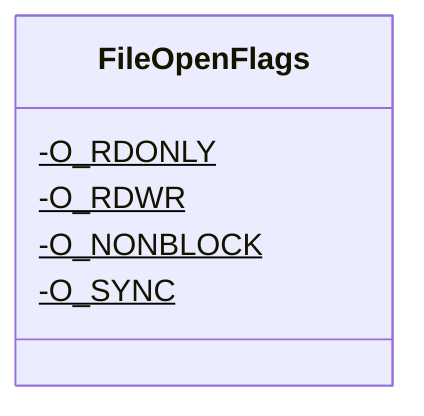

<div id="Interop-class-diagram"></div>

##### `Interop` class diagram

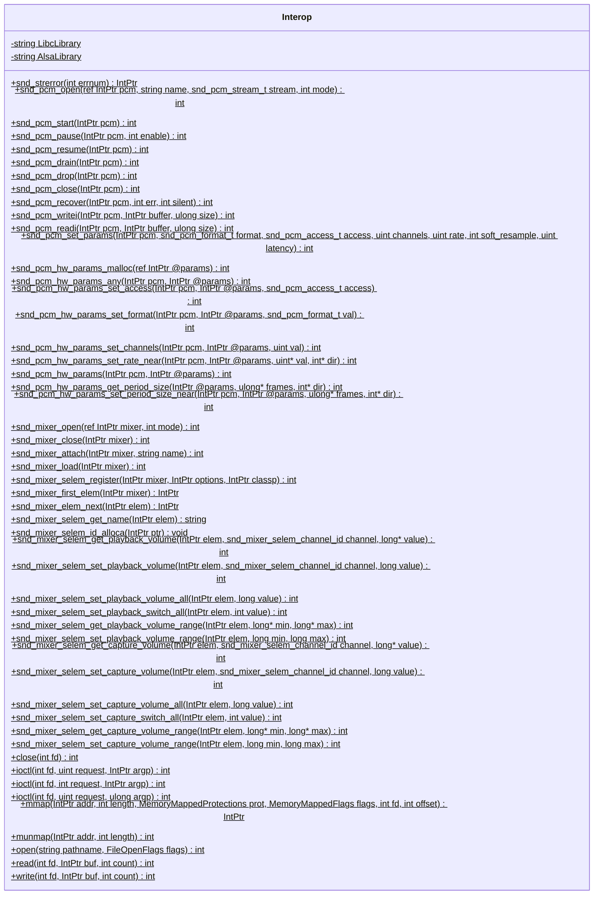

<div id="MemoryMappedFlags-class-diagram"></div>

##### `MemoryMappedFlags` class diagram

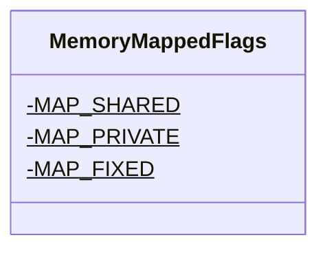

<div id="MemoryMappedProtections-class-diagram"></div>

##### `MemoryMappedProtections` class diagram

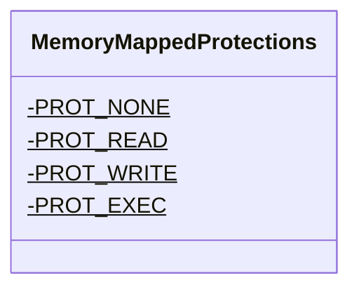

<div id="snd_mixer_selem_channel_id-class-diagram"></div>

##### `snd_mixer_selem_channel_id` class diagram

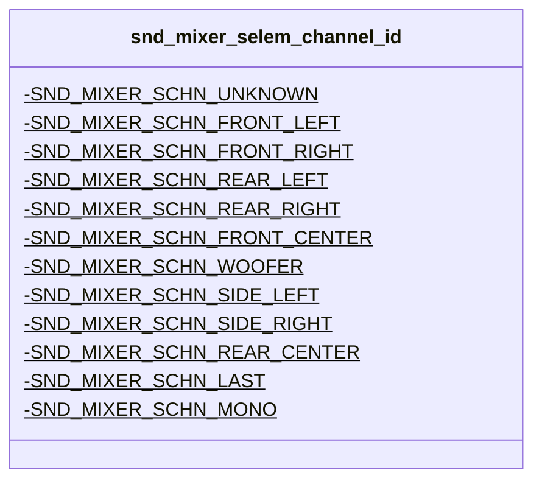

<div id="snd_pcm_access_t-class-diagram"></div>

##### `snd_pcm_access_t` class diagram

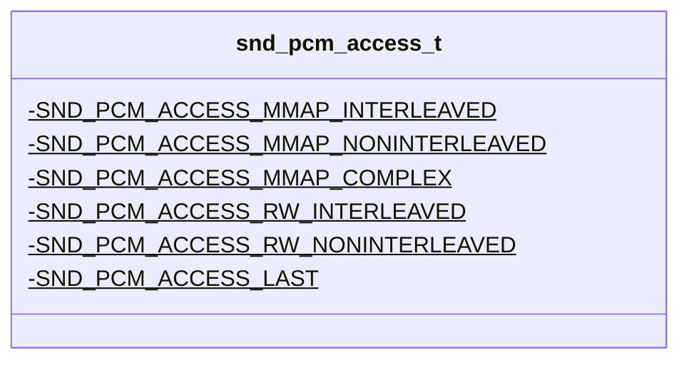

<div id="snd_pcm_format_t-class-diagram"></div>

##### `snd_pcm_format_t` class diagram

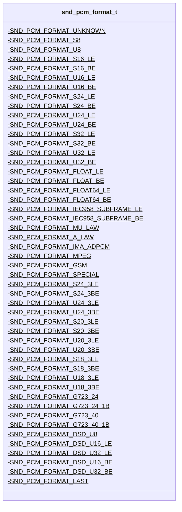

<div id="snd_pcm_stream_t-class-diagram"></div>

##### `snd_pcm_stream_t` class diagram

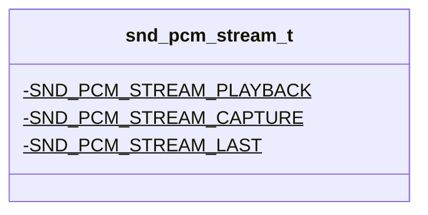

<div id="SoundConnectionSettings-class-diagram"></div>

##### `SoundConnectionSettings` class diagram

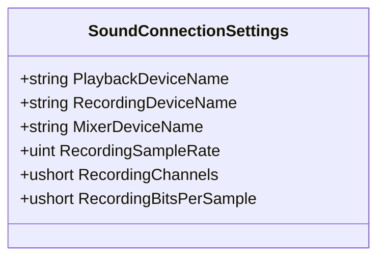

<div id="SoundDevice-class-diagram"></div>

##### `SoundDevice` class diagram

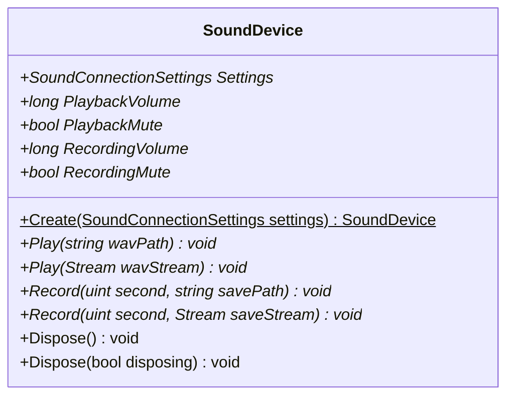

<div id="UnixSoundDevice-class-diagram"></div>

##### `UnixSoundDevice` class diagram

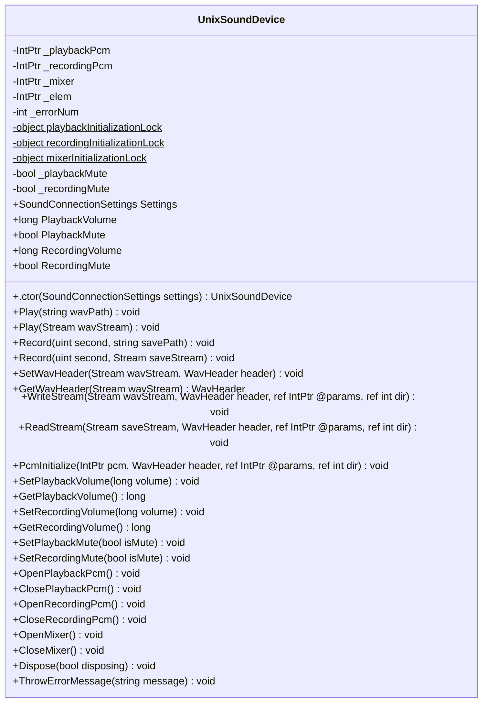

<div id="WavHeader-class-diagram"></div>

##### `WavHeader` class diagram

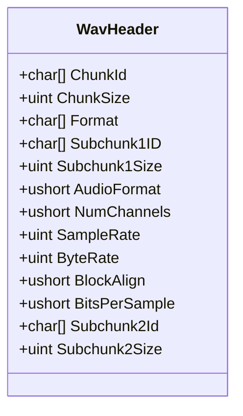

<div id="BitReader-class-diagram"></div>

##### `BitReader` class diagram

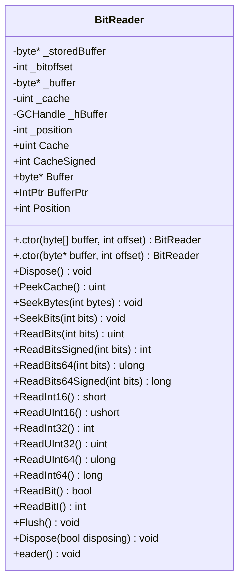

<div id="BlockingStrategy-class-diagram"></div>

##### `BlockingStrategy` class diagram

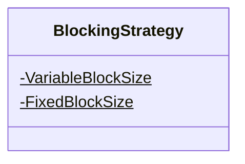

<div id="ChannelAssignment-class-diagram"></div>

##### `ChannelAssignment` class diagram

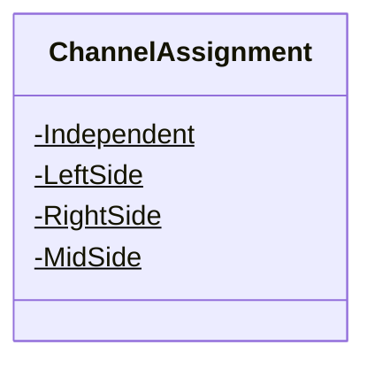

<div id="ChannelMask-class-diagram"></div>

##### `ChannelMask` class diagram

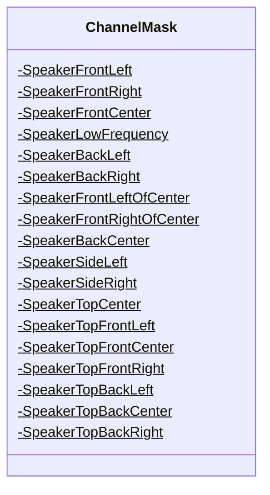

<div id="FlacBitReader-class-diagram"></div>

##### `FlacBitReader` class diagram

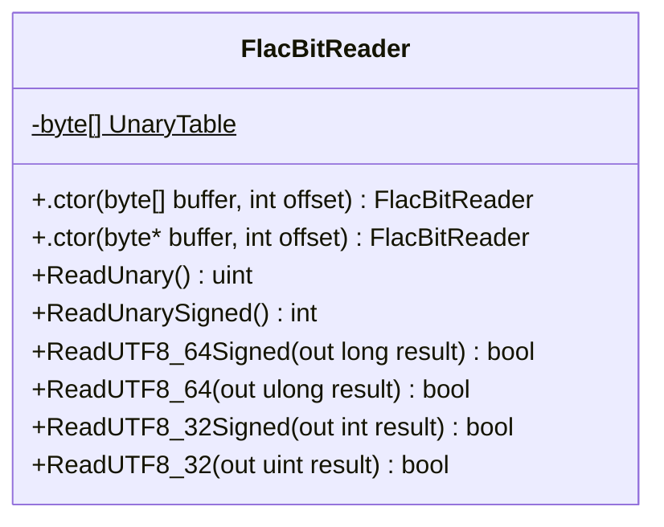

<div id="FlacConstant-class-diagram"></div>

##### `FlacConstant` class diagram

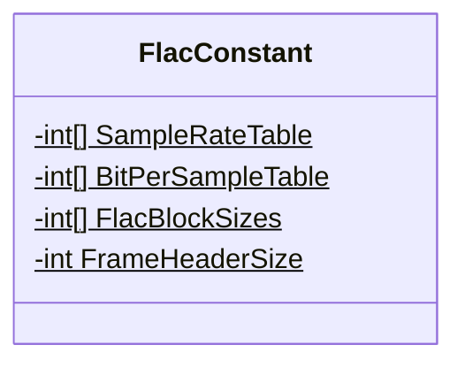

<div id="FlacException-class-diagram"></div>

##### `FlacException` class diagram

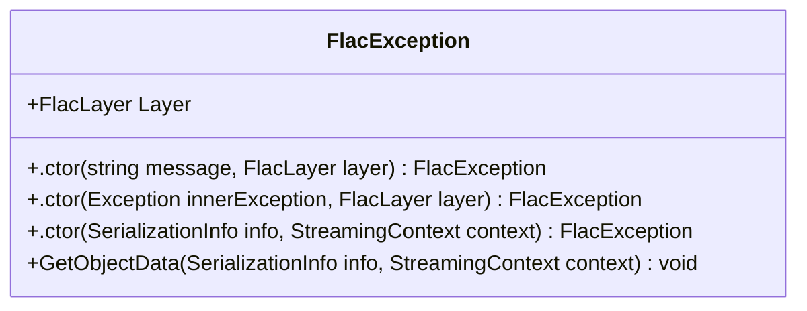

<div id="FlacFrame-class-diagram"></div>

##### `FlacFrame` class diagram

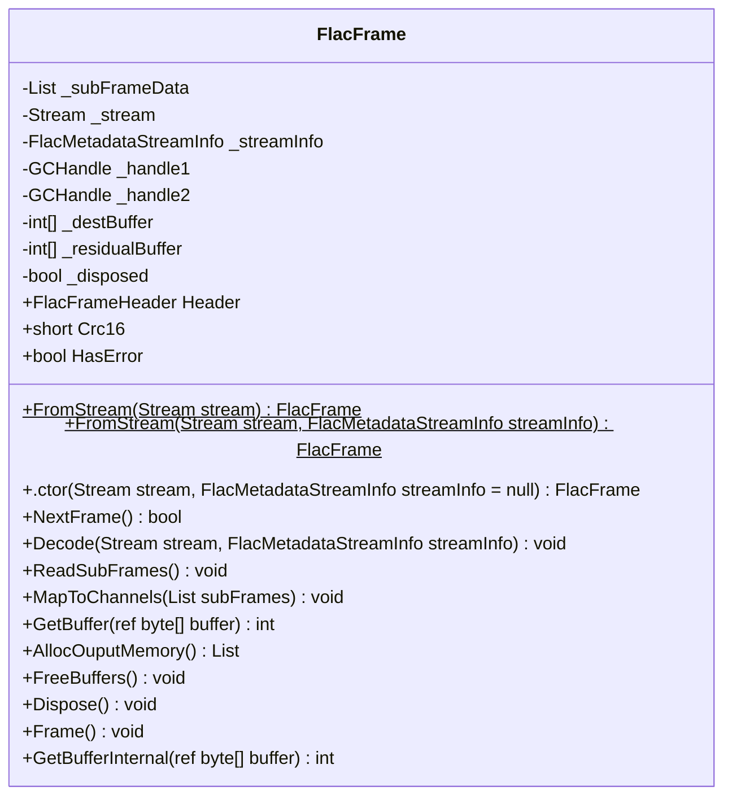

<div id="FlacFrameHeader-class-diagram"></div>

##### `FlacFrameHeader` class diagram

```mermaid
classDiagram
class FlacFrameHeader{
    -int _blocksizeHint
    -int _sampleRateHint
    -bool PrintErrors
    +int BlockSize
    +int SampleRate
    +int Channels
    +ChannelAssignment ChannelAssignment
    +int BitsPerSample
    +BlockingStrategy BlockingStrategy
    +long SampleNumber
    +int FrameNumber
    +byte Crc8
    +bool DoCrc
    +bool HasError
    +long StreamPosition
    +.ctor(Stream stream) FlacFrameHeader
    +.ctor(Stream stream, FlacMetadataStreamInfo streamInfo) FlacFrameHeader
    +.ctor(Stream stream, FlacMetadataStreamInfo streamInfo, bool doCrc) FlacFrameHeader
    +.ctor(ref byte* buffer, FlacMetadataStreamInfo streamInfo, bool doCrc) FlacFrameHeader
    +.ctor(ref byte* buffer, FlacMetadataStreamInfo streamInfo, bool doCrc, bool logError) FlacFrameHeader
    +ParseHeader(Stream stream, FlacMetadataStreamInfo streamInfo) bool
    +ParseHeader(ref byte* headerBuffer, FlacMetadataStreamInfo streamInfo) bool
    +Error(string msg, string location) void
    +IsFormatEqualTo(FlacFrameHeader other) bool
}

```

<div id="FlacFrameInformation-class-diagram"></div>

##### `FlacFrameInformation` class diagram

```mermaid
classDiagram
class FlacFrameInformation{
    +FlacFrameHeader Header
    +bool IsFirstFrame
    +long StreamOffset
    +long SampleOffset
}

```

<div id="FlacLayer-class-diagram"></div>

##### `FlacLayer` class diagram

```mermaid
classDiagram
class FlacLayer{
    -OutSideOfFrame$
    -Metadata$
    -Frame$
    -SubFrame$
}

```

<div id="FlacPartitionedRice-class-diagram"></div>

##### `FlacPartitionedRice` class diagram

```mermaid
classDiagram
class FlacPartitionedRice{
    +ProcessResidual(FlacBitReader reader, FlacFrameHeader header, FlacSubFrameData data, int order, int partitionOrder, FlacResidualCodingMethod codingMethod)$ void
    +ReadFlacRiceBlock(FlacBitReader reader, int nvals, int riceParameter, int* ptrDest)$ void
}

```

<div id="FlacPartitionedRiceContent-class-diagram"></div>

##### `FlacPartitionedRiceContent` class diagram

```mermaid
classDiagram
class FlacPartitionedRiceContent{
    -int[] Parameters
    -int[] RawBits
    -int _capByOrder
    +UpdateSize(int partitionOrder) void
}

```

<div id="FlacPreScan-class-diagram"></div>

##### `FlacPreScan` class diagram

```mermaid
classDiagram
class FlacPreScan{
    -int BufferSize$
    -Stream _stream
    -bool _isRunning
    +List<FlacFrameInformation> Frames
    +long TotalLength
    +long TotalSamples
    +.ctor(Stream stream) FlacPreScan
    +ScanStream(FlacMetadataStreamInfo streamInfo, FlacPreScanMode mode) void
    +StartScan(FlacMetadataStreamInfo streamInfo, FlacPreScanMode mode) void
    +RunScan(FlacMetadataStreamInfo streamInfo) List<FlacFrameInformation>
    +RaiseScanFinished(List<FlacFrameInformation> frames) void
    +ScanThisShit(FlacMetadataStreamInfo streamInfo) List<FlacFrameInformation>
    +IsFrame(ref byte* buffer, FlacMetadataStreamInfo streamInfo, out FlacFrameHeader header) bool
}

```

<div id="FlacPreScanFinishedEventArgs-class-diagram"></div>

##### `FlacPreScanFinishedEventArgs` class diagram

```mermaid
classDiagram
class FlacPreScanFinishedEventArgs{
    +ReadOnlyCollection<FlacFrameInformation> Frames
    +.ctor(List<FlacFrameInformation> frames) FlacPreScanFinishedEventArgs
}

```

<div id="FlacPreScanMode-class-diagram"></div>

##### `FlacPreScanMode` class diagram

```mermaid
classDiagram
class FlacPreScanMode{
    -None$
    -Sync$
    -Async$
    -Default$
}

```

<div id="FlacReader-class-diagram"></div>

##### `FlacReader` class diagram

```mermaid
classDiagram
IDisposable <|-- FlacReader : implements
class FlacReader{
    -Stream _stream
    -WaveFormat _waveFormat
    -FlacMetadataStreamInfo _streamInfo
    -FlacPreScan _scan
    -object _bufferLock
    -bool _closeStream
    -byte[] _overflowBuffer
    -int _overflowCount
    -int _overflowOffset
    -int _frameIndex
    -FlacFrame _frame
    -long _position
    -bool _disposed
    +ReadOnlyCollection<FlacMetadata> Metadata
    +WaveFormat WaveFormat
    +bool CanSeek
    +FlacFrame Frame
    +long Position
    +long Length
    +.ctor(string fileName) FlacReader
    +.ctor(Stream stream) FlacReader
    +.ctor(Stream stream, FlacPreScanMode scanFlag) FlacReader
    +.ctor(Stream stream, FlacPreScanMode scanFlag, Action<FlacPreScanFinishedEventArgs> onscanFinished) FlacReader
    +CreateWaveFormat(FlacMetadataStreamInfo streamInfo) WaveFormat
    +Read(byte[] buffer, int offset, int count) int
    +GetOverflows(byte[] buffer, ref int offset, int count) int
    +Dispose() void
    +Dispose(bool disposing) void
    +ReadBytes(int count) byte[]
    +CheckForDisposed() void
    +Reader() void
}

```

<div id="FlacResidualCodingMethod-class-diagram"></div>

##### `FlacResidualCodingMethod` class diagram

```mermaid
classDiagram
class FlacResidualCodingMethod{
    -PartitionedRice$
    -PartitionedRice2$
    -Invalid2$
    -Invalid3$
}

```

<div id="FlacSubFrameData-class-diagram"></div>

##### `FlacSubFrameData` class diagram

```mermaid
classDiagram
class FlacSubFrameData{
    -int* DestinationBuffer
    -int* ResidualBuffer
    -FlacPartitionedRiceContent Content
}

```

<div id="DefaultFlacMetadata-class-diagram"></div>

##### `DefaultFlacMetadata` class diagram

```mermaid
classDiagram
class DefaultFlacMetadata{
    -FlacMetaDataType _metadataType
    +FlacMetaDataType MetaDataType
    +.ctor(FlacMetaDataType metadataType) DefaultFlacMetadata
    +InitializeByStream(Stream stream) void
}

```

<div id="FlacMetadata-class-diagram"></div>

##### `FlacMetadata` class diagram

```mermaid
classDiagram
class FlacMetadata{
    +FlacMetaDataType MetaDataType*
    +bool IsLastMetaBlock
    +int Length
    +FromStream(Stream stream)$ FlacMetadata
    +ReadAllMetadataFromStream(Stream stream)$ IEnumerable<FlacMetadata>
    +SkipMetadata(Stream stream)$ void
    +Initialize(Stream stream, int length, bool isLastBlock) void
    +InitializeByStream(Stream stream)* void
}

```

<div id="FlacMetadataFactory-class-diagram"></div>

##### `FlacMetadataFactory` class diagram

```mermaid
classDiagram
class FlacMetadataFactory{
    -FlacMetadataFactory _instance$
    -Dictionary<int, Type> _registeredmetadataTypes
    +FlacMetadataFactory Instance$
    +.ctor() FlacMetadataFactory
    +RegistermetadataType<T>(FlacMetaDataType metadataType) void
    +RegistermetadataType<T>(int metadataType) void
    +ParseMetadata(Stream stream) FlacMetadata
    +CreateFlacMetadataInstance(FlacMetaDataType flacMetadataType) FlacMetadata
}

```

<div id="FlacMetadataSeekTable-class-diagram"></div>

##### `FlacMetadataSeekTable` class diagram

```mermaid
classDiagram
class FlacMetadataSeekTable{
    -FlacSeekPoint[] _seekPoints
    +int EntryCount
    +FlacSeekPoint[] SeekPoints
    +FlacSeekPoint this[int index]
    +FlacMetaDataType MetaDataType
    +InitializeByStream(Stream stream) void
}

```

<div id="FlacMetadataStreamInfo-class-diagram"></div>

##### `FlacMetadataStreamInfo` class diagram

```mermaid
classDiagram
class FlacMetadataStreamInfo{
    +FlacMetaDataType MetaDataType
    +short MinBlockSize
    +short MaxBlockSize
    +int MaxFrameSize
    +int MinFrameSize
    +int SampleRate
    +int Channels
    +int BitsPerSample
    +long TotalSamples
    +string Md5
    +InitializeByStream(Stream stream) void
}

```

<div id="FlacMetaDataType-class-diagram"></div>

##### `FlacMetaDataType` class diagram

```mermaid
classDiagram
class FlacMetaDataType{
    -StreamInfo$
    -Padding$
    -Application$
    -Seektable$
    -VorbisComment$
    -CueSheet$
    -Picture$
    -Undef$
}

```

<div id="FlacSeekPoint-class-diagram"></div>

##### `FlacSeekPoint` class diagram

```mermaid
classDiagram
class FlacSeekPoint{
    -long PlaceHolderPointSampleNumber
    +long SampleNumber
    +long Offset
    +int FrameSize
    +.ctor() FlacSeekPoint
    +.ctor(long sampleNumber, long offset, int frameSize) FlacSeekPoint
}

```

<div id="FlacResidual-class-diagram"></div>

##### `FlacResidual` class diagram

```mermaid
classDiagram
class FlacResidual{
    +.ctor(FlacBitReader reader, FlacFrameHeader header, FlacSubFrameData data, int order) FlacResidual
}

```

<div id="FlacSubFrameBase-class-diagram"></div>

##### `FlacSubFrameBase` class diagram

```mermaid
classDiagram
class FlacSubFrameBase{
    +GetSubFrame(FlacBitReader reader, FlacSubFrameData data, FlacFrameHeader header, int bitsPerSample)$ FlacSubFrameBase
    +.ctor(FlacFrameHeader header) FlacSubFrameBase
}

```

<div id="FlacSubFrameConstant-class-diagram"></div>

##### `FlacSubFrameConstant` class diagram

```mermaid
classDiagram
class FlacSubFrameConstant{
    +.ctor(FlacBitReader reader, FlacFrameHeader header, FlacSubFrameData data, int bitsPerSample) FlacSubFrameConstant
}

```

<div id="FlacSubFrameFixed-class-diagram"></div>

##### `FlacSubFrameFixed` class diagram

```mermaid
classDiagram
class FlacSubFrameFixed{
    +.ctor(FlacBitReader reader, FlacFrameHeader header, FlacSubFrameData data, int bitsPerSample, int order) FlacSubFrameFixed
    +RestoreSignal(FlacSubFrameData subframeData, int length, int order) void
}

```

<div id="FlacSubFrameLPC-class-diagram"></div>

##### `FlacSubFrameLPC` class diagram

```mermaid
classDiagram
class FlacSubFrameLPC{
    +.ctor(FlacBitReader reader, FlacFrameHeader header, FlacSubFrameData data, int bitsPerSample, int order) FlacSubFrameLPC
    +Log2(int x) int
    +RestoreLPCSignal32(int* residual, int* destination, int length, int order, int[] qlpCoeff, int lpcShiftNeeded) void
    +RestoreLPCSignal64(int* residual, int* destination, int length, int order, int[] qlpCoeff, int lpcShiftNeeded) void
}

```

<div id="FlacSubFrameVerbatim-class-diagram"></div>

##### `FlacSubFrameVerbatim` class diagram

```mermaid
classDiagram
class FlacSubFrameVerbatim{
    +.ctor(FlacBitReader reader, FlacFrameHeader header, FlacSubFrameData data, int bitsPerSample) FlacSubFrameVerbatim
}

```

<div id="CRC8-class-diagram"></div>

##### `CRC8` class diagram

```mermaid
classDiagram
class CRC8{
    -CRC8 _instance$
    +CRC8 Instance$
    +.ctor() CRC8
    +CalcCheckSum(byte[] buffer, int offset, int count) byte
    +CalcCheckSum(byte* buffer, int offset, int count) byte
}

```

<div id="CRCBase&lt;T&gt;-class-diagram"></div>

##### `CRCBase<T>` class diagram

```mermaid
classDiagram
class CRCBase<T>{
    -int tableSize
    -ushort[] crc_table
    +CalcTable(int bits) void
    +CalcCheckSum(byte[] buffer, int offset, int count)* T
}

```

<div id="MSAppCenterSink-class-diagram"></div>

##### `MSAppCenterSink` class diagram

```mermaid
classDiagram
class MSAppCenterSink{
    -bool? CachedTrackingAllowed
    -string optdir$
    -string optout
    -string optin
    +Shorten(string s, int length) string
    +TrackingAllowed() bool
    +Emit(LogEvent logEvent) void
}

```

<div id="MSAppCenterSinkExtensions-class-diagram"></div>

##### `MSAppCenterSinkExtensions` class diagram

```mermaid
classDiagram
class MSAppCenterSinkExtensions{
    +MSAppCenter(LoggerSinkConfiguration loggerConfiguration)$ LoggerConfiguration
}

```

<div id="VorbisNaudioWaveStreamWrapper-class-diagram"></div>

##### `VorbisNaudioWaveStreamWrapper` class diagram

```mermaid
classDiagram
class VorbisNaudioWaveStreamWrapper{
    +GetPlayingAbility(WrappedStream stream) byte
    +GetStream(WrappedStream stream) WaveStream
}

```

<div id="AlbumView-class-diagram"></div>

##### `AlbumView` class diagram

```mermaid
classDiagram
class AlbumView{
    +.ctor() AlbumView
    +InitializeComponent() void
}

```

<div id="AuthInfoWindow-class-diagram"></div>

##### `AuthInfoWindow` class diagram

```mermaid
classDiagram
class AuthInfoWindow{
    -JellyFinHelper jellyFinHelper
    -string ServerURL
    -bool Success
    +.ctor() AuthInfoWindow
    +.ctor(JellyFinHelper jellyFinHelper) AuthInfoWindow
    +InitializeComponent() void
    +ButtonClick(object? sender, RoutedEventArgs e) void
}

```

<div id="FakeMemoryStreamReference-class-diagram"></div>

##### `FakeMemoryStreamReference` class diagram

```mermaid
classDiagram
IDisposable <|-- FakeMemoryStreamReference : implements
class FakeMemoryStreamReference{
    -MemoryStream Realstream
    -MemoryStream Fakestream
    -long FakePos
    +bool CanRead
    +bool CanSeek
    +bool CanWrite
    +long Length
    +long Position
    +.ctor(MemoryStream realstream) FakeMemoryStreamReference
    +Flush() void
    +Read(byte[] buffer, int offset, int count) int
    +Seek(long offset, SeekOrigin origin) long
    +SetLength(long value) void
    +Write(byte[] buffer, int offset, int count) void
    +Dispose() void
}

```

<div id="Gui-class-diagram"></div>

##### `Gui` class diagram

```mermaid
classDiagram
class Gui{
    -JellyFinPlayStreamProvider jellyFinPlayStreamProvider
    -JellyFinHelper helper
    -GuiBinding g
    +.ctor() Gui
    +Button_Click(object? sender, RoutedEventArgs e) void
    +AddEntireScreen(object? sender, RoutedEventArgs e) void
    +Gui_Opened(object? sender, EventArgs e) void
    +LB_DoubleTapped(object? sender, RoutedEventArgs e) void
    +.ctor(JellyFinPlayStreamProvider jellyFinPlayStreamProvider) Gui
    +InitializeComponent() void
}

```

<div id="GuiBinding-class-diagram"></div>

##### `GuiBinding` class diagram

```mermaid
classDiagram
class GuiBinding{
    +ObservableCollection<WrappedDto> SearchResults
}

```

<div id="JellyFinHelper-class-diagram"></div>

##### `JellyFinHelper` class diagram

```mermaid
classDiagram
class JellyFinHelper{
    -UserDto userDto
    -bool validUser
    -SdkClientSettings settings
    -ISystemClient systemClient
    -IUserViewsClient userViewsClient
    -IUserLibraryClient userLibraryClient
    -IUserClient userClient
    -bool validServer
    -IItemsClient itemsClient
    -IUniversalAudioClient audioClient
    -IImageClient imageClient
    -ServerUrlWindow serverwindow
    -AuthInfoWindow authwindow
    +.ctor() JellyFinHelper
    +GetItemsFromItem(BaseItemDto dto) Task<IReadOnlyList<BaseItemDto>>
    +MakeSureUserLogsIn(Gui gui) Task
    +GetDefaultItems() Task<IReadOnlyList<BaseItemDto>>
    +TryLogInAsync(string username, string password) Task<bool>
    +TryGetSystemInfoAsync(string host) Task<bool>
    +GetStream(BaseItemDto dto) Task<WrappedStream>
    +GetImageStream(BaseItemDto dto) Task<WrappedStream?>
    +LogIn(Gui gui) Task<bool>
    +GetServerUrl(Gui gui) Task<bool>
}

```

<div id="JellyFinPlayStreamProvider-class-diagram"></div>

##### `JellyFinPlayStreamProvider` class diagram

```mermaid
classDiagram
class JellyFinPlayStreamProvider{
    -Gui gui
    +IPlayStreamProviderListner ProviderListner
    +string Name
    +string Description
    +WrappedStream? Icon
    +Version? Version
    +string Licenses
    +List<Tuple<Uri, URLType>>? Links
    +.ctor() JellyFinPlayStreamProvider
    +ShowGui() void
}

```

<div id="ServerUrlWindow-class-diagram"></div>

##### `ServerUrlWindow` class diagram

```mermaid
classDiagram
class ServerUrlWindow{
    -JellyFinHelper jellyFinHelper
    -string ServerURL
    -bool Success
    +.ctor() ServerUrlWindow
    +.ctor(JellyFinHelper jellyFinHelper) ServerUrlWindow
    +InitializeComponent() void
    +ButtonClick(object? sender, RoutedEventArgs e) void
}

```

<div id="WrappedDto-class-diagram"></div>

##### `WrappedDto` class diagram

```mermaid
classDiagram
class WrappedDto{
    -BaseItemDto dto
    +string Name
    +string AlbumArtist
    +bool? IsFolder
    +int? IndexNumber
    +Bitmap? Cover
    +.ctor(BaseItemDto dto, WrappedStream? ws = null) WrappedDto
}

```

<div id="WrappedJellyFinStream-class-diagram"></div>

##### `WrappedJellyFinStream` class diagram

```mermaid
classDiagram
IDisposable <|-- WrappedJellyFinStream : implements
class WrappedJellyFinStream{
    -bool disposedValue
    -IUniversalAudioClient audioClient
    -UserDto userDto
    -BaseItemDto song
    -MemoryStream FStream
    -Stream rs
    -Thread t
    -BaseItemDto dto
    +List<Stream> Streams
    +MimeType MimeType
    +MimeType _MimeType
    +CopyToMS() void
    +.ctor(IUniversalAudioClient ac, UserDto user, BaseItemDto baseItemDto) WrappedJellyFinStream
    +InternalGetStream() Stream
    +GetStream() Stream
    +Dispose(bool disposing) void
    +Dispose() void
}

```

<div id="WrappedStreamImplementedByOneRealOne-class-diagram"></div>

##### `WrappedStreamImplementedByOneRealOne` class diagram

```mermaid
classDiagram
class WrappedStreamImplementedByOneRealOne{
    -Stream RealStream
    +MimeType MimeType
    +.ctor(MimeType mimeType, Stream RealStream) WrappedStreamImplementedByOneRealOne
    +GetStream() Stream
}

```

<div id="ActionDataContext-class-diagram"></div>

##### `ActionDataContext` class diagram

```mermaid
classDiagram
class ActionDataContext{
    +ObservableCollection<SAction> Actions
}

```

<div id="App-class-diagram"></div>

##### `App` class diagram

```mermaid
classDiagram
class App{
    -CompositionHost Container
    +Initialize() void
    +GetThemePreference(bool fallback = false)$ bool
    +OnFrameworkInitializationCompleted() void
    +ChangeTheme(bool dark)$ void
}

```

<div id="Config-class-diagram"></div>

##### `Config` class diagram

```mermaid
classDiagram
ILetNotify <|-- Config : implements
class Config{
    -bool _AllowedRead
    +RepeatState LoopType
    +byte Volume
    +bool AllowedToRead
    +Invoke(object e, PropertyChangedEventArgs a) void
}

```

<div id="DC-class-diagram"></div>

##### `DC` class diagram

```mermaid
classDiagram
class DC{
    +ObservableCollection<Field> ValuePairs
    +ObservableCollection<Bitmap?> Bitmaps
}

```

<div id="DContext-class-diagram"></div>

##### `DContext` class diagram

```mermaid
classDiagram
class DContext{
    -Bitmap picture
    +Bitmap Picture
}

```

<div id="Field-class-diagram"></div>

##### `Field` class diagram

```mermaid
classDiagram
class Field{
    +ObservableCollection<Field> SubFields
    +string FieldName
    +string FieldValue
    +.ctor(string name, string value) Field
}

```

<div id="Info-class-diagram"></div>

##### `Info` class diagram

```mermaid
classDiagram
class Info{
    -MainWindow MainWindow
    +.ctor() Info
    +OpenBrowser(string url)$ void
    +ElementDoubleTapped(object _, RoutedEventArgs args) void
    +.ctor(MainWindow mainWindow) Info
}

```

<div id="InfoPRecord-class-diagram"></div>

##### `InfoPRecord` class diagram

```mermaid
classDiagram
IEquatable~InfoPRecord~ <|-- InfoPRecord : implements
class InfoPRecord{
    +string Name
    +string Description
    +Version? Version
    +Bitmap? Icon
    +string Licenses
    +ICodeInformation Item
    +.ctor(string Name, string Description, Version? Version, Bitmap? Icon, string Licenses, ICodeInformation Item) InfoPRecord
}

```

<div id="LaunchActionsWindow-class-diagram"></div>

##### `LaunchActionsWindow` class diagram

```mermaid
classDiagram
class LaunchActionsWindow{
    -ActionDataContext x
    +.ctor() LaunchActionsWindow
    +ElementDoubleTapped(object _, RoutedEventArgs args) void
    +AddActions(List<SAction> action) void
}

```

<div id="MainWindow-class-diagram"></div>

##### `MainWindow` class diagram

```mermaid
classDiagram
class MainWindow{
    -string ConfigPath
    -Config config
    -CommentXmlConfigReaderNotifyWhenChanged<Config> reader
    -MainWindowContext dc
    -bool en
    -bool en2
    -Song? CurrentSong
    -bool StopAutoLoading
    -Song? NextSong
    -Thread? th
    -CancellationTokenSource? token
    -List<IMusicStatusInterface> musicStatusInterfaces
    -bool ChangeAllowed
    -MetadataView? metadataView
    +byte Volume
    +Logic Logic
    +IPlay? Player
    +RepeatState LoopType
    +.ctor() MainWindow
    +RepeatButton_Click(object? sender, RoutedEventArgs e) void
    +SetPBColor(Color c) void
    +TreeView_PointerPressed1(object? sender, PointerPressedEventArgs e) void
    +SetVolume(byte v) void
    +TreeView_PointerReleased(object? sender, PointerReleasedEventArgs e) void
    +TreeView_PointerMoved(object? sender, PointerEventArgs e) void
    +AddMSI(IMusicStatusInterface e) void
    +MusicStatusInterface_SetRepeat(object? sender, RepeatState e) void
    +MusicStatusInterface_SetVolume(object? sender, byte e) void
    +MusicStatusInterface_SetPosition(object? sender, ulong e) void
    +MusicStatusInterface_SetRating(object? sender, byte e) void
    +MusicStatusInterface_GetShuffle() bool
    +MusicStatusInterface_GetPosition() ulong
    +MusicStatusInterface_GetRepeat() RepeatState
    +MusicStatusInterface_GetVolume() byte
    +MusicStatusInterface_GetState() PlaybackState
    +MusicStatusInterface_Stop(object? sender, object e) void
    +MusicStatusInterface_Pause(object? sender, object e) void
    +SendIfStateIsNotNull() void
    +TrackChangedNotification(Song? currentSong) void
    +PlaybackStateChangedNotification(PlaybackState s) void
    +MusicStatusInterface_Play(object? sender, object e) void
    +RemoveMSI(IMusicStatusInterface e) void
    +PlayPause(bool allowstart) void
    +MusicStatusInterface_PlayPause(object? sender, object e) void
    +MusicStatusInterface_GetDuration() ulong
    +MusicStatusInterface_GetCurrentTrack() Song
    +MusicStatusInterface_Previous(object? sender, EventArgs e) void
    +MusicStatusInterface_Next(object? sender, EventArgs e) void
    +Next() void
    +Previous() void
    +Settings_Click(object? sender, RoutedEventArgs e) void
    +MainWindow_Opened(object? sender, EventArgs e) void
    +MainWindow_Closing(object? sender, CancelEventArgs e) void
    +TreeView_DoubleTapped(object? sender, RoutedEventArgs e) void
    +StopButton_Click(object? sender, RoutedEventArgs e) void
    +Metadata_Click(object? sender, PointerPressedEventArgs e) void
    +PB_PointerReleased(object? sender, PointerReleasedEventArgs e) void
    +PauseButton_Click(object? sender, RoutedEventArgs e) void
    +PlayButton_Click(object? sender, RoutedEventArgs e) void
    +Play() void
    +Pause() void
    +StartPlaying(bool play = true, bool resetsal = false) void
    +SndThrd(CancellationToken e) void
    +RemoveTrack() void
    +OutputDevice_PlaybackStopped(object? sender, object o) void
    +HandleSongChanging(Song NextSong, bool resetsal = false) void
    +DragOver(object sender, DragEventArgs e) void
    +Drop(object sender, DragEventArgs e) void
    +ProcessFiles(IEnumerable<string> files) void
    +ProcessStreams(IEnumerable<WrappedStream> files) void
    +ProcessStream(WrappedStream file) void
    +ClearAll(object sender, RoutedEventArgs e) void
    +AddFilee(object sender, RoutedEventArgs e) void
    +RemoveSelected(object sender, RoutedEventArgs e) void
    +AddSong(Song s) void
}

```

<div id="MainWindowContext-class-diagram"></div>

##### `MainWindowContext` class diagram

```mermaid
classDiagram
class MainWindowContext{
    -MainWindow mainWindow
    -Action<byte> VolumeChanged
    -Func<byte> GetVolume
    -string _Title
    -IBrush _pbForeGround
    -ObservableCollection<Song> _queue
    +IBrush PBForeground
    +string Title
    +byte V
    +ObservableCollection<Song> Queue
    +RepeatState LoopType
    +.ctor(MainWindow mw) MainWindowContext
    +SetLoopType(RepeatState v) void
    +RunTheThing() void
}

```

<div id="MetadataView-class-diagram"></div>

##### `MetadataView` class diagram

```mermaid
classDiagram
class MetadataView{
    -Song s
    -DC dataContext
    -ILogger? Log
    +LoadSong(Song s) void
    +MetadataView_Opened(object? sender, EventArgs e) void
    +.ctor() MetadataView
    +ProcessSubProperties(object thing, Field parentfield, int allowedlength = 6) void
    +InitializeComponent() void
    +IMG_DoubleTapped(object? sender, RoutedEventArgs e) void
}

```

<div id="NullableReplacingConverter-class-diagram"></div>

##### `NullableReplacingConverter` class diagram

```mermaid
classDiagram
class NullableReplacingConverter{
    +Convert(IList<object?> values, Type targetType, object? parameter, CultureInfo culture) object?
}

```

<div id="PictureViewer-class-diagram"></div>

##### `PictureViewer` class diagram

```mermaid
classDiagram
class PictureViewer{
    -IReadOnlyList<Picture>? pictures
    -DContext x
    -int pos
    +.ctor() PictureViewer
    +.ctor(IReadOnlyList<Picture>? pictures) PictureViewer
    +Left(object? sender, RoutedEventArgs e) void
    +Right(object? sender, RoutedEventArgs e) void
    +Copy(object? sender, RoutedEventArgs e) void
}

```

<div id="Program-class-diagram"></div>

##### `Program` class diagram

```mermaid
classDiagram
class Program{
    +Main(string[] args)$ void
    +BuildAvaloniaApp()$ AppBuilder
}

```

<div id="ProvidersReturnedNullException-class-diagram"></div>

##### `ProvidersReturnedNullException` class diagram

```mermaid
classDiagram
class ProvidersReturnedNullException{
    +.ctor() ProvidersReturnedNullException
    +.ctor(string message) ProvidersReturnedNullException
    +.ctor(string message, Exception inner) ProvidersReturnedNullException
    +.ctor(SerializationInfo info, StreamingContext context) ProvidersReturnedNullException
}

```

<div id="SAction-class-diagram"></div>

##### `SAction` class diagram

```mermaid
classDiagram
class SAction{
    +string ActionName
    +Action ActionToInvoke
    +Invoke() void
}

```

<div id="SAPAvaloniaListner-class-diagram"></div>

##### `SAPAvaloniaListner` class diagram

```mermaid
classDiagram
class SAPAvaloniaListner{
    -MainWindow mainWindow
    +.ctor(MainWindow mainWindow) SAPAvaloniaListner
    +GetEnviroment() IPlayerEnviroment
    +LoadSong(WrappedStream s) void
    +LoadSongs(IEnumerable<WrappedStream> streams) void
}

```

<div id="SAPAvaloniaPlayerEnviroment-class-diagram"></div>

##### `SAPAvaloniaPlayerEnviroment` class diagram

```mermaid
classDiagram
class SAPAvaloniaPlayerEnviroment{
    +string Name
    +string Description
    +WrappedStream? Icon
    +Version? Version
    +List<Tuple<Uri, URLType>>? Links
    +string Licenses
}

```

<div id="Settings-class-diagram"></div>

##### `Settings` class diagram

```mermaid
classDiagram
class Settings{
    -EventHandler OnNewColor
    -MainWindow mainWindow
    -string[] AssociatedFileTypes$
    +.ctor() Settings
    +TransparencyDown_SelectionChanged(object? sender, SelectionChangedEventArgs e) void
    +RegisterInReg()$ void
    +DeleteRegistryFolder(RegistryHive registryHive, string fullPathKeyToDelete)$ void
    +RemoveFromReg()$ void
    +RegisterClick(object? sender, RoutedEventArgs e) void
    +ToggleTransparency(object? sender, RoutedEventArgs e) void
    +ChangeColorPB(object? sender, RoutedEventArgs e) void
    +ChangeColor(object? sender, RoutedEventArgs e) void
    +InitializeComponent() void
}

```

<div id="CADMusicStatusInterface-class-diagram"></div>

##### `CADMusicStatusInterface` class diagram

```mermaid
classDiagram
IMusicStatusInterface <|-- CADMusicStatusInterface : implements
class CADMusicStatusInterface{
    -bool disposedValue
    -IntPtr PrevProc
    -int GWL_WNDPROC$
    -int WM_USER$
    -string arglpWindowName$
    -List<GCHandle> Handles
    -int WM_COPYDATA$
    +ILogger? logger
    +string Name
    +string Description
    +WrappedStream? Icon
    +Version? Version
    +string Licenses
    +List<Tuple<Uri, URLType>>? Links
    +.ctor() CADMusicStatusInterface
    +CopyMemory(object hpvDest, object hpvSource, long cbCopy)$ void
    +FindWindow(string? lpClassName, string lpWindowName)$ long
    +SendMessage(long hwnd, long wMsg, long wParam, CopyDataStruct lParam)$ long
    +SendMessage(long hwnd, long wMsg, long wParam, long lParam)$ long
    +CallWindowProc(IntPtr lpPrevWndFunc, IntPtr hwnd, long msg, IntPtr wParam, IntPtr lParam)$ long
    +PostMessage(long WndID, long wMsg, long wParam, long lParam)$ long
    +SetWindowLongPtr32(IntPtr hWnd, int nIndex, IntPtr dwNewLong)$ IntPtr
    +SetWindowLongPtr64(IntPtr hWnd, int nIndex, IntPtr dwNewLong)$ IntPtr
    +MoveMemory(void* dest, void* src, int size)$ void
    +cadRegister() void
    +SetWindowProc(IntPtr hWnd, WndProcDelegate newWndProc)$ IntPtr
    +HookMsg(IntPtr hwnd) void
    +ReplaceNullWithEmptyAndTabsWithSpace(string? input) string
    +cadSendSongInfo() void
    +CallbackMsgs(IntPtr Hwnd, int wMsg, IntPtr wparam, IntPtr lparam) IntPtr
    +cadSendLyrics() void
    +InterProcessComms(IntPtr lParam) void
    +SLeft(string value, int maxLength)$ string
    +StartIPC() void
    +StopIPC() void
    +Dispose(bool disposing) void
    +Dispose() void
    +InitializeComponent() void
    +CADMusicStatusInterface_Load(object sender, EventArgs e) void
    +TrackChangedNotification(Song? newtrack) void
    +PlayerStateChanged(PlaybackState newstate) void
    +cadShutdown() void
}

```

<div id="CADMusicStatusInterface.CopyDataStruct-class-diagram"></div>

##### `CADMusicStatusInterface.CopyDataStruct` class diagram

```mermaid
classDiagram
class CopyDataStruct{
    -IntPtr dwData
    -int cbData
    -IntPtr lpData
}

```

<div id="CADMusicStatusInterface.WndProcDelegate-class-diagram"></div>

##### `CADMusicStatusInterface.WndProcDelegate` class diagram

```mermaid
classDiagram
class WndProcDelegate{
}

```

<div id="BasicFormsLogic-class-diagram"></div>

##### `BasicFormsLogic` class diagram

```mermaid
classDiagram
class BasicFormsLogic{
}

```

<div id="Logic-class-diagram"></div>

##### `Logic` class diagram

```mermaid
classDiagram
class Logic{
    +IEnumerable<IPlayProvider> PlayProviders
    +IEnumerable<IMetadataProvider> MetadataProviders
    +IEnumerable<IMusicStatusInterface> MusicStatusInterfaces
    +IEnumerable<IWakeLockProvider> WakeLockInterfaces
    +Logger log
    +GetPlayerFromStream(WrappedStream stream) IPlay?
    +GetMetadataProviderFromStream(WrappedStream stream) IMetadataProvider?
    +GetMetadataFromStream(WrappedStream stream) Task<Metadata?>?
    +FilterFiles(IEnumerable<string> files) IEnumerable<string>
}

```

<div id="-class-diagram"></div>

##### `` class diagram

```mermaid
classDiagram
IEquatable~~ <|--  : implements
class {
}

```

<div id="DebugLogger-class-diagram"></div>

##### `DebugLogger` class diagram

```mermaid
classDiagram
class DebugLogger{
    +LogLevel Level
    +.ctor() DebugLogger
    +Trace(string message, params object[] args) void
    +Info(string message, params object[] args) void
    +Warning(string message, params object[] args) void
    +Error(string message, params object[] args) void
}

```

<div id="DiscordPlayTracker-class-diagram"></div>

##### `DiscordPlayTracker` class diagram

```mermaid
classDiagram
class DiscordPlayTracker{
    -string AppName$
    -DiscordRpcClient client
    -IRememberRichPresenceURLs? richPresenceURLs
    -Dictionary<string, string> tracks
    -string PauseTextState$
    -string PauseTextSState$
    -string PauseStateRPSMLICN$
    -string PlayTextSState$
    -string PlayTextState$
    -string PlayStateRPSMLICN$
    -string StoppedTextSState$
    -string StoppedTextState$
    -string StoppedStateRPSMLICN$
    +string Name
    +string Description
    +WrappedStream? Icon
    +Version? Version
    +string Licenses
    +List<Tuple<Uri, URLType>>? Links
    +.ctor(string id, IRememberRichPresenceURLs? richPresenceURLgetter) DiscordPlayTracker
    +.ctor() DiscordPlayTracker
    +.ctor(string id) DiscordPlayTracker
    +Dispose() void
    +PlayerStateChanged(PlaybackState newstate) void
    +StartIPC() void
    +TrackChangedNotification(Song newtrack) void
    +StopIPC() void
    +ChangeSong(string? loc, Song a) void
    +StatusOrNotToStatus(string message, string status)$ string
    +GetAlbumArt(string? loc, Song a) string?
    +SPause(string? loc, Song a) void
    +SPlay(string? loc, Song a) void
    +SStop() void
    +SetStatus(string details, string state, string largeimage, string largeimagetext, string smallimage, string smallimagetext) void
}

```

<div id="IRememberRichPresenceURLs-class-diagram"></div>

##### `IRememberRichPresenceURLs` class diagram

```mermaid
classDiagram
class IRememberRichPresenceURLs{
    +GetURL(Song track)* string?
}

```

<div id="MscArtFile-class-diagram"></div>

##### `MscArtFile` class diagram

```mermaid
classDiagram
class MscArtFile{
}

```

<div id="RememberRichPresenceURLsUsingImgurAndAJsonFile-class-diagram"></div>

##### `RememberRichPresenceURLsUsingImgurAndAJsonFile` class diagram

```mermaid
classDiagram
IRememberRichPresenceURLs <|-- RememberRichPresenceURLsUsingImgurAndAJsonFile : implements
class RememberRichPresenceURLsUsingImgurAndAJsonFile{
    -bool Uploadit
    -MscArtFile[] cached
    +GetURL(Song track) string?
    +Upload(byte[] bits) string?
    +GetCache() void
    +SetCache() void
}

```

<div id="MidiPlayer-class-diagram"></div>

##### `MidiPlayer` class diagram

```mermaid
classDiagram
IPlayProvider <|-- MidiPlayer : implements
class MidiPlayer{
    -OutputDevice midiOut
    -MidiFile? mf
    -PlaybackState? ps
    -Playback player
    +IPlayProviderListner ProviderListner
    +string Name
    +string Description
    +WrappedStream? Icon
    +Version? Version
    +List<Tuple<Uri, URLType>>? Links
    +string Licenses
    +.ctor(int deviceNo) MidiPlayer
    +.ctor() MidiPlayer
    +ChannelCount() uint?
    +GetPlaybackState() PlaybackState?
    +GetPosition() TimeSpan
    +Length() TimeSpan?
    +Pause() void
    +Play() void
    +Resume() void
    +SetPosition(TimeSpan position) void
    +E(SevenBitNumber e, int a)$ SevenBitNumber
    +SetVolume(byte volume) void
    +Stop() void
    +GetSampleRate() long?
    +GetBitsPerSample() uint?
    +GetPlayer(string URI) IPlay?
    +LoadFile(string file) void
    +CanPlayFile(WrappedStream stream) bool
    +GetPlayer(WrappedStream stream) IPlay?
    +OnStartup() Task
}

```

<div id="AtlCoreFileMetadataProvider-class-diagram"></div>

##### `AtlCoreFileMetadataProvider` class diagram

```mermaid
classDiagram
class AtlCoreFileMetadataProvider{
    +string Name
    +string Description
    +WrappedStream? Icon
    +Version? Version
    +string Licenses
    +List<Tuple<Uri, URLType>>? Links
    +CanGetMetadata(WrappedStream stream) bool
    +GetMetadata(WrappedStream stream) Task<Metadata?>
}

```

<div id="AtlCoreMetadata-class-diagram"></div>

##### `AtlCoreMetadata` class diagram

```mermaid
classDiagram
class AtlCoreMetadata{
    +Track OGInfo
    +.ctor(Track theTrack) AtlCoreMetadata
}

```

<div id="ATLCOREPicture-class-diagram"></div>

##### `ATLCOREPicture` class diagram

```mermaid
classDiagram
class ATLCOREPicture{
    -PictureInfo info
    +.ctor(PictureInfo i) ATLCOREPicture
}

```

<div id="FlacNaudioWaveStreamWrapper-class-diagram"></div>

##### `FlacNaudioWaveStreamWrapper` class diagram

```mermaid
classDiagram
class FlacNaudioWaveStreamWrapper{
    +GetPlayingAbility(WrappedStream stream) byte
    +GetStream(WrappedStream stream) WaveStream
}

```

<div id="WaveStreamExtensions-class-diagram"></div>

##### `WaveStreamExtensions` class diagram

```mermaid
classDiagram
class WaveStreamExtensions{
    +SetPosition(WaveStream strm, long position)$ void
    +SetPosition(WaveStream strm, double seconds)$ void
    +SetPosition(WaveStream strm, TimeSpan time)$ void
    +Seek(WaveStream strm, double offset)$ void
}

```

<div id="INaudioWaveStreamWrapper-class-diagram"></div>

##### `INaudioWaveStreamWrapper` class diagram

```mermaid
classDiagram
class INaudioWaveStreamWrapper{
    +GetPlayingAbility(WrappedStream stream)* byte
    +GetStream(WrappedStream stream)* WaveStream
}

```

<div id="NaudioWaveStreamWrapper-class-diagram"></div>

##### `NaudioWaveStreamWrapper` class diagram

```mermaid
classDiagram
class NaudioWaveStreamWrapper{
    +IPlayProviderListner ProviderListner
    +string Name
    +string Description
    +WrappedStream? Icon
    +Version? Version
    +List<Tuple<Uri, URLType>>? Links
    +string Licenses
    +CanPlayFile(WrappedStream stream) bool
    +GetPlayer(WrappedStream stream) IPlay?
    +OnStartup() Task
}

```

<div id="NaudioWaveStreamWrapperTypeHolder-class-diagram"></div>

##### `NaudioWaveStreamWrapperTypeHolder` class diagram

```mermaid
classDiagram
class NaudioWaveStreamWrapperTypeHolder{
    -NaudioWaveStreamWrapperTypes instnc$
    +Get()$ NaudioWaveStreamWrapperTypes
}

```

<div id="NaudioWaveStreamWrapperTypes-class-diagram"></div>

##### `NaudioWaveStreamWrapperTypes` class diagram

```mermaid
classDiagram
class NaudioWaveStreamWrapperTypes{
    -List<INaudioWaveStreamWrapper>? wrapper
    -CompositionHost _container
    +IEnumerable<INaudioWaveStreamWrapper> Wrappers
    +.ctor() NaudioWaveStreamWrapperTypes
    +GetWrapper() List<INaudioWaveStreamWrapper>
    +GetWrapper(WrappedStream stream) INaudioWaveStreamWrapper?
    +HasWrapper(WrappedStream stream) bool
    +GetStream(WrappedStream stream) WaveStream?
}

```

<div id="WaveFilePlayer-class-diagram"></div>

##### `WaveFilePlayer` class diagram

```mermaid
classDiagram
IDisposable <|-- WaveFilePlayer : implements
IPlayStreams <|-- WaveFilePlayer : implements
class WaveFilePlayer{
    -IWavePlayer? outputDevice
    -WaveStream? audioFile
    +byte Volume
    +string? Decoder
    +.ctor() WaveFilePlayer
    +OutputDeviceOnPlaybackStopped(object? sender, StoppedEventArgs e) void
    +LoadFromProvider(WaveStream? provider) void
    +LoadStream(WrappedStream stream) void
    +DoStuffAfterFile() void
    +Play() void
    +Stop() void
    +Pause() void
    +Resume() void
    +SetVolume(byte volume) void
    +GetPosition() TimeSpan
    +SetPosition(TimeSpan position) void
    +GetPlaybackState() PlaybackState?
    +Length() TimeSpan?
    +ChannelCount() uint?
    +GetSampleRate() long?
    +GetBitsPerSample() uint?
    +Dispose() void
}

```

<div id="AiffFileReaderWrapper-class-diagram"></div>

##### `AiffFileReaderWrapper` class diagram

```mermaid
classDiagram
INaudioWaveStreamWrapper <|-- AiffFileReaderWrapper : implements
class AiffFileReaderWrapper{
    +GetPlayingAbility(WrappedStream stream) byte
    +GetStream(WrappedStream stream) WaveStream
}

```

<div id="Mp3FileReaderReaderWrapper-class-diagram"></div>

##### `Mp3FileReaderReaderWrapper` class diagram

```mermaid
classDiagram
INaudioWaveStreamWrapper <|-- Mp3FileReaderReaderWrapper : implements
class Mp3FileReaderReaderWrapper{
    +GetPlayingAbility(WrappedStream stream) byte
    +GetStream(WrappedStream stream) WaveStream
}

```

<div id="WaveFileReaderWrapper-class-diagram"></div>

##### `WaveFileReaderWrapper` class diagram

```mermaid
classDiagram
INaudioWaveStreamWrapper <|-- WaveFileReaderWrapper : implements
class WaveFileReaderWrapper{
    +GetPlayingAbility(WrappedStream stream) byte
    +GetStream(WrappedStream stream) WaveStream
}

```

<div id="CommentXmlConfigReaderNotifyWhenChanged&lt;T&gt;-class-diagram"></div>

##### `CommentXmlConfigReaderNotifyWhenChanged<T>` class diagram

```mermaid
classDiagram
IDisposable <|-- CommentXmlConfigReaderNotifyWhenChanged<T> : implements
class CommentXmlConfigReaderNotifyWhenChanged<T>{
    -List<FileSystemWatcher> fileSystemWatchers
    +Read(string path) T?
    +Dispose() void
}

```

<div id="ILetNotify-class-diagram"></div>

##### `ILetNotify` class diagram

```mermaid
classDiagram
class ILetNotify{
    +bool AllowedToRead*
    +Invoke(object e, PropertyChangedEventArgs a)* void
}

```

<div id="HttpClient-class-diagram"></div>

##### `HttpClient` class diagram

```mermaid
classDiagram
class HttpClient{
    -HttpClient Client$
}

```

<div id="ICanTellIfICanPlayAFile-class-diagram"></div>

##### `ICanTellIfICanPlayAFile` class diagram

```mermaid
classDiagram
class ICanTellIfICanPlayAFile{
}

```

<div id="ICodeInformation-class-diagram"></div>

##### `ICodeInformation` class diagram

```mermaid
classDiagram
class ICodeInformation{
    +string Name*
    +string Description*
    +WrappedStream? Icon*
    +Version? Version*
    +string Licenses*
    +List<Tuple<Uri, URLType>>? Links*
}

```

<div id="IMetadataProvider-class-diagram"></div>

##### `IMetadataProvider` class diagram

```mermaid
classDiagram
ICodeInformation <|-- IMetadataProvider : implements
class IMetadataProvider{
    +GetMetadata(WrappedStream stream)* Task<Metadata?>
    +CanGetMetadata(WrappedStream stream)* bool
}

```

<div id="IMusicStatusInterface-class-diagram"></div>

##### `IMusicStatusInterface` class diagram

```mermaid
classDiagram
IDisposable <|-- IMusicStatusInterface : implements
ICodeInformation <|-- IMusicStatusInterface : implements
class IMusicStatusInterface{
    +StartIPC()* void
    +StopIPC()* void
    +TrackChangedNotification(Song newtrack)* void
    +PlayerStateChanged(PlaybackState newstate)* void
}

```

<div id="IPlay-class-diagram"></div>

##### `IPlay` class diagram

```mermaid
classDiagram
class IPlay{
    +Play()* void
    +Stop()* void
    +Pause()* void
    +Resume()* void
    +ChannelCount()* uint?
    +SetVolume(byte volume)* void
    +GetPosition()* TimeSpan
    +SetPosition(TimeSpan position)* void
    +GetPlaybackState()* PlaybackState?
    +Length()* TimeSpan?
    +GetSampleRate()* long?
    +GetBitsPerSample()* uint?
}

```

<div id="IPlayerEnviroment-class-diagram"></div>

##### `IPlayerEnviroment` class diagram

```mermaid
classDiagram
ICodeInformation <|-- IPlayerEnviroment : implements
class IPlayerEnviroment{
}

```

<div id="IPlayProvider-class-diagram"></div>

##### `IPlayProvider` class diagram

```mermaid
classDiagram
ICodeInformation <|-- IPlayProvider : implements
class IPlayProvider{
    +IPlayProviderListner ProviderListner*
    +CanPlayFile(WrappedStream stream)* bool
    +GetPlayer(WrappedStream stream)* IPlay?
    +OnStartup()* Task
}

```

<div id="IPlayProviderListner-class-diagram"></div>

##### `IPlayProviderListner` class diagram

```mermaid
classDiagram
class IPlayProviderListner{
    +GetEnviroment()* IPlayerEnviroment
}

```

<div id="IPlayStreamProvider-class-diagram"></div>

##### `IPlayStreamProvider` class diagram

```mermaid
classDiagram
ICodeInformation <|-- IPlayStreamProvider : implements
class IPlayStreamProvider{
    +IPlayStreamProviderListner ProviderListner*
    +ShowGui()* void
}

```

<div id="IPlayStreamProviderListner-class-diagram"></div>

##### `IPlayStreamProviderListner` class diagram

```mermaid
classDiagram
class IPlayStreamProviderListner{
    +LoadSong(WrappedStream s)* void
    +LoadSongs(IEnumerable<WrappedStream> streams)* void
    +GetEnviroment()* IPlayerEnviroment
}

```

<div id="IPlayStreams-class-diagram"></div>

##### `IPlayStreams` class diagram

```mermaid
classDiagram
IPlay <|-- IPlayStreams : implements
class IPlayStreams{
    +LoadStream(WrappedStream stream)* void
}

```

<div id="IWakeLockProvider-class-diagram"></div>

##### `IWakeLockProvider` class diagram

```mermaid
classDiagram
ICodeInformation <|-- IWakeLockProvider : implements
class IWakeLockProvider{
    +WakeLock()* void
    +UnWakeLock()* void
}

```

<div id="Logger-class-diagram"></div>

##### `Logger` class diagram

```mermaid
classDiagram
class Logger{
    +GetLogger(Type name)$ ILogger?
}

```

<div id="LyricPhrase-class-diagram"></div>

##### `LyricPhrase` class diagram

```mermaid
classDiagram
class LyricPhrase{
    +long TimeStampInMilliSeconds
    +string Content
    +.ctor(long timeStampInMilliSeconds, string content) LyricPhrase
}

```

<div id="Metadata-class-diagram"></div>

##### `Metadata` class diagram

```mermaid
classDiagram
class Metadata{
    +string? Title
    +string? Artist
    +string? Album
    +string? Genre
    +int? Year
    +ulong? Bitrate
    +ulong? SampleRate
    +uint? Channels
    +int? TrackNumber
    +int? DiscNumber
    +string[]? Comments
    +double? Duration
    +string? Lyrics
    +IList<LyricPhrase>? SyncedLyrics
    +IReadOnlyList<Picture>? Pictures
}

```

<div id="MimeTypeExtensions-class-diagram"></div>

##### `MimeTypeExtensions` class diagram

```mermaid
classDiagram
class MimeTypeExtensions{
    +RealMimeTypeToFakeMimeType(MimeType realmime)$ string
}

```

<div id="Picture-class-diagram"></div>

##### `Picture` class diagram

```mermaid
classDiagram
class Picture{
    +string? Description
    +string? MimeType
    +byte[]? Data
    +ulong Position
    +PictureType? PicType
    +string? Hash
}

```

<div id="PictureType-class-diagram"></div>

##### `PictureType` class diagram

```mermaid
classDiagram
class PictureType{
    -Unknown$
    -Generic$
    -Front$
    -Back$
    -CD$
    -Icon$
    -Leaflet$
    -LeadArtist$
    -Artist$
    -Conductor$
    -Band$
    -Composer$
    -Lyricist$
    -RecordingLocation$
    -DuringRecording$
    -DuringPerformance$
    -MovieCapture$
    -Illustration$
    -BandLogo$
    -PublisherLogo$
}

```

<div id="PlaybackState-class-diagram"></div>

##### `PlaybackState` class diagram

```mermaid
classDiagram
class PlaybackState{
    -Stopped$
    -Playing$
    -Paused$
    -Buffering$
}

```

<div id="RepeatState-class-diagram"></div>

##### `RepeatState` class diagram

```mermaid
classDiagram
class RepeatState{
    -None$
    -One$
    -Queue$
}

```

<div id="Song-class-diagram"></div>

##### `Song` class diagram

```mermaid
classDiagram
IEquatable~Song~ <|-- Song : implements
IEquatable~Guid~ <|-- Song : implements
class Song{
    -Regex URLRegex
    -Metadata? _Metadata
    +WrappedStream Stream
    +string URI
    +string Name
    +Guid Guid
    +Metadata? Metadata
    +string TrackNoF
    +string TitleOrURLF
    +.ctor(string uri, string name, Guid guid, Metadata? metadata = null) Song
    +.ctor(WrappedStream data, string name, Guid guid, Metadata? metadata = null) Song
    +Equals(Song? other) bool
    +Equals(Guid other) bool
    +Equals(object? obj) bool
    +GetHashCode() int
    +TrackNo() string
    +TitleOrURL() string
    +ArtistAlbumOptional(bool thingyatstart = false, bool thingyatend = false) string
    +ToString() string
}

```

<div id="URLType-class-diagram"></div>

##### `URLType` class diagram

```mermaid
classDiagram
class URLType{
    -Unknown$
    -Code$
    -LibraryCode$
    -Documentation$
    -LibraryDocumentation$
    -PackageManager$
}

```

<div id="WrappedEmbeddedResourceStream-class-diagram"></div>

##### `WrappedEmbeddedResourceStream` class diagram

```mermaid
classDiagram
IDisposable <|-- WrappedEmbeddedResourceStream : implements
class WrappedEmbeddedResourceStream{
    -bool disposedValue
    -Assembly Assembly
    +string URL
    +List<Stream> Streams
    +MimeType MimeType
    +MimeType _MimeType
    +.ctor(Assembly assembly, string resourceLoc) WrappedEmbeddedResourceStream
    +InternalGetStream() Stream
    +GetStream() Stream
    +Dispose(bool disposing) void
    +Dispose() void
}

```

<div id="WrappedFileStream-class-diagram"></div>

##### `WrappedFileStream` class diagram

```mermaid
classDiagram
IDisposable <|-- WrappedFileStream : implements
class WrappedFileStream{
    -bool disposedValue
    -MimeType _MimeType
    +string URL
    +List<Stream> Streams
    +MimeType MimeType
    +.ctor(string url) WrappedFileStream
    +InternalGetStream() Stream
    +GetStream() Stream
    +Dispose(bool disposing) void
    +Dispose() void
}

```

<div id="WrappedHttpStream-class-diagram"></div>

##### `WrappedHttpStream` class diagram

```mermaid
classDiagram
IDisposable <|-- WrappedHttpStream : implements
class WrappedHttpStream{
    -bool disposedValue
    +string URL
    +List<Stream> Streams
    +MimeType MimeType
    +MimeType _MimeType
    +.ctor(string url) WrappedHttpStream
    +InternalGetStream() Stream
    +GetStream() Stream
    +Dispose(bool disposing) void
    +Dispose() void
}

```

<div id="WrappedStream-class-diagram"></div>

##### `WrappedStream` class diagram

```mermaid
classDiagram
class WrappedStream{
    +MimeType MimeType*
    +GetStream()* Stream
}

```

<div id="SMTCPlayTracker-class-diagram"></div>

##### `SMTCPlayTracker` class diagram

```mermaid
classDiagram
class SMTCPlayTracker{
    -bool DISABLE
    -Timer TimeLineTimer
    -MediaPlayer? _mediaPlayer
    -SystemMediaTransportControls? _systemMediaTransportControls
    -bool disposedValue
    -List<string> TempFiles
    +string Name
    +string Description
    +WrappedStream? Icon
    +Version? Version
    +string Licenses
    +List<Tuple<Uri, URLType>>? Links
    +.ctor() SMTCPlayTracker
    +PlayerStateChanged(PlaybackState newstate) void
    +StartIPC() void
    +UpdateTimeline(PlaybackState state, Song track, ulong pos) void
    +SystemControls_PlaybackPositionChangeRequested(SystemMediaTransportControls sender, PlaybackPositionChangeRequestedEventArgs args) void
    +SystemControls_AutoRepeatModeChangeRequested(SystemMediaTransportControls sender, AutoRepeatModeChangeRequestedEventArgs args) void
    +SystemControls_ShuffleEnabledChangeRequested(SystemMediaTransportControls sender, ShuffleEnabledChangeRequestedEventArgs args) void
    +PlayOrResume() void
    +PauseOrResume() void
    +SystemControls_ButtonPressed(SystemMediaTransportControls sender, SystemMediaTransportControlsButtonPressedEventArgs args) void
    +StopIPC() void
    +TrackChangedNotification(Song newtrack) void
    +ConvertTo(byte[] arr)$ IRandomAccessStream
    +Dispose(bool disposing) void
    +Dispose() void
}

```

<div id="Interop.FileOpenFlags-class-diagram"></div>

##### `Interop.FileOpenFlags` class diagram

```mermaid
classDiagram
class FileOpenFlags{
    -O_RDONLY$
    -O_RDWR$
    -O_NONBLOCK$
    -O_SYNC$
}

```

<div id="Interop-class-diagram"></div>

##### `Interop` class diagram

```mermaid
classDiagram
class Interop{
    -string LibcLibrary$
    -string AlsaLibrary$
    -int _IOC_NRBITS$
    -int _IOC_TYPEBITS$
    -int _IOC_SIZEBITS$
    -int _IOC_DIRBITS$
    -int _IOC_NRMASK$
    -int _IOC_TYPEMASK$
    -int _IOC_SIZEMASK$
    -int _IOC_DIRMASK$
    -int _IOC_NRSHIFT$
    -int _IOC_TYPESHIFT$
    -int _IOC_SIZESHIFT$
    -int _IOC_DIRSHIFT$
    -int _IOC_NONE$
    -int _IOC_WRITE$
    -int _IOC_READ$
    -int VK_NUMLOCK$
    -int VK_SCROLL$
    -int VK_CAPITAL$
    -int KEYEVENTF_EXTENDEDKEY$
    -int KEYEVENTF_KEYUP$
    +snd_strerror(int errnum)$ IntPtr
    +snd_pcm_open(out IntPtr pcm, string name, snd_pcm_stream_t stream, int mode)$ int
    +snd_pcm_start(IntPtr pcm)$ int
    +snd_pcm_pause(IntPtr pcm, int enable)$ int
    +snd_pcm_resume(IntPtr pcm)$ int
    +snd_pcm_drain(IntPtr pcm)$ int
    +snd_pcm_drop(IntPtr pcm)$ int
    +snd_pcm_close(IntPtr pcm)$ int
    +snd_pcm_recover(IntPtr pcm, int err, int silent)$ int
    +snd_pcm_writei(IntPtr pcm, IntPtr buffer, ulong size)$ int
    +snd_pcm_readi(IntPtr pcm, IntPtr buffer, ulong size)$ int
    +snd_pcm_set_params(IntPtr pcm, snd_pcm_format_t format, snd_pcm_access_t access, uint channels, uint rate, int soft_resample, uint latency)$ int
    +snd_pcm_hw_params_malloc(out IntPtr @params)$ int
    +snd_pcm_hw_params_any(IntPtr pcm, IntPtr @params)$ int
    +snd_pcm_hw_params_set_access(IntPtr pcm, IntPtr @params, snd_pcm_access_t access)$ int
    +snd_pcm_hw_params_set_format(IntPtr pcm, IntPtr @params, snd_pcm_format_t val)$ int
    +snd_pcm_hw_params_set_channels(IntPtr pcm, IntPtr @params, uint val)$ int
    +snd_pcm_hw_params_set_rate_near(IntPtr pcm, IntPtr @params, uint* val, int* dir)$ int
    +snd_pcm_hw_params(IntPtr pcm, IntPtr @params)$ int
    +snd_pcm_hw_params_get_period_size(IntPtr @params, ulong* frames, int* dir)$ int
    +snd_pcm_hw_params_set_period_size_near(IntPtr pcm, IntPtr @params, ulong* frames, int* dir)$ int
    +snd_mixer_open(out IntPtr mixer, int mode)$ int
    +snd_mixer_close(IntPtr mixer)$ int
    +snd_mixer_attach(IntPtr mixer, string name)$ int
    +snd_mixer_load(IntPtr mixer)$ int
    +snd_mixer_selem_register(IntPtr mixer, IntPtr options, IntPtr classp)$ int
    +snd_mixer_first_elem(IntPtr mixer)$ IntPtr
    +snd_mixer_elem_next(IntPtr elem)$ IntPtr
    +snd_mixer_selem_get_name(IntPtr elem)$ string
    +snd_mixer_selem_id_alloca(IntPtr ptr)$ void
    +snd_mixer_selem_get_playback_volume(IntPtr elem, snd_mixer_selem_channel_id channel, long* value)$ int
    +snd_mixer_selem_set_playback_volume(IntPtr elem, snd_mixer_selem_channel_id channel, long value)$ int
    +snd_mixer_selem_set_playback_volume_all(IntPtr elem, long value)$ int
    +snd_mixer_selem_set_playback_switch_all(IntPtr elem, int value)$ int
    +snd_mixer_selem_get_playback_volume_range(IntPtr elem, long* min, long* max)$ int
    +snd_mixer_selem_set_playback_volume_range(IntPtr elem, long min, long max)$ int
    +snd_mixer_selem_get_capture_volume(IntPtr elem, snd_mixer_selem_channel_id channel, long* value)$ int
    +snd_mixer_selem_set_capture_volume(IntPtr elem, snd_mixer_selem_channel_id channel, long value)$ int
    +snd_mixer_selem_set_capture_volume_all(IntPtr elem, long value)$ int
    +snd_mixer_selem_set_capture_switch_all(IntPtr elem, int value)$ int
    +snd_mixer_selem_get_capture_volume_range(IntPtr elem, long* min, long* max)$ int
    +snd_mixer_selem_set_capture_volume_range(IntPtr elem, long min, long max)$ int
    +_IOC(int dir, int type, int nr, int size)$ int
    +_IO(int type, int nr)$ int
    +_IOR(int type, int nr, Type size)$ int
    +_IOW(int type, int nr, Type size)$ int
    +_IOWR(int type, int nr, Type size)$ int
    +_IOC_TYPECHECK(Type t)$ int
    +ioctl(int fd, int request, IntPtr argp)$ int
    +open(string pathname, FileOpenFlags flags)$ int
    +close(int fd)$ int
    +mmap(IntPtr addr, int length, MemoryMappedProtections prot, MemoryMappedFlags flags, int fd, int offset)$ IntPtr
    +munmap(IntPtr addr, int length)$ int
    +SetSystemTime(ref SystemTime lpSystemTime)$ bool
    +GetSystemTime(out SystemTime lpSystemTime)$ bool
    +keybd_event(byte bVk, byte bScan, int dwFlags, IntPtr dwExtraInfo)$ void
    +GetKeyState(int nVirtKey)$ short
    +GetAsyncKeyState(int vKey)$ short
}

```

<div id="Interop.MemoryMappedFlags-class-diagram"></div>

##### `Interop.MemoryMappedFlags` class diagram

```mermaid
classDiagram
class MemoryMappedFlags{
    -MAP_SHARED$
    -MAP_PRIVATE$
    -MAP_FIXED$
}

```

<div id="Interop.MemoryMappedProtections-class-diagram"></div>

##### `Interop.MemoryMappedProtections` class diagram

```mermaid
classDiagram
class MemoryMappedProtections{
    -PROT_NONE$
    -PROT_READ$
    -PROT_WRITE$
    -PROT_EXEC$
}

```

<div id="Interop.ThreadHelper.sched_param-class-diagram"></div>

##### `Interop.ThreadHelper.sched_param` class diagram

```mermaid
classDiagram
class ThreadHelper.sched_param{
    -int sched_param.sched_priority
    -int sched_param.sched_curpriority
    -int* sched_param.reserved
}

```

<div id="Interop.snd_mixer_selem_channel_id-class-diagram"></div>

##### `Interop.snd_mixer_selem_channel_id` class diagram

```mermaid
classDiagram
class snd_mixer_selem_channel_id{
    -SND_MIXER_SCHN_UNKNOWN$
    -SND_MIXER_SCHN_FRONT_LEFT$
    -SND_MIXER_SCHN_FRONT_RIGHT$
    -SND_MIXER_SCHN_REAR_LEFT$
    -SND_MIXER_SCHN_REAR_RIGHT$
    -SND_MIXER_SCHN_FRONT_CENTER$
    -SND_MIXER_SCHN_WOOFER$
    -SND_MIXER_SCHN_SIDE_LEFT$
    -SND_MIXER_SCHN_SIDE_RIGHT$
    -SND_MIXER_SCHN_REAR_CENTER$
    -SND_MIXER_SCHN_LAST$
    -SND_MIXER_SCHN_MONO$
}

```

<div id="Interop.snd_pcm_access_t-class-diagram"></div>

##### `Interop.snd_pcm_access_t` class diagram

```mermaid
classDiagram
class snd_pcm_access_t{
    -SND_PCM_ACCESS_MMAP_INTERLEAVED$
    -SND_PCM_ACCESS_MMAP_NONINTERLEAVED$
    -SND_PCM_ACCESS_MMAP_COMPLEX$
    -SND_PCM_ACCESS_RW_INTERLEAVED$
    -SND_PCM_ACCESS_RW_NONINTERLEAVED$
    -SND_PCM_ACCESS_LAST$
}

```

<div id="Interop.snd_pcm_format_t-class-diagram"></div>

##### `Interop.snd_pcm_format_t` class diagram

```mermaid
classDiagram
class snd_pcm_format_t{
    -SND_PCM_FORMAT_UNKNOWN$
    -SND_PCM_FORMAT_S8$
    -SND_PCM_FORMAT_U8$
    -SND_PCM_FORMAT_S16_LE$
    -SND_PCM_FORMAT_S16_BE$
    -SND_PCM_FORMAT_U16_LE$
    -SND_PCM_FORMAT_U16_BE$
    -SND_PCM_FORMAT_S24_LE$
    -SND_PCM_FORMAT_S24_BE$
    -SND_PCM_FORMAT_U24_LE$
    -SND_PCM_FORMAT_U24_BE$
    -SND_PCM_FORMAT_S32_LE$
    -SND_PCM_FORMAT_S32_BE$
    -SND_PCM_FORMAT_U32_LE$
    -SND_PCM_FORMAT_U32_BE$
    -SND_PCM_FORMAT_FLOAT_LE$
    -SND_PCM_FORMAT_FLOAT_BE$
    -SND_PCM_FORMAT_FLOAT64_LE$
    -SND_PCM_FORMAT_FLOAT64_BE$
    -SND_PCM_FORMAT_IEC958_SUBFRAME_LE$
    -SND_PCM_FORMAT_IEC958_SUBFRAME_BE$
    -SND_PCM_FORMAT_MU_LAW$
    -SND_PCM_FORMAT_A_LAW$
    -SND_PCM_FORMAT_IMA_ADPCM$
    -SND_PCM_FORMAT_MPEG$
    -SND_PCM_FORMAT_GSM$
    -SND_PCM_FORMAT_SPECIAL$
    -SND_PCM_FORMAT_S24_3LE$
    -SND_PCM_FORMAT_S24_3BE$
    -SND_PCM_FORMAT_U24_3LE$
    -SND_PCM_FORMAT_U24_3BE$
    -SND_PCM_FORMAT_S20_3LE$
    -SND_PCM_FORMAT_S20_3BE$
    -SND_PCM_FORMAT_U20_3LE$
    -SND_PCM_FORMAT_U20_3BE$
    -SND_PCM_FORMAT_S18_3LE$
    -SND_PCM_FORMAT_S18_3BE$
    -SND_PCM_FORMAT_U18_3LE$
    -SND_PCM_FORMAT_U18_3BE$
    -SND_PCM_FORMAT_G723_24$
    -SND_PCM_FORMAT_G723_24_1B$
    -SND_PCM_FORMAT_G723_40$
    -SND_PCM_FORMAT_G723_40_1B$
    -SND_PCM_FORMAT_DSD_U8$
    -SND_PCM_FORMAT_DSD_U16_LE$
    -SND_PCM_FORMAT_DSD_U32_LE$
    -SND_PCM_FORMAT_DSD_U16_BE$
    -SND_PCM_FORMAT_DSD_U32_BE$
    -SND_PCM_FORMAT_LAST$
}

```

<div id="Interop.snd_pcm_stream_t-class-diagram"></div>

##### `Interop.snd_pcm_stream_t` class diagram

```mermaid
classDiagram
class snd_pcm_stream_t{
    -SND_PCM_STREAM_PLAYBACK$
    -SND_PCM_STREAM_CAPTURE$
    -SND_PCM_STREAM_LAST$
}

```

<div id="Interop.SystemTime-class-diagram"></div>

##### `Interop.SystemTime` class diagram

```mermaid
classDiagram
class SystemTime{
    -ushort Year
    -ushort Month
    -ushort DayOfWeek
    -ushort Day
    -ushort Hour
    -ushort Minute
    -ushort Second
    -ushort Milliseconds
}

```

<div id="Interop.ThreadHelper-class-diagram"></div>

##### `Interop.ThreadHelper` class diagram

```mermaid
classDiagram
class ThreadHelper{
    -int SYS_gettid$
    -int SCHED_NORMAL$
    -int SCHED_FIFO$
    -int SCHED_RR$
    -int SCHED_BATCH$
    -int SCHED_OTHER$
    -int SCHED_IDLE$
    -int SCHED_RESET_ON_FORK$
    +SetCurrentThreadHighPriority()$ bool
    +SetCurrentThreadNormalHighPriority()$ void
    +nice(int inc)$ int
    +pthread_self()$ IntPtr
    +sched_get_priority_min(int policy)$ int
    +sched_get_priority_max(int policy)$ int
    +pthread_setschedparam(IntPtr thread, int policy, ref sched_param param)$ int
    +sched_yield()$ int
}

```

<div id="AlsaOutput-class-diagram"></div>

##### `AlsaOutput` class diagram

```mermaid
classDiagram
IDisposable <|-- AlsaOutput : implements
class AlsaOutput{
    -WaveFileWriter writer
    -IWaveProvider source
    -UnixSoundDevice sounddevice
    -MemoryStream stream
    -CancellationTokenSource pausetoken
    -CancellationTokenSource stoptoken
    -CancellationTokenSource resumetoken
    -WaveStream provider
    +float Volume
    +PlaybackState PlaybackState
    +WaveFormat OutputWaveFormat
    +.ctor() AlsaOutput
    +Dispose() void
    +Play() void
    +Stop() void
    +Pause() void
    +Init(IWaveProvider waveProvider) void
}

```

<div id="SoundConnectionSettings-class-diagram"></div>

##### `SoundConnectionSettings` class diagram

```mermaid
classDiagram
class SoundConnectionSettings{
    +string PlaybackDeviceName
    +string RecordingDeviceName
    +string MixerDeviceName
    +uint RecordingSampleRate
    +ushort RecordingChannels
    +ushort RecordingBitsPerSample
}

```

<div id="SoundDevice-class-diagram"></div>

##### `SoundDevice` class diagram

```mermaid
classDiagram
class SoundDevice{
    +SoundConnectionSettings Settings*
    +long PlaybackVolume*
    +bool PlaybackMute*
    +long RecordingVolume*
    +bool RecordingMute*
    +Create(SoundConnectionSettings settings)$ SoundDevice
    +Play(string wavPath)* void
    +Play(Stream wavStream)* void
    +Record(uint recordTimeSeconds, string outputFilePath)* void
    +Record(uint recordTimeSeconds, Stream outputStream)* void
    +StartRecording(string outputFilePath)* void
    +StopRecording()* void
    +Dispose() void
    +WriteWavHeader(Stream wavStream, WavHeader header)* void
    +Dispose(bool disposing) void
}

```

<div id="UnixSoundDevice-class-diagram"></div>

##### `UnixSoundDevice` class diagram

```mermaid
classDiagram
class UnixSoundDevice{
    -object s_playbackInitializationLock$
    -object s_recordingInitializationLock$
    -object s_mixerInitializationLock$
    -IntPtr _playbackPcm
    -IntPtr _recordingPcm
    -IntPtr _mixer
    -IntPtr _elem
    -int _errorNum
    -uint _recordingTotalTimeSeconds
    -bool _record
    -Thread? _recordingThread
    -bool _playbackMute
    -bool _recordingMute
    +SoundConnectionSettings Settings
    +long PlaybackVolume
    +bool PlaybackMute
    +long RecordingVolume
    +bool RecordingMute
    +.ctor(SoundConnectionSettings settings, bool unmute = true) UnixSoundDevice
    +Play(string wavPath) void
    +Play(Stream wavStream) void
    +Record(uint recordTimeSeconds, string outputFilePath) void
    +Record(uint recordTimeSeconds, Stream outputStream) void
    +CreateHeader(uint recordTimeSeconds) WavHeader
    +StartRecording(string outputFilePath) void
    +StopRecording() void
    +Record(string outputFilePath) void
    +WriteWavHeader(Stream wavStream, WavHeader header) void
    +ReadWavHeader(Stream wavStream) WavHeader
    +WriteStream(Stream wavStream, WavHeader header, ref IntPtr @params, ref int dir) void
    +ReadStream(Stream outputStream, WavHeader header, ref IntPtr @params, ref int dir) void
    +PcmInitialize(IntPtr pcm, WavHeader header, ref IntPtr @params, ref int dir) void
    +SetPlaybackVolume(long volume) void
    +GetPlaybackVolume() long
    +SetRecordingVolume(long volume) void
    +GetRecordingVolume() long
    +SetPlaybackMute(bool isMute) void
    +SetRecordingMute(bool isMute) void
    +OpenPlaybackPcm() void
    +ClosePlaybackPcm() void
    +OpenRecordingPcm() void
    +CloseRecordingPcm() void
    +OpenMixer() void
    +CloseMixer() void
    +Dispose(bool disposing) void
    +ThrowIfError(string message) void
}

```

<div id="WavHeader-class-diagram"></div>

##### `WavHeader` class diagram

```mermaid
classDiagram
class WavHeader{
    +WavHeaderChunk Chunk
    +char[] Format
    +WavHeaderChunk SubChunk1
    +ushort AudioFormat
    +ushort NumChannels
    +uint SampleRate
    +uint ByteRate
    +ushort BlockAlign
    +ushort BitsPerSample
    +WavHeaderChunk SubChunk2
}

```

<div id="WavHeaderChunk-class-diagram"></div>

##### `WavHeaderChunk` class diagram

```mermaid
classDiagram
class WavHeaderChunk{
    +char[] ChunkId
    +uint ChunkSize
}

```

<div id="MediaFoundationWaveStreamWrapper-class-diagram"></div>

##### `MediaFoundationWaveStreamWrapper` class diagram

```mermaid
classDiagram
class MediaFoundationWaveStreamWrapper{
    -bool mfinit$
    +.ctor() MediaFoundationWaveStreamWrapper
    +GetPlayingAbility(WrappedStream stream) byte
    +GetStream(WrappedStream stream) WaveStream
}

```

<div id="Win32WakeLock.ExecutionState-class-diagram"></div>

##### `Win32WakeLock.ExecutionState` class diagram

```mermaid
classDiagram
class ExecutionState{
    -AwayModeRequired$
    -Continuous$
    -DisplayRequired$
    -SystemRequired$
}

```

<div id="Win32WakeLock-class-diagram"></div>

##### `Win32WakeLock` class diagram

```mermaid
classDiagram
class Win32WakeLock{
    +string Name
    +string Description
    +WrappedStream? Icon
    +Version? Version
    +string Licenses
    +List<Tuple<Uri, URLType>>? Links
    +SetThreadExecutionState(ExecutionState esFlags)$ ExecutionState
    +WakeLock() void
    +UnWakeLock() void
}

```

<div id="Resources-class-diagram"></div>

##### `Resources` class diagram

```mermaid
classDiagram
class Resources{
    -ResourceManager resourceMan$
    -CultureInfo resourceCulture$
    +ResourceManager ResourceManager$
    +CultureInfo Culture$
    +Bitmap icon$
    +.ctor() Resources
}

```

<div id="App-class-diagram"></div>

##### `App` class diagram

```mermaid
classDiagram
class App{
    -Mutex mutex$
    -CompositionHost Container
    -string[] AssociatedFileTypes$
    -Form1 frm1
    +bool IsElevated$
    +DoContainerShit() void
    +ShortCuts()$ bool
    +RemoveShortCuts()$ bool
    +SHChangeNotify(int eventId, int flags, IntPtr item1, IntPtr item2)$ int
    +RegisterInReg()$ void
    +DeleteRegistryFolder(RegistryHive registryHive, string fullPathKeyToDelete)$ void
    +RemoveFromReg()$ void
    +Run(string?[]? args) void
}

```

<div id="EpicProgressBar-class-diagram"></div>

##### `EpicProgressBar` class diagram

```mermaid
classDiagram
class EpicProgressBar{
    -ulong _Minimum
    -ulong _Maximum
    -ulong _Value
    -byte ShiftRainbow
    -IContainer components
    +ulong Minimum
    +ulong Maximum
    +ulong Value
    +Color Color
    +bool Rainbow
    +int CacheRainbowDecimals
    +SetMax(ulong v) void
    +SetMin(ulong v) void
    +SetVal(ulong v) void
    +.ctor() EpicProgressBar
    +RainbowC(double progress) Color
    +OnPaint(PaintEventArgs e) void
    +Dispose(bool disposing) void
    +InitializeComponent() void
}

```

<div id="Form1-class-diagram"></div>

##### `Form1` class diagram

```mermaid
classDiagram
class Form1{
    -IConfigReader<Preferences> ConfigReader
    -string ConfigFileName$
    -Preferences Config
    -bool WatchForConfigChanges
    -FileSystemWatcher cfw
    -string ConfigLoc
    -List<IMusicStatusInterface> musicStatusInterfaces
    -Timer AutosaveConfig
    -bool HotKeyRegistered
    -bool savednow
    -int WM_APPCOMMAND$
    -int APPCOMMAND_MEDIA_PLAY_PAUSE$
    -int HWND_BROADCAST$
    -int WM_SHOWME$
    -CancellationTokenSource? token
    -byte stateofdoingstuff
    -bool StopAutoLoading
    -Song? CurrentSong
    -Thread? th
    -TreeNode? SourceNode
    -string[]? filetodrop
    -TreeNode SelectedItem
    -Song? NextSong
    -MetadataForm mf
    -IContainer components
    -Button PlayButton
    -Button PauseButton
    -SplitContainer splitContainer1
    -TreeView treeView1
    -TimedProgressBar ProgressBar
    -TrackBar volumeBar
    -ContextMenuStrip contextMenuStrip1
    -ToolStripMenuItem playNowToolStripMenuItem
    -ToolStripMenuItem moveUpToolStripMenuItem
    -ToolStripMenuItem upToolStripMenuItem
    -ToolStripMenuItem downToolStripMenuItem
    -ToolStripMenuItem playNextToolStripMenuItem
    -ToolStripMenuItem removeFromQueueToolStripMenuItem
    -ContextMenuStrip contextMenuStrip2
    -ToolStripMenuItem clearQueueToolStripMenuItem
    -ToolStripMenuItem importFromClipboardToolStripMenuItem
    -ToolStripMenuItem exportToClipboardnewLineSeperatedToolStripMenuItem
    -PictureBox pictureBox1
    -Button button2
    -Button button1
    +string? CurrentURI
    +IPlay? Player
    +Logic Logic
    +AddMSI(IMusicStatusInterface e) void
    +MusicStatusInterface_SetVolume(object? sender, byte e) void
    +MusicStatusInterface_SetPosition(object? sender, ulong e) void
    +MusicStatusInterface_SetRating(object? sender, byte e) void
    +MusicStatusInterface_GetShuffle() bool
    +MusicStatusInterface_GetPosition() ulong
    +MusicStatusInterface_GetRepeat() RepeatState
    +MusicStatusInterface_GetVolume() byte
    +MusicStatusInterface_GetState() PlaybackState
    +RemoveMSI(IMusicStatusInterface e) void
    +MusicStatusInterface_GetDuration() ulong
    +MusicStatusInterface_GetCurrentTrack() Song
    +MusicStatusInterface_Previous(object? sender, EventArgs e) void
    +MusicStatusInterface_Next(object? sender, EventArgs e) void
    +Play() void
    +Pause() void
    +PlayPause(bool allowstart) void
    +MusicStatusInterface_PlayPause(object? sender, object e) void
    +MusicStatusInterface_Stop(object? sender, object e) void
    +MusicStatusInterface_Pause(object? sender, object e) void
    +SendIfStateIsNotNull() void
    +MusicStatusInterface_Play(object? sender, object e) void
    +.ctor() Form1
    +Cfw_OnRenamedE(object? sender, RenamedEventArgs e) void
    +Cfw_OnCreatedE(object? sender, FileSystemEventArgs e) void
    +Cfw_OnDeletedE(object? sender, FileSystemEventArgs e) void
    +.ctor(params string[] files) Form1
    +AutosaveConfig_Elapsed(object? sender, ElapsedEventArgs e) void
    +Cfw_OnChangedE(object? sender, FileSystemEventArgs e) void
    +AutoSaveConfig() void
    +OnConfigChange(bool fromstartup = false) void
    +RegisterHotKey(IntPtr hWnd, int id, int fsModifiers, int vlc)$ bool
    +UnregisterHotKey(IntPtr hWnd, int id)$ bool
    +PostMessage(IntPtr hwnd, int msg, IntPtr wparam, IntPtr lparam)$ bool
    +RegisterWindowMessage(string message)$ int
    +ShowMe() void
    +WndProc(ref Message m) void
    +StartPlaying(bool play = true, bool resetsal = false) void
    +TrackChangedNotification(Song? currentSong) void
    +PlaybackStateChangedNotification(PlaybackState s) void
    +SndThrd(CancellationToken e) void
    +RemoveTrack() void
    +OutputDevice_PlaybackStopped(object? sender, object o) void
    +HandleSongChanging(Song NextSong, bool resetsal = false) void
    +DragOverM(object sender, DragEventArgs e) void
    +FilterFiles(IEnumerable<string> files) IEnumerable<string>
    +DragDropOp(object sender, DragEventArgs e) void
    +ProcessFiles(bool fromProgram = false, params string[] files) void
    +FillMetadataOfLoadedFiles(bool sortafterwards = false) void
    +treeView1_DragOver(object sender, DragEventArgs e) void
    +TreeViewDragDrop(object sender, DragEventArgs e) void
    +treeView1_MouseLeave(object sender, EventArgs e) void
    +treeView1_MouseUp(object sender, MouseEventArgs e) void
    +treeView1_MouseDown(object sender, MouseEventArgs e) void
    +volumeBar_Scroll(object sender, EventArgs e) void
    +PlayButton_Click(object sender, EventArgs e) void
    +PauseButton_Click(object sender, EventArgs e) void
    +treeView1_NodeMouseClick(object sender, TreeNodeMouseClickEventArgs e) void
    +treeView1_NodeMouseDoubleClick(object sender, TreeNodeMouseClickEventArgs e) void
    +playNowToolStripMenuItem_Click(object sender, EventArgs e) void
    +upToolStripMenuItem_Click(object sender, EventArgs e) void
    +downToolStripMenuItem_Click(object sender, EventArgs e) void
    +FindById(Guid? songID) TreeNode?
    +MoveSel(short where) void
    +MoveTrack(short howmuch, TreeNode what) void
    +playNextToolStripMenuItem_Click(object sender, EventArgs e) void
    +removeFromQueueToolStripMenuItem_Click(object sender, EventArgs e) void
    +clearQueueToolStripMenuItem_Click(object sender, EventArgs e) void
    +importFromClipboardToolStripMenuItem_Click(object sender, EventArgs e) void
    +exportToClipboardnewLineSeperatedToolStripMenuItem_Click(object sender, EventArgs e) void
    +ProgressBar_MouseClick(object sender, MouseEventArgs e) void
    +Form1_FormClosing(object sender, FormClosingEventArgs e) void
    +button1_Click(object sender, EventArgs e) void
    +button2_Click(object sender, EventArgs e) void
    +treeView1_ItemDrag(object sender, ItemDragEventArgs e) void
    +Form1_Load(object sender, EventArgs e) void
    +pictureBox1_Click(object sender, EventArgs e) void
    +Form1_KeyDown(object sender, KeyEventArgs e) void
    +Dispose(bool disposing) void
    +InitializeComponent() void
}

```

<div id="NativeMethods-class-diagram"></div>

##### `NativeMethods` class diagram

```mermaid
classDiagram
class NativeMethods{
    -int HWND_BROADCAST$
    -int WM_SHOWME$
    +PostMessage(IntPtr hwnd, int msg, IntPtr wparam, IntPtr lparam)$ bool
    +RegisterWindowMessage(string message)$ int
}

```

<div id="Preferences-class-diagram"></div>

##### `Preferences` class diagram

```mermaid
classDiagram
class Preferences{
    +bool ProcessMessages
    +bool PlayAfterSelect
    +bool LoopSong
    +bool LoopQueueDestructive
    +int ProgressBarColour
    +bool ProgressBarRainbow
    +byte ProgressBarRainbowCaching
    +byte ProgressBarRainbowShift
    +bool CheckForMetadataInSP
    +ulong MillisecondIntervalOfAutoSave
    +byte Volume
    +bool FillMetadataOfLoadedFilesOnLoad
    +bool AutoMagicallyLoadFromArgstxt
    +bool HandleMediaControls
}

```

<div id="Program-class-diagram"></div>

##### `Program` class diagram

```mermaid
classDiagram
class Program{
    +Main(string?[]? args)$ void
}

```

<div id="ProvidersReturnedNullException-class-diagram"></div>

##### `ProvidersReturnedNullException` class diagram

```mermaid
classDiagram
class ProvidersReturnedNullException{
    +.ctor() ProvidersReturnedNullException
    +.ctor(string message) ProvidersReturnedNullException
    +.ctor(string message, Exception inner) ProvidersReturnedNullException
    +.ctor(SerializationInfo info, StreamingContext context) ProvidersReturnedNullException
}

```

<div id="TimedProgressBar-class-diagram"></div>

##### `TimedProgressBar` class diagram

```mermaid
classDiagram
class TimedProgressBar{
    -IContainer components
    -Label LabelEnd
    -Label LabelElapsed
    -EpicProgressBar ProgressBar
    +bool LabelsVisible
    +string LabelTimeFormat
    +TimeSpan _max
    +TimeSpan Max
    +TimeSpan _min
    +TimeSpan Min
    +TimeSpan _pos
    +TimeSpan Pos
    +.ctor() TimedProgressBar
    +SetVisible(bool val) void
    +SetMax(TimeSpan max) void
    +SetMin(TimeSpan min) void
    +SetPos(TimeSpan pos) void
    +Dispose(bool disposing) void
    +InitializeComponent() void
}

```

<div id="AutoUpdate-class-diagram"></div>

##### `AutoUpdate` class diagram

```mermaid
classDiagram
class AutoUpdate{
    -string UpdateUrl
    -string? AppName
    -string? RootDir
    +.ctor(string updateUrl, string? appName, string? rootDir) AutoUpdate
    +OnRun() void
    +CheckForUpdates() Task
}

```

<div id="Manual-class-diagram"></div>

##### `Manual` class diagram

```mermaid
classDiagram
class Manual{
    -IContainer components
    -PictureBox pictureBox1
    -Label label1
    -Label label2
    -Label label3
    -Label label4
    -RichTextBox richTextBox1
    +.ctor(Logic l) Manual
    +Dispose(bool disposing) void
    +InitializeComponent() void
}

```

<div id="MetadataForm-class-diagram"></div>

##### `MetadataForm` class diagram

```mermaid
classDiagram
class MetadataForm{
    -Label nometadatafoundlabel
    -LinkLabel nometadatafoundlinklabel
    -Song Song
    -Color DefaultColor
    -Color Meta1
    -Color Meta2
    -Color Meta1B
    -int poscount
    -IContainer components
    -PictureBox pictureBox1
    +AddLabel(string? text, int pos, int x, Color? color = null) void
    +AddLabel(string? text, int x, Color? color = null) void
    +.ctor(ref Song song) MetadataForm
    +processproperties(object thing, int meta1 = 20, int meta2 = 30, int graduality = 10, int overflow = 3) void
    +Nometadatafoundlinklabel_Click(object? sender, EventArgs e) void
    +pictureBox1_Click(object sender, EventArgs e) void
    +Dispose(bool disposing) void
    +InitializeComponent() void
}

```

<div id="PictureForm-class-diagram"></div>

##### `PictureForm` class diagram

```mermaid
classDiagram
class PictureForm{
    -List<Picture> Pictures
    -int CurrentPictureIndex
    -IContainer components
    -PictureBox pictureBox1
    -Button clipboardbutton
    -Label label1
    -Button button1
    -Button zipButton
    -Button left
    -Button right
    +GetDefaultExtension(string mimeType)$ string?
    +.ctor(Song song) PictureForm
    +ChangePicture() void
    +DisableIfNeeded() void
    +LeftClick(object sender, EventArgs e) void
    +RightClick(object sender, EventArgs e) void
    +ClipboardClick(object sender, EventArgs e) void
    +SaveClick(object sender, EventArgs e) void
    +ZipClick(object sender, EventArgs e) void
    +Dispose(bool disposing) void
    +InitializeComponent() void
}

```

<div id="PluginControl-class-diagram"></div>

##### `PluginControl` class diagram

```mermaid
classDiagram
class PluginControl{
    -IContainer components
    -PictureBox pictureBox1
    -Label nameLabel
    -Label descriptionLabel
    -Label versionLabel
    +.ctor(string Name, string Description, Version version, Image? icon) PluginControl
    +Dispose(bool disposing) void
    +InitializeComponent() void
}

```

<div id="UserCONSENT-class-diagram"></div>

##### `UserCONSENT` class diagram

```mermaid
classDiagram
class UserCONSENT{
    -IContainer components
    -Label label1
    -Label label2
    -Button yesalways
    -Button noneverbutton
    -Button yassnowbutton
    +.ctor() UserCONSENT
    +yesalways_Click(object sender, EventArgs e) void
    +yassnowbutton_Click(object sender, EventArgs e) void
    +noneverbutton_Click(object sender, EventArgs e) void
    +Dispose(bool disposing) void
    +InitializeComponent() void
}

```

<div id="AACMime-class-diagram"></div>

##### `AACMime` class diagram

```mermaid
classDiagram
class AACMime{
    +.ctor() AACMime
}

```

<div id="AudioMime-class-diagram"></div>

##### `AudioMime` class diagram

```mermaid
classDiagram
class AudioMime{
    +.ctor(string common, string[]? alternativeTypes = null, string[]? fileExtensions = null) AudioMime
}

```

<div id="CompressedAudioMime-class-diagram"></div>

##### `CompressedAudioMime` class diagram

```mermaid
classDiagram
ICompression <|-- CompressedAudioMime : implements
class CompressedAudioMime{
    +CompressionType CompressionType
    +.ctor(string common, CompressionType CompressionType, string[]? alternativeTypes = null, string[]? fileExtensions = null) CompressedAudioMime
}

```

<div id="CompressedImageMime-class-diagram"></div>

##### `CompressedImageMime` class diagram

```mermaid
classDiagram
ICompression <|-- CompressedImageMime : implements
class CompressedImageMime{
    +CompressionType CompressionType
    +.ctor(string common, CompressionType CompressionType, string[]? alternativeTypes = null, string[]? fileExtensions = null) CompressedImageMime
}

```

<div id="CompressionType-class-diagram"></div>

##### `CompressionType` class diagram

```mermaid
classDiagram
class CompressionType{
    -Lossless$
    -Lossy$
}

```

<div id="FlacMime-class-diagram"></div>

##### `FlacMime` class diagram

```mermaid
classDiagram
class FlacMime{
    +.ctor() FlacMime
}

```

<div id="ICompression-class-diagram"></div>

##### `ICompression` class diagram

```mermaid
classDiagram
class ICompression{
    +CompressionType CompressionType*
}

```

<div id="ImageMime-class-diagram"></div>

##### `ImageMime` class diagram

```mermaid
classDiagram
class ImageMime{
    +.ctor(string common, string[]? alternativeTypes = null, string[]? fileExtensions = null) ImageMime
}

```

<div id="JPGMime-class-diagram"></div>

##### `JPGMime` class diagram

```mermaid
classDiagram
class JPGMime{
    +.ctor() JPGMime
}

```

<div id="KnownMimes-class-diagram"></div>

##### `KnownMimes` class diagram

```mermaid
classDiagram
class KnownMimes{
    -MimeType MP3Mime$
    -MimeType FLACMime$
    -MimeType WAVMime$
    -MimeType AiffMime$
    -MimeType MidMime$
    -MimeType PngMime$
    -MimeType JPGMime$
    -MimeType OGGMime$
    -MimeType AACMime$
    -MimeType OctetMime$
    -List<MimeType> KnownMimeTypes$
    +GetKnownMimeByName(string Mime)$ MimeType?
    +GetKnownMimeByExtension(string Extension)$ MimeType?
}

```

<div id="MagicByteCombo-class-diagram"></div>

##### `MagicByteCombo` class diagram

```mermaid
classDiagram
class MagicByteCombo{
    -byte?[] Combo
    +.ctor(params byte?[] combo) MagicByteCombo
    +Match(Stream s, long offset) bool
}

```

<div id="MagicByteCombos-class-diagram"></div>

##### `MagicByteCombos` class diagram

```mermaid
classDiagram
class MagicByteCombos{
    -List<MagicByteComboWithMimeType> ByteCombos$
    +Match(Stream s, long offset)$ MagicByteComboWithMimeType?
    +MatchesAny(Stream s, long offset, string mimetype)$ bool
    +AddMBC(MagicByteComboWithMimeType mbc)$ void
    +OverrideMBC(MagicByteComboWithMimeType mbc)$ void
    +RemoveMBC(MagicByteComboWithMimeType mbc)$ void
    +GetAll()$ MagicByteComboWithMimeType[]
}

```

<div id="MagicByteComboWithMimeType-class-diagram"></div>

##### `MagicByteComboWithMimeType` class diagram

```mermaid
classDiagram
class MagicByteComboWithMimeType{
    +MimeType MimeType
    +.ctor(MimeType mimetype, params byte?[] combo) MagicByteComboWithMimeType
}

```

<div id="MimeType-class-diagram"></div>

##### `MimeType` class diagram

```mermaid
classDiagram
class MimeType{
    +string Common
    +string[] AlternativeTypes
    +string[] FileExtensions
    +.ctor(string common, string[]? alternativeTypes = null, string[]? fileExtensions = null) MimeType
}

```

<div id="Mp3Mime-class-diagram"></div>

##### `Mp3Mime` class diagram

```mermaid
classDiagram
class Mp3Mime{
    +.ctor() Mp3Mime
}

```

<div id="OctetMime-class-diagram"></div>

##### `OctetMime` class diagram

```mermaid
classDiagram
class OctetMime{
    +.ctor() OctetMime
}

```

<div id="OGGMime-class-diagram"></div>

##### `OGGMime` class diagram

```mermaid
classDiagram
class OGGMime{
    +.ctor() OGGMime
}

```

<div id="PngMime-class-diagram"></div>

##### `PngMime` class diagram

```mermaid
classDiagram
class PngMime{
    +.ctor() PngMime
}

```

<div id="WAVMime-class-diagram"></div>

##### `WAVMime` class diagram

```mermaid
classDiagram
class WAVMime{
    +.ctor() WAVMime
}

```

*This file is maintained by a bot.*

<!-- markdownlint-restore -->
