<!-- markdownlint-capture -->
<!-- markdownlint-disable -->

# Code Metrics

This file is dynamically maintained by a bot, *please do not* edit this by hand. It represents various [code metrics](https://aka.ms/dotnet/code-metrics), such as cyclomatic complexity, maintainability index, and so on.

<div id='alsa'></div>

## Alsa :heavy_check_mark:

The *Alsa.csproj* project file contains:

- 2 namespaces.
- 12 named types.
- 994 total lines of source code.
- Approximately 338 lines of executable code.
- The highest cyclomatic complexity is 2 :heavy_check_mark:.

<details>
<summary>
  <strong id="global+namespace">
    &lt;global namespace&gt; :heavy_check_mark:
  </strong>
</summary>
<br>

The `<global namespace>` namespace contains 8 named types.

- 8 named types.
- 295 total lines of source code.
- Approximately 118 lines of executable code.
- The highest cyclomatic complexity is 1 :heavy_check_mark:.

<details>
<summary>
  <strong id="fileopenflags">
    FileOpenFlags :heavy_check_mark:
  </strong>
</summary>
<br>

- The `FileOpenFlags` contains 4 members.
- 7 total lines of source code.
- Approximately 2 lines of executable code.
- The highest cyclomatic complexity is 0 :heavy_check_mark:.

| Member kind | Line number | Maintainability index | Cyclomatic complexity | Depth of inheritance | Class coupling | Lines of source / executable code |
| :-: | :-: | :-: | :-: | :-: | :-: | :-: |
| Field | <a href='https://github.com/thesilvercraft/SilverAudioPlayer/blob/master/Alsa/Interop/Unix/Libc/Interop.open.cs#L17' title='FileOpenFlags.O_NONBLOCK'>17</a> | 93 | 0 :heavy_check_mark: | 0 | 0 | 1 / 1 |
| Field | <a href='https://github.com/thesilvercraft/SilverAudioPlayer/blob/master/Alsa/Interop/Unix/Libc/Interop.open.cs#L15' title='FileOpenFlags.O_RDONLY'>15</a> | 93 | 0 :heavy_check_mark: | 0 | 0 | 1 / 1 |
| Field | <a href='https://github.com/thesilvercraft/SilverAudioPlayer/blob/master/Alsa/Interop/Unix/Libc/Interop.open.cs#L16' title='FileOpenFlags.O_RDWR'>16</a> | 93 | 0 :heavy_check_mark: | 0 | 0 | 1 / 1 |
| Field | <a href='https://github.com/thesilvercraft/SilverAudioPlayer/blob/master/Alsa/Interop/Unix/Libc/Interop.open.cs#L18' title='FileOpenFlags.O_SYNC'>18</a> | 93 | 0 :heavy_check_mark: | 0 | 0 | 1 / 1 |

<a href="#FileOpenFlags-class-diagram">:link: to `FileOpenFlags` class diagram</a>

<a href="#global+namespace">:top: back to &lt;global namespace&gt;</a>

</details>

<details>
<summary>
  <strong id="interop">
    Interop :heavy_check_mark:
  </strong>
</summary>
<br>

- The `Interop` contains 53 members.
- 187 total lines of source code.
- Approximately 104 lines of executable code.
- The highest cyclomatic complexity is 1 :heavy_check_mark:.

| Member kind | Line number | Maintainability index | Cyclomatic complexity | Depth of inheritance | Class coupling | Lines of source / executable code |
| :-: | :-: | :-: | :-: | :-: | :-: | :-: |
| Field | <a href='https://github.com/thesilvercraft/SilverAudioPlayer/blob/master/Alsa/Interop/Unix/Interop.Libraries.cs#L9' title='string Interop.AlsaLibrary'>9</a> | 93 | 0 :heavy_check_mark: | 0 | 0 | 1 / 1 |
| Method | <a href='https://github.com/thesilvercraft/SilverAudioPlayer/blob/master/Alsa/Interop/Unix/Libc/Interop.close.cs#L10' title='int Interop.close(int fd)'>10</a> | 93 | 1 :heavy_check_mark: | 0 | 1 | 2 / 2 |
| Method | <a href='https://github.com/thesilvercraft/SilverAudioPlayer/blob/master/Alsa/Interop/Unix/Libc/Interop.ioctl.cs#L11' title='int Interop.ioctl(int fd, uint request, IntPtr argp)'>11</a> | 87 | 1 :heavy_check_mark: | 0 | 3 | 2 / 2 |
| Method | <a href='https://github.com/thesilvercraft/SilverAudioPlayer/blob/master/Alsa/Interop/Unix/Libc/Interop.ioctl.cs#L14' title='int Interop.ioctl(int fd, int request, IntPtr argp)'>14</a> | 87 | 1 :heavy_check_mark: | 0 | 3 | 2 / 2 |
| Method | <a href='https://github.com/thesilvercraft/SilverAudioPlayer/blob/master/Alsa/Interop/Unix/Libc/Interop.ioctl.cs#L17' title='int Interop.ioctl(int fd, uint request, ulong argp)'>17</a> | 87 | 1 :heavy_check_mark: | 0 | 2 | 2 / 2 |
| Field | <a href='https://github.com/thesilvercraft/SilverAudioPlayer/blob/master/Alsa/Interop/Unix/Interop.Libraries.cs#L7' title='string Interop.LibcLibrary'>7</a> | 93 | 0 :heavy_check_mark: | 0 | 0 | 1 / 1 |
| Method | <a href='https://github.com/thesilvercraft/SilverAudioPlayer/blob/master/Alsa/Interop/Unix/Libc/Interop.mmap.cs#L11' title='IntPtr Interop.mmap(IntPtr addr, int length, MemoryMappedProtections prot, MemoryMappedFlags flags, int fd, int offset)'>11</a> | 87 | 1 :heavy_check_mark: | 0 | 5 | 2 / 2 |
| Method | <a href='https://github.com/thesilvercraft/SilverAudioPlayer/blob/master/Alsa/Interop/Unix/Libc/Interop.munmap.cs#L11' title='int Interop.munmap(IntPtr addr, int length)'>11</a> | 93 | 1 :heavy_check_mark: | 0 | 2 | 2 / 2 |
| Method | <a href='https://github.com/thesilvercraft/SilverAudioPlayer/blob/master/Alsa/Interop/Unix/Libc/Interop.open.cs#L10' title='int Interop.open(string pathname, FileOpenFlags flags)'>10</a> | 87 | 1 :heavy_check_mark: | 0 | 4 | 2 / 2 |
| Method | <a href='https://github.com/thesilvercraft/SilverAudioPlayer/blob/master/Alsa/Interop/Unix/Libc/Interop.read.cs#L11' title='int Interop.read(int fd, IntPtr buf, int count)'>11</a> | 87 | 1 :heavy_check_mark: | 0 | 3 | 2 / 2 |
| Method | <a href='https://github.com/thesilvercraft/SilverAudioPlayer/blob/master/Alsa/Interop/Unix/Alsa/Interop.alsa.cs#L85' title='int Interop.snd_mixer_attach(IntPtr mixer, string name)'>85</a> | 93 | 1 :heavy_check_mark: | 0 | 2 | 2 / 2 |
| Method | <a href='https://github.com/thesilvercraft/SilverAudioPlayer/blob/master/Alsa/Interop/Unix/Alsa/Interop.alsa.cs#L82' title='int Interop.snd_mixer_close(IntPtr mixer)'>82</a> | 93 | 1 :heavy_check_mark: | 0 | 2 | 2 / 2 |
| Method | <a href='https://github.com/thesilvercraft/SilverAudioPlayer/blob/master/Alsa/Interop/Unix/Alsa/Interop.alsa.cs#L98' title='IntPtr Interop.snd_mixer_elem_next(IntPtr elem)'>98</a> | 93 | 1 :heavy_check_mark: | 0 | 2 | 2 / 2 |
| Method | <a href='https://github.com/thesilvercraft/SilverAudioPlayer/blob/master/Alsa/Interop/Unix/Alsa/Interop.alsa.cs#L95' title='IntPtr Interop.snd_mixer_first_elem(IntPtr mixer)'>95</a> | 93 | 1 :heavy_check_mark: | 0 | 2 | 3 / 2 |
| Method | <a href='https://github.com/thesilvercraft/SilverAudioPlayer/blob/master/Alsa/Interop/Unix/Alsa/Interop.alsa.cs#L88' title='int Interop.snd_mixer_load(IntPtr mixer)'>88</a> | 93 | 1 :heavy_check_mark: | 0 | 2 | 2 / 2 |
| Method | <a href='https://github.com/thesilvercraft/SilverAudioPlayer/blob/master/Alsa/Interop/Unix/Alsa/Interop.alsa.cs#L79' title='int Interop.snd_mixer_open(ref IntPtr mixer, int mode)'>79</a> | 93 | 1 :heavy_check_mark: | 0 | 2 | 3 / 2 |
| Method | <a href='https://github.com/thesilvercraft/SilverAudioPlayer/blob/master/Alsa/Interop/Unix/Alsa/Interop.alsa.cs#L127' title='int Interop.snd_mixer_selem_get_capture_volume(IntPtr elem, snd_mixer_selem_channel_id channel, long* value)'>127</a> | 93 | 1 :heavy_check_mark: | 0 | 3 | 2 / 2 |
| Method | <a href='https://github.com/thesilvercraft/SilverAudioPlayer/blob/master/Alsa/Interop/Unix/Alsa/Interop.alsa.cs#L139' title='int Interop.snd_mixer_selem_get_capture_volume_range(IntPtr elem, long* min, long* max)'>139</a> | 93 | 1 :heavy_check_mark: | 0 | 2 | 2 / 2 |
| Method | <a href='https://github.com/thesilvercraft/SilverAudioPlayer/blob/master/Alsa/Interop/Unix/Alsa/Interop.alsa.cs#L102' title='string Interop.snd_mixer_selem_get_name(IntPtr elem)'>102</a> | 93 | 1 :heavy_check_mark: | 0 | 2 | 3 / 2 |
| Method | <a href='https://github.com/thesilvercraft/SilverAudioPlayer/blob/master/Alsa/Interop/Unix/Alsa/Interop.alsa.cs#L109' title='int Interop.snd_mixer_selem_get_playback_volume(IntPtr elem, snd_mixer_selem_channel_id channel, long* value)'>109</a> | 93 | 1 :heavy_check_mark: | 0 | 3 | 3 / 2 |
| Method | <a href='https://github.com/thesilvercraft/SilverAudioPlayer/blob/master/Alsa/Interop/Unix/Alsa/Interop.alsa.cs#L121' title='int Interop.snd_mixer_selem_get_playback_volume_range(IntPtr elem, long* min, long* max)'>121</a> | 93 | 1 :heavy_check_mark: | 0 | 2 | 2 / 2 |
| Method | <a href='https://github.com/thesilvercraft/SilverAudioPlayer/blob/master/Alsa/Interop/Unix/Alsa/Interop.alsa.cs#L105' title='void Interop.snd_mixer_selem_id_alloca(IntPtr ptr)'>105</a> | 93 | 1 :heavy_check_mark: | 0 | 2 | 2 / 2 |
| Method | <a href='https://github.com/thesilvercraft/SilverAudioPlayer/blob/master/Alsa/Interop/Unix/Alsa/Interop.alsa.cs#L91' title='int Interop.snd_mixer_selem_register(IntPtr mixer, IntPtr options, IntPtr classp)'>91</a> | 93 | 1 :heavy_check_mark: | 0 | 2 | 2 / 2 |
| Method | <a href='https://github.com/thesilvercraft/SilverAudioPlayer/blob/master/Alsa/Interop/Unix/Alsa/Interop.alsa.cs#L136' title='int Interop.snd_mixer_selem_set_capture_switch_all(IntPtr elem, int value)'>136</a> | 93 | 1 :heavy_check_mark: | 0 | 2 | 2 / 2 |
| Method | <a href='https://github.com/thesilvercraft/SilverAudioPlayer/blob/master/Alsa/Interop/Unix/Alsa/Interop.alsa.cs#L130' title='int Interop.snd_mixer_selem_set_capture_volume(IntPtr elem, snd_mixer_selem_channel_id channel, long value)'>130</a> | 93 | 1 :heavy_check_mark: | 0 | 3 | 2 / 2 |
| Method | <a href='https://github.com/thesilvercraft/SilverAudioPlayer/blob/master/Alsa/Interop/Unix/Alsa/Interop.alsa.cs#L133' title='int Interop.snd_mixer_selem_set_capture_volume_all(IntPtr elem, long value)'>133</a> | 93 | 1 :heavy_check_mark: | 0 | 2 | 2 / 2 |
| Method | <a href='https://github.com/thesilvercraft/SilverAudioPlayer/blob/master/Alsa/Interop/Unix/Alsa/Interop.alsa.cs#L142' title='int Interop.snd_mixer_selem_set_capture_volume_range(IntPtr elem, long min, long max)'>142</a> | 93 | 1 :heavy_check_mark: | 0 | 2 | 2 / 2 |
| Method | <a href='https://github.com/thesilvercraft/SilverAudioPlayer/blob/master/Alsa/Interop/Unix/Alsa/Interop.alsa.cs#L118' title='int Interop.snd_mixer_selem_set_playback_switch_all(IntPtr elem, int value)'>118</a> | 93 | 1 :heavy_check_mark: | 0 | 2 | 2 / 2 |
| Method | <a href='https://github.com/thesilvercraft/SilverAudioPlayer/blob/master/Alsa/Interop/Unix/Alsa/Interop.alsa.cs#L112' title='int Interop.snd_mixer_selem_set_playback_volume(IntPtr elem, snd_mixer_selem_channel_id channel, long value)'>112</a> | 93 | 1 :heavy_check_mark: | 0 | 3 | 2 / 2 |
| Method | <a href='https://github.com/thesilvercraft/SilverAudioPlayer/blob/master/Alsa/Interop/Unix/Alsa/Interop.alsa.cs#L115' title='int Interop.snd_mixer_selem_set_playback_volume_all(IntPtr elem, long value)'>115</a> | 93 | 1 :heavy_check_mark: | 0 | 2 | 2 / 2 |
| Method | <a href='https://github.com/thesilvercraft/SilverAudioPlayer/blob/master/Alsa/Interop/Unix/Alsa/Interop.alsa.cs#L124' title='int Interop.snd_mixer_selem_set_playback_volume_range(IntPtr elem, long min, long max)'>124</a> | 93 | 1 :heavy_check_mark: | 0 | 2 | 2 / 2 |
| Method | <a href='https://github.com/thesilvercraft/SilverAudioPlayer/blob/master/Alsa/Interop/Unix/Alsa/Interop.alsa.cs#L33' title='int Interop.snd_pcm_close(IntPtr pcm)'>33</a> | 93 | 1 :heavy_check_mark: | 0 | 2 | 2 / 2 |
| Method | <a href='https://github.com/thesilvercraft/SilverAudioPlayer/blob/master/Alsa/Interop/Unix/Alsa/Interop.alsa.cs#L27' title='int Interop.snd_pcm_drain(IntPtr pcm)'>27</a> | 93 | 1 :heavy_check_mark: | 0 | 2 | 2 / 2 |
| Method | <a href='https://github.com/thesilvercraft/SilverAudioPlayer/blob/master/Alsa/Interop/Unix/Alsa/Interop.alsa.cs#L30' title='int Interop.snd_pcm_drop(IntPtr pcm)'>30</a> | 93 | 1 :heavy_check_mark: | 0 | 2 | 2 / 2 |
| Method | <a href='https://github.com/thesilvercraft/SilverAudioPlayer/blob/master/Alsa/Interop/Unix/Alsa/Interop.alsa.cs#L68' title='int Interop.snd_pcm_hw_params(IntPtr pcm, IntPtr @params)'>68</a> | 93 | 1 :heavy_check_mark: | 0 | 2 | 2 / 2 |
| Method | <a href='https://github.com/thesilvercraft/SilverAudioPlayer/blob/master/Alsa/Interop/Unix/Alsa/Interop.alsa.cs#L52' title='int Interop.snd_pcm_hw_params_any(IntPtr pcm, IntPtr @params)'>52</a> | 93 | 1 :heavy_check_mark: | 0 | 2 | 2 / 2 |
| Method | <a href='https://github.com/thesilvercraft/SilverAudioPlayer/blob/master/Alsa/Interop/Unix/Alsa/Interop.alsa.cs#L72' title='int Interop.snd_pcm_hw_params_get_period_size(IntPtr @params, ulong* frames, int* dir)'>72</a> | 93 | 1 :heavy_check_mark: | 0 | 2 | 3 / 2 |
| Method | <a href='https://github.com/thesilvercraft/SilverAudioPlayer/blob/master/Alsa/Interop/Unix/Alsa/Interop.alsa.cs#L49' title='int Interop.snd_pcm_hw_params_malloc(ref IntPtr @params)'>49</a> | 93 | 1 :heavy_check_mark: | 0 | 2 | 3 / 2 |
| Method | <a href='https://github.com/thesilvercraft/SilverAudioPlayer/blob/master/Alsa/Interop/Unix/Alsa/Interop.alsa.cs#L55' title='int Interop.snd_pcm_hw_params_set_access(IntPtr pcm, IntPtr @params, snd_pcm_access_t access)'>55</a> | 93 | 1 :heavy_check_mark: | 0 | 3 | 2 / 2 |
| Method | <a href='https://github.com/thesilvercraft/SilverAudioPlayer/blob/master/Alsa/Interop/Unix/Alsa/Interop.alsa.cs#L62' title='int Interop.snd_pcm_hw_params_set_channels(IntPtr pcm, IntPtr @params, uint val)'>62</a> | 93 | 1 :heavy_check_mark: | 0 | 2 | 3 / 2 |
| Method | <a href='https://github.com/thesilvercraft/SilverAudioPlayer/blob/master/Alsa/Interop/Unix/Alsa/Interop.alsa.cs#L58' title='int Interop.snd_pcm_hw_params_set_format(IntPtr pcm, IntPtr @params, snd_pcm_format_t val)'>58</a> | 93 | 1 :heavy_check_mark: | 0 | 3 | 2 / 2 |
| Method | <a href='https://github.com/thesilvercraft/SilverAudioPlayer/blob/master/Alsa/Interop/Unix/Alsa/Interop.alsa.cs#L75' title='int Interop.snd_pcm_hw_params_set_period_size_near(IntPtr pcm, IntPtr @params, ulong* frames, int* dir)'>75</a> | 93 | 1 :heavy_check_mark: | 0 | 2 | 2 / 2 |
| Method | <a href='https://github.com/thesilvercraft/SilverAudioPlayer/blob/master/Alsa/Interop/Unix/Alsa/Interop.alsa.cs#L65' title='int Interop.snd_pcm_hw_params_set_rate_near(IntPtr pcm, IntPtr @params, uint* val, int* dir)'>65</a> | 93 | 1 :heavy_check_mark: | 0 | 2 | 2 / 2 |
| Method | <a href='https://github.com/thesilvercraft/SilverAudioPlayer/blob/master/Alsa/Interop/Unix/Alsa/Interop.alsa.cs#L15' title='int Interop.snd_pcm_open(ref IntPtr pcm, string name, snd_pcm_stream_t stream, int mode)'>15</a> | 93 | 1 :heavy_check_mark: | 0 | 3 | 3 / 2 |
| Method | <a href='https://github.com/thesilvercraft/SilverAudioPlayer/blob/master/Alsa/Interop/Unix/Alsa/Interop.alsa.cs#L21' title='int Interop.snd_pcm_pause(IntPtr pcm, int enable)'>21</a> | 93 | 1 :heavy_check_mark: | 0 | 2 | 2 / 2 |
| Method | <a href='https://github.com/thesilvercraft/SilverAudioPlayer/blob/master/Alsa/Interop/Unix/Alsa/Interop.alsa.cs#L42' title='int Interop.snd_pcm_readi(IntPtr pcm, IntPtr buffer, ulong size)'>42</a> | 93 | 1 :heavy_check_mark: | 0 | 2 | 2 / 2 |
| Method | <a href='https://github.com/thesilvercraft/SilverAudioPlayer/blob/master/Alsa/Interop/Unix/Alsa/Interop.alsa.cs#L36' title='int Interop.snd_pcm_recover(IntPtr pcm, int err, int silent)'>36</a> | 93 | 1 :heavy_check_mark: | 0 | 2 | 2 / 2 |
| Method | <a href='https://github.com/thesilvercraft/SilverAudioPlayer/blob/master/Alsa/Interop/Unix/Alsa/Interop.alsa.cs#L24' title='int Interop.snd_pcm_resume(IntPtr pcm)'>24</a> | 93 | 1 :heavy_check_mark: | 0 | 2 | 2 / 2 |
| Method | <a href='https://github.com/thesilvercraft/SilverAudioPlayer/blob/master/Alsa/Interop/Unix/Alsa/Interop.alsa.cs#L45' title='int Interop.snd_pcm_set_params(IntPtr pcm, snd_pcm_format_t format, snd_pcm_access_t access, uint channels, uint rate, int soft_resample, uint latency)'>45</a> | 93 | 1 :heavy_check_mark: | 0 | 4 | 2 / 2 |
| Method | <a href='https://github.com/thesilvercraft/SilverAudioPlayer/blob/master/Alsa/Interop/Unix/Alsa/Interop.alsa.cs#L18' title='int Interop.snd_pcm_start(IntPtr pcm)'>18</a> | 93 | 1 :heavy_check_mark: | 0 | 2 | 2 / 2 |
| Method | <a href='https://github.com/thesilvercraft/SilverAudioPlayer/blob/master/Alsa/Interop/Unix/Alsa/Interop.alsa.cs#L39' title='int Interop.snd_pcm_writei(IntPtr pcm, IntPtr buffer, ulong size)'>39</a> | 93 | 1 :heavy_check_mark: | 0 | 2 | 2 / 2 |
| Method | <a href='https://github.com/thesilvercraft/SilverAudioPlayer/blob/master/Alsa/Interop/Unix/Alsa/Interop.alsa.cs#L11' title='IntPtr Interop.snd_strerror(int errnum)'>11</a> | 93 | 1 :heavy_check_mark: | 0 | 2 | 2 / 2 |
| Method | <a href='https://github.com/thesilvercraft/SilverAudioPlayer/blob/master/Alsa/Interop/Unix/Libc/Interop.write.cs#L11' title='int Interop.write(int fd, IntPtr buf, int count)'>11</a> | 87 | 1 :heavy_check_mark: | 0 | 3 | 2 / 2 |

<a href="#Interop-class-diagram">:link: to `Interop` class diagram</a>

<a href="#global+namespace">:top: back to &lt;global namespace&gt;</a>

</details>

<details>
<summary>
  <strong id="memorymappedflags">
    MemoryMappedFlags :heavy_check_mark:
  </strong>
</summary>
<br>

- The `MemoryMappedFlags` contains 3 members.
- 7 total lines of source code.
- Approximately 2 lines of executable code.
- The highest cyclomatic complexity is 0 :heavy_check_mark:.

| Member kind | Line number | Maintainability index | Cyclomatic complexity | Depth of inheritance | Class coupling | Lines of source / executable code |
| :-: | :-: | :-: | :-: | :-: | :-: | :-: |
| Field | <a href='https://github.com/thesilvercraft/SilverAudioPlayer/blob/master/Alsa/Interop/Unix/Libc/Interop.mmap.cs#L28' title='MemoryMappedFlags.MAP_FIXED'>28</a> | 93 | 0 :heavy_check_mark: | 0 | 0 | 1 / 1 |
| Field | <a href='https://github.com/thesilvercraft/SilverAudioPlayer/blob/master/Alsa/Interop/Unix/Libc/Interop.mmap.cs#L27' title='MemoryMappedFlags.MAP_PRIVATE'>27</a> | 93 | 0 :heavy_check_mark: | 0 | 0 | 1 / 1 |
| Field | <a href='https://github.com/thesilvercraft/SilverAudioPlayer/blob/master/Alsa/Interop/Unix/Libc/Interop.mmap.cs#L26' title='MemoryMappedFlags.MAP_SHARED'>26</a> | 93 | 0 :heavy_check_mark: | 0 | 0 | 1 / 1 |

<a href="#MemoryMappedFlags-class-diagram">:link: to `MemoryMappedFlags` class diagram</a>

<a href="#global+namespace">:top: back to &lt;global namespace&gt;</a>

</details>

<details>
<summary>
  <strong id="memorymappedprotections">
    MemoryMappedProtections :heavy_check_mark:
  </strong>
</summary>
<br>

- The `MemoryMappedProtections` contains 4 members.
- 8 total lines of source code.
- Approximately 2 lines of executable code.
- The highest cyclomatic complexity is 0 :heavy_check_mark:.

| Member kind | Line number | Maintainability index | Cyclomatic complexity | Depth of inheritance | Class coupling | Lines of source / executable code |
| :-: | :-: | :-: | :-: | :-: | :-: | :-: |
| Field | <a href='https://github.com/thesilvercraft/SilverAudioPlayer/blob/master/Alsa/Interop/Unix/Libc/Interop.mmap.cs#L20' title='MemoryMappedProtections.PROT_EXEC'>20</a> | 93 | 0 :heavy_check_mark: | 0 | 0 | 1 / 1 |
| Field | <a href='https://github.com/thesilvercraft/SilverAudioPlayer/blob/master/Alsa/Interop/Unix/Libc/Interop.mmap.cs#L17' title='MemoryMappedProtections.PROT_NONE'>17</a> | 93 | 0 :heavy_check_mark: | 0 | 0 | 1 / 1 |
| Field | <a href='https://github.com/thesilvercraft/SilverAudioPlayer/blob/master/Alsa/Interop/Unix/Libc/Interop.mmap.cs#L18' title='MemoryMappedProtections.PROT_READ'>18</a> | 93 | 0 :heavy_check_mark: | 0 | 0 | 1 / 1 |
| Field | <a href='https://github.com/thesilvercraft/SilverAudioPlayer/blob/master/Alsa/Interop/Unix/Libc/Interop.mmap.cs#L19' title='MemoryMappedProtections.PROT_WRITE'>19</a> | 93 | 0 :heavy_check_mark: | 0 | 0 | 1 / 1 |

<a href="#MemoryMappedProtections-class-diagram">:link: to `MemoryMappedProtections` class diagram</a>

<a href="#global+namespace">:top: back to &lt;global namespace&gt;</a>

</details>

<details>
<summary>
  <strong id="snd_mixer_selem_channel_id">
    snd_mixer_selem_channel_id :heavy_check_mark:
  </strong>
</summary>
<br>

- The `snd_mixer_selem_channel_id` contains 12 members.
- 15 total lines of source code.
- Approximately 2 lines of executable code.
- The highest cyclomatic complexity is 0 :heavy_check_mark:.

| Member kind | Line number | Maintainability index | Cyclomatic complexity | Depth of inheritance | Class coupling | Lines of source / executable code |
| :-: | :-: | :-: | :-: | :-: | :-: | :-: |
| Field | <a href='https://github.com/thesilvercraft/SilverAudioPlayer/blob/master/Alsa/Interop/Unix/Alsa/Interop.alsa.struct.cs#L82' title='snd_mixer_selem_channel_id.SND_MIXER_SCHN_FRONT_CENTER'>82</a> | 93 | 0 :heavy_check_mark: | 0 | 0 | 1 / 1 |
| Field | <a href='https://github.com/thesilvercraft/SilverAudioPlayer/blob/master/Alsa/Interop/Unix/Alsa/Interop.alsa.struct.cs#L78' title='snd_mixer_selem_channel_id.SND_MIXER_SCHN_FRONT_LEFT'>78</a> | 93 | 0 :heavy_check_mark: | 0 | 0 | 1 / 1 |
| Field | <a href='https://github.com/thesilvercraft/SilverAudioPlayer/blob/master/Alsa/Interop/Unix/Alsa/Interop.alsa.struct.cs#L79' title='snd_mixer_selem_channel_id.SND_MIXER_SCHN_FRONT_RIGHT'>79</a> | 93 | 0 :heavy_check_mark: | 0 | 0 | 1 / 1 |
| Field | <a href='https://github.com/thesilvercraft/SilverAudioPlayer/blob/master/Alsa/Interop/Unix/Alsa/Interop.alsa.struct.cs#L87' title='snd_mixer_selem_channel_id.SND_MIXER_SCHN_LAST'>87</a> | 93 | 0 :heavy_check_mark: | 0 | 0 | 1 / 1 |
| Field | <a href='https://github.com/thesilvercraft/SilverAudioPlayer/blob/master/Alsa/Interop/Unix/Alsa/Interop.alsa.struct.cs#L88' title='snd_mixer_selem_channel_id.SND_MIXER_SCHN_MONO'>88</a> | 93 | 0 :heavy_check_mark: | 0 | 0 | 1 / 1 |
| Field | <a href='https://github.com/thesilvercraft/SilverAudioPlayer/blob/master/Alsa/Interop/Unix/Alsa/Interop.alsa.struct.cs#L86' title='snd_mixer_selem_channel_id.SND_MIXER_SCHN_REAR_CENTER'>86</a> | 93 | 0 :heavy_check_mark: | 0 | 0 | 1 / 1 |
| Field | <a href='https://github.com/thesilvercraft/SilverAudioPlayer/blob/master/Alsa/Interop/Unix/Alsa/Interop.alsa.struct.cs#L80' title='snd_mixer_selem_channel_id.SND_MIXER_SCHN_REAR_LEFT'>80</a> | 93 | 0 :heavy_check_mark: | 0 | 0 | 1 / 1 |
| Field | <a href='https://github.com/thesilvercraft/SilverAudioPlayer/blob/master/Alsa/Interop/Unix/Alsa/Interop.alsa.struct.cs#L81' title='snd_mixer_selem_channel_id.SND_MIXER_SCHN_REAR_RIGHT'>81</a> | 93 | 0 :heavy_check_mark: | 0 | 0 | 1 / 1 |
| Field | <a href='https://github.com/thesilvercraft/SilverAudioPlayer/blob/master/Alsa/Interop/Unix/Alsa/Interop.alsa.struct.cs#L84' title='snd_mixer_selem_channel_id.SND_MIXER_SCHN_SIDE_LEFT'>84</a> | 93 | 0 :heavy_check_mark: | 0 | 0 | 1 / 1 |
| Field | <a href='https://github.com/thesilvercraft/SilverAudioPlayer/blob/master/Alsa/Interop/Unix/Alsa/Interop.alsa.struct.cs#L85' title='snd_mixer_selem_channel_id.SND_MIXER_SCHN_SIDE_RIGHT'>85</a> | 93 | 0 :heavy_check_mark: | 0 | 0 | 1 / 1 |
| Field | <a href='https://github.com/thesilvercraft/SilverAudioPlayer/blob/master/Alsa/Interop/Unix/Alsa/Interop.alsa.struct.cs#L77' title='snd_mixer_selem_channel_id.SND_MIXER_SCHN_UNKNOWN'>77</a> | 93 | 0 :heavy_check_mark: | 0 | 1 | 1 / 1 |
| Field | <a href='https://github.com/thesilvercraft/SilverAudioPlayer/blob/master/Alsa/Interop/Unix/Alsa/Interop.alsa.struct.cs#L83' title='snd_mixer_selem_channel_id.SND_MIXER_SCHN_WOOFER'>83</a> | 93 | 0 :heavy_check_mark: | 0 | 0 | 1 / 1 |

<a href="#snd_mixer_selem_channel_id-class-diagram">:link: to `snd_mixer_selem_channel_id` class diagram</a>

<a href="#global+namespace">:top: back to &lt;global namespace&gt;</a>

</details>

<details>
<summary>
  <strong id="snd_pcm_access_t">
    snd_pcm_access_t :heavy_check_mark:
  </strong>
</summary>
<br>

- The `snd_pcm_access_t` contains 6 members.
- 9 total lines of source code.
- Approximately 2 lines of executable code.
- The highest cyclomatic complexity is 0 :heavy_check_mark:.

| Member kind | Line number | Maintainability index | Cyclomatic complexity | Depth of inheritance | Class coupling | Lines of source / executable code |
| :-: | :-: | :-: | :-: | :-: | :-: | :-: |
| Field | <a href='https://github.com/thesilvercraft/SilverAudioPlayer/blob/master/Alsa/Interop/Unix/Alsa/Interop.alsa.struct.cs#L72' title='snd_pcm_access_t.SND_PCM_ACCESS_LAST'>72</a> | 93 | 0 :heavy_check_mark: | 0 | 0 | 1 / 1 |
| Field | <a href='https://github.com/thesilvercraft/SilverAudioPlayer/blob/master/Alsa/Interop/Unix/Alsa/Interop.alsa.struct.cs#L69' title='snd_pcm_access_t.SND_PCM_ACCESS_MMAP_COMPLEX'>69</a> | 93 | 0 :heavy_check_mark: | 0 | 0 | 1 / 1 |
| Field | <a href='https://github.com/thesilvercraft/SilverAudioPlayer/blob/master/Alsa/Interop/Unix/Alsa/Interop.alsa.struct.cs#L67' title='snd_pcm_access_t.SND_PCM_ACCESS_MMAP_INTERLEAVED'>67</a> | 93 | 0 :heavy_check_mark: | 0 | 0 | 1 / 1 |
| Field | <a href='https://github.com/thesilvercraft/SilverAudioPlayer/blob/master/Alsa/Interop/Unix/Alsa/Interop.alsa.struct.cs#L68' title='snd_pcm_access_t.SND_PCM_ACCESS_MMAP_NONINTERLEAVED'>68</a> | 93 | 0 :heavy_check_mark: | 0 | 0 | 1 / 1 |
| Field | <a href='https://github.com/thesilvercraft/SilverAudioPlayer/blob/master/Alsa/Interop/Unix/Alsa/Interop.alsa.struct.cs#L70' title='snd_pcm_access_t.SND_PCM_ACCESS_RW_INTERLEAVED'>70</a> | 93 | 0 :heavy_check_mark: | 0 | 0 | 1 / 1 |
| Field | <a href='https://github.com/thesilvercraft/SilverAudioPlayer/blob/master/Alsa/Interop/Unix/Alsa/Interop.alsa.struct.cs#L71' title='snd_pcm_access_t.SND_PCM_ACCESS_RW_NONINTERLEAVED'>71</a> | 93 | 0 :heavy_check_mark: | 0 | 0 | 1 / 1 |

<a href="#snd_pcm_access_t-class-diagram">:link: to `snd_pcm_access_t` class diagram</a>

<a href="#global+namespace">:top: back to &lt;global namespace&gt;</a>

</details>

<details>
<summary>
  <strong id="snd_pcm_format_t">
    snd_pcm_format_t :heavy_check_mark:
  </strong>
</summary>
<br>

- The `snd_pcm_format_t` contains 49 members.
- 52 total lines of source code.
- Approximately 2 lines of executable code.
- The highest cyclomatic complexity is 0 :heavy_check_mark:.

| Member kind | Line number | Maintainability index | Cyclomatic complexity | Depth of inheritance | Class coupling | Lines of source / executable code |
| :-: | :-: | :-: | :-: | :-: | :-: | :-: |
| Field | <a href='https://github.com/thesilvercraft/SilverAudioPlayer/blob/master/Alsa/Interop/Unix/Alsa/Interop.alsa.struct.cs#L36' title='snd_pcm_format_t.SND_PCM_FORMAT_A_LAW'>36</a> | 93 | 0 :heavy_check_mark: | 0 | 0 | 1 / 1 |
| Field | <a href='https://github.com/thesilvercraft/SilverAudioPlayer/blob/master/Alsa/Interop/Unix/Alsa/Interop.alsa.struct.cs#L60' title='snd_pcm_format_t.SND_PCM_FORMAT_DSD_U16_BE'>60</a> | 93 | 0 :heavy_check_mark: | 0 | 0 | 1 / 1 |
| Field | <a href='https://github.com/thesilvercraft/SilverAudioPlayer/blob/master/Alsa/Interop/Unix/Alsa/Interop.alsa.struct.cs#L58' title='snd_pcm_format_t.SND_PCM_FORMAT_DSD_U16_LE'>58</a> | 93 | 0 :heavy_check_mark: | 0 | 0 | 1 / 1 |
| Field | <a href='https://github.com/thesilvercraft/SilverAudioPlayer/blob/master/Alsa/Interop/Unix/Alsa/Interop.alsa.struct.cs#L61' title='snd_pcm_format_t.SND_PCM_FORMAT_DSD_U32_BE'>61</a> | 93 | 0 :heavy_check_mark: | 0 | 0 | 1 / 1 |
| Field | <a href='https://github.com/thesilvercraft/SilverAudioPlayer/blob/master/Alsa/Interop/Unix/Alsa/Interop.alsa.struct.cs#L59' title='snd_pcm_format_t.SND_PCM_FORMAT_DSD_U32_LE'>59</a> | 93 | 0 :heavy_check_mark: | 0 | 0 | 1 / 1 |
| Field | <a href='https://github.com/thesilvercraft/SilverAudioPlayer/blob/master/Alsa/Interop/Unix/Alsa/Interop.alsa.struct.cs#L57' title='snd_pcm_format_t.SND_PCM_FORMAT_DSD_U8'>57</a> | 93 | 0 :heavy_check_mark: | 0 | 0 | 1 / 1 |
| Field | <a href='https://github.com/thesilvercraft/SilverAudioPlayer/blob/master/Alsa/Interop/Unix/Alsa/Interop.alsa.struct.cs#L30' title='snd_pcm_format_t.SND_PCM_FORMAT_FLOAT_BE'>30</a> | 93 | 0 :heavy_check_mark: | 0 | 0 | 1 / 1 |
| Field | <a href='https://github.com/thesilvercraft/SilverAudioPlayer/blob/master/Alsa/Interop/Unix/Alsa/Interop.alsa.struct.cs#L29' title='snd_pcm_format_t.SND_PCM_FORMAT_FLOAT_LE'>29</a> | 93 | 0 :heavy_check_mark: | 0 | 0 | 1 / 1 |
| Field | <a href='https://github.com/thesilvercraft/SilverAudioPlayer/blob/master/Alsa/Interop/Unix/Alsa/Interop.alsa.struct.cs#L32' title='snd_pcm_format_t.SND_PCM_FORMAT_FLOAT64_BE'>32</a> | 93 | 0 :heavy_check_mark: | 0 | 0 | 1 / 1 |
| Field | <a href='https://github.com/thesilvercraft/SilverAudioPlayer/blob/master/Alsa/Interop/Unix/Alsa/Interop.alsa.struct.cs#L31' title='snd_pcm_format_t.SND_PCM_FORMAT_FLOAT64_LE'>31</a> | 93 | 0 :heavy_check_mark: | 0 | 0 | 1 / 1 |
| Field | <a href='https://github.com/thesilvercraft/SilverAudioPlayer/blob/master/Alsa/Interop/Unix/Alsa/Interop.alsa.struct.cs#L53' title='snd_pcm_format_t.SND_PCM_FORMAT_G723_24'>53</a> | 93 | 0 :heavy_check_mark: | 0 | 0 | 1 / 1 |
| Field | <a href='https://github.com/thesilvercraft/SilverAudioPlayer/blob/master/Alsa/Interop/Unix/Alsa/Interop.alsa.struct.cs#L54' title='snd_pcm_format_t.SND_PCM_FORMAT_G723_24_1B'>54</a> | 93 | 0 :heavy_check_mark: | 0 | 0 | 1 / 1 |
| Field | <a href='https://github.com/thesilvercraft/SilverAudioPlayer/blob/master/Alsa/Interop/Unix/Alsa/Interop.alsa.struct.cs#L55' title='snd_pcm_format_t.SND_PCM_FORMAT_G723_40'>55</a> | 93 | 0 :heavy_check_mark: | 0 | 0 | 1 / 1 |
| Field | <a href='https://github.com/thesilvercraft/SilverAudioPlayer/blob/master/Alsa/Interop/Unix/Alsa/Interop.alsa.struct.cs#L56' title='snd_pcm_format_t.SND_PCM_FORMAT_G723_40_1B'>56</a> | 93 | 0 :heavy_check_mark: | 0 | 0 | 1 / 1 |
| Field | <a href='https://github.com/thesilvercraft/SilverAudioPlayer/blob/master/Alsa/Interop/Unix/Alsa/Interop.alsa.struct.cs#L39' title='snd_pcm_format_t.SND_PCM_FORMAT_GSM'>39</a> | 93 | 0 :heavy_check_mark: | 0 | 0 | 1 / 1 |
| Field | <a href='https://github.com/thesilvercraft/SilverAudioPlayer/blob/master/Alsa/Interop/Unix/Alsa/Interop.alsa.struct.cs#L34' title='snd_pcm_format_t.SND_PCM_FORMAT_IEC958_SUBFRAME_BE'>34</a> | 93 | 0 :heavy_check_mark: | 0 | 0 | 1 / 1 |
| Field | <a href='https://github.com/thesilvercraft/SilverAudioPlayer/blob/master/Alsa/Interop/Unix/Alsa/Interop.alsa.struct.cs#L33' title='snd_pcm_format_t.SND_PCM_FORMAT_IEC958_SUBFRAME_LE'>33</a> | 93 | 0 :heavy_check_mark: | 0 | 0 | 1 / 1 |
| Field | <a href='https://github.com/thesilvercraft/SilverAudioPlayer/blob/master/Alsa/Interop/Unix/Alsa/Interop.alsa.struct.cs#L37' title='snd_pcm_format_t.SND_PCM_FORMAT_IMA_ADPCM'>37</a> | 93 | 0 :heavy_check_mark: | 0 | 0 | 1 / 1 |
| Field | <a href='https://github.com/thesilvercraft/SilverAudioPlayer/blob/master/Alsa/Interop/Unix/Alsa/Interop.alsa.struct.cs#L62' title='snd_pcm_format_t.SND_PCM_FORMAT_LAST'>62</a> | 93 | 0 :heavy_check_mark: | 0 | 0 | 1 / 1 |
| Field | <a href='https://github.com/thesilvercraft/SilverAudioPlayer/blob/master/Alsa/Interop/Unix/Alsa/Interop.alsa.struct.cs#L38' title='snd_pcm_format_t.SND_PCM_FORMAT_MPEG'>38</a> | 93 | 0 :heavy_check_mark: | 0 | 0 | 1 / 1 |
| Field | <a href='https://github.com/thesilvercraft/SilverAudioPlayer/blob/master/Alsa/Interop/Unix/Alsa/Interop.alsa.struct.cs#L35' title='snd_pcm_format_t.SND_PCM_FORMAT_MU_LAW'>35</a> | 93 | 0 :heavy_check_mark: | 0 | 0 | 1 / 1 |
| Field | <a href='https://github.com/thesilvercraft/SilverAudioPlayer/blob/master/Alsa/Interop/Unix/Alsa/Interop.alsa.struct.cs#L18' title='snd_pcm_format_t.SND_PCM_FORMAT_S16_BE'>18</a> | 93 | 0 :heavy_check_mark: | 0 | 0 | 1 / 1 |
| Field | <a href='https://github.com/thesilvercraft/SilverAudioPlayer/blob/master/Alsa/Interop/Unix/Alsa/Interop.alsa.struct.cs#L17' title='snd_pcm_format_t.SND_PCM_FORMAT_S16_LE'>17</a> | 93 | 0 :heavy_check_mark: | 0 | 0 | 1 / 1 |
| Field | <a href='https://github.com/thesilvercraft/SilverAudioPlayer/blob/master/Alsa/Interop/Unix/Alsa/Interop.alsa.struct.cs#L50' title='snd_pcm_format_t.SND_PCM_FORMAT_S18_3BE'>50</a> | 93 | 0 :heavy_check_mark: | 0 | 0 | 1 / 1 |
| Field | <a href='https://github.com/thesilvercraft/SilverAudioPlayer/blob/master/Alsa/Interop/Unix/Alsa/Interop.alsa.struct.cs#L49' title='snd_pcm_format_t.SND_PCM_FORMAT_S18_3LE'>49</a> | 93 | 0 :heavy_check_mark: | 0 | 0 | 1 / 1 |
| Field | <a href='https://github.com/thesilvercraft/SilverAudioPlayer/blob/master/Alsa/Interop/Unix/Alsa/Interop.alsa.struct.cs#L46' title='snd_pcm_format_t.SND_PCM_FORMAT_S20_3BE'>46</a> | 93 | 0 :heavy_check_mark: | 0 | 0 | 1 / 1 |
| Field | <a href='https://github.com/thesilvercraft/SilverAudioPlayer/blob/master/Alsa/Interop/Unix/Alsa/Interop.alsa.struct.cs#L45' title='snd_pcm_format_t.SND_PCM_FORMAT_S20_3LE'>45</a> | 93 | 0 :heavy_check_mark: | 0 | 0 | 1 / 1 |
| Field | <a href='https://github.com/thesilvercraft/SilverAudioPlayer/blob/master/Alsa/Interop/Unix/Alsa/Interop.alsa.struct.cs#L42' title='snd_pcm_format_t.SND_PCM_FORMAT_S24_3BE'>42</a> | 93 | 0 :heavy_check_mark: | 0 | 0 | 1 / 1 |
| Field | <a href='https://github.com/thesilvercraft/SilverAudioPlayer/blob/master/Alsa/Interop/Unix/Alsa/Interop.alsa.struct.cs#L41' title='snd_pcm_format_t.SND_PCM_FORMAT_S24_3LE'>41</a> | 93 | 0 :heavy_check_mark: | 0 | 0 | 1 / 1 |
| Field | <a href='https://github.com/thesilvercraft/SilverAudioPlayer/blob/master/Alsa/Interop/Unix/Alsa/Interop.alsa.struct.cs#L22' title='snd_pcm_format_t.SND_PCM_FORMAT_S24_BE'>22</a> | 93 | 0 :heavy_check_mark: | 0 | 0 | 1 / 1 |
| Field | <a href='https://github.com/thesilvercraft/SilverAudioPlayer/blob/master/Alsa/Interop/Unix/Alsa/Interop.alsa.struct.cs#L21' title='snd_pcm_format_t.SND_PCM_FORMAT_S24_LE'>21</a> | 93 | 0 :heavy_check_mark: | 0 | 0 | 1 / 1 |
| Field | <a href='https://github.com/thesilvercraft/SilverAudioPlayer/blob/master/Alsa/Interop/Unix/Alsa/Interop.alsa.struct.cs#L26' title='snd_pcm_format_t.SND_PCM_FORMAT_S32_BE'>26</a> | 93 | 0 :heavy_check_mark: | 0 | 0 | 1 / 1 |
| Field | <a href='https://github.com/thesilvercraft/SilverAudioPlayer/blob/master/Alsa/Interop/Unix/Alsa/Interop.alsa.struct.cs#L25' title='snd_pcm_format_t.SND_PCM_FORMAT_S32_LE'>25</a> | 93 | 0 :heavy_check_mark: | 0 | 0 | 1 / 1 |
| Field | <a href='https://github.com/thesilvercraft/SilverAudioPlayer/blob/master/Alsa/Interop/Unix/Alsa/Interop.alsa.struct.cs#L15' title='snd_pcm_format_t.SND_PCM_FORMAT_S8'>15</a> | 93 | 0 :heavy_check_mark: | 0 | 0 | 1 / 1 |
| Field | <a href='https://github.com/thesilvercraft/SilverAudioPlayer/blob/master/Alsa/Interop/Unix/Alsa/Interop.alsa.struct.cs#L40' title='snd_pcm_format_t.SND_PCM_FORMAT_SPECIAL'>40</a> | 93 | 0 :heavy_check_mark: | 0 | 0 | 1 / 1 |
| Field | <a href='https://github.com/thesilvercraft/SilverAudioPlayer/blob/master/Alsa/Interop/Unix/Alsa/Interop.alsa.struct.cs#L20' title='snd_pcm_format_t.SND_PCM_FORMAT_U16_BE'>20</a> | 93 | 0 :heavy_check_mark: | 0 | 0 | 1 / 1 |
| Field | <a href='https://github.com/thesilvercraft/SilverAudioPlayer/blob/master/Alsa/Interop/Unix/Alsa/Interop.alsa.struct.cs#L19' title='snd_pcm_format_t.SND_PCM_FORMAT_U16_LE'>19</a> | 93 | 0 :heavy_check_mark: | 0 | 0 | 1 / 1 |
| Field | <a href='https://github.com/thesilvercraft/SilverAudioPlayer/blob/master/Alsa/Interop/Unix/Alsa/Interop.alsa.struct.cs#L52' title='snd_pcm_format_t.SND_PCM_FORMAT_U18_3BE'>52</a> | 93 | 0 :heavy_check_mark: | 0 | 0 | 1 / 1 |
| Field | <a href='https://github.com/thesilvercraft/SilverAudioPlayer/blob/master/Alsa/Interop/Unix/Alsa/Interop.alsa.struct.cs#L51' title='snd_pcm_format_t.SND_PCM_FORMAT_U18_3LE'>51</a> | 93 | 0 :heavy_check_mark: | 0 | 0 | 1 / 1 |
| Field | <a href='https://github.com/thesilvercraft/SilverAudioPlayer/blob/master/Alsa/Interop/Unix/Alsa/Interop.alsa.struct.cs#L48' title='snd_pcm_format_t.SND_PCM_FORMAT_U20_3BE'>48</a> | 93 | 0 :heavy_check_mark: | 0 | 0 | 1 / 1 |
| Field | <a href='https://github.com/thesilvercraft/SilverAudioPlayer/blob/master/Alsa/Interop/Unix/Alsa/Interop.alsa.struct.cs#L47' title='snd_pcm_format_t.SND_PCM_FORMAT_U20_3LE'>47</a> | 93 | 0 :heavy_check_mark: | 0 | 0 | 1 / 1 |
| Field | <a href='https://github.com/thesilvercraft/SilverAudioPlayer/blob/master/Alsa/Interop/Unix/Alsa/Interop.alsa.struct.cs#L44' title='snd_pcm_format_t.SND_PCM_FORMAT_U24_3BE'>44</a> | 93 | 0 :heavy_check_mark: | 0 | 0 | 1 / 1 |
| Field | <a href='https://github.com/thesilvercraft/SilverAudioPlayer/blob/master/Alsa/Interop/Unix/Alsa/Interop.alsa.struct.cs#L43' title='snd_pcm_format_t.SND_PCM_FORMAT_U24_3LE'>43</a> | 93 | 0 :heavy_check_mark: | 0 | 0 | 1 / 1 |
| Field | <a href='https://github.com/thesilvercraft/SilverAudioPlayer/blob/master/Alsa/Interop/Unix/Alsa/Interop.alsa.struct.cs#L24' title='snd_pcm_format_t.SND_PCM_FORMAT_U24_BE'>24</a> | 93 | 0 :heavy_check_mark: | 0 | 0 | 1 / 1 |
| Field | <a href='https://github.com/thesilvercraft/SilverAudioPlayer/blob/master/Alsa/Interop/Unix/Alsa/Interop.alsa.struct.cs#L23' title='snd_pcm_format_t.SND_PCM_FORMAT_U24_LE'>23</a> | 93 | 0 :heavy_check_mark: | 0 | 0 | 1 / 1 |
| Field | <a href='https://github.com/thesilvercraft/SilverAudioPlayer/blob/master/Alsa/Interop/Unix/Alsa/Interop.alsa.struct.cs#L28' title='snd_pcm_format_t.SND_PCM_FORMAT_U32_BE'>28</a> | 93 | 0 :heavy_check_mark: | 0 | 0 | 1 / 1 |
| Field | <a href='https://github.com/thesilvercraft/SilverAudioPlayer/blob/master/Alsa/Interop/Unix/Alsa/Interop.alsa.struct.cs#L27' title='snd_pcm_format_t.SND_PCM_FORMAT_U32_LE'>27</a> | 93 | 0 :heavy_check_mark: | 0 | 0 | 1 / 1 |
| Field | <a href='https://github.com/thesilvercraft/SilverAudioPlayer/blob/master/Alsa/Interop/Unix/Alsa/Interop.alsa.struct.cs#L16' title='snd_pcm_format_t.SND_PCM_FORMAT_U8'>16</a> | 93 | 0 :heavy_check_mark: | 0 | 0 | 1 / 1 |
| Field | <a href='https://github.com/thesilvercraft/SilverAudioPlayer/blob/master/Alsa/Interop/Unix/Alsa/Interop.alsa.struct.cs#L14' title='snd_pcm_format_t.SND_PCM_FORMAT_UNKNOWN'>14</a> | 93 | 0 :heavy_check_mark: | 0 | 1 | 1 / 1 |

<a href="#snd_pcm_format_t-class-diagram">:link: to `snd_pcm_format_t` class diagram</a>

<a href="#global+namespace">:top: back to &lt;global namespace&gt;</a>

</details>

<details>
<summary>
  <strong id="snd_pcm_stream_t">
    snd_pcm_stream_t :heavy_check_mark:
  </strong>
</summary>
<br>

- The `snd_pcm_stream_t` contains 3 members.
- 10 total lines of source code.
- Approximately 2 lines of executable code.
- The highest cyclomatic complexity is 0 :heavy_check_mark:.

| Member kind | Line number | Maintainability index | Cyclomatic complexity | Depth of inheritance | Class coupling | Lines of source / executable code |
| :-: | :-: | :-: | :-: | :-: | :-: | :-: |
| Field | <a href='https://github.com/thesilvercraft/SilverAudioPlayer/blob/master/Alsa/Interop/Unix/Alsa/Interop.alsa.struct.cs#L8' title='snd_pcm_stream_t.SND_PCM_STREAM_CAPTURE'>8</a> | 93 | 0 :heavy_check_mark: | 0 | 0 | 1 / 1 |
| Field | <a href='https://github.com/thesilvercraft/SilverAudioPlayer/blob/master/Alsa/Interop/Unix/Alsa/Interop.alsa.struct.cs#L9' title='snd_pcm_stream_t.SND_PCM_STREAM_LAST'>9</a> | 93 | 0 :heavy_check_mark: | 0 | 0 | 1 / 1 |
| Field | <a href='https://github.com/thesilvercraft/SilverAudioPlayer/blob/master/Alsa/Interop/Unix/Alsa/Interop.alsa.struct.cs#L7' title='snd_pcm_stream_t.SND_PCM_STREAM_PLAYBACK'>7</a> | 93 | 0 :heavy_check_mark: | 0 | 0 | 1 / 1 |

<a href="#snd_pcm_stream_t-class-diagram">:link: to `snd_pcm_stream_t` class diagram</a>

<a href="#global+namespace">:top: back to &lt;global namespace&gt;</a>

</details>

</details>

<details>
<summary>
  <strong id="iot-device-media">
    Iot.Device.Media :heavy_check_mark:
  </strong>
</summary>
<br>

The `Iot.Device.Media` namespace contains 4 named types.

- 4 named types.
- 699 total lines of source code.
- Approximately 220 lines of executable code.
- The highest cyclomatic complexity is 2 :heavy_check_mark:.

<details>
<summary>
  <strong id="soundconnectionsettings">
    SoundConnectionSettings :heavy_check_mark:
  </strong>
</summary>
<br>

- The `SoundConnectionSettings` contains 6 members.
- 35 total lines of source code.
- Approximately 6 lines of executable code.
- The highest cyclomatic complexity is 2 :heavy_check_mark:.

| Member kind | Line number | Maintainability index | Cyclomatic complexity | Depth of inheritance | Class coupling | Lines of source / executable code |
| :-: | :-: | :-: | :-: | :-: | :-: | :-: |
| Property | <a href='https://github.com/thesilvercraft/SilverAudioPlayer/blob/master/Alsa/Media/SoundConnectionSettings.cs#L25' title='string SoundConnectionSettings.MixerDeviceName'>25</a> | 100 | 2 :heavy_check_mark: | 0 | 0 | 4 / 1 |
| Property | <a href='https://github.com/thesilvercraft/SilverAudioPlayer/blob/master/Alsa/Media/SoundConnectionSettings.cs#L15' title='string SoundConnectionSettings.PlaybackDeviceName'>15</a> | 100 | 2 :heavy_check_mark: | 0 | 0 | 4 / 1 |
| Property | <a href='https://github.com/thesilvercraft/SilverAudioPlayer/blob/master/Alsa/Media/SoundConnectionSettings.cs#L40' title='ushort SoundConnectionSettings.RecordingBitsPerSample'>40</a> | 100 | 2 :heavy_check_mark: | 0 | 0 | 4 / 1 |
| Property | <a href='https://github.com/thesilvercraft/SilverAudioPlayer/blob/master/Alsa/Media/SoundConnectionSettings.cs#L35' title='ushort SoundConnectionSettings.RecordingChannels'>35</a> | 100 | 2 :heavy_check_mark: | 0 | 0 | 4 / 1 |
| Property | <a href='https://github.com/thesilvercraft/SilverAudioPlayer/blob/master/Alsa/Media/SoundConnectionSettings.cs#L20' title='string SoundConnectionSettings.RecordingDeviceName'>20</a> | 100 | 2 :heavy_check_mark: | 0 | 0 | 4 / 1 |
| Property | <a href='https://github.com/thesilvercraft/SilverAudioPlayer/blob/master/Alsa/Media/SoundConnectionSettings.cs#L30' title='uint SoundConnectionSettings.RecordingSampleRate'>30</a> | 100 | 2 :heavy_check_mark: | 0 | 0 | 4 / 1 |

<a href="#SoundConnectionSettings-class-diagram">:link: to `SoundConnectionSettings` class diagram</a>

<a href="#iot-device-media">:top: back to Iot.Device.Media</a>

</details>

<details>
<summary>
  <strong id="sounddevice">
    SoundDevice :heavy_check_mark:
  </strong>
</summary>
<br>

- The `SoundDevice` contains 12 members.
- 76 total lines of source code.
- Approximately 3 lines of executable code.
- The highest cyclomatic complexity is 2 :heavy_check_mark:.

| Member kind | Line number | Maintainability index | Cyclomatic complexity | Depth of inheritance | Class coupling | Lines of source / executable code |
| :-: | :-: | :-: | :-: | :-: | :-: | :-: |
| Method | <a href='https://github.com/thesilvercraft/SilverAudioPlayer/blob/master/Alsa/Media/SoundDevice.cs#L20' title='SoundDevice SoundDevice.Create(SoundConnectionSettings settings)'>20</a> | 97 | 1 :heavy_check_mark: | 0 | 2 | 6 / 1 |
| Method | <a href='https://github.com/thesilvercraft/SilverAudioPlayer/blob/master/Alsa/Media/SoundDevice.cs#L74' title='void SoundDevice.Dispose()'>74</a> | 93 | 1 :heavy_check_mark: | 0 | 1 | 6 / 2 |
| Method | <a href='https://github.com/thesilvercraft/SilverAudioPlayer/blob/master/Alsa/Media/SoundDevice.cs#L84' title='void SoundDevice.Dispose(bool disposing)'>84</a> | 100 | 1 :heavy_check_mark: | 0 | 0 | 5 / 0 |
| Method | <a href='https://github.com/thesilvercraft/SilverAudioPlayer/blob/master/Alsa/Media/SoundDevice.cs#L51' title='void SoundDevice.Play(string wavPath)'>51</a> | 100 | 1 :heavy_check_mark: | 0 | 0 | 5 / 0 |
| Method | <a href='https://github.com/thesilvercraft/SilverAudioPlayer/blob/master/Alsa/Media/SoundDevice.cs#L57' title='void SoundDevice.Play(Stream wavStream)'>57</a> | 100 | 1 :heavy_check_mark: | 0 | 1 | 5 / 0 |
| Property | <a href='https://github.com/thesilvercraft/SilverAudioPlayer/blob/master/Alsa/Media/SoundDevice.cs#L35' title='bool SoundDevice.PlaybackMute'>35</a> | 100 | 2 :heavy_check_mark: | 0 | 0 | 4 / 0 |
| Property | <a href='https://github.com/thesilvercraft/SilverAudioPlayer/blob/master/Alsa/Media/SoundDevice.cs#L30' title='long SoundDevice.PlaybackVolume'>30</a> | 100 | 2 :heavy_check_mark: | 0 | 0 | 4 / 0 |
| Method | <a href='https://github.com/thesilvercraft/SilverAudioPlayer/blob/master/Alsa/Media/SoundDevice.cs#L64' title='void SoundDevice.Record(uint second, string savePath)'>64</a> | 100 | 1 :heavy_check_mark: | 0 | 0 | 6 / 0 |
| Method | <a href='https://github.com/thesilvercraft/SilverAudioPlayer/blob/master/Alsa/Media/SoundDevice.cs#L71' title='void SoundDevice.Record(uint second, Stream saveStream)'>71</a> | 100 | 1 :heavy_check_mark: | 0 | 1 | 6 / 0 |
| Property | <a href='https://github.com/thesilvercraft/SilverAudioPlayer/blob/master/Alsa/Media/SoundDevice.cs#L45' title='bool SoundDevice.RecordingMute'>45</a> | 100 | 2 :heavy_check_mark: | 0 | 0 | 4 / 0 |
| Property | <a href='https://github.com/thesilvercraft/SilverAudioPlayer/blob/master/Alsa/Media/SoundDevice.cs#L40' title='long SoundDevice.RecordingVolume'>40</a> | 100 | 2 :heavy_check_mark: | 0 | 0 | 4 / 0 |
| Property | <a href='https://github.com/thesilvercraft/SilverAudioPlayer/blob/master/Alsa/Media/SoundDevice.cs#L25' title='SoundConnectionSettings SoundDevice.Settings'>25</a> | 100 | 1 :heavy_check_mark: | 0 | 1 | 4 / 0 |

<a href="#SoundDevice-class-diagram">:link: to `SoundDevice` class diagram</a>

<a href="#iot-device-media">:top: back to Iot.Device.Media</a>

</details>

<details>
<summary>
  <strong id="unixsounddevice">
    UnixSoundDevice :heavy_check_mark:
  </strong>
</summary>
<br>

- The `UnixSoundDevice` contains 39 members.
- 540 total lines of source code.
- Approximately 211 lines of executable code.
- The highest cyclomatic complexity is 2 :heavy_check_mark:.

| Member kind | Line number | Maintainability index | Cyclomatic complexity | Depth of inheritance | Class coupling | Lines of source / executable code |
| :-: | :-: | :-: | :-: | :-: | :-: | :-: |
| Field | <a href='https://github.com/thesilvercraft/SilverAudioPlayer/blob/master/Alsa/Media/Devices/UnixSoundDevice.cs#L21' title='IntPtr UnixSoundDevice._elem'>21</a> | 100 | 0 :heavy_check_mark: | 0 | 1 | 1 / 0 |
| Field | <a href='https://github.com/thesilvercraft/SilverAudioPlayer/blob/master/Alsa/Media/Devices/UnixSoundDevice.cs#L22' title='int UnixSoundDevice._errorNum'>22</a> | 100 | 0 :heavy_check_mark: | 0 | 0 | 1 / 0 |
| Field | <a href='https://github.com/thesilvercraft/SilverAudioPlayer/blob/master/Alsa/Media/Devices/UnixSoundDevice.cs#L20' title='IntPtr UnixSoundDevice._mixer'>20</a> | 100 | 0 :heavy_check_mark: | 0 | 1 | 1 / 0 |
| Field | <a href='https://github.com/thesilvercraft/SilverAudioPlayer/blob/master/Alsa/Media/Devices/UnixSoundDevice.cs#L46' title='bool UnixSoundDevice._playbackMute'>46</a> | 100 | 0 :heavy_check_mark: | 0 | 0 | 1 / 0 |
| Field | <a href='https://github.com/thesilvercraft/SilverAudioPlayer/blob/master/Alsa/Media/Devices/UnixSoundDevice.cs#L18' title='IntPtr UnixSoundDevice._playbackPcm'>18</a> | 100 | 0 :heavy_check_mark: | 0 | 1 | 1 / 0 |
| Field | <a href='https://github.com/thesilvercraft/SilverAudioPlayer/blob/master/Alsa/Media/Devices/UnixSoundDevice.cs#L66' title='bool UnixSoundDevice._recordingMute'>66</a> | 100 | 0 :heavy_check_mark: | 0 | 0 | 1 / 0 |
| Field | <a href='https://github.com/thesilvercraft/SilverAudioPlayer/blob/master/Alsa/Media/Devices/UnixSoundDevice.cs#L19' title='IntPtr UnixSoundDevice._recordingPcm'>19</a> | 100 | 0 :heavy_check_mark: | 0 | 1 | 1 / 0 |
| Method | <a href='https://github.com/thesilvercraft/SilverAudioPlayer/blob/master/Alsa/Media/Devices/UnixSoundDevice.cs#L85' title='UnixSoundDevice.UnixSoundDevice(SoundConnectionSettings settings)'>85</a> | 79 | 1 :heavy_check_mark: | 0 | 1 | 11 / 3 |
| Method | <a href='https://github.com/thesilvercraft/SilverAudioPlayer/blob/master/Alsa/Media/Devices/UnixSoundDevice.cs#L520' title='void UnixSoundDevice.CloseMixer()'>520</a> | 73 | 2 :heavy_check_mark: | 0 | 3 | 11 / 5 |
| Method | <a href='https://github.com/thesilvercraft/SilverAudioPlayer/blob/master/Alsa/Media/Devices/UnixSoundDevice.cs#L453' title='void UnixSoundDevice.ClosePlaybackPcm()'>453</a> | 70 | 2 :heavy_check_mark: | 0 | 3 | 13 / 6 |
| Method | <a href='https://github.com/thesilvercraft/SilverAudioPlayer/blob/master/Alsa/Media/Devices/UnixSoundDevice.cs#L481' title='void UnixSoundDevice.CloseRecordingPcm()'>481</a> | 70 | 2 :heavy_check_mark: | 0 | 3 | 13 / 6 |
| Method | <a href='https://github.com/thesilvercraft/SilverAudioPlayer/blob/master/Alsa/Media/Devices/UnixSoundDevice.cs#L532' title='void UnixSoundDevice.Dispose(bool disposing)'>532</a> | 87 | 1 :heavy_check_mark: | 0 | 1 | 8 / 4 |
| Method | <a href='https://github.com/thesilvercraft/SilverAudioPlayer/blob/master/Alsa/Media/Devices/UnixSoundDevice.cs#L378' title='long UnixSoundDevice.GetPlaybackVolume()'>378</a> | 68 | 1 :heavy_check_mark: | 0 | 4 | 14 / 6 |
| Method | <a href='https://github.com/thesilvercraft/SilverAudioPlayer/blob/master/Alsa/Media/Devices/UnixSoundDevice.cs#L404' title='long UnixSoundDevice.GetRecordingVolume()'>404</a> | 68 | 1 :heavy_check_mark: | 0 | 4 | 14 / 6 |
| Method | <a href='https://github.com/thesilvercraft/SilverAudioPlayer/blob/master/Alsa/Media/Devices/UnixSoundDevice.cs#L220' title='WavHeader UnixSoundDevice.GetWavHeader(Stream wavStream)'>220</a> | 48 | 1 :heavy_check_mark: | 0 | 6 | 57 / 33 |
| Field | <a href='https://github.com/thesilvercraft/SilverAudioPlayer/blob/master/Alsa/Media/Devices/UnixSoundDevice.cs#L26' title='object UnixSoundDevice.mixerInitializationLock'>26</a> | 93 | 0 :heavy_check_mark: | 0 | 0 | 1 / 1 |
| Method | <a href='https://github.com/thesilvercraft/SilverAudioPlayer/blob/master/Alsa/Media/Devices/UnixSoundDevice.cs#L495' title='void UnixSoundDevice.OpenMixer()'>495</a> | 61 | 2 :heavy_check_mark: | 0 | 4 | 24 / 11 |
| Method | <a href='https://github.com/thesilvercraft/SilverAudioPlayer/blob/master/Alsa/Media/Devices/UnixSoundDevice.cs#L439' title='void UnixSoundDevice.OpenPlaybackPcm()'>439</a> | 74 | 2 :heavy_check_mark: | 0 | 5 | 13 / 4 |
| Method | <a href='https://github.com/thesilvercraft/SilverAudioPlayer/blob/master/Alsa/Media/Devices/UnixSoundDevice.cs#L467' title='void UnixSoundDevice.OpenRecordingPcm()'>467</a> | 74 | 2 :heavy_check_mark: | 0 | 5 | 13 / 4 |
| Method | <a href='https://github.com/thesilvercraft/SilverAudioPlayer/blob/master/Alsa/Media/Devices/UnixSoundDevice.cs#L331' title='void UnixSoundDevice.PcmInitialize(IntPtr pcm, WavHeader header, ref IntPtr @params, ref int dir)'>331</a> | 55 | 1 :heavy_check_mark: | 0 | 8 | 33 / 16 |
| Method | <a href='https://github.com/thesilvercraft/SilverAudioPlayer/blob/master/Alsa/Media/Devices/UnixSoundDevice.cs#L97' title='void UnixSoundDevice.Play(string wavPath)'>97</a> | 89 | 1 :heavy_check_mark: | 0 | 2 | 10 / 2 |
| Method | <a href='https://github.com/thesilvercraft/SilverAudioPlayer/blob/master/Alsa/Media/Devices/UnixSoundDevice.cs#L108' title='void UnixSoundDevice.Play(Stream wavStream)'>108</a> | 69 | 1 :heavy_check_mark: | 0 | 3 | 15 / 7 |
| Field | <a href='https://github.com/thesilvercraft/SilverAudioPlayer/blob/master/Alsa/Media/Devices/UnixSoundDevice.cs#L24' title='object UnixSoundDevice.playbackInitializationLock'>24</a> | 93 | 0 :heavy_check_mark: | 0 | 0 | 1 / 1 |
| Property | <a href='https://github.com/thesilvercraft/SilverAudioPlayer/blob/master/Alsa/Media/Devices/UnixSoundDevice.cs#L51' title='bool UnixSoundDevice.PlaybackMute'>51</a> | 94 | 2 :heavy_check_mark: | 0 | 0 | 12 / 3 |
| Property | <a href='https://github.com/thesilvercraft/SilverAudioPlayer/blob/master/Alsa/Media/Devices/UnixSoundDevice.cs#L36' title='long UnixSoundDevice.PlaybackVolume'>36</a> | 100 | 2 :heavy_check_mark: | 0 | 0 | 11 / 2 |
| Method | <a href='https://github.com/thesilvercraft/SilverAudioPlayer/blob/master/Alsa/Media/Devices/UnixSoundDevice.cs#L304' title='void UnixSoundDevice.ReadStream(Stream saveStream, WavHeader header, ref IntPtr @params, ref int dir)'>304</a> | 59 | 2 :heavy_check_mark: | 0 | 5 | 26 / 12 |
| Method | <a href='https://github.com/thesilvercraft/SilverAudioPlayer/blob/master/Alsa/Media/Devices/UnixSoundDevice.cs#L125' title='void UnixSoundDevice.Record(uint second, string savePath)'>125</a> | 87 | 1 :heavy_check_mark: | 0 | 2 | 11 / 2 |
| Method | <a href='https://github.com/thesilvercraft/SilverAudioPlayer/blob/master/Alsa/Media/Devices/UnixSoundDevice.cs#L137' title='void UnixSoundDevice.Record(uint second, Stream saveStream)'>137</a> | 59 | 1 :heavy_check_mark: | 0 | 5 | 33 / 8 |
| Field | <a href='https://github.com/thesilvercraft/SilverAudioPlayer/blob/master/Alsa/Media/Devices/UnixSoundDevice.cs#L25' title='object UnixSoundDevice.recordingInitializationLock'>25</a> | 93 | 0 :heavy_check_mark: | 0 | 0 | 1 / 1 |
| Property | <a href='https://github.com/thesilvercraft/SilverAudioPlayer/blob/master/Alsa/Media/Devices/UnixSoundDevice.cs#L71' title='bool UnixSoundDevice.RecordingMute'>71</a> | 94 | 2 :heavy_check_mark: | 0 | 0 | 12 / 3 |
| Property | <a href='https://github.com/thesilvercraft/SilverAudioPlayer/blob/master/Alsa/Media/Devices/UnixSoundDevice.cs#L64' title='long UnixSoundDevice.RecordingVolume'>64</a> | 100 | 2 :heavy_check_mark: | 0 | 0 | 4 / 2 |
| Method | <a href='https://github.com/thesilvercraft/SilverAudioPlayer/blob/master/Alsa/Media/Devices/UnixSoundDevice.cs#L419' title='void UnixSoundDevice.SetPlaybackMute(bool isMute)'>419</a> | 75 | 2 :heavy_check_mark: | 0 | 2 | 9 / 4 |
| Method | <a href='https://github.com/thesilvercraft/SilverAudioPlayer/blob/master/Alsa/Media/Devices/UnixSoundDevice.cs#L365' title='void UnixSoundDevice.SetPlaybackVolume(long volume)'>365</a> | 72 | 1 :heavy_check_mark: | 0 | 3 | 12 / 5 |
| Method | <a href='https://github.com/thesilvercraft/SilverAudioPlayer/blob/master/Alsa/Media/Devices/UnixSoundDevice.cs#L429' title='void UnixSoundDevice.SetRecordingMute(bool isMute)'>429</a> | 75 | 2 :heavy_check_mark: | 0 | 2 | 9 / 4 |
| Method | <a href='https://github.com/thesilvercraft/SilverAudioPlayer/blob/master/Alsa/Media/Devices/UnixSoundDevice.cs#L393' title='void UnixSoundDevice.SetRecordingVolume(long volume)'>393</a> | 72 | 1 :heavy_check_mark: | 0 | 3 | 10 / 5 |
| Property | <a href='https://github.com/thesilvercraft/SilverAudioPlayer/blob/master/Alsa/Media/Devices/UnixSoundDevice.cs#L31' title='SoundConnectionSettings UnixSoundDevice.Settings'>31</a> | 100 | 1 :heavy_check_mark: | 0 | 1 | 4 / 0 |
| Method | <a href='https://github.com/thesilvercraft/SilverAudioPlayer/blob/master/Alsa/Media/Devices/UnixSoundDevice.cs#L166' title='void UnixSoundDevice.SetWavHeader(Stream wavStream, WavHeader header)'>166</a> | 49 | 1 :heavy_check_mark: | 0 | 6 | 53 / 31 |
| Method | <a href='https://github.com/thesilvercraft/SilverAudioPlayer/blob/master/Alsa/Media/Devices/UnixSoundDevice.cs#L541' title='void UnixSoundDevice.ThrowErrorMessage(string message)'>541</a> | 72 | 2 :heavy_check_mark: | 0 | 5 | 11 / 5 |
| Method | <a href='https://github.com/thesilvercraft/SilverAudioPlayer/blob/master/Alsa/Media/Devices/UnixSoundDevice.cs#L278' title='void UnixSoundDevice.WriteStream(Stream wavStream, WavHeader header, ref IntPtr @params, ref int dir)'>278</a> | 62 | 2 :heavy_check_mark: | 0 | 5 | 25 / 10 |

<a href="#UnixSoundDevice-class-diagram">:link: to `UnixSoundDevice` class diagram</a>

<a href="#iot-device-media">:top: back to Iot.Device.Media</a>

</details>

<details>
<summary>
  <strong id="wavheader">
    WavHeader :heavy_check_mark:
  </strong>
</summary>
<br>

- The `WavHeader` contains 13 members.
- 28 total lines of source code.
- Approximately 0 lines of executable code.
- The highest cyclomatic complexity is 2 :heavy_check_mark:.

| Member kind | Line number | Maintainability index | Cyclomatic complexity | Depth of inheritance | Class coupling | Lines of source / executable code |
| :-: | :-: | :-: | :-: | :-: | :-: | :-: |
| Property | <a href='https://github.com/thesilvercraft/SilverAudioPlayer/blob/master/Alsa/Media/WavHeader.cs#L19' title='ushort WavHeader.AudioFormat'>19</a> | 100 | 2 :heavy_check_mark: | 0 | 0 | 1 / 0 |
| Property | <a href='https://github.com/thesilvercraft/SilverAudioPlayer/blob/master/Alsa/Media/WavHeader.cs#L29' title='ushort WavHeader.BitsPerSample'>29</a> | 100 | 2 :heavy_check_mark: | 0 | 0 | 1 / 0 |
| Property | <a href='https://github.com/thesilvercraft/SilverAudioPlayer/blob/master/Alsa/Media/WavHeader.cs#L27' title='ushort WavHeader.BlockAlign'>27</a> | 100 | 2 :heavy_check_mark: | 0 | 0 | 1 / 0 |
| Property | <a href='https://github.com/thesilvercraft/SilverAudioPlayer/blob/master/Alsa/Media/WavHeader.cs#L25' title='uint WavHeader.ByteRate'>25</a> | 100 | 2 :heavy_check_mark: | 0 | 0 | 1 / 0 |
| Property | <a href='https://github.com/thesilvercraft/SilverAudioPlayer/blob/master/Alsa/Media/WavHeader.cs#L9' title='char[] WavHeader.ChunkId'>9</a> | 100 | 2 :heavy_check_mark: | 0 | 0 | 1 / 0 |
| Property | <a href='https://github.com/thesilvercraft/SilverAudioPlayer/blob/master/Alsa/Media/WavHeader.cs#L11' title='uint WavHeader.ChunkSize'>11</a> | 100 | 2 :heavy_check_mark: | 0 | 0 | 1 / 0 |
| Property | <a href='https://github.com/thesilvercraft/SilverAudioPlayer/blob/master/Alsa/Media/WavHeader.cs#L13' title='char[] WavHeader.Format'>13</a> | 100 | 2 :heavy_check_mark: | 0 | 0 | 1 / 0 |
| Property | <a href='https://github.com/thesilvercraft/SilverAudioPlayer/blob/master/Alsa/Media/WavHeader.cs#L21' title='ushort WavHeader.NumChannels'>21</a> | 100 | 2 :heavy_check_mark: | 0 | 0 | 1 / 0 |
| Property | <a href='https://github.com/thesilvercraft/SilverAudioPlayer/blob/master/Alsa/Media/WavHeader.cs#L23' title='uint WavHeader.SampleRate'>23</a> | 100 | 2 :heavy_check_mark: | 0 | 0 | 1 / 0 |
| Property | <a href='https://github.com/thesilvercraft/SilverAudioPlayer/blob/master/Alsa/Media/WavHeader.cs#L15' title='char[] WavHeader.Subchunk1ID'>15</a> | 100 | 2 :heavy_check_mark: | 0 | 0 | 1 / 0 |
| Property | <a href='https://github.com/thesilvercraft/SilverAudioPlayer/blob/master/Alsa/Media/WavHeader.cs#L17' title='uint WavHeader.Subchunk1Size'>17</a> | 100 | 2 :heavy_check_mark: | 0 | 0 | 1 / 0 |
| Property | <a href='https://github.com/thesilvercraft/SilverAudioPlayer/blob/master/Alsa/Media/WavHeader.cs#L31' title='char[] WavHeader.Subchunk2Id'>31</a> | 100 | 2 :heavy_check_mark: | 0 | 0 | 1 / 0 |
| Property | <a href='https://github.com/thesilvercraft/SilverAudioPlayer/blob/master/Alsa/Media/WavHeader.cs#L33' title='uint WavHeader.Subchunk2Size'>33</a> | 100 | 2 :heavy_check_mark: | 0 | 0 | 1 / 0 |

<a href="#WavHeader-class-diagram">:link: to `WavHeader` class diagram</a>

<a href="#iot-device-media">:top: back to Iot.Device.Media</a>

</details>

</details>

<a href="#alsa">:top: back to Alsa</a>

<div id='naudio-flac'></div>

## NAudio.Flac :exploding_head:

The *NAudio.Flac.csproj* project file contains:

- 4 namespaces.
- 34 named types.
- 5,373 total lines of source code.
- Approximately 1,153 lines of executable code.
- The highest cyclomatic complexity is 67 :exploding_head:.

<details>
<summary>
  <strong id="naudio-flac">
    NAudio.Flac :exploding_head:
  </strong>
</summary>
<br>

The `NAudio.Flac` namespace contains 19 named types.

- 19 named types.
- 2,748 total lines of source code.
- Approximately 853 lines of executable code.
- The highest cyclomatic complexity is 64 :exploding_head:.

<details>
<summary>
  <strong id="bitreader">
    BitReader :heavy_check_mark:
  </strong>
</summary>
<br>

- The `BitReader` contains 29 members.
- 203 total lines of source code.
- Approximately 72 lines of executable code.
- The highest cyclomatic complexity is 5 :heavy_check_mark:.

| Member kind | Line number | Maintainability index | Cyclomatic complexity | Depth of inheritance | Class coupling | Lines of source / executable code |
| :-: | :-: | :-: | :-: | :-: | :-: | :-: |
| Field | <a href='https://github.com/thesilvercraft/SilverAudioPlayer/blob/master/NAudio.Flac/BitReader.cs#L14' title='int BitReader._bitoffset'>14</a> | 100 | 0 :heavy_check_mark: | 0 | 0 | 1 / 0 |
| Field | <a href='https://github.com/thesilvercraft/SilverAudioPlayer/blob/master/NAudio.Flac/BitReader.cs#L15' title='byte* BitReader._buffer'>15</a> | 100 | 0 :heavy_check_mark: | 0 | 0 | 1 / 0 |
| Field | <a href='https://github.com/thesilvercraft/SilverAudioPlayer/blob/master/NAudio.Flac/BitReader.cs#L16' title='GCHandle BitReader._hBuffer'>16</a> | 100 | 0 :heavy_check_mark: | 0 | 1 | 1 / 0 |
| Method | <a href='https://github.com/thesilvercraft/SilverAudioPlayer/blob/master/NAudio.Flac/BitReader.cs#L18' title='BitReader.BitReader(byte[] buffer, int offset)'>18</a> | 69 | 4 :heavy_check_mark: | 0 | 5 | 12 / 5 |
| Method | <a href='https://github.com/thesilvercraft/SilverAudioPlayer/blob/master/NAudio.Flac/BitReader.cs#L31' title='BitReader.BitReader(byte* buffer, int offset)'>31</a> | 67 | 3 :heavy_check_mark: | 0 | 5 | 13 / 6 |
| Property | <a href='https://github.com/thesilvercraft/SilverAudioPlayer/blob/master/NAudio.Flac/BitReader.cs#L49' title='byte* BitReader.Buffer'>49</a> | 100 | 1 :heavy_check_mark: | 0 | 0 | 1 / 0 |
| Property | <a href='https://github.com/thesilvercraft/SilverAudioPlayer/blob/master/NAudio.Flac/BitReader.cs#L51' title='IntPtr BitReader.BufferPtr'>51</a> | 100 | 2 :heavy_check_mark: | 0 | 1 | 1 / 2 |
| Property | <a href='https://github.com/thesilvercraft/SilverAudioPlayer/blob/master/NAudio.Flac/BitReader.cs#L45' title='uint BitReader.Cache'>45</a> | 100 | 2 :heavy_check_mark: | 0 | 0 | 1 / 0 |
| Property | <a href='https://github.com/thesilvercraft/SilverAudioPlayer/blob/master/NAudio.Flac/BitReader.cs#L47' title='int BitReader.CacheSigned'>47</a> | 100 | 2 :heavy_check_mark: | 0 | 0 | 1 / 2 |
| Method | <a href='https://github.com/thesilvercraft/SilverAudioPlayer/blob/master/NAudio.Flac/BitReader.cs#L55' title='void BitReader.Dispose()'>55</a> | 93 | 1 :heavy_check_mark: | 0 | 1 | 5 / 2 |
| Method | <a href='https://github.com/thesilvercraft/SilverAudioPlayer/blob/master/NAudio.Flac/BitReader.cs#L199' title='void BitReader.Dispose(bool disposing)'>199</a> | 100 | 2 :heavy_check_mark: | 0 | 2 | 4 / 1 |
| Method | <a href='https://github.com/thesilvercraft/SilverAudioPlayer/blob/master/NAudio.Flac/BitReader.cs#L204' title='BitReader.~BitReader()'>204</a> | 100 | 1 :heavy_check_mark: | 0 | 0 | 4 / 1 |
| Method | <a href='https://github.com/thesilvercraft/SilverAudioPlayer/blob/master/NAudio.Flac/BitReader.cs#L194' title='void BitReader.Flush()'>194</a> | 88 | 3 :heavy_check_mark: | 0 | 1 | 4 / 1 |
| Method | <a href='https://github.com/thesilvercraft/SilverAudioPlayer/blob/master/NAudio.Flac/BitReader.cs#L61' title='uint BitReader.PeekCache()'>61</a> | 67 | 1 :heavy_check_mark: | 0 | 1 | 13 / 7 |
| Property | <a href='https://github.com/thesilvercraft/SilverAudioPlayer/blob/master/NAudio.Flac/BitReader.cs#L53' title='int BitReader.Position'>53</a> | 100 | 2 :heavy_check_mark: | 0 | 0 | 1 / 0 |
| Method | <a href='https://github.com/thesilvercraft/SilverAudioPlayer/blob/master/NAudio.Flac/BitReader.cs#L182' title='bool BitReader.ReadBit()'>182</a> | 94 | 1 :heavy_check_mark: | 0 | 0 | 4 / 1 |
| Method | <a href='https://github.com/thesilvercraft/SilverAudioPlayer/blob/master/NAudio.Flac/BitReader.cs#L187' title='int BitReader.ReadBitI()'>187</a> | 80 | 1 :heavy_check_mark: | 0 | 1 | 6 / 3 |
| Method | <a href='https://github.com/thesilvercraft/SilverAudioPlayer/blob/master/NAudio.Flac/BitReader.cs#L95' title='uint BitReader.ReadBits(int bits)'>95</a> | 63 | 4 :heavy_check_mark: | 0 | 3 | 18 / 9 |
| Method | <a href='https://github.com/thesilvercraft/SilverAudioPlayer/blob/master/NAudio.Flac/BitReader.cs#L125' title='ulong BitReader.ReadBits64(int bits)'>125</a> | 64 | 5 :heavy_check_mark: | 0 | 3 | 15 / 8 |
| Method | <a href='https://github.com/thesilvercraft/SilverAudioPlayer/blob/master/NAudio.Flac/BitReader.cs#L141' title='long BitReader.ReadBits64Signed(int bits)'>141</a> | 70 | 3 :heavy_check_mark: | 0 | 3 | 10 / 5 |
| Method | <a href='https://github.com/thesilvercraft/SilverAudioPlayer/blob/master/NAudio.Flac/BitReader.cs#L114' title='int BitReader.ReadBitsSigned(int bits)'>114</a> | 70 | 3 :heavy_check_mark: | 0 | 3 | 10 / 5 |
| Method | <a href='https://github.com/thesilvercraft/SilverAudioPlayer/blob/master/NAudio.Flac/BitReader.cs#L152' title='short BitReader.ReadInt16()'>152</a> | 95 | 1 :heavy_check_mark: | 0 | 0 | 4 / 1 |
| Method | <a href='https://github.com/thesilvercraft/SilverAudioPlayer/blob/master/NAudio.Flac/BitReader.cs#L162' title='int BitReader.ReadInt32()'>162</a> | 96 | 1 :heavy_check_mark: | 0 | 0 | 4 / 1 |
| Method | <a href='https://github.com/thesilvercraft/SilverAudioPlayer/blob/master/NAudio.Flac/BitReader.cs#L177' title='long BitReader.ReadInt64()'>177</a> | 96 | 1 :heavy_check_mark: | 0 | 0 | 4 / 1 |
| Method | <a href='https://github.com/thesilvercraft/SilverAudioPlayer/blob/master/NAudio.Flac/BitReader.cs#L157' title='ushort BitReader.ReadUInt16()'>157</a> | 95 | 1 :heavy_check_mark: | 0 | 0 | 4 / 1 |
| Method | <a href='https://github.com/thesilvercraft/SilverAudioPlayer/blob/master/NAudio.Flac/BitReader.cs#L167' title='uint BitReader.ReadUInt32()'>167</a> | 96 | 1 :heavy_check_mark: | 0 | 0 | 4 / 1 |
| Method | <a href='https://github.com/thesilvercraft/SilverAudioPlayer/blob/master/NAudio.Flac/BitReader.cs#L172' title='ulong BitReader.ReadUInt64()'>172</a> | 96 | 1 :heavy_check_mark: | 0 | 0 | 4 / 1 |
| Method | <a href='https://github.com/thesilvercraft/SilverAudioPlayer/blob/master/NAudio.Flac/BitReader.cs#L82' title='void BitReader.SeekBits(int bits)'>82</a> | 67 | 2 :heavy_check_mark: | 0 | 3 | 12 / 6 |
| Method | <a href='https://github.com/thesilvercraft/SilverAudioPlayer/blob/master/NAudio.Flac/BitReader.cs#L75' title='void BitReader.SeekBytes(int bytes)'>75</a> | 83 | 2 :heavy_check_mark: | 0 | 3 | 6 / 2 |

<a href="#BitReader-class-diagram">:link: to `BitReader` class diagram</a>

<a href="#naudio-flac">:top: back to NAudio.Flac</a>

</details>

<details>
<summary>
  <strong id="blockingstrategy">
    BlockingStrategy :heavy_check_mark:
  </strong>
</summary>
<br>

- The `BlockingStrategy` contains 2 members.
- 15 total lines of source code.
- Approximately 0 lines of executable code.
- The highest cyclomatic complexity is 0 :heavy_check_mark:.

| Member kind | Line number | Maintainability index | Cyclomatic complexity | Depth of inheritance | Class coupling | Lines of source / executable code |
| :-: | :-: | :-: | :-: | :-: | :-: | :-: |
| Field | <a href='https://github.com/thesilvercraft/SilverAudioPlayer/blob/master/NAudio.Flac/BlockingStrategy.cs#L16' title='BlockingStrategy.FixedBlockSize'>16</a> | 100 | 0 :heavy_check_mark: | 0 | 0 | 4 / 0 |
| Field | <a href='https://github.com/thesilvercraft/SilverAudioPlayer/blob/master/NAudio.Flac/BlockingStrategy.cs#L11' title='BlockingStrategy.VariableBlockSize'>11</a> | 100 | 0 :heavy_check_mark: | 0 | 0 | 3 / 0 |

<a href="#BlockingStrategy-class-diagram">:link: to `BlockingStrategy` class diagram</a>

<a href="#naudio-flac">:top: back to NAudio.Flac</a>

</details>

<details>
<summary>
  <strong id="channelassignment">
    ChannelAssignment :heavy_check_mark:
  </strong>
</summary>
<br>

- The `ChannelAssignment` contains 4 members.
- 25 total lines of source code.
- Approximately 2 lines of executable code.
- The highest cyclomatic complexity is 0 :heavy_check_mark:.

| Member kind | Line number | Maintainability index | Cyclomatic complexity | Depth of inheritance | Class coupling | Lines of source / executable code |
| :-: | :-: | :-: | :-: | :-: | :-: | :-: |
| Field | <a href='https://github.com/thesilvercraft/SilverAudioPlayer/blob/master/NAudio.Flac/ChannelAssignment.cs#L11' title='ChannelAssignment.Independent'>11</a> | 93 | 0 :heavy_check_mark: | 0 | 0 | 3 / 1 |
| Field | <a href='https://github.com/thesilvercraft/SilverAudioPlayer/blob/master/NAudio.Flac/ChannelAssignment.cs#L16' title='ChannelAssignment.LeftSide'>16</a> | 93 | 0 :heavy_check_mark: | 0 | 0 | 4 / 1 |
| Field | <a href='https://github.com/thesilvercraft/SilverAudioPlayer/blob/master/NAudio.Flac/ChannelAssignment.cs#L26' title='ChannelAssignment.MidSide'>26</a> | 93 | 0 :heavy_check_mark: | 0 | 0 | 4 / 1 |
| Field | <a href='https://github.com/thesilvercraft/SilverAudioPlayer/blob/master/NAudio.Flac/ChannelAssignment.cs#L21' title='ChannelAssignment.RightSide'>21</a> | 93 | 0 :heavy_check_mark: | 0 | 0 | 4 / 1 |

<a href="#ChannelAssignment-class-diagram">:link: to `ChannelAssignment` class diagram</a>

<a href="#naudio-flac">:top: back to NAudio.Flac</a>

</details>

<details>
<summary>
  <strong id="channelmask">
    ChannelMask :heavy_check_mark:
  </strong>
</summary>
<br>

- The `ChannelMask` contains 18 members.
- 97 total lines of source code.
- Approximately 2 lines of executable code.
- The highest cyclomatic complexity is 0 :heavy_check_mark:.

| Member kind | Line number | Maintainability index | Cyclomatic complexity | Depth of inheritance | Class coupling | Lines of source / executable code |
| :-: | :-: | :-: | :-: | :-: | :-: | :-: |
| Field | <a href='https://github.com/thesilvercraft/SilverAudioPlayer/blob/master/NAudio.Flac/ChannelMask.cs#L55' title='ChannelMask.SpeakerBackCenter'>55</a> | 93 | 0 :heavy_check_mark: | 0 | 0 | 4 / 1 |
| Field | <a href='https://github.com/thesilvercraft/SilverAudioPlayer/blob/master/NAudio.Flac/ChannelMask.cs#L35' title='ChannelMask.SpeakerBackLeft'>35</a> | 93 | 0 :heavy_check_mark: | 0 | 0 | 4 / 1 |
| Field | <a href='https://github.com/thesilvercraft/SilverAudioPlayer/blob/master/NAudio.Flac/ChannelMask.cs#L40' title='ChannelMask.SpeakerBackRight'>40</a> | 93 | 0 :heavy_check_mark: | 0 | 0 | 4 / 1 |
| Field | <a href='https://github.com/thesilvercraft/SilverAudioPlayer/blob/master/NAudio.Flac/ChannelMask.cs#L25' title='ChannelMask.SpeakerFrontCenter'>25</a> | 93 | 0 :heavy_check_mark: | 0 | 0 | 4 / 1 |
| Field | <a href='https://github.com/thesilvercraft/SilverAudioPlayer/blob/master/NAudio.Flac/ChannelMask.cs#L15' title='ChannelMask.SpeakerFrontLeft'>15</a> | 93 | 0 :heavy_check_mark: | 0 | 0 | 3 / 1 |
| Field | <a href='https://github.com/thesilvercraft/SilverAudioPlayer/blob/master/NAudio.Flac/ChannelMask.cs#L45' title='ChannelMask.SpeakerFrontLeftOfCenter'>45</a> | 93 | 0 :heavy_check_mark: | 0 | 0 | 4 / 1 |
| Field | <a href='https://github.com/thesilvercraft/SilverAudioPlayer/blob/master/NAudio.Flac/ChannelMask.cs#L20' title='ChannelMask.SpeakerFrontRight'>20</a> | 93 | 0 :heavy_check_mark: | 0 | 0 | 4 / 1 |
| Field | <a href='https://github.com/thesilvercraft/SilverAudioPlayer/blob/master/NAudio.Flac/ChannelMask.cs#L50' title='ChannelMask.SpeakerFrontRightOfCenter'>50</a> | 93 | 0 :heavy_check_mark: | 0 | 0 | 4 / 1 |
| Field | <a href='https://github.com/thesilvercraft/SilverAudioPlayer/blob/master/NAudio.Flac/ChannelMask.cs#L30' title='ChannelMask.SpeakerLowFrequency'>30</a> | 93 | 0 :heavy_check_mark: | 0 | 0 | 4 / 1 |
| Field | <a href='https://github.com/thesilvercraft/SilverAudioPlayer/blob/master/NAudio.Flac/ChannelMask.cs#L60' title='ChannelMask.SpeakerSideLeft'>60</a> | 93 | 0 :heavy_check_mark: | 0 | 0 | 4 / 1 |
| Field | <a href='https://github.com/thesilvercraft/SilverAudioPlayer/blob/master/NAudio.Flac/ChannelMask.cs#L65' title='ChannelMask.SpeakerSideRight'>65</a> | 93 | 0 :heavy_check_mark: | 0 | 0 | 4 / 1 |
| Field | <a href='https://github.com/thesilvercraft/SilverAudioPlayer/blob/master/NAudio.Flac/ChannelMask.cs#L95' title='ChannelMask.SpeakerTopBackCenter'>95</a> | 93 | 0 :heavy_check_mark: | 0 | 0 | 4 / 1 |
| Field | <a href='https://github.com/thesilvercraft/SilverAudioPlayer/blob/master/NAudio.Flac/ChannelMask.cs#L90' title='ChannelMask.SpeakerTopBackLeft'>90</a> | 93 | 0 :heavy_check_mark: | 0 | 0 | 4 / 1 |
| Field | <a href='https://github.com/thesilvercraft/SilverAudioPlayer/blob/master/NAudio.Flac/ChannelMask.cs#L100' title='ChannelMask.SpeakerTopBackRight'>100</a> | 93 | 0 :heavy_check_mark: | 0 | 0 | 4 / 1 |
| Field | <a href='https://github.com/thesilvercraft/SilverAudioPlayer/blob/master/NAudio.Flac/ChannelMask.cs#L70' title='ChannelMask.SpeakerTopCenter'>70</a> | 93 | 0 :heavy_check_mark: | 0 | 0 | 4 / 1 |
| Field | <a href='https://github.com/thesilvercraft/SilverAudioPlayer/blob/master/NAudio.Flac/ChannelMask.cs#L80' title='ChannelMask.SpeakerTopFrontCenter'>80</a> | 93 | 0 :heavy_check_mark: | 0 | 0 | 4 / 1 |
| Field | <a href='https://github.com/thesilvercraft/SilverAudioPlayer/blob/master/NAudio.Flac/ChannelMask.cs#L75' title='ChannelMask.SpeakerTopFrontLeft'>75</a> | 93 | 0 :heavy_check_mark: | 0 | 0 | 4 / 1 |
| Field | <a href='https://github.com/thesilvercraft/SilverAudioPlayer/blob/master/NAudio.Flac/ChannelMask.cs#L85' title='ChannelMask.SpeakerTopFrontRight'>85</a> | 93 | 0 :heavy_check_mark: | 0 | 0 | 4 / 1 |

<a href="#ChannelMask-class-diagram">:link: to `ChannelMask` class diagram</a>

<a href="#naudio-flac">:top: back to NAudio.Flac</a>

</details>

<details>
<summary>
  <strong id="flacbitreader">
    FlacBitReader :exploding_head:
  </strong>
</summary>
<br>

- The `FlacBitReader` contains 9 members.
- 194 total lines of source code.
- Approximately 81 lines of executable code.
- The highest cyclomatic complexity is 16 :exploding_head:.

| Member kind | Line number | Maintainability index | Cyclomatic complexity | Depth of inheritance | Class coupling | Lines of source / executable code |
| :-: | :-: | :-: | :-: | :-: | :-: | :-: |
| Method | <a href='https://github.com/thesilvercraft/SilverAudioPlayer/blob/master/NAudio.Flac/FlacBitReader.cs#L23' title='FlacBitReader.FlacBitReader(byte[] buffer, int offset)'>23</a> | 97 | 1 :heavy_check_mark: | 0 | 1 | 4 / 0 |
| Method | <a href='https://github.com/thesilvercraft/SilverAudioPlayer/blob/master/NAudio.Flac/FlacBitReader.cs#L28' title='FlacBitReader.FlacBitReader(byte* buffer, int offset)'>28</a> | 97 | 1 :heavy_check_mark: | 0 | 1 | 4 / 0 |
| Method | <a href='https://github.com/thesilvercraft/SilverAudioPlayer/blob/master/NAudio.Flac/FlacBitReader.cs#L33' title='uint FlacBitReader.ReadUnary()'>33</a> | 64 | 2 :heavy_check_mark: | 0 | 1 | 16 / 9 |
| Method | <a href='https://github.com/thesilvercraft/SilverAudioPlayer/blob/master/NAudio.Flac/FlacBitReader.cs#L50' title='int FlacBitReader.ReadUnarySigned()'>50</a> | 82 | 1 :heavy_check_mark: | 0 | 1 | 5 / 2 |
| Method | <a href='https://github.com/thesilvercraft/SilverAudioPlayer/blob/master/NAudio.Flac/FlacBitReader.cs#L136' title='bool FlacBitReader.ReadUTF8_32(out uint result)'>136</a> | 46 | 14 :x: | 0 | 1 | 58 / 30 |
| Method | <a href='https://github.com/thesilvercraft/SilverAudioPlayer/blob/master/NAudio.Flac/FlacBitReader.cs#L129' title='bool FlacBitReader.ReadUTF8_32Signed(out int result)'>129</a> | 80 | 1 :heavy_check_mark: | 0 | 0 | 6 / 3 |
| Method | <a href='https://github.com/thesilvercraft/SilverAudioPlayer/blob/master/NAudio.Flac/FlacBitReader.cs#L65' title='bool FlacBitReader.ReadUTF8_64(out ulong result)'>65</a> | 44 | 16 :exploding_head: | 0 | 1 | 63 / 33 |
| Method | <a href='https://github.com/thesilvercraft/SilverAudioPlayer/blob/master/NAudio.Flac/FlacBitReader.cs#L58' title='bool FlacBitReader.ReadUTF8_64Signed(out long result)'>58</a> | 80 | 1 :heavy_check_mark: | 0 | 0 | 8 / 3 |
| Field | <a href='https://github.com/thesilvercraft/SilverAudioPlayer/blob/master/NAudio.Flac/FlacBitReader.cs#L11' title='byte[] FlacBitReader.UnaryTable'>11</a> | 73 | 0 :heavy_check_mark: | 0 | 0 | 10 / 1 |

<a href="#FlacBitReader-class-diagram">:link: to `FlacBitReader` class diagram</a>

<a href="#naudio-flac">:top: back to NAudio.Flac</a>

</details>

<details>
<summary>
  <strong id="flacconstant">
    FlacConstant :heavy_check_mark:
  </strong>
</summary>
<br>

- The `FlacConstant` contains 4 members.
- 26 total lines of source code.
- Approximately 3 lines of executable code.
- The highest cyclomatic complexity is 0 :heavy_check_mark:.

| Member kind | Line number | Maintainability index | Cyclomatic complexity | Depth of inheritance | Class coupling | Lines of source / executable code |
| :-: | :-: | :-: | :-: | :-: | :-: | :-: |
| Field | <a href='https://github.com/thesilvercraft/SilverAudioPlayer/blob/master/NAudio.Flac/FlacConstant.cs#L15' title='int[] FlacConstant.BitPerSampleTable'>15</a> | 83 | 0 :heavy_check_mark: | 0 | 1 | 4 / 1 |
| Field | <a href='https://github.com/thesilvercraft/SilverAudioPlayer/blob/master/NAudio.Flac/FlacConstant.cs#L21' title='int[] FlacConstant.FlacBlockSizes'>21</a> | 81 | 0 :heavy_check_mark: | 0 | 0 | 6 / 1 |
| Field | <a href='https://github.com/thesilvercraft/SilverAudioPlayer/blob/master/NAudio.Flac/FlacConstant.cs#L5' title='int FlacConstant.FrameHeaderSize'>5</a> | 93 | 0 :heavy_check_mark: | 0 | 0 | 1 / 1 |
| Field | <a href='https://github.com/thesilvercraft/SilverAudioPlayer/blob/master/NAudio.Flac/FlacConstant.cs#L7' title='int[] FlacConstant.SampleRateTable'>7</a> | 80 | 0 :heavy_check_mark: | 0 | 1 | 6 / 1 |

<a href="#FlacConstant-class-diagram">:link: to `FlacConstant` class diagram</a>

<a href="#naudio-flac">:top: back to NAudio.Flac</a>

</details>

<details>
<summary>
  <strong id="flacexception">
    FlacException :heavy_check_mark:
  </strong>
</summary>
<br>

- The `FlacException` contains 5 members.
- 75 total lines of source code.
- Approximately 6 lines of executable code.
- The highest cyclomatic complexity is 2 :heavy_check_mark:.

| Member kind | Line number | Maintainability index | Cyclomatic complexity | Depth of inheritance | Class coupling | Lines of source / executable code |
| :-: | :-: | :-: | :-: | :-: | :-: | :-: |
| Method | <a href='https://github.com/thesilvercraft/SilverAudioPlayer/blob/master/NAudio.Flac/FlacException.cs#L17' title='FlacException.FlacException(string message, FlacLayer layer)'>17</a> | 94 | 1 :heavy_check_mark: | 0 | 2 | 10 / 1 |
| Method | <a href='https://github.com/thesilvercraft/SilverAudioPlayer/blob/master/NAudio.Flac/FlacException.cs#L28' title='FlacException.FlacException(Exception innerException, FlacLayer layer)'>28</a> | 92 | 1 :heavy_check_mark: | 0 | 3 | 10 / 1 |
| Method | <a href='https://github.com/thesilvercraft/SilverAudioPlayer/blob/master/NAudio.Flac/FlacException.cs#L42' title='FlacException.FlacException(SerializationInfo info, StreamingContext context)'>42</a> | 82 | 2 :heavy_check_mark: | 0 | 7 | 14 / 2 |
| Method | <a href='https://github.com/thesilvercraft/SilverAudioPlayer/blob/master/NAudio.Flac/FlacException.cs#L75' title='void FlacException.GetObjectData(SerializationInfo info, StreamingContext context)'>75</a> | 86 | 1 :heavy_check_mark: | 0 | 5 | 25 / 2 |
| Property | <a href='https://github.com/thesilvercraft/SilverAudioPlayer/blob/master/NAudio.Flac/FlacException.cs#L53' title='FlacLayer FlacException.Layer'>53</a> | 100 | 2 :heavy_check_mark: | 0 | 1 | 5 / 0 |

<a href="#FlacException-class-diagram">:link: to `FlacException` class diagram</a>

<a href="#naudio-flac">:top: back to NAudio.Flac</a>

</details>

<details>
<summary>
  <strong id="flacframe">
    FlacFrame :exploding_head:
  </strong>
</summary>
<br>

- The `FlacFrame` contains 24 members.
- 876 total lines of source code.
- Approximately 361 lines of executable code.
- The highest cyclomatic complexity is 64 :exploding_head:.

| Member kind | Line number | Maintainability index | Cyclomatic complexity | Depth of inheritance | Class coupling | Lines of source / executable code |
| :-: | :-: | :-: | :-: | :-: | :-: | :-: |
| Field | <a href='https://github.com/thesilvercraft/SilverAudioPlayer/blob/master/NAudio.Flac/FlacFrame.cs#L25' title='int[] FlacFrame._destBuffer'>25</a> | 100 | 0 :heavy_check_mark: | 0 | 0 | 1 / 0 |
| Field | <a href='https://github.com/thesilvercraft/SilverAudioPlayer/blob/master/NAudio.Flac/FlacFrame.cs#L272' title='bool FlacFrame._disposed'>272</a> | 100 | 0 :heavy_check_mark: | 0 | 0 | 1 / 0 |
| Field | <a href='https://github.com/thesilvercraft/SilverAudioPlayer/blob/master/NAudio.Flac/FlacFrame.cs#L24' title='GCHandle FlacFrame._handle1'>24</a> | 100 | 0 :heavy_check_mark: | 0 | 1 | 1 / 0 |
| Field | <a href='https://github.com/thesilvercraft/SilverAudioPlayer/blob/master/NAudio.Flac/FlacFrame.cs#L24' title='GCHandle FlacFrame._handle2'>24</a> | 100 | 0 :heavy_check_mark: | 0 | 1 | 1 / 0 |
| Field | <a href='https://github.com/thesilvercraft/SilverAudioPlayer/blob/master/NAudio.Flac/FlacFrame.cs#L26' title='int[] FlacFrame._residualBuffer'>26</a> | 100 | 0 :heavy_check_mark: | 0 | 0 | 1 / 0 |
| Field | <a href='https://github.com/thesilvercraft/SilverAudioPlayer/blob/master/NAudio.Flac/FlacFrame.cs#L21' title='Stream FlacFrame._stream'>21</a> | 100 | 0 :heavy_check_mark: | 0 | 1 | 1 / 0 |
| Field | <a href='https://github.com/thesilvercraft/SilverAudioPlayer/blob/master/NAudio.Flac/FlacFrame.cs#L22' title='FlacMetadataStreamInfo FlacFrame._streamInfo'>22</a> | 100 | 0 :heavy_check_mark: | 0 | 1 | 1 / 0 |
| Field | <a href='https://github.com/thesilvercraft/SilverAudioPlayer/blob/master/NAudio.Flac/FlacFrame.cs#L17' title='List<FlacSubFrameData> FlacFrame._subFrameData'>17</a> | 100 | 0 :heavy_check_mark: | 0 | 2 | 1 / 0 |
| Method | <a href='https://github.com/thesilvercraft/SilverAudioPlayer/blob/master/NAudio.Flac/FlacFrame.cs#L72' title='FlacFrame.FlacFrame(Stream stream, FlacMetadataStreamInfo streamInfo = null)'>72</a> | 70 | 3 :heavy_check_mark: | 0 | 6 | 9 / 5 |
| Method | <a href='https://github.com/thesilvercraft/SilverAudioPlayer/blob/master/NAudio.Flac/FlacFrame.cs#L238' title='List<FlacSubFrameData> FlacFrame.AllocOuputMemory()'>238</a> | 59 | 6 :heavy_check_mark: | 0 | 5 | 26 / 9 |
| Property | <a href='https://github.com/thesilvercraft/SilverAudioPlayer/blob/master/NAudio.Flac/FlacFrame.cs#L36' title='short FlacFrame.Crc16'>36</a> | 100 | 2 :heavy_check_mark: | 0 | 0 | 4 / 0 |
| Method | <a href='https://github.com/thesilvercraft/SilverAudioPlayer/blob/master/NAudio.Flac/FlacFrame.cs#L93' title='void FlacFrame.Decode(Stream stream, FlacMetadataStreamInfo streamInfo)'>93</a> | 68 | 2 :heavy_check_mark: | 0 | 4 | 12 / 7 |
| Method | <a href='https://github.com/thesilvercraft/SilverAudioPlayer/blob/master/NAudio.Flac/FlacFrame.cs#L277' title='void FlacFrame.Dispose()'>277</a> | 80 | 2 :heavy_check_mark: | 0 | 1 | 12 / 4 |
| Method | <a href='https://github.com/thesilvercraft/SilverAudioPlayer/blob/master/NAudio.Flac/FlacFrame.cs#L290' title='FlacFrame.~FlacFrame()'>290</a> | 100 | 1 :heavy_check_mark: | 0 | 0 | 7 / 1 |
| Method | <a href='https://github.com/thesilvercraft/SilverAudioPlayer/blob/master/NAudio.Flac/FlacFrame.cs#L265' title='void FlacFrame.FreeBuffers()'>265</a> | 87 | 3 :heavy_check_mark: | 0 | 2 | 6 / 2 |
| Method | <a href='https://github.com/thesilvercraft/SilverAudioPlayer/blob/master/NAudio.Flac/FlacFrame.cs#L51' title='FlacFrame FlacFrame.FromStream(Stream stream)'>51</a> | 86 | 1 :heavy_check_mark: | 0 | 2 | 11 / 2 |
| Method | <a href='https://github.com/thesilvercraft/SilverAudioPlayer/blob/master/NAudio.Flac/FlacFrame.cs#L65' title='FlacFrame FlacFrame.FromStream(Stream stream, FlacMetadataStreamInfo streamInfo)'>65</a> | 85 | 1 :heavy_check_mark: | 0 | 2 | 13 / 2 |
| Method | <a href='https://github.com/thesilvercraft/SilverAudioPlayer/blob/master/NAudio.Flac/FlacFrame.cs#L181' title='int FlacFrame.GetBuffer(ref byte[] buffer)'>181</a> | 96 | 1 :heavy_check_mark: | 0 | 0 | 65 / 1 |
| Method | <a href='https://github.com/thesilvercraft/SilverAudioPlayer/blob/master/NAudio.Flac/FlacFrame_GetBuffer.cs#L5' title='int FlacFrame.GetBufferInternal(ref byte[] buffer)'>5</a> | 8 | 64 :exploding_head: | 0 | 7 | 590 / 300 |
| Property | <a href='https://github.com/thesilvercraft/SilverAudioPlayer/blob/master/NAudio.Flac/FlacFrame.cs#L44' title='bool FlacFrame.HasError'>44</a> | 100 | 2 :heavy_check_mark: | 0 | 0 | 7 / 0 |
| Property | <a href='https://github.com/thesilvercraft/SilverAudioPlayer/blob/master/NAudio.Flac/FlacFrame.cs#L31' title='FlacFrameHeader FlacFrame.Header'>31</a> | 100 | 2 :heavy_check_mark: | 0 | 1 | 4 / 0 |
| Method | <a href='https://github.com/thesilvercraft/SilverAudioPlayer/blob/master/NAudio.Flac/FlacFrame.cs#L150' title='void FlacFrame.MapToChannels(List<FlacSubFrameData> subFrames)'>150</a> | 60 | 7 :heavy_check_mark: | 0 | 5 | 21 / 8 |
| Method | <a href='https://github.com/thesilvercraft/SilverAudioPlayer/blob/master/NAudio.Flac/FlacFrame.cs#L87' title='bool FlacFrame.NextFrame()'>87</a> | 85 | 1 :heavy_check_mark: | 0 | 3 | 10 / 2 |
| Method | <a href='https://github.com/thesilvercraft/SilverAudioPlayer/blob/master/NAudio.Flac/FlacFrame.cs#L106' title='void FlacFrame.ReadSubFrames()'>106</a> | 51 | 6 :heavy_check_mark: | 0 | 10 | 43 / 18 |

<a href="#FlacFrame-class-diagram">:link: to `FlacFrame` class diagram</a>

<a href="#naudio-flac">:top: back to NAudio.Flac</a>

</details>

<details>
<summary>
  <strong id="flacframeheader">
    FlacFrameHeader :exploding_head:
  </strong>
</summary>
<br>

- The `FlacFrameHeader` contains 24 members.
- 464 total lines of source code.
- Approximately 116 lines of executable code.
- The highest cyclomatic complexity is 42 :exploding_head:.

| Member kind | Line number | Maintainability index | Cyclomatic complexity | Depth of inheritance | Class coupling | Lines of source / executable code |
| :-: | :-: | :-: | :-: | :-: | :-: | :-: |
| Field | <a href='https://github.com/thesilvercraft/SilverAudioPlayer/blob/master/NAudio.Flac/FlacFrameHeader.cs#L14' title='int FlacFrameHeader._blocksizeHint'>14</a> | 100 | 0 :heavy_check_mark: | 0 | 0 | 1 / 0 |
| Field | <a href='https://github.com/thesilvercraft/SilverAudioPlayer/blob/master/NAudio.Flac/FlacFrameHeader.cs#L15' title='int FlacFrameHeader._sampleRateHint'>15</a> | 100 | 0 :heavy_check_mark: | 0 | 0 | 1 / 0 |
| Method | <a href='https://github.com/thesilvercraft/SilverAudioPlayer/blob/master/NAudio.Flac/FlacFrameHeader.cs#L23' title='FlacFrameHeader.FlacFrameHeader(Stream stream)'>23</a> | 94 | 1 :heavy_check_mark: | 0 | 2 | 8 / 0 |
| Method | <a href='https://github.com/thesilvercraft/SilverAudioPlayer/blob/master/NAudio.Flac/FlacFrameHeader.cs#L36' title='FlacFrameHeader.FlacFrameHeader(Stream stream, FlacMetadataStreamInfo streamInfo)'>36</a> | 94 | 1 :heavy_check_mark: | 0 | 2 | 12 / 0 |
| Method | <a href='https://github.com/thesilvercraft/SilverAudioPlayer/blob/master/NAudio.Flac/FlacFrameHeader.cs#L53' title='FlacFrameHeader.FlacFrameHeader(Stream stream, FlacMetadataStreamInfo streamInfo, bool doCrc)'>53</a> | 71 | 3 :heavy_check_mark: | 0 | 6 | 24 / 5 |
| Method | <a href='https://github.com/thesilvercraft/SilverAudioPlayer/blob/master/NAudio.Flac/FlacFrameHeader.cs#L78' title='FlacFrameHeader.FlacFrameHeader(ref byte* buffer, FlacMetadataStreamInfo streamInfo, bool doCrc)'>78</a> | 93 | 1 :heavy_check_mark: | 0 | 1 | 16 / 0 |
| Method | <a href='https://github.com/thesilvercraft/SilverAudioPlayer/blob/master/NAudio.Flac/FlacFrameHeader.cs#L83' title='FlacFrameHeader.FlacFrameHeader(ref byte* buffer, FlacMetadataStreamInfo streamInfo, bool doCrc, bool logError)'>83</a> | 74 | 1 :heavy_check_mark: | 0 | 2 | 9 / 4 |
| Property | <a href='https://github.com/thesilvercraft/SilverAudioPlayer/blob/master/NAudio.Flac/FlacFrameHeader.cs#L131' title='int FlacFrameHeader.BitsPerSample'>131</a> | 100 | 2 :heavy_check_mark: | 0 | 0 | 7 / 0 |
| Property | <a href='https://github.com/thesilvercraft/SilverAudioPlayer/blob/master/NAudio.Flac/FlacFrameHeader.cs#L141' title='BlockingStrategy FlacFrameHeader.BlockingStrategy'>141</a> | 100 | 2 :heavy_check_mark: | 0 | 1 | 9 / 0 |
| Property | <a href='https://github.com/thesilvercraft/SilverAudioPlayer/blob/master/NAudio.Flac/FlacFrameHeader.cs#L99' title='int FlacFrameHeader.BlockSize'>99</a> | 100 | 2 :heavy_check_mark: | 0 | 0 | 7 / 0 |
| Property | <a href='https://github.com/thesilvercraft/SilverAudioPlayer/blob/master/NAudio.Flac/FlacFrameHeader.cs#L123' title='ChannelAssignment FlacFrameHeader.ChannelAssignment'>123</a> | 100 | 2 :heavy_check_mark: | 0 | 1 | 7 / 0 |
| Property | <a href='https://github.com/thesilvercraft/SilverAudioPlayer/blob/master/NAudio.Flac/FlacFrameHeader.cs#L115' title='int FlacFrameHeader.Channels'>115</a> | 100 | 2 :heavy_check_mark: | 0 | 0 | 7 / 0 |
| Property | <a href='https://github.com/thesilvercraft/SilverAudioPlayer/blob/master/NAudio.Flac/FlacFrameHeader.cs#L173' title='byte FlacFrameHeader.Crc8'>173</a> | 100 | 2 :heavy_check_mark: | 0 | 0 | 7 / 0 |
| Property | <a href='https://github.com/thesilvercraft/SilverAudioPlayer/blob/master/NAudio.Flac/FlacFrameHeader.cs#L175' title='bool FlacFrameHeader.DoCrc'>175</a> | 100 | 1 :heavy_check_mark: | 0 | 0 | 1 / 0 |
| Method | <a href='https://github.com/thesilvercraft/SilverAudioPlayer/blob/master/NAudio.Flac/FlacFrameHeader.cs#L449' title='void FlacFrameHeader.Error(string msg, string location)'>449</a> | 85 | 2 :heavy_check_mark: | 0 | 2 | 5 / 2 |
| Property | <a href='https://github.com/thesilvercraft/SilverAudioPlayer/blob/master/NAudio.Flac/FlacFrameHeader.cs#L165' title='int FlacFrameHeader.FrameNumber'>165</a> | 100 | 2 :heavy_check_mark: | 0 | 0 | 11 / 0 |
| Property | <a href='https://github.com/thesilvercraft/SilverAudioPlayer/blob/master/NAudio.Flac/FlacFrameHeader.cs#L183' title='bool FlacFrameHeader.HasError'>183</a> | 100 | 1 :heavy_check_mark: | 0 | 0 | 7 / 0 |
| Method | <a href='https://github.com/thesilvercraft/SilverAudioPlayer/blob/master/NAudio.Flac/FlacFrameHeader.cs#L466' title='bool FlacFrameHeader.IsFormatEqualTo(FlacFrameHeader other)'>466</a> | 87 | 3 :heavy_check_mark: | 0 | 0 | 18 / 1 |
| Method | <a href='https://github.com/thesilvercraft/SilverAudioPlayer/blob/master/NAudio.Flac/FlacFrameHeader.cs#L193' title='bool FlacFrameHeader.ParseHeader(Stream stream, FlacMetadataStreamInfo streamInfo)'>193</a> | 62 | 2 :heavy_check_mark: | 0 | 4 | 18 / 10 |
| Method | <a href='https://github.com/thesilvercraft/SilverAudioPlayer/blob/master/NAudio.Flac/FlacFrameHeader.cs#L212' title='bool FlacFrameHeader.ParseHeader(ref byte* headerBuffer, FlacMetadataStreamInfo streamInfo)'>212</a> | 27 | 42 :exploding_head: | 0 | 7 | 235 / 93 |
| Field | <a href='https://github.com/thesilvercraft/SilverAudioPlayer/blob/master/NAudio.Flac/FlacFrameHeader.cs#L17' title='bool FlacFrameHeader.PrintErrors'>17</a> | 93 | 0 :heavy_check_mark: | 0 | 0 | 1 / 1 |
| Property | <a href='https://github.com/thesilvercraft/SilverAudioPlayer/blob/master/NAudio.Flac/FlacFrameHeader.cs#L153' title='long FlacFrameHeader.SampleNumber'>153</a> | 100 | 2 :heavy_check_mark: | 0 | 0 | 11 / 0 |
| Property | <a href='https://github.com/thesilvercraft/SilverAudioPlayer/blob/master/NAudio.Flac/FlacFrameHeader.cs#L107' title='int FlacFrameHeader.SampleRate'>107</a> | 100 | 2 :heavy_check_mark: | 0 | 0 | 7 / 0 |
| Property | <a href='https://github.com/thesilvercraft/SilverAudioPlayer/blob/master/NAudio.Flac/FlacFrameHeader.cs#L191' title='long FlacFrameHeader.StreamPosition'>191</a> | 100 | 1 :heavy_check_mark: | 0 | 0 | 7 / 0 |

<a href="#FlacFrameHeader-class-diagram">:link: to `FlacFrameHeader` class diagram</a>

<a href="#naudio-flac">:top: back to NAudio.Flac</a>

</details>

<details>
<summary>
  <strong id="flacframeinformation">
    FlacFrameInformation :heavy_check_mark:
  </strong>
</summary>
<br>

- The `FlacFrameInformation` contains 4 members.
- 29 total lines of source code.
- Approximately 2 lines of executable code.
- The highest cyclomatic complexity is 2 :heavy_check_mark:.

| Member kind | Line number | Maintainability index | Cyclomatic complexity | Depth of inheritance | Class coupling | Lines of source / executable code |
| :-: | :-: | :-: | :-: | :-: | :-: | :-: |
| Property | <a href='https://github.com/thesilvercraft/SilverAudioPlayer/blob/master/NAudio.Flac/FlacFrameInformation.cs#L15' title='FlacFrameHeader FlacFrameInformation.Header'>15</a> | 100 | 2 :heavy_check_mark: | 0 | 1 | 4 / 0 |
| Property | <a href='https://github.com/thesilvercraft/SilverAudioPlayer/blob/master/NAudio.Flac/FlacFrameInformation.cs#L22' title='bool FlacFrameInformation.IsFirstFrame'>22</a> | 100 | 2 :heavy_check_mark: | 0 | 0 | 6 / 0 |
| Property | <a href='https://github.com/thesilvercraft/SilverAudioPlayer/blob/master/NAudio.Flac/FlacFrameInformation.cs#L32' title='long FlacFrameInformation.SampleOffset'>32</a> | 100 | 2 :heavy_check_mark: | 0 | 0 | 4 / 0 |
| Property | <a href='https://github.com/thesilvercraft/SilverAudioPlayer/blob/master/NAudio.Flac/FlacFrameInformation.cs#L27' title='long FlacFrameInformation.StreamOffset'>27</a> | 100 | 2 :heavy_check_mark: | 0 | 0 | 4 / 0 |

<a href="#FlacFrameInformation-class-diagram">:link: to `FlacFrameInformation` class diagram</a>

<a href="#naudio-flac">:top: back to NAudio.Flac</a>

</details>

<details>
<summary>
  <strong id="flaclayer">
    FlacLayer :heavy_check_mark:
  </strong>
</summary>
<br>

- The `FlacLayer` contains 4 members.
- 26 total lines of source code.
- Approximately 0 lines of executable code.
- The highest cyclomatic complexity is 0 :heavy_check_mark:.

| Member kind | Line number | Maintainability index | Cyclomatic complexity | Depth of inheritance | Class coupling | Lines of source / executable code |
| :-: | :-: | :-: | :-: | :-: | :-: | :-: |
| Field | <a href='https://github.com/thesilvercraft/SilverAudioPlayer/blob/master/NAudio.Flac/FlacLayer.cs#L22' title='FlacLayer.Frame'>22</a> | 100 | 0 :heavy_check_mark: | 0 | 0 | 4 / 0 |
| Field | <a href='https://github.com/thesilvercraft/SilverAudioPlayer/blob/master/NAudio.Flac/FlacLayer.cs#L17' title='FlacLayer.Metadata'>17</a> | 100 | 0 :heavy_check_mark: | 0 | 0 | 4 / 0 |
| Field | <a href='https://github.com/thesilvercraft/SilverAudioPlayer/blob/master/NAudio.Flac/FlacLayer.cs#L12' title='FlacLayer.OutSideOfFrame'>12</a> | 100 | 0 :heavy_check_mark: | 0 | 0 | 4 / 0 |
| Field | <a href='https://github.com/thesilvercraft/SilverAudioPlayer/blob/master/NAudio.Flac/FlacLayer.cs#L27' title='FlacLayer.SubFrame'>27</a> | 100 | 0 :heavy_check_mark: | 0 | 0 | 4 / 0 |

<a href="#FlacLayer-class-diagram">:link: to `FlacLayer` class diagram</a>

<a href="#naudio-flac">:top: back to NAudio.Flac</a>

</details>

<details>
<summary>
  <strong id="flacpartitionedrice">
    FlacPartitionedRice :warning:
  </strong>
</summary>
<br>

- The `FlacPartitionedRice` contains 2 members.
- 94 total lines of source code.
- Approximately 37 lines of executable code.
- The highest cyclomatic complexity is 8 :warning:.

| Member kind | Line number | Maintainability index | Cyclomatic complexity | Depth of inheritance | Class coupling | Lines of source / executable code |
| :-: | :-: | :-: | :-: | :-: | :-: | :-: |
| Method | <a href='https://github.com/thesilvercraft/SilverAudioPlayer/blob/master/NAudio.Flac/FlacPartitionedRice.cs#L5' title='void FlacPartitionedRice.ProcessResidual(FlacBitReader reader, FlacFrameHeader header, FlacSubFrameData data, int order, int partitionOrder, FlacResidualCodingMethod codingMethod)'>5</a> | 50 | 8 :warning: | 0 | 6 | 45 / 20 |
| Method | <a href='https://github.com/thesilvercraft/SilverAudioPlayer/blob/master/NAudio.Flac/FlacPartitionedRice.cs#L57' title='void FlacPartitionedRice.ReadFlacRiceBlock(FlacBitReader reader, int nvals, int riceParameter, int* ptrDest)'>57</a> | 52 | 6 :heavy_check_mark: | 0 | 2 | 45 / 17 |

<a href="#FlacPartitionedRice-class-diagram">:link: to `FlacPartitionedRice` class diagram</a>

<a href="#naudio-flac">:top: back to NAudio.Flac</a>

</details>

<details>
<summary>
  <strong id="flacpartitionedricecontent">
    FlacPartitionedRiceContent :heavy_check_mark:
  </strong>
</summary>
<br>

- The `FlacPartitionedRiceContent` contains 4 members.
- 18 total lines of source code.
- Approximately 6 lines of executable code.
- The highest cyclomatic complexity is 2 :heavy_check_mark:.

| Member kind | Line number | Maintainability index | Cyclomatic complexity | Depth of inheritance | Class coupling | Lines of source / executable code |
| :-: | :-: | :-: | :-: | :-: | :-: | :-: |
| Field | <a href='https://github.com/thesilvercraft/SilverAudioPlayer/blob/master/NAudio.Flac/FlacPartitionedRiceContent.cs#L5' title='int FlacPartitionedRiceContent._capByOrder'>5</a> | 93 | 0 :heavy_check_mark: | 0 | 1 | 1 / 1 |
| Field | <a href='https://github.com/thesilvercraft/SilverAudioPlayer/blob/master/NAudio.Flac/FlacPartitionedRiceContent.cs#L6' title='int[] FlacPartitionedRiceContent.Parameters'>6</a> | 100 | 0 :heavy_check_mark: | 0 | 0 | 1 / 0 |
| Field | <a href='https://github.com/thesilvercraft/SilverAudioPlayer/blob/master/NAudio.Flac/FlacPartitionedRiceContent.cs#L7' title='int[] FlacPartitionedRiceContent.RawBits'>7</a> | 100 | 0 :heavy_check_mark: | 0 | 0 | 1 / 0 |
| Method | <a href='https://github.com/thesilvercraft/SilverAudioPlayer/blob/master/NAudio.Flac/FlacPartitionedRiceContent.cs#L9' title='void FlacPartitionedRiceContent.UpdateSize(int partitionOrder)'>9</a> | 71 | 2 :heavy_check_mark: | 0 | 1 | 11 / 5 |

<a href="#FlacPartitionedRiceContent-class-diagram">:link: to `FlacPartitionedRiceContent` class diagram</a>

<a href="#naudio-flac">:top: back to NAudio.Flac</a>

</details>

<details>
<summary>
  <strong id="flacprescan">
    FlacPreScan :radioactive:
  </strong>
</summary>
<br>

- The `FlacPreScan` contains 14 members.
- 157 total lines of source code.
- Approximately 58 lines of executable code.
- The highest cyclomatic complexity is 10 :radioactive:.

| Member kind | Line number | Maintainability index | Cyclomatic complexity | Depth of inheritance | Class coupling | Lines of source / executable code |
| :-: | :-: | :-: | :-: | :-: | :-: | :-: |
| Field | <a href='https://github.com/thesilvercraft/SilverAudioPlayer/blob/master/NAudio.Flac/FlacPreScan.cs#L15' title='bool FlacPreScan._isRunning'>15</a> | 100 | 0 :heavy_check_mark: | 0 | 0 | 1 / 0 |
| Field | <a href='https://github.com/thesilvercraft/SilverAudioPlayer/blob/master/NAudio.Flac/FlacPreScan.cs#L14' title='Stream FlacPreScan._stream'>14</a> | 100 | 0 :heavy_check_mark: | 0 | 1 | 1 / 0 |
| Method | <a href='https://github.com/thesilvercraft/SilverAudioPlayer/blob/master/NAudio.Flac/FlacPreScan.cs#L17' title='FlacPreScan.FlacPreScan(Stream stream)'>17</a> | 78 | 3 :heavy_check_mark: | 0 | 5 | 8 / 3 |
| Field | <a href='https://github.com/thesilvercraft/SilverAudioPlayer/blob/master/NAudio.Flac/FlacPreScan.cs#L13' title='int FlacPreScan.BufferSize'>13</a> | 93 | 0 :heavy_check_mark: | 0 | 0 | 1 / 1 |
| Property | <a href='https://github.com/thesilvercraft/SilverAudioPlayer/blob/master/NAudio.Flac/FlacPreScan.cs#L26' title='List<FlacFrameInformation> FlacPreScan.Frames'>26</a> | 100 | 2 :heavy_check_mark: | 0 | 2 | 1 / 0 |
| Method | <a href='https://github.com/thesilvercraft/SilverAudioPlayer/blob/master/NAudio.Flac/FlacPreScan.cs#L162' title='bool FlacPreScan.IsFrame(ref byte* buffer, FlacMetadataStreamInfo streamInfo, out FlacFrameHeader header)'>162</a> | 82 | 1 :heavy_check_mark: | 0 | 3 | 5 / 2 |
| Method | <a href='https://github.com/thesilvercraft/SilverAudioPlayer/blob/master/NAudio.Flac/FlacPreScan.cs#L92' title='void FlacPreScan.RaiseScanFinished(List<FlacFrameInformation> frames)'>92</a> | 93 | 2 :heavy_check_mark: | 0 | 5 | 4 / 1 |
| Method | <a href='https://github.com/thesilvercraft/SilverAudioPlayer/blob/master/NAudio.Flac/FlacPreScan.cs#L75' title='List<FlacFrameInformation> FlacPreScan.RunScan(FlacMetadataStreamInfo streamInfo)'>75</a> | 81 | 1 :heavy_check_mark: | 0 | 3 | 16 / 3 |
| Event | <a href='https://github.com/thesilvercraft/SilverAudioPlayer/blob/master/NAudio.Flac/FlacPreScan.cs#L32' title='event EventHandler<FlacPreScanFinishedEventArgs> FlacPreScan.ScanFinished'>32</a> | 100 | 0 :heavy_check_mark: | 0 | 2 | 1 / 0 |
| Method | <a href='https://github.com/thesilvercraft/SilverAudioPlayer/blob/master/NAudio.Flac/FlacPreScan.cs#L34' title='void FlacPreScan.ScanStream(FlacMetadataStreamInfo streamInfo, FlacPreScanMode mode)'>34</a> | 61 | 2 :heavy_check_mark: | 0 | 7 | 19 / 11 |
| Method | <a href='https://github.com/thesilvercraft/SilverAudioPlayer/blob/master/NAudio.Flac/FlacPreScan.cs#L97' title='List<FlacFrameInformation> FlacPreScan.ScanThisShit(FlacMetadataStreamInfo streamInfo)'>97</a> | 47 | 10 :radioactive: | 0 | 8 | 64 / 29 |
| Method | <a href='https://github.com/thesilvercraft/SilverAudioPlayer/blob/master/NAudio.Flac/FlacPreScan.cs#L54' title='void FlacPreScan.StartScan(FlacMetadataStreamInfo streamInfo, FlacPreScanMode mode)'>54</a> | 66 | 3 :heavy_check_mark: | 0 | 7 | 20 / 8 |
| Property | <a href='https://github.com/thesilvercraft/SilverAudioPlayer/blob/master/NAudio.Flac/FlacPreScan.cs#L28' title='long FlacPreScan.TotalLength'>28</a> | 100 | 2 :heavy_check_mark: | 0 | 0 | 1 / 0 |
| Property | <a href='https://github.com/thesilvercraft/SilverAudioPlayer/blob/master/NAudio.Flac/FlacPreScan.cs#L30' title='long FlacPreScan.TotalSamples'>30</a> | 100 | 2 :heavy_check_mark: | 0 | 0 | 1 / 0 |

<a href="#FlacPreScan-class-diagram">:link: to `FlacPreScan` class diagram</a>

<a href="#naudio-flac">:top: back to NAudio.Flac</a>

</details>

<details>
<summary>
  <strong id="flacprescanfinishedeventargs">
    FlacPreScanFinishedEventArgs :heavy_check_mark:
  </strong>
</summary>
<br>

- The `FlacPreScanFinishedEventArgs` contains 2 members.
- 19 total lines of source code.
- Approximately 1 lines of executable code.
- The highest cyclomatic complexity is 1 :heavy_check_mark:.

| Member kind | Line number | Maintainability index | Cyclomatic complexity | Depth of inheritance | Class coupling | Lines of source / executable code |
| :-: | :-: | :-: | :-: | :-: | :-: | :-: |
| Method | <a href='https://github.com/thesilvercraft/SilverAudioPlayer/blob/master/NAudio.Flac/FlacPreScanFinishedEventArgs.cs#L16' title='FlacPreScanFinishedEventArgs.FlacPreScanFinishedEventArgs(List<FlacFrameInformation> frames)'>16</a> | 96 | 1 :heavy_check_mark: | 0 | 4 | 8 / 1 |
| Property | <a href='https://github.com/thesilvercraft/SilverAudioPlayer/blob/master/NAudio.Flac/FlacPreScanFinishedEventArgs.cs#L24' title='ReadOnlyCollection<FlacFrameInformation> FlacPreScanFinishedEventArgs.Frames'>24</a> | 100 | 1 :heavy_check_mark: | 0 | 2 | 4 / 0 |

<a href="#FlacPreScanFinishedEventArgs-class-diagram">:link: to `FlacPreScanFinishedEventArgs` class diagram</a>

<a href="#naudio-flac">:top: back to NAudio.Flac</a>

</details>

<details>
<summary>
  <strong id="flacprescanmode">
    FlacPreScanMode :heavy_check_mark:
  </strong>
</summary>
<br>

- The `FlacPreScanMode` contains 4 members.
- 29 total lines of source code.
- Approximately 1 lines of executable code.
- The highest cyclomatic complexity is 0 :heavy_check_mark:.

| Member kind | Line number | Maintainability index | Cyclomatic complexity | Depth of inheritance | Class coupling | Lines of source / executable code |
| :-: | :-: | :-: | :-: | :-: | :-: | :-: |
| Field | <a href='https://github.com/thesilvercraft/SilverAudioPlayer/blob/master/NAudio.Flac/FlacPreScanMode.cs#L25' title='FlacPreScanMode.Async'>25</a> | 100 | 0 :heavy_check_mark: | 0 | 0 | 8 / 0 |
| Field | <a href='https://github.com/thesilvercraft/SilverAudioPlayer/blob/master/NAudio.Flac/FlacPreScanMode.cs#L30' title='FlacPreScanMode.Default'>30</a> | 93 | 0 :heavy_check_mark: | 0 | 0 | 4 / 1 |
| Field | <a href='https://github.com/thesilvercraft/SilverAudioPlayer/blob/master/NAudio.Flac/FlacPreScanMode.cs#L11' title='FlacPreScanMode.None'>11</a> | 100 | 0 :heavy_check_mark: | 0 | 0 | 3 / 0 |
| Field | <a href='https://github.com/thesilvercraft/SilverAudioPlayer/blob/master/NAudio.Flac/FlacPreScanMode.cs#L16' title='FlacPreScanMode.Sync'>16</a> | 100 | 0 :heavy_check_mark: | 0 | 0 | 4 / 0 |

<a href="#FlacPreScanMode-class-diagram">:link: to `FlacPreScanMode` class diagram</a>

<a href="#naudio-flac">:top: back to NAudio.Flac</a>

</details>

<details>
<summary>
  <strong id="flacreader">
    FlacReader :x:
  </strong>
</summary>
<br>

- The `FlacReader` contains 31 members.
- 339 total lines of source code.
- Approximately 102 lines of executable code.
- The highest cyclomatic complexity is 12 :x:.

| Member kind | Line number | Maintainability index | Cyclomatic complexity | Depth of inheritance | Class coupling | Lines of source / executable code |
| :-: | :-: | :-: | :-: | :-: | :-: | :-: |
| Field | <a href='https://github.com/thesilvercraft/SilverAudioPlayer/blob/master/NAudio.Flac/FlacReader.cs#L18' title='object FlacReader._bufferLock'>18</a> | 93 | 0 :heavy_check_mark: | 0 | 0 | 1 / 1 |
| Field | <a href='https://github.com/thesilvercraft/SilverAudioPlayer/blob/master/NAudio.Flac/FlacReader.cs#L20' title='bool FlacReader._closeStream'>20</a> | 100 | 0 :heavy_check_mark: | 0 | 0 | 1 / 0 |
| Field | <a href='https://github.com/thesilvercraft/SilverAudioPlayer/blob/master/NAudio.Flac/FlacReader.cs#L349' title='bool FlacReader._disposed'>349</a> | 100 | 0 :heavy_check_mark: | 0 | 0 | 1 / 0 |
| Field | <a href='https://github.com/thesilvercraft/SilverAudioPlayer/blob/master/NAudio.Flac/FlacReader.cs#L26' title='FlacFrame FlacReader._frame'>26</a> | 100 | 0 :heavy_check_mark: | 0 | 1 | 1 / 0 |
| Field | <a href='https://github.com/thesilvercraft/SilverAudioPlayer/blob/master/NAudio.Flac/FlacReader.cs#L28' title='int FlacReader._frameIndex'>28</a> | 100 | 0 :heavy_check_mark: | 0 | 0 | 1 / 0 |
| Field | <a href='https://github.com/thesilvercraft/SilverAudioPlayer/blob/master/NAudio.Flac/FlacReader.cs#L31' title='byte[] FlacReader._overflowBuffer'>31</a> | 100 | 0 :heavy_check_mark: | 0 | 0 | 1 / 0 |
| Field | <a href='https://github.com/thesilvercraft/SilverAudioPlayer/blob/master/NAudio.Flac/FlacReader.cs#L33' title='int FlacReader._overflowCount'>33</a> | 100 | 0 :heavy_check_mark: | 0 | 0 | 1 / 0 |
| Field | <a href='https://github.com/thesilvercraft/SilverAudioPlayer/blob/master/NAudio.Flac/FlacReader.cs#L34' title='int FlacReader._overflowOffset'>34</a> | 100 | 0 :heavy_check_mark: | 0 | 0 | 1 / 0 |
| Field | <a href='https://github.com/thesilvercraft/SilverAudioPlayer/blob/master/NAudio.Flac/FlacReader.cs#L348' title='long FlacReader._position'>348</a> | 100 | 0 :heavy_check_mark: | 0 | 0 | 1 / 0 |
| Field | <a href='https://github.com/thesilvercraft/SilverAudioPlayer/blob/master/NAudio.Flac/FlacReader.cs#L21' title='FlacPreScan FlacReader._scan'>21</a> | 100 | 0 :heavy_check_mark: | 0 | 1 | 1 / 0 |
| Field | <a href='https://github.com/thesilvercraft/SilverAudioPlayer/blob/master/NAudio.Flac/FlacReader.cs#L22' title='Stream FlacReader._stream'>22</a> | 100 | 0 :heavy_check_mark: | 0 | 1 | 1 / 0 |
| Field | <a href='https://github.com/thesilvercraft/SilverAudioPlayer/blob/master/NAudio.Flac/FlacReader.cs#L23' title='FlacMetadataStreamInfo FlacReader._streamInfo'>23</a> | 100 | 0 :heavy_check_mark: | 0 | 1 | 1 / 0 |
| Field | <a href='https://github.com/thesilvercraft/SilverAudioPlayer/blob/master/NAudio.Flac/FlacReader.cs#L24' title='WaveFormat FlacReader._waveFormat'>24</a> | 100 | 0 :heavy_check_mark: | 0 | 1 | 1 / 0 |
| Method | <a href='https://github.com/thesilvercraft/SilverAudioPlayer/blob/master/NAudio.Flac/FlacReader.cs#L40' title='FlacReader.FlacReader(string fileName)'>40</a> | 94 | 1 :heavy_check_mark: | 0 | 1 | 9 / 1 |
| Method | <a href='https://github.com/thesilvercraft/SilverAudioPlayer/blob/master/NAudio.Flac/FlacReader.cs#L50' title='FlacReader.FlacReader(Stream stream)'>50</a> | 96 | 1 :heavy_check_mark: | 0 | 2 | 8 / 0 |
| Method | <a href='https://github.com/thesilvercraft/SilverAudioPlayer/blob/master/NAudio.Flac/FlacReader.cs#L60' title='FlacReader.FlacReader(Stream stream, FlacPreScanMode scanFlag)'>60</a> | 94 | 1 :heavy_check_mark: | 0 | 4 | 9 / 0 |
| Method | <a href='https://github.com/thesilvercraft/SilverAudioPlayer/blob/master/NAudio.Flac/FlacReader.cs#L74' title='FlacReader.FlacReader(Stream stream, FlacPreScanMode scanFlag, Action<FlacPreScanFinishedEventArgs> onscanFinished)'>74</a> | 48 | 12 :x: | 0 | 19 | 54 / 24 |
| Property | <a href='https://github.com/thesilvercraft/SilverAudioPlayer/blob/master/NAudio.Flac/FlacReader.cs#L134' title='bool FlacReader.CanSeek'>134</a> | 94 | 2 :heavy_check_mark: | 0 | 1 | 5 / 2 |
| Method | <a href='https://github.com/thesilvercraft/SilverAudioPlayer/blob/master/NAudio.Flac/FlacReader.cs#L334' title='void FlacReader.CheckForDisposed()'>334</a> | 100 | 2 :heavy_check_mark: | 0 | 3 | 4 / 1 |
| Method | <a href='https://github.com/thesilvercraft/SilverAudioPlayer/blob/master/NAudio.Flac/FlacReader.cs#L217' title='WaveFormat FlacReader.CreateWaveFormat(FlacMetadataStreamInfo streamInfo)'>217</a> | 91 | 1 :heavy_check_mark: | 0 | 2 | 4 / 1 |
| Method | <a href='https://github.com/thesilvercraft/SilverAudioPlayer/blob/master/NAudio.Flac/FlacReader.cs#L211' title='void FlacReader.Dispose()'>211</a> | 93 | 1 :heavy_check_mark: | 0 | 1 | 8 / 2 |
| Method | <a href='https://github.com/thesilvercraft/SilverAudioPlayer/blob/master/NAudio.Flac/FlacReader.cs#L303' title='void FlacReader.Dispose(bool disposing)'>303</a> | 67 | 5 :heavy_check_mark: | 0 | 3 | 25 / 7 |
| Method | <a href='https://github.com/thesilvercraft/SilverAudioPlayer/blob/master/NAudio.Flac/FlacReader.cs#L342' title='FlacReader.~FlacReader()'>342</a> | 100 | 1 :heavy_check_mark: | 0 | 0 | 7 / 1 |
| Property | <a href='https://github.com/thesilvercraft/SilverAudioPlayer/blob/master/NAudio.Flac/FlacReader.cs#L136' title='FlacFrame FlacReader.Frame'>136</a> | 90 | 4 :heavy_check_mark: | 0 | 3 | 1 / 2 |
| Method | <a href='https://github.com/thesilvercraft/SilverAudioPlayer/blob/master/NAudio.Flac/FlacReader.cs#L280' title='int FlacReader.GetOverflows(byte[] buffer, ref int offset, int count)'>280</a> | 64 | 4 :heavy_check_mark: | 0 | 1 | 15 / 8 |
| Property | <a href='https://github.com/thesilvercraft/SilverAudioPlayer/blob/master/NAudio.Flac/FlacReader.cs#L196' title='long FlacReader.Length'>196</a> | 78 | 3 :heavy_check_mark: | 0 | 2 | 14 / 3 |
| Property | <a href='https://github.com/thesilvercraft/SilverAudioPlayer/blob/master/NAudio.Flac/FlacReader.cs#L123' title='ReadOnlyCollection<FlacMetadata> FlacReader.Metadata'>123</a> | 100 | 2 :heavy_check_mark: | 0 | 2 | 4 / 0 |
| Property | <a href='https://github.com/thesilvercraft/SilverAudioPlayer/blob/master/NAudio.Flac/FlacReader.cs#L141' title='long FlacReader.Position'>141</a> | 65 | 10 :radioactive: | 0 | 7 | 54 / 20 |
| Method | <a href='https://github.com/thesilvercraft/SilverAudioPlayer/blob/master/NAudio.Flac/FlacReader.cs#L237' title='int FlacReader.Read(byte[] buffer, int offset, int count)'>237</a> | 51 | 8 :warning: | 0 | 6 | 57 / 21 |
| Method | <a href='https://github.com/thesilvercraft/SilverAudioPlayer/blob/master/NAudio.Flac/FlacReader.cs#L322' title='byte[] FlacReader.ReadBytes(int count)'>322</a> | 69 | 3 :heavy_check_mark: | 0 | 3 | 11 / 6 |
| Property | <a href='https://github.com/thesilvercraft/SilverAudioPlayer/blob/master/NAudio.Flac/FlacReader.cs#L128' title='WaveFormat FlacReader.WaveFormat'>128</a> | 100 | 2 :heavy_check_mark: | 0 | 1 | 4 / 2 |

<a href="#FlacReader-class-diagram">:link: to `FlacReader` class diagram</a>

<a href="#naudio-flac">:top: back to NAudio.Flac</a>

</details>

<details>
<summary>
  <strong id="flacresidualcodingmethod">
    FlacResidualCodingMethod :heavy_check_mark:
  </strong>
</summary>
<br>

- The `FlacResidualCodingMethod` contains 4 members.
- 7 total lines of source code.
- Approximately 2 lines of executable code.
- The highest cyclomatic complexity is 0 :heavy_check_mark:.

| Member kind | Line number | Maintainability index | Cyclomatic complexity | Depth of inheritance | Class coupling | Lines of source / executable code |
| :-: | :-: | :-: | :-: | :-: | :-: | :-: |
| Field | <a href='https://github.com/thesilvercraft/SilverAudioPlayer/blob/master/NAudio.Flac/FlacResidualCodingMethod.cs#L7' title='FlacResidualCodingMethod.Invalid2'>7</a> | 93 | 0 :heavy_check_mark: | 0 | 0 | 1 / 1 |
| Field | <a href='https://github.com/thesilvercraft/SilverAudioPlayer/blob/master/NAudio.Flac/FlacResidualCodingMethod.cs#L8' title='FlacResidualCodingMethod.Invalid3'>8</a> | 93 | 0 :heavy_check_mark: | 0 | 0 | 1 / 1 |
| Field | <a href='https://github.com/thesilvercraft/SilverAudioPlayer/blob/master/NAudio.Flac/FlacResidualCodingMethod.cs#L5' title='FlacResidualCodingMethod.PartitionedRice'>5</a> | 93 | 0 :heavy_check_mark: | 0 | 0 | 1 / 1 |
| Field | <a href='https://github.com/thesilvercraft/SilverAudioPlayer/blob/master/NAudio.Flac/FlacResidualCodingMethod.cs#L6' title='FlacResidualCodingMethod.PartitionedRice2'>6</a> | 93 | 0 :heavy_check_mark: | 0 | 0 | 1 / 1 |

<a href="#FlacResidualCodingMethod-class-diagram">:link: to `FlacResidualCodingMethod` class diagram</a>

<a href="#naudio-flac">:top: back to NAudio.Flac</a>

</details>

<details>
<summary>
  <strong id="flacsubframedata">
    FlacSubFrameData :heavy_check_mark:
  </strong>
</summary>
<br>

- The `FlacSubFrameData` contains 3 members.
- 6 total lines of source code.
- Approximately 1 lines of executable code.
- The highest cyclomatic complexity is 0 :heavy_check_mark:.

| Member kind | Line number | Maintainability index | Cyclomatic complexity | Depth of inheritance | Class coupling | Lines of source / executable code |
| :-: | :-: | :-: | :-: | :-: | :-: | :-: |
| Field | <a href='https://github.com/thesilvercraft/SilverAudioPlayer/blob/master/NAudio.Flac/FlacSubFrameData.cs#L5' title='FlacPartitionedRiceContent FlacSubFrameData.Content'>5</a> | 93 | 0 :heavy_check_mark: | 0 | 1 | 1 / 1 |
| Field | <a href='https://github.com/thesilvercraft/SilverAudioPlayer/blob/master/NAudio.Flac/FlacSubFrameData.cs#L6' title='int* FlacSubFrameData.DestinationBuffer'>6</a> | 100 | 0 :heavy_check_mark: | 0 | 0 | 1 / 0 |
| Field | <a href='https://github.com/thesilvercraft/SilverAudioPlayer/blob/master/NAudio.Flac/FlacSubFrameData.cs#L7' title='int* FlacSubFrameData.ResidualBuffer'>7</a> | 100 | 0 :heavy_check_mark: | 0 | 0 | 1 / 0 |

<a href="#FlacSubFrameData-class-diagram">:link: to `FlacSubFrameData` class diagram</a>

<a href="#naudio-flac">:top: back to NAudio.Flac</a>

</details>

</details>

<details>
<summary>
  <strong id="naudio-flac-metadata">
    NAudio.Flac.Metadata :heavy_check_mark:
  </strong>
</summary>
<br>

The `NAudio.Flac.Metadata` namespace contains 7 named types.

- 7 named types.
- 496 total lines of source code.
- Approximately 72 lines of executable code.
- The highest cyclomatic complexity is 4 :heavy_check_mark:.

<details>
<summary>
  <strong id="defaultflacmetadata">
    DefaultFlacMetadata :heavy_check_mark:
  </strong>
</summary>
<br>

- The `DefaultFlacMetadata` contains 3 members.
- 28 total lines of source code.
- Approximately 1 lines of executable code.
- The highest cyclomatic complexity is 1 :heavy_check_mark:.

| Member kind | Line number | Maintainability index | Cyclomatic complexity | Depth of inheritance | Class coupling | Lines of source / executable code |
| :-: | :-: | :-: | :-: | :-: | :-: | :-: |
| Method | <a href='https://github.com/thesilvercraft/SilverAudioPlayer/blob/master/NAudio.Flac/Metadata/DefaultFlacMetadata.cs#L16' title='DefaultFlacMetadata.DefaultFlacMetadata(FlacMetaDataType metadataType)'>16</a> | 96 | 1 :heavy_check_mark: | 0 | 1 | 8 / 1 |
| Method | <a href='https://github.com/thesilvercraft/SilverAudioPlayer/blob/master/NAudio.Flac/Metadata/DefaultFlacMetadata.cs#L30' title='void DefaultFlacMetadata.InitializeByStream(Stream stream)'>30</a> | 100 | 1 :heavy_check_mark: | 0 | 1 | 7 / 0 |
| Property | <a href='https://github.com/thesilvercraft/SilverAudioPlayer/blob/master/NAudio.Flac/Metadata/DefaultFlacMetadata.cs#L24' title='FlacMetaDataType DefaultFlacMetadata.MetaDataType'>24</a> | 100 | 1 :heavy_check_mark: | 0 | 1 | 4 / 0 |

<a href="#DefaultFlacMetadata-class-diagram">:link: to `DefaultFlacMetadata` class diagram</a>

<a href="#naudio-flac-metadata">:top: back to NAudio.Flac.Metadata</a>

</details>

<details>
<summary>
  <strong id="flacmetadata">
    FlacMetadata :heavy_check_mark:
  </strong>
</summary>
<br>

- The `FlacMetadata` contains 8 members.
- 84 total lines of source code.
- Approximately 12 lines of executable code.
- The highest cyclomatic complexity is 4 :heavy_check_mark:.

| Member kind | Line number | Maintainability index | Cyclomatic complexity | Depth of inheritance | Class coupling | Lines of source / executable code |
| :-: | :-: | :-: | :-: | :-: | :-: | :-: |
| Method | <a href='https://github.com/thesilvercraft/SilverAudioPlayer/blob/master/NAudio.Flac/Metadata/FlacMetadata.cs#L38' title='FlacMetadata FlacMetadata.FromStream(Stream stream)'>38</a> | 85 | 1 :heavy_check_mark: | 0 | 3 | 10 / 2 |
| Method | <a href='https://github.com/thesilvercraft/SilverAudioPlayer/blob/master/NAudio.Flac/Metadata/FlacMetadata.cs#L80' title='void FlacMetadata.Initialize(Stream stream, int length, bool isLastBlock)'>80</a> | 80 | 1 :heavy_check_mark: | 0 | 1 | 19 / 3 |
| Method | <a href='https://github.com/thesilvercraft/SilverAudioPlayer/blob/master/NAudio.Flac/Metadata/FlacMetadata.cs#L92' title='void FlacMetadata.InitializeByStream(Stream stream)'>92</a> | 100 | 1 :heavy_check_mark: | 0 | 1 | 5 / 0 |
| Property | <a href='https://github.com/thesilvercraft/SilverAudioPlayer/blob/master/NAudio.Flac/Metadata/FlacMetadata.cs#L24' title='bool FlacMetadata.IsLastMetaBlock'>24</a> | 100 | 2 :heavy_check_mark: | 0 | 0 | 4 / 0 |
| Property | <a href='https://github.com/thesilvercraft/SilverAudioPlayer/blob/master/NAudio.Flac/Metadata/FlacMetadata.cs#L30' title='int FlacMetadata.Length'>30</a> | 100 | 2 :heavy_check_mark: | 0 | 0 | 5 / 0 |
| Property | <a href='https://github.com/thesilvercraft/SilverAudioPlayer/blob/master/NAudio.Flac/Metadata/FlacMetadata.cs#L19' title='FlacMetaDataType FlacMetadata.MetaDataType'>19</a> | 100 | 1 :heavy_check_mark: | 0 | 1 | 4 / 0 |
| Method | <a href='https://github.com/thesilvercraft/SilverAudioPlayer/blob/master/NAudio.Flac/Metadata/FlacMetadata.cs#L48' title='IEnumerable<FlacMetadata> FlacMetadata.ReadAllMetadataFromStream(Stream stream)'>48</a> | 75 | 4 :heavy_check_mark: | 0 | 4 | 15 / 4 |
| Method | <a href='https://github.com/thesilvercraft/SilverAudioPlayer/blob/master/NAudio.Flac/Metadata/FlacMetadata.cs#L63' title='void FlacMetadata.SkipMetadata(Stream stream)'>63</a> | 96 | 1 :heavy_check_mark: | 0 | 3 | 8 / 1 |

<a href="#FlacMetadata-class-diagram">:link: to `FlacMetadata` class diagram</a>

<a href="#naudio-flac-metadata">:top: back to NAudio.Flac.Metadata</a>

</details>

<details>
<summary>
  <strong id="flacmetadatafactory">
    FlacMetadataFactory :heavy_check_mark:
  </strong>
</summary>
<br>

- The `FlacMetadataFactory` contains 7 members.
- 85 total lines of source code.
- Approximately 23 lines of executable code.
- The highest cyclomatic complexity is 4 :heavy_check_mark:.

| Member kind | Line number | Maintainability index | Cyclomatic complexity | Depth of inheritance | Class coupling | Lines of source / executable code |
| :-: | :-: | :-: | :-: | :-: | :-: | :-: |
| Field | <a href='https://github.com/thesilvercraft/SilverAudioPlayer/blob/master/NAudio.Flac/Metadata/FlacMetadataFactory.cs#L12' title='Dictionary<int, Type> FlacMetadataFactory._registeredmetadataTypes'>12</a> | 93 | 0 :heavy_check_mark: | 0 | 2 | 1 / 1 |
| Method | <a href='https://github.com/thesilvercraft/SilverAudioPlayer/blob/master/NAudio.Flac/Metadata/FlacMetadataFactory.cs#L14' title='FlacMetadataFactory.FlacMetadataFactory()'>14</a> | 88 | 1 :heavy_check_mark: | 0 | 1 | 5 / 2 |
| Method | <a href='https://github.com/thesilvercraft/SilverAudioPlayer/blob/master/NAudio.Flac/Metadata/FlacMetadataFactory.cs#L82' title='FlacMetadata FlacMetadataFactory.CreateFlacMetadataInstance(FlacMetaDataType flacMetadataType)'>82</a> | 78 | 2 :heavy_check_mark: | 0 | 7 | 9 / 3 |
| Property | <a href='https://github.com/thesilvercraft/SilverAudioPlayer/blob/master/NAudio.Flac/Metadata/FlacMetadataFactory.cs#L23' title='FlacMetadataFactory FlacMetadataFactory.Instance'>23</a> | 100 | 1 :heavy_check_mark: | 0 | 0 | 4 / 1 |
| Method | <a href='https://github.com/thesilvercraft/SilverAudioPlayer/blob/master/NAudio.Flac/Metadata/FlacMetadataFactory.cs#L53' title='FlacMetadata FlacMetadataFactory.ParseMetadata(Stream stream)'>53</a> | 57 | 4 :heavy_check_mark: | 0 | 9 | 34 / 13 |
| Method | <a href='https://github.com/thesilvercraft/SilverAudioPlayer/blob/master/NAudio.Flac/Metadata/FlacMetadataFactory.cs#L30' title='void FlacMetadataFactory.RegistermetadataType<T>(FlacMetaDataType metadataType)'>30</a> | 100 | 1 :heavy_check_mark: | 0 | 1 | 9 / 1 |
| Method | <a href='https://github.com/thesilvercraft/SilverAudioPlayer/blob/master/NAudio.Flac/Metadata/FlacMetadataFactory.cs#L40' title='void FlacMetadataFactory.RegistermetadataType<T>(int metadataType)'>40</a> | 86 | 2 :heavy_check_mark: | 0 | 4 | 11 / 2 |

<a href="#FlacMetadataFactory-class-diagram">:link: to `FlacMetadataFactory` class diagram</a>

<a href="#naudio-flac-metadata">:top: back to NAudio.Flac.Metadata</a>

</details>

<details>
<summary>
  <strong id="flacmetadataseektable">
    FlacMetadataSeekTable :heavy_check_mark:
  </strong>
</summary>
<br>

- The `FlacMetadataSeekTable` contains 5 members.
- 51 total lines of source code.
- Approximately 11 lines of executable code.
- The highest cyclomatic complexity is 2 :heavy_check_mark:.

| Member kind | Line number | Maintainability index | Cyclomatic complexity | Depth of inheritance | Class coupling | Lines of source / executable code |
| :-: | :-: | :-: | :-: | :-: | :-: | :-: |
| Property | <a href='https://github.com/thesilvercraft/SilverAudioPlayer/blob/master/NAudio.Flac/Metadata/FlacMetadataSeekTable.cs#L14' title='int FlacMetadataSeekTable.EntryCount'>14</a> | 100 | 2 :heavy_check_mark: | 0 | 0 | 4 / 0 |
| Method | <a href='https://github.com/thesilvercraft/SilverAudioPlayer/blob/master/NAudio.Flac/Metadata/FlacMetadataSeekTable.cs#L40' title='void FlacMetadataSeekTable.InitializeByStream(Stream stream)'>40</a> | 66 | 2 :heavy_check_mark: | 0 | 8 | 20 / 7 |
| Property | <a href='https://github.com/thesilvercraft/SilverAudioPlayer/blob/master/NAudio.Flac/Metadata/FlacMetadataSeekTable.cs#L34' title='FlacMetaDataType FlacMetadataSeekTable.MetaDataType'>34</a> | 100 | 2 :heavy_check_mark: | 0 | 1 | 4 / 2 |
| Property | <a href='https://github.com/thesilvercraft/SilverAudioPlayer/blob/master/NAudio.Flac/Metadata/FlacMetadataSeekTable.cs#L19' title='FlacSeekPoint[] FlacMetadataSeekTable.SeekPoints'>19</a> | 100 | 2 :heavy_check_mark: | 0 | 1 | 4 / 0 |
| Property | <a href='https://github.com/thesilvercraft/SilverAudioPlayer/blob/master/NAudio.Flac/Metadata/FlacMetadataSeekTable.cs#L29' title='FlacSeekPoint FlacMetadataSeekTable.this[int index]'>29</a> | 96 | 2 :heavy_check_mark: | 0 | 1 | 9 / 2 |

<a href="#FlacMetadataSeekTable-class-diagram">:link: to `FlacMetadataSeekTable` class diagram</a>

<a href="#naudio-flac-metadata">:top: back to NAudio.Flac.Metadata</a>

</details>

<details>
<summary>
  <strong id="flacmetadatastreaminfo">
    FlacMetadataStreamInfo :heavy_check_mark:
  </strong>
</summary>
<br>

- The `FlacMetadataStreamInfo` contains 11 members.
- 116 total lines of source code.
- Approximately 19 lines of executable code.
- The highest cyclomatic complexity is 2 :heavy_check_mark:.

| Member kind | Line number | Maintainability index | Cyclomatic complexity | Depth of inheritance | Class coupling | Lines of source / executable code |
| :-: | :-: | :-: | :-: | :-: | :-: | :-: |
| Property | <a href='https://github.com/thesilvercraft/SilverAudioPlayer/blob/master/NAudio.Flac/Metadata/FlacMetadataStreamInfo.cs#L71' title='int FlacMetadataStreamInfo.BitsPerSample'>71</a> | 100 | 2 :heavy_check_mark: | 0 | 0 | 7 / 0 |
| Property | <a href='https://github.com/thesilvercraft/SilverAudioPlayer/blob/master/NAudio.Flac/Metadata/FlacMetadataStreamInfo.cs#L63' title='int FlacMetadataStreamInfo.Channels'>63</a> | 100 | 2 :heavy_check_mark: | 0 | 0 | 7 / 0 |
| Method | <a href='https://github.com/thesilvercraft/SilverAudioPlayer/blob/master/NAudio.Flac/Metadata/FlacMetadataStreamInfo.cs#L90' title='void FlacMetadataStreamInfo.InitializeByStream(Stream stream)'>90</a> | 54 | 2 :heavy_check_mark: | 0 | 9 | 36 / 17 |
| Property | <a href='https://github.com/thesilvercraft/SilverAudioPlayer/blob/master/NAudio.Flac/Metadata/FlacMetadataStreamInfo.cs#L31' title='short FlacMetadataStreamInfo.MaxBlockSize'>31</a> | 100 | 2 :heavy_check_mark: | 0 | 0 | 7 / 0 |
| Property | <a href='https://github.com/thesilvercraft/SilverAudioPlayer/blob/master/NAudio.Flac/Metadata/FlacMetadataStreamInfo.cs#L39' title='int FlacMetadataStreamInfo.MaxFrameSize'>39</a> | 100 | 2 :heavy_check_mark: | 0 | 0 | 7 / 0 |
| Property | <a href='https://github.com/thesilvercraft/SilverAudioPlayer/blob/master/NAudio.Flac/Metadata/FlacMetadataStreamInfo.cs#L84' title='string FlacMetadataStreamInfo.Md5'>84</a> | 100 | 2 :heavy_check_mark: | 0 | 0 | 7 / 0 |
| Property | <a href='https://github.com/thesilvercraft/SilverAudioPlayer/blob/master/NAudio.Flac/Metadata/FlacMetadataStreamInfo.cs#L15' title='FlacMetaDataType FlacMetadataStreamInfo.MetaDataType'>15</a> | 100 | 2 :heavy_check_mark: | 0 | 1 | 4 / 2 |
| Property | <a href='https://github.com/thesilvercraft/SilverAudioPlayer/blob/master/NAudio.Flac/Metadata/FlacMetadataStreamInfo.cs#L23' title='short FlacMetadataStreamInfo.MinBlockSize'>23</a> | 100 | 2 :heavy_check_mark: | 0 | 0 | 7 / 0 |
| Property | <a href='https://github.com/thesilvercraft/SilverAudioPlayer/blob/master/NAudio.Flac/Metadata/FlacMetadataStreamInfo.cs#L47' title='int FlacMetadataStreamInfo.MinFrameSize'>47</a> | 100 | 2 :heavy_check_mark: | 0 | 0 | 7 / 0 |
| Property | <a href='https://github.com/thesilvercraft/SilverAudioPlayer/blob/master/NAudio.Flac/Metadata/FlacMetadataStreamInfo.cs#L55' title='int FlacMetadataStreamInfo.SampleRate'>55</a> | 100 | 2 :heavy_check_mark: | 0 | 0 | 7 / 0 |
| Property | <a href='https://github.com/thesilvercraft/SilverAudioPlayer/blob/master/NAudio.Flac/Metadata/FlacMetadataStreamInfo.cs#L76' title='long FlacMetadataStreamInfo.TotalSamples'>76</a> | 100 | 2 :heavy_check_mark: | 0 | 0 | 4 / 0 |

<a href="#FlacMetadataStreamInfo-class-diagram">:link: to `FlacMetadataStreamInfo` class diagram</a>

<a href="#naudio-flac-metadata">:top: back to NAudio.Flac.Metadata</a>

</details>

<details>
<summary>
  <strong id="flacmetadatatype">
    FlacMetaDataType :heavy_check_mark:
  </strong>
</summary>
<br>

- The `FlacMetaDataType` contains 8 members.
- 45 total lines of source code.
- Approximately 2 lines of executable code.
- The highest cyclomatic complexity is 0 :heavy_check_mark:.

| Member kind | Line number | Maintainability index | Cyclomatic complexity | Depth of inheritance | Class coupling | Lines of source / executable code |
| :-: | :-: | :-: | :-: | :-: | :-: | :-: |
| Field | <a href='https://github.com/thesilvercraft/SilverAudioPlayer/blob/master/NAudio.Flac/Metadata/FlacMetaDataType.cs#L23' title='FlacMetaDataType.Application'>23</a> | 93 | 0 :heavy_check_mark: | 0 | 0 | 4 / 1 |
| Field | <a href='https://github.com/thesilvercraft/SilverAudioPlayer/blob/master/NAudio.Flac/Metadata/FlacMetaDataType.cs#L38' title='FlacMetaDataType.CueSheet'>38</a> | 93 | 0 :heavy_check_mark: | 0 | 0 | 4 / 1 |
| Field | <a href='https://github.com/thesilvercraft/SilverAudioPlayer/blob/master/NAudio.Flac/Metadata/FlacMetaDataType.cs#L18' title='FlacMetaDataType.Padding'>18</a> | 93 | 0 :heavy_check_mark: | 0 | 0 | 4 / 1 |
| Field | <a href='https://github.com/thesilvercraft/SilverAudioPlayer/blob/master/NAudio.Flac/Metadata/FlacMetaDataType.cs#L43' title='FlacMetaDataType.Picture'>43</a> | 93 | 0 :heavy_check_mark: | 0 | 0 | 4 / 1 |
| Field | <a href='https://github.com/thesilvercraft/SilverAudioPlayer/blob/master/NAudio.Flac/Metadata/FlacMetaDataType.cs#L28' title='FlacMetaDataType.Seektable'>28</a> | 93 | 0 :heavy_check_mark: | 0 | 0 | 4 / 1 |
| Field | <a href='https://github.com/thesilvercraft/SilverAudioPlayer/blob/master/NAudio.Flac/Metadata/FlacMetaDataType.cs#L13' title='FlacMetaDataType.StreamInfo'>13</a> | 93 | 0 :heavy_check_mark: | 0 | 0 | 3 / 1 |
| Field | <a href='https://github.com/thesilvercraft/SilverAudioPlayer/blob/master/NAudio.Flac/Metadata/FlacMetaDataType.cs#L48' title='FlacMetaDataType.Undef'>48</a> | 93 | 0 :heavy_check_mark: | 0 | 0 | 4 / 1 |
| Field | <a href='https://github.com/thesilvercraft/SilverAudioPlayer/blob/master/NAudio.Flac/Metadata/FlacMetaDataType.cs#L33' title='FlacMetaDataType.VorbisComment'>33</a> | 93 | 0 :heavy_check_mark: | 0 | 0 | 4 / 1 |

<a href="#FlacMetaDataType-class-diagram">:link: to `FlacMetaDataType` class diagram</a>

<a href="#naudio-flac-metadata">:top: back to NAudio.Flac.Metadata</a>

</details>

<details>
<summary>
  <strong id="flacseekpoint">
    FlacSeekPoint :heavy_check_mark:
  </strong>
</summary>
<br>

- The `FlacSeekPoint` contains 6 members.
- 60 total lines of source code.
- Approximately 4 lines of executable code.
- The highest cyclomatic complexity is 1 :heavy_check_mark:.

| Member kind | Line number | Maintainability index | Cyclomatic complexity | Depth of inheritance | Class coupling | Lines of source / executable code |
| :-: | :-: | :-: | :-: | :-: | :-: | :-: |
| Method | <a href='https://github.com/thesilvercraft/SilverAudioPlayer/blob/master/NAudio.Flac/Metadata/FlacSeekPoint.cs#L18' title='FlacSeekPoint.FlacSeekPoint()'>18</a> | 100 | 1 :heavy_check_mark: | 0 | 0 | 6 / 0 |
| Method | <a href='https://github.com/thesilvercraft/SilverAudioPlayer/blob/master/NAudio.Flac/Metadata/FlacSeekPoint.cs#L28' title='FlacSeekPoint.FlacSeekPoint(long sampleNumber, long offset, int frameSize)'>28</a> | 79 | 1 :heavy_check_mark: | 0 | 0 | 12 / 3 |
| Property | <a href='https://github.com/thesilvercraft/SilverAudioPlayer/blob/master/NAudio.Flac/Metadata/FlacSeekPoint.cs#L63' title='int FlacSeekPoint.FrameSize'>63</a> | 100 | 1 :heavy_check_mark: | 0 | 0 | 8 / 0 |
| Property | <a href='https://github.com/thesilvercraft/SilverAudioPlayer/blob/master/NAudio.Flac/Metadata/FlacSeekPoint.cs#L54' title='long FlacSeekPoint.Offset'>54</a> | 100 | 1 :heavy_check_mark: | 0 | 0 | 10 / 0 |
| Field | <a href='https://github.com/thesilvercraft/SilverAudioPlayer/blob/master/NAudio.Flac/Metadata/FlacSeekPoint.cs#L13' title='long FlacSeekPoint.PlaceHolderPointSampleNumber'>13</a> | 93 | 0 :heavy_check_mark: | 0 | 0 | 1 / 1 |
| Property | <a href='https://github.com/thesilvercraft/SilverAudioPlayer/blob/master/NAudio.Flac/Metadata/FlacSeekPoint.cs#L43' title='long FlacSeekPoint.SampleNumber'>43</a> | 100 | 1 :heavy_check_mark: | 0 | 0 | 9 / 0 |

<a href="#FlacSeekPoint-class-diagram">:link: to `FlacSeekPoint` class diagram</a>

<a href="#naudio-flac-metadata">:top: back to NAudio.Flac.Metadata</a>

</details>

</details>

<details>
<summary>
  <strong id="naudio-flac-subframes">
    NAudio.Flac.SubFrames :exploding_head:
  </strong>
</summary>
<br>

The `NAudio.Flac.SubFrames` namespace contains 6 named types.

- 6 named types.
- 2,056 total lines of source code.
- Approximately 209 lines of executable code.
- The highest cyclomatic complexity is 67 :exploding_head:.

<details>
<summary>
  <strong id="flacresidual">
    FlacResidual :heavy_check_mark:
  </strong>
</summary>
<br>

- The `FlacResidual` contains 1 members.
- 32 total lines of source code.
- Approximately 5 lines of executable code.
- The highest cyclomatic complexity is 3 :heavy_check_mark:.

| Member kind | Line number | Maintainability index | Cyclomatic complexity | Depth of inheritance | Class coupling | Lines of source / executable code |
| :-: | :-: | :-: | :-: | :-: | :-: | :-: |
| Method | <a href='https://github.com/thesilvercraft/SilverAudioPlayer/blob/master/NAudio.Flac/SubFrames/FlacResidual.cs#L13' title='FlacResidual.FlacResidual(FlacBitReader reader, FlacFrameHeader header, FlacSubFrameData data, int order)'>13</a> | 69 | 3 :heavy_check_mark: | 0 | 8 | 29 / 5 |

<a href="#FlacResidual-class-diagram">:link: to `FlacResidual` class diagram</a>

<a href="#naudio-flac-subframes">:top: back to NAudio.Flac.SubFrames</a>

</details>

<details>
<summary>
  <strong id="flacsubframebase">
    FlacSubFrameBase :radioactive:
  </strong>
</summary>
<br>

- The `FlacSubFrameBase` contains 2 members.
- 77 total lines of source code.
- Approximately 28 lines of executable code.
- The highest cyclomatic complexity is 10 :radioactive:.

| Member kind | Line number | Maintainability index | Cyclomatic complexity | Depth of inheritance | Class coupling | Lines of source / executable code |
| :-: | :-: | :-: | :-: | :-: | :-: | :-: |
| Method | <a href='https://github.com/thesilvercraft/SilverAudioPlayer/blob/master/NAudio.Flac/SubFrames/FlacSubFrameBase.cs#L76' title='FlacSubFrameBase.FlacSubFrameBase(FlacFrameHeader header)'>76</a> | 100 | 1 :heavy_check_mark: | 0 | 1 | 12 / 0 |
| Method | <a href='https://github.com/thesilvercraft/SilverAudioPlayer/blob/master/NAudio.Flac/SubFrames/FlacSubFrameBase.cs#L8' title='FlacSubFrameBase FlacSubFrameBase.GetSubFrame(FlacBitReader reader, FlacSubFrameData data, FlacFrameHeader header, int bitsPerSample)'>8</a> | 47 | 10 :radioactive: | 0 | 8 | 61 / 28 |

<a href="#FlacSubFrameBase-class-diagram">:link: to `FlacSubFrameBase` class diagram</a>

<a href="#naudio-flac-subframes">:top: back to NAudio.Flac.SubFrames</a>

</details>

<details>
<summary>
  <strong id="flacsubframeconstant">
    FlacSubFrameConstant :heavy_check_mark:
  </strong>
</summary>
<br>

- The `FlacSubFrameConstant` contains 1 members.
- 22 total lines of source code.
- Approximately 4 lines of executable code.
- The highest cyclomatic complexity is 2 :heavy_check_mark:.

| Member kind | Line number | Maintainability index | Cyclomatic complexity | Depth of inheritance | Class coupling | Lines of source / executable code |
| :-: | :-: | :-: | :-: | :-: | :-: | :-: |
| Method | <a href='https://github.com/thesilvercraft/SilverAudioPlayer/blob/master/NAudio.Flac/SubFrames/FlacSubFrameConstant.cs#L11' title='FlacSubFrameConstant.FlacSubFrameConstant(FlacBitReader reader, FlacFrameHeader header, FlacSubFrameData data, int bitsPerSample)'>11</a> | 73 | 2 :heavy_check_mark: | 0 | 5 | 19 / 4 |

<a href="#FlacSubFrameConstant-class-diagram">:link: to `FlacSubFrameConstant` class diagram</a>

<a href="#naudio-flac-subframes">:top: back to NAudio.Flac.SubFrames</a>

</details>

<details>
<summary>
  <strong id="flacsubframefixed">
    FlacSubFrameFixed :x:
  </strong>
</summary>
<br>

- The `FlacSubFrameFixed` contains 2 members.
- 67 total lines of source code.
- Approximately 6 lines of executable code.
- The highest cyclomatic complexity is 12 :x:.

| Member kind | Line number | Maintainability index | Cyclomatic complexity | Depth of inheritance | Class coupling | Lines of source / executable code |
| :-: | :-: | :-: | :-: | :-: | :-: | :-: |
| Method | <a href='https://github.com/thesilvercraft/SilverAudioPlayer/blob/master/NAudio.Flac/SubFrames/FlacSubFrameFixed.cs#L12' title='FlacSubFrameFixed.FlacSubFrameFixed(FlacBitReader reader, FlacFrameHeader header, FlacSubFrameData data, int bitsPerSample, int order)'>12</a> | 74 | 2 :heavy_check_mark: | 0 | 6 | 18 / 3 |
| Method | <a href='https://github.com/thesilvercraft/SilverAudioPlayer/blob/master/NAudio.Flac/SubFrames/FlacSubFrameFixed.cs#L27' title='void FlacSubFrameFixed.RestoreSignal(FlacSubFrameData subframeData, int length, int order)'>27</a> | 68 | 12 :x: | 0 | 2 | 45 / 3 |

<a href="#FlacSubFrameFixed-class-diagram">:link: to `FlacSubFrameFixed` class diagram</a>

<a href="#naudio-flac-subframes">:top: back to NAudio.Flac.SubFrames</a>

</details>

<details>
<summary>
  <strong id="flacsubframelpc">
    FlacSubFrameLPC :exploding_head:
  </strong>
</summary>
<br>

- The `FlacSubFrameLPC` contains 4 members.
- 1,813 total lines of source code.
- Approximately 160 lines of executable code.
- The highest cyclomatic complexity is 67 :exploding_head:.

| Member kind | Line number | Maintainability index | Cyclomatic complexity | Depth of inheritance | Class coupling | Lines of source / executable code |
| :-: | :-: | :-: | :-: | :-: | :-: | :-: |
| Method | <a href='https://github.com/thesilvercraft/SilverAudioPlayer/blob/master/NAudio.Flac/SubFrames/FlacSubFrameLPC.cs#L20' title='FlacSubFrameLPC.FlacSubFrameLPC(FlacBitReader reader, FlacFrameHeader header, FlacSubFrameData data, int bitsPerSample, int order)'>20</a> | 53 | 7 :heavy_check_mark: | 0 | 9 | 57 / 15 |
| Method | <a href='https://github.com/thesilvercraft/SilverAudioPlayer/blob/master/NAudio.Flac/SubFrames/FlacSubFrameLPC.cs#L70' title='int FlacSubFrameLPC.Log2(int x)'>70</a> | 74 | 2 :heavy_check_mark: | 0 | 1 | 15 / 5 |
| Method | <a href='https://github.com/thesilvercraft/SilverAudioPlayer/blob/master/NAudio.Flac/SubFrames/FlacSubFrameLPC_Calculation.cs#L5' title='void FlacSubFrameLPC.RestoreLPCSignal32(int* residual, int* destination, int length, int order, int[] qlpCoeff, int lpcShiftNeeded)'>5</a> | 19 | 67 :exploding_head: | 0 | 1 | 866 / 70 |
| Method | <a href='https://github.com/thesilvercraft/SilverAudioPlayer/blob/master/NAudio.Flac/SubFrames/FlacSubFrameLPC_Calculation.cs#L872' title='void FlacSubFrameLPC.RestoreLPCSignal64(int* residual, int* destination, int length, int order, int[] qlpCoeff, int lpcShiftNeeded)'>872</a> | 19 | 67 :exploding_head: | 0 | 1 | 866 / 70 |

<a href="#FlacSubFrameLPC-class-diagram">:link: to `FlacSubFrameLPC` class diagram</a>

<a href="#naudio-flac-subframes">:top: back to NAudio.Flac.SubFrames</a>

</details>

<details>
<summary>
  <strong id="flacsubframeverbatim">
    FlacSubFrameVerbatim :heavy_check_mark:
  </strong>
</summary>
<br>

- The `FlacSubFrameVerbatim` contains 1 members.
- 19 total lines of source code.
- Approximately 6 lines of executable code.
- The highest cyclomatic complexity is 2 :heavy_check_mark:.

| Member kind | Line number | Maintainability index | Cyclomatic complexity | Depth of inheritance | Class coupling | Lines of source / executable code |
| :-: | :-: | :-: | :-: | :-: | :-: | :-: |
| Method | <a href='https://github.com/thesilvercraft/SilverAudioPlayer/blob/master/NAudio.Flac/SubFrames/FlacSubFrameVerbatim.cs#L7' title='FlacSubFrameVerbatim.FlacSubFrameVerbatim(FlacBitReader reader, FlacFrameHeader header, FlacSubFrameData data, int bitsPerSample)'>7</a> | 68 | 2 :heavy_check_mark: | 0 | 5 | 16 / 6 |

<a href="#FlacSubFrameVerbatim-class-diagram">:link: to `FlacSubFrameVerbatim` class diagram</a>

<a href="#naudio-flac-subframes">:top: back to NAudio.Flac.SubFrames</a>

</details>

</details>

<details>
<summary>
  <strong id="naudio-flac-utils">
    NAudio.Flac.Utils :warning:
  </strong>
</summary>
<br>

The `NAudio.Flac.Utils` namespace contains 2 named types.

- 2 named types.
- 73 total lines of source code.
- Approximately 19 lines of executable code.
- The highest cyclomatic complexity is 8 :warning:.

<details>
<summary>
  <strong id="crc8">
    CRC8 :heavy_check_mark:
  </strong>
</summary>
<br>

- The `CRC8` contains 5 members.
- 34 total lines of source code.
- Approximately 9 lines of executable code.
- The highest cyclomatic complexity is 4 :heavy_check_mark:.

| Member kind | Line number | Maintainability index | Cyclomatic complexity | Depth of inheritance | Class coupling | Lines of source / executable code |
| :-: | :-: | :-: | :-: | :-: | :-: | :-: |
| Field | <a href='https://github.com/thesilvercraft/SilverAudioPlayer/blob/master/NAudio.Flac/Utils/CRC8.cs#L10' title='CRC8 CRC8._instance'>10</a> | 100 | 0 :heavy_check_mark: | 0 | 0 | 1 / 0 |
| Method | <a href='https://github.com/thesilvercraft/SilverAudioPlayer/blob/master/NAudio.Flac/Utils/CRC8.cs#L12' title='CRC8.CRC8()'>12</a> | 100 | 1 :heavy_check_mark: | 0 | 0 | 4 / 1 |
| Method | <a href='https://github.com/thesilvercraft/SilverAudioPlayer/blob/master/NAudio.Flac/Utils/CRC8.cs#L19' title='byte CRC8.CalcCheckSum(byte[] buffer, int offset, int count)'>19</a> | 76 | 2 :heavy_check_mark: | 0 | 1 | 7 / 3 |
| Method | <a href='https://github.com/thesilvercraft/SilverAudioPlayer/blob/master/NAudio.Flac/Utils/CRC8.cs#L27' title='byte CRC8.CalcCheckSum(byte* buffer, int offset, int count)'>27</a> | 76 | 2 :heavy_check_mark: | 0 | 1 | 9 / 3 |
| Property | <a href='https://github.com/thesilvercraft/SilverAudioPlayer/blob/master/NAudio.Flac/Utils/CRC8.cs#L17' title='CRC8 CRC8.Instance'>17</a> | 93 | 4 :heavy_check_mark: | 0 | 0 | 1 / 2 |

<a href="#CRC8-class-diagram">:link: to `CRC8` class diagram</a>

<a href="#naudio-flac-utils">:top: back to NAudio.Flac.Utils</a>

</details>

<details>
<summary>
  <strong id="crcbaset">
    CRCBase&lt;T&gt; :warning:
  </strong>
</summary>
<br>

- The `CRCBase<T>` contains 4 members.
- 34 total lines of source code.
- Approximately 10 lines of executable code.
- The highest cyclomatic complexity is 8 :warning:.

| Member kind | Line number | Maintainability index | Cyclomatic complexity | Depth of inheritance | Class coupling | Lines of source / executable code |
| :-: | :-: | :-: | :-: | :-: | :-: | :-: |
| Method | <a href='https://github.com/thesilvercraft/SilverAudioPlayer/blob/master/NAudio.Flac/Utils/CRCBase.cs#L37' title='T CRCBase<T>.CalcCheckSum(byte[] buffer, int offset, int count)'>37</a> | 100 | 1 :heavy_check_mark: | 0 | 0 | 1 / 0 |
| Method | <a href='https://github.com/thesilvercraft/SilverAudioPlayer/blob/master/NAudio.Flac/Utils/CRCBase.cs#L15' title='void CRCBase<T>.CalcTable(int bits)'>15</a> | 60 | 8 :warning: | 0 | 3 | 21 / 9 |
| Field | <a href='https://github.com/thesilvercraft/SilverAudioPlayer/blob/master/NAudio.Flac/Utils/CRCBase.cs#L13' title='ushort[] CRCBase<T>.crc_table'>13</a> | 100 | 0 :heavy_check_mark: | 0 | 0 | 1 / 0 |
| Field | <a href='https://github.com/thesilvercraft/SilverAudioPlayer/blob/master/NAudio.Flac/Utils/CRCBase.cs#L12' title='int CRCBase<T>.tableSize'>12</a> | 93 | 0 :heavy_check_mark: | 0 | 0 | 1 / 1 |

<a href="#CRCBase&lt;T&gt;-class-diagram">:link: to `CRCBase&lt;T&gt;` class diagram</a>

<a href="#naudio-flac-utils">:top: back to NAudio.Flac.Utils</a>

</details>

</details>

<a href="#naudio-flac">:top: back to NAudio.Flac</a>

<div id='silveraudioplayer-any-metadatasource-drywetmidi'></div>

## SilverAudioPlayer.Any.MetadataSource.DryWetMidi :heavy_check_mark:

The *SilverAudioPlayer.Any.MetadataSource.DryWetMidi.csproj* project file contains:

- 1 namespaces.
- 2 named types.
- 74 total lines of source code.
- Approximately 39 lines of executable code.
- The highest cyclomatic complexity is 3 :heavy_check_mark:.

<details>
<summary>
  <strong id="silveraudioplayer-any-metadatasource-drywetmidi">
    SilverAudioPlayer.Any.MetadataSource.DryWetMidi :heavy_check_mark:
  </strong>
</summary>
<br>

The `SilverAudioPlayer.Any.MetadataSource.DryWetMidi` namespace contains 2 named types.

- 2 named types.
- 74 total lines of source code.
- Approximately 39 lines of executable code.
- The highest cyclomatic complexity is 3 :heavy_check_mark:.

<details>
<summary>
  <strong id="midimetadata">
    MidiMetadata :heavy_check_mark:
  </strong>
</summary>
<br>

- The `MidiMetadata` contains 2 members.
- 32 total lines of source code.
- Approximately 22 lines of executable code.
- The highest cyclomatic complexity is 3 :heavy_check_mark:.

| Member kind | Line number | Maintainability index | Cyclomatic complexity | Depth of inheritance | Class coupling | Lines of source / executable code |
| :-: | :-: | :-: | :-: | :-: | :-: | :-: |
| Method | <a href='https://github.com/thesilvercraft/SilverAudioPlayer/blob/master/SilverAudioPlayer.Any.MetadataSource.DryWetMidi/MidiMetadata.cs#L9' title='MidiMetadata.MidiMetadata(MidiFile theTrack)'>9</a> | 54 | 3 :heavy_check_mark: | 0 | 5 | 27 / 22 |
| Property | <a href='https://github.com/thesilvercraft/SilverAudioPlayer/blob/master/SilverAudioPlayer.Any.MetadataSource.DryWetMidi/MidiMetadata.cs#L37' title='MidiFile MidiMetadata.OGInfo'>37</a> | 100 | 2 :heavy_check_mark: | 0 | 1 | 1 / 0 |

<a href="#MidiMetadata-class-diagram">:link: to `MidiMetadata` class diagram</a>

<a href="#silveraudioplayer-any-metadatasource-drywetmidi">:top: back to SilverAudioPlayer.Any.MetadataSource.DryWetMidi</a>

</details>

<details>
<summary>
  <strong id="midimetadataprovider">
    MidiMetadataProvider :heavy_check_mark:
  </strong>
</summary>
<br>

- The `MidiMetadataProvider` contains 8 members.
- 38 total lines of source code.
- Approximately 17 lines of executable code.
- The highest cyclomatic complexity is 2 :heavy_check_mark:.

| Member kind | Line number | Maintainability index | Cyclomatic complexity | Depth of inheritance | Class coupling | Lines of source / executable code |
| :-: | :-: | :-: | :-: | :-: | :-: | :-: |
| Method | <a href='https://github.com/thesilvercraft/SilverAudioPlayer/blob/master/SilverAudioPlayer.Any.MetadataSource.DryWetMidi/MidiMetadataProvider.cs#L37' title='bool MidiMetadataProvider.CanGetMetadata(WrappedStream stream)'>37</a> | 86 | 1 :heavy_check_mark: | 0 | 2 | 5 / 2 |
| Property | <a href='https://github.com/thesilvercraft/SilverAudioPlayer/blob/master/SilverAudioPlayer.Any.MetadataSource.DryWetMidi/MidiMetadataProvider.cs#L15' title='string MidiMetadataProvider.Description'>15</a> | 100 | 2 :heavy_check_mark: | 0 | 0 | 1 / 2 |
| Method | <a href='https://github.com/thesilvercraft/SilverAudioPlayer/blob/master/SilverAudioPlayer.Any.MetadataSource.DryWetMidi/MidiMetadataProvider.cs#L43' title='Task<Metadata?> MidiMetadataProvider.GetMetadata(WrappedStream stream)'>43</a> | 100 | 1 :heavy_check_mark: | 0 | 6 | 4 / 1 |
| Property | <a href='https://github.com/thesilvercraft/SilverAudioPlayer/blob/master/SilverAudioPlayer.Any.MetadataSource.DryWetMidi/MidiMetadataProvider.cs#L17' title='WrappedStream MidiMetadataProvider.Icon'>17</a> | 100 | 2 :heavy_check_mark: | 0 | 4 | 2 / 2 |
| Property | <a href='https://github.com/thesilvercraft/SilverAudioPlayer/blob/master/SilverAudioPlayer.Any.MetadataSource.DryWetMidi/MidiMetadataProvider.cs#L22' title='string MidiMetadataProvider.Licenses'>22</a> | 100 | 2 :heavy_check_mark: | 0 | 0 | 1 / 2 |
| Property | <a href='https://github.com/thesilvercraft/SilverAudioPlayer/blob/master/SilverAudioPlayer.Any.MetadataSource.DryWetMidi/MidiMetadataProvider.cs#L24' title='List<Tuple<Uri, URLType>>? MidiMetadataProvider.Links'>24</a> | 96 | 2 :heavy_check_mark: | 0 | 7 | 12 / 2 |
| Property | <a href='https://github.com/thesilvercraft/SilverAudioPlayer/blob/master/SilverAudioPlayer.Any.MetadataSource.DryWetMidi/MidiMetadataProvider.cs#L13' title='string MidiMetadataProvider.Name'>13</a> | 100 | 2 :heavy_check_mark: | 0 | 0 | 1 / 2 |
| Property | <a href='https://github.com/thesilvercraft/SilverAudioPlayer/blob/master/SilverAudioPlayer.Any.MetadataSource.DryWetMidi/MidiMetadataProvider.cs#L20' title='Version? MidiMetadataProvider.Version'>20</a> | 100 | 2 :heavy_check_mark: | 0 | 4 | 1 / 2 |

<a href="#MidiMetadataProvider-class-diagram">:link: to `MidiMetadataProvider` class diagram</a>

<a href="#silveraudioplayer-any-metadatasource-drywetmidi">:top: back to SilverAudioPlayer.Any.MetadataSource.DryWetMidi</a>

</details>

</details>

<a href="#silveraudioplayer-any-metadatasource-drywetmidi">:top: back to SilverAudioPlayer.Any.MetadataSource.DryWetMidi</a>

<div id='silveraudioplayer-any-playproviderextenison-naudio-vorbis'></div>

## SilverAudioPlayer.Any.PlayProviderExtenison.Naudio.Vorbis :heavy_check_mark:

The *SilverAudioPlayer.Any.PlayProviderExtenison.Naudio.Vorbis.csproj* project file contains:

- 1 namespaces.
- 1 named types.
- 18 total lines of source code.
- Approximately 7 lines of executable code.
- The highest cyclomatic complexity is 2 :heavy_check_mark:.

<details>
<summary>
  <strong id="silveraudioplayer-any-playproviderextenison-naudio-vorbis">
    SilverAudioPlayer.Any.PlayProviderExtenison.Naudio.Vorbis :heavy_check_mark:
  </strong>
</summary>
<br>

The `SilverAudioPlayer.Any.PlayProviderExtenison.Naudio.Vorbis` namespace contains 1 named types.

- 1 named types.
- 18 total lines of source code.
- Approximately 7 lines of executable code.
- The highest cyclomatic complexity is 2 :heavy_check_mark:.

<details>
<summary>
  <strong id="vorbisnaudiowavestreamwrapper">
    VorbisNaudioWaveStreamWrapper :heavy_check_mark:
  </strong>
</summary>
<br>

- The `VorbisNaudioWaveStreamWrapper` contains 3 members.
- 16 total lines of source code.
- Approximately 7 lines of executable code.
- The highest cyclomatic complexity is 2 :heavy_check_mark:.

| Member kind | Line number | Maintainability index | Cyclomatic complexity | Depth of inheritance | Class coupling | Lines of source / executable code |
| :-: | :-: | :-: | :-: | :-: | :-: | :-: |
| Method | <a href='https://github.com/thesilvercraft/SilverAudioPlayer/blob/master/SilverAudioPlayer.Any.PlayProviderExtenison.Naudio.Vorbis/VorbisNaudioWaveStreamWrapper.cs#L15' title='byte VorbisNaudioWaveStreamWrapper.GetPlayingAbility(WrappedStream stream)'>15</a> | 86 | 2 :heavy_check_mark: | 0 | 2 | 5 / 2 |
| Method | <a href='https://github.com/thesilvercraft/SilverAudioPlayer/blob/master/SilverAudioPlayer.Any.PlayProviderExtenison.Naudio.Vorbis/VorbisNaudioWaveStreamWrapper.cs#L21' title='WaveStream VorbisNaudioWaveStreamWrapper.GetStream(WrappedStream stream)'>21</a> | 100 | 1 :heavy_check_mark: | 0 | 4 | 4 / 1 |
| Property | <a href='https://github.com/thesilvercraft/SilverAudioPlayer/blob/master/SilverAudioPlayer.Any.PlayProviderExtenison.Naudio.Vorbis/VorbisNaudioWaveStreamWrapper.cs#L13' title='IReadOnlyList<MimeType> VorbisNaudioWaveStreamWrapper.SupportedMimeTypes'>13</a> | 100 | 2 :heavy_check_mark: | 0 | 4 | 1 / 2 |

<a href="#VorbisNaudioWaveStreamWrapper-class-diagram">:link: to `VorbisNaudioWaveStreamWrapper` class diagram</a>

<a href="#silveraudioplayer-any-playproviderextenison-naudio-vorbis">:top: back to SilverAudioPlayer.Any.PlayProviderExtenison.Naudio.Vorbis</a>

</details>

</details>

<a href="#silveraudioplayer-any-playproviderextenison-naudio-vorbis">:top: back to SilverAudioPlayer.Any.PlayProviderExtenison.Naudio.Vorbis</a>

<div id='silveraudioplayer-any-playstreamprovider-jellyfin'></div>

## SilverAudioPlayer.Any.PlayStreamProvider.JellyFin :heavy_check_mark:

The *SilverAudioPlayer.Any.PlayStreamProvider.JellyFin.csproj* project file contains:

- 1 namespaces.
- 11 named types.
- 629 total lines of source code.
- Approximately 217 lines of executable code.
- The highest cyclomatic complexity is 6 :heavy_check_mark:.

<details>
<summary>
  <strong id="silveraudioplayer-any-playstreamprovider-jellyfin">
    SilverAudioPlayer.Any.PlayStreamProvider.JellyFin :heavy_check_mark:
  </strong>
</summary>
<br>

The `SilverAudioPlayer.Any.PlayStreamProvider.JellyFin` namespace contains 11 named types.

- 11 named types.
- 629 total lines of source code.
- Approximately 217 lines of executable code.
- The highest cyclomatic complexity is 6 :heavy_check_mark:.

<details>
<summary>
  <strong id="albumview">
    AlbumView :heavy_check_mark:
  </strong>
</summary>
<br>

- The `AlbumView` contains 2 members.
- 12 total lines of source code.
- Approximately 2 lines of executable code.
- The highest cyclomatic complexity is 1 :heavy_check_mark:.

| Member kind | Line number | Maintainability index | Cyclomatic complexity | Depth of inheritance | Class coupling | Lines of source / executable code |
| :-: | :-: | :-: | :-: | :-: | :-: | :-: |
| Method | <a href='https://github.com/thesilvercraft/SilverAudioPlayer/blob/master/SilverAudioPlayer.Any.PlayStreamProvider.JellyFin/AlbumView.axaml.cs#L8' title='AlbumView.AlbumView()'>8</a> | 100 | 1 :heavy_check_mark: | 0 | 0 | 4 / 1 |
| Method | <a href='https://github.com/thesilvercraft/SilverAudioPlayer/blob/master/SilverAudioPlayer.Any.PlayStreamProvider.JellyFin/AlbumView.axaml.cs#L13' title='void AlbumView.InitializeComponent()'>13</a> | 100 | 1 :heavy_check_mark: | 0 | 1 | 4 / 1 |

<a href="#AlbumView-class-diagram">:link: to `AlbumView` class diagram</a>

<a href="#silveraudioplayer-any-playstreamprovider-jellyfin">:top: back to SilverAudioPlayer.Any.PlayStreamProvider.JellyFin</a>

</details>

<details>
<summary>
  <strong id="authinfowindow">
    AuthInfoWindow :heavy_check_mark:
  </strong>
</summary>
<br>

- The `AuthInfoWindow` contains 7 members.
- 42 total lines of source code.
- Approximately 12 lines of executable code.
- The highest cyclomatic complexity is 2 :heavy_check_mark:.

| Member kind | Line number | Maintainability index | Cyclomatic complexity | Depth of inheritance | Class coupling | Lines of source / executable code |
| :-: | :-: | :-: | :-: | :-: | :-: | :-: |
| Method | <a href='https://github.com/thesilvercraft/SilverAudioPlayer/blob/master/SilverAudioPlayer.Any.PlayStreamProvider.JellyFin/AuthInfoWindow.axaml.cs#L17' title='AuthInfoWindow.AuthInfoWindow()'>17</a> | 93 | 1 :heavy_check_mark: | 0 | 1 | 8 / 2 |
| Method | <a href='https://github.com/thesilvercraft/SilverAudioPlayer/blob/master/SilverAudioPlayer.Any.PlayStreamProvider.JellyFin/AuthInfoWindow.axaml.cs#L26' title='AuthInfoWindow.AuthInfoWindow(JellyFinHelper jellyFinHelper)'>26</a> | 95 | 1 :heavy_check_mark: | 0 | 1 | 4 / 1 |
| Method | <a href='https://github.com/thesilvercraft/SilverAudioPlayer/blob/master/SilverAudioPlayer.Any.PlayStreamProvider.JellyFin/AuthInfoWindow.axaml.cs#L39' title='void AuthInfoWindow.ButtonClick(object? sender, RoutedEventArgs e)'>39</a> | 75 | 2 :heavy_check_mark: | 0 | 5 | 12 / 5 |
| Method | <a href='https://github.com/thesilvercraft/SilverAudioPlayer/blob/master/SilverAudioPlayer.Any.PlayStreamProvider.JellyFin/AuthInfoWindow.axaml.cs#L31' title='void AuthInfoWindow.InitializeComponent()'>31</a> | 80 | 1 :heavy_check_mark: | 0 | 1 | 7 / 4 |
| Field | <a href='https://github.com/thesilvercraft/SilverAudioPlayer/blob/master/SilverAudioPlayer.Any.PlayStreamProvider.JellyFin/AuthInfoWindow.axaml.cs#L12' title='JellyFinHelper AuthInfoWindow.jellyFinHelper'>12</a> | 100 | 0 :heavy_check_mark: | 0 | 1 | 1 / 0 |
| Field | <a href='https://github.com/thesilvercraft/SilverAudioPlayer/blob/master/SilverAudioPlayer.Any.PlayStreamProvider.JellyFin/AuthInfoWindow.axaml.cs#L14' title='string AuthInfoWindow.ServerURL'>14</a> | 100 | 0 :heavy_check_mark: | 0 | 0 | 1 / 0 |
| Field | <a href='https://github.com/thesilvercraft/SilverAudioPlayer/blob/master/SilverAudioPlayer.Any.PlayStreamProvider.JellyFin/AuthInfoWindow.axaml.cs#L15' title='bool AuthInfoWindow.Success'>15</a> | 100 | 0 :heavy_check_mark: | 0 | 0 | 1 / 0 |

<a href="#AuthInfoWindow-class-diagram">:link: to `AuthInfoWindow` class diagram</a>

<a href="#silveraudioplayer-any-playstreamprovider-jellyfin">:top: back to SilverAudioPlayer.Any.PlayStreamProvider.JellyFin</a>

</details>

<details>
<summary>
  <strong id="fakememorystreamreference">
    FakeMemoryStreamReference :heavy_check_mark:
  </strong>
</summary>
<br>

- The `FakeMemoryStreamReference` contains 15 members.
- 66 total lines of source code.
- Approximately 25 lines of executable code.
- The highest cyclomatic complexity is 2 :heavy_check_mark:.

| Member kind | Line number | Maintainability index | Cyclomatic complexity | Depth of inheritance | Class coupling | Lines of source / executable code |
| :-: | :-: | :-: | :-: | :-: | :-: | :-: |
| Method | <a href='https://github.com/thesilvercraft/SilverAudioPlayer/blob/master/SilverAudioPlayer.Any.PlayStreamProvider.JellyFin/CredentialsHelper.cs#L278' title='FakeMemoryStreamReference.FakeMemoryStreamReference(MemoryStream realstream)'>278</a> | 86 | 1 :heavy_check_mark: | 0 | 2 | 5 / 2 |
| Property | <a href='https://github.com/thesilvercraft/SilverAudioPlayer/blob/master/SilverAudioPlayer.Any.PlayStreamProvider.JellyFin/CredentialsHelper.cs#L284' title='bool FakeMemoryStreamReference.CanRead'>284</a> | 100 | 2 :heavy_check_mark: | 0 | 2 | 1 / 2 |
| Property | <a href='https://github.com/thesilvercraft/SilverAudioPlayer/blob/master/SilverAudioPlayer.Any.PlayStreamProvider.JellyFin/CredentialsHelper.cs#L286' title='bool FakeMemoryStreamReference.CanSeek'>286</a> | 100 | 2 :heavy_check_mark: | 0 | 2 | 1 / 2 |
| Property | <a href='https://github.com/thesilvercraft/SilverAudioPlayer/blob/master/SilverAudioPlayer.Any.PlayStreamProvider.JellyFin/CredentialsHelper.cs#L288' title='bool FakeMemoryStreamReference.CanWrite'>288</a> | 100 | 2 :heavy_check_mark: | 0 | 0 | 1 / 2 |
| Field | <a href='https://github.com/thesilvercraft/SilverAudioPlayer/blob/master/SilverAudioPlayer.Any.PlayStreamProvider.JellyFin/CredentialsHelper.cs#L274' title='long FakeMemoryStreamReference.FakePos'>274</a> | 100 | 0 :heavy_check_mark: | 0 | 0 | 1 / 0 |
| Field | <a href='https://github.com/thesilvercraft/SilverAudioPlayer/blob/master/SilverAudioPlayer.Any.PlayStreamProvider.JellyFin/CredentialsHelper.cs#L275' title='MemoryStream FakeMemoryStreamReference.Fakestream'>275</a> | 100 | 0 :heavy_check_mark: | 0 | 1 | 1 / 0 |
| Method | <a href='https://github.com/thesilvercraft/SilverAudioPlayer/blob/master/SilverAudioPlayer.Any.PlayStreamProvider.JellyFin/CredentialsHelper.cs#L306' title='void FakeMemoryStreamReference.Flush()'>306</a> | 100 | 1 :heavy_check_mark: | 0 | 2 | 4 / 1 |
| Method | <a href='https://github.com/thesilvercraft/SilverAudioPlayer/blob/master/SilverAudioPlayer.Any.PlayStreamProvider.JellyFin/CredentialsHelper.cs#L298' title='void FakeMemoryStreamReference.Dispose()'>298</a> | 83 | 1 :heavy_check_mark: | 0 | 3 | 7 / 4 |
| Property | <a href='https://github.com/thesilvercraft/SilverAudioPlayer/blob/master/SilverAudioPlayer.Any.PlayStreamProvider.JellyFin/CredentialsHelper.cs#L290' title='long FakeMemoryStreamReference.Length'>290</a> | 100 | 2 :heavy_check_mark: | 0 | 2 | 1 / 2 |
| Property | <a href='https://github.com/thesilvercraft/SilverAudioPlayer/blob/master/SilverAudioPlayer.Any.PlayStreamProvider.JellyFin/CredentialsHelper.cs#L292' title='long FakeMemoryStreamReference.Position'>292</a> | 98 | 2 :heavy_check_mark: | 0 | 2 | 5 / 2 |
| Method | <a href='https://github.com/thesilvercraft/SilverAudioPlayer/blob/master/SilverAudioPlayer.Any.PlayStreamProvider.JellyFin/CredentialsHelper.cs#L311' title='int FakeMemoryStreamReference.Read(byte[] buffer, int offset, int count)'>311</a> | 67 | 2 :heavy_check_mark: | 0 | 2 | 13 / 7 |
| Field | <a href='https://github.com/thesilvercraft/SilverAudioPlayer/blob/master/SilverAudioPlayer.Any.PlayStreamProvider.JellyFin/CredentialsHelper.cs#L276' title='MemoryStream FakeMemoryStreamReference.Realstream'>276</a> | 100 | 0 :heavy_check_mark: | 0 | 1 | 1 / 0 |
| Method | <a href='https://github.com/thesilvercraft/SilverAudioPlayer/blob/master/SilverAudioPlayer.Any.PlayStreamProvider.JellyFin/CredentialsHelper.cs#L325' title='long FakeMemoryStreamReference.Seek(long offset, SeekOrigin origin)'>325</a> | 94 | 1 :heavy_check_mark: | 0 | 3 | 4 / 1 |
| Method | <a href='https://github.com/thesilvercraft/SilverAudioPlayer/blob/master/SilverAudioPlayer.Any.PlayStreamProvider.JellyFin/CredentialsHelper.cs#L330' title='void FakeMemoryStreamReference.SetLength(long value)'>330</a> | 100 | 1 :heavy_check_mark: | 0 | 0 | 3 / 0 |
| Method | <a href='https://github.com/thesilvercraft/SilverAudioPlayer/blob/master/SilverAudioPlayer.Any.PlayStreamProvider.JellyFin/CredentialsHelper.cs#L334' title='void FakeMemoryStreamReference.Write(byte[] buffer, int offset, int count)'>334</a> | 100 | 1 :heavy_check_mark: | 0 | 0 | 3 / 0 |

<a href="#FakeMemoryStreamReference-class-diagram">:link: to `FakeMemoryStreamReference` class diagram</a>

<a href="#silveraudioplayer-any-playstreamprovider-jellyfin">:top: back to SilverAudioPlayer.Any.PlayStreamProvider.JellyFin</a>

</details>

<details>
<summary>
  <strong id="gui">
    Gui :heavy_check_mark:
  </strong>
</summary>
<br>

- The `Gui` contains 10 members.
- 96 total lines of source code.
- Approximately 44 lines of executable code.
- The highest cyclomatic complexity is 6 :heavy_check_mark:.

| Member kind | Line number | Maintainability index | Cyclomatic complexity | Depth of inheritance | Class coupling | Lines of source / executable code |
| :-: | :-: | :-: | :-: | :-: | :-: | :-: |
| Method | <a href='https://github.com/thesilvercraft/SilverAudioPlayer/blob/master/SilverAudioPlayer.Any.PlayStreamProvider.JellyFin/Gui.axaml.cs#L20' title='Gui.Gui()'>20</a> | 74 | 1 :heavy_check_mark: | 0 | 2 | 12 / 6 |
| Method | <a href='https://github.com/thesilvercraft/SilverAudioPlayer/blob/master/SilverAudioPlayer.Any.PlayStreamProvider.JellyFin/Gui.axaml.cs#L33' title='Gui.Gui(JellyFinPlayStreamProvider jellyFinPlayStreamProvider)'>33</a> | 84 | 1 :heavy_check_mark: | 0 | 2 | 5 / 2 |
| Method | <a href='https://github.com/thesilvercraft/SilverAudioPlayer/blob/master/SilverAudioPlayer.Any.PlayStreamProvider.JellyFin/Gui.axaml.cs#L48' title='void Gui.AddEntireScreen(object? sender, RoutedEventArgs e)'>48</a> | 72 | 2 :heavy_check_mark: | 0 | 12 | 9 / 5 |
| Method | <a href='https://github.com/thesilvercraft/SilverAudioPlayer/blob/master/SilverAudioPlayer.Any.PlayStreamProvider.JellyFin/Gui.axaml.cs#L39' title='void Gui.Button_Click(object? sender, RoutedEventArgs e)'>39</a> | 71 | 1 :heavy_check_mark: | 0 | 11 | 8 / 6 |
| Field | <a href='https://github.com/thesilvercraft/SilverAudioPlayer/blob/master/SilverAudioPlayer.Any.PlayStreamProvider.JellyFin/Gui.axaml.cs#L16' title='GuiBinding Gui.g'>16</a> | 100 | 0 :heavy_check_mark: | 0 | 1 | 1 / 0 |
| Method | <a href='https://github.com/thesilvercraft/SilverAudioPlayer/blob/master/SilverAudioPlayer.Any.PlayStreamProvider.JellyFin/Gui.axaml.cs#L58' title='void Gui.Gui_Opened(object? sender, EventArgs e)'>58</a> | 66 | 2 :heavy_check_mark: | 0 | 12 | 14 / 8 |
| Field | <a href='https://github.com/thesilvercraft/SilverAudioPlayer/blob/master/SilverAudioPlayer.Any.PlayStreamProvider.JellyFin/Gui.axaml.cs#L17' title='JellyFinHelper Gui.helper'>17</a> | 100 | 0 :heavy_check_mark: | 0 | 1 | 1 / 0 |
| Method | <a href='https://github.com/thesilvercraft/SilverAudioPlayer/blob/master/SilverAudioPlayer.Any.PlayStreamProvider.JellyFin/Gui.axaml.cs#L104' title='void Gui.InitializeComponent()'>104</a> | 93 | 1 :heavy_check_mark: | 0 | 1 | 5 / 2 |
| Field | <a href='https://github.com/thesilvercraft/SilverAudioPlayer/blob/master/SilverAudioPlayer.Any.PlayStreamProvider.JellyFin/Gui.axaml.cs#L18' title='JellyFinPlayStreamProvider Gui.jellyFinPlayStreamProvider'>18</a> | 100 | 0 :heavy_check_mark: | 0 | 1 | 1 / 0 |
| Method | <a href='https://github.com/thesilvercraft/SilverAudioPlayer/blob/master/SilverAudioPlayer.Any.PlayStreamProvider.JellyFin/Gui.axaml.cs#L73' title='void Gui.LB_DoubleTapped(object? sender, RoutedEventArgs e)'>73</a> | 56 | 6 :heavy_check_mark: | 0 | 14 | 30 / 15 |

<a href="#Gui-class-diagram">:link: to `Gui` class diagram</a>

<a href="#silveraudioplayer-any-playstreamprovider-jellyfin">:top: back to SilverAudioPlayer.Any.PlayStreamProvider.JellyFin</a>

</details>

<details>
<summary>
  <strong id="guibinding">
    GuiBinding :heavy_check_mark:
  </strong>
</summary>
<br>

- The `GuiBinding` contains 1 members.
- 4 total lines of source code.
- Approximately 1 lines of executable code.
- The highest cyclomatic complexity is 2 :heavy_check_mark:.

| Member kind | Line number | Maintainability index | Cyclomatic complexity | Depth of inheritance | Class coupling | Lines of source / executable code |
| :-: | :-: | :-: | :-: | :-: | :-: | :-: |
| Property | <a href='https://github.com/thesilvercraft/SilverAudioPlayer/blob/master/SilverAudioPlayer.Any.PlayStreamProvider.JellyFin/Gui.axaml.cs#L131' title='ObservableCollection<WrappedDto> GuiBinding.SearchResults'>131</a> | 100 | 2 :heavy_check_mark: | 0 | 2 | 1 / 1 |

<a href="#GuiBinding-class-diagram">:link: to `GuiBinding` class diagram</a>

<a href="#silveraudioplayer-any-playstreamprovider-jellyfin">:top: back to SilverAudioPlayer.Any.PlayStreamProvider.JellyFin</a>

</details>

<details>
<summary>
  <strong id="jellyfinhelper">
    JellyFinHelper :heavy_check_mark:
  </strong>
</summary>
<br>

- The `JellyFinHelper` contains 23 members.
- 140 total lines of source code.
- Approximately 54 lines of executable code.
- The highest cyclomatic complexity is 3 :heavy_check_mark:.

| Member kind | Line number | Maintainability index | Cyclomatic complexity | Depth of inheritance | Class coupling | Lines of source / executable code |
| :-: | :-: | :-: | :-: | :-: | :-: | :-: |
| Method | <a href='https://github.com/thesilvercraft/SilverAudioPlayer/blob/master/SilverAudioPlayer.Any.PlayStreamProvider.JellyFin/CredentialsHelper.cs#L27' title='JellyFinHelper.JellyFinHelper()'>27</a> | 60 | 1 :heavy_check_mark: | 0 | 16 | 16 / 12 |
| Field | <a href='https://github.com/thesilvercraft/SilverAudioPlayer/blob/master/SilverAudioPlayer.Any.PlayStreamProvider.JellyFin/CredentialsHelper.cs#L12' title='IUniversalAudioClient JellyFinHelper.audioClient'>12</a> | 100 | 0 :heavy_check_mark: | 0 | 1 | 1 / 0 |
| Field | <a href='https://github.com/thesilvercraft/SilverAudioPlayer/blob/master/SilverAudioPlayer.Any.PlayStreamProvider.JellyFin/CredentialsHelper.cs#L13' title='AuthInfoWindow JellyFinHelper.authwindow'>13</a> | 100 | 0 :heavy_check_mark: | 0 | 1 | 1 / 0 |
| Method | <a href='https://github.com/thesilvercraft/SilverAudioPlayer/blob/master/SilverAudioPlayer.Any.PlayStreamProvider.JellyFin/CredentialsHelper.cs#L58' title='Task<IReadOnlyList<BaseItemDto>> JellyFinHelper.GetDefaultItems()'>58</a> | 85 | 1 :heavy_check_mark: | 0 | 6 | 5 / 2 |
| Method | <a href='https://github.com/thesilvercraft/SilverAudioPlayer/blob/master/SilverAudioPlayer.Any.PlayStreamProvider.JellyFin/CredentialsHelper.cs#L119' title='Task<WrappedStream?> JellyFinHelper.GetImageStream(BaseItemDto dto)'>119</a> | 78 | 1 :heavy_check_mark: | 0 | 7 | 13 / 4 |
| Method | <a href='https://github.com/thesilvercraft/SilverAudioPlayer/blob/master/SilverAudioPlayer.Any.PlayStreamProvider.JellyFin/CredentialsHelper.cs#L44' title='Task<IReadOnlyList<BaseItemDto>> JellyFinHelper.GetItemsFromItem(BaseItemDto dto)'>44</a> | 84 | 1 :heavy_check_mark: | 0 | 6 | 5 / 2 |
| Method | <a href='https://github.com/thesilvercraft/SilverAudioPlayer/blob/master/SilverAudioPlayer.Any.PlayStreamProvider.JellyFin/CredentialsHelper.cs#L141' title='Task<bool> JellyFinHelper.GetServerUrl(Gui gui)'>141</a> | 75 | 2 :heavy_check_mark: | 0 | 4 | 8 / 4 |
| Method | <a href='https://github.com/thesilvercraft/SilverAudioPlayer/blob/master/SilverAudioPlayer.Any.PlayStreamProvider.JellyFin/CredentialsHelper.cs#L114' title='Task<WrappedStream> JellyFinHelper.GetStream(BaseItemDto dto)'>114</a> | 91 | 1 :heavy_check_mark: | 0 | 6 | 4 / 1 |
| Field | <a href='https://github.com/thesilvercraft/SilverAudioPlayer/blob/master/SilverAudioPlayer.Any.PlayStreamProvider.JellyFin/CredentialsHelper.cs#L14' title='IImageClient JellyFinHelper.imageClient'>14</a> | 100 | 0 :heavy_check_mark: | 0 | 1 | 1 / 0 |
| Field | <a href='https://github.com/thesilvercraft/SilverAudioPlayer/blob/master/SilverAudioPlayer.Any.PlayStreamProvider.JellyFin/CredentialsHelper.cs#L15' title='IItemsClient JellyFinHelper.itemsClient'>15</a> | 100 | 0 :heavy_check_mark: | 0 | 1 | 1 / 0 |
| Method | <a href='https://github.com/thesilvercraft/SilverAudioPlayer/blob/master/SilverAudioPlayer.Any.PlayStreamProvider.JellyFin/CredentialsHelper.cs#L133' title='Task<bool> JellyFinHelper.LogIn(Gui gui)'>133</a> | 74 | 2 :heavy_check_mark: | 0 | 5 | 7 / 4 |
| Method | <a href='https://github.com/thesilvercraft/SilverAudioPlayer/blob/master/SilverAudioPlayer.Any.PlayStreamProvider.JellyFin/CredentialsHelper.cs#L50' title='Task JellyFinHelper.MakeSureUserLogsIn(Gui gui)'>50</a> | 82 | 3 :heavy_check_mark: | 0 | 4 | 7 / 2 |
| Field | <a href='https://github.com/thesilvercraft/SilverAudioPlayer/blob/master/SilverAudioPlayer.Any.PlayStreamProvider.JellyFin/CredentialsHelper.cs#L16' title='ServerUrlWindow JellyFinHelper.serverwindow'>16</a> | 100 | 0 :heavy_check_mark: | 0 | 1 | 1 / 0 |
| Field | <a href='https://github.com/thesilvercraft/SilverAudioPlayer/blob/master/SilverAudioPlayer.Any.PlayStreamProvider.JellyFin/CredentialsHelper.cs#L17' title='SdkClientSettings JellyFinHelper.settings'>17</a> | 100 | 0 :heavy_check_mark: | 0 | 1 | 1 / 0 |
| Field | <a href='https://github.com/thesilvercraft/SilverAudioPlayer/blob/master/SilverAudioPlayer.Any.PlayStreamProvider.JellyFin/CredentialsHelper.cs#L18' title='ISystemClient JellyFinHelper.systemClient'>18</a> | 100 | 0 :heavy_check_mark: | 0 | 1 | 1 / 0 |
| Method | <a href='https://github.com/thesilvercraft/SilverAudioPlayer/blob/master/SilverAudioPlayer.Any.PlayStreamProvider.JellyFin/CredentialsHelper.cs#L86' title='Task<bool> JellyFinHelper.TryGetSystemInfoAsync(string host)'>86</a> | 60 | 1 :heavy_check_mark: | 0 | 6 | 27 / 14 |
| Method | <a href='https://github.com/thesilvercraft/SilverAudioPlayer/blob/master/SilverAudioPlayer.Any.PlayStreamProvider.JellyFin/CredentialsHelper.cs#L64' title='Task<bool> JellyFinHelper.TryLogInAsync(string username, string password)'>64</a> | 65 | 1 :heavy_check_mark: | 0 | 7 | 21 / 9 |
| Field | <a href='https://github.com/thesilvercraft/SilverAudioPlayer/blob/master/SilverAudioPlayer.Any.PlayStreamProvider.JellyFin/CredentialsHelper.cs#L19' title='IUserClient JellyFinHelper.userClient'>19</a> | 100 | 0 :heavy_check_mark: | 0 | 1 | 1 / 0 |
| Field | <a href='https://github.com/thesilvercraft/SilverAudioPlayer/blob/master/SilverAudioPlayer.Any.PlayStreamProvider.JellyFin/CredentialsHelper.cs#L21' title='UserDto JellyFinHelper.userDto'>21</a> | 100 | 0 :heavy_check_mark: | 0 | 1 | 1 / 0 |
| Field | <a href='https://github.com/thesilvercraft/SilverAudioPlayer/blob/master/SilverAudioPlayer.Any.PlayStreamProvider.JellyFin/CredentialsHelper.cs#L22' title='IUserLibraryClient JellyFinHelper.userLibraryClient'>22</a> | 100 | 0 :heavy_check_mark: | 0 | 1 | 1 / 0 |
| Field | <a href='https://github.com/thesilvercraft/SilverAudioPlayer/blob/master/SilverAudioPlayer.Any.PlayStreamProvider.JellyFin/CredentialsHelper.cs#L23' title='IUserViewsClient JellyFinHelper.userViewsClient'>23</a> | 100 | 0 :heavy_check_mark: | 0 | 1 | 1 / 0 |
| Field | <a href='https://github.com/thesilvercraft/SilverAudioPlayer/blob/master/SilverAudioPlayer.Any.PlayStreamProvider.JellyFin/CredentialsHelper.cs#L24' title='bool JellyFinHelper.validServer'>24</a> | 100 | 0 :heavy_check_mark: | 0 | 0 | 1 / 0 |
| Field | <a href='https://github.com/thesilvercraft/SilverAudioPlayer/blob/master/SilverAudioPlayer.Any.PlayStreamProvider.JellyFin/CredentialsHelper.cs#L25' title='bool JellyFinHelper.validUser'>25</a> | 100 | 0 :heavy_check_mark: | 0 | 0 | 1 / 0 |

<a href="#JellyFinHelper-class-diagram">:link: to `JellyFinHelper` class diagram</a>

<a href="#silveraudioplayer-any-playstreamprovider-jellyfin">:top: back to SilverAudioPlayer.Any.PlayStreamProvider.JellyFin</a>

</details>

<details>
<summary>
  <strong id="jellyfinplaystreamprovider">
    JellyFinPlayStreamProvider :heavy_check_mark:
  </strong>
</summary>
<br>

- The `JellyFinPlayStreamProvider` contains 10 members.
- 74 total lines of source code.
- Approximately 16 lines of executable code.
- The highest cyclomatic complexity is 2 :heavy_check_mark:.

| Member kind | Line number | Maintainability index | Cyclomatic complexity | Depth of inheritance | Class coupling | Lines of source / executable code |
| :-: | :-: | :-: | :-: | :-: | :-: | :-: |
| Method | <a href='https://github.com/thesilvercraft/SilverAudioPlayer/blob/master/SilverAudioPlayer.Any.PlayStreamProvider.JellyFin/JellyFinPlayStreamProvider.cs#L11' title='JellyFinPlayStreamProvider.JellyFinPlayStreamProvider()'>11</a> | 95 | 1 :heavy_check_mark: | 0 | 1 | 4 / 1 |
| Property | <a href='https://github.com/thesilvercraft/SilverAudioPlayer/blob/master/SilverAudioPlayer.Any.PlayStreamProvider.JellyFin/JellyFinPlayStreamProvider.cs#L20' title='string JellyFinPlayStreamProvider.Description'>20</a> | 100 | 2 :heavy_check_mark: | 0 | 0 | 1 / 2 |
| Field | <a href='https://github.com/thesilvercraft/SilverAudioPlayer/blob/master/SilverAudioPlayer.Any.PlayStreamProvider.JellyFin/JellyFinPlayStreamProvider.cs#L9' title='Gui JellyFinPlayStreamProvider.gui'>9</a> | 100 | 0 :heavy_check_mark: | 0 | 1 | 1 / 0 |
| Property | <a href='https://github.com/thesilvercraft/SilverAudioPlayer/blob/master/SilverAudioPlayer.Any.PlayStreamProvider.JellyFin/JellyFinPlayStreamProvider.cs#L22' title='WrappedStream? JellyFinPlayStreamProvider.Icon'>22</a> | 100 | 2 :heavy_check_mark: | 0 | 5 | 2 / 2 |
| Property | <a href='https://github.com/thesilvercraft/SilverAudioPlayer/blob/master/SilverAudioPlayer.Any.PlayStreamProvider.JellyFin/JellyFinPlayStreamProvider.cs#L28' title='string JellyFinPlayStreamProvider.Licenses'>28</a> | 100 | 2 :heavy_check_mark: | 0 | 0 | 35 / 2 |
| Property | <a href='https://github.com/thesilvercraft/SilverAudioPlayer/blob/master/SilverAudioPlayer.Any.PlayStreamProvider.JellyFin/JellyFinPlayStreamProvider.cs#L64' title='List<Tuple<Uri, URLType>>? JellyFinPlayStreamProvider.Links'>64</a> | 96 | 2 :heavy_check_mark: | 0 | 7 | 11 / 2 |
| Property | <a href='https://github.com/thesilvercraft/SilverAudioPlayer/blob/master/SilverAudioPlayer.Any.PlayStreamProvider.JellyFin/JellyFinPlayStreamProvider.cs#L18' title='string JellyFinPlayStreamProvider.Name'>18</a> | 100 | 2 :heavy_check_mark: | 0 | 0 | 1 / 2 |
| Property | <a href='https://github.com/thesilvercraft/SilverAudioPlayer/blob/master/SilverAudioPlayer.Any.PlayStreamProvider.JellyFin/JellyFinPlayStreamProvider.cs#L16' title='IPlayStreamProviderListner JellyFinPlayStreamProvider.ProviderListner'>16</a> | 100 | 2 :heavy_check_mark: | 0 | 1 | 1 / 0 |
| Method | <a href='https://github.com/thesilvercraft/SilverAudioPlayer/blob/master/SilverAudioPlayer.Any.PlayStreamProvider.JellyFin/JellyFinPlayStreamProvider.cs#L76' title='void JellyFinPlayStreamProvider.ShowGui()'>76</a> | 100 | 1 :heavy_check_mark: | 0 | 2 | 4 / 1 |
| Property | <a href='https://github.com/thesilvercraft/SilverAudioPlayer/blob/master/SilverAudioPlayer.Any.PlayStreamProvider.JellyFin/JellyFinPlayStreamProvider.cs#L26' title='Version? JellyFinPlayStreamProvider.Version'>26</a> | 100 | 2 :heavy_check_mark: | 0 | 4 | 1 / 2 |

<a href="#JellyFinPlayStreamProvider-class-diagram">:link: to `JellyFinPlayStreamProvider` class diagram</a>

<a href="#silveraudioplayer-any-playstreamprovider-jellyfin">:top: back to SilverAudioPlayer.Any.PlayStreamProvider.JellyFin</a>

</details>

<details>
<summary>
  <strong id="serverurlwindow">
    ServerUrlWindow :heavy_check_mark:
  </strong>
</summary>
<br>

- The `ServerUrlWindow` contains 7 members.
- 42 total lines of source code.
- Approximately 12 lines of executable code.
- The highest cyclomatic complexity is 2 :heavy_check_mark:.

| Member kind | Line number | Maintainability index | Cyclomatic complexity | Depth of inheritance | Class coupling | Lines of source / executable code |
| :-: | :-: | :-: | :-: | :-: | :-: | :-: |
| Method | <a href='https://github.com/thesilvercraft/SilverAudioPlayer/blob/master/SilverAudioPlayer.Any.PlayStreamProvider.JellyFin/ServerUrlWindow.axaml.cs#L16' title='ServerUrlWindow.ServerUrlWindow()'>16</a> | 93 | 1 :heavy_check_mark: | 0 | 1 | 8 / 2 |
| Method | <a href='https://github.com/thesilvercraft/SilverAudioPlayer/blob/master/SilverAudioPlayer.Any.PlayStreamProvider.JellyFin/ServerUrlWindow.axaml.cs#L25' title='ServerUrlWindow.ServerUrlWindow(JellyFinHelper jellyFinHelper)'>25</a> | 95 | 1 :heavy_check_mark: | 0 | 1 | 4 / 1 |
| Method | <a href='https://github.com/thesilvercraft/SilverAudioPlayer/blob/master/SilverAudioPlayer.Any.PlayStreamProvider.JellyFin/ServerUrlWindow.axaml.cs#L37' title='void ServerUrlWindow.ButtonClick(object? sender, RoutedEventArgs e)'>37</a> | 72 | 2 :heavy_check_mark: | 0 | 5 | 13 / 6 |
| Method | <a href='https://github.com/thesilvercraft/SilverAudioPlayer/blob/master/SilverAudioPlayer.Any.PlayStreamProvider.JellyFin/ServerUrlWindow.axaml.cs#L30' title='void ServerUrlWindow.InitializeComponent()'>30</a> | 85 | 1 :heavy_check_mark: | 0 | 1 | 6 / 3 |
| Field | <a href='https://github.com/thesilvercraft/SilverAudioPlayer/blob/master/SilverAudioPlayer.Any.PlayStreamProvider.JellyFin/ServerUrlWindow.axaml.cs#L11' title='JellyFinHelper ServerUrlWindow.jellyFinHelper'>11</a> | 100 | 0 :heavy_check_mark: | 0 | 1 | 1 / 0 |
| Field | <a href='https://github.com/thesilvercraft/SilverAudioPlayer/blob/master/SilverAudioPlayer.Any.PlayStreamProvider.JellyFin/ServerUrlWindow.axaml.cs#L13' title='string ServerUrlWindow.ServerURL'>13</a> | 100 | 0 :heavy_check_mark: | 0 | 0 | 1 / 0 |
| Field | <a href='https://github.com/thesilvercraft/SilverAudioPlayer/blob/master/SilverAudioPlayer.Any.PlayStreamProvider.JellyFin/ServerUrlWindow.axaml.cs#L14' title='bool ServerUrlWindow.Success'>14</a> | 100 | 0 :heavy_check_mark: | 0 | 0 | 1 / 0 |

<a href="#ServerUrlWindow-class-diagram">:link: to `ServerUrlWindow` class diagram</a>

<a href="#silveraudioplayer-any-playstreamprovider-jellyfin">:top: back to SilverAudioPlayer.Any.PlayStreamProvider.JellyFin</a>

</details>

<details>
<summary>
  <strong id="wrappeddto">
    WrappedDto :heavy_check_mark:
  </strong>
</summary>
<br>

- The `WrappedDto` contains 7 members.
- 17 total lines of source code.
- Approximately 11 lines of executable code.
- The highest cyclomatic complexity is 2 :heavy_check_mark:.

| Member kind | Line number | Maintainability index | Cyclomatic complexity | Depth of inheritance | Class coupling | Lines of source / executable code |
| :-: | :-: | :-: | :-: | :-: | :-: | :-: |
| Method | <a href='https://github.com/thesilvercraft/SilverAudioPlayer/blob/master/SilverAudioPlayer.Any.PlayStreamProvider.JellyFin/Gui.axaml.cs#L115' title='WrappedDto.WrappedDto(BaseItemDto dto, WrappedStream? ws = null)'>115</a> | 76 | 2 :heavy_check_mark: | 0 | 5 | 5 / 3 |
| Property | <a href='https://github.com/thesilvercraft/SilverAudioPlayer/blob/master/SilverAudioPlayer.Any.PlayStreamProvider.JellyFin/Gui.axaml.cs#L122' title='string WrappedDto.AlbumArtist'>122</a> | 100 | 2 :heavy_check_mark: | 0 | 2 | 1 / 2 |
| Property | <a href='https://github.com/thesilvercraft/SilverAudioPlayer/blob/master/SilverAudioPlayer.Any.PlayStreamProvider.JellyFin/Gui.axaml.cs#L126' title='Bitmap? WrappedDto.Cover'>126</a> | 100 | 2 :heavy_check_mark: | 0 | 2 | 1 / 0 |
| Field | <a href='https://github.com/thesilvercraft/SilverAudioPlayer/blob/master/SilverAudioPlayer.Any.PlayStreamProvider.JellyFin/Gui.axaml.cs#L113' title='BaseItemDto WrappedDto.dto'>113</a> | 100 | 0 :heavy_check_mark: | 0 | 1 | 1 / 0 |
| Property | <a href='https://github.com/thesilvercraft/SilverAudioPlayer/blob/master/SilverAudioPlayer.Any.PlayStreamProvider.JellyFin/Gui.axaml.cs#L125' title='int? WrappedDto.IndexNumber'>125</a> | 100 | 2 :heavy_check_mark: | 0 | 3 | 1 / 2 |
| Property | <a href='https://github.com/thesilvercraft/SilverAudioPlayer/blob/master/SilverAudioPlayer.Any.PlayStreamProvider.JellyFin/Gui.axaml.cs#L124' title='bool? WrappedDto.IsFolder'>124</a> | 100 | 2 :heavy_check_mark: | 0 | 3 | 1 / 2 |
| Property | <a href='https://github.com/thesilvercraft/SilverAudioPlayer/blob/master/SilverAudioPlayer.Any.PlayStreamProvider.JellyFin/Gui.axaml.cs#L121' title='string WrappedDto.Name'>121</a> | 100 | 2 :heavy_check_mark: | 0 | 2 | 1 / 2 |

<a href="#WrappedDto-class-diagram">:link: to `WrappedDto` class diagram</a>

<a href="#silveraudioplayer-any-playstreamprovider-jellyfin">:top: back to SilverAudioPlayer.Any.PlayStreamProvider.JellyFin</a>

</details>

<details>
<summary>
  <strong id="wrappedjellyfinstream">
    WrappedJellyFinStream :heavy_check_mark:
  </strong>
</summary>
<br>

- The `WrappedJellyFinStream` contains 17 members.
- 103 total lines of source code.
- Approximately 38 lines of executable code.
- The highest cyclomatic complexity is 5 :heavy_check_mark:.

| Member kind | Line number | Maintainability index | Cyclomatic complexity | Depth of inheritance | Class coupling | Lines of source / executable code |
| :-: | :-: | :-: | :-: | :-: | :-: | :-: |
| Property | <a href='https://github.com/thesilvercraft/SilverAudioPlayer/blob/master/SilverAudioPlayer.Any.PlayStreamProvider.JellyFin/CredentialsHelper.cs#L194' title='MimeType WrappedJellyFinStream._MimeType'>194</a> | 100 | 2 :heavy_check_mark: | 0 | 1 | 1 / 0 |
| Method | <a href='https://github.com/thesilvercraft/SilverAudioPlayer/blob/master/SilverAudioPlayer.Any.PlayStreamProvider.JellyFin/CredentialsHelper.cs#L180' title='WrappedJellyFinStream.WrappedJellyFinStream(IUniversalAudioClient ac, UserDto user, BaseItemDto baseItemDto)'>180</a> | 70 | 1 :heavy_check_mark: | 0 | 3 | 11 / 6 |
| Field | <a href='https://github.com/thesilvercraft/SilverAudioPlayer/blob/master/SilverAudioPlayer.Any.PlayStreamProvider.JellyFin/CredentialsHelper.cs#L170' title='IUniversalAudioClient WrappedJellyFinStream.audioClient'>170</a> | 100 | 0 :heavy_check_mark: | 0 | 1 | 1 / 0 |
| Method | <a href='https://github.com/thesilvercraft/SilverAudioPlayer/blob/master/SilverAudioPlayer.Any.PlayStreamProvider.JellyFin/CredentialsHelper.cs#L203' title='void WrappedJellyFinStream.CopyToMS()'>203</a> | 89 | 1 :heavy_check_mark: | 0 | 3 | 10 / 2 |
| Method | <a href='https://github.com/thesilvercraft/SilverAudioPlayer/blob/master/SilverAudioPlayer.Any.PlayStreamProvider.JellyFin/CredentialsHelper.cs#L196' title='void WrappedJellyFinStream.Dispose()'>196</a> | 93 | 1 :heavy_check_mark: | 0 | 1 | 6 / 2 |
| Method | <a href='https://github.com/thesilvercraft/SilverAudioPlayer/blob/master/SilverAudioPlayer.Any.PlayStreamProvider.JellyFin/CredentialsHelper.cs#L260' title='void WrappedJellyFinStream.Dispose(bool disposing)'>260</a> | 76 | 4 :heavy_check_mark: | 0 | 4 | 10 / 4 |
| Field | <a href='https://github.com/thesilvercraft/SilverAudioPlayer/blob/master/SilverAudioPlayer.Any.PlayStreamProvider.JellyFin/CredentialsHelper.cs#L171' title='bool WrappedJellyFinStream.disposedValue'>171</a> | 100 | 0 :heavy_check_mark: | 0 | 0 | 1 / 0 |
| Field | <a href='https://github.com/thesilvercraft/SilverAudioPlayer/blob/master/SilverAudioPlayer.Any.PlayStreamProvider.JellyFin/CredentialsHelper.cs#L173' title='BaseItemDto WrappedJellyFinStream.dto'>173</a> | 100 | 0 :heavy_check_mark: | 0 | 1 | 1 / 0 |
| Field | <a href='https://github.com/thesilvercraft/SilverAudioPlayer/blob/master/SilverAudioPlayer.Any.PlayStreamProvider.JellyFin/CredentialsHelper.cs#L174' title='MemoryStream WrappedJellyFinStream.FStream'>174</a> | 93 | 0 :heavy_check_mark: | 0 | 1 | 1 / 1 |
| Method | <a href='https://github.com/thesilvercraft/SilverAudioPlayer/blob/master/SilverAudioPlayer.Any.PlayStreamProvider.JellyFin/CredentialsHelper.cs#L224' title='Stream WrappedJellyFinStream.GetStream()'>224</a> | 55 | 5 :heavy_check_mark: | 0 | 10 | 35 / 17 |
| Method | <a href='https://github.com/thesilvercraft/SilverAudioPlayer/blob/master/SilverAudioPlayer.Any.PlayStreamProvider.JellyFin/CredentialsHelper.cs#L214' title='Stream WrappedJellyFinStream.InternalGetStream()'>214</a> | 77 | 1 :heavy_check_mark: | 0 | 6 | 8 / 3 |
| Property | <a href='https://github.com/thesilvercraft/SilverAudioPlayer/blob/master/SilverAudioPlayer.Any.PlayStreamProvider.JellyFin/CredentialsHelper.cs#L193' title='MimeType WrappedJellyFinStream.MimeType'>193</a> | 100 | 2 :heavy_check_mark: | 0 | 1 | 1 / 2 |
| Field | <a href='https://github.com/thesilvercraft/SilverAudioPlayer/blob/master/SilverAudioPlayer.Any.PlayStreamProvider.JellyFin/CredentialsHelper.cs#L175' title='Stream WrappedJellyFinStream.rs'>175</a> | 100 | 0 :heavy_check_mark: | 0 | 1 | 1 / 0 |
| Field | <a href='https://github.com/thesilvercraft/SilverAudioPlayer/blob/master/SilverAudioPlayer.Any.PlayStreamProvider.JellyFin/CredentialsHelper.cs#L176' title='BaseItemDto WrappedJellyFinStream.song'>176</a> | 100 | 0 :heavy_check_mark: | 0 | 1 | 1 / 0 |
| Property | <a href='https://github.com/thesilvercraft/SilverAudioPlayer/blob/master/SilverAudioPlayer.Any.PlayStreamProvider.JellyFin/CredentialsHelper.cs#L192' title='List<Stream> WrappedJellyFinStream.Streams'>192</a> | 100 | 2 :heavy_check_mark: | 0 | 2 | 1 / 1 |
| Field | <a href='https://github.com/thesilvercraft/SilverAudioPlayer/blob/master/SilverAudioPlayer.Any.PlayStreamProvider.JellyFin/CredentialsHelper.cs#L177' title='Thread WrappedJellyFinStream.t'>177</a> | 100 | 0 :heavy_check_mark: | 0 | 1 | 1 / 0 |
| Field | <a href='https://github.com/thesilvercraft/SilverAudioPlayer/blob/master/SilverAudioPlayer.Any.PlayStreamProvider.JellyFin/CredentialsHelper.cs#L178' title='UserDto WrappedJellyFinStream.userDto'>178</a> | 100 | 0 :heavy_check_mark: | 0 | 1 | 1 / 0 |

<a href="#WrappedJellyFinStream-class-diagram">:link: to `WrappedJellyFinStream` class diagram</a>

<a href="#silveraudioplayer-any-playstreamprovider-jellyfin">:top: back to SilverAudioPlayer.Any.PlayStreamProvider.JellyFin</a>

</details>

<details>
<summary>
  <strong id="wrappedstreamimplementedbyonerealone">
    WrappedStreamImplementedByOneRealOne :heavy_check_mark:
  </strong>
</summary>
<br>

- The `WrappedStreamImplementedByOneRealOne` contains 4 members.
- 16 total lines of source code.
- Approximately 2 lines of executable code.
- The highest cyclomatic complexity is 1 :heavy_check_mark:.

| Member kind | Line number | Maintainability index | Cyclomatic complexity | Depth of inheritance | Class coupling | Lines of source / executable code |
| :-: | :-: | :-: | :-: | :-: | :-: | :-: |
| Method | <a href='https://github.com/thesilvercraft/SilverAudioPlayer/blob/master/SilverAudioPlayer.Any.PlayStreamProvider.JellyFin/CredentialsHelper.cs#L155' title='WrappedStreamImplementedByOneRealOne.WrappedStreamImplementedByOneRealOne(MimeType mimeType, Stream RealStream)'>155</a> | 96 | 1 :heavy_check_mark: | 0 | 2 | 4 / 1 |
| Method | <a href='https://github.com/thesilvercraft/SilverAudioPlayer/blob/master/SilverAudioPlayer.Any.PlayStreamProvider.JellyFin/CredentialsHelper.cs#L162' title='Stream WrappedStreamImplementedByOneRealOne.GetStream()'>162</a> | 100 | 1 :heavy_check_mark: | 0 | 1 | 4 / 1 |
| Property | <a href='https://github.com/thesilvercraft/SilverAudioPlayer/blob/master/SilverAudioPlayer.Any.PlayStreamProvider.JellyFin/CredentialsHelper.cs#L160' title='MimeType WrappedStreamImplementedByOneRealOne.MimeType'>160</a> | 100 | 1 :heavy_check_mark: | 0 | 1 | 1 / 0 |
| Field | <a href='https://github.com/thesilvercraft/SilverAudioPlayer/blob/master/SilverAudioPlayer.Any.PlayStreamProvider.JellyFin/CredentialsHelper.cs#L153' title='Stream WrappedStreamImplementedByOneRealOne.RealStream'>153</a> | 100 | 0 :heavy_check_mark: | 0 | 1 | 1 / 0 |

<a href="#WrappedStreamImplementedByOneRealOne-class-diagram">:link: to `WrappedStreamImplementedByOneRealOne` class diagram</a>

<a href="#silveraudioplayer-any-playstreamprovider-jellyfin">:top: back to SilverAudioPlayer.Any.PlayStreamProvider.JellyFin</a>

</details>

</details>

<a href="#silveraudioplayer-any-playstreamprovider-jellyfin">:top: back to SilverAudioPlayer.Any.PlayStreamProvider.JellyFin</a>

<div id='silveraudioplayer-avalonia'></div>

## SilverAudioPlayer.Avalonia :exploding_head:

The *SilverAudioPlayer.Avalonia.csproj* project file contains:

- 1 namespaces.
- 25 named types.
- 1,578 total lines of source code.
- Approximately 591 lines of executable code.
- The highest cyclomatic complexity is 17 :exploding_head:.

<details>
<summary>
  <strong id="silveraudioplayer-avalonia">
    SilverAudioPlayer.Avalonia :exploding_head:
  </strong>
</summary>
<br>

The `SilverAudioPlayer.Avalonia` namespace contains 25 named types.

- 25 named types.
- 1,578 total lines of source code.
- Approximately 591 lines of executable code.
- The highest cyclomatic complexity is 17 :exploding_head:.

<details>
<summary>
  <strong id="actiondatacontext">
    ActionDataContext :heavy_check_mark:
  </strong>
</summary>
<br>

- The `ActionDataContext` contains 1 members.
- 4 total lines of source code.
- Approximately 1 lines of executable code.
- The highest cyclomatic complexity is 2 :heavy_check_mark:.

| Member kind | Line number | Maintainability index | Cyclomatic complexity | Depth of inheritance | Class coupling | Lines of source / executable code |
| :-: | :-: | :-: | :-: | :-: | :-: | :-: |
| Property | <a href='https://github.com/thesilvercraft/SilverAudioPlayer/blob/master/SilverAudioPlayer.Avalonia/LaunchActionsWindow.axaml.cs#L23' title='ObservableCollection<SAction> ActionDataContext.Actions'>23</a> | 100 | 2 :heavy_check_mark: | 0 | 2 | 1 / 1 |

<a href="#ActionDataContext-class-diagram">:link: to `ActionDataContext` class diagram</a>

<a href="#silveraudioplayer-avalonia">:top: back to SilverAudioPlayer.Avalonia</a>

</details>

<details>
<summary>
  <strong id="app">
    App :x:
  </strong>
</summary>
<br>

- The `App` contains 5 members.
- 98 total lines of source code.
- Approximately 45 lines of executable code.
- The highest cyclomatic complexity is 14 :x:.

| Member kind | Line number | Maintainability index | Cyclomatic complexity | Depth of inheritance | Class coupling | Lines of source / executable code |
| :-: | :-: | :-: | :-: | :-: | :-: | :-: |
| Method | <a href='https://github.com/thesilvercraft/SilverAudioPlayer/blob/master/SilverAudioPlayer.Avalonia/App.axaml.cs#L140' title='void App.ChangeTheme(bool dark)'>140</a> | 96 | 2 :heavy_check_mark: | 0 | 3 | 5 / 1 |
| Field | <a href='https://github.com/thesilvercraft/SilverAudioPlayer/blob/master/SilverAudioPlayer.Avalonia/App.axaml.cs#L50' title='CompositionHost App.Container'>50</a> | 100 | 0 :heavy_check_mark: | 0 | 1 | 1 / 0 |
| Method | <a href='https://github.com/thesilvercraft/SilverAudioPlayer/blob/master/SilverAudioPlayer.Avalonia/App.axaml.cs#L58' title='bool App.GetThemePreference(bool fallback = false)'>58</a> | 68 | 3 :heavy_check_mark: | 0 | 2 | 7 / 6 |
| Method | <a href='https://github.com/thesilvercraft/SilverAudioPlayer/blob/master/SilverAudioPlayer.Avalonia/App.axaml.cs#L52' title='void App.Initialize()'>52</a> | 100 | 1 :heavy_check_mark: | 0 | 1 | 4 / 1 |
| Method | <a href='https://github.com/thesilvercraft/SilverAudioPlayer/blob/master/SilverAudioPlayer.Avalonia/App.axaml.cs#L66' title='void App.OnFrameworkInitializationCompleted()'>66</a> | 44 | 14 :x: | 0 | 16 | 73 / 37 |

<a href="#App-class-diagram">:link: to `App` class diagram</a>

<a href="#silveraudioplayer-avalonia">:top: back to SilverAudioPlayer.Avalonia</a>

</details>

<details>
<summary>
  <strong id="config">
    Config :heavy_check_mark:
  </strong>
</summary>
<br>

- The `Config` contains 6 members.
- 19 total lines of source code.
- Approximately 10 lines of executable code.
- The highest cyclomatic complexity is 2 :heavy_check_mark:.

| Member kind | Line number | Maintainability index | Cyclomatic complexity | Depth of inheritance | Class coupling | Lines of source / executable code |
| :-: | :-: | :-: | :-: | :-: | :-: | :-: |
| Field | <a href='https://github.com/thesilvercraft/SilverAudioPlayer/blob/master/SilverAudioPlayer.Avalonia/Config.cs#L11' title='bool Config._AllowedRead'>11</a> | 93 | 0 :heavy_check_mark: | 0 | 1 | 1 / 1 |
| Property | <a href='https://github.com/thesilvercraft/SilverAudioPlayer/blob/master/SilverAudioPlayer.Avalonia/Config.cs#L19' title='bool Config.AllowedToRead'>19</a> | 100 | 2 :heavy_check_mark: | 0 | 1 | 1 / 2 |
| Method | <a href='https://github.com/thesilvercraft/SilverAudioPlayer/blob/master/SilverAudioPlayer.Avalonia/Config.cs#L21' title='void Config.Invoke(object e, PropertyChangedEventArgs a)'>21</a> | 93 | 2 :heavy_check_mark: | 0 | 4 | 4 / 1 |
| Property | <a href='https://github.com/thesilvercraft/SilverAudioPlayer/blob/master/SilverAudioPlayer.Avalonia/Config.cs#L14' title='RepeatState Config.LoopType'>14</a> | 100 | 2 :heavy_check_mark: | 0 | 3 | 2 / 3 |
| Event | <a href='https://github.com/thesilvercraft/SilverAudioPlayer/blob/master/SilverAudioPlayer.Avalonia/Config.cs#L26' title='event PropertyChangedEventHandler? Config.PropertyChanged'>26</a> | 100 | 0 :heavy_check_mark: | 0 | 2 | 1 / 0 |
| Property | <a href='https://github.com/thesilvercraft/SilverAudioPlayer/blob/master/SilverAudioPlayer.Avalonia/Config.cs#L17' title='byte Config.Volume'>17</a> | 100 | 2 :heavy_check_mark: | 0 | 1 | 2 / 3 |

<a href="#Config-class-diagram">:link: to `Config` class diagram</a>

<a href="#silveraudioplayer-avalonia">:top: back to SilverAudioPlayer.Avalonia</a>

</details>

<details>
<summary>
  <strong id="configurewindow">
    ConfigureWindow :heavy_check_mark:
  </strong>
</summary>
<br>

- The `ConfigureWindow` contains 3 members.
- 70 total lines of source code.
- Approximately 33 lines of executable code.
- The highest cyclomatic complexity is 7 :heavy_check_mark:.

| Member kind | Line number | Maintainability index | Cyclomatic complexity | Depth of inheritance | Class coupling | Lines of source / executable code |
| :-: | :-: | :-: | :-: | :-: | :-: | :-: |
| Method | <a href='https://github.com/thesilvercraft/SilverAudioPlayer/blob/master/SilverAudioPlayer.Avalonia/ConfigureWindow.axaml.cs#L10' title='ConfigureWindow.ConfigureWindow()'>10</a> | 89 | 1 :heavy_check_mark: | 0 | 1 | 6 / 3 |
| Method | <a href='https://github.com/thesilvercraft/SilverAudioPlayer/blob/master/SilverAudioPlayer.Avalonia/ConfigureWindow.axaml.cs#L17' title='Control ConfigureWindow.GetControl(IConfigurableElement element)'>17</a> | 50 | 7 :heavy_check_mark: | 0 | 16 | 54 / 28 |
| Method | <a href='https://github.com/thesilvercraft/SilverAudioPlayer/blob/master/SilverAudioPlayer.Avalonia/ConfigureWindow.axaml.cs#L72' title='void ConfigureWindow.HandleConfiguration(IAmConfigurable configurable)'>72</a> | 87 | 2 :heavy_check_mark: | 0 | 4 | 5 / 2 |

<a href="#ConfigureWindow-class-diagram">:link: to `ConfigureWindow` class diagram</a>

<a href="#silveraudioplayer-avalonia">:top: back to SilverAudioPlayer.Avalonia</a>

</details>

<details>
<summary>
  <strong id="dc">
    DC :heavy_check_mark:
  </strong>
</summary>
<br>

- The `DC` contains 2 members.
- 6 total lines of source code.
- Approximately 2 lines of executable code.
- The highest cyclomatic complexity is 1 :heavy_check_mark:.

| Member kind | Line number | Maintainability index | Cyclomatic complexity | Depth of inheritance | Class coupling | Lines of source / executable code |
| :-: | :-: | :-: | :-: | :-: | :-: | :-: |
| Property | <a href='https://github.com/thesilvercraft/SilverAudioPlayer/blob/master/SilverAudioPlayer.Avalonia/MetadataView.axaml.cs#L130' title='ObservableCollection<Bitmap?> DC.Bitmaps'>130</a> | 100 | 1 :heavy_check_mark: | 0 | 4 | 1 / 1 |
| Property | <a href='https://github.com/thesilvercraft/SilverAudioPlayer/blob/master/SilverAudioPlayer.Avalonia/MetadataView.axaml.cs#L128' title='ObservableCollection<Field> DC.ValuePairs'>128</a> | 100 | 1 :heavy_check_mark: | 0 | 2 | 1 / 1 |

<a href="#DC-class-diagram">:link: to `DC` class diagram</a>

<a href="#silveraudioplayer-avalonia">:top: back to SilverAudioPlayer.Avalonia</a>

</details>

<details>
<summary>
  <strong id="dcontext">
    DContext :heavy_check_mark:
  </strong>
</summary>
<br>

- The `DContext` contains 2 members.
- 10 total lines of source code.
- Approximately 2 lines of executable code.
- The highest cyclomatic complexity is 2 :heavy_check_mark:.

| Member kind | Line number | Maintainability index | Cyclomatic complexity | Depth of inheritance | Class coupling | Lines of source / executable code |
| :-: | :-: | :-: | :-: | :-: | :-: | :-: |
| Field | <a href='https://github.com/thesilvercraft/SilverAudioPlayer/blob/master/SilverAudioPlayer.Avalonia/PictureViewer.axaml.cs#L67' title='Bitmap DContext.picture'>67</a> | 100 | 0 :heavy_check_mark: | 0 | 1 | 1 / 0 |
| Property | <a href='https://github.com/thesilvercraft/SilverAudioPlayer/blob/master/SilverAudioPlayer.Avalonia/PictureViewer.axaml.cs#L69' title='Bitmap DContext.Picture'>69</a> | 98 | 2 :heavy_check_mark: | 0 | 2 | 5 / 2 |

<a href="#DContext-class-diagram">:link: to `DContext` class diagram</a>

<a href="#silveraudioplayer-avalonia">:top: back to SilverAudioPlayer.Avalonia</a>

</details>

<details>
<summary>
  <strong id="field">
    Field :heavy_check_mark:
  </strong>
</summary>
<br>

- The `Field` contains 4 members.
- 13 total lines of source code.
- Approximately 3 lines of executable code.
- The highest cyclomatic complexity is 2 :heavy_check_mark:.

| Member kind | Line number | Maintainability index | Cyclomatic complexity | Depth of inheritance | Class coupling | Lines of source / executable code |
| :-: | :-: | :-: | :-: | :-: | :-: | :-: |
| Method | <a href='https://github.com/thesilvercraft/SilverAudioPlayer/blob/master/SilverAudioPlayer.Avalonia/MetadataView.axaml.cs#L114' title='Field.Field(string name, string value)'>114</a> | 85 | 1 :heavy_check_mark: | 0 | 0 | 5 / 2 |
| Property | <a href='https://github.com/thesilvercraft/SilverAudioPlayer/blob/master/SilverAudioPlayer.Avalonia/MetadataView.axaml.cs#L122' title='string Field.FieldName'>122</a> | 100 | 1 :heavy_check_mark: | 0 | 0 | 1 / 0 |
| Property | <a href='https://github.com/thesilvercraft/SilverAudioPlayer/blob/master/SilverAudioPlayer.Avalonia/MetadataView.axaml.cs#L123' title='string Field.FieldValue'>123</a> | 100 | 1 :heavy_check_mark: | 0 | 0 | 1 / 0 |
| Property | <a href='https://github.com/thesilvercraft/SilverAudioPlayer/blob/master/SilverAudioPlayer.Avalonia/MetadataView.axaml.cs#L120' title='ObservableCollection<Field> Field.SubFields'>120</a> | 100 | 2 :heavy_check_mark: | 0 | 1 | 1 / 1 |

<a href="#Field-class-diagram">:link: to `Field` class diagram</a>

<a href="#silveraudioplayer-avalonia">:top: back to SilverAudioPlayer.Avalonia</a>

</details>

<details>
<summary>
  <strong id="info">
    Info :heavy_check_mark:
  </strong>
</summary>
<br>

- The `Info` contains 4 members.
- 38 total lines of source code.
- Approximately 20 lines of executable code.
- The highest cyclomatic complexity is 1 :heavy_check_mark:.

| Member kind | Line number | Maintainability index | Cyclomatic complexity | Depth of inheritance | Class coupling | Lines of source / executable code |
| :-: | :-: | :-: | :-: | :-: | :-: | :-: |
| Method | <a href='https://github.com/thesilvercraft/SilverAudioPlayer/blob/master/SilverAudioPlayer.Avalonia/Info.axaml.cs#L21' title='Info.Info()'>21</a> | 89 | 1 :heavy_check_mark: | 0 | 1 | 6 / 3 |
| Method | <a href='https://github.com/thesilvercraft/SilverAudioPlayer/blob/master/SilverAudioPlayer.Avalonia/Info.axaml.cs#L28' title='Info.Info(MainWindow mainWindow)'>28</a> | 56 | 1 :heavy_check_mark: | 0 | 14 | 21 / 15 |
| Method | <a href='https://github.com/thesilvercraft/SilverAudioPlayer/blob/master/SilverAudioPlayer.Avalonia/Info.axaml.cs#L49' title='void Info.ElementDoubleTapped(object _, RoutedEventArgs args)'>49</a> | 87 | 1 :heavy_check_mark: | 0 | 5 | 5 / 2 |
| Field | <a href='https://github.com/thesilvercraft/SilverAudioPlayer/blob/master/SilverAudioPlayer.Avalonia/Info.axaml.cs#L19' title='MainWindow Info.MainWindow'>19</a> | 100 | 0 :heavy_check_mark: | 0 | 1 | 1 / 0 |

<a href="#Info-class-diagram">:link: to `Info` class diagram</a>

<a href="#silveraudioplayer-avalonia">:top: back to SilverAudioPlayer.Avalonia</a>

</details>

<details>
<summary>
  <strong id="infoprecord">
    InfoPRecord :heavy_check_mark:
  </strong>
</summary>
<br>

- The `InfoPRecord` contains 9 members.
- 2 total lines of source code.
- Approximately 0 lines of executable code.
- The highest cyclomatic complexity is 1 :heavy_check_mark:.

| Member kind | Line number | Maintainability index | Cyclomatic complexity | Depth of inheritance | Class coupling | Lines of source / executable code |
| :-: | :-: | :-: | :-: | :-: | :-: | :-: |
| Method | <a href='https://github.com/thesilvercraft/SilverAudioPlayer/blob/master/SilverAudioPlayer.Avalonia/Settings.axaml.cs#L28' title='InfoPRecord.InfoPRecord(string Name, string Description, Version? Version, IImage? Icon, string Licenses, ICodeInformation Item, bool Configurable, bool IsPlayStreamProvider)'>28</a> | 100 | 1 :heavy_check_mark: | 0 | 4 | 2 / 0 |
| Property | <a href='https://github.com/thesilvercraft/SilverAudioPlayer/blob/master/SilverAudioPlayer.Avalonia/Settings.axaml.cs#L29' title='bool InfoPRecord.Configurable'>29</a> | 100 | 0 :heavy_check_mark: | 0 | 0 | 1 / 0 |
| Property | <a href='https://github.com/thesilvercraft/SilverAudioPlayer/blob/master/SilverAudioPlayer.Avalonia/Settings.axaml.cs#L28' title='string InfoPRecord.Description'>28</a> | 100 | 0 :heavy_check_mark: | 0 | 0 | 1 / 0 |
| Property | <a href='https://github.com/thesilvercraft/SilverAudioPlayer/blob/master/SilverAudioPlayer.Avalonia/Settings.axaml.cs#L28' title='IImage? InfoPRecord.Icon'>28</a> | 100 | 0 :heavy_check_mark: | 0 | 2 | 1 / 0 |
| Property | <a href='https://github.com/thesilvercraft/SilverAudioPlayer/blob/master/SilverAudioPlayer.Avalonia/Settings.axaml.cs#L29' title='bool InfoPRecord.IsPlayStreamProvider'>29</a> | 100 | 0 :heavy_check_mark: | 0 | 0 | 1 / 0 |
| Property | <a href='https://github.com/thesilvercraft/SilverAudioPlayer/blob/master/SilverAudioPlayer.Avalonia/Settings.axaml.cs#L29' title='ICodeInformation InfoPRecord.Item'>29</a> | 100 | 0 :heavy_check_mark: | 0 | 1 | 1 / 0 |
| Property | <a href='https://github.com/thesilvercraft/SilverAudioPlayer/blob/master/SilverAudioPlayer.Avalonia/Settings.axaml.cs#L28' title='string InfoPRecord.Licenses'>28</a> | 100 | 0 :heavy_check_mark: | 0 | 0 | 1 / 0 |
| Property | <a href='https://github.com/thesilvercraft/SilverAudioPlayer/blob/master/SilverAudioPlayer.Avalonia/Settings.axaml.cs#L28' title='string InfoPRecord.Name'>28</a> | 100 | 0 :heavy_check_mark: | 0 | 0 | 1 / 0 |
| Property | <a href='https://github.com/thesilvercraft/SilverAudioPlayer/blob/master/SilverAudioPlayer.Avalonia/Settings.axaml.cs#L28' title='Version? InfoPRecord.Version'>28</a> | 100 | 0 :heavy_check_mark: | 0 | 2 | 1 / 0 |

<a href="#InfoPRecord-class-diagram">:link: to `InfoPRecord` class diagram</a>

<a href="#silveraudioplayer-avalonia">:top: back to SilverAudioPlayer.Avalonia</a>

</details>

<details>
<summary>
  <strong id="launchactionswindow">
    LaunchActionsWindow :heavy_check_mark:
  </strong>
</summary>
<br>

- The `LaunchActionsWindow` contains 4 members.
- 23 total lines of source code.
- Approximately 7 lines of executable code.
- The highest cyclomatic complexity is 2 :heavy_check_mark:.

| Member kind | Line number | Maintainability index | Cyclomatic complexity | Depth of inheritance | Class coupling | Lines of source / executable code |
| :-: | :-: | :-: | :-: | :-: | :-: | :-: |
| Method | <a href='https://github.com/thesilvercraft/SilverAudioPlayer/blob/master/SilverAudioPlayer.Avalonia/LaunchActionsWindow.axaml.cs#L30' title='LaunchActionsWindow.LaunchActionsWindow()'>30</a> | 78 | 1 :heavy_check_mark: | 0 | 2 | 8 / 5 |
| Method | <a href='https://github.com/thesilvercraft/SilverAudioPlayer/blob/master/SilverAudioPlayer.Avalonia/LaunchActionsWindow.axaml.cs#L44' title='void LaunchActionsWindow.AddActions(List<SAction> action)'>44</a> | 94 | 1 :heavy_check_mark: | 0 | 5 | 4 / 1 |
| Method | <a href='https://github.com/thesilvercraft/SilverAudioPlayer/blob/master/SilverAudioPlayer.Avalonia/LaunchActionsWindow.axaml.cs#L39' title='void LaunchActionsWindow.ElementDoubleTapped(object _, RoutedEventArgs args)'>39</a> | 100 | 2 :heavy_check_mark: | 0 | 3 | 4 / 1 |
| Field | <a href='https://github.com/thesilvercraft/SilverAudioPlayer/blob/master/SilverAudioPlayer.Avalonia/LaunchActionsWindow.axaml.cs#L28' title='ActionDataContext LaunchActionsWindow.x'>28</a> | 100 | 0 :heavy_check_mark: | 0 | 1 | 1 / 0 |

<a href="#LaunchActionsWindow-class-diagram">:link: to `LaunchActionsWindow` class diagram</a>

<a href="#silveraudioplayer-avalonia">:top: back to SilverAudioPlayer.Avalonia</a>

</details>

<details>
<summary>
  <strong id="lyricsview">
    LyricsView :x:
  </strong>
</summary>
<br>

- The `LyricsView` contains 3 members.
- 82 total lines of source code.
- Approximately 37 lines of executable code.
- The highest cyclomatic complexity is 14 :x:.

| Member kind | Line number | Maintainability index | Cyclomatic complexity | Depth of inheritance | Class coupling | Lines of source / executable code |
| :-: | :-: | :-: | :-: | :-: | :-: | :-: |
| Method | <a href='https://github.com/thesilvercraft/SilverAudioPlayer/blob/master/SilverAudioPlayer.Avalonia/LyricsView.axaml.cs#L15' title='LyricsView.LyricsView()'>15</a> | 93 | 1 :heavy_check_mark: | 0 | 1 | 5 / 2 |
| Method | <a href='https://github.com/thesilvercraft/SilverAudioPlayer/blob/master/SilverAudioPlayer.Avalonia/LyricsView.axaml.cs#L21' title='LyricsView.LyricsView(MainWindow mainWindow)'>21</a> | 45 | 14 :x: | 0 | 11 | 71 / 35 |
| Field | <a href='https://github.com/thesilvercraft/SilverAudioPlayer/blob/master/SilverAudioPlayer.Avalonia/LyricsView.axaml.cs#L13' title='MainWindow LyricsView.mainWindow'>13</a> | 100 | 0 :heavy_check_mark: | 0 | 1 | 1 / 0 |

<a href="#LyricsView-class-diagram">:link: to `LyricsView` class diagram</a>

<a href="#silveraudioplayer-avalonia">:top: back to SilverAudioPlayer.Avalonia</a>

</details>

<details>
<summary>
  <strong id="mainwindow">
    MainWindow :x:
  </strong>
</summary>
<br>

- The `MainWindow` contains 38 members.
- 461 total lines of source code.
- Approximately 194 lines of executable code.
- The highest cyclomatic complexity is 14 :x:.

| Member kind | Line number | Maintainability index | Cyclomatic complexity | Depth of inheritance | Class coupling | Lines of source / executable code |
| :-: | :-: | :-: | :-: | :-: | :-: | :-: |
| Method | <a href='https://github.com/thesilvercraft/SilverAudioPlayer/blob/master/SilverAudioPlayer.Avalonia/MainWindow.axaml.cs#L108' title='MainWindow.MainWindow()'>108</a> | 36 | 14 :x: | 0 | 15 | 114 / 70 |
| Method | <a href='https://github.com/thesilvercraft/SilverAudioPlayer/blob/master/SilverAudioPlayer.Avalonia/MainWindow.axaml.cs#L501' title='void MainWindow.AddFilee(object sender, RoutedEventArgs e)'>501</a> | 61 | 3 :heavy_check_mark: | 0 | 8 | 27 / 10 |
| Method | <a href='https://github.com/thesilvercraft/SilverAudioPlayer/blob/master/SilverAudioPlayer.Avalonia/MainWindow.axaml.cs#L496' title='void MainWindow.ClearAll(object sender, RoutedEventArgs e)'>496</a> | 100 | 1 :heavy_check_mark: | 0 | 3 | 4 / 1 |
| Field | <a href='https://github.com/thesilvercraft/SilverAudioPlayer/blob/master/SilverAudioPlayer.Avalonia/MainWindow.axaml.cs#L96' title='Config MainWindow.config'>96</a> | 100 | 0 :heavy_check_mark: | 0 | 1 | 1 / 0 |
| Field | <a href='https://github.com/thesilvercraft/SilverAudioPlayer/blob/master/SilverAudioPlayer.Avalonia/MainWindow.axaml.cs#L97' title='string MainWindow.ConfigPath'>97</a> | 93 | 0 :heavy_check_mark: | 0 | 1 | 1 / 1 |
| Property | <a href='https://github.com/thesilvercraft/SilverAudioPlayer/blob/master/SilverAudioPlayer.Avalonia/MainWindow.axaml.cs#L231' title='Song? MainWindow.CurrentSong'>231</a> | 98 | 2 :heavy_check_mark: | 0 | 4 | 5 / 2 |
| Field | <a href='https://github.com/thesilvercraft/SilverAudioPlayer/blob/master/SilverAudioPlayer.Avalonia/MainWindow.axaml.cs#L98' title='MainWindowContext MainWindow.dc'>98</a> | 100 | 0 :heavy_check_mark: | 0 | 1 | 1 / 0 |
| Method | <a href='https://github.com/thesilvercraft/SilverAudioPlayer/blob/master/SilverAudioPlayer.Avalonia/MainWindow.axaml.cs#L476' title='void MainWindow.DragOver(object sender, DragEventArgs e)'>476</a> | 81 | 5 :heavy_check_mark: | 0 | 3 | 9 / 2 |
| Method | <a href='https://github.com/thesilvercraft/SilverAudioPlayer/blob/master/SilverAudioPlayer.Avalonia/MainWindow.axaml.cs#L486' title='void MainWindow.Drop(object sender, DragEventArgs e)'>486</a> | 76 | 5 :heavy_check_mark: | 0 | 5 | 9 / 3 |
| Field | <a href='https://github.com/thesilvercraft/SilverAudioPlayer/blob/master/SilverAudioPlayer.Avalonia/MainWindow.axaml.cs#L100' title='bool MainWindow.en'>100</a> | 100 | 0 :heavy_check_mark: | 0 | 0 | 1 / 0 |
| Field | <a href='https://github.com/thesilvercraft/SilverAudioPlayer/blob/master/SilverAudioPlayer.Avalonia/MainWindow.axaml.cs#L101' title='bool MainWindow.en2'>101</a> | 100 | 0 :heavy_check_mark: | 0 | 0 | 1 / 0 |
| Property | <a href='https://github.com/thesilvercraft/SilverAudioPlayer/blob/master/SilverAudioPlayer.Avalonia/MainWindow.axaml.cs#L223' title='Logic<MainWindowContext> MainWindow.Logic'>223</a> | 100 | 2 :heavy_check_mark: | 0 | 2 | 1 / 0 |
| Method | <a href='https://github.com/thesilvercraft/SilverAudioPlayer/blob/master/SilverAudioPlayer.Avalonia/MainWindow.axaml.cs#L338' title='void MainWindow.LyricsButton_Click(object? sender, RoutedEventArgs e)'>338</a> | 100 | 1 :heavy_check_mark: | 0 | 3 | 4 / 1 |
| Method | <a href='https://github.com/thesilvercraft/SilverAudioPlayer/blob/master/SilverAudioPlayer.Avalonia/MainWindow.axaml.cs#L318' title='void MainWindow.MainWindow_Closing(object? sender, CancelEventArgs e)'>318</a> | 66 | 3 :heavy_check_mark: | 0 | 6 | 10 / 8 |
| Method | <a href='https://github.com/thesilvercraft/SilverAudioPlayer/blob/master/SilverAudioPlayer.Avalonia/MainWindow.axaml.cs#L307' title='void MainWindow.MainWindow_Opened(object? sender, EventArgs e)'>307</a> | 76 | 3 :heavy_check_mark: | 0 | 5 | 10 / 4 |
| Method | <a href='https://github.com/thesilvercraft/SilverAudioPlayer/blob/master/SilverAudioPlayer.Avalonia/MainWindow.axaml.cs#L342' title='void MainWindow.Metadata_Click(object? sender, PointerPressedEventArgs e)'>342</a> | 76 | 2 :heavy_check_mark: | 0 | 5 | 10 / 4 |
| Field | <a href='https://github.com/thesilvercraft/SilverAudioPlayer/blob/master/SilverAudioPlayer.Avalonia/MainWindow.axaml.cs#L102' title='MetadataView? MainWindow.metadataView'>102</a> | 100 | 0 :heavy_check_mark: | 0 | 1 | 1 / 0 |
| Method | <a href='https://github.com/thesilvercraft/SilverAudioPlayer/blob/master/SilverAudioPlayer.Avalonia/MainWindow.axaml.cs#L435' title='void MainWindow.OutputDevice_PlaybackStopped(object? sender, object o)'>435</a> | 55 | 9 :warning: | 0 | 6 | 41 / 16 |
| Method | <a href='https://github.com/thesilvercraft/SilverAudioPlayer/blob/master/SilverAudioPlayer.Avalonia/MainWindow.axaml.cs#L378' title='void MainWindow.Pause()'>378</a> | 100 | 1 :heavy_check_mark: | 0 | 3 | 4 / 1 |
| Method | <a href='https://github.com/thesilvercraft/SilverAudioPlayer/blob/master/SilverAudioPlayer.Avalonia/MainWindow.axaml.cs#L363' title='void MainWindow.PauseButton_Click(object? sender, RoutedEventArgs e)'>363</a> | 100 | 1 :heavy_check_mark: | 0 | 2 | 4 / 1 |
| Method | <a href='https://github.com/thesilvercraft/SilverAudioPlayer/blob/master/SilverAudioPlayer.Avalonia/MainWindow.axaml.cs#L353' title='void MainWindow.PB_PointerReleased(object? sender, PointerReleasedEventArgs e)'>353</a> | 70 | 2 :heavy_check_mark: | 0 | 4 | 9 / 6 |
| Method | <a href='https://github.com/thesilvercraft/SilverAudioPlayer/blob/master/SilverAudioPlayer.Avalonia/MainWindow.axaml.cs#L373' title='void MainWindow.Play()'>373</a> | 100 | 1 :heavy_check_mark: | 0 | 3 | 4 / 1 |
| Method | <a href='https://github.com/thesilvercraft/SilverAudioPlayer/blob/master/SilverAudioPlayer.Avalonia/MainWindow.axaml.cs#L368' title='void MainWindow.PlayButton_Click(object? sender, RoutedEventArgs e)'>368</a> | 100 | 1 :heavy_check_mark: | 0 | 2 | 4 / 1 |
| Property | <a href='https://github.com/thesilvercraft/SilverAudioPlayer/blob/master/SilverAudioPlayer.Avalonia/MainWindow.axaml.cs#L225' title='IPlay? MainWindow.Player'>225</a> | 98 | 2 :heavy_check_mark: | 0 | 5 | 5 / 2 |
| Field | <a href='https://github.com/thesilvercraft/SilverAudioPlayer/blob/master/SilverAudioPlayer.Avalonia/MainWindow.axaml.cs#L103' title='CommentXmlConfigReaderNotifyWhenChanged<Config> MainWindow.reader'>103</a> | 100 | 0 :heavy_check_mark: | 0 | 2 | 1 / 0 |
| Method | <a href='https://github.com/thesilvercraft/SilverAudioPlayer/blob/master/SilverAudioPlayer.Avalonia/MainWindow.axaml.cs#L529' title='void MainWindow.RemoveSelected(object sender, RoutedEventArgs e)'>529</a> | 59 | 4 :heavy_check_mark: | 0 | 6 | 25 / 12 |
| Method | <a href='https://github.com/thesilvercraft/SilverAudioPlayer/blob/master/SilverAudioPlayer.Avalonia/MainWindow.axaml.cs#L425' title='void MainWindow.RemoveTrack()'>425</a> | 72 | 3 :heavy_check_mark: | 0 | 5 | 9 / 6 |
| Method | <a href='https://github.com/thesilvercraft/SilverAudioPlayer/blob/master/SilverAudioPlayer.Avalonia/MainWindow.axaml.cs#L237' title='void MainWindow.RepeatButton_Click(object? sender, RoutedEventArgs e)'>237</a> | 99 | 4 :heavy_check_mark: | 0 | 4 | 15 / 1 |
| Method | <a href='https://github.com/thesilvercraft/SilverAudioPlayer/blob/master/SilverAudioPlayer.Avalonia/MainWindow.axaml.cs#L253' title='void MainWindow.SetPBColor(IBrush c)'>253</a> | 68 | 3 :heavy_check_mark: | 0 | 7 | 17 / 7 |
| Method | <a href='https://github.com/thesilvercraft/SilverAudioPlayer/blob/master/SilverAudioPlayer.Avalonia/MainWindow.axaml.cs#L301' title='void MainWindow.Settings_Click(object? sender, RoutedEventArgs e)'>301</a> | 88 | 1 :heavy_check_mark: | 0 | 4 | 5 / 2 |
| Method | <a href='https://github.com/thesilvercraft/SilverAudioPlayer/blob/master/SilverAudioPlayer.Avalonia/MainWindow.axaml.cs#L383' title='void MainWindow.SndThrd(CancellationToken e)'>383</a> | 59 | 11 :radioactive: | 0 | 7 | 40 / 14 |
| Method | <a href='https://github.com/thesilvercraft/SilverAudioPlayer/blob/master/SilverAudioPlayer.Avalonia/MainWindow.axaml.cs#L334' title='void MainWindow.StopButton_Click(object? sender, RoutedEventArgs e)'>334</a> | 100 | 1 :heavy_check_mark: | 0 | 2 | 4 / 1 |
| Field | <a href='https://github.com/thesilvercraft/SilverAudioPlayer/blob/master/SilverAudioPlayer.Avalonia/MainWindow.axaml.cs#L105' title='Thread? MainWindow.th'>105</a> | 100 | 0 :heavy_check_mark: | 0 | 2 | 1 / 0 |
| Field | <a href='https://github.com/thesilvercraft/SilverAudioPlayer/blob/master/SilverAudioPlayer.Avalonia/MainWindow.axaml.cs#L106' title='CancellationTokenSource? MainWindow.token'>106</a> | 93 | 0 :heavy_check_mark: | 0 | 2 | 1 / 1 |
| Method | <a href='https://github.com/thesilvercraft/SilverAudioPlayer/blob/master/SilverAudioPlayer.Avalonia/MainWindow.axaml.cs#L329' title='void MainWindow.TreeView_DoubleTapped(object? sender, RoutedEventArgs e)'>329</a> | 91 | 2 :heavy_check_mark: | 0 | 6 | 4 / 1 |
| Method | <a href='https://github.com/thesilvercraft/SilverAudioPlayer/blob/master/SilverAudioPlayer.Avalonia/MainWindow.axaml.cs#L286' title='void MainWindow.TreeView_PointerMoved(object? sender, PointerEventArgs e)'>286</a> | 61 | 6 :heavy_check_mark: | 0 | 7 | 14 / 10 |
| Method | <a href='https://github.com/thesilvercraft/SilverAudioPlayer/blob/master/SilverAudioPlayer.Avalonia/MainWindow.axaml.cs#L271' title='void MainWindow.TreeView_PointerPressed1(object? sender, PointerPressedEventArgs e)'>271</a> | 86 | 1 :heavy_check_mark: | 0 | 2 | 5 / 2 |
| Method | <a href='https://github.com/thesilvercraft/SilverAudioPlayer/blob/master/SilverAudioPlayer.Avalonia/MainWindow.axaml.cs#L277' title='void MainWindow.TreeView_PointerReleased(object? sender, PointerReleasedEventArgs e)'>277</a> | 81 | 2 :heavy_check_mark: | 0 | 2 | 8 / 3 |

<a href="#MainWindow-class-diagram">:link: to `MainWindow` class diagram</a>

<a href="#silveraudioplayer-avalonia">:top: back to SilverAudioPlayer.Avalonia</a>

</details>

<details>
<summary>
  <strong id="mainwindowcontext">
    MainWindowContext :heavy_check_mark:
  </strong>
</summary>
<br>

- The `MainWindowContext` contains 11 members.
- 67 total lines of source code.
- Approximately 22 lines of executable code.
- The highest cyclomatic complexity is 4 :heavy_check_mark:.

| Member kind | Line number | Maintainability index | Cyclomatic complexity | Depth of inheritance | Class coupling | Lines of source / executable code |
| :-: | :-: | :-: | :-: | :-: | :-: | :-: |
| Field | <a href='https://github.com/thesilvercraft/SilverAudioPlayer/blob/master/SilverAudioPlayer.Avalonia/MainWindow.axaml.cs#L29' title='GradientStops MainWindowContext._GradientStops'>29</a> | 100 | 0 :heavy_check_mark: | 0 | 1 | 1 / 0 |
| Field | <a href='https://github.com/thesilvercraft/SilverAudioPlayer/blob/master/SilverAudioPlayer.Avalonia/MainWindow.axaml.cs#L30' title='IBrush MainWindowContext._pbForeGround'>30</a> | 100 | 0 :heavy_check_mark: | 0 | 1 | 1 / 0 |
| Field | <a href='https://github.com/thesilvercraft/SilverAudioPlayer/blob/master/SilverAudioPlayer.Avalonia/MainWindow.axaml.cs#L32' title='string MainWindowContext._Title'>32</a> | 100 | 0 :heavy_check_mark: | 0 | 0 | 1 / 0 |
| Method | <a href='https://github.com/thesilvercraft/SilverAudioPlayer/blob/master/SilverAudioPlayer.Avalonia/MainWindow.axaml.cs#L34' title='MainWindowContext.MainWindowContext(MainWindow mw)'>34</a> | 60 | 4 :heavy_check_mark: | 0 | 11 | 26 / 12 |
| Property | <a href='https://github.com/thesilvercraft/SilverAudioPlayer/blob/master/SilverAudioPlayer.Avalonia/MainWindow.axaml.cs#L75' title='GradientStops MainWindowContext.GradientStops'>75</a> | 98 | 2 :heavy_check_mark: | 0 | 2 | 5 / 2 |
| Method | <a href='https://github.com/thesilvercraft/SilverAudioPlayer/blob/master/SilverAudioPlayer.Avalonia/MainWindow.axaml.cs#L87' title='void MainWindowContext.LyricsView()'>87</a> | 86 | 1 :heavy_check_mark: | 0 | 3 | 5 / 2 |
| Field | <a href='https://github.com/thesilvercraft/SilverAudioPlayer/blob/master/SilverAudioPlayer.Avalonia/MainWindow.axaml.cs#L28' title='MainWindow MainWindowContext.mainWindow'>28</a> | 100 | 0 :heavy_check_mark: | 0 | 1 | 1 / 0 |
| Property | <a href='https://github.com/thesilvercraft/SilverAudioPlayer/blob/master/SilverAudioPlayer.Avalonia/MainWindow.axaml.cs#L61' title='IBrush MainWindowContext.PBForeground'>61</a> | 98 | 2 :heavy_check_mark: | 0 | 2 | 5 / 2 |
| Method | <a href='https://github.com/thesilvercraft/SilverAudioPlayer/blob/master/SilverAudioPlayer.Avalonia/MainWindow.axaml.cs#L81' title='void MainWindowContext.RunTheThing()'>81</a> | 86 | 1 :heavy_check_mark: | 0 | 3 | 5 / 2 |
| Property | <a href='https://github.com/thesilvercraft/SilverAudioPlayer/blob/master/SilverAudioPlayer.Avalonia/MainWindow.axaml.cs#L67' title='SelectionModel<Song> MainWindowContext.Selection'>67</a> | 100 | 1 :heavy_check_mark: | 0 | 2 | 1 / 0 |
| Property | <a href='https://github.com/thesilvercraft/SilverAudioPlayer/blob/master/SilverAudioPlayer.Avalonia/MainWindow.axaml.cs#L69' title='string MainWindowContext.Title'>69</a> | 98 | 2 :heavy_check_mark: | 0 | 1 | 5 / 2 |

<a href="#MainWindowContext-class-diagram">:link: to `MainWindowContext` class diagram</a>

<a href="#silveraudioplayer-avalonia">:top: back to SilverAudioPlayer.Avalonia</a>

</details>

<details>
<summary>
  <strong id="metadataview">
    MetadataView :exploding_head:
  </strong>
</summary>
<br>

- The `MetadataView` contains 9 members.
- 94 total lines of source code.
- Approximately 43 lines of executable code.
- The highest cyclomatic complexity is 17 :exploding_head:.

| Member kind | Line number | Maintainability index | Cyclomatic complexity | Depth of inheritance | Class coupling | Lines of source / executable code |
| :-: | :-: | :-: | :-: | :-: | :-: | :-: |
| Method | <a href='https://github.com/thesilvercraft/SilverAudioPlayer/blob/master/SilverAudioPlayer.Avalonia/MetadataView.axaml.cs#L23' title='MetadataView.MetadataView()'>23</a> | 76 | 1 :heavy_check_mark: | 0 | 5 | 11 / 5 |
| Field | <a href='https://github.com/thesilvercraft/SilverAudioPlayer/blob/master/SilverAudioPlayer.Avalonia/MetadataView.axaml.cs#L19' title='DC MetadataView.dataContext'>19</a> | 93 | 0 :heavy_check_mark: | 0 | 1 | 1 / 1 |
| Method | <a href='https://github.com/thesilvercraft/SilverAudioPlayer/blob/master/SilverAudioPlayer.Avalonia/MetadataView.axaml.cs#L104' title='void MetadataView.IMG_DoubleTapped(object? sender, RoutedEventArgs e)'>104</a> | 87 | 3 :heavy_check_mark: | 0 | 5 | 6 / 2 |
| Method | <a href='https://github.com/thesilvercraft/SilverAudioPlayer/blob/master/SilverAudioPlayer.Avalonia/MetadataView.axaml.cs#L99' title='void MetadataView.InitializeComponent()'>99</a> | 100 | 1 :heavy_check_mark: | 0 | 1 | 4 / 1 |
| Method | <a href='https://github.com/thesilvercraft/SilverAudioPlayer/blob/master/SilverAudioPlayer.Avalonia/MetadataView.axaml.cs#L35' title='void MetadataView.LoadSong(Song s)'>35</a> | 73 | 1 :heavy_check_mark: | 0 | 5 | 9 / 5 |
| Field | <a href='https://github.com/thesilvercraft/SilverAudioPlayer/blob/master/SilverAudioPlayer.Avalonia/MetadataView.axaml.cs#L20' title='ILogger? MetadataView.Log'>20</a> | 100 | 0 :heavy_check_mark: | 0 | 2 | 1 / 0 |
| Method | <a href='https://github.com/thesilvercraft/SilverAudioPlayer/blob/master/SilverAudioPlayer.Avalonia/MetadataView.axaml.cs#L45' title='void MetadataView.MetadataView_Opened(object? sender, EventArgs e)'>45</a> | 74 | 10 :radioactive: | 0 | 8 | 8 / 3 |
| Method | <a href='https://github.com/thesilvercraft/SilverAudioPlayer/blob/master/SilverAudioPlayer.Avalonia/MetadataView.axaml.cs#L54' title='void MetadataView.ProcessSubProperties(object thing, Field parentfield, int allowedlength = 6)'>54</a> | 47 | 17 :exploding_head: | 0 | 10 | 44 / 26 |
| Field | <a href='https://github.com/thesilvercraft/SilverAudioPlayer/blob/master/SilverAudioPlayer.Avalonia/MetadataView.axaml.cs#L21' title='Song MetadataView.s'>21</a> | 100 | 0 :heavy_check_mark: | 0 | 1 | 1 / 0 |

<a href="#MetadataView-class-diagram">:link: to `MetadataView` class diagram</a>

<a href="#silveraudioplayer-avalonia">:top: back to SilverAudioPlayer.Avalonia</a>

</details>

<details>
<summary>
  <strong id="nullablereplacingconverter">
    NullableReplacingConverter :heavy_check_mark:
  </strong>
</summary>
<br>

- The `NullableReplacingConverter` contains 1 members.
- 7 total lines of source code.
- Approximately 1 lines of executable code.
- The highest cyclomatic complexity is 2 :heavy_check_mark:.

| Member kind | Line number | Maintainability index | Cyclomatic complexity | Depth of inheritance | Class coupling | Lines of source / executable code |
| :-: | :-: | :-: | :-: | :-: | :-: | :-: |
| Method | <a href='https://github.com/thesilvercraft/SilverAudioPlayer/blob/master/SilverAudioPlayer.Avalonia/NullableReplacingConverter.cs#L11' title='object? NullableReplacingConverter.Convert(IList<object?> values, Type targetType, object? parameter, CultureInfo culture)'>11</a> | 93 | 2 :heavy_check_mark: | 0 | 5 | 4 / 1 |

<a href="#NullableReplacingConverter-class-diagram">:link: to `NullableReplacingConverter` class diagram</a>

<a href="#silveraudioplayer-avalonia">:top: back to SilverAudioPlayer.Avalonia</a>

</details>

<details>
<summary>
  <strong id="pictureviewer">
    PictureViewer :heavy_check_mark:
  </strong>
</summary>
<br>

- The `PictureViewer` contains 8 members.
- 52 total lines of source code.
- Approximately 14 lines of executable code.
- The highest cyclomatic complexity is 2 :heavy_check_mark:.

| Member kind | Line number | Maintainability index | Cyclomatic complexity | Depth of inheritance | Class coupling | Lines of source / executable code |
| :-: | :-: | :-: | :-: | :-: | :-: | :-: |
| Method | <a href='https://github.com/thesilvercraft/SilverAudioPlayer/blob/master/SilverAudioPlayer.Avalonia/PictureViewer.axaml.cs#L18' title='PictureViewer.PictureViewer()'>18</a> | 93 | 1 :heavy_check_mark: | 0 | 1 | 5 / 2 |
| Method | <a href='https://github.com/thesilvercraft/SilverAudioPlayer/blob/master/SilverAudioPlayer.Avalonia/PictureViewer.axaml.cs#L24' title='PictureViewer.PictureViewer(IReadOnlyList<Picture>? pictures)'>24</a> | 75 | 1 :heavy_check_mark: | 0 | 7 | 7 / 4 |
| Method | <a href='https://github.com/thesilvercraft/SilverAudioPlayer/blob/master/SilverAudioPlayer.Avalonia/PictureViewer.axaml.cs#L52' title='void PictureViewer.Copy(object? sender, RoutedEventArgs e)'>52</a> | 100 | 1 :heavy_check_mark: | 0 | 2 | 11 / 0 |
| Method | <a href='https://github.com/thesilvercraft/SilverAudioPlayer/blob/master/SilverAudioPlayer.Avalonia/PictureViewer.axaml.cs#L32' title='void PictureViewer.Left(object? sender, RoutedEventArgs e)'>32</a> | 75 | 2 :heavy_check_mark: | 0 | 8 | 9 / 4 |
| Field | <a href='https://github.com/thesilvercraft/SilverAudioPlayer/blob/master/SilverAudioPlayer.Avalonia/PictureViewer.axaml.cs#L14' title='IReadOnlyList<Picture>? PictureViewer.pictures'>14</a> | 100 | 0 :heavy_check_mark: | 0 | 3 | 1 / 0 |
| Field | <a href='https://github.com/thesilvercraft/SilverAudioPlayer/blob/master/SilverAudioPlayer.Avalonia/PictureViewer.axaml.cs#L15' title='int PictureViewer.pos'>15</a> | 100 | 0 :heavy_check_mark: | 0 | 0 | 1 / 0 |
| Method | <a href='https://github.com/thesilvercraft/SilverAudioPlayer/blob/master/SilverAudioPlayer.Avalonia/PictureViewer.axaml.cs#L42' title='void PictureViewer.Right(object? sender, RoutedEventArgs e)'>42</a> | 74 | 2 :heavy_check_mark: | 0 | 8 | 9 / 4 |
| Field | <a href='https://github.com/thesilvercraft/SilverAudioPlayer/blob/master/SilverAudioPlayer.Avalonia/PictureViewer.axaml.cs#L16' title='DContext PictureViewer.x'>16</a> | 100 | 0 :heavy_check_mark: | 0 | 1 | 1 / 0 |

<a href="#PictureViewer-class-diagram">:link: to `PictureViewer` class diagram</a>

<a href="#silveraudioplayer-avalonia">:top: back to SilverAudioPlayer.Avalonia</a>

</details>

<details>
<summary>
  <strong id="program">
    Program :heavy_check_mark:
  </strong>
</summary>
<br>

- The `Program` contains 2 members.
- 23 total lines of source code.
- Approximately 6 lines of executable code.
- The highest cyclomatic complexity is 3 :heavy_check_mark:.

| Member kind | Line number | Maintainability index | Cyclomatic complexity | Depth of inheritance | Class coupling | Lines of source / executable code |
| :-: | :-: | :-: | :-: | :-: | :-: | :-: |
| Method | <a href='https://github.com/thesilvercraft/SilverAudioPlayer/blob/master/SilverAudioPlayer.Avalonia/Program.cs#L22' title='AppBuilder Program.BuildAvaloniaApp()'>22</a> | 89 | 1 :heavy_check_mark: | 0 | 3 | 9 / 3 |
| Method | <a href='https://github.com/thesilvercraft/SilverAudioPlayer/blob/master/SilverAudioPlayer.Avalonia/Program.cs#L14' title='void Program.Main(string[] args)'>14</a> | 78 | 3 :heavy_check_mark: | 0 | 3 | 10 / 3 |

<a href="#Program-class-diagram">:link: to `Program` class diagram</a>

<a href="#silveraudioplayer-avalonia">:top: back to SilverAudioPlayer.Avalonia</a>

</details>

<details>
<summary>
  <strong id="providersreturnednullexception">
    ProvidersReturnedNullException :heavy_check_mark:
  </strong>
</summary>
<br>

- The `ProvidersReturnedNullException` contains 4 members.
- 21 total lines of source code.
- Approximately 0 lines of executable code.
- The highest cyclomatic complexity is 1 :heavy_check_mark:.

| Member kind | Line number | Maintainability index | Cyclomatic complexity | Depth of inheritance | Class coupling | Lines of source / executable code |
| :-: | :-: | :-: | :-: | :-: | :-: | :-: |
| Method | <a href='https://github.com/thesilvercraft/SilverAudioPlayer/blob/master/SilverAudioPlayer.Avalonia/App.axaml.cs#L29' title='ProvidersReturnedNullException.ProvidersReturnedNullException()'>29</a> | 100 | 1 :heavy_check_mark: | 0 | 0 | 3 / 0 |
| Method | <a href='https://github.com/thesilvercraft/SilverAudioPlayer/blob/master/SilverAudioPlayer.Avalonia/App.axaml.cs#L33' title='ProvidersReturnedNullException.ProvidersReturnedNullException(string message)'>33</a> | 100 | 1 :heavy_check_mark: | 0 | 1 | 3 / 0 |
| Method | <a href='https://github.com/thesilvercraft/SilverAudioPlayer/blob/master/SilverAudioPlayer.Avalonia/App.axaml.cs#L37' title='ProvidersReturnedNullException.ProvidersReturnedNullException(string message, Exception inner)'>37</a> | 98 | 1 :heavy_check_mark: | 0 | 2 | 3 / 0 |
| Method | <a href='https://github.com/thesilvercraft/SilverAudioPlayer/blob/master/SilverAudioPlayer.Avalonia/App.axaml.cs#L41' title='ProvidersReturnedNullException.ProvidersReturnedNullException(SerializationInfo info, StreamingContext context)'>41</a> | 98 | 1 :heavy_check_mark: | 0 | 3 | 5 / 0 |

<a href="#ProvidersReturnedNullException-class-diagram">:link: to `ProvidersReturnedNullException` class diagram</a>

<a href="#silveraudioplayer-avalonia">:top: back to SilverAudioPlayer.Avalonia</a>

</details>

<details>
<summary>
  <strong id="relativepointconverter">
    RelativePointConverter :heavy_check_mark:
  </strong>
</summary>
<br>

- The `RelativePointConverter` contains 2 members.
- 13 total lines of source code.
- Approximately 3 lines of executable code.
- The highest cyclomatic complexity is 2 :heavy_check_mark:.

| Member kind | Line number | Maintainability index | Cyclomatic complexity | Depth of inheritance | Class coupling | Lines of source / executable code |
| :-: | :-: | :-: | :-: | :-: | :-: | :-: |
| Method | <a href='https://github.com/thesilvercraft/SilverAudioPlayer/blob/master/SilverAudioPlayer.Avalonia/NullableReplacingConverter.cs#L19' title='object? RelativePointConverter.Convert(object? value, Type targetType, object? parameter, CultureInfo culture)'>19</a> | 85 | 2 :heavy_check_mark: | 0 | 5 | 5 / 2 |
| Method | <a href='https://github.com/thesilvercraft/SilverAudioPlayer/blob/master/SilverAudioPlayer.Avalonia/NullableReplacingConverter.cs#L25' title='object? RelativePointConverter.ConvertBack(object? value, Type targetType, object? parameter, CultureInfo culture)'>25</a> | 100 | 1 :heavy_check_mark: | 0 | 5 | 4 / 1 |

<a href="#RelativePointConverter-class-diagram">:link: to `RelativePointConverter` class diagram</a>

<a href="#silveraudioplayer-avalonia">:top: back to SilverAudioPlayer.Avalonia</a>

</details>

<details>
<summary>
  <strong id="saction">
    SAction :heavy_check_mark:
  </strong>
</summary>
<br>

- The `SAction` contains 3 members.
- 10 total lines of source code.
- Approximately 1 lines of executable code.
- The highest cyclomatic complexity is 2 :heavy_check_mark:.

| Member kind | Line number | Maintainability index | Cyclomatic complexity | Depth of inheritance | Class coupling | Lines of source / executable code |
| :-: | :-: | :-: | :-: | :-: | :-: | :-: |
| Property | <a href='https://github.com/thesilvercraft/SilverAudioPlayer/blob/master/SilverAudioPlayer.Avalonia/LaunchActionsWindow.axaml.cs#L12' title='string SAction.ActionName'>12</a> | 100 | 2 :heavy_check_mark: | 0 | 0 | 1 / 0 |
| Property | <a href='https://github.com/thesilvercraft/SilverAudioPlayer/blob/master/SilverAudioPlayer.Avalonia/LaunchActionsWindow.axaml.cs#L13' title='Action SAction.ActionToInvoke'>13</a> | 100 | 2 :heavy_check_mark: | 0 | 1 | 1 / 0 |
| Method | <a href='https://github.com/thesilvercraft/SilverAudioPlayer/blob/master/SilverAudioPlayer.Avalonia/LaunchActionsWindow.axaml.cs#L15' title='void SAction.Invoke()'>15</a> | 100 | 2 :heavy_check_mark: | 0 | 2 | 4 / 1 |

<a href="#SAction-class-diagram">:link: to `SAction` class diagram</a>

<a href="#silveraudioplayer-avalonia">:top: back to SilverAudioPlayer.Avalonia</a>

</details>

<details>
<summary>
  <strong id="sapavalonialistner">
    SAPAvaloniaListner :heavy_check_mark:
  </strong>
</summary>
<br>

- The `SAPAvaloniaListner` contains 5 members.
- 24 total lines of source code.
- Approximately 4 lines of executable code.
- The highest cyclomatic complexity is 1 :heavy_check_mark:.

| Member kind | Line number | Maintainability index | Cyclomatic complexity | Depth of inheritance | Class coupling | Lines of source / executable code |
| :-: | :-: | :-: | :-: | :-: | :-: | :-: |
| Method | <a href='https://github.com/thesilvercraft/SilverAudioPlayer/blob/master/SilverAudioPlayer.Avalonia/SAPAvaloniaListner.cs#L12' title='SAPAvaloniaListner.SAPAvaloniaListner(MainWindow mainWindow)'>12</a> | 96 | 1 :heavy_check_mark: | 0 | 1 | 4 / 1 |
| Method | <a href='https://github.com/thesilvercraft/SilverAudioPlayer/blob/master/SilverAudioPlayer.Avalonia/SAPAvaloniaListner.cs#L17' title='IPlayerEnviroment SAPAvaloniaListner.GetEnviroment()'>17</a> | 100 | 1 :heavy_check_mark: | 0 | 2 | 4 / 1 |
| Method | <a href='https://github.com/thesilvercraft/SilverAudioPlayer/blob/master/SilverAudioPlayer.Avalonia/SAPAvaloniaListner.cs#L22' title='void SAPAvaloniaListner.LoadSong(WrappedStream s)'>22</a> | 94 | 1 :heavy_check_mark: | 0 | 5 | 4 / 1 |
| Method | <a href='https://github.com/thesilvercraft/SilverAudioPlayer/blob/master/SilverAudioPlayer.Avalonia/SAPAvaloniaListner.cs#L27' title='void SAPAvaloniaListner.LoadSongs(IEnumerable<WrappedStream> streams)'>27</a> | 94 | 1 :heavy_check_mark: | 0 | 6 | 4 / 1 |
| Field | <a href='https://github.com/thesilvercraft/SilverAudioPlayer/blob/master/SilverAudioPlayer.Avalonia/SAPAvaloniaListner.cs#L10' title='MainWindow SAPAvaloniaListner.mainWindow'>10</a> | 100 | 0 :heavy_check_mark: | 0 | 1 | 1 / 0 |

<a href="#SAPAvaloniaListner-class-diagram">:link: to `SAPAvaloniaListner` class diagram</a>

<a href="#silveraudioplayer-avalonia">:top: back to SilverAudioPlayer.Avalonia</a>

</details>

<details>
<summary>
  <strong id="sapavaloniaplayerenviroment">
    SAPAvaloniaPlayerEnviroment :heavy_check_mark:
  </strong>
</summary>
<br>

- The `SAPAvaloniaPlayerEnviroment` contains 6 members.
- 48 total lines of source code.
- Approximately 12 lines of executable code.
- The highest cyclomatic complexity is 2 :heavy_check_mark:.

| Member kind | Line number | Maintainability index | Cyclomatic complexity | Depth of inheritance | Class coupling | Lines of source / executable code |
| :-: | :-: | :-: | :-: | :-: | :-: | :-: |
| Property | <a href='https://github.com/thesilvercraft/SilverAudioPlayer/blob/master/SilverAudioPlayer.Avalonia/SAPAvaloniaListner.cs#L37' title='string SAPAvaloniaPlayerEnviroment.Description'>37</a> | 100 | 2 :heavy_check_mark: | 0 | 0 | 1 / 2 |
| Property | <a href='https://github.com/thesilvercraft/SilverAudioPlayer/blob/master/SilverAudioPlayer.Avalonia/SAPAvaloniaListner.cs#L39' title='WrappedStream? SAPAvaloniaPlayerEnviroment.Icon'>39</a> | 100 | 2 :heavy_check_mark: | 0 | 5 | 2 / 2 |
| Property | <a href='https://github.com/thesilvercraft/SilverAudioPlayer/blob/master/SilverAudioPlayer.Avalonia/SAPAvaloniaListner.cs#L56' title='string SAPAvaloniaPlayerEnviroment.Licenses'>56</a> | 100 | 2 :heavy_check_mark: | 0 | 0 | 24 / 2 |
| Property | <a href='https://github.com/thesilvercraft/SilverAudioPlayer/blob/master/SilverAudioPlayer.Avalonia/SAPAvaloniaListner.cs#L44' title='List<Tuple<Uri, URLType>>? SAPAvaloniaPlayerEnviroment.Links'>44</a> | 94 | 2 :heavy_check_mark: | 0 | 7 | 11 / 2 |
| Property | <a href='https://github.com/thesilvercraft/SilverAudioPlayer/blob/master/SilverAudioPlayer.Avalonia/SAPAvaloniaListner.cs#L35' title='string SAPAvaloniaPlayerEnviroment.Name'>35</a> | 100 | 2 :heavy_check_mark: | 0 | 0 | 1 / 2 |
| Property | <a href='https://github.com/thesilvercraft/SilverAudioPlayer/blob/master/SilverAudioPlayer.Avalonia/SAPAvaloniaListner.cs#L42' title='Version? SAPAvaloniaPlayerEnviroment.Version'>42</a> | 100 | 2 :heavy_check_mark: | 0 | 4 | 1 / 2 |

<a href="#SAPAvaloniaPlayerEnviroment-class-diagram">:link: to `SAPAvaloniaPlayerEnviroment` class diagram</a>

<a href="#silveraudioplayer-avalonia">:top: back to SilverAudioPlayer.Avalonia</a>

</details>

<details>
<summary>
  <strong id="sapawindowextensions">
    SAPAWindowExtensions :heavy_check_mark:
  </strong>
</summary>
<br>

- The `SAPAWindowExtensions` contains 2 members.
- 14 total lines of source code.
- Approximately 4 lines of executable code.
- The highest cyclomatic complexity is 1 :heavy_check_mark:.

| Member kind | Line number | Maintainability index | Cyclomatic complexity | Depth of inheritance | Class coupling | Lines of source / executable code |
| :-: | :-: | :-: | :-: | :-: | :-: | :-: |
| Field | <a href='https://github.com/thesilvercraft/SilverAudioPlayer/blob/master/SilverAudioPlayer.Avalonia/SAPAWindowExtensions.cs#L14' title='GradientStops SAPAWindowExtensions.defBGStops'>14</a> | 87 | 0 :heavy_check_mark: | 0 | 2 | 4 / 1 |
| Method | <a href='https://github.com/thesilvercraft/SilverAudioPlayer/blob/master/SilverAudioPlayer.Avalonia/SAPAWindowExtensions.cs#L19' title='void SAPAWindowExtensions.DoAfterInitTasksF(Window w)'>19</a> | 81 | 1 :heavy_check_mark: | 0 | 4 | 6 / 3 |

<a href="#SAPAWindowExtensions-class-diagram">:link: to `SAPAWindowExtensions` class diagram</a>

<a href="#silveraudioplayer-avalonia">:top: back to SilverAudioPlayer.Avalonia</a>

</details>

<details>
<summary>
  <strong id="settings">
    Settings :heavy_check_mark:
  </strong>
</summary>
<br>

- The `Settings` contains 22 members.
- 295 total lines of source code.
- Approximately 125 lines of executable code.
- The highest cyclomatic complexity is 5 :heavy_check_mark:.

| Member kind | Line number | Maintainability index | Cyclomatic complexity | Depth of inheritance | Class coupling | Lines of source / executable code |
| :-: | :-: | :-: | :-: | :-: | :-: | :-: |
| Method | <a href='https://github.com/thesilvercraft/SilverAudioPlayer/blob/master/SilverAudioPlayer.Avalonia/Settings.axaml.cs#L35' title='Settings.Settings()'>35</a> | 93 | 1 :heavy_check_mark: | 0 | 0 | 8 / 2 |
| Method | <a href='https://github.com/thesilvercraft/SilverAudioPlayer/blob/master/SilverAudioPlayer.Avalonia/Settings.axaml.cs#L43' title='Settings.Settings(MainWindow mainWindow)'>43</a> | 53 | 2 :heavy_check_mark: | 0 | 11 | 26 / 23 |
| Method | <a href='https://github.com/thesilvercraft/SilverAudioPlayer/blob/master/SilverAudioPlayer.Avalonia/Settings.axaml.cs#L314' title='void Settings.ChangeColor(object? sender, RoutedEventArgs e)'>314</a> | 85 | 2 :heavy_check_mark: | 0 | 3 | 5 / 3 |
| Method | <a href='https://github.com/thesilvercraft/SilverAudioPlayer/blob/master/SilverAudioPlayer.Avalonia/Settings.axaml.cs#L306' title='void Settings.ChangeColorPB(object? sender, RoutedEventArgs e)'>306</a> | 83 | 1 :heavy_check_mark: | 0 | 6 | 7 / 3 |
| Method | <a href='https://github.com/thesilvercraft/SilverAudioPlayer/blob/master/SilverAudioPlayer.Avalonia/Settings.axaml.cs#L130' title='void Settings.ConfigureClick(object button, RoutedEventArgs args)'>130</a> | 69 | 5 :heavy_check_mark: | 0 | 8 | 13 / 6 |
| Method | <a href='https://github.com/thesilvercraft/SilverAudioPlayer/blob/master/SilverAudioPlayer.Avalonia/Settings.axaml.cs#L91' title='IImage? Settings.DecodeImage(WrappedStream? stream, int width = 80)'>91</a> | 62 | 5 :heavy_check_mark: | 0 | 5 | 22 / 11 |
| Field | <a href='https://github.com/thesilvercraft/SilverAudioPlayer/blob/master/SilverAudioPlayer.Avalonia/Settings.axaml.cs#L301' title='GradientStops Settings.defPBStops'>301</a> | 91 | 0 :heavy_check_mark: | 0 | 2 | 4 / 1 |
| Method | <a href='https://github.com/thesilvercraft/SilverAudioPlayer/blob/master/SilverAudioPlayer.Avalonia/Settings.axaml.cs#L255' title='void Settings.DeleteRegistryFolder(RegistryHive registryHive, string fullPathKeyToDelete)'>255</a> | 86 | 1 :heavy_check_mark: | 0 | 2 | 7 / 2 |
| Method | <a href='https://github.com/thesilvercraft/SilverAudioPlayer/blob/master/SilverAudioPlayer.Avalonia/Settings.axaml.cs#L125' title='void Settings.ElementDoubleTapped(object _, RoutedEventArgs args)'>125</a> | 87 | 1 :heavy_check_mark: | 0 | 4 | 5 / 2 |
| Method | <a href='https://github.com/thesilvercraft/SilverAudioPlayer/blob/master/SilverAudioPlayer.Avalonia/Settings.axaml.cs#L168' title='string Settings.GetHumanerName(URLType type)'>168</a> | 75 | 2 :heavy_check_mark: | 0 | 2 | 9 / 4 |
| Method | <a href='https://github.com/thesilvercraft/SilverAudioPlayer/blob/master/SilverAudioPlayer.Avalonia/Settings.axaml.cs#L155' title='string Settings.GetHumanName(URLType type)'>155</a> | 91 | 1 :heavy_check_mark: | 0 | 2 | 13 / 1 |
| Method | <a href='https://github.com/thesilvercraft/SilverAudioPlayer/blob/master/SilverAudioPlayer.Avalonia/Settings.axaml.cs#L69' title='Tuple<ObservableCollection<InfoPRecord>, string> Settings.GetInfoRecords(List<ICodeInformation> info)'>69</a> | 69 | 2 :heavy_check_mark: | 0 | 10 | 22 / 7 |
| Method | <a href='https://github.com/thesilvercraft/SilverAudioPlayer/blob/master/SilverAudioPlayer.Avalonia/Settings.axaml.cs#L320' title='void Settings.InitializeComponent()'>320</a> | 100 | 1 :heavy_check_mark: | 0 | 1 | 4 / 1 |
| Field | <a href='https://github.com/thesilvercraft/SilverAudioPlayer/blob/master/SilverAudioPlayer.Avalonia/Settings.axaml.cs#L32' title='MainWindow Settings.mainWindow'>32</a> | 100 | 0 :heavy_check_mark: | 0 | 1 | 1 / 0 |
| Method | <a href='https://github.com/thesilvercraft/SilverAudioPlayer/blob/master/SilverAudioPlayer.Avalonia/Settings.axaml.cs#L113' title='void Settings.OpenBrowser(string url)'>113</a> | 79 | 4 :heavy_check_mark: | 0 | 4 | 11 / 3 |
| Method | <a href='https://github.com/thesilvercraft/SilverAudioPlayer/blob/master/SilverAudioPlayer.Avalonia/Settings.axaml.cs#L143' title='void Settings.PlayProviderClick(object button, RoutedEventArgs args)'>143</a> | 70 | 5 :heavy_check_mark: | 0 | 9 | 12 / 5 |
| Method | <a href='https://github.com/thesilvercraft/SilverAudioPlayer/blob/master/SilverAudioPlayer.Avalonia/Settings.axaml.cs#L283' title='void Settings.RegisterClick(object? sender, RoutedEventArgs e)'>283</a> | 88 | 3 :heavy_check_mark: | 0 | 3 | 11 / 2 |
| Method | <a href='https://github.com/thesilvercraft/SilverAudioPlayer/blob/master/SilverAudioPlayer.Avalonia/Settings.axaml.cs#L222' title='void Settings.RegisterInReg()'>222</a> | 56 | 5 :heavy_check_mark: | 0 | 7 | 32 / 17 |
| Method | <a href='https://github.com/thesilvercraft/SilverAudioPlayer/blob/master/SilverAudioPlayer.Avalonia/Settings.axaml.cs#L263' title='void Settings.RemoveFromReg()'>263</a> | 63 | 5 :heavy_check_mark: | 0 | 6 | 19 / 10 |
| Method | <a href='https://github.com/thesilvercraft/SilverAudioPlayer/blob/master/SilverAudioPlayer.Avalonia/Settings.axaml.cs#L177' title='void Settings.ShowElementActionWindow(InfoPRecord element, MainWindow mainWindow)'>177</a> | 57 | 4 :heavy_check_mark: | 0 | 13 | 37 / 15 |
| Method | <a href='https://github.com/thesilvercraft/SilverAudioPlayer/blob/master/SilverAudioPlayer.Avalonia/Settings.axaml.cs#L295' title='void Settings.ToggleTransparency(object? sender, RoutedEventArgs e)'>295</a> | 77 | 1 :heavy_check_mark: | 0 | 3 | 6 / 4 |
| Method | <a href='https://github.com/thesilvercraft/SilverAudioPlayer/blob/master/SilverAudioPlayer.Avalonia/Settings.axaml.cs#L214' title='void Settings.TransparencyDown_SelectionChanged(object? sender, SelectionChangedEventArgs e)'>214</a> | 83 | 3 :heavy_check_mark: | 0 | 4 | 7 / 3 |

<a href="#Settings-class-diagram">:link: to `Settings` class diagram</a>

<a href="#silveraudioplayer-avalonia">:top: back to SilverAudioPlayer.Avalonia</a>

</details>

<details>
<summary>
  <strong id="settingsdc">
    SettingsDC :heavy_check_mark:
  </strong>
</summary>
<br>

- The `SettingsDC` contains 3 members.
- 45 total lines of source code.
- Approximately 2 lines of executable code.
- The highest cyclomatic complexity is 2 :heavy_check_mark:.

| Member kind | Line number | Maintainability index | Cyclomatic complexity | Depth of inheritance | Class coupling | Lines of source / executable code |
| :-: | :-: | :-: | :-: | :-: | :-: | :-: |
| Property | <a href='https://github.com/thesilvercraft/SilverAudioPlayer/blob/master/SilverAudioPlayer.Avalonia/Settings.axaml.cs#L334' title='KnownColor[] SettingsDC.AutoSuggestColours'>334</a> | 100 | 2 :heavy_check_mark: | 0 | 2 | 35 / 1 |
| Property | <a href='https://github.com/thesilvercraft/SilverAudioPlayer/blob/master/SilverAudioPlayer.Avalonia/Settings.axaml.cs#L369' title='ObservableCollection<InfoPRecord> SettingsDC.Items'>369</a> | 100 | 2 :heavy_check_mark: | 0 | 2 | 1 / 0 |
| Property | <a href='https://github.com/thesilvercraft/SilverAudioPlayer/blob/master/SilverAudioPlayer.Avalonia/Settings.axaml.cs#L328' title='WindowTransparencyLevel[] SettingsDC.TransparencyTypes'>328</a> | 100 | 2 :heavy_check_mark: | 0 | 2 | 5 / 1 |

<a href="#SettingsDC-class-diagram">:link: to `SettingsDC` class diagram</a>

<a href="#silveraudioplayer-avalonia">:top: back to SilverAudioPlayer.Avalonia</a>

</details>

</details>

<a href="#silveraudioplayer-avalonia">:top: back to SilverAudioPlayer.Avalonia</a>

<div id='silveraudioplayer-windows-musicstatusinterface-cad'></div>

## SilverAudioPlayer.Windows.MusicStatusInterface.CAD :exploding_head:

The *SilverAudioPlayer.Windows.MusicStatusInterface.CAD.csproj* project file contains:

- 1 namespaces.
- 3 named types.
- 584 total lines of source code.
- Approximately 217 lines of executable code.
- The highest cyclomatic complexity is 71 :exploding_head:.

<details>
<summary>
  <strong id="silveraudioplayer-cad">
    SilverAudioPlayer.CAD :exploding_head:
  </strong>
</summary>
<br>

The `SilverAudioPlayer.CAD` namespace contains 3 named types.

- 3 named types.
- 584 total lines of source code.
- Approximately 217 lines of executable code.
- The highest cyclomatic complexity is 71 :exploding_head:.

<details>
<summary>
  <strong id="cadmusicstatusinterface">
    CADMusicStatusInterface :exploding_head:
  </strong>
</summary>
<br>

- The `CADMusicStatusInterface` contains 70 members.
- 582 total lines of source code.
- Approximately 215 lines of executable code.
- The highest cyclomatic complexity is 71 :exploding_head:.

| Member kind | Line number | Maintainability index | Cyclomatic complexity | Depth of inheritance | Class coupling | Lines of source / executable code |
| :-: | :-: | :-: | :-: | :-: | :-: | :-: |
| Method | <a href='https://github.com/thesilvercraft/SilverAudioPlayer/blob/master/SilverAudioPlayer.CAD/CADMusicStatusInterface.cs#L25' title='CADMusicStatusInterface.CADMusicStatusInterface()'>25</a> | 80 | 1 :heavy_check_mark: | 0 | 4 | 7 / 4 |
| Field | <a href='https://github.com/thesilvercraft/SilverAudioPlayer/blob/master/SilverAudioPlayer.CAD/CADMusicStatusInterface.cs#L16' title='string CADMusicStatusInterface.arglpWindowName'>16</a> | 93 | 0 :heavy_check_mark: | 0 | 0 | 1 / 1 |
| Method | <a href='https://github.com/thesilvercraft/SilverAudioPlayer/blob/master/SilverAudioPlayer.CAD/CADMusicStatusInterface.cs#L570' title='void CADMusicStatusInterface.CADMusicStatusInterface_Load(object sender, EventArgs e)'>570</a> | 100 | 1 :heavy_check_mark: | 0 | 1 | 3 / 0 |
| Method | <a href='https://github.com/thesilvercraft/SilverAudioPlayer/blob/master/SilverAudioPlayer.CAD/CADMusicStatusInterface.cs#L177' title='void CADMusicStatusInterface.cadRegister()'>177</a> | 56 | 6 :heavy_check_mark: | 0 | 5 | 28 / 15 |
| Method | <a href='https://github.com/thesilvercraft/SilverAudioPlayer/blob/master/SilverAudioPlayer.CAD/CADMusicStatusInterface.cs#L509' title='void CADMusicStatusInterface.cadSendLyrics()'>509</a> | 63 | 5 :heavy_check_mark: | 0 | 6 | 12 / 8 |
| Method | <a href='https://github.com/thesilvercraft/SilverAudioPlayer/blob/master/SilverAudioPlayer.CAD/CADMusicStatusInterface.cs#L229' title='void CADMusicStatusInterface.cadSendSongInfo()'>229</a> | 47 | 14 :x: | 0 | 9 | 50 / 24 |
| Method | <a href='https://github.com/thesilvercraft/SilverAudioPlayer/blob/master/SilverAudioPlayer.CAD/CADMusicStatusInterface.cs#L574' title='void CADMusicStatusInterface.cadShutdown()'>574</a> | 73 | 3 :heavy_check_mark: | 0 | 3 | 7 / 4 |
| Method | <a href='https://github.com/thesilvercraft/SilverAudioPlayer/blob/master/SilverAudioPlayer.CAD/CADMusicStatusInterface.cs#L280' title='IntPtr CADMusicStatusInterface.CallbackMsgs(IntPtr Hwnd, int wMsg, IntPtr wparam, IntPtr lparam)'>280</a> | 25 | 71 :exploding_head: | 0 | 10 | 228 / 83 |
| Method | <a href='https://github.com/thesilvercraft/SilverAudioPlayer/blob/master/SilverAudioPlayer.CAD/CADMusicStatusInterface.cs#L162' title='long CADMusicStatusInterface.CallWindowProc(IntPtr lpPrevWndFunc, IntPtr hwnd, long msg, IntPtr wParam, IntPtr lParam)'>162</a> | 88 | 1 :heavy_check_mark: | 0 | 3 | 3 / 2 |
| Method | <a href='https://github.com/thesilvercraft/SilverAudioPlayer/blob/master/SilverAudioPlayer.CAD/CADMusicStatusInterface.cs#L150' title='void CADMusicStatusInterface.CopyMemory(object hpvDest, object hpvSource, long cbCopy)'>150</a> | 88 | 1 :heavy_check_mark: | 0 | 2 | 2 / 2 |
| Event | <a href='https://github.com/thesilvercraft/SilverAudioPlayer/blob/master/SilverAudioPlayer.CAD/CADMusicStatusInterface.cs#L106' title='event EventHandler<IMusicStatusInterface>? CADMusicStatusInterface.CurrentLyricsNotification'>106</a> | 100 | 0 :heavy_check_mark: | 0 | 3 | 1 / 0 |
| Event | <a href='https://github.com/thesilvercraft/SilverAudioPlayer/blob/master/SilverAudioPlayer.CAD/CADMusicStatusInterface.cs#L104' title='event EventHandler<IMusicStatusInterface>? CADMusicStatusInterface.CurrentTrackNotification'>104</a> | 100 | 0 :heavy_check_mark: | 0 | 3 | 1 / 0 |
| Property | <a href='https://github.com/thesilvercraft/SilverAudioPlayer/blob/master/SilverAudioPlayer.CAD/CADMusicStatusInterface.cs#L36' title='string CADMusicStatusInterface.Description'>36</a> | 100 | 2 :heavy_check_mark: | 0 | 0 | 2 / 2 |
| Method | <a href='https://github.com/thesilvercraft/SilverAudioPlayer/blob/master/SilverAudioPlayer.CAD/CADMusicStatusInterface.cs#L126' title='void CADMusicStatusInterface.Dispose()'>126</a> | 93 | 1 :heavy_check_mark: | 0 | 1 | 6 / 2 |
| Method | <a href='https://github.com/thesilvercraft/SilverAudioPlayer/blob/master/SilverAudioPlayer.CAD/CADMusicStatusInterface.cs#L549' title='void CADMusicStatusInterface.Dispose(bool disposing)'>549</a> | 80 | 3 :heavy_check_mark: | 0 | 4 | 8 / 3 |
| Field | <a href='https://github.com/thesilvercraft/SilverAudioPlayer/blob/master/SilverAudioPlayer.CAD/CADMusicStatusInterface.cs#L19' title='bool CADMusicStatusInterface.disposedValue'>19</a> | 100 | 0 :heavy_check_mark: | 0 | 0 | 1 / 0 |
| Method | <a href='https://github.com/thesilvercraft/SilverAudioPlayer/blob/master/SilverAudioPlayer.CAD/CADMusicStatusInterface.cs#L153' title='long CADMusicStatusInterface.FindWindow(string? lpClassName, string lpWindowName)'>153</a> | 88 | 1 :heavy_check_mark: | 0 | 3 | 2 / 2 |
| Event | <a href='https://github.com/thesilvercraft/SilverAudioPlayer/blob/master/SilverAudioPlayer.CAD/CADMusicStatusInterface.cs#L80' title='event Func<Song>? CADMusicStatusInterface.GetCurrentTrack'>80</a> | 100 | 0 :heavy_check_mark: | 0 | 3 | 1 / 0 |
| Event | <a href='https://github.com/thesilvercraft/SilverAudioPlayer/blob/master/SilverAudioPlayer.CAD/CADMusicStatusInterface.cs#L82' title='event Func<ulong>? CADMusicStatusInterface.GetDuration'>82</a> | 100 | 0 :heavy_check_mark: | 0 | 2 | 1 / 0 |
| Event | <a href='https://github.com/thesilvercraft/SilverAudioPlayer/blob/master/SilverAudioPlayer.CAD/CADMusicStatusInterface.cs#L92' title='event Func<string>? CADMusicStatusInterface.GetLyrics'>92</a> | 100 | 0 :heavy_check_mark: | 0 | 2 | 1 / 0 |
| Event | <a href='https://github.com/thesilvercraft/SilverAudioPlayer/blob/master/SilverAudioPlayer.CAD/CADMusicStatusInterface.cs#L84' title='event Func<ulong>? CADMusicStatusInterface.GetPosition'>84</a> | 100 | 0 :heavy_check_mark: | 0 | 2 | 1 / 0 |
| Event | <a href='https://github.com/thesilvercraft/SilverAudioPlayer/blob/master/SilverAudioPlayer.CAD/CADMusicStatusInterface.cs#L88' title='event Func<RepeatState>? CADMusicStatusInterface.GetRepeat'>88</a> | 100 | 0 :heavy_check_mark: | 0 | 3 | 1 / 0 |
| Event | <a href='https://github.com/thesilvercraft/SilverAudioPlayer/blob/master/SilverAudioPlayer.CAD/CADMusicStatusInterface.cs#L90' title='event Func<bool>? CADMusicStatusInterface.GetShuffle'>90</a> | 100 | 0 :heavy_check_mark: | 0 | 2 | 1 / 0 |
| Event | <a href='https://github.com/thesilvercraft/SilverAudioPlayer/blob/master/SilverAudioPlayer.CAD/CADMusicStatusInterface.cs#L86' title='event Func<PlaybackState>? CADMusicStatusInterface.GetState'>86</a> | 100 | 0 :heavy_check_mark: | 0 | 3 | 1 / 0 |
| Event | <a href='https://github.com/thesilvercraft/SilverAudioPlayer/blob/master/SilverAudioPlayer.CAD/CADMusicStatusInterface.cs#L78' title='event Func<byte>? CADMusicStatusInterface.GetVolume'>78</a> | 100 | 0 :heavy_check_mark: | 0 | 2 | 1 / 0 |
| Field | <a href='https://github.com/thesilvercraft/SilverAudioPlayer/blob/master/SilverAudioPlayer.CAD/CADMusicStatusInterface.cs#L13' title='int CADMusicStatusInterface.GWL_WNDPROC'>13</a> | 93 | 0 :heavy_check_mark: | 0 | 1 | 1 / 1 |
| Field | <a href='https://github.com/thesilvercraft/SilverAudioPlayer/blob/master/SilverAudioPlayer.CAD/CADMusicStatusInterface.cs#L21' title='List<GCHandle> CADMusicStatusInterface.Handles'>21</a> | 93 | 0 :heavy_check_mark: | 0 | 2 | 1 / 1 |
| Method | <a href='https://github.com/thesilvercraft/SilverAudioPlayer/blob/master/SilverAudioPlayer.CAD/CADMusicStatusInterface.cs#L214' title='void CADMusicStatusInterface.HookMsg(IntPtr hwnd)'>214</a> | 78 | 1 :heavy_check_mark: | 0 | 5 | 8 / 3 |
| Property | <a href='https://github.com/thesilvercraft/SilverAudioPlayer/blob/master/SilverAudioPlayer.CAD/CADMusicStatusInterface.cs#L34' title='string CADMusicStatusInterface.Name'>34</a> | 100 | 2 :heavy_check_mark: | 0 | 1 | 1 / 2 |
| Property | <a href='https://github.com/thesilvercraft/SilverAudioPlayer/blob/master/SilverAudioPlayer.CAD/CADMusicStatusInterface.cs#L39' title='WrappedStream? CADMusicStatusInterface.Icon'>39</a> | 100 | 2 :heavy_check_mark: | 0 | 5 | 2 / 2 |
| Method | <a href='https://github.com/thesilvercraft/SilverAudioPlayer/blob/master/SilverAudioPlayer.CAD/CADMusicStatusInterface.cs#L558' title='void CADMusicStatusInterface.InitializeComponent()'>558</a> | 76 | 1 :heavy_check_mark: | 0 | 2 | 11 / 5 |
| Method | <a href='https://github.com/thesilvercraft/SilverAudioPlayer/blob/master/SilverAudioPlayer.CAD/CADMusicStatusInterface.cs#L522' title='void CADMusicStatusInterface.InterProcessComms(IntPtr lParam)'>522</a> | 65 | 2 :heavy_check_mark: | 0 | 3 | 15 / 8 |
| Property | <a href='https://github.com/thesilvercraft/SilverAudioPlayer/blob/master/SilverAudioPlayer.CAD/CADMusicStatusInterface.cs#L44' title='string CADMusicStatusInterface.Licenses'>44</a> | 100 | 2 :heavy_check_mark: | 0 | 0 | 1 / 2 |
| Property | <a href='https://github.com/thesilvercraft/SilverAudioPlayer/blob/master/SilverAudioPlayer.CAD/CADMusicStatusInterface.cs#L46' title='List<Tuple<Uri, URLType>>? CADMusicStatusInterface.Links'>46</a> | 98 | 2 :heavy_check_mark: | 0 | 6 | 9 / 2 |
| Property | <a href='https://github.com/thesilvercraft/SilverAudioPlayer/blob/master/SilverAudioPlayer.CAD/CADMusicStatusInterface.cs#L33' title='ILogger? CADMusicStatusInterface.logger'>33</a> | 100 | 2 :heavy_check_mark: | 0 | 2 | 1 / 0 |
| Method | <a href='https://github.com/thesilvercraft/SilverAudioPlayer/blob/master/SilverAudioPlayer.CAD/CADMusicStatusInterface.cs#L175' title='void CADMusicStatusInterface.MoveMemory(void* dest, void* src, int size)'>175</a> | 88 | 1 :heavy_check_mark: | 0 | 2 | 2 / 2 |
| Event | <a href='https://github.com/thesilvercraft/SilverAudioPlayer/blob/master/SilverAudioPlayer.CAD/CADMusicStatusInterface.cs#L110' title='event EventHandler<IMusicStatusInterface>? CADMusicStatusInterface.NewCoverNotification'>110</a> | 100 | 0 :heavy_check_mark: | 0 | 3 | 1 / 0 |
| Event | <a href='https://github.com/thesilvercraft/SilverAudioPlayer/blob/master/SilverAudioPlayer.CAD/CADMusicStatusInterface.cs#L108' title='event EventHandler<IMusicStatusInterface>? CADMusicStatusInterface.NewLyricsNotification'>108</a> | 100 | 0 :heavy_check_mark: | 0 | 3 | 1 / 0 |
| Event | <a href='https://github.com/thesilvercraft/SilverAudioPlayer/blob/master/SilverAudioPlayer.CAD/CADMusicStatusInterface.cs#L64' title='event EventHandler? CADMusicStatusInterface.Next'>64</a> | 100 | 0 :heavy_check_mark: | 0 | 2 | 1 / 0 |
| Event | <a href='https://github.com/thesilvercraft/SilverAudioPlayer/blob/master/SilverAudioPlayer.CAD/CADMusicStatusInterface.cs#L58' title='event EventHandler? CADMusicStatusInterface.Pause'>58</a> | 100 | 0 :heavy_check_mark: | 0 | 2 | 1 / 0 |
| Event | <a href='https://github.com/thesilvercraft/SilverAudioPlayer/blob/master/SilverAudioPlayer.CAD/CADMusicStatusInterface.cs#L56' title='event EventHandler? CADMusicStatusInterface.Play'>56</a> | 100 | 0 :heavy_check_mark: | 0 | 2 | 1 / 0 |
| Method | <a href='https://github.com/thesilvercraft/SilverAudioPlayer/blob/master/SilverAudioPlayer.CAD/CADMusicStatusInterface.cs#L141' title='void CADMusicStatusInterface.PlayerStateChanged(PlaybackState newstate)'>141</a> | 73 | 3 :heavy_check_mark: | 0 | 4 | 7 / 4 |
| Event | <a href='https://github.com/thesilvercraft/SilverAudioPlayer/blob/master/SilverAudioPlayer.CAD/CADMusicStatusInterface.cs#L60' title='event EventHandler? CADMusicStatusInterface.PlayPause'>60</a> | 100 | 0 :heavy_check_mark: | 0 | 2 | 1 / 0 |
| Method | <a href='https://github.com/thesilvercraft/SilverAudioPlayer/blob/master/SilverAudioPlayer.CAD/CADMusicStatusInterface.cs#L166' title='long CADMusicStatusInterface.PostMessage(long WndID, long wMsg, long wParam, long lParam)'>166</a> | 88 | 1 :heavy_check_mark: | 0 | 2 | 2 / 2 |
| Event | <a href='https://github.com/thesilvercraft/SilverAudioPlayer/blob/master/SilverAudioPlayer.CAD/CADMusicStatusInterface.cs#L66' title='event EventHandler? CADMusicStatusInterface.Previous'>66</a> | 100 | 0 :heavy_check_mark: | 0 | 2 | 1 / 0 |
| Field | <a href='https://github.com/thesilvercraft/SilverAudioPlayer/blob/master/SilverAudioPlayer.CAD/CADMusicStatusInterface.cs#L23' title='IntPtr CADMusicStatusInterface.PrevProc'>23</a> | 100 | 0 :heavy_check_mark: | 0 | 1 | 1 / 0 |
| Event | <a href='https://github.com/thesilvercraft/SilverAudioPlayer/blob/master/SilverAudioPlayer.CAD/CADMusicStatusInterface.cs#L102' title='event EventHandler<IMusicStatusInterface>? CADMusicStatusInterface.RatingChangedNotification'>102</a> | 100 | 0 :heavy_check_mark: | 0 | 3 | 1 / 0 |
| Event | <a href='https://github.com/thesilvercraft/SilverAudioPlayer/blob/master/SilverAudioPlayer.CAD/CADMusicStatusInterface.cs#L96' title='event EventHandler<IMusicStatusInterface>? CADMusicStatusInterface.RepeatChangedNotification'>96</a> | 100 | 0 :heavy_check_mark: | 0 | 3 | 1 / 0 |
| Method | <a href='https://github.com/thesilvercraft/SilverAudioPlayer/blob/master/SilverAudioPlayer.CAD/CADMusicStatusInterface.cs#L223' title='string CADMusicStatusInterface.ReplaceNullWithEmptyAndTabsWithSpace(string? input)'>223</a> | 85 | 2 :heavy_check_mark: | 0 | 2 | 5 / 2 |
| Method | <a href='https://github.com/thesilvercraft/SilverAudioPlayer/blob/master/SilverAudioPlayer.CAD/CADMusicStatusInterface.cs#L156' title='long CADMusicStatusInterface.SendMessage(long hwnd, long wMsg, long wParam, CopyDataStruct lParam)'>156</a> | 88 | 1 :heavy_check_mark: | 0 | 3 | 2 / 2 |
| Method | <a href='https://github.com/thesilvercraft/SilverAudioPlayer/blob/master/SilverAudioPlayer.CAD/CADMusicStatusInterface.cs#L159' title='long CADMusicStatusInterface.SendMessage(long hwnd, long wMsg, long wParam, long lParam)'>159</a> | 88 | 1 :heavy_check_mark: | 0 | 2 | 2 / 2 |
| Event | <a href='https://github.com/thesilvercraft/SilverAudioPlayer/blob/master/SilverAudioPlayer.CAD/CADMusicStatusInterface.cs#L70' title='event EventHandler<ulong>? CADMusicStatusInterface.SetPosition'>70</a> | 100 | 0 :heavy_check_mark: | 0 | 2 | 1 / 0 |
| Event | <a href='https://github.com/thesilvercraft/SilverAudioPlayer/blob/master/SilverAudioPlayer.CAD/CADMusicStatusInterface.cs#L76' title='event EventHandler<byte>? CADMusicStatusInterface.SetRating'>76</a> | 100 | 0 :heavy_check_mark: | 0 | 2 | 1 / 0 |
| Event | <a href='https://github.com/thesilvercraft/SilverAudioPlayer/blob/master/SilverAudioPlayer.CAD/CADMusicStatusInterface.cs#L72' title='event EventHandler<RepeatState>? CADMusicStatusInterface.SetRepeat'>72</a> | 100 | 0 :heavy_check_mark: | 0 | 3 | 1 / 0 |
| Event | <a href='https://github.com/thesilvercraft/SilverAudioPlayer/blob/master/SilverAudioPlayer.CAD/CADMusicStatusInterface.cs#L74' title='event EventHandler<bool>? CADMusicStatusInterface.SetShuffle'>74</a> | 100 | 0 :heavy_check_mark: | 0 | 2 | 1 / 0 |
| Event | <a href='https://github.com/thesilvercraft/SilverAudioPlayer/blob/master/SilverAudioPlayer.CAD/CADMusicStatusInterface.cs#L68' title='event EventHandler<byte>? CADMusicStatusInterface.SetVolume'>68</a> | 100 | 0 :heavy_check_mark: | 0 | 2 | 1 / 0 |
| Method | <a href='https://github.com/thesilvercraft/SilverAudioPlayer/blob/master/SilverAudioPlayer.CAD/CADMusicStatusInterface.cs#L169' title='IntPtr CADMusicStatusInterface.SetWindowLongPtr32(IntPtr hWnd, int nIndex, IntPtr dwNewLong)'>169</a> | 88 | 1 :heavy_check_mark: | 0 | 3 | 2 / 2 |
| Method | <a href='https://github.com/thesilvercraft/SilverAudioPlayer/blob/master/SilverAudioPlayer.CAD/CADMusicStatusInterface.cs#L172' title='IntPtr CADMusicStatusInterface.SetWindowLongPtr64(IntPtr hWnd, int nIndex, IntPtr dwNewLong)'>172</a> | 88 | 1 :heavy_check_mark: | 0 | 3 | 2 / 2 |
| Method | <a href='https://github.com/thesilvercraft/SilverAudioPlayer/blob/master/SilverAudioPlayer.CAD/CADMusicStatusInterface.cs#L206' title='IntPtr CADMusicStatusInterface.SetWindowProc(IntPtr hWnd, WndProcDelegate newWndProc)'>206</a> | 82 | 2 :heavy_check_mark: | 0 | 3 | 7 / 2 |
| Event | <a href='https://github.com/thesilvercraft/SilverAudioPlayer/blob/master/SilverAudioPlayer.CAD/CADMusicStatusInterface.cs#L100' title='event EventHandler<IMusicStatusInterface>? CADMusicStatusInterface.ShuffleChangedNotification'>100</a> | 100 | 0 :heavy_check_mark: | 0 | 3 | 1 / 0 |
| Event | <a href='https://github.com/thesilvercraft/SilverAudioPlayer/blob/master/SilverAudioPlayer.CAD/CADMusicStatusInterface.cs#L98' title='event EventHandler<IMusicStatusInterface>? CADMusicStatusInterface.ShutdownNotiifcation'>98</a> | 100 | 0 :heavy_check_mark: | 0 | 3 | 1 / 0 |
| Method | <a href='https://github.com/thesilvercraft/SilverAudioPlayer/blob/master/SilverAudioPlayer.CAD/CADMusicStatusInterface.cs#L538' title='string CADMusicStatusInterface.SLeft(string value, int maxLength)'>538</a> | 80 | 3 :heavy_check_mark: | 0 | 3 | 10 / 3 |
| Method | <a href='https://github.com/thesilvercraft/SilverAudioPlayer/blob/master/SilverAudioPlayer.CAD/CADMusicStatusInterface.cs#L112' title='void CADMusicStatusInterface.StartIPC()'>112</a> | 87 | 1 :heavy_check_mark: | 0 | 1 | 7 / 4 |
| Event | <a href='https://github.com/thesilvercraft/SilverAudioPlayer/blob/master/SilverAudioPlayer.CAD/CADMusicStatusInterface.cs#L94' title='event EventHandler<IMusicStatusInterface>? CADMusicStatusInterface.StateChangedNotification'>94</a> | 100 | 0 :heavy_check_mark: | 0 | 3 | 1 / 0 |
| Event | <a href='https://github.com/thesilvercraft/SilverAudioPlayer/blob/master/SilverAudioPlayer.CAD/CADMusicStatusInterface.cs#L62' title='event EventHandler? CADMusicStatusInterface.Stop'>62</a> | 100 | 0 :heavy_check_mark: | 0 | 2 | 1 / 0 |
| Method | <a href='https://github.com/thesilvercraft/SilverAudioPlayer/blob/master/SilverAudioPlayer.CAD/CADMusicStatusInterface.cs#L120' title='void CADMusicStatusInterface.StopIPC()'>120</a> | 89 | 1 :heavy_check_mark: | 0 | 1 | 5 / 3 |
| Method | <a href='https://github.com/thesilvercraft/SilverAudioPlayer/blob/master/SilverAudioPlayer.CAD/CADMusicStatusInterface.cs#L133' title='void CADMusicStatusInterface.TrackChangedNotification(Song? newtrack)'>133</a> | 73 | 3 :heavy_check_mark: | 0 | 4 | 7 / 4 |
| Property | <a href='https://github.com/thesilvercraft/SilverAudioPlayer/blob/master/SilverAudioPlayer.CAD/CADMusicStatusInterface.cs#L42' title='Version? CADMusicStatusInterface.Version'>42</a> | 100 | 2 :heavy_check_mark: | 0 | 4 | 1 / 2 |
| Field | <a href='https://github.com/thesilvercraft/SilverAudioPlayer/blob/master/SilverAudioPlayer.CAD/CADMusicStatusInterface.cs#L18' title='int CADMusicStatusInterface.WM_COPYDATA'>18</a> | 93 | 0 :heavy_check_mark: | 0 | 0 | 1 / 1 |
| Field | <a href='https://github.com/thesilvercraft/SilverAudioPlayer/blob/master/SilverAudioPlayer.CAD/CADMusicStatusInterface.cs#L15' title='int CADMusicStatusInterface.WM_USER'>15</a> | 93 | 0 :heavy_check_mark: | 0 | 0 | 1 / 1 |

<a href="#CADMusicStatusInterface-class-diagram">:link: to `CADMusicStatusInterface` class diagram</a>

<a href="#silveraudioplayer-cad">:top: back to SilverAudioPlayer.CAD</a>

</details>

<details>
<summary>
  <strong id="cadmusicstatusinterface-copydatastruct">
    CADMusicStatusInterface.CopyDataStruct :heavy_check_mark:
  </strong>
</summary>
<br>

- The `CADMusicStatusInterface.CopyDataStruct` contains 3 members.
- 7 total lines of source code.
- Approximately 2 lines of executable code.
- The highest cyclomatic complexity is 0 :heavy_check_mark:.

| Member kind | Line number | Maintainability index | Cyclomatic complexity | Depth of inheritance | Class coupling | Lines of source / executable code |
| :-: | :-: | :-: | :-: | :-: | :-: | :-: |
| Field | <a href='https://github.com/thesilvercraft/SilverAudioPlayer/blob/master/SilverAudioPlayer.CAD/CADMusicStatusInterface.cs#L586' title='int CopyDataStruct.cbData'>586</a> | 100 | 0 :heavy_check_mark: | 0 | 0 | 1 / 0 |
| Field | <a href='https://github.com/thesilvercraft/SilverAudioPlayer/blob/master/SilverAudioPlayer.CAD/CADMusicStatusInterface.cs#L585' title='IntPtr CopyDataStruct.dwData'>585</a> | 100 | 0 :heavy_check_mark: | 0 | 1 | 1 / 0 |
| Field | <a href='https://github.com/thesilvercraft/SilverAudioPlayer/blob/master/SilverAudioPlayer.CAD/CADMusicStatusInterface.cs#L587' title='IntPtr CopyDataStruct.lpData'>587</a> | 100 | 0 :heavy_check_mark: | 0 | 1 | 1 / 0 |

<a href="#CADMusicStatusInterface.CopyDataStruct-class-diagram">:link: to `CADMusicStatusInterface.CopyDataStruct` class diagram</a>

<a href="#silveraudioplayer-cad">:top: back to SilverAudioPlayer.CAD</a>

</details>

<details>
<summary>
  <strong id="cadmusicstatusinterface-wndprocdelegate">
    CADMusicStatusInterface.WndProcDelegate :question:
  </strong>
</summary>
<br>

- The `CADMusicStatusInterface.WndProcDelegate` contains 0 members.
- 1 total lines of source code.
- Approximately 0 lines of executable code.
- The highest cyclomatic complexity is 0 :question:.

| Member kind | Line number | Maintainability index | Cyclomatic complexity | Depth of inheritance | Class coupling | Lines of source / executable code |
| :-: | :-: | :-: | :-: | :-: | :-: | :-: |

<a href="#CADMusicStatusInterface.WndProcDelegate-class-diagram">:link: to `CADMusicStatusInterface.WndProcDelegate` class diagram</a>

<a href="#silveraudioplayer-cad">:top: back to SilverAudioPlayer.CAD</a>

</details>

</details>

<a href="#silveraudioplayer-windows-musicstatusinterface-cad">:top: back to SilverAudioPlayer.Windows.MusicStatusInterface.CAD</a>

<div id='silveraudioplayer-core'></div>

## SilverAudioPlayer.Core :exploding_head:

The *SilverAudioPlayer.Core.csproj* project file contains:

- 1 namespaces.
- 4 named types.
- 651 total lines of source code.
- Approximately 254 lines of executable code.
- The highest cyclomatic complexity is 31 :exploding_head:.

<details>
<summary>
  <strong id="silveraudioplayer-core">
    SilverAudioPlayer.Core :exploding_head:
  </strong>
</summary>
<br>

The `SilverAudioPlayer.Core` namespace contains 4 named types.

- 4 named types.
- 651 total lines of source code.
- Approximately 254 lines of executable code.
- The highest cyclomatic complexity is 31 :exploding_head:.

<details>
<summary>
  <strong id="logict">
    Logic&lt;T&gt; :exploding_head:
  </strong>
</summary>
<br>

- The `Logic<T>` contains 61 members.
- 553 total lines of source code.
- Approximately 223 lines of executable code.
- The highest cyclomatic complexity is 31 :exploding_head:.

| Member kind | Line number | Maintainability index | Cyclomatic complexity | Depth of inheritance | Class coupling | Lines of source / executable code |
| :-: | :-: | :-: | :-: | :-: | :-: | :-: |
| Method | <a href='https://github.com/thesilvercraft/SilverAudioPlayer/blob/master/SilverAudioPlayer.Core/Logic.cs#L65' title='Logic<T>.Logic(T playercontext)'>65</a> | 62 | 2 :heavy_check_mark: | 0 | 5 | 14 / 13 |
| Method | <a href='https://github.com/thesilvercraft/SilverAudioPlayer/blob/master/SilverAudioPlayer.Core/Logic.cs#L108' title='void Logic<T>.AddMSI(IMusicStatusInterface e)'>108</a> | 60 | 1 :heavy_check_mark: | 0 | 3 | 22 / 19 |
| Method | <a href='https://github.com/thesilvercraft/SilverAudioPlayer/blob/master/SilverAudioPlayer.Core/Logic.cs#L514' title='void Logic<T>.AddSong(Song song, bool expectmore = false)'>514</a> | 64 | 4 :heavy_check_mark: | 0 | 8 | 14 / 9 |
| Field | <a href='https://github.com/thesilvercraft/SilverAudioPlayer/blob/master/SilverAudioPlayer.Core/Logic.cs#L58' title='bool Logic<T>.ChangeAllowed'>58</a> | 93 | 0 :heavy_check_mark: | 0 | 0 | 1 / 1 |
| Method | <a href='https://github.com/thesilvercraft/SilverAudioPlayer/blob/master/SilverAudioPlayer.Core/Logic.cs#L509' title='void Logic<T>.ClearAll()'>509</a> | 100 | 1 :heavy_check_mark: | 0 | 1 | 4 / 1 |
| Property | <a href='https://github.com/thesilvercraft/SilverAudioPlayer/blob/master/SilverAudioPlayer.Core/Logic.cs#L102' title='Song? Logic<T>.CurrentSong'>102</a> | 98 | 2 :heavy_check_mark: | 0 | 3 | 5 / 2 |
| Method | <a href='https://github.com/thesilvercraft/SilverAudioPlayer/blob/master/SilverAudioPlayer.Core/Logic.cs#L530' title='Task Logic<T>.DoSort()'>530</a> | 54 | 13 :x: | 0 | 8 | 25 / 18 |
| Method | <a href='https://github.com/thesilvercraft/SilverAudioPlayer/blob/master/SilverAudioPlayer.Core/Logic.cs#L571' title='IEnumerable<string> Logic<T>.FilterFiles(IEnumerable<string> files)'>571</a> | 70 | 31 :exploding_head: | 0 | 2 | 36 / 2 |
| Method | <a href='https://github.com/thesilvercraft/SilverAudioPlayer/blob/master/SilverAudioPlayer.Core/Logic.cs#L566' title='Task<Metadata?>? Logic<T>.GetMetadataFromStream(WrappedStream stream)'>566</a> | 94 | 2 :heavy_check_mark: | 0 | 6 | 4 / 1 |
| Method | <a href='https://github.com/thesilvercraft/SilverAudioPlayer/blob/master/SilverAudioPlayer.Core/Logic.cs#L561' title='IMetadataProvider? Logic<T>.GetMetadataProviderFromStream(WrappedStream stream)'>561</a> | 86 | 2 :heavy_check_mark: | 0 | 5 | 4 / 2 |
| Method | <a href='https://github.com/thesilvercraft/SilverAudioPlayer/blob/master/SilverAudioPlayer.Core/Logic.cs#L555' title='IPlay? Logic<T>.GetPlayerFromStream(WrappedStream stream)'>555</a> | 80 | 3 :heavy_check_mark: | 0 | 6 | 5 / 3 |
| Method | <a href='https://github.com/thesilvercraft/SilverAudioPlayer/blob/master/SilverAudioPlayer.Core/Logic.cs#L447' title='void Logic<T>.HandleSongChanging(Song NextSong, bool resetsal = false)'>447</a> | 70 | 1 :heavy_check_mark: | 0 | 4 | 22 / 6 |
| Field | <a href='https://github.com/thesilvercraft/SilverAudioPlayer/blob/master/SilverAudioPlayer.Core/Logic.cs#L59' title='bool Logic<T>.IsSortRequested'>59</a> | 100 | 0 :heavy_check_mark: | 0 | 0 | 1 / 0 |
| Property | <a href='https://github.com/thesilvercraft/SilverAudioPlayer/blob/master/SilverAudioPlayer.Core/Logic.cs#L90' title='Logger Logic<T>.log'>90</a> | 100 | 2 :heavy_check_mark: | 0 | 1 | 1 / 0 |
| Method | <a href='https://github.com/thesilvercraft/SilverAudioPlayer/blob/master/SilverAudioPlayer.Core/Logic.cs#L322' title='void Logic<T>.MainWindow_Closing(object? sender, CancelEventArgs e)'>322</a> | 66 | 3 :heavy_check_mark: | 0 | 6 | 10 / 8 |
| Method | <a href='https://github.com/thesilvercraft/SilverAudioPlayer/blob/master/SilverAudioPlayer.Core/Logic.cs#L311' title='void Logic<T>.MainWindow_Opened(object? sender, EventArgs e)'>311</a> | 76 | 3 :heavy_check_mark: | 0 | 5 | 10 / 4 |
| Property | <a href='https://github.com/thesilvercraft/SilverAudioPlayer/blob/master/SilverAudioPlayer.Core/Logic.cs#L82' title='IEnumerable<IMetadataProvider> Logic<T>.MetadataProviders'>82</a> | 100 | 2 :heavy_check_mark: | 0 | 3 | 1 / 0 |
| Method | <a href='https://github.com/thesilvercraft/SilverAudioPlayer/blob/master/SilverAudioPlayer.Core/Logic.cs#L268' title='Song Logic<T>.MusicStatusInterface_GetCurrentTrack()'>268</a> | 100 | 1 :heavy_check_mark: | 0 | 2 | 4 / 1 |
| Method | <a href='https://github.com/thesilvercraft/SilverAudioPlayer/blob/master/SilverAudioPlayer.Core/Logic.cs#L263' title='ulong Logic<T>.MusicStatusInterface_GetDuration()'>263</a> | 88 | 7 :heavy_check_mark: | 0 | 4 | 4 / 1 |
| Method | <a href='https://github.com/thesilvercraft/SilverAudioPlayer/blob/master/SilverAudioPlayer.Core/Logic.cs#L157' title='ulong Logic<T>.MusicStatusInterface_GetPosition()'>157</a> | 94 | 3 :heavy_check_mark: | 0 | 3 | 4 / 1 |
| Method | <a href='https://github.com/thesilvercraft/SilverAudioPlayer/blob/master/SilverAudioPlayer.Core/Logic.cs#L162' title='RepeatState Logic<T>.MusicStatusInterface_GetRepeat()'>162</a> | 100 | 1 :heavy_check_mark: | 0 | 2 | 4 / 1 |
| Method | <a href='https://github.com/thesilvercraft/SilverAudioPlayer/blob/master/SilverAudioPlayer.Core/Logic.cs#L152' title='bool Logic<T>.MusicStatusInterface_GetShuffle()'>152</a> | 100 | 1 :heavy_check_mark: | 0 | 0 | 4 / 1 |
| Method | <a href='https://github.com/thesilvercraft/SilverAudioPlayer/blob/master/SilverAudioPlayer.Core/Logic.cs#L172' title='PlaybackState Logic<T>.MusicStatusInterface_GetState()'>172</a> | 100 | 3 :heavy_check_mark: | 0 | 4 | 4 / 1 |
| Method | <a href='https://github.com/thesilvercraft/SilverAudioPlayer/blob/master/SilverAudioPlayer.Core/Logic.cs#L167' title='byte Logic<T>.MusicStatusInterface_GetVolume()'>167</a> | 100 | 1 :heavy_check_mark: | 0 | 0 | 4 / 1 |
| Method | <a href='https://github.com/thesilvercraft/SilverAudioPlayer/blob/master/SilverAudioPlayer.Core/Logic.cs#L278' title='void Logic<T>.MusicStatusInterface_Next(object? sender, EventArgs e)'>278</a> | 100 | 1 :heavy_check_mark: | 0 | 2 | 4 / 1 |
| Method | <a href='https://github.com/thesilvercraft/SilverAudioPlayer/blob/master/SilverAudioPlayer.Core/Logic.cs#L184' title='void Logic<T>.MusicStatusInterface_Pause(object? sender, object e)'>184</a> | 93 | 2 :heavy_check_mark: | 0 | 3 | 5 / 2 |
| Method | <a href='https://github.com/thesilvercraft/SilverAudioPlayer/blob/master/SilverAudioPlayer.Core/Logic.cs#L220' title='void Logic<T>.MusicStatusInterface_Play(object? sender, object e)'>220</a> | 100 | 1 :heavy_check_mark: | 0 | 1 | 4 / 1 |
| Method | <a href='https://github.com/thesilvercraft/SilverAudioPlayer/blob/master/SilverAudioPlayer.Core/Logic.cs#L258' title='void Logic<T>.MusicStatusInterface_PlayPause(object? sender, object e)'>258</a> | 100 | 1 :heavy_check_mark: | 0 | 1 | 4 / 1 |
| Method | <a href='https://github.com/thesilvercraft/SilverAudioPlayer/blob/master/SilverAudioPlayer.Core/Logic.cs#L273' title='void Logic<T>.MusicStatusInterface_Previous(object? sender, EventArgs e)'>273</a> | 100 | 1 :heavy_check_mark: | 0 | 2 | 4 / 1 |
| Method | <a href='https://github.com/thesilvercraft/SilverAudioPlayer/blob/master/SilverAudioPlayer.Core/Logic.cs#L141' title='void Logic<T>.MusicStatusInterface_SetPosition(object? sender, ulong e)'>141</a> | 96 | 2 :heavy_check_mark: | 0 | 3 | 4 / 1 |
| Method | <a href='https://github.com/thesilvercraft/SilverAudioPlayer/blob/master/SilverAudioPlayer.Core/Logic.cs#L146' title='void Logic<T>.MusicStatusInterface_SetRating(object? sender, byte e)'>146</a> | 100 | 1 :heavy_check_mark: | 0 | 1 | 5 / 0 |
| Method | <a href='https://github.com/thesilvercraft/SilverAudioPlayer/blob/master/SilverAudioPlayer.Core/Logic.cs#L131' title='void Logic<T>.MusicStatusInterface_SetRepeat(object? sender, RepeatState e)'>131</a> | 96 | 1 :heavy_check_mark: | 0 | 3 | 4 / 1 |
| Method | <a href='https://github.com/thesilvercraft/SilverAudioPlayer/blob/master/SilverAudioPlayer.Core/Logic.cs#L136' title='void Logic<T>.MusicStatusInterface_SetVolume(object? sender, byte e)'>136</a> | 92 | 3 :heavy_check_mark: | 0 | 3 | 4 / 1 |
| Method | <a href='https://github.com/thesilvercraft/SilverAudioPlayer/blob/master/SilverAudioPlayer.Core/Logic.cs#L177' title='void Logic<T>.MusicStatusInterface_Stop(object? sender, object e)'>177</a> | 82 | 2 :heavy_check_mark: | 0 | 3 | 6 / 3 |
| Field | <a href='https://github.com/thesilvercraft/SilverAudioPlayer/blob/master/SilverAudioPlayer.Core/Logic.cs#L57' title='List<IMusicStatusInterface> Logic<T>.musicStatusInterfaces'>57</a> | 93 | 0 :heavy_check_mark: | 0 | 2 | 1 / 1 |
| Property | <a href='https://github.com/thesilvercraft/SilverAudioPlayer/blob/master/SilverAudioPlayer.Core/Logic.cs#L84' title='IEnumerable<IMusicStatusInterface> Logic<T>.MusicStatusInterfaces'>84</a> | 100 | 2 :heavy_check_mark: | 0 | 3 | 1 / 0 |
| Method | <a href='https://github.com/thesilvercraft/SilverAudioPlayer/blob/master/SilverAudioPlayer.Core/Logic.cs#L283' title='void Logic<T>.Next()'>283</a> | 68 | 4 :heavy_check_mark: | 0 | 3 | 13 / 6 |
| Field | <a href='https://github.com/thesilvercraft/SilverAudioPlayer/blob/master/SilverAudioPlayer.Core/Logic.cs#L60' title='Song? Logic<T>.NextSong'>60</a> | 100 | 0 :heavy_check_mark: | 0 | 2 | 1 / 0 |
| Method | <a href='https://github.com/thesilvercraft/SilverAudioPlayer/blob/master/SilverAudioPlayer.Core/Logic.cs#L405' title='void Logic<T>.OutputDevice_PlaybackStopped(object? sender, object o)'>405</a> | 55 | 9 :warning: | 0 | 4 | 41 / 16 |
| Method | <a href='https://github.com/thesilvercraft/SilverAudioPlayer/blob/master/SilverAudioPlayer.Core/Logic.cs#L346' title='void Logic<T>.Pause()'>346</a> | 93 | 2 :heavy_check_mark: | 0 | 3 | 5 / 2 |
| Method | <a href='https://github.com/thesilvercraft/SilverAudioPlayer/blob/master/SilverAudioPlayer.Core/Logic.cs#L333' title='void Logic<T>.Play()'>333</a> | 78 | 3 :heavy_check_mark: | 0 | 3 | 12 / 4 |
| Property | <a href='https://github.com/thesilvercraft/SilverAudioPlayer/blob/master/SilverAudioPlayer.Core/Logic.cs#L92' title='List<MimeType> Logic<T>.PlayableMimes'>92</a> | 100 | 2 :heavy_check_mark: | 0 | 2 | 1 / 0 |
| Method | <a href='https://github.com/thesilvercraft/SilverAudioPlayer/blob/master/SilverAudioPlayer.Core/Logic.cs#L212' title='void Logic<T>.PlaybackStateChangedNotification(PlaybackState s)'>212</a> | 71 | 4 :heavy_check_mark: | 0 | 6 | 11 / 6 |
| Property | <a href='https://github.com/thesilvercraft/SilverAudioPlayer/blob/master/SilverAudioPlayer.Core/Logic.cs#L100' title='IPlay? Logic<T>.Player'>100</a> | 100 | 2 :heavy_check_mark: | 0 | 2 | 1 / 0 |
| Property | <a href='https://github.com/thesilvercraft/SilverAudioPlayer/blob/master/SilverAudioPlayer.Core/Logic.cs#L91' title='T Logic<T>.playerContext'>91</a> | 100 | 2 :heavy_check_mark: | 0 | 0 | 1 / 0 |
| Method | <a href='https://github.com/thesilvercraft/SilverAudioPlayer/blob/master/SilverAudioPlayer.Core/Logic.cs#L249' title='void Logic<T>.PlayPause(bool allowstart)'>249</a> | 80 | 6 :heavy_check_mark: | 0 | 3 | 8 / 3 |
| Property | <a href='https://github.com/thesilvercraft/SilverAudioPlayer/blob/master/SilverAudioPlayer.Core/Logic.cs#L80' title='IEnumerable<IPlayProvider> Logic<T>.PlayProviders'>80</a> | 100 | 2 :heavy_check_mark: | 0 | 3 | 1 / 0 |
| Property | <a href='https://github.com/thesilvercraft/SilverAudioPlayer/blob/master/SilverAudioPlayer.Core/Logic.cs#L87' title='IEnumerable<IPlayStreamProvider> Logic<T>.PlayStreamProviders'>87</a> | 100 | 2 :heavy_check_mark: | 0 | 3 | 1 / 0 |
| Method | <a href='https://github.com/thesilvercraft/SilverAudioPlayer/blob/master/SilverAudioPlayer.Core/Logic.cs#L297' title='void Logic<T>.Previous()'>297</a> | 68 | 4 :heavy_check_mark: | 0 | 3 | 13 / 6 |
| Method | <a href='https://github.com/thesilvercraft/SilverAudioPlayer/blob/master/SilverAudioPlayer.Core/Logic.cs#L469' title='void Logic<T>.ProcessFiles(IEnumerable<string> files)'>469</a> | 61 | 8 :warning: | 0 | 5 | 20 / 11 |
| Method | <a href='https://github.com/thesilvercraft/SilverAudioPlayer/blob/master/SilverAudioPlayer.Core/Logic.cs#L504' title='void Logic<T>.ProcessStream(WrappedStream stream)'>504</a> | 92 | 2 :heavy_check_mark: | 0 | 3 | 4 / 1 |
| Method | <a href='https://github.com/thesilvercraft/SilverAudioPlayer/blob/master/SilverAudioPlayer.Core/Logic.cs#L490' title='void Logic<T>.ProcessStreams(IEnumerable<WrappedStream> streams)'>490</a> | 67 | 6 :heavy_check_mark: | 0 | 6 | 13 / 7 |
| Method | <a href='https://github.com/thesilvercraft/SilverAudioPlayer/blob/master/SilverAudioPlayer.Core/Logic.cs#L225' title='void Logic<T>.RemoveMSI(IMusicStatusInterface e)'>225</a> | 59 | 1 :heavy_check_mark: | 0 | 3 | 23 / 20 |
| Method | <a href='https://github.com/thesilvercraft/SilverAudioPlayer/blob/master/SilverAudioPlayer.Core/Logic.cs#L396' title='void Logic<T>.RemoveTrack()'>396</a> | 77 | 3 :heavy_check_mark: | 0 | 5 | 8 / 4 |
| Method | <a href='https://github.com/thesilvercraft/SilverAudioPlayer/blob/master/SilverAudioPlayer.Core/Logic.cs#L190' title='void Logic<T>.SendIfStateIsNotNull()'>190</a> | 84 | 3 :heavy_check_mark: | 0 | 3 | 8 / 2 |
| Method | <a href='https://github.com/thesilvercraft/SilverAudioPlayer/blob/master/SilverAudioPlayer.Core/Logic.cs#L353' title='void Logic<T>.StartPlaying(bool play = true, bool resetsal = false)'>353</a> | 51 | 9 :warning: | 0 | 8 | 42 / 22 |
| Field | <a href='https://github.com/thesilvercraft/SilverAudioPlayer/blob/master/SilverAudioPlayer.Core/Logic.cs#L62' title='bool Logic<T>.StopAutoLoading'>62</a> | 100 | 0 :heavy_check_mark: | 0 | 0 | 1 / 0 |
| Field | <a href='https://github.com/thesilvercraft/SilverAudioPlayer/blob/master/SilverAudioPlayer.Core/Logic.cs#L63' title='CancellationTokenSource? Logic<T>.token'>63</a> | 93 | 0 :heavy_check_mark: | 0 | 2 | 1 / 1 |
| Method | <a href='https://github.com/thesilvercraft/SilverAudioPlayer/blob/master/SilverAudioPlayer.Core/Logic.cs#L203' title='void Logic<T>.TrackChangedNotification(Song? currentSong)'>203</a> | 87 | 2 :heavy_check_mark: | 0 | 5 | 8 / 2 |
| Property | <a href='https://github.com/thesilvercraft/SilverAudioPlayer/blob/master/SilverAudioPlayer.Core/Logic.cs#L94' title='byte Logic<T>.Volume'>94</a> | 98 | 2 :heavy_check_mark: | 0 | 1 | 5 / 2 |
| Property | <a href='https://github.com/thesilvercraft/SilverAudioPlayer/blob/master/SilverAudioPlayer.Core/Logic.cs#L86' title='IEnumerable<IWakeLockProvider> Logic<T>.WakeLockInterfaces'>86</a> | 100 | 2 :heavy_check_mark: | 0 | 3 | 1 / 0 |

<a href="#Logic&lt;T&gt;-class-diagram">:link: to `Logic&lt;T&gt;` class diagram</a>

<a href="#silveraudioplayer-core">:top: back to SilverAudioPlayer.Core</a>

</details>

<details>
<summary>
  <strong id="platformlogichelper">
    PlatformLogicHelper :warning:
  </strong>
</summary>
<br>

- The `PlatformLogicHelper` contains 2 members.
- 40 total lines of source code.
- Approximately 15 lines of executable code.
- The highest cyclomatic complexity is 8 :warning:.

| Member kind | Line number | Maintainability index | Cyclomatic complexity | Depth of inheritance | Class coupling | Lines of source / executable code |
| :-: | :-: | :-: | :-: | :-: | :-: | :-: |
| Method | <a href='https://github.com/thesilvercraft/SilverAudioPlayer/blob/master/SilverAudioPlayer.Core/PlatformLogicHelper.cs#L9' title='IEnumerable<Assembly> PlatformLogicHelper.AssembliesFrom(string path, string filter)'>9</a> | 81 | 1 :heavy_check_mark: | 0 | 3 | 5 / 3 |
| Method | <a href='https://github.com/thesilvercraft/SilverAudioPlayer/blob/master/SilverAudioPlayer.Core/PlatformLogicHelper.cs#L16' title='void PlatformLogicHelper.LoadAssemblies(ref List<Assembly> assemblies)'>16</a> | 62 | 8 :warning: | 0 | 5 | 31 / 12 |

<a href="#PlatformLogicHelper-class-diagram">:link: to `PlatformLogicHelper` class diagram</a>

<a href="#silveraudioplayer-core">:top: back to SilverAudioPlayer.Core</a>

</details>

<details>
<summary>
  <strong id="playercontext">
    PlayerContext :heavy_check_mark:
  </strong>
</summary>
<br>

- The `PlayerContext` contains 17 members.
- 40 total lines of source code.
- Approximately 10 lines of executable code.
- The highest cyclomatic complexity is 2 :heavy_check_mark:.

| Member kind | Line number | Maintainability index | Cyclomatic complexity | Depth of inheritance | Class coupling | Lines of source / executable code |
| :-: | :-: | :-: | :-: | :-: | :-: | :-: |
| Field | <a href='https://github.com/thesilvercraft/SilverAudioPlayer/blob/master/SilverAudioPlayer.Core/Logic.cs#L16' title='Song? PlayerContext._CurrentSong'>16</a> | 100 | 0 :heavy_check_mark: | 0 | 2 | 1 / 0 |
| Field | <a href='https://github.com/thesilvercraft/SilverAudioPlayer/blob/master/SilverAudioPlayer.Core/Logic.cs#L17' title='RepeatState PlayerContext._LoopType'>17</a> | 100 | 0 :heavy_check_mark: | 0 | 1 | 1 / 0 |
| Field | <a href='https://github.com/thesilvercraft/SilverAudioPlayer/blob/master/SilverAudioPlayer.Core/Logic.cs#L18' title='byte PlayerContext._Volume'>18</a> | 93 | 0 :heavy_check_mark: | 0 | 0 | 1 / 1 |
| Property | <a href='https://github.com/thesilvercraft/SilverAudioPlayer/blob/master/SilverAudioPlayer.Core/Logic.cs#L42' title='Song? PlayerContext.CurrentSong'>42</a> | 98 | 2 :heavy_check_mark: | 0 | 3 | 5 / 2 |
| Field | <a href='https://github.com/thesilvercraft/SilverAudioPlayer/blob/master/SilverAudioPlayer.Core/Logic.cs#L19' title='Func<RepeatState>? PlayerContext.GetLoopType'>19</a> | 100 | 0 :heavy_check_mark: | 0 | 3 | 1 / 0 |
| Field | <a href='https://github.com/thesilvercraft/SilverAudioPlayer/blob/master/SilverAudioPlayer.Core/Logic.cs#L27' title='Func<IList<Song>>? PlayerContext.GetQueue'>27</a> | 100 | 0 :heavy_check_mark: | 0 | 4 | 1 / 0 |
| Field | <a href='https://github.com/thesilvercraft/SilverAudioPlayer/blob/master/SilverAudioPlayer.Core/Logic.cs#L20' title='Func<byte>? PlayerContext.GetVolume'>20</a> | 100 | 0 :heavy_check_mark: | 0 | 2 | 1 / 0 |
| Field | <a href='https://github.com/thesilvercraft/SilverAudioPlayer/blob/master/SilverAudioPlayer.Core/Logic.cs#L21' title='Action? PlayerContext.HandleLateStageMetadataAndScrollBar'>21</a> | 93 | 0 :heavy_check_mark: | 0 | 2 | 1 / 1 |
| Property | <a href='https://github.com/thesilvercraft/SilverAudioPlayer/blob/master/SilverAudioPlayer.Core/Logic.cs#L48' title='RepeatState PlayerContext.LoopType'>48</a> | 98 | 2 :heavy_check_mark: | 0 | 5 | 5 / 2 |
| Property | <a href='https://github.com/thesilvercraft/SilverAudioPlayer/blob/master/SilverAudioPlayer.Core/Logic.cs#L36' title='IList<Song> PlayerContext.Queue'>36</a> | 98 | 2 :heavy_check_mark: | 0 | 6 | 5 / 2 |
| Field | <a href='https://github.com/thesilvercraft/SilverAudioPlayer/blob/master/SilverAudioPlayer.Core/Logic.cs#L22' title='Action? PlayerContext.ResetUIScrollBar'>22</a> | 93 | 0 :heavy_check_mark: | 0 | 2 | 1 / 1 |
| Field | <a href='https://github.com/thesilvercraft/SilverAudioPlayer/blob/master/SilverAudioPlayer.Core/Logic.cs#L23' title='Action<RepeatState>? PlayerContext.SetLoopType'>23</a> | 100 | 0 :heavy_check_mark: | 0 | 3 | 1 / 0 |
| Field | <a href='https://github.com/thesilvercraft/SilverAudioPlayer/blob/master/SilverAudioPlayer.Core/Logic.cs#L28' title='Action<IList<Song>>? PlayerContext.SetQueue'>28</a> | 100 | 0 :heavy_check_mark: | 0 | 4 | 1 / 0 |
| Field | <a href='https://github.com/thesilvercraft/SilverAudioPlayer/blob/master/SilverAudioPlayer.Core/Logic.cs#L25' title='Action<TimeSpan> PlayerContext.SetScrollBarTextTo'>25</a> | 93 | 0 :heavy_check_mark: | 0 | 2 | 1 / 1 |
| Field | <a href='https://github.com/thesilvercraft/SilverAudioPlayer/blob/master/SilverAudioPlayer.Core/Logic.cs#L24' title='Action<string, string>? PlayerContext.ShowMessageBox'>24</a> | 100 | 0 :heavy_check_mark: | 0 | 2 | 1 / 0 |
| Property | <a href='https://github.com/thesilvercraft/SilverAudioPlayer/blob/master/SilverAudioPlayer.Core/Logic.cs#L30' title='byte PlayerContext.Volume'>30</a> | 98 | 2 :heavy_check_mark: | 0 | 4 | 5 / 2 |
| Field | <a href='https://github.com/thesilvercraft/SilverAudioPlayer/blob/master/SilverAudioPlayer.Core/Logic.cs#L26' title='Action<byte>? PlayerContext.VolumeChanged'>26</a> | 100 | 0 :heavy_check_mark: | 0 | 2 | 1 / 0 |

<a href="#PlayerContext-class-diagram">:link: to `PlayerContext` class diagram</a>

<a href="#silveraudioplayer-core">:top: back to SilverAudioPlayer.Core</a>

</details>

<details>
<summary>
  <strong id="timingadvice">
    TimingAdvice :heavy_check_mark:
  </strong>
</summary>
<br>

- The `TimingAdvice` contains 1 members.
- 11 total lines of source code.
- Approximately 6 lines of executable code.
- The highest cyclomatic complexity is 1 :heavy_check_mark:.

| Member kind | Line number | Maintainability index | Cyclomatic complexity | Depth of inheritance | Class coupling | Lines of source / executable code |
| :-: | :-: | :-: | :-: | :-: | :-: | :-: |
| Method | <a href='https://github.com/thesilvercraft/SilverAudioPlayer/blob/master/SilverAudioPlayer.Core/TimingAdvice.cs#L10' title='void TimingAdvice.Advise(MethodAdviceContext context)'>10</a> | 79 | 1 :heavy_check_mark: | 0 | 2 | 7 / 4 |

<a href="#TimingAdvice-class-diagram">:link: to `TimingAdvice` class diagram</a>

<a href="#silveraudioplayer-core">:top: back to SilverAudioPlayer.Core</a>

</details>

</details>

<a href="#silveraudioplayer-core">:top: back to SilverAudioPlayer.Core</a>

<div id='silveraudioplayer-any-musicstatusinterface-discordrp'></div>

## SilverAudioPlayer.Any.MusicStatusInterface.DiscordRP :radioactive:

The *SilverAudioPlayer.Any.MusicStatusInterface.DiscordRP.csproj* project file contains:

- 1 namespaces.
- 6 named types.
- 465 total lines of source code.
- Approximately 97 lines of executable code.
- The highest cyclomatic complexity is 11 :radioactive:.

<details>
<summary>
  <strong id="silveraudioplayer-discordrp">
    SilverAudioPlayer.DiscordRP :radioactive:
  </strong>
</summary>
<br>

The `SilverAudioPlayer.DiscordRP` namespace contains 6 named types.

- 6 named types.
- 465 total lines of source code.
- Approximately 97 lines of executable code.
- The highest cyclomatic complexity is 11 :radioactive:.

<details>
<summary>
  <strong id="">
     :question:
  </strong>
</summary>
<br>

- The `` contains 0 members.
- 1 total lines of source code.
- Approximately 0 lines of executable code.
- The highest cyclomatic complexity is 0 :question:.

| Member kind | Line number | Maintainability index | Cyclomatic complexity | Depth of inheritance | Class coupling | Lines of source / executable code |
| :-: | :-: | :-: | :-: | :-: | :-: | :-: |

<a href="#-class-diagram">:link: to `` class diagram</a>

<a href="#silveraudioplayer-discordrp">:top: back to SilverAudioPlayer.DiscordRP</a>

</details>

<details>
<summary>
  <strong id="debuglogger">
    DebugLogger :heavy_check_mark:
  </strong>
</summary>
<br>

- The `DebugLogger` contains 6 members.
- 67 total lines of source code.
- Approximately 5 lines of executable code.
- The highest cyclomatic complexity is 2 :heavy_check_mark:.

| Member kind | Line number | Maintainability index | Cyclomatic complexity | Depth of inheritance | Class coupling | Lines of source / executable code |
| :-: | :-: | :-: | :-: | :-: | :-: | :-: |
| Method | <a href='https://github.com/thesilvercraft/SilverAudioPlayer/blob/master/SilverAudioPlayer.DiscordRP/DiscordPlayTracker.cs#L18' title='DebugLogger.DebugLogger()'>18</a> | 100 | 1 :heavy_check_mark: | 0 | 2 | 6 / 1 |
| Method | <a href='https://github.com/thesilvercraft/SilverAudioPlayer/blob/master/SilverAudioPlayer.DiscordRP/DiscordPlayTracker.cs#L76' title='void DebugLogger.Error(string message, params object[] args)'>76</a> | 90 | 2 :heavy_check_mark: | 0 | 2 | 12 / 1 |
| Method | <a href='https://github.com/thesilvercraft/SilverAudioPlayer/blob/master/SilverAudioPlayer.DiscordRP/DiscordPlayTracker.cs#L50' title='void DebugLogger.Info(string message, params object[] args)'>50</a> | 90 | 2 :heavy_check_mark: | 0 | 2 | 12 / 1 |
| Property | <a href='https://github.com/thesilvercraft/SilverAudioPlayer/blob/master/SilverAudioPlayer.DiscordRP/DiscordPlayTracker.cs#L26' title='LogLevel DebugLogger.Level'>26</a> | 100 | 2 :heavy_check_mark: | 0 | 1 | 4 / 0 |
| Method | <a href='https://github.com/thesilvercraft/SilverAudioPlayer/blob/master/SilverAudioPlayer.DiscordRP/DiscordPlayTracker.cs#L37' title='void DebugLogger.Trace(string message, params object[] args)'>37</a> | 90 | 2 :heavy_check_mark: | 0 | 2 | 12 / 1 |
| Method | <a href='https://github.com/thesilvercraft/SilverAudioPlayer/blob/master/SilverAudioPlayer.DiscordRP/DiscordPlayTracker.cs#L63' title='void DebugLogger.Warning(string message, params object[] args)'>63</a> | 90 | 2 :heavy_check_mark: | 0 | 2 | 12 / 1 |

<a href="#DebugLogger-class-diagram">:link: to `DebugLogger` class diagram</a>

<a href="#silveraudioplayer-discordrp">:top: back to SilverAudioPlayer.DiscordRP</a>

</details>

<details>
<summary>
  <strong id="discordplaytracker">
    DiscordPlayTracker :radioactive:
  </strong>
</summary>
<br>

- The `DiscordPlayTracker` contains 63 members.
- 320 total lines of source code.
- Approximately 63 lines of executable code.
- The highest cyclomatic complexity is 11 :radioactive:.

| Member kind | Line number | Maintainability index | Cyclomatic complexity | Depth of inheritance | Class coupling | Lines of source / executable code |
| :-: | :-: | :-: | :-: | :-: | :-: | :-: |
| Method | <a href='https://github.com/thesilvercraft/SilverAudioPlayer/blob/master/SilverAudioPlayer.DiscordRP/DiscordPlayTracker.cs#L107' title='DiscordPlayTracker.DiscordPlayTracker()'>107</a> | 90 | 1 :heavy_check_mark: | 0 | 2 | 4 / 1 |
| Method | <a href='https://github.com/thesilvercraft/SilverAudioPlayer/blob/master/SilverAudioPlayer.DiscordRP/DiscordPlayTracker.cs#L112' title='DiscordPlayTracker.DiscordPlayTracker(string id)'>112</a> | 65 | 4 :heavy_check_mark: | 0 | 7 | 23 / 8 |
| Field | <a href='https://github.com/thesilvercraft/SilverAudioPlayer/blob/master/SilverAudioPlayer.DiscordRP/DiscordPlayTracker.cs#L85' title='string DiscordPlayTracker.AppName'>85</a> | 93 | 0 :heavy_check_mark: | 0 | 0 | 1 / 1 |
| Method | <a href='https://github.com/thesilvercraft/SilverAudioPlayer/blob/master/SilverAudioPlayer.DiscordRP/DiscordPlayTracker.cs#L305' title='void DiscordPlayTracker.ChangeSong(string? loc, Song a)'>305</a> | 70 | 11 :radioactive: | 0 | 3 | 10 / 4 |
| Field | <a href='https://github.com/thesilvercraft/SilverAudioPlayer/blob/master/SilverAudioPlayer.DiscordRP/DiscordPlayTracker.cs#L101' title='DiscordRpcClient DiscordPlayTracker.client'>101</a> | 100 | 0 :heavy_check_mark: | 0 | 1 | 1 / 0 |
| Field | <a href='https://github.com/thesilvercraft/SilverAudioPlayer/blob/master/SilverAudioPlayer.DiscordRP/DiscordPlayTracker.cs#L103' title='List<IConfigurableElement> DiscordPlayTracker.ConfigurableElements'>103</a> | 100 | 0 :heavy_check_mark: | 0 | 2 | 1 / 0 |
| Event | <a href='https://github.com/thesilvercraft/SilverAudioPlayer/blob/master/SilverAudioPlayer.DiscordRP/DiscordPlayTracker.cs#L189' title='event EventHandler<IMusicStatusInterface> DiscordPlayTracker.CurrentLyricsNotification'>189</a> | 100 | 0 :heavy_check_mark: | 0 | 2 | 1 / 0 |
| Event | <a href='https://github.com/thesilvercraft/SilverAudioPlayer/blob/master/SilverAudioPlayer.DiscordRP/DiscordPlayTracker.cs#L187' title='event EventHandler<IMusicStatusInterface> DiscordPlayTracker.CurrentTrackNotification'>187</a> | 100 | 0 :heavy_check_mark: | 0 | 2 | 1 / 0 |
| Property | <a href='https://github.com/thesilvercraft/SilverAudioPlayer/blob/master/SilverAudioPlayer.DiscordRP/DiscordPlayTracker.cs#L251' title='string DiscordPlayTracker.Description'>251</a> | 100 | 2 :heavy_check_mark: | 0 | 0 | 1 / 2 |
| Method | <a href='https://github.com/thesilvercraft/SilverAudioPlayer/blob/master/SilverAudioPlayer.DiscordRP/DiscordPlayTracker.cs#L197' title='void DiscordPlayTracker.Dispose()'>197</a> | 100 | 1 :heavy_check_mark: | 0 | 0 | 3 / 0 |
| Method | <a href='https://github.com/thesilvercraft/SilverAudioPlayer/blob/master/SilverAudioPlayer.DiscordRP/DiscordPlayTracker.cs#L323' title='string? DiscordPlayTracker.GetAlbumArt(string? loc, Song a)'>323</a> | 71 | 5 :heavy_check_mark: | 0 | 5 | 11 / 5 |
| Event | <a href='https://github.com/thesilvercraft/SilverAudioPlayer/blob/master/SilverAudioPlayer.DiscordRP/DiscordPlayTracker.cs#L157' title='event Func<Song> DiscordPlayTracker.GetCurrentTrack'>157</a> | 100 | 0 :heavy_check_mark: | 0 | 2 | 1 / 0 |
| Event | <a href='https://github.com/thesilvercraft/SilverAudioPlayer/blob/master/SilverAudioPlayer.DiscordRP/DiscordPlayTracker.cs#L159' title='event Func<ulong> DiscordPlayTracker.GetDuration'>159</a> | 100 | 0 :heavy_check_mark: | 0 | 1 | 1 / 0 |
| Method | <a href='https://github.com/thesilvercraft/SilverAudioPlayer/blob/master/SilverAudioPlayer.DiscordRP/DiscordPlayTracker.cs#L136' title='List<IConfigurableElement> DiscordPlayTracker.GetElements()'>136</a> | 100 | 1 :heavy_check_mark: | 0 | 2 | 4 / 1 |
| Event | <a href='https://github.com/thesilvercraft/SilverAudioPlayer/blob/master/SilverAudioPlayer.DiscordRP/DiscordPlayTracker.cs#L195' title='event Func<string> DiscordPlayTracker.GetLyrics'>195</a> | 100 | 0 :heavy_check_mark: | 0 | 1 | 1 / 0 |
| Event | <a href='https://github.com/thesilvercraft/SilverAudioPlayer/blob/master/SilverAudioPlayer.DiscordRP/DiscordPlayTracker.cs#L163' title='event Func<ulong> DiscordPlayTracker.GetPosition'>163</a> | 100 | 0 :heavy_check_mark: | 0 | 1 | 1 / 0 |
| Event | <a href='https://github.com/thesilvercraft/SilverAudioPlayer/blob/master/SilverAudioPlayer.DiscordRP/DiscordPlayTracker.cs#L171' title='event Func<RepeatState> DiscordPlayTracker.GetRepeat'>171</a> | 100 | 0 :heavy_check_mark: | 0 | 2 | 1 / 0 |
| Event | <a href='https://github.com/thesilvercraft/SilverAudioPlayer/blob/master/SilverAudioPlayer.DiscordRP/DiscordPlayTracker.cs#L179' title='event Func<bool> DiscordPlayTracker.GetShuffle'>179</a> | 100 | 0 :heavy_check_mark: | 0 | 1 | 1 / 0 |
| Event | <a href='https://github.com/thesilvercraft/SilverAudioPlayer/blob/master/SilverAudioPlayer.DiscordRP/DiscordPlayTracker.cs#L165' title='event Func<PlaybackState> DiscordPlayTracker.GetState'>165</a> | 100 | 0 :heavy_check_mark: | 0 | 2 | 1 / 0 |
| Event | <a href='https://github.com/thesilvercraft/SilverAudioPlayer/blob/master/SilverAudioPlayer.DiscordRP/DiscordPlayTracker.cs#L155' title='event Func<byte> DiscordPlayTracker.GetVolume'>155</a> | 100 | 0 :heavy_check_mark: | 0 | 1 | 1 / 0 |
| Property | <a href='https://github.com/thesilvercraft/SilverAudioPlayer/blob/master/SilverAudioPlayer.DiscordRP/DiscordPlayTracker.cs#L253' title='WrappedStream? DiscordPlayTracker.Icon'>253</a> | 100 | 2 :heavy_check_mark: | 0 | 2 | 1 / 2 |
| Property | <a href='https://github.com/thesilvercraft/SilverAudioPlayer/blob/master/SilverAudioPlayer.DiscordRP/DiscordPlayTracker.cs#L257' title='string DiscordPlayTracker.Licenses'>257</a> | 100 | 2 :heavy_check_mark: | 0 | 0 | 35 / 2 |
| Property | <a href='https://github.com/thesilvercraft/SilverAudioPlayer/blob/master/SilverAudioPlayer.DiscordRP/DiscordPlayTracker.cs#L293' title='List<Tuple<Uri, URLType>>? DiscordPlayTracker.Links'>293</a> | 96 | 2 :heavy_check_mark: | 0 | 7 | 11 / 2 |
| Property | <a href='https://github.com/thesilvercraft/SilverAudioPlayer/blob/master/SilverAudioPlayer.DiscordRP/DiscordPlayTracker.cs#L249' title='string DiscordPlayTracker.Name'>249</a> | 100 | 2 :heavy_check_mark: | 0 | 0 | 1 / 2 |
| Event | <a href='https://github.com/thesilvercraft/SilverAudioPlayer/blob/master/SilverAudioPlayer.DiscordRP/DiscordPlayTracker.cs#L193' title='event EventHandler<IMusicStatusInterface> DiscordPlayTracker.NewCoverNotification'>193</a> | 100 | 0 :heavy_check_mark: | 0 | 2 | 1 / 0 |
| Event | <a href='https://github.com/thesilvercraft/SilverAudioPlayer/blob/master/SilverAudioPlayer.DiscordRP/DiscordPlayTracker.cs#L191' title='event EventHandler<IMusicStatusInterface> DiscordPlayTracker.NewLyricsNotification'>191</a> | 100 | 0 :heavy_check_mark: | 0 | 2 | 1 / 0 |
| Event | <a href='https://github.com/thesilvercraft/SilverAudioPlayer/blob/master/SilverAudioPlayer.DiscordRP/DiscordPlayTracker.cs#L149' title='event EventHandler DiscordPlayTracker.Next'>149</a> | 100 | 0 :heavy_check_mark: | 0 | 1 | 1 / 0 |
| Event | <a href='https://github.com/thesilvercraft/SilverAudioPlayer/blob/master/SilverAudioPlayer.DiscordRP/DiscordPlayTracker.cs#L143' title='event EventHandler DiscordPlayTracker.Pause'>143</a> | 100 | 0 :heavy_check_mark: | 0 | 1 | 1 / 0 |
| Field | <a href='https://github.com/thesilvercraft/SilverAudioPlayer/blob/master/SilverAudioPlayer.DiscordRP/DiscordPlayTracker.cs#L89' title='string DiscordPlayTracker.PauseStateRPSMLICN'>89</a> | 93 | 0 :heavy_check_mark: | 0 | 0 | 1 / 1 |
| Field | <a href='https://github.com/thesilvercraft/SilverAudioPlayer/blob/master/SilverAudioPlayer.DiscordRP/DiscordPlayTracker.cs#L88' title='string DiscordPlayTracker.PauseTextSState'>88</a> | 93 | 0 :heavy_check_mark: | 0 | 0 | 1 / 1 |
| Field | <a href='https://github.com/thesilvercraft/SilverAudioPlayer/blob/master/SilverAudioPlayer.DiscordRP/DiscordPlayTracker.cs#L87' title='string DiscordPlayTracker.PauseTextState'>87</a> | 93 | 0 :heavy_check_mark: | 0 | 0 | 1 / 1 |
| Event | <a href='https://github.com/thesilvercraft/SilverAudioPlayer/blob/master/SilverAudioPlayer.DiscordRP/DiscordPlayTracker.cs#L141' title='event EventHandler DiscordPlayTracker.Play'>141</a> | 100 | 0 :heavy_check_mark: | 0 | 1 | 1 / 0 |
| Method | <a href='https://github.com/thesilvercraft/SilverAudioPlayer/blob/master/SilverAudioPlayer.DiscordRP/DiscordPlayTracker.cs#L201' title='void DiscordPlayTracker.PlayerStateChanged(PlaybackState newstate)'>201</a> | 71 | 7 :heavy_check_mark: | 0 | 4 | 30 / 5 |
| Event | <a href='https://github.com/thesilvercraft/SilverAudioPlayer/blob/master/SilverAudioPlayer.DiscordRP/DiscordPlayTracker.cs#L145' title='event EventHandler DiscordPlayTracker.PlayPause'>145</a> | 100 | 0 :heavy_check_mark: | 0 | 1 | 1 / 0 |
| Field | <a href='https://github.com/thesilvercraft/SilverAudioPlayer/blob/master/SilverAudioPlayer.DiscordRP/DiscordPlayTracker.cs#L93' title='string DiscordPlayTracker.PlayStateRPSMLICN'>93</a> | 93 | 0 :heavy_check_mark: | 0 | 0 | 1 / 1 |
| Field | <a href='https://github.com/thesilvercraft/SilverAudioPlayer/blob/master/SilverAudioPlayer.DiscordRP/DiscordPlayTracker.cs#L91' title='string DiscordPlayTracker.PlayTextSState'>91</a> | 93 | 0 :heavy_check_mark: | 0 | 0 | 1 / 1 |
| Field | <a href='https://github.com/thesilvercraft/SilverAudioPlayer/blob/master/SilverAudioPlayer.DiscordRP/DiscordPlayTracker.cs#L92' title='string DiscordPlayTracker.PlayTextState'>92</a> | 93 | 0 :heavy_check_mark: | 0 | 0 | 1 / 1 |
| Event | <a href='https://github.com/thesilvercraft/SilverAudioPlayer/blob/master/SilverAudioPlayer.DiscordRP/DiscordPlayTracker.cs#L151' title='event EventHandler DiscordPlayTracker.Previous'>151</a> | 100 | 0 :heavy_check_mark: | 0 | 1 | 1 / 0 |
| Event | <a href='https://github.com/thesilvercraft/SilverAudioPlayer/blob/master/SilverAudioPlayer.DiscordRP/DiscordPlayTracker.cs#L183' title='event EventHandler<IMusicStatusInterface> DiscordPlayTracker.RatingChangedNotification'>183</a> | 100 | 0 :heavy_check_mark: | 0 | 2 | 1 / 0 |
| Event | <a href='https://github.com/thesilvercraft/SilverAudioPlayer/blob/master/SilverAudioPlayer.DiscordRP/DiscordPlayTracker.cs#L169' title='event EventHandler<IMusicStatusInterface> DiscordPlayTracker.RepeatChangedNotification'>169</a> | 100 | 0 :heavy_check_mark: | 0 | 2 | 1 / 0 |
| Field | <a href='https://github.com/thesilvercraft/SilverAudioPlayer/blob/master/SilverAudioPlayer.DiscordRP/DiscordPlayTracker.cs#L104' title='IRememberRichPresenceURLs? DiscordPlayTracker.richPresenceURLs'>104</a> | 100 | 0 :heavy_check_mark: | 0 | 1 | 1 / 0 |
| Event | <a href='https://github.com/thesilvercraft/SilverAudioPlayer/blob/master/SilverAudioPlayer.DiscordRP/DiscordPlayTracker.cs#L161' title='event EventHandler<ulong> DiscordPlayTracker.SetPosition'>161</a> | 100 | 0 :heavy_check_mark: | 0 | 1 | 1 / 0 |
| Event | <a href='https://github.com/thesilvercraft/SilverAudioPlayer/blob/master/SilverAudioPlayer.DiscordRP/DiscordPlayTracker.cs#L185' title='event EventHandler<byte> DiscordPlayTracker.SetRating'>185</a> | 100 | 0 :heavy_check_mark: | 0 | 1 | 1 / 0 |
| Event | <a href='https://github.com/thesilvercraft/SilverAudioPlayer/blob/master/SilverAudioPlayer.DiscordRP/DiscordPlayTracker.cs#L173' title='event EventHandler<RepeatState> DiscordPlayTracker.SetRepeat'>173</a> | 100 | 0 :heavy_check_mark: | 0 | 2 | 1 / 0 |
| Event | <a href='https://github.com/thesilvercraft/SilverAudioPlayer/blob/master/SilverAudioPlayer.DiscordRP/DiscordPlayTracker.cs#L181' title='event EventHandler<bool> DiscordPlayTracker.SetShuffle'>181</a> | 100 | 0 :heavy_check_mark: | 0 | 1 | 1 / 0 |
| Method | <a href='https://github.com/thesilvercraft/SilverAudioPlayer/blob/master/SilverAudioPlayer.DiscordRP/DiscordPlayTracker.cs#L378' title='void DiscordPlayTracker.SetStatus(string details, string state, string largeimage, string largeimagetext, string smallimage, string smallimagetext)'>378</a> | 78 | 1 :heavy_check_mark: | 0 | 5 | 23 / 3 |
| Event | <a href='https://github.com/thesilvercraft/SilverAudioPlayer/blob/master/SilverAudioPlayer.DiscordRP/DiscordPlayTracker.cs#L153' title='event EventHandler<byte> DiscordPlayTracker.SetVolume'>153</a> | 100 | 0 :heavy_check_mark: | 0 | 1 | 1 / 0 |
| Event | <a href='https://github.com/thesilvercraft/SilverAudioPlayer/blob/master/SilverAudioPlayer.DiscordRP/DiscordPlayTracker.cs#L177' title='event EventHandler<IMusicStatusInterface> DiscordPlayTracker.ShuffleChangedNotification'>177</a> | 100 | 0 :heavy_check_mark: | 0 | 2 | 1 / 0 |
| Event | <a href='https://github.com/thesilvercraft/SilverAudioPlayer/blob/master/SilverAudioPlayer.DiscordRP/DiscordPlayTracker.cs#L175' title='event EventHandler<IMusicStatusInterface> DiscordPlayTracker.ShutdownNotiifcation'>175</a> | 100 | 0 :heavy_check_mark: | 0 | 2 | 1 / 0 |
| Method | <a href='https://github.com/thesilvercraft/SilverAudioPlayer/blob/master/SilverAudioPlayer.DiscordRP/DiscordPlayTracker.cs#L335' title='void DiscordPlayTracker.SPause(string? loc, Song a)'>335</a> | 67 | 10 :radioactive: | 0 | 3 | 17 / 5 |
| Method | <a href='https://github.com/thesilvercraft/SilverAudioPlayer/blob/master/SilverAudioPlayer.DiscordRP/DiscordPlayTracker.cs#L353' title='void DiscordPlayTracker.SPlay(string? loc, Song a)'>353</a> | 67 | 10 :radioactive: | 0 | 3 | 17 / 5 |
| Method | <a href='https://github.com/thesilvercraft/SilverAudioPlayer/blob/master/SilverAudioPlayer.DiscordRP/DiscordPlayTracker.cs#L371' title='void DiscordPlayTracker.SStop()'>371</a> | 83 | 1 :heavy_check_mark: | 0 | 1 | 6 / 2 |
| Method | <a href='https://github.com/thesilvercraft/SilverAudioPlayer/blob/master/SilverAudioPlayer.DiscordRP/DiscordPlayTracker.cs#L232' title='void DiscordPlayTracker.StartIPC()'>232</a> | 100 | 1 :heavy_check_mark: | 0 | 2 | 4 / 1 |
| Event | <a href='https://github.com/thesilvercraft/SilverAudioPlayer/blob/master/SilverAudioPlayer.DiscordRP/DiscordPlayTracker.cs#L167' title='event EventHandler<IMusicStatusInterface> DiscordPlayTracker.StateChangedNotification'>167</a> | 100 | 0 :heavy_check_mark: | 0 | 2 | 1 / 0 |
| Method | <a href='https://github.com/thesilvercraft/SilverAudioPlayer/blob/master/SilverAudioPlayer.DiscordRP/DiscordPlayTracker.cs#L316' title='string DiscordPlayTracker.StatusOrNotToStatus(string message, string status)'>316</a> | 77 | 3 :heavy_check_mark: | 0 | 1 | 6 / 3 |
| Event | <a href='https://github.com/thesilvercraft/SilverAudioPlayer/blob/master/SilverAudioPlayer.DiscordRP/DiscordPlayTracker.cs#L147' title='event EventHandler DiscordPlayTracker.Stop'>147</a> | 100 | 0 :heavy_check_mark: | 0 | 1 | 1 / 0 |
| Method | <a href='https://github.com/thesilvercraft/SilverAudioPlayer/blob/master/SilverAudioPlayer.DiscordRP/DiscordPlayTracker.cs#L242' title='void DiscordPlayTracker.StopIPC()'>242</a> | 85 | 1 :heavy_check_mark: | 0 | 2 | 6 / 3 |
| Field | <a href='https://github.com/thesilvercraft/SilverAudioPlayer/blob/master/SilverAudioPlayer.DiscordRP/DiscordPlayTracker.cs#L97' title='string DiscordPlayTracker.StoppedStateRPSMLICN'>97</a> | 93 | 0 :heavy_check_mark: | 0 | 0 | 1 / 1 |
| Field | <a href='https://github.com/thesilvercraft/SilverAudioPlayer/blob/master/SilverAudioPlayer.DiscordRP/DiscordPlayTracker.cs#L95' title='string DiscordPlayTracker.StoppedTextSState'>95</a> | 93 | 0 :heavy_check_mark: | 0 | 0 | 1 / 1 |
| Field | <a href='https://github.com/thesilvercraft/SilverAudioPlayer/blob/master/SilverAudioPlayer.DiscordRP/DiscordPlayTracker.cs#L96' title='string DiscordPlayTracker.StoppedTextState'>96</a> | 93 | 0 :heavy_check_mark: | 0 | 0 | 1 / 1 |
| Method | <a href='https://github.com/thesilvercraft/SilverAudioPlayer/blob/master/SilverAudioPlayer.DiscordRP/DiscordPlayTracker.cs#L237' title='void DiscordPlayTracker.TrackChangedNotification(Song newtrack)'>237</a> | 100 | 1 :heavy_check_mark: | 0 | 2 | 4 / 1 |
| Field | <a href='https://github.com/thesilvercraft/SilverAudioPlayer/blob/master/SilverAudioPlayer.DiscordRP/DiscordPlayTracker.cs#L99' title='Dictionary<string, string> DiscordPlayTracker.tracks'>99</a> | 93 | 0 :heavy_check_mark: | 0 | 1 | 1 / 1 |
| Property | <a href='https://github.com/thesilvercraft/SilverAudioPlayer/blob/master/SilverAudioPlayer.DiscordRP/DiscordPlayTracker.cs#L255' title='Version? DiscordPlayTracker.Version'>255</a> | 100 | 2 :heavy_check_mark: | 0 | 4 | 1 / 2 |

<a href="#DiscordPlayTracker-class-diagram">:link: to `DiscordPlayTracker` class diagram</a>

<a href="#silveraudioplayer-discordrp">:top: back to SilverAudioPlayer.DiscordRP</a>

</details>

<details>
<summary>
  <strong id="irememberrichpresenceurls">
    IRememberRichPresenceURLs :heavy_check_mark:
  </strong>
</summary>
<br>

- The `IRememberRichPresenceURLs` contains 1 members.
- 4 total lines of source code.
- Approximately 0 lines of executable code.
- The highest cyclomatic complexity is 1 :heavy_check_mark:.

| Member kind | Line number | Maintainability index | Cyclomatic complexity | Depth of inheritance | Class coupling | Lines of source / executable code |
| :-: | :-: | :-: | :-: | :-: | :-: | :-: |
| Method | <a href='https://github.com/thesilvercraft/SilverAudioPlayer/blob/master/SilverAudioPlayer.DiscordRP/DiscordPlayTracker.cs#L405' title='string? IRememberRichPresenceURLs.GetURL(Song track)'>405</a> | 100 | 1 :heavy_check_mark: | 0 | 2 | 1 / 0 |

<a href="#IRememberRichPresenceURLs-class-diagram">:link: to `IRememberRichPresenceURLs` class diagram</a>

<a href="#silveraudioplayer-discordrp">:top: back to SilverAudioPlayer.DiscordRP</a>

</details>

<details>
<summary>
  <strong id="mscartfile">
    MscArtFile :question:
  </strong>
</summary>
<br>

- The `MscArtFile` contains 0 members.
- 1 total lines of source code.
- Approximately 0 lines of executable code.
- The highest cyclomatic complexity is 0 :question:.

| Member kind | Line number | Maintainability index | Cyclomatic complexity | Depth of inheritance | Class coupling | Lines of source / executable code |
| :-: | :-: | :-: | :-: | :-: | :-: | :-: |

<a href="#MscArtFile-class-diagram">:link: to `MscArtFile` class diagram</a>

<a href="#silveraudioplayer-discordrp">:top: back to SilverAudioPlayer.DiscordRP</a>

</details>

<details>
<summary>
  <strong id="rememberrichpresenceurlsusingimgurandajsonfile">
    RememberRichPresenceURLsUsingImgurAndAJsonFile :warning:
  </strong>
</summary>
<br>

- The `RememberRichPresenceURLsUsingImgurAndAJsonFile` contains 9 members.
- 67 total lines of source code.
- Approximately 29 lines of executable code.
- The highest cyclomatic complexity is 8 :warning:.

| Member kind | Line number | Maintainability index | Cyclomatic complexity | Depth of inheritance | Class coupling | Lines of source / executable code |
| :-: | :-: | :-: | :-: | :-: | :-: | :-: |
| Method | <a href='https://github.com/thesilvercraft/SilverAudioPlayer/blob/master/SilverAudioPlayer.DiscordRP/DiscordPlayTracker.cs#L415' title='RememberRichPresenceURLsUsingImgurAndAJsonFile.RememberRichPresenceURLsUsingImgurAndAJsonFile()'>415</a> | 95 | 1 :heavy_check_mark: | 0 | 3 | 4 / 1 |
| Field | <a href='https://github.com/thesilvercraft/SilverAudioPlayer/blob/master/SilverAudioPlayer.DiscordRP/DiscordPlayTracker.cs#L410' title='MscArtFile[] RememberRichPresenceURLsUsingImgurAndAJsonFile.cached'>410</a> | 100 | 0 :heavy_check_mark: | 0 | 0 | 1 / 0 |
| Field | <a href='https://github.com/thesilvercraft/SilverAudioPlayer/blob/master/SilverAudioPlayer.DiscordRP/DiscordPlayTracker.cs#L411' title='ApiClient RememberRichPresenceURLsUsingImgurAndAJsonFile.client'>411</a> | 91 | 0 :heavy_check_mark: | 0 | 1 | 1 / 1 |
| Method | <a href='https://github.com/thesilvercraft/SilverAudioPlayer/blob/master/SilverAudioPlayer.DiscordRP/DiscordPlayTracker.cs#L462' title='void RememberRichPresenceURLsUsingImgurAndAJsonFile.GetCache()'>462</a> | 83 | 3 :heavy_check_mark: | 0 | 1 | 7 / 2 |
| Method | <a href='https://github.com/thesilvercraft/SilverAudioPlayer/blob/master/SilverAudioPlayer.DiscordRP/DiscordPlayTracker.cs#L420' title='string? RememberRichPresenceURLsUsingImgurAndAJsonFile.GetURL(Song track)'>420</a> | 54 | 8 :warning: | 0 | 5 | 29 / 19 |
| Field | <a href='https://github.com/thesilvercraft/SilverAudioPlayer/blob/master/SilverAudioPlayer.DiscordRP/DiscordPlayTracker.cs#L412' title='ImageEndpoint RememberRichPresenceURLsUsingImgurAndAJsonFile.imageEndpoint'>412</a> | 100 | 0 :heavy_check_mark: | 0 | 1 | 1 / 0 |
| Method | <a href='https://github.com/thesilvercraft/SilverAudioPlayer/blob/master/SilverAudioPlayer.DiscordRP/DiscordPlayTracker.cs#L470' title='void RememberRichPresenceURLsUsingImgurAndAJsonFile.SetCache()'>470</a> | 97 | 1 :heavy_check_mark: | 0 | 1 | 4 / 1 |
| Method | <a href='https://github.com/thesilvercraft/SilverAudioPlayer/blob/master/SilverAudioPlayer.DiscordRP/DiscordPlayTracker.cs#L450' title='string? RememberRichPresenceURLsUsingImgurAndAJsonFile.Upload(byte[] bits)'>450</a> | 74 | 1 :heavy_check_mark: | 0 | 4 | 10 / 5 |
| Field | <a href='https://github.com/thesilvercraft/SilverAudioPlayer/blob/master/SilverAudioPlayer.DiscordRP/DiscordPlayTracker.cs#L413' title='bool RememberRichPresenceURLsUsingImgurAndAJsonFile.Uploadit'>413</a> | 100 | 0 :heavy_check_mark: | 0 | 0 | 1 / 0 |

<a href="#RememberRichPresenceURLsUsingImgurAndAJsonFile-class-diagram">:link: to `RememberRichPresenceURLsUsingImgurAndAJsonFile` class diagram</a>

<a href="#silveraudioplayer-discordrp">:top: back to SilverAudioPlayer.DiscordRP</a>

</details>

</details>

<a href="#silveraudioplayer-any-musicstatusinterface-discordrp">:top: back to SilverAudioPlayer.Any.MusicStatusInterface.DiscordRP</a>

<div id='silveraudioplayer-any-playprovider-drywetmidi'></div>

## SilverAudioPlayer.Any.PlayProvider.DryWetMidi :heavy_check_mark:

The *SilverAudioPlayer.Any.PlayProvider.DryWetMidi.csproj* project file contains:

- 1 namespaces.
- 1 named types.
- 221 total lines of source code.
- Approximately 68 lines of executable code.
- The highest cyclomatic complexity is 4 :heavy_check_mark:.

<details>
<summary>
  <strong id="silveraudioplayer-drywetmidi">
    SilverAudioPlayer.DryWetMidi :heavy_check_mark:
  </strong>
</summary>
<br>

The `SilverAudioPlayer.DryWetMidi` namespace contains 1 named types.

- 1 named types.
- 221 total lines of source code.
- Approximately 68 lines of executable code.
- The highest cyclomatic complexity is 4 :heavy_check_mark:.

<details>
<summary>
  <strong id="midiplayer">
    MidiPlayer :heavy_check_mark:
  </strong>
</summary>
<br>

- The `MidiPlayer` contains 34 members.
- 219 total lines of source code.
- Approximately 68 lines of executable code.
- The highest cyclomatic complexity is 4 :heavy_check_mark:.

| Member kind | Line number | Maintainability index | Cyclomatic complexity | Depth of inheritance | Class coupling | Lines of source / executable code |
| :-: | :-: | :-: | :-: | :-: | :-: | :-: |
| Method | <a href='https://github.com/thesilvercraft/SilverAudioPlayer/blob/master/SilverAudioPlayer.DryWetMidi/MidiPlayer.cs#L21' title='MidiPlayer.MidiPlayer(int deviceNo)'>21</a> | 96 | 1 :heavy_check_mark: | 0 | 2 | 4 / 1 |
| Method | <a href='https://github.com/thesilvercraft/SilverAudioPlayer/blob/master/SilverAudioPlayer.DryWetMidi/MidiPlayer.cs#L26' title='MidiPlayer.MidiPlayer()'>26</a> | 100 | 1 :heavy_check_mark: | 0 | 0 | 3 / 0 |
| Method | <a href='https://github.com/thesilvercraft/SilverAudioPlayer/blob/master/SilverAudioPlayer.DryWetMidi/MidiPlayer.cs#L177' title='bool MidiPlayer.CanPlayFile(WrappedStream stream)'>177</a> | 97 | 1 :heavy_check_mark: | 0 | 2 | 4 / 1 |
| Method | <a href='https://github.com/thesilvercraft/SilverAudioPlayer/blob/master/SilverAudioPlayer.DryWetMidi/MidiPlayer.cs#L34' title='uint? MidiPlayer.ChannelCount()'>34</a> | 100 | 1 :heavy_check_mark: | 0 | 3 | 4 / 1 |
| Property | <a href='https://github.com/thesilvercraft/SilverAudioPlayer/blob/master/SilverAudioPlayer.DryWetMidi/MidiPlayer.cs#L119' title='string MidiPlayer.Description'>119</a> | 100 | 2 :heavy_check_mark: | 0 | 0 | 2 / 2 |
| Method | <a href='https://github.com/thesilvercraft/SilverAudioPlayer/blob/master/SilverAudioPlayer.DryWetMidi/MidiPlayer.cs#L202' title='SevenBitNumber MidiPlayer.E(SevenBitNumber e, int a)'>202</a> | 81 | 2 :heavy_check_mark: | 0 | 2 | 5 / 2 |
| Method | <a href='https://github.com/thesilvercraft/SilverAudioPlayer/blob/master/SilverAudioPlayer.DryWetMidi/MidiPlayer.cs#L107' title='uint? MidiPlayer.GetBitsPerSample()'>107</a> | 100 | 1 :heavy_check_mark: | 0 | 1 | 4 / 1 |
| Method | <a href='https://github.com/thesilvercraft/SilverAudioPlayer/blob/master/SilverAudioPlayer.DryWetMidi/MidiPlayer.cs#L39' title='PlaybackState? MidiPlayer.GetPlaybackState()'>39</a> | 84 | 3 :heavy_check_mark: | 0 | 4 | 5 / 2 |
| Method | <a href='https://github.com/thesilvercraft/SilverAudioPlayer/blob/master/SilverAudioPlayer.DryWetMidi/MidiPlayer.cs#L182' title='IPlay? MidiPlayer.GetPlayer(WrappedStream stream)'>182</a> | 63 | 3 :heavy_check_mark: | 0 | 9 | 14 / 10 |
| Method | <a href='https://github.com/thesilvercraft/SilverAudioPlayer/blob/master/SilverAudioPlayer.DryWetMidi/MidiPlayer.cs#L209' title='IPlay? MidiPlayer.GetPlayer(string URI)'>209</a> | 93 | 1 :heavy_check_mark: | 0 | 2 | 5 / 2 |
| Method | <a href='https://github.com/thesilvercraft/SilverAudioPlayer/blob/master/SilverAudioPlayer.DryWetMidi/MidiPlayer.cs#L45' title='TimeSpan MidiPlayer.GetPosition()'>45</a> | 100 | 1 :heavy_check_mark: | 0 | 3 | 4 / 1 |
| Method | <a href='https://github.com/thesilvercraft/SilverAudioPlayer/blob/master/SilverAudioPlayer.DryWetMidi/MidiPlayer.cs#L102' title='long? MidiPlayer.GetSampleRate()'>102</a> | 100 | 1 :heavy_check_mark: | 0 | 1 | 4 / 1 |
| Property | <a href='https://github.com/thesilvercraft/SilverAudioPlayer/blob/master/SilverAudioPlayer.DryWetMidi/MidiPlayer.cs#L122' title='WrappedStream? MidiPlayer.Icon'>122</a> | 100 | 2 :heavy_check_mark: | 0 | 5 | 2 / 2 |
| Method | <a href='https://github.com/thesilvercraft/SilverAudioPlayer/blob/master/SilverAudioPlayer.DryWetMidi/MidiPlayer.cs#L50' title='TimeSpan? MidiPlayer.Length()'>50</a> | 100 | 1 :heavy_check_mark: | 0 | 4 | 4 / 1 |
| Property | <a href='https://github.com/thesilvercraft/SilverAudioPlayer/blob/master/SilverAudioPlayer.DryWetMidi/MidiPlayer.cs#L139' title='string MidiPlayer.Licenses'>139</a> | 100 | 2 :heavy_check_mark: | 0 | 0 | 35 / 2 |
| Property | <a href='https://github.com/thesilvercraft/SilverAudioPlayer/blob/master/SilverAudioPlayer.DryWetMidi/MidiPlayer.cs#L127' title='List<Tuple<Uri, URLType>>? MidiPlayer.Links'>127</a> | 96 | 2 :heavy_check_mark: | 0 | 7 | 11 / 2 |
| Method | <a href='https://github.com/thesilvercraft/SilverAudioPlayer/blob/master/SilverAudioPlayer.DryWetMidi/MidiPlayer.cs#L215' title='void MidiPlayer.LoadFile(string file)'>215</a> | 62 | 4 :heavy_check_mark: | 0 | 9 | 14 / 10 |
| Field | <a href='https://github.com/thesilvercraft/SilverAudioPlayer/blob/master/SilverAudioPlayer.DryWetMidi/MidiPlayer.cs#L14' title='MidiFile? MidiPlayer.mf'>14</a> | 100 | 0 :heavy_check_mark: | 0 | 2 | 1 / 0 |
| Field | <a href='https://github.com/thesilvercraft/SilverAudioPlayer/blob/master/SilverAudioPlayer.DryWetMidi/MidiPlayer.cs#L16' title='OutputDevice MidiPlayer.midiOut'>16</a> | 100 | 0 :heavy_check_mark: | 0 | 1 | 1 / 0 |
| Property | <a href='https://github.com/thesilvercraft/SilverAudioPlayer/blob/master/SilverAudioPlayer.DryWetMidi/MidiPlayer.cs#L117' title='string MidiPlayer.Name'>117</a> | 100 | 2 :heavy_check_mark: | 0 | 0 | 1 / 2 |
| Method | <a href='https://github.com/thesilvercraft/SilverAudioPlayer/blob/master/SilverAudioPlayer.DryWetMidi/MidiPlayer.cs#L197' title='Task MidiPlayer.OnStartup()'>197</a> | 100 | 1 :heavy_check_mark: | 0 | 2 | 4 / 1 |
| Method | <a href='https://github.com/thesilvercraft/SilverAudioPlayer/blob/master/SilverAudioPlayer.DryWetMidi/MidiPlayer.cs#L55' title='void MidiPlayer.Pause()'>55</a> | 82 | 1 :heavy_check_mark: | 0 | 5 | 6 / 3 |
| Method | <a href='https://github.com/thesilvercraft/SilverAudioPlayer/blob/master/SilverAudioPlayer.DryWetMidi/MidiPlayer.cs#L62' title='void MidiPlayer.Play()'>62</a> | 88 | 1 :heavy_check_mark: | 0 | 4 | 5 / 2 |
| Field | <a href='https://github.com/thesilvercraft/SilverAudioPlayer/blob/master/SilverAudioPlayer.DryWetMidi/MidiPlayer.cs#L17' title='Playback MidiPlayer.player'>17</a> | 100 | 0 :heavy_check_mark: | 0 | 1 | 1 / 0 |
| Property | <a href='https://github.com/thesilvercraft/SilverAudioPlayer/blob/master/SilverAudioPlayer.DryWetMidi/MidiPlayer.cs#L112' title='IPlayProviderListner MidiPlayer.ProviderListner'>112</a> | 100 | 1 :heavy_check_mark: | 0 | 1 | 4 / 1 |
| Field | <a href='https://github.com/thesilvercraft/SilverAudioPlayer/blob/master/SilverAudioPlayer.DryWetMidi/MidiPlayer.cs#L18' title='PlaybackState? MidiPlayer.ps'>18</a> | 100 | 0 :heavy_check_mark: | 0 | 2 | 1 / 0 |
| Method | <a href='https://github.com/thesilvercraft/SilverAudioPlayer/blob/master/SilverAudioPlayer.DryWetMidi/MidiPlayer.cs#L68' title='void MidiPlayer.Resume()'>68</a> | 82 | 2 :heavy_check_mark: | 0 | 4 | 8 / 3 |
| Method | <a href='https://github.com/thesilvercraft/SilverAudioPlayer/blob/master/SilverAudioPlayer.DryWetMidi/MidiPlayer.cs#L77' title='void MidiPlayer.SetPosition(TimeSpan position)'>77</a> | 87 | 1 :heavy_check_mark: | 0 | 5 | 5 / 2 |
| Method | <a href='https://github.com/thesilvercraft/SilverAudioPlayer/blob/master/SilverAudioPlayer.DryWetMidi/MidiPlayer.cs#L83' title='void MidiPlayer.SetVolume(byte volume)'>83</a> | 85 | 1 :heavy_check_mark: | 0 | 4 | 9 / 2 |
| Method | <a href='https://github.com/thesilvercraft/SilverAudioPlayer/blob/master/SilverAudioPlayer.DryWetMidi/MidiPlayer.cs#L93' title='void MidiPlayer.Stop()'>93</a> | 75 | 1 :heavy_check_mark: | 0 | 5 | 8 / 5 |
| Property | <a href='https://github.com/thesilvercraft/SilverAudioPlayer/blob/master/SilverAudioPlayer.DryWetMidi/MidiPlayer.cs#L175' title='IReadOnlyList<MimeType>? MidiPlayer.SupportedMimes'>175</a> | 100 | 2 :heavy_check_mark: | 0 | 5 | 1 / 2 |
| Event | <a href='https://github.com/thesilvercraft/SilverAudioPlayer/blob/master/SilverAudioPlayer.DryWetMidi/MidiPlayer.cs#L30' title='event EventHandler<object> MidiPlayer.TrackEnd'>30</a> | 100 | 0 :heavy_check_mark: | 0 | 1 | 1 / 0 |
| Event | <a href='https://github.com/thesilvercraft/SilverAudioPlayer/blob/master/SilverAudioPlayer.DryWetMidi/MidiPlayer.cs#L32' title='event EventHandler<object> MidiPlayer.TrackPause'>32</a> | 100 | 0 :heavy_check_mark: | 0 | 1 | 1 / 0 |
| Property | <a href='https://github.com/thesilvercraft/SilverAudioPlayer/blob/master/SilverAudioPlayer.DryWetMidi/MidiPlayer.cs#L125' title='Version? MidiPlayer.Version'>125</a> | 100 | 2 :heavy_check_mark: | 0 | 4 | 1 / 2 |

<a href="#MidiPlayer-class-diagram">:link: to `MidiPlayer` class diagram</a>

<a href="#silveraudioplayer-drywetmidi">:top: back to SilverAudioPlayer.DryWetMidi</a>

</details>

</details>

<a href="#silveraudioplayer-any-playprovider-drywetmidi">:top: back to SilverAudioPlayer.Any.PlayProvider.DryWetMidi</a>

<div id='silveraudioplayer-any-metadatasource-z440atlcore'></div>

## SilverAudioPlayer.Any.MetadataSource.Z440AtlCore :heavy_check_mark:

The *SilverAudioPlayer.Any.MetadataSource.Z440AtlCore.csproj* project file contains:

- 1 namespaces.
- 3 named types.
- 134 total lines of source code.
- Approximately 47 lines of executable code.
- The highest cyclomatic complexity is 3 :heavy_check_mark:.

<details>
<summary>
  <strong id="silveraudioplayer-metadatasource-z440atlcore">
    SilverAudioPlayer.MetadataSource.Z440AtlCore :heavy_check_mark:
  </strong>
</summary>
<br>

The `SilverAudioPlayer.MetadataSource.Z440AtlCore` namespace contains 3 named types.

- 3 named types.
- 134 total lines of source code.
- Approximately 47 lines of executable code.
- The highest cyclomatic complexity is 3 :heavy_check_mark:.

<details>
<summary>
  <strong id="atlcorefilemetadataprovider">
    AtlCoreFileMetadataProvider :heavy_check_mark:
  </strong>
</summary>
<br>

- The `AtlCoreFileMetadataProvider` contains 12 members.
- 91 total lines of source code.
- Approximately 24 lines of executable code.
- The highest cyclomatic complexity is 3 :heavy_check_mark:.

| Member kind | Line number | Maintainability index | Cyclomatic complexity | Depth of inheritance | Class coupling | Lines of source / executable code |
| :-: | :-: | :-: | :-: | :-: | :-: | :-: |
| Method | <a href='https://github.com/thesilvercraft/SilverAudioPlayer/blob/master/SilverAudioPlayer.MetadataSource.Z440AtlCore/AtlCoreMetadataProvider.cs#L17' title='AtlCoreFileMetadataProvider.AtlCoreFileMetadataProvider()'>17</a> | 77 | 1 :heavy_check_mark: | 0 | 4 | 8 / 4 |
| Field | <a href='https://github.com/thesilvercraft/SilverAudioPlayer/blob/master/SilverAudioPlayer.MetadataSource.Z440AtlCore/AtlCoreMetadataProvider.cs#L14' title='bool AtlCoreFileMetadataProvider.AllowMidi'>14</a> | 100 | 0 :heavy_check_mark: | 0 | 0 | 1 / 0 |
| Method | <a href='https://github.com/thesilvercraft/SilverAudioPlayer/blob/master/SilverAudioPlayer.MetadataSource.Z440AtlCore/AtlCoreMetadataProvider.cs#L87' title='bool AtlCoreFileMetadataProvider.CanGetMetadata(WrappedStream stream)'>87</a> | 77 | 3 :heavy_check_mark: | 0 | 3 | 6 / 3 |
| Field | <a href='https://github.com/thesilvercraft/SilverAudioPlayer/blob/master/SilverAudioPlayer.MetadataSource.Z440AtlCore/AtlCoreMetadataProvider.cs#L15' title='List<IConfigurableElement> AtlCoreFileMetadataProvider.ConfigurableElements'>15</a> | 100 | 0 :heavy_check_mark: | 0 | 2 | 1 / 0 |
| Property | <a href='https://github.com/thesilvercraft/SilverAudioPlayer/blob/master/SilverAudioPlayer.MetadataSource.Z440AtlCore/AtlCoreMetadataProvider.cs#L32' title='string AtlCoreFileMetadataProvider.Description'>32</a> | 100 | 2 :heavy_check_mark: | 0 | 0 | 1 / 2 |
| Method | <a href='https://github.com/thesilvercraft/SilverAudioPlayer/blob/master/SilverAudioPlayer.MetadataSource.Z440AtlCore/AtlCoreMetadataProvider.cs#L26' title='List<IConfigurableElement> AtlCoreFileMetadataProvider.GetElements()'>26</a> | 100 | 1 :heavy_check_mark: | 0 | 2 | 4 / 1 |
| Method | <a href='https://github.com/thesilvercraft/SilverAudioPlayer/blob/master/SilverAudioPlayer.MetadataSource.Z440AtlCore/AtlCoreMetadataProvider.cs#L94' title='Task<Metadata?> AtlCoreFileMetadataProvider.GetMetadata(WrappedStream stream)'>94</a> | 85 | 1 :heavy_check_mark: | 0 | 7 | 6 / 2 |
| Property | <a href='https://github.com/thesilvercraft/SilverAudioPlayer/blob/master/SilverAudioPlayer.MetadataSource.Z440AtlCore/AtlCoreMetadataProvider.cs#L34' title='WrappedStream? AtlCoreFileMetadataProvider.Icon'>34</a> | 100 | 2 :heavy_check_mark: | 0 | 5 | 2 / 2 |
| Property | <a href='https://github.com/thesilvercraft/SilverAudioPlayer/blob/master/SilverAudioPlayer.MetadataSource.Z440AtlCore/AtlCoreMetadataProvider.cs#L39' title='string AtlCoreFileMetadataProvider.Licenses'>39</a> | 100 | 2 :heavy_check_mark: | 0 | 0 | 35 / 2 |
| Property | <a href='https://github.com/thesilvercraft/SilverAudioPlayer/blob/master/SilverAudioPlayer.MetadataSource.Z440AtlCore/AtlCoreMetadataProvider.cs#L75' title='List<Tuple<Uri, URLType>>? AtlCoreFileMetadataProvider.Links'>75</a> | 96 | 2 :heavy_check_mark: | 0 | 7 | 11 / 2 |
| Property | <a href='https://github.com/thesilvercraft/SilverAudioPlayer/blob/master/SilverAudioPlayer.MetadataSource.Z440AtlCore/AtlCoreMetadataProvider.cs#L31' title='string AtlCoreFileMetadataProvider.Name'>31</a> | 100 | 2 :heavy_check_mark: | 0 | 0 | 1 / 2 |
| Property | <a href='https://github.com/thesilvercraft/SilverAudioPlayer/blob/master/SilverAudioPlayer.MetadataSource.Z440AtlCore/AtlCoreMetadataProvider.cs#L37' title='Version? AtlCoreFileMetadataProvider.Version'>37</a> | 100 | 2 :heavy_check_mark: | 0 | 4 | 1 / 2 |

<a href="#AtlCoreFileMetadataProvider-class-diagram">:link: to `AtlCoreFileMetadataProvider` class diagram</a>

<a href="#silveraudioplayer-metadatasource-z440atlcore">:top: back to SilverAudioPlayer.MetadataSource.Z440AtlCore</a>

</details>

<details>
<summary>
  <strong id="atlcoremetadata">
    AtlCoreMetadata :heavy_check_mark:
  </strong>
</summary>
<br>

- The `AtlCoreMetadata` contains 2 members.
- 23 total lines of source code.
- Approximately 17 lines of executable code.
- The highest cyclomatic complexity is 2 :heavy_check_mark:.

| Member kind | Line number | Maintainability index | Cyclomatic complexity | Depth of inheritance | Class coupling | Lines of source / executable code |
| :-: | :-: | :-: | :-: | :-: | :-: | :-: |
| Method | <a href='https://github.com/thesilvercraft/SilverAudioPlayer/blob/master/SilverAudioPlayer.MetadataSource.Z440AtlCore/AtlCoreMetadata.cs#L8' title='AtlCoreMetadata.AtlCoreMetadata(Track theTrack)'>8</a> | 60 | 1 :heavy_check_mark: | 0 | 5 | 18 / 17 |
| Property | <a href='https://github.com/thesilvercraft/SilverAudioPlayer/blob/master/SilverAudioPlayer.MetadataSource.Z440AtlCore/AtlCoreMetadata.cs#L27' title='Track AtlCoreMetadata.OGInfo'>27</a> | 100 | 2 :heavy_check_mark: | 0 | 1 | 1 / 0 |

<a href="#AtlCoreMetadata-class-diagram">:link: to `AtlCoreMetadata` class diagram</a>

<a href="#silveraudioplayer-metadatasource-z440atlcore">:top: back to SilverAudioPlayer.MetadataSource.Z440AtlCore</a>

</details>

<details>
<summary>
  <strong id="atlcorepicture">
    ATLCOREPicture :heavy_check_mark:
  </strong>
</summary>
<br>

- The `ATLCOREPicture` contains 2 members.
- 14 total lines of source code.
- Approximately 6 lines of executable code.
- The highest cyclomatic complexity is 1 :heavy_check_mark:.

| Member kind | Line number | Maintainability index | Cyclomatic complexity | Depth of inheritance | Class coupling | Lines of source / executable code |
| :-: | :-: | :-: | :-: | :-: | :-: | :-: |
| Method | <a href='https://github.com/thesilvercraft/SilverAudioPlayer/blob/master/SilverAudioPlayer.MetadataSource.Z440AtlCore/ATLCOREPicture.cs#L10' title='ATLCOREPicture.ATLCOREPicture(PictureInfo i)'>10</a> | 75 | 1 :heavy_check_mark: | 0 | 4 | 9 / 6 |
| Field | <a href='https://github.com/thesilvercraft/SilverAudioPlayer/blob/master/SilverAudioPlayer.MetadataSource.Z440AtlCore/ATLCOREPicture.cs#L8' title='PictureInfo ATLCOREPicture.info'>8</a> | 100 | 0 :heavy_check_mark: | 0 | 1 | 1 / 0 |

<a href="#ATLCOREPicture-class-diagram">:link: to `ATLCOREPicture` class diagram</a>

<a href="#silveraudioplayer-metadatasource-z440atlcore">:top: back to SilverAudioPlayer.MetadataSource.Z440AtlCore</a>

</details>

</details>

<a href="#silveraudioplayer-any-metadatasource-z440atlcore">:top: back to SilverAudioPlayer.Any.MetadataSource.Z440AtlCore</a>

<div id='silveraudioplayer-any-playproviderextension-naudio-flac'></div>

## SilverAudioPlayer.Any.PlayProviderExtension.Naudio.Flac :heavy_check_mark:

The *SilverAudioPlayer.Any.PlayProviderExtension.Naudio.Flac.csproj* project file contains:

- 1 namespaces.
- 1 named types.
- 18 total lines of source code.
- Approximately 7 lines of executable code.
- The highest cyclomatic complexity is 2 :heavy_check_mark:.

<details>
<summary>
  <strong id="silveraudioplayer-naudio-flac">
    SilverAudioPlayer.Naudio.Flac :heavy_check_mark:
  </strong>
</summary>
<br>

The `SilverAudioPlayer.Naudio.Flac` namespace contains 1 named types.

- 1 named types.
- 18 total lines of source code.
- Approximately 7 lines of executable code.
- The highest cyclomatic complexity is 2 :heavy_check_mark:.

<details>
<summary>
  <strong id="flacnaudiowavestreamwrapper">
    FlacNaudioWaveStreamWrapper :heavy_check_mark:
  </strong>
</summary>
<br>

- The `FlacNaudioWaveStreamWrapper` contains 3 members.
- 16 total lines of source code.
- Approximately 7 lines of executable code.
- The highest cyclomatic complexity is 2 :heavy_check_mark:.

| Member kind | Line number | Maintainability index | Cyclomatic complexity | Depth of inheritance | Class coupling | Lines of source / executable code |
| :-: | :-: | :-: | :-: | :-: | :-: | :-: |
| Method | <a href='https://github.com/thesilvercraft/SilverAudioPlayer/blob/master/SilverAudioPlayer.Naudio.Flac/FlacNaudioWaveStreamWrapper.cs#L15' title='byte FlacNaudioWaveStreamWrapper.GetPlayingAbility(WrappedStream stream)'>15</a> | 86 | 2 :heavy_check_mark: | 0 | 2 | 5 / 2 |
| Method | <a href='https://github.com/thesilvercraft/SilverAudioPlayer/blob/master/SilverAudioPlayer.Naudio.Flac/FlacNaudioWaveStreamWrapper.cs#L21' title='WaveStream FlacNaudioWaveStreamWrapper.GetStream(WrappedStream stream)'>21</a> | 100 | 1 :heavy_check_mark: | 0 | 4 | 4 / 1 |
| Property | <a href='https://github.com/thesilvercraft/SilverAudioPlayer/blob/master/SilverAudioPlayer.Naudio.Flac/FlacNaudioWaveStreamWrapper.cs#L13' title='IReadOnlyList<MimeType> FlacNaudioWaveStreamWrapper.SupportedMimeTypes'>13</a> | 100 | 2 :heavy_check_mark: | 0 | 4 | 1 / 2 |

<a href="#FlacNaudioWaveStreamWrapper-class-diagram">:link: to `FlacNaudioWaveStreamWrapper` class diagram</a>

<a href="#silveraudioplayer-naudio-flac">:top: back to SilverAudioPlayer.Naudio.Flac</a>

</details>

</details>

<a href="#silveraudioplayer-any-playproviderextension-naudio-flac">:top: back to SilverAudioPlayer.Any.PlayProviderExtension.Naudio.Flac</a>

<div id='silveraudioplayer-any-playprovider-naudio'></div>

## SilverAudioPlayer.Any.PlayProvider.NAudio :heavy_check_mark:

The *SilverAudioPlayer.Any.PlayProvider.NAudio.csproj* project file contains:

- 3 namespaces.
- 9 named types.
- 488 total lines of source code.
- Approximately 130 lines of executable code.
- The highest cyclomatic complexity is 5 :heavy_check_mark:.

<details>
<summary>
  <strong id="audioz_playerz">
    Audioz_playerZ :heavy_check_mark:
  </strong>
</summary>
<br>

The `Audioz_playerZ` namespace contains 1 named types.

- 1 named types.
- 33 total lines of source code.
- Approximately 6 lines of executable code.
- The highest cyclomatic complexity is 1 :heavy_check_mark:.

<details>
<summary>
  <strong id="wavestreamextensions">
    WaveStreamExtensions :heavy_check_mark:
  </strong>
</summary>
<br>

- The `WaveStreamExtensions` contains 4 members.
- 31 total lines of source code.
- Approximately 6 lines of executable code.
- The highest cyclomatic complexity is 1 :heavy_check_mark:.

| Member kind | Line number | Maintainability index | Cyclomatic complexity | Depth of inheritance | Class coupling | Lines of source / executable code |
| :-: | :-: | :-: | :-: | :-: | :-: | :-: |
| Method | <a href='https://github.com/thesilvercraft/SilverAudioPlayer/blob/master/SilverAudioPlayer.NAudio/WaveStreamExtensions.cs#L31' title='void WaveStreamExtensions.Seek(WaveStream strm, double offset)'>31</a> | 91 | 1 :heavy_check_mark: | 0 | 2 | 5 / 1 |
| Method | <a href='https://github.com/thesilvercraft/SilverAudioPlayer/blob/master/SilverAudioPlayer.NAudio/WaveStreamExtensions.cs#L8' title='void WaveStreamExtensions.SetPosition(WaveStream strm, long position)'>8</a> | 78 | 1 :heavy_check_mark: | 0 | 2 | 10 / 3 |
| Method | <a href='https://github.com/thesilvercraft/SilverAudioPlayer/blob/master/SilverAudioPlayer.NAudio/WaveStreamExtensions.cs#L19' title='void WaveStreamExtensions.SetPosition(WaveStream strm, double seconds)'>19</a> | 93 | 1 :heavy_check_mark: | 0 | 2 | 5 / 1 |
| Method | <a href='https://github.com/thesilvercraft/SilverAudioPlayer/blob/master/SilverAudioPlayer.NAudio/WaveStreamExtensions.cs#L25' title='void WaveStreamExtensions.SetPosition(WaveStream strm, TimeSpan time)'>25</a> | 98 | 1 :heavy_check_mark: | 0 | 3 | 5 / 1 |

<a href="#WaveStreamExtensions-class-diagram">:link: to `WaveStreamExtensions` class diagram</a>

<a href="#audioz_playerz">:top: back to Audioz_playerZ</a>

</details>

</details>

<details>
<summary>
  <strong id="silveraudioplayer-naudio">
    SilverAudioPlayer.NAudio :heavy_check_mark:
  </strong>
</summary>
<br>

The `SilverAudioPlayer.NAudio` namespace contains 5 named types.

- 5 named types.
- 400 total lines of source code.
- Approximately 101 lines of executable code.
- The highest cyclomatic complexity is 5 :heavy_check_mark:.

<details>
<summary>
  <strong id="inaudiowavestreamwrapper">
    INaudioWaveStreamWrapper :heavy_check_mark:
  </strong>
</summary>
<br>

- The `INaudioWaveStreamWrapper` contains 3 members.
- 16 total lines of source code.
- Approximately 0 lines of executable code.
- The highest cyclomatic complexity is 1 :heavy_check_mark:.

| Member kind | Line number | Maintainability index | Cyclomatic complexity | Depth of inheritance | Class coupling | Lines of source / executable code |
| :-: | :-: | :-: | :-: | :-: | :-: | :-: |
| Method | <a href='https://github.com/thesilvercraft/SilverAudioPlayer/blob/master/SilverAudioPlayer.NAudio/NaudioWaveStreamWrapper.cs#L26' title='byte INaudioWaveStreamWrapper.GetPlayingAbility(WrappedStream stream)'>26</a> | 100 | 1 :heavy_check_mark: | 0 | 1 | 9 / 0 |
| Method | <a href='https://github.com/thesilvercraft/SilverAudioPlayer/blob/master/SilverAudioPlayer.NAudio/NaudioWaveStreamWrapper.cs#L28' title='WaveStream INaudioWaveStreamWrapper.GetStream(WrappedStream stream)'>28</a> | 100 | 1 :heavy_check_mark: | 0 | 2 | 1 / 0 |
| Property | <a href='https://github.com/thesilvercraft/SilverAudioPlayer/blob/master/SilverAudioPlayer.NAudio/NaudioWaveStreamWrapper.cs#L16' title='IReadOnlyList<MimeType> INaudioWaveStreamWrapper.SupportedMimeTypes'>16</a> | 100 | 1 :heavy_check_mark: | 0 | 2 | 1 / 0 |

<a href="#INaudioWaveStreamWrapper-class-diagram">:link: to `INaudioWaveStreamWrapper` class diagram</a>

<a href="#silveraudioplayer-naudio">:top: back to SilverAudioPlayer.NAudio</a>

</details>

<details>
<summary>
  <strong id="naudiowavestreamwrapper">
    NaudioWaveStreamWrapper :heavy_check_mark:
  </strong>
</summary>
<br>

- The `NaudioWaveStreamWrapper` contains 11 members.
- 130 total lines of source code.
- Approximately 27 lines of executable code.
- The highest cyclomatic complexity is 2 :heavy_check_mark:.

| Member kind | Line number | Maintainability index | Cyclomatic complexity | Depth of inheritance | Class coupling | Lines of source / executable code |
| :-: | :-: | :-: | :-: | :-: | :-: | :-: |
| Method | <a href='https://github.com/thesilvercraft/SilverAudioPlayer/blob/master/SilverAudioPlayer.NAudio/NaudioWaveStreamWrapper.cs#L148' title='bool NaudioWaveStreamWrapper.CanPlayFile(WrappedStream stream)'>148</a> | 93 | 1 :heavy_check_mark: | 0 | 3 | 4 / 1 |
| Property | <a href='https://github.com/thesilvercraft/SilverAudioPlayer/blob/master/SilverAudioPlayer.NAudio/NaudioWaveStreamWrapper.cs#L51' title='string NaudioWaveStreamWrapper.Description'>51</a> | 100 | 2 :heavy_check_mark: | 0 | 0 | 2 / 2 |
| Method | <a href='https://github.com/thesilvercraft/SilverAudioPlayer/blob/master/SilverAudioPlayer.NAudio/NaudioWaveStreamWrapper.cs#L153' title='IPlay? NaudioWaveStreamWrapper.GetPlayer(WrappedStream stream)'>153</a> | 73 | 2 :heavy_check_mark: | 0 | 7 | 11 / 5 |
| Property | <a href='https://github.com/thesilvercraft/SilverAudioPlayer/blob/master/SilverAudioPlayer.NAudio/NaudioWaveStreamWrapper.cs#L54' title='WrappedStream? NaudioWaveStreamWrapper.Icon'>54</a> | 100 | 2 :heavy_check_mark: | 0 | 5 | 2 / 2 |
| Property | <a href='https://github.com/thesilvercraft/SilverAudioPlayer/blob/master/SilverAudioPlayer.NAudio/NaudioWaveStreamWrapper.cs#L79' title='string NaudioWaveStreamWrapper.Licenses'>79</a> | 100 | 2 :heavy_check_mark: | 0 | 0 | 65 / 2 |
| Property | <a href='https://github.com/thesilvercraft/SilverAudioPlayer/blob/master/SilverAudioPlayer.NAudio/NaudioWaveStreamWrapper.cs#L59' title='List<Tuple<Uri, URLType>>? NaudioWaveStreamWrapper.Links'>59</a> | 91 | 2 :heavy_check_mark: | 0 | 7 | 19 / 2 |
| Property | <a href='https://github.com/thesilvercraft/SilverAudioPlayer/blob/master/SilverAudioPlayer.NAudio/NaudioWaveStreamWrapper.cs#L49' title='string NaudioWaveStreamWrapper.Name'>49</a> | 100 | 2 :heavy_check_mark: | 0 | 0 | 1 / 2 |
| Method | <a href='https://github.com/thesilvercraft/SilverAudioPlayer/blob/master/SilverAudioPlayer.NAudio/NaudioWaveStreamWrapper.cs#L165' title='Task NaudioWaveStreamWrapper.OnStartup()'>165</a> | 93 | 1 :heavy_check_mark: | 0 | 4 | 5 / 2 |
| Property | <a href='https://github.com/thesilvercraft/SilverAudioPlayer/blob/master/SilverAudioPlayer.NAudio/NaudioWaveStreamWrapper.cs#L44' title='IPlayProviderListner NaudioWaveStreamWrapper.ProviderListner'>44</a> | 100 | 1 :heavy_check_mark: | 0 | 1 | 4 / 1 |
| Property | <a href='https://github.com/thesilvercraft/SilverAudioPlayer/blob/master/SilverAudioPlayer.NAudio/NaudioWaveStreamWrapper.cs#L145' title='IReadOnlyList<MimeType>? NaudioWaveStreamWrapper.SupportedMimes'>145</a> | 87 | 2 :heavy_check_mark: | 0 | 8 | 2 / 4 |
| Property | <a href='https://github.com/thesilvercraft/SilverAudioPlayer/blob/master/SilverAudioPlayer.NAudio/NaudioWaveStreamWrapper.cs#L57' title='Version? NaudioWaveStreamWrapper.Version'>57</a> | 100 | 2 :heavy_check_mark: | 0 | 4 | 1 / 2 |

<a href="#NaudioWaveStreamWrapper-class-diagram">:link: to `NaudioWaveStreamWrapper` class diagram</a>

<a href="#silveraudioplayer-naudio">:top: back to SilverAudioPlayer.NAudio</a>

</details>

<details>
<summary>
  <strong id="naudiowavestreamwrappertypeholder">
    NaudioWaveStreamWrapperTypeHolder :heavy_check_mark:
  </strong>
</summary>
<br>

- The `NaudioWaveStreamWrapperTypeHolder` contains 2 members.
- 9 total lines of source code.
- Approximately 2 lines of executable code.
- The highest cyclomatic complexity is 1 :heavy_check_mark:.

| Member kind | Line number | Maintainability index | Cyclomatic complexity | Depth of inheritance | Class coupling | Lines of source / executable code |
| :-: | :-: | :-: | :-: | :-: | :-: | :-: |
| Method | <a href='https://github.com/thesilvercraft/SilverAudioPlayer/blob/master/SilverAudioPlayer.NAudio/NaudioWaveStreamWrapper.cs#L35' title='NaudioWaveStreamWrapperTypes NaudioWaveStreamWrapperTypeHolder.Get()'>35</a> | 100 | 1 :heavy_check_mark: | 0 | 1 | 4 / 1 |
| Field | <a href='https://github.com/thesilvercraft/SilverAudioPlayer/blob/master/SilverAudioPlayer.NAudio/NaudioWaveStreamWrapper.cs#L33' title='NaudioWaveStreamWrapperTypes NaudioWaveStreamWrapperTypeHolder.instnc'>33</a> | 93 | 0 :heavy_check_mark: | 0 | 1 | 1 / 1 |

<a href="#NaudioWaveStreamWrapperTypeHolder-class-diagram">:link: to `NaudioWaveStreamWrapperTypeHolder` class diagram</a>

<a href="#silveraudioplayer-naudio">:top: back to SilverAudioPlayer.NAudio</a>

</details>

<details>
<summary>
  <strong id="naudiowavestreamwrappertypes">
    NaudioWaveStreamWrapperTypes :heavy_check_mark:
  </strong>
</summary>
<br>

- The `NaudioWaveStreamWrapperTypes` contains 8 members.
- 65 total lines of source code.
- Approximately 29 lines of executable code.
- The highest cyclomatic complexity is 5 :heavy_check_mark:.

| Member kind | Line number | Maintainability index | Cyclomatic complexity | Depth of inheritance | Class coupling | Lines of source / executable code |
| :-: | :-: | :-: | :-: | :-: | :-: | :-: |
| Field | <a href='https://github.com/thesilvercraft/SilverAudioPlayer/blob/master/SilverAudioPlayer.NAudio/NaudioWaveStreamWrapper.cs#L174' title='CompositionHost NaudioWaveStreamWrapperTypes._container'>174</a> | 100 | 0 :heavy_check_mark: | 0 | 1 | 1 / 0 |
| Method | <a href='https://github.com/thesilvercraft/SilverAudioPlayer/blob/master/SilverAudioPlayer.NAudio/NaudioWaveStreamWrapper.cs#L177' title='NaudioWaveStreamWrapperTypes.NaudioWaveStreamWrapperTypes()'>177</a> | 56 | 5 :heavy_check_mark: | 0 | 5 | 34 / 19 |
| Method | <a href='https://github.com/thesilvercraft/SilverAudioPlayer/blob/master/SilverAudioPlayer.NAudio/NaudioWaveStreamWrapper.cs#L231' title='WaveStream? NaudioWaveStreamWrapperTypes.GetStream(WrappedStream stream)'>231</a> | 79 | 2 :heavy_check_mark: | 0 | 6 | 5 / 3 |
| Method | <a href='https://github.com/thesilvercraft/SilverAudioPlayer/blob/master/SilverAudioPlayer.NAudio/NaudioWaveStreamWrapper.cs#L214' title='List<INaudioWaveStreamWrapper> NaudioWaveStreamWrapperTypes.GetWrapper()'>214</a> | 87 | 2 :heavy_check_mark: | 0 | 5 | 5 / 2 |
| Method | <a href='https://github.com/thesilvercraft/SilverAudioPlayer/blob/master/SilverAudioPlayer.NAudio/NaudioWaveStreamWrapper.cs#L220' title='INaudioWaveStreamWrapper? NaudioWaveStreamWrapperTypes.GetWrapper(WrappedStream stream)'>220</a> | 80 | 1 :heavy_check_mark: | 0 | 4 | 5 / 3 |
| Method | <a href='https://github.com/thesilvercraft/SilverAudioPlayer/blob/master/SilverAudioPlayer.NAudio/NaudioWaveStreamWrapper.cs#L226' title='bool NaudioWaveStreamWrapperTypes.HasWrapper(WrappedStream stream)'>226</a> | 85 | 1 :heavy_check_mark: | 0 | 4 | 4 / 2 |
| Field | <a href='https://github.com/thesilvercraft/SilverAudioPlayer/blob/master/SilverAudioPlayer.NAudio/NaudioWaveStreamWrapper.cs#L175' title='List<INaudioWaveStreamWrapper>? NaudioWaveStreamWrapperTypes.wrapper'>175</a> | 100 | 0 :heavy_check_mark: | 0 | 3 | 1 / 0 |
| Property | <a href='https://github.com/thesilvercraft/SilverAudioPlayer/blob/master/SilverAudioPlayer.NAudio/NaudioWaveStreamWrapper.cs#L212' title='IEnumerable<INaudioWaveStreamWrapper> NaudioWaveStreamWrapperTypes.Wrappers'>212</a> | 100 | 2 :heavy_check_mark: | 0 | 3 | 1 / 0 |

<a href="#NaudioWaveStreamWrapperTypes-class-diagram">:link: to `NaudioWaveStreamWrapperTypes` class diagram</a>

<a href="#silveraudioplayer-naudio">:top: back to SilverAudioPlayer.NAudio</a>

</details>

<details>
<summary>
  <strong id="wavefileplayer">
    WaveFilePlayer :heavy_check_mark:
  </strong>
</summary>
<br>

- The `WaveFilePlayer` contains 24 members.
- 173 total lines of source code.
- Approximately 43 lines of executable code.
- The highest cyclomatic complexity is 4 :heavy_check_mark:.

| Member kind | Line number | Maintainability index | Cyclomatic complexity | Depth of inheritance | Class coupling | Lines of source / executable code |
| :-: | :-: | :-: | :-: | :-: | :-: | :-: |
| Method | <a href='https://github.com/thesilvercraft/SilverAudioPlayer/blob/master/SilverAudioPlayer.NAudio/WaveFilePlayer.cs#L17' title='WaveFilePlayer.WaveFilePlayer()'>17</a> | 84 | 2 :heavy_check_mark: | 0 | 5 | 8 / 2 |
| Field | <a href='https://github.com/thesilvercraft/SilverAudioPlayer/blob/master/SilverAudioPlayer.NAudio/WaveFilePlayer.cs#L14' title='WaveStream? WaveFilePlayer.audioFile'>14</a> | 100 | 0 :heavy_check_mark: | 0 | 2 | 1 / 0 |
| Method | <a href='https://github.com/thesilvercraft/SilverAudioPlayer/blob/master/SilverAudioPlayer.NAudio/WaveFilePlayer.cs#L95' title='uint? WaveFilePlayer.ChannelCount()'>95</a> | 85 | 2 :heavy_check_mark: | 0 | 3 | 6 / 2 |
| Property | <a href='https://github.com/thesilvercraft/SilverAudioPlayer/blob/master/SilverAudioPlayer.NAudio/WaveFilePlayer.cs#L27' title='string? WaveFilePlayer.Decoder'>27</a> | 100 | 2 :heavy_check_mark: | 0 | 1 | 1 / 0 |
| Method | <a href='https://github.com/thesilvercraft/SilverAudioPlayer/blob/master/SilverAudioPlayer.NAudio/WaveFilePlayer.cs#L29' title='void WaveFilePlayer.Dispose()'>29</a> | 81 | 2 :heavy_check_mark: | 0 | 3 | 8 / 3 |
| Method | <a href='https://github.com/thesilvercraft/SilverAudioPlayer/blob/master/SilverAudioPlayer.NAudio/WaveFilePlayer.cs#L172' title='void WaveFilePlayer.DoStuffAfterFile()'>172</a> | 81 | 2 :heavy_check_mark: | 0 | 5 | 32 / 2 |
| Method | <a href='https://github.com/thesilvercraft/SilverAudioPlayer/blob/master/SilverAudioPlayer.NAudio/WaveFilePlayer.cs#L109' title='uint? WaveFilePlayer.GetBitsPerSample()'>109</a> | 85 | 2 :heavy_check_mark: | 0 | 3 | 6 / 2 |
| Method | <a href='https://github.com/thesilvercraft/SilverAudioPlayer/blob/master/SilverAudioPlayer.NAudio/WaveFilePlayer.cs#L79' title='PlaybackState? WaveFilePlayer.GetPlaybackState()'>79</a> | 100 | 2 :heavy_check_mark: | 0 | 6 | 10 / 1 |
| Method | <a href='https://github.com/thesilvercraft/SilverAudioPlayer/blob/master/SilverAudioPlayer.NAudio/WaveFilePlayer.cs#L66' title='TimeSpan WaveFilePlayer.GetPosition()'>66</a> | 78 | 3 :heavy_check_mark: | 0 | 5 | 7 / 3 |
| Method | <a href='https://github.com/thesilvercraft/SilverAudioPlayer/blob/master/SilverAudioPlayer.NAudio/WaveFilePlayer.cs#L102' title='long? WaveFilePlayer.GetSampleRate()'>102</a> | 85 | 2 :heavy_check_mark: | 0 | 3 | 6 / 2 |
| Method | <a href='https://github.com/thesilvercraft/SilverAudioPlayer/blob/master/SilverAudioPlayer.NAudio/WaveFilePlayer.cs#L90' title='TimeSpan? WaveFilePlayer.Length()'>90</a> | 100 | 2 :heavy_check_mark: | 0 | 4 | 4 / 1 |
| Method | <a href='https://github.com/thesilvercraft/SilverAudioPlayer/blob/master/SilverAudioPlayer.NAudio/WaveFilePlayer.cs#L144' title='void WaveFilePlayer.LoadFromProvider(WaveStream? provider)'>144</a> | 80 | 3 :heavy_check_mark: | 0 | 3 | 6 / 3 |
| Method | <a href='https://github.com/thesilvercraft/SilverAudioPlayer/blob/master/SilverAudioPlayer.NAudio/WaveFilePlayer.cs#L120' title='void WaveFilePlayer.LoadStream(WrappedStream stream)'>120</a> | 63 | 4 :heavy_check_mark: | 0 | 11 | 18 / 9 |
| Field | <a href='https://github.com/thesilvercraft/SilverAudioPlayer/blob/master/SilverAudioPlayer.NAudio/WaveFilePlayer.cs#L15' title='IWavePlayer? WaveFilePlayer.outputDevice'>15</a> | 100 | 0 :heavy_check_mark: | 0 | 2 | 1 / 0 |
| Method | <a href='https://github.com/thesilvercraft/SilverAudioPlayer/blob/master/SilverAudioPlayer.NAudio/WaveFilePlayer.cs#L139' title='void WaveFilePlayer.OutputDeviceOnPlaybackStopped(object? sender, StoppedEventArgs e)'>139</a> | 93 | 2 :heavy_check_mark: | 0 | 4 | 4 / 1 |
| Method | <a href='https://github.com/thesilvercraft/SilverAudioPlayer/blob/master/SilverAudioPlayer.NAudio/WaveFilePlayer.cs#L49' title='void WaveFilePlayer.Pause()'>49</a> | 84 | 3 :heavy_check_mark: | 0 | 5 | 5 / 2 |
| Method | <a href='https://github.com/thesilvercraft/SilverAudioPlayer/blob/master/SilverAudioPlayer.NAudio/WaveFilePlayer.cs#L38' title='void WaveFilePlayer.Play()'>38</a> | 100 | 2 :heavy_check_mark: | 0 | 3 | 4 / 1 |
| Method | <a href='https://github.com/thesilvercraft/SilverAudioPlayer/blob/master/SilverAudioPlayer.NAudio/WaveFilePlayer.cs#L55' title='void WaveFilePlayer.Resume()'>55</a> | 100 | 2 :heavy_check_mark: | 0 | 3 | 4 / 1 |
| Method | <a href='https://github.com/thesilvercraft/SilverAudioPlayer/blob/master/SilverAudioPlayer.NAudio/WaveFilePlayer.cs#L74' title='void WaveFilePlayer.SetPosition(TimeSpan position)'>74</a> | 89 | 3 :heavy_check_mark: | 0 | 5 | 4 / 1 |
| Method | <a href='https://github.com/thesilvercraft/SilverAudioPlayer/blob/master/SilverAudioPlayer.NAudio/WaveFilePlayer.cs#L60' title='void WaveFilePlayer.SetVolume(byte volume)'>60</a> | 82 | 2 :heavy_check_mark: | 0 | 3 | 5 / 2 |
| Method | <a href='https://github.com/thesilvercraft/SilverAudioPlayer/blob/master/SilverAudioPlayer.NAudio/WaveFilePlayer.cs#L43' title='void WaveFilePlayer.Stop()'>43</a> | 93 | 2 :heavy_check_mark: | 0 | 3 | 5 / 2 |
| Event | <a href='https://github.com/thesilvercraft/SilverAudioPlayer/blob/master/SilverAudioPlayer.NAudio/WaveFilePlayer.cs#L116' title='event EventHandler<object> WaveFilePlayer.TrackEnd'>116</a> | 100 | 0 :heavy_check_mark: | 0 | 1 | 1 / 0 |
| Event | <a href='https://github.com/thesilvercraft/SilverAudioPlayer/blob/master/SilverAudioPlayer.NAudio/WaveFilePlayer.cs#L118' title='event EventHandler<object> WaveFilePlayer.TrackPause'>118</a> | 100 | 0 :heavy_check_mark: | 0 | 1 | 1 / 0 |
| Property | <a href='https://github.com/thesilvercraft/SilverAudioPlayer/blob/master/SilverAudioPlayer.NAudio/WaveFilePlayer.cs#L26' title='byte WaveFilePlayer.Volume'>26</a> | 100 | 2 :heavy_check_mark: | 0 | 0 | 1 / 1 |

<a href="#WaveFilePlayer-class-diagram">:link: to `WaveFilePlayer` class diagram</a>

<a href="#silveraudioplayer-naudio">:top: back to SilverAudioPlayer.NAudio</a>

</details>

</details>

<details>
<summary>
  <strong id="silveraudioplayer-naudio-naudiowavestreamwrappers">
    SilverAudioPlayer.NAudio.NaudioWaveStreamWrappers :heavy_check_mark:
  </strong>
</summary>
<br>

The `SilverAudioPlayer.NAudio.NaudioWaveStreamWrappers` namespace contains 3 named types.

- 3 named types.
- 55 total lines of source code.
- Approximately 23 lines of executable code.
- The highest cyclomatic complexity is 2 :heavy_check_mark:.

<details>
<summary>
  <strong id="aifffilereaderwrapper">
    AiffFileReaderWrapper :heavy_check_mark:
  </strong>
</summary>
<br>

- The `AiffFileReaderWrapper` contains 3 members.
- 16 total lines of source code.
- Approximately 7 lines of executable code.
- The highest cyclomatic complexity is 2 :heavy_check_mark:.

| Member kind | Line number | Maintainability index | Cyclomatic complexity | Depth of inheritance | Class coupling | Lines of source / executable code |
| :-: | :-: | :-: | :-: | :-: | :-: | :-: |
| Method | <a href='https://github.com/thesilvercraft/SilverAudioPlayer/blob/master/SilverAudioPlayer.NAudio/NaudioWaveStreamWrappers/AiffFileReaderWrapper.cs#L13' title='byte AiffFileReaderWrapper.GetPlayingAbility(WrappedStream stream)'>13</a> | 86 | 2 :heavy_check_mark: | 0 | 2 | 5 / 2 |
| Method | <a href='https://github.com/thesilvercraft/SilverAudioPlayer/blob/master/SilverAudioPlayer.NAudio/NaudioWaveStreamWrappers/AiffFileReaderWrapper.cs#L19' title='WaveStream AiffFileReaderWrapper.GetStream(WrappedStream stream)'>19</a> | 100 | 1 :heavy_check_mark: | 0 | 4 | 4 / 1 |
| Property | <a href='https://github.com/thesilvercraft/SilverAudioPlayer/blob/master/SilverAudioPlayer.NAudio/NaudioWaveStreamWrappers/AiffFileReaderWrapper.cs#L11' title='IReadOnlyList<MimeType> AiffFileReaderWrapper.SupportedMimeTypes'>11</a> | 100 | 2 :heavy_check_mark: | 0 | 4 | 1 / 2 |

<a href="#AiffFileReaderWrapper-class-diagram">:link: to `AiffFileReaderWrapper` class diagram</a>

<a href="#silveraudioplayer-naudio-naudiowavestreamwrappers">:top: back to SilverAudioPlayer.NAudio.NaudioWaveStreamWrappers</a>

</details>

<details>
<summary>
  <strong id="mp3filereaderreaderwrapper">
    Mp3FileReaderReaderWrapper :heavy_check_mark:
  </strong>
</summary>
<br>

- The `Mp3FileReaderReaderWrapper` contains 3 members.
- 17 total lines of source code.
- Approximately 9 lines of executable code.
- The highest cyclomatic complexity is 2 :heavy_check_mark:.

| Member kind | Line number | Maintainability index | Cyclomatic complexity | Depth of inheritance | Class coupling | Lines of source / executable code |
| :-: | :-: | :-: | :-: | :-: | :-: | :-: |
| Method | <a href='https://github.com/thesilvercraft/SilverAudioPlayer/blob/master/SilverAudioPlayer.NAudio/NaudioWaveStreamWrappers/Mp3FileReaderReaderWrapper.cs#L14' title='byte Mp3FileReaderReaderWrapper.GetPlayingAbility(WrappedStream stream)'>14</a> | 86 | 2 :heavy_check_mark: | 0 | 2 | 5 / 2 |
| Method | <a href='https://github.com/thesilvercraft/SilverAudioPlayer/blob/master/SilverAudioPlayer.NAudio/NaudioWaveStreamWrappers/Mp3FileReaderReaderWrapper.cs#L20' title='WaveStream Mp3FileReaderReaderWrapper.GetStream(WrappedStream stream)'>20</a> | 83 | 1 :heavy_check_mark: | 0 | 6 | 5 / 3 |
| Property | <a href='https://github.com/thesilvercraft/SilverAudioPlayer/blob/master/SilverAudioPlayer.NAudio/NaudioWaveStreamWrappers/Mp3FileReaderReaderWrapper.cs#L12' title='IReadOnlyList<MimeType> Mp3FileReaderReaderWrapper.SupportedMimeTypes'>12</a> | 100 | 2 :heavy_check_mark: | 0 | 4 | 1 / 2 |

<a href="#Mp3FileReaderReaderWrapper-class-diagram">:link: to `Mp3FileReaderReaderWrapper` class diagram</a>

<a href="#silveraudioplayer-naudio-naudiowavestreamwrappers">:top: back to SilverAudioPlayer.NAudio.NaudioWaveStreamWrappers</a>

</details>

<details>
<summary>
  <strong id="wavefilereaderwrapper">
    WaveFileReaderWrapper :heavy_check_mark:
  </strong>
</summary>
<br>

- The `WaveFileReaderWrapper` contains 3 members.
- 16 total lines of source code.
- Approximately 7 lines of executable code.
- The highest cyclomatic complexity is 2 :heavy_check_mark:.

| Member kind | Line number | Maintainability index | Cyclomatic complexity | Depth of inheritance | Class coupling | Lines of source / executable code |
| :-: | :-: | :-: | :-: | :-: | :-: | :-: |
| Method | <a href='https://github.com/thesilvercraft/SilverAudioPlayer/blob/master/SilverAudioPlayer.NAudio/NaudioWaveStreamWrappers/WaveFileReaderWrapper.cs#L13' title='byte WaveFileReaderWrapper.GetPlayingAbility(WrappedStream stream)'>13</a> | 86 | 2 :heavy_check_mark: | 0 | 2 | 5 / 2 |
| Method | <a href='https://github.com/thesilvercraft/SilverAudioPlayer/blob/master/SilverAudioPlayer.NAudio/NaudioWaveStreamWrappers/WaveFileReaderWrapper.cs#L19' title='WaveStream WaveFileReaderWrapper.GetStream(WrappedStream stream)'>19</a> | 100 | 1 :heavy_check_mark: | 0 | 4 | 4 / 1 |
| Property | <a href='https://github.com/thesilvercraft/SilverAudioPlayer/blob/master/SilverAudioPlayer.NAudio/NaudioWaveStreamWrappers/WaveFileReaderWrapper.cs#L11' title='IReadOnlyList<MimeType> WaveFileReaderWrapper.SupportedMimeTypes'>11</a> | 100 | 2 :heavy_check_mark: | 0 | 4 | 1 / 2 |

<a href="#WaveFileReaderWrapper-class-diagram">:link: to `WaveFileReaderWrapper` class diagram</a>

<a href="#silveraudioplayer-naudio-naudiowavestreamwrappers">:top: back to SilverAudioPlayer.NAudio.NaudioWaveStreamWrappers</a>

</details>

</details>

<a href="#silveraudioplayer-any-playprovider-naudio">:top: back to SilverAudioPlayer.Any.PlayProvider.NAudio</a>

<div id='silveraudioplayer-shared'></div>

## SilverAudioPlayer.Shared :exploding_head:

The *SilverAudioPlayer.Shared.csproj* project file contains:

- 3 namespaces.
- 41 named types.
- 968 total lines of source code.
- Approximately 147 lines of executable code.
- The highest cyclomatic complexity is 15 :exploding_head:.

<details>
<summary>
  <strong id="silverconfig-cobaltextensions">
    SilverConfig.CobaltExtensions :radioactive:
  </strong>
</summary>
<br>

The `SilverConfig.CobaltExtensions` namespace contains 2 named types.

- 2 named types.
- 57 total lines of source code.
- Approximately 17 lines of executable code.
- The highest cyclomatic complexity is 11 :radioactive:.

<details>
<summary>
  <strong id="commentxmlconfigreadernotifywhenchangedt">
    CommentXmlConfigReaderNotifyWhenChanged&lt;T&gt; :radioactive:
  </strong>
</summary>
<br>

- The `CommentXmlConfigReaderNotifyWhenChanged<T>` contains 3 members.
- 49 total lines of source code.
- Approximately 17 lines of executable code.
- The highest cyclomatic complexity is 11 :radioactive:.

| Member kind | Line number | Maintainability index | Cyclomatic complexity | Depth of inheritance | Class coupling | Lines of source / executable code |
| :-: | :-: | :-: | :-: | :-: | :-: | :-: |
| Method | <a href='https://github.com/thesilvercraft/SilverAudioPlayer/blob/master/SilverAudioPlayer.Shared/CommentXmlConfigReaderNotifyWhenChanged.cs#L17' title='void CommentXmlConfigReaderNotifyWhenChanged<T>.Dispose()'>17</a> | 96 | 2 :heavy_check_mark: | 0 | 4 | 4 / 1 |
| Field | <a href='https://github.com/thesilvercraft/SilverAudioPlayer/blob/master/SilverAudioPlayer.Shared/CommentXmlConfigReaderNotifyWhenChanged.cs#L15' title='List<FileSystemWatcher> CommentXmlConfigReaderNotifyWhenChanged<T>.fileSystemWatchers'>15</a> | 93 | 0 :heavy_check_mark: | 0 | 2 | 1 / 1 |
| Method | <a href='https://github.com/thesilvercraft/SilverAudioPlayer/blob/master/SilverAudioPlayer.Shared/CommentXmlConfigReaderNotifyWhenChanged.cs#L22' title='T? CommentXmlConfigReaderNotifyWhenChanged<T>.Read(string path)'>22</a> | 55 | 11 :radioactive: | 0 | 7 | 38 / 15 |

<a href="#CommentXmlConfigReaderNotifyWhenChanged&lt;T&gt;-class-diagram">:link: to `CommentXmlConfigReaderNotifyWhenChanged&lt;T&gt;` class diagram</a>

<a href="#silverconfig-cobaltextensions">:top: back to SilverConfig.CobaltExtensions</a>

</details>

<details>
<summary>
  <strong id="iletnotify">
    ILetNotify :heavy_check_mark:
  </strong>
</summary>
<br>

- The `ILetNotify` contains 2 members.
- 5 total lines of source code.
- Approximately 0 lines of executable code.
- The highest cyclomatic complexity is 1 :heavy_check_mark:.

| Member kind | Line number | Maintainability index | Cyclomatic complexity | Depth of inheritance | Class coupling | Lines of source / executable code |
| :-: | :-: | :-: | :-: | :-: | :-: | :-: |
| Property | <a href='https://github.com/thesilvercraft/SilverAudioPlayer/blob/master/SilverAudioPlayer.Shared/CommentXmlConfigReaderNotifyWhenChanged.cs#L8' title='bool ILetNotify.AllowedToRead'>8</a> | 100 | 1 :heavy_check_mark: | 0 | 0 | 1 / 0 |
| Method | <a href='https://github.com/thesilvercraft/SilverAudioPlayer/blob/master/SilverAudioPlayer.Shared/CommentXmlConfigReaderNotifyWhenChanged.cs#L9' title='void ILetNotify.Invoke(object e, PropertyChangedEventArgs a)'>9</a> | 100 | 1 :heavy_check_mark: | 0 | 1 | 1 / 0 |

<a href="#ILetNotify-class-diagram">:link: to `ILetNotify` class diagram</a>

<a href="#silverconfig-cobaltextensions">:top: back to SilverConfig.CobaltExtensions</a>

</details>

</details>

<details>
<summary>
  <strong id="silveraudioplayer-shared-configscreen">
    SilverAudioPlayer.Shared.ConfigScreen :heavy_check_mark:
  </strong>
</summary>
<br>

The `SilverAudioPlayer.Shared.ConfigScreen` namespace contains 12 named types.

- 12 named types.
- 128 total lines of source code.
- Approximately 17 lines of executable code.
- The highest cyclomatic complexity is 2 :heavy_check_mark:.

<details>
<summary>
  <strong id="iamconfigurable">
    IAmConfigurable :heavy_check_mark:
  </strong>
</summary>
<br>

- The `IAmConfigurable` contains 1 members.
- 4 total lines of source code.
- Approximately 0 lines of executable code.
- The highest cyclomatic complexity is 1 :heavy_check_mark:.

| Member kind | Line number | Maintainability index | Cyclomatic complexity | Depth of inheritance | Class coupling | Lines of source / executable code |
| :-: | :-: | :-: | :-: | :-: | :-: | :-: |
| Method | <a href='https://github.com/thesilvercraft/SilverAudioPlayer/blob/master/SilverAudioPlayer.Shared/ConfigScreen/IAmConfigurable.cs#L5' title='List<IConfigurableElement> IAmConfigurable.GetElements()'>5</a> | 100 | 1 :heavy_check_mark: | 0 | 2 | 1 / 0 |

<a href="#IAmConfigurable-class-diagram">:link: to `IAmConfigurable` class diagram</a>

<a href="#silveraudioplayer-shared-configscreen">:top: back to SilverAudioPlayer.Shared.ConfigScreen</a>

</details>

<details>
<summary>
  <strong id="iconfigurablebutton">
    IConfigurableButton :heavy_check_mark:
  </strong>
</summary>
<br>

- The `IConfigurableButton` contains 2 members.
- 9 total lines of source code.
- Approximately 0 lines of executable code.
- The highest cyclomatic complexity is 1 :heavy_check_mark:.

| Member kind | Line number | Maintainability index | Cyclomatic complexity | Depth of inheritance | Class coupling | Lines of source / executable code |
| :-: | :-: | :-: | :-: | :-: | :-: | :-: |
| Method | <a href='https://github.com/thesilvercraft/SilverAudioPlayer/blob/master/SilverAudioPlayer.Shared/ConfigScreen/IConfigurableButton.cs#L10' title='void IConfigurableButton.Click()'>10</a> | 100 | 1 :heavy_check_mark: | 0 | 0 | 1 / 0 |
| Property | <a href='https://github.com/thesilvercraft/SilverAudioPlayer/blob/master/SilverAudioPlayer.Shared/ConfigScreen/IConfigurableButton.cs#L9' title='string IConfigurableButton.Content'>9</a> | 100 | 1 :heavy_check_mark: | 0 | 0 | 1 / 0 |

<a href="#IConfigurableButton-class-diagram">:link: to `IConfigurableButton` class diagram</a>

<a href="#silveraudioplayer-shared-configscreen">:top: back to SilverAudioPlayer.Shared.ConfigScreen</a>

</details>

<details>
<summary>
  <strong id="iconfigurablecheckbox">
    IConfigurableCheckBox :heavy_check_mark:
  </strong>
</summary>
<br>

- The `IConfigurableCheckBox` contains 2 members.
- 9 total lines of source code.
- Approximately 0 lines of executable code.
- The highest cyclomatic complexity is 2 :heavy_check_mark:.

| Member kind | Line number | Maintainability index | Cyclomatic complexity | Depth of inheritance | Class coupling | Lines of source / executable code |
| :-: | :-: | :-: | :-: | :-: | :-: | :-: |
| Property | <a href='https://github.com/thesilvercraft/SilverAudioPlayer/blob/master/SilverAudioPlayer.Shared/ConfigScreen/IConfigurableCheckBox.cs#L9' title='string IConfigurableCheckBox.Content'>9</a> | 100 | 1 :heavy_check_mark: | 0 | 0 | 1 / 0 |
| Property | <a href='https://github.com/thesilvercraft/SilverAudioPlayer/blob/master/SilverAudioPlayer.Shared/ConfigScreen/IConfigurableCheckBox.cs#L10' title='bool IConfigurableCheckBox.Toggled'>10</a> | 100 | 2 :heavy_check_mark: | 0 | 0 | 1 / 0 |

<a href="#IConfigurableCheckBox-class-diagram">:link: to `IConfigurableCheckBox` class diagram</a>

<a href="#silveraudioplayer-shared-configscreen">:top: back to SilverAudioPlayer.Shared.ConfigScreen</a>

</details>

<details>
<summary>
  <strong id="iconfigurabledropdown">
    IConfigurableDropDown :heavy_check_mark:
  </strong>
</summary>
<br>

- The `IConfigurableDropDown` contains 3 members.
- 11 total lines of source code.
- Approximately 0 lines of executable code.
- The highest cyclomatic complexity is 2 :heavy_check_mark:.

| Member kind | Line number | Maintainability index | Cyclomatic complexity | Depth of inheritance | Class coupling | Lines of source / executable code |
| :-: | :-: | :-: | :-: | :-: | :-: | :-: |
| Property | <a href='https://github.com/thesilvercraft/SilverAudioPlayer/blob/master/SilverAudioPlayer.Shared/ConfigScreen/IConfigurableDropDown.cs#L12' title='string[] IConfigurableDropDown.Options'>12</a> | 100 | 1 :heavy_check_mark: | 0 | 0 | 1 / 0 |
| Property | <a href='https://github.com/thesilvercraft/SilverAudioPlayer/blob/master/SilverAudioPlayer.Shared/ConfigScreen/IConfigurableDropDown.cs#L10' title='string IConfigurableDropDown.Placeholder'>10</a> | 100 | 1 :heavy_check_mark: | 0 | 0 | 1 / 0 |
| Property | <a href='https://github.com/thesilvercraft/SilverAudioPlayer/blob/master/SilverAudioPlayer.Shared/ConfigScreen/IConfigurableDropDown.cs#L11' title='string IConfigurableDropDown.Selection'>11</a> | 100 | 2 :heavy_check_mark: | 0 | 0 | 1 / 0 |

<a href="#IConfigurableDropDown-class-diagram">:link: to `IConfigurableDropDown` class diagram</a>

<a href="#silveraudioplayer-shared-configscreen">:top: back to SilverAudioPlayer.Shared.ConfigScreen</a>

</details>

<details>
<summary>
  <strong id="iconfigurableelement">
    IConfigurableElement :question:
  </strong>
</summary>
<br>

- The `IConfigurableElement` contains 0 members.
- 6 total lines of source code.
- Approximately 0 lines of executable code.
- The highest cyclomatic complexity is 0 :question:.

| Member kind | Line number | Maintainability index | Cyclomatic complexity | Depth of inheritance | Class coupling | Lines of source / executable code |
| :-: | :-: | :-: | :-: | :-: | :-: | :-: |

<a href="#IConfigurableElement-class-diagram">:link: to `IConfigurableElement` class diagram</a>

<a href="#silveraudioplayer-shared-configscreen">:top: back to SilverAudioPlayer.Shared.ConfigScreen</a>

</details>

<details>
<summary>
  <strong id="iconfigurablerow">
    IConfigurableRow :heavy_check_mark:
  </strong>
</summary>
<br>

- The `IConfigurableRow` contains 1 members.
- 7 total lines of source code.
- Approximately 0 lines of executable code.
- The highest cyclomatic complexity is 1 :heavy_check_mark:.

| Member kind | Line number | Maintainability index | Cyclomatic complexity | Depth of inheritance | Class coupling | Lines of source / executable code |
| :-: | :-: | :-: | :-: | :-: | :-: | :-: |
| Property | <a href='https://github.com/thesilvercraft/SilverAudioPlayer/blob/master/SilverAudioPlayer.Shared/ConfigScreen/IConfigurableRow.cs#L10' title='ObservableCollection<IConfigurableElement> IConfigurableRow.Content'>10</a> | 100 | 1 :heavy_check_mark: | 0 | 2 | 1 / 0 |

<a href="#IConfigurableRow-class-diagram">:link: to `IConfigurableRow` class diagram</a>

<a href="#silveraudioplayer-shared-configscreen">:top: back to SilverAudioPlayer.Shared.ConfigScreen</a>

</details>

<details>
<summary>
  <strong id="iconfigurabletextbox">
    IConfigurableTextBox :heavy_check_mark:
  </strong>
</summary>
<br>

- The `IConfigurableTextBox` contains 2 members.
- 9 total lines of source code.
- Approximately 0 lines of executable code.
- The highest cyclomatic complexity is 2 :heavy_check_mark:.

| Member kind | Line number | Maintainability index | Cyclomatic complexity | Depth of inheritance | Class coupling | Lines of source / executable code |
| :-: | :-: | :-: | :-: | :-: | :-: | :-: |
| Property | <a href='https://github.com/thesilvercraft/SilverAudioPlayer/blob/master/SilverAudioPlayer.Shared/ConfigScreen/IConfigurableTextBox.cs#L10' title='string IConfigurableTextBox.Content'>10</a> | 100 | 2 :heavy_check_mark: | 0 | 0 | 1 / 0 |
| Property | <a href='https://github.com/thesilvercraft/SilverAudioPlayer/blob/master/SilverAudioPlayer.Shared/ConfigScreen/IConfigurableTextBox.cs#L9' title='string IConfigurableTextBox.Placeholder'>9</a> | 100 | 1 :heavy_check_mark: | 0 | 0 | 1 / 0 |

<a href="#IConfigurableTextBox-class-diagram">:link: to `IConfigurableTextBox` class diagram</a>

<a href="#silveraudioplayer-shared-configscreen">:top: back to SilverAudioPlayer.Shared.ConfigScreen</a>

</details>

<details>
<summary>
  <strong id="simplebutton">
    SimpleButton :heavy_check_mark:
  </strong>
</summary>
<br>

- The `SimpleButton` contains 4 members.
- 11 total lines of source code.
- Approximately 3 lines of executable code.
- The highest cyclomatic complexity is 2 :heavy_check_mark:.

| Member kind | Line number | Maintainability index | Cyclomatic complexity | Depth of inheritance | Class coupling | Lines of source / executable code |
| :-: | :-: | :-: | :-: | :-: | :-: | :-: |
| Method | <a href='https://github.com/thesilvercraft/SilverAudioPlayer/blob/master/SilverAudioPlayer.Shared/ConfigScreen/SimpleButton.cs#L9' title='void SimpleButton.Click()'>9</a> | 100 | 1 :heavy_check_mark: | 0 | 2 | 4 / 1 |
| Field | <a href='https://github.com/thesilvercraft/SilverAudioPlayer/blob/master/SilverAudioPlayer.Shared/ConfigScreen/SimpleButton.cs#L5' title='Action SimpleButton.Clicked'>5</a> | 100 | 0 :heavy_check_mark: | 0 | 1 | 1 / 0 |
| Property | <a href='https://github.com/thesilvercraft/SilverAudioPlayer/blob/master/SilverAudioPlayer.Shared/ConfigScreen/SimpleButton.cs#L7' title='string SimpleButton.Content'>7</a> | 100 | 2 :heavy_check_mark: | 0 | 2 | 1 / 2 |
| Field | <a href='https://github.com/thesilvercraft/SilverAudioPlayer/blob/master/SilverAudioPlayer.Shared/ConfigScreen/SimpleButton.cs#L6' title='Func<string> SimpleButton.GetContent'>6</a> | 100 | 0 :heavy_check_mark: | 0 | 1 | 1 / 0 |

<a href="#SimpleButton-class-diagram">:link: to `SimpleButton` class diagram</a>

<a href="#silveraudioplayer-shared-configscreen">:top: back to SilverAudioPlayer.Shared.ConfigScreen</a>

</details>

<details>
<summary>
  <strong id="simplecheckbox">
    SimpleCheckBox :heavy_check_mark:
  </strong>
</summary>
<br>

- The `SimpleCheckBox` contains 5 members.
- 14 total lines of source code.
- Approximately 4 lines of executable code.
- The highest cyclomatic complexity is 2 :heavy_check_mark:.

| Member kind | Line number | Maintainability index | Cyclomatic complexity | Depth of inheritance | Class coupling | Lines of source / executable code |
| :-: | :-: | :-: | :-: | :-: | :-: | :-: |
| Field | <a href='https://github.com/thesilvercraft/SilverAudioPlayer/blob/master/SilverAudioPlayer.Shared/ConfigScreen/SimpleCheckBox.cs#L5' title='Action<bool> SimpleCheckBox.Checked'>5</a> | 100 | 0 :heavy_check_mark: | 0 | 1 | 1 / 0 |
| Property | <a href='https://github.com/thesilvercraft/SilverAudioPlayer/blob/master/SilverAudioPlayer.Shared/ConfigScreen/SimpleCheckBox.cs#L9' title='string SimpleCheckBox.Content'>9</a> | 100 | 2 :heavy_check_mark: | 0 | 2 | 1 / 2 |
| Field | <a href='https://github.com/thesilvercraft/SilverAudioPlayer/blob/master/SilverAudioPlayer.Shared/ConfigScreen/SimpleCheckBox.cs#L6' title='Func<bool> SimpleCheckBox.GetChecked'>6</a> | 100 | 0 :heavy_check_mark: | 0 | 1 | 1 / 0 |
| Field | <a href='https://github.com/thesilvercraft/SilverAudioPlayer/blob/master/SilverAudioPlayer.Shared/ConfigScreen/SimpleCheckBox.cs#L7' title='Func<string> SimpleCheckBox.GetContent'>7</a> | 100 | 0 :heavy_check_mark: | 0 | 1 | 1 / 0 |
| Property | <a href='https://github.com/thesilvercraft/SilverAudioPlayer/blob/master/SilverAudioPlayer.Shared/ConfigScreen/SimpleCheckBox.cs#L11' title='bool SimpleCheckBox.Toggled'>11</a> | 98 | 2 :heavy_check_mark: | 0 | 3 | 5 / 2 |

<a href="#SimpleCheckBox-class-diagram">:link: to `SimpleCheckBox` class diagram</a>

<a href="#silveraudioplayer-shared-configscreen">:top: back to SilverAudioPlayer.Shared.ConfigScreen</a>

</details>

<details>
<summary>
  <strong id="simpledropdown">
    SimpleDropDown :heavy_check_mark:
  </strong>
</summary>
<br>

- The `SimpleDropDown` contains 7 members.
- 16 total lines of source code.
- Approximately 6 lines of executable code.
- The highest cyclomatic complexity is 2 :heavy_check_mark:.

| Member kind | Line number | Maintainability index | Cyclomatic complexity | Depth of inheritance | Class coupling | Lines of source / executable code |
| :-: | :-: | :-: | :-: | :-: | :-: | :-: |
| Field | <a href='https://github.com/thesilvercraft/SilverAudioPlayer/blob/master/SilverAudioPlayer.Shared/ConfigScreen/SimpleDropDown.cs#L5' title='Func<string[]> SimpleDropDown.GetOptions'>5</a> | 100 | 0 :heavy_check_mark: | 0 | 1 | 1 / 0 |
| Field | <a href='https://github.com/thesilvercraft/SilverAudioPlayer/blob/master/SilverAudioPlayer.Shared/ConfigScreen/SimpleDropDown.cs#L6' title='Func<string> SimpleDropDown.GetPlaceholder'>6</a> | 100 | 0 :heavy_check_mark: | 0 | 1 | 1 / 0 |
| Field | <a href='https://github.com/thesilvercraft/SilverAudioPlayer/blob/master/SilverAudioPlayer.Shared/ConfigScreen/SimpleDropDown.cs#L7' title='Func<string> SimpleDropDown.GetSelection'>7</a> | 100 | 0 :heavy_check_mark: | 0 | 1 | 1 / 0 |
| Property | <a href='https://github.com/thesilvercraft/SilverAudioPlayer/blob/master/SilverAudioPlayer.Shared/ConfigScreen/SimpleDropDown.cs#L17' title='string[] SimpleDropDown.Options'>17</a> | 100 | 2 :heavy_check_mark: | 0 | 2 | 1 / 2 |
| Property | <a href='https://github.com/thesilvercraft/SilverAudioPlayer/blob/master/SilverAudioPlayer.Shared/ConfigScreen/SimpleDropDown.cs#L9' title='string SimpleDropDown.Placeholder'>9</a> | 100 | 2 :heavy_check_mark: | 0 | 2 | 1 / 2 |
| Property | <a href='https://github.com/thesilvercraft/SilverAudioPlayer/blob/master/SilverAudioPlayer.Shared/ConfigScreen/SimpleDropDown.cs#L11' title='string SimpleDropDown.Selection'>11</a> | 98 | 2 :heavy_check_mark: | 0 | 3 | 5 / 2 |
| Field | <a href='https://github.com/thesilvercraft/SilverAudioPlayer/blob/master/SilverAudioPlayer.Shared/ConfigScreen/SimpleDropDown.cs#L8' title='Action<string> SimpleDropDown.SetSelection'>8</a> | 100 | 0 :heavy_check_mark: | 0 | 1 | 1 / 0 |

<a href="#SimpleDropDown-class-diagram">:link: to `SimpleDropDown` class diagram</a>

<a href="#silveraudioplayer-shared-configscreen">:top: back to SilverAudioPlayer.Shared.ConfigScreen</a>

</details>

<details>
<summary>
  <strong id="simplerow">
    SimpleRow :heavy_check_mark:
  </strong>
</summary>
<br>

- The `SimpleRow` contains 1 members.
- 4 total lines of source code.
- Approximately 0 lines of executable code.
- The highest cyclomatic complexity is 2 :heavy_check_mark:.

| Member kind | Line number | Maintainability index | Cyclomatic complexity | Depth of inheritance | Class coupling | Lines of source / executable code |
| :-: | :-: | :-: | :-: | :-: | :-: | :-: |
| Property | <a href='https://github.com/thesilvercraft/SilverAudioPlayer/blob/master/SilverAudioPlayer.Shared/ConfigScreen/SimpleRow.cs#L7' title='ObservableCollection<IConfigurableElement> SimpleRow.Content'>7</a> | 100 | 2 :heavy_check_mark: | 0 | 2 | 1 / 0 |

<a href="#SimpleRow-class-diagram">:link: to `SimpleRow` class diagram</a>

<a href="#silveraudioplayer-shared-configscreen">:top: back to SilverAudioPlayer.Shared.ConfigScreen</a>

</details>

<details>
<summary>
  <strong id="simpletextbox">
    SimpleTextBox :heavy_check_mark:
  </strong>
</summary>
<br>

- The `SimpleTextBox` contains 5 members.
- 14 total lines of source code.
- Approximately 4 lines of executable code.
- The highest cyclomatic complexity is 2 :heavy_check_mark:.

| Member kind | Line number | Maintainability index | Cyclomatic complexity | Depth of inheritance | Class coupling | Lines of source / executable code |
| :-: | :-: | :-: | :-: | :-: | :-: | :-: |
| Property | <a href='https://github.com/thesilvercraft/SilverAudioPlayer/blob/master/SilverAudioPlayer.Shared/ConfigScreen/SimpleTextBox.cs#L11' title='string SimpleTextBox.Content'>11</a> | 98 | 2 :heavy_check_mark: | 0 | 3 | 5 / 2 |
| Field | <a href='https://github.com/thesilvercraft/SilverAudioPlayer/blob/master/SilverAudioPlayer.Shared/ConfigScreen/SimpleTextBox.cs#L5' title='Func<string> SimpleTextBox.GetContent'>5</a> | 100 | 0 :heavy_check_mark: | 0 | 1 | 1 / 0 |
| Field | <a href='https://github.com/thesilvercraft/SilverAudioPlayer/blob/master/SilverAudioPlayer.Shared/ConfigScreen/SimpleTextBox.cs#L6' title='Func<string> SimpleTextBox.GetPlaceholder'>6</a> | 100 | 0 :heavy_check_mark: | 0 | 1 | 1 / 0 |
| Property | <a href='https://github.com/thesilvercraft/SilverAudioPlayer/blob/master/SilverAudioPlayer.Shared/ConfigScreen/SimpleTextBox.cs#L9' title='string SimpleTextBox.Placeholder'>9</a> | 100 | 2 :heavy_check_mark: | 0 | 2 | 1 / 2 |
| Field | <a href='https://github.com/thesilvercraft/SilverAudioPlayer/blob/master/SilverAudioPlayer.Shared/ConfigScreen/SimpleTextBox.cs#L7' title='Action<string> SimpleTextBox.SetContent'>7</a> | 100 | 0 :heavy_check_mark: | 0 | 1 | 1 / 0 |

<a href="#SimpleTextBox-class-diagram">:link: to `SimpleTextBox` class diagram</a>

<a href="#silveraudioplayer-shared-configscreen">:top: back to SilverAudioPlayer.Shared.ConfigScreen</a>

</details>

</details>

<details>
<summary>
  <strong id="silveraudioplayer-shared">
    SilverAudioPlayer.Shared :exploding_head:
  </strong>
</summary>
<br>

The `SilverAudioPlayer.Shared` namespace contains 27 named types.

- 27 named types.
- 783 total lines of source code.
- Approximately 113 lines of executable code.
- The highest cyclomatic complexity is 15 :exploding_head:.

<details>
<summary>
  <strong id="httpclient">
    HttpClient :heavy_check_mark:
  </strong>
</summary>
<br>

- The `HttpClient` contains 1 members.
- 4 total lines of source code.
- Approximately 1 lines of executable code.
- The highest cyclomatic complexity is 0 :heavy_check_mark:.

| Member kind | Line number | Maintainability index | Cyclomatic complexity | Depth of inheritance | Class coupling | Lines of source / executable code |
| :-: | :-: | :-: | :-: | :-: | :-: | :-: |
| Field | <a href='https://github.com/thesilvercraft/SilverAudioPlayer/blob/master/SilverAudioPlayer.Shared/HttpClient.cs#L5' title='HttpClient HttpClient.Client'>5</a> | 93 | 0 :heavy_check_mark: | 0 | 1 | 1 / 1 |

<a href="#HttpClient-class-diagram">:link: to `HttpClient` class diagram</a>

<a href="#silveraudioplayer-shared">:top: back to SilverAudioPlayer.Shared</a>

</details>

<details>
<summary>
  <strong id="icantellificanplayafile">
    ICanTellIfICanPlayAFile :question:
  </strong>
</summary>
<br>

- The `ICanTellIfICanPlayAFile` contains 0 members.
- 3 total lines of source code.
- Approximately 0 lines of executable code.
- The highest cyclomatic complexity is 0 :question:.

| Member kind | Line number | Maintainability index | Cyclomatic complexity | Depth of inheritance | Class coupling | Lines of source / executable code |
| :-: | :-: | :-: | :-: | :-: | :-: | :-: |

<a href="#ICanTellIfICanPlayAFile-class-diagram">:link: to `ICanTellIfICanPlayAFile` class diagram</a>

<a href="#silveraudioplayer-shared">:top: back to SilverAudioPlayer.Shared</a>

</details>

<details>
<summary>
  <strong id="icodeinformation">
    ICodeInformation :heavy_check_mark:
  </strong>
</summary>
<br>

- The `ICodeInformation` contains 6 members.
- 21 total lines of source code.
- Approximately 0 lines of executable code.
- The highest cyclomatic complexity is 1 :heavy_check_mark:.

| Member kind | Line number | Maintainability index | Cyclomatic complexity | Depth of inheritance | Class coupling | Lines of source / executable code |
| :-: | :-: | :-: | :-: | :-: | :-: | :-: |
| Property | <a href='https://github.com/thesilvercraft/SilverAudioPlayer/blob/master/SilverAudioPlayer.Shared/IPlugin.cs#L13' title='string ICodeInformation.Description'>13</a> | 100 | 1 :heavy_check_mark: | 0 | 0 | 4 / 0 |
| Property | <a href='https://github.com/thesilvercraft/SilverAudioPlayer/blob/master/SilverAudioPlayer.Shared/IPlugin.cs#L18' title='WrappedStream? ICodeInformation.Icon'>18</a> | 100 | 1 :heavy_check_mark: | 0 | 1 | 4 / 0 |
| Property | <a href='https://github.com/thesilvercraft/SilverAudioPlayer/blob/master/SilverAudioPlayer.Shared/IPlugin.cs#L21' title='string ICodeInformation.Licenses'>21</a> | 100 | 1 :heavy_check_mark: | 0 | 0 | 1 / 0 |
| Property | <a href='https://github.com/thesilvercraft/SilverAudioPlayer/blob/master/SilverAudioPlayer.Shared/IPlugin.cs#L22' title='List<Tuple<Uri, URLType>>? ICodeInformation.Links'>22</a> | 100 | 1 :heavy_check_mark: | 0 | 5 | 1 / 0 |
| Property | <a href='https://github.com/thesilvercraft/SilverAudioPlayer/blob/master/SilverAudioPlayer.Shared/IPlugin.cs#L8' title='string ICodeInformation.Name'>8</a> | 100 | 1 :heavy_check_mark: | 0 | 0 | 4 / 0 |
| Property | <a href='https://github.com/thesilvercraft/SilverAudioPlayer/blob/master/SilverAudioPlayer.Shared/IPlugin.cs#L20' title='Version? ICodeInformation.Version'>20</a> | 100 | 1 :heavy_check_mark: | 0 | 2 | 1 / 0 |

<a href="#ICodeInformation-class-diagram">:link: to `ICodeInformation` class diagram</a>

<a href="#silveraudioplayer-shared">:top: back to SilverAudioPlayer.Shared</a>

</details>

<details>
<summary>
  <strong id="imetadataprovider">
    IMetadataProvider :heavy_check_mark:
  </strong>
</summary>
<br>

- The `IMetadataProvider` contains 2 members.
- 6 total lines of source code.
- Approximately 0 lines of executable code.
- The highest cyclomatic complexity is 1 :heavy_check_mark:.

| Member kind | Line number | Maintainability index | Cyclomatic complexity | Depth of inheritance | Class coupling | Lines of source / executable code |
| :-: | :-: | :-: | :-: | :-: | :-: | :-: |
| Method | <a href='https://github.com/thesilvercraft/SilverAudioPlayer/blob/master/SilverAudioPlayer.Shared/IMetadataProvider.cs#L7' title='bool IMetadataProvider.CanGetMetadata(WrappedStream stream)'>7</a> | 100 | 1 :heavy_check_mark: | 0 | 1 | 1 / 0 |
| Method | <a href='https://github.com/thesilvercraft/SilverAudioPlayer/blob/master/SilverAudioPlayer.Shared/IMetadataProvider.cs#L5' title='Task<Metadata?> IMetadataProvider.GetMetadata(WrappedStream stream)'>5</a> | 100 | 1 :heavy_check_mark: | 0 | 3 | 1 / 0 |

<a href="#IMetadataProvider-class-diagram">:link: to `IMetadataProvider` class diagram</a>

<a href="#silveraudioplayer-shared">:top: back to SilverAudioPlayer.Shared</a>

</details>

<details>
<summary>
  <strong id="imusicstatusinterface">
    IMusicStatusInterface :heavy_check_mark:
  </strong>
</summary>
<br>

- The `IMusicStatusInterface` contains 32 members.
- 66 total lines of source code.
- Approximately 0 lines of executable code.
- The highest cyclomatic complexity is 1 :heavy_check_mark:.

| Member kind | Line number | Maintainability index | Cyclomatic complexity | Depth of inheritance | Class coupling | Lines of source / executable code |
| :-: | :-: | :-: | :-: | :-: | :-: | :-: |
| Event | <a href='https://github.com/thesilvercraft/SilverAudioPlayer/blob/master/SilverAudioPlayer.Shared/IMusicStatusInterface.cs#L61' title='event EventHandler<IMusicStatusInterface> IMusicStatusInterface.CurrentLyricsNotification'>61</a> | 100 | 0 :heavy_check_mark: | 0 | 1 | 1 / 0 |
| Event | <a href='https://github.com/thesilvercraft/SilverAudioPlayer/blob/master/SilverAudioPlayer.Shared/IMusicStatusInterface.cs#L59' title='event EventHandler<IMusicStatusInterface> IMusicStatusInterface.CurrentTrackNotification'>59</a> | 100 | 0 :heavy_check_mark: | 0 | 1 | 1 / 0 |
| Event | <a href='https://github.com/thesilvercraft/SilverAudioPlayer/blob/master/SilverAudioPlayer.Shared/IMusicStatusInterface.cs#L25' title='event Func<Song> IMusicStatusInterface.GetCurrentTrack'>25</a> | 100 | 0 :heavy_check_mark: | 0 | 2 | 1 / 0 |
| Event | <a href='https://github.com/thesilvercraft/SilverAudioPlayer/blob/master/SilverAudioPlayer.Shared/IMusicStatusInterface.cs#L27' title='event Func<ulong> IMusicStatusInterface.GetDuration'>27</a> | 100 | 0 :heavy_check_mark: | 0 | 1 | 1 / 0 |
| Event | <a href='https://github.com/thesilvercraft/SilverAudioPlayer/blob/master/SilverAudioPlayer.Shared/IMusicStatusInterface.cs#L67' title='event Func<string> IMusicStatusInterface.GetLyrics'>67</a> | 100 | 0 :heavy_check_mark: | 0 | 1 | 1 / 0 |
| Event | <a href='https://github.com/thesilvercraft/SilverAudioPlayer/blob/master/SilverAudioPlayer.Shared/IMusicStatusInterface.cs#L31' title='event Func<ulong> IMusicStatusInterface.GetPosition'>31</a> | 100 | 0 :heavy_check_mark: | 0 | 1 | 1 / 0 |
| Event | <a href='https://github.com/thesilvercraft/SilverAudioPlayer/blob/master/SilverAudioPlayer.Shared/IMusicStatusInterface.cs#L43' title='event Func<RepeatState> IMusicStatusInterface.GetRepeat'>43</a> | 100 | 0 :heavy_check_mark: | 0 | 2 | 1 / 0 |
| Event | <a href='https://github.com/thesilvercraft/SilverAudioPlayer/blob/master/SilverAudioPlayer.Shared/IMusicStatusInterface.cs#L51' title='event Func<bool> IMusicStatusInterface.GetShuffle'>51</a> | 100 | 0 :heavy_check_mark: | 0 | 1 | 1 / 0 |
| Event | <a href='https://github.com/thesilvercraft/SilverAudioPlayer/blob/master/SilverAudioPlayer.Shared/IMusicStatusInterface.cs#L37' title='event Func<PlaybackState> IMusicStatusInterface.GetState'>37</a> | 100 | 0 :heavy_check_mark: | 0 | 2 | 1 / 0 |
| Event | <a href='https://github.com/thesilvercraft/SilverAudioPlayer/blob/master/SilverAudioPlayer.Shared/IMusicStatusInterface.cs#L23' title='event Func<byte> IMusicStatusInterface.GetVolume'>23</a> | 100 | 0 :heavy_check_mark: | 0 | 1 | 1 / 0 |
| Event | <a href='https://github.com/thesilvercraft/SilverAudioPlayer/blob/master/SilverAudioPlayer.Shared/IMusicStatusInterface.cs#L65' title='event EventHandler<IMusicStatusInterface> IMusicStatusInterface.NewCoverNotification'>65</a> | 100 | 0 :heavy_check_mark: | 0 | 1 | 1 / 0 |
| Event | <a href='https://github.com/thesilvercraft/SilverAudioPlayer/blob/master/SilverAudioPlayer.Shared/IMusicStatusInterface.cs#L63' title='event EventHandler<IMusicStatusInterface> IMusicStatusInterface.NewLyricsNotification'>63</a> | 100 | 0 :heavy_check_mark: | 0 | 1 | 1 / 0 |
| Event | <a href='https://github.com/thesilvercraft/SilverAudioPlayer/blob/master/SilverAudioPlayer.Shared/IMusicStatusInterface.cs#L17' title='event EventHandler IMusicStatusInterface.Next'>17</a> | 100 | 0 :heavy_check_mark: | 0 | 1 | 1 / 0 |
| Event | <a href='https://github.com/thesilvercraft/SilverAudioPlayer/blob/master/SilverAudioPlayer.Shared/IMusicStatusInterface.cs#L11' title='event EventHandler IMusicStatusInterface.Pause'>11</a> | 100 | 0 :heavy_check_mark: | 0 | 1 | 1 / 0 |
| Event | <a href='https://github.com/thesilvercraft/SilverAudioPlayer/blob/master/SilverAudioPlayer.Shared/IMusicStatusInterface.cs#L9' title='event EventHandler IMusicStatusInterface.Play'>9</a> | 100 | 0 :heavy_check_mark: | 0 | 1 | 1 / 0 |
| Method | <a href='https://github.com/thesilvercraft/SilverAudioPlayer/blob/master/SilverAudioPlayer.Shared/IMusicStatusInterface.cs#L35' title='void IMusicStatusInterface.PlayerStateChanged(PlaybackState newstate)'>35</a> | 100 | 1 :heavy_check_mark: | 0 | 1 | 1 / 0 |
| Event | <a href='https://github.com/thesilvercraft/SilverAudioPlayer/blob/master/SilverAudioPlayer.Shared/IMusicStatusInterface.cs#L13' title='event EventHandler IMusicStatusInterface.PlayPause'>13</a> | 100 | 0 :heavy_check_mark: | 0 | 1 | 1 / 0 |
| Event | <a href='https://github.com/thesilvercraft/SilverAudioPlayer/blob/master/SilverAudioPlayer.Shared/IMusicStatusInterface.cs#L19' title='event EventHandler IMusicStatusInterface.Previous'>19</a> | 100 | 0 :heavy_check_mark: | 0 | 1 | 1 / 0 |
| Event | <a href='https://github.com/thesilvercraft/SilverAudioPlayer/blob/master/SilverAudioPlayer.Shared/IMusicStatusInterface.cs#L55' title='event EventHandler<IMusicStatusInterface> IMusicStatusInterface.RatingChangedNotification'>55</a> | 100 | 0 :heavy_check_mark: | 0 | 1 | 1 / 0 |
| Event | <a href='https://github.com/thesilvercraft/SilverAudioPlayer/blob/master/SilverAudioPlayer.Shared/IMusicStatusInterface.cs#L41' title='event EventHandler<IMusicStatusInterface> IMusicStatusInterface.RepeatChangedNotification'>41</a> | 100 | 0 :heavy_check_mark: | 0 | 1 | 1 / 0 |
| Event | <a href='https://github.com/thesilvercraft/SilverAudioPlayer/blob/master/SilverAudioPlayer.Shared/IMusicStatusInterface.cs#L29' title='event EventHandler<ulong> IMusicStatusInterface.SetPosition'>29</a> | 100 | 0 :heavy_check_mark: | 0 | 1 | 1 / 0 |
| Event | <a href='https://github.com/thesilvercraft/SilverAudioPlayer/blob/master/SilverAudioPlayer.Shared/IMusicStatusInterface.cs#L57' title='event EventHandler<byte> IMusicStatusInterface.SetRating'>57</a> | 100 | 0 :heavy_check_mark: | 0 | 1 | 1 / 0 |
| Event | <a href='https://github.com/thesilvercraft/SilverAudioPlayer/blob/master/SilverAudioPlayer.Shared/IMusicStatusInterface.cs#L45' title='event EventHandler<RepeatState> IMusicStatusInterface.SetRepeat'>45</a> | 100 | 0 :heavy_check_mark: | 0 | 2 | 1 / 0 |
| Event | <a href='https://github.com/thesilvercraft/SilverAudioPlayer/blob/master/SilverAudioPlayer.Shared/IMusicStatusInterface.cs#L53' title='event EventHandler<bool> IMusicStatusInterface.SetShuffle'>53</a> | 100 | 0 :heavy_check_mark: | 0 | 1 | 1 / 0 |
| Event | <a href='https://github.com/thesilvercraft/SilverAudioPlayer/blob/master/SilverAudioPlayer.Shared/IMusicStatusInterface.cs#L21' title='event EventHandler<byte> IMusicStatusInterface.SetVolume'>21</a> | 100 | 0 :heavy_check_mark: | 0 | 1 | 1 / 0 |
| Event | <a href='https://github.com/thesilvercraft/SilverAudioPlayer/blob/master/SilverAudioPlayer.Shared/IMusicStatusInterface.cs#L49' title='event EventHandler<IMusicStatusInterface> IMusicStatusInterface.ShuffleChangedNotification'>49</a> | 100 | 0 :heavy_check_mark: | 0 | 1 | 1 / 0 |
| Event | <a href='https://github.com/thesilvercraft/SilverAudioPlayer/blob/master/SilverAudioPlayer.Shared/IMusicStatusInterface.cs#L47' title='event EventHandler<IMusicStatusInterface> IMusicStatusInterface.ShutdownNotiifcation'>47</a> | 100 | 0 :heavy_check_mark: | 0 | 1 | 1 / 0 |
| Method | <a href='https://github.com/thesilvercraft/SilverAudioPlayer/blob/master/SilverAudioPlayer.Shared/IMusicStatusInterface.cs#L5' title='void IMusicStatusInterface.StartIPC()'>5</a> | 100 | 1 :heavy_check_mark: | 0 | 0 | 1 / 0 |
| Event | <a href='https://github.com/thesilvercraft/SilverAudioPlayer/blob/master/SilverAudioPlayer.Shared/IMusicStatusInterface.cs#L39' title='event EventHandler<IMusicStatusInterface> IMusicStatusInterface.StateChangedNotification'>39</a> | 100 | 0 :heavy_check_mark: | 0 | 1 | 1 / 0 |
| Event | <a href='https://github.com/thesilvercraft/SilverAudioPlayer/blob/master/SilverAudioPlayer.Shared/IMusicStatusInterface.cs#L15' title='event EventHandler IMusicStatusInterface.Stop'>15</a> | 100 | 0 :heavy_check_mark: | 0 | 1 | 1 / 0 |
| Method | <a href='https://github.com/thesilvercraft/SilverAudioPlayer/blob/master/SilverAudioPlayer.Shared/IMusicStatusInterface.cs#L7' title='void IMusicStatusInterface.StopIPC()'>7</a> | 100 | 1 :heavy_check_mark: | 0 | 0 | 1 / 0 |
| Method | <a href='https://github.com/thesilvercraft/SilverAudioPlayer/blob/master/SilverAudioPlayer.Shared/IMusicStatusInterface.cs#L33' title='void IMusicStatusInterface.TrackChangedNotification(Song newtrack)'>33</a> | 100 | 1 :heavy_check_mark: | 0 | 1 | 1 / 0 |

<a href="#IMusicStatusInterface-class-diagram">:link: to `IMusicStatusInterface` class diagram</a>

<a href="#silveraudioplayer-shared">:top: back to SilverAudioPlayer.Shared</a>

</details>

<details>
<summary>
  <strong id="iplay">
    IPlay :heavy_check_mark:
  </strong>
</summary>
<br>

- The `IPlay` contains 14 members.
- 54 total lines of source code.
- Approximately 0 lines of executable code.
- The highest cyclomatic complexity is 1 :heavy_check_mark:.

| Member kind | Line number | Maintainability index | Cyclomatic complexity | Depth of inheritance | Class coupling | Lines of source / executable code |
| :-: | :-: | :-: | :-: | :-: | :-: | :-: |
| Method | <a href='https://github.com/thesilvercraft/SilverAudioPlayer/blob/master/SilverAudioPlayer.Shared/IPlay.cs#L38' title='uint? IPlay.ChannelCount()'>38</a> | 100 | 1 :heavy_check_mark: | 0 | 1 | 5 / 0 |
| Method | <a href='https://github.com/thesilvercraft/SilverAudioPlayer/blob/master/SilverAudioPlayer.Shared/IPlay.cs#L60' title='uint? IPlay.GetBitsPerSample()'>60</a> | 100 | 1 :heavy_check_mark: | 0 | 1 | 1 / 0 |
| Method | <a href='https://github.com/thesilvercraft/SilverAudioPlayer/blob/master/SilverAudioPlayer.Shared/IPlay.cs#L54' title='PlaybackState? IPlay.GetPlaybackState()'>54</a> | 100 | 1 :heavy_check_mark: | 0 | 2 | 1 / 0 |
| Method | <a href='https://github.com/thesilvercraft/SilverAudioPlayer/blob/master/SilverAudioPlayer.Shared/IPlay.cs#L50' title='TimeSpan IPlay.GetPosition()'>50</a> | 100 | 1 :heavy_check_mark: | 0 | 1 | 5 / 0 |
| Method | <a href='https://github.com/thesilvercraft/SilverAudioPlayer/blob/master/SilverAudioPlayer.Shared/IPlay.cs#L58' title='long? IPlay.GetSampleRate()'>58</a> | 100 | 1 :heavy_check_mark: | 0 | 1 | 1 / 0 |
| Method | <a href='https://github.com/thesilvercraft/SilverAudioPlayer/blob/master/SilverAudioPlayer.Shared/IPlay.cs#L56' title='TimeSpan? IPlay.Length()'>56</a> | 100 | 1 :heavy_check_mark: | 0 | 2 | 1 / 0 |
| Method | <a href='https://github.com/thesilvercraft/SilverAudioPlayer/blob/master/SilverAudioPlayer.Shared/IPlay.cs#L27' title='void IPlay.Pause()'>27</a> | 100 | 1 :heavy_check_mark: | 0 | 0 | 4 / 0 |
| Method | <a href='https://github.com/thesilvercraft/SilverAudioPlayer/blob/master/SilverAudioPlayer.Shared/IPlay.cs#L17' title='void IPlay.Play()'>17</a> | 100 | 1 :heavy_check_mark: | 0 | 0 | 4 / 0 |
| Method | <a href='https://github.com/thesilvercraft/SilverAudioPlayer/blob/master/SilverAudioPlayer.Shared/IPlay.cs#L32' title='void IPlay.Resume()'>32</a> | 100 | 1 :heavy_check_mark: | 0 | 0 | 4 / 0 |
| Method | <a href='https://github.com/thesilvercraft/SilverAudioPlayer/blob/master/SilverAudioPlayer.Shared/IPlay.cs#L52' title='void IPlay.SetPosition(TimeSpan position)'>52</a> | 100 | 1 :heavy_check_mark: | 0 | 1 | 1 / 0 |
| Method | <a href='https://github.com/thesilvercraft/SilverAudioPlayer/blob/master/SilverAudioPlayer.Shared/IPlay.cs#L44' title='void IPlay.SetVolume(byte volume)'>44</a> | 100 | 1 :heavy_check_mark: | 0 | 0 | 5 / 0 |
| Method | <a href='https://github.com/thesilvercraft/SilverAudioPlayer/blob/master/SilverAudioPlayer.Shared/IPlay.cs#L22' title='void IPlay.Stop()'>22</a> | 100 | 1 :heavy_check_mark: | 0 | 0 | 4 / 0 |
| Event | <a href='https://github.com/thesilvercraft/SilverAudioPlayer/blob/master/SilverAudioPlayer.Shared/IPlay.cs#L62' title='event EventHandler<object> IPlay.TrackEnd'>62</a> | 100 | 0 :heavy_check_mark: | 0 | 1 | 1 / 0 |
| Event | <a href='https://github.com/thesilvercraft/SilverAudioPlayer/blob/master/SilverAudioPlayer.Shared/IPlay.cs#L64' title='event EventHandler<object> IPlay.TrackPause'>64</a> | 100 | 0 :heavy_check_mark: | 0 | 1 | 1 / 0 |

<a href="#IPlay-class-diagram">:link: to `IPlay` class diagram</a>

<a href="#silveraudioplayer-shared">:top: back to SilverAudioPlayer.Shared</a>

</details>

<details>
<summary>
  <strong id="iplayerenviroment">
    IPlayerEnviroment :question:
  </strong>
</summary>
<br>

- The `IPlayerEnviroment` contains 0 members.
- 6 total lines of source code.
- Approximately 0 lines of executable code.
- The highest cyclomatic complexity is 0 :question:.

| Member kind | Line number | Maintainability index | Cyclomatic complexity | Depth of inheritance | Class coupling | Lines of source / executable code |
| :-: | :-: | :-: | :-: | :-: | :-: | :-: |

<a href="#IPlayerEnviroment-class-diagram">:link: to `IPlayerEnviroment` class diagram</a>

<a href="#silveraudioplayer-shared">:top: back to SilverAudioPlayer.Shared</a>

</details>

<details>
<summary>
  <strong id="iplayprovider">
    IPlayProvider :heavy_check_mark:
  </strong>
</summary>
<br>

- The `IPlayProvider` contains 5 members.
- 23 total lines of source code.
- Approximately 0 lines of executable code.
- The highest cyclomatic complexity is 1 :heavy_check_mark:.

| Member kind | Line number | Maintainability index | Cyclomatic complexity | Depth of inheritance | Class coupling | Lines of source / executable code |
| :-: | :-: | :-: | :-: | :-: | :-: | :-: |
| Method | <a href='https://github.com/thesilvercraft/SilverAudioPlayer/blob/master/SilverAudioPlayer.Shared/IPlayProvider.cs#L16' title='bool IPlayProvider.CanPlayFile(WrappedStream stream)'>16</a> | 100 | 1 :heavy_check_mark: | 0 | 1 | 7 / 0 |
| Method | <a href='https://github.com/thesilvercraft/SilverAudioPlayer/blob/master/SilverAudioPlayer.Shared/IPlayProvider.cs#L24' title='IPlay? IPlayProvider.GetPlayer(WrappedStream stream)'>24</a> | 100 | 1 :heavy_check_mark: | 0 | 2 | 7 / 0 |
| Method | <a href='https://github.com/thesilvercraft/SilverAudioPlayer/blob/master/SilverAudioPlayer.Shared/IPlayProvider.cs#L26' title='Task IPlayProvider.OnStartup()'>26</a> | 100 | 1 :heavy_check_mark: | 0 | 1 | 1 / 0 |
| Property | <a href='https://github.com/thesilvercraft/SilverAudioPlayer/blob/master/SilverAudioPlayer.Shared/IPlayProvider.cs#L8' title='IPlayProviderListner IPlayProvider.ProviderListner'>8</a> | 100 | 1 :heavy_check_mark: | 0 | 1 | 1 / 0 |
| Property | <a href='https://github.com/thesilvercraft/SilverAudioPlayer/blob/master/SilverAudioPlayer.Shared/IPlayProvider.cs#L7' title='IReadOnlyList<MimeType>? IPlayProvider.SupportedMimes'>7</a> | 100 | 1 :heavy_check_mark: | 0 | 3 | 1 / 0 |

<a href="#IPlayProvider-class-diagram">:link: to `IPlayProvider` class diagram</a>

<a href="#silveraudioplayer-shared">:top: back to SilverAudioPlayer.Shared</a>

</details>

<details>
<summary>
  <strong id="iplayproviderlistner">
    IPlayProviderListner :heavy_check_mark:
  </strong>
</summary>
<br>

- The `IPlayProviderListner` contains 1 members.
- 4 total lines of source code.
- Approximately 0 lines of executable code.
- The highest cyclomatic complexity is 1 :heavy_check_mark:.

| Member kind | Line number | Maintainability index | Cyclomatic complexity | Depth of inheritance | Class coupling | Lines of source / executable code |
| :-: | :-: | :-: | :-: | :-: | :-: | :-: |
| Method | <a href='https://github.com/thesilvercraft/SilverAudioPlayer/blob/master/SilverAudioPlayer.Shared/IPlayProvider.cs#L37' title='IPlayerEnviroment IPlayProviderListner.GetEnviroment()'>37</a> | 100 | 1 :heavy_check_mark: | 0 | 1 | 1 / 0 |

<a href="#IPlayProviderListner-class-diagram">:link: to `IPlayProviderListner` class diagram</a>

<a href="#silveraudioplayer-shared">:top: back to SilverAudioPlayer.Shared</a>

</details>

<details>
<summary>
  <strong id="iplaystreamprovider">
    IPlayStreamProvider :heavy_check_mark:
  </strong>
</summary>
<br>

- The `IPlayStreamProvider` contains 2 members.
- 5 total lines of source code.
- Approximately 0 lines of executable code.
- The highest cyclomatic complexity is 1 :heavy_check_mark:.

| Member kind | Line number | Maintainability index | Cyclomatic complexity | Depth of inheritance | Class coupling | Lines of source / executable code |
| :-: | :-: | :-: | :-: | :-: | :-: | :-: |
| Property | <a href='https://github.com/thesilvercraft/SilverAudioPlayer/blob/master/SilverAudioPlayer.Shared/IPlayStreamProvider.cs#L5' title='IPlayStreamProviderListner IPlayStreamProvider.ProviderListner'>5</a> | 100 | 1 :heavy_check_mark: | 0 | 1 | 1 / 0 |
| Method | <a href='https://github.com/thesilvercraft/SilverAudioPlayer/blob/master/SilverAudioPlayer.Shared/IPlayStreamProvider.cs#L6' title='void IPlayStreamProvider.ShowGui()'>6</a> | 100 | 1 :heavy_check_mark: | 0 | 0 | 1 / 0 |

<a href="#IPlayStreamProvider-class-diagram">:link: to `IPlayStreamProvider` class diagram</a>

<a href="#silveraudioplayer-shared">:top: back to SilverAudioPlayer.Shared</a>

</details>

<details>
<summary>
  <strong id="iplaystreamproviderlistner">
    IPlayStreamProviderListner :heavy_check_mark:
  </strong>
</summary>
<br>

- The `IPlayStreamProviderListner` contains 3 members.
- 7 total lines of source code.
- Approximately 0 lines of executable code.
- The highest cyclomatic complexity is 1 :heavy_check_mark:.

| Member kind | Line number | Maintainability index | Cyclomatic complexity | Depth of inheritance | Class coupling | Lines of source / executable code |
| :-: | :-: | :-: | :-: | :-: | :-: | :-: |
| Method | <a href='https://github.com/thesilvercraft/SilverAudioPlayer/blob/master/SilverAudioPlayer.Shared/IPlayStreamProvider.cs#L14' title='IPlayerEnviroment IPlayStreamProviderListner.GetEnviroment()'>14</a> | 100 | 1 :heavy_check_mark: | 0 | 1 | 1 / 0 |
| Method | <a href='https://github.com/thesilvercraft/SilverAudioPlayer/blob/master/SilverAudioPlayer.Shared/IPlayStreamProvider.cs#L11' title='void IPlayStreamProviderListner.LoadSong(WrappedStream s)'>11</a> | 100 | 1 :heavy_check_mark: | 0 | 1 | 1 / 0 |
| Method | <a href='https://github.com/thesilvercraft/SilverAudioPlayer/blob/master/SilverAudioPlayer.Shared/IPlayStreamProvider.cs#L13' title='void IPlayStreamProviderListner.LoadSongs(IEnumerable<WrappedStream> streams)'>13</a> | 100 | 1 :heavy_check_mark: | 0 | 2 | 1 / 0 |

<a href="#IPlayStreamProviderListner-class-diagram">:link: to `IPlayStreamProviderListner` class diagram</a>

<a href="#silveraudioplayer-shared">:top: back to SilverAudioPlayer.Shared</a>

</details>

<details>
<summary>
  <strong id="iplaystreams">
    IPlayStreams :heavy_check_mark:
  </strong>
</summary>
<br>

- The `IPlayStreams` contains 1 members.
- 8 total lines of source code.
- Approximately 0 lines of executable code.
- The highest cyclomatic complexity is 1 :heavy_check_mark:.

| Member kind | Line number | Maintainability index | Cyclomatic complexity | Depth of inheritance | Class coupling | Lines of source / executable code |
| :-: | :-: | :-: | :-: | :-: | :-: | :-: |
| Method | <a href='https://github.com/thesilvercraft/SilverAudioPlayer/blob/master/SilverAudioPlayer.Shared/IPlay.cs#L9' title='void IPlayStreams.LoadStream(WrappedStream stream)'>9</a> | 100 | 1 :heavy_check_mark: | 0 | 1 | 5 / 0 |

<a href="#IPlayStreams-class-diagram">:link: to `IPlayStreams` class diagram</a>

<a href="#silveraudioplayer-shared">:top: back to SilverAudioPlayer.Shared</a>

</details>

<details>
<summary>
  <strong id="iwakelockprovider">
    IWakeLockProvider :heavy_check_mark:
  </strong>
</summary>
<br>

- The `IWakeLockProvider` contains 2 members.
- 5 total lines of source code.
- Approximately 0 lines of executable code.
- The highest cyclomatic complexity is 1 :heavy_check_mark:.

| Member kind | Line number | Maintainability index | Cyclomatic complexity | Depth of inheritance | Class coupling | Lines of source / executable code |
| :-: | :-: | :-: | :-: | :-: | :-: | :-: |
| Method | <a href='https://github.com/thesilvercraft/SilverAudioPlayer/blob/master/SilverAudioPlayer.Shared/IPlayProvider.cs#L32' title='void IWakeLockProvider.UnWakeLock()'>32</a> | 100 | 1 :heavy_check_mark: | 0 | 0 | 1 / 0 |
| Method | <a href='https://github.com/thesilvercraft/SilverAudioPlayer/blob/master/SilverAudioPlayer.Shared/IPlayProvider.cs#L31' title='void IWakeLockProvider.WakeLock()'>31</a> | 100 | 1 :heavy_check_mark: | 0 | 0 | 1 / 0 |

<a href="#IWakeLockProvider-class-diagram">:link: to `IWakeLockProvider` class diagram</a>

<a href="#silveraudioplayer-shared">:top: back to SilverAudioPlayer.Shared</a>

</details>

<details>
<summary>
  <strong id="logger">
    Logger :heavy_check_mark:
  </strong>
</summary>
<br>

- The `Logger` contains 2 members.
- 9 total lines of source code.
- Approximately 1 lines of executable code.
- The highest cyclomatic complexity is 2 :heavy_check_mark:.

| Member kind | Line number | Maintainability index | Cyclomatic complexity | Depth of inheritance | Class coupling | Lines of source / executable code |
| :-: | :-: | :-: | :-: | :-: | :-: | :-: |
| Method | <a href='https://github.com/thesilvercraft/SilverAudioPlayer/blob/master/SilverAudioPlayer.Shared/Logger.cs#L9' title='ILogger? Logger.GetLogger(Type name)'>9</a> | 95 | 2 :heavy_check_mark: | 0 | 5 | 4 / 1 |
| Event | <a href='https://github.com/thesilvercraft/SilverAudioPlayer/blob/master/SilverAudioPlayer.Shared/Logger.cs#L7' title='event Func<Type, ILogger>? Logger.GetLoggerFunc'>7</a> | 100 | 0 :heavy_check_mark: | 0 | 4 | 1 / 0 |

<a href="#Logger-class-diagram">:link: to `Logger` class diagram</a>

<a href="#silveraudioplayer-shared">:top: back to SilverAudioPlayer.Shared</a>

</details>

<details>
<summary>
  <strong id="lyricphrase">
    LyricPhrase :heavy_check_mark:
  </strong>
</summary>
<br>

- The `LyricPhrase` contains 3 members.
- 11 total lines of source code.
- Approximately 2 lines of executable code.
- The highest cyclomatic complexity is 2 :heavy_check_mark:.

| Member kind | Line number | Maintainability index | Cyclomatic complexity | Depth of inheritance | Class coupling | Lines of source / executable code |
| :-: | :-: | :-: | :-: | :-: | :-: | :-: |
| Method | <a href='https://github.com/thesilvercraft/SilverAudioPlayer/blob/master/SilverAudioPlayer.Shared/LyricPhrase.cs#L5' title='LyricPhrase.LyricPhrase(double timeStampInMilliSeconds, string content)'>5</a> | 85 | 1 :heavy_check_mark: | 0 | 0 | 5 / 2 |
| Property | <a href='https://github.com/thesilvercraft/SilverAudioPlayer/blob/master/SilverAudioPlayer.Shared/LyricPhrase.cs#L12' title='string LyricPhrase.Content'>12</a> | 100 | 2 :heavy_check_mark: | 0 | 0 | 1 / 0 |
| Property | <a href='https://github.com/thesilvercraft/SilverAudioPlayer/blob/master/SilverAudioPlayer.Shared/LyricPhrase.cs#L11' title='double LyricPhrase.TimeStampInMilliSeconds'>11</a> | 100 | 2 :heavy_check_mark: | 0 | 0 | 1 / 0 |

<a href="#LyricPhrase-class-diagram">:link: to `LyricPhrase` class diagram</a>

<a href="#silveraudioplayer-shared">:top: back to SilverAudioPlayer.Shared</a>

</details>

<details>
<summary>
  <strong id="metadata">
    Metadata :heavy_check_mark:
  </strong>
</summary>
<br>

- The `Metadata` contains 15 members.
- 24 total lines of source code.
- Approximately 0 lines of executable code.
- The highest cyclomatic complexity is 2 :heavy_check_mark:.

| Member kind | Line number | Maintainability index | Cyclomatic complexity | Depth of inheritance | Class coupling | Lines of source / executable code |
| :-: | :-: | :-: | :-: | :-: | :-: | :-: |
| Property | <a href='https://github.com/thesilvercraft/SilverAudioPlayer/blob/master/SilverAudioPlayer.Shared/IMetadataProvider.cs#L14' title='string? Metadata.Album'>14</a> | 100 | 2 :heavy_check_mark: | 0 | 1 | 1 / 0 |
| Property | <a href='https://github.com/thesilvercraft/SilverAudioPlayer/blob/master/SilverAudioPlayer.Shared/IMetadataProvider.cs#L13' title='string? Metadata.Artist'>13</a> | 100 | 2 :heavy_check_mark: | 0 | 1 | 1 / 0 |
| Property | <a href='https://github.com/thesilvercraft/SilverAudioPlayer/blob/master/SilverAudioPlayer.Shared/IMetadataProvider.cs#L17' title='ulong? Metadata.Bitrate'>17</a> | 100 | 2 :heavy_check_mark: | 0 | 1 | 1 / 0 |
| Property | <a href='https://github.com/thesilvercraft/SilverAudioPlayer/blob/master/SilverAudioPlayer.Shared/IMetadataProvider.cs#L19' title='uint? Metadata.Channels'>19</a> | 100 | 2 :heavy_check_mark: | 0 | 1 | 1 / 0 |
| Property | <a href='https://github.com/thesilvercraft/SilverAudioPlayer/blob/master/SilverAudioPlayer.Shared/IMetadataProvider.cs#L23' title='string[]? Metadata.Comments'>23</a> | 100 | 2 :heavy_check_mark: | 0 | 0 | 1 / 0 |
| Property | <a href='https://github.com/thesilvercraft/SilverAudioPlayer/blob/master/SilverAudioPlayer.Shared/IMetadataProvider.cs#L22' title='int? Metadata.DiscNumber'>22</a> | 100 | 2 :heavy_check_mark: | 0 | 1 | 1 / 0 |
| Property | <a href='https://github.com/thesilvercraft/SilverAudioPlayer/blob/master/SilverAudioPlayer.Shared/IMetadataProvider.cs#L28' title='double? Metadata.Duration'>28</a> | 100 | 2 :heavy_check_mark: | 0 | 1 | 4 / 0 |
| Property | <a href='https://github.com/thesilvercraft/SilverAudioPlayer/blob/master/SilverAudioPlayer.Shared/IMetadataProvider.cs#L15' title='string? Metadata.Genre'>15</a> | 100 | 2 :heavy_check_mark: | 0 | 1 | 1 / 0 |
| Property | <a href='https://github.com/thesilvercraft/SilverAudioPlayer/blob/master/SilverAudioPlayer.Shared/IMetadataProvider.cs#L30' title='string? Metadata.Lyrics'>30</a> | 100 | 2 :heavy_check_mark: | 0 | 1 | 1 / 0 |
| Property | <a href='https://github.com/thesilvercraft/SilverAudioPlayer/blob/master/SilverAudioPlayer.Shared/IMetadataProvider.cs#L32' title='IReadOnlyList<Picture>? Metadata.Pictures'>32</a> | 100 | 2 :heavy_check_mark: | 0 | 3 | 1 / 0 |
| Property | <a href='https://github.com/thesilvercraft/SilverAudioPlayer/blob/master/SilverAudioPlayer.Shared/IMetadataProvider.cs#L18' title='ulong? Metadata.SampleRate'>18</a> | 100 | 2 :heavy_check_mark: | 0 | 1 | 1 / 0 |
| Property | <a href='https://github.com/thesilvercraft/SilverAudioPlayer/blob/master/SilverAudioPlayer.Shared/IMetadataProvider.cs#L31' title='IList<LyricPhrase>? Metadata.SyncedLyrics'>31</a> | 100 | 2 :heavy_check_mark: | 0 | 3 | 1 / 0 |
| Property | <a href='https://github.com/thesilvercraft/SilverAudioPlayer/blob/master/SilverAudioPlayer.Shared/IMetadataProvider.cs#L12' title='string? Metadata.Title'>12</a> | 100 | 2 :heavy_check_mark: | 0 | 1 | 1 / 0 |
| Property | <a href='https://github.com/thesilvercraft/SilverAudioPlayer/blob/master/SilverAudioPlayer.Shared/IMetadataProvider.cs#L21' title='int? Metadata.TrackNumber'>21</a> | 100 | 2 :heavy_check_mark: | 0 | 1 | 1 / 0 |
| Property | <a href='https://github.com/thesilvercraft/SilverAudioPlayer/blob/master/SilverAudioPlayer.Shared/IMetadataProvider.cs#L16' title='int? Metadata.Year'>16</a> | 100 | 2 :heavy_check_mark: | 0 | 1 | 1 / 0 |

<a href="#Metadata-class-diagram">:link: to `Metadata` class diagram</a>

<a href="#silveraudioplayer-shared">:top: back to SilverAudioPlayer.Shared</a>

</details>

<details>
<summary>
  <strong id="mimetypeextensions">
    MimeTypeExtensions :heavy_check_mark:
  </strong>
</summary>
<br>

- The `MimeTypeExtensions` contains 1 members.
- 38 total lines of source code.
- Approximately 1 lines of executable code.
- The highest cyclomatic complexity is 1 :heavy_check_mark:.

| Member kind | Line number | Maintainability index | Cyclomatic complexity | Depth of inheritance | Class coupling | Lines of source / executable code |
| :-: | :-: | :-: | :-: | :-: | :-: | :-: |
| Method | <a href='https://github.com/thesilvercraft/SilverAudioPlayer/blob/master/SilverAudioPlayer.Shared/Song.cs#L151' title='string MimeTypeExtensions.RealMimeTypeToFakeMimeType(MimeType realmime)'>151</a> | 97 | 1 :heavy_check_mark: | 0 | 2 | 4 / 1 |

<a href="#MimeTypeExtensions-class-diagram">:link: to `MimeTypeExtensions` class diagram</a>

<a href="#silveraudioplayer-shared">:top: back to SilverAudioPlayer.Shared</a>

</details>

<details>
<summary>
  <strong id="picture">
    Picture :heavy_check_mark:
  </strong>
</summary>
<br>

- The `Picture` contains 6 members.
- 9 total lines of source code.
- Approximately 0 lines of executable code.
- The highest cyclomatic complexity is 2 :heavy_check_mark:.

| Member kind | Line number | Maintainability index | Cyclomatic complexity | Depth of inheritance | Class coupling | Lines of source / executable code |
| :-: | :-: | :-: | :-: | :-: | :-: | :-: |
| Property | <a href='https://github.com/thesilvercraft/SilverAudioPlayer/blob/master/SilverAudioPlayer.Shared/IMetadataProvider.cs#L39' title='byte[]? Picture.Data'>39</a> | 100 | 2 :heavy_check_mark: | 0 | 0 | 1 / 0 |
| Property | <a href='https://github.com/thesilvercraft/SilverAudioPlayer/blob/master/SilverAudioPlayer.Shared/IMetadataProvider.cs#L37' title='string? Picture.Description'>37</a> | 100 | 2 :heavy_check_mark: | 0 | 1 | 1 / 0 |
| Property | <a href='https://github.com/thesilvercraft/SilverAudioPlayer/blob/master/SilverAudioPlayer.Shared/IMetadataProvider.cs#L42' title='string? Picture.Hash'>42</a> | 100 | 2 :heavy_check_mark: | 0 | 1 | 1 / 0 |
| Property | <a href='https://github.com/thesilvercraft/SilverAudioPlayer/blob/master/SilverAudioPlayer.Shared/IMetadataProvider.cs#L38' title='string? Picture.MimeType'>38</a> | 100 | 2 :heavy_check_mark: | 0 | 1 | 1 / 0 |
| Property | <a href='https://github.com/thesilvercraft/SilverAudioPlayer/blob/master/SilverAudioPlayer.Shared/IMetadataProvider.cs#L41' title='PictureType? Picture.PicType'>41</a> | 100 | 2 :heavy_check_mark: | 0 | 2 | 1 / 0 |
| Property | <a href='https://github.com/thesilvercraft/SilverAudioPlayer/blob/master/SilverAudioPlayer.Shared/IMetadataProvider.cs#L40' title='ulong Picture.Position'>40</a> | 100 | 2 :heavy_check_mark: | 0 | 0 | 1 / 0 |

<a href="#Picture-class-diagram">:link: to `Picture` class diagram</a>

<a href="#silveraudioplayer-shared">:top: back to SilverAudioPlayer.Shared</a>

</details>

<details>
<summary>
  <strong id="picturetype">
    PictureType :heavy_check_mark:
  </strong>
</summary>
<br>

- The `PictureType` contains 20 members.
- 102 total lines of source code.
- Approximately 2 lines of executable code.
- The highest cyclomatic complexity is 0 :heavy_check_mark:.

| Member kind | Line number | Maintainability index | Cyclomatic complexity | Depth of inheritance | Class coupling | Lines of source / executable code |
| :-: | :-: | :-: | :-: | :-: | :-: | :-: |
| Field | <a href='https://github.com/thesilvercraft/SilverAudioPlayer/blob/master/SilverAudioPlayer.Shared/IMetadataProvider.cs#L90' title='PictureType.Artist'>90</a> | 93 | 0 :heavy_check_mark: | 0 | 0 | 4 / 1 |
| Field | <a href='https://github.com/thesilvercraft/SilverAudioPlayer/blob/master/SilverAudioPlayer.Shared/IMetadataProvider.cs#L65' title='PictureType.Back'>65</a> | 93 | 0 :heavy_check_mark: | 0 | 0 | 4 / 1 |
| Field | <a href='https://github.com/thesilvercraft/SilverAudioPlayer/blob/master/SilverAudioPlayer.Shared/IMetadataProvider.cs#L100' title='PictureType.Band'>100</a> | 93 | 0 :heavy_check_mark: | 0 | 0 | 4 / 1 |
| Field | <a href='https://github.com/thesilvercraft/SilverAudioPlayer/blob/master/SilverAudioPlayer.Shared/IMetadataProvider.cs#L140' title='PictureType.BandLogo'>140</a> | 93 | 0 :heavy_check_mark: | 0 | 0 | 4 / 1 |
| Field | <a href='https://github.com/thesilvercraft/SilverAudioPlayer/blob/master/SilverAudioPlayer.Shared/IMetadataProvider.cs#L70' title='PictureType.CD'>70</a> | 93 | 0 :heavy_check_mark: | 0 | 0 | 4 / 1 |
| Field | <a href='https://github.com/thesilvercraft/SilverAudioPlayer/blob/master/SilverAudioPlayer.Shared/IMetadataProvider.cs#L105' title='PictureType.Composer'>105</a> | 93 | 0 :heavy_check_mark: | 0 | 0 | 4 / 1 |
| Field | <a href='https://github.com/thesilvercraft/SilverAudioPlayer/blob/master/SilverAudioPlayer.Shared/IMetadataProvider.cs#L95' title='PictureType.Conductor'>95</a> | 93 | 0 :heavy_check_mark: | 0 | 0 | 4 / 1 |
| Field | <a href='https://github.com/thesilvercraft/SilverAudioPlayer/blob/master/SilverAudioPlayer.Shared/IMetadataProvider.cs#L125' title='PictureType.DuringPerformance'>125</a> | 93 | 0 :heavy_check_mark: | 0 | 0 | 4 / 1 |
| Field | <a href='https://github.com/thesilvercraft/SilverAudioPlayer/blob/master/SilverAudioPlayer.Shared/IMetadataProvider.cs#L120' title='PictureType.DuringRecording'>120</a> | 93 | 0 :heavy_check_mark: | 0 | 0 | 4 / 1 |
| Field | <a href='https://github.com/thesilvercraft/SilverAudioPlayer/blob/master/SilverAudioPlayer.Shared/IMetadataProvider.cs#L60' title='PictureType.Front'>60</a> | 93 | 0 :heavy_check_mark: | 0 | 0 | 4 / 1 |
| Field | <a href='https://github.com/thesilvercraft/SilverAudioPlayer/blob/master/SilverAudioPlayer.Shared/IMetadataProvider.cs#L55' title='PictureType.Generic'>55</a> | 93 | 0 :heavy_check_mark: | 0 | 0 | 4 / 1 |
| Field | <a href='https://github.com/thesilvercraft/SilverAudioPlayer/blob/master/SilverAudioPlayer.Shared/IMetadataProvider.cs#L75' title='PictureType.Icon'>75</a> | 93 | 0 :heavy_check_mark: | 0 | 0 | 4 / 1 |
| Field | <a href='https://github.com/thesilvercraft/SilverAudioPlayer/blob/master/SilverAudioPlayer.Shared/IMetadataProvider.cs#L135' title='PictureType.Illustration'>135</a> | 93 | 0 :heavy_check_mark: | 0 | 0 | 4 / 1 |
| Field | <a href='https://github.com/thesilvercraft/SilverAudioPlayer/blob/master/SilverAudioPlayer.Shared/IMetadataProvider.cs#L85' title='PictureType.LeadArtist'>85</a> | 93 | 0 :heavy_check_mark: | 0 | 0 | 4 / 1 |
| Field | <a href='https://github.com/thesilvercraft/SilverAudioPlayer/blob/master/SilverAudioPlayer.Shared/IMetadataProvider.cs#L80' title='PictureType.Leaflet'>80</a> | 93 | 0 :heavy_check_mark: | 0 | 0 | 4 / 1 |
| Field | <a href='https://github.com/thesilvercraft/SilverAudioPlayer/blob/master/SilverAudioPlayer.Shared/IMetadataProvider.cs#L110' title='PictureType.Lyricist'>110</a> | 93 | 0 :heavy_check_mark: | 0 | 0 | 4 / 1 |
| Field | <a href='https://github.com/thesilvercraft/SilverAudioPlayer/blob/master/SilverAudioPlayer.Shared/IMetadataProvider.cs#L130' title='PictureType.MovieCapture'>130</a> | 93 | 0 :heavy_check_mark: | 0 | 0 | 4 / 1 |
| Field | <a href='https://github.com/thesilvercraft/SilverAudioPlayer/blob/master/SilverAudioPlayer.Shared/IMetadataProvider.cs#L145' title='PictureType.PublisherLogo'>145</a> | 93 | 0 :heavy_check_mark: | 0 | 0 | 4 / 1 |
| Field | <a href='https://github.com/thesilvercraft/SilverAudioPlayer/blob/master/SilverAudioPlayer.Shared/IMetadataProvider.cs#L115' title='PictureType.RecordingLocation'>115</a> | 93 | 0 :heavy_check_mark: | 0 | 0 | 4 / 1 |
| Field | <a href='https://github.com/thesilvercraft/SilverAudioPlayer/blob/master/SilverAudioPlayer.Shared/IMetadataProvider.cs#L50' title='PictureType.Unknown'>50</a> | 93 | 0 :heavy_check_mark: | 0 | 0 | 3 / 1 |

<a href="#PictureType-class-diagram">:link: to `PictureType` class diagram</a>

<a href="#silveraudioplayer-shared">:top: back to SilverAudioPlayer.Shared</a>

</details>

<details>
<summary>
  <strong id="playbackstate">
    PlaybackState :heavy_check_mark:
  </strong>
</summary>
<br>

- The `PlaybackState` contains 4 members.
- 7 total lines of source code.
- Approximately 0 lines of executable code.
- The highest cyclomatic complexity is 0 :heavy_check_mark:.

| Member kind | Line number | Maintainability index | Cyclomatic complexity | Depth of inheritance | Class coupling | Lines of source / executable code |
| :-: | :-: | :-: | :-: | :-: | :-: | :-: |
| Field | <a href='https://github.com/thesilvercraft/SilverAudioPlayer/blob/master/SilverAudioPlayer.Shared/PlaybackState.cs#L8' title='PlaybackState.Buffering'>8</a> | 100 | 0 :heavy_check_mark: | 0 | 0 | 1 / 0 |
| Field | <a href='https://github.com/thesilvercraft/SilverAudioPlayer/blob/master/SilverAudioPlayer.Shared/PlaybackState.cs#L7' title='PlaybackState.Paused'>7</a> | 100 | 0 :heavy_check_mark: | 0 | 0 | 1 / 0 |
| Field | <a href='https://github.com/thesilvercraft/SilverAudioPlayer/blob/master/SilverAudioPlayer.Shared/PlaybackState.cs#L6' title='PlaybackState.Playing'>6</a> | 100 | 0 :heavy_check_mark: | 0 | 0 | 1 / 0 |
| Field | <a href='https://github.com/thesilvercraft/SilverAudioPlayer/blob/master/SilverAudioPlayer.Shared/PlaybackState.cs#L5' title='PlaybackState.Stopped'>5</a> | 100 | 0 :heavy_check_mark: | 0 | 0 | 1 / 0 |

<a href="#PlaybackState-class-diagram">:link: to `PlaybackState` class diagram</a>

<a href="#silveraudioplayer-shared">:top: back to SilverAudioPlayer.Shared</a>

</details>

<details>
<summary>
  <strong id="repeatstate">
    RepeatState :heavy_check_mark:
  </strong>
</summary>
<br>

- The `RepeatState` contains 3 members.
- 6 total lines of source code.
- Approximately 0 lines of executable code.
- The highest cyclomatic complexity is 0 :heavy_check_mark:.

| Member kind | Line number | Maintainability index | Cyclomatic complexity | Depth of inheritance | Class coupling | Lines of source / executable code |
| :-: | :-: | :-: | :-: | :-: | :-: | :-: |
| Field | <a href='https://github.com/thesilvercraft/SilverAudioPlayer/blob/master/SilverAudioPlayer.Shared/RepeatState.cs#L5' title='RepeatState.None'>5</a> | 100 | 0 :heavy_check_mark: | 0 | 0 | 1 / 0 |
| Field | <a href='https://github.com/thesilvercraft/SilverAudioPlayer/blob/master/SilverAudioPlayer.Shared/RepeatState.cs#L6' title='RepeatState.One'>6</a> | 100 | 0 :heavy_check_mark: | 0 | 0 | 1 / 0 |
| Field | <a href='https://github.com/thesilvercraft/SilverAudioPlayer/blob/master/SilverAudioPlayer.Shared/RepeatState.cs#L7' title='RepeatState.Queue'>7</a> | 100 | 0 :heavy_check_mark: | 0 | 0 | 1 / 0 |

<a href="#RepeatState-class-diagram">:link: to `RepeatState` class diagram</a>

<a href="#silveraudioplayer-shared">:top: back to SilverAudioPlayer.Shared</a>

</details>

<details>
<summary>
  <strong id="song">
    Song :exploding_head:
  </strong>
</summary>
<br>

- The `Song` contains 19 members.
- 108 total lines of source code.
- Approximately 35 lines of executable code.
- The highest cyclomatic complexity is 15 :exploding_head:.

| Member kind | Line number | Maintainability index | Cyclomatic complexity | Depth of inheritance | Class coupling | Lines of source / executable code |
| :-: | :-: | :-: | :-: | :-: | :-: | :-: |
| Field | <a href='https://github.com/thesilvercraft/SilverAudioPlayer/blob/master/SilverAudioPlayer.Shared/Song.cs#L17' title='Metadata? Song._Metadata'>17</a> | 100 | 0 :heavy_check_mark: | 0 | 1 | 1 / 0 |
| Method | <a href='https://github.com/thesilvercraft/SilverAudioPlayer/blob/master/SilverAudioPlayer.Shared/Song.cs#L19' title='Song.Song(string uri, string name, Guid guid, Metadata? metadata = null)'>19</a> | 67 | 2 :heavy_check_mark: | 0 | 7 | 22 / 6 |
| Method | <a href='https://github.com/thesilvercraft/SilverAudioPlayer/blob/master/SilverAudioPlayer.Shared/Song.cs#L42' title='Song.Song(WrappedStream data, string name, Guid guid, Metadata? metadata = null)'>42</a> | 68 | 1 :heavy_check_mark: | 0 | 3 | 8 / 6 |
| Method | <a href='https://github.com/thesilvercraft/SilverAudioPlayer/blob/master/SilverAudioPlayer.Shared/Song.cs#L98' title='string Song.ArtistAlbumOptional(bool thingyatstart = false, bool thingyatend = false)'>98</a> | 61 | 15 :exploding_head: | 0 | 3 | 9 / 6 |
| Method | <a href='https://github.com/thesilvercraft/SilverAudioPlayer/blob/master/SilverAudioPlayer.Shared/Song.cs#L66' title='bool Song.Equals(Guid other)'>66</a> | 100 | 1 :heavy_check_mark: | 0 | 2 | 4 / 1 |
| Method | <a href='https://github.com/thesilvercraft/SilverAudioPlayer/blob/master/SilverAudioPlayer.Shared/Song.cs#L71' title='bool Song.Equals(Song? other)'>71</a> | 88 | 4 :heavy_check_mark: | 0 | 2 | 4 / 1 |
| Method | <a href='https://github.com/thesilvercraft/SilverAudioPlayer/blob/master/SilverAudioPlayer.Shared/Song.cs#L76' title='bool Song.Equals(object? obj)'>76</a> | 95 | 1 :heavy_check_mark: | 0 | 1 | 4 / 1 |
| Method | <a href='https://github.com/thesilvercraft/SilverAudioPlayer/blob/master/SilverAudioPlayer.Shared/Song.cs#L81' title='int Song.GetHashCode()'>81</a> | 100 | 1 :heavy_check_mark: | 0 | 1 | 4 / 1 |
| Property | <a href='https://github.com/thesilvercraft/SilverAudioPlayer/blob/master/SilverAudioPlayer.Shared/Song.cs#L54' title='Guid Song.Guid'>54</a> | 100 | 2 :heavy_check_mark: | 0 | 1 | 1 / 0 |
| Property | <a href='https://github.com/thesilvercraft/SilverAudioPlayer/blob/master/SilverAudioPlayer.Shared/Song.cs#L56' title='Metadata? Song.Metadata'>56</a> | 98 | 2 :heavy_check_mark: | 0 | 2 | 5 / 2 |
| Property | <a href='https://github.com/thesilvercraft/SilverAudioPlayer/blob/master/SilverAudioPlayer.Shared/Song.cs#L53' title='string Song.Name'>53</a> | 100 | 2 :heavy_check_mark: | 0 | 0 | 1 / 0 |
| Property | <a href='https://github.com/thesilvercraft/SilverAudioPlayer/blob/master/SilverAudioPlayer.Shared/Song.cs#L51' title='WrappedStream Song.Stream'>51</a> | 100 | 2 :heavy_check_mark: | 0 | 1 | 1 / 0 |
| Method | <a href='https://github.com/thesilvercraft/SilverAudioPlayer/blob/master/SilverAudioPlayer.Shared/Song.cs#L92' title='string Song.TitleOrURL()'>92</a> | 84 | 3 :heavy_check_mark: | 0 | 3 | 5 / 2 |
| Property | <a href='https://github.com/thesilvercraft/SilverAudioPlayer/blob/master/SilverAudioPlayer.Shared/Song.cs#L64' title='string Song.TitleOrURLF'>64</a> | 100 | 2 :heavy_check_mark: | 0 | 0 | 1 / 2 |
| Method | <a href='https://github.com/thesilvercraft/SilverAudioPlayer/blob/master/SilverAudioPlayer.Shared/Song.cs#L108' title='string Song.ToString()'>108</a> | 79 | 5 :heavy_check_mark: | 0 | 3 | 8 / 2 |
| Method | <a href='https://github.com/thesilvercraft/SilverAudioPlayer/blob/master/SilverAudioPlayer.Shared/Song.cs#L86' title='string Song.TrackNo()'>86</a> | 80 | 5 :heavy_check_mark: | 0 | 3 | 5 / 2 |
| Property | <a href='https://github.com/thesilvercraft/SilverAudioPlayer/blob/master/SilverAudioPlayer.Shared/Song.cs#L62' title='string Song.TrackNoF'>62</a> | 100 | 2 :heavy_check_mark: | 0 | 0 | 1 / 2 |
| Property | <a href='https://github.com/thesilvercraft/SilverAudioPlayer/blob/master/SilverAudioPlayer.Shared/Song.cs#L52' title='string Song.URI'>52</a> | 100 | 2 :heavy_check_mark: | 0 | 0 | 1 / 0 |
| Field | <a href='https://github.com/thesilvercraft/SilverAudioPlayer/blob/master/SilverAudioPlayer.Shared/Song.cs#L12' title='Regex Song.URLRegex'>12</a> | 89 | 0 :heavy_check_mark: | 0 | 2 | 3 / 1 |

<a href="#Song-class-diagram">:link: to `Song` class diagram</a>

<a href="#silveraudioplayer-shared">:top: back to SilverAudioPlayer.Shared</a>

</details>

<details>
<summary>
  <strong id="urltype">
    URLType :heavy_check_mark:
  </strong>
</summary>
<br>

- The `URLType` contains 6 members.
- 32 total lines of source code.
- Approximately 0 lines of executable code.
- The highest cyclomatic complexity is 0 :heavy_check_mark:.

| Member kind | Line number | Maintainability index | Cyclomatic complexity | Depth of inheritance | Class coupling | Lines of source / executable code |
| :-: | :-: | :-: | :-: | :-: | :-: | :-: |
| Field | <a href='https://github.com/thesilvercraft/SilverAudioPlayer/blob/master/SilverAudioPlayer.Shared/IPlugin.cs#L35' title='URLType.Code'>35</a> | 100 | 0 :heavy_check_mark: | 0 | 0 | 4 / 0 |
| Field | <a href='https://github.com/thesilvercraft/SilverAudioPlayer/blob/master/SilverAudioPlayer.Shared/IPlugin.cs#L45' title='URLType.Documentation'>45</a> | 100 | 0 :heavy_check_mark: | 0 | 0 | 4 / 0 |
| Field | <a href='https://github.com/thesilvercraft/SilverAudioPlayer/blob/master/SilverAudioPlayer.Shared/IPlugin.cs#L40' title='URLType.LibraryCode'>40</a> | 100 | 0 :heavy_check_mark: | 0 | 0 | 4 / 0 |
| Field | <a href='https://github.com/thesilvercraft/SilverAudioPlayer/blob/master/SilverAudioPlayer.Shared/IPlugin.cs#L50' title='URLType.LibraryDocumentation'>50</a> | 100 | 0 :heavy_check_mark: | 0 | 0 | 4 / 0 |
| Field | <a href='https://github.com/thesilvercraft/SilverAudioPlayer/blob/master/SilverAudioPlayer.Shared/IPlugin.cs#L55' title='URLType.PackageManager'>55</a> | 100 | 0 :heavy_check_mark: | 0 | 0 | 4 / 0 |
| Field | <a href='https://github.com/thesilvercraft/SilverAudioPlayer/blob/master/SilverAudioPlayer.Shared/IPlugin.cs#L30' title='URLType.Unknown'>30</a> | 100 | 0 :heavy_check_mark: | 0 | 0 | 3 / 0 |

<a href="#URLType-class-diagram">:link: to `URLType` class diagram</a>

<a href="#silveraudioplayer-shared">:top: back to SilverAudioPlayer.Shared</a>

</details>

<details>
<summary>
  <strong id="wrappedembeddedresourcestream">
    WrappedEmbeddedResourceStream :heavy_check_mark:
  </strong>
</summary>
<br>

- The `WrappedEmbeddedResourceStream` contains 11 members.
- 60 total lines of source code.
- Approximately 22 lines of executable code.
- The highest cyclomatic complexity is 4 :heavy_check_mark:.

| Member kind | Line number | Maintainability index | Cyclomatic complexity | Depth of inheritance | Class coupling | Lines of source / executable code |
| :-: | :-: | :-: | :-: | :-: | :-: | :-: |
| Property | <a href='https://github.com/thesilvercraft/SilverAudioPlayer/blob/master/SilverAudioPlayer.Shared/WrappedEmbeddedResourceStream.cs#L20' title='MimeType? WrappedEmbeddedResourceStream._MimeType'>20</a> | 100 | 2 :heavy_check_mark: | 0 | 2 | 1 / 1 |
| Method | <a href='https://github.com/thesilvercraft/SilverAudioPlayer/blob/master/SilverAudioPlayer.Shared/WrappedEmbeddedResourceStream.cs#L11' title='WrappedEmbeddedResourceStream.WrappedEmbeddedResourceStream(Assembly assembly, string resourceLoc)'>11</a> | 85 | 1 :heavy_check_mark: | 0 | 1 | 5 / 2 |
| Field | <a href='https://github.com/thesilvercraft/SilverAudioPlayer/blob/master/SilverAudioPlayer.Shared/WrappedEmbeddedResourceStream.cs#L8' title='Assembly WrappedEmbeddedResourceStream.Assembly'>8</a> | 100 | 0 :heavy_check_mark: | 0 | 1 | 1 / 0 |
| Method | <a href='https://github.com/thesilvercraft/SilverAudioPlayer/blob/master/SilverAudioPlayer.Shared/WrappedEmbeddedResourceStream.cs#L22' title='void WrappedEmbeddedResourceStream.Dispose()'>22</a> | 93 | 1 :heavy_check_mark: | 0 | 1 | 6 / 2 |
| Method | <a href='https://github.com/thesilvercraft/SilverAudioPlayer/blob/master/SilverAudioPlayer.Shared/WrappedEmbeddedResourceStream.cs#L55' title='void WrappedEmbeddedResourceStream.Dispose(bool disposing)'>55</a> | 76 | 4 :heavy_check_mark: | 0 | 4 | 10 / 4 |
| Field | <a href='https://github.com/thesilvercraft/SilverAudioPlayer/blob/master/SilverAudioPlayer.Shared/WrappedEmbeddedResourceStream.cs#L9' title='bool WrappedEmbeddedResourceStream.disposedValue'>9</a> | 100 | 0 :heavy_check_mark: | 0 | 0 | 1 / 0 |
| Method | <a href='https://github.com/thesilvercraft/SilverAudioPlayer/blob/master/SilverAudioPlayer.Shared/WrappedEmbeddedResourceStream.cs#L36' title='Stream WrappedEmbeddedResourceStream.GetStream()'>36</a> | 68 | 3 :heavy_check_mark: | 0 | 5 | 18 / 7 |
| Method | <a href='https://github.com/thesilvercraft/SilverAudioPlayer/blob/master/SilverAudioPlayer.Shared/WrappedEmbeddedResourceStream.cs#L29' title='Stream WrappedEmbeddedResourceStream.InternalGetStream()'>29</a> | 81 | 1 :heavy_check_mark: | 0 | 3 | 6 / 3 |
| Property | <a href='https://github.com/thesilvercraft/SilverAudioPlayer/blob/master/SilverAudioPlayer.Shared/WrappedEmbeddedResourceStream.cs#L19' title='MimeType WrappedEmbeddedResourceStream.MimeType'>19</a> | 100 | 2 :heavy_check_mark: | 0 | 2 | 1 / 2 |
| Property | <a href='https://github.com/thesilvercraft/SilverAudioPlayer/blob/master/SilverAudioPlayer.Shared/WrappedEmbeddedResourceStream.cs#L18' title='List<Stream> WrappedEmbeddedResourceStream.Streams'>18</a> | 100 | 2 :heavy_check_mark: | 0 | 2 | 1 / 1 |
| Property | <a href='https://github.com/thesilvercraft/SilverAudioPlayer/blob/master/SilverAudioPlayer.Shared/WrappedEmbeddedResourceStream.cs#L17' title='string WrappedEmbeddedResourceStream.URL'>17</a> | 100 | 2 :heavy_check_mark: | 0 | 0 | 1 / 0 |

<a href="#WrappedEmbeddedResourceStream-class-diagram">:link: to `WrappedEmbeddedResourceStream` class diagram</a>

<a href="#silveraudioplayer-shared">:top: back to SilverAudioPlayer.Shared</a>

</details>

<details>
<summary>
  <strong id="wrappedfilestream">
    WrappedFileStream :heavy_check_mark:
  </strong>
</summary>
<br>

- The `WrappedFileStream` contains 9 members.
- 58 total lines of source code.
- Approximately 22 lines of executable code.
- The highest cyclomatic complexity is 4 :heavy_check_mark:.

| Member kind | Line number | Maintainability index | Cyclomatic complexity | Depth of inheritance | Class coupling | Lines of source / executable code |
| :-: | :-: | :-: | :-: | :-: | :-: | :-: |
| Method | <a href='https://github.com/thesilvercraft/SilverAudioPlayer/blob/master/SilverAudioPlayer.Shared/WrappedFileStream.cs#L9' title='WrappedFileStream.WrappedFileStream(string url)'>9</a> | 65 | 2 :heavy_check_mark: | 0 | 6 | 18 / 9 |
| Method | <a href='https://github.com/thesilvercraft/SilverAudioPlayer/blob/master/SilverAudioPlayer.Shared/WrappedFileStream.cs#L33' title='void WrappedFileStream.Dispose()'>33</a> | 93 | 1 :heavy_check_mark: | 0 | 1 | 6 / 2 |
| Method | <a href='https://github.com/thesilvercraft/SilverAudioPlayer/blob/master/SilverAudioPlayer.Shared/WrappedFileStream.cs#L54' title='void WrappedFileStream.Dispose(bool disposing)'>54</a> | 76 | 4 :heavy_check_mark: | 0 | 4 | 8 / 4 |
| Field | <a href='https://github.com/thesilvercraft/SilverAudioPlayer/blob/master/SilverAudioPlayer.Shared/WrappedFileStream.cs#L7' title='bool WrappedFileStream.disposedValue'>7</a> | 100 | 0 :heavy_check_mark: | 0 | 0 | 1 / 0 |
| Method | <a href='https://github.com/thesilvercraft/SilverAudioPlayer/blob/master/SilverAudioPlayer.Shared/WrappedFileStream.cs#L47' title='Stream WrappedFileStream.GetStream()'>47</a> | 88 | 1 :heavy_check_mark: | 0 | 1 | 6 / 2 |
| Method | <a href='https://github.com/thesilvercraft/SilverAudioPlayer/blob/master/SilverAudioPlayer.Shared/WrappedFileStream.cs#L40' title='Stream WrappedFileStream.InternalGetStream()'>40</a> | 81 | 1 :heavy_check_mark: | 0 | 4 | 6 / 3 |
| Property | <a href='https://github.com/thesilvercraft/SilverAudioPlayer/blob/master/SilverAudioPlayer.Shared/WrappedFileStream.cs#L31' title='MimeType WrappedFileStream.MimeType'>31</a> | 100 | 1 :heavy_check_mark: | 0 | 2 | 1 / 1 |
| Property | <a href='https://github.com/thesilvercraft/SilverAudioPlayer/blob/master/SilverAudioPlayer.Shared/WrappedFileStream.cs#L29' title='List<Stream> WrappedFileStream.Streams'>29</a> | 100 | 2 :heavy_check_mark: | 0 | 2 | 1 / 1 |
| Property | <a href='https://github.com/thesilvercraft/SilverAudioPlayer/blob/master/SilverAudioPlayer.Shared/WrappedFileStream.cs#L28' title='string WrappedFileStream.URL'>28</a> | 100 | 2 :heavy_check_mark: | 0 | 0 | 1 / 0 |

<a href="#WrappedFileStream-class-diagram">:link: to `WrappedFileStream` class diagram</a>

<a href="#silveraudioplayer-shared">:top: back to SilverAudioPlayer.Shared</a>

</details>

<details>
<summary>
  <strong id="wrappedhttpstream">
    WrappedHttpStream :heavy_check_mark:
  </strong>
</summary>
<br>

- The `WrappedHttpStream` contains 10 members.
- 65 total lines of source code.
- Approximately 27 lines of executable code.
- The highest cyclomatic complexity is 4 :heavy_check_mark:.

| Member kind | Line number | Maintainability index | Cyclomatic complexity | Depth of inheritance | Class coupling | Lines of source / executable code |
| :-: | :-: | :-: | :-: | :-: | :-: | :-: |
| Field | <a href='https://github.com/thesilvercraft/SilverAudioPlayer/blob/master/SilverAudioPlayer.Shared/WrappedHttpStream.cs#L7' title='bool WrappedHttpStream._disposedValue'>7</a> | 100 | 0 :heavy_check_mark: | 0 | 0 | 1 / 0 |
| Property | <a href='https://github.com/thesilvercraft/SilverAudioPlayer/blob/master/SilverAudioPlayer.Shared/WrappedHttpStream.cs#L17' title='MimeType WrappedHttpStream._MimeType'>17</a> | 100 | 2 :heavy_check_mark: | 0 | 1 | 1 / 0 |
| Method | <a href='https://github.com/thesilvercraft/SilverAudioPlayer/blob/master/SilverAudioPlayer.Shared/WrappedHttpStream.cs#L9' title='WrappedHttpStream.WrappedHttpStream(string url)'>9</a> | 96 | 1 :heavy_check_mark: | 0 | 0 | 4 / 1 |
| Method | <a href='https://github.com/thesilvercraft/SilverAudioPlayer/blob/master/SilverAudioPlayer.Shared/WrappedHttpStream.cs#L19' title='void WrappedHttpStream.Dispose()'>19</a> | 93 | 1 :heavy_check_mark: | 0 | 1 | 6 / 2 |
| Method | <a href='https://github.com/thesilvercraft/SilverAudioPlayer/blob/master/SilverAudioPlayer.Shared/WrappedHttpStream.cs#L61' title='void WrappedHttpStream.Dispose(bool disposing)'>61</a> | 76 | 4 :heavy_check_mark: | 0 | 4 | 8 / 4 |
| Method | <a href='https://github.com/thesilvercraft/SilverAudioPlayer/blob/master/SilverAudioPlayer.Shared/WrappedHttpStream.cs#L34' title='Stream WrappedHttpStream.GetStream()'>34</a> | 60 | 4 :heavy_check_mark: | 0 | 7 | 26 / 13 |
| Method | <a href='https://github.com/thesilvercraft/SilverAudioPlayer/blob/master/SilverAudioPlayer.Shared/WrappedHttpStream.cs#L26' title='Stream WrappedHttpStream.InternalGetStream()'>26</a> | 76 | 1 :heavy_check_mark: | 0 | 5 | 7 / 4 |
| Property | <a href='https://github.com/thesilvercraft/SilverAudioPlayer/blob/master/SilverAudioPlayer.Shared/WrappedHttpStream.cs#L16' title='MimeType WrappedHttpStream.MimeType'>16</a> | 100 | 2 :heavy_check_mark: | 0 | 1 | 1 / 2 |
| Property | <a href='https://github.com/thesilvercraft/SilverAudioPlayer/blob/master/SilverAudioPlayer.Shared/WrappedHttpStream.cs#L15' title='List<Stream> WrappedHttpStream.Streams'>15</a> | 100 | 2 :heavy_check_mark: | 0 | 2 | 1 / 1 |
| Property | <a href='https://github.com/thesilvercraft/SilverAudioPlayer/blob/master/SilverAudioPlayer.Shared/WrappedHttpStream.cs#L14' title='string WrappedHttpStream.Url'>14</a> | 100 | 2 :heavy_check_mark: | 0 | 0 | 1 / 0 |

<a href="#WrappedHttpStream-class-diagram">:link: to `WrappedHttpStream` class diagram</a>

<a href="#silveraudioplayer-shared">:top: back to SilverAudioPlayer.Shared</a>

</details>

<details>
<summary>
  <strong id="wrappedstream">
    WrappedStream :heavy_check_mark:
  </strong>
</summary>
<br>

- The `WrappedStream` contains 2 members.
- 6 total lines of source code.
- Approximately 0 lines of executable code.
- The highest cyclomatic complexity is 1 :heavy_check_mark:.

| Member kind | Line number | Maintainability index | Cyclomatic complexity | Depth of inheritance | Class coupling | Lines of source / executable code |
| :-: | :-: | :-: | :-: | :-: | :-: | :-: |
| Method | <a href='https://github.com/thesilvercraft/SilverAudioPlayer/blob/master/SilverAudioPlayer.Shared/WrappedStream.cs#L9' title='Stream WrappedStream.GetStream()'>9</a> | 100 | 1 :heavy_check_mark: | 0 | 1 | 1 / 0 |
| Property | <a href='https://github.com/thesilvercraft/SilverAudioPlayer/blob/master/SilverAudioPlayer.Shared/WrappedStream.cs#L7' title='MimeType WrappedStream.MimeType'>7</a> | 100 | 1 :heavy_check_mark: | 0 | 1 | 1 / 0 |

<a href="#WrappedStream-class-diagram">:link: to `WrappedStream` class diagram</a>

<a href="#silveraudioplayer-shared">:top: back to SilverAudioPlayer.Shared</a>

</details>

</details>

<a href="#silveraudioplayer-shared">:top: back to SilverAudioPlayer.Shared</a>

<div id='silveraudioplayer-windows10-musicstatusinterface-smtc'></div>

## SilverAudioPlayer.Windows10.MusicStatusInterface.SMTC :exploding_head:

The *SilverAudioPlayer.Windows10.MusicStatusInterface.SMTC.csproj* project file contains:

- 1 namespaces.
- 1 named types.
- 349 total lines of source code.
- Approximately 111 lines of executable code.
- The highest cyclomatic complexity is 24 :exploding_head:.

<details>
<summary>
  <strong id="silveraudioplayer-smtc">
    SilverAudioPlayer.SMTC :exploding_head:
  </strong>
</summary>
<br>

The `SilverAudioPlayer.SMTC` namespace contains 1 named types.

- 1 named types.
- 349 total lines of source code.
- Approximately 111 lines of executable code.
- The highest cyclomatic complexity is 24 :exploding_head:.

<details>
<summary>
  <strong id="smtcplaytracker">
    SMTCPlayTracker :exploding_head:
  </strong>
</summary>
<br>

- The `SMTCPlayTracker` contains 55 members.
- 347 total lines of source code.
- Approximately 111 lines of executable code.
- The highest cyclomatic complexity is 24 :exploding_head:.

| Member kind | Line number | Maintainability index | Cyclomatic complexity | Depth of inheritance | Class coupling | Lines of source / executable code |
| :-: | :-: | :-: | :-: | :-: | :-: | :-: |
| Field | <a href='https://github.com/thesilvercraft/SilverAudioPlayer/blob/master/SilverAudioPlayer.SMTC/SMTCPlayTracker.cs#L16' title='MediaPlayer? SMTCPlayTracker._mediaPlayer'>16</a> | 100 | 0 :heavy_check_mark: | 0 | 2 | 1 / 0 |
| Field | <a href='https://github.com/thesilvercraft/SilverAudioPlayer/blob/master/SilverAudioPlayer.SMTC/SMTCPlayTracker.cs#L17' title='SystemMediaTransportControls? SMTCPlayTracker._systemMediaTransportControls'>17</a> | 100 | 0 :heavy_check_mark: | 0 | 2 | 1 / 0 |
| Method | <a href='https://github.com/thesilvercraft/SilverAudioPlayer/blob/master/SilverAudioPlayer.SMTC/SMTCPlayTracker.cs#L23' title='SMTCPlayTracker.SMTCPlayTracker()'>23</a> | 79 | 3 :heavy_check_mark: | 0 | 1 | 8 / 3 |
| Method | <a href='https://github.com/thesilvercraft/SilverAudioPlayer/blob/master/SilverAudioPlayer.SMTC/SMTCPlayTracker.cs#L339' title='IRandomAccessStream SMTCPlayTracker.ConvertTo(byte[] arr)'>339</a> | 86 | 1 :heavy_check_mark: | 0 | 3 | 8 / 2 |
| Event | <a href='https://github.com/thesilvercraft/SilverAudioPlayer/blob/master/SilverAudioPlayer.SMTC/SMTCPlayTracker.cs#L226' title='event EventHandler<IMusicStatusInterface> SMTCPlayTracker.CurrentLyricsNotification'>226</a> | 100 | 0 :heavy_check_mark: | 0 | 2 | 1 / 0 |
| Event | <a href='https://github.com/thesilvercraft/SilverAudioPlayer/blob/master/SilverAudioPlayer.SMTC/SMTCPlayTracker.cs#L224' title='event EventHandler<IMusicStatusInterface> SMTCPlayTracker.CurrentTrackNotification'>224</a> | 100 | 0 :heavy_check_mark: | 0 | 2 | 1 / 0 |
| Property | <a href='https://github.com/thesilvercraft/SilverAudioPlayer/blob/master/SilverAudioPlayer.SMTC/SMTCPlayTracker.cs#L121' title='string SMTCPlayTracker.Description'>121</a> | 100 | 2 :heavy_check_mark: | 0 | 0 | 1 / 2 |
| Field | <a href='https://github.com/thesilvercraft/SilverAudioPlayer/blob/master/SilverAudioPlayer.SMTC/SMTCPlayTracker.cs#L18' title='bool SMTCPlayTracker.DISABLE'>18</a> | 93 | 0 :heavy_check_mark: | 0 | 0 | 1 / 1 |
| Method | <a href='https://github.com/thesilvercraft/SilverAudioPlayer/blob/master/SilverAudioPlayer.SMTC/SMTCPlayTracker.cs#L171' title='void SMTCPlayTracker.Dispose()'>171</a> | 93 | 1 :heavy_check_mark: | 0 | 1 | 6 / 2 |
| Method | <a href='https://github.com/thesilvercraft/SilverAudioPlayer/blob/master/SilverAudioPlayer.SMTC/SMTCPlayTracker.cs#L348' title='void SMTCPlayTracker.Dispose(bool disposing)'>348</a> | 75 | 4 :heavy_check_mark: | 0 | 4 | 10 / 4 |
| Field | <a href='https://github.com/thesilvercraft/SilverAudioPlayer/blob/master/SilverAudioPlayer.SMTC/SMTCPlayTracker.cs#L19' title='bool SMTCPlayTracker.disposedValue'>19</a> | 100 | 0 :heavy_check_mark: | 0 | 0 | 1 / 0 |
| Event | <a href='https://github.com/thesilvercraft/SilverAudioPlayer/blob/master/SilverAudioPlayer.SMTC/SMTCPlayTracker.cs#L194' title='event Func<Song> SMTCPlayTracker.GetCurrentTrack'>194</a> | 100 | 0 :heavy_check_mark: | 0 | 2 | 1 / 0 |
| Event | <a href='https://github.com/thesilvercraft/SilverAudioPlayer/blob/master/SilverAudioPlayer.SMTC/SMTCPlayTracker.cs#L196' title='event Func<ulong> SMTCPlayTracker.GetDuration'>196</a> | 100 | 0 :heavy_check_mark: | 0 | 1 | 1 / 0 |
| Event | <a href='https://github.com/thesilvercraft/SilverAudioPlayer/blob/master/SilverAudioPlayer.SMTC/SMTCPlayTracker.cs#L232' title='event Func<string> SMTCPlayTracker.GetLyrics'>232</a> | 100 | 0 :heavy_check_mark: | 0 | 1 | 1 / 0 |
| Event | <a href='https://github.com/thesilvercraft/SilverAudioPlayer/blob/master/SilverAudioPlayer.SMTC/SMTCPlayTracker.cs#L200' title='event Func<ulong> SMTCPlayTracker.GetPosition'>200</a> | 100 | 0 :heavy_check_mark: | 0 | 1 | 1 / 0 |
| Event | <a href='https://github.com/thesilvercraft/SilverAudioPlayer/blob/master/SilverAudioPlayer.SMTC/SMTCPlayTracker.cs#L208' title='event Func<RepeatState> SMTCPlayTracker.GetRepeat'>208</a> | 100 | 0 :heavy_check_mark: | 0 | 2 | 1 / 0 |
| Event | <a href='https://github.com/thesilvercraft/SilverAudioPlayer/blob/master/SilverAudioPlayer.SMTC/SMTCPlayTracker.cs#L216' title='event Func<bool> SMTCPlayTracker.GetShuffle'>216</a> | 100 | 0 :heavy_check_mark: | 0 | 1 | 1 / 0 |
| Event | <a href='https://github.com/thesilvercraft/SilverAudioPlayer/blob/master/SilverAudioPlayer.SMTC/SMTCPlayTracker.cs#L202' title='event Func<PlaybackState> SMTCPlayTracker.GetState'>202</a> | 100 | 0 :heavy_check_mark: | 0 | 2 | 1 / 0 |
| Event | <a href='https://github.com/thesilvercraft/SilverAudioPlayer/blob/master/SilverAudioPlayer.SMTC/SMTCPlayTracker.cs#L192' title='event Func<byte> SMTCPlayTracker.GetVolume'>192</a> | 100 | 0 :heavy_check_mark: | 0 | 1 | 1 / 0 |
| Property | <a href='https://github.com/thesilvercraft/SilverAudioPlayer/blob/master/SilverAudioPlayer.SMTC/SMTCPlayTracker.cs#L123' title='WrappedStream? SMTCPlayTracker.Icon'>123</a> | 100 | 2 :heavy_check_mark: | 0 | 5 | 2 / 2 |
| Property | <a href='https://github.com/thesilvercraft/SilverAudioPlayer/blob/master/SilverAudioPlayer.SMTC/SMTCPlayTracker.cs#L126' title='string SMTCPlayTracker.Licenses'>126</a> | 100 | 2 :heavy_check_mark: | 0 | 0 | 1 / 2 |
| Property | <a href='https://github.com/thesilvercraft/SilverAudioPlayer/blob/master/SilverAudioPlayer.SMTC/SMTCPlayTracker.cs#L34' title='List<Tuple<Uri, URLType>>? SMTCPlayTracker.Links'>34</a> | 98 | 2 :heavy_check_mark: | 0 | 6 | 7 / 2 |
| Property | <a href='https://github.com/thesilvercraft/SilverAudioPlayer/blob/master/SilverAudioPlayer.SMTC/SMTCPlayTracker.cs#L119' title='string SMTCPlayTracker.Name'>119</a> | 92 | 4 :heavy_check_mark: | 0 | 1 | 1 / 2 |
| Event | <a href='https://github.com/thesilvercraft/SilverAudioPlayer/blob/master/SilverAudioPlayer.SMTC/SMTCPlayTracker.cs#L230' title='event EventHandler<IMusicStatusInterface> SMTCPlayTracker.NewCoverNotification'>230</a> | 100 | 0 :heavy_check_mark: | 0 | 2 | 1 / 0 |
| Event | <a href='https://github.com/thesilvercraft/SilverAudioPlayer/blob/master/SilverAudioPlayer.SMTC/SMTCPlayTracker.cs#L228' title='event EventHandler<IMusicStatusInterface> SMTCPlayTracker.NewLyricsNotification'>228</a> | 100 | 0 :heavy_check_mark: | 0 | 2 | 1 / 0 |
| Event | <a href='https://github.com/thesilvercraft/SilverAudioPlayer/blob/master/SilverAudioPlayer.SMTC/SMTCPlayTracker.cs#L186' title='event EventHandler SMTCPlayTracker.Next'>186</a> | 100 | 0 :heavy_check_mark: | 0 | 1 | 1 / 0 |
| Event | <a href='https://github.com/thesilvercraft/SilverAudioPlayer/blob/master/SilverAudioPlayer.SMTC/SMTCPlayTracker.cs#L180' title='event EventHandler SMTCPlayTracker.Pause'>180</a> | 100 | 0 :heavy_check_mark: | 0 | 1 | 1 / 0 |
| Method | <a href='https://github.com/thesilvercraft/SilverAudioPlayer/blob/master/SilverAudioPlayer.SMTC/SMTCPlayTracker.cs#L293' title='void SMTCPlayTracker.PauseOrResume()'>293</a> | 89 | 6 :heavy_check_mark: | 0 | 4 | 17 / 1 |
| Event | <a href='https://github.com/thesilvercraft/SilverAudioPlayer/blob/master/SilverAudioPlayer.SMTC/SMTCPlayTracker.cs#L178' title='event EventHandler SMTCPlayTracker.Play'>178</a> | 100 | 0 :heavy_check_mark: | 0 | 1 | 1 / 0 |
| Method | <a href='https://github.com/thesilvercraft/SilverAudioPlayer/blob/master/SilverAudioPlayer.SMTC/SMTCPlayTracker.cs#L42' title='void SMTCPlayTracker.PlayerStateChanged(PlaybackState newstate)'>42</a> | 80 | 7 :heavy_check_mark: | 0 | 5 | 25 / 2 |
| Method | <a href='https://github.com/thesilvercraft/SilverAudioPlayer/blob/master/SilverAudioPlayer.SMTC/SMTCPlayTracker.cs#L280' title='void SMTCPlayTracker.PlayOrResume()'>280</a> | 92 | 4 :heavy_check_mark: | 0 | 4 | 12 / 1 |
| Event | <a href='https://github.com/thesilvercraft/SilverAudioPlayer/blob/master/SilverAudioPlayer.SMTC/SMTCPlayTracker.cs#L182' title='event EventHandler SMTCPlayTracker.PlayPause'>182</a> | 100 | 0 :heavy_check_mark: | 0 | 1 | 1 / 0 |
| Event | <a href='https://github.com/thesilvercraft/SilverAudioPlayer/blob/master/SilverAudioPlayer.SMTC/SMTCPlayTracker.cs#L188' title='event EventHandler SMTCPlayTracker.Previous'>188</a> | 100 | 0 :heavy_check_mark: | 0 | 1 | 1 / 0 |
| Event | <a href='https://github.com/thesilvercraft/SilverAudioPlayer/blob/master/SilverAudioPlayer.SMTC/SMTCPlayTracker.cs#L220' title='event EventHandler<IMusicStatusInterface> SMTCPlayTracker.RatingChangedNotification'>220</a> | 100 | 0 :heavy_check_mark: | 0 | 2 | 1 / 0 |
| Event | <a href='https://github.com/thesilvercraft/SilverAudioPlayer/blob/master/SilverAudioPlayer.SMTC/SMTCPlayTracker.cs#L206' title='event EventHandler<IMusicStatusInterface> SMTCPlayTracker.RepeatChangedNotification'>206</a> | 100 | 0 :heavy_check_mark: | 0 | 2 | 1 / 0 |
| Event | <a href='https://github.com/thesilvercraft/SilverAudioPlayer/blob/master/SilverAudioPlayer.SMTC/SMTCPlayTracker.cs#L198' title='event EventHandler<ulong> SMTCPlayTracker.SetPosition'>198</a> | 100 | 0 :heavy_check_mark: | 0 | 1 | 1 / 0 |
| Event | <a href='https://github.com/thesilvercraft/SilverAudioPlayer/blob/master/SilverAudioPlayer.SMTC/SMTCPlayTracker.cs#L222' title='event EventHandler<byte> SMTCPlayTracker.SetRating'>222</a> | 100 | 0 :heavy_check_mark: | 0 | 1 | 1 / 0 |
| Event | <a href='https://github.com/thesilvercraft/SilverAudioPlayer/blob/master/SilverAudioPlayer.SMTC/SMTCPlayTracker.cs#L210' title='event EventHandler<RepeatState> SMTCPlayTracker.SetRepeat'>210</a> | 100 | 0 :heavy_check_mark: | 0 | 2 | 1 / 0 |
| Event | <a href='https://github.com/thesilvercraft/SilverAudioPlayer/blob/master/SilverAudioPlayer.SMTC/SMTCPlayTracker.cs#L218' title='event EventHandler<bool> SMTCPlayTracker.SetShuffle'>218</a> | 100 | 0 :heavy_check_mark: | 0 | 1 | 1 / 0 |
| Event | <a href='https://github.com/thesilvercraft/SilverAudioPlayer/blob/master/SilverAudioPlayer.SMTC/SMTCPlayTracker.cs#L190' title='event EventHandler<byte> SMTCPlayTracker.SetVolume'>190</a> | 100 | 0 :heavy_check_mark: | 0 | 1 | 1 / 0 |
| Event | <a href='https://github.com/thesilvercraft/SilverAudioPlayer/blob/master/SilverAudioPlayer.SMTC/SMTCPlayTracker.cs#L214' title='event EventHandler<IMusicStatusInterface> SMTCPlayTracker.ShuffleChangedNotification'>214</a> | 100 | 0 :heavy_check_mark: | 0 | 2 | 1 / 0 |
| Event | <a href='https://github.com/thesilvercraft/SilverAudioPlayer/blob/master/SilverAudioPlayer.SMTC/SMTCPlayTracker.cs#L212' title='event EventHandler<IMusicStatusInterface> SMTCPlayTracker.ShutdownNotiifcation'>212</a> | 100 | 0 :heavy_check_mark: | 0 | 2 | 1 / 0 |
| Method | <a href='https://github.com/thesilvercraft/SilverAudioPlayer/blob/master/SilverAudioPlayer.SMTC/SMTCPlayTracker.cs#L68' title='void SMTCPlayTracker.StartIPC()'>68</a> | 49 | 7 :heavy_check_mark: | 0 | 8 | 39 / 28 |
| Event | <a href='https://github.com/thesilvercraft/SilverAudioPlayer/blob/master/SilverAudioPlayer.SMTC/SMTCPlayTracker.cs#L204' title='event EventHandler<IMusicStatusInterface> SMTCPlayTracker.StateChangedNotification'>204</a> | 100 | 0 :heavy_check_mark: | 0 | 2 | 1 / 0 |
| Event | <a href='https://github.com/thesilvercraft/SilverAudioPlayer/blob/master/SilverAudioPlayer.SMTC/SMTCPlayTracker.cs#L184' title='event EventHandler SMTCPlayTracker.Stop'>184</a> | 100 | 0 :heavy_check_mark: | 0 | 1 | 1 / 0 |
| Method | <a href='https://github.com/thesilvercraft/SilverAudioPlayer/blob/master/SilverAudioPlayer.SMTC/SMTCPlayTracker.cs#L108' title='void SMTCPlayTracker.StopIPC()'>108</a> | 73 | 5 :heavy_check_mark: | 0 | 7 | 10 / 5 |
| Method | <a href='https://github.com/thesilvercraft/SilverAudioPlayer/blob/master/SilverAudioPlayer.SMTC/SMTCPlayTracker.cs#L258' title='void SMTCPlayTracker.SystemControls_AutoRepeatModeChangeRequested(SystemMediaTransportControls sender, AutoRepeatModeChangeRequestedEventArgs args)'>258</a> | 76 | 3 :heavy_check_mark: | 0 | 5 | 14 / 4 |
| Method | <a href='https://github.com/thesilvercraft/SilverAudioPlayer/blob/master/SilverAudioPlayer.SMTC/SMTCPlayTracker.cs#L311' title='void SMTCPlayTracker.SystemControls_ButtonPressed(SystemMediaTransportControls sender, SystemMediaTransportControlsButtonPressedEventArgs args)'>311</a> | 81 | 10 :radioactive: | 0 | 4 | 27 / 2 |
| Method | <a href='https://github.com/thesilvercraft/SilverAudioPlayer/blob/master/SilverAudioPlayer.SMTC/SMTCPlayTracker.cs#L251' title='void SMTCPlayTracker.SystemControls_PlaybackPositionChangeRequested(SystemMediaTransportControls sender, PlaybackPositionChangeRequestedEventArgs args)'>251</a> | 86 | 3 :heavy_check_mark: | 0 | 4 | 6 / 2 |
| Method | <a href='https://github.com/thesilvercraft/SilverAudioPlayer/blob/master/SilverAudioPlayer.SMTC/SMTCPlayTracker.cs#L273' title='void SMTCPlayTracker.SystemControls_ShuffleEnabledChangeRequested(SystemMediaTransportControls sender, ShuffleEnabledChangeRequestedEventArgs args)'>273</a> | 86 | 3 :heavy_check_mark: | 0 | 4 | 6 / 2 |
| Field | <a href='https://github.com/thesilvercraft/SilverAudioPlayer/blob/master/SilverAudioPlayer.SMTC/SMTCPlayTracker.cs#L20' title='List<string> SMTCPlayTracker.TempFiles'>20</a> | 93 | 0 :heavy_check_mark: | 0 | 1 | 1 / 1 |
| Field | <a href='https://github.com/thesilvercraft/SilverAudioPlayer/blob/master/SilverAudioPlayer.SMTC/SMTCPlayTracker.cs#L21' title='Timer SMTCPlayTracker.TimeLineTimer'>21</a> | 100 | 0 :heavy_check_mark: | 0 | 1 | 1 / 0 |
| Method | <a href='https://github.com/thesilvercraft/SilverAudioPlayer/blob/master/SilverAudioPlayer.SMTC/SMTCPlayTracker.cs#L128' title='void SMTCPlayTracker.TrackChangedNotification(Song newtrack)'>128</a> | 48 | 24 :exploding_head: | 0 | 7 | 41 / 25 |
| Method | <a href='https://github.com/thesilvercraft/SilverAudioPlayer/blob/master/SilverAudioPlayer.SMTC/SMTCPlayTracker.cs#L234' title='void SMTCPlayTracker.UpdateTimeline(PlaybackState state, Song track, ulong pos)'>234</a> | 63 | 5 :heavy_check_mark: | 0 | 7 | 16 / 10 |
| Property | <a href='https://github.com/thesilvercraft/SilverAudioPlayer/blob/master/SilverAudioPlayer.SMTC/SMTCPlayTracker.cs#L32' title='Version? SMTCPlayTracker.Version'>32</a> | 100 | 2 :heavy_check_mark: | 0 | 4 | 1 / 2 |

<a href="#SMTCPlayTracker-class-diagram">:link: to `SMTCPlayTracker` class diagram</a>

<a href="#silveraudioplayer-smtc">:top: back to SilverAudioPlayer.SMTC</a>

</details>

</details>

<a href="#silveraudioplayer-windows10-musicstatusinterface-smtc">:top: back to SilverAudioPlayer.Windows10.MusicStatusInterface.SMTC</a>

<div id='silveraudioplayer-unix-playproviderextension-naudio-asound'></div>

## SilverAudioPlayer.Unix.PlayProviderExtension.Naudio.ASound :heavy_check_mark:

The *SilverAudioPlayer.Unix.PlayProviderExtension.Naudio.ASound.csproj* project file contains:

- 3 namespaces.
- 16 named types.
- 1,494 total lines of source code.
- Approximately 451 lines of executable code.
- The highest cyclomatic complexity is 3 :heavy_check_mark:.

<details>
<summary>
  <strong id="global+namespace">
    &lt;global namespace&gt; :heavy_check_mark:
  </strong>
</summary>
<br>

The `<global namespace>` namespace contains 10 named types.

- 10 named types.
- 397 total lines of source code.
- Approximately 139 lines of executable code.
- The highest cyclomatic complexity is 1 :heavy_check_mark:.

<details>
<summary>
  <strong id="interop-fileopenflags">
    Interop.FileOpenFlags :heavy_check_mark:
  </strong>
</summary>
<br>

- The `Interop.FileOpenFlags` contains 4 members.
- 7 total lines of source code.
- Approximately 2 lines of executable code.
- The highest cyclomatic complexity is 0 :heavy_check_mark:.

| Member kind | Line number | Maintainability index | Cyclomatic complexity | Depth of inheritance | Class coupling | Lines of source / executable code |
| :-: | :-: | :-: | :-: | :-: | :-: | :-: |
| Field | <a href='https://github.com/thesilvercraft/SilverAudioPlayer/blob/master/SilverAudioPlayer.Unix.PlayProviderExtension.Naudio.ASound/Interop/Unix/Libc/Interop.libc.cs#L17' title='FileOpenFlags.O_NONBLOCK'>17</a> | 93 | 0 :heavy_check_mark: | 0 | 0 | 1 / 1 |
| Field | <a href='https://github.com/thesilvercraft/SilverAudioPlayer/blob/master/SilverAudioPlayer.Unix.PlayProviderExtension.Naudio.ASound/Interop/Unix/Libc/Interop.libc.cs#L15' title='FileOpenFlags.O_RDONLY'>15</a> | 93 | 0 :heavy_check_mark: | 0 | 0 | 1 / 1 |
| Field | <a href='https://github.com/thesilvercraft/SilverAudioPlayer/blob/master/SilverAudioPlayer.Unix.PlayProviderExtension.Naudio.ASound/Interop/Unix/Libc/Interop.libc.cs#L16' title='FileOpenFlags.O_RDWR'>16</a> | 93 | 0 :heavy_check_mark: | 0 | 0 | 1 / 1 |
| Field | <a href='https://github.com/thesilvercraft/SilverAudioPlayer/blob/master/SilverAudioPlayer.Unix.PlayProviderExtension.Naudio.ASound/Interop/Unix/Libc/Interop.libc.cs#L18' title='FileOpenFlags.O_SYNC'>18</a> | 93 | 0 :heavy_check_mark: | 0 | 0 | 1 / 1 |

<a href="#Interop.FileOpenFlags-class-diagram">:link: to `Interop.FileOpenFlags` class diagram</a>

<a href="#global+namespace">:top: back to &lt;global namespace&gt;</a>

</details>

<details>
<summary>
  <strong id="interop">
    Interop :heavy_check_mark:
  </strong>
</summary>
<br>

- The `Interop` contains 70 members.
- 397 total lines of source code.
- Approximately 104 lines of executable code.
- The highest cyclomatic complexity is 1 :heavy_check_mark:.

| Member kind | Line number | Maintainability index | Cyclomatic complexity | Depth of inheritance | Class coupling | Lines of source / executable code |
| :-: | :-: | :-: | :-: | :-: | :-: | :-: |
| Method | <a href='https://github.com/thesilvercraft/SilverAudioPlayer/blob/master/SilverAudioPlayer.Unix.PlayProviderExtension.Naudio.ASound/Interop/Unix/Libc/Interop.ioctl.macros.cs#L38' title='int Interop._IO(int type, int nr)'>38</a> | 91 | 1 :heavy_check_mark: | 0 | 0 | 4 / 1 |
| Method | <a href='https://github.com/thesilvercraft/SilverAudioPlayer/blob/master/SilverAudioPlayer.Unix.PlayProviderExtension.Naudio.ASound/Interop/Unix/Libc/Interop.ioctl.macros.cs#L33' title='int Interop._IOC(int dir, int type, int nr, int size)'>33</a> | 87 | 1 :heavy_check_mark: | 0 | 1 | 4 / 1 |
| Field | <a href='https://github.com/thesilvercraft/SilverAudioPlayer/blob/master/SilverAudioPlayer.Unix.PlayProviderExtension.Naudio.ASound/Interop/Unix/Libc/Interop.ioctl.macros.cs#L17' title='int Interop._IOC_DIRBITS'>17</a> | 93 | 0 :heavy_check_mark: | 0 | 0 | 1 / 1 |
| Field | <a href='https://github.com/thesilvercraft/SilverAudioPlayer/blob/master/SilverAudioPlayer.Unix.PlayProviderExtension.Naudio.ASound/Interop/Unix/Libc/Interop.ioctl.macros.cs#L22' title='int Interop._IOC_DIRMASK'>22</a> | 85 | 0 :heavy_check_mark: | 0 | 1 | 1 / 1 |
| Field | <a href='https://github.com/thesilvercraft/SilverAudioPlayer/blob/master/SilverAudioPlayer.Unix.PlayProviderExtension.Naudio.ASound/Interop/Unix/Libc/Interop.ioctl.macros.cs#L27' title='int Interop._IOC_DIRSHIFT'>27</a> | 87 | 0 :heavy_check_mark: | 0 | 1 | 1 / 1 |
| Field | <a href='https://github.com/thesilvercraft/SilverAudioPlayer/blob/master/SilverAudioPlayer.Unix.PlayProviderExtension.Naudio.ASound/Interop/Unix/Libc/Interop.ioctl.macros.cs#L29' title='int Interop._IOC_NONE'>29</a> | 93 | 0 :heavy_check_mark: | 0 | 0 | 1 / 1 |
| Field | <a href='https://github.com/thesilvercraft/SilverAudioPlayer/blob/master/SilverAudioPlayer.Unix.PlayProviderExtension.Naudio.ASound/Interop/Unix/Libc/Interop.ioctl.macros.cs#L14' title='int Interop._IOC_NRBITS'>14</a> | 93 | 0 :heavy_check_mark: | 0 | 0 | 1 / 1 |
| Field | <a href='https://github.com/thesilvercraft/SilverAudioPlayer/blob/master/SilverAudioPlayer.Unix.PlayProviderExtension.Naudio.ASound/Interop/Unix/Libc/Interop.ioctl.macros.cs#L19' title='int Interop._IOC_NRMASK'>19</a> | 85 | 0 :heavy_check_mark: | 0 | 1 | 1 / 1 |
| Field | <a href='https://github.com/thesilvercraft/SilverAudioPlayer/blob/master/SilverAudioPlayer.Unix.PlayProviderExtension.Naudio.ASound/Interop/Unix/Libc/Interop.ioctl.macros.cs#L24' title='int Interop._IOC_NRSHIFT'>24</a> | 93 | 0 :heavy_check_mark: | 0 | 0 | 1 / 1 |
| Field | <a href='https://github.com/thesilvercraft/SilverAudioPlayer/blob/master/SilverAudioPlayer.Unix.PlayProviderExtension.Naudio.ASound/Interop/Unix/Libc/Interop.ioctl.macros.cs#L31' title='int Interop._IOC_READ'>31</a> | 93 | 0 :heavy_check_mark: | 0 | 0 | 1 / 1 |
| Field | <a href='https://github.com/thesilvercraft/SilverAudioPlayer/blob/master/SilverAudioPlayer.Unix.PlayProviderExtension.Naudio.ASound/Interop/Unix/Libc/Interop.ioctl.macros.cs#L16' title='int Interop._IOC_SIZEBITS'>16</a> | 93 | 0 :heavy_check_mark: | 0 | 0 | 1 / 1 |
| Field | <a href='https://github.com/thesilvercraft/SilverAudioPlayer/blob/master/SilverAudioPlayer.Unix.PlayProviderExtension.Naudio.ASound/Interop/Unix/Libc/Interop.ioctl.macros.cs#L21' title='int Interop._IOC_SIZEMASK'>21</a> | 85 | 0 :heavy_check_mark: | 0 | 1 | 1 / 1 |
| Field | <a href='https://github.com/thesilvercraft/SilverAudioPlayer/blob/master/SilverAudioPlayer.Unix.PlayProviderExtension.Naudio.ASound/Interop/Unix/Libc/Interop.ioctl.macros.cs#L26' title='int Interop._IOC_SIZESHIFT'>26</a> | 87 | 0 :heavy_check_mark: | 0 | 1 | 1 / 1 |
| Field | <a href='https://github.com/thesilvercraft/SilverAudioPlayer/blob/master/SilverAudioPlayer.Unix.PlayProviderExtension.Naudio.ASound/Interop/Unix/Libc/Interop.ioctl.macros.cs#L15' title='int Interop._IOC_TYPEBITS'>15</a> | 93 | 0 :heavy_check_mark: | 0 | 0 | 1 / 1 |
| Method | <a href='https://github.com/thesilvercraft/SilverAudioPlayer/blob/master/SilverAudioPlayer.Unix.PlayProviderExtension.Naudio.ASound/Interop/Unix/Libc/Interop.ioctl.macros.cs#L58' title='int Interop._IOC_TYPECHECK(Type t)'>58</a> | 100 | 1 :heavy_check_mark: | 0 | 2 | 4 / 1 |
| Field | <a href='https://github.com/thesilvercraft/SilverAudioPlayer/blob/master/SilverAudioPlayer.Unix.PlayProviderExtension.Naudio.ASound/Interop/Unix/Libc/Interop.ioctl.macros.cs#L20' title='int Interop._IOC_TYPEMASK'>20</a> | 85 | 0 :heavy_check_mark: | 0 | 1 | 1 / 1 |
| Field | <a href='https://github.com/thesilvercraft/SilverAudioPlayer/blob/master/SilverAudioPlayer.Unix.PlayProviderExtension.Naudio.ASound/Interop/Unix/Libc/Interop.ioctl.macros.cs#L25' title='int Interop._IOC_TYPESHIFT'>25</a> | 87 | 0 :heavy_check_mark: | 0 | 1 | 1 / 1 |
| Field | <a href='https://github.com/thesilvercraft/SilverAudioPlayer/blob/master/SilverAudioPlayer.Unix.PlayProviderExtension.Naudio.ASound/Interop/Unix/Libc/Interop.ioctl.macros.cs#L30' title='int Interop._IOC_WRITE'>30</a> | 93 | 0 :heavy_check_mark: | 0 | 0 | 1 / 1 |
| Method | <a href='https://github.com/thesilvercraft/SilverAudioPlayer/blob/master/SilverAudioPlayer.Unix.PlayProviderExtension.Naudio.ASound/Interop/Unix/Libc/Interop.ioctl.macros.cs#L43' title='int Interop._IOR(int type, int nr, Type size)'>43</a> | 90 | 1 :heavy_check_mark: | 0 | 1 | 4 / 1 |
| Method | <a href='https://github.com/thesilvercraft/SilverAudioPlayer/blob/master/SilverAudioPlayer.Unix.PlayProviderExtension.Naudio.ASound/Interop/Unix/Libc/Interop.ioctl.macros.cs#L48' title='int Interop._IOW(int type, int nr, Type size)'>48</a> | 90 | 1 :heavy_check_mark: | 0 | 1 | 4 / 1 |
| Method | <a href='https://github.com/thesilvercraft/SilverAudioPlayer/blob/master/SilverAudioPlayer.Unix.PlayProviderExtension.Naudio.ASound/Interop/Unix/Libc/Interop.ioctl.macros.cs#L53' title='int Interop._IOWR(int type, int nr, Type size)'>53</a> | 89 | 1 :heavy_check_mark: | 0 | 2 | 4 / 1 |
| Field | <a href='https://github.com/thesilvercraft/SilverAudioPlayer/blob/master/SilverAudioPlayer.Unix.PlayProviderExtension.Naudio.ASound/Interop/Unix/Interop.Libraries.cs#L11' title='string Interop.AlsaLibrary'>11</a> | 93 | 0 :heavy_check_mark: | 0 | 0 | 1 / 1 |
| Method | <a href='https://github.com/thesilvercraft/SilverAudioPlayer/blob/master/SilverAudioPlayer.Unix.PlayProviderExtension.Naudio.ASound/Interop/Unix/Libc/Interop.libc.cs#L44' title='int Interop.close(int fd)'>44</a> | 93 | 1 :heavy_check_mark: | 0 | 1 | 2 / 2 |
| Method | <a href='https://github.com/thesilvercraft/SilverAudioPlayer/blob/master/SilverAudioPlayer.Unix.PlayProviderExtension.Naudio.ASound/Interop/Unix/Libc/Interop.libc.cs#L38' title='int Interop.ioctl(int fd, int request, IntPtr argp)'>38</a> | 87 | 1 :heavy_check_mark: | 0 | 3 | 2 / 2 |
| Field | <a href='https://github.com/thesilvercraft/SilverAudioPlayer/blob/master/SilverAudioPlayer.Unix.PlayProviderExtension.Naudio.ASound/Interop/Unix/Interop.Libraries.cs#L10' title='string Interop.LibcLibrary'>10</a> | 93 | 0 :heavy_check_mark: | 0 | 0 | 1 / 1 |
| Method | <a href='https://github.com/thesilvercraft/SilverAudioPlayer/blob/master/SilverAudioPlayer.Unix.PlayProviderExtension.Naudio.ASound/Interop/Unix/Libc/Interop.libc.cs#L47' title='IntPtr Interop.mmap(IntPtr addr, int length, MemoryMappedProtections prot, MemoryMappedFlags flags, int fd, int offset)'>47</a> | 87 | 1 :heavy_check_mark: | 0 | 5 | 3 / 2 |
| Method | <a href='https://github.com/thesilvercraft/SilverAudioPlayer/blob/master/SilverAudioPlayer.Unix.PlayProviderExtension.Naudio.ASound/Interop/Unix/Libc/Interop.libc.cs#L51' title='int Interop.munmap(IntPtr addr, int length)'>51</a> | 93 | 1 :heavy_check_mark: | 0 | 2 | 2 / 2 |
| Method | <a href='https://github.com/thesilvercraft/SilverAudioPlayer/blob/master/SilverAudioPlayer.Unix.PlayProviderExtension.Naudio.ASound/Interop/Unix/Libc/Interop.libc.cs#L41' title='int Interop.open(string pathname, FileOpenFlags flags)'>41</a> | 87 | 1 :heavy_check_mark: | 0 | 4 | 2 / 2 |
| Method | <a href='https://github.com/thesilvercraft/SilverAudioPlayer/blob/master/SilverAudioPlayer.Unix.PlayProviderExtension.Naudio.ASound/Interop/Unix/Libasound/Interop.libasound.cs#L91' title='int Interop.snd_mixer_attach(IntPtr mixer, string name)'>91</a> | 93 | 1 :heavy_check_mark: | 0 | 2 | 2 / 2 |
| Method | <a href='https://github.com/thesilvercraft/SilverAudioPlayer/blob/master/SilverAudioPlayer.Unix.PlayProviderExtension.Naudio.ASound/Interop/Unix/Libasound/Interop.libasound.cs#L88' title='int Interop.snd_mixer_close(IntPtr mixer)'>88</a> | 93 | 1 :heavy_check_mark: | 0 | 2 | 2 / 2 |
| Method | <a href='https://github.com/thesilvercraft/SilverAudioPlayer/blob/master/SilverAudioPlayer.Unix.PlayProviderExtension.Naudio.ASound/Interop/Unix/Libasound/Interop.libasound.cs#L104' title='IntPtr Interop.snd_mixer_elem_next(IntPtr elem)'>104</a> | 93 | 1 :heavy_check_mark: | 0 | 2 | 2 / 2 |
| Method | <a href='https://github.com/thesilvercraft/SilverAudioPlayer/blob/master/SilverAudioPlayer.Unix.PlayProviderExtension.Naudio.ASound/Interop/Unix/Libasound/Interop.libasound.cs#L101' title='IntPtr Interop.snd_mixer_first_elem(IntPtr mixer)'>101</a> | 93 | 1 :heavy_check_mark: | 0 | 2 | 3 / 2 |
| Method | <a href='https://github.com/thesilvercraft/SilverAudioPlayer/blob/master/SilverAudioPlayer.Unix.PlayProviderExtension.Naudio.ASound/Interop/Unix/Libasound/Interop.libasound.cs#L94' title='int Interop.snd_mixer_load(IntPtr mixer)'>94</a> | 93 | 1 :heavy_check_mark: | 0 | 2 | 2 / 2 |
| Method | <a href='https://github.com/thesilvercraft/SilverAudioPlayer/blob/master/SilverAudioPlayer.Unix.PlayProviderExtension.Naudio.ASound/Interop/Unix/Libasound/Interop.libasound.cs#L85' title='int Interop.snd_mixer_open(out IntPtr mixer, int mode)'>85</a> | 93 | 1 :heavy_check_mark: | 0 | 2 | 3 / 2 |
| Method | <a href='https://github.com/thesilvercraft/SilverAudioPlayer/blob/master/SilverAudioPlayer.Unix.PlayProviderExtension.Naudio.ASound/Interop/Unix/Libasound/Interop.libasound.cs#L135' title='int Interop.snd_mixer_selem_get_capture_volume(IntPtr elem, snd_mixer_selem_channel_id channel, long* value)'>135</a> | 93 | 1 :heavy_check_mark: | 0 | 3 | 3 / 2 |
| Method | <a href='https://github.com/thesilvercraft/SilverAudioPlayer/blob/master/SilverAudioPlayer.Unix.PlayProviderExtension.Naudio.ASound/Interop/Unix/Libasound/Interop.libasound.cs#L149' title='int Interop.snd_mixer_selem_get_capture_volume_range(IntPtr elem, long* min, long* max)'>149</a> | 93 | 1 :heavy_check_mark: | 0 | 2 | 2 / 2 |
| Method | <a href='https://github.com/thesilvercraft/SilverAudioPlayer/blob/master/SilverAudioPlayer.Unix.PlayProviderExtension.Naudio.ASound/Interop/Unix/Libasound/Interop.libasound.cs#L108' title='string Interop.snd_mixer_selem_get_name(IntPtr elem)'>108</a> | 93 | 1 :heavy_check_mark: | 0 | 2 | 3 / 2 |
| Method | <a href='https://github.com/thesilvercraft/SilverAudioPlayer/blob/master/SilverAudioPlayer.Unix.PlayProviderExtension.Naudio.ASound/Interop/Unix/Libasound/Interop.libasound.cs#L115' title='int Interop.snd_mixer_selem_get_playback_volume(IntPtr elem, snd_mixer_selem_channel_id channel, long* value)'>115</a> | 93 | 1 :heavy_check_mark: | 0 | 3 | 4 / 2 |
| Method | <a href='https://github.com/thesilvercraft/SilverAudioPlayer/blob/master/SilverAudioPlayer.Unix.PlayProviderExtension.Naudio.ASound/Interop/Unix/Libasound/Interop.libasound.cs#L129' title='int Interop.snd_mixer_selem_get_playback_volume_range(IntPtr elem, long* min, long* max)'>129</a> | 93 | 1 :heavy_check_mark: | 0 | 2 | 2 / 2 |
| Method | <a href='https://github.com/thesilvercraft/SilverAudioPlayer/blob/master/SilverAudioPlayer.Unix.PlayProviderExtension.Naudio.ASound/Interop/Unix/Libasound/Interop.libasound.cs#L111' title='void Interop.snd_mixer_selem_id_alloca(IntPtr ptr)'>111</a> | 93 | 1 :heavy_check_mark: | 0 | 2 | 2 / 2 |
| Method | <a href='https://github.com/thesilvercraft/SilverAudioPlayer/blob/master/SilverAudioPlayer.Unix.PlayProviderExtension.Naudio.ASound/Interop/Unix/Libasound/Interop.libasound.cs#L97' title='int Interop.snd_mixer_selem_register(IntPtr mixer, IntPtr options, IntPtr classp)'>97</a> | 93 | 1 :heavy_check_mark: | 0 | 2 | 2 / 2 |
| Method | <a href='https://github.com/thesilvercraft/SilverAudioPlayer/blob/master/SilverAudioPlayer.Unix.PlayProviderExtension.Naudio.ASound/Interop/Unix/Libasound/Interop.libasound.cs#L146' title='int Interop.snd_mixer_selem_set_capture_switch_all(IntPtr elem, int value)'>146</a> | 93 | 1 :heavy_check_mark: | 0 | 2 | 2 / 2 |
| Method | <a href='https://github.com/thesilvercraft/SilverAudioPlayer/blob/master/SilverAudioPlayer.Unix.PlayProviderExtension.Naudio.ASound/Interop/Unix/Libasound/Interop.libasound.cs#L139' title='int Interop.snd_mixer_selem_set_capture_volume(IntPtr elem, snd_mixer_selem_channel_id channel, long value)'>139</a> | 93 | 1 :heavy_check_mark: | 0 | 3 | 3 / 2 |
| Method | <a href='https://github.com/thesilvercraft/SilverAudioPlayer/blob/master/SilverAudioPlayer.Unix.PlayProviderExtension.Naudio.ASound/Interop/Unix/Libasound/Interop.libasound.cs#L143' title='int Interop.snd_mixer_selem_set_capture_volume_all(IntPtr elem, long value)'>143</a> | 93 | 1 :heavy_check_mark: | 0 | 2 | 2 / 2 |
| Method | <a href='https://github.com/thesilvercraft/SilverAudioPlayer/blob/master/SilverAudioPlayer.Unix.PlayProviderExtension.Naudio.ASound/Interop/Unix/Libasound/Interop.libasound.cs#L152' title='int Interop.snd_mixer_selem_set_capture_volume_range(IntPtr elem, long min, long max)'>152</a> | 93 | 1 :heavy_check_mark: | 0 | 2 | 2 / 2 |
| Method | <a href='https://github.com/thesilvercraft/SilverAudioPlayer/blob/master/SilverAudioPlayer.Unix.PlayProviderExtension.Naudio.ASound/Interop/Unix/Libasound/Interop.libasound.cs#L126' title='int Interop.snd_mixer_selem_set_playback_switch_all(IntPtr elem, int value)'>126</a> | 93 | 1 :heavy_check_mark: | 0 | 2 | 2 / 2 |
| Method | <a href='https://github.com/thesilvercraft/SilverAudioPlayer/blob/master/SilverAudioPlayer.Unix.PlayProviderExtension.Naudio.ASound/Interop/Unix/Libasound/Interop.libasound.cs#L119' title='int Interop.snd_mixer_selem_set_playback_volume(IntPtr elem, snd_mixer_selem_channel_id channel, long value)'>119</a> | 93 | 1 :heavy_check_mark: | 0 | 3 | 3 / 2 |
| Method | <a href='https://github.com/thesilvercraft/SilverAudioPlayer/blob/master/SilverAudioPlayer.Unix.PlayProviderExtension.Naudio.ASound/Interop/Unix/Libasound/Interop.libasound.cs#L123' title='int Interop.snd_mixer_selem_set_playback_volume_all(IntPtr elem, long value)'>123</a> | 93 | 1 :heavy_check_mark: | 0 | 2 | 2 / 2 |
| Method | <a href='https://github.com/thesilvercraft/SilverAudioPlayer/blob/master/SilverAudioPlayer.Unix.PlayProviderExtension.Naudio.ASound/Interop/Unix/Libasound/Interop.libasound.cs#L132' title='int Interop.snd_mixer_selem_set_playback_volume_range(IntPtr elem, long min, long max)'>132</a> | 93 | 1 :heavy_check_mark: | 0 | 2 | 2 / 2 |
| Method | <a href='https://github.com/thesilvercraft/SilverAudioPlayer/blob/master/SilverAudioPlayer.Unix.PlayProviderExtension.Naudio.ASound/Interop/Unix/Libasound/Interop.libasound.cs#L37' title='int Interop.snd_pcm_close(IntPtr pcm)'>37</a> | 93 | 1 :heavy_check_mark: | 0 | 2 | 2 / 2 |
| Method | <a href='https://github.com/thesilvercraft/SilverAudioPlayer/blob/master/SilverAudioPlayer.Unix.PlayProviderExtension.Naudio.ASound/Interop/Unix/Libasound/Interop.libasound.cs#L31' title='int Interop.snd_pcm_drain(IntPtr pcm)'>31</a> | 93 | 1 :heavy_check_mark: | 0 | 2 | 2 / 2 |
| Method | <a href='https://github.com/thesilvercraft/SilverAudioPlayer/blob/master/SilverAudioPlayer.Unix.PlayProviderExtension.Naudio.ASound/Interop/Unix/Libasound/Interop.libasound.cs#L34' title='int Interop.snd_pcm_drop(IntPtr pcm)'>34</a> | 93 | 1 :heavy_check_mark: | 0 | 2 | 2 / 2 |
| Method | <a href='https://github.com/thesilvercraft/SilverAudioPlayer/blob/master/SilverAudioPlayer.Unix.PlayProviderExtension.Naudio.ASound/Interop/Unix/Libasound/Interop.libasound.cs#L73' title='int Interop.snd_pcm_hw_params(IntPtr pcm, IntPtr @params)'>73</a> | 93 | 1 :heavy_check_mark: | 0 | 2 | 2 / 2 |
| Method | <a href='https://github.com/thesilvercraft/SilverAudioPlayer/blob/master/SilverAudioPlayer.Unix.PlayProviderExtension.Naudio.ASound/Interop/Unix/Libasound/Interop.libasound.cs#L57' title='int Interop.snd_pcm_hw_params_any(IntPtr pcm, IntPtr @params)'>57</a> | 93 | 1 :heavy_check_mark: | 0 | 2 | 2 / 2 |
| Method | <a href='https://github.com/thesilvercraft/SilverAudioPlayer/blob/master/SilverAudioPlayer.Unix.PlayProviderExtension.Naudio.ASound/Interop/Unix/Libasound/Interop.libasound.cs#L77' title='int Interop.snd_pcm_hw_params_get_period_size(IntPtr @params, ulong* frames, int* dir)'>77</a> | 93 | 1 :heavy_check_mark: | 0 | 2 | 3 / 2 |
| Method | <a href='https://github.com/thesilvercraft/SilverAudioPlayer/blob/master/SilverAudioPlayer.Unix.PlayProviderExtension.Naudio.ASound/Interop/Unix/Libasound/Interop.libasound.cs#L54' title='int Interop.snd_pcm_hw_params_malloc(out IntPtr @params)'>54</a> | 93 | 1 :heavy_check_mark: | 0 | 2 | 3 / 2 |
| Method | <a href='https://github.com/thesilvercraft/SilverAudioPlayer/blob/master/SilverAudioPlayer.Unix.PlayProviderExtension.Naudio.ASound/Interop/Unix/Libasound/Interop.libasound.cs#L60' title='int Interop.snd_pcm_hw_params_set_access(IntPtr pcm, IntPtr @params, snd_pcm_access_t access)'>60</a> | 93 | 1 :heavy_check_mark: | 0 | 3 | 2 / 2 |
| Method | <a href='https://github.com/thesilvercraft/SilverAudioPlayer/blob/master/SilverAudioPlayer.Unix.PlayProviderExtension.Naudio.ASound/Interop/Unix/Libasound/Interop.libasound.cs#L67' title='int Interop.snd_pcm_hw_params_set_channels(IntPtr pcm, IntPtr @params, uint val)'>67</a> | 93 | 1 :heavy_check_mark: | 0 | 2 | 3 / 2 |
| Method | <a href='https://github.com/thesilvercraft/SilverAudioPlayer/blob/master/SilverAudioPlayer.Unix.PlayProviderExtension.Naudio.ASound/Interop/Unix/Libasound/Interop.libasound.cs#L63' title='int Interop.snd_pcm_hw_params_set_format(IntPtr pcm, IntPtr @params, snd_pcm_format_t val)'>63</a> | 93 | 1 :heavy_check_mark: | 0 | 3 | 2 / 2 |
| Method | <a href='https://github.com/thesilvercraft/SilverAudioPlayer/blob/master/SilverAudioPlayer.Unix.PlayProviderExtension.Naudio.ASound/Interop/Unix/Libasound/Interop.libasound.cs#L80' title='int Interop.snd_pcm_hw_params_set_period_size_near(IntPtr pcm, IntPtr @params, ulong* frames, int* dir)'>80</a> | 93 | 1 :heavy_check_mark: | 0 | 2 | 3 / 2 |
| Method | <a href='https://github.com/thesilvercraft/SilverAudioPlayer/blob/master/SilverAudioPlayer.Unix.PlayProviderExtension.Naudio.ASound/Interop/Unix/Libasound/Interop.libasound.cs#L70' title='int Interop.snd_pcm_hw_params_set_rate_near(IntPtr pcm, IntPtr @params, uint* val, int* dir)'>70</a> | 93 | 1 :heavy_check_mark: | 0 | 2 | 2 / 2 |
| Method | <a href='https://github.com/thesilvercraft/SilverAudioPlayer/blob/master/SilverAudioPlayer.Unix.PlayProviderExtension.Naudio.ASound/Interop/Unix/Libasound/Interop.libasound.cs#L19' title='int Interop.snd_pcm_open(out IntPtr pcm, string name, snd_pcm_stream_t stream, int mode)'>19</a> | 93 | 1 :heavy_check_mark: | 0 | 3 | 3 / 2 |
| Method | <a href='https://github.com/thesilvercraft/SilverAudioPlayer/blob/master/SilverAudioPlayer.Unix.PlayProviderExtension.Naudio.ASound/Interop/Unix/Libasound/Interop.libasound.cs#L25' title='int Interop.snd_pcm_pause(IntPtr pcm, int enable)'>25</a> | 93 | 1 :heavy_check_mark: | 0 | 2 | 2 / 2 |
| Method | <a href='https://github.com/thesilvercraft/SilverAudioPlayer/blob/master/SilverAudioPlayer.Unix.PlayProviderExtension.Naudio.ASound/Interop/Unix/Libasound/Interop.libasound.cs#L46' title='int Interop.snd_pcm_readi(IntPtr pcm, IntPtr buffer, ulong size)'>46</a> | 93 | 1 :heavy_check_mark: | 0 | 2 | 2 / 2 |
| Method | <a href='https://github.com/thesilvercraft/SilverAudioPlayer/blob/master/SilverAudioPlayer.Unix.PlayProviderExtension.Naudio.ASound/Interop/Unix/Libasound/Interop.libasound.cs#L40' title='int Interop.snd_pcm_recover(IntPtr pcm, int err, int silent)'>40</a> | 93 | 1 :heavy_check_mark: | 0 | 2 | 2 / 2 |
| Method | <a href='https://github.com/thesilvercraft/SilverAudioPlayer/blob/master/SilverAudioPlayer.Unix.PlayProviderExtension.Naudio.ASound/Interop/Unix/Libasound/Interop.libasound.cs#L28' title='int Interop.snd_pcm_resume(IntPtr pcm)'>28</a> | 93 | 1 :heavy_check_mark: | 0 | 2 | 2 / 2 |
| Method | <a href='https://github.com/thesilvercraft/SilverAudioPlayer/blob/master/SilverAudioPlayer.Unix.PlayProviderExtension.Naudio.ASound/Interop/Unix/Libasound/Interop.libasound.cs#L49' title='int Interop.snd_pcm_set_params(IntPtr pcm, snd_pcm_format_t format, snd_pcm_access_t access, uint channels, uint rate, int soft_resample, uint latency)'>49</a> | 93 | 1 :heavy_check_mark: | 0 | 4 | 3 / 2 |
| Method | <a href='https://github.com/thesilvercraft/SilverAudioPlayer/blob/master/SilverAudioPlayer.Unix.PlayProviderExtension.Naudio.ASound/Interop/Unix/Libasound/Interop.libasound.cs#L22' title='int Interop.snd_pcm_start(IntPtr pcm)'>22</a> | 93 | 1 :heavy_check_mark: | 0 | 2 | 2 / 2 |
| Method | <a href='https://github.com/thesilvercraft/SilverAudioPlayer/blob/master/SilverAudioPlayer.Unix.PlayProviderExtension.Naudio.ASound/Interop/Unix/Libasound/Interop.libasound.cs#L43' title='int Interop.snd_pcm_writei(IntPtr pcm, IntPtr buffer, ulong size)'>43</a> | 93 | 1 :heavy_check_mark: | 0 | 2 | 2 / 2 |
| Method | <a href='https://github.com/thesilvercraft/SilverAudioPlayer/blob/master/SilverAudioPlayer.Unix.PlayProviderExtension.Naudio.ASound/Interop/Unix/Libasound/Interop.libasound.cs#L15' title='IntPtr Interop.snd_strerror(int errnum)'>15</a> | 93 | 1 :heavy_check_mark: | 0 | 2 | 2 / 2 |

<a href="#Interop-class-diagram">:link: to `Interop` class diagram</a>

<a href="#global+namespace">:top: back to &lt;global namespace&gt;</a>

</details>

<details>
<summary>
  <strong id="interop-memorymappedflags">
    Interop.MemoryMappedFlags :heavy_check_mark:
  </strong>
</summary>
<br>

- The `Interop.MemoryMappedFlags` contains 3 members.
- 7 total lines of source code.
- Approximately 2 lines of executable code.
- The highest cyclomatic complexity is 0 :heavy_check_mark:.

| Member kind | Line number | Maintainability index | Cyclomatic complexity | Depth of inheritance | Class coupling | Lines of source / executable code |
| :-: | :-: | :-: | :-: | :-: | :-: | :-: |
| Field | <a href='https://github.com/thesilvercraft/SilverAudioPlayer/blob/master/SilverAudioPlayer.Unix.PlayProviderExtension.Naudio.ASound/Interop/Unix/Libc/Interop.libc.cs#L26' title='MemoryMappedFlags.MAP_FIXED'>26</a> | 93 | 0 :heavy_check_mark: | 0 | 0 | 1 / 1 |
| Field | <a href='https://github.com/thesilvercraft/SilverAudioPlayer/blob/master/SilverAudioPlayer.Unix.PlayProviderExtension.Naudio.ASound/Interop/Unix/Libc/Interop.libc.cs#L25' title='MemoryMappedFlags.MAP_PRIVATE'>25</a> | 93 | 0 :heavy_check_mark: | 0 | 0 | 1 / 1 |
| Field | <a href='https://github.com/thesilvercraft/SilverAudioPlayer/blob/master/SilverAudioPlayer.Unix.PlayProviderExtension.Naudio.ASound/Interop/Unix/Libc/Interop.libc.cs#L24' title='MemoryMappedFlags.MAP_SHARED'>24</a> | 93 | 0 :heavy_check_mark: | 0 | 0 | 1 / 1 |

<a href="#Interop.MemoryMappedFlags-class-diagram">:link: to `Interop.MemoryMappedFlags` class diagram</a>

<a href="#global+namespace">:top: back to &lt;global namespace&gt;</a>

</details>

<details>
<summary>
  <strong id="interop-memorymappedprotections">
    Interop.MemoryMappedProtections :heavy_check_mark:
  </strong>
</summary>
<br>

- The `Interop.MemoryMappedProtections` contains 4 members.
- 7 total lines of source code.
- Approximately 2 lines of executable code.
- The highest cyclomatic complexity is 0 :heavy_check_mark:.

| Member kind | Line number | Maintainability index | Cyclomatic complexity | Depth of inheritance | Class coupling | Lines of source / executable code |
| :-: | :-: | :-: | :-: | :-: | :-: | :-: |
| Field | <a href='https://github.com/thesilvercraft/SilverAudioPlayer/blob/master/SilverAudioPlayer.Unix.PlayProviderExtension.Naudio.ASound/Interop/Unix/Libc/Interop.libc.cs#L34' title='MemoryMappedProtections.PROT_EXEC'>34</a> | 93 | 0 :heavy_check_mark: | 0 | 0 | 1 / 1 |
| Field | <a href='https://github.com/thesilvercraft/SilverAudioPlayer/blob/master/SilverAudioPlayer.Unix.PlayProviderExtension.Naudio.ASound/Interop/Unix/Libc/Interop.libc.cs#L31' title='MemoryMappedProtections.PROT_NONE'>31</a> | 93 | 0 :heavy_check_mark: | 0 | 0 | 1 / 1 |
| Field | <a href='https://github.com/thesilvercraft/SilverAudioPlayer/blob/master/SilverAudioPlayer.Unix.PlayProviderExtension.Naudio.ASound/Interop/Unix/Libc/Interop.libc.cs#L32' title='MemoryMappedProtections.PROT_READ'>32</a> | 93 | 0 :heavy_check_mark: | 0 | 0 | 1 / 1 |
| Field | <a href='https://github.com/thesilvercraft/SilverAudioPlayer/blob/master/SilverAudioPlayer.Unix.PlayProviderExtension.Naudio.ASound/Interop/Unix/Libc/Interop.libc.cs#L33' title='MemoryMappedProtections.PROT_WRITE'>33</a> | 93 | 0 :heavy_check_mark: | 0 | 0 | 1 / 1 |

<a href="#Interop.MemoryMappedProtections-class-diagram">:link: to `Interop.MemoryMappedProtections` class diagram</a>

<a href="#global+namespace">:top: back to &lt;global namespace&gt;</a>

</details>

<details>
<summary>
  <strong id="interop-threadhelper-sched_param">
    Interop.ThreadHelper.sched_param :heavy_check_mark:
  </strong>
</summary>
<br>

- The `Interop.ThreadHelper.sched_param` contains 3 members.
- 7 total lines of source code.
- Approximately 2 lines of executable code.
- The highest cyclomatic complexity is 0 :heavy_check_mark:.

| Member kind | Line number | Maintainability index | Cyclomatic complexity | Depth of inheritance | Class coupling | Lines of source / executable code |
| :-: | :-: | :-: | :-: | :-: | :-: | :-: |
| Field | <a href='https://github.com/thesilvercraft/SilverAudioPlayer/blob/master/SilverAudioPlayer.Unix.PlayProviderExtension.Naudio.ASound/Interop/Unix/ThreadHelper.cs#L63' title='int* sched_param.reserved'>63</a> | 100 | 0 :heavy_check_mark: | 0 | 0 | 1 / 0 |
| Field | <a href='https://github.com/thesilvercraft/SilverAudioPlayer/blob/master/SilverAudioPlayer.Unix.PlayProviderExtension.Naudio.ASound/Interop/Unix/ThreadHelper.cs#L62' title='int sched_param.sched_curpriority'>62</a> | 100 | 0 :heavy_check_mark: | 0 | 0 | 1 / 0 |
| Field | <a href='https://github.com/thesilvercraft/SilverAudioPlayer/blob/master/SilverAudioPlayer.Unix.PlayProviderExtension.Naudio.ASound/Interop/Unix/ThreadHelper.cs#L61' title='int sched_param.sched_priority'>61</a> | 100 | 0 :heavy_check_mark: | 0 | 0 | 1 / 0 |

<a href="#Interop.ThreadHelper.sched_param-class-diagram">:link: to `Interop.ThreadHelper.sched_param` class diagram</a>

<a href="#global+namespace">:top: back to &lt;global namespace&gt;</a>

</details>

<details>
<summary>
  <strong id="interop-snd_mixer_selem_channel_id">
    Interop.snd_mixer_selem_channel_id :heavy_check_mark:
  </strong>
</summary>
<br>

- The `Interop.snd_mixer_selem_channel_id` contains 12 members.
- 15 total lines of source code.
- Approximately 2 lines of executable code.
- The highest cyclomatic complexity is 0 :heavy_check_mark:.

| Member kind | Line number | Maintainability index | Cyclomatic complexity | Depth of inheritance | Class coupling | Lines of source / executable code |
| :-: | :-: | :-: | :-: | :-: | :-: | :-: |
| Field | <a href='https://github.com/thesilvercraft/SilverAudioPlayer/blob/master/SilverAudioPlayer.Unix.PlayProviderExtension.Naudio.ASound/Interop/Unix/Libasound/Interop.libasound.struct.cs#L19' title='snd_mixer_selem_channel_id.SND_MIXER_SCHN_FRONT_CENTER'>19</a> | 93 | 0 :heavy_check_mark: | 0 | 0 | 1 / 1 |
| Field | <a href='https://github.com/thesilvercraft/SilverAudioPlayer/blob/master/SilverAudioPlayer.Unix.PlayProviderExtension.Naudio.ASound/Interop/Unix/Libasound/Interop.libasound.struct.cs#L15' title='snd_mixer_selem_channel_id.SND_MIXER_SCHN_FRONT_LEFT'>15</a> | 93 | 0 :heavy_check_mark: | 0 | 0 | 1 / 1 |
| Field | <a href='https://github.com/thesilvercraft/SilverAudioPlayer/blob/master/SilverAudioPlayer.Unix.PlayProviderExtension.Naudio.ASound/Interop/Unix/Libasound/Interop.libasound.struct.cs#L16' title='snd_mixer_selem_channel_id.SND_MIXER_SCHN_FRONT_RIGHT'>16</a> | 93 | 0 :heavy_check_mark: | 0 | 0 | 1 / 1 |
| Field | <a href='https://github.com/thesilvercraft/SilverAudioPlayer/blob/master/SilverAudioPlayer.Unix.PlayProviderExtension.Naudio.ASound/Interop/Unix/Libasound/Interop.libasound.struct.cs#L24' title='snd_mixer_selem_channel_id.SND_MIXER_SCHN_LAST'>24</a> | 93 | 0 :heavy_check_mark: | 0 | 0 | 1 / 1 |
| Field | <a href='https://github.com/thesilvercraft/SilverAudioPlayer/blob/master/SilverAudioPlayer.Unix.PlayProviderExtension.Naudio.ASound/Interop/Unix/Libasound/Interop.libasound.struct.cs#L25' title='snd_mixer_selem_channel_id.SND_MIXER_SCHN_MONO'>25</a> | 93 | 0 :heavy_check_mark: | 0 | 0 | 1 / 1 |
| Field | <a href='https://github.com/thesilvercraft/SilverAudioPlayer/blob/master/SilverAudioPlayer.Unix.PlayProviderExtension.Naudio.ASound/Interop/Unix/Libasound/Interop.libasound.struct.cs#L23' title='snd_mixer_selem_channel_id.SND_MIXER_SCHN_REAR_CENTER'>23</a> | 93 | 0 :heavy_check_mark: | 0 | 0 | 1 / 1 |
| Field | <a href='https://github.com/thesilvercraft/SilverAudioPlayer/blob/master/SilverAudioPlayer.Unix.PlayProviderExtension.Naudio.ASound/Interop/Unix/Libasound/Interop.libasound.struct.cs#L17' title='snd_mixer_selem_channel_id.SND_MIXER_SCHN_REAR_LEFT'>17</a> | 93 | 0 :heavy_check_mark: | 0 | 0 | 1 / 1 |
| Field | <a href='https://github.com/thesilvercraft/SilverAudioPlayer/blob/master/SilverAudioPlayer.Unix.PlayProviderExtension.Naudio.ASound/Interop/Unix/Libasound/Interop.libasound.struct.cs#L18' title='snd_mixer_selem_channel_id.SND_MIXER_SCHN_REAR_RIGHT'>18</a> | 93 | 0 :heavy_check_mark: | 0 | 0 | 1 / 1 |
| Field | <a href='https://github.com/thesilvercraft/SilverAudioPlayer/blob/master/SilverAudioPlayer.Unix.PlayProviderExtension.Naudio.ASound/Interop/Unix/Libasound/Interop.libasound.struct.cs#L21' title='snd_mixer_selem_channel_id.SND_MIXER_SCHN_SIDE_LEFT'>21</a> | 93 | 0 :heavy_check_mark: | 0 | 0 | 1 / 1 |
| Field | <a href='https://github.com/thesilvercraft/SilverAudioPlayer/blob/master/SilverAudioPlayer.Unix.PlayProviderExtension.Naudio.ASound/Interop/Unix/Libasound/Interop.libasound.struct.cs#L22' title='snd_mixer_selem_channel_id.SND_MIXER_SCHN_SIDE_RIGHT'>22</a> | 93 | 0 :heavy_check_mark: | 0 | 0 | 1 / 1 |
| Field | <a href='https://github.com/thesilvercraft/SilverAudioPlayer/blob/master/SilverAudioPlayer.Unix.PlayProviderExtension.Naudio.ASound/Interop/Unix/Libasound/Interop.libasound.struct.cs#L14' title='snd_mixer_selem_channel_id.SND_MIXER_SCHN_UNKNOWN'>14</a> | 93 | 0 :heavy_check_mark: | 0 | 1 | 1 / 1 |
| Field | <a href='https://github.com/thesilvercraft/SilverAudioPlayer/blob/master/SilverAudioPlayer.Unix.PlayProviderExtension.Naudio.ASound/Interop/Unix/Libasound/Interop.libasound.struct.cs#L20' title='snd_mixer_selem_channel_id.SND_MIXER_SCHN_WOOFER'>20</a> | 93 | 0 :heavy_check_mark: | 0 | 0 | 1 / 1 |

<a href="#Interop.snd_mixer_selem_channel_id-class-diagram">:link: to `Interop.snd_mixer_selem_channel_id` class diagram</a>

<a href="#global+namespace">:top: back to &lt;global namespace&gt;</a>

</details>

<details>
<summary>
  <strong id="interop-snd_pcm_access_t">
    Interop.snd_pcm_access_t :heavy_check_mark:
  </strong>
</summary>
<br>

- The `Interop.snd_pcm_access_t` contains 6 members.
- 9 total lines of source code.
- Approximately 2 lines of executable code.
- The highest cyclomatic complexity is 0 :heavy_check_mark:.

| Member kind | Line number | Maintainability index | Cyclomatic complexity | Depth of inheritance | Class coupling | Lines of source / executable code |
| :-: | :-: | :-: | :-: | :-: | :-: | :-: |
| Field | <a href='https://github.com/thesilvercraft/SilverAudioPlayer/blob/master/SilverAudioPlayer.Unix.PlayProviderExtension.Naudio.ASound/Interop/Unix/Libasound/Interop.libasound.struct.cs#L35' title='snd_pcm_access_t.SND_PCM_ACCESS_LAST'>35</a> | 93 | 0 :heavy_check_mark: | 0 | 0 | 1 / 1 |
| Field | <a href='https://github.com/thesilvercraft/SilverAudioPlayer/blob/master/SilverAudioPlayer.Unix.PlayProviderExtension.Naudio.ASound/Interop/Unix/Libasound/Interop.libasound.struct.cs#L32' title='snd_pcm_access_t.SND_PCM_ACCESS_MMAP_COMPLEX'>32</a> | 93 | 0 :heavy_check_mark: | 0 | 0 | 1 / 1 |
| Field | <a href='https://github.com/thesilvercraft/SilverAudioPlayer/blob/master/SilverAudioPlayer.Unix.PlayProviderExtension.Naudio.ASound/Interop/Unix/Libasound/Interop.libasound.struct.cs#L30' title='snd_pcm_access_t.SND_PCM_ACCESS_MMAP_INTERLEAVED'>30</a> | 93 | 0 :heavy_check_mark: | 0 | 0 | 1 / 1 |
| Field | <a href='https://github.com/thesilvercraft/SilverAudioPlayer/blob/master/SilverAudioPlayer.Unix.PlayProviderExtension.Naudio.ASound/Interop/Unix/Libasound/Interop.libasound.struct.cs#L31' title='snd_pcm_access_t.SND_PCM_ACCESS_MMAP_NONINTERLEAVED'>31</a> | 93 | 0 :heavy_check_mark: | 0 | 0 | 1 / 1 |
| Field | <a href='https://github.com/thesilvercraft/SilverAudioPlayer/blob/master/SilverAudioPlayer.Unix.PlayProviderExtension.Naudio.ASound/Interop/Unix/Libasound/Interop.libasound.struct.cs#L33' title='snd_pcm_access_t.SND_PCM_ACCESS_RW_INTERLEAVED'>33</a> | 93 | 0 :heavy_check_mark: | 0 | 0 | 1 / 1 |
| Field | <a href='https://github.com/thesilvercraft/SilverAudioPlayer/blob/master/SilverAudioPlayer.Unix.PlayProviderExtension.Naudio.ASound/Interop/Unix/Libasound/Interop.libasound.struct.cs#L34' title='snd_pcm_access_t.SND_PCM_ACCESS_RW_NONINTERLEAVED'>34</a> | 93 | 0 :heavy_check_mark: | 0 | 0 | 1 / 1 |

<a href="#Interop.snd_pcm_access_t-class-diagram">:link: to `Interop.snd_pcm_access_t` class diagram</a>

<a href="#global+namespace">:top: back to &lt;global namespace&gt;</a>

</details>

<details>
<summary>
  <strong id="interop-snd_pcm_format_t">
    Interop.snd_pcm_format_t :heavy_check_mark:
  </strong>
</summary>
<br>

- The `Interop.snd_pcm_format_t` contains 49 members.
- 52 total lines of source code.
- Approximately 2 lines of executable code.
- The highest cyclomatic complexity is 0 :heavy_check_mark:.

| Member kind | Line number | Maintainability index | Cyclomatic complexity | Depth of inheritance | Class coupling | Lines of source / executable code |
| :-: | :-: | :-: | :-: | :-: | :-: | :-: |
| Field | <a href='https://github.com/thesilvercraft/SilverAudioPlayer/blob/master/SilverAudioPlayer.Unix.PlayProviderExtension.Naudio.ASound/Interop/Unix/Libasound/Interop.libasound.struct.cs#L62' title='snd_pcm_format_t.SND_PCM_FORMAT_A_LAW'>62</a> | 93 | 0 :heavy_check_mark: | 0 | 0 | 1 / 1 |
| Field | <a href='https://github.com/thesilvercraft/SilverAudioPlayer/blob/master/SilverAudioPlayer.Unix.PlayProviderExtension.Naudio.ASound/Interop/Unix/Libasound/Interop.libasound.struct.cs#L86' title='snd_pcm_format_t.SND_PCM_FORMAT_DSD_U16_BE'>86</a> | 93 | 0 :heavy_check_mark: | 0 | 0 | 1 / 1 |
| Field | <a href='https://github.com/thesilvercraft/SilverAudioPlayer/blob/master/SilverAudioPlayer.Unix.PlayProviderExtension.Naudio.ASound/Interop/Unix/Libasound/Interop.libasound.struct.cs#L84' title='snd_pcm_format_t.SND_PCM_FORMAT_DSD_U16_LE'>84</a> | 93 | 0 :heavy_check_mark: | 0 | 0 | 1 / 1 |
| Field | <a href='https://github.com/thesilvercraft/SilverAudioPlayer/blob/master/SilverAudioPlayer.Unix.PlayProviderExtension.Naudio.ASound/Interop/Unix/Libasound/Interop.libasound.struct.cs#L87' title='snd_pcm_format_t.SND_PCM_FORMAT_DSD_U32_BE'>87</a> | 93 | 0 :heavy_check_mark: | 0 | 0 | 1 / 1 |
| Field | <a href='https://github.com/thesilvercraft/SilverAudioPlayer/blob/master/SilverAudioPlayer.Unix.PlayProviderExtension.Naudio.ASound/Interop/Unix/Libasound/Interop.libasound.struct.cs#L85' title='snd_pcm_format_t.SND_PCM_FORMAT_DSD_U32_LE'>85</a> | 93 | 0 :heavy_check_mark: | 0 | 0 | 1 / 1 |
| Field | <a href='https://github.com/thesilvercraft/SilverAudioPlayer/blob/master/SilverAudioPlayer.Unix.PlayProviderExtension.Naudio.ASound/Interop/Unix/Libasound/Interop.libasound.struct.cs#L83' title='snd_pcm_format_t.SND_PCM_FORMAT_DSD_U8'>83</a> | 93 | 0 :heavy_check_mark: | 0 | 0 | 1 / 1 |
| Field | <a href='https://github.com/thesilvercraft/SilverAudioPlayer/blob/master/SilverAudioPlayer.Unix.PlayProviderExtension.Naudio.ASound/Interop/Unix/Libasound/Interop.libasound.struct.cs#L56' title='snd_pcm_format_t.SND_PCM_FORMAT_FLOAT_BE'>56</a> | 93 | 0 :heavy_check_mark: | 0 | 0 | 1 / 1 |
| Field | <a href='https://github.com/thesilvercraft/SilverAudioPlayer/blob/master/SilverAudioPlayer.Unix.PlayProviderExtension.Naudio.ASound/Interop/Unix/Libasound/Interop.libasound.struct.cs#L55' title='snd_pcm_format_t.SND_PCM_FORMAT_FLOAT_LE'>55</a> | 93 | 0 :heavy_check_mark: | 0 | 0 | 1 / 1 |
| Field | <a href='https://github.com/thesilvercraft/SilverAudioPlayer/blob/master/SilverAudioPlayer.Unix.PlayProviderExtension.Naudio.ASound/Interop/Unix/Libasound/Interop.libasound.struct.cs#L58' title='snd_pcm_format_t.SND_PCM_FORMAT_FLOAT64_BE'>58</a> | 93 | 0 :heavy_check_mark: | 0 | 0 | 1 / 1 |
| Field | <a href='https://github.com/thesilvercraft/SilverAudioPlayer/blob/master/SilverAudioPlayer.Unix.PlayProviderExtension.Naudio.ASound/Interop/Unix/Libasound/Interop.libasound.struct.cs#L57' title='snd_pcm_format_t.SND_PCM_FORMAT_FLOAT64_LE'>57</a> | 93 | 0 :heavy_check_mark: | 0 | 0 | 1 / 1 |
| Field | <a href='https://github.com/thesilvercraft/SilverAudioPlayer/blob/master/SilverAudioPlayer.Unix.PlayProviderExtension.Naudio.ASound/Interop/Unix/Libasound/Interop.libasound.struct.cs#L79' title='snd_pcm_format_t.SND_PCM_FORMAT_G723_24'>79</a> | 93 | 0 :heavy_check_mark: | 0 | 0 | 1 / 1 |
| Field | <a href='https://github.com/thesilvercraft/SilverAudioPlayer/blob/master/SilverAudioPlayer.Unix.PlayProviderExtension.Naudio.ASound/Interop/Unix/Libasound/Interop.libasound.struct.cs#L80' title='snd_pcm_format_t.SND_PCM_FORMAT_G723_24_1B'>80</a> | 93 | 0 :heavy_check_mark: | 0 | 0 | 1 / 1 |
| Field | <a href='https://github.com/thesilvercraft/SilverAudioPlayer/blob/master/SilverAudioPlayer.Unix.PlayProviderExtension.Naudio.ASound/Interop/Unix/Libasound/Interop.libasound.struct.cs#L81' title='snd_pcm_format_t.SND_PCM_FORMAT_G723_40'>81</a> | 93 | 0 :heavy_check_mark: | 0 | 0 | 1 / 1 |
| Field | <a href='https://github.com/thesilvercraft/SilverAudioPlayer/blob/master/SilverAudioPlayer.Unix.PlayProviderExtension.Naudio.ASound/Interop/Unix/Libasound/Interop.libasound.struct.cs#L82' title='snd_pcm_format_t.SND_PCM_FORMAT_G723_40_1B'>82</a> | 93 | 0 :heavy_check_mark: | 0 | 0 | 1 / 1 |
| Field | <a href='https://github.com/thesilvercraft/SilverAudioPlayer/blob/master/SilverAudioPlayer.Unix.PlayProviderExtension.Naudio.ASound/Interop/Unix/Libasound/Interop.libasound.struct.cs#L65' title='snd_pcm_format_t.SND_PCM_FORMAT_GSM'>65</a> | 93 | 0 :heavy_check_mark: | 0 | 0 | 1 / 1 |
| Field | <a href='https://github.com/thesilvercraft/SilverAudioPlayer/blob/master/SilverAudioPlayer.Unix.PlayProviderExtension.Naudio.ASound/Interop/Unix/Libasound/Interop.libasound.struct.cs#L60' title='snd_pcm_format_t.SND_PCM_FORMAT_IEC958_SUBFRAME_BE'>60</a> | 93 | 0 :heavy_check_mark: | 0 | 0 | 1 / 1 |
| Field | <a href='https://github.com/thesilvercraft/SilverAudioPlayer/blob/master/SilverAudioPlayer.Unix.PlayProviderExtension.Naudio.ASound/Interop/Unix/Libasound/Interop.libasound.struct.cs#L59' title='snd_pcm_format_t.SND_PCM_FORMAT_IEC958_SUBFRAME_LE'>59</a> | 93 | 0 :heavy_check_mark: | 0 | 0 | 1 / 1 |
| Field | <a href='https://github.com/thesilvercraft/SilverAudioPlayer/blob/master/SilverAudioPlayer.Unix.PlayProviderExtension.Naudio.ASound/Interop/Unix/Libasound/Interop.libasound.struct.cs#L63' title='snd_pcm_format_t.SND_PCM_FORMAT_IMA_ADPCM'>63</a> | 93 | 0 :heavy_check_mark: | 0 | 0 | 1 / 1 |
| Field | <a href='https://github.com/thesilvercraft/SilverAudioPlayer/blob/master/SilverAudioPlayer.Unix.PlayProviderExtension.Naudio.ASound/Interop/Unix/Libasound/Interop.libasound.struct.cs#L88' title='snd_pcm_format_t.SND_PCM_FORMAT_LAST'>88</a> | 93 | 0 :heavy_check_mark: | 0 | 0 | 1 / 1 |
| Field | <a href='https://github.com/thesilvercraft/SilverAudioPlayer/blob/master/SilverAudioPlayer.Unix.PlayProviderExtension.Naudio.ASound/Interop/Unix/Libasound/Interop.libasound.struct.cs#L64' title='snd_pcm_format_t.SND_PCM_FORMAT_MPEG'>64</a> | 93 | 0 :heavy_check_mark: | 0 | 0 | 1 / 1 |
| Field | <a href='https://github.com/thesilvercraft/SilverAudioPlayer/blob/master/SilverAudioPlayer.Unix.PlayProviderExtension.Naudio.ASound/Interop/Unix/Libasound/Interop.libasound.struct.cs#L61' title='snd_pcm_format_t.SND_PCM_FORMAT_MU_LAW'>61</a> | 93 | 0 :heavy_check_mark: | 0 | 0 | 1 / 1 |
| Field | <a href='https://github.com/thesilvercraft/SilverAudioPlayer/blob/master/SilverAudioPlayer.Unix.PlayProviderExtension.Naudio.ASound/Interop/Unix/Libasound/Interop.libasound.struct.cs#L44' title='snd_pcm_format_t.SND_PCM_FORMAT_S16_BE'>44</a> | 93 | 0 :heavy_check_mark: | 0 | 0 | 1 / 1 |
| Field | <a href='https://github.com/thesilvercraft/SilverAudioPlayer/blob/master/SilverAudioPlayer.Unix.PlayProviderExtension.Naudio.ASound/Interop/Unix/Libasound/Interop.libasound.struct.cs#L43' title='snd_pcm_format_t.SND_PCM_FORMAT_S16_LE'>43</a> | 93 | 0 :heavy_check_mark: | 0 | 0 | 1 / 1 |
| Field | <a href='https://github.com/thesilvercraft/SilverAudioPlayer/blob/master/SilverAudioPlayer.Unix.PlayProviderExtension.Naudio.ASound/Interop/Unix/Libasound/Interop.libasound.struct.cs#L76' title='snd_pcm_format_t.SND_PCM_FORMAT_S18_3BE'>76</a> | 93 | 0 :heavy_check_mark: | 0 | 0 | 1 / 1 |
| Field | <a href='https://github.com/thesilvercraft/SilverAudioPlayer/blob/master/SilverAudioPlayer.Unix.PlayProviderExtension.Naudio.ASound/Interop/Unix/Libasound/Interop.libasound.struct.cs#L75' title='snd_pcm_format_t.SND_PCM_FORMAT_S18_3LE'>75</a> | 93 | 0 :heavy_check_mark: | 0 | 0 | 1 / 1 |
| Field | <a href='https://github.com/thesilvercraft/SilverAudioPlayer/blob/master/SilverAudioPlayer.Unix.PlayProviderExtension.Naudio.ASound/Interop/Unix/Libasound/Interop.libasound.struct.cs#L72' title='snd_pcm_format_t.SND_PCM_FORMAT_S20_3BE'>72</a> | 93 | 0 :heavy_check_mark: | 0 | 0 | 1 / 1 |
| Field | <a href='https://github.com/thesilvercraft/SilverAudioPlayer/blob/master/SilverAudioPlayer.Unix.PlayProviderExtension.Naudio.ASound/Interop/Unix/Libasound/Interop.libasound.struct.cs#L71' title='snd_pcm_format_t.SND_PCM_FORMAT_S20_3LE'>71</a> | 93 | 0 :heavy_check_mark: | 0 | 0 | 1 / 1 |
| Field | <a href='https://github.com/thesilvercraft/SilverAudioPlayer/blob/master/SilverAudioPlayer.Unix.PlayProviderExtension.Naudio.ASound/Interop/Unix/Libasound/Interop.libasound.struct.cs#L68' title='snd_pcm_format_t.SND_PCM_FORMAT_S24_3BE'>68</a> | 93 | 0 :heavy_check_mark: | 0 | 0 | 1 / 1 |
| Field | <a href='https://github.com/thesilvercraft/SilverAudioPlayer/blob/master/SilverAudioPlayer.Unix.PlayProviderExtension.Naudio.ASound/Interop/Unix/Libasound/Interop.libasound.struct.cs#L67' title='snd_pcm_format_t.SND_PCM_FORMAT_S24_3LE'>67</a> | 93 | 0 :heavy_check_mark: | 0 | 0 | 1 / 1 |
| Field | <a href='https://github.com/thesilvercraft/SilverAudioPlayer/blob/master/SilverAudioPlayer.Unix.PlayProviderExtension.Naudio.ASound/Interop/Unix/Libasound/Interop.libasound.struct.cs#L48' title='snd_pcm_format_t.SND_PCM_FORMAT_S24_BE'>48</a> | 93 | 0 :heavy_check_mark: | 0 | 0 | 1 / 1 |
| Field | <a href='https://github.com/thesilvercraft/SilverAudioPlayer/blob/master/SilverAudioPlayer.Unix.PlayProviderExtension.Naudio.ASound/Interop/Unix/Libasound/Interop.libasound.struct.cs#L47' title='snd_pcm_format_t.SND_PCM_FORMAT_S24_LE'>47</a> | 93 | 0 :heavy_check_mark: | 0 | 0 | 1 / 1 |
| Field | <a href='https://github.com/thesilvercraft/SilverAudioPlayer/blob/master/SilverAudioPlayer.Unix.PlayProviderExtension.Naudio.ASound/Interop/Unix/Libasound/Interop.libasound.struct.cs#L52' title='snd_pcm_format_t.SND_PCM_FORMAT_S32_BE'>52</a> | 93 | 0 :heavy_check_mark: | 0 | 0 | 1 / 1 |
| Field | <a href='https://github.com/thesilvercraft/SilverAudioPlayer/blob/master/SilverAudioPlayer.Unix.PlayProviderExtension.Naudio.ASound/Interop/Unix/Libasound/Interop.libasound.struct.cs#L51' title='snd_pcm_format_t.SND_PCM_FORMAT_S32_LE'>51</a> | 93 | 0 :heavy_check_mark: | 0 | 0 | 1 / 1 |
| Field | <a href='https://github.com/thesilvercraft/SilverAudioPlayer/blob/master/SilverAudioPlayer.Unix.PlayProviderExtension.Naudio.ASound/Interop/Unix/Libasound/Interop.libasound.struct.cs#L41' title='snd_pcm_format_t.SND_PCM_FORMAT_S8'>41</a> | 93 | 0 :heavy_check_mark: | 0 | 0 | 1 / 1 |
| Field | <a href='https://github.com/thesilvercraft/SilverAudioPlayer/blob/master/SilverAudioPlayer.Unix.PlayProviderExtension.Naudio.ASound/Interop/Unix/Libasound/Interop.libasound.struct.cs#L66' title='snd_pcm_format_t.SND_PCM_FORMAT_SPECIAL'>66</a> | 93 | 0 :heavy_check_mark: | 0 | 0 | 1 / 1 |
| Field | <a href='https://github.com/thesilvercraft/SilverAudioPlayer/blob/master/SilverAudioPlayer.Unix.PlayProviderExtension.Naudio.ASound/Interop/Unix/Libasound/Interop.libasound.struct.cs#L46' title='snd_pcm_format_t.SND_PCM_FORMAT_U16_BE'>46</a> | 93 | 0 :heavy_check_mark: | 0 | 0 | 1 / 1 |
| Field | <a href='https://github.com/thesilvercraft/SilverAudioPlayer/blob/master/SilverAudioPlayer.Unix.PlayProviderExtension.Naudio.ASound/Interop/Unix/Libasound/Interop.libasound.struct.cs#L45' title='snd_pcm_format_t.SND_PCM_FORMAT_U16_LE'>45</a> | 93 | 0 :heavy_check_mark: | 0 | 0 | 1 / 1 |
| Field | <a href='https://github.com/thesilvercraft/SilverAudioPlayer/blob/master/SilverAudioPlayer.Unix.PlayProviderExtension.Naudio.ASound/Interop/Unix/Libasound/Interop.libasound.struct.cs#L78' title='snd_pcm_format_t.SND_PCM_FORMAT_U18_3BE'>78</a> | 93 | 0 :heavy_check_mark: | 0 | 0 | 1 / 1 |
| Field | <a href='https://github.com/thesilvercraft/SilverAudioPlayer/blob/master/SilverAudioPlayer.Unix.PlayProviderExtension.Naudio.ASound/Interop/Unix/Libasound/Interop.libasound.struct.cs#L77' title='snd_pcm_format_t.SND_PCM_FORMAT_U18_3LE'>77</a> | 93 | 0 :heavy_check_mark: | 0 | 0 | 1 / 1 |
| Field | <a href='https://github.com/thesilvercraft/SilverAudioPlayer/blob/master/SilverAudioPlayer.Unix.PlayProviderExtension.Naudio.ASound/Interop/Unix/Libasound/Interop.libasound.struct.cs#L74' title='snd_pcm_format_t.SND_PCM_FORMAT_U20_3BE'>74</a> | 93 | 0 :heavy_check_mark: | 0 | 0 | 1 / 1 |
| Field | <a href='https://github.com/thesilvercraft/SilverAudioPlayer/blob/master/SilverAudioPlayer.Unix.PlayProviderExtension.Naudio.ASound/Interop/Unix/Libasound/Interop.libasound.struct.cs#L73' title='snd_pcm_format_t.SND_PCM_FORMAT_U20_3LE'>73</a> | 93 | 0 :heavy_check_mark: | 0 | 0 | 1 / 1 |
| Field | <a href='https://github.com/thesilvercraft/SilverAudioPlayer/blob/master/SilverAudioPlayer.Unix.PlayProviderExtension.Naudio.ASound/Interop/Unix/Libasound/Interop.libasound.struct.cs#L70' title='snd_pcm_format_t.SND_PCM_FORMAT_U24_3BE'>70</a> | 93 | 0 :heavy_check_mark: | 0 | 0 | 1 / 1 |
| Field | <a href='https://github.com/thesilvercraft/SilverAudioPlayer/blob/master/SilverAudioPlayer.Unix.PlayProviderExtension.Naudio.ASound/Interop/Unix/Libasound/Interop.libasound.struct.cs#L69' title='snd_pcm_format_t.SND_PCM_FORMAT_U24_3LE'>69</a> | 93 | 0 :heavy_check_mark: | 0 | 0 | 1 / 1 |
| Field | <a href='https://github.com/thesilvercraft/SilverAudioPlayer/blob/master/SilverAudioPlayer.Unix.PlayProviderExtension.Naudio.ASound/Interop/Unix/Libasound/Interop.libasound.struct.cs#L50' title='snd_pcm_format_t.SND_PCM_FORMAT_U24_BE'>50</a> | 93 | 0 :heavy_check_mark: | 0 | 0 | 1 / 1 |
| Field | <a href='https://github.com/thesilvercraft/SilverAudioPlayer/blob/master/SilverAudioPlayer.Unix.PlayProviderExtension.Naudio.ASound/Interop/Unix/Libasound/Interop.libasound.struct.cs#L49' title='snd_pcm_format_t.SND_PCM_FORMAT_U24_LE'>49</a> | 93 | 0 :heavy_check_mark: | 0 | 0 | 1 / 1 |
| Field | <a href='https://github.com/thesilvercraft/SilverAudioPlayer/blob/master/SilverAudioPlayer.Unix.PlayProviderExtension.Naudio.ASound/Interop/Unix/Libasound/Interop.libasound.struct.cs#L54' title='snd_pcm_format_t.SND_PCM_FORMAT_U32_BE'>54</a> | 93 | 0 :heavy_check_mark: | 0 | 0 | 1 / 1 |
| Field | <a href='https://github.com/thesilvercraft/SilverAudioPlayer/blob/master/SilverAudioPlayer.Unix.PlayProviderExtension.Naudio.ASound/Interop/Unix/Libasound/Interop.libasound.struct.cs#L53' title='snd_pcm_format_t.SND_PCM_FORMAT_U32_LE'>53</a> | 93 | 0 :heavy_check_mark: | 0 | 0 | 1 / 1 |
| Field | <a href='https://github.com/thesilvercraft/SilverAudioPlayer/blob/master/SilverAudioPlayer.Unix.PlayProviderExtension.Naudio.ASound/Interop/Unix/Libasound/Interop.libasound.struct.cs#L42' title='snd_pcm_format_t.SND_PCM_FORMAT_U8'>42</a> | 93 | 0 :heavy_check_mark: | 0 | 0 | 1 / 1 |
| Field | <a href='https://github.com/thesilvercraft/SilverAudioPlayer/blob/master/SilverAudioPlayer.Unix.PlayProviderExtension.Naudio.ASound/Interop/Unix/Libasound/Interop.libasound.struct.cs#L40' title='snd_pcm_format_t.SND_PCM_FORMAT_UNKNOWN'>40</a> | 93 | 0 :heavy_check_mark: | 0 | 1 | 1 / 1 |

<a href="#Interop.snd_pcm_format_t-class-diagram">:link: to `Interop.snd_pcm_format_t` class diagram</a>

<a href="#global+namespace">:top: back to &lt;global namespace&gt;</a>

</details>

<details>
<summary>
  <strong id="interop-snd_pcm_stream_t">
    Interop.snd_pcm_stream_t :heavy_check_mark:
  </strong>
</summary>
<br>

- The `Interop.snd_pcm_stream_t` contains 3 members.
- 6 total lines of source code.
- Approximately 2 lines of executable code.
- The highest cyclomatic complexity is 0 :heavy_check_mark:.

| Member kind | Line number | Maintainability index | Cyclomatic complexity | Depth of inheritance | Class coupling | Lines of source / executable code |
| :-: | :-: | :-: | :-: | :-: | :-: | :-: |
| Field | <a href='https://github.com/thesilvercraft/SilverAudioPlayer/blob/master/SilverAudioPlayer.Unix.PlayProviderExtension.Naudio.ASound/Interop/Unix/Libasound/Interop.libasound.struct.cs#L94' title='snd_pcm_stream_t.SND_PCM_STREAM_CAPTURE'>94</a> | 93 | 0 :heavy_check_mark: | 0 | 0 | 1 / 1 |
| Field | <a href='https://github.com/thesilvercraft/SilverAudioPlayer/blob/master/SilverAudioPlayer.Unix.PlayProviderExtension.Naudio.ASound/Interop/Unix/Libasound/Interop.libasound.struct.cs#L95' title='snd_pcm_stream_t.SND_PCM_STREAM_LAST'>95</a> | 93 | 0 :heavy_check_mark: | 0 | 0 | 1 / 1 |
| Field | <a href='https://github.com/thesilvercraft/SilverAudioPlayer/blob/master/SilverAudioPlayer.Unix.PlayProviderExtension.Naudio.ASound/Interop/Unix/Libasound/Interop.libasound.struct.cs#L93' title='snd_pcm_stream_t.SND_PCM_STREAM_PLAYBACK'>93</a> | 93 | 0 :heavy_check_mark: | 0 | 0 | 1 / 1 |

<a href="#Interop.snd_pcm_stream_t-class-diagram">:link: to `Interop.snd_pcm_stream_t` class diagram</a>

<a href="#global+namespace">:top: back to &lt;global namespace&gt;</a>

</details>

<details>
<summary>
  <strong id="interop-threadhelper">
    Interop.ThreadHelper :heavy_check_mark:
  </strong>
</summary>
<br>

- The `Interop.ThreadHelper` contains 16 members.
- 52 total lines of source code.
- Approximately 19 lines of executable code.
- The highest cyclomatic complexity is 1 :heavy_check_mark:.

| Member kind | Line number | Maintainability index | Cyclomatic complexity | Depth of inheritance | Class coupling | Lines of source / executable code |
| :-: | :-: | :-: | :-: | :-: | :-: | :-: |
| Method | <a href='https://github.com/thesilvercraft/SilverAudioPlayer/blob/master/SilverAudioPlayer.Unix.PlayProviderExtension.Naudio.ASound/Interop/Unix/ThreadHelper.cs#L41' title='int ThreadHelper.nice(int inc)'>41</a> | 93 | 1 :heavy_check_mark: | 0 | 1 | 2 / 2 |
| Method | <a href='https://github.com/thesilvercraft/SilverAudioPlayer/blob/master/SilverAudioPlayer.Unix.PlayProviderExtension.Naudio.ASound/Interop/Unix/ThreadHelper.cs#L44' title='IntPtr ThreadHelper.pthread_self()'>44</a> | 93 | 1 :heavy_check_mark: | 0 | 2 | 2 / 2 |
| Method | <a href='https://github.com/thesilvercraft/SilverAudioPlayer/blob/master/SilverAudioPlayer.Unix.PlayProviderExtension.Naudio.ASound/Interop/Unix/ThreadHelper.cs#L53' title='int ThreadHelper.pthread_setschedparam(IntPtr thread, int policy, ref sched_param param)'>53</a> | 93 | 1 :heavy_check_mark: | 0 | 3 | 2 / 2 |
| Field | <a href='https://github.com/thesilvercraft/SilverAudioPlayer/blob/master/SilverAudioPlayer.Unix.PlayProviderExtension.Naudio.ASound/Interop/Unix/ThreadHelper.cs#L21' title='int ThreadHelper.SCHED_BATCH'>21</a> | 93 | 0 :heavy_check_mark: | 0 | 0 | 1 / 1 |
| Field | <a href='https://github.com/thesilvercraft/SilverAudioPlayer/blob/master/SilverAudioPlayer.Unix.PlayProviderExtension.Naudio.ASound/Interop/Unix/ThreadHelper.cs#L19' title='int ThreadHelper.SCHED_FIFO'>19</a> | 93 | 0 :heavy_check_mark: | 0 | 0 | 1 / 1 |
| Method | <a href='https://github.com/thesilvercraft/SilverAudioPlayer/blob/master/SilverAudioPlayer.Unix.PlayProviderExtension.Naudio.ASound/Interop/Unix/ThreadHelper.cs#L50' title='int ThreadHelper.sched_get_priority_max(int policy)'>50</a> | 93 | 1 :heavy_check_mark: | 0 | 1 | 2 / 2 |
| Method | <a href='https://github.com/thesilvercraft/SilverAudioPlayer/blob/master/SilverAudioPlayer.Unix.PlayProviderExtension.Naudio.ASound/Interop/Unix/ThreadHelper.cs#L47' title='int ThreadHelper.sched_get_priority_min(int policy)'>47</a> | 93 | 1 :heavy_check_mark: | 0 | 1 | 2 / 2 |
| Field | <a href='https://github.com/thesilvercraft/SilverAudioPlayer/blob/master/SilverAudioPlayer.Unix.PlayProviderExtension.Naudio.ASound/Interop/Unix/ThreadHelper.cs#L23' title='int ThreadHelper.SCHED_IDLE'>23</a> | 93 | 0 :heavy_check_mark: | 0 | 0 | 1 / 1 |
| Field | <a href='https://github.com/thesilvercraft/SilverAudioPlayer/blob/master/SilverAudioPlayer.Unix.PlayProviderExtension.Naudio.ASound/Interop/Unix/ThreadHelper.cs#L18' title='int ThreadHelper.SCHED_NORMAL'>18</a> | 93 | 0 :heavy_check_mark: | 0 | 0 | 1 / 1 |
| Field | <a href='https://github.com/thesilvercraft/SilverAudioPlayer/blob/master/SilverAudioPlayer.Unix.PlayProviderExtension.Naudio.ASound/Interop/Unix/ThreadHelper.cs#L22' title='int ThreadHelper.SCHED_OTHER'>22</a> | 93 | 0 :heavy_check_mark: | 0 | 0 | 1 / 1 |
| Field | <a href='https://github.com/thesilvercraft/SilverAudioPlayer/blob/master/SilverAudioPlayer.Unix.PlayProviderExtension.Naudio.ASound/Interop/Unix/ThreadHelper.cs#L24' title='int ThreadHelper.SCHED_RESET_ON_FORK'>24</a> | 93 | 0 :heavy_check_mark: | 0 | 0 | 1 / 1 |
| Field | <a href='https://github.com/thesilvercraft/SilverAudioPlayer/blob/master/SilverAudioPlayer.Unix.PlayProviderExtension.Naudio.ASound/Interop/Unix/ThreadHelper.cs#L20' title='int ThreadHelper.SCHED_RR'>20</a> | 93 | 0 :heavy_check_mark: | 0 | 0 | 1 / 1 |
| Method | <a href='https://github.com/thesilvercraft/SilverAudioPlayer/blob/master/SilverAudioPlayer.Unix.PlayProviderExtension.Naudio.ASound/Interop/Unix/ThreadHelper.cs#L56' title='int ThreadHelper.sched_yield()'>56</a> | 93 | 1 :heavy_check_mark: | 0 | 1 | 2 / 2 |
| Method | <a href='https://github.com/thesilvercraft/SilverAudioPlayer/blob/master/SilverAudioPlayer.Unix.PlayProviderExtension.Naudio.ASound/Interop/Unix/ThreadHelper.cs#L26' title='bool ThreadHelper.SetCurrentThreadHighPriority()'>26</a> | 74 | 1 :heavy_check_mark: | 0 | 2 | 8 / 4 |
| Method | <a href='https://github.com/thesilvercraft/SilverAudioPlayer/blob/master/SilverAudioPlayer.Unix.PlayProviderExtension.Naudio.ASound/Interop/Unix/ThreadHelper.cs#L35' title='void ThreadHelper.SetCurrentThreadNormalHighPriority()'>35</a> | 97 | 1 :heavy_check_mark: | 0 | 0 | 4 / 1 |
| Field | <a href='https://github.com/thesilvercraft/SilverAudioPlayer/blob/master/SilverAudioPlayer.Unix.PlayProviderExtension.Naudio.ASound/Interop/Unix/ThreadHelper.cs#L17' title='int ThreadHelper.SYS_gettid'>17</a> | 93 | 0 :heavy_check_mark: | 0 | 0 | 1 / 1 |

<a href="#Interop.ThreadHelper-class-diagram">:link: to `Interop.ThreadHelper` class diagram</a>

<a href="#global+namespace">:top: back to &lt;global namespace&gt;</a>

</details>

</details>

<details>
<summary>
  <strong id="silveraudioplayer-unix-playproviderextension-naudio-asound">
    SilverAudioPlayer.Unix.PlayProviderExtension.Naudio.ASound :heavy_check_mark:
  </strong>
</summary>
<br>

The `SilverAudioPlayer.Unix.PlayProviderExtension.Naudio.ASound` namespace contains 1 named types.

- 1 named types.
- 147 total lines of source code.
- Approximately 60 lines of executable code.
- The highest cyclomatic complexity is 3 :heavy_check_mark:.

<details>
<summary>
  <strong id="alsaoutput">
    AlsaOutput :heavy_check_mark:
  </strong>
</summary>
<br>

- The `AlsaOutput` contains 18 members.
- 145 total lines of source code.
- Approximately 60 lines of executable code.
- The highest cyclomatic complexity is 3 :heavy_check_mark:.

| Member kind | Line number | Maintainability index | Cyclomatic complexity | Depth of inheritance | Class coupling | Lines of source / executable code |
| :-: | :-: | :-: | :-: | :-: | :-: | :-: |
| Method | <a href='https://github.com/thesilvercraft/SilverAudioPlayer/blob/master/SilverAudioPlayer.Unix.PlayProviderExtension.Naudio.ASound/AlsaOutput.cs#L24' title='AlsaOutput.AlsaOutput()'>24</a> | 100 | 1 :heavy_check_mark: | 0 | 0 | 8 / 0 |
| Method | <a href='https://github.com/thesilvercraft/SilverAudioPlayer/blob/master/SilverAudioPlayer.Unix.PlayProviderExtension.Naudio.ASound/AlsaOutput.cs#L43' title='void AlsaOutput.Dispose()'>43</a> | 78 | 2 :heavy_check_mark: | 0 | 2 | 12 / 4 |
| Method | <a href='https://github.com/thesilvercraft/SilverAudioPlayer/blob/master/SilverAudioPlayer.Unix.PlayProviderExtension.Naudio.ASound/AlsaOutput.cs#L141' title='void AlsaOutput.Init(IWaveProvider waveProvider)'>141</a> | 68 | 1 :heavy_check_mark: | 0 | 5 | 10 / 7 |
| Property | <a href='https://github.com/thesilvercraft/SilverAudioPlayer/blob/master/SilverAudioPlayer.Unix.PlayProviderExtension.Naudio.ASound/AlsaOutput.cs#L38' title='WaveFormat AlsaOutput.OutputWaveFormat'>38</a> | 100 | 2 :heavy_check_mark: | 0 | 3 | 1 / 2 |
| Method | <a href='https://github.com/thesilvercraft/SilverAudioPlayer/blob/master/SilverAudioPlayer.Unix.PlayProviderExtension.Naudio.ASound/AlsaOutput.cs#L133' title='void AlsaOutput.Pause()'>133</a> | 79 | 1 :heavy_check_mark: | 0 | 5 | 7 / 3 |
| Field | <a href='https://github.com/thesilvercraft/SilverAudioPlayer/blob/master/SilverAudioPlayer.Unix.PlayProviderExtension.Naudio.ASound/AlsaOutput.cs#L9' title='CancellationTokenSource AlsaOutput.pausetoken'>9</a> | 93 | 0 :heavy_check_mark: | 0 | 1 | 1 / 1 |
| Method | <a href='https://github.com/thesilvercraft/SilverAudioPlayer/blob/master/SilverAudioPlayer.Unix.PlayProviderExtension.Naudio.ASound/AlsaOutput.cs#L53' title='void AlsaOutput.Play()'>53</a> | 46 | 3 :heavy_check_mark: | 0 | 9 | 70 / 34 |
| Property | <a href='https://github.com/thesilvercraft/SilverAudioPlayer/blob/master/SilverAudioPlayer.Unix.PlayProviderExtension.Naudio.ASound/AlsaOutput.cs#L36' title='PlaybackState AlsaOutput.PlaybackState'>36</a> | 100 | 2 :heavy_check_mark: | 0 | 2 | 1 / 1 |
| Event | <a href='https://github.com/thesilvercraft/SilverAudioPlayer/blob/master/SilverAudioPlayer.Unix.PlayProviderExtension.Naudio.ASound/AlsaOutput.cs#L28' title='event EventHandler<StoppedEventArgs> AlsaOutput.PlaybackStopped'>28</a> | 100 | 0 :heavy_check_mark: | 0 | 2 | 1 / 0 |
| Field | <a href='https://github.com/thesilvercraft/SilverAudioPlayer/blob/master/SilverAudioPlayer.Unix.PlayProviderExtension.Naudio.ASound/AlsaOutput.cs#L11' title='WaveStream AlsaOutput.provider'>11</a> | 100 | 0 :heavy_check_mark: | 0 | 1 | 1 / 0 |
| Field | <a href='https://github.com/thesilvercraft/SilverAudioPlayer/blob/master/SilverAudioPlayer.Unix.PlayProviderExtension.Naudio.ASound/AlsaOutput.cs#L12' title='CancellationTokenSource AlsaOutput.resumetoken'>12</a> | 93 | 0 :heavy_check_mark: | 0 | 1 | 1 / 1 |
| Field | <a href='https://github.com/thesilvercraft/SilverAudioPlayer/blob/master/SilverAudioPlayer.Unix.PlayProviderExtension.Naudio.ASound/AlsaOutput.cs#L13' title='UnixSoundDevice AlsaOutput.sounddevice'>13</a> | 100 | 0 :heavy_check_mark: | 0 | 1 | 1 / 0 |
| Field | <a href='https://github.com/thesilvercraft/SilverAudioPlayer/blob/master/SilverAudioPlayer.Unix.PlayProviderExtension.Naudio.ASound/AlsaOutput.cs#L14' title='IWaveProvider AlsaOutput.source'>14</a> | 100 | 0 :heavy_check_mark: | 0 | 1 | 1 / 0 |
| Method | <a href='https://github.com/thesilvercraft/SilverAudioPlayer/blob/master/SilverAudioPlayer.Unix.PlayProviderExtension.Naudio.ASound/AlsaOutput.cs#L124' title='void AlsaOutput.Stop()'>124</a> | 73 | 3 :heavy_check_mark: | 0 | 7 | 8 / 5 |
| Field | <a href='https://github.com/thesilvercraft/SilverAudioPlayer/blob/master/SilverAudioPlayer.Unix.PlayProviderExtension.Naudio.ASound/AlsaOutput.cs#L15' title='CancellationTokenSource AlsaOutput.stoptoken'>15</a> | 93 | 0 :heavy_check_mark: | 0 | 1 | 1 / 1 |
| Field | <a href='https://github.com/thesilvercraft/SilverAudioPlayer/blob/master/SilverAudioPlayer.Unix.PlayProviderExtension.Naudio.ASound/AlsaOutput.cs#L16' title='MemoryStream AlsaOutput.stream'>16</a> | 100 | 0 :heavy_check_mark: | 0 | 1 | 1 / 0 |
| Property | <a href='https://github.com/thesilvercraft/SilverAudioPlayer/blob/master/SilverAudioPlayer.Unix.PlayProviderExtension.Naudio.ASound/AlsaOutput.cs#L30' title='float AlsaOutput.Volume'>30</a> | 91 | 2 :heavy_check_mark: | 0 | 2 | 5 / 2 |
| Field | <a href='https://github.com/thesilvercraft/SilverAudioPlayer/blob/master/SilverAudioPlayer.Unix.PlayProviderExtension.Naudio.ASound/AlsaOutput.cs#L17' title='WaveFileWriter AlsaOutput.writer'>17</a> | 100 | 0 :heavy_check_mark: | 0 | 1 | 1 / 0 |

<a href="#AlsaOutput-class-diagram">:link: to `AlsaOutput` class diagram</a>

<a href="#silveraudioplayer-unix-playproviderextension-naudio-asound">:top: back to SilverAudioPlayer.Unix.PlayProviderExtension.Naudio.ASound</a>

</details>

</details>

<details>
<summary>
  <strong id="iot-device-media">
    Iot.Device.Media :heavy_check_mark:
  </strong>
</summary>
<br>

The `Iot.Device.Media` namespace contains 5 named types.

- 5 named types.
- 950 total lines of source code.
- Approximately 252 lines of executable code.
- The highest cyclomatic complexity is 2 :heavy_check_mark:.

<details>
<summary>
  <strong id="soundconnectionsettings">
    SoundConnectionSettings :heavy_check_mark:
  </strong>
</summary>
<br>

- The `SoundConnectionSettings` contains 6 members.
- 35 total lines of source code.
- Approximately 6 lines of executable code.
- The highest cyclomatic complexity is 2 :heavy_check_mark:.

| Member kind | Line number | Maintainability index | Cyclomatic complexity | Depth of inheritance | Class coupling | Lines of source / executable code |
| :-: | :-: | :-: | :-: | :-: | :-: | :-: |
| Property | <a href='https://github.com/thesilvercraft/SilverAudioPlayer/blob/master/SilverAudioPlayer.Unix.PlayProviderExtension.Naudio.ASound/SoundConnectionSettings.cs#L49' title='string SoundConnectionSettings.MixerDeviceName'>49</a> | 100 | 2 :heavy_check_mark: | 0 | 0 | 4 / 1 |
| Property | <a href='https://github.com/thesilvercraft/SilverAudioPlayer/blob/master/SilverAudioPlayer.Unix.PlayProviderExtension.Naudio.ASound/SoundConnectionSettings.cs#L39' title='string SoundConnectionSettings.PlaybackDeviceName'>39</a> | 100 | 2 :heavy_check_mark: | 0 | 0 | 4 / 1 |
| Property | <a href='https://github.com/thesilvercraft/SilverAudioPlayer/blob/master/SilverAudioPlayer.Unix.PlayProviderExtension.Naudio.ASound/SoundConnectionSettings.cs#L64' title='ushort SoundConnectionSettings.RecordingBitsPerSample'>64</a> | 100 | 2 :heavy_check_mark: | 0 | 0 | 4 / 1 |
| Property | <a href='https://github.com/thesilvercraft/SilverAudioPlayer/blob/master/SilverAudioPlayer.Unix.PlayProviderExtension.Naudio.ASound/SoundConnectionSettings.cs#L59' title='ushort SoundConnectionSettings.RecordingChannels'>59</a> | 100 | 2 :heavy_check_mark: | 0 | 0 | 4 / 1 |
| Property | <a href='https://github.com/thesilvercraft/SilverAudioPlayer/blob/master/SilverAudioPlayer.Unix.PlayProviderExtension.Naudio.ASound/SoundConnectionSettings.cs#L44' title='string SoundConnectionSettings.RecordingDeviceName'>44</a> | 100 | 2 :heavy_check_mark: | 0 | 0 | 4 / 1 |
| Property | <a href='https://github.com/thesilvercraft/SilverAudioPlayer/blob/master/SilverAudioPlayer.Unix.PlayProviderExtension.Naudio.ASound/SoundConnectionSettings.cs#L54' title='uint SoundConnectionSettings.RecordingSampleRate'>54</a> | 100 | 2 :heavy_check_mark: | 0 | 0 | 4 / 1 |

<a href="#SoundConnectionSettings-class-diagram">:link: to `SoundConnectionSettings` class diagram</a>

<a href="#iot-device-media">:top: back to Iot.Device.Media</a>

</details>

<details>
<summary>
  <strong id="sounddevice">
    SoundDevice :heavy_check_mark:
  </strong>
</summary>
<br>

- The `SoundDevice` contains 15 members.
- 102 total lines of source code.
- Approximately 3 lines of executable code.
- The highest cyclomatic complexity is 2 :heavy_check_mark:.

| Member kind | Line number | Maintainability index | Cyclomatic complexity | Depth of inheritance | Class coupling | Lines of source / executable code |
| :-: | :-: | :-: | :-: | :-: | :-: | :-: |
| Method | <a href='https://github.com/thesilvercraft/SilverAudioPlayer/blob/master/SilverAudioPlayer.Unix.PlayProviderExtension.Naudio.ASound/SoundDevice.cs#L73' title='SoundDevice SoundDevice.Create(SoundConnectionSettings settings)'>73</a> | 96 | 1 :heavy_check_mark: | 0 | 2 | 9 / 1 |
| Method | <a href='https://github.com/thesilvercraft/SilverAudioPlayer/blob/master/SilverAudioPlayer.Unix.PlayProviderExtension.Naudio.ASound/SoundDevice.cs#L62' title='void SoundDevice.Dispose()'>62</a> | 93 | 1 :heavy_check_mark: | 0 | 1 | 6 / 2 |
| Method | <a href='https://github.com/thesilvercraft/SilverAudioPlayer/blob/master/SilverAudioPlayer.Unix.PlayProviderExtension.Naudio.ASound/SoundDevice.cs#L129' title='void SoundDevice.Dispose(bool disposing)'>129</a> | 100 | 1 :heavy_check_mark: | 0 | 0 | 10 / 0 |
| Method | <a href='https://github.com/thesilvercraft/SilverAudioPlayer/blob/master/SilverAudioPlayer.Unix.PlayProviderExtension.Naudio.ASound/SoundDevice.cs#L82' title='void SoundDevice.Play(string wavPath)'>82</a> | 100 | 1 :heavy_check_mark: | 0 | 0 | 5 / 0 |
| Method | <a href='https://github.com/thesilvercraft/SilverAudioPlayer/blob/master/SilverAudioPlayer.Unix.PlayProviderExtension.Naudio.ASound/SoundDevice.cs#L88' title='void SoundDevice.Play(Stream wavStream)'>88</a> | 100 | 1 :heavy_check_mark: | 0 | 1 | 5 / 0 |
| Property | <a href='https://github.com/thesilvercraft/SilverAudioPlayer/blob/master/SilverAudioPlayer.Unix.PlayProviderExtension.Naudio.ASound/SoundDevice.cs#L49' title='bool SoundDevice.PlaybackMute'>49</a> | 100 | 2 :heavy_check_mark: | 0 | 0 | 4 / 0 |
| Property | <a href='https://github.com/thesilvercraft/SilverAudioPlayer/blob/master/SilverAudioPlayer.Unix.PlayProviderExtension.Naudio.ASound/SoundDevice.cs#L44' title='long SoundDevice.PlaybackVolume'>44</a> | 100 | 2 :heavy_check_mark: | 0 | 0 | 4 / 0 |
| Method | <a href='https://github.com/thesilvercraft/SilverAudioPlayer/blob/master/SilverAudioPlayer.Unix.PlayProviderExtension.Naudio.ASound/SoundDevice.cs#L95' title='void SoundDevice.Record(uint recordTimeSeconds, string outputFilePath)'>95</a> | 100 | 1 :heavy_check_mark: | 0 | 0 | 6 / 0 |
| Method | <a href='https://github.com/thesilvercraft/SilverAudioPlayer/blob/master/SilverAudioPlayer.Unix.PlayProviderExtension.Naudio.ASound/SoundDevice.cs#L102' title='void SoundDevice.Record(uint recordTimeSeconds, Stream outputStream)'>102</a> | 100 | 1 :heavy_check_mark: | 0 | 1 | 6 / 0 |
| Property | <a href='https://github.com/thesilvercraft/SilverAudioPlayer/blob/master/SilverAudioPlayer.Unix.PlayProviderExtension.Naudio.ASound/SoundDevice.cs#L59' title='bool SoundDevice.RecordingMute'>59</a> | 100 | 2 :heavy_check_mark: | 0 | 0 | 4 / 0 |
| Property | <a href='https://github.com/thesilvercraft/SilverAudioPlayer/blob/master/SilverAudioPlayer.Unix.PlayProviderExtension.Naudio.ASound/SoundDevice.cs#L54' title='long SoundDevice.RecordingVolume'>54</a> | 100 | 2 :heavy_check_mark: | 0 | 0 | 4 / 0 |
| Property | <a href='https://github.com/thesilvercraft/SilverAudioPlayer/blob/master/SilverAudioPlayer.Unix.PlayProviderExtension.Naudio.ASound/SoundDevice.cs#L39' title='SoundConnectionSettings SoundDevice.Settings'>39</a> | 100 | 1 :heavy_check_mark: | 0 | 1 | 4 / 0 |
| Method | <a href='https://github.com/thesilvercraft/SilverAudioPlayer/blob/master/SilverAudioPlayer.Unix.PlayProviderExtension.Naudio.ASound/SoundDevice.cs#L108' title='void SoundDevice.StartRecording(string outputFilePath)'>108</a> | 100 | 1 :heavy_check_mark: | 0 | 0 | 5 / 0 |
| Method | <a href='https://github.com/thesilvercraft/SilverAudioPlayer/blob/master/SilverAudioPlayer.Unix.PlayProviderExtension.Naudio.ASound/SoundDevice.cs#L113' title='void SoundDevice.StopRecording()'>113</a> | 100 | 1 :heavy_check_mark: | 0 | 0 | 4 / 0 |
| Method | <a href='https://github.com/thesilvercraft/SilverAudioPlayer/blob/master/SilverAudioPlayer.Unix.PlayProviderExtension.Naudio.ASound/SoundDevice.cs#L120' title='void SoundDevice.WriteWavHeader(Stream wavStream, WavHeader header)'>120</a> | 100 | 1 :heavy_check_mark: | 0 | 2 | 6 / 0 |

<a href="#SoundDevice-class-diagram">:link: to `SoundDevice` class diagram</a>

<a href="#iot-device-media">:top: back to Iot.Device.Media</a>

</details>

<details>
<summary>
  <strong id="unixsounddevice">
    UnixSoundDevice :heavy_check_mark:
  </strong>
</summary>
<br>

- The `UnixSoundDevice` contains 46 members.
- 625 total lines of source code.
- Approximately 243 lines of executable code.
- The highest cyclomatic complexity is 2 :heavy_check_mark:.

| Member kind | Line number | Maintainability index | Cyclomatic complexity | Depth of inheritance | Class coupling | Lines of source / executable code |
| :-: | :-: | :-: | :-: | :-: | :-: | :-: |
| Field | <a href='https://github.com/thesilvercraft/SilverAudioPlayer/blob/master/SilverAudioPlayer.Unix.PlayProviderExtension.Naudio.ASound/Devices/UnixSoundDevice.cs#L43' title='IntPtr UnixSoundDevice._elem'>43</a> | 100 | 0 :heavy_check_mark: | 0 | 1 | 1 / 0 |
| Field | <a href='https://github.com/thesilvercraft/SilverAudioPlayer/blob/master/SilverAudioPlayer.Unix.PlayProviderExtension.Naudio.ASound/Devices/UnixSoundDevice.cs#L44' title='int UnixSoundDevice._errorNum'>44</a> | 100 | 0 :heavy_check_mark: | 0 | 0 | 1 / 0 |
| Field | <a href='https://github.com/thesilvercraft/SilverAudioPlayer/blob/master/SilverAudioPlayer.Unix.PlayProviderExtension.Naudio.ASound/Devices/UnixSoundDevice.cs#L45' title='IntPtr UnixSoundDevice._mixer'>45</a> | 100 | 0 :heavy_check_mark: | 0 | 1 | 1 / 0 |
| Field | <a href='https://github.com/thesilvercraft/SilverAudioPlayer/blob/master/SilverAudioPlayer.Unix.PlayProviderExtension.Naudio.ASound/Devices/UnixSoundDevice.cs#L48' title='bool UnixSoundDevice._playbackMute'>48</a> | 100 | 0 :heavy_check_mark: | 0 | 0 | 1 / 0 |
| Field | <a href='https://github.com/thesilvercraft/SilverAudioPlayer/blob/master/SilverAudioPlayer.Unix.PlayProviderExtension.Naudio.ASound/Devices/UnixSoundDevice.cs#L50' title='IntPtr UnixSoundDevice._playbackPcm'>50</a> | 100 | 0 :heavy_check_mark: | 0 | 1 | 1 / 0 |
| Field | <a href='https://github.com/thesilvercraft/SilverAudioPlayer/blob/master/SilverAudioPlayer.Unix.PlayProviderExtension.Naudio.ASound/Devices/UnixSoundDevice.cs#L51' title='bool UnixSoundDevice._record'>51</a> | 100 | 0 :heavy_check_mark: | 0 | 0 | 1 / 0 |
| Field | <a href='https://github.com/thesilvercraft/SilverAudioPlayer/blob/master/SilverAudioPlayer.Unix.PlayProviderExtension.Naudio.ASound/Devices/UnixSoundDevice.cs#L53' title='bool UnixSoundDevice._recordingMute'>53</a> | 100 | 0 :heavy_check_mark: | 0 | 0 | 1 / 0 |
| Field | <a href='https://github.com/thesilvercraft/SilverAudioPlayer/blob/master/SilverAudioPlayer.Unix.PlayProviderExtension.Naudio.ASound/Devices/UnixSoundDevice.cs#L54' title='IntPtr UnixSoundDevice._recordingPcm'>54</a> | 100 | 0 :heavy_check_mark: | 0 | 1 | 1 / 0 |
| Field | <a href='https://github.com/thesilvercraft/SilverAudioPlayer/blob/master/SilverAudioPlayer.Unix.PlayProviderExtension.Naudio.ASound/Devices/UnixSoundDevice.cs#L55' title='Thread? UnixSoundDevice._recordingThread'>55</a> | 100 | 0 :heavy_check_mark: | 0 | 2 | 1 / 0 |
| Field | <a href='https://github.com/thesilvercraft/SilverAudioPlayer/blob/master/SilverAudioPlayer.Unix.PlayProviderExtension.Naudio.ASound/Devices/UnixSoundDevice.cs#L57' title='uint UnixSoundDevice._recordingTotalTimeSeconds'>57</a> | 100 | 0 :heavy_check_mark: | 0 | 0 | 1 / 0 |
| Method | <a href='https://github.com/thesilvercraft/SilverAudioPlayer/blob/master/SilverAudioPlayer.Unix.PlayProviderExtension.Naudio.ASound/Devices/UnixSoundDevice.cs#L69' title='UnixSoundDevice.UnixSoundDevice(SoundConnectionSettings settings, bool unmute = true)'>69</a> | 72 | 2 :heavy_check_mark: | 0 | 1 | 20 / 5 |
| Method | <a href='https://github.com/thesilvercraft/SilverAudioPlayer/blob/master/SilverAudioPlayer.Unix.PlayProviderExtension.Naudio.ASound/Devices/UnixSoundDevice.cs#L627' title='void UnixSoundDevice.CloseMixer()'>627</a> | 73 | 2 :heavy_check_mark: | 0 | 3 | 11 / 5 |
| Method | <a href='https://github.com/thesilvercraft/SilverAudioPlayer/blob/master/SilverAudioPlayer.Unix.PlayProviderExtension.Naudio.ASound/Devices/UnixSoundDevice.cs#L565' title='void UnixSoundDevice.ClosePlaybackPcm()'>565</a> | 70 | 2 :heavy_check_mark: | 0 | 3 | 13 / 6 |
| Method | <a href='https://github.com/thesilvercraft/SilverAudioPlayer/blob/master/SilverAudioPlayer.Unix.PlayProviderExtension.Naudio.ASound/Devices/UnixSoundDevice.cs#L591' title='void UnixSoundDevice.CloseRecordingPcm()'>591</a> | 70 | 2 :heavy_check_mark: | 0 | 3 | 13 / 6 |
| Method | <a href='https://github.com/thesilvercraft/SilverAudioPlayer/blob/master/SilverAudioPlayer.Unix.PlayProviderExtension.Naudio.ASound/Devices/UnixSoundDevice.cs#L195' title='WavHeader UnixSoundDevice.CreateHeader(uint recordTimeSeconds)'>195</a> | 64 | 1 :heavy_check_mark: | 0 | 4 | 36 / 5 |
| Method | <a href='https://github.com/thesilvercraft/SilverAudioPlayer/blob/master/SilverAudioPlayer.Unix.PlayProviderExtension.Naudio.ASound/Devices/UnixSoundDevice.cs#L639' title='void UnixSoundDevice.Dispose(bool disposing)'>639</a> | 87 | 1 :heavy_check_mark: | 0 | 1 | 8 / 4 |
| Method | <a href='https://github.com/thesilvercraft/SilverAudioPlayer/blob/master/SilverAudioPlayer.Unix.PlayProviderExtension.Naudio.ASound/Devices/UnixSoundDevice.cs#L486' title='long UnixSoundDevice.GetPlaybackVolume()'>486</a> | 68 | 1 :heavy_check_mark: | 0 | 4 | 16 / 6 |
| Method | <a href='https://github.com/thesilvercraft/SilverAudioPlayer/blob/master/SilverAudioPlayer.Unix.PlayProviderExtension.Naudio.ASound/Devices/UnixSoundDevice.cs#L516' title='long UnixSoundDevice.GetRecordingVolume()'>516</a> | 68 | 1 :heavy_check_mark: | 0 | 4 | 16 / 6 |
| Method | <a href='https://github.com/thesilvercraft/SilverAudioPlayer/blob/master/SilverAudioPlayer.Unix.PlayProviderExtension.Naudio.ASound/Devices/UnixSoundDevice.cs#L605' title='void UnixSoundDevice.OpenMixer()'>605</a> | 61 | 2 :heavy_check_mark: | 0 | 4 | 21 / 11 |
| Method | <a href='https://github.com/thesilvercraft/SilverAudioPlayer/blob/master/SilverAudioPlayer.Unix.PlayProviderExtension.Naudio.ASound/Devices/UnixSoundDevice.cs#L553' title='void UnixSoundDevice.OpenPlaybackPcm()'>553</a> | 74 | 2 :heavy_check_mark: | 0 | 5 | 11 / 4 |
| Method | <a href='https://github.com/thesilvercraft/SilverAudioPlayer/blob/master/SilverAudioPlayer.Unix.PlayProviderExtension.Naudio.ASound/Devices/UnixSoundDevice.cs#L579' title='void UnixSoundDevice.OpenRecordingPcm()'>579</a> | 74 | 2 :heavy_check_mark: | 0 | 5 | 11 / 4 |
| Method | <a href='https://github.com/thesilvercraft/SilverAudioPlayer/blob/master/SilverAudioPlayer.Unix.PlayProviderExtension.Naudio.ASound/Devices/UnixSoundDevice.cs#L436' title='void UnixSoundDevice.PcmInitialize(IntPtr pcm, WavHeader header, ref IntPtr @params, ref int dir)'>436</a> | 55 | 1 :heavy_check_mark: | 0 | 6 | 34 / 16 |
| Method | <a href='https://github.com/thesilvercraft/SilverAudioPlayer/blob/master/SilverAudioPlayer.Unix.PlayProviderExtension.Naudio.ASound/Devices/UnixSoundDevice.cs#L133' title='void UnixSoundDevice.Play(string wavPath)'>133</a> | 89 | 1 :heavy_check_mark: | 0 | 1 | 10 / 2 |
| Method | <a href='https://github.com/thesilvercraft/SilverAudioPlayer/blob/master/SilverAudioPlayer.Unix.PlayProviderExtension.Naudio.ASound/Devices/UnixSoundDevice.cs#L144' title='void UnixSoundDevice.Play(Stream wavStream)'>144</a> | 66 | 1 :heavy_check_mark: | 0 | 3 | 22 / 9 |
| Property | <a href='https://github.com/thesilvercraft/SilverAudioPlayer/blob/master/SilverAudioPlayer.Unix.PlayProviderExtension.Naudio.ASound/Devices/UnixSoundDevice.cs#L97' title='bool UnixSoundDevice.PlaybackMute'>97</a> | 94 | 2 :heavy_check_mark: | 0 | 0 | 12 / 3 |
| Property | <a href='https://github.com/thesilvercraft/SilverAudioPlayer/blob/master/SilverAudioPlayer.Unix.PlayProviderExtension.Naudio.ASound/Devices/UnixSoundDevice.cs#L88' title='long UnixSoundDevice.PlaybackVolume'>88</a> | 100 | 2 :heavy_check_mark: | 0 | 0 | 8 / 2 |
| Method | <a href='https://github.com/thesilvercraft/SilverAudioPlayer/blob/master/SilverAudioPlayer.Unix.PlayProviderExtension.Naudio.ASound/Devices/UnixSoundDevice.cs#L409' title='void UnixSoundDevice.ReadStream(Stream outputStream, WavHeader header, ref IntPtr @params, ref int dir)'>409</a> | 60 | 2 :heavy_check_mark: | 0 | 6 | 26 / 11 |
| Method | <a href='https://github.com/thesilvercraft/SilverAudioPlayer/blob/master/SilverAudioPlayer.Unix.PlayProviderExtension.Naudio.ASound/Devices/UnixSoundDevice.cs#L328' title='WavHeader UnixSoundDevice.ReadWavHeader(Stream wavStream)'>328</a> | 46 | 1 :heavy_check_mark: | 0 | 4 | 56 / 36 |
| Method | <a href='https://github.com/thesilvercraft/SilverAudioPlayer/blob/master/SilverAudioPlayer.Unix.PlayProviderExtension.Naudio.ASound/Devices/UnixSoundDevice.cs#L168' title='void UnixSoundDevice.Record(uint recordTimeSeconds, string outputFilePath)'>168</a> | 86 | 1 :heavy_check_mark: | 0 | 1 | 12 / 2 |
| Method | <a href='https://github.com/thesilvercraft/SilverAudioPlayer/blob/master/SilverAudioPlayer.Unix.PlayProviderExtension.Naudio.ASound/Devices/UnixSoundDevice.cs#L181' title='void UnixSoundDevice.Record(uint recordTimeSeconds, Stream outputStream)'>181</a> | 67 | 1 :heavy_check_mark: | 0 | 3 | 18 / 8 |
| Method | <a href='https://github.com/thesilvercraft/SilverAudioPlayer/blob/master/SilverAudioPlayer.Unix.PlayProviderExtension.Naudio.ASound/Devices/UnixSoundDevice.cs#L243' title='void UnixSoundDevice.Record(string outputFilePath)'>243</a> | 54 | 2 :heavy_check_mark: | 0 | 5 | 39 / 22 |
| Property | <a href='https://github.com/thesilvercraft/SilverAudioPlayer/blob/master/SilverAudioPlayer.Unix.PlayProviderExtension.Naudio.ASound/Devices/UnixSoundDevice.cs#L119' title='bool UnixSoundDevice.RecordingMute'>119</a> | 94 | 2 :heavy_check_mark: | 0 | 0 | 12 / 3 |
| Property | <a href='https://github.com/thesilvercraft/SilverAudioPlayer/blob/master/SilverAudioPlayer.Unix.PlayProviderExtension.Naudio.ASound/Devices/UnixSoundDevice.cs#L110' title='long UnixSoundDevice.RecordingVolume'>110</a> | 100 | 2 :heavy_check_mark: | 0 | 0 | 8 / 2 |
| Field | <a href='https://github.com/thesilvercraft/SilverAudioPlayer/blob/master/SilverAudioPlayer.Unix.PlayProviderExtension.Naudio.ASound/Devices/UnixSoundDevice.cs#L42' title='object UnixSoundDevice.s_mixerInitializationLock'>42</a> | 93 | 0 :heavy_check_mark: | 0 | 0 | 1 / 1 |
| Field | <a href='https://github.com/thesilvercraft/SilverAudioPlayer/blob/master/SilverAudioPlayer.Unix.PlayProviderExtension.Naudio.ASound/Devices/UnixSoundDevice.cs#L40' title='object UnixSoundDevice.s_playbackInitializationLock'>40</a> | 93 | 0 :heavy_check_mark: | 0 | 0 | 1 / 1 |
| Field | <a href='https://github.com/thesilvercraft/SilverAudioPlayer/blob/master/SilverAudioPlayer.Unix.PlayProviderExtension.Naudio.ASound/Devices/UnixSoundDevice.cs#L41' title='object UnixSoundDevice.s_recordingInitializationLock'>41</a> | 93 | 0 :heavy_check_mark: | 0 | 0 | 1 / 1 |
| Method | <a href='https://github.com/thesilvercraft/SilverAudioPlayer/blob/master/SilverAudioPlayer.Unix.PlayProviderExtension.Naudio.ASound/Devices/UnixSoundDevice.cs#L533' title='void UnixSoundDevice.SetPlaybackMute(bool isMute)'>533</a> | 75 | 2 :heavy_check_mark: | 0 | 2 | 9 / 4 |
| Method | <a href='https://github.com/thesilvercraft/SilverAudioPlayer/blob/master/SilverAudioPlayer.Unix.PlayProviderExtension.Naudio.ASound/Devices/UnixSoundDevice.cs#L471' title='void UnixSoundDevice.SetPlaybackVolume(long volume)'>471</a> | 72 | 1 :heavy_check_mark: | 0 | 3 | 14 / 5 |
| Method | <a href='https://github.com/thesilvercraft/SilverAudioPlayer/blob/master/SilverAudioPlayer.Unix.PlayProviderExtension.Naudio.ASound/Devices/UnixSoundDevice.cs#L543' title='void UnixSoundDevice.SetRecordingMute(bool isMute)'>543</a> | 75 | 2 :heavy_check_mark: | 0 | 2 | 9 / 4 |
| Method | <a href='https://github.com/thesilvercraft/SilverAudioPlayer/blob/master/SilverAudioPlayer.Unix.PlayProviderExtension.Naudio.ASound/Devices/UnixSoundDevice.cs#L503' title='void UnixSoundDevice.SetRecordingVolume(long volume)'>503</a> | 72 | 1 :heavy_check_mark: | 0 | 3 | 12 / 5 |
| Property | <a href='https://github.com/thesilvercraft/SilverAudioPlayer/blob/master/SilverAudioPlayer.Unix.PlayProviderExtension.Naudio.ASound/Devices/UnixSoundDevice.cs#L83' title='SoundConnectionSettings UnixSoundDevice.Settings'>83</a> | 100 | 1 :heavy_check_mark: | 0 | 1 | 4 / 0 |
| Method | <a href='https://github.com/thesilvercraft/SilverAudioPlayer/blob/master/SilverAudioPlayer.Unix.PlayProviderExtension.Naudio.ASound/Devices/UnixSoundDevice.cs#L232' title='void UnixSoundDevice.StartRecording(string outputFilePath)'>232</a> | 100 | 1 :heavy_check_mark: | 0 | 0 | 4 / 1 |
| Method | <a href='https://github.com/thesilvercraft/SilverAudioPlayer/blob/master/SilverAudioPlayer.Unix.PlayProviderExtension.Naudio.ASound/Devices/UnixSoundDevice.cs#L237' title='void UnixSoundDevice.StopRecording()'>237</a> | 86 | 1 :heavy_check_mark: | 0 | 3 | 5 / 2 |
| Method | <a href='https://github.com/thesilvercraft/SilverAudioPlayer/blob/master/SilverAudioPlayer.Unix.PlayProviderExtension.Naudio.ASound/Devices/UnixSoundDevice.cs#L648' title='void UnixSoundDevice.ThrowIfError(string message)'>648</a> | 72 | 2 :heavy_check_mark: | 0 | 5 | 11 / 5 |
| Method | <a href='https://github.com/thesilvercraft/SilverAudioPlayer/blob/master/SilverAudioPlayer.Unix.PlayProviderExtension.Naudio.ASound/Devices/UnixSoundDevice.cs#L385' title='void UnixSoundDevice.WriteStream(Stream wavStream, WavHeader header, ref IntPtr @params, ref int dir)'>385</a> | 63 | 2 :heavy_check_mark: | 0 | 5 | 23 / 9 |
| Method | <a href='https://github.com/thesilvercraft/SilverAudioPlayer/blob/master/SilverAudioPlayer.Unix.PlayProviderExtension.Naudio.ASound/Devices/UnixSoundDevice.cs#L283' title='void UnixSoundDevice.WriteWavHeader(Stream wavStream, WavHeader header)'>283</a> | 49 | 1 :heavy_check_mark: | 0 | 4 | 44 / 28 |

<a href="#UnixSoundDevice-class-diagram">:link: to `UnixSoundDevice` class diagram</a>

<a href="#iot-device-media">:top: back to Iot.Device.Media</a>

</details>

<details>
<summary>
  <strong id="wavheader">
    WavHeader :heavy_check_mark:
  </strong>
</summary>
<br>

- The `WavHeader` contains 10 members.
- 55 total lines of source code.
- Approximately 0 lines of executable code.
- The highest cyclomatic complexity is 2 :heavy_check_mark:.

| Member kind | Line number | Maintainability index | Cyclomatic complexity | Depth of inheritance | Class coupling | Lines of source / executable code |
| :-: | :-: | :-: | :-: | :-: | :-: | :-: |
| Property | <a href='https://github.com/thesilvercraft/SilverAudioPlayer/blob/master/SilverAudioPlayer.Unix.PlayProviderExtension.Naudio.ASound/WavHeader.cs#L54' title='ushort WavHeader.AudioFormat'>54</a> | 100 | 2 :heavy_check_mark: | 0 | 0 | 4 / 0 |
| Property | <a href='https://github.com/thesilvercraft/SilverAudioPlayer/blob/master/SilverAudioPlayer.Unix.PlayProviderExtension.Naudio.ASound/WavHeader.cs#L79' title='ushort WavHeader.BitsPerSample'>79</a> | 100 | 2 :heavy_check_mark: | 0 | 0 | 4 / 0 |
| Property | <a href='https://github.com/thesilvercraft/SilverAudioPlayer/blob/master/SilverAudioPlayer.Unix.PlayProviderExtension.Naudio.ASound/WavHeader.cs#L74' title='ushort WavHeader.BlockAlign'>74</a> | 100 | 2 :heavy_check_mark: | 0 | 0 | 4 / 0 |
| Property | <a href='https://github.com/thesilvercraft/SilverAudioPlayer/blob/master/SilverAudioPlayer.Unix.PlayProviderExtension.Naudio.ASound/WavHeader.cs#L69' title='uint WavHeader.ByteRate'>69</a> | 100 | 2 :heavy_check_mark: | 0 | 0 | 4 / 0 |
| Property | <a href='https://github.com/thesilvercraft/SilverAudioPlayer/blob/master/SilverAudioPlayer.Unix.PlayProviderExtension.Naudio.ASound/WavHeader.cs#L39' title='WavHeaderChunk WavHeader.Chunk'>39</a> | 100 | 2 :heavy_check_mark: | 0 | 1 | 4 / 0 |
| Property | <a href='https://github.com/thesilvercraft/SilverAudioPlayer/blob/master/SilverAudioPlayer.Unix.PlayProviderExtension.Naudio.ASound/WavHeader.cs#L44' title='char[] WavHeader.Format'>44</a> | 100 | 2 :heavy_check_mark: | 0 | 0 | 4 / 0 |
| Property | <a href='https://github.com/thesilvercraft/SilverAudioPlayer/blob/master/SilverAudioPlayer.Unix.PlayProviderExtension.Naudio.ASound/WavHeader.cs#L59' title='ushort WavHeader.NumChannels'>59</a> | 100 | 2 :heavy_check_mark: | 0 | 0 | 4 / 0 |
| Property | <a href='https://github.com/thesilvercraft/SilverAudioPlayer/blob/master/SilverAudioPlayer.Unix.PlayProviderExtension.Naudio.ASound/WavHeader.cs#L64' title='uint WavHeader.SampleRate'>64</a> | 100 | 2 :heavy_check_mark: | 0 | 0 | 4 / 0 |
| Property | <a href='https://github.com/thesilvercraft/SilverAudioPlayer/blob/master/SilverAudioPlayer.Unix.PlayProviderExtension.Naudio.ASound/WavHeader.cs#L49' title='WavHeaderChunk WavHeader.SubChunk1'>49</a> | 100 | 2 :heavy_check_mark: | 0 | 1 | 4 / 0 |
| Property | <a href='https://github.com/thesilvercraft/SilverAudioPlayer/blob/master/SilverAudioPlayer.Unix.PlayProviderExtension.Naudio.ASound/WavHeader.cs#L84' title='WavHeaderChunk WavHeader.SubChunk2'>84</a> | 100 | 2 :heavy_check_mark: | 0 | 1 | 4 / 0 |

<a href="#WavHeader-class-diagram">:link: to `WavHeader` class diagram</a>

<a href="#iot-device-media">:top: back to Iot.Device.Media</a>

</details>

<details>
<summary>
  <strong id="wavheaderchunk">
    WavHeaderChunk :heavy_check_mark:
  </strong>
</summary>
<br>

- The `WavHeaderChunk` contains 2 members.
- 15 total lines of source code.
- Approximately 0 lines of executable code.
- The highest cyclomatic complexity is 2 :heavy_check_mark:.

| Member kind | Line number | Maintainability index | Cyclomatic complexity | Depth of inheritance | Class coupling | Lines of source / executable code |
| :-: | :-: | :-: | :-: | :-: | :-: | :-: |
| Property | <a href='https://github.com/thesilvercraft/SilverAudioPlayer/blob/master/SilverAudioPlayer.Unix.PlayProviderExtension.Naudio.ASound/WavHeaderChunk.cs#L39' title='char[] WavHeaderChunk.ChunkId'>39</a> | 100 | 2 :heavy_check_mark: | 0 | 0 | 4 / 0 |
| Property | <a href='https://github.com/thesilvercraft/SilverAudioPlayer/blob/master/SilverAudioPlayer.Unix.PlayProviderExtension.Naudio.ASound/WavHeaderChunk.cs#L44' title='uint WavHeaderChunk.ChunkSize'>44</a> | 100 | 2 :heavy_check_mark: | 0 | 0 | 4 / 0 |

<a href="#WavHeaderChunk-class-diagram">:link: to `WavHeaderChunk` class diagram</a>

<a href="#iot-device-media">:top: back to Iot.Device.Media</a>

</details>

</details>

<a href="#silveraudioplayer-unix-playproviderextension-naudio-asound">:top: back to SilverAudioPlayer.Unix.PlayProviderExtension.Naudio.ASound</a>

<div id='silveraudioplayer-windows-playproviderextension-naudio-mediafoundation'></div>

## SilverAudioPlayer.Windows.PlayProviderExtension.Naudio.MediaFoundation :warning:

The *SilverAudioPlayer.Windows.PlayProviderExtension.Naudio.MediaFoundation.csproj* project file contains:

- 1 namespaces.
- 1 named types.
- 47 total lines of source code.
- Approximately 14 lines of executable code.
- The highest cyclomatic complexity is 8 :warning:.

<details>
<summary>
  <strong id="silveraudioplayer-naudio-mediafoundation">
    SilverAudioPlayer.Naudio.MediaFoundation :warning:
  </strong>
</summary>
<br>

The `SilverAudioPlayer.Naudio.MediaFoundation` namespace contains 1 named types.

- 1 named types.
- 47 total lines of source code.
- Approximately 14 lines of executable code.
- The highest cyclomatic complexity is 8 :warning:.

<details>
<summary>
  <strong id="mediafoundationwavestreamwrapper">
    MediaFoundationWaveStreamWrapper :warning:
  </strong>
</summary>
<br>

- The `MediaFoundationWaveStreamWrapper` contains 5 members.
- 45 total lines of source code.
- Approximately 14 lines of executable code.
- The highest cyclomatic complexity is 8 :warning:.

| Member kind | Line number | Maintainability index | Cyclomatic complexity | Depth of inheritance | Class coupling | Lines of source / executable code |
| :-: | :-: | :-: | :-: | :-: | :-: | :-: |
| Method | <a href='https://github.com/thesilvercraft/SilverAudioPlayer/blob/master/SilverAudioPlayer.Win.PlayProviderExtension.Naudio.MediaFoundation/MediaFoundationWaveStreamWrapper.cs#L16' title='MediaFoundationWaveStreamWrapper.MediaFoundationWaveStreamWrapper()'>16</a> | 80 | 3 :heavy_check_mark: | 0 | 1 | 8 / 3 |
| Method | <a href='https://github.com/thesilvercraft/SilverAudioPlayer/blob/master/SilverAudioPlayer.Win.PlayProviderExtension.Naudio.MediaFoundation/MediaFoundationWaveStreamWrapper.cs#L28' title='byte MediaFoundationWaveStreamWrapper.GetPlayingAbility(WrappedStream stream)'>28</a> | 72 | 8 :warning: | 0 | 2 | 12 / 4 |
| Method | <a href='https://github.com/thesilvercraft/SilverAudioPlayer/blob/master/SilverAudioPlayer.Win.PlayProviderExtension.Naudio.MediaFoundation/MediaFoundationWaveStreamWrapper.cs#L41' title='WaveStream MediaFoundationWaveStreamWrapper.GetStream(WrappedStream stream)'>41</a> | 82 | 2 :heavy_check_mark: | 0 | 5 | 14 / 3 |
| Field | <a href='https://github.com/thesilvercraft/SilverAudioPlayer/blob/master/SilverAudioPlayer.Win.PlayProviderExtension.Naudio.MediaFoundation/MediaFoundationWaveStreamWrapper.cs#L14' title='bool MediaFoundationWaveStreamWrapper.mfinit'>14</a> | 100 | 0 :heavy_check_mark: | 0 | 0 | 1 / 0 |
| Property | <a href='https://github.com/thesilvercraft/SilverAudioPlayer/blob/master/SilverAudioPlayer.Win.PlayProviderExtension.Naudio.MediaFoundation/MediaFoundationWaveStreamWrapper.cs#L25' title='IReadOnlyList<MimeType> MediaFoundationWaveStreamWrapper.SupportedMimeTypes'>25</a> | 100 | 2 :heavy_check_mark: | 0 | 4 | 2 / 2 |

<a href="#MediaFoundationWaveStreamWrapper-class-diagram">:link: to `MediaFoundationWaveStreamWrapper` class diagram</a>

<a href="#silveraudioplayer-naudio-mediafoundation">:top: back to SilverAudioPlayer.Naudio.MediaFoundation</a>

</details>

</details>

<a href="#silveraudioplayer-windows-playproviderextension-naudio-mediafoundation">:top: back to SilverAudioPlayer.Windows.PlayProviderExtension.Naudio.MediaFoundation</a>

<div id='silveraudioplayer-windows-platformhelper-win'></div>

## SilverAudioPlayer.Windows.PlatformHelper.Win :heavy_check_mark:

The *SilverAudioPlayer.Windows.PlatformHelper.Win.csproj* project file contains:

- 1 namespaces.
- 2 named types.
- 53 total lines of source code.
- Approximately 20 lines of executable code.
- The highest cyclomatic complexity is 2 :heavy_check_mark:.

<details>
<summary>
  <strong id="silveraudioplayer-windows-platformhelper-win">
    SilverAudioPlayer.Windows.PlatformHelper.Win :heavy_check_mark:
  </strong>
</summary>
<br>

The `SilverAudioPlayer.Windows.PlatformHelper.Win` namespace contains 2 named types.

- 2 named types.
- 53 total lines of source code.
- Approximately 20 lines of executable code.
- The highest cyclomatic complexity is 2 :heavy_check_mark:.

<details>
<summary>
  <strong id="win32wakelock-executionstate">
    Win32WakeLock.ExecutionState :heavy_check_mark:
  </strong>
</summary>
<br>

- The `Win32WakeLock.ExecutionState` contains 4 members.
- 8 total lines of source code.
- Approximately 2 lines of executable code.
- The highest cyclomatic complexity is 0 :heavy_check_mark:.

| Member kind | Line number | Maintainability index | Cyclomatic complexity | Depth of inheritance | Class coupling | Lines of source / executable code |
| :-: | :-: | :-: | :-: | :-: | :-: | :-: |
| Field | <a href='https://github.com/thesilvercraft/SilverAudioPlayer/blob/master/SilverAudioPlayer.Windows.PlatformHelper.Win10/Win32WakeLock.cs#L53' title='ExecutionState.AwayModeRequired'>53</a> | 93 | 0 :heavy_check_mark: | 0 | 0 | 1 / 1 |
| Field | <a href='https://github.com/thesilvercraft/SilverAudioPlayer/blob/master/SilverAudioPlayer.Windows.PlatformHelper.Win10/Win32WakeLock.cs#L54' title='ExecutionState.Continuous'>54</a> | 93 | 0 :heavy_check_mark: | 0 | 0 | 1 / 1 |
| Field | <a href='https://github.com/thesilvercraft/SilverAudioPlayer/blob/master/SilverAudioPlayer.Windows.PlatformHelper.Win10/Win32WakeLock.cs#L55' title='ExecutionState.DisplayRequired'>55</a> | 93 | 0 :heavy_check_mark: | 0 | 0 | 1 / 1 |
| Field | <a href='https://github.com/thesilvercraft/SilverAudioPlayer/blob/master/SilverAudioPlayer.Windows.PlatformHelper.Win10/Win32WakeLock.cs#L56' title='ExecutionState.SystemRequired'>56</a> | 93 | 0 :heavy_check_mark: | 0 | 0 | 1 / 1 |

<a href="#Win32WakeLock.ExecutionState-class-diagram">:link: to `Win32WakeLock.ExecutionState` class diagram</a>

<a href="#silveraudioplayer-windows-platformhelper-win">:top: back to SilverAudioPlayer.Windows.PlatformHelper.Win</a>

</details>

<details>
<summary>
  <strong id="win32wakelock">
    Win32WakeLock :heavy_check_mark:
  </strong>
</summary>
<br>

- The `Win32WakeLock` contains 9 members.
- 51 total lines of source code.
- Approximately 18 lines of executable code.
- The highest cyclomatic complexity is 2 :heavy_check_mark:.

| Member kind | Line number | Maintainability index | Cyclomatic complexity | Depth of inheritance | Class coupling | Lines of source / executable code |
| :-: | :-: | :-: | :-: | :-: | :-: | :-: |
| Property | <a href='https://github.com/thesilvercraft/SilverAudioPlayer/blob/master/SilverAudioPlayer.Windows.PlatformHelper.Win10/Win32WakeLock.cs#L13' title='string Win32WakeLock.Description'>13</a> | 100 | 2 :heavy_check_mark: | 0 | 0 | 1 / 2 |
| Property | <a href='https://github.com/thesilvercraft/SilverAudioPlayer/blob/master/SilverAudioPlayer.Windows.PlatformHelper.Win10/Win32WakeLock.cs#L15' title='WrappedStream Win32WakeLock.Icon'>15</a> | 100 | 2 :heavy_check_mark: | 0 | 4 | 2 / 2 |
| Property | <a href='https://github.com/thesilvercraft/SilverAudioPlayer/blob/master/SilverAudioPlayer.Windows.PlatformHelper.Win10/Win32WakeLock.cs#L20' title='string Win32WakeLock.Licenses'>20</a> | 100 | 2 :heavy_check_mark: | 0 | 0 | 1 / 2 |
| Property | <a href='https://github.com/thesilvercraft/SilverAudioPlayer/blob/master/SilverAudioPlayer.Windows.PlatformHelper.Win10/Win32WakeLock.cs#L22' title='List<Tuple<Uri, URLType>> Win32WakeLock.Links'>22</a> | 98 | 2 :heavy_check_mark: | 0 | 5 | 10 / 2 |
| Property | <a href='https://github.com/thesilvercraft/SilverAudioPlayer/blob/master/SilverAudioPlayer.Windows.PlatformHelper.Win10/Win32WakeLock.cs#L11' title='string Win32WakeLock.Name'>11</a> | 100 | 2 :heavy_check_mark: | 0 | 0 | 1 / 2 |
| Method | <a href='https://github.com/thesilvercraft/SilverAudioPlayer/blob/master/SilverAudioPlayer.Windows.PlatformHelper.Win10/Win32WakeLock.cs#L48' title='ExecutionState Win32WakeLock.SetThreadExecutionState(ExecutionState esFlags)'>48</a> | 87 | 1 :heavy_check_mark: | 0 | 3 | 5 / 2 |
| Method | <a href='https://github.com/thesilvercraft/SilverAudioPlayer/blob/master/SilverAudioPlayer.Windows.PlatformHelper.Win10/Win32WakeLock.cs#L39' title='void Win32WakeLock.UnWakeLock()'>39</a> | 96 | 1 :heavy_check_mark: | 0 | 1 | 4 / 1 |
| Property | <a href='https://github.com/thesilvercraft/SilverAudioPlayer/blob/master/SilverAudioPlayer.Windows.PlatformHelper.Win10/Win32WakeLock.cs#L18' title='Version? Win32WakeLock.Version'>18</a> | 100 | 2 :heavy_check_mark: | 0 | 4 | 1 / 2 |
| Method | <a href='https://github.com/thesilvercraft/SilverAudioPlayer/blob/master/SilverAudioPlayer.Windows.PlatformHelper.Win10/Win32WakeLock.cs#L33' title='void Win32WakeLock.WakeLock()'>33</a> | 90 | 1 :heavy_check_mark: | 0 | 2 | 5 / 1 |

<a href="#Win32WakeLock-class-diagram">:link: to `Win32WakeLock` class diagram</a>

<a href="#silveraudioplayer-windows-platformhelper-win">:top: back to SilverAudioPlayer.Windows.PlatformHelper.Win</a>

</details>

</details>

<a href="#silveraudioplayer-windows-platformhelper-win">:top: back to SilverAudioPlayer.Windows.PlatformHelper.Win</a>

<div id='silvermagicbytes'></div>

## SilverMagicBytes :heavy_check_mark:

The *SilverMagicBytes.csproj* project file contains:

- 1 namespaces.
- 22 named types.
- 302 total lines of source code.
- Approximately 41 lines of executable code.
- The highest cyclomatic complexity is 5 :heavy_check_mark:.

<details>
<summary>
  <strong id="silvermagicbytes">
    SilverMagicBytes :heavy_check_mark:
  </strong>
</summary>
<br>

The `SilverMagicBytes` namespace contains 22 named types.

- 22 named types.
- 302 total lines of source code.
- Approximately 41 lines of executable code.
- The highest cyclomatic complexity is 5 :heavy_check_mark:.

<details>
<summary>
  <strong id="aacmime">
    AACMime :heavy_check_mark:
  </strong>
</summary>
<br>

- The `AACMime` contains 1 members.
- 6 total lines of source code.
- Approximately 0 lines of executable code.
- The highest cyclomatic complexity is 1 :heavy_check_mark:.

| Member kind | Line number | Maintainability index | Cyclomatic complexity | Depth of inheritance | Class coupling | Lines of source / executable code |
| :-: | :-: | :-: | :-: | :-: | :-: | :-: |
| Method | <a href='https://github.com/thesilvercraft/SilverAudioPlayer/blob/master/SilverMagicBytes/KnownMimes.cs#L92' title='AACMime.AACMime()'>92</a> | 94 | 1 :heavy_check_mark: | 0 | 2 | 3 / 0 |

<a href="#AACMime-class-diagram">:link: to `AACMime` class diagram</a>

<a href="#silvermagicbytes">:top: back to SilverMagicBytes</a>

</details>

<details>
<summary>
  <strong id="aiffmime">
    AiffMime :heavy_check_mark:
  </strong>
</summary>
<br>

- The `AiffMime` contains 1 members.
- 6 total lines of source code.
- Approximately 0 lines of executable code.
- The highest cyclomatic complexity is 1 :heavy_check_mark:.

| Member kind | Line number | Maintainability index | Cyclomatic complexity | Depth of inheritance | Class coupling | Lines of source / executable code |
| :-: | :-: | :-: | :-: | :-: | :-: | :-: |
| Method | <a href='https://github.com/thesilvercraft/SilverAudioPlayer/blob/master/SilverMagicBytes/KnownMimes.cs#L64' title='AiffMime.AiffMime()'>64</a> | 90 | 1 :heavy_check_mark: | 0 | 2 | 3 / 0 |

<a href="#AiffMime-class-diagram">:link: to `AiffMime` class diagram</a>

<a href="#silvermagicbytes">:top: back to SilverMagicBytes</a>

</details>

<details>
<summary>
  <strong id="audiomime">
    AudioMime :heavy_check_mark:
  </strong>
</summary>
<br>

- The `AudioMime` contains 1 members.
- 7 total lines of source code.
- Approximately 2 lines of executable code.
- The highest cyclomatic complexity is 1 :heavy_check_mark:.

| Member kind | Line number | Maintainability index | Cyclomatic complexity | Depth of inheritance | Class coupling | Lines of source / executable code |
| :-: | :-: | :-: | :-: | :-: | :-: | :-: |
| Method | <a href='https://github.com/thesilvercraft/SilverAudioPlayer/blob/master/SilverMagicBytes/KnownMimes.cs#L122' title='AudioMime.AudioMime(string common, string[]? alternativeTypes = null, string[]? fileExtensions = null)'>122</a> | 79 | 1 :heavy_check_mark: | 0 | 1 | 4 / 2 |

<a href="#AudioMime-class-diagram">:link: to `AudioMime` class diagram</a>

<a href="#silvermagicbytes">:top: back to SilverMagicBytes</a>

</details>

<details>
<summary>
  <strong id="compressedaudiomime">
    CompressedAudioMime :heavy_check_mark:
  </strong>
</summary>
<br>

- The `CompressedAudioMime` contains 2 members.
- 10 total lines of source code.
- Approximately 3 lines of executable code.
- The highest cyclomatic complexity is 2 :heavy_check_mark:.

| Member kind | Line number | Maintainability index | Cyclomatic complexity | Depth of inheritance | Class coupling | Lines of source / executable code |
| :-: | :-: | :-: | :-: | :-: | :-: | :-: |
| Method | <a href='https://github.com/thesilvercraft/SilverAudioPlayer/blob/master/SilverMagicBytes/KnownMimes.cs#L156' title='CompressedAudioMime.CompressedAudioMime(string common, CompressionType CompressionType, string[]? alternativeTypes = null, string[]? fileExtensions = null)'>156</a> | 75 | 1 :heavy_check_mark: | 0 | 2 | 5 / 3 |
| Property | <a href='https://github.com/thesilvercraft/SilverAudioPlayer/blob/master/SilverMagicBytes/KnownMimes.cs#L162' title='CompressionType CompressedAudioMime.CompressionType'>162</a> | 100 | 2 :heavy_check_mark: | 0 | 1 | 1 / 0 |

<a href="#CompressedAudioMime-class-diagram">:link: to `CompressedAudioMime` class diagram</a>

<a href="#silvermagicbytes">:top: back to SilverMagicBytes</a>

</details>

<details>
<summary>
  <strong id="compressedimagemime">
    CompressedImageMime :heavy_check_mark:
  </strong>
</summary>
<br>

- The `CompressedImageMime` contains 2 members.
- 10 total lines of source code.
- Approximately 3 lines of executable code.
- The highest cyclomatic complexity is 2 :heavy_check_mark:.

| Member kind | Line number | Maintainability index | Cyclomatic complexity | Depth of inheritance | Class coupling | Lines of source / executable code |
| :-: | :-: | :-: | :-: | :-: | :-: | :-: |
| Method | <a href='https://github.com/thesilvercraft/SilverAudioPlayer/blob/master/SilverMagicBytes/KnownMimes.cs#L145' title='CompressedImageMime.CompressedImageMime(string common, CompressionType CompressionType, string[]? alternativeTypes = null, string[]? fileExtensions = null)'>145</a> | 75 | 1 :heavy_check_mark: | 0 | 2 | 5 / 3 |
| Property | <a href='https://github.com/thesilvercraft/SilverAudioPlayer/blob/master/SilverMagicBytes/KnownMimes.cs#L151' title='CompressionType CompressedImageMime.CompressionType'>151</a> | 100 | 2 :heavy_check_mark: | 0 | 1 | 1 / 0 |

<a href="#CompressedImageMime-class-diagram">:link: to `CompressedImageMime` class diagram</a>

<a href="#silvermagicbytes">:top: back to SilverMagicBytes</a>

</details>

<details>
<summary>
  <strong id="compressiontype">
    CompressionType :heavy_check_mark:
  </strong>
</summary>
<br>

- The `CompressionType` contains 2 members.
- 5 total lines of source code.
- Approximately 0 lines of executable code.
- The highest cyclomatic complexity is 0 :heavy_check_mark:.

| Member kind | Line number | Maintainability index | Cyclomatic complexity | Depth of inheritance | Class coupling | Lines of source / executable code |
| :-: | :-: | :-: | :-: | :-: | :-: | :-: |
| Field | <a href='https://github.com/thesilvercraft/SilverAudioPlayer/blob/master/SilverMagicBytes/KnownMimes.cs#L172' title='CompressionType.Lossless'>172</a> | 100 | 0 :heavy_check_mark: | 0 | 0 | 1 / 0 |
| Field | <a href='https://github.com/thesilvercraft/SilverAudioPlayer/blob/master/SilverMagicBytes/KnownMimes.cs#L173' title='CompressionType.Lossy'>173</a> | 100 | 0 :heavy_check_mark: | 0 | 0 | 1 / 0 |

<a href="#CompressionType-class-diagram">:link: to `CompressionType` class diagram</a>

<a href="#silvermagicbytes">:top: back to SilverMagicBytes</a>

</details>

<details>
<summary>
  <strong id="flacmime">
    FlacMime :heavy_check_mark:
  </strong>
</summary>
<br>

- The `FlacMime` contains 1 members.
- 6 total lines of source code.
- Approximately 0 lines of executable code.
- The highest cyclomatic complexity is 1 :heavy_check_mark:.

| Member kind | Line number | Maintainability index | Cyclomatic complexity | Depth of inheritance | Class coupling | Lines of source / executable code |
| :-: | :-: | :-: | :-: | :-: | :-: | :-: |
| Method | <a href='https://github.com/thesilvercraft/SilverAudioPlayer/blob/master/SilverMagicBytes/KnownMimes.cs#L70' title='FlacMime.FlacMime()'>70</a> | 94 | 1 :heavy_check_mark: | 0 | 2 | 3 / 0 |

<a href="#FlacMime-class-diagram">:link: to `FlacMime` class diagram</a>

<a href="#silvermagicbytes">:top: back to SilverMagicBytes</a>

</details>

<details>
<summary>
  <strong id="icompression">
    ICompression :heavy_check_mark:
  </strong>
</summary>
<br>

- The `ICompression` contains 1 members.
- 4 total lines of source code.
- Approximately 0 lines of executable code.
- The highest cyclomatic complexity is 1 :heavy_check_mark:.

| Member kind | Line number | Maintainability index | Cyclomatic complexity | Depth of inheritance | Class coupling | Lines of source / executable code |
| :-: | :-: | :-: | :-: | :-: | :-: | :-: |
| Property | <a href='https://github.com/thesilvercraft/SilverAudioPlayer/blob/master/SilverMagicBytes/KnownMimes.cs#L167' title='CompressionType ICompression.CompressionType'>167</a> | 100 | 1 :heavy_check_mark: | 0 | 1 | 1 / 0 |

<a href="#ICompression-class-diagram">:link: to `ICompression` class diagram</a>

<a href="#silvermagicbytes">:top: back to SilverMagicBytes</a>

</details>

<details>
<summary>
  <strong id="imagemime">
    ImageMime :heavy_check_mark:
  </strong>
</summary>
<br>

- The `ImageMime` contains 1 members.
- 7 total lines of source code.
- Approximately 2 lines of executable code.
- The highest cyclomatic complexity is 1 :heavy_check_mark:.

| Member kind | Line number | Maintainability index | Cyclomatic complexity | Depth of inheritance | Class coupling | Lines of source / executable code |
| :-: | :-: | :-: | :-: | :-: | :-: | :-: |
| Method | <a href='https://github.com/thesilvercraft/SilverAudioPlayer/blob/master/SilverMagicBytes/KnownMimes.cs#L130' title='ImageMime.ImageMime(string common, string[]? alternativeTypes = null, string[]? fileExtensions = null)'>130</a> | 79 | 1 :heavy_check_mark: | 0 | 1 | 4 / 2 |

<a href="#ImageMime-class-diagram">:link: to `ImageMime` class diagram</a>

<a href="#silvermagicbytes">:top: back to SilverMagicBytes</a>

</details>

<details>
<summary>
  <strong id="jpgmime">
    JPGMime :heavy_check_mark:
  </strong>
</summary>
<br>

- The `JPGMime` contains 1 members.
- 6 total lines of source code.
- Approximately 0 lines of executable code.
- The highest cyclomatic complexity is 1 :heavy_check_mark:.

| Member kind | Line number | Maintainability index | Cyclomatic complexity | Depth of inheritance | Class coupling | Lines of source / executable code |
| :-: | :-: | :-: | :-: | :-: | :-: | :-: |
| Method | <a href='https://github.com/thesilvercraft/SilverAudioPlayer/blob/master/SilverMagicBytes/KnownMimes.cs#L115' title='JPGMime.JPGMime()'>115</a> | 92 | 1 :heavy_check_mark: | 0 | 2 | 3 / 0 |

<a href="#JPGMime-class-diagram">:link: to `JPGMime` class diagram</a>

<a href="#silvermagicbytes">:top: back to SilverMagicBytes</a>

</details>

<details>
<summary>
  <strong id="knownmimes">
    KnownMimes :heavy_check_mark:
  </strong>
</summary>
<br>

- The `KnownMimes` contains 14 members.
- 44 total lines of source code.
- Approximately 6 lines of executable code.
- The highest cyclomatic complexity is 2 :heavy_check_mark:.

| Member kind | Line number | Maintainability index | Cyclomatic complexity | Depth of inheritance | Class coupling | Lines of source / executable code |
| :-: | :-: | :-: | :-: | :-: | :-: | :-: |
| Field | <a href='https://github.com/thesilvercraft/SilverAudioPlayer/blob/master/SilverMagicBytes/KnownMimes.cs#L16' title='MimeType KnownMimes.AACMime'>16</a> | 93 | 0 :heavy_check_mark: | 0 | 2 | 1 / 1 |
| Field | <a href='https://github.com/thesilvercraft/SilverAudioPlayer/blob/master/SilverMagicBytes/KnownMimes.cs#L10' title='MimeType KnownMimes.AiffMime'>10</a> | 93 | 0 :heavy_check_mark: | 0 | 2 | 1 / 1 |
| Field | <a href='https://github.com/thesilvercraft/SilverAudioPlayer/blob/master/SilverMagicBytes/KnownMimes.cs#L6' title='MimeType KnownMimes.FLACMime'>6</a> | 93 | 0 :heavy_check_mark: | 0 | 2 | 1 / 1 |
| Method | <a href='https://github.com/thesilvercraft/SilverAudioPlayer/blob/master/SilverMagicBytes/KnownMimes.cs#L42' title='MimeType? KnownMimes.GetKnownMimeByExtension(string Extension)'>42</a> | 87 | 1 :heavy_check_mark: | 0 | 3 | 4 / 2 |
| Method | <a href='https://github.com/thesilvercraft/SilverAudioPlayer/blob/master/SilverMagicBytes/KnownMimes.cs#L37' title='MimeType? KnownMimes.GetKnownMimeByName(string Mime)'>37</a> | 84 | 2 :heavy_check_mark: | 0 | 3 | 4 / 2 |
| Field | <a href='https://github.com/thesilvercraft/SilverAudioPlayer/blob/master/SilverMagicBytes/KnownMimes.cs#L14' title='MimeType KnownMimes.JPGMime'>14</a> | 93 | 0 :heavy_check_mark: | 0 | 2 | 1 / 1 |
| Field | <a href='https://github.com/thesilvercraft/SilverAudioPlayer/blob/master/SilverMagicBytes/KnownMimes.cs#L21' title='List<MimeType> KnownMimes.KnownMimeTypes'>21</a> | 80 | 0 :heavy_check_mark: | 0 | 3 | 14 / 1 |
| Field | <a href='https://github.com/thesilvercraft/SilverAudioPlayer/blob/master/SilverMagicBytes/KnownMimes.cs#L12' title='MimeType KnownMimes.MidMime'>12</a> | 93 | 0 :heavy_check_mark: | 0 | 2 | 1 / 1 |
| Field | <a href='https://github.com/thesilvercraft/SilverAudioPlayer/blob/master/SilverMagicBytes/KnownMimes.cs#L5' title='MimeType KnownMimes.MP3Mime'>5</a> | 93 | 0 :heavy_check_mark: | 0 | 2 | 1 / 1 |
| Field | <a href='https://github.com/thesilvercraft/SilverAudioPlayer/blob/master/SilverMagicBytes/KnownMimes.cs#L17' title='MimeType KnownMimes.OctetMime'>17</a> | 93 | 0 :heavy_check_mark: | 0 | 2 | 1 / 1 |
| Field | <a href='https://github.com/thesilvercraft/SilverAudioPlayer/blob/master/SilverMagicBytes/KnownMimes.cs#L15' title='MimeType KnownMimes.OGGMime'>15</a> | 93 | 0 :heavy_check_mark: | 0 | 2 | 1 / 1 |
| Field | <a href='https://github.com/thesilvercraft/SilverAudioPlayer/blob/master/SilverMagicBytes/KnownMimes.cs#L13' title='MimeType KnownMimes.PngMime'>13</a> | 93 | 0 :heavy_check_mark: | 0 | 2 | 1 / 1 |
| Field | <a href='https://github.com/thesilvercraft/SilverAudioPlayer/blob/master/SilverMagicBytes/KnownMimes.cs#L18' title='MimeType KnownMimes.SVGMime'>18</a> | 93 | 0 :heavy_check_mark: | 0 | 2 | 1 / 1 |
| Field | <a href='https://github.com/thesilvercraft/SilverAudioPlayer/blob/master/SilverMagicBytes/KnownMimes.cs#L8' title='MimeType KnownMimes.WAVMime'>8</a> | 93 | 0 :heavy_check_mark: | 0 | 2 | 1 / 1 |

<a href="#KnownMimes-class-diagram">:link: to `KnownMimes` class diagram</a>

<a href="#silvermagicbytes">:top: back to SilverMagicBytes</a>

</details>

<details>
<summary>
  <strong id="magicbytecombo">
    MagicByteCombo :heavy_check_mark:
  </strong>
</summary>
<br>

- The `MagicByteCombo` contains 3 members.
- 25 total lines of source code.
- Approximately 6 lines of executable code.
- The highest cyclomatic complexity is 5 :heavy_check_mark:.

| Member kind | Line number | Maintainability index | Cyclomatic complexity | Depth of inheritance | Class coupling | Lines of source / executable code |
| :-: | :-: | :-: | :-: | :-: | :-: | :-: |
| Method | <a href='https://github.com/thesilvercraft/SilverAudioPlayer/blob/master/SilverMagicBytes/MagicByteCombo.cs#L7' title='MagicByteCombo.MagicByteCombo(params byte?[] combo)'>7</a> | 96 | 1 :heavy_check_mark: | 0 | 1 | 4 / 1 |
| Field | <a href='https://github.com/thesilvercraft/SilverAudioPlayer/blob/master/SilverMagicBytes/MagicByteCombo.cs#L5' title='byte?[] MagicByteCombo.Combo'>5</a> | 100 | 0 :heavy_check_mark: | 0 | 0 | 1 / 0 |
| Method | <a href='https://github.com/thesilvercraft/SilverAudioPlayer/blob/master/SilverMagicBytes/MagicByteCombo.cs#L12' title='bool MagicByteCombo.Match(Stream s, long offset)'>12</a> | 70 | 5 :heavy_check_mark: | 0 | 3 | 15 / 5 |

<a href="#MagicByteCombo-class-diagram">:link: to `MagicByteCombo` class diagram</a>

<a href="#silvermagicbytes">:top: back to SilverMagicBytes</a>

</details>

<details>
<summary>
  <strong id="magicbytecombos">
    MagicByteCombos :heavy_check_mark:
  </strong>
</summary>
<br>

- The `MagicByteCombos` contains 7 members.
- 78 total lines of source code.
- Approximately 13 lines of executable code.
- The highest cyclomatic complexity is 3 :heavy_check_mark:.

| Member kind | Line number | Maintainability index | Cyclomatic complexity | Depth of inheritance | Class coupling | Lines of source / executable code |
| :-: | :-: | :-: | :-: | :-: | :-: | :-: |
| Method | <a href='https://github.com/thesilvercraft/SilverAudioPlayer/blob/master/SilverMagicBytes/MagicByteCombos.cs#L56' title='void MagicByteCombos.AddMBC(MagicByteComboWithMimeType mbc)'>56</a> | 77 | 2 :heavy_check_mark: | 0 | 5 | 8 / 3 |
| Field | <a href='https://github.com/thesilvercraft/SilverAudioPlayer/blob/master/SilverMagicBytes/MagicByteCombos.cs#L5' title='List<MagicByteComboWithMimeType> MagicByteCombos.ByteCombos'>5</a> | 71 | 0 :heavy_check_mark: | 0 | 5 | 38 / 1 |
| Method | <a href='https://github.com/thesilvercraft/SilverAudioPlayer/blob/master/SilverMagicBytes/MagicByteCombos.cs#L76' title='MagicByteComboWithMimeType[] MagicByteCombos.GetAll()'>76</a> | 100 | 1 :heavy_check_mark: | 0 | 3 | 4 / 1 |
| Method | <a href='https://github.com/thesilvercraft/SilverAudioPlayer/blob/master/SilverMagicBytes/MagicByteCombos.cs#L45' title='MagicByteComboWithMimeType? MagicByteCombos.Match(Stream s, long offset)'>45</a> | 86 | 1 :heavy_check_mark: | 0 | 4 | 4 / 2 |
| Method | <a href='https://github.com/thesilvercraft/SilverAudioPlayer/blob/master/SilverMagicBytes/MagicByteCombos.cs#L50' title='bool MagicByteCombos.MatchesAny(Stream s, long offset, string mimetype)'>50</a> | 82 | 3 :heavy_check_mark: | 0 | 4 | 5 / 2 |
| Method | <a href='https://github.com/thesilvercraft/SilverAudioPlayer/blob/master/SilverMagicBytes/MagicByteCombos.cs#L65' title='void MagicByteCombos.OverrideMBC(MagicByteComboWithMimeType mbc)'>65</a> | 79 | 2 :heavy_check_mark: | 0 | 5 | 5 / 3 |
| Method | <a href='https://github.com/thesilvercraft/SilverAudioPlayer/blob/master/SilverMagicBytes/MagicByteCombos.cs#L71' title='void MagicByteCombos.RemoveMBC(MagicByteComboWithMimeType mbc)'>71</a> | 97 | 1 :heavy_check_mark: | 0 | 3 | 4 / 1 |

<a href="#MagicByteCombos-class-diagram">:link: to `MagicByteCombos` class diagram</a>

<a href="#silvermagicbytes">:top: back to SilverMagicBytes</a>

</details>

<details>
<summary>
  <strong id="magicbytecombowithmimetype">
    MagicByteComboWithMimeType :heavy_check_mark:
  </strong>
</summary>
<br>

- The `MagicByteComboWithMimeType` contains 2 members.
- 9 total lines of source code.
- Approximately 1 lines of executable code.
- The highest cyclomatic complexity is 2 :heavy_check_mark:.

| Member kind | Line number | Maintainability index | Cyclomatic complexity | Depth of inheritance | Class coupling | Lines of source / executable code |
| :-: | :-: | :-: | :-: | :-: | :-: | :-: |
| Method | <a href='https://github.com/thesilvercraft/SilverAudioPlayer/blob/master/SilverMagicBytes/MagicByteComboWithMimeType.cs#L5' title='MagicByteComboWithMimeType.MagicByteComboWithMimeType(MimeType mimetype, params byte?[] combo)'>5</a> | 93 | 1 :heavy_check_mark: | 0 | 3 | 4 / 1 |
| Property | <a href='https://github.com/thesilvercraft/SilverAudioPlayer/blob/master/SilverMagicBytes/MagicByteComboWithMimeType.cs#L10' title='MimeType MagicByteComboWithMimeType.MimeType'>10</a> | 100 | 2 :heavy_check_mark: | 0 | 1 | 1 / 0 |

<a href="#MagicByteComboWithMimeType-class-diagram">:link: to `MagicByteComboWithMimeType` class diagram</a>

<a href="#silvermagicbytes">:top: back to SilverMagicBytes</a>

</details>

<details>
<summary>
  <strong id="midmime">
    MidMime :heavy_check_mark:
  </strong>
</summary>
<br>

- The `MidMime` contains 1 members.
- 6 total lines of source code.
- Approximately 0 lines of executable code.
- The highest cyclomatic complexity is 1 :heavy_check_mark:.

| Member kind | Line number | Maintainability index | Cyclomatic complexity | Depth of inheritance | Class coupling | Lines of source / executable code |
| :-: | :-: | :-: | :-: | :-: | :-: | :-: |
| Method | <a href='https://github.com/thesilvercraft/SilverAudioPlayer/blob/master/SilverMagicBytes/KnownMimes.cs#L101' title='MidMime.MidMime()'>101</a> | 91 | 1 :heavy_check_mark: | 0 | 1 | 3 / 0 |

<a href="#MidMime-class-diagram">:link: to `MidMime` class diagram</a>

<a href="#silvermagicbytes">:top: back to SilverMagicBytes</a>

</details>

<details>
<summary>
  <strong id="mimetype">
    MimeType :heavy_check_mark:
  </strong>
</summary>
<br>

- The `MimeType` contains 4 members.
- 13 total lines of source code.
- Approximately 5 lines of executable code.
- The highest cyclomatic complexity is 3 :heavy_check_mark:.

| Member kind | Line number | Maintainability index | Cyclomatic complexity | Depth of inheritance | Class coupling | Lines of source / executable code |
| :-: | :-: | :-: | :-: | :-: | :-: | :-: |
| Method | <a href='https://github.com/thesilvercraft/SilverAudioPlayer/blob/master/SilverMagicBytes/MagicByteComboWithMimeType.cs#L15' title='MimeType.MimeType(string common, string[]? alternativeTypes = null, string[]? fileExtensions = null)'>15</a> | 70 | 3 :heavy_check_mark: | 0 | 1 | 6 / 5 |
| Property | <a href='https://github.com/thesilvercraft/SilverAudioPlayer/blob/master/SilverMagicBytes/MagicByteComboWithMimeType.cs#L23' title='string[] MimeType.AlternativeTypes'>23</a> | 100 | 2 :heavy_check_mark: | 0 | 0 | 1 / 0 |
| Property | <a href='https://github.com/thesilvercraft/SilverAudioPlayer/blob/master/SilverMagicBytes/MagicByteComboWithMimeType.cs#L22' title='string MimeType.Common'>22</a> | 100 | 2 :heavy_check_mark: | 0 | 0 | 1 / 0 |
| Property | <a href='https://github.com/thesilvercraft/SilverAudioPlayer/blob/master/SilverMagicBytes/MagicByteComboWithMimeType.cs#L24' title='string[] MimeType.FileExtensions'>24</a> | 100 | 2 :heavy_check_mark: | 0 | 0 | 1 / 0 |

<a href="#MimeType-class-diagram">:link: to `MimeType` class diagram</a>

<a href="#silvermagicbytes">:top: back to SilverMagicBytes</a>

</details>

<details>
<summary>
  <strong id="mp3mime">
    Mp3Mime :heavy_check_mark:
  </strong>
</summary>
<br>

- The `Mp3Mime` contains 1 members.
- 6 total lines of source code.
- Approximately 0 lines of executable code.
- The highest cyclomatic complexity is 1 :heavy_check_mark:.

| Member kind | Line number | Maintainability index | Cyclomatic complexity | Depth of inheritance | Class coupling | Lines of source / executable code |
| :-: | :-: | :-: | :-: | :-: | :-: | :-: |
| Method | <a href='https://github.com/thesilvercraft/SilverAudioPlayer/blob/master/SilverMagicBytes/KnownMimes.cs#L58' title='Mp3Mime.Mp3Mime()'>58</a> | 94 | 1 :heavy_check_mark: | 0 | 2 | 3 / 0 |

<a href="#Mp3Mime-class-diagram">:link: to `Mp3Mime` class diagram</a>

<a href="#silvermagicbytes">:top: back to SilverMagicBytes</a>

</details>

<details>
<summary>
  <strong id="octetmime">
    OctetMime :heavy_check_mark:
  </strong>
</summary>
<br>

- The `OctetMime` contains 1 members.
- 6 total lines of source code.
- Approximately 0 lines of executable code.
- The highest cyclomatic complexity is 1 :heavy_check_mark:.

| Member kind | Line number | Maintainability index | Cyclomatic complexity | Depth of inheritance | Class coupling | Lines of source / executable code |
| :-: | :-: | :-: | :-: | :-: | :-: | :-: |
| Method | <a href='https://github.com/thesilvercraft/SilverAudioPlayer/blob/master/SilverMagicBytes/KnownMimes.cs#L138' title='OctetMime.OctetMime()'>138</a> | 96 | 1 :heavy_check_mark: | 0 | 1 | 3 / 0 |

<a href="#OctetMime-class-diagram">:link: to `OctetMime` class diagram</a>

<a href="#silvermagicbytes">:top: back to SilverMagicBytes</a>

</details>

<details>
<summary>
  <strong id="oggmime">
    OGGMime :heavy_check_mark:
  </strong>
</summary>
<br>

- The `OGGMime` contains 1 members.
- 6 total lines of source code.
- Approximately 0 lines of executable code.
- The highest cyclomatic complexity is 1 :heavy_check_mark:.

| Member kind | Line number | Maintainability index | Cyclomatic complexity | Depth of inheritance | Class coupling | Lines of source / executable code |
| :-: | :-: | :-: | :-: | :-: | :-: | :-: |
| Method | <a href='https://github.com/thesilvercraft/SilverAudioPlayer/blob/master/SilverMagicBytes/KnownMimes.cs#L85' title='OGGMime.OGGMime()'>85</a> | 94 | 1 :heavy_check_mark: | 0 | 2 | 3 / 0 |

<a href="#OGGMime-class-diagram">:link: to `OGGMime` class diagram</a>

<a href="#silvermagicbytes">:top: back to SilverMagicBytes</a>

</details>

<details>
<summary>
  <strong id="pngmime">
    PngMime :heavy_check_mark:
  </strong>
</summary>
<br>

- The `PngMime` contains 1 members.
- 6 total lines of source code.
- Approximately 0 lines of executable code.
- The highest cyclomatic complexity is 1 :heavy_check_mark:.

| Member kind | Line number | Maintainability index | Cyclomatic complexity | Depth of inheritance | Class coupling | Lines of source / executable code |
| :-: | :-: | :-: | :-: | :-: | :-: | :-: |
| Method | <a href='https://github.com/thesilvercraft/SilverAudioPlayer/blob/master/SilverMagicBytes/KnownMimes.cs#L108' title='PngMime.PngMime()'>108</a> | 94 | 1 :heavy_check_mark: | 0 | 2 | 3 / 0 |

<a href="#PngMime-class-diagram">:link: to `PngMime` class diagram</a>

<a href="#silvermagicbytes">:top: back to SilverMagicBytes</a>

</details>

<details>
<summary>
  <strong id="svgmime">
    SVGMime :heavy_check_mark:
  </strong>
</summary>
<br>

- The `SVGMime` contains 1 members.
- 7 total lines of source code.
- Approximately 0 lines of executable code.
- The highest cyclomatic complexity is 1 :heavy_check_mark:.

| Member kind | Line number | Maintainability index | Cyclomatic complexity | Depth of inheritance | Class coupling | Lines of source / executable code |
| :-: | :-: | :-: | :-: | :-: | :-: | :-: |
| Method | <a href='https://github.com/thesilvercraft/SilverAudioPlayer/blob/master/SilverMagicBytes/KnownMimes.cs#L50' title='SVGMime.SVGMime()'>50</a> | 95 | 1 :heavy_check_mark: | 0 | 1 | 4 / 0 |

<a href="#SVGMime-class-diagram">:link: to `SVGMime` class diagram</a>

<a href="#silvermagicbytes">:top: back to SilverMagicBytes</a>

</details>

<details>
<summary>
  <strong id="wavmime">
    WAVMime :heavy_check_mark:
  </strong>
</summary>
<br>

- The `WAVMime` contains 1 members.
- 8 total lines of source code.
- Approximately 0 lines of executable code.
- The highest cyclomatic complexity is 1 :heavy_check_mark:.

| Member kind | Line number | Maintainability index | Cyclomatic complexity | Depth of inheritance | Class coupling | Lines of source / executable code |
| :-: | :-: | :-: | :-: | :-: | :-: | :-: |
| Method | <a href='https://github.com/thesilvercraft/SilverAudioPlayer/blob/master/SilverMagicBytes/KnownMimes.cs#L76' title='WAVMime.WAVMime()'>76</a> | 90 | 1 :heavy_check_mark: | 0 | 1 | 5 / 0 |

<a href="#WAVMime-class-diagram">:link: to `WAVMime` class diagram</a>

<a href="#silvermagicbytes">:top: back to SilverMagicBytes</a>

</details>

</details>

<a href="#silvermagicbytes">:top: back to SilverMagicBytes</a>

## Metric definitions

  - **Maintainability index**: Measures ease of code maintenance. Higher values are better.
  - **Cyclomatic complexity**: Measures the number of branches. Lower values are better.
  - **Depth of inheritance**: Measures length of object inheritance hierarchy. Lower values are better.
  - **Class coupling**: Measures the number of classes that are referenced. Lower values are better.
  - **Lines of source code**: Exact number of lines of source code. Lower values are better.
  - **Lines of executable code**: Approximates the lines of executable code. Lower values are better.

## Mermaid class diagrams

<div id="FileOpenFlags-class-diagram"></div>

##### `FileOpenFlags` class diagram

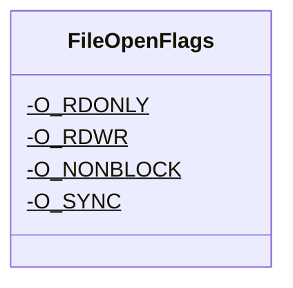

<div id="Interop-class-diagram"></div>

##### `Interop` class diagram

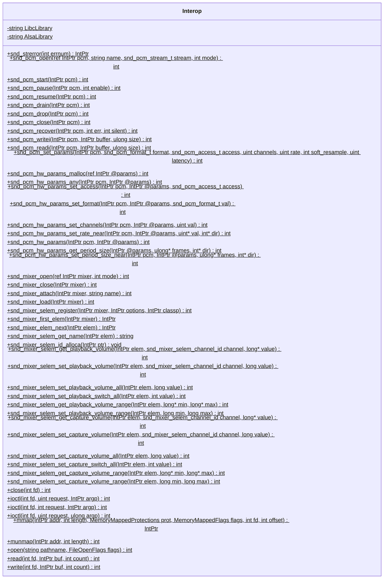

<div id="MemoryMappedFlags-class-diagram"></div>

##### `MemoryMappedFlags` class diagram

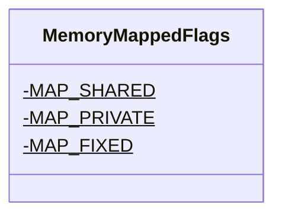

<div id="MemoryMappedProtections-class-diagram"></div>

##### `MemoryMappedProtections` class diagram

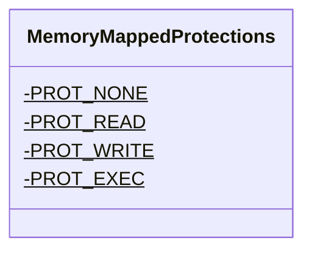

<div id="snd_mixer_selem_channel_id-class-diagram"></div>

##### `snd_mixer_selem_channel_id` class diagram

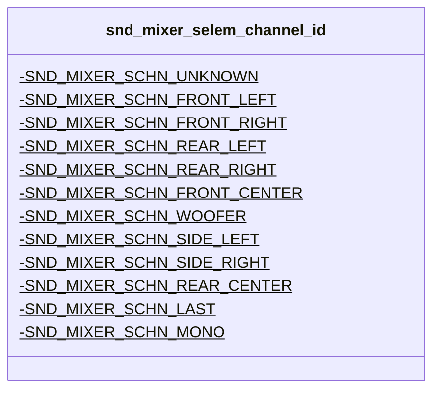

<div id="snd_pcm_access_t-class-diagram"></div>

##### `snd_pcm_access_t` class diagram

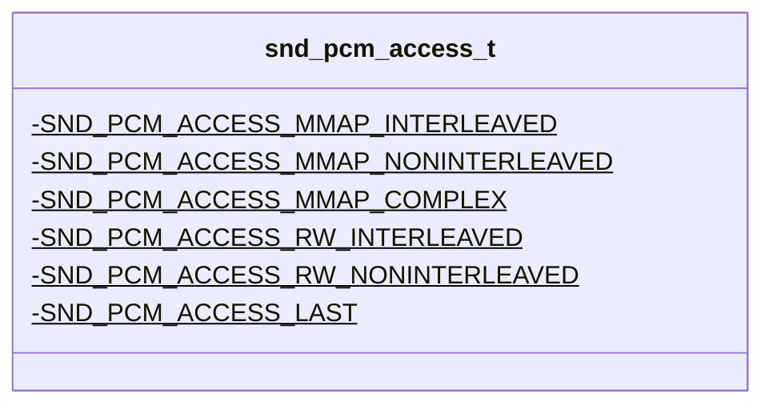

<div id="snd_pcm_format_t-class-diagram"></div>

##### `snd_pcm_format_t` class diagram

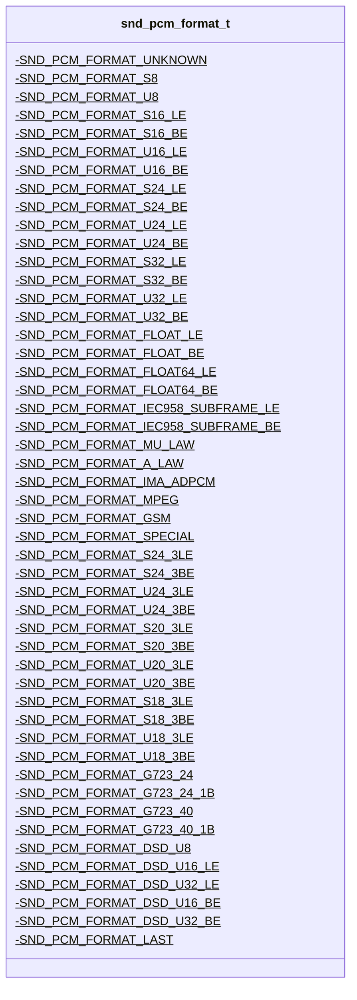

<div id="snd_pcm_stream_t-class-diagram"></div>

##### `snd_pcm_stream_t` class diagram

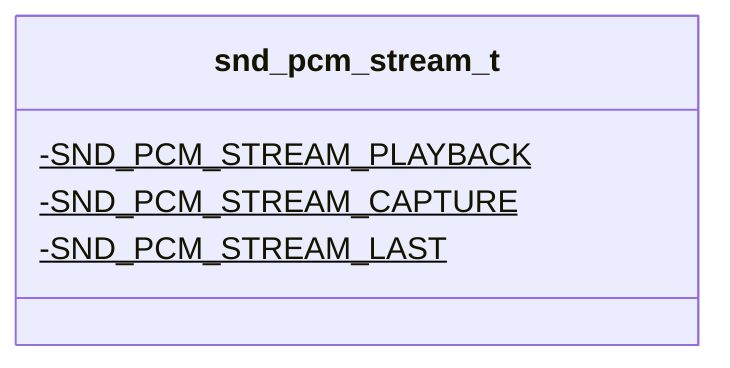

<div id="SoundConnectionSettings-class-diagram"></div>

##### `SoundConnectionSettings` class diagram

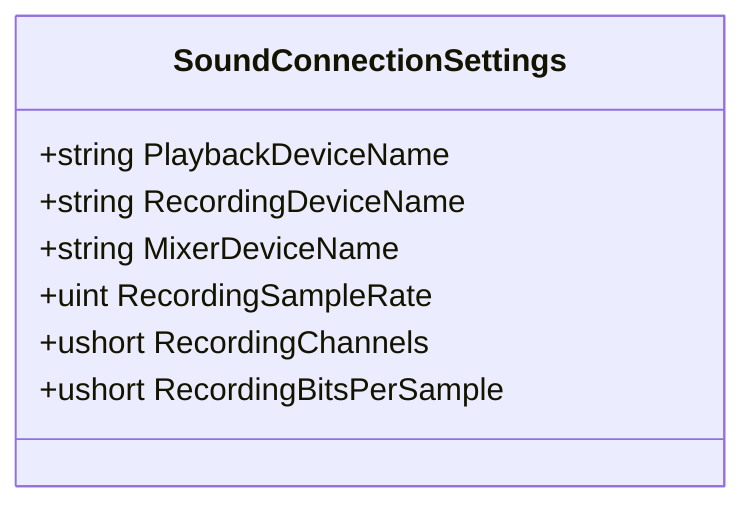

<div id="SoundDevice-class-diagram"></div>

##### `SoundDevice` class diagram

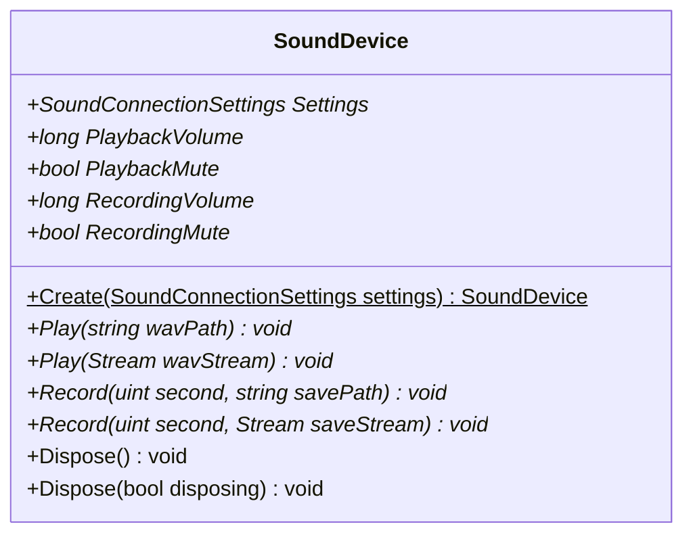

<div id="UnixSoundDevice-class-diagram"></div>

##### `UnixSoundDevice` class diagram

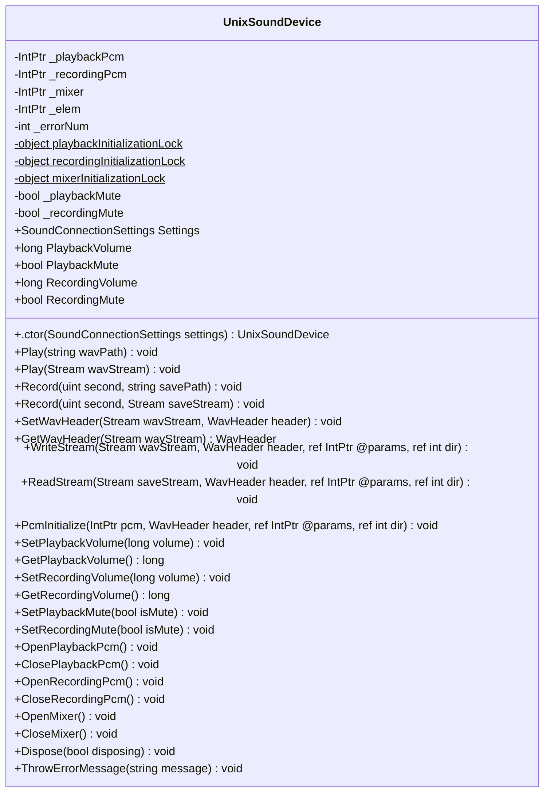

<div id="WavHeader-class-diagram"></div>

##### `WavHeader` class diagram

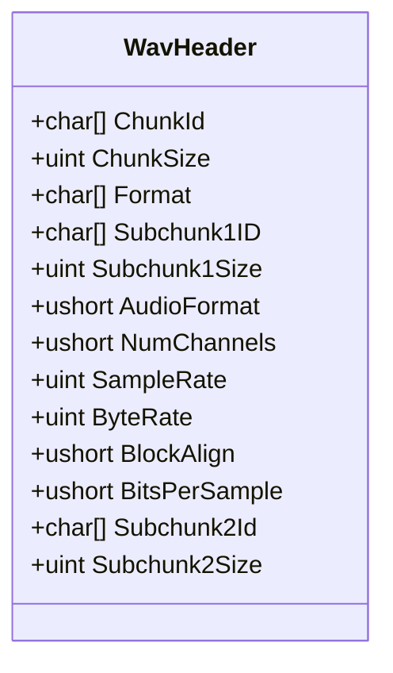

<div id="BitReader-class-diagram"></div>

##### `BitReader` class diagram

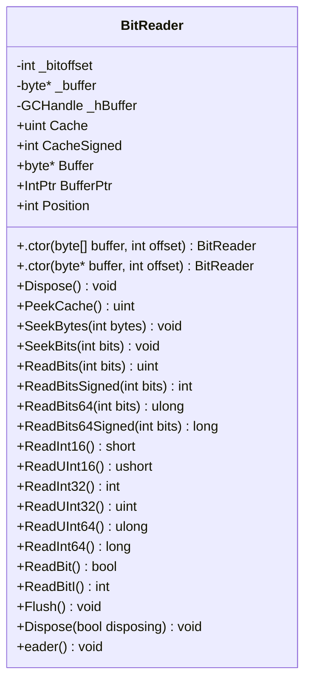

<div id="BlockingStrategy-class-diagram"></div>

##### `BlockingStrategy` class diagram

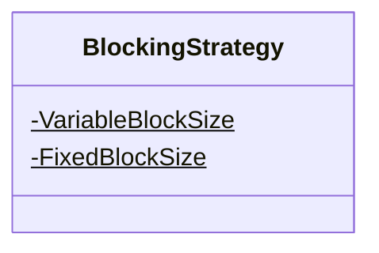

<div id="ChannelAssignment-class-diagram"></div>

##### `ChannelAssignment` class diagram

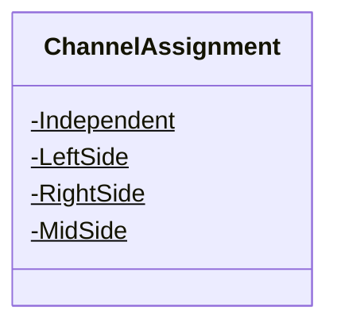

<div id="ChannelMask-class-diagram"></div>

##### `ChannelMask` class diagram

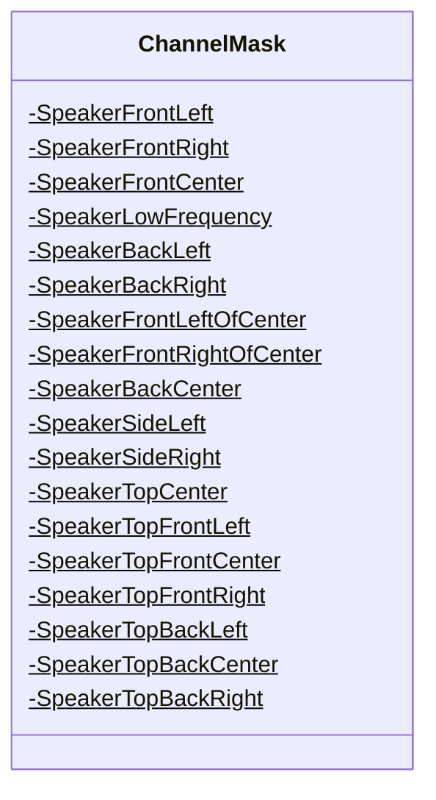

<div id="FlacBitReader-class-diagram"></div>

##### `FlacBitReader` class diagram

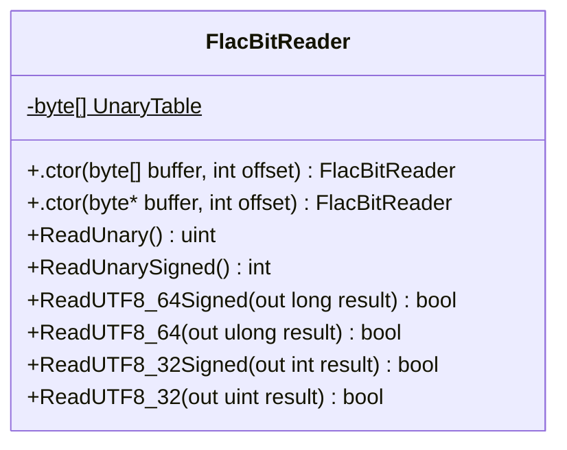

<div id="FlacConstant-class-diagram"></div>

##### `FlacConstant` class diagram

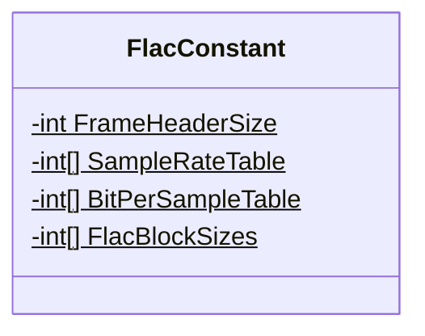

<div id="FlacException-class-diagram"></div>

##### `FlacException` class diagram

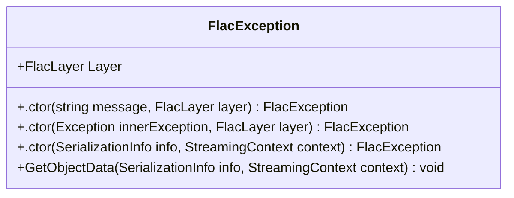

<div id="FlacFrame-class-diagram"></div>

##### `FlacFrame` class diagram

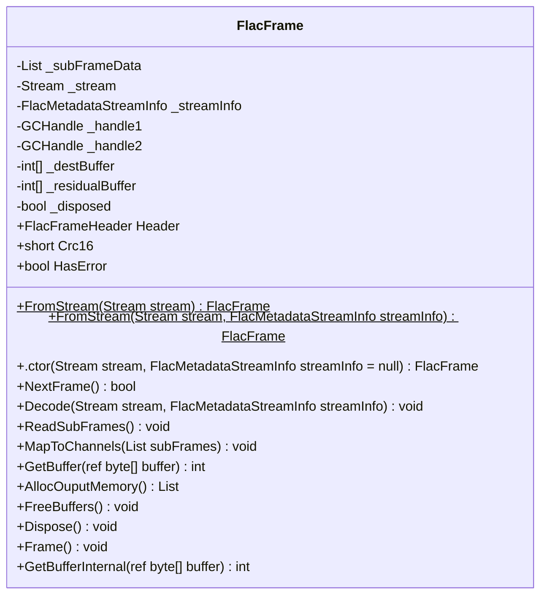

<div id="FlacFrameHeader-class-diagram"></div>

##### `FlacFrameHeader` class diagram

```mermaid
classDiagram
class FlacFrameHeader{
    -int _blocksizeHint
    -int _sampleRateHint
    -bool PrintErrors
    +int BlockSize
    +int SampleRate
    +int Channels
    +ChannelAssignment ChannelAssignment
    +int BitsPerSample
    +BlockingStrategy BlockingStrategy
    +long SampleNumber
    +int FrameNumber
    +byte Crc8
    +bool DoCrc
    +bool HasError
    +long StreamPosition
    +.ctor(Stream stream) FlacFrameHeader
    +.ctor(Stream stream, FlacMetadataStreamInfo streamInfo) FlacFrameHeader
    +.ctor(Stream stream, FlacMetadataStreamInfo streamInfo, bool doCrc) FlacFrameHeader
    +.ctor(ref byte* buffer, FlacMetadataStreamInfo streamInfo, bool doCrc) FlacFrameHeader
    +.ctor(ref byte* buffer, FlacMetadataStreamInfo streamInfo, bool doCrc, bool logError) FlacFrameHeader
    +ParseHeader(Stream stream, FlacMetadataStreamInfo streamInfo) bool
    +ParseHeader(ref byte* headerBuffer, FlacMetadataStreamInfo streamInfo) bool
    +Error(string msg, string location) void
    +IsFormatEqualTo(FlacFrameHeader other) bool
}

```

<div id="FlacFrameInformation-class-diagram"></div>

##### `FlacFrameInformation` class diagram

```mermaid
classDiagram
class FlacFrameInformation{
    +FlacFrameHeader Header
    +bool IsFirstFrame
    +long StreamOffset
    +long SampleOffset
}

```

<div id="FlacLayer-class-diagram"></div>

##### `FlacLayer` class diagram

```mermaid
classDiagram
class FlacLayer{
    -OutSideOfFrame$
    -Metadata$
    -Frame$
    -SubFrame$
}

```

<div id="FlacPartitionedRice-class-diagram"></div>

##### `FlacPartitionedRice` class diagram

```mermaid
classDiagram
class FlacPartitionedRice{
    +ProcessResidual(FlacBitReader reader, FlacFrameHeader header, FlacSubFrameData data, int order, int partitionOrder, FlacResidualCodingMethod codingMethod)$ void
    +ReadFlacRiceBlock(FlacBitReader reader, int nvals, int riceParameter, int* ptrDest)$ void
}

```

<div id="FlacPartitionedRiceContent-class-diagram"></div>

##### `FlacPartitionedRiceContent` class diagram

```mermaid
classDiagram
class FlacPartitionedRiceContent{
    -int _capByOrder
    -int[] Parameters
    -int[] RawBits
    +UpdateSize(int partitionOrder) void
}

```

<div id="FlacPreScan-class-diagram"></div>

##### `FlacPreScan` class diagram

```mermaid
classDiagram
class FlacPreScan{
    -int BufferSize$
    -Stream _stream
    -bool _isRunning
    +List<FlacFrameInformation> Frames
    +long TotalLength
    +long TotalSamples
    +.ctor(Stream stream) FlacPreScan
    +ScanStream(FlacMetadataStreamInfo streamInfo, FlacPreScanMode mode) void
    +StartScan(FlacMetadataStreamInfo streamInfo, FlacPreScanMode mode) void
    +RunScan(FlacMetadataStreamInfo streamInfo) List<FlacFrameInformation>
    +RaiseScanFinished(List<FlacFrameInformation> frames) void
    +ScanThisShit(FlacMetadataStreamInfo streamInfo) List<FlacFrameInformation>
    +IsFrame(ref byte* buffer, FlacMetadataStreamInfo streamInfo, out FlacFrameHeader header) bool
}

```

<div id="FlacPreScanFinishedEventArgs-class-diagram"></div>

##### `FlacPreScanFinishedEventArgs` class diagram

```mermaid
classDiagram
class FlacPreScanFinishedEventArgs{
    +ReadOnlyCollection<FlacFrameInformation> Frames
    +.ctor(List<FlacFrameInformation> frames) FlacPreScanFinishedEventArgs
}

```

<div id="FlacPreScanMode-class-diagram"></div>

##### `FlacPreScanMode` class diagram

```mermaid
classDiagram
class FlacPreScanMode{
    -None$
    -Sync$
    -Async$
    -Default$
}

```

<div id="FlacReader-class-diagram"></div>

##### `FlacReader` class diagram

```mermaid
classDiagram
IDisposable <|-- FlacReader : implements
class FlacReader{
    -object _bufferLock
    -bool _closeStream
    -FlacPreScan _scan
    -Stream _stream
    -FlacMetadataStreamInfo _streamInfo
    -WaveFormat _waveFormat
    -FlacFrame _frame
    -int _frameIndex
    -byte[] _overflowBuffer
    -int _overflowCount
    -int _overflowOffset
    -long _position
    -bool _disposed
    +ReadOnlyCollection<FlacMetadata> Metadata
    +WaveFormat WaveFormat
    +bool CanSeek
    +FlacFrame Frame
    +long Position
    +long Length
    +.ctor(string fileName) FlacReader
    +.ctor(Stream stream) FlacReader
    +.ctor(Stream stream, FlacPreScanMode scanFlag) FlacReader
    +.ctor(Stream stream, FlacPreScanMode scanFlag, Action<FlacPreScanFinishedEventArgs> onscanFinished) FlacReader
    +Dispose() void
    +CreateWaveFormat(FlacMetadataStreamInfo streamInfo) WaveFormat
    +Read(byte[] buffer, int offset, int count) int
    +GetOverflows(byte[] buffer, ref int offset, int count) int
    +Dispose(bool disposing) void
    +ReadBytes(int count) byte[]
    +CheckForDisposed() void
    +Reader() void
}

```

<div id="FlacResidualCodingMethod-class-diagram"></div>

##### `FlacResidualCodingMethod` class diagram

```mermaid
classDiagram
class FlacResidualCodingMethod{
    -PartitionedRice$
    -PartitionedRice2$
    -Invalid2$
    -Invalid3$
}

```

<div id="FlacSubFrameData-class-diagram"></div>

##### `FlacSubFrameData` class diagram

```mermaid
classDiagram
class FlacSubFrameData{
    -FlacPartitionedRiceContent Content
    -int* DestinationBuffer
    -int* ResidualBuffer
}

```

<div id="DefaultFlacMetadata-class-diagram"></div>

##### `DefaultFlacMetadata` class diagram

```mermaid
classDiagram
class DefaultFlacMetadata{
    +FlacMetaDataType MetaDataType
    +.ctor(FlacMetaDataType metadataType) DefaultFlacMetadata
    +InitializeByStream(Stream stream) void
}

```

<div id="FlacMetadata-class-diagram"></div>

##### `FlacMetadata` class diagram

```mermaid
classDiagram
class FlacMetadata{
    +FlacMetaDataType MetaDataType*
    +bool IsLastMetaBlock
    +int Length
    +FromStream(Stream stream)$ FlacMetadata
    +ReadAllMetadataFromStream(Stream stream)$ IEnumerable<FlacMetadata>
    +SkipMetadata(Stream stream)$ void
    +Initialize(Stream stream, int length, bool isLastBlock) void
    +InitializeByStream(Stream stream)* void
}

```

<div id="FlacMetadataFactory-class-diagram"></div>

##### `FlacMetadataFactory` class diagram

```mermaid
classDiagram
class FlacMetadataFactory{
    -Dictionary<int, Type> _registeredmetadataTypes
    +FlacMetadataFactory Instance$
    +.ctor() FlacMetadataFactory
    +RegistermetadataType<T>(FlacMetaDataType metadataType) void
    +RegistermetadataType<T>(int metadataType) void
    +ParseMetadata(Stream stream) FlacMetadata
    +CreateFlacMetadataInstance(FlacMetaDataType flacMetadataType) FlacMetadata
}

```

<div id="FlacMetadataSeekTable-class-diagram"></div>

##### `FlacMetadataSeekTable` class diagram

```mermaid
classDiagram
class FlacMetadataSeekTable{
    +int EntryCount
    +FlacSeekPoint[] SeekPoints
    +FlacSeekPoint this[int index]
    +FlacMetaDataType MetaDataType
    +InitializeByStream(Stream stream) void
}

```

<div id="FlacMetadataStreamInfo-class-diagram"></div>

##### `FlacMetadataStreamInfo` class diagram

```mermaid
classDiagram
class FlacMetadataStreamInfo{
    +FlacMetaDataType MetaDataType
    +short MinBlockSize
    +short MaxBlockSize
    +int MaxFrameSize
    +int MinFrameSize
    +int SampleRate
    +int Channels
    +int BitsPerSample
    +long TotalSamples
    +string Md5
    +InitializeByStream(Stream stream) void
}

```

<div id="FlacMetaDataType-class-diagram"></div>

##### `FlacMetaDataType` class diagram

```mermaid
classDiagram
class FlacMetaDataType{
    -StreamInfo$
    -Padding$
    -Application$
    -Seektable$
    -VorbisComment$
    -CueSheet$
    -Picture$
    -Undef$
}

```

<div id="FlacSeekPoint-class-diagram"></div>

##### `FlacSeekPoint` class diagram

```mermaid
classDiagram
class FlacSeekPoint{
    -long PlaceHolderPointSampleNumber
    +long SampleNumber
    +long Offset
    +int FrameSize
    +.ctor() FlacSeekPoint
    +.ctor(long sampleNumber, long offset, int frameSize) FlacSeekPoint
}

```

<div id="FlacResidual-class-diagram"></div>

##### `FlacResidual` class diagram

```mermaid
classDiagram
class FlacResidual{
    +.ctor(FlacBitReader reader, FlacFrameHeader header, FlacSubFrameData data, int order) FlacResidual
}

```

<div id="FlacSubFrameBase-class-diagram"></div>

##### `FlacSubFrameBase` class diagram

```mermaid
classDiagram
class FlacSubFrameBase{
    +GetSubFrame(FlacBitReader reader, FlacSubFrameData data, FlacFrameHeader header, int bitsPerSample)$ FlacSubFrameBase
    +.ctor(FlacFrameHeader header) FlacSubFrameBase
}

```

<div id="FlacSubFrameConstant-class-diagram"></div>

##### `FlacSubFrameConstant` class diagram

```mermaid
classDiagram
class FlacSubFrameConstant{
    +.ctor(FlacBitReader reader, FlacFrameHeader header, FlacSubFrameData data, int bitsPerSample) FlacSubFrameConstant
}

```

<div id="FlacSubFrameFixed-class-diagram"></div>

##### `FlacSubFrameFixed` class diagram

```mermaid
classDiagram
class FlacSubFrameFixed{
    +.ctor(FlacBitReader reader, FlacFrameHeader header, FlacSubFrameData data, int bitsPerSample, int order) FlacSubFrameFixed
    +RestoreSignal(FlacSubFrameData subframeData, int length, int order) void
}

```

<div id="FlacSubFrameLPC-class-diagram"></div>

##### `FlacSubFrameLPC` class diagram

```mermaid
classDiagram
class FlacSubFrameLPC{
    +.ctor(FlacBitReader reader, FlacFrameHeader header, FlacSubFrameData data, int bitsPerSample, int order) FlacSubFrameLPC
    +Log2(int x) int
    +RestoreLPCSignal32(int* residual, int* destination, int length, int order, int[] qlpCoeff, int lpcShiftNeeded) void
    +RestoreLPCSignal64(int* residual, int* destination, int length, int order, int[] qlpCoeff, int lpcShiftNeeded) void
}

```

<div id="FlacSubFrameVerbatim-class-diagram"></div>

##### `FlacSubFrameVerbatim` class diagram

```mermaid
classDiagram
class FlacSubFrameVerbatim{
    +.ctor(FlacBitReader reader, FlacFrameHeader header, FlacSubFrameData data, int bitsPerSample) FlacSubFrameVerbatim
}

```

<div id="CRC8-class-diagram"></div>

##### `CRC8` class diagram

```mermaid
classDiagram
class CRC8{
    -CRC8 _instance$
    +CRC8 Instance$
    +.ctor() CRC8
    +CalcCheckSum(byte[] buffer, int offset, int count) byte
    +CalcCheckSum(byte* buffer, int offset, int count) byte
}

```

<div id="CRCBase&lt;T&gt;-class-diagram"></div>

##### `CRCBase<T>` class diagram

```mermaid
classDiagram
class CRCBase<T>{
    -int tableSize
    -ushort[] crc_table
    +CalcTable(int bits) void
    +CalcCheckSum(byte[] buffer, int offset, int count)* T
}

```

<div id="MidiMetadata-class-diagram"></div>

##### `MidiMetadata` class diagram

```mermaid
classDiagram
class MidiMetadata{
    +MidiFile OGInfo
    +.ctor(MidiFile theTrack) MidiMetadata
}

```

<div id="MidiMetadataProvider-class-diagram"></div>

##### `MidiMetadataProvider` class diagram

```mermaid
classDiagram
class MidiMetadataProvider{
    +string Name
    +string Description
    +WrappedStream Icon
    +Version? Version
    +string Licenses
    +List<Tuple<Uri, URLType>>? Links
    +CanGetMetadata(WrappedStream stream) bool
    +GetMetadata(WrappedStream stream) Task<Metadata?>
}

```

<div id="VorbisNaudioWaveStreamWrapper-class-diagram"></div>

##### `VorbisNaudioWaveStreamWrapper` class diagram

```mermaid
classDiagram
class VorbisNaudioWaveStreamWrapper{
    +IReadOnlyList<MimeType> SupportedMimeTypes
    +GetPlayingAbility(WrappedStream stream) byte
    +GetStream(WrappedStream stream) WaveStream
}

```

<div id="AlbumView-class-diagram"></div>

##### `AlbumView` class diagram

```mermaid
classDiagram
class AlbumView{
    +.ctor() AlbumView
    +InitializeComponent() void
}

```

<div id="AuthInfoWindow-class-diagram"></div>

##### `AuthInfoWindow` class diagram

```mermaid
classDiagram
class AuthInfoWindow{
    -JellyFinHelper jellyFinHelper
    -string ServerURL
    -bool Success
    +.ctor() AuthInfoWindow
    +.ctor(JellyFinHelper jellyFinHelper) AuthInfoWindow
    +InitializeComponent() void
    +ButtonClick(object? sender, RoutedEventArgs e) void
}

```

<div id="FakeMemoryStreamReference-class-diagram"></div>

##### `FakeMemoryStreamReference` class diagram

```mermaid
classDiagram
IDisposable <|-- FakeMemoryStreamReference : implements
class FakeMemoryStreamReference{
    -long FakePos
    -MemoryStream Fakestream
    -MemoryStream Realstream
    +bool CanRead
    +bool CanSeek
    +bool CanWrite
    +long Length
    +long Position
    +.ctor(MemoryStream realstream) FakeMemoryStreamReference
    +Dispose() void
    +Flush() void
    +Read(byte[] buffer, int offset, int count) int
    +Seek(long offset, SeekOrigin origin) long
    +SetLength(long value) void
    +Write(byte[] buffer, int offset, int count) void
}

```

<div id="Gui-class-diagram"></div>

##### `Gui` class diagram

```mermaid
classDiagram
class Gui{
    -GuiBinding g
    -JellyFinHelper helper
    -JellyFinPlayStreamProvider jellyFinPlayStreamProvider
    +.ctor() Gui
    +.ctor(JellyFinPlayStreamProvider jellyFinPlayStreamProvider) Gui
    +Button_Click(object? sender, RoutedEventArgs e) void
    +AddEntireScreen(object? sender, RoutedEventArgs e) void
    +Gui_Opened(object? sender, EventArgs e) void
    +LB_DoubleTapped(object? sender, RoutedEventArgs e) void
    +InitializeComponent() void
}

```

<div id="GuiBinding-class-diagram"></div>

##### `GuiBinding` class diagram

```mermaid
classDiagram
class GuiBinding{
    +ObservableCollection<WrappedDto> SearchResults
}

```

<div id="JellyFinHelper-class-diagram"></div>

##### `JellyFinHelper` class diagram

```mermaid
classDiagram
class JellyFinHelper{
    -IUniversalAudioClient audioClient
    -AuthInfoWindow authwindow
    -IImageClient imageClient
    -IItemsClient itemsClient
    -ServerUrlWindow serverwindow
    -SdkClientSettings settings
    -ISystemClient systemClient
    -IUserClient userClient
    -UserDto userDto
    -IUserLibraryClient userLibraryClient
    -IUserViewsClient userViewsClient
    -bool validServer
    -bool validUser
    +.ctor() JellyFinHelper
    +GetItemsFromItem(BaseItemDto dto) Task<IReadOnlyList<BaseItemDto>>
    +MakeSureUserLogsIn(Gui gui) Task
    +GetDefaultItems() Task<IReadOnlyList<BaseItemDto>>
    +TryLogInAsync(string username, string password) Task<bool>
    +TryGetSystemInfoAsync(string host) Task<bool>
    +GetStream(BaseItemDto dto) Task<WrappedStream>
    +GetImageStream(BaseItemDto dto) Task<WrappedStream?>
    +LogIn(Gui gui) Task<bool>
    +GetServerUrl(Gui gui) Task<bool>
}

```

<div id="JellyFinPlayStreamProvider-class-diagram"></div>

##### `JellyFinPlayStreamProvider` class diagram

```mermaid
classDiagram
class JellyFinPlayStreamProvider{
    -Gui gui
    +IPlayStreamProviderListner ProviderListner
    +string Name
    +string Description
    +WrappedStream? Icon
    +Version? Version
    +string Licenses
    +List<Tuple<Uri, URLType>>? Links
    +.ctor() JellyFinPlayStreamProvider
    +ShowGui() void
}

```

<div id="ServerUrlWindow-class-diagram"></div>

##### `ServerUrlWindow` class diagram

```mermaid
classDiagram
class ServerUrlWindow{
    -JellyFinHelper jellyFinHelper
    -string ServerURL
    -bool Success
    +.ctor() ServerUrlWindow
    +.ctor(JellyFinHelper jellyFinHelper) ServerUrlWindow
    +InitializeComponent() void
    +ButtonClick(object? sender, RoutedEventArgs e) void
}

```

<div id="WrappedDto-class-diagram"></div>

##### `WrappedDto` class diagram

```mermaid
classDiagram
class WrappedDto{
    -BaseItemDto dto
    +string Name
    +string AlbumArtist
    +bool? IsFolder
    +int? IndexNumber
    +Bitmap? Cover
    +.ctor(BaseItemDto dto, WrappedStream? ws = null) WrappedDto
}

```

<div id="WrappedJellyFinStream-class-diagram"></div>

##### `WrappedJellyFinStream` class diagram

```mermaid
classDiagram
IDisposable <|-- WrappedJellyFinStream : implements
class WrappedJellyFinStream{
    -IUniversalAudioClient audioClient
    -bool disposedValue
    -BaseItemDto dto
    -MemoryStream FStream
    -Stream rs
    -BaseItemDto song
    -Thread t
    -UserDto userDto
    +List<Stream> Streams
    +MimeType MimeType
    +MimeType _MimeType
    +.ctor(IUniversalAudioClient ac, UserDto user, BaseItemDto baseItemDto) WrappedJellyFinStream
    +Dispose() void
    +CopyToMS() void
    +InternalGetStream() Stream
    +GetStream() Stream
    +Dispose(bool disposing) void
}

```

<div id="WrappedStreamImplementedByOneRealOne-class-diagram"></div>

##### `WrappedStreamImplementedByOneRealOne` class diagram

```mermaid
classDiagram
class WrappedStreamImplementedByOneRealOne{
    -Stream RealStream
    +MimeType MimeType
    +.ctor(MimeType mimeType, Stream RealStream) WrappedStreamImplementedByOneRealOne
    +GetStream() Stream
}

```

<div id="ActionDataContext-class-diagram"></div>

##### `ActionDataContext` class diagram

```mermaid
classDiagram
class ActionDataContext{
    +ObservableCollection<SAction> Actions
}

```

<div id="App-class-diagram"></div>

##### `App` class diagram

```mermaid
classDiagram
class App{
    -CompositionHost Container
    +Initialize() void
    +GetThemePreference(bool fallback = false)$ bool
    +OnFrameworkInitializationCompleted() void
    +ChangeTheme(bool dark)$ void
}

```

<div id="Config-class-diagram"></div>

##### `Config` class diagram

```mermaid
classDiagram
ILetNotify <|-- Config : implements
class Config{
    -bool _AllowedRead
    +RepeatState LoopType
    +byte Volume
    +bool AllowedToRead
    +Invoke(object e, PropertyChangedEventArgs a) void
}

```

<div id="ConfigureWindow-class-diagram"></div>

##### `ConfigureWindow` class diagram

```mermaid
classDiagram
class ConfigureWindow{
    +.ctor() ConfigureWindow
    +GetControl(IConfigurableElement element) Control
    +HandleConfiguration(IAmConfigurable configurable) void
}

```

<div id="DC-class-diagram"></div>

##### `DC` class diagram

```mermaid
classDiagram
class DC{
    +ObservableCollection<Field> ValuePairs
    +ObservableCollection<Bitmap?> Bitmaps
}

```

<div id="DContext-class-diagram"></div>

##### `DContext` class diagram

```mermaid
classDiagram
class DContext{
    -Bitmap picture
    +Bitmap Picture
}

```

<div id="Field-class-diagram"></div>

##### `Field` class diagram

```mermaid
classDiagram
class Field{
    +ObservableCollection<Field> SubFields
    +string FieldName
    +string FieldValue
    +.ctor(string name, string value) Field
}

```

<div id="Info-class-diagram"></div>

##### `Info` class diagram

```mermaid
classDiagram
class Info{
    -MainWindow MainWindow
    +.ctor() Info
    +.ctor(MainWindow mainWindow) Info
    +ElementDoubleTapped(object _, RoutedEventArgs args) void
}

```

<div id="InfoPRecord-class-diagram"></div>

##### `InfoPRecord` class diagram

```mermaid
classDiagram
IEquatable~InfoPRecord~ <|-- InfoPRecord : implements
class InfoPRecord{
    +string Name
    +string Description
    +Version? Version
    +IImage? Icon
    +string Licenses
    +ICodeInformation Item
    +bool Configurable
    +bool IsPlayStreamProvider
    +.ctor(string Name, string Description, Version? Version, IImage? Icon, string Licenses, ICodeInformation Item, bool Configurable, bool IsPlayStreamProvider) InfoPRecord
}

```

<div id="LaunchActionsWindow-class-diagram"></div>

##### `LaunchActionsWindow` class diagram

```mermaid
classDiagram
class LaunchActionsWindow{
    -ActionDataContext x
    +.ctor() LaunchActionsWindow
    +ElementDoubleTapped(object _, RoutedEventArgs args) void
    +AddActions(List<SAction> action) void
}

```

<div id="LyricsView-class-diagram"></div>

##### `LyricsView` class diagram

```mermaid
classDiagram
class LyricsView{
    -MainWindow mainWindow
    +.ctor() LyricsView
    +.ctor(MainWindow mainWindow) LyricsView
}

```

<div id="MainWindow-class-diagram"></div>

##### `MainWindow` class diagram

```mermaid
classDiagram
class MainWindow{
    -Config config
    -string ConfigPath
    -MainWindowContext dc
    -bool en
    -bool en2
    -MetadataView? metadataView
    -CommentXmlConfigReaderNotifyWhenChanged<Config> reader
    -Thread? th
    -CancellationTokenSource? token
    +Logic<MainWindowContext> Logic
    +IPlay? Player
    +Song? CurrentSong
    +.ctor() MainWindow
    +RepeatButton_Click(object? sender, RoutedEventArgs e) void
    +SetPBColor(IBrush c) void
    +TreeView_PointerPressed1(object? sender, PointerPressedEventArgs e) void
    +TreeView_PointerReleased(object? sender, PointerReleasedEventArgs e) void
    +TreeView_PointerMoved(object? sender, PointerEventArgs e) void
    +Settings_Click(object? sender, RoutedEventArgs e) void
    +MainWindow_Opened(object? sender, EventArgs e) void
    +MainWindow_Closing(object? sender, CancelEventArgs e) void
    +TreeView_DoubleTapped(object? sender, RoutedEventArgs e) void
    +StopButton_Click(object? sender, RoutedEventArgs e) void
    +LyricsButton_Click(object? sender, RoutedEventArgs e) void
    +Metadata_Click(object? sender, PointerPressedEventArgs e) void
    +PB_PointerReleased(object? sender, PointerReleasedEventArgs e) void
    +PauseButton_Click(object? sender, RoutedEventArgs e) void
    +PlayButton_Click(object? sender, RoutedEventArgs e) void
    +Play() void
    +Pause() void
    +SndThrd(CancellationToken e) void
    +RemoveTrack() void
    +OutputDevice_PlaybackStopped(object? sender, object o) void
    +DragOver(object sender, DragEventArgs e) void
    +Drop(object sender, DragEventArgs e) void
    +ClearAll(object sender, RoutedEventArgs e) void
    +AddFilee(object sender, RoutedEventArgs e) void
    +RemoveSelected(object sender, RoutedEventArgs e) void
}

```

<div id="MainWindowContext-class-diagram"></div>

##### `MainWindowContext` class diagram

```mermaid
classDiagram
class MainWindowContext{
    -MainWindow mainWindow
    -GradientStops _GradientStops
    -IBrush _pbForeGround
    -string _Title
    +IBrush PBForeground
    +SelectionModel<Song> Selection
    +string Title
    +GradientStops GradientStops
    +.ctor(MainWindow mw) MainWindowContext
    +RunTheThing() void
    +LyricsView() void
}

```

<div id="MetadataView-class-diagram"></div>

##### `MetadataView` class diagram

```mermaid
classDiagram
class MetadataView{
    -DC dataContext
    -ILogger? Log
    -Song s
    +.ctor() MetadataView
    +LoadSong(Song s) void
    +MetadataView_Opened(object? sender, EventArgs e) void
    +ProcessSubProperties(object thing, Field parentfield, int allowedlength = 6) void
    +InitializeComponent() void
    +IMG_DoubleTapped(object? sender, RoutedEventArgs e) void
}

```

<div id="NullableReplacingConverter-class-diagram"></div>

##### `NullableReplacingConverter` class diagram

```mermaid
classDiagram
class NullableReplacingConverter{
    +Convert(IList<object?> values, Type targetType, object? parameter, CultureInfo culture) object?
}

```

<div id="PictureViewer-class-diagram"></div>

##### `PictureViewer` class diagram

```mermaid
classDiagram
class PictureViewer{
    -IReadOnlyList<Picture>? pictures
    -int pos
    -DContext x
    +.ctor() PictureViewer
    +.ctor(IReadOnlyList<Picture>? pictures) PictureViewer
    +Left(object? sender, RoutedEventArgs e) void
    +Right(object? sender, RoutedEventArgs e) void
    +Copy(object? sender, RoutedEventArgs e) void
}

```

<div id="Program-class-diagram"></div>

##### `Program` class diagram

```mermaid
classDiagram
class Program{
    +Main(string[] args)$ void
    +BuildAvaloniaApp()$ AppBuilder
}

```

<div id="ProvidersReturnedNullException-class-diagram"></div>

##### `ProvidersReturnedNullException` class diagram

```mermaid
classDiagram
class ProvidersReturnedNullException{
    +.ctor() ProvidersReturnedNullException
    +.ctor(string message) ProvidersReturnedNullException
    +.ctor(string message, Exception inner) ProvidersReturnedNullException
    +.ctor(SerializationInfo info, StreamingContext context) ProvidersReturnedNullException
}

```

<div id="RelativePointConverter-class-diagram"></div>

##### `RelativePointConverter` class diagram

```mermaid
classDiagram
class RelativePointConverter{
    +Convert(object? value, Type targetType, object? parameter, CultureInfo culture) object?
    +ConvertBack(object? value, Type targetType, object? parameter, CultureInfo culture) object?
}

```

<div id="SAction-class-diagram"></div>

##### `SAction` class diagram

```mermaid
classDiagram
class SAction{
    +string ActionName
    +Action ActionToInvoke
    +Invoke() void
}

```

<div id="SAPAvaloniaListner-class-diagram"></div>

##### `SAPAvaloniaListner` class diagram

```mermaid
classDiagram
class SAPAvaloniaListner{
    -MainWindow mainWindow
    +.ctor(MainWindow mainWindow) SAPAvaloniaListner
    +GetEnviroment() IPlayerEnviroment
    +LoadSong(WrappedStream s) void
    +LoadSongs(IEnumerable<WrappedStream> streams) void
}

```

<div id="SAPAvaloniaPlayerEnviroment-class-diagram"></div>

##### `SAPAvaloniaPlayerEnviroment` class diagram

```mermaid
classDiagram
class SAPAvaloniaPlayerEnviroment{
    +string Name
    +string Description
    +WrappedStream? Icon
    +Version? Version
    +List<Tuple<Uri, URLType>>? Links
    +string Licenses
}

```

<div id="SAPAWindowExtensions-class-diagram"></div>

##### `SAPAWindowExtensions` class diagram

```mermaid
classDiagram
class SAPAWindowExtensions{
    -GradientStops defBGStops$
    +DoAfterInitTasksF(Window w)$ void
}

```

<div id="Settings-class-diagram"></div>

##### `Settings` class diagram

```mermaid
classDiagram
class Settings{
    -MainWindow mainWindow
    -GradientStops defPBStops$
    +.ctor() Settings
    +.ctor(MainWindow mainWindow) Settings
    +ettings.GetInfoRecords(List<ICodeInformation> info)$ Tuple<ObservableCollection<InfoPRecord>,
    +DecodeImage(WrappedStream? stream, int width = 80)$ IImage?
    +OpenBrowser(string url)$ void
    +ElementDoubleTapped(object _, RoutedEventArgs args) void
    +ConfigureClick(object button, RoutedEventArgs args) void
    +PlayProviderClick(object button, RoutedEventArgs args) void
    +GetHumanName(URLType type)$ string
    +GetHumanerName(URLType type)$ string
    +ShowElementActionWindow(InfoPRecord element, MainWindow mainWindow)$ void
    +TransparencyDown_SelectionChanged(object? sender, SelectionChangedEventArgs e) void
    +RegisterInReg() void
    +DeleteRegistryFolder(RegistryHive registryHive, string fullPathKeyToDelete)$ void
    +RemoveFromReg() void
    +RegisterClick(object? sender, RoutedEventArgs e) void
    +ToggleTransparency(object? sender, RoutedEventArgs e) void
    +ChangeColorPB(object? sender, RoutedEventArgs e) void
    +ChangeColor(object? sender, RoutedEventArgs e) void
    +InitializeComponent() void
}

```

<div id="SettingsDC-class-diagram"></div>

##### `SettingsDC` class diagram

```mermaid
classDiagram
class SettingsDC{
    +WindowTransparencyLevel[] TransparencyTypes
    +KnownColor[] AutoSuggestColours
    +ObservableCollection<InfoPRecord> Items
}

```

<div id="CADMusicStatusInterface-class-diagram"></div>

##### `CADMusicStatusInterface` class diagram

```mermaid
classDiagram
IMusicStatusInterface <|-- CADMusicStatusInterface : implements
class CADMusicStatusInterface{
    -int GWL_WNDPROC$
    -int WM_USER$
    -string arglpWindowName$
    -int WM_COPYDATA$
    -bool disposedValue
    -List<GCHandle> Handles
    -IntPtr PrevProc
    +ILogger? logger
    +string Name
    +string Description
    +WrappedStream? Icon
    +Version? Version
    +string Licenses
    +List<Tuple<Uri, URLType>>? Links
    +.ctor() CADMusicStatusInterface
    +StartIPC() void
    +StopIPC() void
    +Dispose() void
    +TrackChangedNotification(Song? newtrack) void
    +PlayerStateChanged(PlaybackState newstate) void
    +CopyMemory(object hpvDest, object hpvSource, long cbCopy)$ void
    +FindWindow(string? lpClassName, string lpWindowName)$ long
    +SendMessage(long hwnd, long wMsg, long wParam, CopyDataStruct lParam)$ long
    +SendMessage(long hwnd, long wMsg, long wParam, long lParam)$ long
    +CallWindowProc(IntPtr lpPrevWndFunc, IntPtr hwnd, long msg, IntPtr wParam, IntPtr lParam)$ long
    +PostMessage(long WndID, long wMsg, long wParam, long lParam)$ long
    +SetWindowLongPtr32(IntPtr hWnd, int nIndex, IntPtr dwNewLong)$ IntPtr
    +SetWindowLongPtr64(IntPtr hWnd, int nIndex, IntPtr dwNewLong)$ IntPtr
    +MoveMemory(void* dest, void* src, int size)$ void
    +cadRegister() void
    +SetWindowProc(IntPtr hWnd, WndProcDelegate newWndProc)$ IntPtr
    +HookMsg(IntPtr hwnd) void
    +ReplaceNullWithEmptyAndTabsWithSpace(string? input) string
    +cadSendSongInfo() void
    +CallbackMsgs(IntPtr Hwnd, int wMsg, IntPtr wparam, IntPtr lparam) IntPtr
    +cadSendLyrics() void
    +InterProcessComms(IntPtr lParam) void
    +SLeft(string value, int maxLength)$ string
    +Dispose(bool disposing) void
    +InitializeComponent() void
    +CADMusicStatusInterface_Load(object sender, EventArgs e) void
    +cadShutdown() void
}

```

<div id="CADMusicStatusInterface.CopyDataStruct-class-diagram"></div>

##### `CADMusicStatusInterface.CopyDataStruct` class diagram

```mermaid
classDiagram
class CopyDataStruct{
    -IntPtr dwData
    -int cbData
    -IntPtr lpData
}

```

<div id="CADMusicStatusInterface.WndProcDelegate-class-diagram"></div>

##### `CADMusicStatusInterface.WndProcDelegate` class diagram

```mermaid
classDiagram
class WndProcDelegate{
}

```

<div id="Logic&lt;T&gt;-class-diagram"></div>

##### `Logic<T>` class diagram

```mermaid
classDiagram
class Logic<T>{
    -List<IMusicStatusInterface> musicStatusInterfaces
    -bool ChangeAllowed
    -bool IsSortRequested
    -Song? NextSong
    -bool StopAutoLoading
    -CancellationTokenSource? token
    +IEnumerable<IPlayProvider> PlayProviders
    +IEnumerable<IMetadataProvider> MetadataProviders
    +IEnumerable<IMusicStatusInterface> MusicStatusInterfaces
    +IEnumerable<IWakeLockProvider> WakeLockInterfaces
    +IEnumerable<IPlayStreamProvider> PlayStreamProviders
    +Logger log
    +T playerContext
    +List<MimeType> PlayableMimes
    +byte Volume
    +IPlay? Player
    +Song? CurrentSong
    +(T playercontext) void
    +AddMSI(IMusicStatusInterface e) void
    +MusicStatusInterface_SetRepeat(object? sender, RepeatState e) void
    +MusicStatusInterface_SetVolume(object? sender, byte e) void
    +MusicStatusInterface_SetPosition(object? sender, ulong e) void
    +MusicStatusInterface_SetRating(object? sender, byte e) void
    +MusicStatusInterface_GetShuffle() bool
    +MusicStatusInterface_GetPosition() ulong
    +MusicStatusInterface_GetRepeat() RepeatState
    +MusicStatusInterface_GetVolume() byte
    +MusicStatusInterface_GetState() PlaybackState
    +MusicStatusInterface_Stop(object? sender, object e) void
    +MusicStatusInterface_Pause(object? sender, object e) void
    +SendIfStateIsNotNull() void
    +TrackChangedNotification(Song? currentSong) void
    +PlaybackStateChangedNotification(PlaybackState s) void
    +MusicStatusInterface_Play(object? sender, object e) void
    +RemoveMSI(IMusicStatusInterface e) void
    +PlayPause(bool allowstart) void
    +MusicStatusInterface_PlayPause(object? sender, object e) void
    +MusicStatusInterface_GetDuration() ulong
    +MusicStatusInterface_GetCurrentTrack() Song
    +MusicStatusInterface_Previous(object? sender, EventArgs e) void
    +MusicStatusInterface_Next(object? sender, EventArgs e) void
    +Next() void
    +Previous() void
    +MainWindow_Opened(object? sender, EventArgs e) void
    +MainWindow_Closing(object? sender, CancelEventArgs e) void
    +Play() void
    +Pause() void
    +StartPlaying(bool play = true, bool resetsal = false) void
    +RemoveTrack() void
    +OutputDevice_PlaybackStopped(object? sender, object o) void
    +HandleSongChanging(Song NextSong, bool resetsal = false) void
    +ProcessFiles(IEnumerable<string> files) void
    +ProcessStreams(IEnumerable<WrappedStream> streams) void
    +ProcessStream(WrappedStream stream) void
    +ClearAll() void
    +AddSong(Song song, bool expectmore = false) void
    +DoSort() Task
    +GetPlayerFromStream(WrappedStream stream) IPlay?
    +GetMetadataProviderFromStream(WrappedStream stream) IMetadataProvider?
    +GetMetadataFromStream(WrappedStream stream) Task<Metadata?>?
    +FilterFiles(IEnumerable<string> files) IEnumerable<string>
}

```

<div id="PlatformLogicHelper-class-diagram"></div>

##### `PlatformLogicHelper` class diagram

```mermaid
classDiagram
class PlatformLogicHelper{
    +AssembliesFrom(string path, string filter)$ IEnumerable<Assembly>
    +LoadAssemblies(ref List<Assembly> assemblies)$ void
}

```

<div id="PlayerContext-class-diagram"></div>

##### `PlayerContext` class diagram

```mermaid
classDiagram
class PlayerContext{
    -Song? _CurrentSong
    -RepeatState _LoopType
    -byte _Volume
    -Func<RepeatState>? GetLoopType
    -Func<byte>? GetVolume
    -Action? HandleLateStageMetadataAndScrollBar
    -Action? ResetUIScrollBar
    -Action<RepeatState>? SetLoopType
    -Action<string, string>? ShowMessageBox
    -Action<TimeSpan> SetScrollBarTextTo
    -Action<byte>? VolumeChanged
    -Func<IList<Song>>? GetQueue
    -Action<IList<Song>>? SetQueue
    +byte Volume
    +IList<Song> Queue
    +Song? CurrentSong
    +RepeatState LoopType
}

```

<div id="TimingAdvice-class-diagram"></div>

##### `TimingAdvice` class diagram

```mermaid
classDiagram
IMethodAdvice <|-- TimingAdvice : implements
class TimingAdvice{
    +Advise(MethodAdviceContext context) void
}

```

<div id="-class-diagram"></div>

##### `` class diagram

```mermaid
classDiagram
IEquatable~~ <|--  : implements
class {
}

```

<div id="DebugLogger-class-diagram"></div>

##### `DebugLogger` class diagram

```mermaid
classDiagram
class DebugLogger{
    +LogLevel Level
    +.ctor() DebugLogger
    +Trace(string message, params object[] args) void
    +Info(string message, params object[] args) void
    +Warning(string message, params object[] args) void
    +Error(string message, params object[] args) void
}

```

<div id="DiscordPlayTracker-class-diagram"></div>

##### `DiscordPlayTracker` class diagram

```mermaid
classDiagram
IAmConfigurable <|-- DiscordPlayTracker : implements
class DiscordPlayTracker{
    -string AppName$
    -string PauseTextState$
    -string PauseTextSState$
    -string PauseStateRPSMLICN$
    -string PlayTextSState$
    -string PlayTextState$
    -string PlayStateRPSMLICN$
    -string StoppedTextSState$
    -string StoppedTextState$
    -string StoppedStateRPSMLICN$
    -Dictionary<string, string> tracks
    -DiscordRpcClient client
    -List<IConfigurableElement> ConfigurableElements
    -IRememberRichPresenceURLs? richPresenceURLs
    +string Name
    +string Description
    +WrappedStream? Icon
    +Version? Version
    +string Licenses
    +List<Tuple<Uri, URLType>>? Links
    +.ctor() DiscordPlayTracker
    +.ctor(string id) DiscordPlayTracker
    +GetElements() List<IConfigurableElement>
    +Dispose() void
    +PlayerStateChanged(PlaybackState newstate) void
    +StartIPC() void
    +TrackChangedNotification(Song newtrack) void
    +StopIPC() void
    +ChangeSong(string? loc, Song a) void
    +StatusOrNotToStatus(string message, string status)$ string
    +GetAlbumArt(string? loc, Song a) string?
    +SPause(string? loc, Song a) void
    +SPlay(string? loc, Song a) void
    +SStop() void
    +SetStatus(string details, string state, string largeimage, string largeimagetext, string smallimage, string smallimagetext) void
}

```

<div id="IRememberRichPresenceURLs-class-diagram"></div>

##### `IRememberRichPresenceURLs` class diagram

```mermaid
classDiagram
class IRememberRichPresenceURLs{
    +GetURL(Song track)* string?
}

```

<div id="MscArtFile-class-diagram"></div>

##### `MscArtFile` class diagram

```mermaid
classDiagram
class MscArtFile{
}

```

<div id="RememberRichPresenceURLsUsingImgurAndAJsonFile-class-diagram"></div>

##### `RememberRichPresenceURLsUsingImgurAndAJsonFile` class diagram

```mermaid
classDiagram
IRememberRichPresenceURLs <|-- RememberRichPresenceURLsUsingImgurAndAJsonFile : implements
class RememberRichPresenceURLsUsingImgurAndAJsonFile{
    -MscArtFile[] cached
    -ApiClient client
    -ImageEndpoint imageEndpoint
    -bool Uploadit
    +.ctor() RememberRichPresenceURLsUsingImgurAndAJsonFile
    +GetURL(Song track) string?
    +Upload(byte[] bits) string?
    +GetCache() void
    +SetCache() void
}

```

<div id="MidiPlayer-class-diagram"></div>

##### `MidiPlayer` class diagram

```mermaid
classDiagram
IPlayProvider <|-- MidiPlayer : implements
class MidiPlayer{
    -MidiFile? mf
    -OutputDevice midiOut
    -Playback player
    -PlaybackState? ps
    +IPlayProviderListner ProviderListner
    +string Name
    +string Description
    +WrappedStream? Icon
    +Version? Version
    +List<Tuple<Uri, URLType>>? Links
    +string Licenses
    +IReadOnlyList<MimeType>? SupportedMimes
    +.ctor(int deviceNo) MidiPlayer
    +.ctor() MidiPlayer
    +ChannelCount() uint?
    +GetPlaybackState() PlaybackState?
    +GetPosition() TimeSpan
    +Length() TimeSpan?
    +Pause() void
    +Play() void
    +Resume() void
    +SetPosition(TimeSpan position) void
    +SetVolume(byte volume) void
    +Stop() void
    +GetSampleRate() long?
    +GetBitsPerSample() uint?
    +CanPlayFile(WrappedStream stream) bool
    +GetPlayer(WrappedStream stream) IPlay?
    +OnStartup() Task
    +E(SevenBitNumber e, int a)$ SevenBitNumber
    +GetPlayer(string URI) IPlay?
    +LoadFile(string file) void
}

```

<div id="AtlCoreFileMetadataProvider-class-diagram"></div>

##### `AtlCoreFileMetadataProvider` class diagram

```mermaid
classDiagram
IAmConfigurable <|-- AtlCoreFileMetadataProvider : implements
class AtlCoreFileMetadataProvider{
    -bool AllowMidi
    -List<IConfigurableElement> ConfigurableElements
    +string Name
    +string Description
    +WrappedStream? Icon
    +Version? Version
    +string Licenses
    +List<Tuple<Uri, URLType>>? Links
    +.ctor() AtlCoreFileMetadataProvider
    +GetElements() List<IConfigurableElement>
    +CanGetMetadata(WrappedStream stream) bool
    +GetMetadata(WrappedStream stream) Task<Metadata?>
}

```

<div id="AtlCoreMetadata-class-diagram"></div>

##### `AtlCoreMetadata` class diagram

```mermaid
classDiagram
class AtlCoreMetadata{
    +Track OGInfo
    +.ctor(Track theTrack) AtlCoreMetadata
}

```

<div id="ATLCOREPicture-class-diagram"></div>

##### `ATLCOREPicture` class diagram

```mermaid
classDiagram
class ATLCOREPicture{
    -PictureInfo info
    +.ctor(PictureInfo i) ATLCOREPicture
}

```

<div id="FlacNaudioWaveStreamWrapper-class-diagram"></div>

##### `FlacNaudioWaveStreamWrapper` class diagram

```mermaid
classDiagram
class FlacNaudioWaveStreamWrapper{
    +IReadOnlyList<MimeType> SupportedMimeTypes
    +GetPlayingAbility(WrappedStream stream) byte
    +GetStream(WrappedStream stream) WaveStream
}

```

<div id="WaveStreamExtensions-class-diagram"></div>

##### `WaveStreamExtensions` class diagram

```mermaid
classDiagram
class WaveStreamExtensions{
    +SetPosition(WaveStream strm, long position)$ void
    +SetPosition(WaveStream strm, double seconds)$ void
    +SetPosition(WaveStream strm, TimeSpan time)$ void
    +Seek(WaveStream strm, double offset)$ void
}

```

<div id="INaudioWaveStreamWrapper-class-diagram"></div>

##### `INaudioWaveStreamWrapper` class diagram

```mermaid
classDiagram
class INaudioWaveStreamWrapper{
    +IReadOnlyList<MimeType> SupportedMimeTypes*
    +GetPlayingAbility(WrappedStream stream)* byte
    +GetStream(WrappedStream stream)* WaveStream
}

```

<div id="NaudioWaveStreamWrapper-class-diagram"></div>

##### `NaudioWaveStreamWrapper` class diagram

```mermaid
classDiagram
class NaudioWaveStreamWrapper{
    +IPlayProviderListner ProviderListner
    +string Name
    +string Description
    +WrappedStream? Icon
    +Version? Version
    +List<Tuple<Uri, URLType>>? Links
    +string Licenses
    +IReadOnlyList<MimeType>? SupportedMimes
    +CanPlayFile(WrappedStream stream) bool
    +GetPlayer(WrappedStream stream) IPlay?
    +OnStartup() Task
}

```

<div id="NaudioWaveStreamWrapperTypeHolder-class-diagram"></div>

##### `NaudioWaveStreamWrapperTypeHolder` class diagram

```mermaid
classDiagram
class NaudioWaveStreamWrapperTypeHolder{
    -NaudioWaveStreamWrapperTypes instnc$
    +Get()$ NaudioWaveStreamWrapperTypes
}

```

<div id="NaudioWaveStreamWrapperTypes-class-diagram"></div>

##### `NaudioWaveStreamWrapperTypes` class diagram

```mermaid
classDiagram
class NaudioWaveStreamWrapperTypes{
    -CompositionHost _container
    -List<INaudioWaveStreamWrapper>? wrapper
    +IEnumerable<INaudioWaveStreamWrapper> Wrappers
    +.ctor() NaudioWaveStreamWrapperTypes
    +GetWrapper() List<INaudioWaveStreamWrapper>
    +GetWrapper(WrappedStream stream) INaudioWaveStreamWrapper?
    +HasWrapper(WrappedStream stream) bool
    +GetStream(WrappedStream stream) WaveStream?
}

```

<div id="WaveFilePlayer-class-diagram"></div>

##### `WaveFilePlayer` class diagram

```mermaid
classDiagram
IDisposable <|-- WaveFilePlayer : implements
IPlayStreams <|-- WaveFilePlayer : implements
class WaveFilePlayer{
    -WaveStream? audioFile
    -IWavePlayer? outputDevice
    +byte Volume
    +string? Decoder
    +.ctor() WaveFilePlayer
    +Dispose() void
    +Play() void
    +Stop() void
    +Pause() void
    +Resume() void
    +SetVolume(byte volume) void
    +GetPosition() TimeSpan
    +SetPosition(TimeSpan position) void
    +GetPlaybackState() PlaybackState?
    +Length() TimeSpan?
    +ChannelCount() uint?
    +GetSampleRate() long?
    +GetBitsPerSample() uint?
    +LoadStream(WrappedStream stream) void
    +OutputDeviceOnPlaybackStopped(object? sender, StoppedEventArgs e) void
    +LoadFromProvider(WaveStream? provider) void
    +DoStuffAfterFile() void
}

```

<div id="AiffFileReaderWrapper-class-diagram"></div>

##### `AiffFileReaderWrapper` class diagram

```mermaid
classDiagram
INaudioWaveStreamWrapper <|-- AiffFileReaderWrapper : implements
class AiffFileReaderWrapper{
    +IReadOnlyList<MimeType> SupportedMimeTypes
    +GetPlayingAbility(WrappedStream stream) byte
    +GetStream(WrappedStream stream) WaveStream
}

```

<div id="Mp3FileReaderReaderWrapper-class-diagram"></div>

##### `Mp3FileReaderReaderWrapper` class diagram

```mermaid
classDiagram
INaudioWaveStreamWrapper <|-- Mp3FileReaderReaderWrapper : implements
class Mp3FileReaderReaderWrapper{
    +IReadOnlyList<MimeType> SupportedMimeTypes
    +GetPlayingAbility(WrappedStream stream) byte
    +GetStream(WrappedStream stream) WaveStream
}

```

<div id="WaveFileReaderWrapper-class-diagram"></div>

##### `WaveFileReaderWrapper` class diagram

```mermaid
classDiagram
INaudioWaveStreamWrapper <|-- WaveFileReaderWrapper : implements
class WaveFileReaderWrapper{
    +IReadOnlyList<MimeType> SupportedMimeTypes
    +GetPlayingAbility(WrappedStream stream) byte
    +GetStream(WrappedStream stream) WaveStream
}

```

<div id="CommentXmlConfigReaderNotifyWhenChanged&lt;T&gt;-class-diagram"></div>

##### `CommentXmlConfigReaderNotifyWhenChanged<T>` class diagram

```mermaid
classDiagram
IDisposable <|-- CommentXmlConfigReaderNotifyWhenChanged<T> : implements
class CommentXmlConfigReaderNotifyWhenChanged<T>{
    -List<FileSystemWatcher> fileSystemWatchers
    +Dispose() void
    +Read(string path) T?
}

```

<div id="ILetNotify-class-diagram"></div>

##### `ILetNotify` class diagram

```mermaid
classDiagram
class ILetNotify{
    +bool AllowedToRead*
    +Invoke(object e, PropertyChangedEventArgs a)* void
}

```

<div id="IAmConfigurable-class-diagram"></div>

##### `IAmConfigurable` class diagram

```mermaid
classDiagram
class IAmConfigurable{
    +GetElements()* List<IConfigurableElement>
}

```

<div id="IConfigurableButton-class-diagram"></div>

##### `IConfigurableButton` class diagram

```mermaid
classDiagram
IConfigurableElement <|-- IConfigurableButton : implements
class IConfigurableButton{
    +string Content*
    +Click()* void
}

```

<div id="IConfigurableCheckBox-class-diagram"></div>

##### `IConfigurableCheckBox` class diagram

```mermaid
classDiagram
IConfigurableElement <|-- IConfigurableCheckBox : implements
class IConfigurableCheckBox{
    +string Content*
    +bool Toggled*
}

```

<div id="IConfigurableDropDown-class-diagram"></div>

##### `IConfigurableDropDown` class diagram

```mermaid
classDiagram
IConfigurableElement <|-- IConfigurableDropDown : implements
class IConfigurableDropDown{
    +string Placeholder*
    +string Selection*
    +string[] Options*
}

```

<div id="IConfigurableElement-class-diagram"></div>

##### `IConfigurableElement` class diagram

```mermaid
classDiagram
class IConfigurableElement{
}

```

<div id="IConfigurableRow-class-diagram"></div>

##### `IConfigurableRow` class diagram

```mermaid
classDiagram
IConfigurableElement <|-- IConfigurableRow : implements
class IConfigurableRow{
    +ObservableCollection<IConfigurableElement> Content*
}

```

<div id="IConfigurableTextBox-class-diagram"></div>

##### `IConfigurableTextBox` class diagram

```mermaid
classDiagram
IConfigurableElement <|-- IConfigurableTextBox : implements
class IConfigurableTextBox{
    +string Placeholder*
    +string Content*
}

```

<div id="SimpleButton-class-diagram"></div>

##### `SimpleButton` class diagram

```mermaid
classDiagram
IConfigurableButton <|-- SimpleButton : implements
class SimpleButton{
    -Action Clicked
    -Func<string> GetContent
    +string Content
    +Click() void
}

```

<div id="SimpleCheckBox-class-diagram"></div>

##### `SimpleCheckBox` class diagram

```mermaid
classDiagram
IConfigurableCheckBox <|-- SimpleCheckBox : implements
class SimpleCheckBox{
    -Action<bool> Checked
    -Func<bool> GetChecked
    -Func<string> GetContent
    +string Content
    +bool Toggled
}

```

<div id="SimpleDropDown-class-diagram"></div>

##### `SimpleDropDown` class diagram

```mermaid
classDiagram
IConfigurableDropDown <|-- SimpleDropDown : implements
class SimpleDropDown{
    -Func<string[]> GetOptions
    -Func<string> GetPlaceholder
    -Func<string> GetSelection
    -Action<string> SetSelection
    +string Placeholder
    +string Selection
    +string[] Options
}

```

<div id="SimpleRow-class-diagram"></div>

##### `SimpleRow` class diagram

```mermaid
classDiagram
IConfigurableRow <|-- SimpleRow : implements
class SimpleRow{
    +ObservableCollection<IConfigurableElement> Content
}

```

<div id="SimpleTextBox-class-diagram"></div>

##### `SimpleTextBox` class diagram

```mermaid
classDiagram
IConfigurableTextBox <|-- SimpleTextBox : implements
class SimpleTextBox{
    -Func<string> GetContent
    -Func<string> GetPlaceholder
    -Action<string> SetContent
    +string Placeholder
    +string Content
}

```

<div id="HttpClient-class-diagram"></div>

##### `HttpClient` class diagram

```mermaid
classDiagram
class HttpClient{
    -HttpClient Client$
}

```

<div id="ICanTellIfICanPlayAFile-class-diagram"></div>

##### `ICanTellIfICanPlayAFile` class diagram

```mermaid
classDiagram
class ICanTellIfICanPlayAFile{
}

```

<div id="ICodeInformation-class-diagram"></div>

##### `ICodeInformation` class diagram

```mermaid
classDiagram
class ICodeInformation{
    +string Name*
    +string Description*
    +WrappedStream? Icon*
    +Version? Version*
    +string Licenses*
    +List<Tuple<Uri, URLType>>? Links*
}

```

<div id="IMetadataProvider-class-diagram"></div>

##### `IMetadataProvider` class diagram

```mermaid
classDiagram
ICodeInformation <|-- IMetadataProvider : implements
class IMetadataProvider{
    +GetMetadata(WrappedStream stream)* Task<Metadata?>
    +CanGetMetadata(WrappedStream stream)* bool
}

```

<div id="IMusicStatusInterface-class-diagram"></div>

##### `IMusicStatusInterface` class diagram

```mermaid
classDiagram
IDisposable <|-- IMusicStatusInterface : implements
ICodeInformation <|-- IMusicStatusInterface : implements
class IMusicStatusInterface{
    +StartIPC()* void
    +StopIPC()* void
    +TrackChangedNotification(Song newtrack)* void
    +PlayerStateChanged(PlaybackState newstate)* void
}

```

<div id="IPlay-class-diagram"></div>

##### `IPlay` class diagram

```mermaid
classDiagram
class IPlay{
    +Play()* void
    +Stop()* void
    +Pause()* void
    +Resume()* void
    +ChannelCount()* uint?
    +SetVolume(byte volume)* void
    +GetPosition()* TimeSpan
    +SetPosition(TimeSpan position)* void
    +GetPlaybackState()* PlaybackState?
    +Length()* TimeSpan?
    +GetSampleRate()* long?
    +GetBitsPerSample()* uint?
}

```

<div id="IPlayerEnviroment-class-diagram"></div>

##### `IPlayerEnviroment` class diagram

```mermaid
classDiagram
ICodeInformation <|-- IPlayerEnviroment : implements
class IPlayerEnviroment{
}

```

<div id="IPlayProvider-class-diagram"></div>

##### `IPlayProvider` class diagram

```mermaid
classDiagram
ICodeInformation <|-- IPlayProvider : implements
class IPlayProvider{
    +IReadOnlyList<MimeType>? SupportedMimes*
    +IPlayProviderListner ProviderListner*
    +CanPlayFile(WrappedStream stream)* bool
    +GetPlayer(WrappedStream stream)* IPlay?
    +OnStartup()* Task
}

```

<div id="IPlayProviderListner-class-diagram"></div>

##### `IPlayProviderListner` class diagram

```mermaid
classDiagram
class IPlayProviderListner{
    +GetEnviroment()* IPlayerEnviroment
}

```

<div id="IPlayStreamProvider-class-diagram"></div>

##### `IPlayStreamProvider` class diagram

```mermaid
classDiagram
ICodeInformation <|-- IPlayStreamProvider : implements
class IPlayStreamProvider{
    +IPlayStreamProviderListner ProviderListner*
    +ShowGui()* void
}

```

<div id="IPlayStreamProviderListner-class-diagram"></div>

##### `IPlayStreamProviderListner` class diagram

```mermaid
classDiagram
class IPlayStreamProviderListner{
    +LoadSong(WrappedStream s)* void
    +LoadSongs(IEnumerable<WrappedStream> streams)* void
    +GetEnviroment()* IPlayerEnviroment
}

```

<div id="IPlayStreams-class-diagram"></div>

##### `IPlayStreams` class diagram

```mermaid
classDiagram
IPlay <|-- IPlayStreams : implements
class IPlayStreams{
    +LoadStream(WrappedStream stream)* void
}

```

<div id="IWakeLockProvider-class-diagram"></div>

##### `IWakeLockProvider` class diagram

```mermaid
classDiagram
ICodeInformation <|-- IWakeLockProvider : implements
class IWakeLockProvider{
    +WakeLock()* void
    +UnWakeLock()* void
}

```

<div id="Logger-class-diagram"></div>

##### `Logger` class diagram

```mermaid
classDiagram
class Logger{
    +GetLogger(Type name)$ ILogger?
}

```

<div id="LyricPhrase-class-diagram"></div>

##### `LyricPhrase` class diagram

```mermaid
classDiagram
class LyricPhrase{
    +double TimeStampInMilliSeconds
    +string Content
    +.ctor(double timeStampInMilliSeconds, string content) LyricPhrase
}

```

<div id="Metadata-class-diagram"></div>

##### `Metadata` class diagram

```mermaid
classDiagram
class Metadata{
    +string? Title
    +string? Artist
    +string? Album
    +string? Genre
    +int? Year
    +ulong? Bitrate
    +ulong? SampleRate
    +uint? Channels
    +int? TrackNumber
    +int? DiscNumber
    +string[]? Comments
    +double? Duration
    +string? Lyrics
    +IList<LyricPhrase>? SyncedLyrics
    +IReadOnlyList<Picture>? Pictures
}

```

<div id="MimeTypeExtensions-class-diagram"></div>

##### `MimeTypeExtensions` class diagram

```mermaid
classDiagram
class MimeTypeExtensions{
    +RealMimeTypeToFakeMimeType(MimeType realmime)$ string
}

```

<div id="Picture-class-diagram"></div>

##### `Picture` class diagram

```mermaid
classDiagram
class Picture{
    +string? Description
    +string? MimeType
    +byte[]? Data
    +ulong Position
    +PictureType? PicType
    +string? Hash
}

```

<div id="PictureType-class-diagram"></div>

##### `PictureType` class diagram

```mermaid
classDiagram
class PictureType{
    -Unknown$
    -Generic$
    -Front$
    -Back$
    -CD$
    -Icon$
    -Leaflet$
    -LeadArtist$
    -Artist$
    -Conductor$
    -Band$
    -Composer$
    -Lyricist$
    -RecordingLocation$
    -DuringRecording$
    -DuringPerformance$
    -MovieCapture$
    -Illustration$
    -BandLogo$
    -PublisherLogo$
}

```

<div id="PlaybackState-class-diagram"></div>

##### `PlaybackState` class diagram

```mermaid
classDiagram
class PlaybackState{
    -Stopped$
    -Playing$
    -Paused$
    -Buffering$
}

```

<div id="RepeatState-class-diagram"></div>

##### `RepeatState` class diagram

```mermaid
classDiagram
class RepeatState{
    -None$
    -One$
    -Queue$
}

```

<div id="Song-class-diagram"></div>

##### `Song` class diagram

```mermaid
classDiagram
IEquatable~Song~ <|-- Song : implements
IEquatable~Guid~ <|-- Song : implements
class Song{
    -Regex URLRegex
    -Metadata? _Metadata
    +WrappedStream Stream
    +string URI
    +string Name
    +Guid Guid
    +Metadata? Metadata
    +string TrackNoF
    +string TitleOrURLF
    +.ctor(string uri, string name, Guid guid, Metadata? metadata = null) Song
    +.ctor(WrappedStream data, string name, Guid guid, Metadata? metadata = null) Song
    +Equals(Guid other) bool
    +Equals(Song? other) bool
    +Equals(object? obj) bool
    +GetHashCode() int
    +TrackNo() string
    +TitleOrURL() string
    +ArtistAlbumOptional(bool thingyatstart = false, bool thingyatend = false) string
    +ToString() string
}

```

<div id="URLType-class-diagram"></div>

##### `URLType` class diagram

```mermaid
classDiagram
class URLType{
    -Unknown$
    -Code$
    -LibraryCode$
    -Documentation$
    -LibraryDocumentation$
    -PackageManager$
}

```

<div id="WrappedEmbeddedResourceStream-class-diagram"></div>

##### `WrappedEmbeddedResourceStream` class diagram

```mermaid
classDiagram
IDisposable <|-- WrappedEmbeddedResourceStream : implements
class WrappedEmbeddedResourceStream{
    -Assembly Assembly
    -bool disposedValue
    +string URL
    +List<Stream> Streams
    +MimeType MimeType
    +MimeType? _MimeType
    +.ctor(Assembly assembly, string resourceLoc) WrappedEmbeddedResourceStream
    +Dispose() void
    +InternalGetStream() Stream
    +GetStream() Stream
    +Dispose(bool disposing) void
}

```

<div id="WrappedFileStream-class-diagram"></div>

##### `WrappedFileStream` class diagram

```mermaid
classDiagram
IDisposable <|-- WrappedFileStream : implements
class WrappedFileStream{
    -bool disposedValue
    +string URL
    +List<Stream> Streams
    +MimeType MimeType
    +.ctor(string url) WrappedFileStream
    +Dispose() void
    +InternalGetStream() Stream
    +GetStream() Stream
    +Dispose(bool disposing) void
}

```

<div id="WrappedHttpStream-class-diagram"></div>

##### `WrappedHttpStream` class diagram

```mermaid
classDiagram
IDisposable <|-- WrappedHttpStream : implements
class WrappedHttpStream{
    -bool _disposedValue
    +string Url
    +List<Stream> Streams
    +MimeType MimeType
    +MimeType _MimeType
    +.ctor(string url) WrappedHttpStream
    +Dispose() void
    +InternalGetStream() Stream
    +GetStream() Stream
    +Dispose(bool disposing) void
}

```

<div id="WrappedStream-class-diagram"></div>

##### `WrappedStream` class diagram

```mermaid
classDiagram
class WrappedStream{
    +MimeType MimeType*
    +GetStream()* Stream
}

```

<div id="SMTCPlayTracker-class-diagram"></div>

##### `SMTCPlayTracker` class diagram

```mermaid
classDiagram
class SMTCPlayTracker{
    -MediaPlayer? _mediaPlayer
    -SystemMediaTransportControls? _systemMediaTransportControls
    -bool DISABLE
    -bool disposedValue
    -List<string> TempFiles
    -Timer TimeLineTimer
    +Version? Version
    +List<Tuple<Uri, URLType>>? Links
    +string Name
    +string Description
    +WrappedStream? Icon
    +string Licenses
    +.ctor() SMTCPlayTracker
    +PlayerStateChanged(PlaybackState newstate) void
    +StartIPC() void
    +StopIPC() void
    +TrackChangedNotification(Song newtrack) void
    +Dispose() void
    +UpdateTimeline(PlaybackState state, Song track, ulong pos) void
    +SystemControls_PlaybackPositionChangeRequested(SystemMediaTransportControls sender, PlaybackPositionChangeRequestedEventArgs args) void
    +SystemControls_AutoRepeatModeChangeRequested(SystemMediaTransportControls sender, AutoRepeatModeChangeRequestedEventArgs args) void
    +SystemControls_ShuffleEnabledChangeRequested(SystemMediaTransportControls sender, ShuffleEnabledChangeRequestedEventArgs args) void
    +PlayOrResume() void
    +PauseOrResume() void
    +SystemControls_ButtonPressed(SystemMediaTransportControls sender, SystemMediaTransportControlsButtonPressedEventArgs args) void
    +ConvertTo(byte[] arr)$ IRandomAccessStream
    +Dispose(bool disposing) void
}

```

<div id="Interop.FileOpenFlags-class-diagram"></div>

##### `Interop.FileOpenFlags` class diagram

```mermaid
classDiagram
class FileOpenFlags{
    -O_RDONLY$
    -O_RDWR$
    -O_NONBLOCK$
    -O_SYNC$
}

```

<div id="Interop-class-diagram"></div>

##### `Interop` class diagram

```mermaid
classDiagram
class Interop{
    -string LibcLibrary$
    -string AlsaLibrary$
    -int _IOC_NRBITS$
    -int _IOC_TYPEBITS$
    -int _IOC_SIZEBITS$
    -int _IOC_DIRBITS$
    -int _IOC_NRMASK$
    -int _IOC_TYPEMASK$
    -int _IOC_SIZEMASK$
    -int _IOC_DIRMASK$
    -int _IOC_NRSHIFT$
    -int _IOC_TYPESHIFT$
    -int _IOC_SIZESHIFT$
    -int _IOC_DIRSHIFT$
    -int _IOC_NONE$
    -int _IOC_WRITE$
    -int _IOC_READ$
    +snd_strerror(int errnum)$ IntPtr
    +snd_pcm_open(out IntPtr pcm, string name, snd_pcm_stream_t stream, int mode)$ int
    +snd_pcm_start(IntPtr pcm)$ int
    +snd_pcm_pause(IntPtr pcm, int enable)$ int
    +snd_pcm_resume(IntPtr pcm)$ int
    +snd_pcm_drain(IntPtr pcm)$ int
    +snd_pcm_drop(IntPtr pcm)$ int
    +snd_pcm_close(IntPtr pcm)$ int
    +snd_pcm_recover(IntPtr pcm, int err, int silent)$ int
    +snd_pcm_writei(IntPtr pcm, IntPtr buffer, ulong size)$ int
    +snd_pcm_readi(IntPtr pcm, IntPtr buffer, ulong size)$ int
    +snd_pcm_set_params(IntPtr pcm, snd_pcm_format_t format, snd_pcm_access_t access, uint channels, uint rate, int soft_resample, uint latency)$ int
    +snd_pcm_hw_params_malloc(out IntPtr @params)$ int
    +snd_pcm_hw_params_any(IntPtr pcm, IntPtr @params)$ int
    +snd_pcm_hw_params_set_access(IntPtr pcm, IntPtr @params, snd_pcm_access_t access)$ int
    +snd_pcm_hw_params_set_format(IntPtr pcm, IntPtr @params, snd_pcm_format_t val)$ int
    +snd_pcm_hw_params_set_channels(IntPtr pcm, IntPtr @params, uint val)$ int
    +snd_pcm_hw_params_set_rate_near(IntPtr pcm, IntPtr @params, uint* val, int* dir)$ int
    +snd_pcm_hw_params(IntPtr pcm, IntPtr @params)$ int
    +snd_pcm_hw_params_get_period_size(IntPtr @params, ulong* frames, int* dir)$ int
    +snd_pcm_hw_params_set_period_size_near(IntPtr pcm, IntPtr @params, ulong* frames, int* dir)$ int
    +snd_mixer_open(out IntPtr mixer, int mode)$ int
    +snd_mixer_close(IntPtr mixer)$ int
    +snd_mixer_attach(IntPtr mixer, string name)$ int
    +snd_mixer_load(IntPtr mixer)$ int
    +snd_mixer_selem_register(IntPtr mixer, IntPtr options, IntPtr classp)$ int
    +snd_mixer_first_elem(IntPtr mixer)$ IntPtr
    +snd_mixer_elem_next(IntPtr elem)$ IntPtr
    +snd_mixer_selem_get_name(IntPtr elem)$ string
    +snd_mixer_selem_id_alloca(IntPtr ptr)$ void
    +snd_mixer_selem_get_playback_volume(IntPtr elem, snd_mixer_selem_channel_id channel, long* value)$ int
    +snd_mixer_selem_set_playback_volume(IntPtr elem, snd_mixer_selem_channel_id channel, long value)$ int
    +snd_mixer_selem_set_playback_volume_all(IntPtr elem, long value)$ int
    +snd_mixer_selem_set_playback_switch_all(IntPtr elem, int value)$ int
    +snd_mixer_selem_get_playback_volume_range(IntPtr elem, long* min, long* max)$ int
    +snd_mixer_selem_set_playback_volume_range(IntPtr elem, long min, long max)$ int
    +snd_mixer_selem_get_capture_volume(IntPtr elem, snd_mixer_selem_channel_id channel, long* value)$ int
    +snd_mixer_selem_set_capture_volume(IntPtr elem, snd_mixer_selem_channel_id channel, long value)$ int
    +snd_mixer_selem_set_capture_volume_all(IntPtr elem, long value)$ int
    +snd_mixer_selem_set_capture_switch_all(IntPtr elem, int value)$ int
    +snd_mixer_selem_get_capture_volume_range(IntPtr elem, long* min, long* max)$ int
    +snd_mixer_selem_set_capture_volume_range(IntPtr elem, long min, long max)$ int
    +_IOC(int dir, int type, int nr, int size)$ int
    +_IO(int type, int nr)$ int
    +_IOR(int type, int nr, Type size)$ int
    +_IOW(int type, int nr, Type size)$ int
    +_IOWR(int type, int nr, Type size)$ int
    +_IOC_TYPECHECK(Type t)$ int
    +ioctl(int fd, int request, IntPtr argp)$ int
    +open(string pathname, FileOpenFlags flags)$ int
    +close(int fd)$ int
    +mmap(IntPtr addr, int length, MemoryMappedProtections prot, MemoryMappedFlags flags, int fd, int offset)$ IntPtr
    +munmap(IntPtr addr, int length)$ int
}

```

<div id="Interop.MemoryMappedFlags-class-diagram"></div>

##### `Interop.MemoryMappedFlags` class diagram

```mermaid
classDiagram
class MemoryMappedFlags{
    -MAP_SHARED$
    -MAP_PRIVATE$
    -MAP_FIXED$
}

```

<div id="Interop.MemoryMappedProtections-class-diagram"></div>

##### `Interop.MemoryMappedProtections` class diagram

```mermaid
classDiagram
class MemoryMappedProtections{
    -PROT_NONE$
    -PROT_READ$
    -PROT_WRITE$
    -PROT_EXEC$
}

```

<div id="Interop.ThreadHelper.sched_param-class-diagram"></div>

##### `Interop.ThreadHelper.sched_param` class diagram

```mermaid
classDiagram
class ThreadHelper.sched_param{
    -int sched_param.sched_priority
    -int sched_param.sched_curpriority
    -int* sched_param.reserved
}

```

<div id="Interop.snd_mixer_selem_channel_id-class-diagram"></div>

##### `Interop.snd_mixer_selem_channel_id` class diagram

```mermaid
classDiagram
class snd_mixer_selem_channel_id{
    -SND_MIXER_SCHN_UNKNOWN$
    -SND_MIXER_SCHN_FRONT_LEFT$
    -SND_MIXER_SCHN_FRONT_RIGHT$
    -SND_MIXER_SCHN_REAR_LEFT$
    -SND_MIXER_SCHN_REAR_RIGHT$
    -SND_MIXER_SCHN_FRONT_CENTER$
    -SND_MIXER_SCHN_WOOFER$
    -SND_MIXER_SCHN_SIDE_LEFT$
    -SND_MIXER_SCHN_SIDE_RIGHT$
    -SND_MIXER_SCHN_REAR_CENTER$
    -SND_MIXER_SCHN_LAST$
    -SND_MIXER_SCHN_MONO$
}

```

<div id="Interop.snd_pcm_access_t-class-diagram"></div>

##### `Interop.snd_pcm_access_t` class diagram

```mermaid
classDiagram
class snd_pcm_access_t{
    -SND_PCM_ACCESS_MMAP_INTERLEAVED$
    -SND_PCM_ACCESS_MMAP_NONINTERLEAVED$
    -SND_PCM_ACCESS_MMAP_COMPLEX$
    -SND_PCM_ACCESS_RW_INTERLEAVED$
    -SND_PCM_ACCESS_RW_NONINTERLEAVED$
    -SND_PCM_ACCESS_LAST$
}

```

<div id="Interop.snd_pcm_format_t-class-diagram"></div>

##### `Interop.snd_pcm_format_t` class diagram

```mermaid
classDiagram
class snd_pcm_format_t{
    -SND_PCM_FORMAT_UNKNOWN$
    -SND_PCM_FORMAT_S8$
    -SND_PCM_FORMAT_U8$
    -SND_PCM_FORMAT_S16_LE$
    -SND_PCM_FORMAT_S16_BE$
    -SND_PCM_FORMAT_U16_LE$
    -SND_PCM_FORMAT_U16_BE$
    -SND_PCM_FORMAT_S24_LE$
    -SND_PCM_FORMAT_S24_BE$
    -SND_PCM_FORMAT_U24_LE$
    -SND_PCM_FORMAT_U24_BE$
    -SND_PCM_FORMAT_S32_LE$
    -SND_PCM_FORMAT_S32_BE$
    -SND_PCM_FORMAT_U32_LE$
    -SND_PCM_FORMAT_U32_BE$
    -SND_PCM_FORMAT_FLOAT_LE$
    -SND_PCM_FORMAT_FLOAT_BE$
    -SND_PCM_FORMAT_FLOAT64_LE$
    -SND_PCM_FORMAT_FLOAT64_BE$
    -SND_PCM_FORMAT_IEC958_SUBFRAME_LE$
    -SND_PCM_FORMAT_IEC958_SUBFRAME_BE$
    -SND_PCM_FORMAT_MU_LAW$
    -SND_PCM_FORMAT_A_LAW$
    -SND_PCM_FORMAT_IMA_ADPCM$
    -SND_PCM_FORMAT_MPEG$
    -SND_PCM_FORMAT_GSM$
    -SND_PCM_FORMAT_SPECIAL$
    -SND_PCM_FORMAT_S24_3LE$
    -SND_PCM_FORMAT_S24_3BE$
    -SND_PCM_FORMAT_U24_3LE$
    -SND_PCM_FORMAT_U24_3BE$
    -SND_PCM_FORMAT_S20_3LE$
    -SND_PCM_FORMAT_S20_3BE$
    -SND_PCM_FORMAT_U20_3LE$
    -SND_PCM_FORMAT_U20_3BE$
    -SND_PCM_FORMAT_S18_3LE$
    -SND_PCM_FORMAT_S18_3BE$
    -SND_PCM_FORMAT_U18_3LE$
    -SND_PCM_FORMAT_U18_3BE$
    -SND_PCM_FORMAT_G723_24$
    -SND_PCM_FORMAT_G723_24_1B$
    -SND_PCM_FORMAT_G723_40$
    -SND_PCM_FORMAT_G723_40_1B$
    -SND_PCM_FORMAT_DSD_U8$
    -SND_PCM_FORMAT_DSD_U16_LE$
    -SND_PCM_FORMAT_DSD_U32_LE$
    -SND_PCM_FORMAT_DSD_U16_BE$
    -SND_PCM_FORMAT_DSD_U32_BE$
    -SND_PCM_FORMAT_LAST$
}

```

<div id="Interop.snd_pcm_stream_t-class-diagram"></div>

##### `Interop.snd_pcm_stream_t` class diagram

```mermaid
classDiagram
class snd_pcm_stream_t{
    -SND_PCM_STREAM_PLAYBACK$
    -SND_PCM_STREAM_CAPTURE$
    -SND_PCM_STREAM_LAST$
}

```

<div id="Interop.ThreadHelper-class-diagram"></div>

##### `Interop.ThreadHelper` class diagram

```mermaid
classDiagram
class ThreadHelper{
    -int SYS_gettid$
    -int SCHED_NORMAL$
    -int SCHED_FIFO$
    -int SCHED_RR$
    -int SCHED_BATCH$
    -int SCHED_OTHER$
    -int SCHED_IDLE$
    -int SCHED_RESET_ON_FORK$
    +SetCurrentThreadHighPriority()$ bool
    +SetCurrentThreadNormalHighPriority()$ void
    +nice(int inc)$ int
    +pthread_self()$ IntPtr
    +sched_get_priority_min(int policy)$ int
    +sched_get_priority_max(int policy)$ int
    +pthread_setschedparam(IntPtr thread, int policy, ref sched_param param)$ int
    +sched_yield()$ int
}

```

<div id="AlsaOutput-class-diagram"></div>

##### `AlsaOutput` class diagram

```mermaid
classDiagram
IDisposable <|-- AlsaOutput : implements
class AlsaOutput{
    -CancellationTokenSource pausetoken
    -WaveStream provider
    -CancellationTokenSource resumetoken
    -UnixSoundDevice sounddevice
    -IWaveProvider source
    -CancellationTokenSource stoptoken
    -MemoryStream stream
    -WaveFileWriter writer
    +float Volume
    +PlaybackState PlaybackState
    +WaveFormat OutputWaveFormat
    +.ctor() AlsaOutput
    +Dispose() void
    +Play() void
    +Stop() void
    +Pause() void
    +Init(IWaveProvider waveProvider) void
}

```

<div id="SoundConnectionSettings-class-diagram"></div>

##### `SoundConnectionSettings` class diagram

```mermaid
classDiagram
class SoundConnectionSettings{
    +string PlaybackDeviceName
    +string RecordingDeviceName
    +string MixerDeviceName
    +uint RecordingSampleRate
    +ushort RecordingChannels
    +ushort RecordingBitsPerSample
}

```

<div id="SoundDevice-class-diagram"></div>

##### `SoundDevice` class diagram

```mermaid
classDiagram
class SoundDevice{
    +SoundConnectionSettings Settings*
    +long PlaybackVolume*
    +bool PlaybackMute*
    +long RecordingVolume*
    +bool RecordingMute*
    +Dispose() void
    +Create(SoundConnectionSettings settings)$ SoundDevice
    +Play(string wavPath)* void
    +Play(Stream wavStream)* void
    +Record(uint recordTimeSeconds, string outputFilePath)* void
    +Record(uint recordTimeSeconds, Stream outputStream)* void
    +StartRecording(string outputFilePath)* void
    +StopRecording()* void
    +WriteWavHeader(Stream wavStream, WavHeader header)* void
    +Dispose(bool disposing) void
}

```

<div id="UnixSoundDevice-class-diagram"></div>

##### `UnixSoundDevice` class diagram

```mermaid
classDiagram
class UnixSoundDevice{
    -object s_playbackInitializationLock$
    -object s_recordingInitializationLock$
    -object s_mixerInitializationLock$
    -IntPtr _elem
    -int _errorNum
    -IntPtr _mixer
    -bool _playbackMute
    -IntPtr _playbackPcm
    -bool _record
    -bool _recordingMute
    -IntPtr _recordingPcm
    -Thread? _recordingThread
    -uint _recordingTotalTimeSeconds
    +SoundConnectionSettings Settings
    +long PlaybackVolume
    +bool PlaybackMute
    +long RecordingVolume
    +bool RecordingMute
    +.ctor(SoundConnectionSettings settings, bool unmute = true) UnixSoundDevice
    +Play(string wavPath) void
    +Play(Stream wavStream) void
    +Record(uint recordTimeSeconds, string outputFilePath) void
    +Record(uint recordTimeSeconds, Stream outputStream) void
    +CreateHeader(uint recordTimeSeconds) WavHeader
    +StartRecording(string outputFilePath) void
    +StopRecording() void
    +Record(string outputFilePath) void
    +WriteWavHeader(Stream wavStream, WavHeader header) void
    +ReadWavHeader(Stream wavStream) WavHeader
    +WriteStream(Stream wavStream, WavHeader header, ref IntPtr @params, ref int dir) void
    +ReadStream(Stream outputStream, WavHeader header, ref IntPtr @params, ref int dir) void
    +PcmInitialize(IntPtr pcm, WavHeader header, ref IntPtr @params, ref int dir) void
    +SetPlaybackVolume(long volume) void
    +GetPlaybackVolume() long
    +SetRecordingVolume(long volume) void
    +GetRecordingVolume() long
    +SetPlaybackMute(bool isMute) void
    +SetRecordingMute(bool isMute) void
    +OpenPlaybackPcm() void
    +ClosePlaybackPcm() void
    +OpenRecordingPcm() void
    +CloseRecordingPcm() void
    +OpenMixer() void
    +CloseMixer() void
    +Dispose(bool disposing) void
    +ThrowIfError(string message) void
}

```

<div id="WavHeader-class-diagram"></div>

##### `WavHeader` class diagram

```mermaid
classDiagram
class WavHeader{
    +WavHeaderChunk Chunk
    +char[] Format
    +WavHeaderChunk SubChunk1
    +ushort AudioFormat
    +ushort NumChannels
    +uint SampleRate
    +uint ByteRate
    +ushort BlockAlign
    +ushort BitsPerSample
    +WavHeaderChunk SubChunk2
}

```

<div id="WavHeaderChunk-class-diagram"></div>

##### `WavHeaderChunk` class diagram

```mermaid
classDiagram
class WavHeaderChunk{
    +char[] ChunkId
    +uint ChunkSize
}

```

<div id="MediaFoundationWaveStreamWrapper-class-diagram"></div>

##### `MediaFoundationWaveStreamWrapper` class diagram

```mermaid
classDiagram
class MediaFoundationWaveStreamWrapper{
    -bool mfinit$
    +IReadOnlyList<MimeType> SupportedMimeTypes
    +.ctor() MediaFoundationWaveStreamWrapper
    +GetPlayingAbility(WrappedStream stream) byte
    +GetStream(WrappedStream stream) WaveStream
}

```

<div id="Win32WakeLock.ExecutionState-class-diagram"></div>

##### `Win32WakeLock.ExecutionState` class diagram

```mermaid
classDiagram
class ExecutionState{
    -AwayModeRequired$
    -Continuous$
    -DisplayRequired$
    -SystemRequired$
}

```

<div id="Win32WakeLock-class-diagram"></div>

##### `Win32WakeLock` class diagram

```mermaid
classDiagram
class Win32WakeLock{
    +string Name
    +string Description
    +WrappedStream Icon
    +Version? Version
    +string Licenses
    +List<Tuple<Uri, URLType>> Links
    +WakeLock() void
    +UnWakeLock() void
    +SetThreadExecutionState(ExecutionState esFlags)$ ExecutionState
}

```

<div id="AACMime-class-diagram"></div>

##### `AACMime` class diagram

```mermaid
classDiagram
class AACMime{
    +.ctor() AACMime
}

```

<div id="AiffMime-class-diagram"></div>

##### `AiffMime` class diagram

```mermaid
classDiagram
class AiffMime{
    +.ctor() AiffMime
}

```

<div id="AudioMime-class-diagram"></div>

##### `AudioMime` class diagram

```mermaid
classDiagram
class AudioMime{
    +.ctor(string common, string[]? alternativeTypes = null, string[]? fileExtensions = null) AudioMime
}

```

<div id="CompressedAudioMime-class-diagram"></div>

##### `CompressedAudioMime` class diagram

```mermaid
classDiagram
ICompression <|-- CompressedAudioMime : implements
class CompressedAudioMime{
    +CompressionType CompressionType
    +.ctor(string common, CompressionType CompressionType, string[]? alternativeTypes = null, string[]? fileExtensions = null) CompressedAudioMime
}

```

<div id="CompressedImageMime-class-diagram"></div>

##### `CompressedImageMime` class diagram

```mermaid
classDiagram
ICompression <|-- CompressedImageMime : implements
class CompressedImageMime{
    +CompressionType CompressionType
    +.ctor(string common, CompressionType CompressionType, string[]? alternativeTypes = null, string[]? fileExtensions = null) CompressedImageMime
}

```

<div id="CompressionType-class-diagram"></div>

##### `CompressionType` class diagram

```mermaid
classDiagram
class CompressionType{
    -Lossless$
    -Lossy$
}

```

<div id="FlacMime-class-diagram"></div>

##### `FlacMime` class diagram

```mermaid
classDiagram
class FlacMime{
    +.ctor() FlacMime
}

```

<div id="ICompression-class-diagram"></div>

##### `ICompression` class diagram

```mermaid
classDiagram
class ICompression{
    +CompressionType CompressionType*
}

```

<div id="ImageMime-class-diagram"></div>

##### `ImageMime` class diagram

```mermaid
classDiagram
class ImageMime{
    +.ctor(string common, string[]? alternativeTypes = null, string[]? fileExtensions = null) ImageMime
}

```

<div id="JPGMime-class-diagram"></div>

##### `JPGMime` class diagram

```mermaid
classDiagram
class JPGMime{
    +.ctor() JPGMime
}

```

<div id="KnownMimes-class-diagram"></div>

##### `KnownMimes` class diagram

```mermaid
classDiagram
class KnownMimes{
    -MimeType MP3Mime$
    -MimeType FLACMime$
    -MimeType WAVMime$
    -MimeType AiffMime$
    -MimeType MidMime$
    -MimeType PngMime$
    -MimeType JPGMime$
    -MimeType OGGMime$
    -MimeType AACMime$
    -MimeType OctetMime$
    -MimeType SVGMime$
    -List<MimeType> KnownMimeTypes$
    +GetKnownMimeByName(string Mime)$ MimeType?
    +GetKnownMimeByExtension(string Extension)$ MimeType?
}

```

<div id="MagicByteCombo-class-diagram"></div>

##### `MagicByteCombo` class diagram

```mermaid
classDiagram
class MagicByteCombo{
    -byte?[] Combo
    +.ctor(params byte?[] combo) MagicByteCombo
    +Match(Stream s, long offset) bool
}

```

<div id="MagicByteCombos-class-diagram"></div>

##### `MagicByteCombos` class diagram

```mermaid
classDiagram
class MagicByteCombos{
    -List<MagicByteComboWithMimeType> ByteCombos$
    +Match(Stream s, long offset)$ MagicByteComboWithMimeType?
    +MatchesAny(Stream s, long offset, string mimetype)$ bool
    +AddMBC(MagicByteComboWithMimeType mbc)$ void
    +OverrideMBC(MagicByteComboWithMimeType mbc)$ void
    +RemoveMBC(MagicByteComboWithMimeType mbc)$ void
    +GetAll()$ MagicByteComboWithMimeType[]
}

```

<div id="MagicByteComboWithMimeType-class-diagram"></div>

##### `MagicByteComboWithMimeType` class diagram

```mermaid
classDiagram
class MagicByteComboWithMimeType{
    +MimeType MimeType
    +.ctor(MimeType mimetype, params byte?[] combo) MagicByteComboWithMimeType
}

```

<div id="MidMime-class-diagram"></div>

##### `MidMime` class diagram

```mermaid
classDiagram
class MidMime{
    +.ctor() MidMime
}

```

<div id="MimeType-class-diagram"></div>

##### `MimeType` class diagram

```mermaid
classDiagram
class MimeType{
    +string Common
    +string[] AlternativeTypes
    +string[] FileExtensions
    +.ctor(string common, string[]? alternativeTypes = null, string[]? fileExtensions = null) MimeType
}

```

<div id="Mp3Mime-class-diagram"></div>

##### `Mp3Mime` class diagram

```mermaid
classDiagram
class Mp3Mime{
    +.ctor() Mp3Mime
}

```

<div id="OctetMime-class-diagram"></div>

##### `OctetMime` class diagram

```mermaid
classDiagram
class OctetMime{
    +.ctor() OctetMime
}

```

<div id="OGGMime-class-diagram"></div>

##### `OGGMime` class diagram

```mermaid
classDiagram
class OGGMime{
    +.ctor() OGGMime
}

```

<div id="PngMime-class-diagram"></div>

##### `PngMime` class diagram

```mermaid
classDiagram
class PngMime{
    +.ctor() PngMime
}

```

<div id="SVGMime-class-diagram"></div>

##### `SVGMime` class diagram

```mermaid
classDiagram
class SVGMime{
    +.ctor() SVGMime
}

```

<div id="WAVMime-class-diagram"></div>

##### `WAVMime` class diagram

```mermaid
classDiagram
class WAVMime{
    +.ctor() WAVMime
}

```

*This file is maintained by a bot.*

<!-- markdownlint-restore -->
